# 第 8 章 运输管理 TMS（Transportation Management System）

> 本章定位：从"业务位置 → 网络模型 → 调度算法 → 承运商管理 → 配载装箱 → 在途跟踪 → 运费结算"七个维度，建立对运输管理系统的完整认知。TMS 是连接 OMS、WMS 与真实物理世界的"执行中枢"，决定了**时效、成本、合规**三大核心 KPI。
>
> **学习建议**：TMS 是供应链系统中最"重运营"的模块，需要把运筹学（VRP/BPP）、GIS、IoT、计费引擎四个领域串起来看。

---

## 8.1 TMS 在供应链中的位置

TMS 处于**订单履约链路**的中间环节：上游接收 OMS/WMS 的运输需求，下游对接承运商（自有车队 + 三方物流），把"履约单"转成"在途任务"。

### 8.1.1 上下游依赖关系

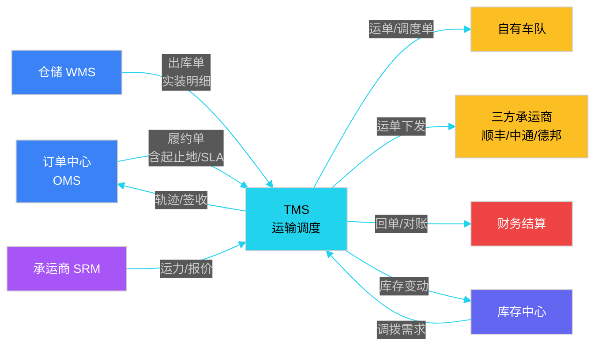

**核心定位**：
- 输入：**履约单 + 库存 + 承运商运力 + 约束（SLA/成本/车型）**
- 输出：**调度方案 + 运单 + 在途轨迹 + 运费账单**
- 关键决策：**谁来运、走哪条路、装什么车、什么时候出发、多少钱**

### 8.1.2 TMS 业务边界

| 维度 | TMS 职责 | 不在 TMS 职责 |
|------|---------|---------------|
| 订单 | 接 OMS 的履约单，转化为运单 | 订单创建、支付、退款 |
| 库存 | 在途库存预占、签收核减 | 物理库存管理、库内作业 |
| 仓储 | 接收出库指令、预约到仓 | 上架、拣货、盘点 |
| 承运 | 调度、轨迹、签收、对账 | 采购、招标、付款 |
| 财务 | 运费账单生成、三单匹配 | 应收应付记账 |
| 末端 | 与 DMS 交接 | 众包抢单、即时配送 |

---

## 8.2 运输网络模型

运输网络是 TMS 的**底层数据模型**，所有调度算法的输入都依赖它。理解网络模型是理解后续 VRP、装箱、运费的前提。

### 8.2.1 网络节点与边

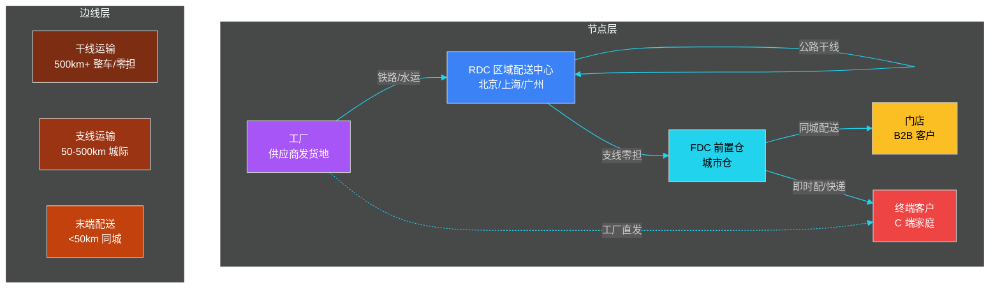

**节点分类**：

| 节点类型 | 缩写 | 典型规模 | 进出货特征 |
|---------|------|---------|-----------|
| 工厂 | PLANT | 数十个 | 纯发出 |
| 中心仓 | CDC | 10-30 个 | 中转型 |
| 区域配送中心 | RDC | 30-100 个 | 中转型 |
| 前置仓/城市仓 | FDC | 数百个 | 中转 + 终端 |
| 门店 | STORE | 数千个 | 纯收货 |
| 终端客户 | CUSTOMER | 百万级 | 纯收货 |
| 港口/机场/铁路站 | HUB | 数十个 | 中转节点 |

### 8.2.2 干支线层级

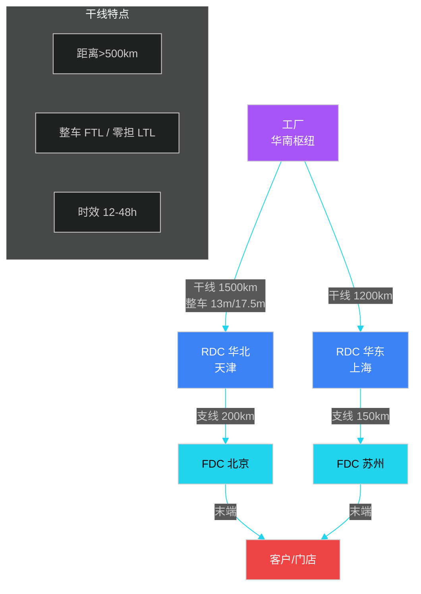

| 层级 | 距离 | 车型 | 装载率 | 时效 | 优化目标 |
|------|------|------|--------|------|---------|
| **干线** | >500km | 13m/17.5m 整车 | 85%+ | 12-48h | 满载率 + 时效 |
| **支线** | 50-500km | 9.6m/12.5m 整车、零担 | 70%+ | 4-12h | 时效 + 成本 |
| **末端** | <50km | 4.2m 面包车、电动车 | 60%+ | 2-4h | 灵活 + 体验 |

### 8.2.3 多式联运

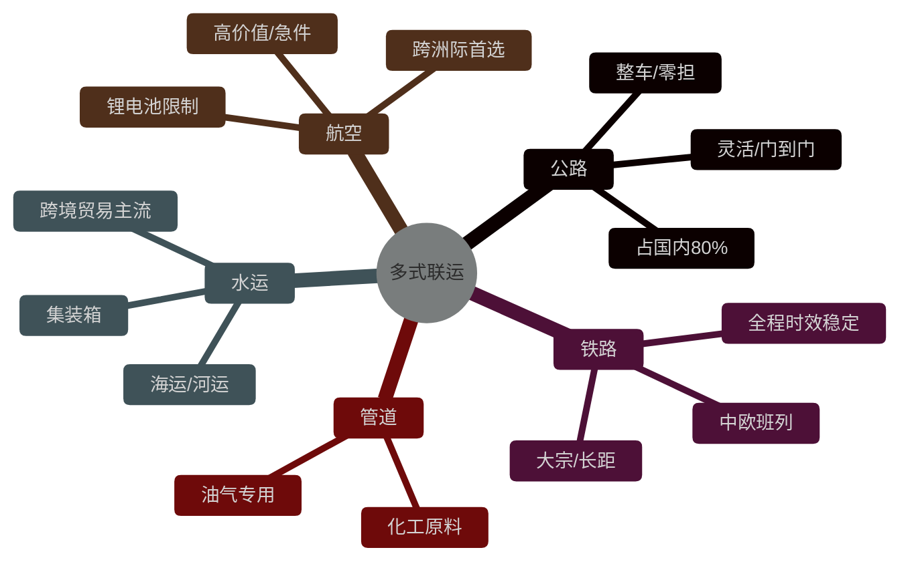

| 运输方式 | 速度 | 成本 | 适用场景 | 限制 |
|---------|------|------|---------|------|
| 公路 | 中 | 中 | 中短距、门到门 | 天气、油价、过路费 |
| 铁路 | 中 | 低 | 大宗、长距、时效稳定 | 站点固定、装卸慢 |
| 水运 | 慢 | 极低 | 大宗、跨境、不急 | 周期 15-30 天 |
| 航空 | 极快 | 极高 | 高价值、生鲜、紧急 | 危险品限制 |
| 管道 | 持续 | 低 | 油气、化工 | 仅限特定品类 |

---

## 8.3 调度算法

调度是 TMS 的**核心大脑**。给定一批订单 + 一批车辆 + 一组约束，求**最优装载和路径方案**。本质是**组合优化**问题。

### 8.3.1 VRP 问题族谱

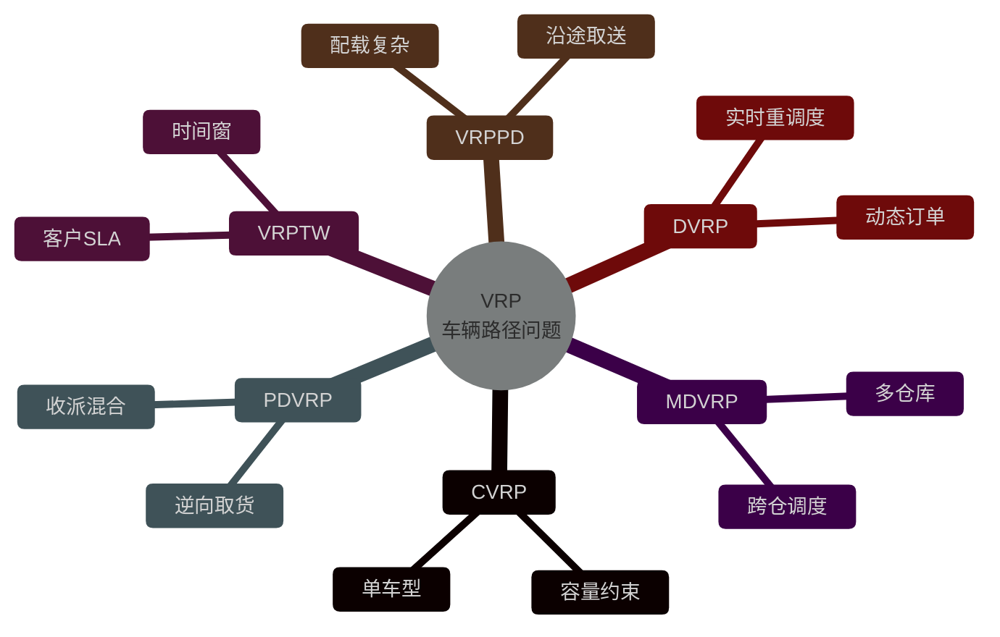

| 变体 | 全称 | 核心约束 | 实际场景 |
|------|------|---------|---------|
| **CVRP** | Capacitated VRP | 车辆容量 | 单车型满载配送 |
| **VRPTW** | VRP with Time Windows | 时间窗 | 即时配、ToB 定时达 |
| **PDVRP** | Pickup and Delivery VRP | 边收边送 | 末端取件+派件 |
| **DVRP** | Dynamic VRP | 动态订单 | 实时下单、动态改派 |
| **MDVRP** | Multi-Depot VRP | 多仓库 | 跨 RDC 调拨 |
| **OVRP** | Open VRP | 不要求回仓 | 跨城干线 |

### 8.3.2 VRP 求解（贪心 + 局部搜索）

下面是一段**生产可用**的简化版 VRP 求解伪代码，结合**贪心构造**和 **2-opt 局部搜索**：

```python
# ============ VRP 求解器（贪心 + 2-opt 局部搜索）============
# 输入：订单列表 + 车辆列表 + 距离矩阵
# 输出：每个车辆的路径方案

from dataclasses import dataclass
from typing import List, Tuple
import random

@dataclass
class Order:
    order_id: str
    pickup_lon: float
    pickup_lat: float
    dropoff_lon: float
    dropoff_lat: float
    weight: float          # 重量（kg）
    volume: float          # 体积（m^3）
    time_window: Tuple[int, int]  # 时间窗（分钟）

@dataclass
class Vehicle:
    vehicle_id: str
    capacity_weight: float
    capacity_volume: float
    start_lon: float
    start_lat: float

@dataclass
class Route:
    vehicle: Vehicle
    orders: List[Order]
    total_distance: float
    total_load: float


def haversine(lon1, lat1, lon2, lat2) -> float:
    """球面距离（km）"""
    ...

def greedy_construct(orders: List[Order], vehicles: List[Vehicle]) -> List[Route]:
    """贪心构造：按距离最近原则分配订单到车辆"""
    routes = [Route(v, [], 0, 0) for v in vehicles]
    unassigned = orders.copy()

    for order in sorted(unassigned, key=lambda o: o.time_window[0]):  # 按时效优先
        best_route = None
        best_cost = float('inf')

        for route in routes:
            # 约束检查
            if route.total_load + order.weight > route.vehicle.capacity_weight:
                continue
            if any(o.volume + route.total_load > route.vehicle.capacity_volume
                   for o in route.orders):
                continue
            # 成本 = 插入位置后增加的里程
            insert_cost = compute_insert_cost(route, order)
            if insert_cost < best_cost:
                best_cost = insert_cost
                best_route = route

        if best_route:
            best_route.orders.append(order)
            best_route.total_load += order.weight
            best_route.total_distance += best_cost

    return routes


def two_opt(routes: List[Route]) -> List[Route]:
    """2-opt 局部搜索：反转路径片段减少交叉"""
    improved = True
    while improved:
        improved = False
        for route in routes:
            if len(route.orders) < 4:
                continue
            for i in range(1, len(route.orders) - 2):
                for j in range(i + 1, len(route.orders)):
                    # 反转 i..j 段
                    new_orders = route.orders[:i] + route.orders[i:j+1][::-1] + route.orders[j+1:]
                    new_distance = compute_total_distance(new_orders)
                    if new_distance < route.total_distance:
                        route.orders = new_orders
                        route.total_distance = new_distance
                        improved = True
    return routes


def solve_vrp(orders, vehicles, max_iter=100):
    routes = greedy_construct(orders, vehicles)
    for _ in range(max_iter):
        routes = two_opt(routes)
    return routes
```

**算法对比**：

| 算法 | 实现难度 | 求解质量 | 求解速度 | 适用规模 |
|------|---------|---------|---------|---------|
| 贪心 | 低 | 差 | 极快 | >10000 单 |
| 2-opt / 3-opt | 中 | 中 | 快 | 100-1000 单 |
| 禁忌搜索（TS） | 中 | 中上 | 中 | 100-1000 单 |
| 模拟退火（SA） | 中 | 中上 | 中 | 100-1000 单 |
| 遗传算法（GA） | 高 | 好 | 慢 | 100-500 单 |
| 蚁群（ACO） | 高 | 好 | 慢 | 100-500 单 |
| ALNS | 高 | 优 | 慢 | 100-500 单 |
| OR-Tools | 低（开箱） | 优 | 快 | 1000+ 单 |

### 8.3.3 调度决策流程

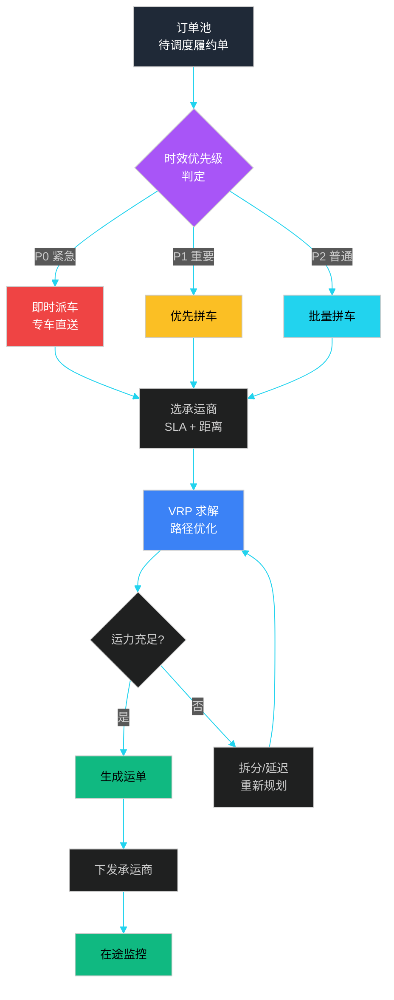

---

## 8.4 承运商管理

承运商是 TMS 的"运力来源"。**自营 + 三方**混合模式下，承运商的**准入、分级、绩效、招投标**是降本增效的关键。

### 8.4.1 承运商生命周期

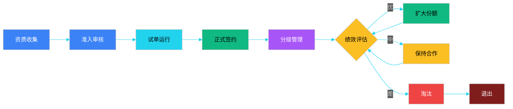

### 8.4.2 承运商分级模型

| 等级 | 月单量 | 考核要求 | 账期 | 议价权 |
|------|--------|---------|------|--------|
| **S 级（战略）** | > 1 万单 | 95% 准点、0 投诉 | 月结 30 天 | 最高 |
| **A 级（核心）** | 5000-1 万 | 90% 准点、<0.5% 投诉 | 月结 45 天 | 较高 |
| **B 级（合作）** | 1000-5000 | 85% 准点 | 月结 60 天 | 一般 |
| **C 级（备选）** | < 1000 | 无强制考核 | 现结 | 低 |
| **D 级（淘汰）** | - | 连续 3 月不达标 | - | - |

**绩效公式**：
```
承运商绩效分 = 0.4 × 准点率 + 0.3 × 签收率 + 0.15 × 货损率
              + 0.1 × 服务响应 + 0.05 × 价格优势
```

### 8.4.3 主流承运商对比

| 维度 | 顺丰 | 中通 | 德邦 | 京东物流 | 安能 |
|------|------|------|------|---------|------|
| **定位** | 高端时效 | 电商快递 | 大件零担 | 一体化自营 | 中端零担 |
| **时效** | 次日达 / 隔日 | 2-3 日 | 2-3 日 | 次日达 | 3-5 日 |
| **单价（元/kg）** | 8-15 | 3-6 | 4-8 | 自营定价 | 2-5 |
| **网络** | 100% 覆盖 | 乡镇级 | 地县级 | 自营网络 | 县市级 |
| **大件能力** | 中 | 弱 | 强 | 强 | 强 |
| **签收验证** | 拍照+签收码 | 驿站/柜 | 签收单 | 拍照+GPS | 签收单 |
| **API 能力** | 完善 | 完善 | 完善 | 内部直连 | 完善 |
| **赔付** | 足额 | 限重 | 足额 | 足额 | 限重 |
| **适合场景** | 高价值/急件 | 电商标品 | 大件家电 | 自营履约 | 中小客户 |

### 8.4.4 招投标与定价

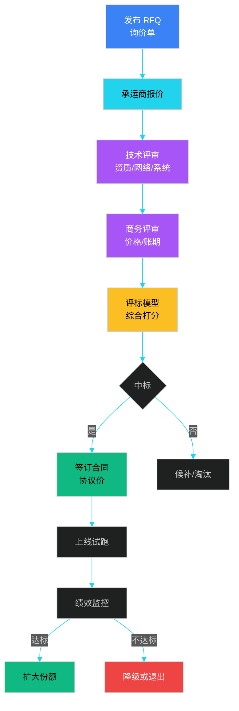

**评标模型**：
```
总分 = 0.3 × 历史绩效 + 0.25 × 网络覆盖 + 0.25 × 报价水平
     + 0.1 × 账期 + 0.05 × 系统能力 + 0.05 × 应急能力
```

### 8.4.5 货主 vs 承运商 API 边界

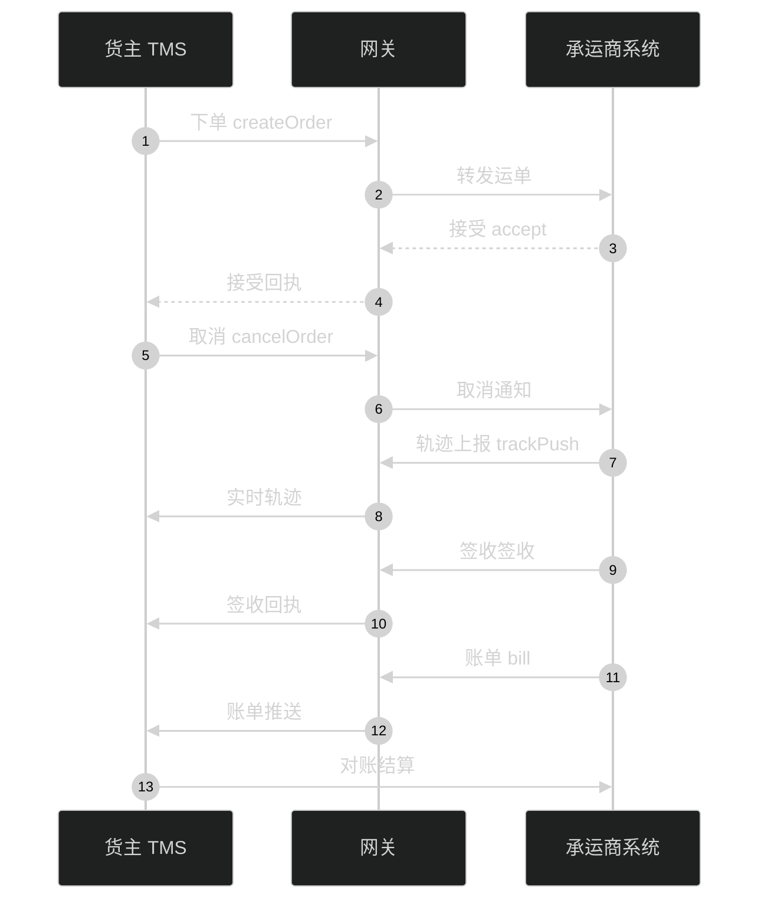

| API | 货主调用 | 承运商调用 | 协议 |
|-----|---------|-----------|------|
| 下单 | 创建运单 | - | REST/HTTPS |
| 取消 | 发起取消 | 接受取消 | REST |
| 轨迹 | 查询 | 推送 | WebSocket/MQ |
| 签收 | 查询 | 推送 | REST + 回调 |
| 账单 | 查询 | 推送 | 异步消息 |
| 结算 | 发起对账 | 确认账单 | 月批文件 |

---

## 8.5 车辆配载与装箱

给定一组货品和一辆车，**怎么装最满、最稳、最快**？这是经典的 **3D Bin Packing Problem（3D-BPP）**。

### 8.5.1 配载规则优先级

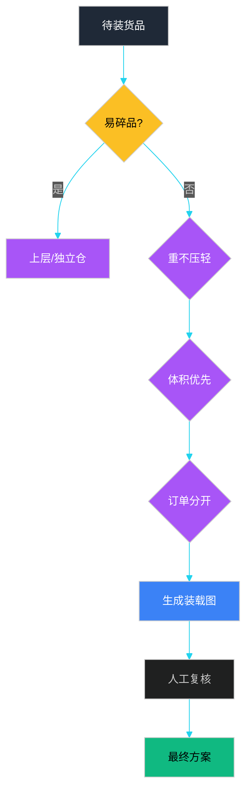

### 8.5.2 配载规则一览

| 规则 | 优先级 | 约束 | 行业经验 |
|------|--------|------|---------|
| **重量不超载** | P0 | 总重 ≤ 车辆核定载重 | 满载率 85% 安全上限 |
| **体积不超方** | P0 | 总体积 ≤ 车厢容积 | 泡货按方计、重货按重计 |
| **易碎品保护** | P1 | 上层/独立位/防压标识 | 玻璃/陶瓷/电子 |
| **重不压轻** | P1 | 重货在下、轻货在上 | 防压损、防倒塌 |
| **大不压小** | P1 | 大件在外、小件在内 | 提升装卸效率 |
| **危险品隔离** | P0 | 单独仓位、远离人群 | 电池/化学品 |
| **同一订单相邻** | P2 | 减少分拣 | B2B 整车 |
| **配送顺序反向** | P2 | 末端先卸 | 减少翻找 |

### 8.5.3 3D 装箱算法（贪心 + 碰撞检测）

```python
# ============ 3D 装箱（贪心 + 碰撞检测）============
# 输入：货品列表 + 车厢尺寸
# 输出：每个货品的 (x, y, z) 放置位置

from dataclasses import dataclass
from typing import List, Optional, Tuple

@dataclass
class Box:
    sku: str
    length: float  # 长 (m)
    width: float   # 宽 (m)
    height: float  # 高 (m)
    weight: float  # 重量 (kg)
    fragile: bool = False

@dataclass
class Placement:
    box: Box
    x: float
    y: float
    z: float
    rotated: bool = False  # 是否旋转 90 度

@dataclass
class Container:
    length: float
    width: float
    height: float
    max_weight: float


def check_collision(p1: Placement, p2: Placement) -> bool:
    """检查两个箱子是否重叠"""
    return not (
        p1.x + p1.box.length <= p2.x or
        p2.x + p2.box.length <= p1.x or
        p1.y + p1.box.width <= p2.y or
        p2.y + p2.box.width <= p1.y or
        p1.z + p1.box.height <= p2.z or
        p2.z + p2.box.height <= p1.z
    )


def extreme_point(placed: List[Placement], container: Container) -> List[Tuple[float, float, float]]:
    """计算当前已放置箱子产生的极限点（候选位置）"""
    points = [(0, 0, 0)]
    for p in placed:
        # 货箱右后上角
        points.append((p.x + p.box.length, p.y, p.z))
        points.append((p.x, p.y + p.box.width, p.z))
        points.append((p.x, p.y, p.z + p.box.height))
    return points


def try_place(box: Box, x, y, z, placed, container, rotate=False) -> Optional[Placement]:
    """尝试放置一个箱子"""
    l, w, h = (box.length, box.width, box.height)
    if rotate:
        l, w = w, l

    # 边界检查
    if x + l > container.length or y + w > container.width or z + h > container.height:
        return None

    candidate = Placement(box, x, y, z, rotate)

    # 碰撞检查
    for p in placed:
        if check_collision(candidate, p):
            return None

    # 支撑检查（重货在下）
    if not box.fragile and z > 0:
        # 必须有底面支撑
        supported = False
        for p in placed:
            if (abs(z - (p.z + p.box.height)) < 0.01):
                # 水平投影有交集
                if not (x + l <= p.x or p.x + p.box.length <= x or
                        y + w <= p.y or p.y + p.box.width <= y):
                    supported = True
                    break
        if not supported:
            return None

    return candidate


def pack_3d(boxes: List[Box], container: Container) -> List[Placement]:
    """贪心装箱：按体积降序，尝试每个极限点"""
    placed = []
    boxes_sorted = sorted(boxes, key=lambda b: b.length * b.width * b.height, reverse=True)

    current_weight = 0
    for box in boxes_sorted:
        if current_weight + box.weight > container.max_weight:
            continue

        # 尝试不放和放两种旋转
        best = None
        for point in extreme_point(placed, container):
            for rotate in [False, True]:
                p = try_place(box, *point, placed, container, rotate)
                if p is None:
                    continue
                # 评分：低 + 靠前 + 靠角落
                score = p.z * 1000 + p.y * 100 + p.x
                if best is None or score < best[0]:
                    best = (score, p)

        if best:
            placed.append(best[1])
            current_weight += box.weight

    return placed
```

**装载率指标**：
```
体积装载率 = 已装体积 / 车厢容积 × 100%
重量装载率 = 已装重量 / 核定载重 × 100%
综合装载率 = min(体积装载率 × 0.6, 重量装载率 × 0.4) × 100%
```

### 8.5.4 配载常见问题与对策

| 问题 | 原因 | 对策 |
|------|------|------|
| 泡货压方 | 体积装满、重量没满 | 按方计费，引入计泡系数 |
| 抛货压重 | 重量装满、体积没满 | 拆分混装、多 SKU 拼车 |
| 装不下 | 体积超方 | 拆分多车 + 部分留仓 |
| 装得不稳 | 重货在上 | 严格按"重下轻上"规则 |
| 易碎品破损 | 货箱挤压 | 上层 + 缓冲物 + 标识 |
| 卸货慢 | 同订单分散 | 按订单号聚簇放置 |

---

## 8.6 在途跟踪

在途跟踪是 TMS **从计划走向现实**的关键环节。通过 IoT 设备实时回传位置，系统可以**主动预警、主动干预**。

### 8.6.1 跟踪技术栈

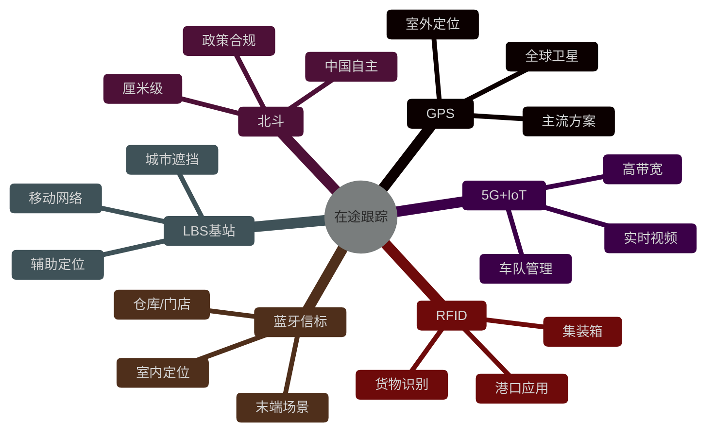

| 技术 | 精度 | 适用 | 成本 | 限制 |
|------|------|------|------|------|
| **GPS** | 5-10m | 室外 | 低 | 室内失效 |
| **北斗** | 2-5m | 室外 | 中 | 政策强制 |
| **基站 LBS** | 50-200m | 城市 | 极低 | 精度低 |
| **蓝牙信标** | 1-3m | 室内 | 中 | 需布点 |
| **5G+视频** | 实时画面 | 高价值 | 高 | 流量大 |
| **RFID** | 识别 | 货物 | 中 | 距离短 |

### 8.6.2 轨迹上报与异常预警

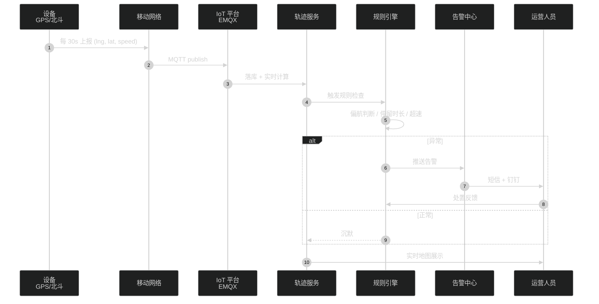

### 8.6.3 轨迹处理（流式聚合 + 异常检测）

```java
// ============ 轨迹处理（实时 + 异常检测）============
@Service
public class TrackService {

    @Autowired private RedisTemplate<String, TrackPoint> redis;
    @Autowired private RuleEngine ruleEngine;
    @Autowired private AlertService alertService;

    /**
     * 接收单条轨迹点（Flink/Kafka 流式入口也可）
     */
    public void onTrackPoint(TrackPoint point) {
        String key = "track:" + point.getShipmentId();
        TrackPoint last = redis.opsForValue().get(key);

        // 1. 基础校验
        if (point.getSpeed() != null && point.getSpeed() > 180) {
            alertService.push(point.getShipmentId(), "SPEED_OVER", point);
        }

        // 2. 偏航检测：与规划路径偏差 > 5km
        if (last != null) {
            double distance = GeoUtil.haversine(
                point.getLng(), point.getLat(),
                last.getLng(), last.getLat()
            );
            double timeGap = (point.getTs() - last.getTs()) / 1000.0;  // 秒
            double instantSpeed = distance / timeGap * 3.6;  // km/h

            if (instantSpeed > 200) {  // 瞬时速度异常
                alertService.push(point.getShipmentId(), "SPEED_INSTANT", point);
            }

            // 停留检测：30 分钟内位移 < 100m
            if (timeGap > 1800 && distance < 0.1) {
                alertService.push(point.getShipmentId(), "STAY_LONG", point);
            }
        }

        // 3. 状态机推进
        WaybillState newState = computeState(point);
        waybillStateMachine.fire(point.getShipmentId(), newState);

        // 4. 缓存最新点
        redis.opsForValue().set(key, point, Duration.ofHours(72));
    }

    /**
     * 电子围栏检测：进入/离开指定区域
     */
    public void checkFence(TrackPoint point, List<GeoFence> fences) {
        for (GeoFence fence : fences) {
            boolean inside = GeoUtil.pointInPolygon(
                point.getLng(), point.getLat(), fence.getPolygon()
            );
            Boolean wasInside = redis.opsForSet()
                .isMember("fence:" + point.getShipmentId(), fence.getId());

            if (inside && !Boolean.TRUE.equals(wasInside)) {
                alertService.push(point.getShipmentId(), "FENCE_IN", fence);
                redis.opsForSet().add("fence:" + point.getShipmentId(), fence.getId());
            } else if (!inside && Boolean.TRUE.equals(wasInside)) {
                alertService.push(point.getShipmentId(), "FENCE_OUT", fence);
                redis.opsForSet().remove("fence:" + point.getShipmentId(), fence.getId());
            }
        }
    }
}
```

### 8.6.4 电子围栏

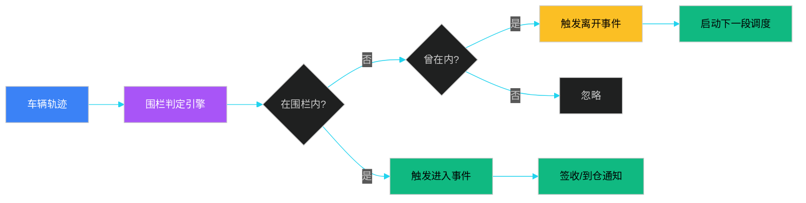

| 围栏类型 | 场景 | 触发动作 |
|---------|------|---------|
| **到货围栏** | 收货地 500m | 自动签收通知 |
| **禁行围栏** | 限行路段 | 偏航告警 |
| **服务区围栏** | 高速服务区 | 强制休息提示 |
| **温区围栏** | 冷链指定温度 | 温度异常告警 |
| **到仓围栏** | 仓库园区 | 预约入库、释放运力 |

### 8.6.5 签收验证

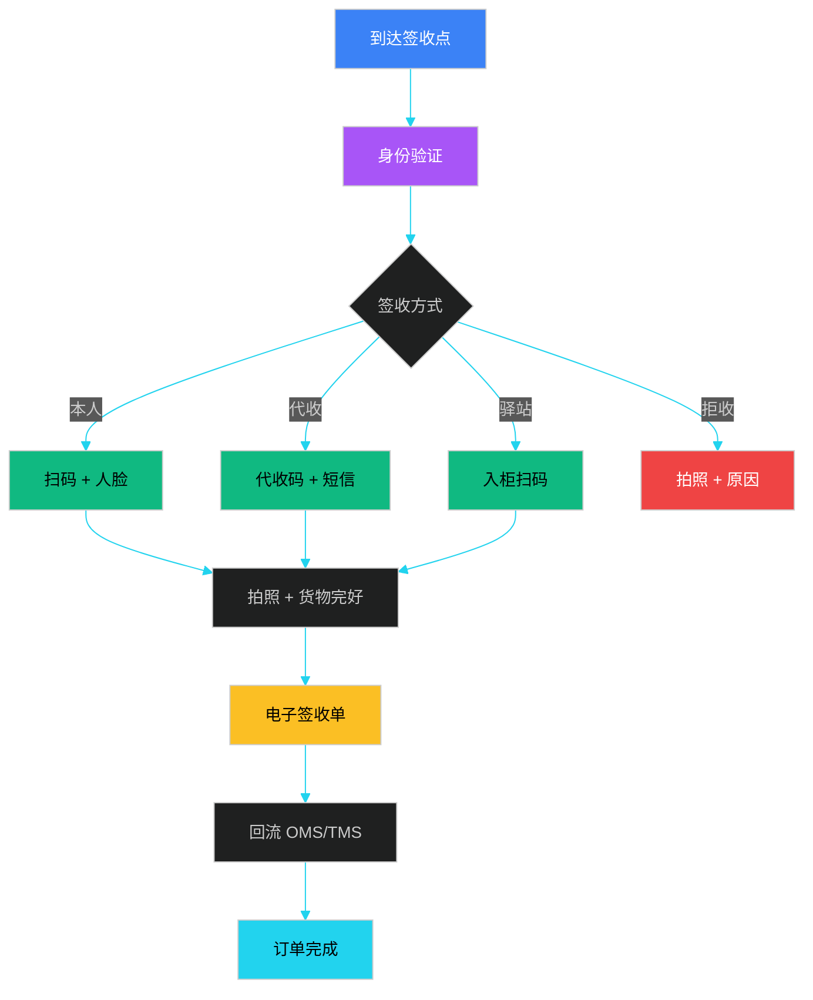

---

## 8.7 运费计算

运费是 TMS **最敏感、最复杂**的模块。**多维度、多承运商、多计费规则**导致一个系统能"算准运费"已经是行业里不小的门槛。

### 8.7.1 计费维度矩阵

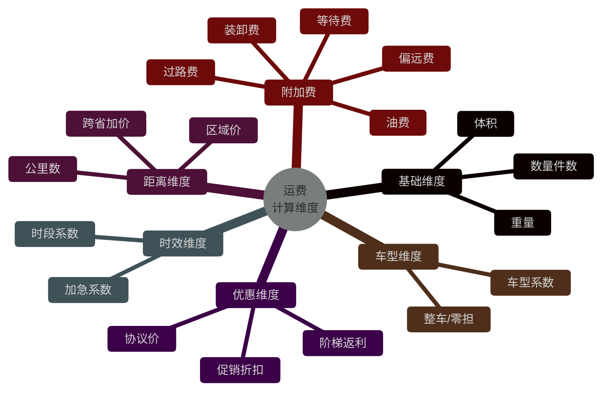

### 8.7.2 运费计算引擎

下面是一段生产可用的**运费计算引擎**伪代码，采用**规则链 + 策略模式**：

```java
// ============ 运费计算引擎 ==========
@Service
public class FreightCalculator {

    @Autowired private List<FreightRule> rules;     // 规则链
    @Autowired private CarrierRepository carriers;  // 承运商报价
    @Autowired private DistanceService distanceSvc; // 距离服务

    /**
     * 计算运费（支持多承运商比价）
     */
    public List<FreightQuote> quote(FreightRequest req) {
        List<FreightQuote> quotes = new ArrayList<>();
        List<Carrier> candidates = carriers.findAvailable(
            req.getOrigin(), req.getDestination(), req.getExpectedTime()
        );

        for (Carrier carrier : candidates) {
            FreightQuote quote = calculateOne(req, carrier);
            quotes.add(quote);
        }
        // 按价格升序
        quotes.sort(Comparator.comparing(FreightQuote::getAmount));
        return quotes;
    }

    private FreightQuote calculateOne(FreightRequest req, Carrier carrier) {
        Money baseFee = Money.ZERO;

        // 1. 基础运费（重量或体积取大）
        BigDecimal weight = req.getTotalWeight();
        BigDecimal volume = req.getTotalVolume();
        BigDecimal billableWeight = volume
            .multiply(new BigDecimal("200"))  // 1 m^3 = 200kg 计泡系数
            .max(weight);

        Money weightFee = carrier.getRateCard().priceByWeight(billableWeight);

        // 2. 距离附加
        double km = distanceSvc.haversine(
            req.getOrigin(), req.getDestination()
        );
        Money distanceFee = carrier.getRateCard().priceByDistance(km);

        // 3. 时效加价
        Money timeFee = Money.ZERO;
        if (req.getServiceLevel() == ServiceLevel.EXPRESS) {
            timeFee = weightFee.multiply(new BigDecimal("0.5"));  // 加急 50%
        }

        // 4. 附加费（油费/过路费/装卸）
        Money surcharge = Money.ZERO;
        surcharge = surcharge.add(carrier.getFuelSurcharge(km));
        surcharge = surcharge.add(carrier.getTollFee(km));
        if (req.isLoadingRequired()) {
            surcharge = surcharge.add(carrier.getLoadingFee());
        }
        if (req.getWaitingMinutes() > 60) {
            surcharge = surcharge.add(
                carrier.getWaitingFee()
                    .multiply(new BigDecimal(req.getWaitingMinutes() - 60))
            );
        }

        // 5. 优惠（阶梯价/协议价）
        Money discount = Money.ZERO;
        FreightAgreement agreement = carrier.findAgreement(req.getCustomerId());
        if (agreement != null && agreement.isMatch(req)) {
            discount = agreement.applyDiscount(weightFee);
        }

        // 6. 累计
        Money total = weightFee
            .add(distanceFee)
            .add(timeFee)
            .add(surcharge)
            .subtract(discount)
            .min(carrier.getMinCharge());  // 最低收费

        return FreightQuote.builder()
            .carrier(carrier)
            .amount(total)
            .breakdown(new Breakdown(weightFee, distanceFee, timeFee, surcharge, discount))
            .build();
    }
}
```

### 8.7.3 报价模型对比

| 模型 | 公式 | 适用 | 优点 | 缺点 |
|------|------|------|------|------|
| **阶梯价** | 按重量分档定价 | 标品快递 | 简单可预测 | 大客户议价不灵活 |
| **协议价** | 客户专属合同价 | 大客户 KA | 灵活可控 | 合同管理复杂 |
| **市场价** | 随行就市浮动 | 临时客户 | 公平 | 波动大、客户接受度低 |
| **一口价** | 固定价格 | 促销活动 | 简单 | 亏损风险 |
| **成本加成** | 成本 + 利润率 | 自营 | 利润可控 | 客户比价困难 |
| **竞价模式** | 承运商竞标 | 大宗运输 | 成本最优 | 关系管理差 |

### 8.7.4 计费规则优先级

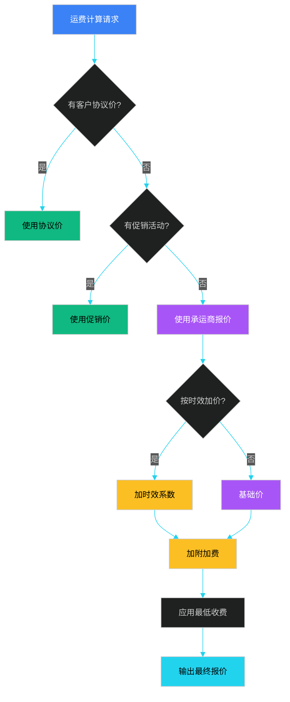

### 8.7.5 油费/过路费联动

```python
# ============ 油费/过路费联动（动态成本）============
# 油费随油价浮动、过路费随路径浮动

def compute_fuel_surcharge(base_price, oil_price, threshold=8.0):
    """
    油费联动公式：
    surcharge = max(0, (oil_price - threshold) / threshold) × base_price × 0.15
    """
    if oil_price <= threshold:
        return 0
    delta = (oil_price - threshold) / threshold
    return base_price * delta * 0.15


def compute_toll_fee(route_waypoints, toll_db):
    """
    过路费查询：按路径途经高速收费站求和
    """
    total = 0
    for segment in split_by_highway(route_waypoints):
        toll = toll_db.lookup(segment['highway_id'], segment['entry'], segment['exit'])
        total += toll['amount'] * toll['vehicle_class_coefficient']
    return total
```

| 油价区间 | 油费系数 | 示例：100 元基础运费 |
|---------|---------|---------------------|
| < 7 元/L | 0% | 0 |
| 7-8 元/L | 5% | 5 |
| 8-9 元/L | 10% | 10 |
| 9-10 元/L | 15% | 15 |
| > 10 元/L | 20% | 20 |

---

## 本章小结

TMS 是供应链"执行中枢"，承接 OMS 的履约单、WMS 的出库、承运商的运力，向下交付"按时、按价、按质"的运输服务。**七大模块**职责分明：

1. **TMS 业务位置**：上游接 OMS/WMS，下游接承运商，输出运单 + 轨迹 + 运费账单。
2. **运输网络模型**：节点（工厂→RDC→FDC→客户）+ 边（干支线层级）+ 多式联运（公铁水空）。
3. **调度算法**：VRP 问题族谱（CVRP/VRPTW/PDVRP/DVRP），生产环境多用**贪心+2-opt**，离线求解用 **OR-Tools**。
4. **承运商管理**：全生命周期（准入→签约→分级→绩效→淘汰），S/A/B/C/D 分级模型 + 招投标 + 货主承运商 API 边界。
5. **车辆配载与装箱**：3D-BPP（贪心+碰撞检测+支撑检查），装载率、混装、易碎品是核心约束。
6. **在途跟踪**：GPS/北斗/LBS/5G 多技术融合，流式轨迹 + 电子围栏 + 异常检测 + 签收验证。
7. **运费计算**：多维度（重量/体积/距离/时效/车型）+ 多附加费（油费/过路费/等待）+ 多报价模型（阶梯/协议/市场/竞价），规则链 + 策略模式实现。

**关键设计原则**：
- **业务复杂，技术克制**：VRP、3D-BPP 用现成库（OR-Tools、CP-SAT），不要自己造轮子
- **实时与离线分离**：调度计算离线（小时级），状态推送实时（秒级）
- **数据驱动决策**：通过历史运单数据训练调度策略，不断迭代
- **承运商 + 自营混合**：运力峰谷弹性，多承运商比价降本

---

## 面试高频问题

**1. TMS 在供应链中的定位是什么？与 OMS、WMS、DMS 怎么协作？**

参考答案要点：TMS 是运输执行中枢，上游接 OMS 的履约单（带起止地、SLA、品类），接收 WMS 的出库通知（实装件数、体积重量），向下派单给承运商或自营车队，回收轨迹、签收、运费。**OMS 决定"运什么"，WMS 决定"装什么"，TMS 决定"怎么运"，DMS 决定"最后一公里"**。TMS 状态（已派车/在途/签收）回写 OMS 推进订单履约状态。

**2. VRP 问题有哪些变体？生产环境用什么算法？**

参考答案要点：VRP 变体包括 CVRP（容量约束）、VRPTW（时间窗）、PDVRP（收派混合）、DVRP（动态订单）、MDVRP（多仓库）、OVRP（开放路径）。生产环境通常分两层：①离线批量调度用**贪心+2-opt/3-opt**或**OR-Tools/CP-SAT**求解，1-1000 单可在分钟级得到近似最优解；②在线动态调度用**规则引擎 + 简单启发式**（最近邻、就近分配），毫秒级响应。**禁忌搜索、模拟退火、GA、ALNS** 用于离线优化场景。

**3. 车辆配载和 3D 装箱怎么实现？**

参考答案要点：本质是 3D Bin Packing Problem。算法上用**贪心 + 碰撞检测 + 支撑检查**生成放置方案：①按体积降序排列货品；②为每个货品尝试所有"极限点"（已放箱子右/后/上角）；③检查边界、碰撞、支撑（重货在下）；④评分选最低+最靠角落位置。生产中可借助 **Google OR-Tools** 的 BPP 模块，或 **AnyLogic/FlexSim** 仿真。**易碎品、重不压轻、危险品隔离**是 P0 约束。

**4. 在途跟踪的核心技术栈和异常检测怎么做？**

参考答案要点：技术栈：GPS/北斗（室外，精度 5-10m）、基站 LBS（城市遮挡辅助）、蓝牙信标（室内末端）、5G+视频（高价值货物）。异常检测维度：①**超速**（>120km/h）、**瞬时速度异常**（设备漂移）；②**停留**（30 分钟位移 < 100m）；③**偏航**（与规划路径偏差 > 5km）；④**电子围栏进出**（到货围栏、禁行围栏、温区围栏）；⑤**温湿度异常**（冷链）。系统架构：设备 → MQTT → IoT 平台 → 规则引擎 → 告警中心 → 运营人员。

**5. 运费计算引擎怎么设计？支持多承运商比价怎么实现？**

参考答案要点：采用**规则链 + 策略模式**设计：①输入参数归一化（重量/体积/距离/时效/车型）；②按优先级匹配规则：客户协议价 > 促销活动价 > 承运商标准价；③基础运费 = max(重量, 体积×计泡系数) × 单价；④加距离/时效/附加费（油费/过路费/等待/装卸）；⑤扣优惠（阶梯返利）；⑥取 max(计算结果, 最低收费)。**多承运商比价**：对每个可用承运商独立调用计算流程，输出报价清单排序即可。**油费联动**采用阈值分段系数，**过路费**按高速分段查询。

**6. 承运商分级模型怎么设计？绩效如何评估？**

参考答案要点：分级维度：单量、准点率、签收率、货损率、服务响应。常用五级模型 S/A/B/C/D（S 级为战略合作，月单量 > 1 万，95% 准点、0 投诉、月结 30 天）。**绩效公式**：0.4×准点率 + 0.3×签收率 + 0.15×货损率 + 0.1×服务响应 + 0.05×价格优势。**末位淘汰**：连续 3 月绩效分 < 60 分降级，连续 6 月 < 60 分淘汰。**招投标评标**：0.3×历史绩效 + 0.25×网络覆盖 + 0.25×报价水平 + 0.1×账期 + 0.05×系统能力 + 0.05×应急能力。

**7. 多式联运在 TMS 中如何体现？公铁海空怎么统一调度？**

参考答案要点：TMS 需要**抽象统一的运输方式层**：① 抽象运力（Train/Flight/Vessel/Truck），每个运力有不同属性（容量、班期、起止港）；② 公铁联运（如"公路短驳 + 铁路干线 + 公路配送"）需要解决"两段衔接"的时刻表协同；③ 跨境联运涉及海关、报关、换单，需要在运单上挂"关务状态"；④ 系统设计要点：运单分段（一个 master 运单 + 多个 house 段）、统一时刻表、统一签收与异常处理。**跨境电商（亚马逊 FBA、SHEIN）的多式联运尤其复杂**，需要"航空干线 + 末端卡车"的高时效组合。

**8. 什么是"控制塔"？TMS 怎么为控制塔提供数据？**

参考答案要点：**控制塔（Control Tower）**是供应链的"驾驶舱"，提供全链路可视化、异常预警、决策辅助。TMS 给控制塔提供：①**实时数据**：在途车辆位置（GPS/北斗）、预计到达时间（ETA）、签收状态、异常告警；②**历史数据**：履约时效、SLA 达成率、运费成本、承运商绩效；③**预测数据**：基于历史和实时计算的 ETA、风险点；④**决策辅助**：异常自动改派建议、备选承运商推荐、运力调度方案。技术上，控制塔通过**Kafka 订阅** TMS 的业务事件流（运单创建、装车、在途、签收），通过**Grafana/Flink** 实时大屏展示。
