# 第 9 章 末端配送与最后一公里

> 本章定位：末端配送（Last Mile Delivery）是物流链条最贵、最重、最难规模化的一段。本章从"挑战 → 即时配送 → 众包 → 自提 → 调度算法 → 无人配送"6 个角度，系统拆解末端的业务模型、调度算法与系统设计。
>
> **核心一句话**：干线物流追求"满载率"，末端配送追求"密度"——只有订单密度足够高，末端才赚得到钱。

---

## 9.1 末端配送的挑战与机遇

### 9.1.1 为什么"最后一公里"最贵

末端配送（也叫"最后一公里"，Last Mile）是从配送站/前置仓/门店到消费者手中的最后一程。它的成本与挑战远超干线物流：

| 维度 | 干线运输（City to City） | 末端配送（站点 to 消费者） |
|------|-------------------------|---------------------------|
| 单次距离 | 300-2000 km | 0.5-5 km |
| 单票成本 | 0.3-1.5 元/票 | 3-12 元/票 |
| 占总成本 | 15%-25% | **40%-55%** |
| 时效要求 | 天级（T+1） | 分钟到小时级 |
| 单位车辆订单数 | 1 车 = 1000+ 票 | 1 人 = 30-80 票/天 |
| 路径优化 | 静态、点对点 | 动态、多点 |
| 决策频率 | 每日一次 | 每秒一次 |
| 失败成本 | 改派、退仓 | **二次配送 + 客诉** |

> 行业共识：末端配送的成本占整个物流总成本的 **50% 左右**，是物流降本增效最重要的战场。

### 9.1.2 末端配送的六大挑战

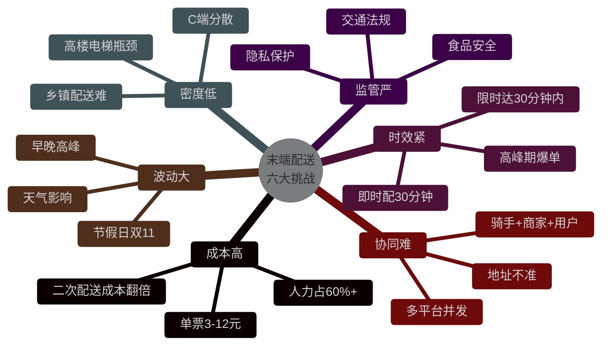

### 9.1.3 末端配送的市场机会

| 业态 | 时效 | 客单价 | 典型企业 | 配送形态 |
|------|------|--------|----------|----------|
| 外卖即时配 | 30 分钟 | 30-50 元 | 美团、饿了么 | 专送 + 众包 |
| 商超即时达 | 30-60 分钟 | 50-150 元 | 朴朴、小象超市、盒马 | 前置仓 + 专送 |
| 跑腿同城 | 1 小时 | 10-30 元服务费 | 闪送、UU 跑腿、达达 | 一对一直送 |
| 快递末端 | 1-3 天 | 8-15 元 | 三通一达、京东、顺丰 | 站点 + 驿站 |
| 限时电商 | 2-12 小时 | 100+ 元 | 京东到家、京东小时达 | DC + 前置仓 |
| 仓配一体 | 当日/次日 | 100+ 元 | 京东物流、菜鸟 | 仓 → 站点 → 自提/上门 |

**机会点**：

- **即时零售爆发**：2024 年中国即时零售市场规模突破 1 万亿，年增速 25%+；
- **下沉市场**：县乡级末端配送密度上升，菜鸟、京东持续下沉；
- **无人配送商业化**：北京、深圳、上海多城试点，2024 年起部分场景规模商用。

---

## 9.2 即时配送

### 9.2.1 业务全景

即时配送（On-demand Delivery）以"30 分钟送达"为典型 SLA，覆盖外卖、商超、跑腿等高频场景。代表平台：美团、饿了么、达达、顺丰同城。

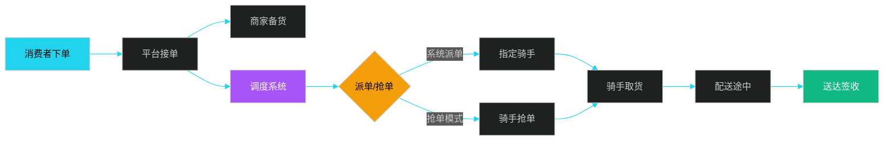

### 9.2.2 端到端时序图（以美团外卖为例）

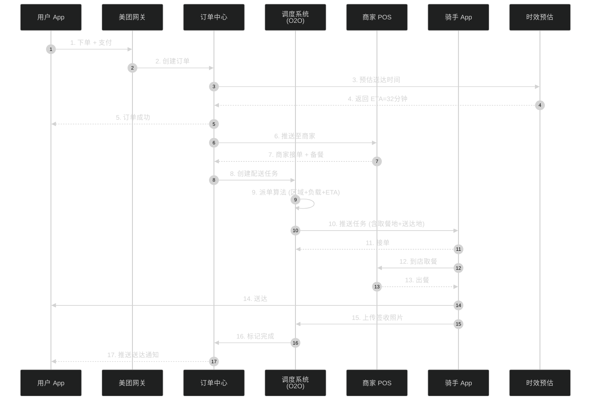

> **关键性能指标**：
>
> - **决策耗时**：派单算法 < 200ms（高峰期 50 万订单/分钟）
> - **取餐准时率**：> 95%（与商家备餐时长强相关）
> - **送达准时率**：> 92%（雨雪天降至 80%）

### 9.2.3 动态调度的三种模式

| 模式 | 特点 | 优点 | 缺点 | 典型场景 |
|------|------|------|------|----------|
| **抢单模式** | 推送多个骑手，先抢先得 | 骑手积极性高、决策快 | 离散度高、长距单无人接 | 闪送、UU 跑腿 |
| **派单模式** | 系统强制分配给指定骑手 | 全局最优、效率高 | 骑手感觉被剥夺 | 美团专送、饿了么蜂鸟 |
| **派 + 抢结合** | 难单系统派、易单允许抢 | 兼顾效率与公平 | 算法复杂 | 美团众包、达达 |

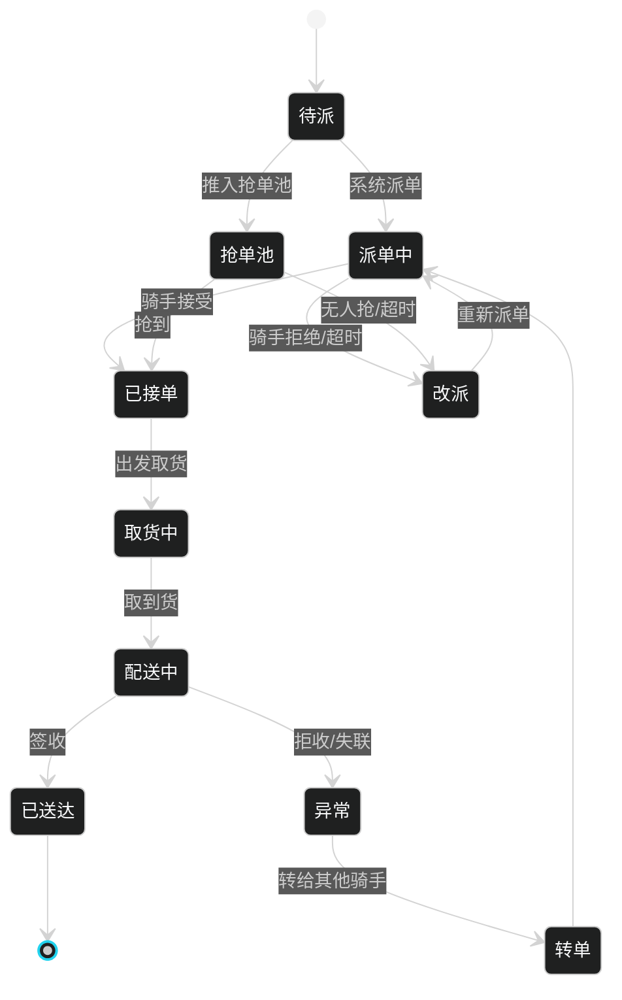

### 9.2.4 骑手画像与算法因子

**骑手画像维度**（影响派单决策）：

```
骑手 = {
    基础信息:    { 骑手ID, 类型(专送/众包), 注册时间, 实名认证 }
    实时位置:    { lat, lng, 速度, 朝向, 最近更新时间 }
    当前负载:    { 在手订单数, 已送达/未送达, 路径序列 }
    历史表现:    { 准时率, 投诉率, 评分, 异常率 }
    熟悉度:      { 常跑区域, 熟悉POI数, 常去商家 }
    交通工具:    { 电瓶车/汽车/步行, 续航 }
    可服务能力:  { 是否能送药/酒/生鲜/大件 }
    在线状态:    { 在线/休息/吃饭/拒单冷却 }
}
```

**派单算法的核心因子**：

| 因子 | 权重 | 解释 |
|------|------|------|
| 距离匹配（取货 + 送货） | 高 | 骑手到商家距离 + 商家到用户距离 |
| 顺路度 | 高 | 新单是否能"顺路"插入现有路径 |
| 负载均衡 | 中 | 当前在手单数（一般 ≤ 5 单） |
| ETA 满足度 | 高 | 是否能在承诺时间内送达 |
| 骑手熟悉度 | 中 | 是否常跑该商家、该楼宇 |
| 骑手能力 | 中 | 是否具备送酒水、送药资质 |
| 公平性 | 低 | 长时间无单骑手优先 |

---

## 9.3 众包配送

### 9.3.1 众包模式的核心价值

众包配送（Crowdsourcing Delivery）通过互联网平台招募社会兼职骑手，按单结算。代表平台：美团众包、蜂鸟众包、达达快送、顺丰同城众包、UU 跑腿。

**核心优势**：

- **运力弹性**：高峰期可调用社会运力，免去自建专送的固定成本；
- **覆盖广**：兼职骑手分布散，可覆盖低密度区域；
- **成本灵活**：按单付费，没单不花钱。

**核心挑战**：

- **服务质量不稳定**：兼职骑手投诉率比专送高 30%-50%；
- **运力波动**：恶劣天气、节假日、深夜难以保障；
- **平台合规**：劳动关系、社保、骑手权益问题。

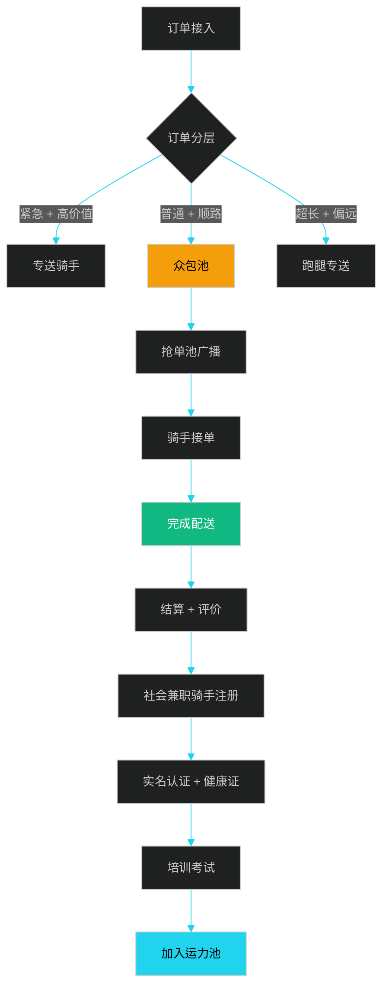

### 9.3.2 顺丰同城的众包实践

顺丰同城（Hive Box 同城）是国内典型的"运力池 + 众包"模式：

| 维度 | 实践 |
|------|------|
| 运力构成 | 自营骑手（30%）+ 众包骑手（70%） |
| 订单来源 | 顺丰快递、商家直发、第三方平台（抖音、京东到家） |
| 调度策略 | "动态优先级"——VIP 商家优先用自营，普通单分发众包 |
| 算力中心 | 自研"灵犀"调度系统，支持百万级骑手实时调度 |
| 增长抓手 | 与抖音合作的本地生活配送，2024 年单量翻倍 |

### 9.3.3 运力池管理模型

运力池（Capacity Pool）是一个抽象概念，把不同来源（专送、众包、跑腿、第三方）的骑手统一管理：

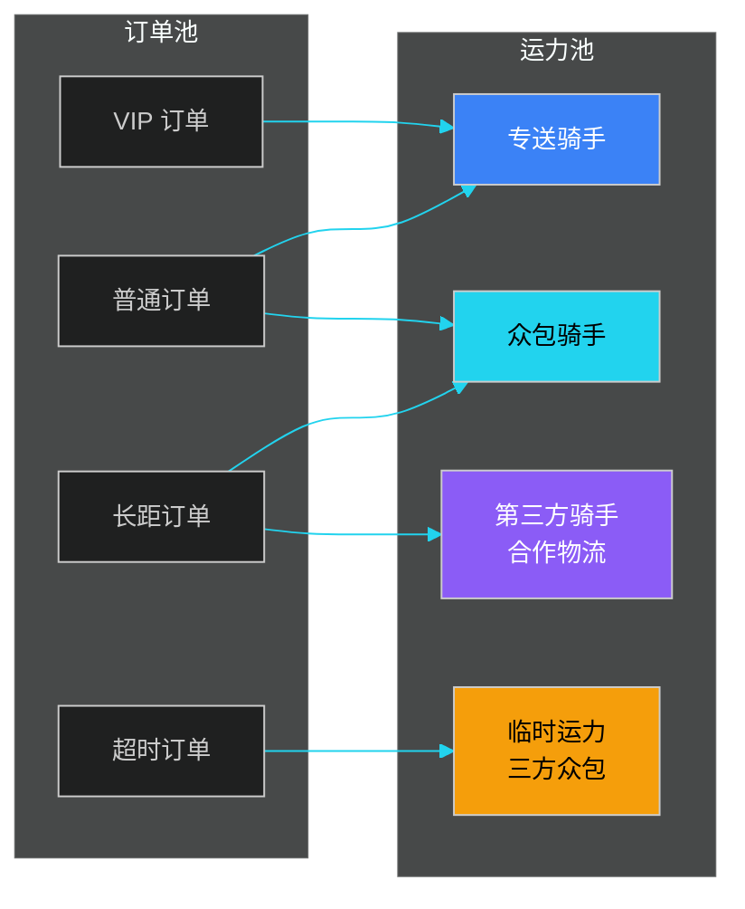

**运力池调度的核心算法**——分层匹配：

```pseudo
function matchOrderToRider(order):
    # Step 1: 按订单标签筛运力层
    if order.is_vip or order.is_overdue:
        candidates = pool.filter(type=PROFESSIONAL)
    elif order.distance > 10km:
        candidates = pool.filter(type IN [PROFESSIONAL, CROWDSOURCING])
    else:
        candidates = pool.filter(type=CROWDSOURCING)

    # Step 2: 地理距离粗筛 (Geohash 5位 ≈ 5km)
    candidates = candidates.filter(geohash5 == order.geohash5)

    # Step 3: 多因子打分
    scored = []
    for rider in candidates:
        if rider.current_load >= rider.max_load:
            continue
        score = calculate_score(order, rider)
        scored.append((rider, score))

    # Step 4: 选Top-K
    top_k = sorted(scored, key=lambda x: -x[1])[:5]

    # Step 5: 派单或加入抢单池
    if rider_type == PROFESSIONAL:
        return assign(order, top_k[0].rider)
    else:
        return broadcast_to(order, [r for r, _ in top_k])
```

### 9.3.4 众包运力的核心指标

| 指标 | 含义 | 健康值 |
|------|------|--------|
| 在线骑手数 | 同时在线接单的骑手 | 高峰 > 1 万/城 |
| 平均接单时长 | 抢单池广播 → 抢单 | < 15 秒 |
| 拒单率 | 推送给骑手但未接 | < 20% |
| 应答率 | 接单 / 推送数 | > 80% |
| 准时送达率 | 送达时间 ≤ 承诺时间 | > 90% |
| 单均成本 | 总配送成本 / 完成单数 | 6-10 元 |
| 骑手周流失率 | 当周流失骑手 / 总注册 | < 10% |

---

## 9.4 自提与驿站

### 9.4.1 为什么需要自提

电商高速增长后，**入户配送**面临以下痛点：
- 用户白天不在家，多次配送成本高；
- 高楼电梯瓶颈，骑手每天送 80 单 → 60 单；
- 末端转化"上门服务"模型不可持续。

**自提（Pick Up）** 成为主流补充方案：把包裹送到驿站、智能柜、社区店，由用户主动取走。

### 9.4.2 国内代表网络

| 网络 | 形态 | 规模 | 特点 |
|------|------|------|------|
| 菜鸟驿站 | 社区站点 | 17 万+（2024） | 通达系入场基础设施 |
| 京东自提点 | 自营 + 加盟 | 5 万+ | 主打"半日达"自提 |
| 丰巢智能柜 | 智能柜 | 33 万+ 柜机 / 5000 万格口 | 顺丰系投资，覆盖最广 |
| 菜鸟智能柜 | 智能柜 | 5 万+ 柜机 | 与社区配套 |
| 邮政驿站 | 邮政自营 | 10 万+（含村邮站） | 下沉市场最强 |

### 9.4.3 自提流程

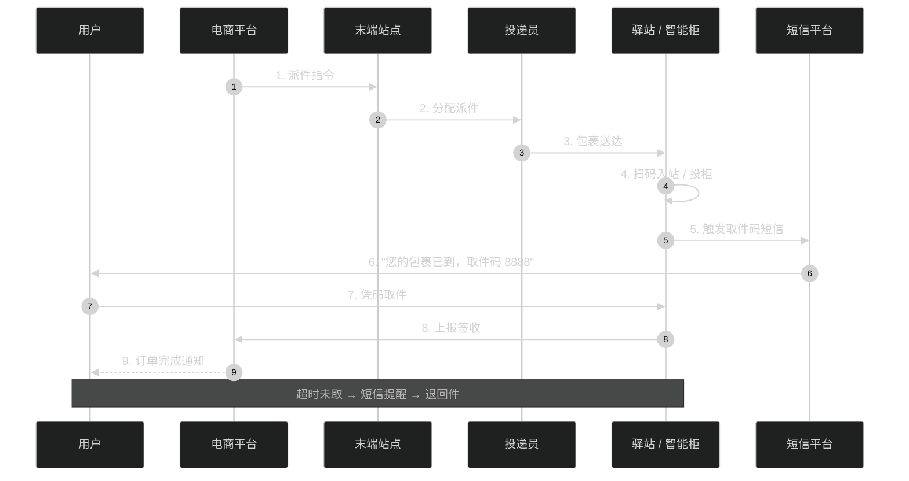

### 9.4.4 智能柜系统设计

智能柜（如丰巢）是一个典型的**IoT + 业务**混合系统：

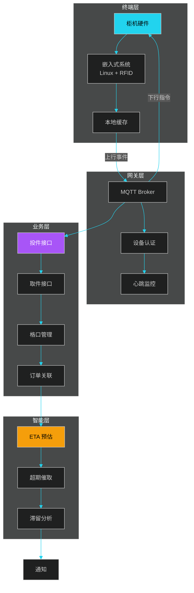

**关键设计点**：

- **格口分配算法**：按包裹尺寸（S/M/L/XL）就近分配空格，避免大箱占小格；
- **离线兜底**：网络中断时，本地缓存最近 24 小时凭证，恢复后异步上报；
- **超时管理**：默认 24 小时免费 → 收费 / 退回；
- **隐私保护**：取件码 6-8 位随机，绑定手机号，并支持人脸识别；
- **故障自检**：每格 30 分钟自检一次，故障格自动锁定。

### 9.4.5 自提模式的优劣对比

| 维度 | 上门配送 | 驿站自提 | 智能柜自提 |
|------|----------|----------|------------|
| 用户体验 | 最好（不出门） | 中（需走 100-500m） | 中（24 小时可取） |
| 投递效率 | 5-10 票/小时 | 30-50 票/小时 | 60-100 票/小时 |
| 单票成本 | 3-5 元 | 0.5-1 元 | 0.3-0.8 元 |
| 失败率 | 高（10%-20%） | 低（< 2%） | 低（< 1%） |
| 投资成本 | 极低 | 站点租金 | 柜机投资 + 维护 |
| 容量 | 无限 | 几百件/天 | 100-200 格/柜 |

---

## 9.5 动态调度算法

### 9.5.1 调度问题的数学建模

末端动态调度本质是**带时间窗的车辆路径问题（VRPTW，Vehicle Routing Problem with Time Windows）**的实时扩展。常见模型：

- **目标函数**：最小化（配送总时长 + 超时惩罚 + 空驶成本）
- **约束**：
  - 每个订单只能由一个骑手配送
  - 骑手在手单数 ≤ 容量上限
  - 取货时间 ≥ 商家备货完成时间
  - 送达时间 ≤ 承诺时间（软约束，超时有惩罚）

VRPTW 是 NP-Hard 问题，实时调度系统通常采用**贪心 + 启发式 + 局部搜索**的组合策略。

### 9.5.2 派单算法伪代码

下面是一个**实时派单算法**的完整骨架，基于"批量优化 + 顺路插入"思路：

```python
# ============ 实时派单算法（每 3-10 秒一轮）============

def dispatch_round(pending_orders, online_riders):
    """
    pending_orders: 待派订单列表
    online_riders: 在线骑手列表
    返回派单结果 [(order, rider, insert_position), ...]
    """
    # === 阶段 1：候选骑手生成 ===
    candidates = {}  # order_id -> [riders]
    for order in pending_orders:
        # 1.1 地理过滤：取货地周围 3km 的骑手
        nearby = spatial_index.query(order.pickup_loc, radius=3000)
        # 1.2 容量过滤
        valid = [r for r in nearby if r.current_load < r.max_load]
        # 1.3 能力过滤（送酒/送药）
        valid = [r for r in valid if r.capable_of(order.special_tag)]
        candidates[order.id] = valid

    # === 阶段 2：打分矩阵构建 ===
    score_matrix = {}  # (order_id, rider_id) -> score
    for order in pending_orders:
        for rider in candidates[order.id]:
            # 模拟把 order 插入 rider 现有路径
            best_pos, delta_cost = best_insertion(rider.route, order)
            if delta_cost == float('inf'):
                continue
            # 综合打分
            score = composite_score(
                pickup_distance = distance(rider.loc, order.pickup_loc),
                eta_satisfaction = eta_check(rider, order),
                load_factor      = rider.current_load / rider.max_load,
                familiarity      = rider.familiarity_score(order.pickup_loc),
                delta_cost       = delta_cost,
                weather_penalty  = weather_factor(),
            )
            score_matrix[(order.id, rider.id)] = (score, best_pos)

    # === 阶段 3：全局最优匹配（二分图最大权匹配 / KM 算法）===
    assignments = km_matching(score_matrix)

    # === 阶段 4：派单或加入抢单池 ===
    results = []
    for order_id, rider_id, pos in assignments:
        order = orders_dict[order_id]
        rider = riders_dict[rider_id]
        if rider.type == "PROFESSIONAL":
            push_to_rider(order, rider, pos)
            results.append((order, rider, "ASSIGNED"))
        else:
            # 众包：推 TopK 抢单池
            top_k = top_k_for_order(order, score_matrix, k=5)
            broadcast_to_pool(order, top_k)
            results.append((order, None, "POOL"))

    # === 阶段 5：未派单订单进入下一轮 ===
    unassigned = [o for o in pending_orders
                  if o.id not in {a[0] for a in assignments}]
    requeue(unassigned)

    return results


def best_insertion(route, new_order):
    """把新订单插入现有路径的最优位置（顺路插入）"""
    if not route:
        # 空路径直接接单
        return 0, distance(rider.loc, new_order.pickup_loc) \
                + distance(new_order.pickup_loc, new_order.dropoff_loc)

    best_pos = -1
    best_delta = float('inf')
    for i in range(len(route) + 1):
        new_route = route[:i] + [new_order] + route[i:]
        # 检查时间窗是否满足
        if not feasible(new_route):
            continue
        new_cost = route_total_cost(new_route)
        old_cost = route_total_cost(route)
        delta = new_cost - old_cost
        if delta < best_delta:
            best_delta = delta
            best_pos = i
    return best_pos, best_delta
```

### 9.5.3 实时路径规划

骑手取餐后，需要实时规划"取餐 → 送达 1 → 送达 2 → 送达 N"的最优顺序，这是一个**带前序约束的 TSP 问题**：

```python
def plan_route(rider_loc, pickup_orders, delivery_orders):
    """
    pickup_orders: 待取餐的订单
    delivery_orders: 已取餐待送达的订单
    返回最优访问顺序
    """
    # 约束：每个订单的"送达"必须在其"取餐"之后
    all_stops = []
    for o in pickup_orders:
        all_stops.append({'type':'pickup', 'loc':o.pickup_loc, 'order_id':o.id})
        all_stops.append({'type':'deliver', 'loc':o.dropoff_loc, 'order_id':o.id})
    for o in delivery_orders:
        all_stops.append({'type':'deliver', 'loc':o.dropoff_loc, 'order_id':o.id})

    # 使用启发式（最近邻 + 2-opt）
    route = nearest_neighbor(rider_loc, all_stops, precedence=True)
    route = two_opt_swap(route, max_iter=50)

    # 实时调用导航 API 拿真实路径耗时
    for i in range(len(route) - 1):
        route[i]['eta_to_next'] = nav_api.duration(route[i]['loc'], route[i+1]['loc'])

    return route
```

### 9.5.4 派单算法对比

| 算法 | 适用场景 | 优点 | 缺点 |
|------|----------|------|------|
| 贪心（最近邻） | 小规模、低密度 | 简单、快 | 局部最优 |
| KM 二分图匹配 | 中等规模、批量派 | 全局最优 | 复杂度 O(n³) |
| 遗传算法 GA | 大规模、可离线 | 灵活、收敛好 | 不稳定、慢 |
| ALNS 自适应大邻域搜索 | 工业级、复杂约束 | 兼顾质量与速度 | 实现复杂 |
| 强化学习 RL | 高度动态、有反馈 | 自适应、长期最优 | 训练成本高 |

> **行业实践**：美团派单系统采用"**KM + 贪心兜底 + 强化学习订单价值评估**"的混合架构，单轮 200ms 内完成 10 万级订单匹配。

### 9.5.5 订单分配——图论建模

把"订单 - 骑手"匹配建模为**二分图最大权匹配**：

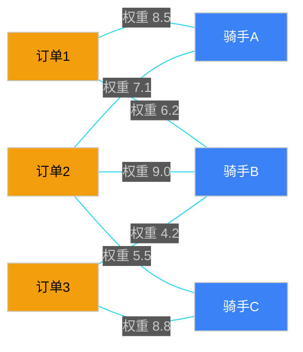

求解目标：**最大化总权重之和**（KM 算法 / Hungarian 算法）。

**工程优化**：
- **空间分片**：先用 Geohash / H3 把城市切成 100m × 100m 网格，每个网格独立求解；
- **批量窗口**：3-10 秒批量收集订单，避免来一单派一单的"短视"决策；
- **二阶段**：先粗匹配（启发式），再精排（局部搜索 2-opt / 3-opt）。

---

## 9.6 无人配送

### 9.6.1 无人配送的三大形态

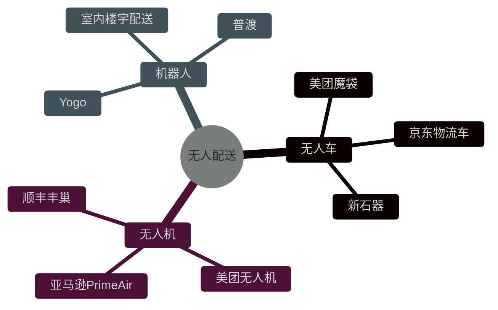

| 形态 | 代表 | 载重 | 续航 | 场景 | 法规进展 |
|------|------|------|------|------|----------|
| 配送无人车 | 美团魔袋、京东 Beifang、新石器 | 50-200 kg | 60-120 km | 园区、社区、低速路 | 北京/深圳/苏州试点开放 |
| 配送无人机 | 美团（深圳）、顺丰丰翼（赣州）、亚马逊 Prime Air | 1-30 kg | 5-20 km | 跨江、海岛、应急 | 民航局白名单航线 |
| 楼宇机器人 | Yogo、普渡、九号 | 5-20 kg | 续航数小时 | 写字楼、酒店、医院 | 商用成熟 |

### 9.6.2 无人车配送的系统架构

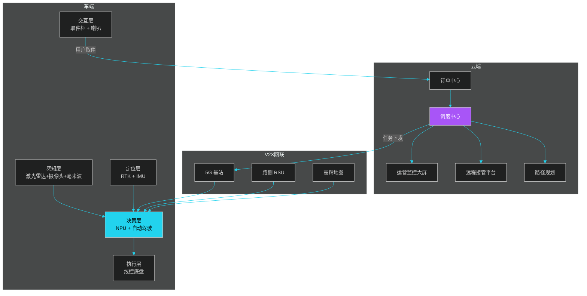

### 9.6.3 美团无人配送实践

**美团无人车**（魔袋系列）：
- **规模**：2024 年北京顺义、深圳前海、上海金山三大常态化运营区；
- **场景**：社区订单、园区订单（联想、商汤、华大基因均接入）；
- **技术**：L4 级自动驾驶 + 5G 远程接管 + 高精地图；
- **运力**：单台日配送 80-150 单，相当于 2 名骑手。

**美团无人机**（深圳）：
- **航线**：深圳南山区、龙岗区开通 22 条航线，可在 3 公里范围内 10 分钟送达；
- **机型**：自研八旋翼无人机，载重 2.5 kg，续航 15 km；
- **流程**：用户下单 → 无人机自动取餐（机场塔台）→ 飞至社区机场 → 用户柜机取餐；
- **2023 年突破**：完成 18.7 万订单，日峰值 1500+ 单。

### 9.6.4 京东无人配送实践

**京东物流车（自动驾驶配送车）**：
- 2016 年开始研发，2020 年常州常态化运营；
- **规模**：累计配送超 100 万件，覆盖 30+ 城市；
- **场景**：疫情期间武汉应急配送、雄安新区智慧城市；
- **技术亮点**：北斗 + 5G + 自研芯片，L4 级。

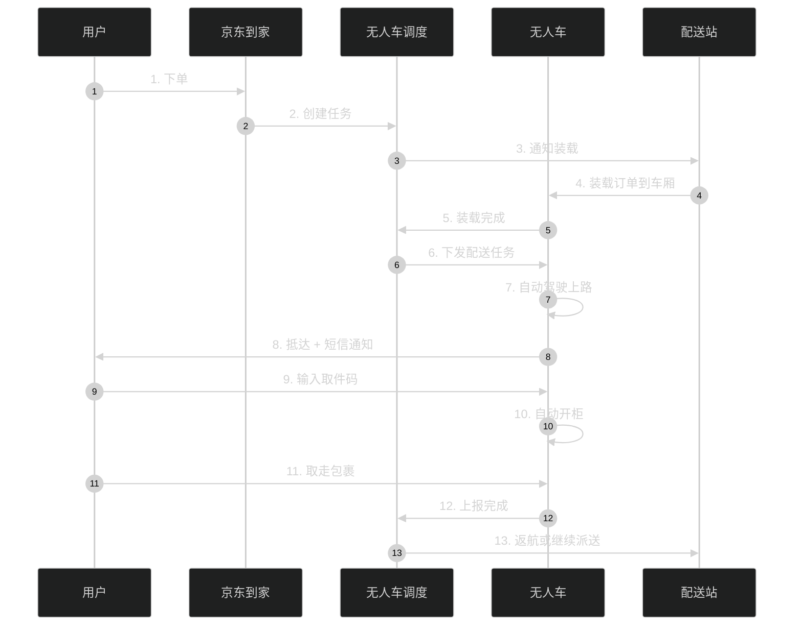

### 9.6.5 无人配送的成本与挑战

| 维度 | 当前状态（2024） | 5 年预期 |
|------|-----------------|---------|
| 单车成本 | 15-25 万元 | 5-10 万元 |
| 单票成本 | 比人工高 30%-50% | 比人工低 30%+ |
| 续航 | 60-120 km | 200+ km |
| 法规 | 限定区域开放 | 全国主要城市开放 |
| 故障率 | 千次任务 30+ | 千次任务 < 5 |
| 用户接受度 | 60% | 90%+ |

**核心挑战**：

1. **长尾场景**：城中村、老旧小区、地下车库——人形机器人 + 楼宇配送是终极方案；
2. **天气**：暴雨、大雪、强风对无人机/无人车都是巨大挑战；
3. **法规**：道路法规、空域管理、责任界定仍在快速演进；
4. **安全**：撞车、坠机、被盗、被毁的责任与保险机制；
5. **运营成本**：远程接管、维护、充电、停放等隐性成本。

### 9.6.6 国内外法规进展

| 国家/地区 | 无人车 | 无人机 |
|----------|--------|--------|
| 中国（北京/深圳/苏州） | 试点开放、限定区域 L4 | 民航局白名单航线 |
| 美国（加州/亚利桑那） | Cruise/Waymo 商用 Robotaxi | FAA Part 135 商业 |
| 欧盟 | 较保守、限于实验 | EASA U-space 规则 |
| 日本 | 4 级自动驾驶 2023 年开放 | 限定区域试点 |

---

## 本章小结

末端配送是物流"皇冠上最闪亮也最重的明珠"——成本占 50%+、时效要求分钟级、订单波动剧烈，是供应链系统设计中最复杂的一段。

本章从六个维度拆解了末端：
- **挑战与机遇**：成本、时效、密度、波动、协同、监管六大挑战，下沉市场和即时零售是最大机会；
- **即时配送**：以美团/饿了么为代表，30 分钟送达的核心是"抢单/派单/派抢结合"的动态调度；
- **众包配送**：兼职骑手通过运力池模型与专送融合，顺丰同城是典型实践；
- **自提与驿站**：菜鸟驿站、丰巢智能柜成为末端的"标配"，单票成本可降至 0.3-1 元；
- **动态调度算法**：核心是 VRPTW 的实时变体，采用"KM 二分图 + 贪心 + 局部搜索"混合架构；
- **无人配送**：无人车、无人机、楼宇机器人三大形态正在快速商业化，2024-2026 年迎来规模拐点。

末端配送系统设计的本质是**"在不确定环境下，对运力与订单进行高效匹配"**。下一章我们将进入"需求计划与预测"，从被动响应回到主动规划。

---

## 面试高频问题

**1. 即时配送的派单算法应该选"抢单"还是"派单"？为什么？**

参考答案要点：① 不存在"谁好"，要看场景——专送场景（自营骑手）适合派单，因为可控、可追责；众包场景适合抢单或"派抢结合"，激发积极性。② 派单模式的核心难点是**全局最优**（VRPTW），需要 KM 二分图算法 + 顺路插入。③ 抢单模式的难点是**避免离散**（避免好抢的单被抢完、长距单无人问津），通常给长距单加补贴或转为派单。④ 主流平台（美团、饿了么）实际是"派单为主、抢单兜底"。

**2. 如何设计一个百万级骑手实时调度系统？**

参考答案要点：① **空间分片**：用 Geohash / H3 把城市切成 100m × 100m 网格，每个网格独立调度，避免全城求解；② **时间窗口**：每 3-10 秒批量收集订单，构建打分矩阵；③ **二阶段优化**：粗匹配（启发式）+ 精排（KM 或 2-opt）；④ **数据架构**：骑手位置走 Kafka 实时流（百万 QPS），用 Redis GeoHash 做空间索引；⑤ **降级策略**：高峰期主算法超时，自动降级到贪心算法；⑥ **AB 测试框架**：算法迭代必备。

**3. 智能柜（如丰巢）的离线兜底如何设计？**

参考答案要点：① 柜机本地缓存最近 24-48 小时的取件码 → 网络中断时仍能正常取件；② 投件时柜机本地分配格口、生成取件码，异步上报中心；③ 中心宕机时柜机进入"独立模式"，所有交易先本地落盘；④ 网络恢复后批量同步，冲突按时间戳 + 人工审核解决；⑤ 关键指标：离线 8 小时内 100% 功能可用、零数据丢失。

**4. 无人配送车的"远程接管"是什么？为什么需要？**

参考答案要点：① 当前 L4 级自动驾驶在复杂场景（施工、突发障碍、警察手势指挥）仍可能失效；② **远程接管**指云端运营员通过 5G 实时接管车辆控制权，类似无人机操作员；③ 一般是"1 人监管 5-10 台车"的比例；④ 接管延迟必须 < 200ms，对网络要求极高；⑤ 是当前法规许可的关键——监管要求"必须有人对车辆负责"。

**5. 众包骑手与专送骑手的核心区别是什么？平台如何管理？**

参考答案要点：① **专送**：全职、平台员工/外包，工资 + 单数提成，平台强管控；② **众包**：兼职、社会运力，按单结算，平台弱管控但有信用体系；③ **管理差异**：专送考核准时率、出勤率、服务分；众包考核接单率、应答时长、用户评价；④ **派单策略**：VIP/超时订单优先派给专送，普通单走众包池；⑤ **2023+ 监管**：平台需保障骑手社保（新就业形态）、限制工时（防止 996）。

**6. 末端配送如何应对"双 11"百万单/小时的爆量？**

参考答案要点：① **运力调度**：节前 1 个月招聘临时骑手 + 提价吸引众包；② **场地扩容**：临时租用集装箱作为"临时驿站"；③ **错峰发货**：电商系统配合，订单分时间窗下发，避免脉冲；④ **AI 预测**：提前 24 小时预测每个网格的爆量并预先布运力；⑤ **降级策略**：极端高峰下，从"上门"自动降级到"驿站自提"，并给用户优惠券补偿；⑥ **系统层面**：调度引擎水平扩容、Kafka 分区扩容、Redis Cluster 扩容。

**7. 无人机配送的安全与法规挑战？**

参考答案要点：① **安全挑战**：电池续航失误、GPS 信号丢失、突发气流、空中相撞、起降区被占；② **法规要求**：中国民航局要求"白名单航线"，必须申请专属空域；美国 FAA 要求"超视距飞行"许可；③ **保险机制**：第三方责任险（伤人）+ 货物险（货损）+ 设备险（炸机）；④ **应急预案**：电量低于阈值自动返航 / 就近降落，故障时自动开伞；⑤ **数据合规**：飞行轨迹、影像数据需保留 6 个月并配合监管调阅。

**8. 末端配送的核心 KPI 有哪些？**

参考答案要点：① **时效类**：准时送达率、平均配送时长、超时率；② **质量类**：投诉率、丢失率、损坏率、签收照片合规率；③ **成本类**：单票成本、骑手单均收入、空驶率、二次配送率；④ **运力类**：在线骑手数、人均日单量、运力利用率；⑤ **系统类**：派单耗时（P99 < 500ms）、调度引擎 QPS、订单堆积量、骑手 App 在线率。

