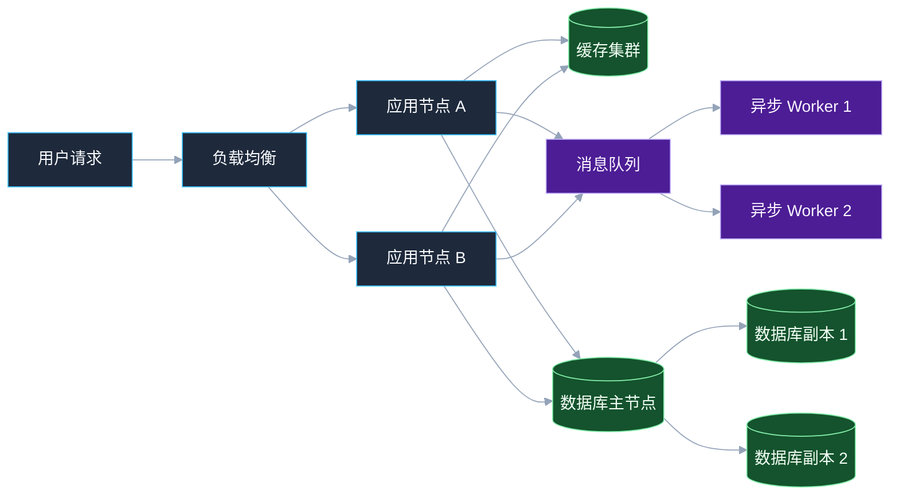
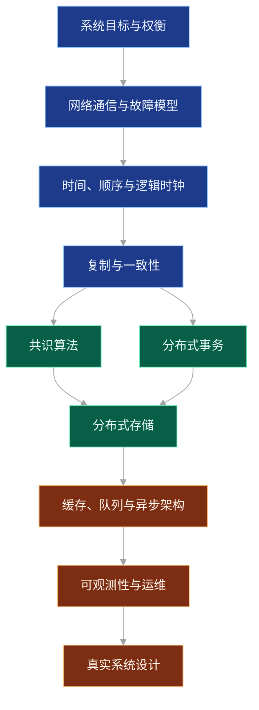

# 第 1 章：分布式系统概览与设计目标

## 学习目标

读完本章后，你应该能够：

- 用自己的话解释什么是分布式系统，以及它和单体系统、微服务架构的关系。
- 理解分布式系统为什么难：网络不可靠、节点会失败、时钟不一致、状态复制复杂、观测困难。
- 掌握分布式系统设计的核心目标：可用性、可靠性、可扩展性、一致性、性能、可维护性和成本控制。
- 能够在系统设计题中识别关键权衡，而不是简单追求“高并发”“高可用”。
- 建立后续学习的整体地图：通信、故障、时间、复制、一致性、共识、事务、存储、调度与运维。

---

## 1. 什么是分布式系统

一个分布式系统由多台计算机、多个进程或多个服务组成，它们通过网络通信，对外表现为一个整体系统。

更实用的定义是：

> 当一个业务请求需要跨越进程边界、机器边界、网络边界或数据副本边界才能完成时，你就在面对分布式系统问题。

常见例子包括：

- 一个 Web 应用通过负载均衡访问多台后端服务器。
- 订单服务调用库存服务、支付服务、物流服务。
- 数据库主从复制、多副本存储、分片集群。
- 消息队列、缓存集群、搜索引擎集群。
- Kubernetes 调度多个容器实例。

### 1.1 单体系统、微服务和分布式系统的关系

单体系统不是天然低级，微服务也不是天然高级。它们解决的是不同阶段的问题。

| 形态 | 特点 | 优点 | 典型问题 |
| --- | --- | --- | --- |
| 单体系统 | 主要逻辑在一个进程或一个部署单元内 | 简单、开发快、调试容易、事务边界清晰 | 随规模增长，部署和团队协作变慢 |
| 模块化单体 | 单体内部按领域模块拆分 | 保留单体简单性，降低代码耦合 | 模块边界需要纪律维护 |
| 微服务 | 服务独立部署，通过网络通信 | 独立扩展、独立发布、团队自治 | 网络失败、数据一致性、链路追踪、运维复杂 |
| 分布式系统 | 多节点协作完成整体目标 | 容量大、可用性高、地域扩展 | 一致性、容错、时序、故障定位复杂 |

微服务通常是分布式系统的一种组织方式，但分布式系统不等于微服务。例如：一个分布式数据库、一个缓存集群、一个对象存储系统，未必按业务微服务拆分，但它们仍然是典型分布式系统。

---

## 2. 为什么需要分布式系统

### 2.1 单机能力有限

单机 CPU、内存、磁盘、网络带宽都有上限。当业务量持续增长时，单机纵向扩容会遇到瓶颈：

- 更强机器价格非线性上涨。
- 单机故障会影响整个系统。
- 单机存储容量有限。
- 单机部署无法覆盖多地域低延迟访问。

### 2.2 业务和组织规模扩大

当团队规模扩大后，代码库、发布节奏和职责边界也会成为瓶颈。分布式架构可以让不同团队负责不同服务，但代价是系统复杂度从代码内部转移到了服务之间。

### 2.3 可用性和容灾要求

如果系统必须 7x24 小时服务用户，就不能把所有能力绑定在单个节点、单个机房或单个数据库实例上。分布式系统通过冗余和故障转移提升可用性。

---

## 3. 分布式系统的基本形态

下面是一种典型的在线业务分布式架构：



这个图里已经包含多类分布式问题：

- 负载均衡如何判断某个应用节点是否健康？
- 应用节点之间是否需要共享会话？
- 缓存和数据库数据不一致怎么办？
- 数据库主节点挂了，副本如何接管？
- 消息队列里的任务是否会重复消费？
- Worker 执行失败后如何重试？
- 请求跨多个组件后如何定位慢在哪里？

分布式系统设计的本质，不是把组件堆起来，而是清楚每条边界会带来什么故障和权衡。

---

## 4. 核心概念

### 4.1 节点

节点是分布式系统中可以独立执行计算或存储的单元，可以是一台物理机、虚拟机、容器、进程或服务实例。

节点可能：

- 正常运行。
- 变慢。
- 暂时不可达。
- 崩溃后重启。
- 产生错误结果。
- 被网络隔离。

工程设计中不能只考虑“节点正常”和“节点宕机”两种状态，更常见的是慢、抖动、半可用。

### 4.2 网络

网络连接节点，但网络不是可靠函数调用。网络可能出现：

- 延迟升高。
- 丢包。
- 重传。
-乱序。
- 连接断开。
- DNS 解析异常。
- 一边认为连接成功，另一边其实已经处理失败。

分布式系统的很多复杂性来自“我不知道对方到底发生了什么”。

### 4.3 消息

节点之间通过消息协作。消息可以是 HTTP 请求、RPC 调用、数据库复制日志、消息队列事件、心跳包等。

消息的关键问题包括：

- 是否可能丢失？
- 是否可能重复？
- 是否保证顺序？
- 是否有确认机制？
- 超时后能否安全重试？

### 4.4 状态

无状态服务容易扩展，有状态服务难扩展。原因是状态需要存储、复制、恢复和一致性控制。

常见状态包括：

- 用户登录态。
- 订单记录。
- 库存数量。
- 消息消费位点。
- 缓存数据。
- 分布式锁持有者。

越关键的状态，越需要明确一致性、持久性和恢复策略。

### 4.5 副本

副本是提升可用性和读性能的重要手段。多个副本意味着：

- 一个节点故障时，其他副本可以继续服务。
- 读请求可以分散到多个副本。
- 数据可以跨机房保存。

但副本也带来一致性问题：如果写入只到达部分副本，读请求应该返回哪个版本？

### 4.6 分片

分片是把数据或请求按规则拆分到不同节点上。例如按用户 ID 哈希到不同数据库分片。

分片可以提升容量，但也会引入：

- 跨分片查询困难。
- 热点分片。
- 数据迁移复杂。
- 全局唯一 ID、全局排序、全局事务问题。

---

## 5. 分布式系统的设计目标

### 5.1 可用性

可用性表示系统在给定时间内能够正确响应请求的比例。

常见表达方式：

| 可用性 | 年不可用时间约 |
| --- | --- |
| 99% | 3.65 天 |
| 99.9% | 8.76 小时 |
| 99.99% | 52.56 分钟 |
| 99.999% | 5.26 分钟 |

可用性不是一句“部署多台机器”就能得到的。你需要考虑：

- 依赖服务不可用怎么办？
- 数据库主节点故障如何切换？
- 切换过程中是否会产生数据丢失？
- 故障检测会不会误判？
- 降级后是否仍能提供核心功能？

### 5.2 可靠性

可靠性关注系统是否长期正确地完成承诺。例如支付系统不能因为重试导致重复扣款，消息系统不能悄悄丢消息。

可靠性常依赖：

- 持久化日志。
- 幂等设计。
- 重试与去重。
- 数据校验。
- 故障恢复流程。

### 5.3 可扩展性

可扩展性表示系统在负载增长时，通过增加资源仍能维持可接受性能。

常见扩展方式：

- 垂直扩展：升级单机 CPU、内存、磁盘。
- 水平扩展：增加更多节点。
- 功能拆分：按业务领域拆服务。
- 数据分片：按 key 拆分数据。
- 异步化：用消息队列削峰填谷。

需要注意：水平扩展不是免费的。系统中总会有一些共享资源成为新瓶颈，例如数据库写入、全局锁、单分片热点、中心化调度器。

### 5.4 一致性

一致性描述多个副本、多个节点或多个服务看到的数据是否相同，以及何时相同。

常见一致性级别：

- 强一致性：写入成功后，后续读取都能看到最新值。
- 最终一致性：短时间内可能读到旧值，但系统最终收敛。
- 读己之写：用户自己写入后，自己后续读取能看到。
- 单调读：同一个客户端不会先读到新值，再读到旧值。

强一致性更容易推理，但通常会增加延迟、降低可用性或限制扩展能力。最终一致性更灵活，但业务需要能接受短暂不一致。

### 5.5 性能

性能不只是 QPS。至少应区分：

- 延迟：单个请求耗时。
- 吞吐：单位时间处理请求数。
- 尾延迟：P95、P99、P999 请求耗时。
- 抖动：延迟是否稳定。
- 资源效率：每单位资源能处理多少负载。

在分布式系统中，尾延迟尤其重要。一个请求如果依赖 10 个服务，只要其中一个服务变慢，整体请求就会变慢。

### 5.6 可维护性

系统能否长期演进，取决于可维护性：

- 服务边界是否清晰。
- 接口是否稳定。
- 数据模型是否可演进。
- 故障是否可观测。
- 发布是否可回滚。
- 团队是否理解系统行为。

一个“理论上高可用”的系统，如果没有监控、日志、告警、演练和文档，在真实故障中往往不可用。

### 5.7 成本

分布式系统常用冗余换可用性，用副本换性能，用异步换吞吐。但所有冗余都有成本：

- 机器成本。
- 存储成本。
- 网络成本。
- 运维成本。
- 开发复杂度。
- 故障排查成本。

优秀的设计不是所有指标拉满，而是在业务约束下选择合适的目标。

---

## 6. 直观例子：一个订单系统为什么会变复杂

假设最初有一个单体订单系统：

1. 用户提交订单。
2. 系统检查库存。
3. 扣减库存。
4. 创建订单。
5. 发起支付。

在单机数据库事务中，这个流程容易理解。但当业务增长后，你可能拆出订单服务、库存服务、支付服务，并引入消息队列。

这时问题变成：

- 库存扣减成功，但创建订单失败怎么办？
- 创建订单成功，但通知支付服务失败怎么办？
- 用户重复点击下单按钮会不会创建两笔订单？
- 请求超时后，客户端重试是否安全？
- 消息投递成功但消费者处理失败怎么办？
- 支付成功回调晚到或重复到达怎么办？

这些都不是某种框架能自动解决的问题，而是分布式系统的基础设计问题。

---

## 7. 工程示例：用幂等键保护创建订单

分布式系统中，重试是必要的，但重试会带来重复执行风险。创建订单是典型例子。

### 7.1 设计思路

客户端为每次“用户意图”生成一个幂等键，例如：

```text
Idempotency-Key = userId + requestId
```

服务端保证相同幂等键只创建一笔订单。

### 7.2 伪代码

```go
// CreateOrder 展示核心思路：相同 idempotencyKey 只能创建一次订单。
// 实际工程中应使用数据库唯一索引保证并发安全。
func CreateOrder(userID string, idempotencyKey string, items []Item) (Order, error) {
    existing, found := orderStore.FindByIdempotencyKey(userID, idempotencyKey)
    if found {
        return existing, nil
    }

    order := Order{
        ID:             NewOrderID(),
        UserID:         userID,
        Items:          items,
        Status:         "CREATED",
        IdempotencyKey: idempotencyKey,
    }

    // 落地实践：在数据库中给 (user_id, idempotency_key) 建唯一索引。
    err := orderStore.Insert(order)
    if IsDuplicateKey(err) {
        return orderStore.FindByIdempotencyKey(userID, idempotencyKey)
    }
    if err != nil {
        return Order{}, err
    }

    return order, nil
}
```

### 7.3 可落地实践

- 在数据库中创建唯一约束：`(user_id, idempotency_key)`。
- 幂等键应代表一次业务意图，而不是每次 HTTP 请求都重新生成。
- 幂等结果需要保存一段时间，避免客户端超时重试导致重复创建。
- 对支付、退款、发券、扣库存等副作用操作都应设计幂等。

---

## 8. 常见误区

### 误区 1：分布式一定比单体先进

如果团队规模小、业务边界未稳定、流量不高，过早拆分会显著增加复杂度。很多系统更适合从模块化单体开始。

### 误区 2：加机器就能线性扩展

真实系统中存在共享瓶颈：数据库写入、全局锁、热点 key、中心化配置、单队列分区。增加机器只能缓解无状态计算部分，不能自动解决所有瓶颈。

### 误区 3：超时就等于失败

超时只表示调用方没有在规定时间内收到结果，不代表被调用方没有执行。被调用方可能已经成功处理，只是响应丢失或延迟。因此超时后的重试必须配合幂等。

### 误区 4：高可用就是多部署几个实例

多实例只能解决部分进程故障。真正的高可用还需要负载均衡、健康检查、故障隔离、限流、熔断、降级、数据副本、恢复演练和监控告警。

### 误区 5：最终一致性就是不一致

最终一致性不是随意不一致，而是系统在明确机制下收敛到一致状态。它需要补偿、重试、对账、状态机和业务可接受的语义。

---

## 9. 面试/设计题思考

### 题目 1：如何设计一个高可用的短链接服务？

思考方向：

- 短码如何生成？是否需要全局唯一？
- 读多写少时如何缓存？
- 数据库如何分片？
- 缓存穿透和热点短链如何处理？
- 某个数据库分片故障时，读写策略是什么？
- 是否允许短时间读不到刚创建的短链？

### 题目 2：如何把一个单体电商系统拆成分布式架构？

不要一上来就说拆成订单、库存、支付、用户。更好的分析顺序：

1. 当前瓶颈是什么：团队协作、发布频率、数据库压力、可用性，还是容量？
2. 哪些模块边界稳定？
3. 哪些数据需要强一致？哪些可以最终一致？
4. 拆分后如何处理跨服务事务？
5. 如何灰度迁移，避免一次性重写？

### 题目 3：如何判断系统是否需要分布式锁？

思考方向：

- 是否真的有跨节点互斥需求？
- 能否用数据库唯一约束、乐观锁、状态机替代？
- 锁持有者崩溃怎么办？
- 锁超时过短或过长会怎样？
- 业务是否能接受重复执行，并通过幂等修复？

---

## 10. 学习路线图

分布式系统知识可以按下面顺序学习：



建议不要急于记忆算法细节，而是先建立问题意识：每一个分布式机制到底解决什么问题，又引入什么新问题。

---

## 11. 章节小结

本章建立了分布式系统设计的整体框架：

- 分布式系统是多个节点通过网络协作，对外提供整体能力的系统。
- 分布式不是目的，而是为了应对容量、可用性、组织协作和地域扩展等问题。
- 分布式系统的困难来自不可靠网络、节点故障、状态复制、时钟不一致和复杂运维。
- 核心设计目标包括可用性、可靠性、可扩展性、一致性、性能、可维护性和成本。
- 工程上必须重视幂等、重试、超时、降级、观测和故障恢复。
- 好的系统设计不是堆组件，而是在业务目标和技术约束之间做清晰权衡。

下一章将深入讨论分布式系统最基础也最容易被低估的问题：网络通信与故障模型。
