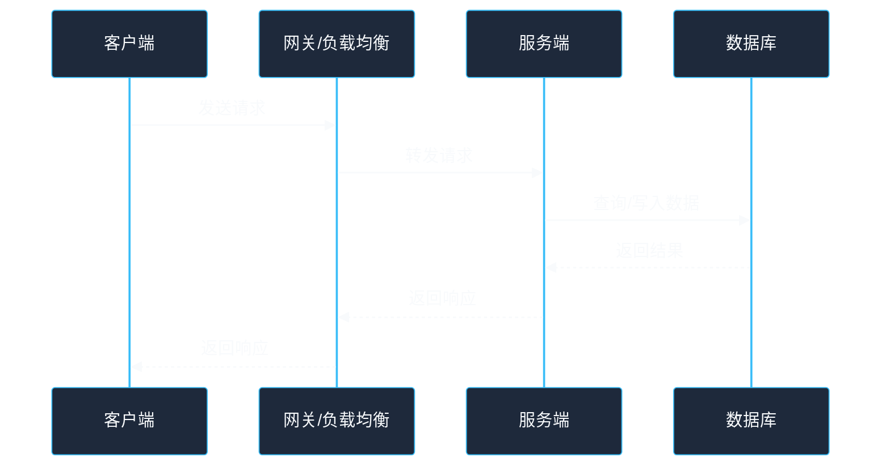
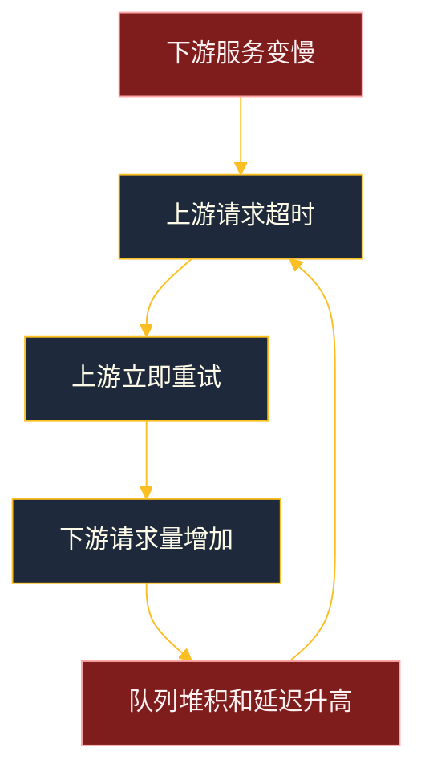
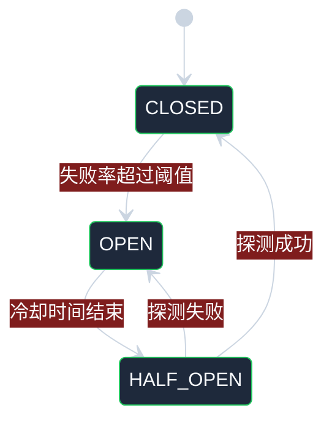

# 第 2 章：网络通信与故障模型

## 学习目标

读完本章后，你应该能够：

- 理解分布式系统中网络通信和本地函数调用的本质差异。
- 掌握常见通信模式：请求/响应、异步消息、发布订阅、流式通信、心跳与探测。
- 理解超时、重试、幂等、退避、熔断、限流在工程中的配合关系。
- 区分崩溃故障、遗漏故障、时序故障、拜占庭故障、网络分区等故障模型。
- 在系统设计中用合适的故障假设约束方案，而不是默认“网络总会正常”。
- 能够分析一次远程调用失败后，调用方和被调用方可能处于哪些状态。

---

## 1. 网络通信不是本地调用

本地函数调用通常具备这些性质：

- 调用开销低。
- 成功或失败相对明确。
- 调用栈清晰。
- 参数和返回值在同一进程内传递。
- 失败大多表现为异常或进程崩溃。

远程调用则不同。一次 RPC 或 HTTP 请求可能经历：

1. 客户端序列化请求。
2. DNS 解析。
3. 建立连接或复用连接。
4. 经过负载均衡、网关、防火墙。
5. 服务端接收请求。
6. 服务端排队、处理、访问数据库。
7. 服务端返回响应。
8. 响应经过网络回到客户端。
9. 客户端反序列化响应。

任何一步都可能失败、变慢或部分成功。



远程调用最大的问题是：调用方看到的失败，不一定等于被调用方没有执行。

---

## 2. 常见通信模式

### 2.1 请求/响应

最常见模式是客户端发送请求，服务端返回响应。HTTP API、gRPC、数据库查询都属于这一类。

优点：

- 编程模型简单。
- 调用结果直观。
- 适合需要立即返回结果的场景。

缺点：

- 调用方和被调用方时间上耦合。
- 被调用方慢会拖慢调用方。
- 多层同步调用会放大尾延迟。
- 超时后状态不确定。

适用场景：

- 查询用户资料。
- 创建订单并立即返回订单号。
- 权限校验。

### 2.2 异步消息

调用方把事件或命令写入消息队列，消费者稍后处理。

优点：

- 削峰填谷。
- 降低服务之间的时间耦合。
- 失败后可以重试。
- 适合耗时任务和最终一致性流程。

缺点：

- 调试复杂。
- 端到端延迟不稳定。
- 消息可能重复。
- 消费顺序可能难以保证。
- 需要处理死信、积压和重放。

适用场景：

- 订单创建后发送短信。
- 支付成功后发放积分。
- 日志采集。
- 异步生成报表。

### 2.3 发布/订阅

一个事件可以被多个订阅者消费。例如订单支付成功后，积分服务、发票服务、推荐系统都订阅该事件。

优点：

- 生产者和消费者解耦。
- 新增消费者不需要修改生产者。
- 适合事件驱动架构。

缺点：

- 事件语义需要稳定。
- 消费者之间的副作用难以统一回滚。
- 重复订阅或漏订阅会造成业务问题。

### 2.4 流式通信

流式通信适合持续传输数据，例如日志流、实时指标、视频流、持续同步变更日志。

关键问题：

- 背压：消费者处理不过来时，生产者是否减速？
- 位点：断开后从哪里恢复？
- 顺序：是否需要保持同一 key 的事件顺序？

### 2.5 心跳与探测

心跳用于判断节点是否仍然存活，常见于服务注册、主从复制、集群成员管理。

但心跳只能证明“最近收到过消息”，不能证明“没收到心跳就一定宕机”。也可能只是网络抖动、GC 暂停、CPU 打满或调度延迟。

---

## 3. 超时：远程调用必须有边界

没有超时的远程调用可能永久等待，导致线程、连接、内存等资源耗尽。

### 3.1 超时的含义

超时表示：调用方在指定时间内没有拿到可用结果。

它不表示：

- 服务端没有收到请求。
- 服务端没有处理请求。
- 服务端处理失败。
- 数据库没有提交。

例如：创建订单请求超时，真实情况可能是：

| 情况 | 服务端状态 | 客户端该如何处理 |
| --- | --- | --- |
| 请求没到服务端 | 未执行 | 可以重试 |
| 请求到达但还在排队 | 未知 | 谨慎重试，需要幂等 |
| 服务端已创建订单但响应丢失 | 已成功 | 重试必须返回同一结果 |
| 服务端写库成功但发送消息失败 | 部分成功 | 需要补偿或事务消息机制 |
| 服务端崩溃 | 未知 | 通过查询、幂等、恢复流程确认 |

### 3.2 超时设置原则

- 不要无限等待。
- 超时时间应基于依赖服务的延迟分布，而不是随意写一个数字。
- 上游超时应大于下游各步骤预算之和，但也要保留返回错误的时间。
- 对用户请求，要控制端到端总耗时。
- 对后台任务，可以允许更长超时，但要限制并发。

### 3.3 超时预算示例

假设用户请求总预算是 300ms：

```text
网关处理：20ms
用户服务：50ms
库存服务：80ms
订单数据库：100ms
预留返回和抖动：50ms
```

如果每个服务都独立设置 1 秒超时，整体请求可能远超用户可接受范围，还会造成资源堆积。

---

## 4. 重试：必要但危险

重试可以修复临时故障，例如网络抖动、短暂限流、连接重置。但重试也可能放大故障。

### 4.1 什么适合重试

适合重试：

- 网络连接临时失败。
- 读请求超时。
- 明确返回可重试错误，例如 503、429。
- 消息消费失败后稍后再试。

不适合盲目重试：

- 参数错误。
- 权限错误。
- 余额不足。
- 明确的业务失败。
- 非幂等写操作。

### 4.2 重试风暴

当下游服务变慢时，上游如果立即大量重试，会让下游承受更多请求，进一步变慢，最终形成雪崩。



### 4.3 安全重试原则

- 写操作先做幂等，再允许重试。
- 使用指数退避，避免立即密集重试。
- 加入随机抖动，避免大量客户端同时重试。
- 设置最大重试次数。
- 区分可重试错误和不可重试错误。
- 避免在多层调用中每层都重试，造成重试倍增。

---

## 5. 幂等：让重复执行变得安全

幂等是指同一个操作执行一次和执行多次的最终效果相同。

### 5.1 常见幂等设计

| 场景 | 幂等策略 |
| --- | --- |
| 创建订单 | 客户端传入幂等键，服务端唯一约束 |
| 支付回调 | 以支付流水号去重，状态机只允许合法流转 |
| 扣库存 | 使用业务单号记录扣减流水，重复请求直接返回 |
| 消息消费 | 消费者记录消息 ID 或业务 ID |
| 任务调度 | 任务实例 ID 唯一，重复调度不重复执行副作用 |

### 5.2 状态机比布尔字段更可靠

以订单为例，不建议只用 `paid = true/false` 描述复杂状态。更好的方式是状态机：

```text
CREATED -> PAYING -> PAID -> SHIPPED -> FINISHED
CREATED -> CANCELLED
PAYING -> PAYMENT_FAILED
```

重复事件到达时，先检查当前状态是否允许迁移。非法或重复迁移直接忽略或返回已有结果。

---

## 6. 故障模型

故障模型是对系统可能发生什么故障的假设。设计方案必须建立在明确故障模型上。

### 6.1 崩溃故障

节点停止运行，不再响应请求。它可能稍后重启，也可能永久不可用。

常见原因：

- 进程崩溃。
- 机器宕机。
- 容器被杀。
- 断电。

应对方式：

- 多副本。
- 健康检查。
- 自动重启。
- 故障转移。
- 持久化日志恢复。

### 6.2 遗漏故障

节点或网络遗漏了某些消息，例如请求丢失、响应丢失、消息未投递。

应对方式：

- 超时重试。
- 确认机制。
- 消息持久化。
- 幂等去重。

### 6.3 时序故障

节点没有在预期时间内完成操作，例如响应过慢、心跳延迟、时钟漂移。

时序故障很危险，因为它可能被误判为崩溃故障。

例如：主节点因为长时间 GC 暂停错过心跳，集群选出了新主。旧主恢复后如果仍以为自己是主，就可能发生双主写入。

### 6.4 网络分区

网络分区是指集群被分成多个互相无法通信的部分，但每个部分内部可能仍正常运行。

网络分区下最关键的问题是：

> 两边都认为自己应该继续服务时，如何避免产生不可合并的冲突？

常见策略：

- 多数派机制：只有获得多数节点支持的一边可以写入。
- 降级只读：无法确认主节点时停止写入。
- 冲突解决：允许多方写入，事后合并。

### 6.5 拜占庭故障

拜占庭故障指节点可能任意错误，包括撒谎、发送矛盾消息、恶意行为。区块链、跨组织协作系统更关注这类问题。

大多数企业内部系统通常假设非拜占庭故障，即节点可能崩溃、变慢、丢消息，但不会恶意伪造协议消息。这个假设能显著降低系统复杂度。

---

## 7. 故障检测：不能百分百准确

分布式系统中无法完美判断一个远程节点是宕机了，还是只是网络慢。

### 7.1 心跳检测的局限

如果 A 没收到 B 的心跳，可能原因包括：

- B 进程崩溃。
- B 机器宕机。
- A 到 B 的网络断了。
- B 正在长时间 GC。
- B CPU 打满，心跳线程没调度。
- A 自己的网络或线程池异常。

因此故障检测器通常只能输出“怀疑”，不能输出绝对事实。

### 7.2 工程实践

- 连续多次心跳失败后再判定异常。
- 使用探测窗口，而不是单次失败立即摘除。
- 健康检查应区分存活和就绪：进程活着不代表能接流量。
- 摘除节点后要有恢复探测和预热机制。
- 对关键主节点切换，要结合任期号、租约或多数派确认，避免双主。

---

## 8. 工程示例：带超时、退避和幂等键的调用

下面用 Go 风格伪代码说明一次写操作如何安全重试。

```go
func CreatePayment(ctx context.Context, req PaymentRequest) (PaymentResult, error) {
    // 幂等键代表一次业务意图，例如订单号 + 支付尝试编号。
    if req.IdempotencyKey == "" {
        return PaymentResult{}, errors.New("missing idempotency key")
    }

    backoff := 50 * time.Millisecond
    maxAttempts := 3

    for attempt := 1; attempt <= maxAttempts; attempt++ {
        callCtx, cancel := context.WithTimeout(ctx, 200*time.Millisecond)
        result, err := paymentClient.Create(callCtx, req)
        cancel()

        if err == nil {
            return result, nil
        }

        if !IsRetryable(err) {
            return PaymentResult{}, err
        }

        if attempt == maxAttempts {
            break
        }

        jitter := time.Duration(rand.Int63n(int64(30 * time.Millisecond)))
        time.Sleep(backoff + jitter)
        backoff *= 2
    }

    // 最后不要贸然再次创建，可以查询幂等键对应的结果。
    return paymentClient.GetByIdempotencyKey(ctx, req.IdempotencyKey)
}
```

关键点：

- 每次远程调用都有单次超时。
- 总体请求由外层 `ctx` 控制，避免无限重试。
- 只重试可重试错误。
- 写操作依赖幂等键。
- 最终通过查询确认状态，而不是盲目继续创建。

---

## 9. 工程示例：简单熔断器思路

熔断器用于在下游持续失败时快速失败，避免把流量继续压给已经不可用的依赖。

```text
CLOSED：正常调用，统计失败率。
OPEN：直接失败或走降级，不再请求下游。
HALF_OPEN：放少量探测请求，如果成功则恢复 CLOSED，否则回到 OPEN。
```



熔断器不是为了隐藏错误，而是为了给系统恢复时间，并保护调用方资源。

---

## 10. 常见误区

### 误区 1：HTTP 500 就应该一直重试

500 可能是临时故障，也可能是服务端代码 bug 或数据异常。是否重试要看错误类型、接口语义和幂等能力。

### 误区 2：超时设置越长越安全

超时过长会占用线程、连接和内存，让系统在故障时更慢地释放资源。用户请求尤其需要端到端超时预算。

### 误区 3：只要消息队列投递成功，业务就成功了

消息投递成功只表示消息进入队列，不代表消费者成功处理。还需要消费确认、重试、死信、幂等和监控。

### 误区 4：心跳失败就说明节点宕机

心跳失败只能说明探测失败，不能说明节点一定宕机。错误的故障检测可能导致双主、误摘节点和流量抖动。

### 误区 5：所有接口都统一重试三次

不同接口语义不同。读接口、幂等写接口、非幂等写接口、长耗时任务不能使用同一套重试策略。

---

## 11. 面试/设计题思考

### 题目 1：一个支付接口调用超时了，应该怎么办？

思考方向：

- 超时不等于支付失败。
- 创建支付请求必须有幂等键。
- 客户端可以查询支付状态。
- 服务端应通过支付流水号去重。
- UI 可以展示“处理中”，而不是立即让用户重复支付。
- 后台需要对账和补偿。

### 题目 2：如何设计消息消费者的重试机制？

思考方向：

- 哪些错误可重试，哪些不可重试？
- 重试是否有最大次数？
- 是否需要延迟重试和指数退避？
- 消费者是否幂等？
- 失败消息是否进入死信队列？
- 如何告警和人工修复？

### 题目 3：如何避免服务雪崩？

思考方向：

- 设置合理超时。
- 限制并发和队列长度。
- 对下游使用熔断。
- 对非核心功能降级。
- 避免多层重试叠加。
- 使用隔离舱，防止一个依赖拖垮整个服务。
- 监控错误率、延迟、饱和度。

---

## 12. 章节小结

本章讨论了分布式系统最基础的现实：网络不可靠，远程调用结果常常不确定。

你需要记住：

- 远程调用不是本地函数调用，失败语义更复杂。
- 超时只代表调用方没有及时收到结果，不代表服务端未执行。
- 重试必须和幂等、退避、最大次数、错误分类一起设计。
- 消息系统能解耦和削峰，但会带来重复、乱序、积压和补偿问题。
- 故障模型决定系统设计复杂度，常见故障包括崩溃、遗漏、时序、网络分区和拜占庭故障。
- 故障检测无法完美准确，只能在误判风险和恢复速度之间权衡。
- 熔断、限流、隔离、降级是保护系统稳定性的关键工程手段。

下一章将讨论分布式系统中的另一个基础难题：时间、事件顺序和逻辑时钟。
