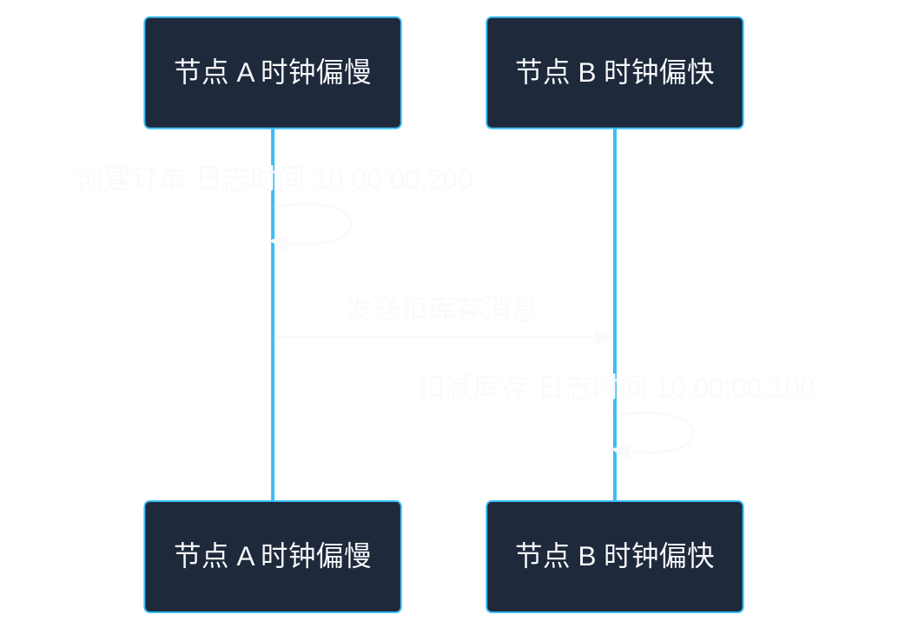
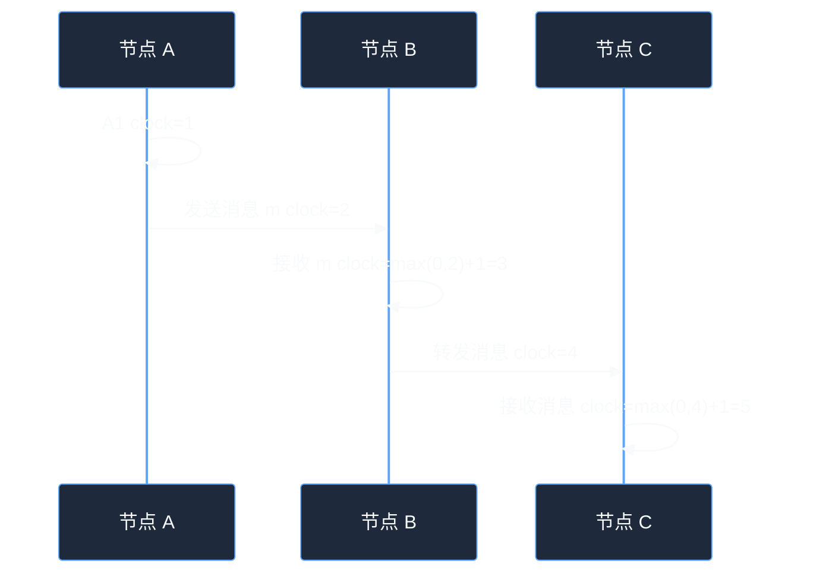

# 第 3 章：时间顺序与逻辑时钟

## 学习目标

读完本章后，你应该能够：

- 理解为什么分布式系统中不能简单依赖机器本地时间判断事件顺序。
- 区分物理时钟、逻辑时钟、单调时间和墙上时间。
- 掌握 happened-before 关系的直观含义。
- 理解 Lamport 逻辑时钟和向量时钟解决什么问题，以及它们不能解决什么问题。
- 能够在工程中识别时间相关风险：时钟回拨、过期判断、锁租约、日志排序、并发写冲突。
- 在系统设计题中合理说明如何处理事件顺序和冲突合并。

---

## 1. 为什么时间在分布式系统中很难

在单机程序里，我们常常默认：

- 当前时间是可信的。
- 后发生的事件时间戳更大。
- 日志按时间排序就代表真实执行顺序。
- 超时时间到达就说明资源可以释放。

在分布式系统中，这些假设都可能失败。

不同机器的本地时钟可能：

- 存在偏差。
- 走得快慢不同。
- 因 NTP 校时发生跳变。
- 因虚拟化、休眠、负载过高产生异常漂移。
- 在闰秒、系统时间调整时出现非预期行为。

因此，分布式系统需要更谨慎地区分“物理时间”和“事件因果顺序”。

---

## 2. 物理时钟：墙上时间与单调时间

### 2.1 墙上时间

墙上时间是人类日历意义上的时间，例如：

```text
2026-05-23 16:30:00
```

它适合用于：

- 展示给用户。
- 记录业务发生的大致时间。
- 日志检索。
- 报表统计。
- 按天、按月结算。

但墙上时间可能被调整。NTP 校时、人工修改系统时间、虚拟机迁移都可能导致墙上时间前进、后退或跳跃。

### 2.2 单调时间

单调时间只保证在同一台机器上不断向前，适合测量时间间隔。

它适合用于：

- 计算请求耗时。
- 设置本地超时。
- 熔断器冷却时间。
- 本进程内定时任务间隔。

它不适合用于：

- 跨机器比较事件先后。
- 存入数据库作为业务时间。
- 展示给用户。

### 2.3 工程原则

- 测量耗时用单调时间。
- 记录业务时间用墙上时间。
- 判断跨节点事件顺序不要只靠墙上时间。
- 对过期、租约、锁等逻辑，要考虑时钟漂移和回拨。

---

## 3. 直观例子：日志时间戳不等于真实顺序

假设有两台机器 A 和 B：

- A 的时钟比真实时间慢 100ms。
- B 的时钟比真实时间快 100ms。

真实过程：

1. A 创建订单。
2. A 发送消息给 B。
3. B 收到消息后扣减库存。

日志可能显示：

```text
B 10:00:00.100 扣减库存
A 10:00:00.200 创建订单
```

如果只按日志时间戳排序，会误以为库存先扣减、订单后创建。



因此，日志时间只能作为排查线索，不能直接等同于严格因果顺序。

---

## 4. 事件顺序与 happened-before

分布式系统中，我们真正关心的往往不是“哪个时间戳更小”，而是“哪个事件因果上先发生”。

Lamport 提出了 happened-before 关系，可以直观理解为：

如果事件 A happened-before 事件 B，说明 A 可能影响 B。

### 4.1 三条基本规则

1. 同一个进程内，前面的事件 happened-before 后面的事件。
2. 如果一个事件是发送消息，另一个事件是接收同一条消息，那么发送 happened-before 接收。
3. happened-before 具有传递性：如果 A 先于 B，B 先于 C，那么 A 先于 C。

### 4.2 并发事件

如果两个事件之间无法通过上述规则推导出先后关系，它们就是并发事件。

并发不一定表示物理上同时发生，而是表示系统无法证明它们有因果先后。

例如：两个用户分别在不同节点同时修改同一份资料，如果两个写入之间没有通信关系，就可以视为并发写。

---

## 5. Lamport 逻辑时钟

Lamport 逻辑时钟用一个递增计数器表示事件的逻辑顺序。

### 5.1 算法规则

每个节点维护一个本地计数器 `clock`：

1. 本地发生事件前，`clock = clock + 1`。
2. 发送消息时，把当前 `clock` 附带在消息里。
3. 接收消息时，`clock = max(local_clock, message_clock) + 1`。

### 5.2 示例



如果 A happened-before B，那么 Lamport 时间戳一定满足 `L(A) < L(B)`。

但反过来不成立：`L(A) < L(B)` 不一定说明 A happened-before B。它可能只是两个无关事件的计数器大小不同。

### 5.3 用节点 ID 打破并列

为了得到一个全序，可以用 `(logical_time, node_id)` 排序。例如：

```text
(5, nodeA) < (5, nodeB)
```

这能让所有事件有稳定排序，但这个全序不一定代表真实因果顺序。它只是工程上可用的确定性排序。

### 5.4 适用场景

Lamport 时钟适合：

- 为事件提供因果一致的逻辑序号。
- 构建确定性排序。
- 辅助分布式锁、复制协议、事件日志排序。
- 理解更复杂的逻辑时间机制。

它不适合：

- 判断两个事件是否并发。
- 表示真实物理时间。
- 解决所有冲突合并问题。

---

## 6. 向量时钟

向量时钟可以判断两个事件之间是因果有序，还是并发。

### 6.1 基本思想

如果系统有 N 个节点，每个事件携带一个长度为 N 的向量。向量中第 i 个位置表示该事件已知的节点 i 的逻辑进度。

例如三节点系统中：

```text
A: [1,0,0]
B: [0,1,0]
C: [0,0,1]
```

### 6.2 更新规则

每个节点维护自己的向量时钟：

1. 本地事件：把自己对应位置加 1。
2. 发送消息：把当前向量附带在消息中。
3. 接收消息：对每个位置取本地向量和消息向量的最大值，然后把自己对应位置加 1。

### 6.3 比较规则

给定两个向量 `V1` 和 `V2`：

- 如果每个位置 `V1[i] <= V2[i]`，且至少一个位置 `<`，则 V1 happened-before V2。
- 如果每个位置 `V1[i] >= V2[i]`，且至少一个位置 `>`，则 V2 happened-before V1。
- 否则二者并发。

### 6.4 例子：并发更新检测

用户资料有两个副本，初始版本为：

```text
{name: "张三", city: "北京"}, version=[1,0]
```

两个节点在没有互相通信的情况下分别更新：

```text
节点 A 更新 name: "李四"，版本 [2,0]
节点 B 更新 city: "上海"，版本 [1,1]
```

比较 `[2,0]` 和 `[1,1]`：

- 第一位 2 > 1。
- 第二位 0 < 1。

二者互不支配，说明是并发更新。系统不能简单说哪个覆盖哪个，而需要业务合并或保留冲突版本。

---

## 7. 最后写入获胜的风险

很多系统使用 Last Write Wins，即最后写入获胜。常见做法是比较更新时间戳，时间戳更大的版本覆盖旧版本。

这种策略简单，但有明显风险。

### 7.1 时钟偏差导致旧数据覆盖新数据

假设：

- 节点 A 时钟偏快。
- 节点 B 时钟正常。
- 用户先在 B 更新了正确资料。
- 稍后 A 同步一个较旧修改，但因为 A 的时间戳更大，覆盖了 B 的新数据。

这就是“看起来更新更晚，实际上因果更早”的问题。

### 7.2 什么时候可以接受 LWW

LWW 可以用于：

- 缓存值。
- 用户可重新编辑的非关键资料。
- 允许偶发覆盖的弱一致场景。
- 有明确业务规则的状态，例如更高优先级状态覆盖低优先级状态。

不适合：

- 钱包余额。
- 库存扣减。
- 订单状态。
- 权限变更。
- 医疗、金融等关键记录。

### 7.3 替代方案

- 使用版本号或乐观锁。
- 使用状态机控制合法流转。
- 使用向量时钟检测并发冲突。
- 使用操作日志而不是覆盖最终值。
- 使用 CRDT 等可合并数据结构。
- 将冲突交给用户或业务规则解决。

---

## 8. 工程示例：用版本号实现乐观并发控制

对于单主数据库或单行记录，很多时候不需要完整向量时钟。一个递增版本号就足以防止并发覆盖。

### 8.1 数据结构

```text
user_profile
- user_id
- name
- city
- version
```

### 8.2 更新逻辑

```go
func UpdateProfile(userID string, expectedVersion int64, patch ProfilePatch) error {
    rowsAffected := db.Exec(`
        UPDATE user_profile
        SET name = ?, city = ?, version = version + 1
        WHERE user_id = ? AND version = ?
    `, patch.Name, patch.City, userID, expectedVersion)

    if rowsAffected == 0 {
        return ErrVersionConflict
    }
    return nil
}
```

### 8.3 使用方式

1. 客户端读取用户资料，得到 `version = 7`。
2. 客户端提交修改时带上 `expectedVersion = 7`。
3. 如果期间没有别人修改，更新成功，版本变成 8。
4. 如果别人已经修改，当前版本不是 7，更新失败。
5. 客户端重新读取最新数据，提示用户合并或重试。

这种方式适合：

- 单记录并发修改。
- 管理后台编辑。
- 配置变更。
- 库存 CAS 扣减。

不适合：

- 多副本同时可写且可能离线合并的场景。
- 需要表达多个节点并发因果关系的场景。

---

## 9. 工程示例：状态机防止订单状态倒退

订单状态不能简单按时间戳覆盖，否则重复消息或乱序消息可能让状态倒退。

```text
CREATED -> PAYING -> PAID -> SHIPPED -> FINISHED
CREATED -> CANCELLED
PAYING -> PAYMENT_FAILED
```

伪代码：

```go
var allowed = map[OrderStatus][]OrderStatus{
    "CREATED": {"PAYING", "CANCELLED"},
    "PAYING":  {"PAID", "PAYMENT_FAILED"},
    "PAID":    {"SHIPPED"},
    "SHIPPED": {"FINISHED"},
}

func MoveOrderStatus(orderID string, target OrderStatus, eventID string) error {
    if processedEventStore.Exists(eventID) {
        return nil
    }

    order := orderStore.Get(orderID)
    if !CanMove(order.Status, target, allowed) {
        return nil // 重复、乱序或非法事件，按业务记录审计日志即可。
    }

    return transaction(func() error {
        processedEventStore.Insert(eventID)
        orderStore.UpdateStatus(orderID, order.Status, target)
        return nil
    })
}
```

关键点：

- 使用事件 ID 做幂等。
- 使用状态机限制合法流转。
- 不依赖消息到达时间判断新旧。
- 乱序消息不会让订单从 `PAID` 回到 `PAYING`。

---

## 10. 租约和过期时间的风险

租约是一种带过期时间的授权，例如：某个节点在 10 秒内是主节点，或者某个客户端在 30 秒内持有锁。

租约依赖时间，因此必须考虑：

- 持有者机器时钟变慢。
- 授权者机器时钟变快。
- GC 暂停导致持有者以为租约还有效。
- 网络延迟导致续约请求迟到。
- 过期后旧持有者仍执行写操作。

工程中常见防护：

- 租约时间远大于正常时钟漂移和网络延迟。
- 使用单调时间测量本地租约有效期。
- 在写入下游资源时携带 fencing token。
- 下游资源拒绝旧 token 的写入。
- 关键写操作不要只依赖客户端自认为持有锁。

### 10.1 Fencing token 直观说明

每次发放锁或租约时，服务端返回一个递增 token：

```text
客户端 A 获得 token=10
客户端 A 长时间暂停，租约过期
客户端 B 获得 token=11
A 恢复后继续写入，但携带 token=10
存储系统发现 10 < 11，拒绝 A 的旧写入
```

这能防止旧持有者在恢复后破坏新持有者的结果。

---

## 11. 常见误区

### 误区 1：时间戳大的事件一定更新

时间戳可能受时钟偏差影响。时间戳大只能说明产生它的机器认为时间更晚，不能证明因果上更晚。

### 误区 2：日志排序就是请求真实执行顺序

跨机器日志受时钟偏差、缓冲、异步写入影响。日志排序可以辅助排查，但要结合 trace ID、请求 ID、消息 ID 和因果关系分析。

### 误区 3：NTP 能彻底解决时钟问题

NTP 可以减小时钟偏差，但不能保证所有机器时钟完全一致，也不能消除网络延迟、校时跳变和极端漂移。

### 误区 4：逻辑时钟能告诉真实时间

逻辑时钟表达事件顺序，不表达真实日期时间。不能用 Lamport 时间戳做用户展示或结算时间。

### 误区 5：分布式锁过期后旧客户端一定会停止

客户端可能因为暂停、网络分区或线程阻塞，恢复后继续执行。关键资源应使用 fencing token 或状态校验防止旧写入。

---

## 12. 面试/设计题思考

### 题目 1：如何处理多端同时编辑用户资料？

思考方向：

- 是否允许最后写入覆盖？
- 字段级合并是否可行？
- 是否用版本号检测冲突？
- 冲突是否提示用户手动合并？
- 离线编辑是否需要向量时钟或操作日志？

### 题目 2：如何保证订单状态不会被乱序消息改错？

思考方向：

- 使用状态机限制合法流转。
- 每个事件有唯一 ID，消费者幂等。
- 不按消息到达时间直接覆盖状态。
- 对非法迁移记录审计日志。
- 必要时按订单维度保证消息顺序，但仍需幂等。

### 题目 3：分布式锁为什么需要 fencing token？

思考方向：

- 锁过期不代表旧客户端停止执行。
- GC 暂停或网络分区会让旧持有者恢复后继续写。
- token 由锁服务单调递增生成。
- 资源服务保存已见过的最大 token，拒绝更小 token。
- 这比只依赖客户端检查租约时间更安全。

### 题目 4：如何排查跨服务日志顺序混乱的问题？

思考方向：

- 使用 trace ID 串联一次请求。
- 记录 span 的父子关系，而不只看时间戳。
- 检查机器时钟偏差。
- 对关键事件记录业务 ID 和消息 ID。
- 对异步流程记录生产时间、入队时间、消费时间和处理结果。

---

## 13. 章节小结

本章讨论了分布式系统中的时间和顺序问题：

- 不同机器的物理时钟不完全一致，墙上时间不能可靠判断跨节点因果顺序。
- 测量耗时应使用单调时间，记录业务时间可以使用墙上时间。
- happened-before 描述事件之间的因果关系，而不是物理时间先后。
- Lamport 逻辑时钟能保证因果先后对应递增时间戳，但不能判断并发。
- 向量时钟可以检测并发更新，但维护成本更高。
- Last Write Wins 简单但可能丢失更新，关键业务要谨慎使用。
- 工程中常用版本号、状态机、幂等事件、fencing token 等机制处理顺序和冲突。
- 租约、锁、过期时间都依赖时间，需要考虑时钟漂移、暂停和旧客户端写入风险。

到这里，你已经掌握了分布式系统的三个基础入口：系统目标、网络故障和时间顺序。后续学习复制、一致性、共识和事务时，这些概念会反复出现。
