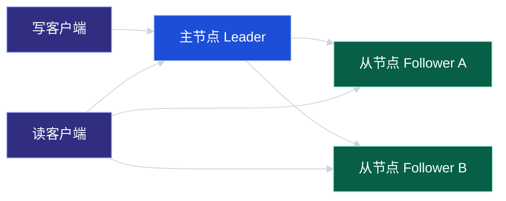
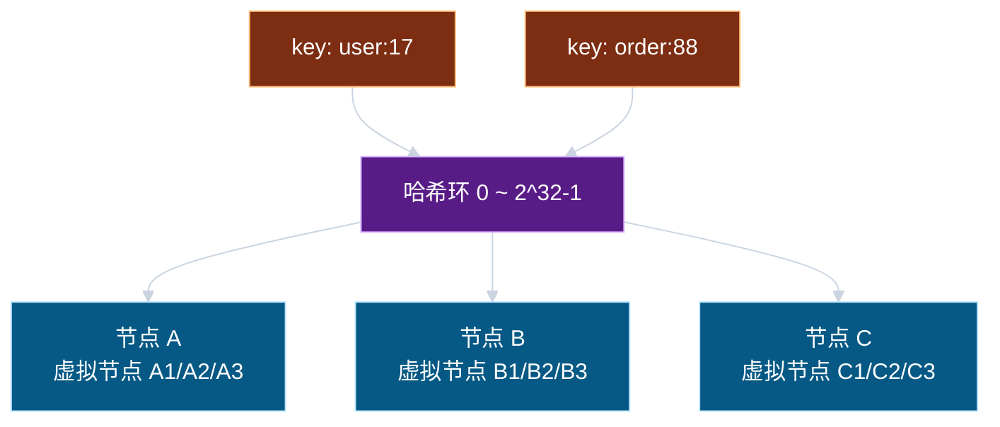
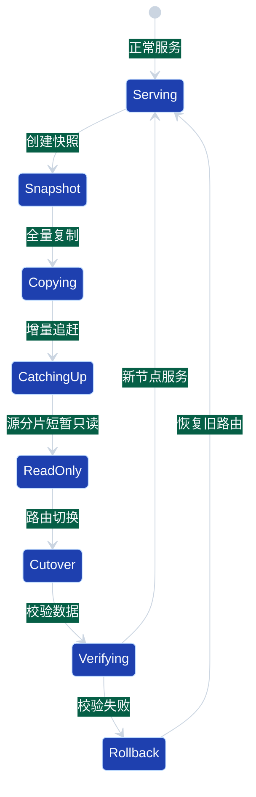

# 第 4 章：复制、分片与数据分布

> 面向想系统学习分布式系统设计的中文开发者。本章关注一个核心问题：当单机无法承载容量、吞吐或可用性要求时，数据应该如何复制、切分和放置。

## 学习目标

学完本章后，你应该能够：

1. 区分复制（replication）与分片（sharding/partitioning）的目标和代价。
2. 解释主从复制、多主复制、无主复制的基本读写路径。
3. 理解水平分片、垂直分片、范围分片、哈希分片和一致性哈希的适用场景。
4. 设计一个简单但可落地的数据分布方案，包括路由、扩容、迁移和热点处理。
5. 识别常见误区：把复制当作强一致、把分片当作无限扩展、忽视再均衡成本等。

## 1. 为什么需要复制与分片

单机数据库或单个存储节点通常会遇到三类上限：

- **容量上限**：磁盘、内存、索引体积无法继续增长。
- **吞吐上限**：CPU、IOPS、网络带宽不足。
- **可用性上限**：单节点故障会导致服务不可用或数据丢失。

复制和分片分别解决不同问题：

| 技术 | 主要目标 | 典型收益 | 典型代价 |
| --- | --- | --- | --- |
| 复制 | 提高可用性、读扩展、容灾 | 节点故障后可切换；读请求可分摊 | 一致性、复制延迟、冲突处理 |
| 分片 | 水平扩展容量与写吞吐 | 数据分散到多个节点；单节点压力下降 | 路由复杂、跨分片查询、迁移成本 |

一句话：**复制让同一份数据有多个副本；分片让不同数据落在不同节点。**

## 2. 核心概念

### 2.1 副本、副本集与复制因子

- **副本（replica）**：一份数据的拷贝。
- **副本集（replica set）**：维护同一数据集合的多个副本节点。
- **复制因子（replication factor）**：每条数据保存几份。例如 RF=3 表示每条数据有 3 个副本。

复制因子越高，容错能力越强，但写入成本、存储成本和一致性协调成本也越高。

### 2.2 主从复制

主从复制也叫 leader-follower replication：所有写入先到主节点，主节点再把变更复制给从节点。



优点：

- 写路径简单，冲突少。
- 从节点可承担读请求，提高读吞吐。
- 主节点故障后可选举新主。

缺点：

- 主节点是写入瓶颈。
- 异步复制存在复制延迟。
- 主从切换期间可能出现短暂不可用或数据回滚。

### 2.3 同步复制、异步复制与半同步复制

| 模式 | 写入成功条件 | 优点 | 风险 |
| --- | --- | --- | --- |
| 同步复制 | 主节点和指定副本都确认 | 数据丢失风险低 | 写延迟高；副本慢会拖慢整体 |
| 异步复制 | 主节点本地成功即返回 | 写延迟低 | 主节点故障时可能丢失未复制数据 |
| 半同步复制 | 至少一个从节点确认后返回 | 折中延迟和安全性 | 仍需处理超时和降级策略 |

工程上很少简单地说“复制是强一致”。真正要问的是：**写成功返回时，哪些副本已经持久化？失败时如何恢复？读请求会读哪个副本？**

### 2.4 分片与分区

在很多语境中，shard 和 partition 会混用。为了工程讨论清晰，可以这样理解：

- **逻辑分片**：数据按规则划分出的逻辑集合，例如 user_id % 64。
- **物理分片**：实际承载数据的存储节点或节点组。
- **分片映射**：逻辑分片到物理节点的映射关系。

引入逻辑分片有一个好处：扩容时不必修改业务层分片规则，只需要调整逻辑分片到物理节点的映射。

## 3. 常见数据分布策略

### 3.1 范围分片

按 key 的范围划分，例如：

- user_id 1 ~ 1,000,000 放到 shard-1
- user_id 1,000,001 ~ 2,000,000 放到 shard-2

优点：

- 范围查询高效。
- 分片规则直观。

缺点：

- 容易产生热点。例如新注册用户 ID 递增，写入集中在最后一个分片。
- 数据分布可能不均匀。

适合场景：时间线归档、按地区或租户自然划分、需要大量范围扫描的业务。

### 3.2 哈希分片

对分片键做哈希，再取模：

```text
shard = hash(user_id) % shard_count
```

优点：

- 数据通常更均匀。
- 实现简单。

缺点：

- 扩容时 shard_count 变化会导致大量 key 重新映射。
- 范围查询需要访问多个分片。

适合场景：按用户、订单、设备等实体 ID 查询为主，范围查询不强依赖单分片。

### 3.3 一致性哈希

一致性哈希将节点和数据 key 都映射到同一个环上，key 顺时针找到的第一个节点就是目标节点。扩容或缩容时，主要迁移相邻区间的数据。



一致性哈希通常会引入**虚拟节点**，避免真实节点数量较少时分布不均。

### 3.4 目录服务 / 元数据路由

分片映射不写死在客户端，而是放在一个元数据服务中：

```text
logical_shard_00 -> node-a
logical_shard_01 -> node-a
logical_shard_02 -> node-b
logical_shard_03 -> node-c
```

客户端或网关先查询路由表，再访问对应节点。优点是扩容、迁移、故障切换更灵活；缺点是元数据服务本身需要高可用和缓存失效机制。

## 4. 直观例子：用户订单系统如何分片

假设你设计一个订单系统：

- 订单量预计 3 年增长到 100 亿。
- 主要查询模式是：用户查看自己的订单列表、订单详情、商家查看店铺订单。
- 写入峰值很高，单库无法承载。

一个常见设计是：

1. 订单主表按 `user_id` 哈希分片。
2. 每个用户的订单尽量落在同一个分片，用户订单列表查询只访问一个分片。
3. 订单详情中携带 `user_id` 或者使用订单号编码出分片信息，避免查详情时广播。
4. 商家维度查询用异步构建的索引表或搜索/分析链路承载，不强行让主分片同时满足所有查询模式。

为什么不直接按 `order_id` 分片？

- 如果用户订单列表是核心路径，按 `order_id` 分片会导致“查某用户所有订单”需要扫多个分片。
- 如果订单号里可以解析出 user_id 或 shard_id，则详情查询仍然可以精确路由。

一个重要原则：**分片键应该优先服务最高频、最高价值、最难横向扩展的访问路径。**

## 5. 工程示例：逻辑分片路由

下面是一个不依赖外部服务的 Go 风格伪代码，展示如何将逻辑分片和物理节点解耦。

```go
type ShardID int

type Node struct {
    Name string
    Addr string
}

type Router struct {
    // 逻辑分片到物理节点的映射，可来自配置文件、数据库或配置中心。
    table map[ShardID]Node
    // 逻辑分片数量固定为 1024，避免扩容时改变 hash % N 的 N。
    logicalShardCount int
}

func NewRouter(table map[ShardID]Node) *Router {
    return &Router{table: table, logicalShardCount: 1024}
}

func (r *Router) RouteUser(userID string) (ShardID, Node, bool) {
    shard := ShardID(hash32(userID) % uint32(r.logicalShardCount))
    node, ok := r.table[shard]
    return shard, node, ok
}

func hash32(s string) uint32 {
    // 实际工程中可使用稳定的非加密哈希，例如 fnv/crc32/murmurhash。
    var h uint32 = 2166136261
    for i := 0; i < len(s); i++ {
        h ^= uint32(s[i])
        h *= 16777619
    }
    return h
}
```

落地建议：

- **固定较大的逻辑分片数**：例如 1024 或 4096，后续扩容只迁移部分逻辑分片。
- **路由表带版本号**：请求日志记录路由版本，便于排查迁移期间的问题。
- **迁移期间双读/双写要谨慎**：更推荐有明确状态机，例如 `Serving`、`Migrating`、`ReadOnly`、`Cutover`。
- **业务 ID 包含路由信息**：订单号中可编码 `shard_id`，减少二次查询。

## 6. 分片迁移与再均衡

扩容不是简单加机器，核心难点在数据迁移和一致性切换。

一个可控的迁移流程：



关键点：

1. **全量复制**：复制迁移开始时的历史数据。
2. **增量追赶**：复制迁移期间产生的新写入，通常基于日志或变更流。
3. **切流窗口**：让源分片进入短暂只读，确保最后一段增量追平。
4. **路由切换**：更新路由表版本，让新请求访问目标节点。
5. **校验与回滚**：对比行数、校验和、关键业务数据，保留旧数据一段时间。

## 7. 热点问题

分片后仍然可能有热点：

- **热点 key**：某个明星用户、爆款商品、热门直播间被频繁访问。
- **热点分片**：分片键选择不当导致大量请求集中在少数分片。
- **时间热点**：按时间范围分片时，最新时间段写入压力最大。

常见处理方法：

| 热点类型 | 处理方法 | 注意事项 |
| --- | --- | --- |
| 读热点 | 缓存、多副本读、请求合并 | 缓存击穿和一致性策略要明确 |
| 写热点 | key 打散、队列削峰、局部聚合 | 打散后需要解决查询聚合问题 |
| 时间热点 | 时间桶 + 哈希后缀 | 范围查询会更复杂 |
| 大租户热点 | 大租户独立分片 | 需要租户迁移和资源隔离策略 |

示例：库存扣减不能简单把同一个商品库存拆到多个 key 后并发扣减，否则容易超卖。需要结合预分配库存、局部配额、最终汇总或强一致事务机制。

## 8. 常见误区

### 误区 1：复制就等于不会丢数据

异步复制下，主节点确认写入后立即宕机，尚未复制到从节点的数据可能丢失。是否丢数据取决于写成功条件、日志持久化策略和故障切换策略。

### 误区 2：读从库一定能提升性能

如果业务要求读到刚写入的数据，读从库可能读到旧值。为了读己之写，需要会话粘滞、主库读、版本等待或一致性读协议。

### 误区 3：分片后就能无限扩展

跨分片查询、全局唯一约束、分布式事务、再均衡、监控和运维都会变复杂。分片是扩展能力的开始，不是复杂度的结束。

### 误区 4：直接用 `hash(key) % 节点数`

节点数变化会导致大量 key 重新映射，引发大规模迁移。更稳妥的是固定逻辑分片数，或者使用一致性哈希加虚拟节点。

### 误区 5：只按数据量分片，不看访问模式

一个分片可能数据量不大，但请求量极高。设计分片时必须同时考虑数据量、QPS、写入峰值、查询模式和热点风险。

## 9. 面试 / 设计题思考

### 题目 1：如何设计一个支持亿级用户的用户资料系统？

思考方向：

- 用户资料按 `user_id` 哈希分片。
- 读多写少，可使用主从复制和缓存。
- 用户名唯一性需要单独的唯一索引服务或按用户名分片的索引表。
- 扩容采用固定逻辑分片数，迁移逻辑分片到新节点。
- 关键路径要考虑读己之写，例如用户刚改昵称后立即查看。

### 题目 2：如何处理某个大客户的数据量超过单分片？

思考方向：

- 普通租户按 tenant_id 分片，大租户单独拆分。
- 大租户内部可按 user_id、时间或业务对象二级分片。
- 路由层需要支持“租户级特殊规则”。
- 迁移前后要保证权限、账单、审计和备份策略一致。

### 题目 3：订单系统为什么常把 shard_id 编进订单号？

思考方向：

- 订单详情查询可以从订单号直接定位分片。
- 避免全分片广播查询。
- 便于排障和数据迁移。
- 需要注意不要泄露敏感业务规模，可对编码做混淆或只暴露不连续 ID。

## 10. 章节小结

本章讨论了分布式数据设计中最基础也最容易踩坑的两个能力：复制与分片。

- 复制解决副本冗余、读扩展和容灾，但引入复制延迟、冲突和故障切换问题。
- 分片解决容量和写吞吐扩展，但引入路由、跨分片查询、再均衡和热点问题。
- 分片键不是纯技术选择，而是业务访问模式的选择。
- 工程上推荐用固定逻辑分片数或一致性哈希降低扩容迁移成本。
- 任何数据分布方案都必须同时设计迁移、回滚、监控和热点处理。

下一章将继续讨论：当数据有多个副本、网络可能分区、节点可能失败时，系统到底能承诺怎样的一致性模型，以及 CAP 和 PACELC 如何帮助我们做取舍。
