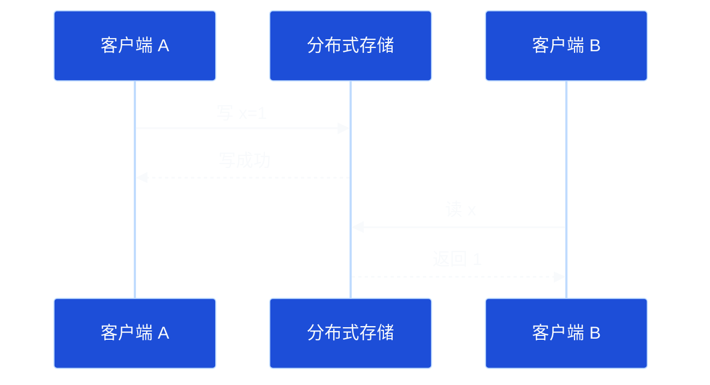
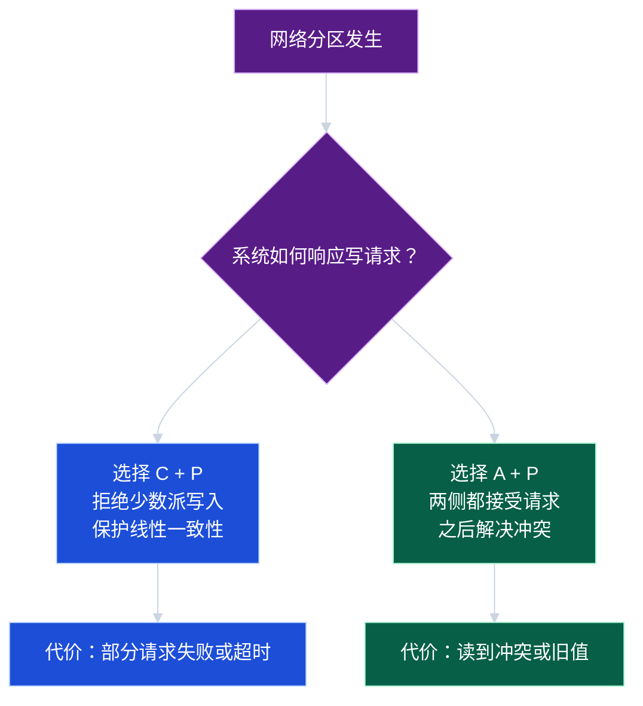
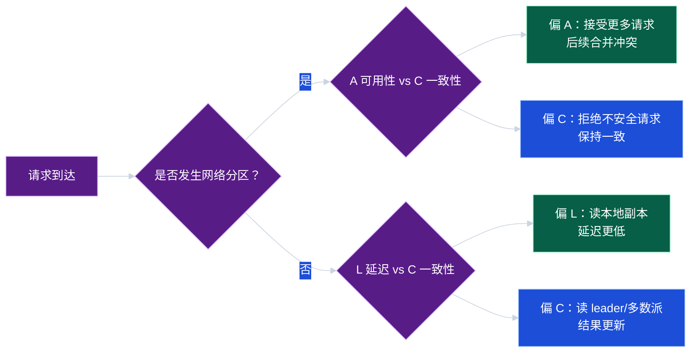

# 第 5 章：一致性模型与 CAP / PACELC

> 分布式系统设计不是简单地追求“强一致”或“高可用”，而是在业务语义、延迟、故障模式和成本之间做清晰取舍。本章帮助你建立一致性模型的语言体系，并理解 CAP 与 PACELC 的工程含义。

## 学习目标

学完本章后，你应该能够：

1. 区分线性一致性、顺序一致性、因果一致性、读己之写、单调读和最终一致性。
2. 用业务语言解释不同一致性级别的用户体验和工程成本。
3. 正确理解 CAP：网络分区发生时，一致性和可用性不能同时完全保证。
4. 理解 PACELC：不仅分区时要取舍，正常情况下也要在延迟和一致性之间取舍。
5. 在设计题中为具体业务选择合适的一致性策略，而不是泛泛地说“用强一致”。

## 1. 为什么一致性这么难

单机程序里，读写通常发生在同一个内存或同一个数据库实例上。分布式系统中，数据可能有多个副本，客户端可能访问不同节点，网络可能延迟、丢包、重试或分区。

这会带来几个问题：

- 用户刚写入的数据，下一次读取是否一定能看到？
- 两个用户同时修改同一资源，最终结果如何确定？
- 主节点故障切换后，已确认的写入是否可能丢失？
- 网络分区时，系统应该拒绝请求还是继续接受写入？

一致性模型就是回答这些问题的契约。它不是某个数据库标签，而是系统对外承诺的可观察行为。

## 2. 核心概念：常见一致性模型

### 2.1 线性一致性

线性一致性（linearizability）是最接近单机直觉的一致性模型。

如果一个写操作在时间上先完成，那么之后开始的读操作必须看到这个写，或者看到更新的值。系统表现得像所有操作都按某个全局顺序、瞬间发生。



适用场景：

- 分布式锁。
- 账户余额扣减。
- 库存不能超卖的核心路径。
- 元数据变更，例如主节点选举结果、配置版本。

代价：

- 通常需要多数派确认或单 leader 串行化。
- 跨地域部署时延迟明显增加。
- 分区时可能拒绝服务以保护一致性。

### 2.2 顺序一致性

顺序一致性（sequential consistency）要求所有操作看起来按某个全局顺序执行，并且每个客户端自己的操作顺序保持不变。但这个全局顺序不一定符合真实时间。

它比线性一致性弱，因为它不强制“写成功后，真实时间上后续读必须看到”。

### 2.3 因果一致性

因果一致性（causal consistency）保证有因果关系的操作顺序被所有人观察到。

例如：

1. 小明发帖：“我换工作了”。
2. 小红回复：“恭喜新工作”。

如果用户看到了小红的回复，就应该也能看到小明的原帖。否则用户会困惑。

因果一致性适合社交动态、评论、协同编辑等场景。它通常比线性一致性便宜，但需要跟踪版本向量、依赖关系或会话上下文。

### 2.4 读己之写

读己之写（read-your-writes）保证同一个用户写入成功后，自己后续读取能看到该写入。

例如用户修改头像后刷新页面，应该看到新头像；别人晚几秒看到旧头像通常可以接受。

实现方式：

- 写后短时间内读主库。
- 用户会话粘滞到同一副本。
- 请求携带版本号，读副本等待追赶到该版本。
- 客户端短暂使用本地提交结果进行展示。

### 2.5 单调读

单调读（monotonic reads）保证同一个客户端不会先读到新值、后读到旧值。

典型问题：用户第一次请求打到较新的副本，第二次请求打到较旧的副本，页面内容“倒退”。

解决方式：

- 会话粘滞。
- 读请求携带上次看到的版本。
- 负载均衡只路由到满足版本要求的副本。

### 2.6 最终一致性

最终一致性（eventual consistency）表示：如果不再有新的写入，所有副本最终会收敛到相同状态。

适用场景：

- 点赞数、浏览量、排行榜等允许短暂不准确的数据。
- 缓存和搜索索引。
- 异步通知、消息计数、推荐特征。

最终一致性不是“随便不一致”。它仍然需要明确：

- 最终大概多久？秒级、分钟级还是小时级？
- 冲突如何解决？最后写入获胜、业务合并还是人工处理？
- 用户是否会看到回退、重复或丢失？

## 3. 直观例子：不同业务需要不同一致性

| 场景 | 推荐一致性 | 原因 |
| --- | --- | --- |
| 银行转账扣款 | 线性一致性或事务一致性 | 不能重复扣款或凭空丢钱 |
| 商品库存核心扣减 | 强一致或有界超卖控制 | 超卖会造成直接损失 |
| 用户资料修改后本人查看 | 读己之写 | 用户体验要求立即可见 |
| 社交评论楼中楼 | 因果一致性 | 回复不能早于被回复内容出现 |
| 点赞数展示 | 最终一致性 | 短暂误差可接受，吞吐更重要 |
| 搜索索引更新 | 最终一致性 | 主链路写入不应被索引延迟拖慢 |

设计一致性时，不要问“系统要不要强一致”，而要问：**哪个字段、哪个操作、哪个用户视角需要什么保证？**

## 4. CAP 定理

CAP 指三个性质：

- **Consistency（一致性）**：在 CAP 语境下通常指线性一致性。
- **Availability（可用性）**：每个非故障节点收到请求后都能在有限时间内返回非错误响应。
- **Partition tolerance（分区容忍性）**：网络分区发生时系统仍然能继续运行。

CAP 的核心不是“三选二”的口号，而是：**当网络分区发生时，系统无法同时保证线性一致性和完全可用性。**



### 4.1 CP 系统倾向

CP 系统在分区时更重视一致性。典型策略：

- 只有多数派分区可以继续处理写入。
- 少数派节点拒绝写入或只提供只读服务。
- 通过共识算法确认 leader 和日志顺序。

适合：元数据、锁服务、配置中心、金融核心账务等。

### 4.2 AP 系统倾向

AP 系统在分区时更重视可用性。典型策略：

- 分区两侧都可以接受写入。
- 使用版本向量、时间戳、CRDT 或业务规则解决冲突。
- 分区恢复后进行反熵同步。

适合：购物车、用户草稿、点赞、边缘缓存、部分协同场景。

### 4.3 CAP 常见误解

1. **误解：任何时候只能三选二。** 其实分区没发生时，系统仍然可以同时提供较好的一致性和可用性，只是有延迟成本。
2. **误解：P 可以不要。** 分布式系统无法阻止网络故障，真正的选择是在分区时如何降级。
3. **误解：AP 就是不一致。** AP 系统也可以提供会话一致性、因果一致性或最终一致性。
4. **误解：CP 就是永远不可用。** CP 通常只在无法获得多数派或无法确认 leader 时拒绝部分请求。

## 5. PACELC：正常情况下也要取舍

PACELC 是对 CAP 的扩展：

- **P**artition：如果发生分区，系统在 **A**vailability 和 **C**onsistency 之间取舍。
- **E**lse：否则，在正常情况下，系统在 **L**atency 和 **C**onsistency 之间取舍。



PACELC 的价值在于提醒我们：即使没有故障，强一致也不是免费的。

例如跨地域三副本写入：

- 若每次写入都等待跨洲多数派确认，一致性更强，但延迟高。
- 若本地写成功后异步复制到远端，延迟低，但故障时可能丢失最近写入或读到旧数据。

## 6. 工程示例：带版本的读己之写

下面是一个 Java 风格伪代码，展示如何让客户端在写后读请求中携带版本，避免读到旧副本。

```java
class WriteResult {
    String key;
    long version;
}

class Replica {
    String name;
    long appliedVersion;

    String read(String key) {
        return "value";
    }

    boolean hasApplied(long requiredVersion) {
        return appliedVersion >= requiredVersion;
    }
}

class ReadRouter {
    List<Replica> replicas;

    String read(String key, long minVersion) {
        for (Replica replica : replicas) {
            if (replica.hasApplied(minVersion)) {
                return replica.read(key);
            }
        }
        // 没有副本追上版本时，可选择读 leader、等待、或返回重试。
        return readFromLeader(key);
    }

    String readFromLeader(String key) {
        return "latest-value";
    }
}
```

实践要点：

- 写成功响应中返回版本号，例如日志位点、LSN、Raft index 或更新时间戳。
- 客户端后续读携带 `minVersion`。
- 路由层优先选择已追赶到该版本的副本。
- 如果没有副本满足要求，可读 leader、短暂等待，或明确返回“数据同步中”。

这个方案不是全局线性一致，但能满足很多用户体验场景：用户自己刚提交的内容不会消失。

## 7. 冲突解决策略

AP 或多主系统中，冲突无法靠口号消失，必须有明确规则。

### 7.1 最后写入获胜

最后写入获胜（Last Write Wins, LWW）按时间戳或版本选择一个值。

优点：简单。缺点：可能丢失并发更新。例如两个设备离线编辑同一篇笔记，较早同步的内容可能被覆盖。

### 7.2 业务合并

根据业务语义合并冲突：

- 购物车：两个副本都添加了不同商品，可以取并集。
- 用户标签：可以合并标签集合。
- 账户余额：不能简单合并，必须使用事务或幂等流水。

### 7.3 CRDT 思路

CRDT（Conflict-free Replicated Data Type）通过数据结构设计保证并发更新可交换、可结合、可幂等，从而自动收敛。

适合计数器、集合、协同状态等特定场景。但它不是万能药，业务删除、权限、配额和审计仍然需要谨慎设计。

## 8. 选择一致性级别的工程方法

可以按以下步骤分析：

1. **列出操作**：创建、更新、删除、查询、聚合分别是什么。
2. **标出风险**：旧读、丢写、重复写、冲突写分别会造成什么后果。
3. **按字段区分**：余额字段和昵称字段不需要同一等级的一致性。
4. **按用户视角区分**：作者本人、其他用户、后台运营看到的数据可有不同延迟。
5. **定义 SLO**：例如 99% 的搜索索引 5 秒内可见，而不是模糊地说最终一致。
6. **设计降级**：分区、超时、主从延迟过大时如何响应。

## 9. 常见误区

### 误区 1：最终一致性就是不保证

最终一致性必须说明收敛机制、冲突处理和可接受延迟。否则只是把复杂度留给用户。

### 误区 2：强一致一定最好

强一致会增加延迟、降低可用性，并限制部署拓扑。对点赞数、浏览量等场景强行强一致，通常是成本大于收益。

### 误区 3：CAP 可以指导所有设计细节

CAP 主要讨论网络分区时的一致性与可用性取舍。正常情况下的延迟、一致性、副本距离和读写路径，需要 PACELC 与具体业务指标补充分析。

### 误区 4：只要用多数派就不会出问题

多数派协议还需要处理 leader 租约、时钟假设、日志持久化、重复请求、快照恢复、成员变更等工程细节。

### 误区 5：读缓存一定不影响一致性

缓存是额外副本。只要有副本，就有一致性问题：失效顺序、更新失败、并发写、缓存击穿都会影响用户看到的数据。

## 10. 面试 / 设计题思考

### 题目 1：设计一个点赞系统，是否需要强一致？

思考方向：

- 点赞动作本身需要幂等，避免同一用户重复点赞。
- 点赞总数展示可以最终一致。
- 用户是否已点赞通常需要读己之写，否则按钮状态会跳变。
- 高峰期可先写入事件日志，再异步聚合计数。
- 若业务有抽奖、排名奖励，相关部分需要更强一致或冻结结算窗口。

### 题目 2：购物车适合 CP 还是 AP？

思考方向：

- 用户添加商品时可用性和低延迟很重要。
- 多设备并发修改可以按业务规则合并，例如商品集合取并集、数量取最大或累加。
- 下单结算时必须重新校验价格、库存和优惠。
- 所以购物车本身可偏 AP/最终一致，订单创建阶段再进入强一致链路。

### 题目 3：跨地域部署的配置中心如何取舍？

思考方向：

- 配置变更通常要求顺序和可审计，适合 CP。
- 读配置可以本地缓存，但要有版本和回滚机制。
- 分区时少数派不应接受写配置，否则可能造成不同地域行为不一致。
- 紧急开关可单独设计本地兜底，但要限制作用范围和过期时间。

## 11. 章节小结

本章建立了一致性模型的基本语言：

- 线性一致性最强，接近单机直觉，但延迟和可用性成本高。
- 因果一致性、读己之写、单调读等会话级保证，常常能用更低成本满足用户体验。
- 最终一致性需要明确收敛时间和冲突解决策略，不是“不管一致性”。
- CAP 讨论网络分区时 C 与 A 的取舍；PACELC 进一步说明正常情况下 L 与 C 也要取舍。
- 好的系统设计会按操作、字段、用户视角分别定义一致性，而不是给整个系统贴一个笼统标签。

下一章将进入共识算法，重点学习 Raft 如何在不可靠网络和节点故障下，让多个节点对日志顺序达成一致，以及租约机制如何在工程中降低读路径成本。
