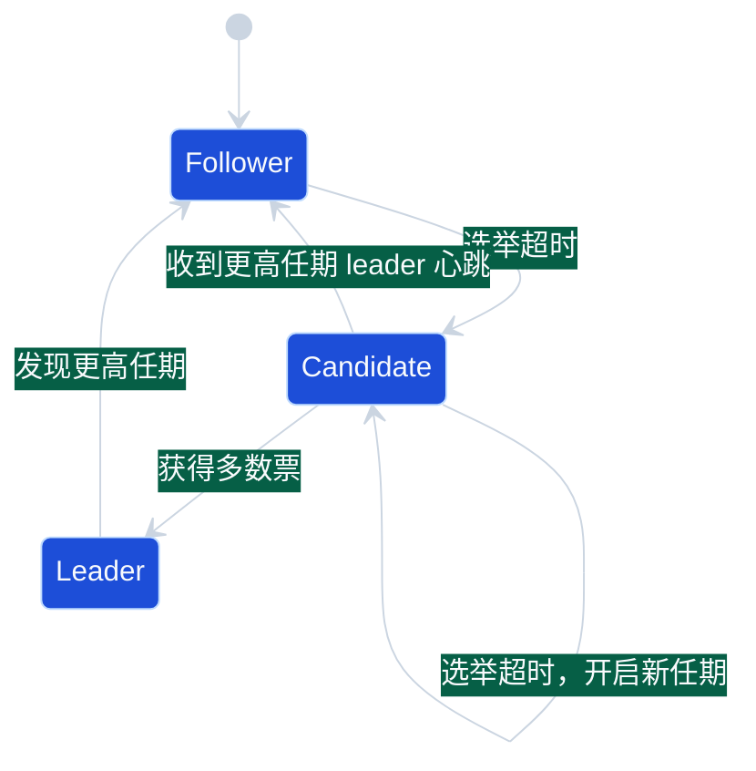
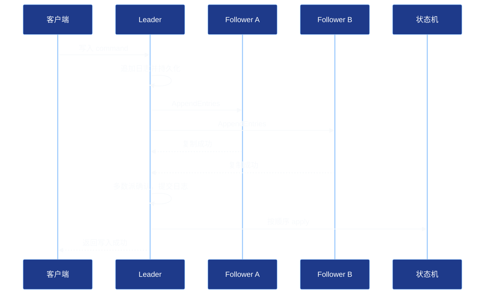
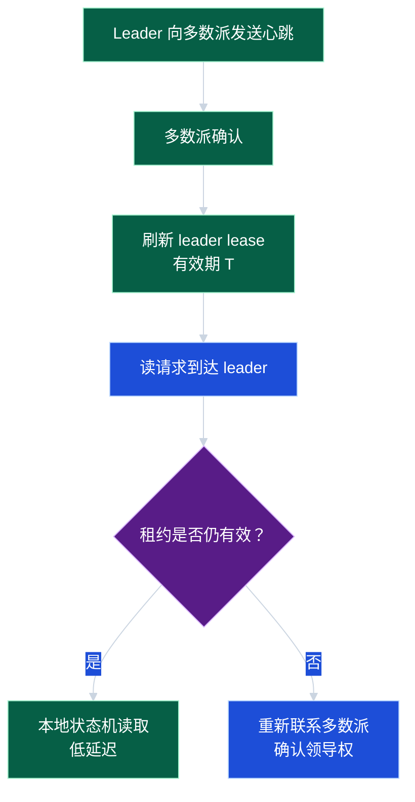

# 第 6 章：共识算法、Raft 与租约

> 共识算法是很多分布式系统的“地基”：配置中心、元数据服务、分布式锁、主节点选举和强一致存储都离不开它。本章以 Raft 为主线，理解共识算法解决什么问题、如何工作，以及租约在工程中的收益与风险。

## 学习目标

学完本章后，你应该能够：

1. 解释共识算法要解决的问题：在节点故障和网络不可靠的情况下，对同一系列决策达成一致。
2. 理解 Raft 的三个核心部分：领导者选举、日志复制、安全性约束。
3. 描述一次写请求在 Raft 集群中的完整路径。
4. 理解多数派提交、任期、日志索引、提交索引、应用状态机等概念。
5. 说明租约读的性能价值和时钟假设风险。
6. 在设计题中判断哪些场景需要共识，哪些场景不应滥用共识。

## 1. 为什么需要共识

假设有 3 个节点共同维护一份配置：

```text
feature_x_enabled = false
```

管理员把它改成：

```text
feature_x_enabled = true
```

如果只有一个节点收到更新，另一个节点宕机，第三个节点网络延迟，那么系统如何确保：

- 最终不会同时出现两个“最新配置”？
- 已经对外确认成功的配置不会在故障切换后消失？
- 新 leader 不会覆盖旧 leader 已提交的结果？

共识算法解决的是：**多个节点对一串操作的顺序和结果达成一致。**

常见使用场景：

- 分布式配置和服务发现的元数据。
- 数据库主从切换的 leader 选举。
- 分布式锁和租约持有者记录。
- 强一致 KV 存储。
- 分布式任务调度的任务归属。

不适合的场景：

- 高频大流量的普通业务写入全部走共识，可能成本过高。
- 点赞数、浏览量等允许最终一致的数据。
- 可通过幂等、去重、异步补偿解决的问题。

## 2. Raft 的设计目标

Raft 与 Paxos 一样用于解决共识问题，但 Raft 更强调可理解性。它把问题拆成三个部分：

1. **领导者选举（Leader Election）**：集群在同一任期内最多有一个 leader。
2. **日志复制（Log Replication）**：客户端写入先追加到 leader 日志，再复制给 follower。
3. **安全性（Safety）**：已经提交的日志不会被覆盖，新 leader 必须包含所有已提交日志。

Raft 集群通常使用奇数个节点，例如 3、5、7 个。多数派数量为：

```text
quorum = floor(n / 2) + 1
```

| 节点数 | 多数派 | 可容忍故障节点数 |
| --- | --- | --- |
| 3 | 2 | 1 |
| 5 | 3 | 2 |
| 7 | 4 | 3 |

节点越多，容错更强，但每次写入需要等待更多复制确认，延迟和成本也更高。

## 3. Raft 核心概念

### 3.1 节点角色

Raft 节点有三种角色：

- **Leader**：处理客户端写入，向 follower 复制日志。
- **Follower**：被动接收 leader 的心跳和日志。
- **Candidate**：选举期间的候选人。



### 3.2 任期

任期（term）是 Raft 中的逻辑时间。每次选举都会递增任期。

任期的作用：

- 识别过期 leader。
- 拒绝旧任期请求。
- 保证选举和日志复制有清晰的先后关系。

如果一个节点看到比自己更高的任期，它必须更新本地任期并转为 follower。

### 3.3 日志条目

每条日志通常包含：

- `index`：日志位置。
- `term`：创建该日志时 leader 的任期。
- `command`：要应用到状态机的操作。

示例：

```text
index=8, term=3, command="set max_connections=200"
```

### 3.4 提交与应用

- **复制到多数派**：日志条目被超过半数节点持久化。
- **提交（commit）**：leader 判断该日志已经安全，可以对外确认。
- **应用（apply）**：节点把已提交日志按顺序应用到状态机。

注意：日志写入磁盘、日志提交、应用到状态机是三个不同阶段。

## 4. Raft 写入流程

一次写请求的典型流程：



关键点：

1. 客户端写入应发送给 leader。发送到 follower 时，follower 通常重定向到 leader。
2. leader 先把命令追加到自己的日志。
3. leader 并发向 follower 发送 AppendEntries。
4. 当日志被多数派复制，leader 更新 commit index。
5. leader 将已提交日志应用到状态机，再返回结果。
6. follower 通过后续心跳得知 commit index，并应用相同日志。

## 5. 领导者选举

每个 follower 都有选举超时时间。如果在超时内没有收到 leader 心跳，它会转为 candidate：

1. 当前任期加一。
2. 给自己投票。
3. 向其他节点发送 RequestVote。
4. 获得多数票后成为 leader。

为什么选举超时要随机化？

如果所有节点同时超时，它们会同时成为 candidate，互相抢票，导致选举反复失败。随机超时可以降低投票分裂概率。

候选人是否能拿到票，还取决于日志是否足够新。Raft 要求投票者不能把票投给日志落后的候选人，以防已提交日志丢失。

## 6. 日志复制与冲突修复

网络故障或 leader 切换可能造成日志不一致。例如旧 leader 在少数派中追加了未提交日志，随后新 leader 产生了不同日志。

Raft 使用 `prevLogIndex` 和 `prevLogTerm` 检查 follower 日志是否与 leader 对齐：

```text
AppendEntries(prevLogIndex=10, prevLogTerm=4, entries=[...])
```

如果 follower 在 index=10 的日志任期不是 4，说明日志不匹配，它会拒绝请求。leader 递减 nextIndex，继续查找共同前缀，找到后覆盖 follower 上的冲突日志。

这个机制保证：**一旦 follower 某个位置的日志与 leader 匹配，那么它之前的日志也匹配。**

## 7. 安全性：为什么已提交日志不会丢

Raft 的安全性依赖几个约束：

- 同一任期最多一个 leader 能赢得多数派。
- leader 只追加日志，不修改自己的历史日志。
- 已提交日志必须存在于多数派节点上。
- 新 leader 必须获得多数票；两个多数派必然有交集。
- 投票规则要求候选人日志不能落后于投票者。

因此，如果某条日志已经提交，它所在的多数派会与下一任 leader 的选举多数派有交集。只要投票规则正确，新 leader 就不会缺失已提交日志。

## 8. 工程示例：极简 Raft 写入伪代码

下面是 Go 风格伪代码，省略网络、持久化错误和快照细节，只强调写入路径的关键判断。

```go
type Command struct {
    Op  string
    Key string
    Val string
}

type LogEntry struct {
    Index   int
    Term    int
    Command Command
}

type Node struct {
    id          string
    term        int
    role        string // leader, follower, candidate
    log         []LogEntry
    commitIndex int
    peers       []string
}

func (n *Node) Propose(cmd Command) (bool, string) {
    if n.role != "leader" {
        return false, "not leader"
    }

    entry := LogEntry{
        Index:   len(n.log) + 1,
        Term:    n.term,
        Command: cmd,
    }
    n.log = append(n.log, entry)
    persist(entry)

    ack := 1 // leader 自己
    for _, peer := range n.peers {
        if sendAppendEntries(peer, entry) {
            ack++
        }
    }

    if ack >= quorum(len(n.peers)+1) {
        n.commitIndex = entry.Index
        applyToStateMachine(entry)
        return true, "committed"
    }

    return false, "not enough quorum"
}

func quorum(n int) int {
    return n/2 + 1
}
```

真实系统还必须处理：

- 日志批量复制和流水线。
- follower 落后时的补日志。
- 快照压缩，避免日志无限增长。
- 成员变更，避免新旧配置脑裂。
- 客户端重试幂等，避免同一命令被重复执行。
- 磁盘刷盘策略和崩溃恢复。

## 9. 读路径：强一致读、Follower Read 与租约读

Raft 写入天然经过 leader 和多数派，但读取有多种选择。

### 9.1 直接读 leader 是否一定强一致？

不一定。旧 leader 可能因为网络分区没有及时发现自己已失去领导权。如果它继续本地读，可能返回旧数据。

强一致读常见做法：

- leader 在读之前与多数派确认自己仍是 leader。
- 或将读操作也作为日志提交。
- 或使用安全的 leader lease 前提下进行本地读。

### 9.2 Follower Read

Follower Read 可以降低 leader 压力，但 follower 可能落后。

要提供一致性更强的 follower read，通常需要：

- 请求携带最小版本或 read index。
- follower 等待 apply 到对应 index。
- 或由 leader 分配一个安全读点。

### 9.3 租约读

租约（lease）表示 leader 在一段时间内被认为仍然拥有领导权。租约有效期内，leader 可以不走多数派确认而直接本地读，从而降低读延迟。



租约的风险在于它依赖时间假设：

- 节点时钟不能任意跳变。
- GC 暂停、虚拟机挂起、系统调度延迟不能超过安全边界。
- 网络延迟和时钟漂移需要留出保守余量。

工程上常用单调时钟，避免使用可能被 NTP 调整的墙上时间；租约过期时间也会设置得明显小于选举超时，以降低双 leader 读风险。

## 10. 租约的更多工程用途

租约不只用于 Raft 读优化，也常用于资源归属：

- 分布式锁的持有期限。
- 任务调度器的 worker 心跳。
- 主节点对某个分片的服务权。
- 缓存构建者身份，避免多个节点同时重建。

但租约不是永久锁。使用时必须回答：

1. 租约过期后，旧持有者是否会停止操作？
2. 如果旧持有者发生长时间暂停，恢复后如何发现自己租约已失效？
3. 操作外部系统时，如何防止过期持有者继续写入？

常见补救是 **fencing token**：每次获得租约时拿到递增 token，外部资源只接受 token 更新的请求。

```text
worker A 获得 token=10，暂停很久
worker B 获得 token=11，开始处理任务
worker A 恢复后尝试写结果，存储层发现 token=10 < 11，拒绝写入
```

## 11. 常见误区

### 误区 1：有 leader 就不会脑裂

leader 身份必须由多数派和任期保证。仅靠心跳或一个中心节点标记，很容易在网络分区和暂停时产生双 leader。

### 误区 2：多数派提交后所有节点都已经有数据

多数派不等于全部。一个 5 节点集群中，3 个节点确认即可提交，另外 2 个节点可能落后，需要后续追赶。

### 误区 3：Raft 可以让系统永远可用

如果无法形成多数派，Raft 集群无法提交新写入。Raft 偏 CP，不是 AP。

### 误区 4：租约就是普通过期时间

租约涉及分布式时间假设。时钟漂移、进程暂停、网络延迟都会破坏“我还持有租约”的判断。关键资源应结合 fencing token。

### 误区 5：所有业务写入都应该走共识

共识成本高，适合元数据和强一致核心路径。普通高吞吐业务更常通过分片、幂等、事务消息、补偿和最终一致来设计。

## 12. 面试 / 设计题思考

### 题目 1：为什么 Raft 通常使用奇数个节点？

思考方向：

- 多数派大小由 `floor(n/2)+1` 决定。
- 3 节点和 4 节点都只能容忍 1 个故障，但 4 节点写入需要 3 个确认，成本更高。
- 5 节点可容忍 2 个故障，是常见生产配置。

### 题目 2：配置中心为什么适合使用 Raft？

思考方向：

- 配置属于元数据，写入频率相对低，但正确性要求高。
- 需要全局顺序、版本、审计和回滚。
- 分区时宁愿拒绝不安全写入，也不能让两个分区产生不同最新配置。
- 读可以通过缓存和 watch 降低压力，但写路径应强一致。

### 题目 3：如何设计一个安全的分布式锁？

思考方向：

- 锁记录应存储在强一致系统中，例如基于 Raft 的 KV。
- 锁必须有租约，避免客户端崩溃后永久占用。
- 获得锁时返回 fencing token。
- 下游资源校验 token，拒绝过期持有者写入。
- 客户端续租失败必须停止执行受保护操作。

### 题目 4：旧 leader 网络分区后还能本地读吗？

思考方向：

- 如果无法确认自己仍持有多数派支持，旧 leader 可能已经失去领导权。
- 直接本地读可能违反线性一致性。
- 可以使用 ReadIndex、读日志提交或安全租约机制。

## 13. 章节小结

本章介绍了共识算法和 Raft 的核心工程逻辑：

- 共识用于让多个节点对操作顺序达成一致，常用于元数据、锁、选主和强一致 KV。
- Raft 通过 leader election、log replication 和 safety 约束降低理解难度。
- 写请求由 leader 追加日志，复制到多数派后提交，再应用到状态机。
- 多数派机制保证已提交日志不会因 leader 切换而丢失，但无法在多数派不可用时继续写入。
- 读路径需要额外设计；直接读 leader 不一定线性一致。
- 租约能优化读性能和资源归属，但必须谨慎处理时钟、暂停和 fencing token。

理解 Raft 的价值不只是会背流程，而是能判断：哪些状态必须通过共识保护，哪些状态可以用更低成本的最终一致方案处理。
