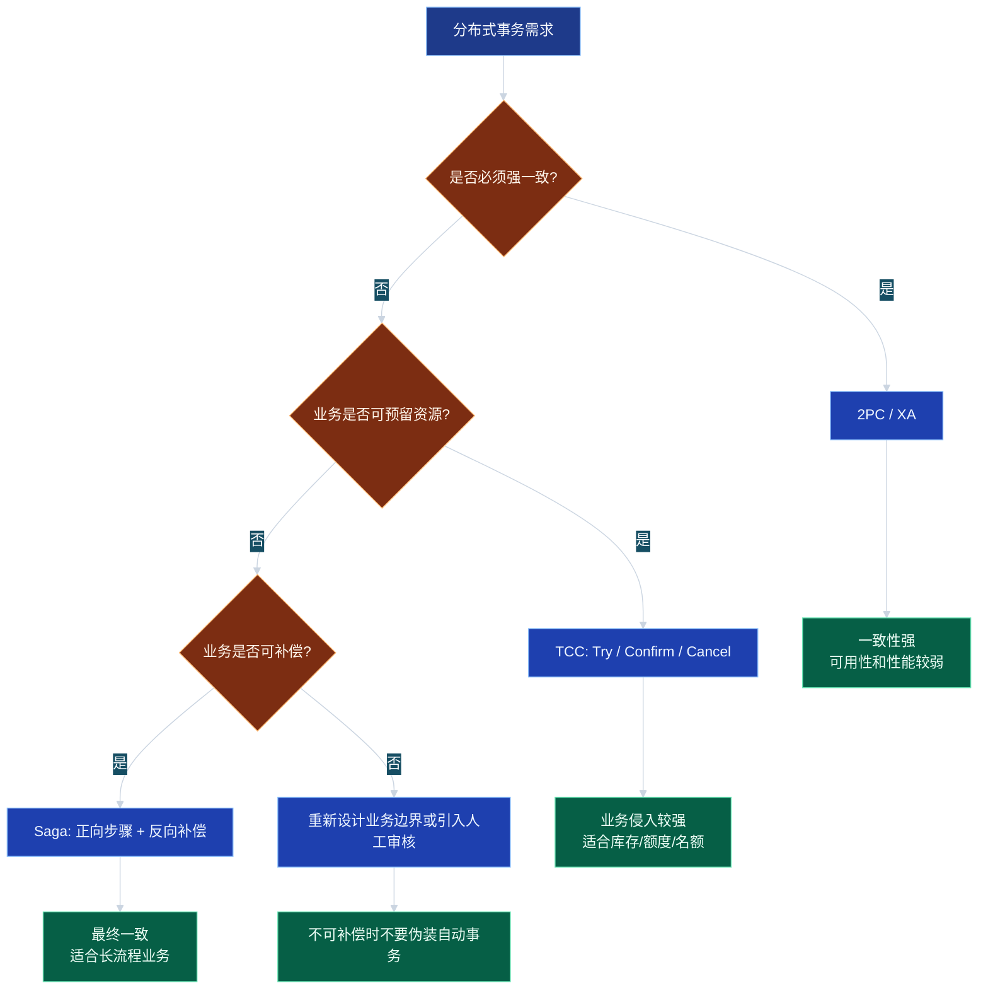
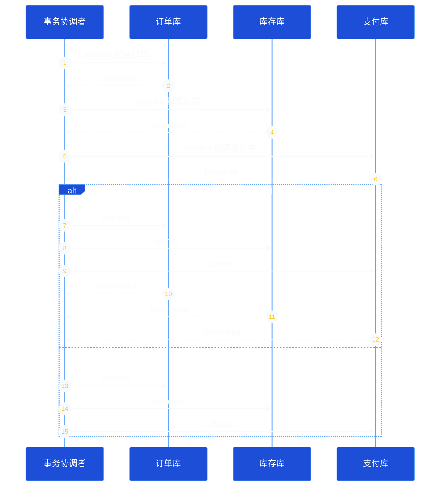
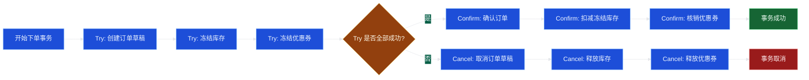
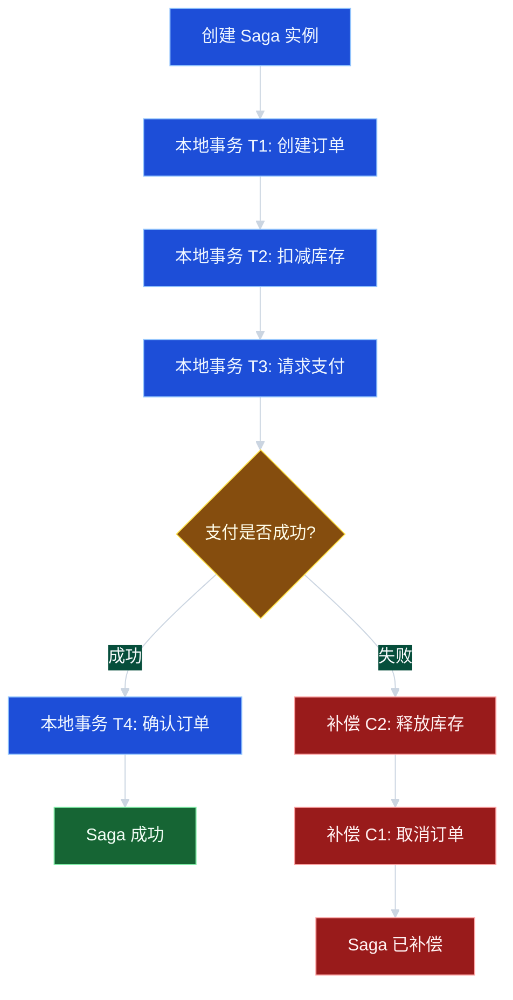
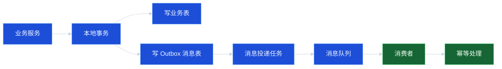

# 07_分布式事务：Saga、TCC 与两阶段提交

## 学习目标

学完本章，你应该能够：

1. 解释为什么分布式系统中很难继续依赖本地数据库事务。
2. 区分强一致事务、最终一致事务、业务补偿事务的适用场景。
3. 理解 2PC、3PC、TCC、Saga 的核心流程、优缺点和工程风险。
4. 能为订单、库存、支付等典型业务选择合适的事务方案。
5. 设计具备幂等、可重试、可观测、可恢复能力的分布式事务流程。

---

## 1. 问题背景：为什么需要分布式事务

单体应用中，业务逻辑和数据库通常在同一个进程、同一个数据库事务里完成。例如：

```text
begin transaction
  扣库存
  创建订单
  写支付记录
commit
```

只要数据库提交成功，三件事就同时成功；一旦失败，数据库回滚即可。

但在微服务或分布式系统中，这些能力往往拆到了不同服务和不同数据库中：

- 订单服务：负责订单状态。
- 库存服务：负责库存占用与扣减。
- 支付服务：负责支付单与支付状态。
- 优惠券服务：负责券核销。

此时一次下单会跨多个服务、多个数据库、多个网络调用。问题变成：

> 如果订单创建成功，但库存扣减失败，系统该怎么办？
>
> 如果库存扣减成功，但支付服务超时，系统如何判断是成功、失败，还是未知？
>
> 如果回滚请求也失败，系统是否还能恢复到一致状态？

这就是分布式事务要解决的问题。

---

## 2. 核心概念

### 2.1 ACID 与 BASE

传统数据库事务强调 ACID：

| 特性 | 含义 | 分布式场景中的挑战 |
| --- | --- | --- |
| Atomicity 原子性 | 要么全部成功，要么全部失败 | 跨服务提交无法天然原子化 |
| Consistency 一致性 | 事务前后满足业务约束 | 不同服务状态可能短暂不一致 |
| Isolation 隔离性 | 并发事务互不干扰 | 分布式锁、资源预留成本高 |
| Durability 持久性 | 提交后不丢失 | 多存储系统故障模型不同 |

分布式系统更常见的是 BASE 思想：

| 原则 | 含义 |
| --- | --- |
| Basically Available | 基本可用，优先保证核心链路能响应 |
| Soft State | 允许中间状态存在，如“处理中”“待确认” |
| Eventually Consistent | 最终一致，通过重试、补偿、对账达到一致 |

分布式事务的关键不是“永远不出现不一致”，而是：

1. 明确哪些不一致可以短暂存在。
2. 明确如何检测不一致。
3. 明确如何自动或人工修复不一致。

### 2.2 强一致与最终一致

| 类型 | 描述 | 典型方案 | 适合场景 |
| --- | --- | --- | --- |
| 强一致 | 调用返回时所有参与方状态一致 | 2PC、XA | 金融核心账务、强约束资源 |
| 最终一致 | 中间允许不一致，最终收敛 | Saga、可靠消息、事务消息 | 电商订单、物流、通知、积分 |
| 业务一致 | 通过业务状态机保证可解释 | TCC、Saga | 预留资源、可补偿业务 |

### 2.3 事务状态机

分布式事务一定要有明确状态。常见状态包括：

```text
INIT -> PROCESSING -> CONFIRMING -> SUCCESS
                  \-> CANCELING  -> CANCELED
                  \-> FAILED_MANUAL_REVIEW
```

不要只用一个布尔字段表示成功或失败。因为分布式系统里有大量“未知中间态”：

- 请求发出后服务超时，不知道对方是否执行。
- 本地写成功，远端回调失败。
- 补偿执行了一半，系统崩溃。

状态机是后续重试、补偿、对账和人工干预的基础。

---

## 3. 整体方案对比



---

## 4. 两阶段提交：2PC / XA

### 4.1 核心思想

两阶段提交 Two-Phase Commit，简称 2PC，由一个事务协调者协调多个参与者完成提交。

两个阶段：

1. Prepare 阶段：协调者询问所有参与者能否提交。
2. Commit/Rollback 阶段：如果所有参与者都准备成功，则统一提交；只要一个失败，则统一回滚。

### 4.2 流程图



### 4.3 直观例子

假设你和朋友一起订一套多人旅行套餐：

- 航班座位必须锁定。
- 酒店房间必须锁定。
- 门票名额必须锁定。

旅行平台先问三个供应商：“你们都能锁资源吗？”

- 如果都回答“能”，平台通知全部确认。
- 如果有一个回答“不能”，平台通知全部取消。

这就是 2PC 的直观逻辑。

### 4.4 优点

- 一致性强，符合传统事务思维。
- 对业务代码侵入相对较小，常由数据库、事务管理器、中间件支持。
- 适合参与者较少、事务时间短、网络稳定、强一致要求极高的场景。

### 4.5 缺点

1. **同步阻塞**：参与者在 prepared 状态可能锁住资源，等待协调者最终指令。
2. **协调者单点风险**：协调者故障时，参与者可能长时间不知道提交还是回滚。
3. **性能较低**：至少两轮网络通信，事务持续时间长。
4. **难以跨异构系统**：不是所有数据库、消息系统、外部服务都支持 XA。
5. **长事务风险高**：如果事务里包含外部支付、第三方接口，锁资源时间不可控。

### 4.6 工程建议

2PC 不适合作为所有微服务事务的默认方案。更合理的使用边界是：

- 参与方少。
- 调用链短。
- 资源锁定时间可控。
- 对一致性的要求高于可用性和吞吐。
- 所有参与资源确实支持标准协议。

---

## 5. TCC：Try / Confirm / Cancel

### 5.1 核心思想

TCC 是一种业务层分布式事务模式：

| 阶段 | 目标 | 例子 |
| --- | --- | --- |
| Try | 尝试执行业务，预留资源 | 冻结库存、冻结余额 |
| Confirm | 确认执行业务，真正提交 | 扣减冻结库存、扣减冻结余额 |
| Cancel | 取消执行业务，释放资源 | 解冻库存、解冻余额 |

TCC 本质上把数据库事务里的“锁资源、提交、回滚”显式变成业务接口。

### 5.2 下单扣库存例子

库存表可以设计为：

```text
sku_id | available_stock | frozen_stock
A001   | 100             | 0
```

Try 阶段：

```text
available_stock -= 1
frozen_stock += 1
```

Confirm 阶段：

```text
frozen_stock -= 1
```

Cancel 阶段：

```text
available_stock += 1
frozen_stock -= 1
```

### 5.3 TCC 流程



### 5.4 工程示例：TCC 接口设计伪代码

下面是接近 Go 的伪代码，重点是接口语义和幂等设计，不依赖外部服务。

```go
type TccAction interface {
    Try(ctx context.Context, txID string, req Request) error
    Confirm(ctx context.Context, txID string) error
    Cancel(ctx context.Context, txID string) error
}
```

库存服务的关键逻辑：

```go
func TryFreezeStock(txID string, skuID string, quantity int) error {
    // 1. 幂等检查：同一个 txID 已 Try 成功，直接返回成功
    if existsTccRecord(txID, "STOCK_TRY_SUCCESS") {
        return nil
    }

    // 2. 业务检查：可用库存必须足够
    stock := getStockForUpdate(skuID)
    if stock.Available < quantity {
        saveTccRecord(txID, "STOCK_TRY_FAILED")
        return ErrInsufficientStock
    }

    // 3. 冻结资源
    stock.Available -= quantity
    stock.Frozen += quantity
    updateStock(stock)

    // 4. 记录事务分支状态
    saveTccRecord(txID, "STOCK_TRY_SUCCESS")
    return nil
}

func ConfirmStock(txID string) error {
    // Confirm 需要幂等：重复 Confirm 不能重复扣减
    record := getTccRecord(txID)
    if record.Status == "STOCK_CONFIRMED" {
        return nil
    }
    if record.Status != "STOCK_TRY_SUCCESS" {
        return ErrInvalidTccState
    }

    freeze := getFreezeByTxID(txID)
    stock := getStockForUpdate(freeze.SkuID)
    stock.Frozen -= freeze.Quantity
    updateStock(stock)

    updateTccRecord(txID, "STOCK_CONFIRMED")
    return nil
}

func CancelStock(txID string) error {
    // 空回滚：Try 还没执行成功，Cancel 先到了，也要记录并返回成功
    record := getTccRecord(txID)
    if record == nil {
        saveTccRecord(txID, "STOCK_CANCELED")
        return nil
    }

    // 幂等：已经取消过，不重复释放
    if record.Status == "STOCK_CANCELED" {
        return nil
    }

    // 防悬挂：如果已经 Confirm，就不能再 Cancel
    if record.Status == "STOCK_CONFIRMED" {
        return ErrAlreadyConfirmed
    }

    freeze := getFreezeByTxID(txID)
    stock := getStockForUpdate(freeze.SkuID)
    stock.Available += freeze.Quantity
    stock.Frozen -= freeze.Quantity
    updateStock(stock)

    updateTccRecord(txID, "STOCK_CANCELED")
    return nil
}
```

### 5.5 TCC 三个经典问题

#### 5.5.1 幂等

Confirm 或 Cancel 可能因为超时而被重复调用。接口必须保证重复执行不会产生副作用。

错误做法：

```text
每收到一次 Confirm，就扣一次 frozen_stock
```

正确做法：

```text
根据 tx_id + branch_id 判断是否已经 Confirm 成功
已经成功则直接返回成功
```

#### 5.5.2 空回滚

Cancel 请求可能先于 Try 请求到达。例如协调者调用 Try 超时，以为 Try 失败，于是发起 Cancel；但 Try 请求其实还在网络中。

Cancel 如果发现没有 Try 记录，不能报错导致无限重试，而应记录一个 Canceled 状态，表示该事务分支已经取消。

#### 5.5.3 悬挂

空回滚之后，迟到的 Try 请求又到了。如果继续执行 Try，就会冻结一份永远没人 Confirm/Cancel 的资源。

解决办法：Try 执行前先检查 txID 是否已经 Canceled。如果是，则拒绝 Try。

---

## 6. Saga：长事务与补偿

### 6.1 核心思想

Saga 把一个长事务拆成多个本地事务，每个本地事务都有一个对应的补偿动作。

```text
T1 -> T2 -> T3 -> T4

如果 T3 失败，则执行：
C2 -> C1
```

注意：补偿不是数据库回滚，而是一个新的业务动作。例如：

- 支付成功后的补偿不是删除支付记录，而是退款。
- 发券成功后的补偿不是删除日志，而是作废优惠券。
- 发货后的补偿不是撤销发货记录，而是拦截物流或创建退货流程。

### 6.2 Saga 编排与协同

Saga 有两种实现方式：

| 类型 | 描述 | 优点 | 缺点 |
| --- | --- | --- | --- |
| 编排 Orchestration | 一个中央协调器按步骤调用服务 | 流程清晰，可观测性好 | 协调器复杂，可能成为中心依赖 |
| 协同 Choreography | 各服务通过事件驱动推进流程 | 服务自治，松耦合 | 全局流程分散，排查困难 |

### 6.3 Saga 编排流程



### 6.4 工程示例：Saga 状态表

可以用一张 Saga 实例表记录全局状态：

```text
saga_id | biz_type | biz_id | status       | current_step | created_at | updated_at
S001    | ORDER    | O1001  | COMPENSATING | PAY          | ...        | ...
```

再用一张步骤表记录每一步：

```text
saga_id | step_name | action_status | compensate_status | retry_count
S001    | CREATE_ORDER | SUCCESS | NOT_NEEDED | 0
S001    | DEDUCT_STOCK | SUCCESS | SUCCESS    | 1
S001    | PAY          | FAILED  | NOT_NEEDED | 0
```

伪代码：

```go
type SagaStep struct {
    Name       string
    Action     func(ctx context.Context, sagaID string) error
    Compensate func(ctx context.Context, sagaID string) error
}

func RunSaga(ctx context.Context, sagaID string, steps []SagaStep) error {
    executed := make([]SagaStep, 0, len(steps))

    for _, step := range steps {
        if err := step.Action(ctx, sagaID); err != nil {
            markStepFailed(sagaID, step.Name, err)
            compensate(ctx, sagaID, executed)
            return err
        }
        markStepSuccess(sagaID, step.Name)
        executed = append(executed, step)
    }

    markSagaSuccess(sagaID)
    return nil
}

func compensate(ctx context.Context, sagaID string, executed []SagaStep) {
    markSagaCompensating(sagaID)

    for i := len(executed) - 1; i >= 0; i-- {
        step := executed[i]
        if alreadyCompensated(sagaID, step.Name) {
            continue
        }
        if err := step.Compensate(ctx, sagaID); err != nil {
            markCompensateFailed(sagaID, step.Name, err)
            enqueueRetry(sagaID, step.Name)
            continue
        }
        markCompensateSuccess(sagaID, step.Name)
    }

    if allCompensated(sagaID) {
        markSagaCompensated(sagaID)
    }
}
```

### 6.5 Saga 适用场景

适合：

- 业务流程较长。
- 每一步可以独立提交。
- 中间状态对用户可解释，例如“订单处理中”。
- 失败后存在业务补偿手段。
- 一致性要求是最终一致，而不是强实时一致。

不适合：

- 无法补偿的操作，例如不可撤销的外部动作。
- 对外返回成功时必须所有资源立即强一致。
- 补偿成本高到不可接受的业务。

---

## 7. 可靠消息与本地事务消息

很多最终一致方案会使用消息队列。核心问题是：

> 本地数据库提交成功和消息发送成功，如何保证二者一致？

错误流程：

```text
1. 创建订单成功
2. 发送“订单已创建”消息
```

如果第 1 步成功、第 2 步失败，库存服务永远不知道该扣库存。

常见解法是本地消息表 Outbox：

```text
同一个本地事务中：
1. 写订单表
2. 写 outbox 消息表

后台任务扫描 outbox，可靠投递消息。
```



---

## 8. 常见误区

### 误区一：分布式事务就是 2PC

2PC 只是其中一种方案，而且在互联网业务中往往不是首选。多数业务更适合 Saga、TCC、可靠消息、对账补偿等最终一致方案。

### 误区二：补偿等于回滚

补偿是新的业务动作，不是数据库的 undo log。退款、解冻、作废、冲正都需要业务含义。

### 误区三：只要加重试就能保证一致

重试只能解决临时失败，不能解决接口非幂等、状态机缺失、消息丢失、补偿不可执行等设计问题。

### 误区四：忽略未知状态

超时不等于失败。调用支付、库存、外部系统时，超时只能表示“本方没有收到结果”。必须通过查询、回调、对账确认最终状态。

### 误区五：没有人工处理通道

有些异常无法完全自动修复，例如第三方系统长期不可用、数据被人工改错、补偿规则冲突。成熟系统必须支持人工审核、冻结、冲正和审计。

---

## 9. 面试 / 设计题思考

### 题目一：订单、库存、支付跨服务，如何保证一致性？

回答思路：

1. 先说明一致性级别：是否必须强一致。
2. 如果是普通电商下单，通常可接受最终一致。
3. 库存可用 TCC 冻结，订单用状态机，支付通过回调和主动查询确认。
4. 用事务表记录全局事务和分支状态。
5. 所有接口保证幂等。
6. 失败后通过补偿、重试、对账处理。
7. 对异常状态提供人工干预。

### 题目二：TCC 中如何解决空回滚和悬挂？

回答要点：

- 空回滚：Cancel 到达时没有 Try 记录，应写入 Canceled 记录并返回成功。
- 悬挂：Try 执行前检查事务记录，如果已经 Canceled，则拒绝 Try。
- 核心依赖 tx_id、branch_id、状态机和唯一约束。

### 题目三：Saga 的补偿失败怎么办？

回答要点：

- 补偿操作也必须幂等。
- 记录补偿状态和失败原因。
- 使用定时任务或延迟队列重试。
- 达到最大重试次数后进入人工处理。
- 通过对账发现漏补偿或重复补偿。

### 题目四：什么时候选择 2PC？

回答要点：

- 强一致要求极高。
- 参与方少且可靠。
- 事务短小，不包含长时间外部调用。
- 所有资源管理器支持 XA 或等价协议。
- 能接受性能和可用性损失。

---

## 10. 工程落地清单

设计分布式事务时，建议逐项检查：

- [ ] 是否明确一致性要求：强一致、最终一致还是人工一致。
- [ ] 是否有全局事务 ID 和分支事务 ID。
- [ ] 每个步骤是否有状态机。
- [ ] 所有接口是否幂等。
- [ ] 是否区分失败、超时、未知状态。
- [ ] 是否有重试策略和最大重试次数。
- [ ] 是否有补偿逻辑。
- [ ] 补偿逻辑是否也幂等。
- [ ] 是否有事务日志、审计日志和可观测指标。
- [ ] 是否有对账任务。
- [ ] 是否有人工处理通道。

---

## 章节小结

本章介绍了分布式事务的核心问题和常见解决方案：

- 2PC 追求强一致，但性能、可用性和工程复杂度较高。
- TCC 将资源预留、确认、取消显式建模，适合库存、余额、额度等可冻结资源。
- Saga 将长事务拆成多个本地事务，通过补偿实现最终一致，适合业务流程较长的场景。
- 可靠消息和本地消息表是最终一致系统的重要基础设施。
- 真正可靠的分布式事务设计离不开状态机、幂等、重试、补偿、对账和人工处理。

分布式事务没有银弹。好的设计不是盲目追求“像单机事务一样完美”，而是在业务可接受的范围内，用更简单、更可恢复、更可观测的方式达到一致。
