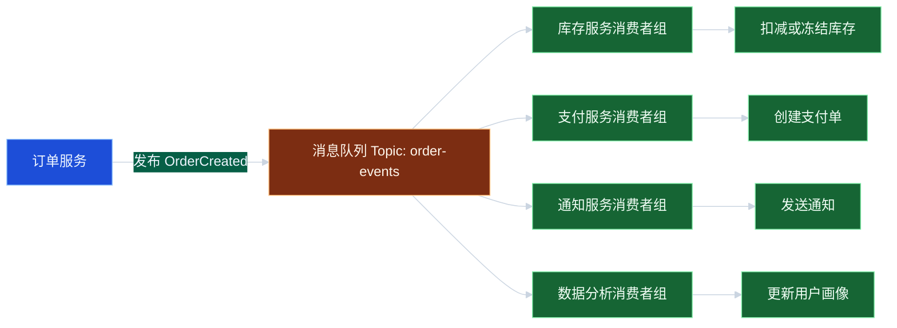
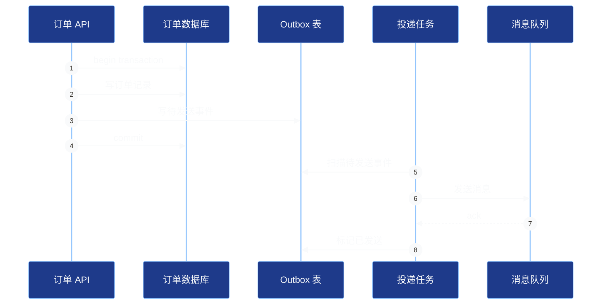
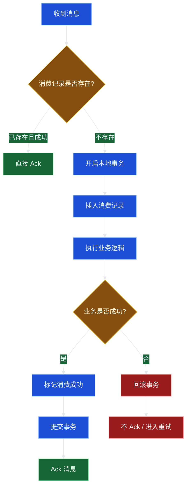
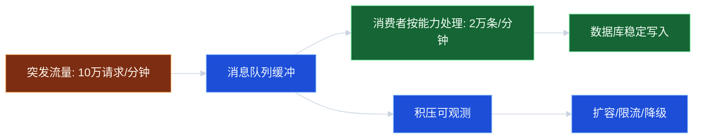

# 08_消息队列：事件驱动与幂等消费

## 学习目标

学完本章，你应该能够：

1. 解释消息队列在分布式系统中的核心价值：解耦、削峰、异步化、最终一致。
2. 区分命令 Command、事件 Event、消息 Message 的语义差异。
3. 设计事件驱动架构中的生产者、Broker、消费者和重试链路。
4. 理解消息丢失、重复消费、乱序、积压、延迟等常见问题。
5. 实现可落地的幂等消费、可靠投递和死信处理方案。

---

## 1. 为什么需要消息队列

在分布式系统里，服务之间直接同步调用会带来几个典型问题：

1. **耦合高**：订单服务必须知道库存服务、积分服务、通知服务的接口。
2. **链路长**：任何一个下游慢，都会拖慢上游响应。
3. **峰值难扛**：秒杀、活动下单等流量峰值会直接压垮后端服务。
4. **故障扩散**：下游故障会通过同步调用传导给上游。
5. **一致性复杂**：本地事务完成后，需要通知多个服务继续处理。

消息队列提供了一种“先记录事实，再异步传播”的方式：

```text
订单服务：我已经创建订单。
消息队列：记录并分发这个事实。
库存服务：收到后扣减库存。
积分服务：收到后发放积分。
通知服务：收到后发送通知。
```

---

## 2. 核心概念

### 2.1 Message、Event 与 Command

| 概念 | 含义 | 例子 | 关注点 |
| --- | --- | --- | --- |
| Message 消息 | 在系统间传递的数据包 | JSON、Avro、Protobuf 数据 | 格式、路由、投递 |
| Event 事件 | 已经发生的事实 | OrderCreated、PaymentSucceeded | 事实不可更改 |
| Command 命令 | 要求对方执行动作 | DeductStock、SendEmail | 期望被处理 |

工程中最常见的误区是把事件当命令用。

事件应该表达已经发生的事实：

```text
OrderCreated：订单已经创建。
```

命令表达希望某个服务执行动作：

```text
DeductStock：请扣减库存。
```

两者都可以通过消息队列传输，但语义不同。事件通常可以被多个消费者订阅；命令通常由一个明确的处理方执行。

### 2.2 Topic、Queue、Consumer Group

| 概念 | 含义 |
| --- | --- |
| Topic | 消息分类，例如 order-events |
| Queue / Partition | Topic 内部的物理队列或分区 |
| Producer | 生产者，发送消息的一方 |
| Consumer | 消费者，处理消息的一方 |
| Consumer Group | 消费者组，同组内通常竞争消费，不同组各自消费 |
| Offset / Ack | 消费进度确认机制 |
| DLQ Dead Letter Queue | 死信队列，用于保存多次处理失败的消息 |

### 2.3 至少一次、至多一次、恰好一次

| 投递语义 | 描述 | 风险 | 常见用途 |
| --- | --- | --- | --- |
| At most once 至多一次 | 消息最多投递一次 | 可能丢消息 | 日志、监控采样 |
| At least once 至少一次 | 消息至少投递一次 | 可能重复 | 业务系统最常见 |
| Exactly once 恰好一次 | 逻辑上只生效一次 | 成本高、边界有限 | 特定流处理或事务场景 |

多数业务系统应该按“至少一次投递 + 幂等消费”设计，而不是假设消息永远只来一次。

---

## 3. 事件驱动架构

### 3.1 直观例子

用户下单后，系统需要做这些事情：

- 扣库存。
- 创建支付单。
- 发优惠券。
- 发送站内信。
- 记录用户行为。
- 更新推荐画像。

如果同步调用，订单接口会很慢，也容易因为某个非核心服务失败而整体失败。

事件驱动的做法是：

1. 订单服务完成核心本地事务。
2. 发布 `OrderCreated` 事件。
3. 各下游服务订阅事件并异步处理。



### 3.2 事件驱动的优点

1. **解耦**：生产者无需知道所有消费者。
2. **异步化**：主链路只处理核心动作，非核心动作异步完成。
3. **削峰填谷**：消费者按自身能力慢慢处理积压消息。
4. **扩展性好**：新增消费者无需修改生产者。
5. **支持最终一致**：通过事件传播状态变化。

### 3.3 事件驱动的代价

1. **复杂度上升**：多了 Broker、重试、死信、监控等组件。
2. **一致性从强一致变为最终一致**。
3. **排查链路更难**：一次业务流跨多个异步消费者。
4. **消息可能重复、乱序、延迟、丢失**。
5. **业务状态必须能表达中间态**。

---

## 4. 可靠消息：如何避免消息丢失

消息丢失可能发生在三个位置：

1. 生产者还没把消息发送到 Broker 就崩溃。
2. Broker 收到消息但还没持久化就崩溃。
3. 消费者处理成功但确认失败，或确认成功但处理失败。

### 4.1 生产端可靠：Outbox 本地消息表

核心原则：业务数据和待发送消息必须在同一个本地事务里提交。



Outbox 表可包含字段：

```text
id | event_id | topic | event_type | payload | status | retry_count | next_retry_at | created_at
```

伪代码：

```go
func CreateOrder(req CreateOrderRequest) error {
    return WithTx(func(tx Tx) error {
        order := Order{ID: newID(), UserID: req.UserID, Status: "CREATED"}
        if err := tx.InsertOrder(order); err != nil {
            return err
        }

        event := OutboxEvent{
            EventID:   newID(),
            Topic:     "order-events",
            EventType: "OrderCreated",
            Payload:   marshal(order),
            Status:    "PENDING",
        }
        return tx.InsertOutbox(event)
    })
}

func DispatchOutboxOnce() {
    events := loadPendingEvents(100)
    for _, event := range events {
        if err := sendToMQ(event.Topic, event.Payload); err != nil {
            markSendFailed(event.ID, err)
            continue
        }
        markSent(event.ID)
    }
}
```

### 4.2 Broker 端可靠

不同 MQ 产品细节不同，但设计原则类似：

- 开启消息持久化。
- 多副本复制。
- 生产者等待 Broker 确认后再认为发送成功。
- 关键业务不要使用“只写内存、不等确认”的模式。

### 4.3 消费端可靠

消费端的关键原则：

> 先处理业务，业务成功后再确认消息；如果处理失败，不确认或显式重试。

但这会带来重复消费：消费者处理成功后，还没来得及 Ack 就崩溃，Broker 会再次投递消息。

所以消费端必须幂等。

---

## 5. 幂等消费

### 5.1 什么是幂等

幂等是指同一个操作执行一次和执行多次，最终效果一致。

例如：

```text
set order.status = PAID where order_id = O1001
```

重复执行通常没问题。

但下面操作不是幂等：

```text
user.points = user.points + 100
```

同一条消息重复消费两次，用户会多得 100 积分。

### 5.2 幂等设计的核心方法

#### 方法一：消费记录表

用唯一键约束 `message_id + consumer_name`。

```text
message_id | consumer_name | status  | processed_at
M001       | points-service | SUCCESS | ...
```

处理流程：

1. 开启本地事务。
2. 插入消费记录，唯一键冲突表示已经处理过。
3. 执行业务逻辑。
4. 提交事务。
5. Ack 消息。

```go
func ConsumeOrderPaid(msg Message) error {
    return WithTx(func(tx Tx) error {
        inserted, err := tx.TryInsertConsumeRecord(msg.ID, "points-service")
        if err != nil {
            return err
        }
        if !inserted {
            // 已处理过，直接返回成功，让 MQ 提交 offset / ack
            return nil
        }

        event := parseOrderPaid(msg.Payload)
        if err := tx.AddPointsOnce(event.UserID, event.OrderID, 100); err != nil {
            return err
        }

        return tx.MarkConsumeSuccess(msg.ID, "points-service")
    })
}
```

#### 方法二：业务唯一键

如果业务表本身能表达唯一性，可以直接用业务唯一键。

例如发放订单积分：

```text
points_record(order_id unique, user_id, points)
```

同一个订单只能插入一条积分记录。重复消息再次插入会触发唯一键冲突，此时可认为已经处理。

#### 方法三：状态机防重

对于订单状态流转，可以限制状态转移：

```text
只有 status = CREATED 的订单才能变成 PAID
已经是 PAID 的订单再次收到 PaymentSucceeded 事件，直接忽略
```

SQL 思路：

```sql
update orders
set status = 'PAID'
where order_id = ? and status = 'CREATED';
```

如果影响行数为 0，再查询当前状态判断是否已处理。

### 5.3 幂等消费流程图



---

## 6. 消息顺序

### 6.1 为什么会乱序

消息乱序可能来自：

- 同一业务实体的消息被发送到不同分区。
- 多个消费者并发处理。
- 某条消息处理失败后重试，后续消息先成功。
- 生产者多线程发送。

例如订单事件：

```text
OrderCreated -> OrderPaid -> OrderCanceled
```

消费者却先收到 `OrderPaid`，后收到 `OrderCreated`。

### 6.2 顺序性方案

| 方案 | 做法 | 代价 |
| --- | --- | --- |
| 按业务 key 分区 | 同一个 order_id 的消息发到同一分区 | 单 key 热点可能限制吞吐 |
| 单线程消费单分区 | 一个分区同一时刻只由一个消费者处理 | 并发度下降 |
| 状态机校验 | 消费时检查当前状态是否允许流转 | 需要处理暂存、重试 |
| 版本号 | 事件带 version，消费者按版本处理 | 需要保存当前版本 |

常见推荐：

```text
消息按 order_id 分区 + 消费端状态机校验 + 异常消息延迟重试
```

### 6.3 版本号示例

```go
func ApplyOrderEvent(event OrderEvent) error {
    order := getOrder(event.OrderID)

    if event.Version <= order.Version {
        // 老消息或重复消息，忽略
        return nil
    }

    if event.Version != order.Version+1 {
        // 未来消息，说明中间版本还没到，延迟重试
        return ErrNeedRetryLater
    }

    order.Apply(event)
    order.Version = event.Version
    saveOrder(order)
    return nil
}
```

---

## 7. 重试、死信与降级

### 7.1 重试不是越多越好

重试适合临时性错误：

- 网络抖动。
- 下游短暂不可用。
- 数据库死锁。
- 限流后稍后恢复。

不适合通过重试解决的问题：

- 数据格式错误。
- 业务参数非法。
- 消费代码 bug。
- 永远不满足的状态机条件。

### 7.2 重试策略

建议使用指数退避：

```text
第 1 次失败：10 秒后重试
第 2 次失败：30 秒后重试
第 3 次失败：2 分钟后重试
第 4 次失败：10 分钟后重试
超过次数：进入死信队列
```

### 7.3 死信队列

死信队列不是垃圾桶，而是异常处理入口。

进入死信队列后，需要：

- 保存原始消息。
- 保存失败原因。
- 保存消费者名称。
- 保存重试次数。
- 支持人工查看、修复、重新投递。
- 具备告警机制。

---

## 8. 消息积压与削峰填谷

### 8.1 消息积压的常见原因

- 消费者处理速度低于生产速度。
- 下游数据库慢。
- 某类消息一直失败并不断重试。
- 分区数量不足。
- 单个热点 key 占用大量消息。
- 消费者实例数不足或不均衡。

### 8.2 处理思路

1. 先判断积压位置：Topic、分区、消费者组、单个消费者。
2. 查看生产速率和消费速率。
3. 分析失败率、重试率和处理耗时。
4. 临时扩容消费者。
5. 优化慢查询、批处理、并发度。
6. 对非核心消息降级或限流。
7. 必要时拆分 Topic 或增加分区。

### 8.3 削峰填谷示意



---

## 9. 可观测性与运维指标

消息系统必须监控以下指标：

| 指标 | 说明 |
| --- | --- |
| 生产速率 | 每秒写入多少消息 |
| 消费速率 | 每秒成功消费多少消息 |
| 消费延迟 | 从消息产生到被消费的时间 |
| 积压量 | 未消费消息数量 |
| 重试量 | 正在重试的消息数量 |
| 死信量 | 进入死信队列的消息数量 |
| 消费失败率 | 消费异常占比 |
| 单条处理耗时 | 消费逻辑的耗时分布 |
| 最大消息年龄 | 最老未消费消息存在多久 |

日志中建议统一携带：

```text
trace_id, message_id, event_id, biz_id, topic, consumer_group, retry_count
```

这样排查问题时才能把一次业务流串起来。

---

## 10. 常见误区

### 误区一：用了 MQ 就一定可靠

MQ 只是提供传输能力，可靠性还依赖生产端确认、Broker 持久化、消费端幂等、重试和死信处理。

### 误区二：消息只会消费一次

多数业务 MQ 提供的是至少一次投递。消费者必须按重复消息会出现来设计。

### 误区三：事件里什么字段都放

事件应该包含消费者做决策所需的稳定字段，不应直接暴露生产者内部表结构。字段太少会导致消费者频繁回查，字段太多会导致强耦合。

### 误区四：重试没有上限

无限重试会让坏消息反复占用资源，甚至拖垮消费者。必须有最大次数、退避策略和死信队列。

### 误区五：忽略消息版本兼容

事件一旦被多个服务消费，就成为服务间契约。新增字段应向后兼容；删除或改义字段要谨慎。

---

## 11. 面试 / 设计题思考

### 题目一：如何保证订单创建后一定能通知库存服务？

回答思路：

1. 订单数据和 Outbox 事件在同一个本地事务中写入。
2. 后台投递任务扫描 Outbox。
3. 发送到 MQ 后等待 Broker ack。
4. 发送失败更新重试次数和下次重试时间。
5. 消费端按至少一次投递设计，保证幂等扣库存。
6. 配置积压、失败、死信告警。

### 题目二：消费者如何保证幂等？

回答要点：

- 使用全局唯一 message_id 或业务唯一键。
- 消费记录和业务更新放在同一个本地事务中。
- 对状态流转使用条件更新。
- 对金额、积分等累加操作尤其要防重。
- 重复消息应返回成功并 Ack，而不是抛错导致无限重试。

### 题目三：消息顺序如何保证？

回答要点：

- 明确是否需要全局顺序还是单业务实体顺序。
- 全局顺序成本很高，通常只保证同一 order_id、user_id 的局部顺序。
- 生产端按业务 key 分区。
- 消费端单分区顺序消费。
- 使用状态机或版本号处理乱序和重复。

### 题目四：消息积压怎么办？

回答要点：

- 先看生产速度、消费速度、失败率、单条耗时。
- 判断是整体慢、局部热点，还是坏消息重试。
- 临时扩容消费者或增加分区。
- 优化下游数据库和批处理。
- 对非核心业务降级。
- 防止重试风暴。

---

## 12. 工程落地清单

设计消息队列链路时，可以用下面清单检查：

- [ ] 是否明确消息语义：事件还是命令。
- [ ] 是否有全局唯一 message_id / event_id。
- [ ] 生产端是否保证业务数据和消息原子写入。
- [ ] Broker 是否开启持久化和确认机制。
- [ ] 消费端是否先业务成功再 Ack。
- [ ] 消费逻辑是否幂等。
- [ ] 是否支持重试、退避、最大次数。
- [ ] 是否有死信队列和人工重放能力。
- [ ] 是否处理消息乱序。
- [ ] 是否监控积压、失败率、消费延迟。
- [ ] 消息结构是否具备版本兼容策略。

---

## 章节小结

消息队列是分布式系统中非常重要的基础设施，常用于解耦、异步化、削峰填谷和最终一致。它带来的不是“自动可靠”，而是一组新的工程问题：消息可能丢失、重复、乱序、延迟和积压。

工程上最常用的可靠设计是：

- 生产端使用 Outbox 或事务消息保证可靠投递。
- Broker 开启持久化和确认机制。
- 消费端以至少一次投递为前提，做好幂等消费。
- 对失败消息设置退避重试、死信队列和人工处理。
- 通过监控和追踪保证链路可观测。

一句话总结：消息队列解决的是服务间协作问题，但最终一致性、幂等和异常恢复仍然需要业务系统自己认真设计。
