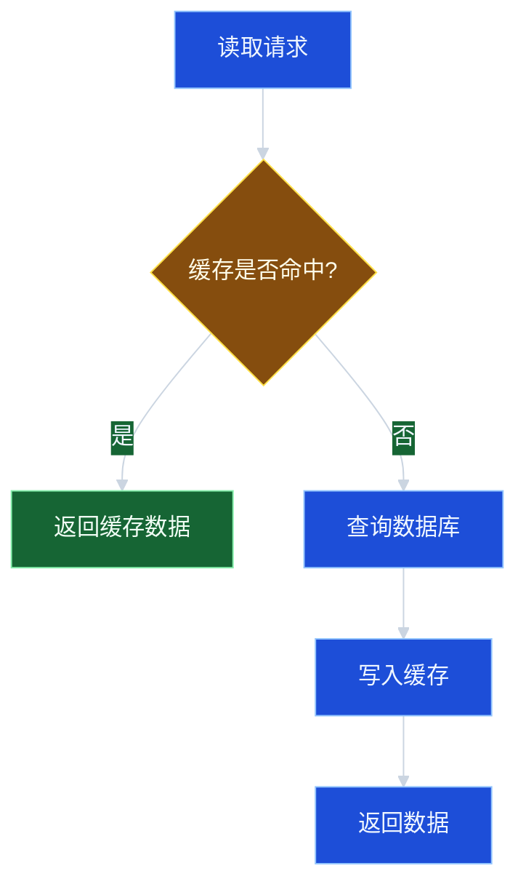
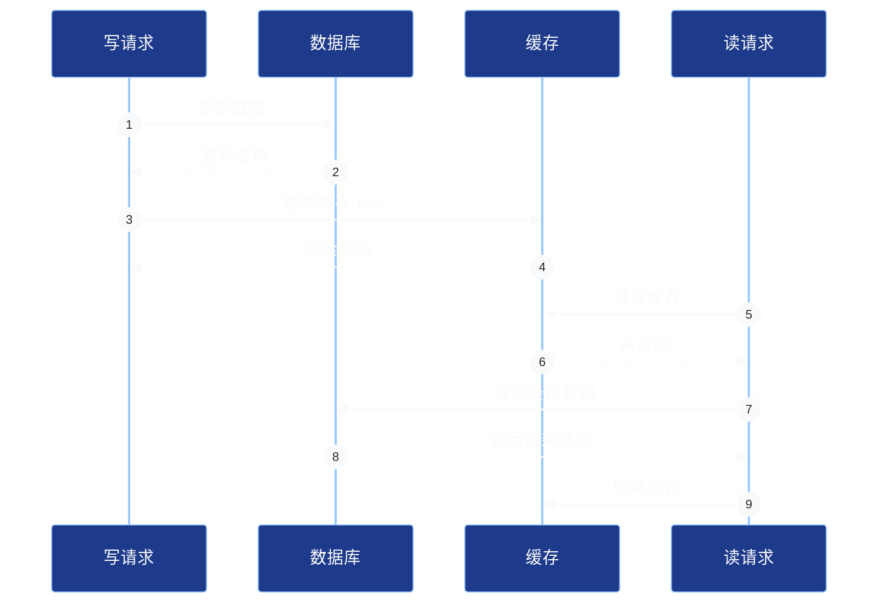
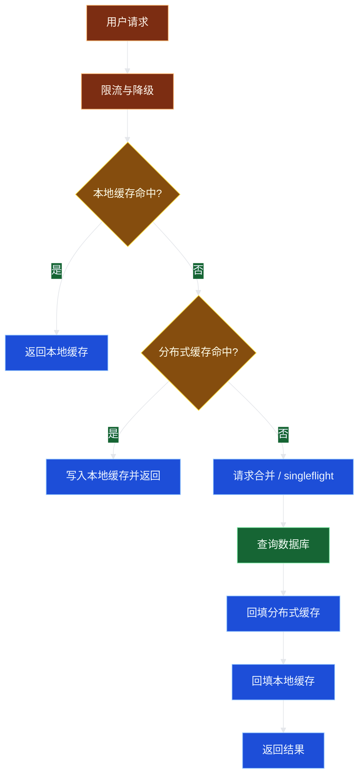

# 09_缓存设计：一致性与热点治理

## 学习目标

学完本章，你应该能够：

1. 解释缓存为什么能提升性能，以及它带来的数据一致性问题。
2. 区分 Cache Aside、Read Through、Write Through、Write Behind 等缓存模式。
3. 设计常见的缓存更新策略，并说明为什么通常先更新数据库再删除缓存。
4. 识别缓存穿透、缓存击穿、缓存雪崩、热点 Key 等典型问题。
5. 给出热点治理、失效控制、降级保护和可观测性方案。

---

## 1. 为什么需要缓存

数据库通常是系统中最昂贵、最需要保护的资源之一。对于大量读多写少的数据，如果每次请求都访问数据库，会遇到：

- 数据库 QPS 压力大。
- 热门数据反复查询，浪费资源。
- 响应延迟高。
- 峰值流量下数据库容易被打穿。

缓存的基本思想是：

> 把高频访问的数据放到更快、更靠近应用的位置，减少对后端存储的访问。

常见缓存层次：

| 层级 | 例子 | 特点 |
| --- | --- | --- |
| 浏览器缓存 | HTTP Cache | 离用户最近，适合静态资源 |
| CDN | 边缘节点 | 适合图片、视频、静态页面 |
| 网关缓存 | API Gateway Cache | 适合公共读接口 |
| 本地缓存 | 进程内 Map、Caffeine | 极快，但容量小，实例间不一致 |
| 分布式缓存 | Redis、Memcached | 通用性强，需网络访问 |
| 数据库 Buffer Pool | MySQL/InnoDB 缓冲池 | 数据库内部缓存 |

本章重点讨论应用层缓存设计，不依赖具体外部服务实现。

---

## 2. 核心概念

### 2.1 命中率

缓存命中率是衡量缓存价值的核心指标：

```text
命中率 = 缓存命中次数 / 总读取次数
```

命中率高说明大多数请求由缓存承担；命中率低可能说明：

- 缓存容量太小。
- 过期时间太短。
- Key 设计不合理。
- 数据访问本身不具备重复性。

### 2.2 TTL

TTL Time To Live 表示缓存存活时间。TTL 越长：

- 命中率越高。
- 数据不一致窗口越长。

TTL 越短：

- 数据更接近实时。
- 缓存失效更频繁，数据库压力更大。

### 2.3 缓存一致性

缓存一致性不是一个绝对概念，需要先问：

1. 业务能否接受短暂不一致？
2. 不一致窗口可以多长？1 秒、10 秒、1 分钟？
3. 读到旧值会造成什么后果？
4. 是否有强制刷新或兜底查询机制？

例如：

| 数据 | 一致性要求 | 缓存策略 |
| --- | --- | --- |
| 商品详情 | 可接受秒级不一致 | Cache Aside + TTL |
| 商品库存 | 不应完全依赖缓存扣减 | 数据库/库存服务为准，缓存只展示 |
| 用户余额 | 强一致要求高 | 谨慎缓存，或只缓存只读快照 |
| 热榜 | 可接受分钟级不一致 | 定时刷新 |
| 权限 | 不一致可能有安全风险 | 短 TTL + 主动失效 |

---

## 3. 常见缓存模式

### 3.1 Cache Aside：旁路缓存

Cache Aside 是业务系统最常用的模式。应用代码负责读写缓存。

读取流程：

1. 先读缓存。
2. 命中则返回。
3. 未命中则读数据库。
4. 写入缓存。
5. 返回结果。



写入流程通常是：

```text
更新数据库 -> 删除缓存
```

而不是：

```text
更新数据库 -> 更新缓存
```

后面会详细解释原因。

### 3.2 Read Through

Read Through 模式中，应用只访问缓存组件；缓存未命中时，由缓存组件自动加载数据库。

优点：应用代码简单。

缺点：缓存组件需要知道数据加载逻辑，通用性变差。

### 3.3 Write Through

Write Through 模式中，写请求先写缓存，再由缓存同步写数据库。写成功通常意味着缓存和数据库都成功。

优点：一致性较好。

缺点：写延迟增加，缓存层复杂。

### 3.4 Write Behind / Write Back

Write Behind 模式中，写请求先写缓存，异步刷入数据库。

优点：写性能高。

缺点：数据丢失风险和一致性风险更高，适合日志、计数、临时状态等可恢复场景，不适合强一致核心数据。

### 3.5 模式对比

| 模式 | 读写责任 | 优点 | 缺点 | 常见度 |
| --- | --- | --- | --- | --- |
| Cache Aside | 应用控制缓存 | 简单、灵活 | 需要自己处理一致性 | 最高 |
| Read Through | 缓存加载数据 | 应用简单 | 缓存层耦合业务 | 中 |
| Write Through | 缓存同步写库 | 一致性较好 | 写延迟高 | 中 |
| Write Behind | 缓存异步写库 | 写性能高 | 丢失和不一致风险 | 低，需谨慎 |

---

## 4. 缓存与数据库一致性

### 4.1 为什么不推荐“更新数据库后更新缓存”

假设两个并发写请求：

```text
请求 A：把商品价格改为 100
请求 B：把商品价格改为 90
```

执行顺序可能是：

```text
1. A 更新数据库为 100
2. B 更新数据库为 90
3. B 更新缓存为 90
4. A 更新缓存为 100
```

最终数据库是 90，但缓存是 100，缓存出现脏数据。

更新缓存还有额外问题：

- 缓存值可能是复杂聚合结果，不容易准确更新。
- 并发下容易被旧请求覆盖。
- 很多写入后的数据未必会被读取，更新缓存浪费资源。

### 4.2 常用策略：更新数据库后删除缓存

推荐流程：

```text
1. 更新数据库
2. 删除缓存
3. 下次读取缓存未命中，再从数据库加载最新值
```

这个策略简单、稳定，能避免大多数并发覆盖问题。



### 4.3 删除缓存失败怎么办

如果数据库更新成功，但删除缓存失败，会短暂读到旧缓存。常见处理：

1. **重试删除**：同步重试有限次数。
2. **异步重试**：写入删除任务表，由后台任务继续删除。
3. **订阅数据库变更**：通过变更日志触发缓存失效。
4. **设置 TTL**：即使删除失败，缓存也会最终过期。

工程上常用组合：

```text
更新数据库 -> 删除缓存 -> 失败则记录异步重试 -> TTL 兜底
```

### 4.4 先删缓存再更新数据库的问题

先删缓存再更新数据库可能导致旧值回填：

```text
1. 写请求删除缓存
2. 读请求发现缓存未命中
3. 读请求从数据库读到旧值
4. 读请求把旧值写回缓存
5. 写请求更新数据库为新值
```

最终缓存是旧值，数据库是新值。

所以常见建议是：先更新数据库，再删除缓存。

### 4.5 延迟双删

某些高并发场景会使用延迟双删：

```text
1. 删除缓存
2. 更新数据库
3. 等待一小段时间
4. 再删除缓存
```

它的目标是清理并发读可能回填的旧值。但延迟时间很难准确选择，会增加复杂度。多数系统应优先选择“更新数据库后删除缓存 + 失败重试 + TTL 兜底”。

---

## 5. 工程示例：Cache Aside 伪代码

下面用接近 Go 的伪代码表达基本结构。

### 5.1 读取商品详情

```go
func GetProduct(productID string) (Product, error) {
    key := "product:" + productID

    if cached, ok := cache.Get(key); ok {
        return decodeProduct(cached), nil
    }

    // 使用 singleflight 或互斥锁，避免同一 Key 大量请求同时打到数据库
    value, err := singleflight.Do(key, func() (Product, error) {
        product, err := db.GetProduct(productID)
        if err == ErrNotFound {
            // 缓存空值，防止缓存穿透；TTL 要短
            cache.Set(key, "NULL", 30*time.Second)
            return Product{}, err
        }
        if err != nil {
            return Product{}, err
        }

        ttl := 10*time.Minute + randomJitter(0, 60*time.Second)
        cache.Set(key, encodeProduct(product), ttl)
        return product, nil
    })
    if err != nil {
        return Product{}, err
    }
    return value, nil
}
```

### 5.2 更新商品详情

```go
func UpdateProduct(product Product) error {
    if err := db.UpdateProduct(product); err != nil {
        return err
    }

    key := "product:" + product.ID
    if err := cache.Delete(key); err != nil {
        // 不建议直接忽略。记录任务，异步重试删除。
        enqueueCacheInvalidation(key)
    }
    return nil
}
```

这个例子体现了几个工程原则：

- 缓存 Key 有清晰命名空间。
- 缓存未命中才查数据库。
- 空结果也可以短暂缓存。
- TTL 加随机抖动，避免同时过期。
- 更新数据库后删除缓存。
- 删除失败要异步重试。
- 对热点 Key 使用 singleflight 防止击穿。

---

## 6. 缓存穿透、击穿、雪崩

### 6.1 缓存穿透

缓存穿透是指查询一个缓存和数据库都不存在的数据，导致每次请求都打到数据库。

典型场景：

```text
GET /product/-1
GET /user/not-exist-id
```

解决方案：

1. 参数校验：明显非法的 ID 直接拒绝。
2. 缓存空值：不存在的数据也缓存短 TTL。
3. 布隆过滤器：提前判断 ID 是否可能存在。
4. 限流：对异常来源限流。

### 6.2 缓存击穿

缓存击穿是指某个热点 Key 过期瞬间，大量请求同时发现未命中，一起打到数据库。

解决方案：

1. 单飞机制 singleflight：同一时刻只有一个请求加载数据库。
2. 互斥锁：抢到锁的请求加载，其他等待或返回旧值。
3. 热点 Key 不过期：通过后台刷新更新。
4. 逻辑过期：缓存中保存过期时间，过期后异步刷新，前台先返回旧值。

### 6.3 缓存雪崩

缓存雪崩是指大量 Key 同时失效，或缓存集群整体不可用，导致请求集中打到数据库。

解决方案：

1. TTL 加随机抖动，避免同一时间过期。
2. 分批预热，不要同时加载大量 Key。
3. 多级缓存，本地缓存兜底。
4. 限流、熔断、降级。
5. 缓存高可用部署。

### 6.4 三类问题对比

| 问题 | 现象 | 根因 | 主要手段 |
| --- | --- | --- | --- |
| 穿透 | 不存在的 Key 反复打 DB | 缓存和 DB 都没有 | 参数校验、空值缓存、布隆过滤器 |
| 击穿 | 单个热点 Key 过期打 DB | 热点 Key 突然失效 | singleflight、互斥锁、逻辑过期 |
| 雪崩 | 大量 Key 或缓存整体失效 | 集中过期或缓存故障 | TTL 抖动、限流、降级、多级缓存 |

---

## 7. 热点 Key 治理

### 7.1 什么是热点 Key

热点 Key 是被大量请求集中访问的缓存项，例如：

- 秒杀商品详情。
- 热搜榜第一名。
- 明星新闻。
- 大促首页配置。
- 爆款商品库存展示。

热点 Key 的风险：

- 单个缓存节点压力过高。
- 网络带宽被打满。
- Key 过期瞬间击穿数据库。
- 影响同节点其他 Key。

### 7.2 热点识别

可以从以下指标识别热点：

- 单 Key QPS。
- 单 Key 带宽。
- 单 Key 命中率。
- 单 Key 平均延迟。
- 单节点 CPU / 网络异常。
- 应用日志中高频 Key。

### 7.3 热点治理手段

#### 手段一：本地缓存

对极热且可短暂不一致的数据，加一层进程内缓存。

```text
请求 -> 本地缓存 -> 分布式缓存 -> 数据库
```

本地缓存 TTL 通常较短，例如 1 到 5 秒。这样即使分布式缓存中是同一个 Key，请求也先被各应用实例分摊。

#### 手段二：热点 Key 拆分

把一个热点 Key 拆成多个副本：

```text
hot:product:1001:0
hot:product:1001:1
hot:product:1001:2
...
hot:product:1001:15
```

读取时随机选择一个副本，写入或刷新时更新所有副本。

适合读远多于写的数据。

#### 手段三：逻辑过期

缓存值中保存逻辑过期时间。物理 Key 不立即过期。

```text
value = {
  data: 商品详情,
  expire_at: 2026-05-23 10:00:00
}
```

读取时：

- 未逻辑过期：直接返回。
- 已逻辑过期：尝试异步刷新；前台可先返回旧值。

优点是避免热点 Key 物理过期瞬间击穿。

#### 手段四：请求合并

同一时间多个相同 Key 的请求，只让一个请求去加载数据，其他请求等待结果。

Go 中常用思路是 singleflight；Java 中可用基于 Future 的请求合并。

#### 手段五：限流与降级

当热点超过系统能力时：

- 限制单用户、单 IP、单接口频率。
- 对非核心字段降级。
- 返回稍旧的缓存数据。
- 使用静态兜底页面。

### 7.4 热点治理架构图



---

## 8. 缓存 Key 设计

### 8.1 命名规范

推荐格式：

```text
业务域:对象类型:对象ID:版本或维度
```

例如：

```text
product:detail:1001:v1
user:profile:2001
ranking:hot:20260523
permission:user:2001:v3
```

好处：

- 可读性强。
- 便于批量分析。
- 便于按业务域清理。
- 支持版本升级。

### 8.2 避免大 Key

大 Key 指 value 很大或集合元素很多的 Key。风险包括：

- 网络传输慢。
- 序列化和反序列化慢。
- 阻塞缓存服务线程。
- 迁移和删除成本高。

治理方式：

- 拆分大对象。
- 分页缓存集合。
- 只缓存必要字段。
- 对大 Key 设置更严格监控。

### 8.3 避免 Key 爆炸

Key 爆炸指因为维度过多导致缓存 Key 数量巨大，例如：

```text
search:keyword:{keyword}:page:{page}:sort:{sort}:filter:{filter}:user:{user_id}
```

解决思路：

- 只缓存高频组合。
- 限制用户个性化维度。
- 设置短 TTL。
- 对低频请求直接查数据库或搜索服务。

---

## 9. 预热、刷新与失效

### 9.1 缓存预热

缓存预热是在流量到来前提前加载热点数据。

适合：

- 大促首页配置。
- 秒杀商品。
- 热榜数据。
- 权限配置。

预热注意事项：

- 分批加载，避免预热本身打爆数据库。
- 只预热真正热点。
- 设置合理 TTL 和随机抖动。
- 预热失败要告警。

### 9.2 主动刷新

对于热点数据，可以用后台任务定期刷新缓存，而不是等用户请求触发加载。

```text
定时任务 -> 查询数据库或计算结果 -> 写入缓存 -> 更新版本
```

### 9.3 主动失效

当数据变更后，主动删除或更新相关缓存。

问题在于：一个业务变更可能影响多个缓存 Key。例如商品价格变更可能影响：

- 商品详情缓存。
- 店铺商品列表缓存。
- 搜索结果缓存。
- 推荐结果缓存。

因此需要维护缓存依赖关系，或者接受部分派生缓存通过短 TTL 自然过期。

---

## 10. 缓存降级与容错

缓存不是永远可靠的。设计时要考虑缓存不可用。

### 10.1 缓存故障时的风险

- 所有请求直接打数据库。
- 连接池耗尽。
- 请求堆积导致线程池打满。
- 数据库雪崩。
- 整个服务不可用。

### 10.2 保护策略

| 策略 | 说明 |
| --- | --- |
| 限流 | 控制进入数据库的请求量 |
| 熔断 | 缓存持续失败时快速失败，避免线程阻塞 |
| 降级 | 返回默认值、旧值、静态页面或部分字段 |
| 本地缓存 | 分布式缓存故障时短暂兜底 |
| 超时控制 | 缓存访问必须有短超时 |
| 隔离 | 缓存线程池和数据库线程池隔离 |

### 10.3 兜底读取伪代码

```go
func GetWithFallback(key string, loader func() (Value, error)) (Value, error) {
    value, err := cache.GetWithTimeout(key, 20*time.Millisecond)
    if err == nil && value.Exists {
        return value, nil
    }

    if localValue, ok := localCache.Get(key); ok {
        return localValue, nil
    }

    if !rateLimiter.Allow() {
        return defaultValue(key), nil
    }

    fresh, err := loader()
    if err != nil {
        return defaultValue(key), err
    }

    cache.Set(key, fresh, ttlWithJitter())
    localCache.Set(key, fresh, 3*time.Second)
    return fresh, nil
}
```

---

## 11. 常见误区

### 误区一：缓存一定越多越好

缓存会引入一致性、内存、失效、监控和故障恢复成本。低频数据、强一致数据、大对象数据不一定适合缓存。

### 误区二：只设置 TTL 就解决一致性

TTL 只能保证最终过期，不能保证用户不会在过期前读到旧值。关键业务仍需要主动失效、版本控制或强一致读。

### 误区三：更新数据库后同步更新缓存

并发写场景下，旧请求可能覆盖新缓存。更常见的安全做法是更新数据库后删除缓存。

### 误区四：缓存未命中直接查数据库

在热点 Key 过期时，这会造成大量并发请求打到数据库。应使用 singleflight、互斥锁、逻辑过期或限流。

### 误区五：忽略缓存不可用

缓存故障时，如果没有限流和降级，数据库可能瞬间被流量打垮。

---

## 12. 面试 / 设计题思考

### 题目一：如何保证缓存和数据库一致性？

回答思路：

1. 先说明很难做到绝对强一致，通常追求可控的最终一致。
2. 读使用 Cache Aside。
3. 写使用更新数据库后删除缓存。
4. 删除失败时异步重试。
5. 设置 TTL 兜底。
6. 对强一致场景直接读主库或使用更短 TTL、版本校验。
7. 通过监控发现不一致和删除失败。

### 题目二：为什么不是先删缓存再更新数据库？

回答要点：

- 先删缓存后，可能有并发读从数据库读到旧值并回填缓存。
- 随后写请求才更新数据库，导致缓存长期保存旧值。
- 因此常用策略是先更新数据库，再删除缓存。

### 题目三：如何解决缓存击穿？

回答要点：

- 识别热点 Key。
- 对同一 Key 使用互斥锁或 singleflight。
- 热点数据可使用逻辑过期和后台刷新。
- 必要时加本地缓存和限流。
- 不要让大量请求同时查数据库。

### 题目四：如何治理热点 Key？

回答要点：

- 监控单 Key QPS 和节点压力。
- 使用本地缓存分摊读取。
- 对热点 Key 做多副本拆分。
- 使用逻辑过期避免物理过期击穿。
- 加限流、降级和预热。

### 题目五：缓存雪崩怎么办？

回答要点：

- TTL 加随机抖动，避免集中过期。
- 分批预热。
- 多级缓存。
- 限流熔断，保护数据库。
- 缓存集群高可用。

---

## 13. 工程落地清单

设计缓存时，可以用下面清单检查：

- [ ] 数据是否真的适合缓存。
- [ ] 是否明确一致性要求和可接受不一致窗口。
- [ ] Key 命名是否规范。
- [ ] Value 是否过大。
- [ ] TTL 是否合理，是否有随机抖动。
- [ ] 是否防缓存穿透：参数校验、空值缓存、布隆过滤器。
- [ ] 是否防缓存击穿：singleflight、互斥锁、逻辑过期。
- [ ] 是否防缓存雪崩：分散过期、多级缓存、限流降级。
- [ ] 写路径是否更新数据库后删除缓存。
- [ ] 删除缓存失败是否有重试。
- [ ] 是否识别和治理热点 Key。
- [ ] 缓存故障时是否保护数据库。
- [ ] 是否监控命中率、延迟、错误率、热点 Key、大 Key。

---

## 章节小结

缓存是提升系统性能和保护数据库的重要手段，但它不是免费的。缓存引入了命中率、TTL、失效、热点、一致性和容错等工程问题。

本章重点结论：

- 最常见的读模式是 Cache Aside：先查缓存，未命中再查数据库并回填。
- 常见写策略是更新数据库后删除缓存，而不是同步更新缓存。
- 删除缓存失败需要异步重试，TTL 只是兜底。
- 缓存穿透、击穿、雪崩是三个不同问题，需要分别治理。
- 热点 Key 需要本地缓存、多副本、逻辑过期、请求合并和限流降级。
- 缓存不可用时必须保护数据库，避免故障扩散。

一句话总结：缓存设计的目标不是“把所有数据放进缓存”，而是在可控一致性和可控风险下，用缓存承担高频读取和峰值流量。
