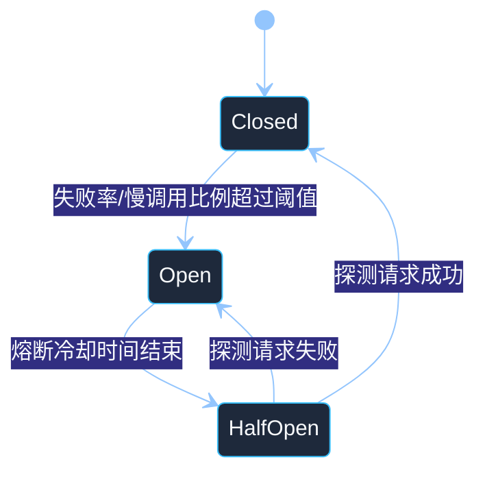
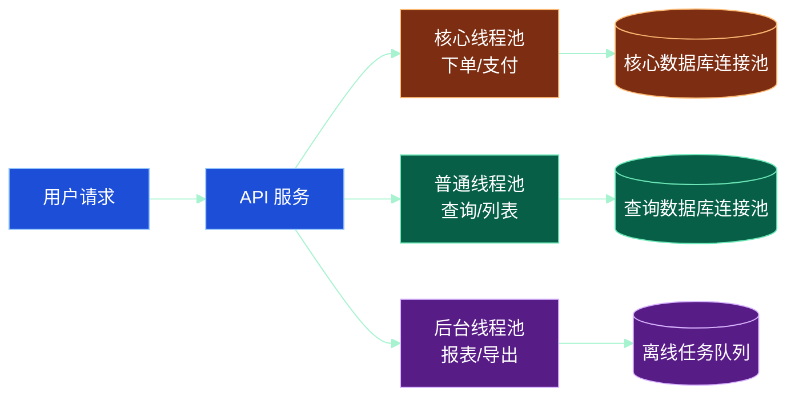
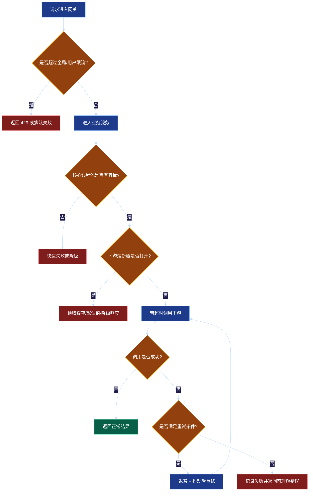

# 第 10 章：限流、熔断、降级与弹性设计

## 学习目标

学完本章后，你应该能够：

1. 理解限流、熔断、降级、超时、重试、隔离、排队等弹性设计手段分别解决什么问题。
2. 能够根据业务场景选择合适的限流算法：固定窗口、滑动窗口、漏桶、令牌桶。
3. 能够设计服务调用链中的超时、重试、熔断和降级策略，避免局部故障放大成全局故障。
4. 能够识别常见的反模式，例如无超时调用、无限重试、全链路同步阻塞、共享线程池拖垮核心接口。
5. 能够在面试或系统设计中说明“系统如何在高峰流量和依赖故障下保持可用”。

---

## 1. 为什么需要弹性设计

分布式系统的故障不是异常情况，而是常态。常见问题包括：

- 上游流量突然增长，例如活动、热点事件、爬虫、误配置。
- 下游服务变慢，例如数据库慢查询、第三方接口超时、消息队列堆积。
- 网络出现抖动，例如跨机房延迟升高、连接重置、丢包。
- 单个实例异常，例如 GC 暂停、CPU 打满、线程池耗尽。
- 依赖链路变长，一个请求需要调用多个服务，任何一个环节变慢都会影响整体。

如果没有弹性设计，一个局部慢故障可能演变为雪崩：

1. 下游服务响应变慢。
2. 上游线程长时间阻塞，线程池被占满。
3. 新请求排队等待，延迟继续升高。
4. 调用方超时后重试，进一步增加下游压力。
5. 故障扩散到更多服务，最终整体不可用。

弹性设计的核心目标不是“让系统永不失败”，而是：

- 控制进入系统的流量。
- 快速失败，避免无限等待。
- 隔离故障，避免互相拖垮。
- 在非核心能力失败时保住核心链路。
- 在恢复过程中避免瞬时流量再次压垮系统。

---

## 2. 核心概念总览

| 手段 | 主要解决的问题 | 常见位置 | 关键风险 |
| --- | --- | --- | --- |
| 限流 | 流量超过系统承载能力 | 网关、服务入口、用户维度、资源维度 | 阈值过低影响体验，阈值过高保护不足 |
| 超时 | 调用方无限等待 | RPC、HTTP、数据库、缓存 | 超时设置不符合真实延迟分布 |
| 重试 | 短暂失败或网络抖动 | 客户端、SDK、任务消费 | 重试风暴、非幂等副作用 |
| 熔断 | 下游持续失败时快速失败 | 服务调用客户端 | 误熔断、恢复探测过快 |
| 降级 | 保核心、舍非核心 | 业务层、网关、前端 | 降级策略不透明，数据语义混乱 |
| 隔离 | 防止不同资源互相拖垮 | 线程池、连接池、队列、实例 | 隔离粒度过细导致资源碎片 |
| 背压 | 消费者处理不过来时通知生产者减速 | 流式系统、消息系统、批处理 | 上游不支持背压时效果有限 |

可以把这些手段理解为系统的“安全装置”：限流是入口闸门，超时是止损线，熔断是保险丝，降级是备用方案，隔离是防火墙，背压是减速信号。

---

## 3. 限流设计

### 3.1 限流对象

限流不是简单地给整个系统设置一个 QPS 上限。工程中更常见的是多维度限流：

- 全局限流：保护整个系统，例如 API 网关总 QPS。
- 接口限流：保护某个高成本接口，例如搜索、导出、下单。
- 用户限流：防止单个用户或租户占用过多资源。
- IP 限流：防刷、防爬，但要注意 NAT 场景误伤。
- 资源限流：按数据库、缓存、第三方 API、GPU 等稀缺资源限流。
- 优先级限流：核心业务高优先级，后台任务低优先级。

### 3.2 固定窗口计数器

固定窗口把时间切成固定区间，例如每 1 秒允许 1000 次请求。实现简单，但窗口边界有突刺问题。

直观例子：

- 00:00:00.900 到 00:00:00.999 进入 1000 个请求。
- 00:00:01.000 到 00:00:01.100 又进入 1000 个请求。
- 虽然每秒都没有超过 1000，但 200 毫秒内进入了 2000 个请求。

适用场景：实现成本低、对突刺不敏感的后台接口或管理接口。

### 3.3 滑动窗口

滑动窗口把一个大窗口拆成多个小窗口，例如 1 秒拆成 10 个 100 毫秒桶。每次统计最近 1 秒内所有小桶的总和。

优点：比固定窗口平滑，能缓解边界突刺。

缺点：需要维护多个桶，分布式场景中聚合成本更高。

### 3.4 漏桶算法

漏桶把请求看作进入桶中的水，系统以固定速率从桶中取出请求处理。桶满后新请求被拒绝或排队失败。

特点：

- 输出速率稳定。
- 能削峰，但不能充分利用短时间空闲容量。
- 适合保护下游对稳定速率敏感的资源，例如第三方接口。

### 3.5 令牌桶算法

令牌桶以固定速率生成令牌，桶中最多保存一定数量的令牌。请求到来时拿到令牌才允许执行。

特点：

- 平均速率受控。
- 允许一定突发流量，因为桶中可以积累令牌。
- 工程中使用非常广泛，适合大多数在线服务接口。

### 3.6 本地限流与分布式限流

本地限流在单个实例内完成，成本低、延迟小，但多实例总流量不精确。例如 10 个实例，每个限制 100 QPS，总体大约 1000 QPS。

分布式限流需要共享计数或中心化协调，精度更高，但会引入额外依赖与延迟。常见做法：

- 网关集中限流。
- 使用 Redis 等存储做共享计数。
- 使用配置中心下发每个实例的局部配额。
- 控制面根据实例数动态分配限流阈值。

工程取舍：核心入口可以做集中限流；服务内部优先本地限流，避免限流系统本身成为瓶颈。

---

## 4. 熔断设计

熔断器用于在下游持续失败时快速失败，避免调用方继续把请求打到已经不可用的依赖上。

### 4.1 熔断器三种状态

- Closed：正常调用，持续统计失败率、慢调用比例等指标。
- Open：熔断打开，直接失败或走降级逻辑，不再请求下游。
- Half-Open：半开探测，允许少量请求访问下游，判断是否恢复。



### 4.2 熔断触发条件

常见触发条件包括：

- 最近 N 次请求失败率超过阈值，例如 50%。
- 最近时间窗口内慢调用比例超过阈值，例如 P95 超过 500ms 的比例大于 60%。
- 连续失败次数超过阈值，例如连续 20 次失败。
- 异常类型匹配，例如连接拒绝、超时、5xx；业务 4xx 通常不应计入系统故障。

注意：不要在样本量很小时就熔断。例如 2 次调用失败 1 次，失败率 50%，但样本太小，不能代表下游不可用。

### 4.3 熔断后的处理

熔断打开后可以：

- 直接返回错误，例如“服务繁忙，请稍后再试”。
- 返回缓存数据，例如商品详情读接口返回旧数据。
- 返回默认值，例如推荐系统失败时返回热门列表。
- 跳过非核心功能，例如订单页不展示优惠推荐。
- 写入异步补偿队列，例如积分发放失败后延迟补偿。

---

## 5. 降级设计

降级的本质是“在资源不足或依赖失败时，明确哪些能力可以牺牲”。

### 5.1 降级分类

1. 功能降级：关闭非核心功能，例如关闭评论、推荐、头像展示。
2. 数据降级：返回旧数据、粗粒度数据或默认数据。
3. 一致性降级：从强一致降为最终一致，例如库存展示允许短暂不准确。
4. 体验降级：页面简化、图片低清、异步加载。
5. 人工降级：运维或业务人员通过开关手动关闭某些能力。

### 5.2 降级开关

成熟系统通常会有降级开关：

- 按接口开关。
- 按用户群体开关。
- 按地区、机房、租户开关。
- 按百分比灰度开关。
- 支持自动触发和人工覆盖。

开关要做到变更可审计、可回滚、可观察。否则降级开关本身会变成新的风险点。

---

## 6. 超时、重试与幂等

### 6.1 超时必须显式设置

每一次远程调用都应该有明确超时，包括 HTTP、RPC、数据库、缓存、消息发送等。

常见超时设置思路：

- 根据接口 SLA 分配预算。例如用户请求总超时 800ms，其中鉴权 50ms、库存 150ms、价格 150ms、推荐 100ms。
- 根据下游延迟分布设置。例如略高于 P99，而不是随便设置 30 秒。
- 区分连接超时、读超时、写超时和整体请求超时。

### 6.2 重试不是越多越好

重试适合处理短暂故障，但会放大流量。假设一个请求链路有 3 层，每层最多重试 2 次，最坏情况下下游可能承受 3 × 3 × 3 = 27 倍请求。

重试建议：

- 只对可重试错误重试，例如超时、连接重置、临时 5xx。
- 对非幂等写操作谨慎重试，必须有幂等键。
- 使用指数退避和随机抖动，避免同时重试。
- 限制最大重试次数和总耗时。
- 在最靠近用户的一层统一重试，避免多层叠加重试。

### 6.3 幂等设计

写操作如果需要重试，必须考虑幂等。常见方案：

- 请求携带唯一幂等键，例如 `Idempotency-Key`。
- 服务端保存幂等键和处理结果。
- 数据库使用唯一索引防重复。
- 状态机只允许合法状态转换。
- 消息消费记录业务唯一键，避免重复消费副作用。

---

## 7. 隔离与舱壁模式

舱壁模式来自船舶设计：船舱之间有隔板，一个舱进水不应导致整艘船沉没。

在系统中可以这样隔离：

- 线程池隔离：核心接口和后台任务使用不同线程池。
- 连接池隔离：不同下游依赖使用独立连接池。
- 队列隔离：高优先级消息和低优先级消息分开。
- 实例隔离：核心服务单独部署，不和批处理混部。
- 数据隔离：热点租户或大客户使用独立库表或资源池。



---

## 8. 工程示例：简化版令牌桶 + 熔断器伪代码

下面用 Go 风格伪代码展示入口保护和下游保护的组合。重点是工程思路，不依赖外部服务。

```go
// TokenBucket 用于本地限流。
type TokenBucket struct {
    capacity   int
    tokens     int
    refillRate int           // 每秒补充令牌数
    lastRefill time.Time
    mu         sync.Mutex
}

func (b *TokenBucket) Allow() bool {
    b.mu.Lock()
    defer b.mu.Unlock()

    now := time.Now()
    elapsed := now.Sub(b.lastRefill).Seconds()
    refill := int(elapsed * float64(b.refillRate))
    if refill > 0 {
        b.tokens = min(b.capacity, b.tokens+refill)
        b.lastRefill = now
    }

    if b.tokens <= 0 {
        return false
    }
    b.tokens--
    return true
}

// CircuitBreaker 用于保护下游。
type CircuitBreaker struct {
    state       string // closed, open, half_open
    failCount   int
    successProbe int
    openedAt    time.Time
}

func (c *CircuitBreaker) Call(ctx context.Context, fn func(context.Context) error) error {
    if c.state == "open" {
        if time.Since(c.openedAt) < 10*time.Second {
            return ErrCircuitOpen
        }
        c.state = "half_open"
    }

    callCtx, cancel := context.WithTimeout(ctx, 200*time.Millisecond)
    defer cancel()

    err := fn(callCtx)
    if err != nil {
        c.failCount++
        if c.failCount >= 20 {
            c.state = "open"
            c.openedAt = time.Now()
        }
        return err
    }

    if c.state == "half_open" {
        c.successProbe++
        if c.successProbe >= 5 {
            c.state = "closed"
            c.failCount = 0
            c.successProbe = 0
        }
    } else {
        c.failCount = 0
    }
    return nil
}
```

实际落地时还需要补充：

- 滑动窗口统计失败率，而不是只看连续失败次数。
- 并发安全和状态变更原子性。
- 区分错误类型，业务参数错误不应触发熔断。
- 指标上报：限流次数、熔断状态、超时次数、降级次数。
- 配置动态调整和灰度发布。

---

## 9. 一条请求的弹性保护流程



---

## 10. 常见误区

### 误区一：只在网关限流就够了

网关限流只能保护入口流量，无法保护服务内部的资源竞争。例如后台任务、消息消费、定时任务不一定经过网关。服务内部仍然需要资源级限流和隔离。

### 误区二：重试可以提高可用性，所以多重试几次

重试会增加下游压力。如果故障是容量不足，多次重试只会让系统更快雪崩。重试必须配合超时、退避、熔断和幂等。

### 误区三：熔断等于降级

熔断是判断“是否继续调用下游”的机制，降级是“不能调用或不该调用时返回什么”的业务策略。二者经常一起使用，但不是一回事。

### 误区四：所有接口都用同一套阈值

不同接口的成本、重要性和延迟分布不同。登录、下单、支付、推荐、导出报表不应使用完全相同的超时和限流配置。

### 误区五：降级方案临时写就可以

真正故障时再写降级已经来不及。降级路径应该像正常路径一样测试、监控和演练。

### 误区六：熔断恢复后立即放开全部流量

下游刚恢复时可能仍然脆弱，应通过 Half-Open 探测、预热、限速恢复，避免再次打垮。

---

## 11. 面试 / 设计题思考

### 题目一：如何设计一个 API 网关限流系统？

可以从以下角度回答：

- 限流维度：全局、接口、用户、IP、租户、应用。
- 算法选择：令牌桶支持突发，滑动窗口统计更平滑。
- 部署方式：单机本地限流 + 分布式全局限流。
- 配置管理：动态配置、灰度、回滚、审计。
- 返回策略：429、Retry-After、友好错误码。
- 观测指标：通过数、拒绝数、限流命中维度、热点用户。
- 高可用：限流存储不可用时是 fail-open 还是 fail-closed，要按业务决定。

### 题目二：下游支付服务偶发超时，你会如何保护订单服务？

回答思路：

1. 为支付调用设置明确超时，不能无限等待。
2. 支付创建请求必须有幂等键，避免重复扣款。
3. 对可重试的网络错误做有限重试，使用退避和抖动。
4. 持续失败时熔断，订单进入“支付处理中”或“待确认”状态。
5. 使用异步查询或回调补偿最终状态。
6. 监控支付成功率、超时率、熔断状态、订单滞留数量。

### 题目三：为什么线程池隔离能防止雪崩？

因为不同业务或不同下游依赖拥有独立资源配额。某个慢依赖占满自己的线程池后，只影响相关功能，不会占满整个服务的工作线程，从而保住核心接口。

---

## 12. 章节小结

本章介绍了分布式系统中的弹性设计。核心思想可以概括为：

- 限流：控制入口，避免超过承载能力。
- 超时：拒绝无限等待，为调用链设置时间预算。
- 重试：处理短暂故障，但必须限制次数、总耗时并保证幂等。
- 熔断：依赖持续异常时快速失败，避免故障扩散。
- 降级：牺牲非核心功能，保住核心链路。
- 隔离：通过线程池、连接池、队列、实例等边界防止互相拖垮。
- 背压：让生产速度匹配消费能力。

设计弹性系统时，要始终围绕一个问题：当流量超过预期、依赖开始变慢、局部组件失败时，系统是否还能以可控方式退化，而不是失控雪崩。
