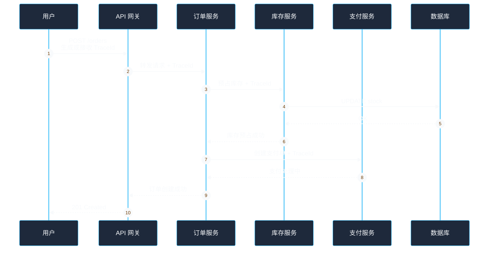
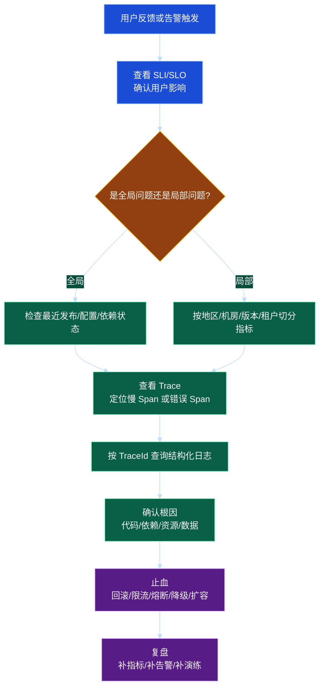

# 第 11 章：可观测性：追踪、指标与日志

## 学习目标

学完本章后，你应该能够：

1. 理解可观测性和传统监控的区别。
2. 掌握日志、指标、分布式追踪三类信号各自适合解决的问题。
3. 能够为一个分布式服务设计基础观测方案，包括请求链路、核心指标、日志字段和告警规则。
4. 能够理解 RED、USE、SLI、SLO、错误预算等常见方法论。
5. 能够在故障排查时从“用户现象”逐步定位到“具体服务、接口、实例、依赖和代码路径”。

---

## 1. 什么是可观测性

传统监控更关注“系统是否还活着”，例如 CPU、内存、磁盘、进程存活、端口可访问。可观测性更关注“系统为什么变成这样”，尤其是在复杂分布式系统中，问题往往不是一个单点指标能解释的。

可观测性希望通过系统输出的信号推断内部状态。最常见的三类信号是：

- 日志 Logs：离散事件，适合回答“发生了什么”。
- 指标 Metrics：数值时间序列，适合回答“趋势如何、是否异常”。
- 追踪 Traces：请求经过的调用链，适合回答“慢在哪里、错在哪里”。

三者不是互相替代，而是互相补充。

---

## 2. 三大信号的定位

| 信号 | 优点 | 缺点 | 典型问题 |
| --- | --- | --- | --- |
| 日志 | 信息丰富，能记录上下文 | 成本高，查询慢，容易噪声过多 | 某个订单为什么失败 |
| 指标 | 聚合便宜，适合告警和趋势 | 细节少，维度过多会爆炸 | 最近 5 分钟错误率是否升高 |
| 追踪 | 能串起跨服务调用链 | 采样后可能丢细节，需要上下文传播 | 一个请求到底卡在哪个依赖 |

直观理解：

- 指标像汽车仪表盘：速度、油量、水温，一眼知道是否异常。
- 日志像行车记录仪：能回看某个时间点发生了什么。
- 追踪像导航轨迹：知道这趟旅程经过了哪些路段，每段耗时多少。

---

## 3. 分布式追踪

### 3.1 Trace、Span 与上下文传播

分布式追踪通常由以下概念组成：

- Trace：一次完整请求的全链路。
- Span：链路中的一个操作单元，例如一次 HTTP 调用、一次数据库查询。
- TraceId：标识整条链路。
- SpanId：标识当前操作。
- ParentSpanId：标识父操作，用于还原调用树。
- Baggage：跨服务传播的少量业务上下文，需谨慎使用。

当请求从网关进入系统时生成 TraceId。后续服务调用时，通过 HTTP Header、RPC Metadata 或消息 Header 继续传播。

### 3.2 调用链示例



### 3.3 追踪能解决什么

追踪非常适合回答：

- 一个慢请求的耗时主要花在哪里？
- 是服务本身慢，还是下游数据库、缓存、第三方 API 慢？
- 某个错误是在哪一层产生的？
- 某个请求是否发生了重试、熔断、降级？
- 跨服务调用是否存在不必要的串行等待？

### 3.4 采样策略

全量追踪成本很高，通常需要采样：

- 固定比例采样：例如采集 1% 请求，简单但可能漏掉错误。
- 错误优先采样：错误请求尽量保留。
- 慢请求采样：超过阈值的请求保留。
- 头部采样：入口决定是否采样，整条链路保持一致。
- 尾部采样：看到完整链路后再决定是否保存，效果好但实现成本高。

工程建议：低流量核心接口可以提高采样率；高流量普通接口使用较低采样率；错误和慢请求优先保留。

---

## 4. 指标体系

### 4.1 指标类型

常见指标类型包括：

- Counter：只增不减的计数器，例如请求总数、错误总数。
- Gauge：可增可减的瞬时值，例如队列长度、当前连接数、内存使用量。
- Histogram：直方图，用于统计延迟分布，例如 P50、P95、P99。
- Summary：客户端侧摘要，适合本地统计分位数，但跨实例聚合困难。

### 4.2 RED 方法

RED 适合请求驱动的在线服务：

- Rate：请求速率，例如 QPS。
- Errors：错误率，例如 5xx 比例、业务失败比例。
- Duration：请求耗时，例如 P95、P99 延迟。

每个核心接口至少应该有 RED 指标。

### 4.3 USE 方法

USE 适合资源层观察：

- Utilization：利用率，例如 CPU 使用率、磁盘使用率。
- Saturation：饱和度，例如线程池队列长度、连接池等待数。
- Errors：错误数，例如磁盘错误、网络错误。

服务层看 RED，资源层看 USE，两者结合才能定位问题。

### 4.4 指标维度控制

指标通常带有标签，例如 `service=order`、`method=POST`、`path=/orders`、`status=500`。标签可以提升查询能力，但高基数标签会导致存储和查询成本暴涨。

高风险标签包括：

- user_id
- order_id
- request_id
- email
- phone
- raw_url，尤其是包含动态参数的 URL
- exception_message，尤其是包含变量值的错误信息

建议：指标标签只放低基数、可聚合的维度。高基数字段放到日志或追踪中。

---

## 5. 日志设计

### 5.1 结构化日志

推荐使用结构化日志，而不是随意拼接字符串。

示例字段：

```json
{
  "timestamp": "2026-05-23T10:15:30.123Z",
  "level": "ERROR",
  "service": "order-service",
  "trace_id": "4f7c9a...",
  "span_id": "a81b...",
  "request_id": "req-123",
  "user_id": "u_9527",
  "operation": "create_order",
  "error_code": "PAYMENT_TIMEOUT",
  "message": "create payment timeout",
  "duration_ms": 312,
  "retry_count": 1
}
```

结构化日志的好处：

- 易于按字段查询。
- 方便和 TraceId 关联。
- 便于统计错误码、接口、用户影响面。
- 减少日志格式不一致带来的排查成本。

### 5.2 日志级别

常见日志级别：

- DEBUG：开发调试信息，生产默认关闭或采样。
- INFO：关键业务状态变化，例如订单创建、任务完成。
- WARN：可恢复异常或潜在风险，例如重试、降级、缓存穿透。
- ERROR：请求失败或需要关注的系统异常。
- FATAL：进程无法继续运行的严重错误。

注意：不要把所有异常都打成 ERROR。可预期的业务失败，例如参数错误、余额不足，通常不应污染系统错误告警。

### 5.3 日志脱敏

日志中不能明文记录敏感信息：

- 密码、Token、Cookie、Session。
- 身份证、银行卡、手机号、邮箱。
- 精确地址、支付信息。
- 内部密钥、数据库连接串。

常见处理方式：

- 字段白名单：只允许记录明确安全的字段。
- 掩码：手机号只保留后四位。
- 哈希：需要关联但不需要明文时使用不可逆哈希。
- 分级权限：敏感日志需要更严格访问控制。

---

## 6. SLI、SLO 与错误预算

### 6.1 SLI

SLI 是服务水平指标，用于量化用户体验。例如：

- 可用性：成功请求数 / 总请求数。
- 延迟：99% 请求在 300ms 内完成。
- 正确性：返回结果与真实状态一致的比例。
- 新鲜度：数据延迟不超过 1 分钟的比例。

### 6.2 SLO

SLO 是服务水平目标，例如：

- 订单创建接口月可用性达到 99.95%。
- 商品详情接口 P99 延迟小于 200ms。
- 搜索索引 99% 情况下 5 分钟内更新。

SLO 应该和用户体验相关，而不是只看机器指标。

### 6.3 错误预算

如果 SLO 是 99.9%，则一个月允许约 0.1% 的失败或不可用时间，这就是错误预算。

错误预算的意义：

- 预算充足时，可以更积极发布新功能。
- 预算消耗过快时，应暂停高风险变更，优先稳定性治理。
- 避免“永远追求 100% 可用”带来的过度成本。

---

## 7. 告警设计

好的告警应该具备：

- 面向用户影响，而不是所有技术噪声。
- 有明确处理动作，收到告警的人知道该做什么。
- 有合适的聚合和抑制，避免告警风暴。
- 分级清晰，区分 P0、P1、P2。
- 包含上下文，例如服务、接口、版本、机房、最近变更。

### 7.1 推荐告警规则

| 场景 | 示例规则 | 说明 |
| --- | --- | --- |
| 可用性下降 | 5 分钟 5xx 比例 > 2% | 适合核心接口 |
| 延迟升高 | P99 延迟连续 10 分钟 > SLO | 避免瞬时抖动误报 |
| 依赖异常 | 下游超时率 > 5% | 结合熔断状态判断 |
| 资源饱和 | 线程池队列持续增长 | 比 CPU 更接近用户影响 |
| 错误预算 | 本日预算消耗超过预期 2 倍 | 指导发布节奏 |

### 7.2 多窗口告警

单一窗口容易误报或漏报。常见做法是同时看短窗口和长窗口：

- 短窗口：快速发现严重故障，例如 5 分钟错误率很高。
- 长窗口：发现持续缓慢劣化，例如 1 小时错误率持续偏高。

---

## 8. 故障排查路径



---

## 9. 工程示例：不依赖外部服务的观测埋点伪代码

下面用 Java 风格伪代码展示如何在业务请求中同时输出指标、日志和追踪上下文。实际工程可替换为具体框架。

```java
public OrderResult createOrder(Request request) {
    String traceId = TraceContext.currentOrCreateTraceId();
    long start = System.currentTimeMillis();

    Metrics.counter("order_create_total", "service", "order").inc();
    Log.info("create_order_start", Map.of(
        "trace_id", traceId,
        "user_id", request.userId(),
        "sku_id", request.skuId()
    ));

    Span span = Tracer.startSpan("OrderService.createOrder");
    try {
        validate(request);

        Span stockSpan = Tracer.startSpan("Inventory.reserve");
        try {
            inventoryClient.reserve(request.skuId(), request.quantity(), traceId);
        } finally {
            stockSpan.end();
        }

        Order order = repository.save(request);
        Metrics.counter("order_create_success_total", "service", "order").inc();
        return OrderResult.success(order.id());
    } catch (BusinessException e) {
        Metrics.counter("order_create_biz_fail_total", "code", e.code()).inc();
        Log.warn("create_order_business_fail", Map.of(
            "trace_id", traceId,
            "error_code", e.code(),
            "message", e.getMessage()
        ));
        return OrderResult.fail(e.code());
    } catch (Exception e) {
        Metrics.counter("order_create_system_error_total", "service", "order").inc();
        Log.error("create_order_system_error", Map.of(
            "trace_id", traceId,
            "exception", e.getClass().getSimpleName()
        ));
        throw e;
    } finally {
        long duration = System.currentTimeMillis() - start;
        Metrics.histogram("order_create_duration_ms", "service", "order").record(duration);
        span.end();
    }
}
```

这个例子体现了几个原则：

- 所有日志都带 TraceId。
- 业务失败和系统异常分开统计。
- 延迟使用直方图，而不是只记录平均值。
- 每个关键下游调用都有单独 Span。
- 指标标签避免放入订单 ID、请求 ID 等高基数字段。

---

## 10. 常见误区

### 误区一：有日志就等于有可观测性

日志只是可观测性的一部分。没有指标就难以及时发现趋势，没有追踪就难以理解跨服务调用链。

### 误区二：只看平均延迟

平均值会掩盖长尾。用户体验通常受 P95、P99 影响更大。一个接口平均 50ms，但 P99 可能已经超过 2 秒。

### 误区三：指标标签越多越好

标签越多，查询越灵活，但存储成本和基数风险也越高。用户 ID、订单 ID 这类高基数字段不适合放进指标标签。

### 误区四：所有错误都告警

告警应该面向需要人处理的用户影响。参数错误、用户余额不足等业务失败不应和系统故障混在一起告警。

### 误区五：TraceId 只在日志里生成，不跨服务传播

如果 TraceId 不跨服务传播，就无法串起完整链路。入口生成后必须通过请求头、RPC 元数据、消息头继续传递。

### 误区六：只在故障后补监控

可观测性应该在设计阶段纳入需求。一个没有观测能力的系统，即使功能正确，也很难稳定运营。

---

## 11. 面试 / 设计题思考

### 题目一：如何为订单系统设计可观测性方案？

可以从以下方面回答：

1. 核心 SLI：下单成功率、支付创建成功率、P99 延迟、库存预占成功率。
2. 指标：按接口、状态码、错误码、下游依赖统计 RED 指标。
3. 日志：订单创建、状态流转、支付回调、库存补偿都输出结构化日志。
4. 追踪：网关、订单、库存、支付、数据库访问都在同一 Trace 下。
5. 告警：下单 5xx、支付超时率、库存预占失败率、消息堆积、错误预算燃烧率。
6. 看板：业务看板、服务看板、依赖看板、资源看板。

### 题目二：如何定位一个 P99 延迟突然升高的问题？

排查路径：

1. 看是否所有接口都升高，还是某个接口升高。
2. 按机房、版本、实例、租户切分指标。
3. 查看慢请求 Trace，找出耗时最大的 Span。
4. 如果是数据库，查看慢查询、连接池等待、锁等待。
5. 如果是下游服务，查看下游错误率和延迟。
6. 关联最近发布、配置变更、流量变化。
7. 先止血，再复盘补充观测缺口。

### 题目三：什么是错误预算？它有什么用？

错误预算是 SLO 允许失败的空间。它帮助团队在稳定性和迭代速度之间做决策：预算充足时可以更快发布，预算消耗过快时应减少变更、优先修复稳定性问题。

---

## 12. 章节小结

可观测性是分布式系统稳定运行的基础。日志、指标、追踪分别解决不同问题：

- 指标用于发现异常、趋势分析和告警。
- 日志用于记录事件细节和业务上下文。
- 追踪用于还原跨服务调用链路。

优秀的可观测性设计不只是“多打日志、多采集指标”，而是围绕用户体验定义 SLI/SLO，控制指标维度，传播 TraceId，输出结构化日志，并让告警具备明确处理动作。只有这样，系统出现故障时，团队才能快速判断影响范围、定位根因并完成止血。
