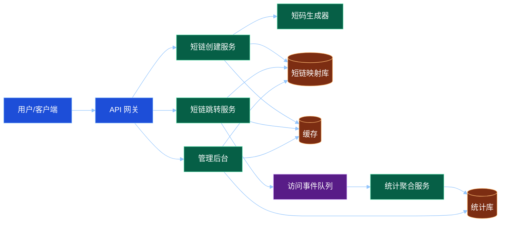
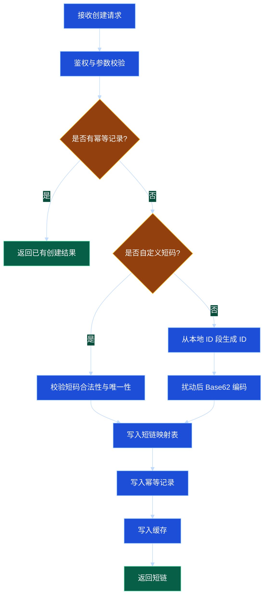

# 第 12 章：工程案例：短链系统分布式设计

## 学习目标

学完本章后，你应该能够：

1. 从需求分析开始，完整设计一个短链系统。
2. 能够进行容量估算，并基于估算选择存储、缓存、分片和索引方案。
3. 能够设计短链创建、跳转、统计、管理等核心 API。
4. 能够说明短链系统的读写路径、缓存策略、冲突处理、容灾方案和可观测性方案。
5. 能够在面试中清晰表达系统设计权衡：一致性与性能、可用性与成本、随机码与发号器、同步统计与异步统计。

---

## 1. 需求分析

短链系统的核心能力是把长 URL 转换成短 URL，并在用户访问短 URL 时跳转到原始长 URL。

### 1.1 功能需求

基础功能：

1. 创建短链：输入长 URL，返回短码或完整短链。
2. 短链跳转：访问短链后重定向到长 URL。
3. 自定义短码：部分用户可以指定短码，例如 `https://s.example/a2026`。
4. 过期时间：短链可以永久有效，也可以指定过期时间。
5. 禁用和删除：管理员或用户可以禁用恶意链接。
6. 访问统计：统计 PV、UV、来源、地区、设备、时间分布。
7. 用户管理：用户只能管理自己创建的短链。

扩展功能：

- 批量创建短链。
- 黑白名单与安全扫描。
- 防刷和限流。
- 二维码生成。
- 多域名支持。
- A/B 跳转或按地区跳转。

### 1.2 非功能需求

短链系统通常读多写少：创建短链频率相对较低，访问跳转频率很高。因此非功能要求包括：

- 高可用：跳转链路必须尽量可用。
- 低延迟：短链跳转应在几十毫秒内完成，不应引入复杂同步逻辑。
- 高并发读：热点短链可能在短时间内被大量访问。
- 数据持久：已创建短链不能轻易丢失。
- 可扩展：短码空间、存储容量、访问统计都能水平扩展。
- 安全合规：拦截恶意 URL，保护用户隐私，支持审计。

### 1.3 明确边界

本章设计一个面向互联网应用的短链系统，重点关注：

- 短链创建与跳转。
- 缓存、分片、容灾。
- 访问统计的异步化。
- 不依赖外部服务的伪代码和工程实践。

不展开复杂的机器学习风控、全球 Anycast DNS、商业化计费等高级能力。

---

## 2. 容量估算

容量估算不是为了得到绝对准确数字，而是为了指导架构选择。

假设业务规模：

- 每天创建短链：1000 万条。
- 每天访问跳转：10 亿次。
- 平均长 URL 长度：500 字节。
- 短码长度：8 位 Base62。
- 短链元数据平均：300 字节。
- 访问日志平均：200 字节。
- 数据保留：短链永久保存，明细访问日志保留 30 天。

### 2.1 写入 QPS

创建短链：

- 1000 万 / 86400 ≈ 116 QPS。
- 考虑峰值 10 倍：约 1200 QPS。

跳转访问：

- 10 亿 / 86400 ≈ 11574 QPS。
- 考虑峰值 10 倍：约 12 万 QPS。

结论：跳转读路径是核心瓶颈，创建写路径相对容易。

### 2.2 存储容量

短链主表每天新增：

- 每条约 8 字节短码 + 500 字节长 URL + 300 字节元数据，粗略按 1KB 计算。
- 1000 万条 / 天 ≈ 10GB / 天。
- 一年约 3.65TB，考虑索引和副本可能达到 10TB 级别。

访问日志：

- 10 亿次 / 天 × 200 字节 ≈ 200GB / 天。
- 保留 30 天 ≈ 6TB，考虑副本和索引会更高。

结论：短链映射表可以按短码分片长期保存；访问明细日志需要单独的日志/分析存储，不应和核心跳转表混在一起。

### 2.3 短码空间

Base62 字符集包含 `0-9a-zA-Z`，长度为 8 的短码空间：

- 62^8 ≈ 218 万亿。

如果每天创建 1000 万条，一年约 36.5 亿条，8 位 Base62 足够长期使用。

---

## 3. 总体架构

短链系统可以拆成四条主要链路：

1. 创建链路：校验长 URL，生成短码，写入映射表，写缓存。
2. 跳转链路：解析短码，查缓存或数据库，返回 301/302。
3. 统计链路：跳转时异步记录访问事件，后台聚合统计。
4. 管理链路：禁用、删除、查询、审核。



---

## 4. 短码生成方案

### 4.1 随机生成

随机生成 8 位 Base62 短码，写入数据库时依赖唯一索引检测冲突。

优点：

- 实现简单。
- 短码不可预测。
- 不依赖中心化发号器。

缺点：

- 随着使用量增加，冲突概率上升。
- 需要处理重试。
- 批量创建时可能有额外写放大。

适合中小规模或对可预测性敏感的场景。

### 4.2 自增 ID + Base62 编码

使用全局递增 ID，然后转成 Base62。

优点：

- 不冲突。
- 编码短，生成速度快。
- 便于分片和排查。

缺点：

- 短码可预测，可能被遍历。
- 需要高可用 ID 生成器。
- 自增趋势可能导致某些存储热点。

可通过加盐、打乱映射、分段发号、Snowflake 等方式缓解。

### 4.3 预生成号码池

后台提前生成一批短码放入号码池，创建短链时直接取用。

优点：

- 创建链路延迟低。
- 可以提前去重和过滤敏感词。
- 发号器短暂不可用时仍可创建。

缺点：

- 需要维护号码池容量。
- 多实例并发取号要保证不重复。
- 未使用号码的回收和状态管理更复杂。

### 4.4 本章选择

本章采用“分段 ID + Base62 + 简单扰动”的方案：

1. ID 服务按段分配 ID，例如每个创建服务一次领取 10 万个 ID。
2. 创建服务本地递增使用，减少对 ID 服务的依赖。
3. 将 ID 经过可逆扰动或哈希打散后做 Base62 编码，降低可预测性。
4. 数据库仍然保留短码唯一索引，作为最后防线。

---

## 5. 数据模型

### 5.1 短链映射表

```sql
CREATE TABLE short_url (
    id BIGINT PRIMARY KEY,
    code VARCHAR(16) NOT NULL,
    domain VARCHAR(64) NOT NULL,
    long_url TEXT NOT NULL,
    creator_id BIGINT NOT NULL,
    status TINYINT NOT NULL,
    expire_at TIMESTAMP NULL,
    created_at TIMESTAMP NOT NULL,
    updated_at TIMESTAMP NOT NULL,
    UNIQUE KEY uk_domain_code (domain, code),
    KEY idx_creator_created (creator_id, created_at),
    KEY idx_expire_at (expire_at)
);
```

字段说明：

- `code`：短码，例如 `aB91xYz2`。
- `domain`：支持多短链域名。
- `long_url`：原始长 URL。
- `status`：正常、禁用、删除、审核中。
- `expire_at`：过期时间，空表示永久有效。

### 5.2 访问事件表或日志

访问事件不建议直接同步写入关系型主库。可以先写入队列或本地缓冲，再异步落地。

事件字段：

```json
{
  "event_id": "uuid",
  "code": "aB91xYz2",
  "domain": "s.example",
  "trace_id": "trace-001",
  "visited_at": "2026-05-23T10:00:00Z",
  "ip_hash": "hash(ip)",
  "user_agent": "browser info",
  "referer": "https://example.com",
  "country": "CN",
  "device": "mobile"
}
```

注意：IP、User-Agent、Referer 可能涉及隐私和安全，需要脱敏、截断或按合规要求处理。

### 5.3 聚合统计表

```sql
CREATE TABLE short_url_stat_hourly (
    domain VARCHAR(64) NOT NULL,
    code VARCHAR(16) NOT NULL,
    hour_time TIMESTAMP NOT NULL,
    pv BIGINT NOT NULL,
    uv BIGINT NOT NULL,
    PRIMARY KEY (domain, code, hour_time)
);
```

统计表按小时聚合即可满足大部分运营查询。实时大屏可以使用内存聚合或流式聚合，最终再落库。

---

## 6. API 设计

### 6.1 创建短链

请求：

```http
POST /api/v1/short-urls
Content-Type: application/json
Idempotency-Key: create-u123-20260523-0001

{
  "long_url": "https://www.example.com/articles/distributed-system?id=123",
  "domain": "s.example",
  "custom_code": "dist2026",
  "expire_at": "2026-12-31T23:59:59Z"
}
```

响应：

```json
{
  "code": "dist2026",
  "short_url": "https://s.example/dist2026",
  "long_url": "https://www.example.com/articles/distributed-system?id=123",
  "expire_at": "2026-12-31T23:59:59Z"
}
```

设计要点：

- 使用幂等键避免客户端超时后重复创建。
- 校验 URL 格式、长度、协议和黑名单。
- 自定义短码需要校验字符集、长度、敏感词和唯一性。
- 创建成功后可以主动写入缓存。

### 6.2 短链跳转

请求：

```http
GET /{code}
Host: s.example
```

响应：

```http
HTTP/1.1 302 Found
Location: https://www.example.com/articles/distributed-system?id=123
Cache-Control: no-store
```

301 与 302 的选择：

- 301：永久重定向，浏览器和搜索引擎可能长期缓存，性能好但变更困难。
- 302：临时重定向，便于统计、禁用、修改目标地址，短链系统更常用。

### 6.3 管理接口

示例：

- `GET /api/v1/short-urls/{code}` 查询详情。
- `PATCH /api/v1/short-urls/{code}` 修改状态或过期时间。
- `DELETE /api/v1/short-urls/{code}` 删除或软删除。
- `GET /api/v1/short-urls/{code}/stats?from=...&to=...` 查询统计。

管理接口必须鉴权，并校验资源归属。

---

## 7. 读写路径设计

### 7.1 创建短链写路径



写路径实践：

- 数据库唯一索引保证 `(domain, code)` 不重复。
- 如果自动短码极小概率冲突，重新生成即可。
- 创建成功后写缓存，降低首次访问数据库压力。
- 幂等记录可以设置合理过期，例如 24 小时或 7 天。

### 7.2 跳转读路径

跳转路径必须极简：

1. 从 Host 和 Path 解析 `domain` 与 `code`。
2. 执行本地限流和黑名单判断。
3. 查询本地缓存或分布式缓存。
4. 缓存未命中时查询数据库。
5. 判断状态和过期时间。
6. 异步记录访问事件。
7. 返回 302。

伪代码：

```go
func Redirect(w http.ResponseWriter, r *http.Request) {
    domain := r.Host
    code := parseCode(r.URL.Path)
    traceID := getOrCreateTraceID(r)

    if !rateLimiter.Allow(domain, code) {
        http.Error(w, "too many requests", http.StatusTooManyRequests)
        return
    }

    item, ok := localCache.Get(domain, code)
    if !ok {
        item, ok = remoteCache.Get(domain, code)
    }
    if !ok {
        item, ok = repository.FindByDomainAndCode(domain, code)
        if ok {
            remoteCache.Set(domain, code, item, cacheTTL(item))
            localCache.Set(domain, code, item, shortTTL())
        }
    }

    if !ok || item.Status != StatusEnabled || item.IsExpired(time.Now()) {
        http.NotFound(w, r)
        return
    }

    eventBuffer.TryAppend(VisitEvent{
        Domain: domain,
        Code: code,
        TraceID: traceID,
        UserAgent: truncate(r.UserAgent(), 256),
        Referer: truncate(r.Referer(), 512),
        VisitedAt: time.Now(),
    })

    http.Redirect(w, r, item.LongURL, http.StatusFound)
}
```

关键点：访问统计不能阻塞跳转主链路。事件缓冲满时可以采样、丢弃或降级写入，但不应拖慢重定向。

---

## 8. 缓存设计

短链跳转是典型读多写少场景，缓存非常关键。

### 8.1 缓存层次

- 浏览器缓存：谨慎使用，302 通常不希望浏览器长期缓存。
- CDN 或边缘缓存：适合永久稳定短链，但会影响禁用实时性。
- 服务本地缓存：极低延迟，适合热点短码，TTL 较短。
- 分布式缓存：承接大部分读流量。
- 数据库：最终权威数据源。

### 8.2 缓存 Key

建议 Key 包含域名：

```text
short_url:{domain}:{code}
```

这样可以支持多域名下相同短码独立存在。

### 8.3 TTL 策略

- 永久短链：缓存 TTL 可以较长，例如 1 小时到 24 小时，并加入随机抖动。
- 即将过期短链：TTL 不应超过过期剩余时间。
- 被禁用短链：删除缓存或写入短 TTL 的禁用状态。
- 不存在短链：可以做短时间空值缓存，防止缓存穿透。

### 8.4 热点短链

热点短链可能导致单个缓存 Key 被打爆。可选策略：

- 本地缓存承接热点。
- 热点 Key 多副本，例如加随机后缀读多个副本。
- 提前预热活动短链。
- 对异常来源做限流。
- 对统计事件采样，避免热点短链拖垮统计链路。

### 8.5 缓存一致性

短链修改或禁用后，需要尽快让缓存失效。常见做法：

1. 先更新数据库状态。
2. 删除分布式缓存。
3. 发布缓存失效消息，让各实例删除本地缓存。
4. 如果删除失败，依靠短 TTL 兜底。

对于恶意链接禁用，实时性比性能更重要，可以在跳转链路增加小型本地黑名单，并通过配置或消息快速下发。

---

## 9. 分片与扩展

### 9.1 按短码分片

短链查询主要按 `(domain, code)`，因此主表适合按 code 哈希分片。

优点：

- 查询路由明确。
- 数据分布相对均匀。
- 写入不集中。

缺点：

- 按用户查询自己创建的短链需要二级索引或单独表。
- 扩容迁移需要一致性哈希、路由表或在线迁移工具。

### 9.2 用户维度查询

管理后台常见查询是“某用户创建了哪些短链”。如果主表按 code 分片，按用户分页查询会跨分片。

解决方案：

- 建立用户短链索引表，按 `creator_id` 分片。
- 使用搜索或分析存储承接管理查询。
- 对管理查询接受更高延迟，不影响跳转主链路。

示例索引表：

```sql
CREATE TABLE user_short_url_index (
    creator_id BIGINT NOT NULL,
    created_at TIMESTAMP NOT NULL,
    domain VARCHAR(64) NOT NULL,
    code VARCHAR(16) NOT NULL,
    title VARCHAR(128),
    status TINYINT NOT NULL,
    PRIMARY KEY (creator_id, created_at, domain, code)
);
```

### 9.3 访问统计分片

访问事件量远大于短链创建量。统计链路应独立扩展：

- 事件按 `hash(code)` 或 `hash(domain, code)` 分区。
- 聚合服务按分区消费，避免同一短码的计数并发冲突。
- 明细日志和聚合统计分开存储。
- 热点短码可以单独拆分统计分区或使用分片计数器。

---

## 10. 容灾与高可用

### 10.1 跳转链路优先级最高

短链系统最核心的是跳转可用。创建、统计、管理都可以短暂降级，但跳转失败会直接影响最终用户。

跳转链路高可用策略：

- 多实例部署，网关健康检查。
- 缓存集群多副本。
- 数据库主从或多副本。
- 本地缓存兜底热点数据。
- 依赖失败时快速失败，不阻塞线程。
- 统计链路异常时自动降级，不影响跳转。

### 10.2 数据库故障

如果数据库短暂不可用：

- 缓存命中的短链仍可跳转。
- 缓存未命中的短链可能返回临时错误或 404 风险较高。
- 创建短链应暂停或返回服务繁忙，避免不一致。
- 恢复后通过重试或补偿处理失败写入。

对于高价值短链，可以预热到缓存或边缘节点，降低数据库故障影响。

### 10.3 缓存故障

如果分布式缓存不可用：

- 本地缓存可承接一部分热点。
- 跳转服务需要对数据库访问限流，避免缓存故障导致数据库雪崩。
- 可以临时启用更强的本地缓存和热点白名单。
- 非热点流量可能被限流或返回稍后再试。

### 10.4 统计链路故障

统计链路故障不应影响跳转：

- 事件队列不可用时，本地缓冲短暂堆积。
- 缓冲满时丢弃低优先级统计事件或采样。
- 记录丢弃计数，用于告警和误差评估。
- 核心计费场景不能随意丢弃，需要更可靠的日志落盘和补偿机制。

---

## 11. 安全与风控

短链容易被滥用于钓鱼、诈骗、恶意下载，因此必须考虑安全。

关键措施：

- URL 协议白名单：只允许 http/https。
- 域名黑名单：禁止跳转到恶意域名。
- 创建限流：按用户、IP、租户限制创建频率。
- 跳转限流：对异常来源、热点短码、爬虫做保护。
- 安全扫描：创建时或异步扫描长 URL。
- 管理审核：高风险链接进入审核中状态。
- 滥用投诉：支持快速禁用和审计。
- 防遍历：短码不可过于连续可预测，或增加访问风控。

---

## 12. 可观测性设计

短链系统需要围绕创建、跳转、缓存、数据库、统计链路建立观测。

### 12.1 核心指标

跳转链路：

- `redirect_qps`
- `redirect_success_rate`
- `redirect_latency_p95/p99`
- `redirect_cache_hit_rate`
- `redirect_not_found_rate`
- `redirect_limited_total`

创建链路：

- `create_qps`
- `create_success_rate`
- `create_latency_p95/p99`
- `code_conflict_total`
- `id_segment_remaining`

缓存与数据库：

- 缓存命中率、超时率、错误率。
- 数据库查询延迟、连接池等待、慢查询数量。
- 分片负载分布。

统计链路：

- 事件写入成功率。
- 队列堆积量。
- 消费延迟。
- 丢弃事件数量。
- 聚合任务延迟。

### 12.2 日志与追踪

跳转日志应谨慎控制量和隐私。建议：

- 错误日志全量保留。
- 正常跳转日志采样或只进入访问事件流。
- 所有错误日志包含 `trace_id`、`domain`、`code`、`error_code`。
- 不记录完整敏感查询参数，必要时截断或脱敏。

追踪中应包含：

- 网关入口 Span。
- 缓存查询 Span。
- 数据库查询 Span。
- 统计事件写入 Span，或至少记录异步投递结果。

### 12.3 告警

推荐告警：

- 跳转成功率 5 分钟低于 99.9%。
- 跳转 P99 延迟连续 10 分钟超过 100ms。
- 缓存命中率突然下降超过 20%。
- 数据库查询 P99 超过阈值。
- 统计队列堆积持续增长。
- 恶意链接禁用后仍有跳转成功。

---

## 13. 权衡取舍

### 13.1 301 还是 302

- 301 性能和 SEO 友好，但一旦浏览器缓存，后续修改和禁用不一定立刻生效。
- 302 更灵活，便于统计和风控，是通用短链系统的默认选择。

本章选择 302。

### 13.2 随机码还是自增 ID

- 随机码简单且不可预测，但需要处理冲突。
- 自增 ID 不冲突但可预测，需要扰动或风控。

本章选择分段 ID + Base62 + 扰动，兼顾性能和冲突控制。

### 13.3 同步统计还是异步统计

- 同步统计准确性更强，但会拖慢跳转路径。
- 异步统计性能更好，但可能丢失少量事件或有延迟。

本章选择异步统计，因为跳转延迟和可用性优先。

### 13.4 强一致缓存还是最终一致缓存

- 强一致可以更快反映禁用和修改，但成本高、延迟高。
- 最终一致性能好，但存在短暂旧数据窗口。

本章选择数据库为准、缓存短 TTL + 删除缓存 + 失效消息。对于恶意链接禁用，额外使用黑名单快速下发。

### 13.5 单体服务还是拆分服务

早期可以用模块化单体：创建、跳转、管理、统计在一个代码库中，但逻辑隔离。规模增长后优先拆分跳转服务和统计服务，因为它们的流量模型差异最大。

---

## 14. 常见误区

### 误区一：短链系统只是简单的数据库查询

真正的短链系统难点在高并发跳转、热点缓存、恶意链接治理、统计异步化、禁用实时性和容量增长。

### 误区二：访问统计直接同步写数据库

跳转 QPS 很高，同步写统计会严重拖慢核心链路，并可能把数据库打垮。统计应异步化。

### 误区三：缓存永久不过期

永久缓存会导致禁用、删除、修改无法及时生效。即使是永久短链，缓存也应该有 TTL 和失效机制。

### 误区四：短码自增没有问题

连续短码容易被遍历，攻击者可以扫描大量短链。需要扰动、风控、限流和访问异常检测。

### 误区五：404 不需要缓存

大量访问不存在短码会造成缓存穿透。可以对不存在短码设置短 TTL 空值缓存，但要避免影响刚创建短链的可见性。

### 误区六：统计必须绝对准确

大多数运营统计允许轻微延迟和误差。只有计费、审计等场景需要更强可靠性，应单独设计可靠事件链路。

---

## 15. 面试 / 设计题思考

### 题目一：设计一个支持每天 10 亿次访问的短链系统

回答框架：

1. 明确需求：创建、跳转、过期、禁用、统计、自定义短码。
2. 容量估算：读多写少，峰值跳转约 10 万 QPS 级别。
3. 短码生成：Base62，随机或发号器，说明冲突和可预测性。
4. 存储模型：映射表按 code 分片，用户索引表支持管理查询。
5. 读路径：本地缓存 + 分布式缓存 + 数据库，统计异步化。
6. 写路径：幂等创建，唯一索引，缓存预热。
7. 高可用：缓存故障保护数据库，数据库故障时缓存兜底。
8. 安全：黑名单、限流、防遍历、恶意链接禁用。
9. 可观测性：跳转成功率、P99、缓存命中率、队列堆积。
10. 权衡：302、异步统计、最终一致缓存。

### 题目二：如何处理热点短链？

可以回答：

- 提前预热缓存。
- 本地缓存降低远程缓存压力。
- 热点 Key 多副本或边缘缓存。
- 对统计事件采样或分片计数。
- 对异常来源限流。
- 活动场景提前容量评估和压测。

### 题目三：短链被禁用后，如何尽快生效？

可以回答：

1. 数据库状态更新为禁用。
2. 删除分布式缓存。
3. 发布失效消息，清理各跳转服务本地缓存。
4. 将恶意短码加入快速下发的黑名单。
5. 监控禁用后是否仍有成功跳转。
6. 依靠短 TTL 兜底处理消息丢失。

### 题目四：如何避免短码冲突？

- 使用全局 ID 生成后 Base62 编码，天然不冲突。
- 如果使用随机短码，依赖唯一索引并在冲突时重试。
- 自定义短码必须查重，并由唯一索引兜底。
- 多域名场景唯一键应为 `(domain, code)`。

---

## 16. 章节小结

本章完整设计了一个短链系统，从需求、容量估算、短码生成、数据模型、API、读写路径、缓存、分片、容灾、安全、可观测性到权衡取舍进行了系统分析。

短链系统的核心原则是：

- 跳转链路优先，保持极简、低延迟、高可用。
- 创建链路保证幂等和唯一性。
- 统计链路异步化，避免影响跳转。
- 缓存承接绝大多数读流量，但必须考虑失效和一致性。
- 主表按短码分片，管理查询和统计查询使用独立模型。
- 安全治理和可观测性不是附加项，而是生产级短链系统的必要组成。

在系统设计面试中，短链题目看似简单，但很适合考察候选人是否具备完整工程视角：能否从一个 URL 映射问题，扩展到容量、性能、一致性、容灾、安全和运营可观测性等真实分布式系统问题。
