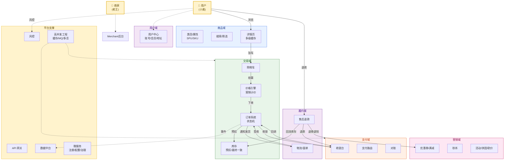
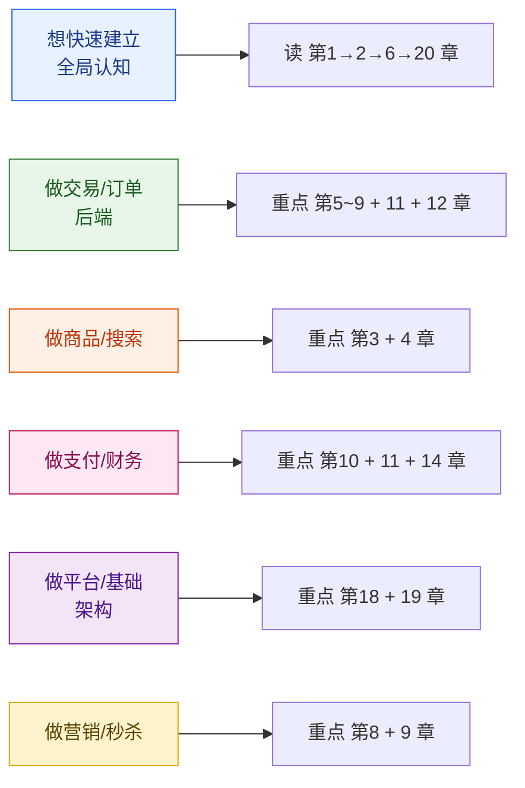
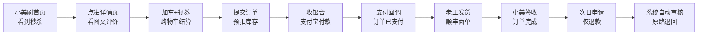

# 商城平台系统设计 · 全景教程

> 一份面向工程师的、端到端覆盖的商城平台（电商）系统设计教程。从商品中心、类目体系、搜索、详情页、购物车、订单、库存、营销、支付、分布式事务、售后退款，到用户中心、商家后台、物流、风控、数据中台、微服务、API 网关、高并发工程实战，最终通过一次完整下单的端到端串讲把整条链路打通。
>
> **风格定位**：深入原理 + 架构图解 + 关键代码 + 真实案例。
> **目标读者**：想体系化掌握电商 / 商城平台后端架构、交易链路的工程师。

---

## 一、为什么要学商城平台系统设计

电商是规模最大、业务最复杂的互联网形态之一。淘宝/天猫、京东、拼多多、美团、抖音电商、唯品会……每个都是几亿用户、千万级 SKU、上亿日订单的怪物级系统。它不是单一难题，而是同时叠加了商品、交易、营销、支付、履约、风控、数据七大维度的工程挑战：

- **业务复杂**：商品模型、状态机、价格计算、优惠叠加、库存分配、退款逆向……
- **并发极高**：大促瞬间百万级 QPS、千万级库存热点、亿级购物车。
- **一致性极严**：钱、库存、券不能错，跨服务事务必须强一致。
- **容灾极严**：一次大促宕机损失上亿，可用性要求 99.99% 以上。
- **数据极重**：行为埋点、画像、订单分析、实时大屏，数据流无处不在。

学透它，等于同时打通了分布式系统、数据库、微服务、消息队列、缓存、搜索、支付、风控、数据工程的主线。

---

## 二、全景架构图

下面这张图是整篇教程的"地图"。商城被拆成七大域：**用户域**（谁在买）、**商品域**（卖什么）、**交易域**（怎么下单）、**支付域**（钱怎么走）、**营销域**（怎么促单）、**履约域**（怎么送到）、**平台支撑**（基础）。后续每章聚焦其中一块。

---

## 三、章节目录

### 第一部分 · 基础与全景

| 章节 | 标题 | 核心内容 |
| --- | --- | --- |
| [第 1 章](./01-导论-商城平台全景与核心概念.md) | 导论：商城平台全景与核心概念 | 商城分类、核心指标、核心角色、技术挑战、电商与零售关系、贯穿案例 |
| [第 2 章](./02-整体架构与一次下单的生命周期.md) | 整体架构与一次下单的生命周期 | 七大域划分、端到端流程、读写路径、规模与延迟挑战、技术栈全景 |

### 第二部分 · 商品域

| 章节 | 标题 | 核心内容 |
| --- | --- | --- |
| [第 3 章](./03-商品中心.md) | 商品中心：SPU/SKU、类目、属性、搜索 | 商品域数据模型、类目树、属性体系、ES 搜索、商品发布、ERP 对接 |
| [第 4 章](./04-商品详情页与多级缓存.md) | 商品详情页与多级缓存架构 | 详情页流量、多级缓存（Caffeine+Redis+CDN）、静态化、热点商品 |

### 第三部分 · 交易域

| 章节 | 标题 | 核心内容 |
| --- | --- | --- |
| [第 5 章](./05-购物车系统.md) | 购物车系统 | 数据模型、价格计算、Redis 实现、合并、未登录/登录购物车 |
| [第 6 章](./06-订单系统.md) | 订单系统：状态机与生命周期 | 订单模型、正向/逆向流程、状态机、订单号、分库分表 |
| [第 7 章](./07-库存系统.md) | 库存系统：预扣、最终一致与热点库存 | 库存模型、超卖防护、Redis Lua+DB 乐观锁、回滚、热点库存 |
| [第 8 章](./08-营销中心与价格计算.md) | 营销中心：优惠券、满减、限时折扣与价格计算 | 营销工具、价格引擎、优惠叠加/互斥、预付定金、分摊 |
| [第 9 章](./09-秒杀系统设计.md) | 秒杀系统设计：极致高并发实战 | 链路、削峰、Redis 预扣、MQ 异步下单、限流、防刷、热点隔离 |

### 第四部分 · 支付与一致性

| 章节 | 标题 | 核心内容 |
| --- | --- | --- |
| [第 10 章](./10-支付系统.md) | 支付系统：收银台、路由、回调与对账 | 收银台、支付路由、回调幂等、对账机制 |
| [第 11 章](./11-分布式事务.md) | 分布式事务：可靠消息、TCC、Saga | 交易一致性、可靠消息、TCC、Saga、最大努力通知、幂等 |

### 第五部分 · 履约与用户

| 章节 | 标题 | 核心内容 |
| --- | --- | --- |
| [第 12 章](./12-售后退款系统.md) | 售后退款系统 | 仅退款/退货退款/换货、状态机、资金流、客服/仲裁 |
| [第 13 章](./13-用户中心与会员体系.md) | 用户中心与会员体系 | 账号、会员等级、积分、地址、实名、登录态 |
| [第 14 章](./14-商家与商家后台.md) | 商家与商家后台 | 入驻、商品/库存/订单管理、ERP、结算、子账号 |
| [第 15 章](./15-物流与配送系统.md) | 物流与配送系统 | 电子面单、物流商对接、运费模板、轨迹、签收、异常 |

### 第六部分 · 平台与工程

| 章节 | 标题 | 核心内容 |
| --- | --- | --- |
| [第 16 章](./16-风控与反欺诈.md) | 风控与反欺诈 | 账号风控、刷单、恶意退款、套现、规则引擎、机器学习 |
| [第 17 章](./17-数据中台与BI.md) | 数据中台与商业智能 | 订单事实表、用户画像、转化漏斗、实时大屏、埋点 |
| [第 18 章](./18-API网关与微服务.md) | API 网关与微服务架构 | 微服务拆分、网关、注册中心、配置中心、限流熔断、灰度 |
| [第 19 章](./19-高并发工程架构实战.md) | 高并发工程架构实战 | 容量估算、多级缓存、MQ 削峰、缓存三大问题、分库分表、多活 |

### 结语

| 章节 | 标题 | 核心内容 |
| --- | --- | --- |
| [第 20 章](./20-全链路串讲与学习路径.md) | 全链路串讲与学习路径 | 端到端串讲、案例、经典开源、学习路径、面试要点 |

---

## 四、阅读建议

- **建议顺序**：按章节顺序通读。前两章建立全景；第 3-9 章是交易核心；第 10-15 章是支付/履约/用户；第 16-19 章是平台与工程；第 20 章串讲收口。
- **核心三章**：第 6 章（订单状态机）、第 7 章（库存）、第 9 章（秒杀）是交易链路的浓缩，值得反复看。
- **工程落地**：第 19 章把前面所有模块的工程约束统一收口，做架构设计前必读。

---

## 五、贯穿全篇的一个例子

为了让 20 章不割裂，全篇用同一组虚构角色串联：

> **「极购商城」**：一个日活 **1500 万**、商品库 **5 亿 SKU** 的全品类综合电商（自营 + 第三方）。
>
> **小美**：24 岁，住上海，运营岗，女生，关注的类目是美妆、零食、家居。每月在极购下单 8 次，客单价 110 元。她是典型的"比价型"用户，秒杀、满减、拼团都会参加。
>
> **老王**：38 岁，潮牌店主，在极购开了 3 年的旗舰店「王的潮品」，同时管理 2000+ SKU、3 个仓库、2 个客服小组。
>
> **平台方**：极购商城运营、技术、风控、财务、客服等团队。

我们将跟随小美的一次下单：

这条订单会穿过商品、搜索、详情、购物车、订单、库存、营销、支付、履约、退款的每一个环节——它就是我们理解整个系统的"导游"。

---

## 六、规模基准（贯穿全篇的数量级假设）

为了让讨论具体，本教程统一采用以下「极购商城」的规模假设（数量级参考真实头部平台公开数据）：

| 维度 | 假设值 | 参考来源（数量级） |
| --- | --- | --- |
| 日活 DAU | 1500 万 | 拼多多/京东量级 |
| 商品库总量 | 5 亿 SKU | 淘宝 30 亿+ |
| 商家数 | 50 万 | 淘宝 1000 万+ |
| 日均订单 | 800 万 | 京东 618 当日千万级 |
| 大促峰值订单 | 2000 万/日 |  |
| 客单价 | 110 元 |  |
| 日 GMV | 10 亿元 |  |
| 大促峰值 GMV | 200 亿/日 |  |
| 大促峰值 QPS | 50 万 | 阿里双11 峰值 58.3 万笔/秒 |
| 详情页 QPS | 100 万+ |  |
| 库存热点 QPS | 1 万/单 SKU |  |
| 购物车 QPS | 50 万 |  |
| 支付峰值 TPS | 10 万+ | 阿里双11 目标值 |

> 📌 本教程所有外部资料来源已在各章末尾「参考来源」中以链接标注。数值为数量级示意，实际因平台而异。下面进入正文。
