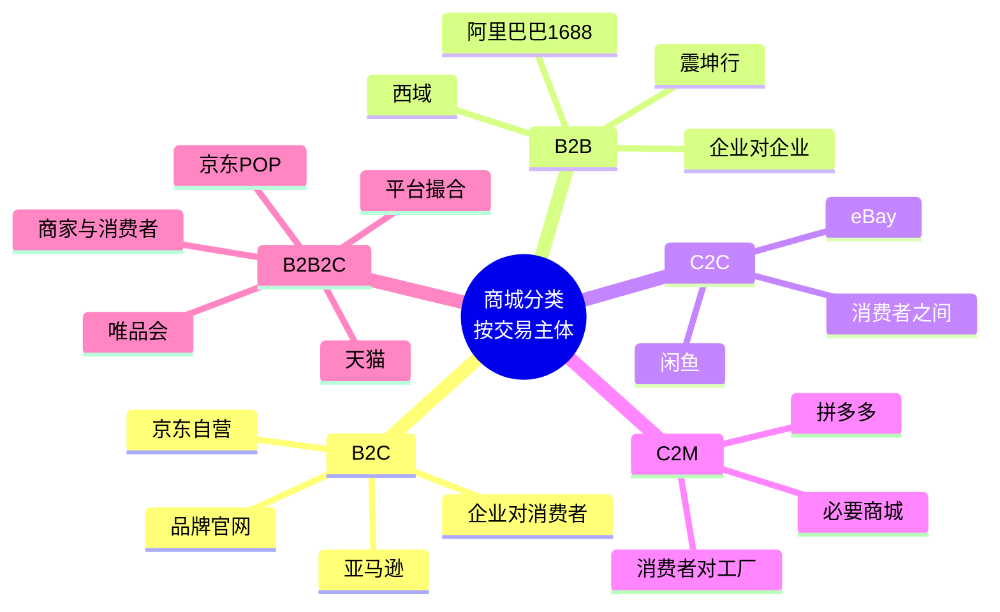
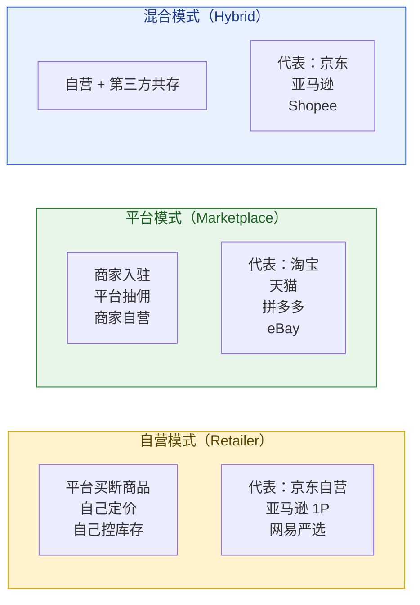
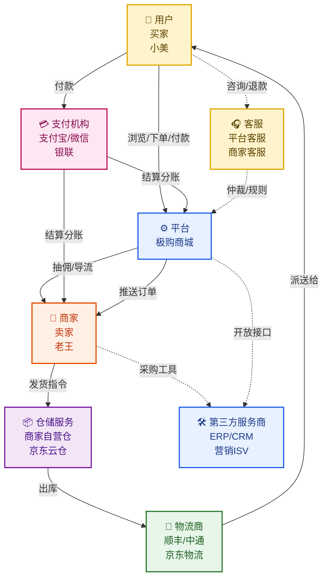
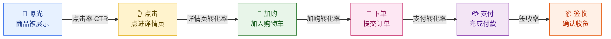
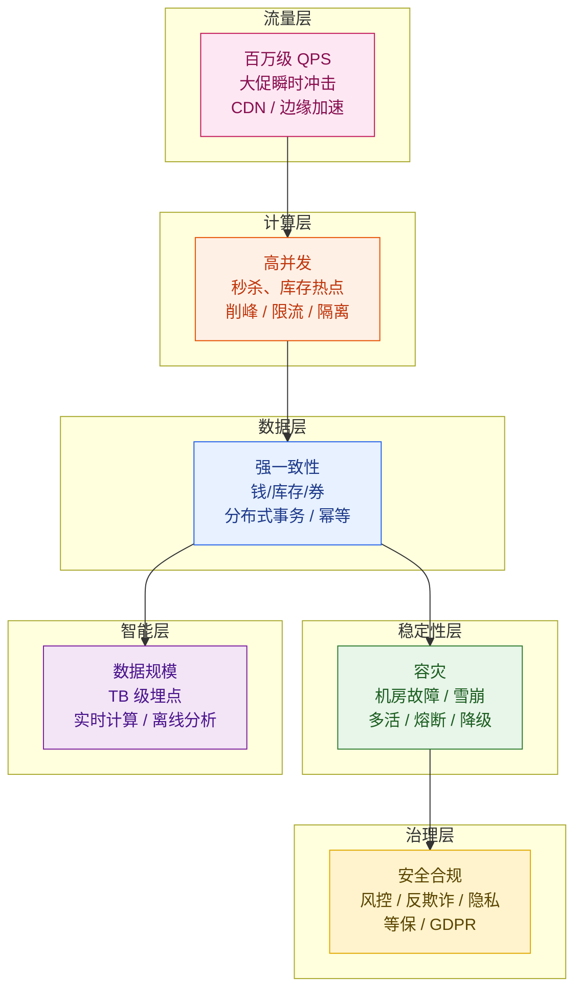
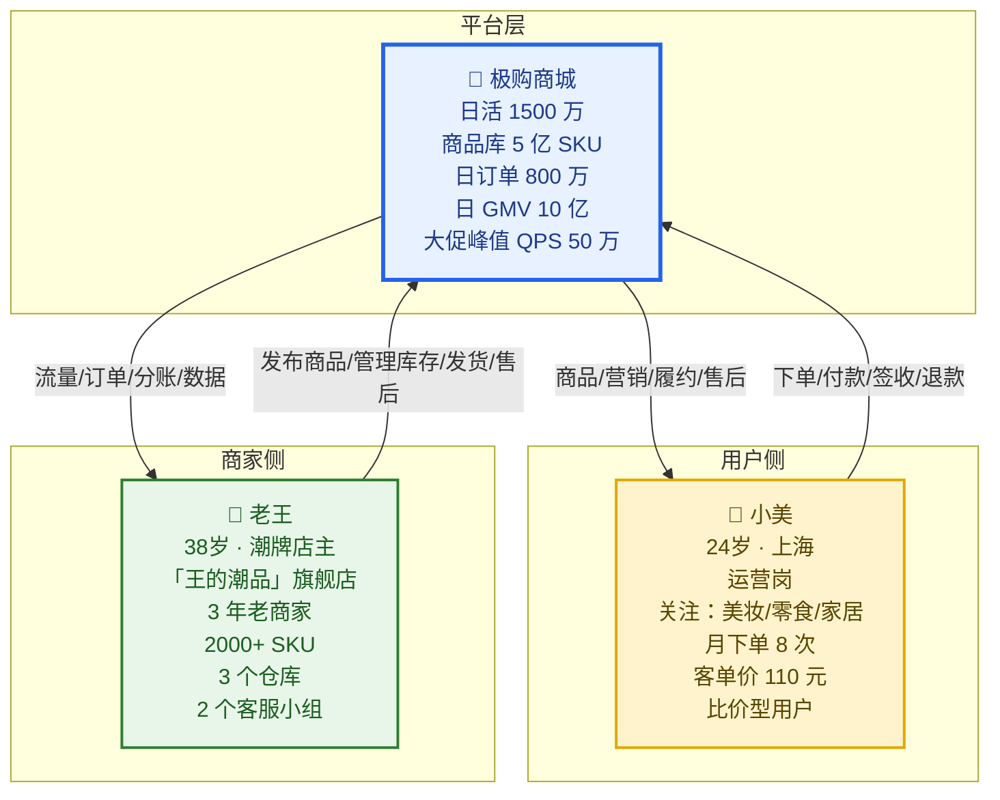
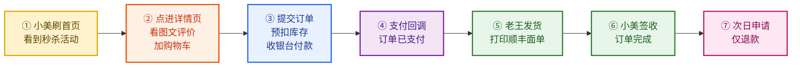
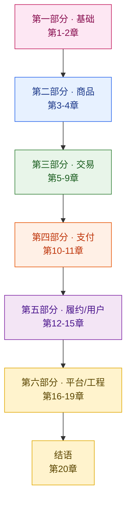

# 第 1 章 · 商城平台全景与核心概念

> **所属系列**：商城平台系统设计 · 全景教程
> **上一章**：无
> **下一章**：[第 2 章 · 整体架构与一次下单的生命周期](./02-整体架构与一次下单的生命周期.md)

---

## 本章导读

本章是整篇教程的起点。我们不急着讨论微服务拆分、分布式事务或秒杀架构，而是先建立一张"思维地图"：商城平台到底是什么、由哪些角色构成、靠什么指标来衡量健康与否、又会面对哪些技术挑战。

读完本章，你将能回答：

- 商城系统的本质是什么？为什么它不是"加个购物车 + 支付"那么简单？
- 商城有哪些分类（B2C、B2B、C2C、跨境、垂直、自营、平台、O2O、直播……）？它们的系统设计差异在哪？
- 商城生态里有哪些核心角色？它们之间的利益张力是什么？
- 衡量一个商城平台健康与否的核心业务指标（GMV、转化率、客单价、复购率……）背后的逻辑是什么？
- 衡量一次交易是否顺畅的核心交易指标（支付转化率、履约时长、签收率……）该如何计算？
- 商城系统的六大技术挑战（流量、一致性、容灾、数据、安全、复杂度）分别意味着什么？
- 电商系统和传统零售的本质差异是什么？
- 我们的贯穿案例「极购商城 · 小美 · 老王」分别代表什么，整篇教程的"导游"是谁？

本章是后续所有章节的概念基础。无论你跳到哪一章，遇到不清楚的指标或术语，都可以回来查这里。

---

## 1.1 为什么学商城平台系统设计

### 1.1.1 商城是规模最大、业务最复杂的互联网形态之一

学商城系统设计，本质上是**用一套真实业务场景，把分布式系统的核心难题一次性练全**。我们来看几组真实数字，感受一下"商城为什么难"。

**阿里双 11（公开数据）**：

- 2020 年双 11 零点的瞬时订单创建峰值达到 **58.3 万笔/秒**（阿里官方数据）
- 2023 年双 11 全周期 GMV 突破 **1.2 万亿** 元
- 支付宝在双 11 零点达到了 **10 万笔/秒** 的支付峰值

**京东 618（公开数据）**：

- 2023 年 6 月 18 日单日订单量超过 **1500 万**（含自营 + POP）
- 自营商品 SKU 总量超过 **500 万**
- 智能客服单日承接会话量超过 **1000 万** 次

**拼多多（公开数据）**：

- 2023 年活跃买家数 **9 亿+**
- 日均订单量数千万级
- 微信生态内"分享-拼团-砍一刀"链路带来的并发请求峰值长期处于高位

这些数字背后意味着什么？意味着一个商城的核心系统，必须**同时应对以下六类挑战**：

| 挑战维度 | 具体表现 | 数量级感受 |
|---------|---------|-----------|
| **业务复杂度** | 商品、订单、库存、营销、支付、履约、退款七大域交织，状态机分支极多 | 一个订单的生命周期涉及 20+ 种状态、10+ 类事件 |
| **并发规模** | 大促瞬间百万级 QPS、亿级购物车 | 1 秒钟涌入百万级下单请求 |
| **一致性要求** | 钱、库存、券不能多算、不能少算、不能错 | 1 分钱差错就是事故 |
| **容灾要求** | 一次大促宕机损失上亿，1 分钟都不能停 | 99.99% 可用性 ≈ 一年宕机 < 53 分钟 |
| **数据规模** | 行为埋点、画像、订单分析、实时大屏 | 日增 TB 级数据 |
| **生态复杂度** | 商家、用户、平台、支付、物流、仓储、客服、ISV 多方协同 | 一个订单跨 5+ 家公司系统 |

**学透商城系统设计，等于同时打通了分布式系统、数据库、微服务、消息队列、缓存、搜索、支付、风控、数据工程的主线**。这是为什么我们说"商城是工程师最好的练兵场"。

### 1.1.2 商城系统设计 vs 其他系统设计

商城系统设计与短视频、广告、社交等系统设计相比，有一个根本性的不同：

> **商城的核心是"钱"和"履约"——错了不能回退，慢了就丢单。**

| 维度 | 商城系统 | 短视频系统 | 广告系统 |
|------|---------|-----------|---------|
| **核心资产** | 钱、库存、订单 | 视频内容、用户时长 | eCPM、ROI |
| **错一次能补救吗** | 不能（资金、库存不可逆） | 能（重推即可） | 部分能（计费可退） |
| **延迟容忍度** | 严格（下单/支付必须秒级） | 中等（视频加载可缓冲） | 极严（100ms 内必须返回） |
| **数据一致性** | 强一致（CAP 里的 C） | 最终一致 | 弱一致（部分链路可补偿） |
| **业务稳定性优先级** | 99.99%+ | 99.9% | 99.95% |

这意味着商城系统的工程师，对**幂等、事务、状态机、资金安全**必须有刻进骨子里的敏感度。一个订单号被多扣一次库存，就是 P0 事故。

---

## 1.2 商城分类全景：先看清"你要设计的是哪一种"

理解商城分类，是理解系统设计差异的前提。同样叫"商城"，淘宝和美团的架构可能 80% 都不一样。

### 1.2.1 按交易主体分类

**五种交易主体的对比**：

| 类型 | 含义 | 代表 | 系统设计重点 |
|------|------|------|-------------|
| **B2C** | 企业直接卖给消费者 | 京东自营、亚马逊、品牌官网 | 自营供应链、仓储管理、复杂定价 |
| **B2B** | 企业卖给企业 | 阿里巴巴 1688、震坤行 | 复杂合同/账期、大额支付、阶梯价 |
| **C2C** | 消费者之间交易 | 闲鱼、eBay | 信任机制、争议处理、个体卖家管理 |
| **C2M** | 消费者直连工厂 | 拼多多、必要 | 需求聚合、预售、定制化生产 |
| **B2B2C** | 平台 + 商家 + 消费者（最主流） | 天猫、京东 POP、唯品会 | 多角色权限、商家隔离、平台-商家分账 |

### 1.2.2 按品类范围分类

| 类型 | 含义 | 代表 | 系统特点 |
|------|------|------|---------|
| **全品类综合** | 几乎什么都卖 | 淘宝、京东、拼多多 | SKU 极多（数亿）、类目极深、推荐/搜索压力巨大 |
| **垂直类** | 聚焦单一品类 | 唯品会（服饰）、得物（潮玩）、酒仙网（酒） | 类目属性深、SKU 相对少、专业服务重 |
| **生鲜/前置仓** | 时效性极强的品类 | 每日优鲜、叮咚买菜、盒马 | 库存周转按小时计、冷链履约强 |
| **跨境** | 涉及进出口贸易 | 天猫国际、考拉海购、SHEIN | 海关清关、多币种、税率计算、海外仓 |

### 1.2.3 按运营模式分类（最关键的一组分类）

**自营 vs 平台 vs 混合**是商城系统设计最根本的分野之一：

- **自营**：平台先采购商品入仓，商品的所有权归平台。**库存系统的核心是"中央仓 + 区域仓 + 前置仓"的多级库存调度**。定价权在平台，但库存积压风险也在平台。
- **平台**：商家自己管库存、自己发货。**平台核心是"商品展示 + 交易撮合 + 资金分账"**。库存是商家的，但订单生命周期仍要平台管理。
- **混合**：自营商品和第三方商品在同一搜索结果中混合排序，**系统必须能区分两种订单履约路径**。京东、亚马逊、Shopee 都是这种。

### 1.2.4 按销售场景分类

| 类型 | 含义 | 代表 | 关键技术挑战 |
|------|------|------|------------|
| **传统货架电商** | 搜索 + 类目 + 详情页 | 淘宝、京东 | 搜索相关性、详情页 QPS |
| **社交电商** | 拼团、分享、关系链 | 拼多多、淘宝特价版 | 关系链裂变、防刷单 |
| **直播电商** | 主播带货 + 实时互动 | 抖音电商、快手电商 | 超高并发秒杀、库存热点、直播延迟 |
| **内容电商** | 短视频/图文种草转化 | 小红书、抖音 | 内容理解、商品挂载 |
| **O2O** | 线上下单 + 线下履约 | 美团、饿了么 | 地理调度、骑手路径、即时配送 |
| **社区团购** | 预售 + 次日自提 | 多多买菜、美团优选 | 履约次日达、集采集配 |
| **二手/闲置** | 二手商品交易 | 闲鱼、转转 | 商品非标、定价复杂 |

**我们的贯穿案例「极购商城」属于"全品类综合 + 平台 + 混合 + 传统货架为主"**——这是市占率最高、也是工程挑战最典型的形态。

---

## 1.3 核心角色与生态关系

商城从来不是一家公司能独立运转的系统。一次完整的下单，背后至少涉及 **8 类核心角色**。

### 1.3.1 八大核心角色

| 角色 | 角色定义 | 在交易中的位置 | 核心诉求 |
|------|---------|---------------|---------|
| **用户（买家）** | 终端消费者 | 下单、付款、收货 | 商品好、便宜、送达快 |
| **商家（卖家）** | 商品供应方 | 供货、发货、售后 | 多卖货、低成本、客户留存 |
| **平台** | 撮合方 + 规则制定者 | 提供基础设施 + 制定规则 | 抽佣、生态健康、用户活跃 |
| **支付机构** | 资金流转通道 | 处理付款/退款 | 资金安全、合规、低费率 |
| **物流商** | 实物履约方 | 揽件、运输、派送 | 时效、成本、可控性 |
| **仓储服务商** | 库存管理方 | 入库、出库、库存盘点 | 准确率、出库效率 |
| **客服** | 争议处理方 | 处理退款、咨询、投诉 | 处理效率、用户满意度 |
| **第三方服务商（ISV）** | 增值服务方 | ERP、CRM、营销工具 | 商家付费意愿、产品易用性 |

### 1.3.2 角色关系图

### 1.3.3 利益张力：贯穿全系统的核心矛盾

商城的系统设计，处处体现角色之间的**利益博弈**：

**用户 vs 商家**：
- 用户希望商品越便宜越好 → 商家希望利润越高越好
- 用户希望发货越快越好 → 商家希望库存压力越小越好
- 用户希望售后越宽松越好 → 商家希望退货率越低越好

**用户 vs 平台**：
- 用户希望少看到广告 → 平台需要广告变现
- 用户希望隐私被保护 → 平台需要数据精准营销

**商家 vs 平台**：
- 商家希望平台抽佣越低越好 → 平台需要佣金养活团队
- 商家希望公平流量 → 平台会优先扶持大客户/付费商家

**平台 vs 物流**：
- 平台希望物流越便宜越好 → 物流希望补贴更高
- 平台希望物流服务越稳定 → 物流面临成本压力

**贯穿本教程的核心问题**：每一个系统设计决策（库存分配规则、退款政策、流量分发机制），都要问自己——**这个设计对各方意味着什么？短期和长期是否一致？**

---

## 1.4 核心业务指标体系：平台健康的量化语言

本节是本章最重要的部分。指标体系是后续所有系统设计讨论的"共同语言"——工程师、产品、运营说"GMV 跌了 3%"，背后指代的是什么、对系统意味着什么，必须在这里弄清楚。

### 1.4.1 规模指标：平台基本盘

**GMV（Gross Merchandise Volume，商品交易总额）**：

$$\text{GMV} = \text{平台所有订单的总成交金额（含未付款、未发货、退款）}$$

「极购商城」日 GMV 10 亿元。GMV 是商城最常用的"门面指标"，但要注意：**GMV 包含取消订单和退款，是"虚胖"的成交额**。

**实际成交额（Real GMV）**：

$$\text{实际成交额} = \text{GMV} - \text{取消订单金额} - \text{退款金额}$$

**UV（Unique Visitor，独立访客）**：

$$\text{UV} = \text{一段时间内访问过平台的去重用户数}$$

**DAU（Daily Active User，日活跃用户数）**：

$$\text{DAU} = \text{当天有打开 App 并产生有效行为的去重用户数}$$

「极购商城」DAU 1500 万。注意 UV 和 DAU 的区别：**UV 是"来过"，DAU 是"真的用了"**（产生浏览、点击、订单等行为）。

**MAU（Monthly Active User，月活跃用户数）**：当月活跃用户数（去重）。

**粘性比（Stickiness Ratio）**：

$$\text{粘性比} = \frac{\text{DAU}}{\text{MAU}}$$

粘性比越高，说明用户每天都来的比例越高，商城越"刚需"。通常：
- 粘性比 > 50%：顶级（微信、抖音、拼多多级别）
- 粘性比 30%-50%：健康
- 粘性比 < 20%：用户只是偶尔访问

### 1.4.2 转化指标：漏斗每一层的健康度

商城有非常清晰的**用户行为漏斗**：

每一层都有自己的转化率公式：

| 指标 | 公式 | 行业基准值（综合电商） |
|------|------|---------------------|
| **点击率 CTR** | 点击数 / 曝光数 | 5% - 15% |
| **详情页转化率** | 加购数 / 详情页 PV | 8% - 20% |
| **加购转化率** | 下单数 / 加购数 | 30% - 50% |
| **下单-支付转化率** | 支付数 / 下单数 | 70% - 85% |
| **整体转化率** | 支付数 / UV | 1% - 5% |
| **签收率** | 签收数 / 发货数 | 95% - 99% |

> **注**：行业基准值因品类、平台、季节差异极大，秒杀品可达 30%+，冷门品可能 0.5%。

**整体转化率**（支付用户数 / UV）是商城最敏感的核心指标：
- 提升 1 个百分点意味着**GMV 增长 20%-100%**（取决于基线）
- 整体转化率下降往往是**推荐质量、价格力、用户体验**出现问题的先行信号

### 1.4.3 价值指标：单用户、单订单的"含金量"

**客单价（Average Order Value, AOV）**：

$$\text{客单价} = \frac{\text{支付订单总金额}}{\text{支付订单数}}$$

「极购商城」客单价 110 元。客单价受品类影响巨大：3C 数码 2000+，美妆 150，日用百货 50。

**件单价（Average Item Price）**：

$$\text{件单价} = \frac{\text{支付订单总金额}}{\text{支付商品件数}}$$

**连带率（Cross-Sell Rate）**：

$$\text{连带率} = \frac{\text{平均每单商品件数}}{1} = \text{件单价 / 客单价}$$

连带率反映"搭售"能力。1 件是单买，1.5 件说明平均每个订单搭了半件关联品。

**复购率（Repeat Purchase Rate）**：

$$\text{30日复购率} = \frac{\text{30天内购买 ≥2 次的用户数}}{\text{总用户数}}$$

复购率是衡量平台"用户粘性 + 商品力"的核心指标：
- 30 日复购率 > 50%：高频刚需（生鲜、日用）
- 30 日复购率 20%-50%：中频（服饰、美妆）
- 30 日复购率 < 20%：低频（3C、奢侈品）

### 1.4.4 履约指标：商品真的送到用户手里

**履约时长（Fulfillment Time）**：

$$\text{履约时长} = \text{签收时间} - \text{支付时间}$$

「极购商城」承诺 211 时限（2 仓 11 仓覆盖次日达）、211 达成率 > 95%。

**退款率（Refund Rate）**：

$$\text{退款率} = \frac{\text{申请退款的订单数}}{\text{支付订单数}}$$

**仅退款率（Refund-Only Rate）**：

$$\text{仅退款率} = \frac{\text{仅退款（无需退货）的订单数}}{\text{支付订单数}}$$

**退货退款率（Return & Refund Rate）**：

$$\text{退货退款率} = \frac{\text{退货退款的订单数}}{\text{支付订单数}}$$

行业基准（综合电商）：
- 整体退款率：5% - 15%
- 退货退款率：3% - 10%
- 仅退款率：2% - 5%

> **注意**：仅退款率与商品力、用户信任度高度相关。生鲜类仅退款率常达 8%+，3C 类 < 2%。

### 1.4.5 完整业务指标速查表

| 指标 | 英文 | 公式 / 定义 | 谁最关心 | 与系统设计的关联 |
|------|------|------------|---------|----------------|
| GMV | Gross Merchandise Volume | 平台总成交额 | 全平台 | 容量规划基准 |
| 实际成交额 | Real GMV | GMV - 退款 - 取消 | 财务 | 收入确认 |
| UV | Unique Visitor | 去重访客数 | 运营 | 漏斗顶端 |
| DAU | Daily Active User | 日活用户数 | 全平台 | 扩容基准 |
| MAU | Monthly Active User | 月活用户数 | 全平台 | 与 DAU 构成粘性比 |
| 粘性比 | Stickiness | DAU / MAU | 产品 | 用户粘性 |
| 整体转化率 | Conversion Rate | 支付用户数 / UV | 产品 / 运营 | 推荐 / 搜索 / 详情页 |
| 客单价 | AOV | 支付金额 / 支付订单数 | 营销 | 营销策略 |
| 件单价 | — | 支付金额 / 商品件数 | 营销 | 品类策略 |
| 复购率 | Repeat Purchase Rate | 30天内复购用户 / 总用户 | 运营 | 用户价值 |
| 退款率 | Refund Rate | 退款订单 / 支付订单 | 售后 | 售后系统压力 |
| 履约时长 | Fulfillment Time | 签收 - 支付 | 物流 | 履约系统 SLA |

---

## 1.5 核心交易指标：衡量"一次交易是否顺畅"

业务指标衡量平台整体健康度，**交易指标**则衡量"一次交易从下单到完成的全链路效率"。

### 1.5.1 下单-支付转化率（最重要）

$$\text{下单-支付转化率} = \frac{\text{成功支付订单数}}{\text{提交订单数}}$$

注意：分母是"提交订单数"（不是加购数）。这一指标反映**支付链路的顺畅度**：

- 转化率 > 90%：支付链路健康
- 转化率 70% - 90%：存在用户犹豫、支付失败、放弃支付
- 转化率 < 70%：系统性问题（支付通道故障、风控误杀、券核销失败、库存变更提示等）

**这是大促期间最敏感的指标**。大促零点，如果转化率从 85% 跌到 60%，意味着**每 100 个下单用户有 25 个付不了款**——这就是 P0 事故。

### 1.5.2 支付-发货时长

$$\text{支付-发货时长} = \text{发货时间} - \text{支付时间}$$

行业基准：
- 京东自营：2 小时 - 24 小时（211 次日达成）
- 淘宝 POP：12 小时 - 48 小时（商家发货能力差异大）
- 跨境电商：3-7 天（含清关）

**与系统的关系**：支付-发货时长的瓶颈，往往不在技术，而在**商家操作效率 + 库存就近度**。但平台可以提供"自动审单"、"就近仓发货"等能力缩短时长。

### 1.5.3 签收率

$$\text{签收率} = \frac{\text{成功签收订单数}}{\text{发货订单数}}$$

行业基准：95% - 99%。剩下的 1%-5% 是：
- 拒收（用户主动不要）
- 退回（地址错误、联系不上）
- 丢件（物流责任）

签收率 < 95% 往往意味着**商品描述与实物不符**、**物流体验差**或**用户画像不准**。

### 1.5.4 客诉率与 NPS

**客诉率（Complaint Rate）**：

$$\text{客诉率} = \frac{\text{主动发起投诉的订单数}}{\text{支付订单数}}$$

**NPS（Net Promoter Score，净推荐值）**：

$$\text{NPS} = \text{推荐者比例（9-10分）} - \text{贬损者比例（0-6分）}$$

NPS 范围 -100 到 +100。电商行业 NPS 通常在 30-50 之间，头部平台可达 60+。

**NPS 的系统化解读**：NPS 与退款率、客诉率、签收率强相关。任何一项恶化，NPS 都会先跌。

### 1.5.5 完整交易指标速查表

| 指标 | 公式 / 定义 | 行业基准 | 与系统设计的关联 |
|------|------------|---------|----------------|
| 下单-支付转化率 | 支付数 / 下单数 | 70% - 90% | 支付通道、收银台、风控 |
| 支付-发货时长 | 发货 - 支付 | 自营 < 24h | 商家系统、库存调度 |
| 签收率 | 签收 / 发货 | 95% - 99% | 物流、用户画像 |
| 拒收率 | 拒收 / 发货 | 1% - 3% | 商品描述、物流 |
| 客诉率 | 投诉 / 支付 | < 1% | 售后系统、客服 |
| NPS | 推荐者 - 贬损者 | 30 - 60 | 全链路综合 |
| 库存周转天数 | 平均库存 / 日销量 | 30 - 90 天 | 库存系统、补货算法 |
| 大促成交率 | 大促 GMV / 目标 GMV | 视目标而定 | 全链路稳定性 |

---

## 1.6 技术挑战全景：六大工程难题

商城系统设计面对的六大技术挑战，可以用一个总览图来表达：

### 1.6.1 流量挑战：百万 QPS 的入口冲击

**典型场景**：
- 大促零点（10:00:00）开闸瞬间
- 热门商品详情页
- 直播带货"上链接"瞬间
- 秒杀活动

**应对手段**：
- 多级缓存（Caffeine + Redis + CDN）
- 静态化（详情页 SSR 缓存）
- 读写分离
- CDN 边缘节点
- 限流 + 排队

### 1.6.2 高并发挑战：库存热点

**典型场景**：
- 1 万件商品，100 万人抢购
- 单 SKU 写入 QPS 1 万+
- 库存 = 1 时如何保证不超卖

**应对手段**：
- Redis Lua 脚本原子扣减
- 库存分段（每段独立锁）
- 库存预热 + 异步落库
- 热点隔离（独立集群）

### 1.6.3 一致性挑战：钱和库存不能错

**典型场景**：
- 下单预扣库存 + 支付扣款 + 减库存，必须同时成功或失败
- 跨服务事务（订单 + 库存 + 支付 + 营销）
- 退款回滚库存

**应对手段**：
- TCC（Try-Confirm-Cancel）
- Saga 长事务
- 可靠消息 + 最终一致
- 幂等设计（防重入）
- 分布式锁

### 1.6.4 容灾挑战：不能宕机

**典型场景**：
- 机房断电
- 数据库主从切换
- 下游服务雪崩
- 缓存击穿 / 雪崩

**应对手段**：
- 多活架构（同城双活 + 异地多活）
- 限流、熔断、降级
- 缓存预热、备份
- 单元化部署

### 1.6.5 数据挑战：实时 + 海量

**典型场景**：
- 实时大屏（双 11 GMV 实时跳动）
- 用户画像
- 行为分析
- 订单分析

**应对手段**：
- Kafka + Flink 实时流
- Hive / ClickHouse 离线分析
- 数据中台
- 埋点体系

### 1.6.6 安全与合规挑战

**典型场景**：
- 账号盗用
- 刷单、套现
- 黄牛抢茅台
- 用户隐私（《个人信息保护法》）
- 等保 2.0 / GDPR

**应对手段**：
- 风控引擎（规则 + 机器学习）
- 设备指纹
- 行为分析
- 数据脱敏
- 审计日志

---

## 1.7 电商 ≠ 传统零售：本质差异是什么

很多工程师把"商城"想成"在线超市"，把商品、订单、库存简单照搬过来。但**电商 ≠ 传统零售**，它们的本质差异在以下五个维度。

### 1.7.1 五维对比

| 维度 | 传统零售 | 数字零售（电商） |
|------|---------|----------------|
| **获客方式** | 线下地段、传单、媒体广告 | 搜索、推荐、广告投放、内容种草 |
| **获客成本** | 固定（租金 + 广告） | 可变（CPC/CPS/坑位费） |
| **履约链路** | 仓库 → 门店 → 顾客 | 仓库 → 快递 → 顾客 |
| **库存逻辑** | 一仓多店，按店调拨 | 一仓直发全国，多级库存 |
| **数据能力** | 离线分析（POS 数据） | 实时（行为埋点 → 实时推荐） |
| **SKU 容量** | 受门店面积限制 | 无限（淘宝 30 亿+ SKU） |
| **地理限制** | 强（仅服务周边） | 弱（理论上全国可达） |
| **用户关系** | 弱（会员卡制） | 强（数字身份、行为数据） |

### 1.7.2 三个最关键的差异

**差异 1：获客成本从"固定"变"可变"**

传统零售的获客成本是相对固定的——开一家店，租金一年 100 万，估算每天来 1000 个客人，CAC ≈ 1000 元。

电商的获客成本是**每次获客都要重新竞价**——今天流量贵、CAC = 80 元；明天双 11 流量便宜、CAC = 30 元。这导致电商必须**精细化计算每个渠道的 ROI**，广告投放系统（参见第 8 章）成了电商的标配。

**差异 2：履约链路从"B2B2C"变"B2C 直达"**

传统零售：商品从工厂 → 总代理 → 区域代理 → 门店 → 顾客。**链条长、库存分散、缺货率高**。

电商：商品从工厂 → 电商总仓 → 区域仓 → 快递 → 顾客。**链条短、库存集中、但物流压力大**。

这意味着电商的**库存调度算法、WMS（仓库管理系统）、TMS（运输管理系统）**都比传统零售复杂。

**差异 3：数据驱动的颗粒度从"天"到"秒"**

传统零售：POS 数据 T+1 分析（昨天的销售今天才看得到）。

电商：用户点了一下商品，系统在 100ms 内就要决定"给他看什么"。**实时性从"天"压缩到"秒"**。

这意味着电商的**实时推荐、实时风控、实时定价**都比传统零售强得多。

### 1.7.3 电商不是"传统零售 + 互联网"

> 很多人以为电商就是"线下零售搬到网上"。这是最大的认知误区。

电商的本质是**用数据驱动的实时决策系统，替代了传统零售的"经验"和"直觉"**：

- 传统零售靠店长经验进货；电商靠算法预测
- 传统零售靠地段获客；电商靠推荐和广告
- 传统零售靠 CRM 留存；电商靠实时个性化
- 传统零售靠货品陈列转化；电商靠搜索 + 推荐转化

**理解了这个差异，才能理解为什么电商系统的复杂度远超传统零售的 IT 系统**。

---

## 1.8 贯穿案例：极购商城 · 小美 · 老王

为了让后续 20 章不割裂，全篇用同一组虚构角色贯穿始终。这一节首次正式介绍他们。

### 1.8.1 三个角色，一个系统

**「极购商城」**：一个全品类综合电商（自营 + 第三方平台），规模和工程挑战都处于行业头部位置。

| 维度 | 极购商城数值 | 数量级参考 |
|------|------------|-----------|
| 日活 DAU | 1500 万 | 拼多多、京东量级 |
| 商品库总量 | 5 亿 SKU | 淘宝 30 亿+ |
| 商家数 | 50 万 | 淘宝 1000 万+ |
| 日均订单 | 800 万 | 京东 618 当日千万级 |
| 大促峰值订单 | 2000 万/日 | — |
| 客单价 | 110 元 | — |
| 日 GMV | 10 亿 | — |
| 大促峰值 GMV | 200 亿/日 | — |
| 大促峰值 QPS | 50 万 | 阿里双 11 峰值 58.3 万笔/秒 |
| 详情页 QPS | 100 万+ | — |
| 库存热点 QPS | 1 万/单 SKU | — |

**「小美」**：24 岁，上海运营岗女生。每月在极购下单 8 次，客单价 110 元。**她代表 1500 万 DAU 中的典型用户**——比价型、参加秒杀、领券、对售后敏感。

**「老王」**：38 岁潮牌店主，「王的潮品」旗舰店负责人。2000+ SKU、3 个仓库、2 个客服小组。**他代表 50 万商家中的典型商家**——多渠道铺货、对 GMV 敏感、关心流量成本。

**「极购商城平台团队」**：包括运营、技术、风控、财务、客服等团队，他们负责让小美和老王都能在同一个系统里顺畅交易。

### 1.8.2 一条订单的 7 步贯穿旅程

我们将跟随小美的一次下单，走完整个商城的核心环节。**这条订单会出现在后续每一章，作为案例的"导游"**：

**每一步对应后续章节**：

| 步骤 | 业务动作 | 后续章节 |
|------|---------|---------|
| ① | 首页秒杀活动 | 第 9 章 秒杀系统 |
| ② | 详情页 + 加购物车 | 第 4 章 详情页与多级缓存 + 第 5 章 购物车 |
| ③ | 下单 + 预扣库存 + 付款 | 第 6 章 订单 + 第 7 章 库存 + 第 8 章 营销 + 第 10 章 支付 |
| ④ | 支付回调 | 第 10 章 支付 + 第 11 章 分布式事务 |
| ⑤ | 老王发货 | 第 15 章 物流 |
| ⑥ | 签收完成 | 第 6 章 订单状态机 |
| ⑦ | 申请仅退款 | 第 12 章 售后退款 |

这条订单会穿过**商品、搜索、详情、购物车、订单、库存、营销、支付、履约、退款**的每一个环节——它就是我们理解整个系统的"导游"。

---

## 1.9 读者画像与学习路径

### 1.9.1 读者画像

本教程假设你具备以下基础：

- **后端工程师**：熟悉 Java/Go 任一语言，了解 Spring Boot / Dubbo / gRPC 等框架
- **数据库基础**：了解 MySQL 索引、事务、SQL 优化
- **分布式概念**：知道 RPC、MQ、缓存的基本概念
- **电商业务兴趣**：对电商业务有好奇心，希望深入理解系统背后的设计

如果你有以下问题，本教程就是为你写的：
- "我做过电商业务，但只想清楚局部，看不到全局？"
- "我知道用 Redis 缓存，但不知道什么时候用 Redis、什么时候用本地缓存？"
- "秒杀怎么搞？库存怎么保证不超卖？"
- "订单状态机怎么设计？退款怎么走？"
- "为什么电商系统这么复杂，到底复杂在哪？"

### 1.9.2 学习路径图

本教程共 20 章，分为 6 个部分。建议按以下顺序阅读：

### 1.9.3 按角色的阅读建议

**想快速建立全局认知**（2-3 天速读）：
→ 第 1 章 + 第 2 章 + 第 6 章 + 第 20 章

**做交易 / 订单后端**：
→ 重点：第 5、6、7、8、9 章 + 第 11 章 + 第 12 章

**做商品 / 搜索方向**：
→ 重点：第 3 章 + 第 4 章

**做支付 / 财务**：
→ 重点：第 10 章 + 第 11 章 + 第 14 章

**做平台 / 基础架构**：
→ 重点：第 18 章 + 第 19 章

**做营销 / 秒杀**：
→ 重点：第 8 章 + 第 9 章

### 1.9.4 核心三章（如果只能读三章）

1. **第 6 章（订单系统：状态机与生命周期）**：订单是商城最核心的实体，状态机设计是商城系统设计的"灵魂"。
2. **第 7 章（库存系统：预扣、最终一致与热点库存）**：库存是商城最容易出事故的地方，超卖就是 P0 事件。
3. **第 9 章（秒杀系统设计）**：秒杀是商城系统设计的"压力测试"，涵盖高并发、限流、削峰、热点隔离、缓存设计等所有核心工程问题。

---

## 本章小结

本章建立了商城平台系统设计的概念基础。用六个核心要点来收束：

**1. 商城是规模最大、业务最复杂的互联网形态之一**

阿里双 11 峰值 58.3 万笔/秒，京东 618 单日千万订单，拼多多 9 亿+买家。商城系统同时叠加了七大工程挑战：业务复杂度、并发规模、一致性、容灾、数据、安全、生态。**学透商城，等于打通了分布式系统的主线**。

**2. 商城分类决定了系统设计**

按交易主体（B2C/B2B/C2C/C2M/B2B2C）、按品类（全品类/垂直/生鲜/跨境）、按运营模式（自营/平台/混合）、按销售场景（传统货架/社交/直播/O2O/社区团购）——不同分类对应不同的系统设计重点。**本教程聚焦"全品类 + 平台 + 混合"这一最主流形态**。

**3. 八大核心角色与利益博弈**

用户、商家、平台、支付机构、物流、仓储、客服、第三方服务商——每一笔订单背后都是这 8 个角色的协作。**每一个系统设计决策都要问：对各方意味着什么？**

**4. 业务指标 + 交易指标 = 商城健康的"体检表"**

GMV、DAU、转化率、客单价、复购率、退款率衡量平台整体；下单-支付转化率、支付-发货时长、签收率、NPS 衡量单次交易。**指标体系是工程师的共同语言**。

**5. 六大技术挑战贯穿全书**

流量、高并发、一致性、容灾、数据、安全——这六个挑战在第 3-19 章会反复出现，**每一章都会从不同角度回答这些问题**。

**6. 电商 ≠ 传统零售**

电商的本质是**用数据驱动的实时决策系统，替代了传统零售的"经验"和"直觉"**。获客成本从"固定"变"可变"，履约链路从"B2B2C"变"B2C 直达"，数据驱动从"天"压缩到"秒"。

**7. 「极购商城 · 小美 · 老王」是后续所有章节的"导游"**

这一组虚构角色将贯穿全书。一个 7 步下单旅程，将带你走完商品、搜索、详情、购物车、订单、库存、营销、支付、履约、退款的每一个环节。

---

**下一章**：[第 2 章 · 整体架构与一次下单的生命周期](./02-整体架构与一次下单的生命周期.md)

第 2 章将展开「极购商城」的整体技术架构。我们会先看到商城系统被拆成**七大域**（用户、商品、交易、营销、支付、履约、平台支撑），再通过"小美下单一次"的完整链路——从她点开 App，到订单完成签收——串联起每一个技术模块的角色和协作方式。你将第一次看到完整的读路径（浏览商品）和写路径（下单付款）如何在同一个系统里共存，以及规模挑战（百万 QPS、亿级 SKU、千万订单）如何在架构上被应对。

---

## 参考来源

1. 阿里巴巴 (2020). *双 11 战报：2020 年天猫双 11 全球狂欢季订单创建峰值 58.3 万笔/秒*. 阿里巴巴官方新闻. https://www.alibabagroup.com/

2. 阿里巴巴 (2023). *2023 天猫双 11 全周期战报*. https://www.alibabagroup.com/

3. 京东集团 (2023). *京东 618 战报*. 京东官方. https://ir.jd.com/

4. 拼多多 (2023). *2023 年财报*. https://investor.pinduoduo.com/

5. 国家市场监督管理总局 (2021). *《电子商务平台经营主体责任研究报告》*. https://www.samr.gov.cn/

6. 全国信息安全标准化技术委员会 (2021). *《信息安全技术 个人信息安全规范》(GB/T 35273-2020)*. https://www.tc260.org.cn/

7. Gamma, E., Helm, R., et al. (2003). *Design Patterns: Elements of Reusable Object-Oriented Software*. Addison-Wesley. （订单状态机模式的经典参考）

8. Fowler, M. (2014). *Patterns of Enterprise Application Architecture*. Addison-Wesley. （交易脚本、领域模型、状态机等架构模式）

9. Kleppmann, M. (2017). *Designing Data-Intensive Applications*. O'Reilly Media. （分布式系统、事务、一致性的圣经）

10. Richardson, C. (2018). *Microservices Patterns*. Manning Publications. （微服务架构、Saga、CQRS 等商城系统常用模式）

11. 中国信息通信研究院 (2023). *《中国数字经济发展报告》*. http://www.caict.ac.cn/

12. eMarketer (2024). *Global Ecommerce Forecast 2024*. https://www.emarketer.com/

13. 阿里中间件 (2021). *《阿里双 11 超级工程：亿级流量下的高可用架构》*. https://mp.weixin.qq.com/

14. 美团技术团队 (2022). *美团配送系统架构演进*. https://tech.meituan.com/

15. 字节跳动技术团队 (2022). *抖音电商系统设计实践*. https://blog.csdn.net/bytedance/
