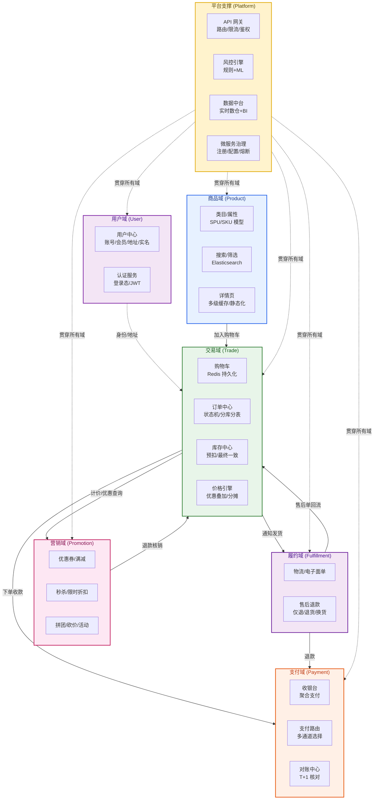
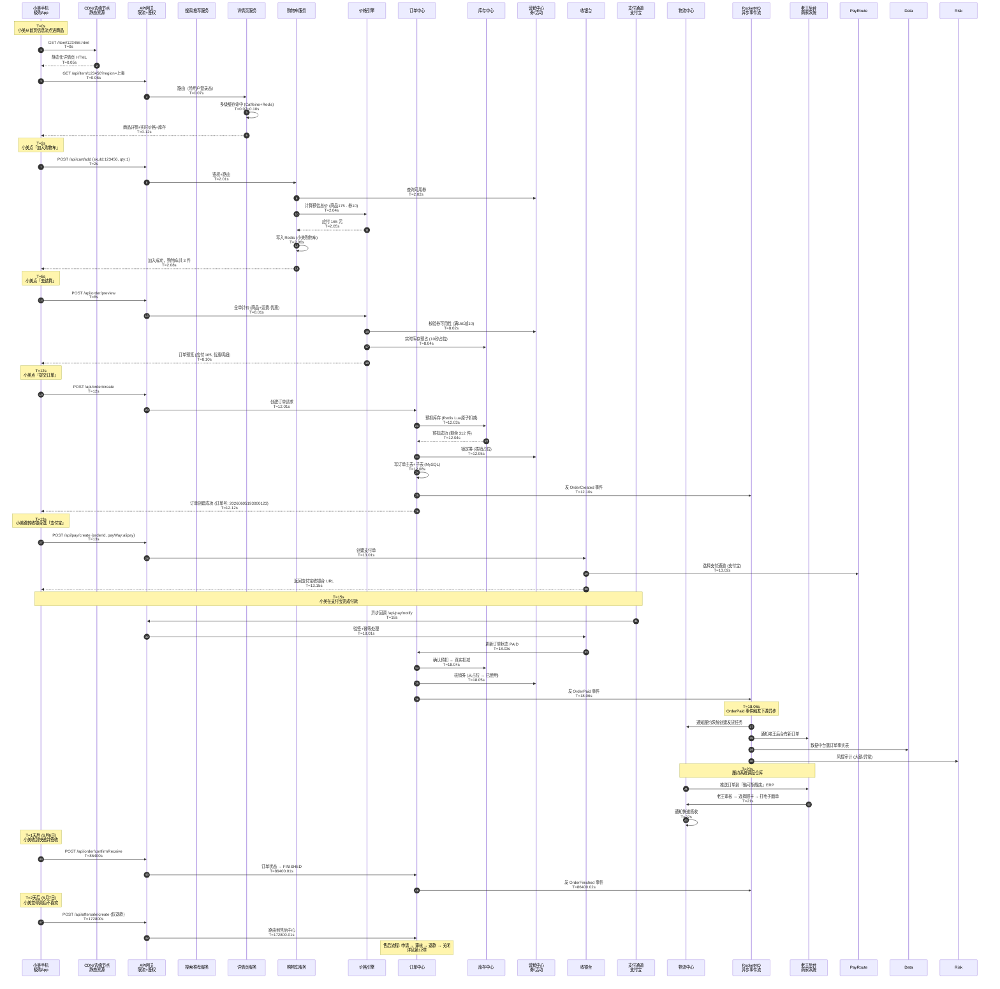
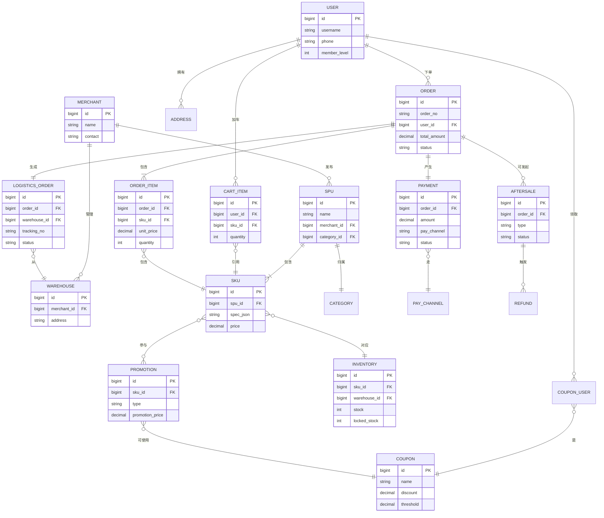
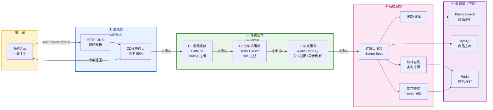
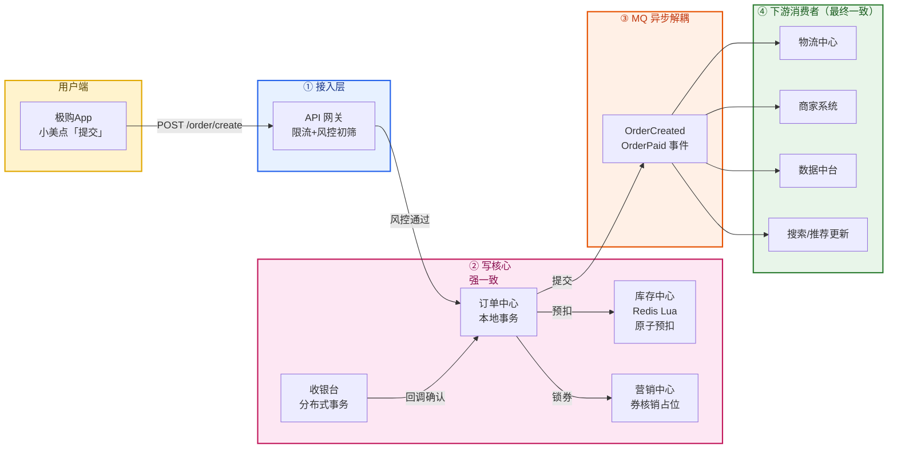
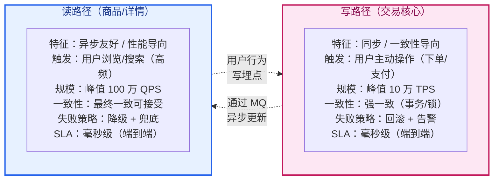
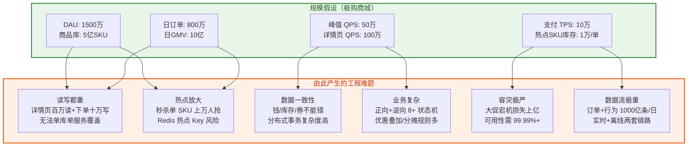
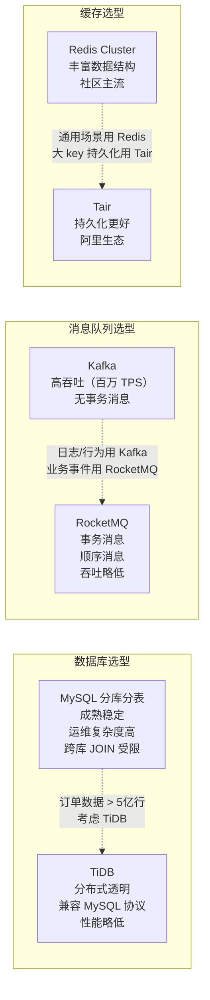
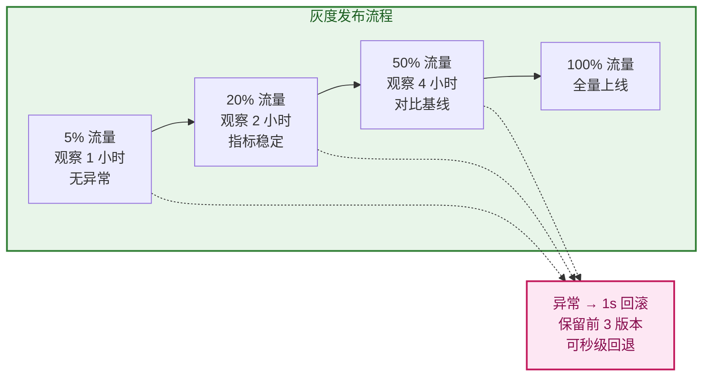
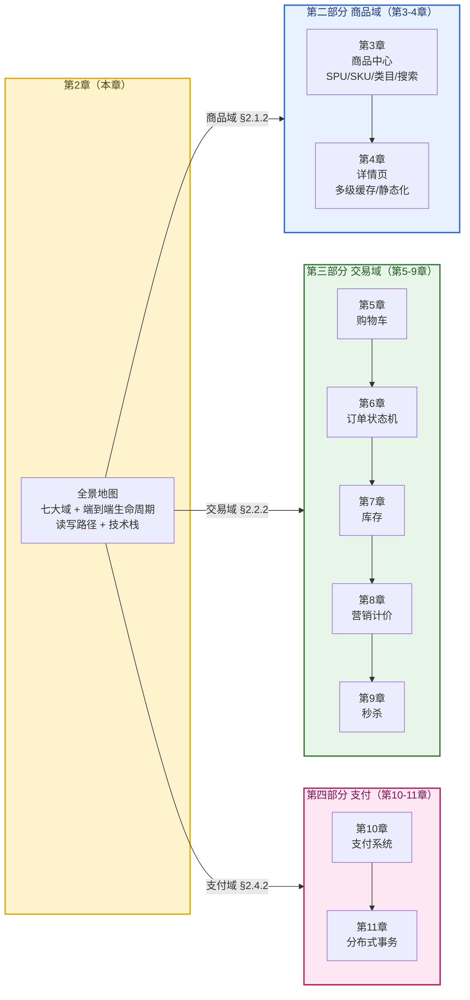

# 第 2 章 · 整体架构与一次下单的生命周期

> **所属系列**：《商城平台系统设计 · 全景教程》第一部分 · 基础与全景
> **上一章**：[第 1 章 · 导论：商城平台全景与核心概念](./01-导论-商城平台全景与核心概念.md)
> **下一章**：[第 3 章 · 商品中心](./03-商品中心.md)

---

## 本章导读

第 1 章我们从业务视角认识了电商：商城分类、核心指标、贯穿案例（小美和老王）。但「认识」不等于「看穿」——一个 1500 万 DAU、5 亿 SKU、日 GMV 10 亿的系统，里面到底是怎么运转的？

本章扮演**全景地图**的角色：在正式深入每一域之前，先把整张图铺开。核心视角有四个：

1. **七大域划分**：商品、交易、营销、支付、履约、用户、平台支撑——商城是天然按业务能力切分的复杂系统。
2. **一次下单的端到端生命周期**：跟随小美在极购买一支口红，从浏览 → 加车 → 结算 → 下单 → 支付 → 发货 → 签收 → 售后，逐秒拆解完整链路。
3. **读写路径分离**：读路径（详情页秒杀百万 QPS）和写路径（下单/支付的强一致）走的是两套完全不同的工程哲学。
4. **规模与延迟挑战**：从 1500 万 DAU 推导峰值 QPS 50 万、库存热点 1 万/单 SKU、支付 10 万 TPS 的真实压力。

本章是第 3-9 章（商品域与交易域）和第 10-19 章（支付/履约/平台）的共同导航。读完本章，你能在心里默画出极购商城的骨架，知道后续每一章在填充哪一块"血肉"。

---

## 2.1 七大域架构总览

### 2.1.1 极购商城的七大域

电商系统在经过 20 年演化后，已沉淀出一套公认的"业务能力切分"。极购商城将其划分为 **七大域**——每个域有自己独立的微服务集群、独立的数据库、独立的团队。



### 2.1.2 七大域职责详解

| 域 | 核心职责 | 关键服务 | 关键数据 | 典型 QPS |
| --- | --- | --- | --- | --- |
| **用户域** | 解决「谁在买」的问题：账号、身份、地址、会员等级、积分、实名 | 用户中心、认证中心、会员中心 | 用户表、地址簿、会员权益 | 读 10 万 / 写 1 万 |
| **商品域** | 解决「卖什么」的问题：类目、SPU/SKU、属性、搜索、详情 | 商品中心、搜索服务、详情服务 | 商品库 5 亿 SKU、ES 索引 | 详情页读 100 万 / 写 5 万 |
| **交易域** | 解决「怎么下单」的问题：购物车、订单、库存、价格、状态机 | 购物车、订单中心、库存中心、价格引擎 | 订单 800 万/日、库存热点 1 万/SKU | 写 10 万 / 读 30 万 |
| **营销域** | 解决「怎么促单」的问题：优惠券、满减、秒杀、拼团、限时折扣 | 优惠券中心、秒杀引擎、活动引擎 | 券 1 亿+、活动 SKU 100 万 | 秒杀读 50 万 / 写 5 万 |
| **支付域** | 解决「钱怎么走」的问题：聚合支付、路由、对账、退款 | 收银台、支付路由、对账中心 | 支付单 800 万/日 | 写 10 万 TPS |
| **履约域** | 解决「怎么送到 + 怎么退」的问题：物流、售后、退款 | 物流中心、售后中心 | 物流单 800 万/日、售后单 5%/订单 | 写 1 万 / 读 5 万 |
| **平台支撑** | 横切关注点：网关、风控、数据、治理 | API 网关、风控引擎、数据中台、配置中心 | 行为日志 1000 亿/日 | 读 100 万 / 写 50 万 |

**关键设计原则**：

- **按业务能力切分，而非按技术层切分**：每个域都是端到端拥有「接口 + 服务 + 数据 + 团队」的自治单元（业务康威定律）。
- **域间通过接口和事件协作，而非共享数据库**：交易域不直接读写商品库的表，而是调用商品服务接口或订阅商品变更事件。
- **横切域（平台支撑）通过中间件下沉**：网关、风控、日志、监控做成独立中间件，不侵入业务代码。

---

## 2.2 一次下单的完整生命周期

我们跟随小美走一遍。她在极购 App 看到首页推荐的一支魅可（MAC）口红，点了进去，最终完成下单支付。

### 2.2.1 场景设定

```
时间：2026-06-05 周五 19:30
地点：上海·陆家嘴办公室
用户：小美（24 岁，会员等级 V3，账户余额 0）
商品：MAC 子弹头口红 #602，售价 175 元，店铺「魅可官方旗舰店」
当前状态：秒杀进行中，限量 1000 件，已抢 687 件
支付方式：支付宝（已绑定）
地址：上海市浦东新区世纪大道 100 号
```

### 2.2.2 端到端时序图

从「小美的手指点开商品卡片」到「她看到『下单成功』」这 8 秒里，系统内部发生了什么？



### 2.2.3 关键路径设计要点

**① 详情页是读多写少的极端场景**

小美进入详情页那次请求，`T=0.06s → T=0.12s` 共 60ms 完成，背后的工程手段是「三级缓存 + 静态化」：CDN 命中静态页 HTML → 客户端拿结构 → API 请求只返回动态数据（价格、库存、个性化推荐）。这个请求量是百万级 QPS，绝不能每次穿透到数据库（详见第 4 章）。

**② 库存预扣是下单的核心阻塞点**

`T=12.03s` 的库存预扣是**分布式热点**——一支热门口红的库存可能被上万人同时扣，必须用 Redis Lua 脚本保证原子性，且不能穿透到 MySQL。预扣成功后还有 30 分钟支付超时回收机制（详见第 7 章）。

**③ MQ 异步化解耦**

`T=12.10s` 的 `OrderCreated` 事件和 `T=18.06s` 的 `OrderPaid` 事件是关键解耦点。订单系统的"成功"不应该等下游（物流、商家、数据）所有系统都处理完——通过 MQ 把"通知"异步化，下游按消费能力处理，主链路延迟稳定可控。

**④ 支付回调是异步且不保证顺序**

`T=18s` 的支付宝回调在时间上完全脱离用户的点击（`T=15s`）——网络抖动、对账窗口、银行延迟都可能让回调延后。系统必须做**幂等校验**（按支付单号去重），并允许回调在订单创建后任意时刻到达。

---

## 2.3 核心业务对象模型

商城的「血肉」由一组相互关联的业务对象组成。理解它们的模型和关系，是后续每一章的基础。

### 2.3.1 实体关系图



### 2.3.2 核心对象关系说明

| 关系 | 一对多基数 | 业务含义 | 设计要点 |
| --- | --- | --- | --- |
| SPU → SKU | 1 : N | 一个商品（口红）有多个规格（色号） | SPU 是"商品"概念，SKU 是"可售单元"（详见第 3 章）|
| SKU → INVENTORY | 1 : N | 一个 SKU 在多仓有库存 | 多仓分库存，就近发货 |
| USER → CART_ITEM | 1 : N | 一个用户多个购物车项 | 购物车用 Redis Hash 存储（详见第 5 章）|
| CART_ITEM → SKU | N : 1 | 多个购物车项引用同一 SKU | 合并相同 SKU 后展示 |
| ORDER → ORDER_ITEM | 1 : N | 一单多件 | 子订单表按 SKU 行分账（详见第 6 章）|
| ORDER → PAYMENT | 1 : N | 一单可能多次支付（先付定金再付尾款）| 状态机要支持分阶段收款 |
| ORDER → LOGISTICS_ORDER | 1 : 1（可拆单 1:N） | 一单一个物流单（拆单场景 N 个）| 拆单逻辑在第 15 章展开 |
| ORDER → AFTERSALE | 1 : N | 一单可发起多次售后 | 售后不破坏原订单 |
| COUPON_USER → COUPON | N : 1 | 多用户持同一券模板 | 通过券模板批量发券 |

**设计铁律**：

- **订单是核心枢纽**：所有资金流、库存流、物流流都挂在订单上。订单状态机是交易链路的"中央时钟"。
- **SKU 是商品域与交易域的接口**：商品域只暴露 SKU 级别接口，订单系统永远不直接碰 SPU。
- **退款是逆向交易流**：售后单与正向订单完全解耦，通过事件回流资金/库存/营销资源。

---

## 2.4 读写路径分离

电商系统是典型的"读极重、写极重"混合体——读和写的工程哲学完全相反，必须分而治之。

### 2.4.1 读路径：详情页的高并发读



**读路径 SLA 目标**：

| 阶段 | 目标 | 优先级 | 关键指标 |
| --- | --- | --- | --- |
| 页面首屏 | < 1s P99 | 体验优先 | 首屏加载 < 800ms 占比 > 90% |
| 详情页 API | < 100ms P99 | 延迟优先 | P99 < 100ms，TP999 < 200ms |
| CDN 命中率 | > 95% | 成本优先 | 边缘命中率、回源率 |
| 多级缓存总命中 | > 99.9% | 容量保护 | DB QPS < 1000 |

**核心工程手段**：

- **CDN 静态化**：详情页 HTML 整体静态化推到 CDN 边缘，命中率达 95%+。
- **多级缓存兜底**：进程内（Caffeine，10s）→ Redis Cluster（30s）→ DB 兜底，三级防御。
- **热点探测与隔离**：自动识别热点 SKU，单独缓存永不过期，避免大促时"全缓存雪崩"。
- **读写不交叉**：详情页服务**只读**商品库，**不写**任何数据库——写操作走另一个域的服务。

### 2.4.2 写路径：下单/支付的强一致写



**写路径 SLA 目标**：

| 阶段 | 目标 | 优先级 | 关键指标 |
| --- | --- | --- | --- |
| 订单创建 | < 300ms P99 | 一致性优先 | 成功率 > 99.99% |
| 库存预扣 | < 50ms P99 | 准确性优先 | 零超卖 |
| 支付路由 | < 200ms P99 | 资金安全优先 | 资金零差错 |
| 异步通知下游 | 分钟级 | 可靠性优先 | 最终一致性，失败重试 |

**核心工程手段**：

- **Redis Lua 原子预扣**：库存扣减是分布式热点，用 Lua 脚本在 Redis 单线程内完成"查-改-写"原子操作。
- **本地事务 + 可靠消息**：订单主表写入和 MQ 发送用本地事务表保证"要么都成功，要么都失败"。
- **分布式事务兜底**：跨服务（订单+支付）的强一致用 TCC 或 Saga 模式（详见第 11 章）。
- **幂等保护**：所有写接口必须支持按业务单号幂等，重复点击不重复扣库存/钱。

### 2.4.3 读写路径的对比



**关键工程结论**：

- **写路径：宁愿慢，不能错。** 一笔订单的库存超卖、钱算错，都是资损级事故。
- **读路径：宁愿降级，不能超时。** 详情页稍慢用户能等，但不能"白屏"；价格缓存稍旧能容忍，但不能挂。
- **两者通过 MQ 异步联动**：写路径产生数据变更事件，读路径订阅并刷新缓存。

---

## 2.5 规模假设与延迟挑战

### 2.5.1 从 DAU 推导关键 QPS

极购商城的规模假设：日活 DAU = 1500 万，人均每日下单 0.53 单（800 万单/1500 万 DAU），客单价 110 元，日 GMV 10 亿。大促峰值假设是平峰的 2.5 倍。

$$\text{详情页 PV/天} = 1500\text{万} \times 30\text{次/天} = 4.5 \text{ 亿次/天}$$

$$\text{平均详情页 QPS} = \frac{4.5 \times 10^9}{24 \times 3600} \approx 52{,}000 \text{ QPS} \approx 5 \text{ 万 QPS}$$

$$\text{峰值详情页 QPS} = 5\text{万} \times 20 = \boxed{100 \text{ 万 QPS}}$$

$$\text{大促峰值下单 QPS} = \frac{2000\text{万单}}{4 \text{ 小时}} \times 1\text{秒} = 50 \text{ 万 QPS（瞬时）}$$

### 2.5.2 各场景规模与延迟挑战矩阵



### 2.5.3 关键场景延迟预算

| 场景 | 端到端 SLA | 关键模块 | P99 预算 | 关键工程手段 |
| --- | --- | --- | --- | --- |
| 详情页浏览 | < 1s | CDN + 多级缓存 | 边缘命中 50ms | 静态化 + 缓存分级 |
| 加购物车 | < 200ms | 网关 + 购物车服务 | 100ms | Redis Hash 直接写 |
| 订单预览/计价 | < 300ms | 价格引擎 + 库存预占 | 200ms | 价格规则预计算 + Redis 预扣 |
| 提交订单 | < 500ms | 订单 + 库存 + 营销 | 400ms | 本地事务 + 异步 MQ |
| 支付收款 | < 1s | 收银台 + 支付通道 | 800ms | 路由直达 + 异步回调 |
| 订单查询 | < 200ms | 订单服务 + ES | 150ms | 读写分离 + ES 索引 |
| 售后申请 | < 500ms | 售后中心 | 400ms | 状态机 + 工作流引擎 |
| 商家发货 | < 1s | 物流 + ERP | 800ms | 异步通知 + 重试机制 |

---

## 2.6 技术栈全景

### 2.6.1 各层技术选型表

| 层次 | 模块 | 技术选型 | 选型核心理由 |
| --- | --- | --- | --- |
| **前端** | H5/小程序 | Vue/React + Vant/Ant Design | 跨端开发效率，组件库丰富 |
| **前端** | 原生 App | iOS Swift / Android Kotlin | 性能最优，端上能力完整 |
| **网关** | API 网关 | Nginx + OpenResty + Spring Cloud Gateway | Nginx 处理 7 层，Spring Cloud Gateway 业务路由 |
| **应用** | 微服务框架 | Spring Boot + Spring Cloud | 生态成熟，团队熟悉度高 |
| **应用** | RPC | Dubbo / gRPC | Dubbo 治理完善，gRPC 跨语言高性能 |
| **存储 - 关系** | OLTP | MySQL 8.0（分库分表）| 成熟稳定，事务支持完整 |
| **存储 - 缓存** | KV 缓存 | Redis Cluster 7.x | 高性能，丰富数据结构 |
| **存储 - 搜索** | 全文搜索 | Elasticsearch 8.x | 倒排索引，毫秒级查询 |
| **存储 - 文档** | 宽表/文档 | HBase / MongoDB | 海量数据、灵活 schema |
| **存储 - 对象** | 文件/图片 | S3 兼容对象存储（OSS/COS）| 成本低，CDN 友好 |
| **消息队列** | 业务事件 | RocketMQ | 事务消息，顺序消息，金融级可靠 |
| **消息队列** | 日志流 | Kafka | 百万 TPS，日志首选 |
| **实时计算** | 实时数仓 | Flink | 低延迟，Exactly-Once |
| **离线计算** | 批处理 | Spark / Hive | 报表、特征、训练样本 |
| **OLAP** | 实时分析 | ClickHouse / Apache Doris | 列存，亿级秒级查询 |
| **容器** | 编排 | K8s + Docker | 弹性扩缩，资源利用率高 |
| **可观测** | 监控告警 | Prometheus + Grafana | 工业级监控标准 |
| **可观测** | 链路追踪 | SkyWalking / Jaeger | 分布式追踪，瓶颈定位 |
| **可观测** | 日志 | ELK（Elasticsearch + Logstash + Kibana）| 日志聚合检索 |
| **服务治理** | 注册/配置 | Nacos / ZooKeeper | 注册中心 + 配置中心 |
| **服务治理** | 限流熔断 | Sentinel / Hystrix | 流量控制，熔断降级 |

### 2.6.2 核心技术选型的张力



**选型核心原则**：

- **成熟优先**：电商是钱、库存、用户数据的载体，不允许"用最新最酷技术"做小白鼠。
- **生态成熟**：Spring Cloud、Dubbo、MySQL、Redis、Kafka 这些是行业事实标准，问题在网上有答案。
- **可观测可治理**：所有组件必须支持完善的监控、日志、追踪，否则线上问题无法定位。

---

## 2.7 可观测与可扩展

### 2.7.1 可观测性三大支柱

商城是个复杂分布式系统，一次下单可能跨 7+ 个服务，必须有完善的可观测能力才能稳定运行。

| 支柱 | 工具 | 关键指标 | 应用场景 |
| --- | --- | --- | --- |
| **Metrics（指标）** | Prometheus + Grafana | QPS、延迟 P99/P999、错误率、CPU/内存 | 实时大盘、容量规划、告警 |
| **Logging（日志）** | ELK（ES + Logstash + Kibana）| 业务日志、错误堆栈、链路日志 | 故障排查、用户行为分析 |
| **Tracing（追踪）** | SkyWalking / Jaeger | 分布式链路、慢 SQL、慢 RPC | 性能瓶颈定位、依赖分析 |

**黄金指标（Four Golden Signals）**：

- **延迟（Latency）**：服务响应时间，P99 < 100ms 是基本要求。
- **流量（Traffic）**：QPS/TPS，监控容量水位。
- **错误率（Errors）**：HTTP 5xx、RPC 异常、业务异常率。
- **饱和度（Saturation）**：CPU 利用率、连接池使用率、队列堆积长度。

### 2.7.2 可扩展性设计

**水平扩展 vs 垂直扩展**：

- 详情页服务、购物车服务、订单查询等**无状态服务**走 K8s 弹性扩缩（HPA），根据 QPS 自动调整 Pod 数。
- 数据库走**分库分表**（Sharding），按用户 ID 哈希分 1024 库，每库 64 表，理论上可承载 100 亿订单。
- 缓存走**集群模式**（Redis Cluster 16384 槽位），按业务分池（商品池、价格池、库存池、会话池），互不干扰。

**容量规划与压测**：

- 大促前 1 个月进行全链路压测，模拟峰值 QPS 50 万 × 1.5 = 75 万。
- 压测平台（JMeter/Gatling/PTS）→ 流量打标 → 影子表/影子库 → 结果分析 → 容量调整。
- 压测发现的瓶颈点（DB 连接池、Redis 热点、MQ 堆积）必须在大促前修复并通过复测。

### 2.7.3 灰度发布与回滚



**灰度策略**：

- **按用户 ID 哈希分桶**：相同用户始终走相同版本，避免体验跳跃。
- **按地域分批**：先上海 → 再北京 → 再全国，逐步放量。
- **多版本并存**：至少保留最近 3 个版本，发现问题 1 秒回滚。
- **流量打标**：通过 Nacos 配置中心动态调整灰度比例，不发版即可改变流量分配。

---

## 2.8 章节衔接：本章在教程中的位置

本章是全篇的"地图"。我们在这里建立了对七大域和端到端链路的骨架认知：



---

## 本章小结

本章从架构师视角完整拆解了「极购商城」的骨架，核心结论如下：

**1. 七大域是业务能力的自然切分**

商品（卖什么）、交易（怎么下单）、营销（怎么促单）、支付（钱怎么走）、履约（怎么送到）、用户（谁在买）、平台支撑（横切基础）—— 这种切分不是技术选型，而是被 20 年电商演化验证的业务康威定律。

**2. 端到端生命周期是理解系统的主线索**

跟随小美买一支口红，**8 秒**里穿过 7+ 个服务、4 个数据库、1 次 MQ 异步、1 次支付通道回调——这就是电商工程的"密度"。任何一环的失误都会导致用户感知异常（白屏、卡顿、重复扣款、库存超卖）。

**3. 读写路径是两套完全不同的工程哲学**

读路径（详情页 100 万 QPS）走 CDN + 多级缓存 + 异步刷新；写路径（下单 50 万 QPS）走 Redis Lua 原子预扣 + 本地事务 + 可靠消息。**用读的方式写、用写的方式读，都是常见的设计错误**。

**4. 规模推导是架构决策的前提**

1500 万 DAU → 详情页 100 万 QPS → 需要 CDN + 4 级缓存；800 万单/日 → 大促峰值 50 万 QPS → 需要分库分表 + Redis 热点隔离。**先推数字，再做选型**，避免"凭直觉设计系统"。

**5. 可观测和可扩展是稳定运行的根基**

监控告警、链路追踪、日志聚合、灰度发布、压测体系——这些"看似和业务无关"的基础设施，才是真正决定大促能否平稳度过的东西。

**下一章预告**：我们沿着商品域出发，深入第一个关键模块——**商品中心**。MAC 这支口红为什么是 SPU 还是 SKU？5 亿 SKU 的类目树怎么设计？ES 索引怎么构建？商品发布流程怎么对接老王的 ERP？第 3 章见。

---

## 参考来源

1. **淘宝/天猫双11技术总结** · 阿里中间件团队历年大促复盘文档（峰值 58.3 万笔/秒、大促容量规划方法论）

2. **京东交易系统演进** · 京东商城技术博客（订单状态机、库存热点、分布式事务实践）

3. **Spring Cloud Alibaba 官方文档** · Alibaba Cloud：[https://spring-cloud-alibaba.github.io/](https://spring-cloud-alibaba.github.io/)（微服务治理、限流、分布式事务 Seata）

4. **Apache RocketMQ 官方文档** · Apache RocketMQ：[https://rocketmq.apache.org/](https://rocketmq.apache.org/)（事务消息、顺序消息、削峰填谷工程实践）

5. **Redis 官方文档 - Cluster Specification** · Redis Labs：[https://redis.io/docs/manual/scaling/](https://redis.io/docs/manual/scaling/)（Cluster 16384 槽位、热点 Key 隔离）

6. **Elasticsearch: The Definitive Guide** · Clinton Gormley, Zachary Tong（商品搜索、倒排索引、查询优化）

7. **《数据密集型应用系统设计》（DDIA）** · Martin Kleppmann（一致性、事务、分布式系统基础理论）

8. **《凤凰架构：构建可靠的大型分布式系统》** · 周志明（微服务、事务、容器编排、可观测性系统性参考）

9. **Google SRE Book - Four Golden Signals** · Google：[https://sre.google/sre-book/monitoring-distributed-systems/](https://sre.google/sre-book/monitoring-distributed-systems/)（可观测性四大黄金信号）

10. **SkyWalking APM 官方文档** · Apache SkyWalking：[https://skywalking.apache.org/](https://skywalking.apache.org/)（分布式链路追踪标准方案）

---

> **下一章**：[第 3 章 · 商品中心](./03-商品中心.md) — 深入 SPU/SKU 模型设计、5 亿 SKU 的类目树与属性体系、Elasticsearch 搜索索引构建、商品发布与 ERP 对接的工程细节。
