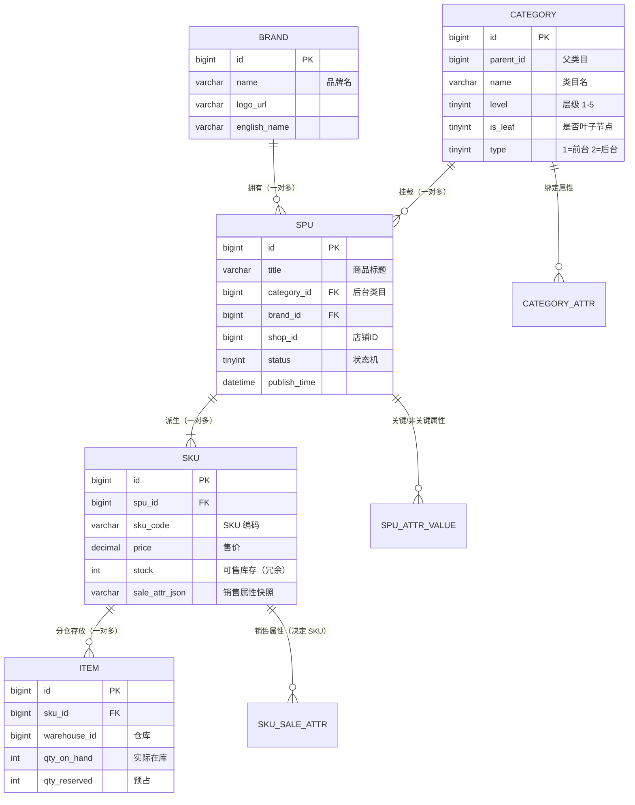
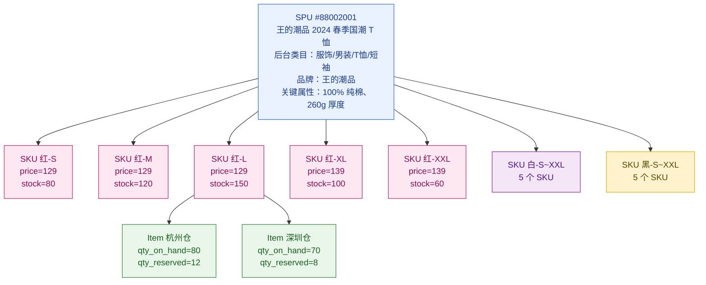
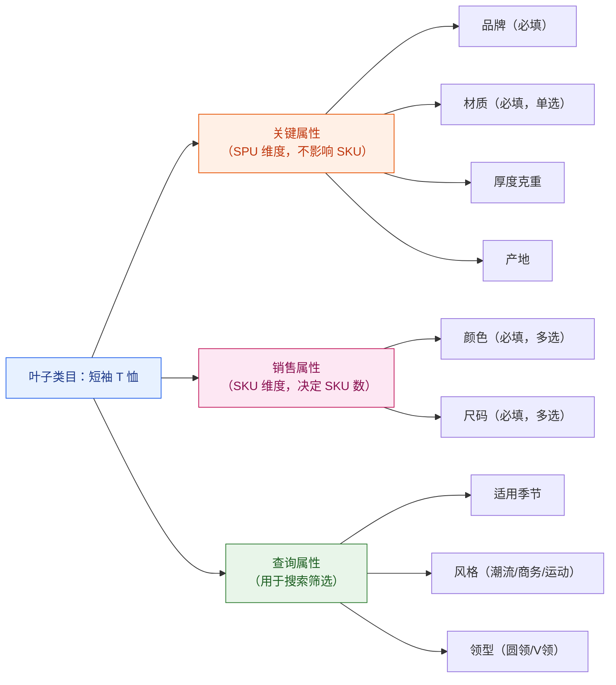
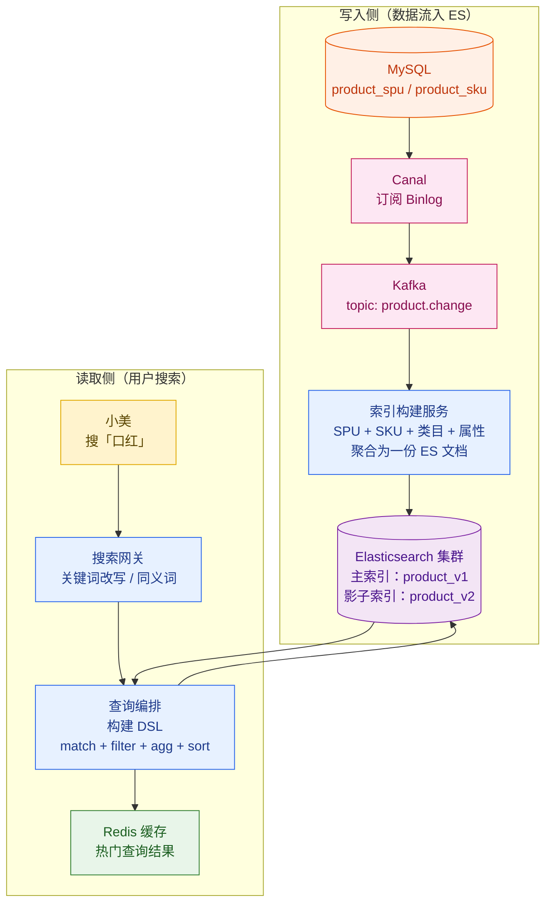
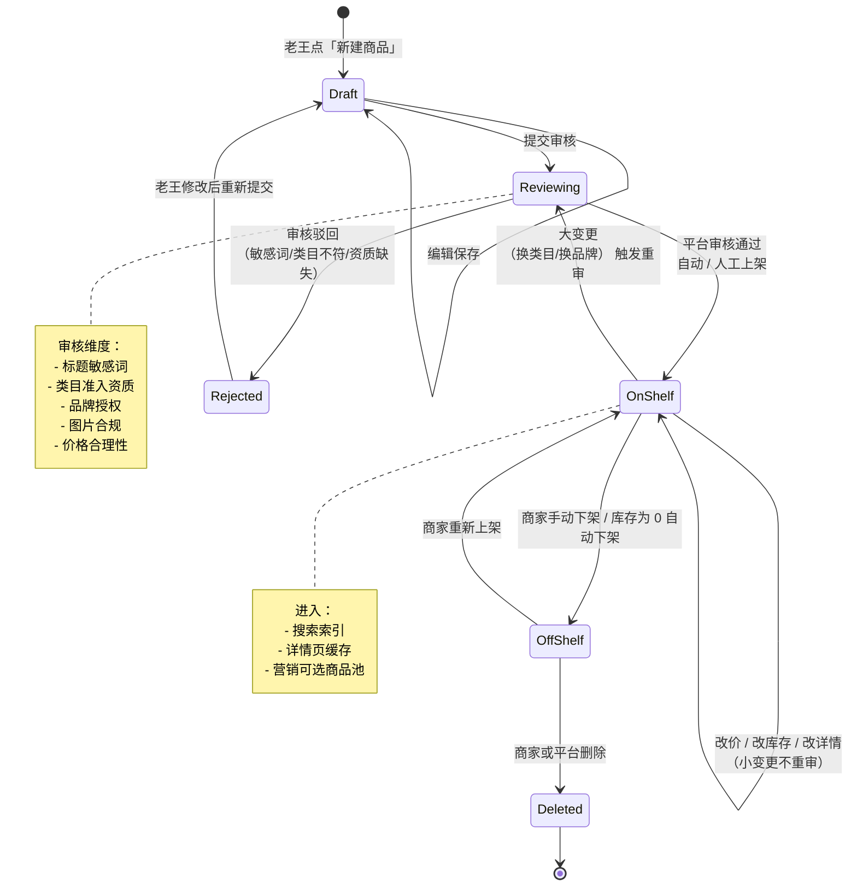
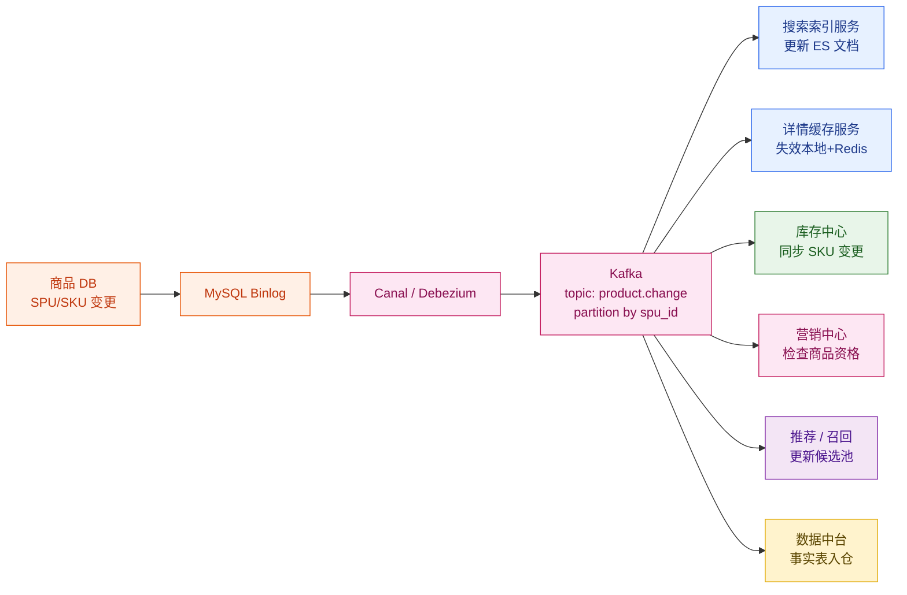

# 第 3 章 · 商品中心：SPU/SKU、类目、属性、搜索

> **所属系列**：[商城平台系统设计 · 全景教程](./00-教程大纲.md)
> **上一章**：[第 2 章 · 整体架构与一次下单的生命周期](./02-整体架构与一次下单的生命周期.md)
> **下一章**：[第 4 章 · 商品详情页与多级缓存](./04-商品详情页与多级缓存.md)

---

## 本章导读

第 2 章把「极购商城」七大域和一次下单的完整链路打通了。从这一章开始，我们逐层钻入每一个域。**商品域是整个商城的地基**——一切交易、营销、履约都建立在「商品如何被建模、被存储、被检索」之上。

本章跟随两个具体的业务场景：

> **老王上架国潮 T 恤**：在「王的潮品」旗舰店上架一款"国潮 T 恤"，三种颜色（红/白/黑） × 五个尺码（S/M/L/XL/XXL），共 **15 个可购买选项**。老王只想录入一次商品信息，但用户结算时必须能精准对应到「红色 L 码」那一件。
>
> **小美搜索口红**：在搜索框输入"口红"，希望按品牌（YSL/Dior/MAC）、色号（416/999/Ruby Woo）、价位（200–500 元）筛选，再按销量排序，30 ms 内拿到结果。

这两个场景的背后，是商品域必须回答的核心问题：

1. **商品如何抽象**：怎样用一套数据模型同时表达「概念上的同一款商品」（SPU）和「实际可购买的最小单元」（SKU）？
2. **类目如何组织**：5 亿 SKU 怎么挂载到不超过 5 层的类目树？用户看到的导航类目和商家挂载的运营类目要不要分离？
3. **属性如何标准化**：颜色、尺码、产地、保质期……哪些影响 SKU，哪些只是展示？怎样保证「玫红」「玫瑰红」「rose red」不会被录成三个不同的属性值？
4. **搜索如何做到亚秒返回**：5 亿 SKU 全量扫描显然不可能，怎样用 Elasticsearch 在 30 ms 内完成「关键词 + 多属性筛选 + 价格区间 + 排序 + 聚合」？
5. **商品发布如何受控**：商家提交 → 平台审核 → 上架 → 下架 → 删除，每一步状态如何流转？商品改价 / 改详情如何通知下游（库存、营销、订单）？

带着这些问题，我们进入商品中心。

---

## 3.1 商品域的核心挑战

商品中心看似只是「增删改查」，但放到极购 5 亿 SKU、日 100 万 + QPS 详情页的规模下，它至少要同时解决六类挑战：

| 挑战 | 业务体现 | 工程难点 |
| --- | --- | --- |
| **海量异构** | 服装、3C、生鲜、虚拟商品的属性体系完全不同 | 关系模型难以一锅煮，需要属性扩展 |
| **SPU/SKU 爆炸** | 一件 T 恤 15 个 SKU，一款手机 24 个 SKU；老王全店 2000+ SKU | 录入复杂度、存储成本、查询性能 |
| **类目千变万化** | 「Switch 主机」既能挂「游戏机」也能挂「数码礼物」 | 树形结构 + 多挂载 + 不停演进 |
| **强搜索需求** | 小美 80% 的访问从搜索 / 筛选开始 | ES 索引设计、中文分词、聚合性能 |
| **强一致下游** | 价格 / 库存 / 上下架状态变更必须秒级同步给营销、订单 | Binlog + MQ、最终一致、避免脏读 |
| **多商家治理** | 50 万商家自助上架，质量参差 | 审核、敏感词、类目反作弊 |

接下来我们一项一项拆。

---

## 3.2 商品域核心数据模型

### 3.2.1 五个核心实体

商品域不是只有「商品」一张表，工业界普遍采用 **类目（Category）— 品牌（Brand）— SPU — SKU — 货品（Item）** 五层模型。它们的语义对应关系如下：

| 实体 | 全称 | 语义 | 极购案例 |
| --- | --- | --- | --- |
| 类目 Category | Category Tree | 商品在分类导航中所处的「位置」 | `服饰 > 男装 > T恤 > 短袖 T恤` |
| 品牌 Brand | Brand | 商品所属品牌方 | 王的潮品（自有品牌）、YSL、Apple |
| SPU | Standard Product Unit | 「同一款商品」的概念抽象，不区分销售属性 | 「王的潮品 2024 春季国潮 T 恤」就是 1 个 SPU |
| SKU | Stock Keeping Unit | 实际可购买、可计价、可扣库存的最小单元 | 「红色 L 码」是 1 个 SKU，「黑色 XXL」是另 1 个 SKU |
| 货品 Item | Inventory Item | 仓库 / 采购视角的实物管理单元 | 同一个 SKU 在杭州仓和深圳仓是 2 个货品 |

### 3.2.2 五层实体关系图（ER）



> **解读关键点**
>
> 1. **SPU ↔ SKU 是 1:N**。老王那件国潮 T 恤是 1 个 SPU，但派生出 15 个 SKU（3 色 × 5 码）。
> 2. **SKU ↔ Item 是 1:N**。同一个 SKU 在多仓存放时，每个仓库一份 Item 记录，用于精细化库存管理（具体见第 7 章）。
> 3. **类目分前后台**：`Category.type` 字段区分。前台类目用于用户浏览导航，后台类目用于商家挂载和属性绑定。

### 3.2.3 老王 T 恤的实例化展开



注意两点：

- **XL/XXL 的价格比 S/M/L 高 10 元**：SKU 维度独立定价，加大码常见的「码差」策略可以直接用 SKU 价格字段表达。
- **同一 SKU 跨仓存放**：「红 L 码」在杭州、深圳各有库存，履约时根据小美收货地址选择最近仓发货（具体见第 15 章）。

---

## 3.3 类目树设计

### 3.3.1 前台类目 vs 后台类目

很多新手会问：「为什么类目要分前后台？一套不就够了？」答案是——**用户视角和商家视角的诉求根本不同**：

| 维度 | 前台类目 | 后台类目 |
| --- | --- | --- |
| 面向对象 | 用户（小美） | 商家（老王）/ 运营 |
| 调整频率 | 频繁（按运营节奏调整大促入口） | 稳定（基础分类，几年才大改） |
| 结构特点 | 偏营销，可以「夏季清凉节」「618 数码」做临时类目 | 偏标准，严格树形，挂属性 |
| 一个 SPU 可挂 | 多个前台类目（如 Switch 既在「游戏机」也在「数码礼物」） | 通常只 1 个后台类目（用于属性绑定） |
| 是否绑定属性 | 否 | 是（关键属性、销售属性都绑后台类目） |

### 3.3.2 后台类目树形结构

后台类目是商品体系的「骨架」，必须严格的树形（每个节点有且仅有一个父节点），层级 3–5 级最佳：

```
（根类目）
├─ 服饰
│   ├─ 男装
│   │   ├─ T 恤
│   │   │   ├─ 短袖 T 恤    ← 叶子节点，可挂 SPU
│   │   │   └─ 长袖 T 恤    ← 叶子节点
│   │   └─ 裤装
│   └─ 女装
├─ 数码
│   ├─ 手机
│   └─ 电脑
└─ 美妆
    ├─ 彩妆
    │   ├─ 口红             ← 小美搜「口红」最终命中这里
    │   └─ 粉底
    └─ 护肤
```

**经典约束**：

1. **SPU 必须挂在叶子类目**。挂在非叶子（如「服饰」）会导致属性继承混乱。
2. **类目层级一般不超过 5 级**。再深用户和商家都受不了，运营成本爆炸。
3. **类目调整需谨慎**。改动某个类目的属性绑定，关联的几十万 SPU 全要重新校验。

### 3.3.3 类目—属性绑定

每个叶子类目都绑定一组**关键属性**和**销售属性**模板。商家在该类目下发布 SPU 时，必须按模板填写：



老王上架 T 恤时，系统会自动加载「短袖 T 恤」类目下绑定的属性模板，他只需要按模板填写颜色={红,白,黑}、尺码={S,M,L,XL,XXL}，系统就会自动生成 15 个 SKU 草稿。

### 3.3.4 前台类目的跨挂载

前台类目允许一个 SPU 同时挂多个位置。例如老王的国潮 T 恤可以同时挂在：

- 前台类目 `男装频道 > T 恤`
- 前台类目 `潮流专区 > 国潮服饰`
- 前台类目 `618 大促 > 服饰会场`

用关联表实现：

```sql
CREATE TABLE spu_front_category_rel (
    id           BIGINT       NOT NULL AUTO_INCREMENT,
    spu_id       BIGINT       NOT NULL,
    front_cat_id BIGINT       NOT NULL,
    sort_weight  INT          NOT NULL DEFAULT 0  COMMENT '在该前台类目下的排序权重',
    created_at   DATETIME     NOT NULL DEFAULT CURRENT_TIMESTAMP,
    PRIMARY KEY (id),
    UNIQUE KEY uk_spu_front (spu_id, front_cat_id),
    KEY idx_front_sort (front_cat_id, sort_weight)
) ENGINE=InnoDB DEFAULT CHARSET=utf8mb4 COMMENT='SPU-前台类目关联表';
```

---

## 3.4 SPU/SKU 设计

### 3.4.1 SPU 与 SKU 的边界

**判断一个属性是放在 SPU 还是 SKU**，有一个简单原则：

> **会影响价格 / 库存 / 单独购买的，是销售属性 → 放 SKU；否则放 SPU。**

| 商品 | SPU 维度（关键属性） | SKU 维度（销售属性） |
| --- | --- | --- |
| 国潮 T 恤 | 材质、厚度、产地 | 颜色、尺码 |
| YSL 口红 | 系列、是否哑光 | 色号、容量 |
| iPhone 15 | CPU、屏幕材质 | 颜色、存储容量 |
| 茅台 | 度数、香型 | 容量（500ml/1L）、年份 |

### 3.4.2 SKU 编码规则

SKU 编码需要稳定、可读、可追溯。一个常见的格式：

```
SKU 编码 = 平台前缀 + 店铺号 + SPU 后 6 位 + 销售属性短码
例：
  JG-W001-880201-RED-L     极购-王的潮品-T恤880201-红-L
  JG-Y002-991034-416-3ml   极购-YSL专柜-口红991034-416号-3ml
```

注意三点：

1. **不要在 SKU 编码里塞「价格」「库存」**。这些会变。
2. **销售属性短码要稳定**。不能今天叫 RED，明天叫 R。
3. **保留人工可读性**。客服查问题时直接念 SKU 编码会很方便。

### 3.4.3 商品主表 SQL 完整建表

下面是商品中心最核心的两张表——`product_spu` 和 `product_sku` 的完整定义。注意按高并发场景做了字段冗余和索引优化：

```sql
-- ============================================================
-- SPU 主表
-- 单店铺 SPU 量约几千~几万，全平台 SPU 数千万级
-- 需要按 shop_id 分库分表，详见第 19 章
-- ============================================================
CREATE TABLE product_spu (
    id              BIGINT        NOT NULL AUTO_INCREMENT COMMENT 'SPU ID（雪花算法）',
    title           VARCHAR(255)  NOT NULL COMMENT '商品标题',
    sub_title       VARCHAR(255)  DEFAULT NULL COMMENT '副标题/卖点',

    -- 归属
    shop_id         BIGINT        NOT NULL COMMENT '店铺 ID',
    brand_id        BIGINT        NOT NULL COMMENT '品牌 ID',
    back_cat_id     BIGINT        NOT NULL COMMENT '后台类目 ID（叶子）',

    -- 价格区间（冗余字段，用于列表页/搜索快速展示，由 SKU 价格汇总更新）
    min_price       DECIMAL(10,2) NOT NULL DEFAULT 0 COMMENT 'SKU 最低价（冗余）',
    max_price       DECIMAL(10,2) NOT NULL DEFAULT 0 COMMENT 'SKU 最高价（冗余）',

    -- 状态机
    status          TINYINT       NOT NULL DEFAULT 0 COMMENT '0=草稿 1=审核中 2=上架 3=下架 4=已删除',

    -- 库存汇总（冗余，由 SKU 汇总更新）
    total_stock     INT           NOT NULL DEFAULT 0 COMMENT '总可售库存',

    -- 销售指标（冗余，由订单中心异步回写）
    sale_count_30d  INT           NOT NULL DEFAULT 0 COMMENT '30 日销量',
    rating_avg      DECIMAL(3,2)  NOT NULL DEFAULT 0 COMMENT '平均评分',
    rating_count    INT           NOT NULL DEFAULT 0 COMMENT '评价数',

    -- 详情存储分离（详情富文本/图集走对象存储 + 外链，主表只存指针）
    detail_oss_key  VARCHAR(255)  DEFAULT NULL COMMENT '详情 JSON 在对象存储的 key',

    -- 时间戳
    publish_time    DATETIME      DEFAULT NULL COMMENT '上架时间',
    created_at      DATETIME      NOT NULL DEFAULT CURRENT_TIMESTAMP,
    updated_at      DATETIME      NOT NULL DEFAULT CURRENT_TIMESTAMP ON UPDATE CURRENT_TIMESTAMP,
    version         INT           NOT NULL DEFAULT 0 COMMENT '乐观锁版本号',

    PRIMARY KEY (id),
    KEY idx_shop_status   (shop_id, status, updated_at),
    KEY idx_cat_status    (back_cat_id, status, sale_count_30d),
    KEY idx_brand_status  (brand_id, status),
    KEY idx_status_pub    (status, publish_time)
) ENGINE=InnoDB DEFAULT CHARSET=utf8mb4 COMMENT='SPU 主表';


-- ============================================================
-- SKU 扩展表
-- 一个 SPU 平均 5~20 个 SKU，全平台 SKU 数亿级
-- 与 SPU 同库同表分片（按 shop_id 路由），保证联表本地化
-- ============================================================
CREATE TABLE product_sku (
    id              BIGINT        NOT NULL AUTO_INCREMENT COMMENT 'SKU ID（雪花算法）',
    spu_id          BIGINT        NOT NULL COMMENT '所属 SPU',
    shop_id         BIGINT        NOT NULL COMMENT '冗余，便于分片路由',
    sku_code        VARCHAR(64)   NOT NULL COMMENT '业务编码，店内唯一',

    -- 价格与库存（库存仅冗余，实际扣减以库存中心为准，详见第 7 章）
    price           DECIMAL(10,2) NOT NULL COMMENT '售价（分单位的也可用 BIGINT 存）',
    cost_price      DECIMAL(10,2) DEFAULT NULL COMMENT '成本价（商家可见）',
    market_price    DECIMAL(10,2) DEFAULT NULL COMMENT '划线价/原价',
    stock           INT           NOT NULL DEFAULT 0 COMMENT '可售库存（冗余）',

    -- 销售属性快照（JSON：{"颜色":"红","尺码":"L"}）
    -- 这里冗余存储是为了订单展示时不需要再回查属性表
    sale_attr_json  JSON          NOT NULL COMMENT '销售属性 KV 快照',

    -- 物理属性（用于运费计算、仓储分拣）
    weight_g        INT           DEFAULT NULL COMMENT '单件重量（克）',
    volume_ml       INT           DEFAULT NULL COMMENT '单件体积（ml）',
    barcode         VARCHAR(64)   DEFAULT NULL COMMENT '条形码',

    -- 主图（SKU 维度也可以单独配主图，如不同颜色不同图）
    main_image      VARCHAR(255)  DEFAULT NULL,

    -- 状态
    status          TINYINT       NOT NULL DEFAULT 1 COMMENT '0=禁用 1=启用',

    created_at      DATETIME      NOT NULL DEFAULT CURRENT_TIMESTAMP,
    updated_at      DATETIME      NOT NULL DEFAULT CURRENT_TIMESTAMP ON UPDATE CURRENT_TIMESTAMP,
    version         INT           NOT NULL DEFAULT 0,

    PRIMARY KEY (id),
    UNIQUE KEY uk_shop_code (shop_id, sku_code),
    KEY idx_spu_status (spu_id, status),
    KEY idx_shop_status (shop_id, status)
) ENGINE=InnoDB DEFAULT CHARSET=utf8mb4 COMMENT='SKU 扩展表';
```

**几个工程细节**：

- **价格字段类型**：DECIMAL(10,2) 适合大多数场景；如果涉及高频计算 / 跨币种，建议改用 BIGINT 存「分」单位，避免浮点误差。
- **sale_attr_json**：SKU 表冗余了销售属性快照，避免「订单展示」「购物车列表」这种高频查询还要再回属性表 join。
- **冗余字段同步**：`min_price/max_price/total_stock` 通过 Binlog → Canal → MQ 异步更新，详见 3.8 节。
- **不要把详情图文塞主表**：富文本 / 详情图集走对象存储 + CDN，主表只存 oss_key。否则单行几 MB 一查就把 InnoDB Buffer Pool 撑爆。

---

## 3.5 属性体系

### 3.5.1 四类属性

商品属性根据用途细分为四类，落库方式也不同：

| 属性类别 | 维度 | 是否影响 SKU | 是否参与搜索筛选 | 落库方式 |
| --- | --- | --- | --- | --- |
| **关键属性** | SPU | 否 | 是 | spu_attr_value 表 |
| **销售属性** | SKU | **是** | 是 | 体现在 SKU 表的 sale_attr_json + sku_sale_attr 表 |
| **查询属性** | SPU | 否 | 是 | spu_attr_value 表（标记 is_searchable） |
| **非关键属性** | SPU | 否 | 否 | 直接进详情 JSON 即可 |

### 3.5.2 属性字典管理

要避免「玫瑰红/玫红/rose red」这种脏数据，**属性值必须走平台统一字典**：

```sql
CREATE TABLE attribute_dict (
    id           BIGINT       NOT NULL AUTO_INCREMENT,
    cat_id       BIGINT       NOT NULL COMMENT '绑定后台类目',
    name         VARCHAR(64)  NOT NULL COMMENT '属性名，如「颜色」',
    type         TINYINT      NOT NULL COMMENT '1=关键 2=销售 3=查询',
    input_type   TINYINT      NOT NULL COMMENT '1=单选 2=多选 3=输入框',
    is_required  TINYINT      NOT NULL DEFAULT 0,
    PRIMARY KEY (id),
    UNIQUE KEY uk_cat_name (cat_id, name)
) ENGINE=InnoDB DEFAULT CHARSET=utf8mb4 COMMENT='类目-属性字典';

CREATE TABLE attribute_value_dict (
    id           BIGINT       NOT NULL AUTO_INCREMENT,
    attr_id      BIGINT       NOT NULL,
    value        VARCHAR(128) NOT NULL COMMENT '标准值，如「红色」',
    alias        VARCHAR(255) DEFAULT NULL COMMENT '别名 JSON，如["玫红","rose"]',
    sort_weight  INT          NOT NULL DEFAULT 0,
    PRIMARY KEY (id),
    UNIQUE KEY uk_attr_value (attr_id, value)
) ENGINE=InnoDB DEFAULT CHARSET=utf8mb4 COMMENT='属性值字典';
```

商家上架时只能从字典里选，不能自由输入；如果发现需要新值，要走「属性扩展申请」流程，由运营审核入库。这样可以保证小美在前台筛「红色」时不会漏掉别名为「玫红」的商品。

---

## 3.6 商品搜索

商品搜索是商品中心对外的「门面」。小美 80% 的访问都从这里发起，对延迟、相关性、可扩展性要求极高。

### 3.6.1 为什么不能直接用 MySQL

```
MySQL 全表 LIKE %口红% → 5 亿行 → 数十秒，且无法做相关性打分
MySQL FULLTEXT 索引     → 中文分词差，不支持复杂聚合
```

工业界标配是 **Elasticsearch**（或 OpenSearch / 阿里 OpenSearch）。

### 3.6.2 商品搜索整体架构



### 3.6.3 ES 索引 mapping 设计

针对极购商品搜索场景，关键设计：

```json
PUT /product_v1
{
  "settings": {
    "number_of_shards": 24,
    "number_of_replicas": 2,
    "analysis": {
      "analyzer": {
        "ik_smart_pinyin": {
          "type": "custom",
          "tokenizer": "ik_smart",
          "filter": ["pinyin_filter", "lowercase"]
        }
      },
      "filter": {
        "pinyin_filter": {
          "type": "pinyin",
          "keep_first_letter": true,
          "keep_full_pinyin": true
        }
      }
    }
  },
  "mappings": {
    "properties": {
      "spu_id":       { "type": "long" },
      "title":        { "type": "text", "analyzer": "ik_smart_pinyin",
                        "fields": { "keyword": { "type": "keyword" } } },
      "sub_title":    { "type": "text", "analyzer": "ik_smart_pinyin" },

      "shop_id":      { "type": "long" },
      "brand_id":     { "type": "long" },
      "brand_name":   { "type": "keyword" },

      "back_cat_id":  { "type": "long" },
      "front_cat_ids":{ "type": "long" },
      "cat_path":     { "type": "keyword" },

      "min_price":    { "type": "scaled_float", "scaling_factor": 100 },
      "max_price":    { "type": "scaled_float", "scaling_factor": 100 },

      "sale_count_30d": { "type": "integer" },
      "rating_avg":     { "type": "half_float" },
      "publish_time":   { "type": "date" },

      "status":         { "type": "byte" },
      "in_stock":       { "type": "boolean" },

      "attrs": {
        "type": "nested",
        "properties": {
          "attr_id":   { "type": "long" },
          "attr_name": { "type": "keyword" },
          "value":     { "type": "keyword" }
        }
      }
    }
  }
}
```

**几个要点**：

- **title 用 ik_smart + 拼音过滤**：小美输入「kh」也能命中「口红」。
- **price 用 scaled_float**：避免浮点误差，又能高效做区间检索。
- **attrs 用 nested 类型**：每个属性是独立的子文档，支持「品牌=YSL 且 色号=416」这种组合筛选，避免 object 类型的字段平铺导致的「交叉污染」。
- **front_cat_ids 是数组**：支持一个 SPU 挂多个前台类目。

### 3.6.4 小美的口红搜索 DSL

> **场景**：小美搜「口红」，筛选品牌 = YSL，色号 = 416，价格 200–500，按销量倒序，要求左侧聚合出所有可选品牌和色号。

```json
POST /product_v1/_search
{
  "from": 0,
  "size": 20,
  "_source": ["spu_id", "title", "min_price", "max_price",
              "brand_name", "sale_count_30d", "rating_avg"],

  "query": {
    "bool": {
      "must": [
        { "multi_match": {
            "query": "口红",
            "fields": ["title^3", "sub_title", "brand_name"],
            "type": "best_fields",
            "operator": "and"
        } }
      ],
      "filter": [
        { "term":  { "status": 2 } },
        { "term":  { "in_stock": true } },
        { "term":  { "brand_id": 9912 } },
        { "range": { "min_price": { "gte": 200, "lte": 500 } } },
        { "nested": {
            "path": "attrs",
            "query": {
              "bool": { "must": [
                { "term": { "attrs.attr_name": "色号" } },
                { "term": { "attrs.value": "416" } }
              ] }
            }
        } }
      ]
    }
  },

  "sort": [
    { "sale_count_30d": "desc" },
    { "_score":         "desc" }
  ],

  "aggs": {
    "by_brand": {
      "terms": { "field": "brand_name", "size": 20 }
    },
    "by_color": {
      "nested": { "path": "attrs" },
      "aggs": {
        "color_filter": {
          "filter": { "term": { "attrs.attr_name": "色号" } },
          "aggs": {
            "values": { "terms": { "field": "attrs.value", "size": 50 } }
          }
        }
      }
    },
    "price_ranges": {
      "range": {
        "field": "min_price",
        "ranges": [
          { "to": 200 },
          { "from": 200, "to": 500 },
          { "from": 500, "to": 1000 },
          { "from": 1000 }
        ]
      }
    }
  }
}
```

**性能参考**：在 24 shard、单 shard 约 2000 万文档的极购索引上，这个查询 P99 延迟通常 **15–40 ms**。如果命中查询缓存，单 shard 可以做到 5 ms 内。

### 3.6.5 分词与同义词

中文搜索的核心难点在分词。极购的处理策略：

| 处理 | 工具 / 词典 | 例子 |
| --- | --- | --- |
| 基础分词 | IK Analyzer + 商品类目自定义词典 | 「冰丝面膜」拆成「冰丝 / 面膜」而非「冰 / 丝 / 面膜」 |
| 同义词扩展 | ES synonym filter | 「圣罗兰 ⇄ YSL ⇄ 杨树林」 |
| 拼音召回 | pinyin analyzer | 「kh」→「口红」 |
| 纠错 | edit distance + 热搜词字典 | 「迪奥」误打「迪欧」 |
| 改写 | 业务规则 | 「iphone15 plus」改写为「iPhone 15 Plus」 |

---

## 3.7 商品发布流程与状态机

### 3.7.1 商品状态机

老王从录入到上架，要经过严格的状态流转。理解状态机是排查商品异常的基础：



### 3.7.2 状态字段的设计技巧

新手常犯的错：**只用一个 `status` 字段** 把所有状态拍平。这会让「人工干预下架」「售罄自动下架」「违规强制下架」三种语义无法区分。**正确做法是用「主状态 + 子状态」组合**：

```sql
status        TINYINT  NOT NULL COMMENT '主状态：0草稿 1审核中 2上架 3下架 4删除',
sub_status    INT      NOT NULL DEFAULT 0 COMMENT '子状态位图：bit0=售罄下架 bit1=违规下架 bit2=商家主动下架 ...',
off_reason    VARCHAR(255) DEFAULT NULL COMMENT '下架原因（人工填写）',
```

### 3.7.3 审核与发布的核心 Java 代码

下面是一段精简的发布服务代码，体现了 **乐观锁 + 状态校验 + 事件发布** 三件套：

```java
@Service
@RequiredArgsConstructor
public class SpuPublishService {

    private final SpuMapper spuMapper;
    private final SkuMapper skuMapper;
    private final SpuValidator validator;          // 标题/敏感词/类目准入校验
    private final DomainEventPublisher publisher;  // 写 outbox 表 + MQ

    /**
     * 商家提交审核
     */
    @Transactional(rollbackFor = Exception.class)
    public void submitForReview(long spuId, long operatorUid) {
        ProductSpu spu = spuMapper.selectByIdForUpdate(spuId);
        Assert.notNull(spu, "SPU 不存在");
        Assert.isTrue(spu.getShopId() == fetchShopId(operatorUid), "无权限");

        // 状态校验：只有草稿和驳回（语义上仍是草稿）可以提交
        if (spu.getStatus() != SpuStatus.DRAFT.code()) {
            throw new BizException("当前状态不允许提交审核：" + spu.getStatus());
        }

        // SKU 完整性校验
        List<ProductSku> skus = skuMapper.selectBySpuId(spuId);
        Assert.notEmpty(skus, "SPU 必须至少有一个 SKU");
        skus.forEach(validator::validateSku);

        // 基础校验
        validator.validateTitle(spu.getTitle());
        validator.validateCategory(spu.getBackCatId(), spu.getShopId());
        validator.validateBrand(spu.getBrandId(), spu.getShopId());

        // 乐观锁更新状态
        int affected = spuMapper.updateStatusByVersion(
            spuId, SpuStatus.REVIEWING.code(), spu.getVersion());
        if (affected == 0) {
            throw new BizException("并发修改，请刷新后重试");
        }

        // 发布领域事件，触发审核流（机审 + 人工审）
        publisher.publish(new SpuSubmittedEvent(spuId, operatorUid));
    }

    /**
     * 审核通过 → 上架
     * 由审核中心异步回调
     */
    @Transactional(rollbackFor = Exception.class)
    public void approveAndPublish(long spuId, long reviewerUid) {
        ProductSpu spu = spuMapper.selectByIdForUpdate(spuId);
        if (spu.getStatus() != SpuStatus.REVIEWING.code()) {
            // 幂等：已经上架就直接返回
            if (spu.getStatus() == SpuStatus.ON_SHELF.code()) return;
            throw new BizException("非审核中状态，无法上架：" + spu.getStatus());
        }

        spu.setStatus(SpuStatus.ON_SHELF.code());
        spu.setPublishTime(LocalDateTime.now());
        int affected = spuMapper.updateByVersion(spu);
        if (affected == 0) {
            throw new BizException("并发冲突");
        }

        // 发上架事件，下游：搜索索引、详情缓存、营销池、推荐池
        publisher.publish(new SpuOnShelfEvent(spuId, spu.getShopId(),
                                              spu.getBackCatId(), reviewerUid));
    }

    /**
     * 审核驳回 → 回到草稿
     */
    @Transactional(rollbackFor = Exception.class)
    public void reject(long spuId, String reason, long reviewerUid) {
        ProductSpu spu = spuMapper.selectByIdForUpdate(spuId);
        if (spu.getStatus() != SpuStatus.REVIEWING.code()) {
            return; // 幂等
        }
        spuMapper.updateStatusWithReason(
            spuId, SpuStatus.DRAFT.code(), reason, spu.getVersion());
        publisher.publish(new SpuRejectedEvent(spuId, reason, reviewerUid));
    }
}
```

代码里几个值得注意的地方：

1. **乐观锁版本号**：避免多个客服 / 商家并发操作互相覆盖。
2. **幂等处理**：审核通过这种回调容易重复触发，要按状态校验做幂等。
3. **领域事件**：上架成功后**先写本地 outbox 表，事务提交后再异步发 MQ**，保证「DB 状态」和「下游通知」最终一致（详见第 11 章分布式事务）。

---

## 3.8 商品中心与下游的协作

### 3.8.1 商品变更的扇出

商品变更是商城最高频的「上游事件」，几乎所有下游都要订阅：



为什么不用 RPC 同步调用？因为：

- **强耦合**：搜索 ES 抖动会拖垮商品上架请求。
- **扩展难**：新增订阅方要改商品中心代码。
- **重放难**：消息丢了想补，没办法回溯。

**Canal + MQ** 把商品中心彻底解耦成「单源真相」，下游各自消费、各自处理，故障互不影响。

### 3.8.2 消息格式约定

```json
{
  "event_id": "evt_881023029384",
  "event_type": "spu.updated",
  "occurred_at": "2026-06-05T10:24:13Z",
  "spu_id": 880201,
  "shop_id": 10086,
  "changed_fields": ["price", "stock"],
  "before": { "min_price": 129.00, "total_stock": 850 },
  "after":  { "min_price": 119.00, "total_stock": 800 },
  "sku_snapshot": [
    { "sku_id": 9912001, "price": 119.00, "stock": 120 }
  ],
  "version": 17
}
```

**关键约束**：

- 必须带 `event_id` 保证下游幂等去重。
- 必须带 `version`，下游按版本号决定是否丢弃过期消息（乱序场景）。
- 按 `spu_id` 做 partition key，保证同一商品的事件在 Kafka 内有序。

---

## 3.9 多商家 / 多店铺

极购同时存在两种模式：

| 模式 | 自营 | 第三方旗舰店 / 专卖店 |
| --- | --- | --- |
| 代表 | 极购自营仓 | 王的潮品、YSL 官方旗舰店 |
| 商品归属 | 平台 | 商家 |
| 价格定价权 | 平台 | 商家（受规则约束） |
| 库存归属 | 平台仓 | 商家自有仓 / 平台代发 |
| 发货主体 | 平台 | 商家 |
| 资金结算 | 内部账 | T+N 结算给商家 |

**数据隔离的关键设计**：

1. `shop_id` 是所有商品表的**强制必填字段**，并作为分库分表路由键。
2. 后台所有商家自服务接口必须做「资源所属校验」——例如老王只能改自己店铺的商品。
3. 自营商品用 `shop_id = 0` 或保留 ID（如 1）标识。
4. 自营与第三方共享前台搜索 / 详情体验，用户不感知归属差异。

---

## 3.10 商品中心的性能与高可用

5 亿 SKU + 100 万 QPS 详情页流量下，商品中心必须扛得住。常用手段：

| 手段 | 适用场景 | 关键配置 |
| --- | --- | --- |
| **读写分离** | SPU/SKU 库高读写比 | MySQL 1 主 N 从，按 `shop_id` 路由读 |
| **分库分表** | 全平台数千万 SPU | 按 `shop_id` 取模分 32 库，单库再分 32 表 |
| **多级缓存** | 详情页 QPS 100 万+ | Caffeine 本地 + Redis 集群，详见第 4 章 |
| **商品池缓存** | 类目 / 营销下的商品集合 | Redis Hash / ZSet，按类目 ID 分桶 |
| **ES 集群** | 搜索 + 复杂筛选 | 24 shard + 2 replica，独立机房部署 |
| **降级开关** | ES 故障时 | 触发后切换至「精选商品池」兜底，避免雪崩 |
| **发布限流** | 防止商家批量刷上架 | Sentinel 单商家 100 件/分钟 |
| **批量上架异步** | 商家一次上千个 SKU | 拆批写入 + 后台任务 + 进度查询 |

### 3.10.1 商品池缓存的典型用法

商品池常用 Redis Hash + ZSet：

```
KEY:  cat:1001:hot              -- 类目「短袖 T 恤」热销榜
TYPE: ZSet
MEMBER: spu_id
SCORE:  sale_count_30d  -- 用销量做排序

KEY:  spu:880201:base
TYPE: Hash
FIELDS:
  title, brand_name, min_price, max_price, sale_count_30d, ...
```

读取时按类目热榜先拿 SPU 列表（`ZREVRANGE cat:1001:hot 0 19`），再 pipeline 批量拿基础信息（`HMGET spu:880201:base ...`），单次查询 RTT 通常 < 5 ms。

---

## 3.11 常见易错点

### 3.11.1 把销售属性放成 SPU 维度

**错误做法**：把「颜色」「尺码」当 SPU 字段，导致每个颜色都是独立 SPU，老王要重复录 3 次。

**问题**：评论、收藏、销量都分散了；用户看「红色」和「白色」是不同商品。

**正确做法**：销售属性必须放 SKU 维度，SPU 一份，SKU 多份。

### 3.11.2 用 SKU 编码做主键

**错误做法**：用业务编码做 PK / 外键。

**问题**：业务编码可能调整；与其他系统对接时需要转换。

**正确做法**：用雪花算法 ID 做 PK，业务编码做 UK。

### 3.11.3 详情图文塞主表

**错误做法**：详情富文本直接 LONGTEXT 字段进 product_spu。

**问题**：单行数十 KB，分页查询时 BufferPool 命中率暴跌，全表扫描秒级响应。

**正确做法**：详情走对象存储 + CDN，主表只存 `detail_oss_key`。

### 3.11.4 ES 与 MySQL 强一致依赖

**错误做法**：上架同步双写 MySQL 和 ES，任一失败回滚另一边。

**问题**：ES 写入延迟 / 抖动会拖死商品上架。

**正确做法**：MySQL 是唯一真相源，ES 通过 Binlog 异步同步；接受秒级延迟，业务上「上架后 5 秒内可搜」即可。

### 3.11.5 类目调整影响存量商品

**错误做法**：运营随手把「短袖 T 恤」类目改名为「T 恤」。

**问题**：所有已挂载该类目的几十万 SPU 都要重建索引、检查属性兼容。

**正确做法**：类目改名要走审批，运营变更前先评估关联 SPU 数量；属性变更要做向前兼容（保留旧属性 ID，新属性追加）。

---

## 本章小结

商品中心是整个商城系统的「数据起点」，本章围绕老王的 T 恤和小美的口红两个具体场景，系统讲解了：

1. **五层数据模型**（类目—品牌—SPU—SKU—货品）：SPU 是「概念抽象」，SKU 是「可购买最小单元」，货品是「仓储管理单元」。判断属性归属的核心原则是「是否影响价格 / 库存 / 单独购买」。

2. **类目体系**：前台类目面向用户，灵活可挂载多个；后台类目面向商家，严格树形，承载属性绑定。叶子类目必须挂 SPU，类目层级控制在 3–5 级。

3. **属性体系**：关键属性 / 销售属性 / 查询属性 / 非关键属性四分；属性值走平台字典，避免脏数据；销售属性最终决定 SKU 数量。

4. **商品搜索**：MySQL 无法承载，必须用 Elasticsearch；mapping 设计要点是 nested 属性、scaled_float 价格、ik+pinyin 分词；典型查询 P99 在 15–40 ms。

5. **状态机**：草稿 → 审核中 → 上架 → 下架 → 删除，主状态 + 子状态位图区分多种下架语义；发布服务要做乐观锁 + 幂等 + 领域事件三件套。

6. **下游解耦**：Binlog → Canal → Kafka 是商品变更扇出的标准通路；消息要带 event_id、version、changed_fields 三类元数据，保证下游幂等与按版本去重。

7. **性能与可用性**：读写分离 + 分库分表 + 多级缓存 + 商品池 + 发布限流 + 降级兜底，是商品中心扛住极购规模的标配组合拳。

掌握了商品中心，你拥有了商城的「物料库」。接下来一章我们将聚焦商品最终面向用户的呈现——**商品详情页**。它的 QPS 是商品中心写入流量的几百倍，对缓存架构提出了完全不同的挑战。

---

下一章：[第 4 章 · 商品详情页与多级缓存](./04-商品详情页与多级缓存.md)

---

## 参考来源

1. **阿里巴巴《商品中心化设计实践》** —— 技术云栖
   [https://developer.aliyun.com/article/759982](https://developer.aliyun.com/article/759982)
   *淘宝 / 天猫商品中台 SPU/SKU 模型与类目体系演进*

2. **京东商品中心架构** —— InfoQ
   [https://www.infoq.cn/article/jd-product-center-architecture](https://www.infoq.cn/article/jd-product-center-architecture)
   *京东自营 + 第三方混合模式下的商品建模与多商家治理*

3. **Elasticsearch Definitive Guide** —— Elastic 官方
   [https://www.elastic.co/guide/en/elasticsearch/guide/current/index.html](https://www.elastic.co/guide/en/elasticsearch/guide/current/index.html)
   *ES mapping、nested 类型、聚合性能调优*

4. **IK Analysis for Elasticsearch** —— medcl/elasticsearch-analysis-ik
   [https://github.com/infinilabs/analysis-ik](https://github.com/infinilabs/analysis-ik)
   *中文 IK 分词器实现与自定义词典扩展*

5. **Alibaba Canal —— MySQL Binlog 增量订阅** —— GitHub
   [https://github.com/alibaba/canal](https://github.com/alibaba/canal)
   *商品变更事件扇出的工业级实现*

6. **Amazon Product Catalog at Scale** —— Amazon Builders' Library
   [https://aws.amazon.com/builders-library/](https://aws.amazon.com/builders-library/)
   *亿级商品目录的存储与检索工程实践*

7. **Shopify Storefront Search Engineering**
   [https://shopify.engineering/](https://shopify.engineering/)
   *Shopify 商品搜索从 MySQL 全文索引到 Elasticsearch 的演进案例*

8. **美团商品中台架构演进** —— 美团技术团队博客
   [https://tech.meituan.com/2020/11/05/product-center-architecture.html](https://tech.meituan.com/2020/11/05/product-center-architecture.html)
   *本地生活场景下的多业态商品建模（外卖、酒旅、零售统一模型）*
