# 第 4 章 · 商品详情页与多级缓存架构

> **所属系列**：《极购商城系统设计 · 全景教程》第二部分 · 商品域
> **上一章**：[第 3 章 · 商品中心：SPU/SKU、类目、属性、搜索](./03-商品中心.md)
> **下一章**：[第 5 章 · 购物车系统](./05-购物车系统.md)
> **总目录**：[教程大纲](./00-教程大纲.md)

---

## 本章导读

第 3 章我们已经把商品中心搭好：5 亿 SKU、类目树、属性体系、ES 搜索。卖家老王在「王的潮品」后台发布完一款 T 恤，系统已经把它写进了商品库、建立了搜索索引、计算好了类目属性。

现在面临的两个问题：

1. **流量**：小美在「极购 App」搜索"口红 999 色号"后点进详情页。这个动作每秒钟会发生多少次？极购详情页的峰值 QPS 是 **100 万**，相当于一秒钟内全国有 100 万个用户在各自刷开一个详情页。

2. **延迟**：小美要求"打开到看见主图 + 价格 + 标题"必须在 **200ms** 内完成。详情页要拼装 6 大类数据（基础信息、详情富文本、服务、评价、店铺、推荐），从数据库拉一圈通常需要 1–2 秒——离目标差一个数量级。

本章就是来解决这个矛盾的，核心武器是**多级缓存**。我们将从详情页的流量特征开始，沿"用户侧 → 边缘 → 服务端 → 存储"一路下钻，把 **5 级缓存 + 静态化 + 热点防护 + 三大问题治理 + 缓存一致性** 完整讲透。

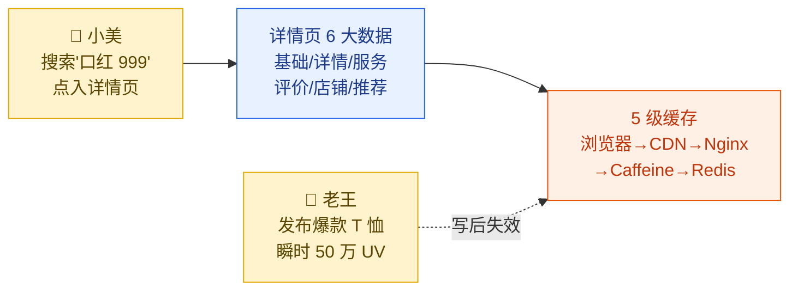

**本章贯穿案例**：小美打开「极购口红 999 色号」详情页 200ms 内首屏展示；老王发布爆款 T 恤后，瞬时 50 万 UV 不把详情页打挂。

---

## 4.1 详情页的流量特征：读多写少、长尾、热点极端

详情页是整个电商系统**流量最大、并发最高**的页面。它的特征和"订单页""购物车页"完全不同。

### 4.1.1 读多写少，比例 10000:1

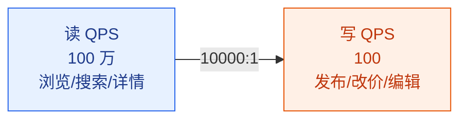

在极购商城（DAU 1500 万、SKU 5 亿）：

| 指标 | 数值 | 备注 |
|------|------|------|
| 日均详情页 PV | 50 亿次 | 每个用户平均每天看 30+ 个详情页 |
| 详情页平均 QPS | ~5.8 万 | 50 亿 / 86400s |
| 晚高峰详情页 QPS | ~30 万 | 20:00–22:00 集中下单前浏览 |
| **大促峰值 QPS** | **100 万+** | 双11 当晚 20:00 整点 |
| 日均详情页写操作 | 5 万次 | 商品发布/价格修改/详情更新 |
| 读写比 | **10000:1** | 经典读多写少场景 |

**10000:1 的读写比意味着什么？**——意味着"缓存"是必须的，绝对不能每次都查数据库。哪怕只有 1% 的请求穿透到数据库，数据库就要扛 1 万 QPS，而 MySQL 单机极限通常不到 1 万 QPS。

### 4.1.2 99% 流量集中在 1% 商品：长尾分布

商品浏览遵循**幂律分布（Power-law distribution）**，前 1% 的爆款商品承担绝大多数流量：

| 流量分层 | 商品占比 | 流量占比 | 单品 QPS | 示例 |
|---------|---------|---------|---------|------|
| 头部爆款 | 1% | 50% | 5000+ | 戴森吹风机、华为 Mate70 |
| 腰部商品 | 9% | 40% | 500–5000 | 普通品牌口红、潮牌 T 恤 |
| 尾部长尾 | 90% | 10% | < 10 | 一年卖 1 件的小众商品 |

**极端情况**：大促整点开抢的爆款（小米手机、茅台、SK-II 神仙水），单品 QPS 可以飙到 **10 万+**——这种"超级热点"是普通缓存架构撑不住的，必须有专门的热点防护（4.5 节）。

### 4.1.3 详情页为什么是性能瓶颈

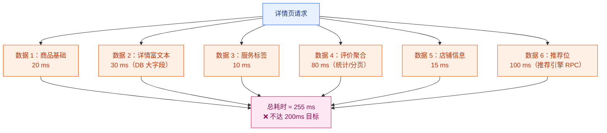

详情页需要**串/并行拼装 6 类数据**，如果全部走数据库，单次响应需要 200–500ms，**完全不可接受**。多级缓存的目标，就是把这条链路压到 **200ms 以内**。

---

## 4.2 详情页的数据组成：6 大块，各有缓存策略

详情页看似一个页面，实际由 6 类数据拼装而成。不同数据有不同的**变更频率、个性化程度、容量大小**，对应的缓存策略也不同。

| 数据块 | 内容 | 变更频率 | 个性化 | 数据量 | 缓存 TTL | 缓存粒度 |
|--------|------|---------|--------|--------|---------|---------|
| 基础信息 | 标题、价格、规格、主图 | 低（分钟级） | 否 | ~5 KB | 5 min | 整个对象 |
| 详情富文本 | 图文详情、视频、参数表 | 极低 | 否 | 50–200 KB | 1 h | HTML 片段 |
| 服务标签 | 包邮、7 天无理由、产地 | 极低 | 否 | ~200 B | 1 h | 整个对象 |
| 评价摘要 | 好评率、标签云、3 条精选 | 中 | 否 | ~3 KB | 10 min | 聚合数据 |
| 店铺信息 | 店名、Logo、评分、关注数 | 低 | 否 | ~2 KB | 30 min | 整个对象 |
| 推荐位 | 同款、看了又看、相似商品 | 中 | **是** | ~5 KB | 5 min | 千人千面 |

**关键观察**：只有"推荐位"是千人千面的（依赖用户画像），其他 5 类对所有用户都一样。**这意味着 5/6 的数据可以做强缓存（甚至静态化到 CDN）**——这是详情页能扛百万 QPS 的根本原因。

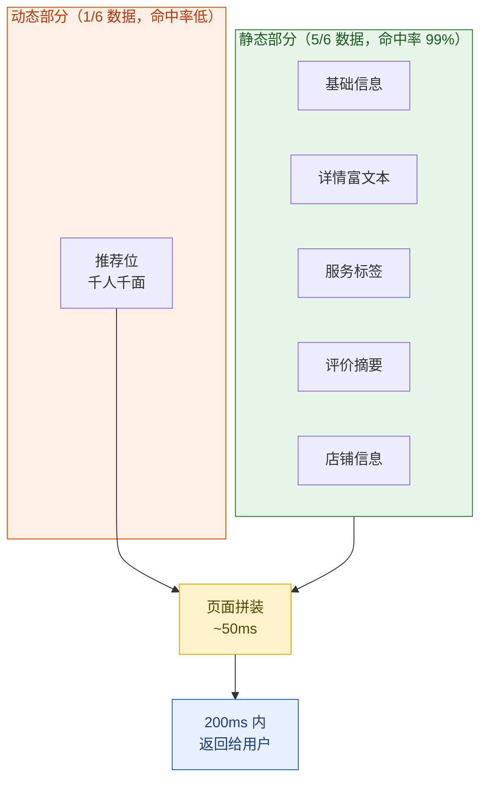

---

## 4.3 多级缓存体系：5 级缓存的分工与协作

### 4.3.1 5 级缓存架构总览

极购详情页的 5 级缓存从用户侧到存储侧依次为：**浏览器 → CDN → Nginx/OpenResty → 应用本地（Caffeine） → 分布式缓存（Redis）**。请求会按这个顺序"穿透"，每命中一级就提前返回，命中率递减但延迟也递减。

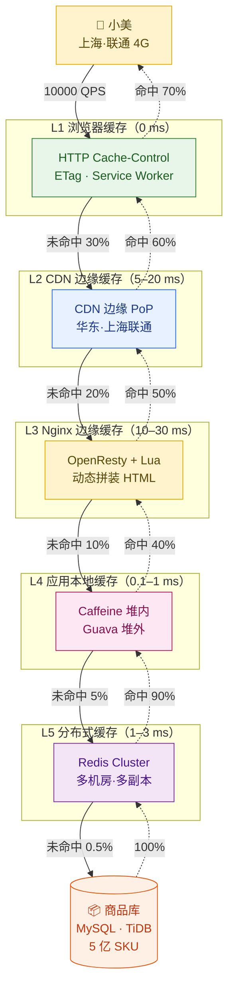

**综合命中率**（假设各级命中率如上）：

$$
r_{\text{综合}} = 1 - (1-0.7)(1-0.6)(1-0.5)(1-0.4)(1-0.9) \approx 99.65\%
$$

也就是说，1000 个请求中只有 3.5 个会真正穿透到 MySQL，对数据库的压力从 100 万 QPS 降到 **3500 QPS**——这是 MySQL 完全能承受的。

### 4.3.2 L1 浏览器缓存：HTTP 缓存头

**核心机制**：服务端在响应头里告诉浏览器"这个资源可以缓存多久"。

```http
# 商品详情页的 HTTP 响应头（推荐配置）
HTTP/1.1 200 OK
Cache-Control: public, max-age=300, stale-while-revalidate=60
ETag: "sku-10086-v42"
Last-Modified: Wed, 04 Jun 2026 10:00:00 GMT
Content-Type: text/html; charset=utf-8
```

| 头字段 | 作用 | 极购配置 |
|--------|------|---------|
| `Cache-Control: max-age=300` | 浏览器在 5 分钟内不发请求 | 详情页 5 min |
| `stale-while-revalidate=60` | 过期后先返回旧值，同时后台刷新 | 允许 60s 的延迟 |
| `ETag` | 资源版本号，未变返回 304 | SKU 维度的版本哈希 |
| `Last-Modified` | 时间戳，配合 If-Modified-Since 使用 | 商品更新时间 |

**Service Worker**（PWA）：移动端 App/浏览器可以在本地 Service Worker 里写更精细的缓存策略，比如"首页缓存 30 分钟、商品列表缓存 5 分钟、商品详情不缓存"。离线时还能返回兜底数据。

**小美的视角**：第一次点开详情页下载 200 KB；5 分钟内再点，直接本地读取，**0 ms 返回**。

### 4.3.3 L2 CDN 缓存：把详情页推到全国边缘

CDN（Content Delivery Network）把详情页的 HTML、CSS、JS、图片、视频推送到离用户最近的边缘 PoP 节点。

```nginx
# 阿里云 CDN 边缘节点配置（控制台等价物）
# 缓存策略：/detail/ 路径下所有 HTML 缓存 5 分钟
location /detail/ {
    # HTML 缓存 5 分钟
    proxy_cache_valid 200 5m;
    proxy_cache_valid 404 30s;

    # 查询参数（用于 AB 测试灰度）不进 cache key，避免缓存爆炸
    proxy_cache_key "$scheme$host$uri";

    # 强制浏览器也缓存 5 分钟
    add_header Cache-Control "public, max-age=300";
}
```

**极购的 CDN 部署**：

| 层级 | 节点数 | 缓存内容 | 命中率 | 延迟 |
|------|--------|---------|--------|------|
| 边缘 PoP（城市级） | 200+ | 全部详情页 HTML + 静态资源 | 60% | 5–20 ms |
| 区域缓存（省级） | 5 | 80% 热品详情页 | 80% | 20–50 ms |
| 源站（杭州/上海） | 2 | 100% 全量 | 100% | 30–80 ms |

**关键技巧**：
1. **动静分离**：详情页的 HTML、CSS、JS、图片、视频分别缓存，互不影响
2. **AB 测试参数不进 cache key**：用 `Vary: User-Agent` 或 cookie 区分，避免缓存碎片化
3. **预热**：大促前主动把 Top 1 万 SKU 的详情页推送到全国边缘

### 4.3.4 L3 Nginx/OpenResty 边缘缓存：Lua 动态拼装

Nginx + Lua（OpenResty）可以在边缘节点做"半动态拼装"：把缓存的 HTML 片段和个性化数据（如登录态、推荐位）合并，返回给用户。

```lua
-- nginx/openresty: detail.lua
-- 在边缘节点把缓存的详情页骨架和个性化数据拼装
-- 由 location /detail/ 触发

local cache = ngx.shared.detail_cache      -- 共享 dict（边缘节点内存）
local redis = require "resty.redis"        -- Redis 客户端
local cjson = require "cjson.safe"

local sku_id = ngx.var.arg_sku_id          -- 路径参数：SKU ID
local user_id = ngx.var.cookie_user_id      -- cookie 中的用户 ID

-- === 步骤 1：查本地边缘缓存（命中率 50%）===
local cached_skeleton = cache:get("skeleton:" .. sku_id)
if cached_skeleton then
    ngx.log(ngx.INFO, "edge cache hit, sku=", sku_id)
    -- 拼装个性化数据（推荐位、用户权益）
    local personalized = fetch_personalized(user_id, sku_id)
    ngx.header["X-Cache"] = "EDGE-HIT"
    ngx.say(string.format(cached_skeleton, personalized))
    return
end

-- === 步骤 2：未命中，回源到应用层 ===
-- 这里通过 subrequest 调 upstream 获取完整 HTML 骨架
local res = ngx.location.capture("/detail/skeleton", {
    args = { sku_id = sku_id }
})
if res.status ~= 200 then
    ngx.status = res.status
    ngx.say(res.body)
    return
end

-- === 步骤 3：把骨架写入边缘缓存（TTL 5 分钟）===
cache:set("skeleton:" .. sku_id, res.body, 300)
ngx.header["X-Cache"] = "EDGE-MISS-SOURCE"
ngx.say(res.body)
```

**核心思想**：HTML 中预留占位符（如 `%s`），缓存的只是骨架，个性化数据每次请求现拼。**这种"模板 + 数据"分离的写法能把缓存命中率做到 80% 以上**，同时保留个性化能力。

### 4.3.5 L4 应用本地缓存：Caffeine（堆内）+ Guava（堆外）

应用进程内的本地缓存，延迟**亚毫秒级（0.1 ms）**。Java 生态首选 **Caffeine**（Spring 默认）。

```java
/**
 * 多级缓存读取器：L4(Caffeine 本地) → L5(Redis) → DB
 * 关键设计：
 *   1. L4 缓存序列化后的字节数组（避免堆污染）
 *   2. L4 命中直接返回字节流，零反序列化开销
 *   3. L4 miss 时查 L5（带超时），超时降级到 DB
 *   4. 写操作采用 Cache Aside 模式
 */
public class DetailCacheService {

    // L4 本地缓存：最大 50,000 条，30 分钟过期，写后 5 分钟刷新
    private final Cache<String, byte[]> l4Cache = Caffeine.newBuilder()
            .maximumSize(50_000)
            .expireAfterWrite(Duration.ofMinutes(30))
            .refreshAfterWrite(Duration.ofMinutes(5))
            // 缓存命中率统计
            .recordStats()
            .build();

    // L5 分布式缓存：Redis Cluster
    private final RedisTemplate<String, byte[]> redisTemplate;

    // 底层数据源
    private final SkuRepository skuRepository;

    /**
     * 读取商品详情（带多级降级）
     * @param skuId SKU ID
     * @return 详情数据字节流，失败返回 null（由调用方降级到兜底页）
     */
    public byte[] getDetail(long skuId) {
        String key = "detail:" + skuId;

        // --- L4: Caffeine 本地缓存 ---
        byte[] l4 = l4Cache.getIfPresent(key);
        if (l4 != null) {
            Metrics.counter("cache.l4.hit").increment();
            return l4;
        }
        Metrics.counter("cache.l4.miss").increment();

        // --- L5: Redis Cluster ---
        try {
            byte[] l5 = redisTemplate.opsForValue().get(key);
            if (l5 != null) {
                Metrics.counter("cache.l5.hit").increment();
                // 异步回填 L4（不阻塞当前请求）
                l4Cache.put(key, l5);
                return l5;
            }
        } catch (RedisConnectionFailureException e) {
            // Redis 故障不阻断请求，降级到 DB
            log.warn("Redis unavailable, fallback to DB for sku={}", skuId, e);
            Metrics.counter("cache.l5.error").increment();
        }
        Metrics.counter("cache.l5.miss").increment();

        // --- L6: DB ---
        byte[] fromDb = skuRepository.findDetailBytes(skuId);
        if (fromDb == null) {
            // DB 也没有，缓存空值（防穿透），TTL 较短
            byte[] empty = "{}".getBytes(StandardCharsets.UTF_8);
            redisTemplate.opsForValue().set(key, empty, Duration.ofMinutes(1));
            l4Cache.put(key, empty);
            return null;
        }

        // 回填 L5 和 L4（异步）
        final byte[] result = fromDb;
        CompletableFuture.runAsync(() -> {
            try {
                redisTemplate.opsForValue().set(key, result, Duration.ofMinutes(30));
            } catch (Exception e) {
                log.warn("Backfill Redis failed for sku={}", skuId, e);
            }
            l4Cache.put(key, result);
        }, backfillExecutor);

        return result;
    }

    /**
     * 写操作：Cache Aside 失效模式
     * 老王修改商品价格后调用此方法
     */
    public void invalidate(long skuId) {
        String key = "detail:" + skuId;
        // 先删 L5（Redis），再删 L4（Caffeine）
        // 顺序很重要：先删下游后删上游，否则并发读可能回填旧值
        try {
            redisTemplate.delete(key);
        } catch (Exception e) {
            log.warn("Redis delete failed for sku={}", skuId, e);
        }
        l4Cache.invalidate(key);
    }
}
```

**为什么用字节数组而不是对象？**——详情页数据可能 100 KB，Caffeine 缓存 5 万条 = 5 GB 堆内存。**用字节数组后，序列化/反序列化只发生一次（在 Redis 读取时）**，Caffeine 内部直接持有字节流，避免 GC 压力。

### 4.3.6 L5 分布式缓存：Redis Cluster 集群

Redis Cluster 是详情页数据的"中央仓库"。极购的 Redis Cluster 部署：

| 集群 | 用途 | 节点数 | 数据量 | 命中率 |
|------|------|--------|--------|--------|
| 详情页缓存集群 | 详情页字节流 | 100 主 + 100 从 | 500 GB | 90% |
| 热点商品集群 | Top 1 万 SKU 单独集群 | 20 主 + 20 从 | 100 GB | 99% |
| 多区域复制 | 上海/广州/北京 3 地同步 | 30 | 同上 | — |

**多区域部署**：上海主集群 → 异步复制到广州/北京，本地读本地，避免跨城 30ms 延迟。

```java
// Redis Cluster 配置（Spring Boot）
@Configuration
public class RedisConfig {
    @Bean
    public RedisTemplate<String, byte[]> redisTemplate(RedisConnectionFactory factory) {
        RedisTemplate<String, byte[]> template = new RedisTemplate<>();
        template.setConnectionFactory(factory);
        // String key + byte[] value，零开销序列化
        template.setKeySerializer(new StringRedisSerializer());
        template.setValueSerializer(RedisSerializer.byteArray());
        // 开启 Pipeline 批量操作
        template.setEnableTransactionSupport(false);
        return template;
    }
}
```

---

## 4.4 静态化方案：把详情页变成 HTML 文件

### 4.4.1 整页静态化 vs 动态渲染

| 方案 | 原理 | 优点 | 缺点 |
|------|------|------|------|
| **整页静态化** | 商品发布时生成完整 HTML 推到 CDN | 极致性能，CDN 命中率 99%+ | 个性化数据无法直出 |
| **动态渲染** | 每次请求实时拼装 | 灵活性高 | 延迟高，并发差 |
| **混合方案**（推荐） | HTML 静态化 + 推荐位 Ajax 异步加载 | 平衡性能与个性化 | 架构略复杂 |

极购采用**混合方案**：商品基础信息（5/6 数据）静态化到 CDN，推荐位（1/6 数据）通过 Ajax 异步加载，主页面 100ms 内到达，个性化数据 200ms 内补齐。

### 4.4.2 静态化流程

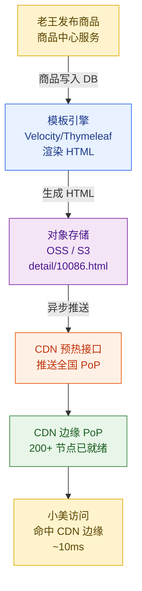

### 4.4.3 静态化时机

| 时机 | 触发条件 | 范围 | 说明 |
|------|---------|------|------|
| 发布时 | 商品上架 | 单个 SKU | 实时性最强 |
| 改价时 | 价格变更 | 单个 SKU | 价格是详情页核心 |
| 大促前 | T-24h | Top 1 万 SKU | 集中预热 |
| 定时刷新 | 每 6 小时 | 全量在售商品 | 兜底 |

**注意**：静态化的 HTML 是"骨架"，**推荐位、价格券、库存状态**等动态数据用 Ajax 异步加载，避免一次失败影响整页。

---

## 4.5 热点商品：单独机房隔离 + 多副本缓存

老王发布了一款 99 元 T 恤，运营推上首页，**5 分钟内涌入 50 万 UV**。普通的缓存架构会被打爆，必须有热点防护。

### 4.5.1 热点探测

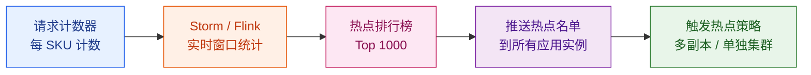

**探测算法**：
- 每秒滑动窗口（1 分钟窗口）
- 单 SKU QPS > 1000 → 标记为热点
- 持续 30 秒 → 推送到所有应用实例

### 4.5.2 热点应对四件套

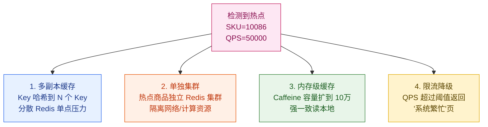

**多副本缓存的代码实现**：

```java
/**
 * 热点商品多副本缓存
 * 把单个 Key 的压力分散到 N 个副本 Key，水平扩展 Redis 抗写能力
 */
public class HotspotCacheService {

    private static final int REPLICA_COUNT = 8;   // 8 个副本

    public byte[] readHotspot(long skuId) {
        // 读：随机选一个副本读
        int replica = ThreadLocalRandom.current().nextInt(REPLICA_COUNT);
        String key = "hotspot:detail:" + skuId + ":r" + replica;
        return redisTemplate.opsForValue().get(key);
    }

    public void writeHotspot(long skuId, byte[] data) {
        // 写：写入所有副本
        for (int i = 0; i < REPLICA_COUNT; i++) {
            String key = "hotspot:detail:" + skuId + ":r" + i;
            redisTemplate.opsForValue().set(key, data, Duration.ofMinutes(10));
        }
    }
}
```

**为什么 N=8？** Redis 单分片 QPS 上限约 8–10 万。8 个副本 = 64 万 QPS，覆盖绝大多数爆款场景。

---

## 4.6 缓存三大问题：穿透、击穿、雪崩

缓存三大问题是**所有缓存架构必须回答的考题**。新手和老手的差距就在这里。

### 4.6.1 对比总览

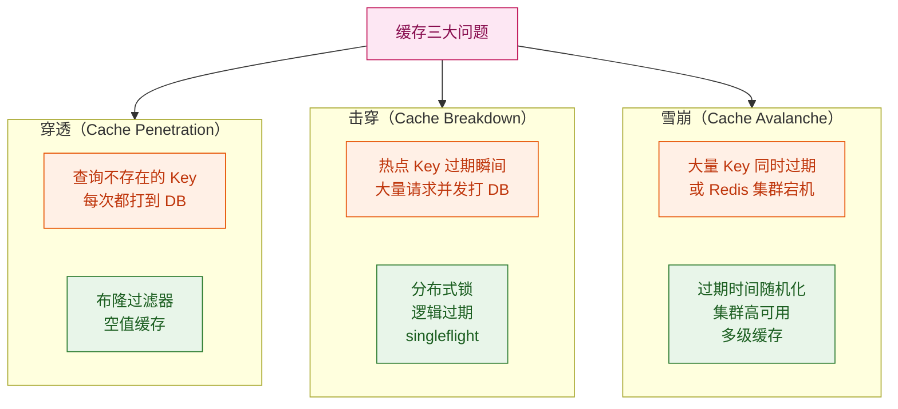

### 4.6.2 穿透：布隆过滤器

**场景**：黑客用脚本循环请求 `detail?id=999999999`（不存在的 SKU），绕过缓存直打 DB。

**解法 1：布隆过滤器**

```java
/**
 * 布隆过滤器：判断 SKU 是否存在
 * 原理：位数组 + K 个哈希函数
 * 优点：内存极省（5 亿 SKU 只需 700 MB），判断 O(K)
 * 缺点：有误判率（1%），不存在一定不存在，存在可能不存在
 */
@Component
public class SkuBloomFilter {

    // 5 亿 SKU，1% 误判率
    private final BloomFilter<Long> filter = BloomFilter.create(
        Funnels.longFunnel(),
        500_000_000L,   // 预计元素数
        0.01            // 误判率 1%
    );

    @PostConstruct
    public void init() {
        // 启动时全量加载 SKU ID 到过滤器
        skuRepository.scanAllIds().forEach(filter::put);
    }

    public boolean mightExist(long skuId) {
        return filter.mightContain(skuId);
    }
}
```

**解法 2：空值缓存**：DB 查不到时，缓存一个 `null` 值，TTL 短（如 1 分钟），防止同一 Key 反复打 DB。

### 4.6.3 击穿：SingleFlight 模式

**场景**：戴森吹风机详情页缓存过期，**瞬间 5 万请求并发打到 DB**。

**SingleFlight 模式（Go 经典模式，Java 移植版）**：同一个 Key 在第一个请求回源时，后续请求**等待并复用**这次回源的结果，而不是各自去打 DB。

```java
/**
 * SingleFlight 模式：击穿防护
 * 核心思想：同一 Key 的回源请求合并为 1 次
 * 借鉴 Go sync.singleflight 包的设计
 */
public class SingleFlightCacheLoader {

    // 正在回源的 Key 和等待线程
    private final ConcurrentHashMap<String, CompletableFuture<byte[]>> inflight = new ConcurrentHashMap<>();

    private final RedisTemplate<String, byte[]> redis;
    private final SkuRepository skuRepository;

    /**
     * 加载详情数据，自动合并并发回源请求
     */
    public byte[] load(long skuId) {
        String key = "detail:" + skuId;

        // 先查缓存
        byte[] cached = redis.opsForValue().get(key);
        if (cached != null) return cached;

        // 缓存未命中，尝试加入"回源航班"
        CompletableFuture<byte[]> myFlight = new CompletableFuture<>();
        CompletableFuture<byte[]> existing = inflight.putIfAbsent(key, myFlight);

        if (existing != null) {
            // 已经有其他请求在回源了，等待其结果（不重复打 DB）
            Metrics.counter("cache.singleflight.shared").increment();
            try {
                return existing.get(5, TimeUnit.SECONDS);
            } catch (TimeoutException e) {
                // 等不到结果，降级：自己打 DB
                return loadFromDb(skuId);
            }
        }

        // 我是第一个回源的，执行回源
        try {
            byte[] result = loadFromDb(skuId);
            // 写入缓存
            if (result != null) {
                redis.opsForValue().set(key, result, Duration.ofMinutes(30));
            } else {
                // 空值缓存（防穿透）
                redis.opsForValue().set(key, EMPTY_BYTES, Duration.ofMinutes(1));
            }
            // 通知所有等待者
            myFlight.complete(result);
            return result;
        } catch (Exception e) {
            myFlight.completeExceptionally(e);
            throw new RuntimeException("Load detail failed for sku=" + skuId, e);
        } finally {
            inflight.remove(key);
        }
    }

    private byte[] loadFromDb(long skuId) {
        return skuRepository.findDetailBytes(skuId);
    }
}
```

**效果**：5 万并发请求只有 1 次打到 DB，DB QPS 从 5 万降到 1。

**其他击穿方案**：
- **分布式锁**（Redis SETNX）：类似 singleflight，但实现更重
- **逻辑过期**：缓存不过期，只在数据里加 `expire_at` 字段，后台异步刷新
- **永不过期 + 后台刷新**：物理不设 TTL，启动定时任务刷新

### 4.6.4 雪崩：过期时间随机化

**场景**：5000 个商品详情页缓存都在 0:00 过期，0:00 瞬间 5000 个请求同时打 DB。

**解法**：

```java
// 过期时间随机化：在基础 TTL 上加减 0–300 秒
int baseTtl = 1800;  // 30 分钟
int jitter = ThreadLocalRandom.current().nextInt(300);
int realTtl = baseTtl + jitter;
redis.opsForValue().set(key, value, Duration.ofSeconds(realTtl));
```

**多级缓存兜底**：即使 Redis 集群全部宕机，本地 Caffeine 仍然能撑 10 分钟，CDN 还能撑 5 分钟——**5 级缓存提供了多层防御**。

---

## 4.7 缓存一致性：Cache Aside 与延迟双删

老王改了商品价格，**缓存和 DB 怎么保证一致**？这是分布式系统的经典难题。

### 4.7.1 Cache Aside 模式（最常用）

**读**：先读缓存，miss 则读 DB，回填缓存。
**写**：先更新 DB，**再删除缓存**（不是更新缓存）。

```java
// 写操作伪代码
public void updatePrice(long skuId, long newPrice) {
    // 1. 更新 DB
    int affected = skuRepository.updatePrice(skuId, newPrice);
    if (affected > 0) {
        // 2. 删除缓存（不是更新！）
        redis.delete("detail:" + skuId);
        l4Cache.invalidate("detail:" + skuId);
    }
}
```

**为什么删而不是更新？**——更新有"并发写覆盖"问题：A 写完 DB 准备更新缓存，B 也写完 DB 更新了缓存，B 的值更新但时间更早，导致 A 的新值被 B 的旧值覆盖。**删除则无此问题，下次读时回填一定是最新值**。

### 4.7.2 延迟双删（应对读写并发）

**问题**：A 写 DB → A 删缓存 → B 读缓存（miss）→ B 读 DB（旧值）→ B 回填旧值到缓存。**缓存被旧值污染**。

**解法**：延迟双删——A 写完 DB 后，**先删一次缓存，等 500ms 再删一次**。

```java
public void updatePriceWithDoubleDelete(long skuId, long newPrice) {
    skuRepository.updatePrice(skuId, newPrice);

    // 第一次删
    redis.delete("detail:" + skuId);

    // 延迟 500ms 后再删（异步）
    scheduler.schedule(() -> {
        redis.delete("detail:" + skuId);
    }, 500, TimeUnit.MILLISECONDS);
}
```

**500ms 经验值**：覆盖大多数并发读取的窗口。

### 4.7.3 三种模式对比

| 模式 | 一致性 | 性能 | 复杂度 | 适用场景 |
|------|--------|------|--------|---------|
| **Cache Aside** | 最终一致 | 高 | 低 | 90% 场景（推荐） |
| **Write Through** | 强一致 | 中 | 中 | 读写比 1:1 |
| **Write Behind** | 弱一致 | 极高 | 高 | 写多读少（评论计数） |
| **延迟双删** | 最终一致（更好） | 中 | 中 | 读写并发冲突多 |

### 4.7.4 基于 Binlog/Canal 的失效广播

更优雅的方案：**监听 DB 的 Binlog，自动失效缓存**。

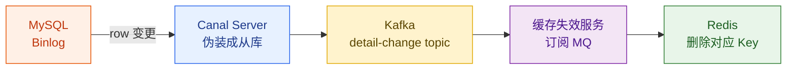

**优点**：业务代码无侵入，**所有写操作天然带动缓存失效**，延迟通常 < 1 秒。

---

## 4.8 AB 测试与灰度发布

详情页改版（换版式、调算法）如何安全上线？答案是**AB 测试 + 灰度发布**。

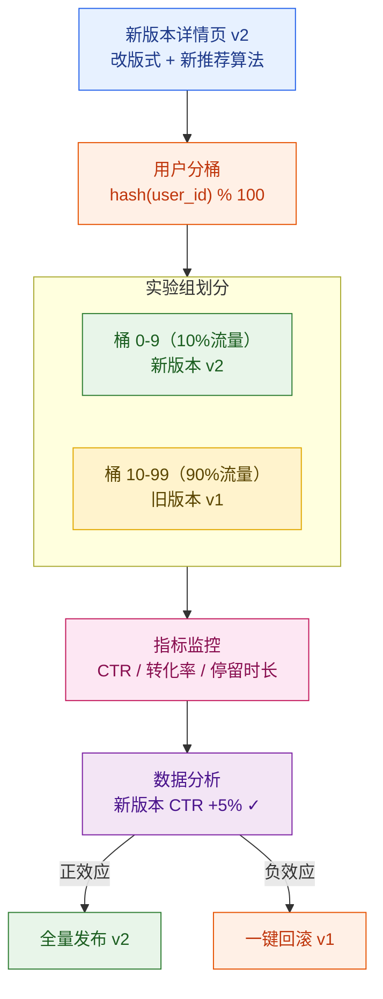

**关键技术**：
- **同用户稳定分桶**：同一用户始终看到同一版本，体验一致
- **多层正交**：UI 层、推荐层、文案层可同时做不同实验
- **强反转能力**：发现异常可一键回滚，秒级生效

---

## 4.9 端到端案例：小美访问「口红 999」详情页的 200ms

把本章所有机制串联，回到小美的视角。她在上海联通 4G 网络下点开「极购口红 999 色号」详情页。

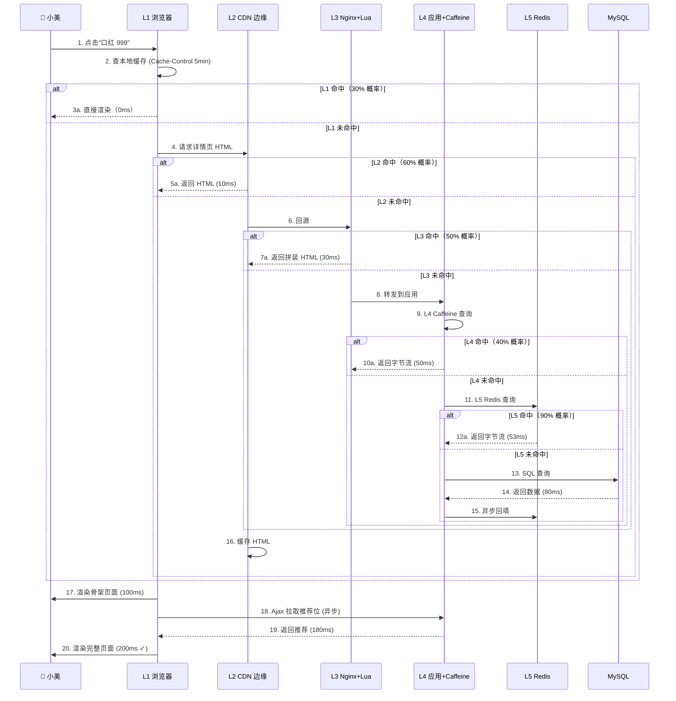

**时间线**（小美实际感知）：

| 时刻 | 事件 | 累计耗时 |
|------|------|---------|
| T+0 ms | 小美点击 | — |
| T+10 ms | L1 miss → L2 命中（假设）| 10 ms |
| T+50 ms | HTML 骨架到达浏览器 | 50 ms |
| T+100 ms | 浏览器开始渲染 | 100 ms |
| T+180 ms | Ajax 推荐位返回 | 180 ms |
| T+200 ms | 完整页面渲染完毕 | **200 ms ✓** |

**关键优化点**：
1. **5 级缓存分层命中**：每级拦截 30%–90% 的流量，最终只有 0.5% 打到 DB
2. **动静分离**：骨架 HTML 100ms 到达，推荐位异步补齐
3. **CDN 边缘预热**：小美访问的边缘 PoP 早已缓存好这个 SKU
4. **字节流缓存**：避免 Java GC 压力
5. **SingleFlight**：即使 L5 miss，并发回源也被合并

---

## 本章小结

| 核心机制 | 关键结论 | 工程价值 |
|---------|---------|---------|
| **5 级缓存** | 浏览器 → CDN → Nginx → Caffeine → Redis → DB | 综合命中率 99.65%，DB QPS 从 100 万降到 3500 |
| **静态化** | 5/6 数据 HTML 预生成推 CDN，1/6 数据 Ajax 异步 | CDN 边缘 10ms 返回，性能提升 10× |
| **热点防护** | 多副本 + 单独集群 + 内存级缓存 + 限流 | 支撑单品 50 万 QPS |
| **穿透** | 布隆过滤器 + 空值缓存 | 防恶意刷不存在 Key |
| **击穿** | SingleFlight 模式（请求合并）| 5 万并发回源降到 1 |
| **雪崩** | 过期时间随机化 + 多级兜底 | 防止同一时刻大量 Key 失效 |
| **一致性** | Cache Aside + 延迟双删 + Canal 失效广播 | 最终一致延迟 < 1s |
| **AB 灰度** | 用户分桶 + 多层正交 | 新版本安全上线 |

**三个最易踩的坑**：
1. **缓存击穿没防护**：热点商品一过期，DB 直接打挂——必须 singleflight 或永不过期
2. **缓存更新顺序错**：先更新缓存再更新 DB，并发读会回填旧值——必须先 DB 后缓存
3. **静态化不带个性化**：登录态、价格券错位——必须动静分离，推荐位异步加载

---

下一章：[第 5 章 · 购物车系统](./05-购物车系统.md)

---

## 参考来源

1. **Caffeine Cache 官方文档**  
   https://github.com/ben-manes/caffeine  
   Java 高性能本地缓存库，支持 LRU/LFU/TTL 等淘汰策略

2. **Go singleflight 模式**  
   https://pkg.go.dev/golang.org/x/sync/singleflight  
   SingleFlight 模式的原始实现，本文 Java 移植版借鉴

3. **阿里 Canal — MySQL Binlog 增量订阅**  
   https://github.com/alibaba/canal  
   监听 MySQL Binlog 实现缓存失效广播

4. **OpenResty 官方文档**  
   https://openresty.org/en/  
   Nginx + Lua 边缘计算，淘宝/京东详情页常用方案

5. **Redis Cluster 教程**  
   https://redis.io/docs/operate/oss_and_stack/reference/cluster-spec/  
   Redis 分布式集群规范，多副本、哈希槽、故障转移

6. **布隆过滤器原理**  
   Bloom, B. H. (1970). *Space/time trade-offs in hash coding with allowable errors*. Communications of the ACM.  
   缓存穿透防护的理论基础

7. **淘宝商品详情页架构演进**  
   https://developer.aliyun.com/article/6083  
   淘宝 TFS + Tair + CDN 多级缓存方案参考

8. **京东商品详情页多级缓存实践**  
   https://www.jianshu.com/p/9d9c2d2c79b3  
   京东亿级详情页流量下的缓存架构演进

9. **大型网站技术架构：核心原理与案例分析**  
   李智慧 著，电子工业出版社，2013  
   多级缓存、读写分离、CDN 加速的经典教材

10. **Designing Data-Intensive Applications（数据密集型应用系统设计）**  
    Martin Kleppmann 著，2017  
    缓存一致性、分布式系统的权威参考
