# 第 5 章 · 购物车系统

> **所属系列**：商城平台系统设计 · 全景教程
>
> **上一章**：[第 4 章 · 商品详情页与多级缓存](./04-商品详情页与多级缓存.md)　|　**下一章**：[第 6 章 · 订单系统](./06-订单系统.md)　|　**总目录**：[教程大纲](./00-教程大纲.md)

---

## 本章导读

详情页（第 4 章）解决的是"看"的问题，从本章开始进入「交易域」——解决"买"的问题。购物车（Shopping Cart）是用户从「看商品」到「下订单」之间的**收藏夹 + 凑单器 + 比价器**，它看似简单（"不就是个列表吗？"），实际上是商城后端最被低估的一个模块：

- 它的写 QPS 巨大（极购商城峰值 50 万 QPS），是详情页之外最热的写入接口。
- 它需要**实时**反映商品的价格、库存、上下架状态——这意味着每一次刷新都要回源多个上游系统。
- 它必须做到**跨设备同步**：用户在 PC 加车的口红，打开 H5、小程序、APP 时必须看到同样的购物车。
- 它需要在**未登录态**也能用，登录后再把游客购物车合并进登录购物车。

本章按以下结构展开：

1. 购物车的产品形态：入口、列表、下单的关系
2. 核心业务诉求：跨设备、跨店铺、实时价格库存、失效清理
3. 数据模型：购物车条目、店铺分组
4. 未登录 vs 登录购物车：本地存储与登录合并
5. 存储选型：为什么用 Redis Hash + DB 异步落库
6. 价格计算：促销、券、运费的实时叠加
7. 加购限流与防护：防刷、SKU 上限、爆品限购
8. 购物车 → 订单的转化：失效校验与拆单
9. 数据同步与回源：价格、库存、上下架状态
10. 购物车与推荐：猜你喜欢、加车后看了又看
11. 贯穿案例：小美的 5 件加购全流程

读完本章你将能回答：为什么淘宝/京东的购物车要把"实时价格"这件事做得这么复杂？为什么购物车不能完全只放 Redis？为什么购物车的「失效」要做得这么"温柔"？

---

## 5.1 购物车的产品形态

### 5.1.1 三个入口、两层页面、一个出口

购物车在商城里同时承担三种角色，UI 上呈现为三个入口：

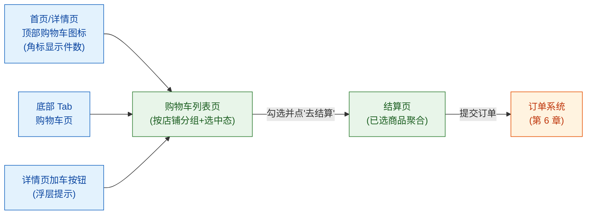

| 形态 | 用户行为 | 后端调用 |
|------|---------|---------|
| 顶部购物车图标 | 看一眼"几件了" | `GET /cart/count`（只取条目数，命中本地缓存） |
| 购物车列表页 | 查看、修改数量、勾选、删除 | `GET /cart/list` + `PUT /cart/item` + `DELETE /cart/item` |
| 结算页 | 选中商品后凑单去支付 | `POST /cart/checkout`（把选中条目快照传入订单系统） |

注意"结算页"虽然样式像是购物车的一部分，但它实际上已经属于**订单系统**——一旦进入结算页，价格被锁定、库存被预占（详见第 6、7 章）。**购物车和订单的边界，就在"去结算"按钮那一刻。**

### 5.1.2 为什么购物车要独立成一个系统

新人常问："购物车不就是订单的草稿状态吗？为什么不直接复用订单表？" 三个理由：

1. **生命周期不同**：订单一旦生成必须严格按状态机流转（第 6 章），而购物车条目可以来回增删 30 次都没关系。
2. **一致性要求不同**：订单的钱、券、库存必须强一致；购物车里看到的价格只需要"展示态最终一致"——刷新一下能更新就行。
3. **读写比不同**：购物车读写比约 5:1（大量"看一眼几件"），订单读写比约 50:1（一次创建多次查询）。两者放一起，缓存策略和分库分表策略都会打架。

所以购物车独立部署、独立存储、独立扩容，是几乎所有大厂的共识。

---

## 5.2 核心业务诉求

把"购物车"这件事拆解到工程层面，需要同时满足 5 条诉求：

| 诉求 | 含义 | 技术挑战 |
|------|------|---------|
| **跨设备同步** | 小美 PC 加车的口红，打开 APP 立刻能看到 | 服务端集中存储；多端订阅广播 |
| **跨店铺聚合** | 老王店里的 T 恤 + 别家店的口红，同一个购物车 | 按 merchant_id 分组渲染；跨店凑单 |
| **实时价格** | 营销改价 1 秒后用户刷新就应该看到新价格 | 价格不缓存到购物车，渲染时回源营销中心 |
| **实时库存** | 商品断货时显示"已售罄"而不是直接下单失败 | 订阅库存变更 MQ；展示态降级（只显示有/无货） |
| **失效清理** | 长期不下单的条目自动清空，不占存储 | 30 天 TTL；下架商品标记失效但不立刻删除 |

### 5.2.1 关键概念：状态分离

购物车里同一个 SKU 有 4 种"状态"，必须严格区分：

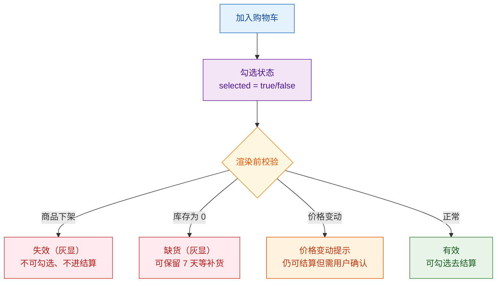

**为什么不直接删除失效条目**？因为用户可能只是临时缺货，过几天补货后还想买；强制删除会损失用户。所以购物车的失效是"软失效"——视觉上灰掉，但不删数据，给用户和运营留余地。

---

## 5.3 数据模型

### 5.3.1 购物车条目（Cart Item）

最小可用的数据模型只有 8 个字段：

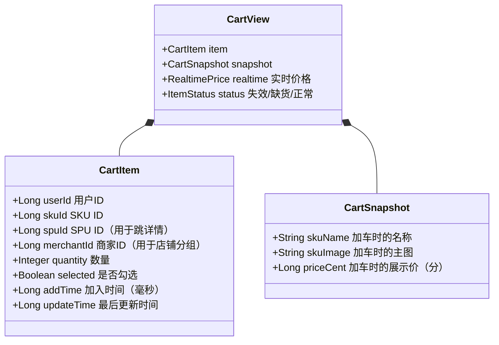

**两个关键设计**：

1. **快照字段（snapshot）只用于降级展示**：商品下架后名称、主图可能拿不到，用快照兜底保证页面不空。
2. **价格不持久化在购物车里**：购物车里**永远不能**存"加车时的价格"作为结算价，每次渲染都要回源营销中心。否则就会出现"用户上周加车 9.9，今天还是显示 9.9，下单时跳成 99"的严重投诉。

### 5.3.2 店铺分组

电商购物车都按店铺分组渲染。这不是 UI 决策，而是**业务决策**——优惠券是按店铺发放的、运费是按店铺计算的、订单也是按店铺拆单的（第 6 章）。

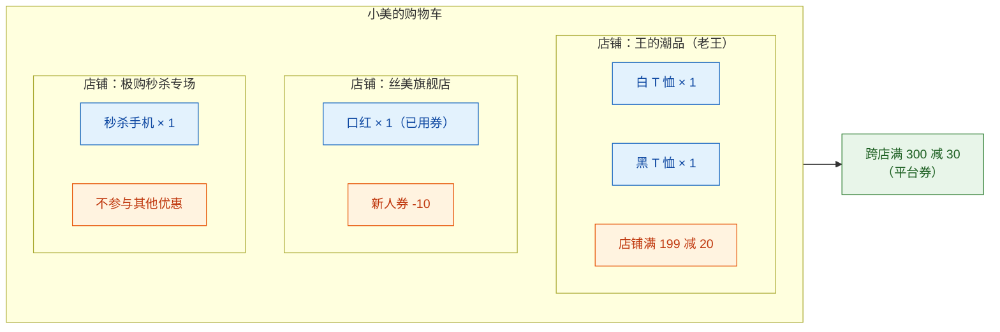

跨店优惠（如平台券、跨店满减）需要在所有店铺分组之上做"全局聚合层"。具体的价格计算在 5.6 节展开。

---

## 5.4 未登录 vs 登录购物车

### 5.4.1 两种购物车的存储位置

| 状态 | 存储位置 | 容量限制 | 跨端同步 | 加载方式 |
|------|---------|---------|---------|---------|
| 未登录 | 浏览器 LocalStorage / 小程序本地存储 / APP SQLite | 50 条 | 不同步 | 启动时本地读取 |
| 已登录 | 服务端 Redis + DB | 100 条 | 实时同步 | 登录后从服务端拉 |

**为什么未登录态不直接落到服务端**？两个原因：

1. **没有 user_id 怎么标识**：用 device_id 或 cookie 唯一标识需要打通设备 ID 体系，成本高。
2. **写入量太大**：未登录用户的加车意图比已登录用户随意得多，全部落服务端会拉爆 Redis。

业界标准做法：未登录用户的购物车数据完全保存在客户端，只有用户登录的那一刻，再触发一次"合并"操作。

### 5.4.2 登录合并策略

合并的本质是把客户端的临时购物车"upsert"到服务端：

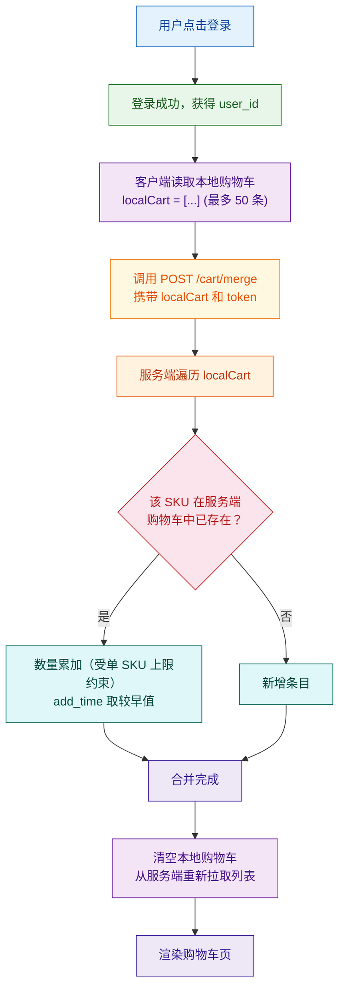

**几个容易踩的坑**：

- **合并必须幂等**：网络抖动可能让客户端重试两次合并，必须保证两次结果一致。做法是在请求里带一个 `mergeNonce`，服务端缓存 5 分钟去重。
- **数量累加要封顶**：本地有 5 件、服务端有 8 件，合并后应该是 13 件还是 max(5, 8) = 8 件？业界主流是**累加但封顶**——累加到 13 件，但超过单 SKU 上限（如 200）则截断。
- **合并失败要回滚**：如果服务端写入失败，本地数据**不能清空**，否则用户数据丢失。

合并的 Java 代码见 5.5.3 节。

---

## 5.5 存储选型

### 5.5.1 为什么选 Redis Hash

购物车的访问模式有 4 个特征：

1. **按 user_id 整体读写**：极少跨用户查询。
2. **写多但小**：一次只动一条（增/删/改某个 SKU 的数量或勾选态）。
3. **读多更小**：顶部图标只要件数，列表页一次性返回所有条目。
4. **延迟敏感**：用户点"+"必须 200ms 内响应。

把这 4 个特征往 Redis 数据结构上对，**Hash** 是最自然的选择：

```
Key:   cart:user:{user_id}
Field: {sku_id}
Value: {"qty": 1, "selected": true, "addTime": 1717564800000, "merchantId": 88}
```

| 数据结构 | 优点 | 缺点 | 结论 |
|---------|------|------|------|
| String（JSON 整存） | 简单 | 改一条要重写整个 JSON | 不选 |
| List | 有序 | 修改某个条目需要遍历 | 不选 |
| **Hash** | 按 SKU 局部更新；HLEN 直接拿件数 | 不支持原生 TTL 字段 | **选** |
| ZSet（按 addTime 排序） | 自带排序 | 查询单条要走 ZRANGEBYSCORE | 备选 |

容量估算（极购商城）：

```
1500 万 DAU × 5 条平均 = 7500 万条目
每条 ≈ 100 字节（field + value）
裸数据 ≈ 7.5 GB
加上 Redis 内部开销 × 3 ≈ 22 GB
单分片 8 GB → 需 4 分片 Cluster
```

### 5.5.2 持久化：Redis + DB 双写

**只放 Redis 不行**：Redis 主从切换或大故障时购物车数据可能丢失，用户怨气极大。  
**只放 DB 不行**：50 万 QPS 的读写直接打 MySQL 必挂。

业界标准做法是"Redis 为主，DB 为副"：

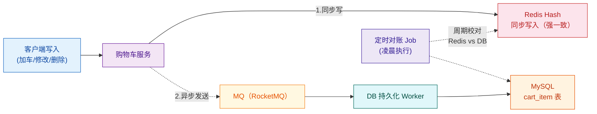

DB 表结构（用于持久化、对账、运营查询）：

```sql
CREATE TABLE cart_item (
    id          BIGINT       UNSIGNED NOT NULL AUTO_INCREMENT COMMENT '主键',
    user_id     BIGINT       UNSIGNED NOT NULL COMMENT '用户ID（分库分表键）',
    sku_id      BIGINT       UNSIGNED NOT NULL COMMENT 'SKU ID',
    spu_id      BIGINT       UNSIGNED NOT NULL COMMENT 'SPU ID',
    merchant_id BIGINT       UNSIGNED NOT NULL COMMENT '商家ID',
    quantity    INT          UNSIGNED NOT NULL DEFAULT 1 COMMENT '数量',
    selected    TINYINT(1)   NOT NULL DEFAULT 1 COMMENT '是否勾选 0/1',
    sku_name    VARCHAR(255) NOT NULL DEFAULT '' COMMENT '加车时名称（快照）',
    sku_image   VARCHAR(512) NOT NULL DEFAULT '' COMMENT '加车时主图URL',
    add_price   BIGINT       NOT NULL DEFAULT 0 COMMENT '加车时展示价(分)',
    add_time    DATETIME(3)  NOT NULL COMMENT '加入时间',
    update_time DATETIME(3)  NOT NULL DEFAULT CURRENT_TIMESTAMP(3) ON UPDATE CURRENT_TIMESTAMP(3),
    is_deleted  TINYINT(1)   NOT NULL DEFAULT 0 COMMENT '软删除标记',
    PRIMARY KEY (id),
    UNIQUE KEY uk_user_sku (user_id, sku_id),
    KEY idx_user_update (user_id, update_time),
    KEY idx_merchant (merchant_id)
) ENGINE=InnoDB DEFAULT CHARSET=utf8mb4 COMMENT='购物车条目';

-- 分库分表：按 user_id 取模 16 库 × 16 表 = 256 张物理表
-- 例：user_id = 12345678 → db_5.cart_item_14
```

### 5.5.3 购物车 CRUD 代码（Redis Hash）

```java
import org.springframework.beans.factory.annotation.Autowired;
import org.springframework.data.redis.core.HashOperations;
import org.springframework.data.redis.core.StringRedisTemplate;
import org.springframework.stereotype.Service;
import com.fasterxml.jackson.databind.ObjectMapper;

import java.time.Duration;
import java.util.*;
import java.util.stream.Collectors;

/**
 * 购物车 Redis 操作服务
 *
 * 存储模型：
 *   Key:   cart:user:{user_id}
 *   Field: {sku_id}（字符串形式）
 *   Value: CartEntry 序列化后的 JSON
 *
 * TTL：30 天（每次操作刷新）
 */
@Service
public class CartRedisService {

    private static final String KEY_PREFIX = "cart:user:";
    private static final Duration TTL = Duration.ofDays(30);
    private static final int MAX_ITEMS_PER_USER = 100;       // 单用户条目上限
    private static final int MAX_QTY_PER_SKU = 200;          // 单 SKU 数量上限

    @Autowired
    private StringRedisTemplate redis;
    @Autowired
    private ObjectMapper json;

    /** 购物车条目 - Redis Value 结构 */
    public static class CartEntry {
        public long skuId;
        public long spuId;
        public long merchantId;
        public int quantity;
        public boolean selected;
        public long addTime;
        public long updateTime;

        public CartEntry() {}
        public CartEntry(long skuId, long spuId, long merchantId,
                         int qty, boolean sel, long now) {
            this.skuId = skuId;
            this.spuId = spuId;
            this.merchantId = merchantId;
            this.quantity = qty;
            this.selected = sel;
            this.addTime = now;
            this.updateTime = now;
        }
    }

    private String cartKey(long userId) { return KEY_PREFIX + userId; }

    /**
     * 加入购物车 / 数量累加
     * @return 加车后该 SKU 的最终数量
     */
    public int addItem(long userId, long skuId, long spuId, long merchantId, int delta) {
        if (delta <= 0) throw new IllegalArgumentException("delta must be positive");

        String key = cartKey(userId);
        HashOperations<String, String, String> ops = redis.opsForHash();
        String field = String.valueOf(skuId);

        // 1. 校验条目数上限（非加车场景可跳过）
        Long size = ops.size(key);
        String existing = ops.get(key, field);
        if (existing == null && size != null && size >= MAX_ITEMS_PER_USER) {
            throw new BizException("购物车最多 " + MAX_ITEMS_PER_USER + " 件商品");
        }

        // 2. 合并新旧数量
        long now = System.currentTimeMillis();
        CartEntry entry;
        try {
            if (existing != null) {
                entry = json.readValue(existing, CartEntry.class);
                entry.quantity = Math.min(entry.quantity + delta, MAX_QTY_PER_SKU);
                entry.updateTime = now;
            } else {
                entry = new CartEntry(skuId, spuId, merchantId,
                        Math.min(delta, MAX_QTY_PER_SKU), true, now);
            }
            ops.put(key, field, json.writeValueAsString(entry));
            redis.expire(key, TTL);  // 刷新整个 Key 的 TTL
        } catch (Exception e) {
            throw new BizException("加车失败", e);
        }

        // 3. 异步通知 DB 持久化（这里只示意）
        mqProducer.send("cart-persist", String.valueOf(userId));
        return entry.quantity;
    }

    /** 修改数量（覆盖式，绝对值） */
    public void updateQuantity(long userId, long skuId, int qty) {
        if (qty <= 0) { removeItem(userId, skuId); return; }
        if (qty > MAX_QTY_PER_SKU) qty = MAX_QTY_PER_SKU;

        String key = cartKey(userId);
        String field = String.valueOf(skuId);
        String raw = (String) redis.opsForHash().get(key, field);
        if (raw == null) throw new BizException("条目不存在");

        try {
            CartEntry entry = json.readValue(raw, CartEntry.class);
            entry.quantity = qty;
            entry.updateTime = System.currentTimeMillis();
            redis.opsForHash().put(key, field, json.writeValueAsString(entry));
            redis.expire(key, TTL);
        } catch (Exception e) {
            throw new BizException("更新失败", e);
        }
    }

    /** 删除条目 */
    public void removeItem(long userId, long skuId) {
        redis.opsForHash().delete(cartKey(userId), String.valueOf(skuId));
    }

    /** 拉取整个购物车，按 add_time 升序返回 */
    public List<CartEntry> listAll(long userId) {
        Map<Object, Object> raw = redis.opsForHash().entries(cartKey(userId));
        if (raw == null || raw.isEmpty()) return Collections.emptyList();
        return raw.values().stream()
                .map(v -> {
                    try { return json.readValue((String) v, CartEntry.class); }
                    catch (Exception e) { return null; }
                })
                .filter(Objects::nonNull)
                .sorted(Comparator.comparingLong(e -> e.addTime))
                .collect(Collectors.toList());
    }

    /** 顶部图标只取件数（注意是「条目数」还是「商品总数」由产品决定） */
    public long countItems(long userId) {
        Long n = redis.opsForHash().size(cartKey(userId));
        return n == null ? 0L : n;
    }

    @Autowired private MqProducer mqProducer; // 省略
}
```

### 5.5.4 登录合并代码

```java
import java.util.List;

@Service
public class CartMergeService {

    @Autowired private CartRedisService cartRedis;
    @Autowired private StringRedisTemplate redis;

    /** 客户端上传的本地购物车条目 */
    public static class LocalCartItem {
        public long skuId; public long spuId; public long merchantId;
        public int  quantity; public long addTime;
    }

    /**
     * 登录后合并：客户端本地条目 → 服务端
     *
     * 幂等性：通过 mergeNonce 去重，5 分钟内同一 nonce 只生效一次
     * 失败安全：任意一条失败不影响其他条目，整体失败则保留客户端数据
     */
    public MergeResult merge(long userId, List<LocalCartItem> localItems, String mergeNonce) {
        // 1. 幂等检查：同一 nonce 不重复执行
        String nonceKey = "cart:merge:nonce:" + userId + ":" + mergeNonce;
        Boolean firstTime = redis.opsForValue().setIfAbsent(nonceKey, "1", Duration.ofMinutes(5));
        if (Boolean.FALSE.equals(firstTime)) {
            return MergeResult.alreadyMerged();
        }

        int success = 0, skipped = 0;
        for (LocalCartItem it : localItems) {
            try {
                // 2. 累加合并（CartRedisService.addItem 内部已做封顶处理）
                cartRedis.addItem(userId, it.skuId, it.spuId, it.merchantId, it.quantity);
                success++;
            } catch (BizException e) {
                // 单条失败（例如超出 100 条上限）：记录但继续
                skipped++;
                log.warn("merge skip skuId={} reason={}", it.skuId, e.getMessage());
            }
        }
        return new MergeResult(success, skipped);
    }

    public record MergeResult(int success, int skipped) {
        static MergeResult alreadyMerged() { return new MergeResult(0, 0); }
    }
}
```

---

## 5.6 价格计算

### 5.6.1 为什么购物车的价格"难算"

商品的标价（吊牌价）只是一个起点，到了购物车要叠加 4 层修正：

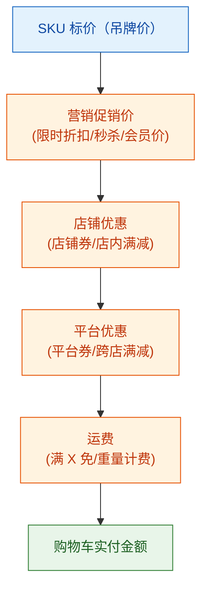

每一步都可能依赖外部系统（营销中心、券中心、运费模板服务），而且**任何一步的结果都不能缓存到购物车里**——因为价格随时可能因新活动而变动。

**通用原则**：购物车展示的价格 = 实时调营销中心算一次。营销中心负责把所有规则吃进去，吐出"这件 SKU 现在该卖多少钱"。

### 5.6.2 价格计算流程

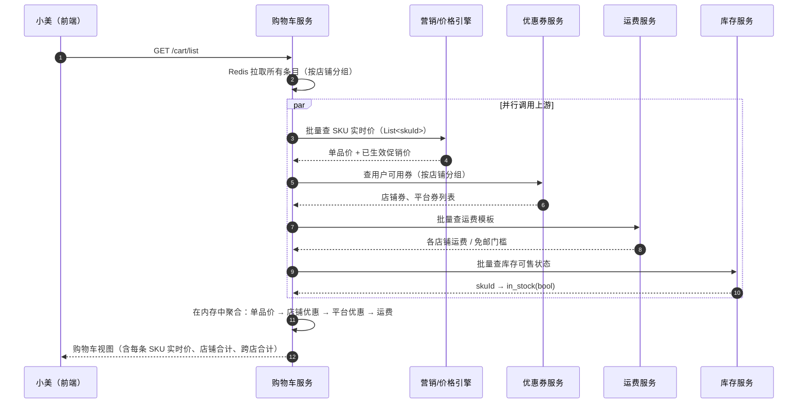

### 5.6.3 营销中心调用（示意代码）

```java
import com.alibaba.fastjson.JSON;
import org.springframework.cloud.openfeign.FeignClient;
import org.springframework.web.bind.annotation.*;

/**
 * 营销中心 RPC 接口（Feign）
 * 在第 8 章「营销中心与价格计算」中详细展开
 */
@FeignClient(name = "marketing-center", path = "/price")
public interface MarketingPriceClient {

    /**
     * 批量查询 SKU 实时价
     *
     * @param req 用户上下文 + SKU 列表
     * @return 每个 SKU 的：标价、促销价、命中的活动列表
     */
    @PostMapping("/realtime")
    BatchPriceResponse batchRealtimePrice(@RequestBody BatchPriceRequest req);
}

public class BatchPriceRequest {
    public long userId;
    public String userLevel;        // 会员等级影响会员价
    public String channel;          // APP/H5/小程序，活动可分渠道
    public List<Long> skuIds;
}

public class SkuPrice {
    public long skuId;
    public long listPriceCent;      // 标价（分）
    public long salePriceCent;      // 实时促销价（分），即购物车展示价
    public List<Long> hitActivityIds; // 命中的活动 ID
    public Map<String, String> tags;  // 例如 "秒杀中"、"满减专享"
}
```

聚合逻辑（在购物车服务内执行）：

```java
@Service
public class CartViewService {

    @Autowired private CartRedisService cartRedis;
    @Autowired private MarketingPriceClient priceClient;
    @Autowired private CouponClient couponClient;
    @Autowired private FreightClient freightClient;
    @Autowired private StockStatusClient stockClient;

    public CartView render(long userId, UserContext ctx) {
        // 1. 拉条目
        List<CartRedisService.CartEntry> items = cartRedis.listAll(userId);
        if (items.isEmpty()) return CartView.empty();

        List<Long> skuIds = items.stream().map(e -> e.skuId).toList();

        // 2. 并行 RPC（用 CompletableFuture 或响应式编程）
        var fPrice = CompletableFuture.supplyAsync(() ->
                priceClient.batchRealtimePrice(buildReq(userId, ctx, skuIds)));
        var fStock = CompletableFuture.supplyAsync(() ->
                stockClient.batchStatus(skuIds));
        var fCoupon = CompletableFuture.supplyAsync(() ->
                couponClient.listAvailable(userId, mergeIds(items)));
        var fFreight = CompletableFuture.supplyAsync(() ->
                freightClient.batchFreight(merchantIds(items)));

        CompletableFuture.allOf(fPrice, fStock, fCoupon, fFreight).join();

        // 3. 内存聚合
        return new CartViewBuilder()
                .withItems(items)
                .withPrices(fPrice.join())
                .withStocks(fStock.join())
                .withCoupons(fCoupon.join())
                .withFreight(fFreight.join())
                .groupByMerchant()      // 按店铺分组
                .applyShopPromotions()  // 应用店铺优惠
                .applyPlatformPromotions() // 应用平台优惠（跨店）
                .calcFreight()
                .build();
    }
}
```

### 5.6.4 小美购物车的实时计价示例

小美购物车里有 5 件商品，分布在 3 个店铺：

| 店铺 | 商品 | 数量 | 标价 | 促销价 | 备注 |
|------|------|------|------|--------|------|
| 王的潮品（老王）| 白 T 恤 | 1 | 129 | 99 | 限时折扣 |
| 王的潮品（老王）| 黑 T 恤 | 1 | 129 | 99 | 限时折扣 |
| 丝美旗舰店 | 口红 | 1 | 199 | 169 | + 用户领的 10 元店铺券 |
| 丝美旗舰店 | 唇膏 | 1 | 89 | 89 | 无促销 |
| 极购秒杀专场 | 秒杀手机 | 1 | 4999 | 3999 | 秒杀价（不参与其他优惠） |

计算过程：

```
店铺：王的潮品
  小计 = 99 + 99 = 198 元
  店铺满 199 减 20 → 198 < 199，未达门槛 → 不减
  店铺合计 = 198 元 + 运费 10 = 208 元

店铺：丝美旗舰店
  小计 = 169 + 89 = 258 元
  店铺券 -10（仅口红可用）→ 258 - 10 = 248 元
  店铺合计 = 248 元 + 运费 0（满 99 免） = 248 元

店铺：极购秒杀专场
  小计 = 3999 元（不参与其他优惠）
  店铺合计 = 3999 元 + 运费 0（秒杀免邮） = 3999 元

跨店总计 = 208 + 248 + 3999 = 4455 元
平台跨店满 300 减 30 → 应用 → 4455 - 30 = 4425 元
                    （注意：4425 的应付金额按比例分摊回每个店铺，用于退款时的对账，详见第 8 章）

购物车展示：合计 4425 元
```

注意 **"满 199 减 20" 显示一行"再加 1 元可享满减"提示**——这就是购物车的"凑单"价值，用户多加一件 T 恤就能省 20 元，是商家最爱看到的转化点。

---

## 5.7 加购限流与防护

加购接口是黑产眼里的"宝藏接口"——它**不需要登录**（部分场景）、**写入成本低**、**可用于囤秒杀名额**。所以必须从 3 个维度做防护：

| 防护维度 | 阈值（示意） | 实现方式 |
|---------|--------------|---------|
| 单用户加购频率 | 60 次 / 分钟 | Redis 滑动窗口 / Sentinel |
| 单 SKU 数量上限 | 200 件 | 在 `addItem` 内强校验 |
| 爆品限购 | 每用户最多 1 件 | 营销中心给出"限购数"，购物车侧二次校验 |
| 设备维度 | 单设备 200 次 / 小时 | 风控中心提供设备指纹（第 16 章） |
| IP 维度 | 单 IP 1000 次 / 小时 | Nginx 限流或网关层限流 |

**为什么单用户限频还不够**：黑产用脚本批量注册账号，单账号加购很慢，但 100 个账号合在一起就是几千 QPS。所以必须叠加设备和 IP 维度的限流，这部分通常由网关 + 风控合作完成（第 16、18 章）。

加购限频的 Redis 实现：

```java
@Component
public class CartRateLimiter {

    @Autowired private StringRedisTemplate redis;
    private static final int LIMIT_PER_MINUTE = 60;

    /** 滑动窗口限流（基于 Redis ZSet） */
    public boolean tryAcquire(long userId) {
        String key = "cart:rate:" + userId;
        long now = System.currentTimeMillis();
        long windowStart = now - 60_000;

        // 删除窗口外的历史请求记录
        redis.opsForZSet().removeRangeByScore(key, 0, windowStart);
        Long count = redis.opsForZSet().zCard(key);
        if (count != null && count >= LIMIT_PER_MINUTE) {
            return false; // 超过 60 次/分钟，拒绝
        }
        // 记录本次请求
        redis.opsForZSet().add(key, String.valueOf(now), now);
        redis.expire(key, Duration.ofSeconds(120));
        return true;
    }
}
```

---

## 5.8 购物车 → 订单的转化

### 5.8.1 转化流程

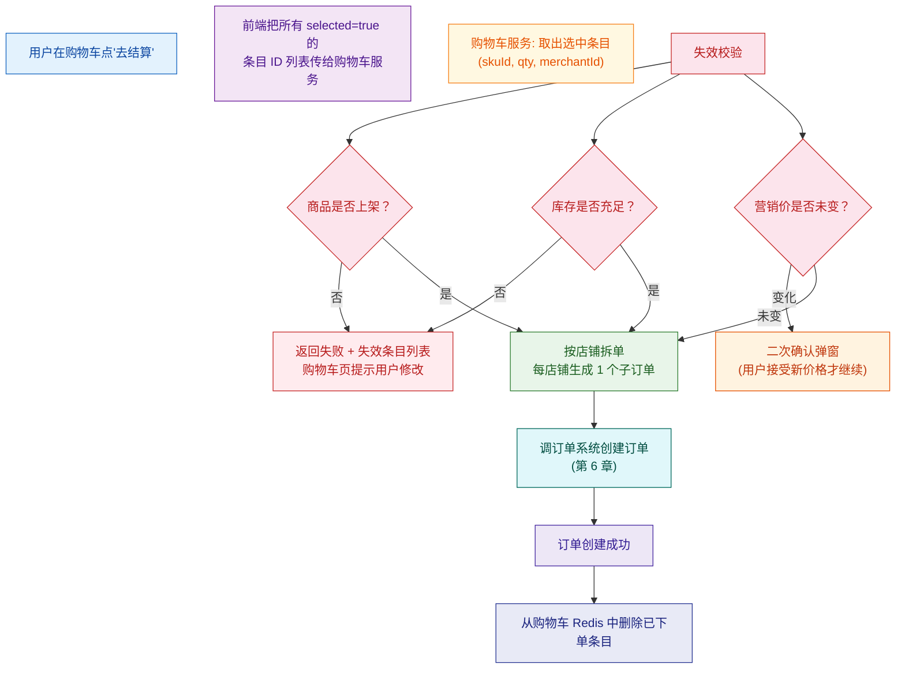

### 5.8.2 跨店铺拆单

电商订单的一个核心规则：**一个订单只能属于一个店铺**。原因是：

- 每个店铺有独立的运费、发货时间、售后政策。
- 财务结算按店铺维度执行。
- 物流面单按店铺维度生成。

所以购物车里 3 个店铺的商品，提交订单后会拆成 3 个独立子订单（通常会有一个"父订单号"用于聚合展示）。拆单的具体逻辑在订单系统（第 6 章）展开。

### 5.8.3 提交后是否清空购物车？

业界惯例：**只清空"成功创建订单"的条目，未支付时不清空**。

```
小美购物车有 5 件，选中 3 件提交订单：
  → 订单创建成功 → 从购物车删除这 3 件
  → 剩余 2 件继续保留
  → 即使后续小美没支付订单（订单取消），购物车里也不再恢复——
    因为这部分商品现在是"订单态"，可以在"未支付订单"列表里继续操作。
```

这个边界设计避免了"购物车和未支付订单"两份数据相互冲突。

---

## 5.9 数据同步与回源

购物车里每一条 SKU 都在"借用"上游系统的数据：

| 数据 | 来源系统 | 同步方式 | 频次 |
|------|---------|---------|------|
| 商品名称、主图 | 商品中心 | 异步回源 + 快照兜底 | 渲染时 |
| 实时价格、促销 | 营销中心 | 同步 RPC | 每次渲染 |
| 库存可售状态 | 库存系统 | MQ 订阅变更 + 兜底查询 | 实时 + 拉取 |
| 上下架状态 | 商品中心 | MQ 订阅 + 渲染时校验 | 实时 + 拉取 |
| 优惠券可用性 | 券中心 | 同步 RPC | 每次渲染 |

**关键架构原则：购物车不复制上游数据，只缓存"指针 + 快照"**。

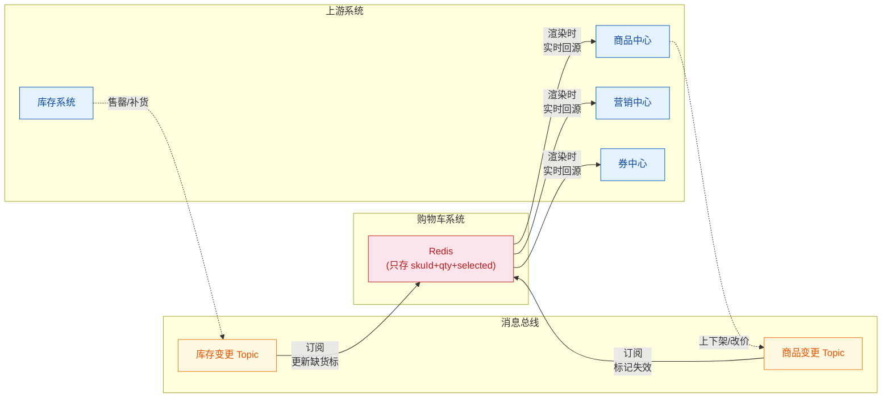

**MQ 订阅的作用是"提前打标"**：当库存系统发出"SKU=12345 售罄"事件时，购物车系统会把所有含该 SKU 的用户购物车里的对应条目打上"缺货"标。这样下次用户进购物车时，不需要等渲染时的同步回源，直接显示缺货状态——降低了上游系统压力。

**渲染时同步回源是"最后一公里"**：即使 MQ 消息丢失，用户进购物车时也会强制查一次上游，最终保证状态正确。

---

## 5.10 购物车与推荐

购物车不只是"暂存区"，更是**推荐系统的金矿**。它包含了用户最强的购买意图——比浏览历史精准得多。

### 5.10.1 购物车页的推荐位

| 推荐位 | 触发场景 | 算法侧重 | 商业价值 |
|--------|---------|---------|---------|
| 「猜你喜欢」（页面底部） | 用户在购物车闲逛 | I2I（购物车SKU相似商品） | 加购转化 |
| 「加车后看了又看」 | 加车成功的浮层 | 协同过滤 | 凑单 |
| 「店铺其他商品」 | 同店铺分组下方 | 店铺内热销 | 凑满减 |
| 「跨店凑单」 | 跨店满减差金额时 | 满减门槛筛选 | 提升订单额 |

### 5.10.2 凑单推荐的特殊性

当购物车显示"再加 1 元享满 199 减 20"时，推荐系统不能简单推热销品，而要做**精准凑单**：

```
约束：商品价格 ∈ [1, 50]（既能补够 199，又不太贵让用户放弃）
约束：与已加车商品同店铺
约束：未购买过的新 SKU 优先
约束：高 CTR + 高加车率
```

凑单推荐的命中率是购物车页推荐位中最高的（通常超过 15% 的加购率），是商家最愿意花钱投放的位置之一。

---

## 5.11 贯穿案例：小美的 5 件加购

让我们把本章所有知识串起来——跟着小美的一次完整加车流程：

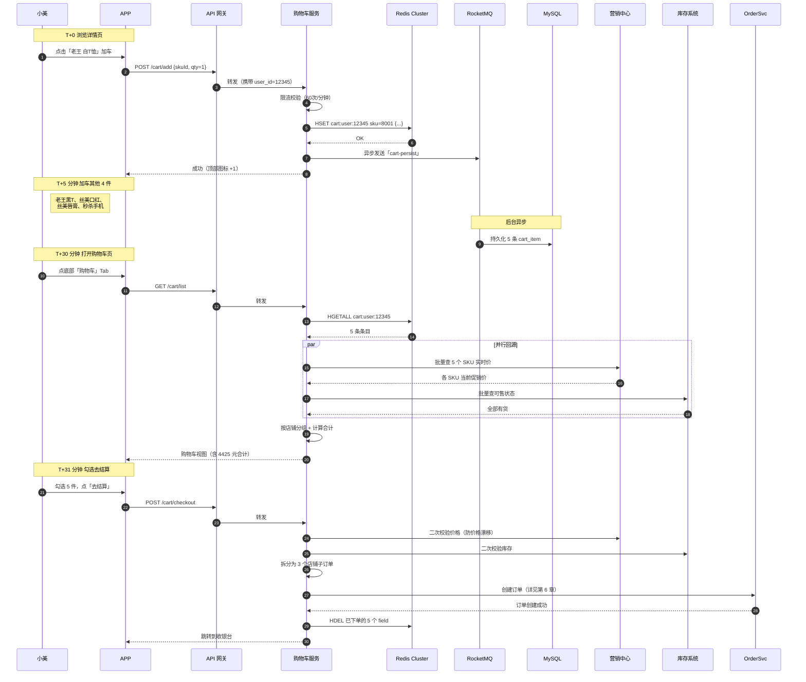

老王作为商家，关注的两个核心指标在这次流程里都得到了体现：

- **加购率（Add-to-Cart Rate）= 加购 UV / 详情页 UV**：详情页第 4 章的多级缓存把详情页打开速度做到了 50ms，这是加购率提升的前提。
- **弃购率（Cart Abandonment Rate）= (加购未下单数) / 加购数**：购物车的"实时凑单提示"、"跨店满减提示"、"价格变动温和提示"都是降低弃购率的关键武器。业界平均弃购率 70%，做到 50% 已属优秀。

---

## 本章小结

| 知识点 | 关键结论 |
|--------|---------|
| **产品形态** | 三个入口（顶部图标、底部 Tab、加车按钮）→ 一个列表页 → 一个结算页（已属订单系统）|
| **核心诉求** | 跨设备同步 + 跨店铺聚合 + 实时价格 + 实时库存 + 30 天失效清理 |
| **数据模型** | 8 字段最小条目 + 快照字段（仅降级用）；价格永远不缓存 |
| **未登录购物车** | 客户端 LocalStorage；登录时按"累加 + 封顶 + 幂等"合并 |
| **存储选型** | Redis Hash（按 user_id 整存）+ MQ 异步落 MySQL；按 user_id 分库分表 |
| **价格计算** | 单品价 → 店铺优惠 → 平台优惠 → 运费；实时调营销中心，购物车不缓存价格 |
| **限流防护** | 单用户频率 + 单 SKU 上限 + 爆品限购 + 设备/IP 维度 |
| **购物车→订单** | 失效校验 → 价格二次确认 → 按店铺拆单 → 成功后清理已下单条目 |
| **数据回源** | 上游变更走 MQ 打标，渲染时同步回源兜底 |
| **推荐结合** | 猜你喜欢 / 加车后看了又看 / 跨店凑单 |

**技能点自测**：

- [ ] 能否解释"为什么购物车里不能缓存价格"？
- [ ] 能否画出未登录购物车合并到登录购物车的流程？
- [ ] 能否说出 Redis Hash 相比 String/List 的优势？
- [ ] 能否设计一个加购的多维度限流方案？
- [ ] 能否在 30 秒内说清楚购物车 → 订单的转化中"失效校验"的 3 个检查点？

下一章预告：购物车的"去结算"按钮被点击之后，请求就交给了**订单系统**。订单系统是商城最复杂的状态机所在地——一个订单从「待支付」到「已完成」可能经历 20+ 种状态、5+ 种异常路径。第 6 章我们将深入订单的数据模型、状态机、订单号生成、分库分表与正向/逆向流程。

---

下一章：[第 6 章 · 订单系统](./06-订单系统.md)

---

## 参考来源

1. **阿里 1688 购物车系统优化实践** —— 1688 技术团队博客
   阿里巴巴中文站购物车从单体到 Redis Cluster 的演进
   https://developer.aliyun.com/article/

2. **京东购物车系统设计** —— 京东技术专题
   京东亿级购物车的存储与缓存设计
   https://tech.jd.com/

3. **美团外卖购物车设计** —— 美团技术团队
   购物车跨端同步、合并策略与高并发实践
   https://tech.meituan.com/

4. **Redis 官方文档：Hash 数据类型**
   https://redis.io/docs/data-types/hashes/

5. **Spring Data Redis 官方文档**
   https://docs.spring.io/spring-data/redis/reference/

6. **RocketMQ 事务消息官方指南** —— Apache RocketMQ
   购物车异步落库与最终一致性的消息机制
   https://rocketmq.apache.org/docs/featureBehavior/04transactionmessage

7. **《大型网站技术架构》—— 李智慧**
   电商系统中购物车的存储选型与并发设计

8. **Sharding-JDBC 官方文档** —— Apache ShardingSphere
   按 user_id 分库分表的实现
   https://shardingsphere.apache.org/document/current/cn/overview/

9. **淘宝购物车在双 11 的高并发实践** —— InfoQ 中文站
   购物车作为 50 万 QPS 写入接口的容量规划与降级方案
   https://www.infoq.cn/

10. **Baymard Institute: Cart Abandonment Rate Statistics**
    全球电商购物车弃购率统计与分析（2024 更新）
    https://baymard.com/lists/cart-abandonment-rate
