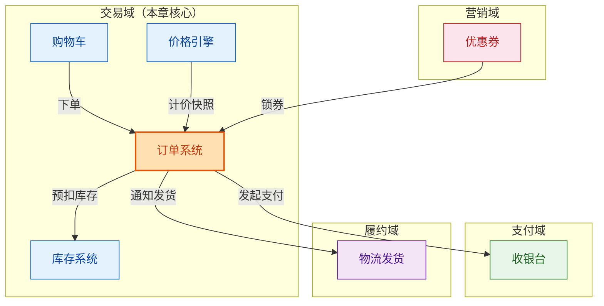
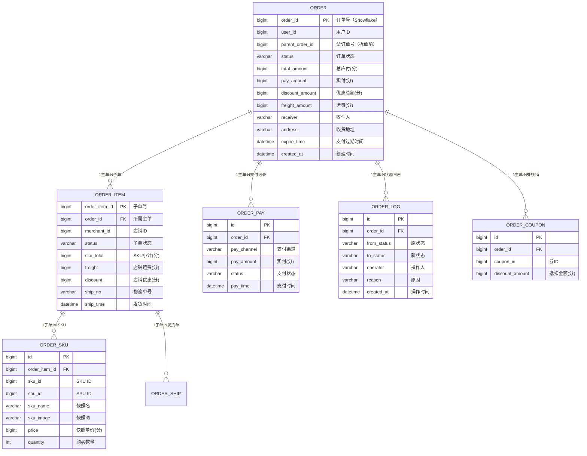
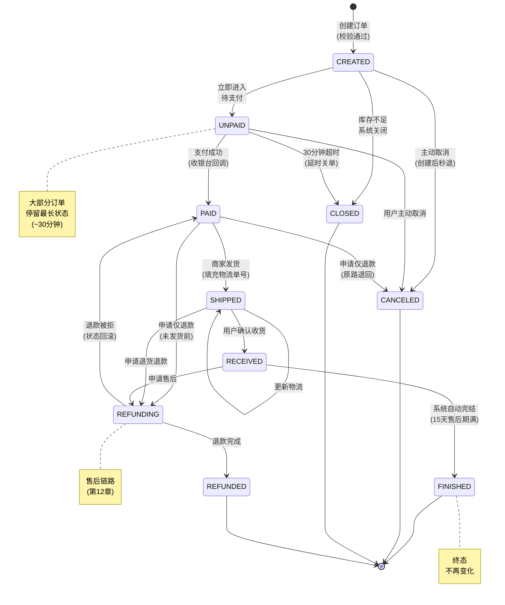
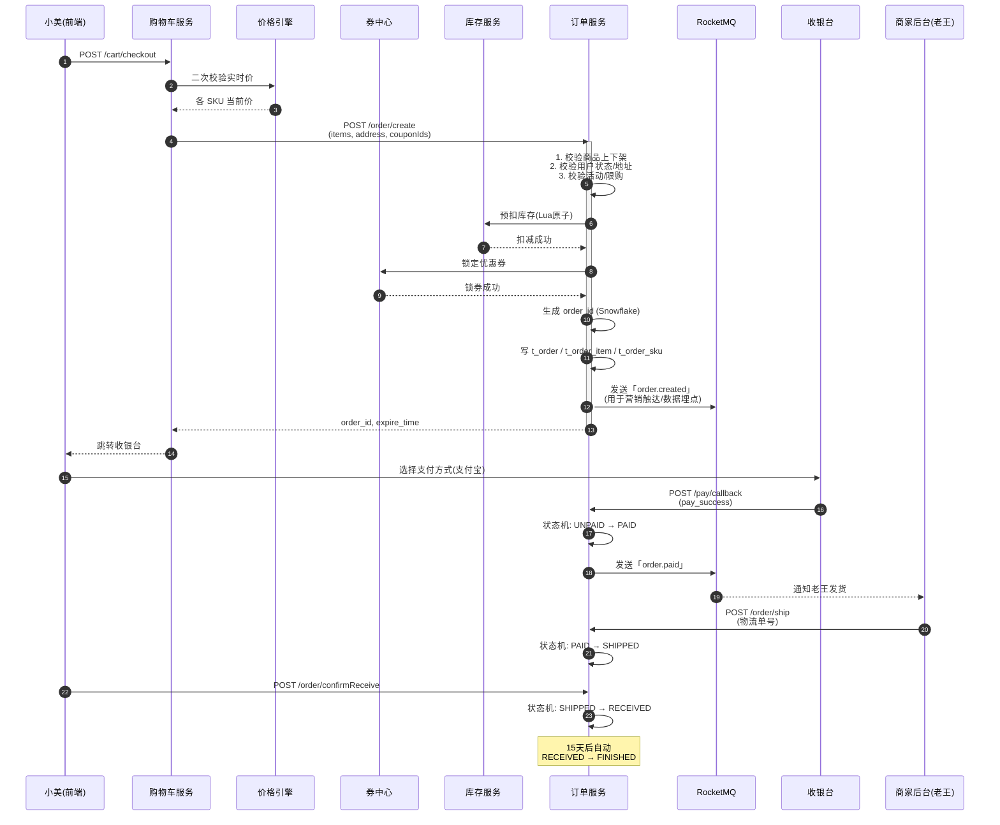
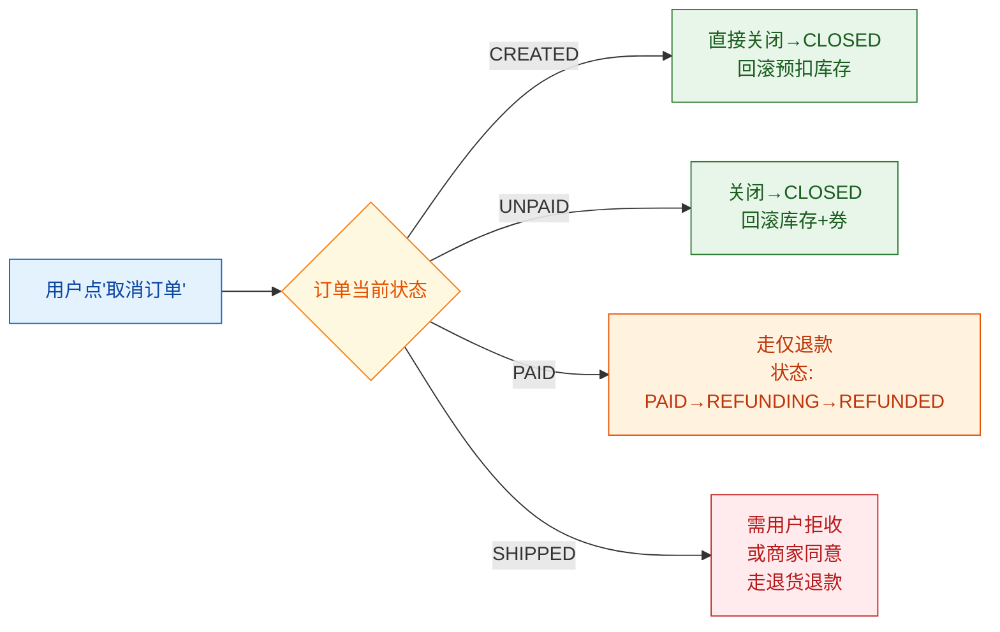
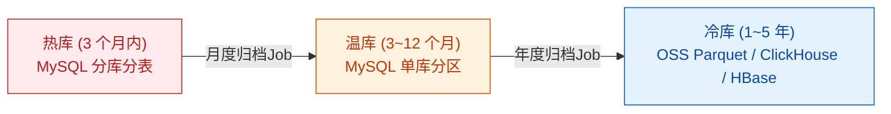
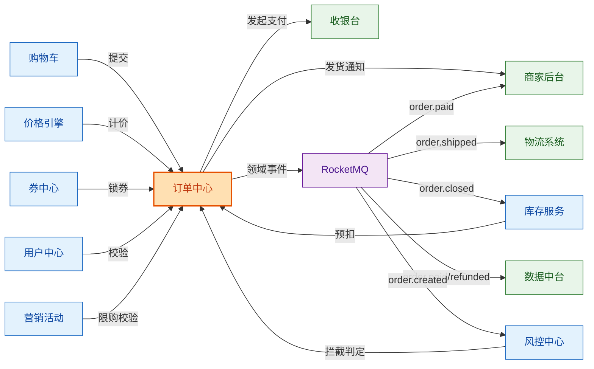
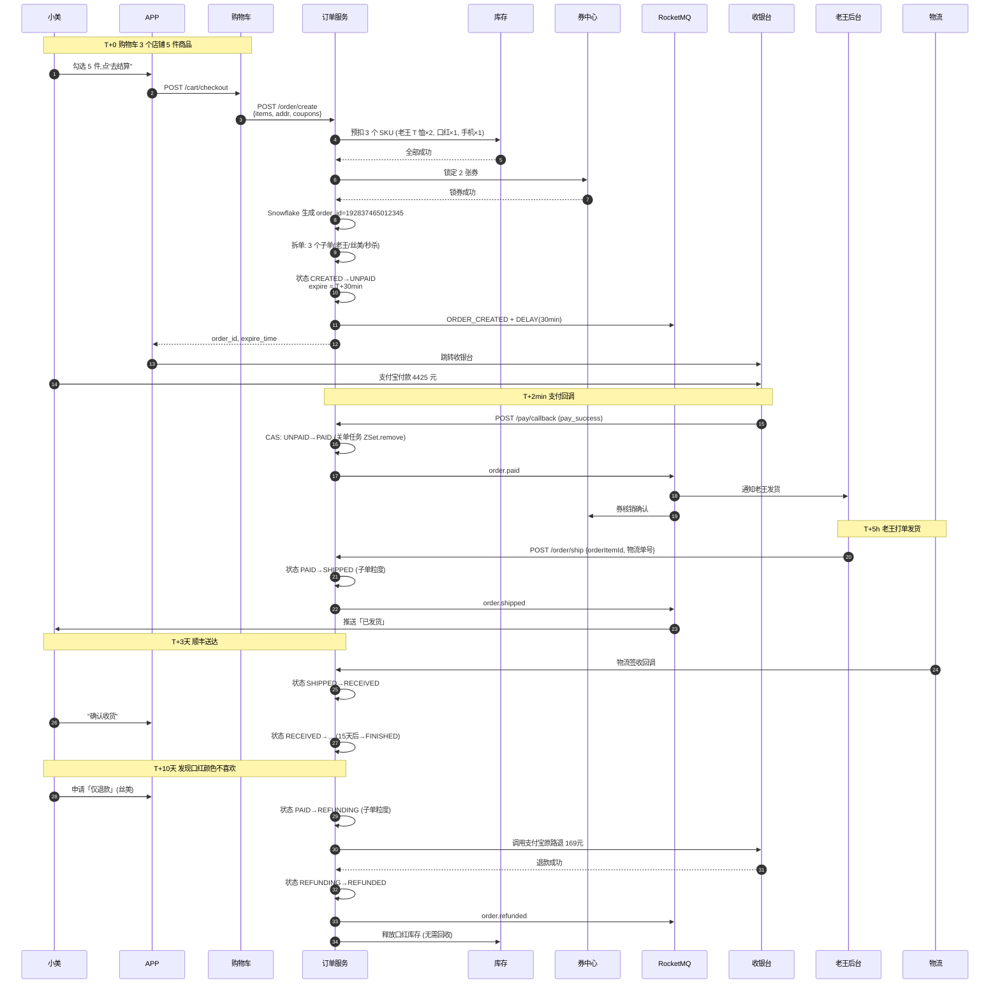

# 第 6 章 · 订单系统：状态机与生命周期

> **所属系列**：商城平台系统设计 · 全景教程
>
> **上一章**：[第 5 章 · 购物车系统](./05-购物车系统.md)　|　**下一章**：[第 7 章 · 库存系统](./07-库存系统.md)　|　**总目录**：[教程大纲](./00-教程大纲.md)

---

## 本章导读

上一章讲到，小美在购物车勾选了 3 件商品（老王的白 T 恤、丝美的口红、极购秒杀手机）点下「去结算」那一刻，请求就被甩给了一个新系统——**订单系统**。

如果说商品中心是商城的"骨架"、购物车是"购物袋"，那**订单就是交易的"灵魂"**。它是整个商城唯一同时贯穿**钱、货、券、票**四种资产的对象——一笔订单出错，钱可能少收、库存可能多扣、券可能白送、发票可能开错，每一类都是事故。

为什么说订单系统是商城最复杂的状态机所在地？一组数据直观感受一下极购商城的状态量级：

```
日均订单：       800 万
大促峰值：       2000 万/日
订单状态种类：   10+ 种
状态转移路径：   30+ 条
订单生命周期：   最短 1 分钟（秒杀秒退），最长 60 天（仅退款售后）
每笔订单关联：   1~3 个子单、1~5 张券、1~N 个优惠分摊明细
```

这一章我们围绕以下问题展开：

1. **订单的域模型**：Order 主单、OrderItem 子单、订单状态机
2. **正向订单全流程**：从购物车提交到「已完成」的每一步
3. **逆向订单流程**：取消、退款、换货的状态变迁
4. **状态机设计**：状态枚举、转移图、代码驱动
5. **订单号生成**：Snowflake、美团 Leaf 段模式
6. **分库分表**：按 user_id / order_id 散列、ShardingSphere 实战
7. **超时关单**：延时队列与状态机一致性
8. **查询优化**：多端查询、ES 宽表、Redis 缓存
9. **订单中心上下游**：与购物车、库存、营销、支付的协作
10. **大促限流与压测**

读完本章你将能回答：为什么订单系统一定要做状态机而不是 if-else 套娃？为什么订单号不用自增 ID？为什么 30 分钟超时关单不能只靠一个定时任务？

---

## 6.1 订单的地位：交易核心

### 6.1.1 订单在七大域中的位置



**订单是唯一同时串联六大域的对象**：

| 维度 | 订单承担的作用 |
|------|--------------|
| **钱** | 收银台收钱、对账、退款 |
| **货** | 通知库存发货、回收库存 |
| **券** | 锁定优惠券、核销、退券 |
| **票** | 申请发票、开票、冲红 |
| **积分** | 冻结积分、扣除、退还 |
| **履约** | 通知物流、签收回调 |

**设计心法**：订单是"交易事实的单一可信源（Single Source of Truth）"。任何对钱、货、券的修改，都必须由订单系统发起，**其他系统不允许直接修改**。

### 6.1.2 订单的不可变性原则

一旦订单进入「已支付」状态，**几乎所有字段都不能再被修改**。能改的只有：

- 状态字段（有限的状态转移）
- 物流单号（发货后填入）
- 签收时间（用户签收后回填）

**金额、用户、商品、地址一律不可改**。这就是为什么订单系统不接 `UPDATE` 任意字段的接口——只接受状态机驱动的"事件触发"。

---

## 6.2 订单域模型

### 6.2.1 概念划分

电商领域通常有"三层订单"的划分：

| 层级 | 名称 | 作用 | 数量关系 |
|------|------|------|---------|
| **主单**（Order） | 父订单 | 聚合展示、用户视角 | 1 次下单 = 1 个主单 |
| **子单**（OrderItem） | 店铺订单 | 发货、结算、退款 | 跨 N 个店铺 = N 个子单 |
| **单条目**（OrderSku） | SKU 订单项 | 商品、数量、单价 | 每个子单有 1~M 个 SKU |

极购商城的规则：**按店铺拆单**。小美勾选 3 个店铺的商品下单，会得到 1 个主单 + 3 个子单（每个店铺 1 个），子单上挂着各自的 SKU 条目。

### 6.2.2 核心 ER 图



### 6.2.3 订单主表 SQL

```sql
CREATE TABLE t_order (
    order_id          BIGINT(20)    UNSIGNED NOT NULL                COMMENT '订单号（Snowflake，全局唯一）',
    user_id           BIGINT(20)    UNSIGNED NOT NULL                COMMENT '用户ID（分库键）',
    parent_order_id   BIGINT(20)    UNSIGNED NOT NULL DEFAULT 0      COMMENT '父订单号（拆单前聚合用）',
    merchant_count    INT           UNSIGNED NOT NULL DEFAULT 1      COMMENT '涉及的店铺数',
    status            VARCHAR(32)   NOT NULL DEFAULT 'CREATED'       COMMENT '订单主状态（见6.3.1）',
    pay_status        VARCHAR(16)   NOT NULL DEFAULT 'UNPAID'        COMMENT '支付状态',
    ship_status       VARCHAR(16)   NOT NULL DEFAULT 'PENDING'       COMMENT '发货状态',
    refund_status     VARCHAR(16)   NOT NULL DEFAULT 'NONE'          COMMENT '退款状态',
    total_amount      BIGINT(20)    UNSIGNED NOT NULL DEFAULT 0      COMMENT '商品总额(分)',
    freight_amount    BIGINT(20)    UNSIGNED NOT NULL DEFAULT 0      COMMENT '总运费(分)',
    discount_amount   BIGINT(20)    UNSIGNED NOT NULL DEFAULT 0      COMMENT '优惠总额(分)',
    pay_amount        BIGINT(20)    UNSIGNED NOT NULL DEFAULT 0      COMMENT '实付金额(分)',
    coin_amount       BIGINT(20)    UNSIGNED NOT NULL DEFAULT 0      COMMENT '使用金币(分)',
    receiver_name     VARCHAR(64)   NOT NULL DEFAULT ''              COMMENT '收件人',
    receiver_phone    VARCHAR(32)   NOT NULL DEFAULT ''              COMMENT '收件人手机',
    receiver_address  VARCHAR(512)  NOT NULL DEFAULT ''              COMMENT '完整地址',
    user_remark       VARCHAR(255)  NOT NULL DEFAULT ''              COMMENT '用户备注',
    channel           VARCHAR(16)   NOT NULL DEFAULT 'APP'           COMMENT '下单渠道',
    expire_time       DATETIME(3)   NOT NULL                        COMMENT '支付过期时间',
    pay_time          DATETIME(3)   NULL DEFAULT NULL               COMMENT '支付成功时间',
    finished_time     DATETIME(3)   NULL DEFAULT NULL               COMMENT '完结时间',
    created_at        DATETIME(3)   NOT NULL DEFAULT CURRENT_TIMESTAMP(3),
    updated_at        DATETIME(3)   NOT NULL DEFAULT CURRENT_TIMESTAMP(3) ON UPDATE CURRENT_TIMESTAMP(3),
    PRIMARY KEY (order_id),
    KEY idx_user_created (user_id, created_at),
    KEY idx_status_expire (status, expire_time),
    KEY idx_parent (parent_order_id)
) ENGINE=InnoDB DEFAULT CHARSET=utf8mb4 COMMENT='订单主单表';
-- 按 user_id 分 16 库，每库 16 表，共 256 张物理表
```

### 6.2.4 订单子表与 SKU 表 SQL

```sql
CREATE TABLE t_order_item (
    order_item_id   BIGINT(20)    UNSIGNED NOT NULL                  COMMENT '子单号（Snowflake）',
    order_id        BIGINT(20)    UNSIGNED NOT NULL                  COMMENT '所属主单号',
    user_id         BIGINT(20)    UNSIGNED NOT NULL                  COMMENT '用户ID（冗余，便于查询）',
    merchant_id     BIGINT(20)    UNSIGNED NOT NULL                  COMMENT '店铺ID',
    status          VARCHAR(32)   NOT NULL DEFAULT 'CREATED'         COMMENT '子单状态',
    sku_total       BIGINT(20)    UNSIGNED NOT NULL DEFAULT 0        COMMENT 'SKU小计(分)',
    freight         BIGINT(20)    UNSIGNED NOT NULL DEFAULT 0        COMMENT '店铺运费(分)',
    discount        BIGINT(20)    UNSIGNED NOT NULL DEFAULT 0        COMMENT '店铺优惠(分)',
    pay_amount      BIGINT(20)    UNSIGNED NOT NULL DEFAULT 0        COMMENT '实付分摊(分)',
    ship_no         VARCHAR(64)   NOT NULL DEFAULT ''                COMMENT '物流单号',
    ship_company    VARCHAR(32)   NOT NULL DEFAULT ''                COMMENT '物流公司编码',
    ship_time       DATETIME(3)   NULL DEFAULT NULL                  COMMENT '发货时间',
    receive_time    DATETIME(3)   NULL DEFAULT NULL                  COMMENT '签收时间',
    created_at      DATETIME(3)   NOT NULL DEFAULT CURRENT_TIMESTAMP(3),
    updated_at      DATETIME(3)   NOT NULL DEFAULT CURRENT_TIMESTAMP(3) ON UPDATE CURRENT_TIMESTAMP(3),
    PRIMARY KEY (order_item_id),
    KEY idx_order (order_id),
    KEY idx_merchant_status (merchant_id, status, created_at),
    KEY idx_user (user_id)
) ENGINE=InnoDB DEFAULT CHARSET=utf8mb4 COMMENT='订单子单（按店铺拆）';

CREATE TABLE t_order_sku (
    id              BIGINT(20)    UNSIGNED NOT NULL AUTO_INCREMENT   COMMENT '主键',
    order_item_id   BIGINT(20)    UNSIGNED NOT NULL                  COMMENT '子单号',
    order_id        BIGINT(20)    UNSIGNED NOT NULL                  COMMENT '主单号（冗余）',
    sku_id          BIGINT(20)    UNSIGNED NOT NULL                  COMMENT 'SKU ID',
    spu_id          BIGINT(20)    UNSIGNED NOT NULL                  COMMENT 'SPU ID',
    merchant_id     BIGINT(20)    UNSIGNED NOT NULL                  COMMENT '店铺ID（冗余）',
    sku_name        VARCHAR(255)  NOT NULL DEFAULT ''                COMMENT '快照名（商品下架时用）',
    sku_image       VARCHAR(512)  NOT NULL DEFAULT ''                COMMENT '快照图',
    price           BIGINT(20)    UNSIGNED NOT NULL DEFAULT 0        COMMENT '快照单价(分)',
    quantity        INT           UNSIGNED NOT NULL DEFAULT 1        COMMENT '购买数量',
    PRIMARY KEY (id),
    KEY idx_order_item (order_item_id),
    KEY idx_order (order_id)
) ENGINE=InnoDB DEFAULT CHARSET=utf8mb4 COMMENT='订单SKU条目';
```

> **设计要点**：所有商品属性（名称、图、价）都**做了快照**。即便商品下架、改名、改价，订单里的历史数据依然完整可追溯。这是订单"不可变"原则的具体体现。

---

## 6.3 状态机设计

### 6.3.1 状态枚举

极购商城的订单主单定义 10 个状态：

| 状态码 | 名称 | 含义 | 终态 |
|--------|------|------|------|
| **CREATED** | 已创建 | 订单刚生成，待支付 | 否 |
| **UNPAID** | 待支付 | 等待用户付款 | 否 |
| **PAID** | 已支付 | 收款成功，待发货 | 否 |
| **SHIPPED** | 已发货 | 商家已发货，物流在途 | 否 |
| **RECEIVED** | 已签收 | 用户确认收货 | 否 |
| **FINISHED** | 已完成 | 超过售后期，无售后 | **是** |
| **CANCELED** | 已取消 | 未支付前取消 | **是** |
| **CLOSED** | 已关闭 | 超时未支付/库存不足关闭 | **是** |
| **REFUNDING** | 退款中 | 售后进行中 | 否 |
| **REFUNDED** | 已退款 | 售后完成，钱货两清 | **是** |

子单状态比主单多一个 `PARTIAL_REFUNDED`（部分退款），用于"一单多 SKU 部分退"。

### 6.3.2 状态机转移图



> **核心约束**：终态订单（`FINISHED`/`CANCELED`/`CLOSED`/`REFUNDED`）不可再进入任何状态。所有非终态的转移都必须经过合法性校验。

### 6.3.3 状态机 Java 实现（状态转移表驱动）

把状态机写成 `if-else` 套娃是最常见的反模式。这里展示**状态转移表驱动**的做法——把所有合法的状态转移写入一个静态表，运行期查表判断：

```java
import java.util.*;

/**
 * 订单主单状态机
 *
 * 设计原则：
 *  1. 状态转移表 = 单一可信源，新增/禁用转移只改这张表
 *  2. 每个 Event 对应 1~N 个合法的 from→to 转移
 *  3. 终态不可转出（forward 校验 + 终态检查）
 */
public enum OrderStatus {
    CREATED, UNPAID, PAID, SHIPPED, RECEIVED,
    FINISHED, CANCELED, CLOSED, REFUNDING, REFUNDED;

    /** 终态：不可再转出 */
    private static final Set<OrderStatus> TERMINAL = EnumSet.of(
            FINISHED, CANCELED, CLOSED, REFUNDED
    );

    /** 事件枚举 */
    public enum Event {
        SUBMIT,        // 提交订单
        CANCEL,        // 取消
        TIMEOUT_CLOSE, // 超时关单
        STOCK_FAIL,    // 库存不足
        PAY_SUCCESS,   // 支付成功
        SHIP,          // 发货
        CONFIRM_RECEIVE, // 确认收货
        FINISH,        // 完结
        APPLY_REFUND,  // 申请退款
        REFUND_SUCCESS,// 退款成功
        REFUND_REJECT  // 退款被拒（仅退款场景）
    }

    /**
     * 状态转移表（核心数据结构）：
     *  key = (fromStatus, event)
     *  value = toStatus
     *
     * 用 EnumMap 嵌套 HashMap 节省内存 + O(1) 查询
     */
    private static final Map<OrderStatus, Map<Event, OrderStatus>> TRANSITIONS;

    static {
        TRANSITIONS = new EnumMap<>(OrderStatus.class);

        // 1. CREATED → UNPAID / CANCELED / CLOSED
        Map<Event, OrderStatus> fromCreated = new EnumMap<>(Event.class);
        fromCreated.put(Event.SUBMIT, UNPAID);
        fromCreated.put(Event.CANCEL, CANCELED);
        fromCreated.put(Event.STOCK_FAIL, CLOSED);
        TRANSITIONS.put(CREATED, fromCreated);

        // 2. UNPAID → PAID / CANCELED / CLOSED
        Map<Event, OrderStatus> fromUnpaid = new EnumMap<>(Event.class);
        fromUnpaid.put(Event.PAY_SUCCESS, PAID);
        fromUnpaid.put(Event.CANCEL, CANCELED);
        fromUnpaid.put(Event.TIMEOUT_CLOSE, CLOSED);
        TRANSITIONS.put(UNPAID, fromUnpaid);

        // 3. PAID → SHIPPED / REFUNDING / CANCELED
        Map<Event, OrderStatus> fromPaid = new EnumMap<>(Event.class);
        fromPaid.put(Event.SHIP, SHIPPED);
        fromPaid.put(Event.APPLY_REFUND, REFUNDING);
        fromPaid.put(Event.CANCEL, CANCELED); // 仅退款
        TRANSITIONS.put(PAID, fromPaid);

        // 4. SHIPPED → RECEIVED / REFUNDING
        Map<Event, OrderStatus> fromShipped = new EnumMap<>(Event.class);
        fromShipped.put(Event.CONFIRM_RECEIVE, RECEIVED);
        fromShipped.put(Event.APPLY_REFUND, REFUNDING);
        TRANSITIONS.put(SHIPPED, fromShipped);

        // 5. RECEIVED → FINISHED / REFUNDING
        Map<Event, OrderStatus> fromReceived = new EnumMap<>(Event.class);
        fromReceived.put(Event.FINISH, FINISHED);
        fromReceived.put(Event.APPLY_REFUND, REFUNDING);
        TRANSITIONS.put(RECEIVED, fromReceived);

        // 6. REFUNDING → REFUNDED / PAID
        Map<Event, OrderStatus> fromRefunding = new EnumMap<>(Event.class);
        fromRefunding.put(Event.REFUND_SUCCESS, REFUNDED);
        fromRefunding.put(Event.REFUND_REJECT, PAID);
        TRANSITIONS.put(REFUNDING, fromRefunding);

        // FINISHED / CANCELED / CLOSED / REFUNDED 终态：不放入表
    }

    /**
     * 判断 (fromStatus, event) 是否能转移到 toStatus
     * @return 转移后的状态；不合法返回 null
     */
    public static OrderStatus next(OrderStatus from, Event event) {
        if (TERMINAL.contains(from)) {
            return null; // 终态不可转出
        }
        Map<Event, OrderStatus> map = TRANSITIONS.get(from);
        if (map == null) return null;
        return map.get(event);
    }

    /**
     * 校验并返回新状态；不合法抛异常
     */
    public static OrderStatus transit(OrderStatus from, Event event) {
        OrderStatus to = next(from, event);
        if (to == null) {
            throw new IllegalStateException(
                String.format("非法状态转移: from=%s, event=%s", from, event)
            );
        }
        return to;
    }

    public static boolean isTerminal(OrderStatus s) {
        return TERMINAL.contains(s);
    }
}
```

**使用示例**：

```java
// 支付成功回调
OrderStatus newStatus = OrderStatus.transit(order.getStatus(), Event.PAY_SUCCESS);
order.setStatus(newStatus);

// 错误的转移（已签收后申请支付成功）→ 抛 IllegalStateException
OrderStatus.transit(OrderStatus.FINISHED, Event.PAY_SUCCESS);
```

**为什么用转移表驱动而不是 if-else**：

| 维度 | if-else | 状态转移表 |
|------|---------|----------|
| 新增转移 | 改业务代码、发版 | 改表（甚至可发到配置中心） |
| 可视化 | 需要手动画 | 遍历表自动生成状态图 |
| 测试 | 每个分支单独写 | 遍历表自动生成测试用例 |
| 风险 | 漏判导致死循环 | 查不到 = 不合法转移 |

---

## 6.4 正向订单流程

### 6.4.1 端到端时序图



### 6.4.2 订单创建核心代码

```java
import lombok.RequiredArgsConstructor;
import lombok.extern.slf4j.Slf4j;
import org.springframework.stereotype.Service;
import org.springframework.transaction.annotation.Transactional;

import java.time.LocalDateTime;
import java.util.List;

/**
 * 订单创建服务
 *
 * 流程：购物车 → 校验 → 预扣库存 → 锁券 → 落库 → 发MQ
 *
 * 关键设计：
 *  1. 整个流程包在 @Transactional 里，失败统一回滚
 *  2. 预扣库存走 Redis Lua 原子扣减（见第7章）
 *  3. 锁券 / 扣库存 / 写库是同事务
 *  4. 发 MQ 走事务消息（见第11章），保证最终一致
 */
@Slf4j
@Service
@RequiredArgsConstructor
public class OrderCreateService {

    private final OrderRepository orderRepo;
    private final StockClient stockClient;     // 库存服务 Feign
    private final CouponClient couponClient;   // 券中心 Feign
    private final PriceClient priceClient;     // 价格引擎
    private final OrderSNGen snGen;            // 订单号生成器
    private final MqProducer mqProducer;      // RocketMQ 生产者
    private final UserClient userClient;      // 用户中心

    /** 订单创建入参 */
    @Data
    public static class CreateReq {
        public Long userId;
        public Long addressId;
        public List<Long> skuIds;          // 选中的 SKU
        public List<Long> couponIds;       // 选中的券
        public String channel;             // APP/H5
        public String userRemark;
    }

    @Transactional(rollbackFor = Exception.class)
    public Order createOrder(CreateReq req) {
        // ─── 1. 前置校验 ──────────────────────────────
        // 1.1 用户状态（是否黑名单/被冻结）
        UserContext ctx = userClient.getContext(req.userId);
        if (ctx.isFrozen()) {
            throw new BizException("ACCOUNT_FROZEN", "账号已冻结");
        }
        // 1.2 收货地址合法性
        Address addr = userClient.getAddress(req.userId, req.addressId);
        if (addr == null) throw new BizException("INVALID_ADDRESS");

        // 1.3 价格二次校验（防价格漂移）
        PriceSnapshot priceSnap = priceClient.batchRealtimePrice(
                new PriceReq(req.userId, req.skuIds, ctx.getLevel(), req.channel));
        for (SkuPrice p : priceSnap.getPrices()) {
            if (!p.inStock()) throw new BizException("SKU_SOLD_OUT", p.getSkuId());
        }

        // ─── 2. 按店铺拆单 ──────────────────────────────
        List<MerchantGroup> groups = groupByMerchant(req.skuIds, priceSnap);
        if (groups.isEmpty()) throw new BizException("EMPTY_CART");

        // ─── 3. 预扣库存 + 锁券（按子单粒度） ───────────
        for (MerchantGroup g : groups) {
            for (SkuItem si : g.getItems()) {
                // Redis Lua 原子预扣，失败回滚全部
                boolean ok = stockClient.reserve(si.getSkuId(), si.getQuantity());
                if (!ok) {
                    throw new BizException("STOCK_NOT_ENOUGH", si.getSkuId());
                }
            }
        }
        // 锁券
        for (Long couponId : req.couponIds) {
            boolean ok = couponClient.lock(couponId, req.userId);
            if (!ok) throw new BizException("COUPON_LOCK_FAIL", couponId);
        }

        // ─── 4. 生成主单 + 子单 + SKU 条目 ──────────────
        long mainOrderId = snGen.nextId();           // Snowflake 生成
        LocalDateTime expire = LocalDateTime.now().plusMinutes(30); // 30分钟过期
        long totalPay = groups.stream().mapToLong(MerchantGroup::getPayAmount).sum();

        Order main = Order.builder()
                .orderId(mainOrderId)
                .userId(req.userId)
                .parentOrderId(mainOrderId)
                .merchantCount(groups.size())
                .status(OrderStatus.CREATED)
                .totalAmount(priceSnap.getTotal())
                .payAmount(totalPay)
                .freightAmount(priceSnap.getFreight())
                .discountAmount(priceSnap.getDiscount())
                .receiverName(addr.getName())
                .receiverPhone(addr.getPhone())
                .receiverAddress(addr.getFullAddress())
                .userRemark(req.userRemark)
                .channel(req.channel)
                .expireTime(expire)
                .build();
        orderRepo.insertMain(main);

        for (MerchantGroup g : groups) {
            long itemOrderId = snGen.nextId();
            OrderItem item = OrderItem.builder()
                    .orderItemId(itemOrderId)
                    .orderId(mainOrderId)
                    .userId(req.userId)
                    .merchantId(g.getMerchantId())
                    .status(OrderStatus.CREATED)
                    .skuTotal(g.getSkuTotal())
                    .freight(g.getFreight())
                    .discount(g.getDiscount())
                    .payAmount(g.getPayAmount())
                    .build();
            orderRepo.insertItem(item);

            for (SkuItem si : g.getItems()) {
                OrderSku sku = OrderSku.builder()
                        .orderItemId(itemOrderId)
                        .orderId(mainOrderId)
                        .skuId(si.getSkuId())
                        .spuId(si.getSpuId())
                        .merchantId(g.getMerchantId())
                        .skuName(si.getName())
                        .skuImage(si.getImage())
                        .price(si.getPrice())
                        .quantity(si.getQuantity())
                        .build();
                orderRepo.insertSku(sku);
            }
        }

        // ─── 5. 状态机: CREATED → UNPAID ───────────────
        OrderStatus.transit(OrderStatus.CREATED, OrderStatus.Event.SUBMIT);
        main.setStatus(OrderStatus.UNPAID);
        orderRepo.updateStatus(mainOrderId, OrderStatus.UNPAID);

        // ─── 6. 发送领域事件（事务消息） ───────────────
        mqProducer.send("ORDER_EVENT", new OrderCreatedEvent(mainOrderId, req.userId));

        // ─── 7. 注册延时关单任务 ───────────────────────
        mqProducer.sendDelay("ORDER_EXPIRE", mainOrderId, 30 * 60 * 1000);

        return main;
    }
}
```

### 6.4.3 关键校验清单

订单创建时，校验要覆盖 7 个维度，任何一个不过都拒绝下单：

| 维度 | 校验项 | 失败处理 |
|------|-------|---------|
| **用户** | 是否黑名单、是否实名、是否风控拦截 | 返回 `ACCOUNT_FROZEN` |
| **商品** | 是否上架、是否删除 | 返回 `SKU_OFFLINE` |
| **库存** | 可售库存 ≥ 购买数量 | 返回 `STOCK_NOT_ENOUGH` |
| **价格** | 实时价 vs 购物车价，差异 ≤ 5% | 差异过大返回 `PRICE_DRIFT` |
| **活动** | 活动是否仍在进行、是否符合活动规则 | 返回 `ACTIVITY_ENDED` |
| **限购** | 单用户累计购买数 ≤ 限购 | 返回 `PURCHASE_LIMIT` |
| **地址** | 收件人、地址、手机号完整性 | 返回 `INVALID_ADDRESS` |

> 校验顺序很重要：**先风控 → 再商品/价格 → 再库存 → 最后活动/限购**。风控必须最先做，避免黑产通过错误码探测规则。

---

## 6.5 逆向订单流程

### 6.5.1 三种逆向类型

| 类型 | 触发时机 | 资金流 | 库存流 |
|------|---------|--------|--------|
| **取消** | 支付前 | 无 | 回滚预扣 |
| **仅退款** | 支付后发货前 | 原路退 | 无需回收 |
| **退货退款** | 签收后 N 天内 | 原路退 | 商家收到退货后回滚 |
| **换货** | 签收后 N 天内 | 差价多退少补 | 收回旧、发出新 |

售后退款的核心细节在第 12 章展开，本节只讲**对订单状态机的影响**。

### 6.5.2 取消订单的状态变迁



### 6.5.3 退款一致性原则

**强约束**：

- 退款必须由订单系统发起，**不允许**用户/商家直接调收银台退款。
- 退款单号必须关联到 `t_order`，并写入 `t_refund` 表。
- 退款到账后，订单状态才能从 `REFUNDING` → `REFUNDED`。
- **不允许**只退款不更新订单状态（这是 P0 级资金事故源）。

---

## 6.6 订单号生成

### 6.6.1 业务诉求

订单号是订单的"身份证"，必须有 4 个特性：

| 特性 | 含义 |
|------|------|
| **全局唯一** | 不能在任何场景下重复 |
| **可读** | 客服、技术一眼能看出"哪天下的单" |
| **有序** | 单调递增，便于按时间排序和分页 |
| **高性能** | 单机 1ms 内生成，单机 TPS ≥ 1 万 |

> 显然 MySQL 自增 ID 满足不了"可读+分布式"。UUID 满足唯一但不有序。

### 6.6.2 雪花算法（Snowflake）

Twitter 开源的分布式 ID 算法，64 bit 长整型：

```
0 | 0000000 00000000 00000000 00000000 00000000 0 | 00000 | 00000 | 000000000000
符号位(1) | 时间戳(41) | 数据中心(5) | 机器(5) | 序列号(12)
```

| 段 | 长度 | 含义 | 容量 |
|----|------|------|------|
| 符号位 | 1 | 恒为 0（正数） | - |
| 时间戳 | 41 | 相对起始时间的毫秒数 | 69 年 |
| 数据中心 | 5 | 最多 32 个机房 | 32 |
| 机器 ID | 5 | 每机房最多 32 台机器 | 32 |
| 序列号 | 12 | 单机单毫秒自增 | 4096 |

**理论容量**：单机单毫秒 4096 个 → 单机单秒 409.6 万 → 完全够用。

**问题**：时钟回拨（系统时间被 NTP 校准回退）会导致 ID 重复。**生产环境必须**处理：

- 短时间回拨（<5ms）：等待追平
- 长时间回拨：拒绝发号 + 告警

### 6.6.3 订单号生成 Java 实现

```java
/**
 * 订单号生成器
 *
 * 64 bit 结构：
 *  | 41 bit timestamp | 5 bit datacenter | 5 bit worker | 12 bit sequence |
 *
 * 业务封装：返回 long orderId = Snowflake 生成的 ID
 * 前端展示：转字符串 "JG" + 14位时间戳 + 8位序列号（可读性更好）
 */
public class OrderSNGen {

    // 起始时间戳：2024-01-01 00:00:00 (UTC+8)
    private static final long START_TIMESTAMP = 1_704_067_200_000L;

    // 各段位数
    private static final long WORKER_BITS     = 5L;
    private static final long DATACENTER_BITS = 5L;
    private static final long SEQUENCE_BITS   = 12L;

    // 最大值
    private static final long MAX_WORKER     = ~(-1L << WORKER_BITS);
    private static final long MAX_DATACENTER = ~(-1L << DATACENTER_BITS);
    private static final long MAX_SEQUENCE   = ~(-1L << SEQUENCE_BITS);

    // 位移
    private static final long WORKER_SHIFT     = SEQUENCE_BITS;
    private static final long DATACENTER_SHIFT = SEQUENCE_BITS + WORKER_BITS;
    private static final long TIMESTAMP_SHIFT  = SEQUENCE_BITS + WORKER_BITS + DATACENTER_BITS;

    private final long datacenterId;
    private final long workerId;
    private long lastTimestamp = -1L;
    private long sequence = 0L;

    public OrderSNGen(long datacenterId, long workerId) {
        if (datacenterId > MAX_DATACENTER || datacenterId < 0) {
            throw new IllegalArgumentException("datacenterId 越界");
        }
        if (workerId > MAX_WORKER || workerId < 0) {
            throw new IllegalArgumentException("workerId 越界");
        }
        this.datacenterId = datacenterId;
        this.workerId = workerId;
    }

    /** 加锁生成（生产环境用 synchronized / ReentrantLock） */
    public synchronized long nextId() {
        long ts = currentTimestamp();

        // 时钟回拨处理
        if (ts < lastTimestamp) {
            long offset = lastTimestamp - ts;
            if (offset <= 5) {
                // 短时间回拨：等待追平
                try { Thread.sleep(offset << 1); }
                catch (InterruptedException e) { Thread.currentThread().interrupt(); }
                ts = currentTimestamp();
                if (ts < lastTimestamp) {
                    throw new RuntimeException("时钟回拨过大，拒绝发号");
                }
            } else {
                throw new RuntimeException("时钟回拨 " + offset + "ms，拒绝发号");
            }
        }

        if (ts == lastTimestamp) {
            // 同一毫秒内：序列号自增
            sequence = (sequence + 1) & MAX_SEQUENCE;
            if (sequence == 0L) {
                // 序列号用尽，等待下一毫秒
                ts = waitNextMillis(lastTimestamp);
            }
        } else {
            // 进入新毫秒，序列号归零
            sequence = 0L;
        }

        lastTimestamp = ts;

        return ((ts - START_TIMESTAMP) << TIMESTAMP_SHIFT)
                | (datacenterId << DATACENTER_SHIFT)
                | (workerId << WORKER_SHIFT)
                | sequence;
    }

    private long waitNextMillis(long last) {
        long ts = currentTimestamp();
        while (ts <= last) {
            ts = currentTimestamp();
        }
        return ts;
    }

    private long currentTimestamp() {
        return System.currentTimeMillis();
    }

    /**
     * 业务层：把 long 转可读字符串订单号
     * 格式：JG + yyyyMMddHHmmss + 6位序列
     * 例：JG202606051200001234567
     */
    public String nextReadableId() {
        long id = nextId();
        long ts = (id >> TIMESTAMP_SHIFT) + START_TIMESTAMP;
        long seq = id & MAX_SEQUENCE;
        return "JG" + formatTime(ts) + String.format("%06d", seq % 1_000_000);
    }

    private String formatTime(long ts) {
        return new java.text.SimpleDateFormat("yyyyMMddHHmmss")
                .format(new java.util.Date(ts));
    }
}
```

### 6.6.4 美团 Leaf：号段模式

Snowflake 的痛点是**强依赖机器时钟**。美团 Leaf 提供了另一种思路——**号段模式**：

```
DB 号段表 leaf_alloc：
  biz_tag      max_id      step
  ORDER        1000000     1000

服务每次从 DB 拿一段号（如 1000001~1001000），缓存到内存，用完再取
优点：完全无时钟依赖，单段 1000 个号可用很久
缺点：DB 偶尔有压力，需要异步续段
```

**适用场景**：

- 订单号可以用 Snowflake（已有成熟方案）
- 退款单号 / 售后单号可以用 Leaf（对时间不敏感，可读性更重要）

---

## 6.7 订单数据存储与分库分表

### 6.7.1 为什么必须分库分表

极购商城的订单量级：

```
日均 800 万订单 × 5 年 ≈ 150 亿
单表 1000 万行 → 需要 1500 张表
单库 64 张表 → 需要 24 个库
```

单库单表现在能撑 2000 万行已经不错，**订单系统永远逃不过分库分表**。

### 6.7.2 分片键选择

| 分片键 | 优点 | 缺点 | 适用场景 |
|--------|------|------|---------|
| **order_id** | 订单详情走单点查询无跨库 | 用户查所有订单要扫所有库 | 订单详情 |
| **user_id** | 用户维度查询高性能 | 商家查店铺订单要扫所有库 | C 端用户场景 |
| **merchant_id** | 商家维度查询高性能 | 用户查订单需要带 user_id + merchant_id 联合路由 | B 端商家场景 |
| **create_time** | 按时间分，冷热数据分离 | 单点查询不友好 | 归档场景 |

**极购商城的方案**：**双写路由**——t_order 按 `user_id` 分（用户 C 端高频），t_order_item 按 `merchant_id` 分（商家后台高频），通过 `order_id` 全局索引关联。

### 6.7.3 ShardingSphere 实战配置

```yaml
# sharding-config.yaml
dataSources:
  ds0: { url: jdbc:mysql://order-db-00/ds0, ... }
  ds1: { url: jdbc:mysql://order-db-01/ds1, ... }
  ds2: { url: jdbc:mysql://order-db-10/ds2, ... }
  ds3: { url: jdbc:mysql://order-db-11/ds3, ... }

shardingRule:
  tables:
    t_order:
      actualDataNodes: ds${0..3}.t_order_${0..15}
      tableStrategy:
        inline:
          shardingColumn: user_id
          algorithmExpression: t_order_${user_id % 16}
      databaseStrategy:
        inline:
          shardingColumn: user_id
          algorithmExpression: ds${(user_id.hashCode() & Integer.MAX_VALUE) % 4 / 2}
      keyGenerator:
        type: SNOWFLAKE
        column: order_id

    t_order_item:
      actualDataNodes: ds${0..3}.t_order_item_${0..15}
      tableStrategy:
        inline:
          shardingColumn: merchant_id
          algorithmExpression: t_order_item_${merchant_id % 16}
      databaseStrategy:
        inline:
          shardingColumn: merchant_id
          algorithmExpression: ds${(merchant_id.hashCode() & Integer.MAX_VALUE) % 4 / 2}

  bindingTables: [t_order, t_order_item]
  broadcastTables: [t_order_log, t_order_coupon]
```

### 6.7.4 订单历史归档

订单的状态终态（FINISHED/CANCELED/CLOSED/REFUNDED）后，**写查询几乎为零**，但**合规要求至少保留 5 年**。所以必须有归档机制：



**归档 SQL 思路**：

```sql
-- 每月1号凌晨把 3 个月前已完结的订单从热库迁到温库
INSERT INTO t_order_archive (SELECT * FROM t_order
  WHERE status IN ('FINISHED','CANCELED','CLOSED','REFUNDED')
    AND finished_time < DATE_SUB(NOW(), INTERVAL 3 MONTH)
  LIMIT 10000);

DELETE FROM t_order WHERE id IN (SELECT id FROM t_order_archive_batch);
```

---

## 6.8 订单超时关单

### 6.8.1 业务诉求

极购商城要求**30 分钟未支付自动关闭**，否则：
- 库存被占着不放，其他用户买不到
- 优惠券被锁着，其他用户领不到
- 商家看到一堆"假订单"

### 6.8.2 方案对比

| 方案 | 原理 | 优点 | 缺点 | 适用场景 |
|------|------|------|------|---------|
| **定时扫表** | 每分钟扫一次，30 分钟前的未支付单 | 实现简单 | 数据库压力大、有延迟 | 极小规模 |
| **Redis ZSet** | 下单时写入 ZSet，consumer 轮询到期任务 | 性能高、精度高 | 需维护 Redis | **极购在用** |
| **RabbitMQ 延时插件** | 用 `x-delayed-message` 插件延时投递 | 消息可靠、精度高 | 依赖插件 | 已有 RabbitMQ |
| **RocketMQ 延时消息** | 内置 18 个延时级别 | 精度到秒级 | 固定级别（1s/5s/10s...30m） | **大厂主流** |
| **时间轮** | 内存中的环形队列 | 性能极高 | 单机内存、不可水平扩展 | 单体服务 |

极购商城使用 **RocketMQ 延时消息**——5 级延时（10 分钟 + 30 分钟）覆盖订单超时关单。

### 6.8.3 Redis ZSet 方案代码

```java
import lombok.RequiredArgsConstructor;
import org.springframework.data.redis.core.StringRedisTemplate;
import org.springframework.data.redis.core.ZSetOperations;
import org.springframework.stereotype.Component;

import java.util.Set;
import java.util.concurrent.TimeUnit;

/**
 * 订单延时关单（Redis ZSet 方案）
 *
 * 数据结构：
 *   Key:   order:expire
 *   Score: 过期时间戳(毫秒)
 *   Member: orderId
 *
 * 消费线程每秒拉一次 score < now 的 member，逐个关单
 */
@Component
@RequiredArgsConstructor
public class OrderExpireQueue {

    private static final String KEY = "order:expire";

    private final StringRedisTemplate redis;

    /** 下单时注册延时任务 */
    public void register(long orderId, long expireTimeMs) {
        redis.opsForZSet().add(KEY, String.valueOf(orderId), expireTimeMs);
    }

    /** 支付成功时取消延时任务（避免误关单） */
    public void cancel(long orderId) {
        redis.opsForZSet().remove(KEY, String.valueOf(orderId));
    }

    /** 拉取到期订单（score < now），由定时任务每 1 秒调用一次 */
    public Set<String> pollExpired(int batchSize) {
        long now = System.currentTimeMillis();
        Set<String> ids = redis.opsForZSet().rangeByScore(KEY, 0, now, 0, batchSize);
        if (ids == null || ids.isEmpty()) return Set.of();

        // 原子地移除已拉到的（防止其他 consumer 重复处理）
        for (String id : ids) {
            redis.opsForZSet().remove(KEY, id);
        }
        return ids;
    }
}
```

定时调度（每秒轮询）：

```java
@Component
@RequiredArgsConstructor
public class OrderExpireWorker {

    private final OrderExpireQueue expireQueue;
    private final OrderExpireService expireService;

    @Scheduled(fixedRate = 1000) // 每秒一次
    public void scan() {
        Set<String> expiredIds = expireQueue.pollExpired(200); // 每批 200
        for (String idStr : expiredIds) {
            long orderId = Long.parseLong(idStr);
            try {
                expireService.tryClose(orderId);
            } catch (Exception e) {
                log.error("关单失败 orderId={}", orderId, e);
            }
        }
    }
}

@Service
public class OrderExpireService {

    @Transactional
    public void tryClose(long orderId) {
        // 1. CAS 状态（防止与支付回调并发）
        boolean updated = orderRepo.compareAndSetStatus(
                orderId,
                OrderStatus.UNPAID,   // expected
                OrderStatus.CLOSED    // target
        );
        if (!updated) {
            // 说明已经支付了 or 已经被关过，忽略
            return;
        }
        // 2. 回滚库存 + 解锁券
        stockClient.rollback(orderId);
        couponClient.unlock(orderId);

        // 3. 写状态日志
        orderLogRepo.insert(orderId, UNPAID, CLOSED, "SYSTEM_TIMEOUT", "30分钟未支付");
    }
}
```

**关键点**：`compareAndSetStatus` 用了 `UPDATE ... WHERE status = ?` 的乐观锁，保证支付回调和关单任务并发时只有一个能赢——这是**状态机一致性的核心保障**。

### 6.8.4 超时关单流程图

```mermaid
flowchart TD
    A["下单成功<br/>(UNPAID)"]:::start
    B["ZSet/MQ 注册<br/>30分钟延时任务"]:::reg
    C{"30分钟到"}:::check
    D["CAS 状态: UNPAID→CLOSED"]:::op
    E{"CAS 成功？"}:::judge
    F["回滚库存"]:::rollback
    G["解锁券"]:::rollback
    H["写状态日志"]:::log
    I["结束"]:::end
    J["用户支付成功"]:::parallel
    K["CAS 状态: UNPAID→PAID"]:::parallel
    L["取消延时任务<br/>(ZSet.remove / MQ 标志位)"]:::parallel

    A --> B --> C
    C --> D --> E
    E -->|"是"| F --> G --> H --> I
    E -->|"否<br/>(已被支付回调)"| I

    A -.->|30分钟内| J --> K --> L

    classDef start fill:#E3F2FD,stroke:#1565C0,color:#0D47A1
    classDef reg fill:#F3E5F5,stroke:#6A1B9A,color:#4A148C
    classDef check fill:#FFF8E1,stroke:#F57F17,color:#E65100
    classDef op fill:#E0F7FA,stroke:#00695C,color:#004D40
    classDef judge fill:#FFF3E0,stroke:#E65100,color:#BF360C
    classDef rollback fill:#FFEBEE,stroke:#C62828,color:#B71C1C
    classDef log fill:#EDE7F6,stroke:#4527A0,color:#311B92
    classDef end fill:#E8F5E9,stroke:#2E7D32,color:#1B5E20
    classDef parallel fill:#E8EAF6,stroke:#283593,color:#1A237E
```

---

## 6.9 订单查询优化

订单的查询场景分 4 种，对应不同的优化策略：

| 查询场景 | 数据源 | 优化手段 |
|---------|--------|---------|
| **C 端：用户查自己订单** | MySQL 按 user_id 索引 | 索引 + 缓存 |
| **B 端：商家查店铺订单** | MySQL 按 merchant_id 索引 | 索引 + 缓存 |
| **平台：全量订单检索** | ES 宽表 | 异步入 ES |
| **客服：按订单号/手机号查** | MySQL + ES | ES 兜底 |

### 6.9.1 ES 宽表构建

ES 宽表是订单查询的"瑞士军刀"——把 MySQL 多张表打平成一个文档：

```json
{
  "order_id": 192837465012345,
  "user_id": 12345,
  "user_name": "小美",
  "merchant_id": 88,
  "merchant_name": "王的潮品",
  "status": "PAID",
  "pay_amount": 9900,
  "sku_list": [
    { "sku_id": 8001, "sku_name": "老王白T", "price": 9900, "quantity": 1 }
  ],
  "address": "上海市浦东新区...",
  "created_at": "2026-06-05 12:00:00",
  "expire_time": "2026-06-05 12:30:00"
}
```

通过 **Canal 订阅 binlog** 把 MySQL 的变更实时同步到 ES（见第 19 章）。

### 6.9.2 订单详情缓存

订单详情是**读多写少**的典型场景（一个订单被看 10 次只改 1 次），用 Redis 缓存能极大缓解 DB 压力：

```java
public OrderDetail getOrderDetail(long orderId) {
    String key = "order:detail:" + orderId;
    // 1. 查缓存
    String cached = redis.opsForValue().get(key);
    if (cached != null) {
        return JSON.parseObject(cached, OrderDetail.class);
    }
    // 2. 查 DB（带二级索引兜底）
    OrderDetail detail = orderRepo.getDetail(orderId);
    if (detail == null) throw new BizException("ORDER_NOT_FOUND");
    // 3. 写缓存，TTL 10 分钟
    redis.opsForValue().set(key, JSON.toJSONString(detail), 10, TimeUnit.MINUTES);
    return detail;
}

/**
 * 状态机转移时必须清缓存
 */
public void onStatusChange(long orderId) {
    // ... 状态机更新 ...
    redis.delete("order:detail:" + orderId);
}
```

> **注意**：缓存更新**只能删，不能改**——因为改缓存有并发覆盖问题，删缓存让下次读取自然回填更安全。

---

## 6.10 订单中心与上下游

### 6.10.1 领域事件

订单状态变化时发出的事件，是订单中心"对内解耦、对外赋能"的核心：

| 事件 | 触发时机 | 消费者 |
|------|---------|--------|
| `order.created` | 订单创建成功 | 营销（加积分）、推荐、风控 |
| `order.paid` | 支付成功 | 商家（发货）、履约、推荐 |
| `order.shipped` | 商家发货 | 物流（轨迹）、用户（推送） |
| `order.received` | 用户签收 | 商家（结算）、积分 |
| `order.closed` | 超时/取消关单 | 库存（回滚）、券（解锁） |
| `order.refunded` | 退款完成 | 商家（扣结算）、财务（对账） |

事件用 **RocketMQ 事务消息**发送，保证"订单落库 → 事件发出"的最终一致性（详见第 11 章）。

### 6.10.2 订单中心的协作图



---

## 6.11 大促压测与限流

### 6.11.1 容量估算

极购大促峰值 **2000 万订单/日**，平均 QPS：

```
2000 万 ÷ 86400 秒 ≈ 2314 QPS
峰值 = 平均 × 3~5 = 7000~12000 QPS
但下单链路是"短促尖峰"——秒杀开场瞬间 50 万 QPS
```

### 6.11.2 限流策略

| 维度 | 阈值 | 实现 |
|------|------|------|
| **全局 QPS** | 5 万 | Nginx + Sentinel |
| **单用户 QPS** | 5 次/秒 | Redis 滑动窗口 |
| **单 IP QPS** | 100 次/秒 | 网关层 |
| **单 SKU 库存限流** | 见第 7 章 | 库存 Redis 原子计数 |
| **黑名单账号** | 直接拒绝 | 风控实时名单 |

### 6.11.3 压测要点

- **全链路压测**：必须用生产流量回放（影子表 + 影子 MQ），不能只压单接口
- **数据隔离**：压测订单走 `t_order_test` 表 + 加 `is_test=1` 标记
- **预案演练**：超时关单、库存回滚、MQ 重投，必须在大促前演练 3 次
- **降级开关**：订单创建链路必须有"降级开关"——大促时关闭非核心校验（如限购放宽）

### 6.11.4 性能指标参考

| 接口 | P99 延迟目标 | P999 延迟目标 | QPS 上限 |
|------|-------------|--------------|---------|
| `POST /order/create` | 200ms | 500ms | 5 万 |
| `GET /order/detail` | 50ms | 100ms | 50 万 |
| `GET /order/list` | 300ms | 800ms | 10 万 |
| `POST /order/cancel` | 100ms | 300ms | 2 万 |

---

## 6.12 贯穿案例：小美的 3 个订单全旅程

让小美的这次下单串起本章所有概念：



**老王看到的世界**：商家后台实时显示"订单 192837465012345 等待发货"，点击"发货"按钮填入顺丰单号 SF1234567890，提交后状态变为"已发货"——整个流程不到 2 分钟。

---

## 本章小结

| 知识点 | 关键结论 |
|--------|---------|
| **订单的地位** | 交易核心，唯一同时串联钱、货、券、票 |
| **域模型** | 主单 + 子单 + SKU；按店铺拆单；商品字段全快照 |
| **状态机** | 10+ 个状态、30+ 条转移；用状态转移表驱动；终态不可转出 |
| **正向流程** | 购物车 → 7 维校验 → 预扣库存 → 锁券 → 落库 → 发 MQ |
| **逆向流程** | 取消 / 仅退款 / 退货退款；状态机驱动一致性 |
| **订单号** | Snowflake 64 bit；美团 Leaf 号段；时钟回拨要处理 |
| **分库分表** | t_order 按 user_id；t_order_item 按 merchant_id；双写路由 |
| **历史归档** | 热→温→冷三级；按 status + time 分批迁移 |
| **超时关单** | RocketMQ 延时消息 / Redis ZSet；CAS 保证并发安全 |
| **查询优化** | C 端按 user_id；B 端按 merchant_id；ES 宽表兜底 |
| **领域事件** | created/paid/shipped/received/closed/refunded |
| **大促限流** | 全局 + 用户 + IP + 库存四维；全链路压测 |

**技能点自测**：

- [ ] 能否在 5 分钟内画出订单状态机的 stateDiagram-v2？
- [ ] 能否解释为什么订单金额字段在"已支付"后不能再修改？
- [ ] 能否手写一个 Snowflake 生成器并处理时钟回拨？
- [ ] 能否设计一个 Redis ZSet 的延时关单方案并解释"为什么不能用 setIfAbsent"？
- [ ] 能否说出 t_order 和 t_order_item 各自按什么字段分库分表的原因？

---

下一章：[第 7 章 · 库存系统](./07-库存系统.md)

---

## 参考来源

1. **Snowflake: A Distributed Unique ID Generator** (Twitter, 2010)
   - 雪花算法的原始论文，64 bit 分布式 ID 设计
   - https://blog.twitter.com/engineering/en_us/2010/announcing-snowflake

2. **美团 Leaf：分布式 ID 生成系统** —— 美团技术团队
   - 号段模式和 Snowflake 两种实现，生产级实践
   - https://tech.meituan.com/2017/04/21/mt-leaf.html

3. **Apache RocketMQ 延时消息官方文档**
   - 大促场景延时关单的方案与限制
   - https://rocketmq.apache.org/docs/featureBehavior/02messagefifo

4. **ShardingSphere 官方文档：分库分表实战**
   - 按 user_id / merchant_id 双路由策略
   - https://shardingsphere.apache.org/document/current/cn/overview/

5. **阿里电商订单状态机演进** —— 阿里中台
   - 状态机驱动的订单系统设计
   - https://developer.aliyun.com/article/

6. **京东订单系统高可用实践** —— 京东技术
   - 千万级订单的分库分表、超时关单、限流方案
   - https://tech.jd.com/

7. **《大型网站技术架构：核心原理与案例分析》** —— 李智慧
   - 电商订单系统的状态机与一致性设计

8. **《企业 IT 架构转型之道：阿里巴巴中台战略与架构实践》**
   - 订单中心作为业务中台核心的定位与拆分

9. **Redis ZSet 实现延时队列** —— 多团队实践
   - 订单延时关单的轻量方案
   - https://redis.io/docs/data-types/sorted-sets/

10. **《数据密集型应用系统设计》（DDIA）** —— Martin Kleppmann
    - 订单系统涉及的事务、一致性、消息系统的理论基础
    - https://dataintensive.net/
