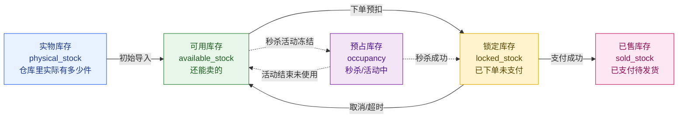
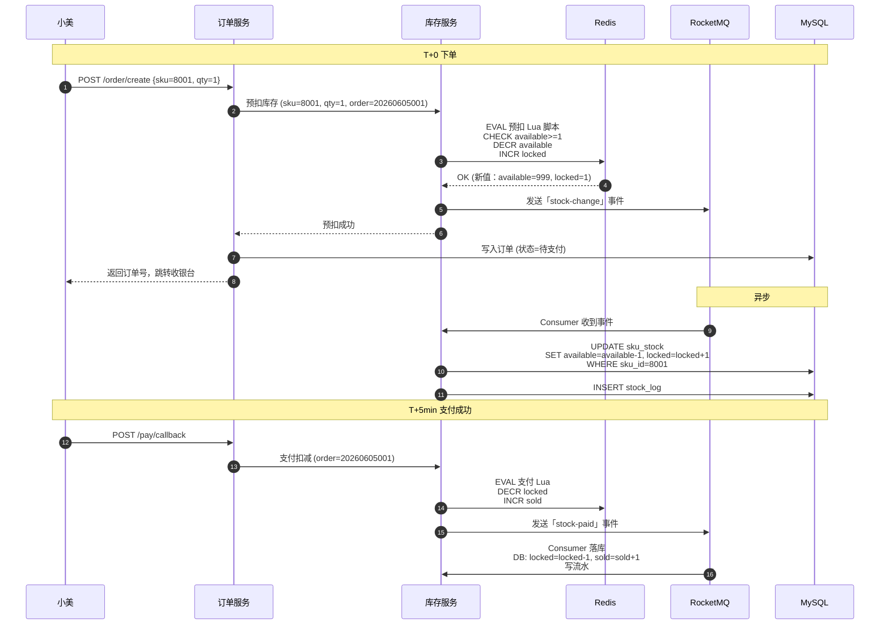
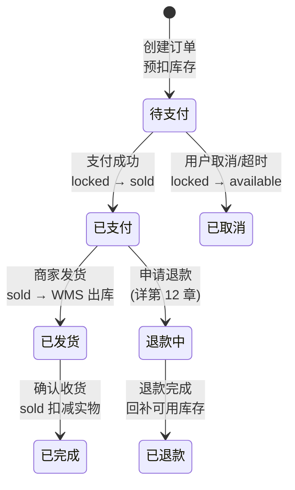
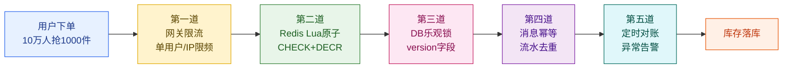
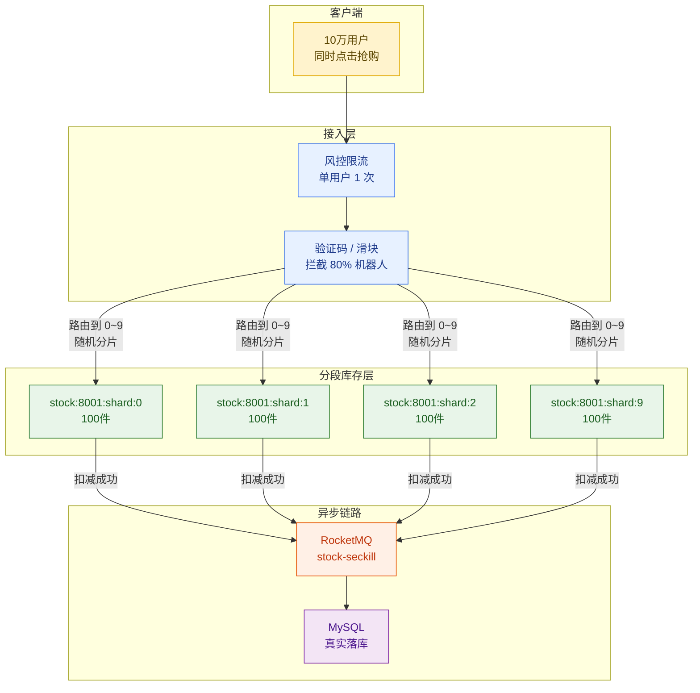
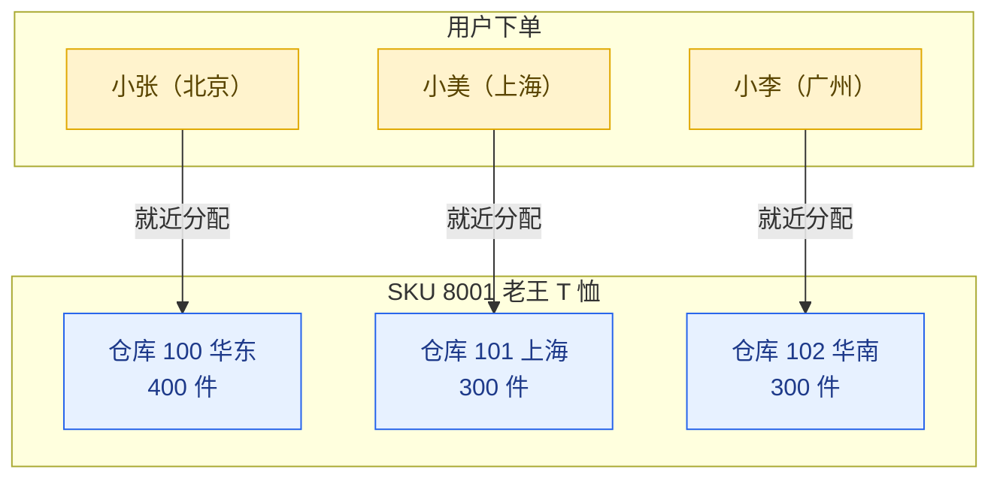
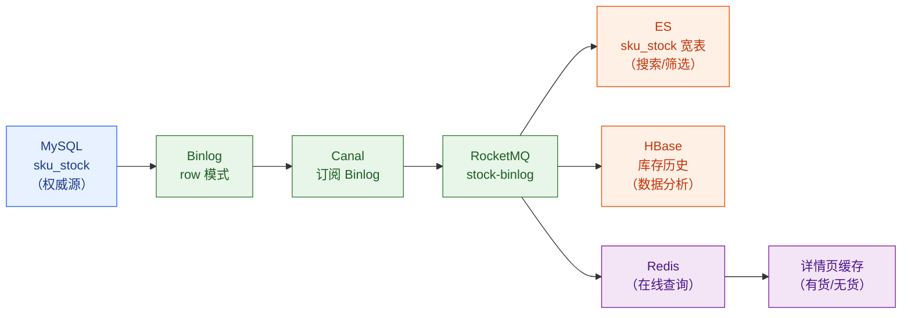
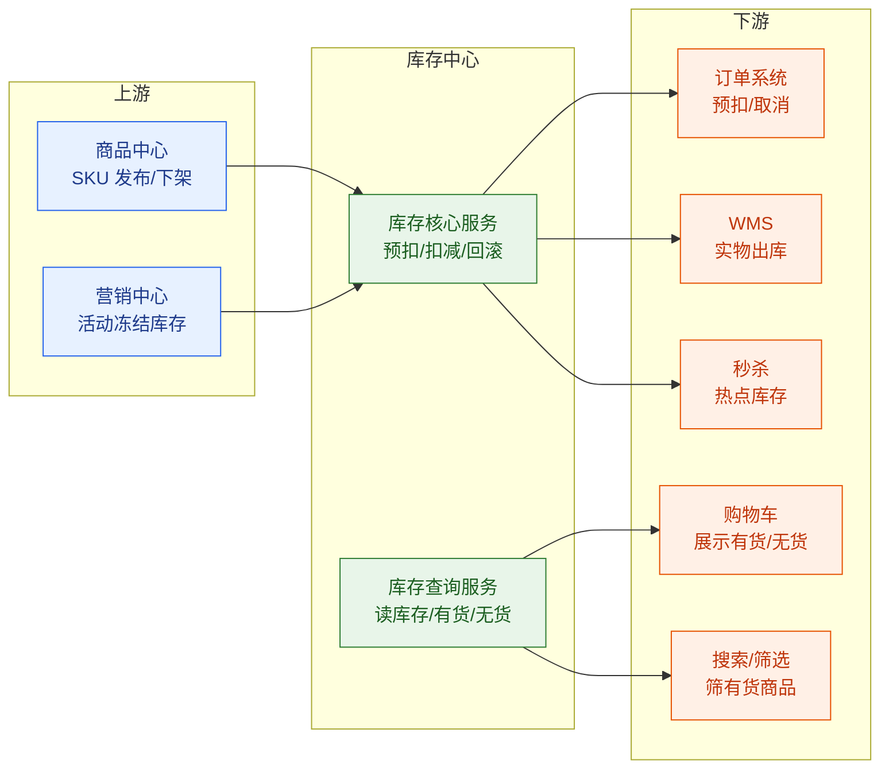
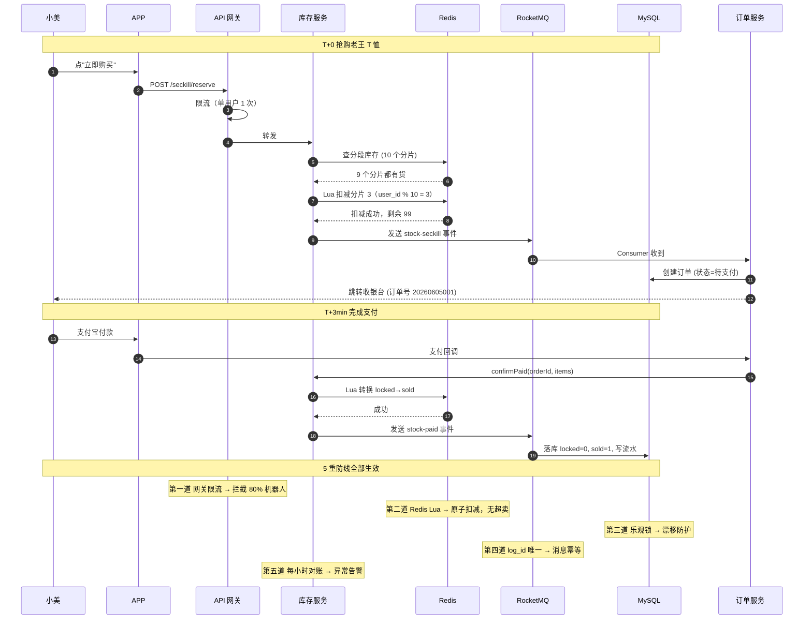

# 第 7 章 · 库存系统：预扣、最终一致与热点库存

> **所属系列**：商城平台系统设计 · 全景教程
>
> **上一章**：[第 6 章 · 订单系统](./06-订单系统.md)　|　**下一章**：[第 8 章 · 营销中心与价格计算](./08-营销中心与价格计算.md)　|　**总目录**：[教程大纲](./00-教程大纲.md)

---

## 本章导读

上一章我们把小美的 T 恤订单搭好了状态机——`已下单 → 待支付 → 已支付 → 已发货 → 已完成`。但订单系统只是"记账"，真正回答"这件 T 恤还剩几件、能不能卖"的是**库存系统**。

老王在「王的潮品」后台看了一眼 T 恤库存：`1000 件`。他既担心**超卖**（卖出 1001 件，仓库发不出货，被消费者投诉），也担心**少卖**（明明有 800 件，库存却显示只剩 200 件，损失订单）。而大促时，秒杀爆款 1000 件商品被 10 万人抢，单 SKU 写 QPS 突破 1 万——一不小心就是"超卖 200 件、资损百万"的 P0 事故。

库存系统是电商最容易"踩雷"的子系统，因为它在**一致性、并发、性能**三条线上同时承压：

| 维度 | 库存系统的处境 |
|------|--------------|
| 一致性 | 不能超卖（一件不能卖两件）、不能少卖（不能少卖好货）—— 强一致要求 |
| 并发 | 大促单 SKU 写 QPS 1 万+，秒杀单 key 热点 |
| 性能 | 用户下单不能等库存锁，库存扣减必须毫秒级返回 |
| 业务复杂度 | 自营仓、商家仓、第三方仓多渠道对账 |

本章沿用贯穿全篇的「极购商城」规模假设（5 亿 SKU、单 SKU 热点 1 万 QPS），围绕小美抢购老王 T 恤的完整链路，深入拆解：

1. **库存的核心挑战**——超卖、少卖、热点、对账四大难题
2. **库存领域模型**——实物/可用/锁定/已售/预占五种状态
3. **库存流水**——任何变更必须留痕
4. **下单预扣库存**——Redis Lua 原子扣减 + MQ 异步落库
5. **支付确认与回滚**——状态机的四步联动
6. **超卖防护五重防线**——从 Redis 到定时对账
7. **热点库存**——秒杀场景的分段库存 + 限流
8. **多仓模型**——就近分配、跨仓调拨
9. **库存同步与对账**——Binlog + 定时校对
10. **典型问题与解法**——死锁、漂移、漏扣、超卖

读完本章你将能回答：为什么库存不能直接 `UPDATE stock SET stock = stock - 1`？为什么预扣用 Redis 而落库用 MySQL？为什么秒杀必须把 1000 件拆成 10 份？为什么订单取消时要"反向操作"而不是"重置"？

---

## 7.1 库存的核心挑战

### 7.1.1 四大难题

| 难题 | 含义 | 业务后果 | 工程难点 |
|------|------|---------|---------|
| **超卖防护** | 库存不能被减成负数 | 一件商品被两个人同时下单，仓库发不出货，资损 + 投诉 | 并发扣减的原子性 |
| **少卖避免** | 有货却显示无货 | 用户看到"已售罄"放弃下单，GMV 损失 | 分布式系统的一致性延迟 |
| **热点库存** | 单 SKU 写 QPS 1 万+ | 单个 Redis key 被打爆，库存服务雪崩 | 热点打散 + 限流 |
| **多渠道对账** | 自营 + 商家 + 第三方仓 | 账面 1000 件，实物只有 998 件，财务对账不平 | 多源数据同步 + 差异告警 |

这四个难题看起来是"业务问题"，本质上都是**分布式系统设计问题**。下面我们从领域模型开始逐个击破。

### 7.1.2 规模假设

为方便后续讨论，沿用教程大纲的「极购商城」基准：

| 维度 | 极购商城假设 | 本章关注点 |
|------|-------------|----------|
| 商品库 | 5 亿 SKU | 库存主表数据量 |
| 日均订单 | 800 万 | 库存写 QPS ~1000（平均）|
| 大促峰值 | 2000 万/日 | 库存写 QPS ~3000（平均）|
| **热点 SKU 写 QPS** | **1 万+（单 SKU）** | 秒杀爆款的真实挑战 |
| 秒杀爆款 | 1000 件 / 10 万人抢 | 1% 中签率的极限场景 |
| 仓库数 | 50 万商家 × 多仓 | 多仓调度复杂度 |

---

## 7.2 库存领域模型

### 7.2.1 五种库存状态

一个 SKU 的库存并不是一个数字，而是**五种状态的组合**：



| 状态 | 含义 | 何时变化 | 谁来改 |
|------|------|---------|--------|
| **实物库存** `physical_stock` | 仓库里实际有的数量 | 入库 +N、出库 -N | WMS（仓库管理系统） |
| **可用库存** `available_stock` | 还能卖给消费者的数量 | 下单预扣 -N、取消回滚 +N | 库存服务 |
| **锁定库存** `locked_stock` | 已下单未支付的数量 | 支付成功转已售、取消回滚可用 | 库存服务 |
| **已售库存** `sold_stock` | 已支付待发货的数量 | 发货后扣减实物 | 库存服务 + WMS |
| **预占库存** `occupancy` | 秒杀/活动冻结的数量 | 活动开始冻结、活动结束释放 | 营销中心 |

**核心恒等式**（任何时候都必须满足）：

```
available_stock + locked_stock + sold_stock + occupancy = physical_stock
```

如果等式不成立，说明有漏扣、超扣或者并发问题。

### 7.2.2 MySQL 表设计：同表多字段 vs 独立表

业界有两种主流设计，我们推荐**同表多字段 + 库存流水表**的组合方案：

**方案 A：同表多字段**（极购商城采用）：

```sql
-- 库存主表
CREATE TABLE sku_stock (
    id                BIGINT       UNSIGNED NOT NULL AUTO_INCREMENT COMMENT '主键',
    sku_id            BIGINT       UNSIGNED NOT NULL                COMMENT 'SKU ID（唯一）',
    merchant_id       BIGINT       UNSIGNED NOT NULL                COMMENT '商家ID',
    warehouse_id      BIGINT       UNSIGNED NOT NULL                COMMENT '仓库ID',
    
    -- 五种库存状态
    physical_stock    BIGINT       NOT NULL DEFAULT 0               COMMENT '实物库存',
    available_stock   BIGINT       NOT NULL DEFAULT 0               COMMENT '可用库存',
    locked_stock      BIGINT       NOT NULL DEFAULT 0               COMMENT '锁定库存',
    sold_stock        BIGINT       NOT NULL DEFAULT 0               COMMENT '已售库存',
    occupancy_stock   BIGINT       NOT NULL DEFAULT 0               COMMENT '预占库存',
    
    -- 乐观锁版本号
    version           BIGINT       NOT NULL DEFAULT 0               COMMENT '乐观锁版本',
    
    -- 时间戳
    update_time       DATETIME(3)  NOT NULL DEFAULT CURRENT_TIMESTAMP(3) ON UPDATE CURRENT_TIMESTAMP(3),
    create_time       DATETIME(3)  NOT NULL DEFAULT CURRENT_TIMESTAMP(3),
    
    PRIMARY KEY (id),
    UNIQUE KEY uk_sku_warehouse (sku_id, warehouse_id),  -- 同 SKU 多仓拆分
    KEY idx_merchant (merchant_id),
    KEY idx_available (available_stock)                   -- 缺货扫描
) ENGINE=InnoDB DEFAULT CHARSET=utf8mb4 
  COMMENT='SKU 库存主表（同表多字段方案）';

-- 库存流水表
CREATE TABLE stock_log (
    id                BIGINT       UNSIGNED NOT NULL AUTO_INCREMENT COMMENT '主键',
    log_id            VARCHAR(32)  NOT NULL                        COMMENT '流水号（业务唯一）',
    sku_id            BIGINT       UNSIGNED NOT NULL                COMMENT 'SKU ID',
    warehouse_id      BIGINT       UNSIGNED NOT NULL                COMMENT '仓库ID',
    
    -- 变更类型
    change_type       TINYINT      NOT NULL                         COMMENT '1=入库 2=出库 3=预扣 4=回滚 5=支付扣减 6=释放预占 7=活动冻结',
    
    -- 变更数量（正负）
    change_qty        INT          NOT NULL                         COMMENT '变更数量（正=加，负=减）',
    
    -- 变更前后快照（用于回溯）
    available_before  BIGINT       NOT NULL                         COMMENT '变更前可用库存',
    available_after   BIGINT       NOT NULL                         COMMENT '变更后可用库存',
    locked_before     BIGINT       NOT NULL                         COMMENT '变更前锁定库存',
    locked_after      BIGINT       NOT NULL                         COMMENT '变更后锁定库存',
    
    -- 业务关联
    order_id          VARCHAR(32)  DEFAULT NULL                      COMMENT '关联订单号',
    biz_type          VARCHAR(16)  NOT NULL                         COMMENT '业务类型：ORDER/PAY/CANCEL/SECKILL',
    biz_id            VARCHAR(64)  DEFAULT NULL                      COMMENT '业务ID（订单号/活动ID）',
    
    -- 操作信息
    operator          VARCHAR(64)  DEFAULT 'SYSTEM'                  COMMENT '操作人/SYSTEM',
    remark            VARCHAR(255) DEFAULT ''                        COMMENT '备注',
    
    create_time       DATETIME(3)  NOT NULL DEFAULT CURRENT_TIMESTAMP(3) COMMENT '变更时间',
    
    PRIMARY KEY (id),
    UNIQUE KEY uk_log_id (log_id),                       -- 幂等去重
    KEY idx_sku_time (sku_id, create_time),              -- 流水查询
    KEY idx_order (order_id),                            -- 订单维度查询
    KEY idx_biz (biz_type, biz_id)                       -- 业务维度查询
) ENGINE=InnoDB DEFAULT CHARSET=utf8mb4 
  COMMENT='库存变更流水（任何变更必须留痕）';
```

**方案 B：独立表**（不推荐）：

把 `available_stock` / `locked_stock` 拆成 `available_stock` 表和 `locked_stock` 表，理由是"读写分离"。但实际上这两种状态在同一次事务里更新，拆表反而引入跨表事务的复杂度，**得不偿失**。所以极购商城采用方案 A。

### 7.2.3 关键设计：每个变更都要写流水

**库存流水表是库存系统的"审计日志"**。任何一次库存变更（哪怕只动了 1 件），都必须同时写一条 `stock_log`。原因有三：

1. **对账**：财务月底要核对"账面库存 vs 实物库存"，没有流水就无法追溯。
2. **故障恢复**：Redis 宕机后重建库存，可以从流水 + 起始值推算任何时刻的库存。
3. **审计与合规**：大促投诉、商家纠纷、监管检查都需要流水作为证据。

流水表的关键约束：

- **log_id 唯一**：用 `UUID` 或雪花算法生成，作为幂等键。
- **不允许更新**：流水只 INSERT，不 UPDATE/DELETE（即使发现错误也只能"补偿流水"，不能改原流水）。
- **归档策略**：流水数据量极大（一年约 1000 亿行），按月分表，3 个月后转冷存储。

---

## 7.3 下单预扣库存（核心流程）

### 7.3.1 为什么需要"预扣"而不是"真扣"

用户提交订单时，库存系统不能直接 `physical_stock -= 1`，因为：

- 用户**不一定支付**——订单 30 分钟后会自动取消，库存必须退回。
- 如果扣了实物库存但用户取消，又要去退实物库存，**增加 WMS 复杂度**。

正确做法是：下单时只动**锁定库存**（"已下单未支付"），支付成功后再转**已售库存**。实物库存只在发货那一刻才扣。这就是**预扣（Reservation）**模式：



### 7.3.2 为什么预扣用 Redis 而不是直接写 DB

| 方案 | 性能 | 一致性 | 结论 |
|------|------|--------|------|
| **直接 UPDATE MySQL** | 单行 UPDATE 约 5-10ms，受行锁和连接池限制，热点 SKU 1000 QPS 顶不住 | 强一致 | 大促不可行 |
| **Redis Lua 原子扣减** | 单 key 约 0.5ms，无锁，单 Redis 节点可扛 5 万 QPS | 弱一致（依赖异步落库） | **极购商城采用** |
| **Redis + 本地缓存** | 0.1ms | 极弱一致 | 仅用于秒杀，详 7.7 |

Redis 之所以能做到"原子扣减"，是因为：

1. Redis 是**单线程**执行命令，一个 Lua 脚本内的多个命令不会被其他命令插入。
2. Redis Cluster 的**分槽（slot）**让单 key 操作都在同一节点。
3. `DECR` 命令本身是原子的。

### 7.3.3 Lua 脚本：原子预扣

```lua
-- 库存预扣 Lua 脚本
-- KEYS[1] = stock:available:{sku_id}    可用库存 Hash 字段
-- KEYS[2] = stock:locked:{sku_id}       锁定库存 Hash 字段
-- ARGV[1] = 预扣数量
-- 返回：{新可用库存, 新锁定库存, 状态码}
-- 状态码：1=成功 0=库存不足 -1=参数错误

local qty = tonumber(ARGV[1])
if qty == nil or qty <= 0 then
    return {-1, -1, -1}
end

-- 1. CHECK 当前可用库存
local available = tonumber(redis.call('HGET', KEYS[1], 'value'))
if available == nil then
    return {-1, -1, -2}  -- 库存未初始化
end

if available < qty then
    return {available, tonumber(redis.call('HGET', KEYS[2], 'value')) or 0, 0}
end

-- 2. 原子扣减
local newAvailable = redis.call('HINCRBY', KEYS[1], 'value', -qty)
local newLocked = redis.call('HINCRBY', KEYS[2], 'value', qty)

-- 3. 刷新 TTL（防止冷数据占用）
redis.call('EXPIRE', KEYS[1], 86400 * 7)
redis.call('EXPIRE', KEYS[2], 86400 * 7)

return {newAvailable, newLocked, 1}
```

**关键点**：

- **CHECK + DECR 在一个 Lua 里**：避免"先查后扣"的两步操作被其他命令插入。
- **不直接返回 -1 表示失败**：返回当前库存值给调用方，用于前端展示"还剩 1 件"。
- **EXPIRE 7 天**：冷 SKU 7 天没动就从 Redis 淘汰，下次预扣时从 DB 重建。

### 7.3.4 库存预扣服务（Java + Redis + DB 双写）

```java
import org.springframework.beans.factory.annotation.Autowired;
import org.springframework.data.redis.core.StringRedisTemplate;
import org.springframework.data.redis.core.script.DefaultRedisScript;
import org.springframework.jdbc.core.JdbcTemplate;
import org.springframework.stereotype.Service;
import org.springframework.transaction.annotation.Transactional;

import java.util.Arrays;
import java.util.List;
import java.util.UUID;

/**
 * 库存预扣服务
 * 核心流程：Redis Lua 原子预扣 → 异步 MQ → DB 落库
 */
@Service
public class StockReservationService {

    @Autowired private StringRedisTemplate redis;
    @Autowired private StockMqProducer mqProducer;
    @Autowired private JdbcTemplate jdbc;

    // 预扣 Lua 脚本（见 7.3.3）
    private static final String RESERVE_SCRIPT =
        "local qty = tonumber(ARGV[1]) " +
        "if qty == nil or qty <= 0 then return {-1, -1, -1} end " +
        "local available = tonumber(redis.call('HGET', KEYS[1], 'value')) " +
        "if available == nil then return {-1, -1, -2} end " +
        "if available < qty then " +
        "  return {available, tonumber(redis.call('HGET', KEYS[2], 'value')) or 0, 0} " +
        "end " +
        "local newAvailable = redis.call('HINCRBY', KEYS[1], 'value', -qty) " +
        "local newLocked = redis.call('HINCRBY', KEYS[2], 'value', qty) " +
        "redis.call('EXPIRE', KEYS[1], 86400 * 7) " +
        "redis.call('EXPIRE', KEYS[2], 86400 * 7) " +
        "return {newAvailable, newLocked, 1}";

    private final DefaultRedisScript<List> reserveScript =
        new DefaultRedisScript<>(RESERVE_SCRIPT, List.class);

    /**
     * 预扣库存（下单时调用）
     *
     * @param skuId       SKU ID
     * @param warehouseId 仓库 ID
     * @param qty         预扣数量
     * @param orderId     订单号
     * @return 预扣结果
     */
    public ReserveResult reserve(long skuId, long warehouseId, int qty, String orderId) {
        String availKey = "stock:available:" + skuId + ":" + warehouseId;
        String lockedKey = "stock:locked:" + skuId + ":" + warehouseId;

        // 1. Redis Lua 原子预扣
        @SuppressWarnings("unchecked")
        List<Long> result = redis.execute(
            reserveScript,
            Arrays.asList(availKey, lockedKey),
            String.valueOf(qty)
        );

        if (result == null || result.size() < 3) {
            return ReserveResult.systemError();
        }

        long status = result.get(2);
        if (status == -1) {
            return ReserveResult.paramError();
        }
        if (status == -2) {
            // Redis 中没有库存，尝试从 DB 加载并重试一次
            loadFromDbToRedis(skuId, warehouseId);
            return retryReserve(availKey, lockedKey, qty);
        }
        if (status == 0) {
            // 库存不足
            return ReserveResult.insufficient(result.get(0));
        }

        // 2. 预扣成功，发送 MQ 异步落库
        StockChangeEvent event = new StockChangeEvent();
        event.setLogId(UUID.randomUUID().toString().replace("-", ""));
        event.setSkuId(skuId);
        event.setWarehouseId(warehouseId);
        event.setChangeType(3);  // 3=预扣
        event.setChangeQty(-qty);
        event.setOrderId(orderId);
        event.setBizType("ORDER");
        event.setBizId(orderId);
        mqProducer.sendStockChange(event);

        return ReserveResult.success(result.get(0), result.get(1));
    }

    /**
     * 从 DB 加载库存到 Redis（缓存重建）
     */
    private void loadFromDbToRedis(long skuId, long warehouseId) {
        String sql = "SELECT available_stock, locked_stock FROM sku_stock " +
                     "WHERE sku_id = ? AND warehouse_id = ?";
        try {
            jdbc.queryForObject(sql, (rs, n) -> {
                String availKey = "stock:available:" + skuId + ":" + warehouseId;
                String lockedKey = "stock:locked:" + skuId + ":" + warehouseId;
                redis.opsForHash().put(availKey, "value", String.valueOf(rs.getLong("available_stock")));
                redis.opsForHash().put(lockedKey, "value", String.valueOf(rs.getLong("locked_stock")));
                return null;
            }, skuId, warehouseId);
        } catch (Exception e) {
            // 库存记录不存在
            String availKey = "stock:available:" + skuId + ":" + warehouseId;
            redis.opsForHash().put(availKey, "value", "0");
        }
    }

    private ReserveResult retryReserve(String availKey, String lockedKey, int qty) {
        @SuppressWarnings("unchecked")
        List<Long> result = redis.execute(
            reserveScript,
            Arrays.asList(availKey, lockedKey),
            String.valueOf(qty)
        );
        if (result != null && result.size() >= 3 && result.get(2) == 1) {
            return ReserveResult.success(result.get(0), result.get(1));
        }
        return ReserveResult.insufficient(result != null ? result.get(0) : 0);
    }

    public record ReserveResult(
        boolean success, long available, long locked, String errorMsg
    ) {
        public static ReserveResult success(long avail, long locked) {
            return new ReserveResult(true, avail, locked, null);
        }
        public static ReserveResult insufficient(long avail) {
            return new ReserveResult(false, avail, 0, "库存不足，还剩 " + avail + " 件");
        }
        public static ReserveResult systemError() {
            return new ReserveResult(false, 0, 0, "系统错误");
        }
        public static ReserveResult paramError() {
            return new ReserveResult(false, 0, 0, "参数错误");
        }
    }
}
```

---

## 7.4 支付确认与回滚

### 7.4.1 库存与订单状态联动

订单有 6 个核心状态，库存系统必须**精确响应**每一次状态变化：



| 订单事件 | 库存动作 | Redis 操作 | DB 操作 |
|---------|---------|-----------|---------|
| **创建订单** | 预扣 | `available -= N`, `locked += N` | `available -= N`, `locked += N`, 写流水 |
| **支付成功** | 锁定转已售 | `locked -= N`, `sold += N` | `locked -= N`, `sold += N`, 写流水 |
| **取消订单** | 锁定回可用 | `locked -= N`, `available += N` | `locked -= N`, `available += N`, 写流水 |
| **超时关单** | 同取消 | 同上 | 同上 |
| **发货** | 实物出库 | `physical -= N`（WMS 同步） | `physical -= N`, 写流水 |
| **退款** | 回补可用 | `available += N`, `sold -= N` | 同上 |

### 7.4.2 支付确认：locked → sold

```java
/**
 * 支付成功后，库存服务将锁定转为已售
 */
@Service
public class StockConfirmService {

    @Autowired private StringRedisTemplate redis;
    @Autowired private StockMqProducer mqProducer;

    private static final String CONFIRM_SCRIPT =
        "local qty = tonumber(ARGV[1]) " +
        "local locked = tonumber(redis.call('HGET', KEYS[1], 'value')) or 0 " +
        "if locked < qty then return 0 end " +
        "redis.call('HINCRBY', KEYS[1], 'value', -qty) " +  // locked -= qty
        "local newSold = redis.call('HINCRBY', KEYS[2], 'value', qty) " +  // sold += qty
        "return newSold";

    /**
     * 支付成功回调时调用
     * @param orderId 订单号
     * @param items   订单 SKU 列表
     */
    @Transactional
    public void confirmPaid(String orderId, List<OrderItem> items) {
        for (OrderItem item : items) {
            String lockedKey = "stock:locked:" + item.getSkuId() + ":" + item.getWarehouseId();
            String soldKey = "stock:sold:" + item.getSkuId() + ":" + item.getWarehouseId();

            // Redis 原子转换
            redis.execute(new DefaultRedisScript<>(CONFIRM_SCRIPT, Long.class),
                Arrays.asList(lockedKey, soldKey),
                String.valueOf(item.getQty()));

            // 发送 MQ 异步落库
            mqProducer.sendStockChange(StockChangeEvent.builder()
                .logId(UUID.randomUUID().toString().replace("-", ""))
                .skuId(item.getSkuId())
                .warehouseId(item.getWarehouseId())
                .changeType(5)  // 5=支付扣减
                .changeQty(-item.getQty())  // 锁定减少
                .orderId(orderId)
                .bizType("PAY")
                .bizId(orderId)
                .build());
        }
    }
}
```

### 7.4.3 订单取消：locked → available（回滚）

**订单取消是库存系统最容易出 bug 的环节**——必须保证"有去有回"，否则就会出现"订单取消了但库存没回"的灵异事件。

```java
/**
 * 订单取消时回滚库存
 * 触发场景：用户主动取消 / 超时关单 / 风控拦截
 */
@Service
public class StockRollbackService {

    @Autowired private StringRedisTemplate redis;
    @Autowired private StockMqProducer mqProducer;
    @Autowired private JdbcTemplate jdbc;

    private static final String ROLLBACK_SCRIPT =
        "local qty = tonumber(ARGV[1]) " +
        "local locked = tonumber(redis.call('HGET', KEYS[1], 'value')) or 0 " +
        "if locked < qty then return 0 end " +
        "redis.call('HINCRBY', KEYS[1], 'value', -qty) " +   // locked -= qty
        "local newAvail = redis.call('HINCRBY', KEYS[2], 'value', qty) " +  // available += qty
        "return newAvail";

    /**
     * 订单取消时调用
     * 必须幂等：同一订单号多次调用结果一致
     */
    public boolean rollback(String orderId, List<OrderItem> items) {
        // 1. 幂等检查：是否已经回滚过
        if (isAlreadyRolledBack(orderId)) {
            return true;  // 幂等成功
        }

        for (OrderItem item : items) {
            String lockedKey = "stock:locked:" + item.getSkuId() + ":" + item.getWarehouseId();
            String availKey = "stock:available:" + item.getSkuId() + ":" + item.getWarehouseId();

            // 2. Redis 原子回滚
            redis.execute(new DefaultRedisScript<>(ROLLBACK_SCRIPT, Long.class),
                Arrays.asList(lockedKey, availKey),
                String.valueOf(item.getQty()));

            // 3. MQ 异步落库 + 写流水
            mqProducer.sendStockChange(StockChangeEvent.builder()
                .logId(UUID.randomUUID().toString().replace("-", ""))
                .skuId(item.getSkuId())
                .warehouseId(item.getWarehouseId())
                .changeType(4)  // 4=回滚
                .changeQty(item.getQty())  // 锁定减少，体现在 locked_qty 是负值
                .orderId(orderId)
                .bizType("CANCEL")
                .bizId(orderId)
                .build());
        }

        // 4. 记录幂等标记（防重）
        markAsRolledBack(orderId);
        return true;
    }

    /**
     * 通过 Redis SETNX 实现幂等
     */
    private boolean isAlreadyRolledBack(String orderId) {
        Boolean first = redis.opsForValue().setIfAbsent(
            "stock:rollback:done:" + orderId, "1", Duration.ofDays(7));
        return Boolean.FALSE.equals(first);
    }

    private void markAsRolledBack(String orderId) {
        // setIfAbsent 已经处理
    }
}
```

**幂等性的两个关键**：

1. **Redis SETNX 标记**：用 `stock:rollback:done:{order_id}` 作为幂等键，7 天 TTL。
2. **DB 唯一约束**：在 `stock_log` 表上对 `(order_id, change_type)` 建联合唯一索引，DB 层兜底防重。

---

## 7.5 超卖防护：五重防线

超卖是库存系统的"原罪"——任何一重防线失效都可能导致事故。我们用五道防线层层兜底：



### 7.5.1 第一道：网关限流

在请求进入库存服务**之前**就过滤掉大部分无效请求：

```yaml
# Nginx + Sentinel 网关限流配置
rules:
  - resource: stock_reserve
    limitApp: default
    grade: 1                     # QPS 限流
    count: 10000                 # 单机 QPS 上限 1 万
    controlBehavior: 2           # 排队等待
  - resource: stock_reserve
    limitApp: seckill
    grade: 1
    count: 50000                 # 秒杀走独立资源池
    controlBehavior: 0           # 快速失败
```

### 7.5.2 第二道：Redis Lua 原子扣减（见 7.3.3）

单 Redis Cluster 节点实测可扛 5-8 万 QPS，是扛并发的**核心**。

### 7.5.3 第三道：DB 乐观锁

异步落库时用 `version` 字段防止脏写：

```sql
-- 落库 SQL（乐观锁）
UPDATE sku_stock
SET available_stock = available_stock - 1,
    locked_stock = locked_stock + 1,
    version = version + 1
WHERE sku_id = 8001
  AND warehouse_id = 100
  AND version = #{oldVersion}
  AND available_stock >= 1;
-- 影响行数为 0 → 乐观锁冲突，重试或告警
```

如果 Redis 宕机重启后数据有漂移，乐观锁的 `version` 校验能防止错误数据落库。

### 7.5.4 第四道：消息幂等

`stock_log` 表的 `log_id` 唯一索引保证同一事件不会被处理两次：

```java
// Consumer 端
@KafkaListener(topics = "stock-change")
public void onMessage(StockChangeEvent event) {
    try {
        // 1. 尝试插入流水
        jdbc.update("INSERT INTO stock_log (log_id, ...) VALUES (?, ...)",
            event.getLogId(), ...);
    } catch (DuplicateKeyException e) {
        // 重复消息，直接 ACK
        return;
    }
    // 2. 更新库存主表
    jdbc.update("UPDATE sku_stock SET available_stock = available_stock + ? ...",
        event.getChangeQty(), ...);
}
```

### 7.5.5 第五道：定时对账（7.9 节展开）

每小时全量对账一次：DB 库存 vs Redis 库存 vs 流水合计，三者必须满足：

```
DB.available_stock == Redis.available_stock
DB.locked_stock     == Redis.locked_stock
SUM(stock_log.change_qty WHERE type=3) == DB.locked_stock (for paid orders)
```

任何一项不等就触发告警，由运维人工介入。

---

## 7.6 热点库存：秒杀场景

### 7.6.1 秒杀为什么是库存系统的"极限压力测试"

| 场景 | 库存量 | 抢购人数 | 中签率 | 单 SKU 写 QPS |
|------|--------|---------|--------|--------------|
| 日常 T 恤 | 1000 件 | ~200 | 100% | 几十 |
| 大促爆款 | 1000 件 | 1 万 | 10% | 数百 |
| **秒杀爆款** | **1000 件** | **10 万** | **1%** | **1 万+** |
| 超头部明星秒杀 | 100 件 | 100 万 | 0.01% | **10 万+** |

秒杀对库存系统的压力来自三个维度：

1. **读 QPS 爆炸**：10 万人同时点"立即抢购"，库存服务要扛 10 万读 + 1 万写。
2. **写热点集中**：1000 件商品 = 1 个 Redis key，所有请求都打这个 key。
3. **极端超卖风险**：并发 1 万的扣减，只要有一处疏漏就可能卖出 1001+ 件。

### 7.6.2 解决思路：分段库存 + 限流 + 异步



### 7.6.3 关键策略一：分段库存

把 1000 件拆成 10 个分片，每片 100 件：

```java
/**
 * 秒杀分段库存服务
 * 把热点 SKU 拆成 N 个分片，分布在 Redis Cluster 不同 slot 上
 * 
 * 为什么能扛 10 万 QPS？
 *   单 Redis slot 极限 5 万 QPS，10 个分片分布在不同 slot
 *   → 理论上限 50 万 QPS
 */
@Service
public class SeckillStockService {

    private static final int SHARD_COUNT = 10;  // 分片数

    @Autowired private StringRedisTemplate redis;
    @Autowired private StockMqProducer mqProducer;

    /**
     * 秒杀预扣：随机选一个分片扣减
     * 利用「概率」让所有分片负载均衡
     */
    public SeckillResult seckillReserve(long skuId, long userId, String orderId) {
        // 1. 限流：单用户只能抢一次（Redis SETNX）
        String userKey = "seckill:user:" + skuId + ":" + userId;
        Boolean firstTime = redis.opsForValue().setIfAbsent(
            userKey, orderId, Duration.ofHours(2));
        if (Boolean.FALSE.equals(firstTime)) {
            return SeckillResult.duplicate();
        }

        // 2. 随机选一个分片
        int shardIdx = (int) (userId % SHARD_COUNT);  // 用 user_id 路由，保证同用户落到同分片（幂等）
        String shardKey = "stock:seckill:" + skuId + ":shard:" + shardIdx;

        // 3. Lua 原子预扣
        String lua =
            "local qty = tonumber(redis.call('HGET', KEYS[1], 'value')) or 0 " +
            "if qty <= 0 then return 0 end " +
            "redis.call('HINCRBY', KEYS[1], 'value', -1) " +
            "return qty - 1";
        Long remain = redis.execute(new DefaultRedisScript<>(lua, Long.class),
            List.of(shardKey));

        if (remain == null) {
            return SeckillResult.systemError();
        }

        // 4. 扣减成功，发送 MQ
        mqProducer.sendSeckillSuccess(SeckillEvent.builder()
            .skuId(skuId)
            .userId(userId)
            .orderId(orderId)
            .shardIdx(shardIdx)
            .build());

        return SeckillResult.success(remain);
    }

    /**
     * 活动开始前初始化：把 1000 件平均分到 10 个分片
     */
    public void initSeckillStock(long skuId, int totalQty) {
        int perShard = totalQty / SHARD_COUNT;
        int remainder = totalQty % SHARD_COUNT;
        for (int i = 0; i < SHARD_COUNT; i++) {
            int qty = perShard + (i < remainder ? 1 : 0);
            String key = "stock:seckill:" + skuId + ":shard:" + i;
            redis.opsForHash().put(key, "value", String.valueOf(qty));
            redis.expire(key, Duration.ofHours(24));
        }
    }
}
```

**为什么用 user_id 路由而不是随机**？因为同一用户多次请求必须落到同一分片，保证**幂等性**。如果第一次请求在分片 3 扣了 1 件，第二次重试也必须命中分片 3，否则会重复扣。

### 7.6.4 关键策略二：单用户限流

每个用户只能抢 1 次（用 `SETNX` 实现）：

```java
// 单用户限购 1 件（秒杀场景）
String userKey = "seckill:user:" + skuId + ":" + userId;
Boolean firstTime = redis.opsForValue().setIfAbsent(userKey, orderId, Duration.ofHours(2));
if (Boolean.FALSE.equals(firstTime)) {
    return SeckillResult.duplicate();  // 已抢过
}
```

### 7.6.5 关键策略三：分片聚合查询

扣减后查询"剩余库存总量"需要把所有分片相加，用 Pipeline 一次完成：

```java
public long getSeckillRemain(long skuId) {
    List<Object> values = redis.executePipelined((RedisCallback<Object>) conn -> {
        for (int i = 0; i < SHARD_COUNT; i++) {
            conn.hashCommands().hGet(
                ("stock:seckill:" + skuId + ":shard:" + i).getBytes(),
                "value".getBytes());
        }
        return null;
    });
    return values.stream()
        .filter(Objects::nonNull)
        .mapToLong(v -> Long.parseLong(new String((byte[]) v)))
        .sum();
}
```

### 7.6.6 关键策略四：扣减成功后再下单（异步链路）

秒杀不能走"先下单再扣库存"（会被无效订单浪费库存），必须**先扣库存再下单**：

```
用户抢到 → 扣减库存 → 发送 MQ → Consumer 异步创建订单（5 秒内）
                                              ↓
                                       5 秒未创建成功 → 释放库存
```

这样即使 1 万人抢到，也只有真正完成下单的才算数。详 9 章「秒杀系统设计」。

---

## 7.7 库存与仓库：多仓模型

### 7.7.1 多仓场景

老王的 T 恤有 3 个仓库（华东、上海、华南），用户在哪个城市下单就要从最近的仓发货：



### 7.7.2 库存就近分配算法

下单时，订单服务调库存服务查询"可发货的仓库列表"：

```java
/**
 * 查询可发货的仓库（按距离排序）
 */
public List<WarehouseOption> getAvailableWarehouses(long skuId, int qty, String address) {
    // 1. 查所有有货仓库
    List<WarehouseOption> options = jdbc.query(
        "SELECT warehouse_id, available_stock " +
        "FROM sku_stock " +
        "WHERE sku_id = ? AND available_stock >= ?",
        (rs, n) -> WarehouseOption.builder()
            .warehouseId(rs.getLong("warehouse_id"))
            .availableStock(rs.getLong("available_stock"))
            .build(),
        skuId, qty
    );

    if (options.isEmpty()) {
        return Collections.emptyList();  // 全国无货
    }

    // 2. 按用户收货地址的"距离"排序（华东→上海→华南→北京）
    String region = addressRegion(address);  // 解析省份
    options.sort((a, b) -> {
        int da = distance(region, a.getWarehouseId());
        int db = distance(region, b.getWarehouseId());
        return Integer.compare(da, db);
    });

    return options;
}
```

### 7.7.3 跨仓调拨

当某个仓缺货、另一个仓有货时，系统自动从有货仓"调拨"：

```
小美下单时：
  仓库 101（上海）: 0 件  → 跳过
  仓库 100（华东）: 50 件 → 满足，发华东仓
  仓库 102（华南）: 80 件 → 备选

正常情况：从最近的有货仓发货
极端情况：所有仓都缺货 → 跨仓调拨（同步等几天）或"无货"提示
```

### 7.7.4 WMS 同步

实物库存由 WMS（仓库管理系统）负责，库存服务通过 MQ 订阅 WMS 事件：

```
WMS 入库 → 发送 stock-in 事件 → 库存服务更新 physical_stock 和 available_stock
WMS 出库 → 发送 stock-out 事件 → 库存服务扣减 physical_stock
```

---

## 7.8 库存同步与对账

### 7.8.1 数据流向

库存数据需要同步到多个下游（搜索、推荐、详情页缓存），保证任何系统看到的库存都是相对准确的：



**关键点**：

- **MySQL 是权威源**：任何对账都以此为准。
- **Binlog 同步是异步**：延迟通常 1-3 秒，下游系统需要容忍。
- **Redis 是查询层**：所有读库存的接口都打 Redis（O(1) 延迟）。

### 7.8.2 定时全量对账

每小时一次全量对账，校验 Redis 与 DB 的一致性：

```sql
-- 对账 SQL：检查 Redis 是否有未落库的变更
SELECT s.sku_id, s.warehouse_id, s.available_stock AS db_available,
       s.locked_stock AS db_locked,
       (SELECT IFNULL(SUM(change_qty), 0) FROM stock_log
        WHERE sku_id = s.sku_id AND warehouse_id = s.warehouse_id
          AND change_type = 3) AS reserved_log
FROM sku_stock s
WHERE s.update_time > DATE_SUB(NOW(), INTERVAL 1 HOUR)
HAVING ABS(db_available - ?) > 100;  -- 与 Redis 差值超过 100 件则告警
```

对账程序伪代码：

```java
@Scheduled(cron = "0 0 * * * ?")  // 每小时一次
public void reconcile() {
    // 1. 拉取所有近 1 小时有变更的 SKU
    List<SkuStock> recentChanges = jdbc.query(
        "SELECT sku_id, warehouse_id, available_stock, locked_stock " +
        "FROM sku_stock WHERE update_time > DATE_SUB(NOW(), INTERVAL 1 HOUR)",
        skuStockMapper);

    int driftCount = 0;
    for (SkuStock s : recentChanges) {
        // 2. 读 Redis 当前值
        Long redisAvail = getRedisAvailable(s.skuId, s.warehouseId);
        Long redisLocked = getRedisLocked(s.skuId, s.warehouseId);

        // 3. 比对
        long diffAvail = Math.abs(s.availableStock - redisAvail);
        long diffLocked = Math.abs(s.lockedStock - redisLocked);

        if (diffAvail > 100 || diffLocked > 100) {
            // 4. 漂移超过阈值，告警 + 补偿
            log.error("库存漂移 sku={} avail_diff={} locked_diff={}",
                s.skuId, diffAvail, diffLocked);
            alertService.alert("库存漂移", s);
            driftCount++;
        }

        if (diffAvail > 0) {
            // 5. 以 DB 为准，覆盖 Redis（DB 是权威源）
            redis.opsForHash().put("stock:available:" + s.skuId + ":" + s.warehouseId,
                "value", String.valueOf(s.availableStock));
        }
    }

    log.info("对账完成，漂移 SKU 数：{}", driftCount);
}
```

### 7.8.3 异常库存告警

| 异常类型 | 阈值 | 处理方式 |
|---------|------|---------|
| 库存为负 | available < 0 | 立即告警 + 自动回滚最近一笔 |
| Redis 与 DB 漂移 | abs(diff) > 100 | 告警 + 修正 Redis |
| 流水总和与主表不符 | abs(diff) > 0 | 告警 + 启动对账补偿 |
| 锁定库存长期未支付 | locked 7 天 > 0 | 批量关单 + 释放库存 |
| 单 SKU 写 QPS 异常 | > 5 万/秒 | 自动限流 + 告警 |

---

## 7.9 库存中心与上下游

库存系统不是孤岛，它与商品、营销、订单、WMS 紧密协作：



| 上游 | 对接点 | 库存系统职责 |
|------|--------|------------|
| **商品中心** | SKU 上架/下架 | 下架时冻结所有可用库存；上架时激活 |
| **营销中心** | 活动开始/结束 | 活动开始冻结 occupancy；结束释放 |
| **订单系统** | 创建/支付/取消 | 预扣、扣减、回滚 |
| **WMS** | 入库/出库 | 更新 physical_stock |
| **购物车** | 查可售状态 | 返回 in_stock 标志 |
| **搜索** | 筛有货商品 | 走 ES 库存宽表 |

---

## 7.10 典型问题与解法

### 7.10.1 死锁：库存扣减顺序

**问题**：多 SKU 订单，用户取消时回滚顺序如果和预扣顺序不一致，可能死锁。

**解法**：所有预扣/回滚都按 `sku_id` 升序处理：

```java
// 预扣时排序
items.sort(Comparator.comparingLong(OrderItem::getSkuId));

// 回滚时也用相同顺序
```

### 7.10.2 库存漂移：定时校对

**问题**：Redis 异常重启、AOF 丢失、MQ 消息丢失等场景下，Redis 与 DB 不一致。

**解法**：见 7.8.2 节，每小时对账 + 异常告警。

### 7.10.3 漏扣：补偿重试

**问题**：Redis 预扣成功但 MQ 发送失败，DB 永远不知道这次扣减。

**解法**：本地消息表 + 定时扫描重试：

```sql
-- 本地消息表
CREATE TABLE stock_change_outbox (
    id BIGINT PRIMARY KEY,
    log_id VARCHAR(32) UNIQUE,
    payload JSON,
    status TINYINT,  -- 0=待发送 1=已发送 2=失败
    retry_count INT DEFAULT 0,
    create_time DATETIME(3)
);
```

预扣成功后写本地表 + 异步发 MQ，Consumer 端失败时由定时任务扫描重发。

### 7.10.4 秒杀超卖：分段库存 + 限流

**问题**：单 key 热点打爆，所有请求堆在 1 个 slot。

**解法**：见 7.6 节，10 分片 + 单用户 1 次限流。

### 7.10.5 库存回滚重复：幂等性

**问题**：MQ 消息重复消费，订单被取消两次，库存回滚两次（少卖）。

**解法**：见 7.4.3 节，`SETNX 幂等标记 + log_id 唯一索引`。

### 7.10.6 实物与账面不符：WMS 同步

**问题**：仓库盘亏 / 盘盈，账面 1000 件实物 998 件。

**解法**：WMS 实物盘点后推送 `stock-adjust` 事件，库存服务记录为"调整流水"，保持账面与实物一致。

---

## 7.11 贯穿案例：小美抢购老王 T 恤

把本章所有知识串起来，跟随小美的一次完整下单：



老王担心的"超卖"在整个流程中被 5 重防线层层拦截。即使其中 1-2 道失效，剩余防线仍能保证不超卖。这就是库存系统"纵深防御"的精髓。

---

## 本章小结

| 知识点 | 关键结论 |
|--------|---------|
| **核心挑战** | 超卖防护（强一致）、少卖避免（最终一致）、热点库存（10 万 QPS）、多渠道对账 |
| **领域模型** | 实物 / 可用 / 锁定 / 已售 / 预占 五种状态，恒等式必须成立 |
| **同表多字段** | 5 种状态在同一张表，便于事务一致性 |
| **库存流水** | 任何变更必须留痕，作为审计/对账/恢复的依据 |
| **预扣流程** | Redis Lua 原子预扣 → MQ 异步落库，毫秒级响应 |
| **Lua 脚本** | CHECK + DECR 必须在同一脚本，避免两步操作被插入 |
| **支付确认** | locked → sold，原子转换 + 异步落库 |
| **订单回滚** | locked → available，幂等性由 SETNX + log_id 双重保证 |
| **五重防线** | 网关限流 → Redis Lua → DB 乐观锁 → 消息幂等 → 定时对账 |
| **热点库存** | 分段库存（10 个分片）+ 单用户限流 + 异步链路 |
| **多仓模型** | 库存就近分配，跨仓调拨，WMS 同步实物 |
| **对账机制** | DB 是权威源，每小时校对一次，漂移自动修正 |

**技能点自测**：

- [ ] 能否解释"为什么预扣不能用直接 UPDATE MySQL"？
- [ ] 能否画出 Redis Lua 原子预扣的完整流程？
- [ ] 能否说出五重防超卖防线分别是什么？
- [ ] 秒杀场景下为什么要把 1000 件拆成 10 个分片？
- [ ] 订单取消时如何保证库存回滚的幂等性？
- [ ] 库存漂移发生时如何自动修正？

---

下一章：[第 8 章 · 营销中心与价格计算](./08-营销中心与价格计算.md)

---

## 参考来源

1. **淘宝库存体系演进** —— 阿里淘系技术团队博客
   从分库分表到 Redis Cluster 预扣库存的工业实践
   https://developer.aliyun.com/article/

2. **京东库存中心化架构** —— 京东零售技术博客
   统一库存服务与多仓调拨
   https://tech.jd.com/

3. **Redis 官方文档：Lua 脚本与原子性**
   EVAL/EVALSHA 命令的原子执行保证
   https://redis.io/docs/interact/programmability/eval-intro/

4. **RocketMQ 事务消息官方文档** —— Apache RocketMQ
   库存预扣的可靠消息传递机制
   https://rocketmq.apache.org/docs/featureBehavior/04transactionmessage

5. **美团库存系统设计与超卖防护** —— 美团技术团队
   多级防线与对账机制
   https://tech.meituan.com/

6. **MySQL 乐观锁与版本号模式** —— Percona Database Performance Blog
   高并发场景下的乐观锁工程实践
   https://www.percona.com/blog/

7. **Apache ShardingSphere 数据分片** —— ShardingSphere 官方文档
   库存主表按 sku_id 分库分表
   https://shardingsphere.apache.org/document/current/cn/overview/

8. **阿里 Canal Binlog 订阅** —— 阿里开源项目
   MySQL Binlog 实时同步到下游（ES/HBase/Redis）
   https://github.com/alibaba/canal

9. **秒杀系统设计：阿里双 11 库存热点** —— InfoQ 中文站
   10 万 QPS 单 SKU 库存的工程方案
   https://www.infoq.cn/

10. **《大型网站技术架构：核心原理与案例分析》** —— 李智慧
    电商库存系统的一致性与高并发设计

11. **极客时间《从 0 开始学架构》** —— 李运华
    库存预扣与最终一致性的架构原则
