# 第 8 章 · 营销中心：优惠券、满减、限时折扣与价格计算

> **所属系列**：商城平台系统设计 · 全景教程
>
> **上一章**：[第 7 章 · 库存系统](./07-库存系统.md)　|　**下一章**：[第 9 章 · 秒杀系统设计](./09-秒杀系统设计.md)　|　**总目录**：[教程大纲](./00-教程大纲.md)

---

## 本章导读

小美打开极购商城 App，准备在「丝美旗舰店」买那支心仪已久的口红。她做了三件事：

1. 领了 3 张优惠券：1 张「满 200 减 30」的店铺券、1 张新人 10 元无门槛券、1 张「满 199 打 8 折」的品牌券
2. 参加了老王店铺的「满 200 减 30」满减活动
3. 看中那件打 8 折的口红（标价 199 元）

她在结算页看到一行让她既兴奋又困惑的明细：

```
口红 × 1                199.00
店铺限时折扣 8 折        -39.80
满 200 减 30 满减        -30.00
新人无门槛券 10 元        -10.00
─────────────────────────────
实付：                  119.20
```

小美心里冒出 3 个问题，也是本章要回答的 3 个问题：

1. **这套钱是怎么算出来的？为什么用这张券、而不用那张更"大"的？**
2. **如果同时有满减、券、折扣、限时价 4 种优惠，它们怎么"叠加"？谁和谁"互斥"？**
3. **当订单里有 3 个 SKU 共用一张「满 200 减 30」时，30 元怎么分摊到每个 SKU 上？（影响后续退款金额）**

本章主要内容：

1. **营销工具全景** —— 8 类工具一张表看懂
2. **优惠券体系** —— 模板 / 实例 / 生命周期 / 发放方式
3. **促销活动体系** —— 满减 / 折扣 / 限价 / 适用范围
4. **价格计算引擎**（本章核心）—— 单品价 → 营销价 → 优惠 → 实付
5. **优惠叠加与互斥** —— 规则引擎与最优选
6. **预付定金 / 膨胀** —— 大促神器
7. **价格分摊** —— 多 SKU 订单的优惠拆分
8. **价格服务化** —— 营销中心 RPC 化
9. **价格缓存** —— 三级缓存与失效
10. **上下游对接** —— 商品/订单/支付/用户
11. **典型问题** —— 价格穿透、一致性、券超发、倒挂

读完本章你将能回答：为什么营销中心要独立成域？为什么"实付价"在购物车 / 详情页 / 订单 / 支付 4 个地方必须强一致？为什么 30 元的满减要按比例分摊到每个 SKU？

---

## 8.1 营销工具全景

电商的营销工具远不止"优惠券"一种。极购商城后台支持 8 大类，每类都有明确的适用场景与计费逻辑。

### 8.1.1 八大营销工具一览

| 工具 | 形式 | 触发方式 | 谁承担成本 | 典型场景 |
|------|------|---------|-----------|---------|
| **优惠券** | 满减券 / 折扣券 / 无门槛券 / 品类券 / 单品券 | 用户主动领取 / 系统发放 | 平台或商家（看谁发） | 拉新、促活、挽回流失 |
| **满减** | 满 N 减 M | 满金额自动减 | 商家（店内）或平台（跨店） | 凑单、提升客单价 |
| **限时折扣** | 限时打折 / 直降 | 活动期间自动生效 | 商家 | 清仓、推新品、大促 |
| **秒杀** | 极低价、限库存、限时间 | 抢购（独立章节） | 商家 + 平台补贴 | 引流款、爆款 |
| **拼团** | N 人成团享低价 | 凑齐人数生效 | 商家 | 社交裂变、乡镇市场 |
| **砍价** | 邀好友砍至底价 | 砍到底价可买 | 商家 + 砍价者 | 下沉市场拉新 |
| **积分抵现** | 100 积分抵 1 元 | 结算勾选 | 平台 | 会员体系闭环 |
| **会员折扣** | VIP9.5 折 / 金牌 9 折 | 会员身份自动生效 | 商家或平台 | 留存、高价值用户运营 |
| **满赠** | 满 N 赠 M | 满金额自动赠 | 商家 | 推新品、捆绑销售 |

### 8.1.2 营销工具分类图

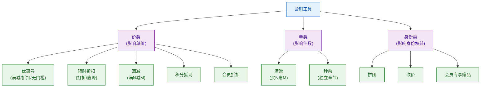

**关键洞察**：
- 价类工具影响"每件多少钱"，是价格计算引擎的主战场
- 量类工具影响"送几件"，不在价格计算引擎内（影响库存与售后）
- 身份类工具是另一种维度的玩法，拼团和砍价有自己独立的状态机

本章聚焦**价类工具**（优惠券、满减、限时折扣、积分、会员折扣），其它工具在秒杀（第 9 章）、售后（第 12 章）展开。

---

## 8.2 优惠券体系

### 8.2.1 模板与实例

优惠券的设计核心是**两层模型**：

- **coupon_template（券模板）**：定义"什么样的券"，由运营/商家创建
- **coupon（券实例）**：用户实际持有的"某一张券"，从模板发放生成

为什么要分两层？两个理由：

1. **一份模板可发放万级实例**：老王发"满 200 减 30"券，他只想配 1 份模板，但系统要发 1000 张给不同用户。
2. **模板属性 vs 实例状态分离**：模板关心"面值多少、有效期到几号"，实例关心"谁领了、用没用、核销时间"。

#### 券模板表 SQL

```sql
CREATE TABLE coupon_template (
    id                  BIGINT          UNSIGNED NOT NULL AUTO_INCREMENT COMMENT '主键',
    template_code       VARCHAR(64)     NOT NULL                COMMENT '模板编码（业务唯一）',
    name                VARCHAR(128)    NOT NULL                COMMENT '券名称（展示给用户）',
    coupon_type         TINYINT         NOT NULL                COMMENT '券类型:1满减券 2折扣券 3无门槛',
    
    -- 优惠规则
    discount_type       TINYINT         NOT NULL                COMMENT '优惠方式:1立减 2打折 3抵现',
    discount_value      BIGINT          NOT NULL                COMMENT '优惠值(分,折扣则存8.5=850)',
    min_order_cent      BIGINT          NOT NULL DEFAULT 0      COMMENT '使用门槛(分),0为无门槛',
    max_discount_cent   BIGINT          NOT NULL DEFAULT 0      COMMENT '折扣券封顶优惠(分)',
    
    -- 适用范围
    scope_type          TINYINT         NOT NULL                COMMENT '适用范围:1全场 2品类 3品牌 4单品',
    scope_ids           JSON            DEFAULT NULL            COMMENT '适用对象ID列表(品类/品牌/SKU)',
    exclude_scope_ids   JSON            DEFAULT NULL            COMMENT '排除对象ID列表',
    
    -- 发行规则
    total_count         INT             UNSIGNED NOT NULL DEFAULT 0    COMMENT '发行总量,0为不限',
    per_user_limit      INT             UNSIGNED NOT NULL DEFAULT 1    COMMENT '单用户领取上限',
    publish_type        TINYINT         NOT NULL                COMMENT '发放方式:1用户领 2系统发 3活动发',
    
    -- 有效期
    valid_start_time    DATETIME        NOT NULL                COMMENT '生效时间',
    valid_end_time      DATETIME        NOT NULL                COMMENT '失效时间',
    use_after_days      INT             NOT NULL DEFAULT 0      COMMENT '领取后N天失效,>0时valid_end_time无效',
    
    -- 成本与限制
    bear_type           TINYINT         NOT NULL                COMMENT '成本承担:1平台 2商家 3联合',
    merchant_id         BIGINT          UNSIGNED NOT NULL DEFAULT 0  COMMENT '商家券关联商家ID',
    platform_id         BIGINT          UNSIGNED NOT NULL DEFAULT 0  COMMENT '平台券关联平台ID',
    
    -- 叠加规则
    stackable           TINYINT(1)      NOT NULL DEFAULT 0      COMMENT '是否可与满减叠加',
    exclusive_tags      VARCHAR(255)    DEFAULT ''              COMMENT '互斥标签,如shop,platform',
    
    -- 状态
    status              TINYINT         NOT NULL DEFAULT 0      COMMENT '状态:0草稿 1待生效 2生效中 3已结束 4作废',
    
    create_time         DATETIME(3)     NOT NULL DEFAULT CURRENT_TIMESTAMP(3),
    update_time         DATETIME(3)     NOT NULL DEFAULT CURRENT_TIMESTAMP(3) ON UPDATE CURRENT_TIMESTAMP(3),
    
    PRIMARY KEY (id),
    UNIQUE KEY uk_template_code (template_code),
    KEY idx_merchant_status (merchant_id, status),
    KEY idx_valid_time (valid_start_time, valid_end_time)
) ENGINE=InnoDB DEFAULT CHARSET=utf8mb4 COMMENT='优惠券模板';
```

#### 用户券表 SQL

```sql
CREATE TABLE user_coupon (
    id                  BIGINT          UNSIGNED NOT NULL AUTO_INCREMENT COMMENT '主键',
    user_id             BIGINT          UNSIGNED NOT NULL            COMMENT '用户ID(分库键)',
    template_id         BIGINT          UNSIGNED NOT NULL            COMMENT '模板ID',
    coupon_code         VARCHAR(64)     NOT NULL                    COMMENT '券实例编码(用于核销)',
    
    -- 状态与时间
    status              TINYINT         NOT NULL DEFAULT 1          COMMENT '状态:1未使用 2已使用 3已过期 4已作废',
    receive_time        DATETIME(3)     NOT NULL                    COMMENT '领取时间',
    valid_start_time    DATETIME(3)     NOT NULL                    COMMENT '本券生效时间',
    valid_end_time      DATETIME(3)     NOT NULL                    COMMENT '本券失效时间',
    use_time            DATETIME(3)     DEFAULT NULL                COMMENT '使用时间',
    order_id            BIGINT          UNSIGNED DEFAULT NULL        COMMENT '核销订单ID',
    
    -- 防超发
    version             INT             UNSIGNED NOT NULL DEFAULT 0  COMMENT '乐观锁版本号',
    
    create_time         DATETIME(3)     NOT NULL DEFAULT CURRENT_TIMESTAMP(3),
    update_time         DATETIME(3)     NOT NULL DEFAULT CURRENT_TIMESTAMP(3) ON UPDATE CURRENT_TIMESTAMP(3),
    
    PRIMARY KEY (id),
    UNIQUE KEY uk_coupon_code (coupon_code),
    KEY idx_user_status (user_id, status, valid_end_time),
    KEY idx_template (template_id)
) ENGINE=InnoDB DEFAULT CHARSET=utf8mb4 COMMENT='用户优惠券实例';
```

### 8.2.2 券的生命周期

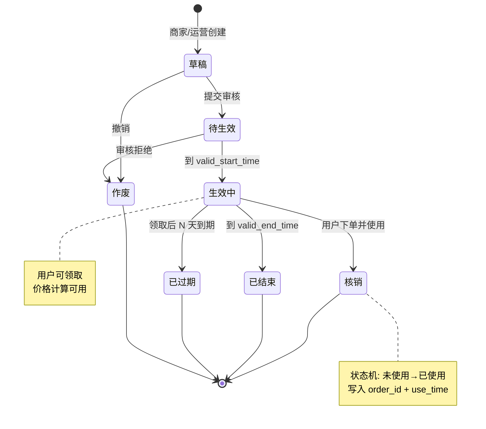

**5 个状态的转换规则**：

| 状态 | 触发条件 | 是否可发放 | 是否可核销 |
|------|---------|-----------|-----------|
| 草稿 | 运营刚创建 | 否 | 否 |
| 待生效 | 审核通过但未到生效时间 | 是（预热） | 否 |
| 生效中 | 在 valid_start_time 与 valid_end_time 之间 | 是 | 是 |
| 已结束 | 过了 valid_end_time | 否 | 否 |
| 作废 | 主动撤销（违规、停发） | 否 | 否 |

**用户的券实例**还有 2 个状态：未使用、已使用、已过期（在用户侧看）。

### 8.2.3 券的发放方式

| 发放方式 | 触发场景 | 技术实现 | 风险点 |
|---------|---------|---------|--------|
| **领券中心** | 用户主动进入「领券」Tab 领 | 高并发抢领，需 Redis 原子计数 | **超发**——必须 Redis 预扣 + DB 落库 |
| **活动发券** | 用户下单满 X 元自动发 | 订单履约后异步发 | 重复发——必须有唯一约束 |
| **系统定向发** | 新人礼包、会员升级、生日券 | 定时任务 / 事件触发 | 错发——必须有审计 |
| **兑换码** | 运营线下发码，用户兑换 | 一次性码 + 异步核销 | 码泄露——必须强随机 |

### 8.2.4 老王的 5 元无门槛券案例

老王在「王的潮品」创建了一张"5 元无门槛券"，发了 1000 张给关注店铺的粉丝：

```sql
-- 模板创建（伪代码）
INSERT INTO coupon_template (
    template_code, name, coupon_type, discount_type, discount_value,
    min_order_cent, total_count, per_user_limit, publish_type,
    valid_start_time, valid_end_time, bear_type, merchant_id, status
) VALUES (
    'TPL_2026_LIP_5OFF', '王的潮品 5 元无门槛券',
    3,        -- 无门槛券
    1,        -- 立减
    500,      -- 5 元 = 500 分
    0,        -- 0 元门槛
    1000,     -- 总发行 1000 张
    1,        -- 单人限领 1 张
    1,        -- 用户主动领
    '2026-06-01 00:00:00', '2026-06-30 23:59:59',
    2,        -- 商家承担
    8888,     -- 老王店铺 ID
    1         -- 待生效
);
```

---

## 8.3 促销活动体系

促销活动（Promotion）描述"对商品做整体的优惠"，与优惠券（针对个人）形成对比。

### 8.3.1 促销活动的关键属性

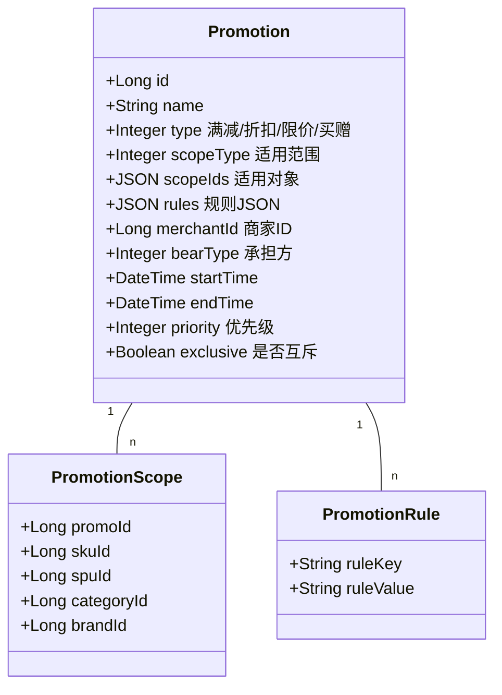

**关键字段说明**：

| 字段 | 含义 | 示例 |
|------|------|------|
| type | 活动类型 | 满减 / 折扣 / 限价 / 买赠 |
| scopeType | 适用范围 | 全店 / 品类 / 品牌 / 单品 |
| rules | 规则 JSON | `[{"full":200, "minus":30}, {"full":500, "minus":80}]`（满减多档）|
| priority | 优先级 | 数值大的优先（决定叠加顺序） |
| exclusive | 是否互斥 | true 则不与其他活动叠加 |

### 8.3.2 老王的「满 200 减 30」活动

老王为「王的潮品」创建了一个满减活动：

```json
{
    "name": "618 大促 · 满 200 减 30",
    "type": 1,                            // 满减
    "scopeType": 1,                       // 全店
    "scopeIds": [8888],                   // 商家 8888 的所有商品
    "rules": [
        {"full": 20000, "minus": 3000},   // 满 200 减 30
        {"full": 50000, "minus": 8000}    // 满 500 减 80
    ],
    "startTime": "2026-06-01 00:00:00",
    "endTime": "2026-06-18 23:59:59",
    "bearType": 2,                        // 商家承担
    "priority": 100,                      // 优先级
    "exclusive": false
}
```

---

## 8.4 价格计算引擎（本章核心）

### 8.4.1 价格分层模型

极购商城的价格分 4 层计算，从底向上：

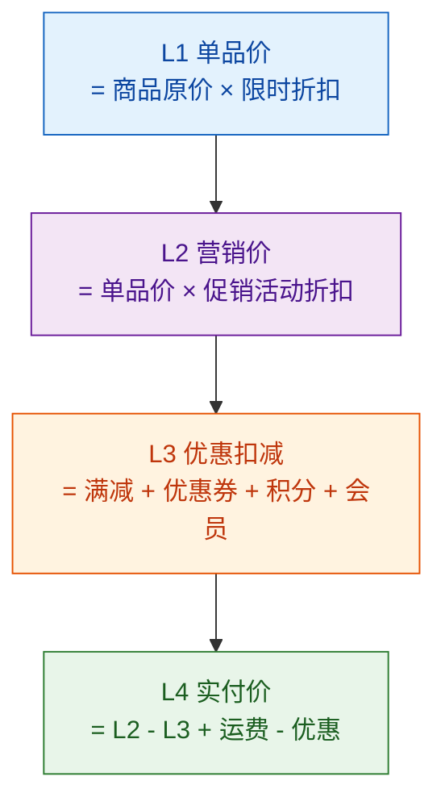

**每层的物理含义**：

| 层 | 含义 | 谁算 |
|----|------|------|
| L1 单品价 | 商品页面展示的"现价" | 营销中心 |
| L2 营销价 | 在 L1 基础上应用促销活动后的价 | 营销中心 |
| L3 优惠扣减 | 满减 + 券 + 积分 + 会员 | 价格引擎（合并计算） |
| L4 实付价 | 最终用户支付的钱 | 价格引擎 |

### 8.4.2 价格计算流程图

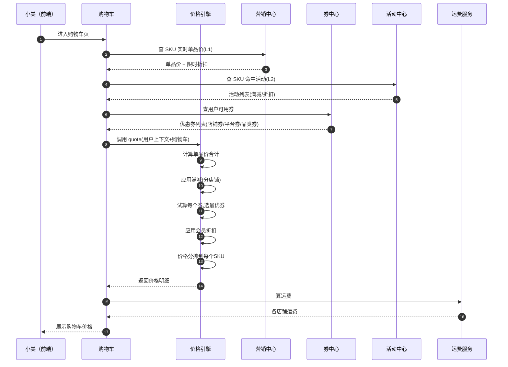

### 8.4.3 小美的购物车价格计算

小美在丝美旗舰店加购了 1 件口红（标价 199 元），同时持有 3 张券。

**计算过程**：

```
步骤 1: L1 单品价
   原价 199 元
   限时折扣 8 折 → 199 × 0.8 = 159.20 元

步骤 2: L2 营销价
   无促销活动 → 维持 159.20 元

步骤 3: L3 优惠扣减
   满 200 减 30 → 不满足（159.20 < 200）→ 不减
   满减合计 = 0
   
   试算 3 张券（详见 8.5 节"最优选"）：
     - 满 200 减 30 店铺券 → 不满足 → 不可用
     - 新人 10 元无门槛券 → 159.20 - 10 = 149.20
     - 满 199 打 8 折 品牌券 → 159.20 × 0.8 = 127.36
       实际减 31.84 元，比新人券更划算
   
   选择最划算的：满 199 打 8 折品牌券
   券合计 = -31.84 元

步骤 4: L4 实付价
   实付 = 159.20 - 0 - 31.84 + 0 (运费满 99 免) = 127.36 元
```

### 8.4.4 价格计算引擎 Java 代码

```java
import org.springframework.beans.factory.annotation.Autowired;
import org.springframework.stereotype.Service;
import java.math.BigDecimal;
import java.math.RoundingMode;
import java.util.*;

/**
 * 价格计算引擎（核心）
 * 接收用户上下文 + 购物车条目，返回每条 SKU 的实时价格与总实付
 */
@Service
public class PriceEngine {

    @Autowired private CouponClient couponClient;
    @Autowired private PromotionClient promotionClient;
    @Autowired private MemberClient memberClient;
    @Autowired private PointClient pointClient;

    /** 价格计算请求 */
    public static class QuoteRequest {
        public long userId;
        public String userLevel;          // VIP/金牌/银牌
        public long pointBalance;         // 积分余额
        public List<CartItem> items;      // 购物车条目
    }

    /** 价格计算响应（每个店铺一份） */
    public static class QuoteResponse {
        public long merchantId;
        public BigDecimal goodsTotal;         // L2 合计(营销价)
        public BigDecimal promotionDiscount;  // 满减等促销扣减
        public BigDecimal couponDiscount;     // 优惠券扣减
        public BigDecimal memberDiscount;     // 会员折扣
        public BigDecimal pointDiscount;      // 积分抵现
        public BigDecimal freight;            // 运费
        public BigDecimal finalPay;           // L4 实付价
        public List<DiscountDetail> details;  // 明细列表(展示用)
        public List<ItemPrice> itemPrices;    // 每个SKU的最终价+分摊
    }

    public QuoteResponse quote(QuoteRequest req) {
        // 1. 按店铺分组
        Map<Long, List<CartItem>> byMerchant = groupByMerchant(req.items);
        // 2. 调营销中心拿到 L1 + L2
        Map<Long, List<ItemPrice>> itemPriceMap = promotionClient
            .batchCalcPrice(req.userId, req.userLevel, req.items);
        // 3. 拿用户可用券
        List<Coupon> userCoupons = couponClient.listAvailable(req.userId, req.items);
        // 4. 算每个店铺
        return calcMerchantQuote(req, byMerchant, itemPriceMap, userCoupons);
    }

    private QuoteResponse calcMerchantQuote(
            QuoteRequest req,
            Map<Long, List<CartItem>> byMerchant,
            Map<Long, List<ItemPrice>> itemPriceMap,
            List<Coupon> coupons) {
        
        QuoteResponse resp = new QuoteResponse();
        resp.details = new ArrayList<>();
        resp.itemPrices = new ArrayList<>();
        
        // 4.1 算商品合计(L2)
        BigDecimal goodsTotal = BigDecimal.ZERO;
        for (ItemPrice p : itemPriceMap.values()) {
            goodsTotal = goodsTotal.add(p.l2Price.multiply(BigDecimal.valueOf(p.qty)));
        }
        resp.goodsTotal = goodsTotal;
        
        // 4.2 应用满减(店铺内)
        BigDecimal promoDisc = applyShopPromotion(goodsTotal, req.items);
        resp.promotionDiscount = promoDisc;
        
        // 4.3 试算所有可用券,选最优(详见 8.5 节)
        BigDecimal couponDisc = selectBestCoupon(coupons, goodsTotal, req);
        resp.couponDiscount = couponDisc;
        
        // 4.4 会员折扣
        BigDecimal memberDisc = applyMemberDiscount(goodsTotal, req.userLevel);
        resp.memberDiscount = memberDisc;
        
        // 4.5 积分抵现(用户勾选才用)
        BigDecimal pointDisc = applyPoint(req.userId, req.pointBalance);
        resp.pointDiscount = pointDisc;
        
        // 4.6 运费
        BigDecimal freight = calcFreight(goodsTotal, req.items);
        resp.freight = freight;
        
        // 4.7 实付 = goodsTotal - 所有优惠 + 运费
        resp.finalPay = goodsTotal
            .subtract(promoDisc)
            .subtract(couponDisc)
            .subtract(memberDisc)
            .subtract(pointDisc)
            .add(freight)
            .setScale(2, RoundingMode.HALF_UP);
        
        // 4.8 价格分摊到每个SKU(详见 8.7 节)
        resp.itemPrices = allocateByItem(itemPriceMap, resp);
        return resp;
    }

    // 应用店铺内满减(取最高一档)
    private BigDecimal applyShopPromotion(BigDecimal total, List<CartItem> items) {
        List<Promotion> promos = promotionClient.queryActive(items);
        BigDecimal maxDisc = BigDecimal.ZERO;
        for (Promotion p : promos) {
            if (p.type == 1) { // 满减
                for (Rule r : p.rules) {
                    if (total.compareTo(r.full) >= 0) {
                        maxDisc = maxDisc.max(r.minus);
                    }
                }
            } else if (p.type == 2) { // 折扣
                // 折扣是改单价,不影响这里的 promotionDiscount
            }
        }
        return maxDisc;
    }
    
    // 选最优券(详见 8.5 节)
    private BigDecimal selectBestCoupon(List<Coupon> coupons,
                                        BigDecimal total, QuoteRequest req) {
        // 见 CouponSelector.select
        return new CouponSelector().select(coupons, total, req).discount;
    }
}
```

### 8.4.5 价格计算的关键约束

**约束 1：实付价不能为负**

```java
// 任何 SKU 的最终单价不能为负(系统强制)
if (itemPrice.l4Price < 0) {
    itemPrice.l4Price = 0; // 不退给用户钱,只实付 0 元
}
```

**约束 2：用户实付不能超过商品总价**

营销活动、优惠券叠加后，实付 ≥ 0。极端情况：所有优惠都打到该商品，商品价 = 0 元（用户 0 元购）。

**约束 3：价格不缓存到购物车**

第 5 章已强调：购物车只缓存"指针"，价格每次渲染实时算。

---

## 8.5 优惠叠加与互斥

### 8.5.1 三类叠加规则

| 规则 | 说明 | 典型场景 |
|------|------|---------|
| **平行叠加** | 多个优惠可同时使用 | 满减 + 优惠券（行业主流） |
| **互斥** | 同类优惠只能选 1 个 | 店铺券 vs 平台券、折扣券 vs 满减券 |
| **最优选** | 系统自动选用户最划算的组合 | 同时持有 5 张券时系统推荐最优 |

### 8.5.2 叠加规则图

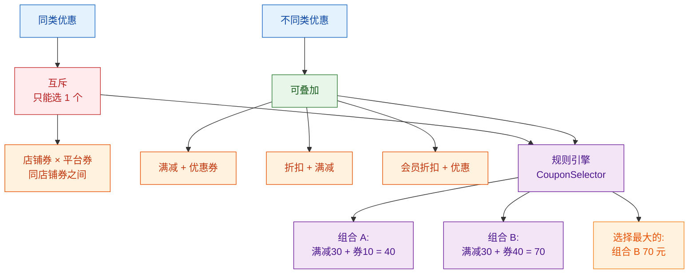

### 8.5.3 优惠叠加规则 Java 代码

```java
import java.math.BigDecimal;
import java.util.*;

/**
 * 优惠叠加规则引擎
 * 输入：用户持有的券列表、商品合计、用户上下文
 * 输出：最优券 + 实际抵扣金额 + 推荐组合
 */
@Service
public class CouponSelector {

    /** 选券结果 */
    public static class SelectResult {
        public Coupon bestCoupon;             // 最优券(null表示不用券)
        public BigDecimal discount;           // 该券抵扣的金额
        public List<String> warnings;         // 提示信息
    }

    /**
     * 在用户的所有可用券中选最优
     * 规则：
     *   1. 过滤出真正可用的(满足门槛/有效期/适用范围)
     *   2. 同类券(店铺券互斥)分组,组内选最优
     *   3. 不同类之间都叠加
     *   4. 计算总抵扣,选最大组合
     */
    public SelectResult select(List<Coupon> coupons,
                                BigDecimal goodsTotal,
                                PriceEngine.QuoteRequest req) {
        // Step 1: 过滤可用券
        List<Coupon> available = new ArrayList<>();
        for (Coupon c : coupons) {
            if (canUse(c, goodsTotal, req)) {
                available.add(c);
            }
        }
        if (available.isEmpty()) {
            return new SelectResult(null, BigDecimal.ZERO, Collections.emptyList());
        }

        // Step 2: 按"互斥组"分类
        // 互斥组定义:同一店铺的券/同类型的券只能选 1 张
        Map<String, List<Coupon>> grouped = new HashMap<>();
        for (Coupon c : available) {
            String groupKey = c.scopeType + ":" + c.merchantId;
            // 同组内互斥
            grouped.computeIfAbsent(groupKey, k -> new ArrayList<>()).add(c);
        }

        // Step 3: 每组选最优
        List<Coupon> selected = new ArrayList<>();
        for (List<Coupon> group : grouped.values()) {
            Coupon best = pickBestInGroup(group, goodsTotal);
            if (best != null) {
                selected.add(best);
            }
        }

        // Step 4: 试算每张选中券的抵扣
        SelectResult best = new SelectResult();
        best.discount = BigDecimal.ZERO;
        for (Coupon c : selected) {
            BigDecimal disc = calcCouponDiscount(c, goodsTotal);
            if (disc.compareTo(best.discount) > 0) {
                best.bestCoupon = c;
                best.discount = disc;
            }
        }
        // 简化版:实际生产应该算所有券组合的总抵扣
        return best;
    }

    private boolean canUse(Coupon c, BigDecimal total, PriceEngine.QuoteRequest req) {
        if (c.status != 1) return false;            // 未使用
        if (c.validEndTime < System.currentTimeMillis()) return false;  // 已过期
        if (total.compareTo(c.minOrderCent) < 0) return false;  // 不满足门槛
        // 校验适用范围(skuId/品牌/品类)
        return scopeMatch(c, req.items);
    }

    private BigDecimal calcCouponDiscount(Coupon c, BigDecimal total) {
        if (c.discountType == 1) {
            // 立减券:固定金额
            return BigDecimal.valueOf(c.discountValue).divide(100);
        } else if (c.discountType == 2) {
            // 折扣券:total × (1 - 折扣/10)
            BigDecimal rate = BigDecimal.valueOf(10 - c.discountValue / 100.0);
            BigDecimal disc = total.multiply(BigDecimal.ONE.subtract(rate));
            // 封顶
            if (c.maxDiscountCent > 0 && disc.multiply(100).longValue() > c.maxDiscountCent) {
                disc = BigDecimal.valueOf(c.maxDiscountCent).divide(100);
            }
            return disc;
        }
        return BigDecimal.ZERO;
    }
}
```

### 8.5.4 小美 3 张券的最优选

回到小美案例：她持有 3 张券（满 200 减 30 店铺券、新人 10 元无门槛券、满 199 打 8 折品牌券），商品价 159.20 元。

| 券 | 门槛 | 实际抵扣 | 结论 |
|----|------|---------|------|
| 满 200 减 30 店铺券 | 满 200 | 不满足 | 不可用 |
| 新人 10 元无门槛券 | 0 | 10 元 | 可用，减 10 |
| 满 199 打 8 折品牌券 | 满 199 | 31.84 元 | 可用，减 31.84 |

系统自动选最划算的：**满 199 打 8 折品牌券**（减 31.84 元）。

---

## 8.6 预付定金与膨胀

大促的"定金膨胀"是另一类玩法：100 元定金抵 200 元尾款，刺激用户提前锁单。

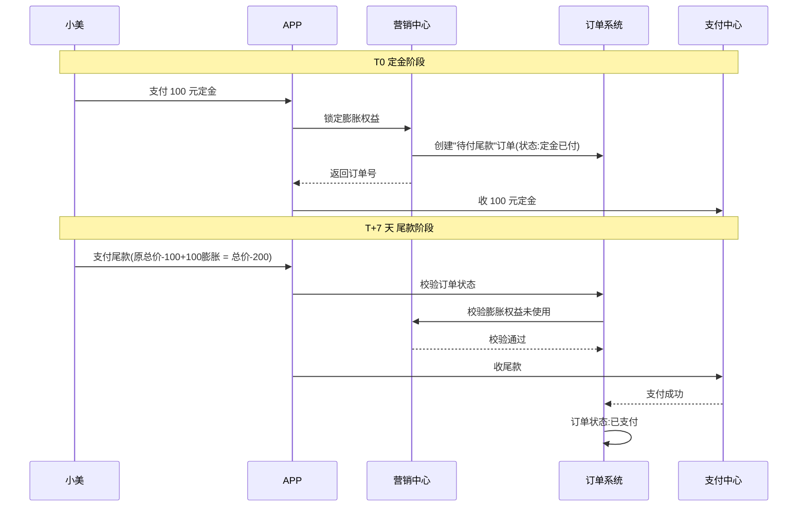

**关键设计**：
- 定金订单独立的状态机，30 分钟未付自动取消
- 膨胀权益在用户付定金时"锁定"，避免规则中途修改
- 尾款阶段校验"权益 + 订单状态"双重通过

---

## 8.7 价格分摊

当订单里有多个 SKU 共用一张「满 200 减 30」时，30 元不能"凭空消失"，必须按比例分摊到每个 SKU，否则退款时无法精确退。

### 8.7.1 分摊原则

| 原则 | 含义 |
|------|------|
| **按比例分摊** | 优惠按各 SKU 的实付比例分摊 |
| **不重复计算** | 每笔优惠只分摊一次 |
| **最后一条抹零** | 抹零金额放到最后一条 SKU 上 |

### 8.7.2 分摊示例

小美下了一单 3 个 SKU，共用 1 张「满 200 减 30」券：

| SKU | 营销价 | 占比 | 分摊券优惠 | 分摊后实付 |
|-----|--------|------|------------|------------|
| 口红 | 159.20 | 79.6% | 23.88 | 135.32 |
| 唇膏 | 89.00 | — | — | — |
| (凑单品)保温杯 | 41.00 | 20.4% | 6.12 | 34.88 |
| **合计** | 200.20 | 100% | **30.00** | 170.20 |

**注**：唇膏在 200 元门槛前没满，是凑单品。

### 8.7.3 价格分摊 Java 代码

```java
import java.math.BigDecimal;
import java.math.RoundingMode;
import java.util.*;

/**
 * 价格分摊器
 * 解决多 SKU 共用一张券时，优惠按比例分摊到每个 SKU
 */
@Service
public class PriceAllocator {

    /**
     * 按比例分摊优惠到各 SKU
     * @param items  SKU 列表(含 L2 营销价)
     * @param totalDiscount 总优惠金额
     * @return 每个 SKU 分摊到的优惠
     */
    public Map<Long, BigDecimal> allocate(
            List<ItemPrice> items, BigDecimal totalDiscount) {
        
        Map<Long, BigDecimal> result = new HashMap<>();
        if (items.isEmpty() || totalDiscount.compareTo(BigDecimal.ZERO) <= 0) {
            items.forEach(i -> result.put(i.skuId, BigDecimal.ZERO));
            return result;
        }
        
        // 1. 算合计
        BigDecimal total = items.stream()
            .map(i -> i.l2Price.multiply(BigDecimal.valueOf(i.qty)))
            .reduce(BigDecimal.ZERO, BigDecimal::add);
        
        // 2. 按比例分摊(用 BigDecimal 避免浮点误差)
        BigDecimal allocated = BigDecimal.ZERO;
        for (int idx = 0; idx < items.size(); idx++) {
            ItemPrice item = items.get(idx);
            BigDecimal itemTotal = item.l2Price.multiply(BigDecimal.valueOf(item.qty));
            BigDecimal ratio = itemTotal.divide(total, 6, RoundingMode.HALF_UP);
            BigDecimal share;
            if (idx == items.size() - 1) {
                // 最后一条:用减法抹零,保证总和精确
                share = totalDiscount.subtract(allocated);
            } else {
                share = totalDiscount.multiply(ratio).setScale(2, RoundingMode.HALF_UP);
                allocated = allocated.add(share);
            }
            result.put(item.skuId, share);
        }
        return result;
    }

    /** 退款时反算 */
    public BigDecimal refundAmount(
            long skuId, int refundQty, BigDecimal allocatedDiscount) {
        // 单价 = 分摊后实付 / 数量
        // 退款金额 = 单价 × 退款数量
        // 包含优惠部分:也要按比例退
        return allocatedDiscount; // 简化
    }
}
```

**为什么分摊对退款至关重要**：

```
场景:小美买了 3 个 SKU 共付 170.20 元，退掉 1 个口红(实付 135.32)。
  - 不分摊:系统无法精确算出"口红该退多少"，可能退 159.20(原价)或 30 元的券优惠
  - 分摊后:精确退 135.32 - 23.88(口红分摊的券) = 111.44 元
  - 退券:把 23.88 元的券优惠按"剩余商品"重新计算
```

---

## 8.8 价格服务化

### 8.8.1 营销中心独立成域

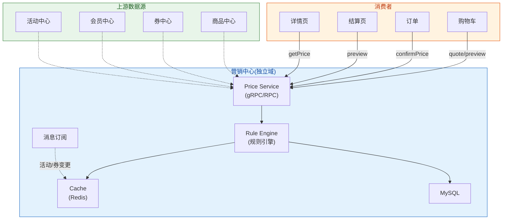

### 8.8.2 三个核心接口

| 接口 | 用途 | 调用方 | 是否锁价 |
|------|------|-------|---------|
| `quote` | 实时报价(购物车展示) | 购物车、详情页 | 否 |
| `preview` | 预览(下单前) | 结算页 | 否 |
| `confirmPrice` | 锁价(下单) | 订单系统 | **是** |

**为什么需要锁价**：

```
小美 10:00 看到 119.20 元
  ↓ 玩了一会手机
小美 11:30 提交订单
  ↓ 如果不锁价,可能变 130 元
  → 用户投诉"价格变来变去"
  
锁价逻辑:confirmPrice 时把 119.20 写死到订单,后续变化不影响
```

### 8.8.3 上下游对接

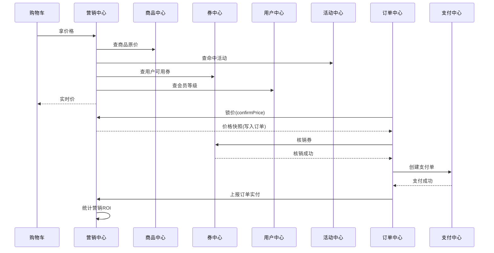

---

## 8.9 价格缓存

价格计算的 QPS 在大促期间可能突破百万，三级缓存是必须的。

### 8.9.1 三级缓存架构

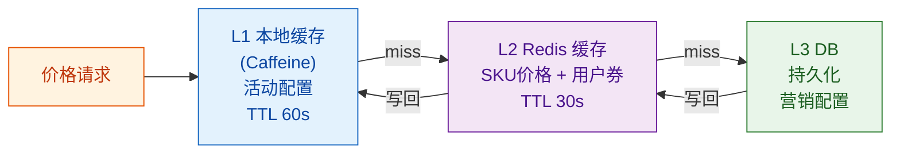

| 缓存层级 | 缓存内容 | TTL | 失效触发 |
|---------|---------|-----|---------|
| L1 本地 | 活动配置、规则 | 60s | 定时刷新 |
| L2 Redis | SKU 价格、用户券列表 | 30s | 写操作清除 |
| L3 DB | 全量 | — | — |

### 8.9.2 缓存失效策略

| 数据 | 失效方式 | 原因 |
|------|---------|------|
| 活动配置 | 运营改价 → MQ 广播清除 | 强一致要求 |
| 用户券 | 核销 → 单 key 失效 | 防重发 |
| SKU 价格 | 商家改价 → 失效 | 中等一致 |

---

## 8.10 典型问题与解法

### 8.10.1 价格穿透（先涨价再打折）

**问题**：商家在大促前先涨价，再用"8 折"打回原价，用户实际未得利。

**解法**：
- 系统记录商品"30 天最低价"
- 促销价不能高于最低价
- 大促前 7 天涨价幅度被审计

### 8.10.2 价格一致性

**问题**：购物车显示 119.20，下单变 125.00，支付变 130.00。

**解法**：
- 锁价：订单系统调 `confirmPrice` 写死价格
- 订单详情页显示"已锁价"
- 支付时校验"订单实付 = 支付金额"，不等则失败

### 8.10.3 券超发

**问题**：1000 张券发出 1500 张。

**解法**：

```java
// Redis 原子预扣 + DB 异步落库
Long remain = redis.decr("coupon:tpl:" + templateId + ":remain");
if (remain < 0) {
    redis.incr("coupon:tpl:" + templateId + ":remain");
    throw new BizException("已抢光");
}
// 异步落 DB
mq.send("coupon-grant", new GrantEvent(userId, templateId));
```

### 8.10.4 优惠倒挂

**问题**：实际支付比商家发货成本还低，商家亏损。

**解法**：
- 商家设置"最低成交价"（如 50 元）
- 价格引擎校验：`实付 ≥ 最低成交价`
- 极端情况系统拒绝下单并提示

---

## 8.11 贯穿案例：小美结算

把本章知识串起来——小美的结算流程：

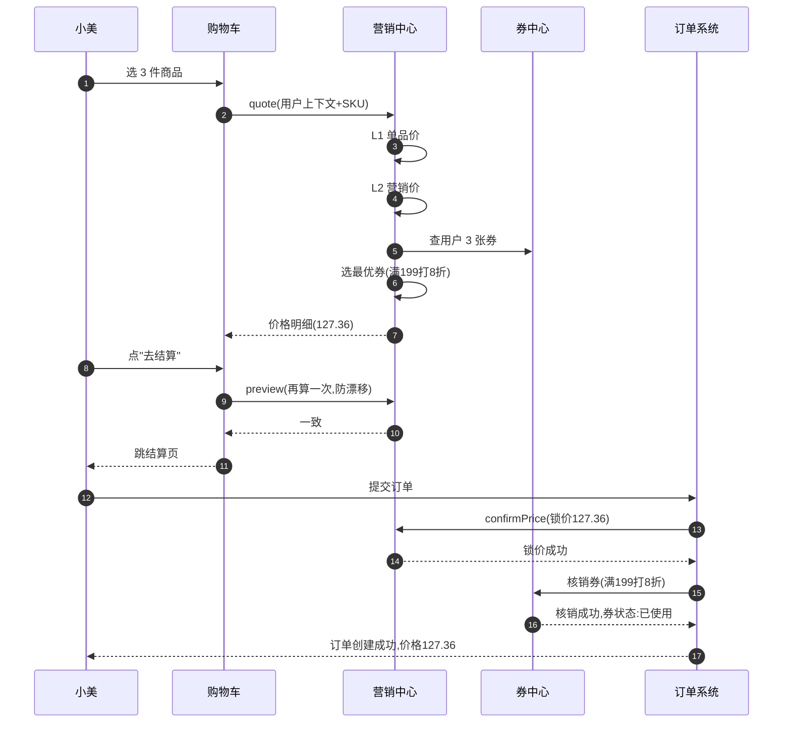

**小美的最终账单**：

```
口红 × 1                199.00
店铺限时折扣 8 折        -39.80
满 199 打 8 折 品牌券    -31.84
─────────────────────────────
实付：                  127.36
```

老王那边的店铺满 200 减 30 没生效（小美只买了 1 件口红，没凑够 200）；他发的 5 元无门槛券也没用（小美没用上）。小美**用错了券？**其实系统已经替她选了最划算的（满 199 打 8 折减 31.84 > 新人 10 元无门槛减 10）。

---

## 本章小结

| 知识点 | 关键结论 |
|--------|---------|
| **营销工具** | 8 大类:优惠券/满减/限时折扣/秒杀/拼团/砍价/积分/会员折扣 |
| **券体系** | 模板-实例两层模型；5 状态生命周期；4 种发放方式 |
| **价格分层** | L1 单品价 → L2 营销价 → L3 优惠扣减 → L4 实付价 |
| **叠加规则** | 平行叠加(满减+券) + 互斥(同组选 1) + 最优选(自动算最大) |
| **价格分摊** | 多 SKU 共用优惠时按比例分摊，最后一条抹零 |
| **锁价** | confirmPrice 接口锁死,防价格漂移 |
| **缓存** | L1 本地 + L2 Redis + L3 DB, MQ 广播失效 |
| **典型问题** | 穿透/一致/超发/倒挂都有对应解法 |

**技能点自测**：
- [ ] 能否解释为什么"价格永远不缓存到购物车"？
- [ ] 能否画出价格分层模型（L1~L4）的流转？
- [ ] 能否在 5 分钟内写完 CouponSelector 的最优选逻辑？
- [ ] 能否解释"价格分摊"对退款金额计算的影响？
- [ ] 能否说出 4 种典型价格问题的解法？

**与相邻章节的关系**：
- 本章的价格计算被第 5 章（购物车）、第 6 章（订单）调用
- 本章的活动规则被第 9 章（秒杀）复用
- 本章的分摊逻辑被第 12 章（售后退款）强依赖——退款金额 = 单价 × 数量 - 分摊优惠
- 本章的券状态机与第 12 章的退券逻辑关联

下一章预告：第 9 章「秒杀系统设计」将进入大促最激烈的场景——日千万级 QPS、秒级库存竞争、千万用户同时抢 100 件商品。我们会看到秒杀与普通营销的根本差异：库存预扣要下沉到 Redis、价格要在网关直接计算、风控要在第一道门拦住机器人。

---

下一章：[第 9 章 · 秒杀系统设计](./09-秒杀系统设计.md)

---

## 参考来源

1. **阿里淘宝营销中心架构演进** —— 淘系技术团队博客  
   淘宝营销系统从规则引擎到 DAG 编排的演进、亿级 QPS 实战  
   https://developer.aliyun.com/article/

2. **京东优惠券系统设计** —— 京东技术专题  
   京东券模板-实例模型、发放防超发、核销一致性  
   https://tech.jd.com/

3. **美团营销计价引擎实践** —— 美团技术团队  
   计价规则 DSL、规则引擎、优惠叠加与最优选  
   https://tech.meituan.com/

4. **Drools 规则引擎官方文档**  
   优惠叠加规则的工业级规则引擎方案  
   https://drools.org/

5. **Aviator 表达式引擎** —— Java  
   轻量级表达式求值，用于价格规则动态配置  
   https://github.com/killme2008/aviator

6. **阿里双 11 价格一致性保障** —— InfoQ  
   大促期间价格一致性的工程实践（锁价、补偿、对账）  
   https://www.infoq.cn/

7. **《电商系统架构：交易域设计》** —— 李志勇  
   价格计算引擎、优惠叠加、价格分摊的系统性论述

8. **Spring State Machine 官方文档**  
   优惠券生命周期状态机的实现参考  
   https://spring.io/projects/spring-statemachine

9. **Redis 分布式锁与原子操作**  
   券防超发的 Redis Lua 脚本与乐观锁实现  
   https://redis.io/docs/manual/transactions/

10. **Drip 平台架构（极光大数据）**  
    营销活动编排与 A/B 测试的工程实践  
    https://www.jiguang.cn/
