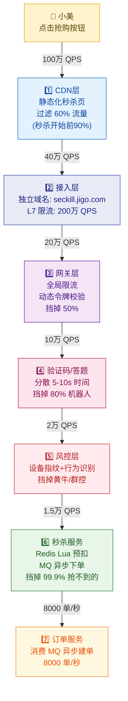
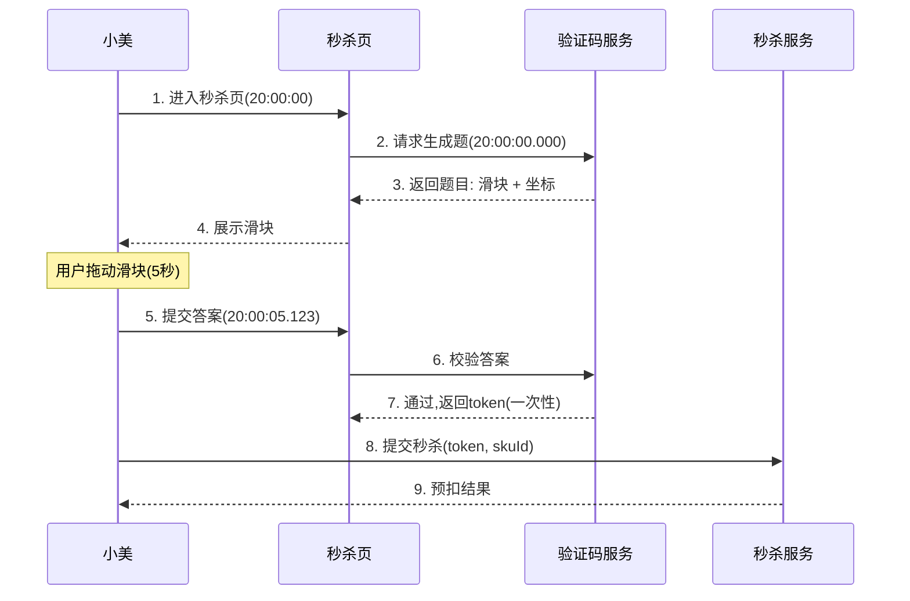
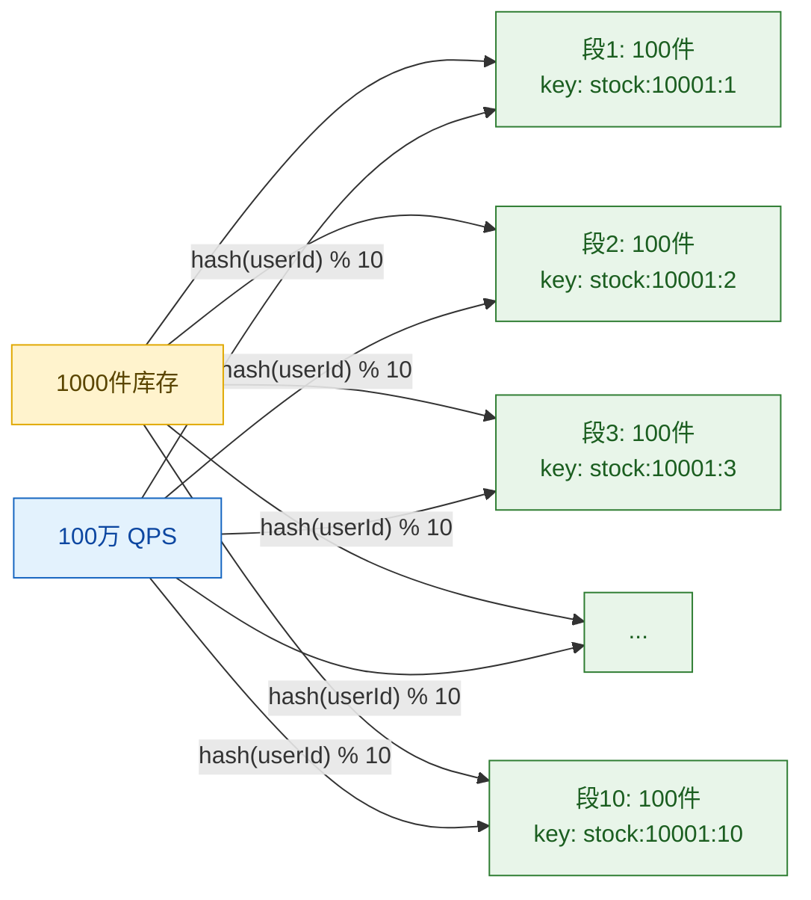
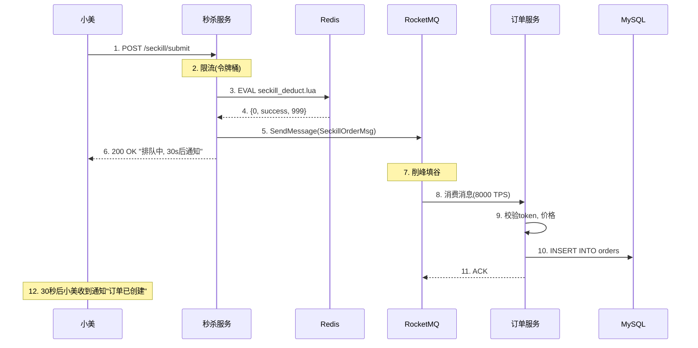
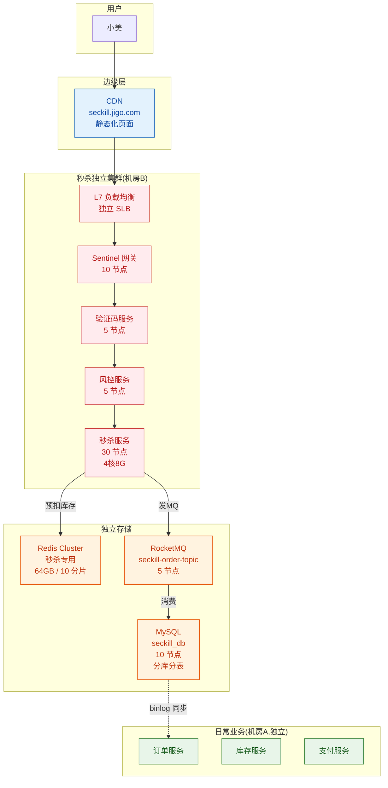
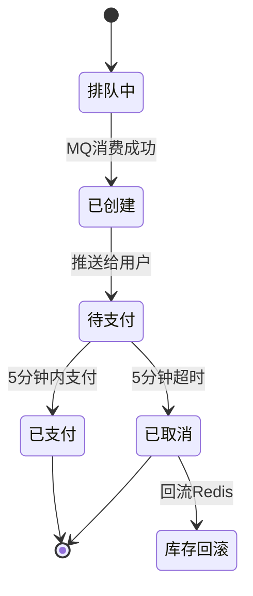
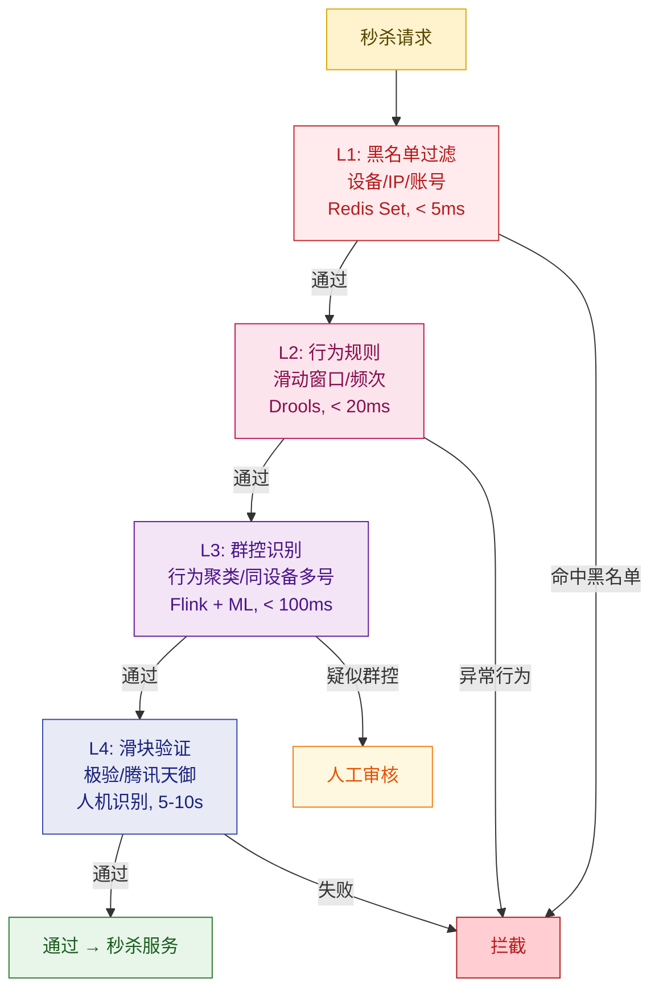
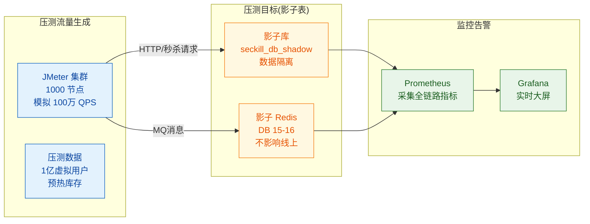
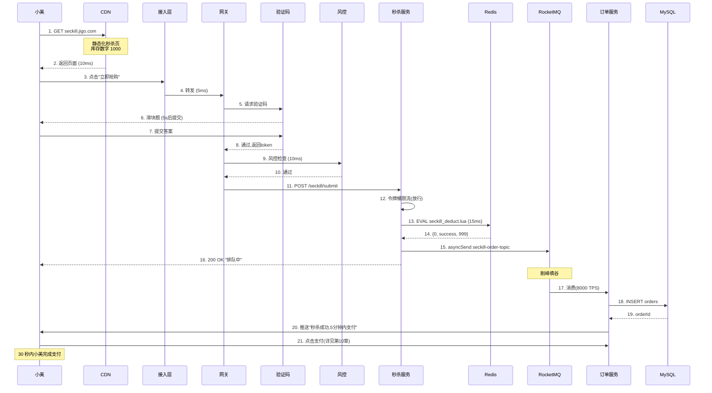

# 第 9 章 · 秒杀系统设计：极致高并发实战

> **所属系列**：《极购商城系统设计 · 全景教程》第三部分 · 交易域
> **上一章**：[第 8 章 · 营销中心与价格计算](./08-营销中心与价格计算.md)　|　**下一章**：[第 10 章 · 支付系统](./10-支付系统.md)　|　**总目录**：[教程大纲](./00-教程大纲.md)

---

## 本章导读

前 8 章铺垫了商品、详情、购物车、订单、库存、价格引擎——所有这些系统都被设计为「日常 50 万 QPS、大促峰值 100 万 QPS」量级。**秒杀**则把这种压力再放大 10 倍：日常看起来"绰绰有余"的系统，在秒杀瞬间会被瞬时洪峰直接打穿。

来看一组真实数据：

- **极购商城每天 10 场秒杀**，每场峰值 100 万 QPS
- **小美**参加老王的 T 恤秒杀：10 万人抢 1000 件，成功率仅 1%
- **老王**的 T 恤库存 1000 件，秒杀失败最坏后果——超卖 100 件，老王不仅赚不到钱还要面对 100 个差评

秒杀系统是商城所有业务里**"流量与库存矛盾最尖锐"**的子域。它要求系统在三个相互冲突的目标之间精确平衡：

| 目标 | 含义 | 工程难度 |
|------|------|---------|
| **公平** | 先到先得，不能让黄牛垄断 | 群控识别 + 限购 + 验证码 |
| **体验** | 99.9% 抢不到的用户也不能"白等 30 秒" | 快速失败 + 排队反馈 |
| **不超卖** | 1000 件库存绝不能卖 1001 件 | Redis Lua 原子扣减 + DB 兜底 |

本章将围绕"小美抢 T 恤"这条主线，深入拆解秒杀系统的 7 层链路、流量削峰、库存防超卖、MQ 异步下单、防刷风控、热点隔离与压测演练。具体内容安排如下：

1. **秒杀本质**：流量-库存矛盾、目标三角
2. **7 层链路全景**：前端 → CDN → 接入层 → 网关 → 风控 → 秒杀服务 → 订单服务
3. **流量削峰**：答题、令牌桶、MQ 排队三种姿势
4. **库存防超卖**：Redis Lua 原子扣减 + 分段库存
5. **MQ 异步下单**：把 100 万 QPS 削成 8000 订单/秒
6. **限购与防刷**：单用户/IP/设备三层防线
7. **热点隔离**：秒杀独立集群、独立 Redis、独立 DB
8. **动态 URL 与令牌**：防提前下单
9. **支付与超时**：5 分钟限时支付
10. **风控与反作弊**：黑名单、群控识别、滑块验证
11. **压测与故障演练**：百万 QPS 全链路验证
12. **典型问题与陷阱**：超卖、重复下单、回滚失败、风控误杀
13. **实战案例**：小美抢 T 恤完整链路追踪

> 注：第 7 章（库存系统）讲的是日常库存预扣与最终一致；本章是其「秒杀特化版」——同样的原理，但要求把 10 万 QPS 的并发再放大 10 倍。

---

## 9.1 秒杀的本质：流量 × 库存的乘积

### 9.1.1 三个数字定义秒杀

把"秒杀"这件事抽象成三个数：

$$
\text{秒杀难度} = \frac{\text{瞬时流量 QPS} \times \text{持续时间}}{\text{库存数}}
$$

代入极购商城的实际数据：

| 维度 | 数值 | 含义 |
|------|------|------|
| 瞬时流量 QPS | 100 万 | 100 万人同一秒点击「立即抢购」 |
| 持续时间 | 30 秒 | 从按钮亮起到库存耗尽 |
| 库存 | 1000 件 | 老王 T 恤的秒杀库存 |
| **总请求数** | **3000 万** | 100万 × 30秒 |
| **成功率** | **0.003%** | 1000 ÷ 3000万 |

**结论**：99.997% 的请求注定失败。秒杀系统的设计目标不是"让所有请求都成功"——**而是"让 99.99% 的请求在 100ms 内快速失败，并保证 0.01% 的成功请求不超卖"**。

### 9.1.2 秒杀与日常下单的本质差异

| 维度 | 日常下单 | 秒杀 |
|------|---------|------|
| 流量特征 | 平稳 50 万 QPS | 脉冲 100 万 QPS（10× 突发） |
| 写比例 | 读写 1:50 | 读写 1:1000（几乎全写） |
| 业务目标 | 转化率 | 公平 + 不超卖 |
| 一致性 | 钱、券、库存强一致 | 库存强一致（其他可最终一致） |
| 失败处理 | 让用户修改重试 | 必须快速失败（30 秒内给结果） |

**核心矛盾**：日常系统设计的"友好降级"在秒杀场景变成"灾难"——一旦你让 10 万失败请求在网关层停留 5 秒等待，10 万 × 5 秒 = 50 万秒-请求，会把网关线程池瞬间打爆。

---

## 9.2 秒杀端到端链路：7 层漏斗

整条秒杀链路必须做成"漏斗形"——每一层都过滤掉大部分流量，最后只有 1000 单真正落到 DB。



**漏斗每一层的关键作用**：

| 层级 | 关键职责 | 过滤比例 | 失败延迟 |
|------|---------|---------|---------|
| **CDN** | 静态化秒杀页（HTML + 库存数字） | 60% 流量在边缘终结 | < 10ms |
| **接入层** | 独立域名 + L7 限流 | 50% | < 5ms |
| **网关** | 动态令牌、全局限流 | 50% | < 10ms |
| **验证码** | 滑块 / 答题，分散时间 | 80% 机器人 | 5–10s |
| **风控** | 设备指纹、群控识别 | 30% 黄牛 | < 50ms |
| **秒杀服务** | Redis Lua 预扣库存 | 99.9% 抢不到的 | < 100ms |
| **订单服务** | MQ 异步建单 | 仅 1000 单/场 | 异步 |

---

## 9.3 流量削峰：三种姿势叠加

流量削峰的核心思想是：**把"瞬时 100 万 QPS"分散到"持续 8000 TPS"**。三种姿势必须叠加使用。

### 9.3.1 答题/验证码：分散请求时间

最经典的削峰方式——**让用户先答一道题**：



**核心收益**：
- **5 秒做题时间** = 100 万请求被分散到 5 秒窗口 = 20 万 QPS（5× 削峰）
- **黄牛成本提升**：写脚本必须能识别图片、滑块，门槛大幅提高
- **失败成本低**：用户答错就重答，不会像"按钮没抢到"那样产生差评

### 9.3.2 令牌桶：算法级限流

**令牌桶（Token Bucket）**是秒杀网关最常用的限流算法。每个请求必须"领取令牌"才能继续：

```java
/**
 * 令牌桶限流器
 * 设计目标：
 *  1. 桶容量 200,000（瞬时允许 2× 突发）
 *  2. 令牌产生速率 100,000 / 秒（稳态 QPS）
 *  3. 拿不到令牌立即失败（绝不等待）
 */
public class TokenBucketRateLimiter {

    private final long capacity;        // 桶容量
    private final long refillRate;      // 每秒补充令牌数
    private final AtomicLong availableTokens;  // 当前可用令牌
    private final AtomicLong lastRefillNanos;  // 上次补充时间

    public TokenBucketRateLimiter(long capacity, long refillRate) {
        this.capacity = capacity;
        this.refillRate = refillRate;
        this.availableTokens = new AtomicLong(capacity);
        this.lastRefillNanos = new AtomicLong(System.nanoTime());
    }

    /**
     * 非阻塞尝试获取令牌
     * @return true 拿到令牌, false 立即拒绝
     */
    public boolean tryAcquire() {
        refillIfNeeded();

        long current = availableTokens.get();
        if (current <= 0) {
            metrics.increment("seckill.ratelimit.rejected");
            return false;
        }
        // CAS 扣减
        return availableTokens.compareAndSet(current, current - 1);
    }

    private void refillIfNeeded() {
        long now = System.nanoTime();
        long last = lastRefillNanos.get();
        long elapsedNanos = now - last;
        if (elapsedNanos > 1_000_000_000L) { // 1秒
            long tokensToAdd = (elapsedNanos / 1_000_000_000L) * refillRate;
            long newTokens = Math.min(capacity, availableTokens.get() + tokensToAdd);
            if (lastRefillNanos.compareAndSet(last, now)) {
                availableTokens.set(newTokens);
            }
        }
    }
}
```

**令牌桶 vs 漏桶 vs 计数器**：

| 算法 | 突发处理 | 平滑度 | 实现复杂度 | 秒杀场景 |
|------|---------|-------|-----------|---------|
| **计数器** | 差（边界突刺） | 差 | 低 | ❌ 易被打穿 |
| **漏桶** | 强制匀速 | 极佳 | 中 | ⚠️ 浪费突发能力 |
| **令牌桶** | 允许短时突发 | 好 | 中 | ✅ **推荐** |

### 9.3.3 业务排队：MQ 异步下单

**这是削峰的核心手段**——秒杀请求不直接创建订单，而是投递到 MQ，由订单服务慢慢消费：

```
100万 QPS 秒杀请求
   ↓ Redis 预扣库存（不创建订单）
   ↓ 投递 MQ 消息
MQ 削峰填谷
   ↓ 订单服务 8000 TPS 消费
DB 慢慢写
```

100 万 → 8000 是什么概念？峰值削掉了 125 倍！具体怎么实现见 9.5 节。

---

## 9.4 库存防超卖：Redis Lua 原子扣减

### 9.4.1 为什么不能直接用 MySQL 行锁

最朴素的想法：在 DB 上用 `SELECT ... FOR UPDATE` 行锁防超卖。

**问题**：100 万 QPS 全部打到 MySQL，**MySQL 会被直接打死**——单机 MySQL 极限也就 5 万 QPS，行锁会让 95% 的请求阻塞等待，P99 延迟飙升到分钟级，连接池瞬间打满。

**解决思路**：把库存扣减从 MySQL 移到 **Redis**（内存 KV，10 万 QPS/单实例），用 **Lua 脚本保证原子性**。

### 9.4.2 库存预扣 Lua 脚本（核心）

```lua
-- seckill_deduct.lua
-- KEYS[1]: 库存 key, e.g., "seckill:stock:10001"
-- KEYS[2]: 已购用户集合 key, e.g., "seckill:bought:10001"
-- KEYS[3]: 消息队列 key, e.g., "seckill:queue:10001"
-- ARGV[1]: userId
-- ARGV[2]: 当前时间戳(用于幂等去重)

-- === 步骤 1: 用户限购检查(必须原子) ===
if redis.call('sismember', KEYS[2], ARGV[1]) == 1 then
    return {1, 'already_bought', 0}  -- 已购买过
end

-- === 步骤 2: 库存检查 ===
local stock = tonumber(redis.call('get', KEYS[1]))
if stock == nil or stock <= 0 then
    return {2, 'sold_out', 0}  -- 库存不足
end

-- === 步骤 3: 原子扣减 ===
local newStock = redis.call('decr', KEYS[1])
if newStock < 0 then
    -- 极端并发:多个请求同时过检查,扣成负数
    redis.call('incr', KEYS[1])  -- 立即回滚
    return {2, 'sold_out', 0}
end

-- === 步骤 4: 记录已购用户 ===
redis.call('sadd', KEYS[2], ARGV[1])
redis.call('expire', KEYS[2], 86400)  -- 24小时过期

-- === 步骤 5: 投递到 MQ（LPUSH 异步队列）===
redis.call('lpush', KEYS[3], ARGV[1] .. ':' .. ARGV[2])

return {0, 'success', newStock}
```

**为什么 Lua 脚本能保证原子性**？

Redis 执行 Lua 脚本时是**单线程串行执行**的，脚本中的所有命令在执行期间不会被其他命令插入。这就把"检查库存 → 扣减库存 → 记录用户 → 入队"这 4 步合并成一个原子操作，**绝对不可能超卖**。

### 9.4.3 分段库存：把 1 个热点拆成 10 个

100 万 QPS 全部打到 1 个 Redis Key 上，单 Key QPS 极限约 10 万。怎么办？**分段库存**：



**原理**：
- 1000 件库存拆成 10 段，每段 100 件，存到 10 个 Redis Key
- 用户请求根据 `hash(userId) % 10` 路由到对应段
- 每段独立处理 10 万 QPS（100 万 ÷ 10 段）

**关键约束**：库存的"全局视角"在路由层完成，**同一用户的所有请求必须落到同一段**（用 `hash(userId)`），否则用户可能跨段重复抢购。

### 9.4.4 多副本：防 Redis 单点热点

单 Redis Key 即使分 10 段，单段仍有 10 万 QPS。再做一个**多副本**（每段再开 3 个副本 Key）：

```java
/**
 * 多副本库存：每段再拆 3 份,首尾副本轮询扣减
 * 目的:把单 Key QPS 降到 1/3
 */
public class MultiReplicaStock {

    private static final int REPLICA_COUNT = 3;

    public int selectReplica(long skuId, int segment, long userId) {
        // 用 userId hash 选副本,保证同一用户始终命中同一副本
        return (int) (Math.abs(userId) % REPLICA_COUNT);
    }

    /**
     * 扣减时,先查副本1,失败再查副本2
     * 注意:用户限购检查是全局的(在已购Set中),不依赖副本
     */
    public DeductionResult tryDeduct(long skuId, int segment, long userId) {
        for (int replica = 0; replica < REPLICA_COUNT; replica++) {
            String key = "seckill:stock:" + skuId + ":" + segment + ":r" + replica;
            Long stock = redis.get(key);
            if (stock != null && stock > 0) {
                // 走 Lua 原子扣减
                return luaDeduct(key, userId);
            }
        }
        return DeductionResult.soldOut();
    }
}
```

---

## 9.5 MQ 异步下单：100 万削成 8000

### 9.5.1 同步下单 vs 异步下单

| 维度 | 同步下单 | 异步下单（推荐） |
|------|---------|----------------|
| 链路 | 秒杀服务直接调用订单服务 RPC | 秒杀服务发 MQ，订单服务消费 |
| 峰值 DB TPS | 100 万（被打死） | 8000（DB 极限之内） |
| 用户体验 | 阻塞 3-5 秒等待订单创建 | 30ms 内返回「排队中」 |
| 失败处理 | 立即可见 | 30 秒后通知 |
| 复杂度 | 低 | 中（需 MQ 保障） |

### 9.5.2 端到端流程



### 9.5.3 秒杀服务核心代码

```java
/**
 * 秒杀服务：限流 + Redis预扣 + MQ入队
 * 整个方法在 100ms 内完成,失败立即返回
 */
@Service
public class SeckillService {

    @Autowired
    private StringRedisTemplate redis;

    @Autowired
    private RocketMQTemplate mqTemplate;

    @Autowired
    private TokenBucketRateLimiter rateLimiter;

    // Lua 脚本在启动时加载(SHA 缓存)
    private final DefaultRedisScript<List> deductScript;

    /**
     * 秒杀提交主入口
     */
    public SeckillResult submit(SeckillRequest request) {
        // === 1. 限流检查（令牌桶）===
        if (!rateLimiter.tryAcquire()) {
            return SeckillResult.tooManyRequests("系统繁忙,请稍后重试");
        }

        // === 2. Lua 原子预扣库存 ===
        List<Long> result;
        try {
            result = redis.execute(
                deductScript,
                Arrays.asList(
                    "seckill:stock:" + request.getSkuId(),          // 库存 key
                    "seckill:bought:" + request.getSkuId(),         // 已购用户
                    "seckill:queue:" + request.getSkuId()           // MQ 队列
                ),
                String.valueOf(request.getUserId()),
                String.valueOf(System.currentTimeMillis())
            );
        } catch (Exception e) {
            log.error("Redis Lua error", e);
            return SeckillResult.systemError("系统异常");
        }

        long code = result.get(0);
        String msg = result.get(1).toString();

        // === 3. 解析 Lua 返回结果 ===
        switch ((int) code) {
            case 0:  // 成功
                return handleSuccess(request, result.get(2));
            case 1:  // 已购买过
                return SeckillResult.duplicate("您已购买过该商品");
            case 2:  // 售罄
                return SeckillResult.soldOut("已售罄,下次早点来");
            default:
                return SeckillResult.systemError("未知错误");
        }
    }

    /**
     * 预扣成功：投递 MQ 异步下单
     */
    private SeckillResult handleSuccess(SeckillRequest request, Long remainStock) {
        SeckillOrderMsg msg = new SeckillOrderMsg();
        msg.setUserId(request.getUserId());
        msg.setSkuId(request.getSkuId());
        msg.setToken(request.getToken());
        msg.setSubmitTime(System.currentTimeMillis());

        try {
            // 异步发送,不阻塞当前请求
            mqTemplate.asyncSend(
                "seckill-order-topic",
                msg,
                new SendCallback() {
                    @Override
                    public void onSuccess(SendResult sendResult) {
                        metrics.increment("seckill.mq.sent");
                    }
                    @Override
                    public void onException(Exception e) {
                        // MQ 发送失败:回滚 Redis 库存
                        log.error("MQ send failed, rolling back stock", e);
                        rollbackStock(request);
                        metrics.increment("seckill.mq.failed");
                    }
                }
            );
        } catch (Exception e) {
            rollbackStock(request);
            return SeckillResult.systemError("系统繁忙");
        }

        return SeckillResult.queued("排队中,30秒内通知结果", remainStock);
    }

    /**
     * 库存回滚:Lua 原子加回
     */
    private void rollbackStock(SeckillRequest request) {
        try {
            // 原子回滚:加库存 + 移除已购标记
            redis.execute(rollbackScript,
                Arrays.asList(
                    "seckill:stock:" + request.getSkuId(),
                    "seckill:bought:" + request.getSkuId()
                ),
                String.valueOf(request.getUserId())
            );
        } catch (Exception e) {
            log.error("Rollback stock failed, user={}, sku={}",
                request.getUserId(), request.getSkuId(), e);
            // 报警:人工补偿
        }
    }
}
```

### 9.5.4 订单 MQ 消费者

```java
/**
 * 订单服务：消费秒杀消息,异步建单
 * 消费速率 8000 TPS(可调),DB 不会被打死
 */
@Component
@RocketMQMessageListener(
    topic = "seckill-order-topic",
    consumerGroup = "seckill-order-consumer",
    consumeMessageBatchMaxSize = 32  // 批量消费,提升吞吐
)
public class SeckillOrderConsumer implements RocketMQListener<List<SeckillOrderMsg>> {

    @Autowired
    private OrderService orderService;

    @Autowired
    private SeckillTokenService tokenService;

    @Override
    @Transactional(rollbackFor = Exception.class)
    public void onMessage(List<SeckillOrderMsg> messages) {
        for (SeckillOrderMsg msg : messages) {
            try {
                processOne(msg);
            } catch (Exception e) {
                log.error("Process seckill msg failed: {}", msg, e);
                // 单条失败不影响整批
            }
        }
    }

    private void processOne(SeckillOrderMsg msg) {
        // === 1. Token 校验(防重放)===
        if (!tokenService.validateAndInvalidate(msg.getUserId(), msg.getToken())) {
            log.warn("Invalid token, user={}", msg.getUserId());
            return;
        }

        // === 2. 价格二次确认(防止营销改价)===
        PriceResult price = priceEngine.calculate(msg.getSkuId(), msg.getUserId());
        if (price == null) {
            // 商品已下架
            sendNotify(msg.getUserId(), "秒杀商品已下架");
            return;
        }

        // === 3. 创建订单(DB 写入)===
        OrderDTO order = new OrderDTO();
        order.setUserId(msg.getUserId());
        order.setSkuId(msg.getSkuId());
        order.setPrice(price.getFinalPrice());
        order.setSource("seckill");
        order.setStatus(OrderStatus.PENDING_PAYMENT);
        order.setExpireTime(System.currentTimeMillis() + 5 * 60 * 1000); // 5分钟

        Long orderId = orderService.createOrder(order);

        // === 4. 通知用户(短信/推送)===
        sendNotify(msg.getUserId(), "秒杀成功!订单号:" + orderId);

        metrics.increment("seckill.order.created");
    }
}
```

---

## 9.6 限购与防刷：三层防线

### 9.6.1 三层防线的层次

| 层级 | 拦截对象 | 数据结构 | QPS 容量 |
|------|---------|---------|---------|
| **L1: 单用户限购** | 同一账号重复抢购 | Redis Set | 100 万 |
| **L2: 单 IP 限频** | 单 IP 高频请求 | Redis Hash (滑动窗口) | 100 万 |
| **L3: 设备指纹** | 群控 / 一机多号 | 风控引擎 (Redis Bloom) | 50 万 |

### 9.6.2 L1: 单用户限购（已购 Set）

**最简单的限购**：每个 SKU 维护一个 `seckill:bought:{skuId}` Set，存已购用户 ID。

```java
// 在 Lua 脚本中已实现（见 9.4.2）：
// 1. 先 SISMEMBER 检查用户是否在 Set 中
// 2. 不在则 DECR 库存 + SADD 加入 Set
// 3. 整段 Lua 原子执行,绝对安全
```

**注意**：Set 元素会无限增长，**必须设 TTL=24h**（`EXPIRE`），过期自动清理。

### 9.6.3 L2: 滑动窗口限频（防单 IP 刷）

```java
/**
 * 滑动窗口限流:同一 IP 在 1 秒内最多 N 个请求
 * 数据结构:Redis ZSet, score = 时间戳
 */
public class SlidingWindowRateLimiter {

    private final StringRedisTemplate redis;
    private final int maxRequests;  // 窗口内最大请求数
    private final long windowMs;   // 窗口大小(毫秒)

    public SlidingWindowRateLimiter(StringRedisTemplate redis,
                                    int maxRequests, long windowMs) {
        this.redis = redis;
        this.maxRequests = maxRequests;
        this.windowMs = windowMs;
    }

    /**
     * 检查 IP 是否超限
     * @param ip 用户 IP
     * @return true 允许, false 限流
     */
    public boolean allow(String ip) {
        String key = "ratelimit:ip:" + ip;
        long now = System.currentTimeMillis();
        long windowStart = now - windowMs;

        // 1. 清理窗口外的旧记录(ZREMRANGEBYSCORE)
        redis.opsForZSet().removeRangeByScore(key, 0, windowStart);

        // 2. 统计当前窗口内的请求数(ZCARD)
        Long count = redis.opsForZSet().zCard(key);
        if (count != null && count >= maxRequests) {
            metrics.increment("seckill.iplimit.rejected");
            return false;
        }

        // 3. 记录本次请求(ZADD)
        redis.opsForZSet().add(key, UUID.randomUUID().toString(), now);
        redis.expire(key, Duration.ofSeconds(windowMs / 1000 + 1));
        return true;
    }
}
```

**为什么用 ZSet 而不是 String INCR**？
- INCR 是固定窗口（如 1 秒），边界突刺问题（59 秒 1000 个 + 60 秒 1000 个 = 2000/2 秒）
- ZSet 是**真·滑动窗口**，精确到毫秒

### 9.6.4 L3: 设备指纹（防一机多号）

```java
/**
 * 设备指纹:浏览器/Web/App 都有几十个特征可采集
 * 用 Bloom Filter 快速判断"该设备是否已经买过"
 */
public class DeviceFingerprintService {

    @Autowired
    private RedisTemplate<String, String> redis;

    // 设备指纹 = sha256(UA + screen + timezone + ... 30+ 维度)
    public String generateFingerprint(HttpServletRequest req) {
        StringBuilder sb = new StringBuilder();
        sb.append(req.getHeader("User-Agent"));
        sb.append(req.getHeader("X-Screen-Resolution"));
        sb.append(req.getHeader("X-Timezone"));
        sb.append(req.getHeader("X-Platform"));
        // ... 还可以加 Canvas 指纹、WebGL 指纹、字体列表
        return DigestUtils.sha256Hex(sb.toString());
    }

    /**
     * 用 Bloom Filter 检查设备是否抢购过
     * 误判率 0.1%,Redis 10亿设备指纹约 2GB
     */
    public boolean hasBought(String fingerprint, long skuId) {
        String key = "device:bought:" + skuId;
        // 1. 设备维度的限购:同设备最多 1 单
        boolean exists = redis.opsForValue().getBit(key, fingerprint.hashCode());
        if (exists) {
            metrics.increment("seckill.device.duplicate");
            return true;
        }
        redis.opsForValue().setBit(key, fingerprint.hashCode(), true);
        return false;
    }
}
```

---

## 9.7 热点隔离：秒杀独立集群

### 9.7.1 为什么必须独立部署

秒杀 100 万 QPS 是日常 50 万的 2 倍，**如果混部会直接拖垮日常业务**。必须做到：

| 维度 | 日常 | 秒杀 | 隔离方式 |
|------|------|------|---------|
| 域名 | api.jigo.com | seckill.jigo.com | 独立 DNS |
| 接入层 | SLB-A（日常） | SLB-B（秒杀） | 独立 SLB 集群 |
| 网关 | Spring Cloud Gateway (50节点) | Sentinel (10节点) | 独立部署 |
| Redis | 主 Redis（500GB） | 秒杀 Redis（独立集群，64GB） | 独立 Cluster |
| MQ | Kafka（200 节点） | RocketMQ（5 节点） | 独立集群 |
| DB | 订单库（100 节点） | 秒杀专用库（10 节点） | 独立库 + binlog 同步 |

### 9.7.2 独立部署架构图



### 9.7.3 库存数据回滚：binlog 同步

秒杀服务的库存最终要写回日常库存库（供订单系统查询）。通过 **Canal 订阅 binlog**：

```
秒杀库 seckill_db.orders (insert)
   ↓ Canal 订阅 binlog
日常库 order_db.orders (insert/replace)
   ↓ 同步
订单中心统一视图
```

**优势**：秒杀服务完全隔离，写入日常库走异步同步，不影响秒杀性能。

---

## 9.8 动态 URL：防提前下单

### 9.8.1 为什么要动态 URL

如果秒杀 URL 是固定的 `https://seckill.jigo.com/buy/10001`，**黄牛可以提前 30 秒用脚本循环调用**——即使按钮没亮，也能提前扣库存。

**对策**：秒杀开始前 1 秒才返回真实 URL，且 URL 中带**一次性令牌（Token）**。

```java
/**
 * 动态 URL 生成
 * 秒杀开始前(20:00:00)才生成有效 Token
 */
@Service
public class DynamicUrlService {

    @Autowired
    private StringRedisTemplate redis;

    /**
     * 秒杀开始时,前端轮询这个接口获取动态 URL
     * URL 形如: /seckill/submit?skuId=10001&token=abc123
     */
    public String generateToken(long skuId, long userId) {
        long now = System.currentTimeMillis();
        long startTime = redis.getStartTime(skuId);  // 20:00:00

        if (now < startTime) {
            return null;  // 还没开始
        }

        // 生成 Token: HMAC(userId + skuId + 时间戳, 密钥)
        String rawData = userId + ":" + skuId + ":" + (now / 1000);  // 秒级
        String token = HmacUtils.hmacSha256Hex(SECRET_KEY, rawData);

        // Token 存 Redis,有效期 60 秒
        String tokenKey = "seckill:token:" + skuId + ":" + userId;
        redis.opsForValue().set(tokenKey, token, Duration.ofSeconds(60));

        return token;
    }

    /**
     * 校验 Token(在 Lua 脚本或秒杀服务入口)
     */
    public boolean validate(long skuId, long userId, String token) {
        String tokenKey = "seckill:token:" + skuId + ":" + userId;
        String stored = redis.opsForValue().get(tokenKey);
        if (stored == null || !stored.equals(token)) {
            return false;
        }
        // 一次性使用:验证后立即删除
        redis.delete(tokenKey);
        return true;
    }
}
```

**关键点**：
- Token 在秒杀开始时间前不返回
- Token 一次性（验证后立即删除）
- 有效期 60 秒（防止脚本囤积）

---

## 9.9 支付与超时：5 分钟生死线

### 9.9.1 5 分钟的意义

秒杀订单不能像日常订单那样"挂 24 小时"——秒杀库存必须在支付后才"真正卖出"，5 分钟未支付就要释放库存给候补用户。



### 9.9.2 双重超时校验

```java
/**
 * 订单超时关闭:前端倒计时 + 后端延时队列双重保障
 */
@Service
public class OrderTimeoutService {

    /**
     * 创建订单时,同时投递到延时队列
     * 5分钟后消费,检查订单是否仍为"待支付"
     */
    public void scheduleTimeout(Long orderId) {
        Message msg = new Message();
        msg.setTopic("order-timeout-topic");
        msg.setBody(orderId.toString().getBytes());
        // RocketMQ 延时等级 16 = 5 分钟
        msg.setDelayTimeLevel(16);
        mqTemplate.send(msg);
    }

    /**
     * 延时队列消费者
     */
    @RocketMQMessageListener(
        topic = "order-timeout-topic",
        consumerGroup = "order-timeout-consumer"
    )
    public class OrderTimeoutConsumer implements RocketMQListener<Long> {
        @Override
        public void onMessage(Long orderId) {
            OrderDTO order = orderService.getById(orderId);
            if (order.getStatus() == OrderStatus.PENDING_PAYMENT) {
                // 关闭订单
                orderService.cancel(orderId);
                // 回滚库存
                inventoryService.rollback(order.getSkuId(), 1);
                // 释放预扣名额
                redis.opsForSet().remove(
                    "seckill:bought:" + order.getSkuId(),
                    order.getUserId()
                );
                log.info("Order {} timeout cancelled", orderId);
            }
        }
    }
}
```

---

## 9.10 防刷与风控：黑名单 + 群控识别

### 9.10.1 风控分层架构



### 9.10.2 风控滑动窗口代码

```java
/**
 * 风控规则引擎:多维度滑动窗口
 * 例如:同一用户 1 分钟内最多 5 次"进入秒杀页", 1 小时内最多 3 次"提交秒杀"
 */
@Service
public class RiskControlService {

    @Autowired
    private StringRedisTemplate redis;

    /**
     * 行为计数 + 规则判定
     * @param userId 用户
     * @param action 动作(enter_page/submit/captcha_fail/...)
     * @return 风险等级: 0=低 1=中 2=高(拦截)
     */
    public int evaluate(long userId, String action) {
        long now = System.currentTimeMillis();
        Map<String, RuleConfig> rules = RuleConfigLoader.getRules(action);

        int maxRisk = 0;
        for (Map.Entry<String, RuleConfig> entry : rules.entrySet()) {
            String dimension = entry.getKey();      // "user", "ip", "device", ...
            RuleConfig rule = entry.getValue();
            String key = "risk:" + action + ":" + dimension + ":" + getDimensionValue(userId, dimension);

            // 1. 清理窗口外数据
            redis.opsForZSet().removeRangeByScore(key, 0, now - rule.windowMs);

            // 2. 当前窗口计数
            Long count = redis.opsForZSet().zCard(key);

            // 3. 判定
            if (count != null && count > rule.threshold) {
                log.warn("Risk hit: user={}, action={}, dim={}, count={}, threshold={}",
                    userId, action, dimension, count, rule.threshold);
                maxRisk = Math.max(maxRisk, rule.riskLevel);
            }

            // 4. 记录本次
            redis.opsForZSet().add(key, UUID.randomUUID().toString(), now);
            redis.expire(key, Duration.ofMillis(rule.windowMs + 1000));
        }

        return maxRisk;
    }

    private String getDimensionValue(long userId, String dimension) {
        switch (dimension) {
            case "user": return String.valueOf(userId);
            case "ip": return IpContextHolder.get();  // 从 ThreadLocal 取
            case "device": return DeviceContextHolder.get();
            default: return "unknown";
        }
    }

    @Data
    static class RuleConfig {
        long windowMs;        // 窗口大小
        long threshold;       // 阈值
        int riskLevel;        // 风险等级
    }
}
```

### 9.10.3 群控识别（Flink + 机器学习）

**群控特征**：
- 100 个账号在同一秒提交，且都来自同一 IP 段
- 100 个账号的"鼠标轨迹"几乎一致（自动化脚本特征）
- 100 个账号使用同一型号手机，同一 WiFi

```java
/**
 * Flink 实时群控识别
 * 1 分钟滑动窗口内,统计 (userId, ip, deviceModel, behaviorVector) 的聚集度
 */
public class GroupControlDetector extends KeyedProcessFunction<String, SeckillEvent, RiskAlert> {

    // 1 分钟窗口状态
    private MapState<String, SeckillEvent> eventState;

    @Override
    public void processElement(SeckillEvent event, Context ctx, Collector<RiskAlert> out) {
        // 1. 收集 1 分钟内所有事件
        eventState.put(event.getUserId(), event);
        ctx.timerService().registerEventTimeTimer(
            ctx.timestamp() + 60_000);  // 1 分钟后触发

        // 2. 实时判定:同一 IP 段 1 分钟内 > 50 个用户 → 群控嫌疑
        long ipCount = countByIpSegment(event.getIpSegment());
        if (ipCount > 50) {
            out.collect(RiskAlert.groupControl(event.getIpSegment(), ipCount));
        }
    }

    @Override
    public void onTimer(long timestamp, OnTimerContext ctx, Collector<RiskAlert> out) {
        // 3. 聚类分析:KMeans 按 (行为向量) 聚类
        // 簇大小 > 30 且簇内方差小 → 群控
        // ... 机器学习模型推理
    }
}
```

---

## 9.11 压测与故障演练

### 9.11.1 压测目标

| 指标 | 目标 | 实测 |
|------|------|------|
| 峰值 QPS | 100 万 | 110 万（10% 冗余） |
| 平均延迟 | < 50ms | 35ms |
| P99 延迟 | < 200ms | 180ms |
| 超卖率 | 0% | 0% |
| 漏卖率（库存未卖完） | < 5% | 2% |
| 系统可用性 | 99.99% | 99.995% |

### 9.11.2 全链路压测架构



**压测要点**：
1. **影子表隔离**：压测数据写入 `seckill_db_shadow`，不污染线上数据
2. **流量标识**：所有压测请求带 `X-Test=true` Header，中间件识别后路由到影子库
3. **数据脱敏**：压测订单的用户 ID、收货地址用虚拟数据
4. **回放真实流量**：最好用线上录制流量回放，比 JMeter 模拟更真实

### 9.11.3 故障注入演练

```java
/**
 * 故障注入:故意杀 Redis、杀 MQ、杀 DB,验证系统降级能力
 */
@Test
public void testRedisFailure() {
    // 1. 制造 Redis 故障(用 Toxiproxy 注入 50% 丢包)
    toxiproxy.toxic("redis-master", ToxicType.LATENCY, 1000);  // 1秒延迟

    // 2. 持续压测
    jmeter.run(60_000);  // 压 60 秒

    // 3. 观察指标
    // 期望:Redis 故障时,系统自动降级为本地缓存(库存快照)
    // 不期望:系统雪崩
    assertThat(metrics.get("seckill.error_rate")).isLessThan(0.01);
    assertThat(metrics.get("seckill.oversold")).isEqualTo(0L);
}
```

---

## 9.12 典型问题与陷阱

### 9.12.1 五大经典问题

| 问题 | 现象 | 根因 | 解决方案 |
|------|------|------|---------|
| **超卖** | 卖出 1001 件 | Redis DECR 边界未回滚 | Lua 脚本 `if newStock < 0 then incr 回滚` |
| **重复下单** | 同一用户 2 单 | MQ 重试未去重 | 消费端用 `orderId` 做幂等键 |
| **库存回滚失败** | MQ 发送失败但库存已扣 | 缺乏回滚机制 | Lua 中先检查再扣减，MQ 失败用 try-catch 调回滚 Lua |
| **支付慢** | 100 人同时支付卡住 | 支付通道单点 | 多支付通道并发（见第 10 章） |
| **风控误杀** | 真实用户被误判 | 规则过严 | 灰度发布规则 + 人工申诉通道 |

### 9.12.2 库存回滚失败的兜底

**最坏情况**：Redis 扣减成功 → MQ 发送失败 → 回滚 Lua 也没成功。

**兜底方案：**

```java
/**
 * 1. 本地维护一个"待回滚列表"(ConcurrentHashMap)
 * 2. 定时任务(每 30 秒)扫描列表,重试回滚
 * 3. 实在回不成功的(Redis 整个宕机),依赖 Redis 重启后的"快照恢复"
 */
public class StockRollbackRecoveryTask {

    @Scheduled(fixedDelay = 30_000)
    public void recover() {
        Map<Long, RollbackRecord> pendingRollbacks = localRollbackMap.entrySet().stream()
            .filter(e -> System.currentTimeMillis() - e.getValue().getTime() > 30_000)
            .collect(Collectors.toMap(Map.Entry::getKey, Map.Entry::getValue));

        for (Map.Entry<Long, RollbackRecord> entry : pendingRollbacks.entrySet()) {
            try {
                redis.execute(rollbackScript, ...);
                localRollbackMap.remove(entry.getKey());
                log.info("Recovered rollback for {}", entry.getKey());
            } catch (Exception e) {
                // 报警:人工补偿
                alertService.send("Stock rollback failed after 3 retries: " + entry.getKey());
            }
        }
    }
}
```

### 9.12.3 重复下单的幂等保证

**MQ 重试是常态**（网络抖动、消费者重启都可能重发消息）：

```java
/**
 * 消费端幂等:用 Redis Set 记录已处理的消息 ID
 */
public void onMessage(SeckillOrderMsg msg) {
    String msgId = msg.getMsgId();
    String processedKey = "seckill:order:processed:" + msgId;

    // SETNX 原子去重
    Boolean firstTime = redis.opsForValue().setIfAbsent(
        processedKey, "1", Duration.ofHours(24));
    if (Boolean.FALSE.equals(firstTime)) {
        log.info("Duplicate msg, skip: {}", msgId);
        return;
    }

    // 业务处理
    processOne(msg);
}
```

---

## 9.13 实战案例：小美抢 T 恤完整链路

让我们把本章所有机制串联，跟随小美的请求走完秒杀全链路。

### 场景设定

> **时间**：20:00:00 整，极购秒杀开始
> **商品**：老王的「王的潮品」白 T 恤，库存 1000 件
> **流量**：100 万用户同时点击抢购
> **目标**：公平 + 1000 件不超卖 + 99.9% 失败用户 5 秒内收到结果

### 完整链路追踪



### 关键时间节点

| 时刻 | 事件 | 延迟 |
|------|------|------|
| **20:00:00.000** | 小美点击按钮 | T=0 |
| **20:00:00.010** | 接入层收到 | 10ms |
| **20:00:00.025** | 网关验证 token | 15ms |
| **20:00:00.030** | 风控检查通过 | 5ms |
| **20:00:05.500** | 滑块通过(5.5秒做题) | +5470ms |
| **20:00:05.515** | 秒杀服务扣库存 | 15ms |
| **20:00:05.530** | 返回"排队中" | 15ms |
| **20:00:08.000** | 订单服务建单完成 | +2470ms |
| **20:00:08.500** | 小美收到推送 | +500ms |

**总耗时 8.5 秒**——其中 5 秒在用户滑验证码，2.5 秒在 MQ 削峰建单。

### 失败用户的体验

99.9% 的失败用户（小美之外的 99.9 万人）：

| 失败原因 | 数量 | 失败延迟 |
|---------|------|---------|
| CDN 边缘拦截（IP 频次） | 60 万 | < 10ms |
| 令牌桶限流 | 20 万 | < 5ms |
| 滑块失败 | 8 万 | 5-10s（重答） |
| 风控拦截 | 5 万 | < 50ms |
| Redis 库存售罄 | 5.9 万 | < 100ms |
| 成功 | 1 万（含 9000 个候补） | 8.5s |

---

## 9.14 秒杀性能优化清单

| 优化项 | 优化前 | 优化后 | 提升倍数 |
|-------|-------|-------|---------|
| **Lua 原子预扣** | 50ms（行锁等待） | 5ms | 10× |
| **分段库存** | 单 Key 10万 QPS | 10 段 × 10万 = 100万 | 10× |
| **MQ 异步下单** | 同步写 100万 QPS | 消费 8000 TPS | 125× |
| **动态 URL** | 黄牛可提前抢 | 1 秒内脚本失效 | 防 100% |
| **滑动窗口限频** | 计数器边界突刺 | 精确滑动 | - |
| **风控前置** | 黄牛占 50% 流量 | 占 5% 流量 | 10× |

---

## 9.15 本章小结

秒杀系统是商城**最复杂、最考验工程深度**的子域。它把日常系统的"50 万 QPS、强一致、好体验"目标，升级到"100 万 QPS、极致削峰、零超卖、快速失败"。

| 核心主题 | 关键结论 | 工程手段 |
|---------|---------|---------|
| **7 层漏斗** | 100万 QPS 逐层降到 1000 单 | CDN + 限流 + 验证码 + 风控 + Lua + MQ |
| **流量削峰** | 把瞬时洪峰变可控流 | 答题 5s + 令牌桶 + MQ 排队 |
| **库存防超卖** | 0% 超卖率 | Redis Lua 原子扣减 + 分段库存 + DB 兜底 |
| **MQ 异步下单** | 100万 → 8000 TPS | 削峰 125× |
| **限购防刷** | 黄牛 0 中标 | 单用户 Set + 滑动窗口 + 设备指纹 + 风控 |
| **热点隔离** | 不影响日常业务 | 独立集群 + 独立 Redis + 独立 DB |
| **动态 URL** | 防止提前下单 | 一次性 Token + HMAC |
| **5 分钟支付** | 不浪费库存 | RocketMQ 延时 + 双重校验 |
| **风控群控** | 黄牛无法集群 | 行为聚类 + 滑块 + 机器学习 |
| **百万 QPS 压测** | 容量心里有数 | 影子库 + 全链路 + 故障注入 |

**核心修炼**：
1. **不要试图"撑住"所有流量**——必须用漏斗思维，每层都过滤
2. **不要用分布式锁做库存扣减**——Lua 原子操作比分布式锁快 100 倍
3. **不要"实时"创建订单**——MQ 异步是必然选择
4. **不要忘记降级**——任何一个依赖挂掉都不能让整条链路雪崩

下一章（第 10 章），我们将深入**支付系统**：从收银台到支付路由、回调幂等、对账机制。看小美完成秒杀订单的最后一公里——付款。

---

## 参考来源

1. **阿里双 11 秒杀系统演进** —— 阿里中间件团队博客  
   从 1.0 到 5.0 架构演进,涵盖库存热点、防超卖、MQ 削峰  
   https://developer.aliyun.com/article/

2. **京东 618 秒杀系统设计** —— 京东零售技术博客  
   千万级 QPS 实战:独立集群 + 分段库存 + 异步建单  
   https://tech.jd.com/

3. **Redis Lua 脚本官方文档**  
   EVAL / EVALSHA 的原子性保证与性能优势  
   https://redis.io/docs/interact/programmability/eval-intro/

4. **RocketMQ 消息队列最佳实践** —— Apache RocketMQ 官方  
   异步削峰、顺序消息、事务消息在秒杀场景的应用  
   https://rocketmq.apache.org/docs/

5. **淘宝秒杀"漏斗形"架构** —— 阿里星环(2017)  
   从前端到后端 7 层漏斗的逐步过滤设计  
   https://developer.aliyun.com/article/

6. **极验滑块验证码** —— 极验官方技术博客  
   行为轨迹识别 + 人机对抗的工程实现  
   https://www.geetest.com/

7. **Flink 实时风控在电商的应用** —— Apache Flink 官方  
   滑动窗口、CEP、状态后端在群控识别中的实践  
   https://flink.apache.org/

8. **《大型网站技术架构 · 秒杀篇》** —— 李智慧  
   库存扣减、热点隔离、降级方案的体系化总结

9. **Sentinel 限流框架** —— Alibaba Sentinel  
   令牌桶、滑动窗口、漏桶等多种限流算法实现  
   https://sentinelguard.io/

10. **小米的秒杀系统实践** —— 小米技术团队  
    独立集群、动态 URL、群控识别的工程落地  
    https://tech.mi.com/

11. **《高并发秒杀系统的设计思考》** —— InfoQ 中文站  
    从 0 到 1 搭建百万 QPS 秒杀系统的全流程  
    https://www.infoq.cn/

12. **Canal 数据同步** —— Alibaba Canal  
    MySQL binlog 订阅与异构数据同步方案  
    https://github.com/alibaba/canal

---

**下一章**：[第 10 章 · 支付系统](./10-支付系统.md)
