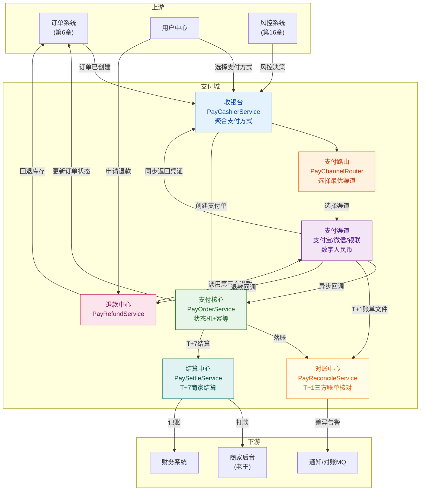
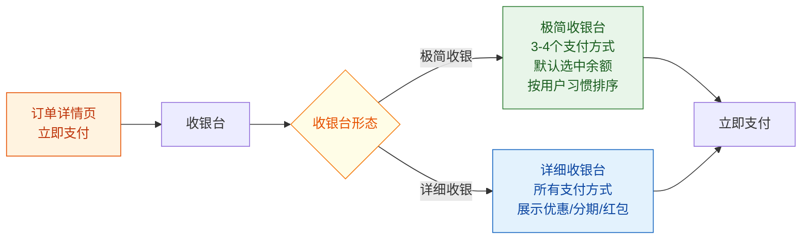
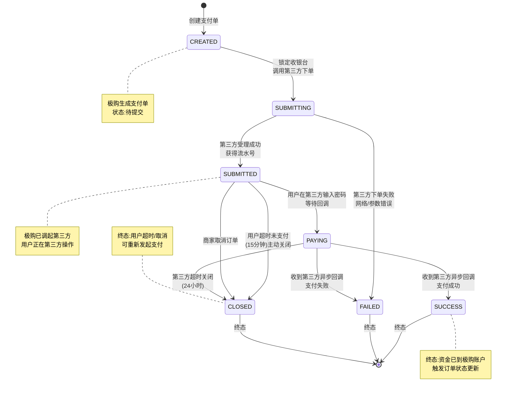
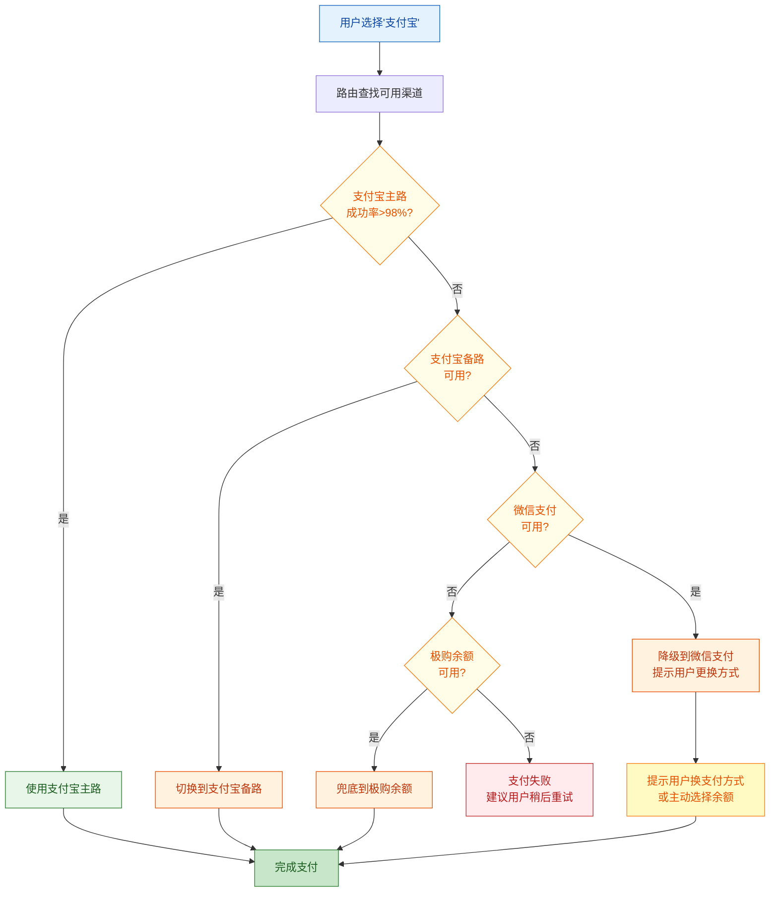
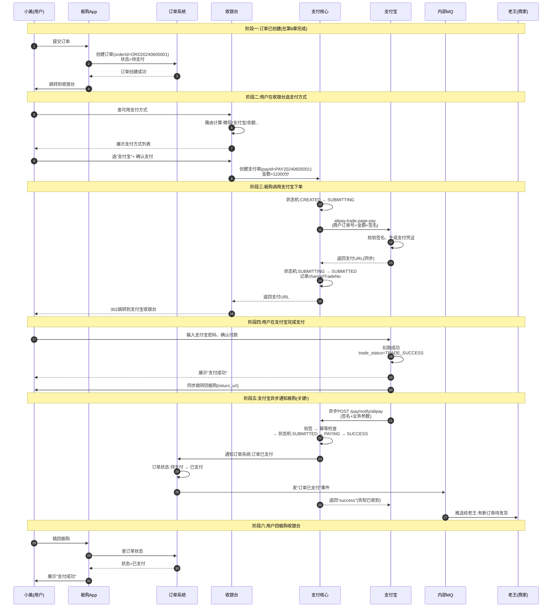
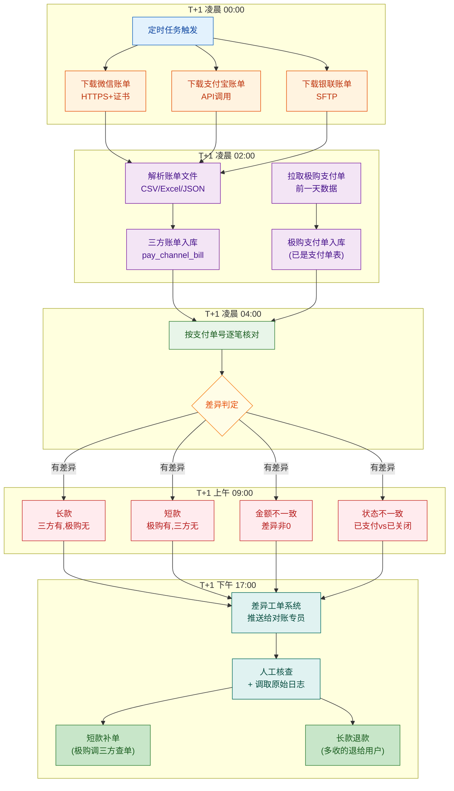

# 第 10 章 · 支付系统：收银台、路由、回调与对账

> **所属系列**：商城平台系统设计 · 全景教程
>
> **上一章**：[第 9 章 · 秒杀系统设计](./09-秒杀系统设计.md)　|　**下一章**：[第 11 章 · 分布式事务](./11-分布式事务.md)　|　**总目录**：[教程大纲](./00-教程大纲.md)

---

## 本章导读

小美在「极购商城」下单了一件老王的潮牌 T 恤 110 元,提交订单后页面跳转到了**收银台**——她看到一排支付方式:微信支付、支付宝、极购余额、银行卡快捷、货到付款。她选了"支付宝",输入密码,几秒后页面提示"支付成功",订单状态由「待支付」变为「已支付」。

整个过程对小美来说只有 5 秒,但背后却跑完了一整条复杂链路:**极购收银台聚合多个支付渠道 → 调用支付宝下单接口 → 用户在支付宝完成支付 → 支付宝异步回调通知极购 → 极购幂等处理回调 → 更新订单状态 → 通知库存系统已扣减 → 通知商家老王**。

而这条链路,只是支付系统日常工作量的冰山一角。每天深夜,极购的**对账中心**都要从微信、支付宝、银联下载 T+1 的账单文件,与极购自己的支付单逐笔核对——找出"长款"(第三方多收)、"短款"(第三方少收)、"金额不一致"、"状态不一致"等差异。一天 800 万笔订单 × 多年累计,这背后是数亿条数据的对账与差错处理。

支付系统是商城中**最不容出错**的子系统——1 分钱差错就是事故级 P0。本章我们沿用"小美支付 110 元"和"老王 T 恤订单何时结算"两个贯穿案例,从全景到细节把支付系统讲透。

本章主要内容:

1. **支付系统全景**——收银台、支付路由、支付渠道、对账中心四大件
2. **支付方式**——第三方支付、余额、银行卡、货到付款、数字人民币、跨境支付
3. **收银台**——聚合支付方式、下单流程、极简收银 vs 详细收银
4. **支付单**——数据模型、状态机设计
5. **支付路由**——渠道选择、降级、成功率统计
6. **支付下单与回调**(核心)——端到端时序:小美支付 110 元
7. **回调幂等**——第三方多次回调、Redis 幂等表、状态机校验
8. **对账机制**(核心)——三方对账、长款/短款、内部账
9. **退款链路**——用户退款 → 第三方退款 → 状态机
10. **支付安全**——签名验签、金额校验、防重放
11. **支付容灾**——渠道降级、余额兜底、熔断器
12. **财务与账期**——商家结算 T+7/T+15、实时分账、押金
13. **典型问题**——回调丢失、重复回调、金额不一致、对账差异

读完本章你将能回答:**为什么支付系统必须独立做成"四中心"架构?为什么回调一定要做幂等?为什么对账不只是"核对数字"那么简单?**

---

## 10.1 支付系统全景

### 10.1.1 支付域的核心定位

支付域是商城七大域中**最特殊**的一域——它直接处理"钱",出错的成本是刚性的:

- 用户多付一分钱,必须退;少付一分钱,必须补;
- 订单已完成却未支付,商家投诉;订单未完成却显示已支付,用户投诉;
- 对账差异 1 分钱,需要客服手工处理 1 小时;
- 渠道故障 5 分钟,可能带来数千万损失。

所以**支付系统的设计目标,不是性能优先,而是"不错、不丢、不重"**——即支付单的状态机必须严格、回调必须幂等、对账必须能找出每一笔差异。

### 10.1.2 支付域四大核心组件



**四个中心的核心职责**:

| 中心 | 核心职责 | 关键指标 |
|------|---------|---------|
| **收银台(Cashier)** | 聚合展示所有支付方式,生成支付单,调起第三方支付 | 收银台打开成功率、首屏时间 |
| **支付核心(PayCore)** | 支付单状态机、回调幂等处理 | 回调处理成功率、TPS |
| **对账中心(Reconcile)** | T+1 下载三方账单,与极购支付单核对差异 | 长短款率、差异处理时效 |
| **结算中心(Settle)** | 按账期(T+7)给商家打款、实时分账 | 结算时效、分账准确性 |

### 10.1.3 与其他域的关系

- **订单系统(第 6 章)**:订单系统创建"待支付"订单后,通知收银台;支付成功后回调更新订单为"已支付"。
- **用户中心(第 13 章)**:校验用户实名、会员等级、是否支持货到付款。
- **风控系统(第 16 章)**:支付前风控决策(是否触发验证码、是否拦截),支付后风控(是否涉嫌洗钱、套现)。
- **财务系统**:对账后的差异、商家结算的金额,最终落到财务的总账。

---

## 10.2 支付方式全景

### 10.2.1 支付方式分类

| 类别 | 代表方式 | 资金流向 | 接入难度 | 适用场景 |
|------|---------|---------|---------|---------|
| **第三方支付** | 微信支付、支付宝、银联 | 用户→第三方→商户(平台) | 中(需资质) | 通用、首选 |
| **余额支付** | 极购余额 | 用户在平台的资金账户 | 低 | 充值后用,粘性高 |
| **银行卡快捷** | 各大行直连 | 用户→银行→平台 | 高(需 PCI 认证) | 大额、B 端 |
| **货到付款** | COD | 物流代收 | 低 | 农村、生鲜 |
| **数字人民币** | 央行 DC/EP | 用户→央行→商户 | 中(试点) | 政策导向 |
| **跨境支付** | PayPal、Stripe、空中云汇 | 多币种、多通道 | 高 | 跨境电商 |

### 10.2.2 第三方支付对比

| 渠道 | 用户量级 | 接入方式 | 费率 | 结算周期 | 备注 |
|------|---------|---------|------|---------|------|
| **支付宝** | 10亿+ | 支付宝开放平台、APP 支付 / 电脑网站支付 / 手机网站支付 | 0.6%~1.0% | T+1 | 国内主流 |
| **微信支付** | 13亿+ | 微信支付商户平台、JSAPI / H5 / APP / 小程序 | 0.6%~1.0% | T+1 | 微信生态首选 |
| **银联** | 8亿+持卡人 | 银联在线、银联二维码 | 0.2%~0.6% | T+1 | 大额、卡支付 |
| **数字人民币** | 数千万试点用户 | 央行数研所、银行 APP 接入 | 0 | T+0 | 政策导向 |

**小美 110 元 T 恤订单,如果用支付宝付款,实际到账是 110 - 0.6% ≈ 109.34 元,差额 0.66 元是支付宝手续费。**

### 10.2.3 余额支付的特殊性

余额是平台自有资金账户,不走第三方通道。它的优势是:
- **费率 0**:平台自有资金,无渠道费
- **实时到账**:从极购余额到商家结算账户,秒级
- **强粘性**:用户充值后基本在平台消费

余额的数据模型核心字段:
```sql
CREATE TABLE user_balance (
    user_id        BIGINT       NOT NULL PRIMARY KEY,
    balance        BIGINT       NOT NULL DEFAULT 0  COMMENT '余额(分)',
    frozen         BIGINT       NOT NULL DEFAULT 0  COMMENT '冻结金额(分)',
    version        INT          NOT NULL DEFAULT 0  COMMENT '乐观锁版本号',
    updated_at     TIMESTAMP    NOT NULL DEFAULT CURRENT_TIMESTAMP,
    INDEX idx_updated (updated_at)
) ENGINE=InnoDB COMMENT='用户余额表';
```

**支付扣减余额必须用乐观锁或 Redis Lua 脚本**,防止超扣(详见第 7 章库存系统的并发控制思想)。

---

## 10.3 收银台

### 10.3.1 收银台是什么

**收银台(Cashier)** 是用户完成支付前的"最后一站"——一个聚合所有支付方式、生成支付凭证的页面。它向用户屏蔽了"极购调微信、支付宝、银联"等复杂细节,只展示一排可选项。

### 10.3.2 收银台的两种形态



| 形态 | 适用场景 | 优缺点 |
|------|---------|--------|
| **极简收银** | 移动端、复购用户 | 首屏快(只展示 3~4 种,默认勾选上次用的),但优惠展示不充分 |
| **详细收银** | 营销活动期、新用户 | 充分展示满减、分期、红包,转化率更高,但首屏慢 |

极购 App 默认走"极简收银",但在双 11、618 等大促期间切到"详细收银"突出分期免息、跨店满减。

### 10.3.3 收银台聚合服务

```java
/**
 * 收银台聚合服务
 * 负责聚合所有可用的支付方式、生成支付单、调起第三方支付
 * 对应:小美进入收银台,看到微信/支付宝/余额/银行卡等
 */
@Service
public class PayCashierService {

    @Autowired private PayChannelRouter channelRouter;        // 支付路由
    @Autowired private PayOrderService payOrderService;       // 支付单服务
    @Autowired private UserBalanceService balanceService;     // 余额服务
    @Autowired private PayChannelRegistry channelRegistry;   // 渠道注册中心

    /**
     * 创建收银台(展示可用支付方式)
     * 调用时机:小美点击"立即支付"进入收银台
     */
    public CashierDTO createCashier(String userId, String orderId) {
        // 1. 查订单(从订单中心 RPC)
        OrderDTO order = orderService.getOrder(orderId);
        if (order.getStatus() != OrderStatus.PENDING_PAY) {
            throw new BizException("订单状态非待支付,无法创建收银台");
        }

        // 2. 风控校验(第16章)
        RiskDecision risk = riskService.prePayCheck(userId, order);
        if (risk.isReject()) {
            throw new BizException("支付被风控拦截");
        }

        // 3. 查询用户可用的支付方式
        List<PayChannelDTO> channels = channelRouter.listAvailableChannels(
            userId, order.getAmount(), order.getMerchantId()
        );

        // 4. 排序(默认渠道、用户上次用过的优先)
        channels = sortChannels(channels, userId);

        return CashierDTO.builder()
            .cashierId(generateCashierId())
            .orderId(orderId)
            .amount(order.getAmount())
            .channels(channels)
            .riskHint(risk.getHint())        // 风控提示,如"建议用余额"
            .expireTime(LocalDateTime.now().plusMinutes(15))  // 15分钟超时
            .build();
    }

    /**
     * 用户在收银台选定支付方式,提交下单
     * 调用时机:小美点"支付宝"→"确认支付"
     */
    public PaySubmitResult submitPay(String cashierId, String userId, String channelCode) {
        // 1. 校验收银台有效性(未过期、未使用)
        Cashier cashier = cashierDao.findById(cashierId);
        if (cashier.getStatus() != CashierStatus.ACTIVE) {
            throw new BizException("收银台已失效,请重新下单");
        }
        if (cashier.getExpireTime().isBefore(LocalDateTime.now())) {
            throw new BizException("收银台已超时(15分钟)");
        }

        // 2. 创建支付单(关键步骤,见10.4节)
        PayOrder payOrder = payOrderService.createPayOrder(
            cashier.getOrderId(),
            userId,
            channelCode,
            cashier.getAmount()
        );

        // 3. 调用第三方支付下单
        PayChannel channel = channelRegistry.getChannel(channelCode);
        ChannelPayRequest req = buildChannelRequest(payOrder, channel);
        ChannelPayResponse resp = channel.submitPay(req);

        // 4. 更新支付单状态为"已提交"
        payOrderService.markSubmitted(payOrder.getPayId(), resp.getChannelTradeNo());

        // 5. 锁定收银台(避免重复提交)
        cashierDao.lock(cashierId);

        return PaySubmitResult.builder()
            .payId(payOrder.getPayId())
            .channelCode(channelCode)
            .payUrl(resp.getPayUrl())           // 收银台跳转 URL 或二维码
            .channelForm(resp.getFormData())    // 表单提交字段
            .build();
    }

    /**
     * 支付方式排序:用户上次用过的 > 默认渠道 > 费率低的
     */
    private List<PayChannelDTO> sortChannels(List<PayChannelDTO> channels, String userId) {
        String lastUsed = userPrefDao.getLastUsedChannel(userId);
        return channels.stream()
            .sorted(Comparator
                .comparing((PayChannelDTO c) -> Objects.equals(c.getCode(), lastUsed) ? 0 : 1)
                .thenComparing(c -> -c.getPriority())  // 优先级高的在前
            )
            .collect(Collectors.toList());
    }
}
```

### 10.3.4 收银台的安全约束

- **时效性**:收银台 15 分钟过期,防止用户长时间不付款、订单被"挂"住。
- **金额冻结**:进入收银台时,极购应冻结订单的库存(已在订单系统预扣),防止其他用户抢走。
- **幂等性**:用户多次点"确认支付"必须幂等,只能产生一笔支付单(用 `out_trade_no` 即支付单号作为唯一键)。
- **来源校验**:收银台必须验证是合法用户从合法订单跳过来的,防止 CSRF。

---

## 10.4 支付单

### 10.4.1 支付单数据模型

支付单(PayOrder)是支付系统的"实体核心"——一笔订单可以多次发起支付尝试(比如换支付方式),但**一笔订单只对应一个支付单**是最简单的设计;更严谨的设计是允许"多笔支付单对应一笔订单",但大部分电商采用"一笔订单最多一笔支付单"。

```sql
-- 极购支付单表 pay_order
CREATE TABLE `pay_order` (
    `pay_id`              BIGINT        NOT NULL                COMMENT '支付单号(全局唯一)',
    `order_id`            BIGINT        NOT NULL                COMMENT '订单号',
    `user_id`             BIGINT        NOT NULL                COMMENT '用户ID',
    `merchant_id`         BIGINT        NOT NULL                COMMENT '商家ID(老王的店)',
    `channel_code`        VARCHAR(32)   NOT NULL                COMMENT '支付渠道:ALIPAY/WECHAT/UNIONPAY/BALANCE',
    `amount`              BIGINT        NOT NULL                COMMENT '支付金额(分)',
    `currency`            VARCHAR(8)    NOT NULL DEFAULT 'CNY'  COMMENT '币种',
    `status`              VARCHAR(16)   NOT NULL                COMMENT '支付单状态',
    `channel_trade_no`    VARCHAR(64)   DEFAULT NULL            COMMENT '第三方交易流水号(支付宝/微信生成)',
    `subject`             VARCHAR(128)  DEFAULT NULL            COMMENT '订单标题(展示在支付宝/微信)',
    `expire_time`         DATETIME      NOT NULL                COMMENT '过期时间',
    `pay_time`            DATETIME      DEFAULT NULL            COMMENT '支付成功时间',
    `notify_time`         DATETIME      DEFAULT NULL            COMMENT '回调时间',
    `notify_count`        INT           NOT NULL DEFAULT 0      COMMENT '回调次数',
    `client_ip`           VARCHAR(64)   DEFAULT NULL            COMMENT '用户IP',
    `created_at`          DATETIME      NOT NULL DEFAULT CURRENT_TIMESTAMP,
    `updated_at`          DATETIME      NOT NULL DEFAULT CURRENT_TIMESTAMP ON UPDATE CURRENT_TIMESTAMP,
    PRIMARY KEY (`pay_id`),
    UNIQUE KEY `uk_order` (`order_id`),
    UNIQUE KEY `uk_channel_trade` (`channel_code`, `channel_trade_no`),
    KEY `idx_user_status` (`user_id`, `status`),
    KEY `idx_merchant_status` (`merchant_id`, `status`),
    KEY `idx_created` (`created_at`)
) ENGINE=InnoDB DEFAULT CHARSET=utf8mb4 COMMENT='极购支付单表';
```

**关键索引说明**:
- `uk_order`:**订单号唯一索引**——一笔订单最多一笔支付单(简化退款)。
- `uk_channel_trade`:渠道 + 渠道流水号唯一——用于回调幂等(防止同一笔第三方支付被回调两次)。
- `idx_user_status`:用户维度查询(查"我的支付中订单")。
- `idx_merchant_status`:商家维度查询(老王查"店铺今日待结算金额")。

### 10.4.2 支付单状态机

支付单有 7 个核心状态,正向流程是 `CREATED → SUBMITTING → SUBMITTED → PAYING → SUCCESS`,逆向流程有 `FAILED`、`CLOSED` 两个出口。



**状态机约束**(非常重要):

| 状态转换 | 触发条件 | 副作用 |
|---------|---------|--------|
| CREATED → SUBMITTING | 收银台锁定 | 启动 15 分钟超时定时器 |
| SUBMITTING → SUBMITTED | 第三方返回受理成功 | 记录 `channel_trade_no` |
| SUBMITTING → FAILED | 第三方返回失败 | 记录失败原因,允许重试 |
| SUBMITTED → PAYING | 第三方后台通知"用户在支付中" | 等待最终结果 |
| PAYING → SUCCESS | 异步回调 SUCCESS | 更新订单为"已支付"、发送 MQ、推送通知 |
| PAYING → FAILED | 异步回调 FAILED | 通知用户,允许换支付方式重试 |
| SUBMITTED → CLOSED | 15 分钟未支付 | 关闭支付单、释放库存预占 |
| SUBMITTED → CLOSED | 商家取消订单 | 同上 |

**幂等性保证**:任何状态转换都必须**先 CAS(Compare-And-Swap)更新状态**,只有 `compareAndSet(oldStatus, newStatus)` 成功才执行后续动作。这避免重复回调导致状态错乱。

---

## 10.5 支付路由

### 10.5.1 路由的职责

支付路由(PayChannelRouter)的作用是:**根据支付方式、用户、金额、商户、当前渠道可用性,选择最合适的支付渠道**。

### 10.5.2 路由策略

| 策略 | 说明 | 示例 |
|------|------|------|
| **渠道优先级** | 平台配置每个支付方式的首选渠道(微信→微信原生,支付宝→支付宝原生) | 小美选"微信支付",直接路由到微信 |
| **成功率统计** | 实时统计各渠道近 1 分钟/5 分钟成功率,失败率高的渠道降权 | 支付宝近 1 分钟成功率 95% 低于阈值 98%,降权 |
| **费率优先** | 在用户不感知情况下,优先选费率低的渠道(平台成本) | 微信/支付宝都可用时,选费率低的那个 |
| **金额阈值** | 大额订单(>1万)默认走银联或对公转账 | 10 万元 T 恤批发单走银联 |
| **地域策略** | 海外订单走 PayPal/Stripe,港澳台走 WeChat Pay HK | 跨境订单特殊处理 |
| **黑名单降级** | 某些商户/用户被某渠道风控拉黑,自动切其他渠道 | 老王店铺被微信风控,自动切支付宝 |

### 10.5.3 通道降级

通道降级是支付路由最关键的能力之一:**主路失败时,自动切到备路,保证支付不中断**。



降级的关键指标:
- **降级触发延迟**:主路连续失败 30 秒内必须切备路。
- **降级成功率**:切到备路后,支付成功率不应低于主路 5 个百分点。
- **自动恢复**:主路恢复后,自动切回(需要灰度,不能一刀切)。

---

## 10.6 支付下单与回调(核心)

本节是本章最核心的内容——以"小美支付 110 元 T 恤订单"为案例,完整走一遍支付下单、第三方支付、异步回调、订单状态更新的端到端流程。

### 10.6.1 端到端时序图



### 10.6.2 同步返回 vs 异步回调

| 维度 | 同步返回(return_url) | 异步回调(notify_url) |
|------|---------------------|---------------------|
| **调用方** | 用户浏览器跳回极购 | 支付宝服务器主动 POST |
| **可靠性** | 低(用户可能不跳转、网络中断) | 高(支付宝会重试) |
| **用途** | 收银台展示"支付成功" | 支付核心更新订单状态(以这个为准) |
| **处理逻辑** | 简单查订单状态 | 验签、幂等、状态机、通知下游 |

**关键原则**:**永远以异步回调为准,同步返回只能用于前端展示**。因为同步返回有可能失败(用户关掉浏览器、网络中断),而异步回调是支付宝服务器主动重试,可靠性高得多。

### 10.6.3 异步回调的细节

支付宝的回调报文是 application/x-www-form-urlencoded 格式,关键字段:

```json
{
  "notify_time": "2024-06-05 14:30:25",
  "notify_type": "trade_status_sync",
  "out_trade_no": "PAY20240605001",          // 极购的支付单号
  "trade_no": "2024060522001474950500123456",// 支付宝的交易号
  "trade_status": "TRADE_SUCCESS",
  "total_amount": "110.00",                  // 注意:支付宝用元为单位
  "sign": "abc123...",                       // 支付宝签名
  "sign_type": "RSA2"
}
```

**回调处理流程(以 PayNotifyProcessor 为例)**:

```java
/**
 * 支付回调处理器
 * 接收第三方支付(支付宝/微信/银联)的异步通知
 * 核心职责:验签 → 幂等 → 状态机 → 通知下游
 * 对应:小美支付成功后,支付宝通知极购
 */
@Service
public class PayNotifyProcessor {

    @Autowired private PayOrderDao payOrderDao;
    @Autowired private SignService signService;
    @Autowired private OrderServiceClient orderClient;     // 订单中心 RPC
    @Autowired private MqProducer mqProducer;              // 内部 MQ
    @Autowired private RedisTemplate<String, String> redis;

    /**
     * 支付宝异步回调入口
     * 路径:/pay/notify/alipay
     * 注意:必须返回纯文本"success"或"failure",支付宝据此判断是否重试
     */
    @PostMapping(value = "/pay/notify/alipay", produces = "text/plain")
    public String handleAlipayNotify(@RequestParam Map<String, String> params) {
        String payId = params.get("out_trade_no");
        String channelTradeNo = params.get("trade_no");
        String status = params.get("trade_status");
        String totalAmount = params.get("total_amount");
        String sign = params.get("sign");

        log.info("收到支付宝回调 payId={}, status={}", payId, status);

        // ─── Step 1: 验签(防伪造、防篡改)─────────────────────────────
        if (!signService.verifyAlipaySign(params, sign)) {
            log.warn("支付宝回调验签失败 payId={}", payId);
            return "failure";   // 返回 failure,支付宝会重试
        }

        // ─── Step 2: 幂等检查(防重复回调)───────────────────────────────
        String dedupKey = "pay:notify:dedup:" + payId + ":" + channelTradeNo;
        Boolean first = redis.opsForValue().setIfAbsent(
            dedupKey, "1", Duration.ofHours(72)   // 72小时幂等窗口
        );
        if (Boolean.FALSE.equals(first)) {
            log.info("重复回调,幂等忽略 payId={}, channelTradeNo={}", payId, channelTradeNo);
            return "success";   // 已处理过,告诉支付宝不要再重试
        }

        // ─── Step 3: 查询支付单,校验金额、状态───────────────────────────
        PayOrder payOrder = payOrderDao.findById(payId);
        if (payOrder == null) {
            log.error("支付单不存在 payId={}", payId);
            return "failure";
        }

        // 金额校验(必须等于,差 1 分都不行)
        BigDecimal notifyAmount = new BigDecimal(totalAmount);
        BigDecimal expectedAmount = BigDecimal.valueOf(payOrder.getAmount(), 2);
        if (notifyAmount.compareTo(expectedAmount) != 0) {
            log.error("回调金额不一致 payId={}, notify={}, expected={}",
                payId, notifyAmount, expectedAmount);
            return "failure";
        }

        // ─── Step 4: 状态机转换(SUBMITTED → PAYING → SUCCESS)──────────
        if ("TRADE_SUCCESS".equals(status) || "TRADE_FINISHED".equals(status)) {
            // 先 CAS 转为 PAYING(防止并发)
            boolean toPaying = payOrderDao.compareAndSetStatus(
                payId, PayOrderStatus.SUBMITTED, PayOrderStatus.PAYING
            );
            if (!toPaying) {
                log.warn("支付单状态非 SUBMITTED,可能已处理 payId={}, status={}",
                    payId, payOrder.getStatus());
                return "success";
            }

            // 再 CAS 转为 SUCCESS
            int updated = payOrderDao.updateSuccess(
                payId, channelTradeNo, LocalDateTime.now()
            );
            if (updated == 0) {
                log.error("更新支付单为 SUCCESS 失败 payId={}", payId);
                return "failure";
            }

            // ─── Step 5: 通知订单系统(下游)────────────────────────────
            try {
                orderClient.markPaid(payOrder.getOrderId(), payId, channelTradeNo);
            } catch (Exception e) {
                // 订单更新失败不能阻塞,但要记告警
                log.error("通知订单系统失败 payId={}", payId, e);
                // 通过 MQ 补偿重试
                mqProducer.send("pay.order.paid.retry",
                    new OrderPaidEvent(payOrder.getOrderId(), payId, channelTradeNo));
            }

            // ─── Step 6: 发送"订单已支付"MQ(给商家、库存、营销等)──────
            mqProducer.send("order.paid.success",
                new OrderPaidEvent(payOrder.getOrderId(), payId, payOrder.getMerchantId()));

            log.info("支付回调处理成功 payId={}, orderId={}",
                payId, payOrder.getOrderId());
            return "success";

        } else if ("TRADE_CLOSED".equals(status) || "WAIT_BUYER_PAY".equals(status)) {
            // 关闭/等待买家支付——不处理,等用户继续支付
            return "success";
        }

        return "failure";
    }
}
```

### 10.6.4 同步返回的处理

同步返回只是给前端展示"支付成功",逻辑极简——查订单状态返回给前端:

```java
/**
 * 支付宝同步返回(用户浏览器跳回极购)
 * 注意:同步返回不可信,真正的状态以异步回调为准
 */
@GetMapping("/pay/return/alipay")
public PayResultVO handleAlipayReturn(@RequestParam Map<String, String> params) {
    // 同步返回只做展示用,不更新任何状态
    String payId = params.get("out_trade_no");
    PayOrder payOrder = payOrderDao.findById(payId);
    return PayResultVO.builder()
        .payId(payId)
        .orderId(payOrder.getOrderId())
        .status(payOrder.getStatus().name())
        .showSuccess(payOrder.getStatus() == PayOrderStatus.SUCCESS)
        .build();
}
```

---

## 10.7 回调幂等(核心)

### 10.7.1 为什么回调必须做幂等

第三方支付(支付宝/微信)的异步回调,**一定会重试**——网络抖动、服务器超时都可能导致极购物没收到或收到没处理完。重试频率通常是:4m 10m 10m 1h 2h 6h 15h。

**如果不幂等,会出现**:
- 同一笔支付被处理 5 次,订单状态被更新 5 次;
- 给用户发 5 条"支付成功"短信;
- 给商家发 5 次"新订单"通知;
- 极端情况下,触发多次退款、多次发货。

### 10.7.2 幂等性的三层防护

```mermaid
flowchart TD
    A["收到第三方回调"]:::start --> B["Step1: 签名验签<br/>(防伪造)"]:::step
    B -->|验签失败| C["返回failure<br/>让第三方重试"]:::fail
    B -->|验签成功| D["Step2: Redis幂等表<br/>(防重复处理)"]:::step
    D -->|已存在| E["返回success<br/>不再处理"]:::skip
    D -->|不存在| F["Step3: 数据库唯一索引<br/>(终极防线)"]:::step
    F -->|唯一键冲突| G["返回success<br/>已处理过"]:::skip
    F -->|插入成功| H["Step4: 状态机CAS<br/>(防并发)"]:::step
    H -->|CAS失败| I["返回success<br/>状态已变"]:::skip
    H -->|CAS成功| J["Step5: 执行业务逻辑<br/>更新订单、发MQ"]:::success
    J --> K["返回success"]:::end

    classDef start fill:#E3F2FD,stroke:#1565C0,color:#0D47A1
    classDef step fill:#FFF3E0,stroke:#E65100,color:#BF360C
    classDef fail fill:#FFEBEE,stroke:#C62828,color:#B71C1C
    classDef skip fill:#FFFDE7,stroke:#F57F17,color:#E65100
    classDef success fill:#E8F5E9,stroke:#2E7D32,color:#1B5E20
    classDef end fill:#C8E6C9,stroke:#2E7D32,color:#1B5E20
```

**幂等键设计**:
- **Redis 幂等表 Key**:`pay:notify:dedup:{payId}:{channelTradeNo}`
- **数据库唯一索引**:`UNIQUE KEY uk_channel_trade (channel_code, channel_trade_no)`

**为什么是 payId + channelTradeNo 双键**:极端情况下,渠道流水号可能冲突(虽然概率极低),加上支付单号双重保险。

### 10.7.3 状态机校验

状态机校验是幂等的最后一道防线——即使 Redis 幂等表失效(比如 Redis 故障),状态机的 CAS 也能保证状态不被错误更新:

```java
/**
 * 状态机 CAS 更新
 * 只有当当前状态等于 oldStatus 时,才能更新为 newStatus
 * 返回 true 表示本次更新成功;false 表示状态已被其他线程改过
 */
public boolean compareAndSetStatus(String payId, PayOrderStatus oldStatus, PayOrderStatus newStatus) {
    String sql = "UPDATE pay_order SET status = ? WHERE pay_id = ? AND status = ?";
    int rows = jdbcTemplate.update(sql, newStatus.name(), payId, oldStatus.name());
    return rows == 1;
}
```

**支付单状态机校验的核心规则**:
- `SUBMITTED → PAYING`:只有从 SUBMITTED 才能转 PAYING
- `PAYING → SUCCESS`:只有从 PAYING 才能转 SUCCESS
- **不能跨状态转换**:比如不能从 CREATED 直接到 SUCCESS,中间必须经过 SUBMITTING、SUBMITTED

这意味着如果同一笔支付被并发回调 3 次:
- 第 1 次:状态从 SUBMITTED → PAYING → SUCCESS,全部成功
- 第 2 次:CAS(SUBMITTED → PAYING)失败,因为已经是 PAYING 或 SUCCESS,直接返回 success 不处理
- 第 3 次:同第 2 次

---

## 10.8 对账机制(核心)

### 10.8.1 为什么需要对账

支付系统最大的"不可控"因素是**第三方支付**——它们可能会出现:
- 漏单(用户已付款,但回调没收到)
- 多发回调(同一笔支付被发了 5 次)
- 金额不一致(理论上不该发生,但银行系统出过 0.01 元错位)
- 状态不一致(支付宝回调成功,但极购这边是失败)

对账就是**在 T+1 时间点,把第三方账单与极购支付单逐笔核对,找出所有差异**。一旦发现差异,就要追查、修复、补单或退款。

### 10.8.2 对账流程



### 10.8.3 对账核心代码

```java
/**
 * 对账服务
 * T+1 凌晨定时执行
 * 核心:三方账单 vs 极购支付单,逐笔核对,产出差异工单
 */
@Service
public class PayReconcileService {

    @Autowired private PayChannelBillDao billDao;             // 三方账单
    @Autowired private PayOrderDao payOrderDao;               // 极购支付单
    @Autowired private ReconcileDiffDao diffDao;              // 差异表
    @Autowired private WorkOrderService workOrderService;     // 工单系统

    /**
     * 每日对账入口
     * 定时任务:cron="0 0 2 * * ?" 每天凌晨2点
     */
    public void dailyReconcile(LocalDate bizDate) {
        log.info("开始对账 bizDate={}", bizDate);

        // ─── Step 1: 下载三方账单(凌晨00:00-02:00 已完成)──────────────
        // 账单文件已落到 pay_channel_bill 表,这里直接查

        // ─── Step 2: 拉取该 bizDate 的极购支付单────────────────────────
        List<PayOrder> payOrders = payOrderDao.listByBizDate(
            bizDate, Arrays.asList(
                PayOrderStatus.SUCCESS,
                PayOrderStatus.FAILED,
                PayOrderStatus.CLOSED
            )
        );
        Map<String, PayOrder> payOrderMap = payOrders.stream()
            .collect(Collectors.toMap(PayOrder::getChannelTradeNo, p -> p, (a, b) -> a));

        // ─── Step 3: 拉取该 bizDate 的三方账单(全渠道)──────────────────
        List<PayChannelBill> bills = billDao.listByBizDate(bizDate);
        Map<String, PayChannelBill> billMap = bills.stream()
            .collect(Collectors.toMap(PayChannelBill::getChannelTradeNo, b -> b, (a, b) -> a));

        // ─── Step 4: 逐笔核对,产出差异──────────────────────────────
        List<ReconcileDiff> diffs = new ArrayList<>();

        // 遍历三方账单,核对极购侧
        for (PayChannelBill bill : bills) {
            PayOrder order = payOrderMap.get(bill.getChannelTradeNo());
            if (order == null) {
                // 极购没有这条支付单 → 长款
                diffs.add(buildDiff(bill, null, DiffType.LONG_BILL, "三方有,极购无"));
                continue;
            }

            // 金额核对
            if (bill.getAmount() != order.getAmount()) {
                diffs.add(buildDiff(bill, order, DiffType.AMOUNT_MISMATCH,
                    String.format("三方%d分,极购%d分", bill.getAmount(), order.getAmount())));
                continue;
            }

            // 状态核对(已支付 vs 失败/关闭)
            String billStatus = mapBillStatus(bill);
            if (!Objects.equals(billStatus, order.getStatus().name())) {
                diffs.add(buildDiff(bill, order, DiffType.STATUS_MISMATCH,
                    String.format("三方状态=%s,极购状态=%s", billStatus, order.getStatus())));
                continue;
            }
        }

        // 遍历极购支付单,核对三方侧(短款:极购有,三方无)
        for (PayOrder order : payOrders) {
            if (order.getChannelTradeNo() == null) continue;   // 跳过未提交的
            PayChannelBill bill = billMap.get(order.getChannelTradeNo());
            if (bill == null) {
                diffs.add(buildDiff(null, order, DiffType.SHORT_BILL, "极购有,三方无"));
            }
        }

        // ─── Step 5: 差异入库 + 推工单─────────────────────────────
        if (!diffs.isEmpty()) {
            diffDao.batchInsert(diffs);
            log.warn("对账发现差异 bizDate={}, diffCount={}", bizDate, diffs.size());

            // 推送给对账专员
            for (ReconcileDiff diff : diffs) {
                workOrderService.createWorkOrder(
                    WorkOrderType.PAY_RECONCILE_DIFF,
                    diff.getDiffId(),
                    diff.getDescription(),
                    WorkOrderPriority.P1  // 对账差异是 P1 工单
                );
            }
        } else {
            log.info("对账无差异 bizDate={}", bizDate);
        }
    }

    /**
     * 处理短款:极购已支付但三方账单缺失
     * 通过调用三方"查单接口"主动查询,补齐
     */
    public void handleShortBill(String diffId) {
        ReconcileDiff diff = diffDao.findById(diffId);
        PayOrder order = payOrderDao.findById(diff.getPayId());

        // 调用三方"查单接口",如 alipay.trade.query
        ChannelQueryResponse resp = channelRegistry
            .getChannel(order.getChannelCode())
            .queryOrder(order.getChannelTradeNo());

        if (resp.isSuccess()) {
            // 三方确认已支付,补齐账单
            billDao.insertFromChannel(order, resp);
            diffDao.markResolved(diffId, "已通过查单接口补齐");
        } else if (resp.isNotExist()) {
            // 三方确认无此订单——这就是异常情况,需要报警
            // 可能情况:1) 极购单号伪造 2) 数据被删除 3) 系统异常
            diffDao.markCritical(diffId, "极购有订单,三方确认不存在,需人工核查");
            alarmService.sendAlarm("对账严重差异:极购有,三方无");
        }
    }

    /**
     * 处理长款:三方已收钱但极购无对应订单
     * 通常是回调完全丢失,需要补单
     */
    public void handleLongBill(String diffId) {
        ReconcileDiff diff = diffDao.findById(diffId);
        PayChannelBill bill = diff.getBill();

        // 长款:三方说收了 110 元,但极购没这笔订单
        // 最坏情况:用户已付款,但订单系统也没记录(极端异常)
        // 处理:先查订单库,如果订单库也没有,联系用户退款
        OrderDTO order = orderClient.findById(bill.getOutTradeNo());
        if (order == null) {
            // 订单库也没有,需要财务走人工退款
            alarmService.sendAlarm("对账长款:三方有,订单库无,需财务退款");
        } else {
            // 订单库有,只是极购支付单丢了——补建支付单 + 触发回调逻辑
            PayOrder newPayOrder = payOrderService.rebuildFromBill(bill);
            payNotifyProcessor.processBill(newPayOrder, bill);
        }
    }
}
```

### 10.8.4 内部账:与订单/财务/商家账的对齐

| 对账类型 | 核对方 | 核对内容 | 周期 | 差异处理 |
|---------|--------|---------|------|---------|
| **三方对账** | 极购支付单 vs 微信/支付宝/银联账单 | 支付单号、金额、状态 | T+1 | 补单、退款、报警 |
| **订单-支付对账** | 订单系统 vs 支付核心 | 订单的支付状态、金额、支付时间 | T+1 | 订单状态订正、追查 |
| **支付-财务对账** | 支付核心 vs 财务总账 | 资金流水、收入、费率 | T+1 | 财务记账订正 |
| **商家对账** | 商家账单 vs 平台结算账单 | 应结金额、扣手续费、扣技术服务费 | T+7 结算前 | 商家可申诉 |

**老王 T 恤订单 110 元,极购收 110 元,扣 0.6% 支付宝手续费 0.66 元,极购实收 109.34 元。再扣 5% 平台技术服务费 5.47 元,老王最终结算 103.87 元。T+7 这笔钱会从极购的银行账户打到老王的结算账户。**

---

## 10.9 退款链路

### 10.9.1 退款流程

退款是支付的逆向链路——用户申请退款(详见第 12 章),极购调用第三方退款接口,资金原路返回。

### 10.9.2 退款状态机

退款单状态机相对简单:`CREATED → SUBMITTING → SUBMITTED → SUCCESS/FAILED`,无 PAYING 状态(因为退款是后台处理,不需要用户介入)。

### 10.9.3 退款核心代码

```java
/**
 * 退款服务
 * 调用第三方退款接口
 * 对应:小美申请退款,极购调支付宝退款110元
 */
@Service
public class PayRefundService {

    @Autowired private PayChannelRegistry channelRegistry;
    @Autowired private PayRefundDao refundDao;
    @Autowired private PayOrderDao payOrderDao;
    @Autowired private MqProducer mqProducer;

    /**
     * 创建退款单并调用第三方退款
     */
    public RefundResultVO submitRefund(String payId, BigDecimal refundAmount, String reason) {
        // 1. 校验原支付单
        PayOrder payOrder = payOrderDao.findById(payId);
        if (payOrder == null || payOrder.getStatus() != PayOrderStatus.SUCCESS) {
            throw new BizException("支付单状态非成功,无法退款");
        }

        // 2. 校验退款金额(不能超过原单金额)
        if (refundAmount.compareTo(BigDecimal.valueOf(payOrder.getAmount(), 2)) > 0) {
            throw new BizException("退款金额超限");
        }

        // 3. 创建退款单
        PayRefund refund = new PayRefund();
        refund.setRefundId(generateRefundId());
        refund.setPayId(payId);
        refund.setOrderId(payOrder.getOrderId());
        refund.setAmount(refundAmount);
        refund.setReason(reason);
        refund.setStatus(RefundStatus.CREATED);
        refundDao.insert(refund);

        // 4. 调用第三方退款
        PayChannel channel = channelRegistry.getChannel(payOrder.getChannelCode());
        ChannelRefundRequest req = new ChannelRefundRequest();
        req.setOutTradeNo(payOrder.getPayId());
        req.setOutRefundNo(refund.getRefundId());
        req.setRefundAmount(refundAmount);
        req.setTotalAmount(BigDecimal.valueOf(payOrder.getAmount(), 2));
        req.setReason(reason);

        refundDao.updateStatus(refund.getRefundId(), RefundStatus.SUBMITTING);
        ChannelRefundResponse resp = channel.refund(req);

        if (resp.isSuccess()) {
            refundDao.updateStatus(refund.getRefundId(), RefundStatus.SUBMITTED);
            // 异步等回调,这里先返回 submitted
            return RefundResultVO.builder()
                .refundId(refund.getRefundId())
                .status(RefundStatus.SUBMITTED.name())
                .message("退款已提交,等待到账")
                .build();
        } else {
            refundDao.updateStatus(refund.getRefundId(), RefundStatus.FAILED,
                resp.getErrorMsg());
            return RefundResultVO.builder()
                .refundId(refund.getRefundId())
                .status(RefundStatus.FAILED.name())
                .message(resp.getErrorMsg())
                .build();
        }
    }

    /**
     * 退款异步回调处理
     * 第三方退款成功后,会异步通知极购
     */
    public void handleRefundNotify(String channelCode, Map<String, String> params) {
        String refundId = params.get("out_refund_no");
        String status = params.get("refund_status");

        PayRefund refund = refundDao.findById(refundId);
        if (refund == null) {
            log.error("退款单不存在 refundId={}", refundId);
            return;
        }

        // 状态机 CAS
        if ("REFUND_SUCCESS".equals(status)) {
            boolean updated = refundDao.compareAndSetStatus(
                refundId, RefundStatus.SUBMITTED, RefundStatus.SUCCESS
            );
            if (updated) {
                // 发 MQ 通知订单系统(第12章售后退款)
                mqProducer.send("pay.refund.success",
                    new RefundSuccessEvent(refund.getOrderId(), refund.getRefundId()));
            }
        }
    }
}
```

### 10.9.4 资金到账时间

| 渠道 | 退款到账时间 | 备注 |
|------|------------|------|
| **支付宝** | 实时(秒级) | 退回到支付宝余额 |
| **支付宝→银行卡** | 1~3 个工作日 | 退回到原支付银行卡 |
| **微信支付** | 实时(零钱)/1~3 天(银行卡) | 类似支付宝 |
| **极购余额** | 实时 | 退回到极购余额 |
| **银行卡快捷** | 1~3 个工作日 | 走银联清算 |

---

## 10.10 支付安全

### 10.10.1 签名验签

签名验签是支付安全的基石——**防止伪造回调、防止金额篡改**。

```java
/**
 * 签名服务
 * 支持 RSA2(支付宝)、MD5(微信早期)、HMAC-SHA256(微信新版)
 * 核心原则:出站用私钥签名,入站用对方公钥验签
 */
@Service
public class SignService {

    /**
     * 极购调用支付宝下单时,生成签名
     */
    public String signAlipayRequest(Map<String, String> params) {
        // 1. 按 key 排序(字典序)
        List<String> keys = new ArrayList<>(params.keySet());
        Collections.sort(keys);

        // 2. 拼接成 key1=value1&key2=value2... (排除 sign 字段)
        StringBuilder sb = new StringBuilder();
        for (String key : keys) {
            if ("sign".equals(key)) continue;
            String value = params.get(key);
            if (value != null && !value.isEmpty()) {
                sb.append(key).append("=").append(value).append("&");
            }
        }
        String content = sb.substring(0, sb.length() - 1);

        // 3. 用极购私钥(应用私钥)做 RSA2 签名
        String privateKey = configService.getAlipayPrivateKey();
        return doRsa2Sign(content, privateKey);
    }

    /**
     * 极购验证支付宝回调的签名
     * 用支付宝公钥验签
     */
    public boolean verifyAlipaySign(Map<String, String> params, String sign) {
        // 同样的字典序拼接
        List<String> keys = new ArrayList<>(params.keySet());
        Collections.sort(keys);

        StringBuilder sb = new StringBuilder();
        for (String key : keys) {
            if ("sign".equals(key) || "sign_type".equals(key)) continue;
            String value = params.get(key);
            if (value != null && !value.isEmpty()) {
                sb.append(key).append("=").append(value).append("&");
            }
        }
        String content = sb.substring(0, sb.length() - 1);

        String alipayPublicKey = configService.getAlipayPublicKey();
        return doRsa2Verify(content, sign, alipayPublicKey);
    }

    private String doRsa2Sign(String content, String privateKey) {
        try {
            KeyFactory keyFactory = KeyFactory.getInstance("RSA");
            PKCS8EncodedKeySpec keySpec = new PKCS8EncodedKeySpec(
                Base64.decode(privateKey)
            );
            PrivateKey priKey = keyFactory.generatePrivate(keySpec);

            Signature signature = Signature.getInstance("SHA256withRSA");
            signature.initSign(priKey);
            signature.update(content.getBytes(StandardCharsets.UTF_8));
            return Base64.encodeToString(signature.sign());
        } catch (Exception e) {
            throw new BizException("支付宝签名失败", e);
        }
    }
}
```

### 10.10.2 其他安全措施

| 安全措施 | 防护目标 | 实现方式 |
|---------|---------|---------|
| **HTTPS** | 防传输窃听 | 全链路 HTTPS,证书由 CA 颁发 |
| **IP 白名单** | 防回调伪造 | 支付宝回调白名单:110.75.XX.XX 等官方 IP 段 |
| **金额校验** | 防金额篡改 | 回调时再次校验金额,与支付单金额一致才处理 |
| **防重放** | 防回调重放 | Redis 幂等表 + 报文时间戳校验(>5 分钟拒绝) |
| **应用密钥隔离** | 防密钥泄露 | 私钥加密存储、定期轮换、严禁明文落库 |
| **回调地址加固** | 防回调劫持 | notify_url 固定、不可被用户传参修改 |
| **最小权限** | 防越权 | 支付单查询、回调处理只能由内部服务调用 |

---

## 10.11 支付容灾

### 10.11.1 渠道降级

如 10.5.3 节所述,主路失败切备路。降级触发条件:

- 渠道连续 30 秒内成功率低于阈值(如 95%)
- 渠道返回"系统繁忙"占比超过 20%
- 渠道 P99 延迟超过 5 秒

降级实现:支付路由在内存中维护"渠道健康度表",每 10 秒更新一次;选渠道时优先选健康度高的。

### 10.11.2 余额兜底

当所有第三方支付都不可用时,极购余额是最后的"保险"——只要用户账户有钱,极购就能收钱。

**实现方式**:
- 收银台默认勾选"极购余额"
- 第三方支付失败时,前端弹窗提示"是否使用极购余额支付"
- 后端提供 `payByBalance` 接口,不走第三方,直接扣减余额

### 10.11.3 熔断器

熔断器(Circuit Breaker)用于**防止级联故障**:

```java
/**
 * 渠道熔断器
 * 当渠道连续失败时,熔断器打开,直接拒绝请求
 * 一段时间后(30s)半开,尝试放少量请求
 * 如果成功,熔断器关闭;如果失败,继续保持打开
 */
@Component
public class ChannelCircuitBreaker {

    private final Map<String, BreakerState> states = new ConcurrentHashMap<>();

    public boolean allowRequest(String channelCode) {
        BreakerState state = states.computeIfAbsent(channelCode, k -> new BreakerState());

        if (state.getStatus() == BreakerStatus.OPEN) {
            // 熔断器打开,看是否到了半开时间
            if (System.currentTimeMillis() - state.getOpenTime() > 30_000) {
                state.setStatus(BreakerStatus.HALF_OPEN);
                return true;   // 半开,放行一个请求
            }
            return false;  // 还在熔断期,拒绝
        }
        return true;
    }

    public void recordSuccess(String channelCode) {
        BreakerState state = states.get(channelCode);
        if (state != null) {
            state.reset();
        }
    }

    public void recordFailure(String channelCode) {
        BreakerState state = states.get(channelCode);
        if (state != null) {
            state.incrementFailures();
            if (state.getFailureCount() >= 10) {  // 连续失败 10 次
                state.setStatus(BreakerStatus.OPEN);
                state.setOpenTime(System.currentTimeMillis());
                alarmService.sendAlarm("渠道熔断:" + channelCode);
            }
        }
    }
}
```

---

## 10.12 财务与账期

### 10.12.1 商家结算账期

| 平台 | 账期 | 含义 |
|------|------|------|
| 京东自营 | T+1 | 今天订单的钱,明天到商家账户 |
| 淘宝 | T+7~T+15 | 根据商家等级和品类不同 |
| 拼多多 | T+15 | 主要为了平台现金流 |
| 极购(假设) | T+7 | 中等账期,平衡商家体验和平台现金流 |

### 10.12.2 结算核心

老王的 T 恤订单 110 元,结算资金计算:

```
订单金额         110.00 元
- 支付宝手续费    0.66 元   (110 × 0.6%)
- 平台技术服务费   5.50 元   (110 × 5%)
- 退货准备金      1.10 元   (110 × 1%,用于潜在退款)
- 其他扣款        0.00 元
─────────────────────────────────
应结金额        102.74 元

结算时间:T+7 (即6月12日)
打款方式:对公银行转账
```

### 10.12.3 实时分账(多商家场景)

在多商家场景(如 O2O、同城配送、平台型商城),一笔订单的钱需要在多个商家之间分账,极购只在中间收取技术服务费。

**实时分账**通过第三方支付的"分账接口"实现:
- 微信支付:profitsharing API
- 支付宝:trade.order.settle

**结算核心代码**(简化版):

```java
/**
 * 商家结算服务
 * T+7 定时给商家打款
 * 对应:老王T+7 收到 102.74 元
 */
@Service
public class MerchantSettleService {

    /**
     * 每日结算任务
     * cron="0 0 9 * * ?" 每天上午 9 点
     * 结算前一天的 T-7 订单
     */
    public void dailySettle() {
        LocalDate settleDate = LocalDate.now().minusDays(7);  // T+7
        log.info("开始结算 settleDate={}", settleDate);

        // 1. 拉取 T-7 已完成订单(已签收、未退款)
        List<Order> orders = orderDao.listForSettle(settleDate);

        // 2. 按商家分组
        Map<Long, List<Order>> byMerchant = orders.stream()
            .collect(Collectors.groupingBy(Order::getMerchantId));

        // 3. 每个商家单独计算结算金额
        for (Map.Entry<Long, List<Order>> entry : byMerchant.entrySet()) {
            Long merchantId = entry.getKey();
            List<Order> merchantOrders = entry.getValue();

            BigDecimal grossAmount = merchantOrders.stream()
                .map(Order::getAmount).reduce(BigDecimal.ZERO, BigDecimal::add);

            // 计算各项费用
            BigDecimal payFee = grossAmount.multiply(new BigDecimal("0.006"));  // 支付手续费
            BigDecimal techFee = grossAmount.multiply(new BigDecimal("0.05"));   // 平台技术服务费
            BigDecimal reserve = grossAmount.multiply(new BigDecimal("0.01"));   // 退货准备金

            BigDecimal settleAmount = grossAmount
                .subtract(payFee)
                .subtract(techFee)
                .subtract(reserve);

            // 4. 生成结算单
            SettleRecord record = new SettleRecord();
            record.setMerchantId(merchantId);
            record.setSettleDate(settleDate);
            record.setOrderCount(merchantOrders.size());
            record.setGrossAmount(grossAmount);
            record.setPayFee(payFee);
            record.setTechFee(techFee);
            record.setReserve(reserve);
            record.setSettleAmount(settleAmount);
            record.setStatus(SettleStatus.PENDING);
            settleDao.insert(record);

            // 5. 调用对公转账
            try {
                bankTransferService.transfer(merchantId, settleAmount);
                record.setStatus(SettleStatus.SUCCESS);
                settleDao.update(record);

                // 6. 通知商家
                mqProducer.send("merchant.settle.success",
                    new SettleSuccessEvent(merchantId, settleAmount, settleDate));
            } catch (Exception e) {
                record.setStatus(SettleStatus.FAILED);
                record.setFailReason(e.getMessage());
                settleDao.update(record);
                alarmService.sendAlarm("商家结算失败:merchantId=" + merchantId);
            }
        }
    }
}
```

---

## 10.13 典型问题与解答

### 10.13.1 用户已付款但订单未到账(回调丢失)

**现象**:小美在支付宝付款成功,但极购订单一直显示"待支付"。

**原因**:支付宝的异步回调由于网络问题未到达极购,或极购处理失败但返回了"failure"后,支付宝重试间隔太长(15 小时)。

**解决方案**:
1. **主动查单**:用户点"支付完成"按钮时,极购主动调支付宝 `alipay.trade.query` 接口查单
2. **定时轮询**:对所有 SUBMITTED 状态超过 1 分钟的支付单,定时主动查单
3. **对账兜底**:T+1 对账时发现短款,补单

### 10.13.2 重复回调

**现象**:支付宝多次回调同一笔支付。

**原因**:极购第一次回调处理慢,支付宝没收到"success"响应,触发重试。

**解决方案**:Redis 幂等表 + 数据库唯一索引 + 状态机 CAS(详见 10.7.2 节)。

### 10.13.3 金额不一致

**现象**:极购支付单 110 元,支付宝账单 110.01 元。

**原因**:通常是汇率或手续费计算差异,极少出现但一旦出现就是 P0。

**解决方案**:
1. 回调时严格校验金额,不一致直接拒绝 + 报警
2. 对账时发现差异,人工核查

### 10.13.4 对账差异(长款/短款)

**现象**:T+1 对账时发现长款 5 笔、短款 3 笔。

**原因**:
- 长款:回调丢失(用户已付款但极购物有)
- 短款:极购记账后,用户申请退款(支付宝已退款但账单没更新)

**解决方案**:
- 长款:补建支付单 + 触发回调逻辑
- 短款:调查单接口核实,如已退款则更新支付单状态

### 10.13.5 渠道故障导致支付失败

**现象**:支付宝某机房故障,大量支付失败。

**解决方案**:
1. 渠道降级:自动切到备路
2. 余额兜底:用户用极购余额支付
3. 熔断器:连续失败时熔断,保护极购服务

---

## 本章小结

支付系统是商城中**最不容出错**的子系统。本章以"小美支付 110 元 T 恤"为案例,系统讲解了支付系统的全貌:

| 知识点 | 关键结论 |
|--------|---------|
| **支付域四大件** | 收银台(展示) + 支付核心(状态机) + 对账中心(核对) + 结算中心(打款) |
| **支付方式** | 第三方支付(微信/支付宝/银联) + 余额 + 银行卡 + 货到付款 + 数字人民币 + 跨境 |
| **收银台** | 极简(移动端默认) + 详细(营销期),聚合支付方式 |
| **支付单** | 7 状态机:CREATED → SUBMITTING → SUBMITTED → PAYING → SUCCESS / FAILED / CLOSED |
| **支付路由** | 渠道优先级 + 成功率统计 + 金额阈值 + 地域策略 + 黑名单降级 |
| **支付下单+回调** | 极购下单(同步)→ 用户支付 → 异步回调(异步) → 状态机更新 → 通知订单 |
| **回调幂等** | 签名验签 + Redis 幂等表 + 数据库唯一索引 + 状态机 CAS 四层防护 |
| **对账机制** | T+1 下载三方账单 → 逐笔核对 → 长款/短款/金额/状态差异 → 工单处理 |
| **退款** | 调用第三方退款接口 → 状态机 → 资金原路返回(实时或 1-3 天) |
| **支付安全** | 签名验签 + HTTPS + IP 白名单 + 金额校验 + 防重放 |
| **支付容灾** | 渠道降级 + 余额兜底 + 熔断器 |
| **财务与账期** | 商家结算 T+7,扣手续费/技术服务费/退货准备金,剩余打款 |

**技能点自测**:
- [ ] 能否画出支付系统全景图,说明四大件的职责?
- [ ] 能否说出支付单状态机的 7 个状态及转换条件?
- [ ] 能否完整描述小美支付 110 元的端到端时序?
- [ ] 能否说明回调幂等的 4 层防护机制?
- [ ] 能否说清楚对账流程中"长款"和"短款"的区别及处理方式?
- [ ] 能否写出支付路由的降级策略?
- [ ] 能否解释老王 T 恤订单 110 元的最终结算金额计算过程?

下一章预告:支付成功后,极购需要把这笔订单从"已支付"更新到"已发货"、"已签收"、"已完成"——而订单系统、库存系统、营销系统、支付系统之间需要严格的**分布式事务**保障,任何一个环节失败都不能让数据错乱。第 11 章我们将深入讲解可靠消息、TCC、Saga、最大努力通知等分布式事务模式,以及它们在商城中的具体应用。

---

下一章:[第 11 章 · 分布式事务](./11-分布式事务.md)

---

## 参考来源

1. **支付宝开放平台 - 异步通知与签名机制**
   https://opendocs.alipay.com/support/notify-and-sign
   支付宝回调验签、退款、对账官方文档

2. **微信支付商户平台 - 回调与签名**
   https://pay.weixin.qq.com/wiki/doc/api/
   微信支付回调通知、签名验证、对账单下载

3. **银联在线支付 - 技术规范**
   https://open.unionpay.com/tjweb/index
   银联支付接口、对账文件规范

4. **央行数字人民币(DC/EP)研究**
   http://www.pbc.gov.cn/
   数字人民币体系架构与接入规范

5. **《支付清算论》—— 中国支付清算协会**
   第三方支付、跨行清算、对账机制的理论基础

6. **《大型网站技术架构》—— 李智慧**
   支付系统的高可用架构设计

7. **阿里支付系统稳定性实践 - InfoQ**
   阿里支付系统在大促期间的高可用保障经验
   https://www.infoq.cn/

8. **PayPal 跨境支付技术文档**
   https://developer.paypal.com/
   跨境支付的币种、汇率、清算机制

9. **Shapley值与归因理论**(借鉴第13章)
   支付分账的数学模型与多商家分账算法

10. **PCI DSS 支付卡行业数据安全标准**
    https://www.pcisecuritystandards.org/
    银行卡支付的合规要求与安全标准

11. **RocketMQ 事务消息与最终一致性**
    https://rocketmq.apache.org/docs/featureBehavior/04transactionmessage
    支付 → 订单状态更新的分布式事务保障(第11章预热)

12. **美团支付系统设计实践**
    https://tech.meituan.com/
    美团支付的高可用架构与对账实践
