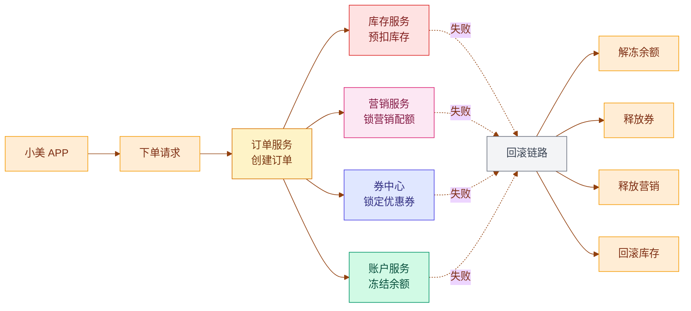
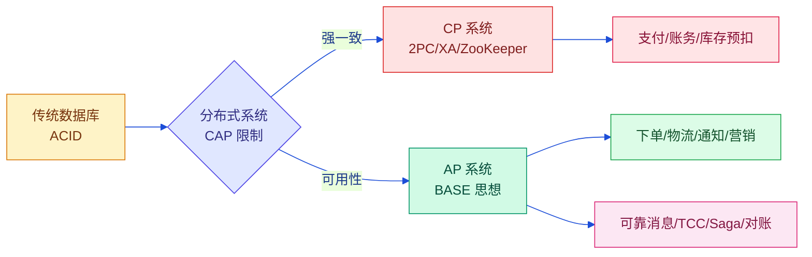
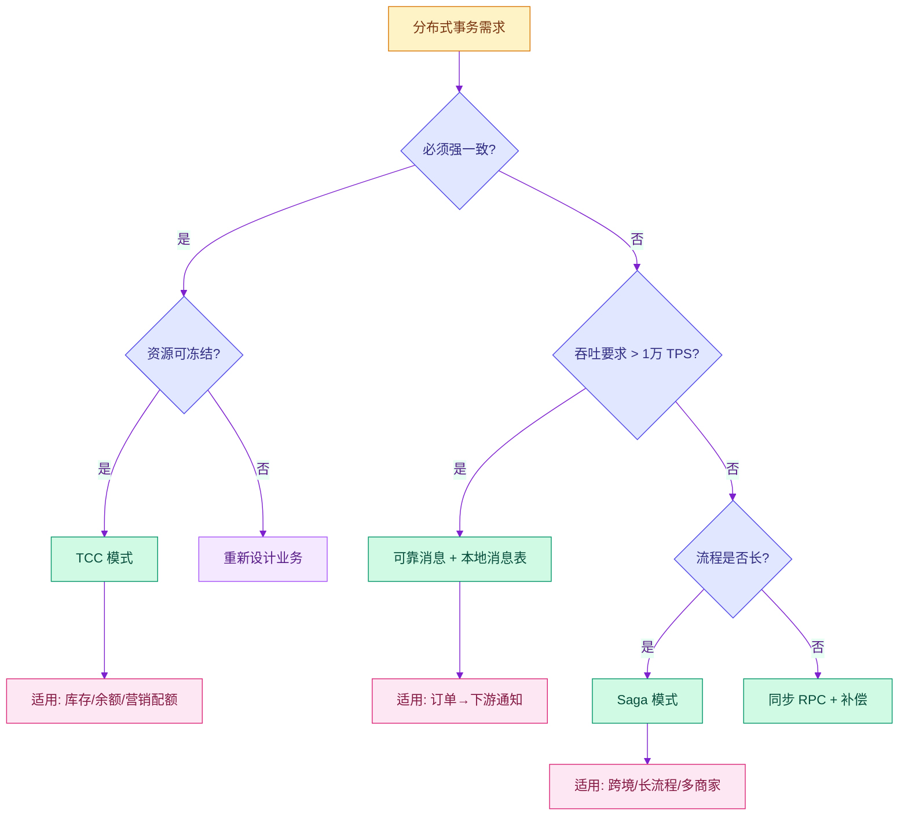
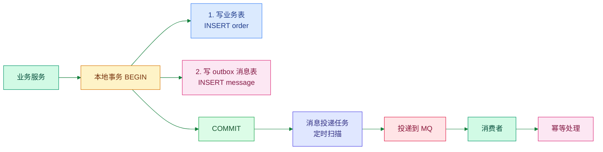
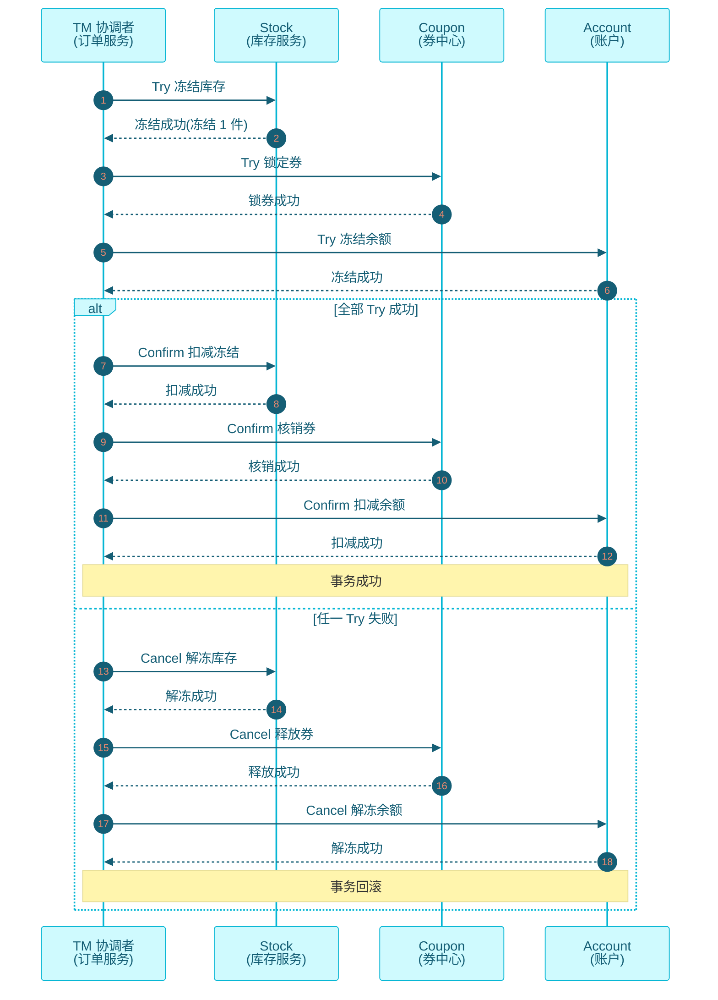
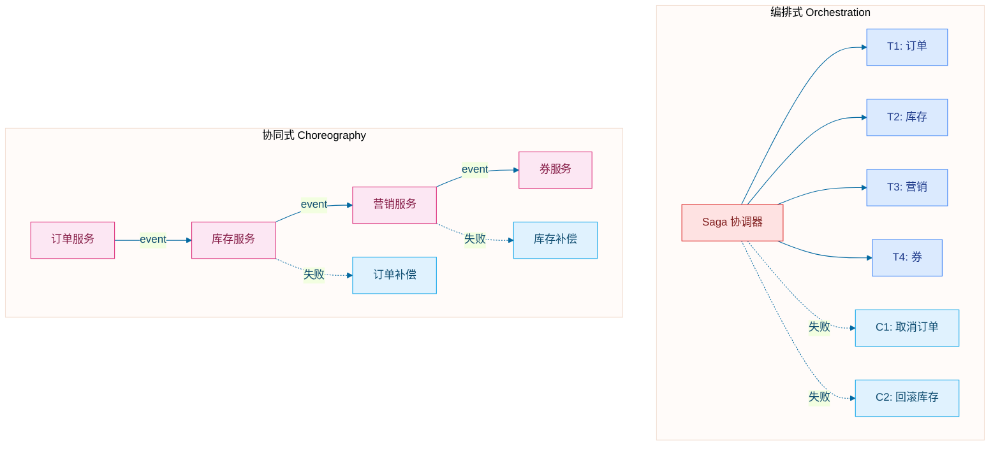
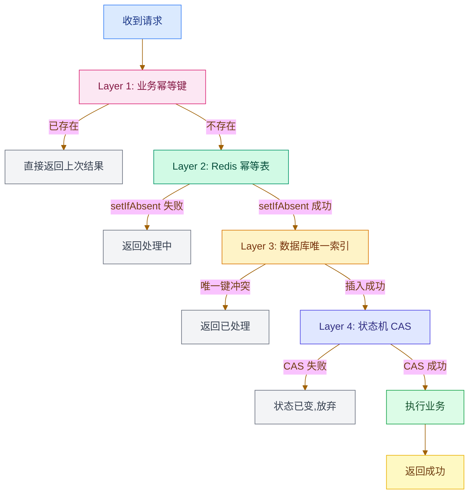
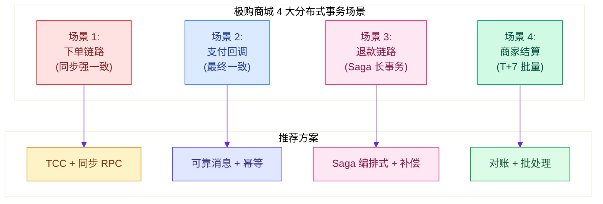

# 第 11 章 · 分布式事务：可靠消息、TCC、Saga 在商城中的应用

> **所属系列**：商城平台系统设计 · 全景教程 · 第四部分 · 支付与一致性
>
> **上一章**：[第 10 章 · 支付系统](./10-支付系统.md)　|　**下一章**：[第 12 章 · 售后退款系统](./12-售后退款系统.md)　|　**总目录**：[教程大纲](./00-教程大纲.md)

---

## 本章导读

上一章我们跟着小美把 110 元 T 恤订单的 5 秒付款流程跑完,看到了支付系统「收银台 → 支付核心 → 对账中心 → 结算中心」四大件如何严密地处理「钱」。但这只是支付**成功路径**的一面——支付宝回调里,极购不仅要把支付单状态机从 `SUBMITTED` 推到 `SUCCESS`,还要在**同一时刻**告诉订单系统「订单已支付」、告诉库存系统「最终扣减」、告诉营销系统「券核销」、告诉老王「可以发货」。

这些动作分散在 5 个独立的微服务、5 个独立的数据库中,任何一个失败都不应该让数据错乱。这就是**分布式事务**要解决的问题。

**为什么这一章必须存在?** 一组数字感受一下极购商城的分布式事务复杂度:

```
日均订单:           800 万
每笔订单平均跨服务:  5 个(订单/库存/营销/券/支付)
大促峰值 QPS:        50 万
分布式服务总数:       50+
一致性要求:           钱不能多扣、库存不能超卖、券不能重复核销
                       但又要扛住 50 万 QPS
```

矛盾就出现了:**传统数据库的 ACID 事务能保证一致,但扛不住 50 万 QPS;微服务架构能扛住 50 万 QPS,但天然不保证跨服务一致**。这正是分布式事务的核心张力。

这一章我们围绕以下问题展开:

1. **为什么需要分布式事务**:从单体到微服务,事务从本地 ACID 走向跨服务
2. **CAP / BASE 理论**:分布式一致性的理论基石
3. **三大主流模式对比**:可靠消息、TCC、Saga 各自的适用场景
4. **可靠消息最终一致**:本地消息表 + RocketMQ 事务消息(核心)
5. **TCC 模式**:Try-Confirm-Cancel 的三阶段、强一致
6. **Saga 模式**:编排式 vs 协同式、长事务补偿
7. **幂等设计**:业务幂等键、Redis 幂等表、状态机校验
8. **商城中的典型场景**:下单、支付、退款、结算四大链路的事务设计
9. **空回滚 / 防悬挂**:TCC 的两个经典陷阱
10. **Seata 实战**:AT/TCC 两种模式的接入示例
11. **典型问题与解法**:消息丢失、重复消费、回滚失败、死循环

读完本章你将能回答:**为什么 2PC 不适合电商核心链路?本地消息表和 RocketMQ 事务消息的差别在哪?TCC 为什么是强一致?Saga 和 TCC 怎么选?**

---

## 11.1 为什么需要分布式事务

### 11.1.1 单体时代的 ACID

在单体应用中,所有业务逻辑都在一个进程、一台服务器、一个数据库里完成:

```sql
begin transaction
  -- 1. 扣库存
  UPDATE t_stock SET available = available - 1 WHERE sku_id = 1001;
  -- 2. 创建订单
  INSERT INTO t_order (user_id, sku_id, amount) VALUES (888, 1001, 9900);
  -- 3. 写支付记录
  INSERT INTO t_pay (order_id, channel, amount) VALUES (xxx, 'ALIPAY', 9900);
commit;
```

只要 `commit` 成功,三件事同时成功;只要其中一件失败,数据库回滚。这是经典的 **ACID 事务**——单机 100% 可靠、毫秒级延迟、零业务侵入。

**但单体架构扛不住大促**。极购 50 万 QPS 写请求,单库单表物理上限大概 3~5 万 QPS,单体架构 10 倍以上就崩了。

### 11.1.2 微服务后的撕裂

极购商城把交易拆成 5 个微服务:

| 服务 | 数据库 | 职责 |
|------|--------|------|
| **订单服务** | MySQL(分库分表 16×16) | 订单状态机 |
| **库存服务** | MySQL + Redis | 预扣/最终扣减 |
| **营销服务** | MySQL | 优惠券/活动/满减 |
| **券中心** | MySQL + Redis | 券核销 |
| **支付服务** | MySQL | 支付单/对账 |

一次小美下单会同时跨这 5 个服务、5 个数据库。问题来了:

> 如果订单创建成功,但库存扣减失败,系统该怎么办?
>
> 如果库存扣减成功,但支付服务超时,系统如何判断是成功、失败,还是未知?
>
> 如果回滚请求也失败,系统是否还能恢复到一致状态?

**本地 ACID 在跨服务场景下完全失效**。这就是分布式事务要解决的问题。

### 11.1.3 小美下单的分布式事务链路



**任何一步失败,都要把前面已经成功的步骤全部回滚**——但这种「回滚」在分布式下没有 undo log,必须用**业务补偿**(如退款、解冻、作废券)。

### 11.1.4 分布式事务 vs 本地事务

| 维度 | 本地 ACID 事务 | 分布式事务 |
|------|----------------|------------|
| 范围 | 单进程单数据库 | 跨服务跨数据库 |
| 一致性 | 强一致(commit 即生效) | 多数最终一致,少数强一致 |
| 性能 | 微秒级 | 毫秒~秒级 |
| 实现 | 数据库内置 | 业务代码 + 中间件 |
| 失败处理 | rollback(undo log) | 业务补偿 + 重试 |
| 适用场景 | 单机/单库 | 微服务、跨域 |

**核心结论**:分布式事务不是「像本地事务一样完美」,而是「在业务可接受的范围内,用更简单、更可恢复的方式达到一致」。

---

## 11.2 CAP 与 BASE 理论

### 11.2.1 CAP 三选二

CAP 理论由 Eric Brewer 在 2000 年提出,是分布式系统的「不可能三角」:

| 字母 | 含义 | 例子 |
|------|------|------|
| **C** Consistency 一致性 | 所有节点同一时刻看到同一份数据 | 任何节点读都返回最新写入 |
| **A** Availability 可用性 | 任何请求都能得到响应(非错误) | 不允许返回 timeout/error |
| **P** Partition tolerance 分区容错 | 网络分区时系统仍能继续运行 | 机房断网仍能服务 |

**CAP 定理**:**分布式系统在发生网络分区时,只能在 C 和 A 之间二选一**——这是物理限制,不是工程选择。

### 11.2.2 商城中的 CAP 取舍

| 业务场景 | 选 C 还是 A | 典型方案 |
|---------|------------|----------|
| **支付核心账** | **C** 优先 | 2PC、XA、强一致 |
| **下单链路** | **A** 优先(返回快) | 最终一致 + 补偿 |
| **商品详情页** | **A** 优先 | 多级缓存、降级静态页 |
| **库存预扣** | **C** 优先 | Redis Lua 原子、库存冻结 |
| **秒杀下单** | **A** 优先 | 异步排队 + 削峰 |

**经验法则**:钱/货/账相关的强一致,用户感知类的可用性优先。

### 11.2.3 BASE 思想

eBay 架构师 Dan Pritchett 在 2008 年提出 BASE,作为 ACID 在分布式场景下的替代:

| 原则 | 含义 | 例子 |
|------|------|------|
| **B**asically Available | 基本可用,允许损失部分可用性 | 大促时关闭非核心校验 |
| **S**oft State | 允许中间状态 | 「处理中」「待确认」 |
| **E**ventually Consistent | 最终一致,经过一段时间后数据收敛 | 重试 + 补偿 + 对账 |

**BASE 不追求任何时刻的强一致,只追求「最终会一致」**——这是互联网分布式系统的设计哲学。



---

## 11.3 分布式事务的核心挑战

### 11.3.1 四大挑战

| 挑战 | 描述 | 后果 |
|------|------|------|
| **网络分区** | 机房断网、交换机故障、跨地域网络抖动 | 调用方收不到响应,不知成功还是失败 |
| **时钟不一致** | 分布式节点时钟有偏差,NTP 校准回拨 | 时间戳排序错乱、ID 重复 |
| **部分失败** | 5 个服务调用,3 个成功 2 个失败 | 状态分散,需要补偿 |
| **幂等性缺失** | 网络重试导致同一请求被多次执行 | 库存多扣、券多发、钱多扣 |

### 11.3.2 「未知状态」是最大的坑

调用远端服务时,有 3 种可能的结果:

1. **明确成功**:远端返回 OK —— 没问题
2. **明确失败**:远端返回错误 —— 回滚就好
3. **未知**:超时、网络中断 —— **不知道远端是否执行**

```
客户端 ──请求──> 服务端
客户端 <──超时── 服务端
         ↑↑↑
    这里有 5 种可能:
    1) 请求没到服务端
    2) 服务端处理了但没回包
    3) 服务端处理了,回包了但客户端没收到
    4) 服务端处理中,过会儿才回包
    5) 服务端已经处理,但处理失败
```

**超时 ≠ 失败**。这是分布式事务设计的起点。处理方式:

- **幂等设计**:让重试安全,避免「处理中」被多次执行
- **主动查询**:不依赖回调,通过查询接口确认状态
- **状态机**:每次状态变更都留痕,补偿时按状态决定动作
- **对账兜底**:T+1 用账本核对,找出不一致

### 11.3.3 状态机是分布式事务的基石

**永远不要用一个布尔字段表示成功或失败**。极购商城的支付单有 7 个状态(见 10.4.2 节),订单有 10 个状态(见 6.3.1 节),退款单有 5 个状态——**状态机是一切重试、补偿、对账的基础**。

```
INIT → PROCESSING → CONFIRMING → SUCCESS
                ↓
              CANCELING → CANCELED
                ↓
        FAILED_MANUAL_REVIEW
```

每个状态都是「明确的、可解释的、可恢复的」。

---

## 11.4 三大主流模式对比

### 11.4.1 三种模式速览

| 模式 | 一致性级别 | 性能 | 实现复杂度 | 侵入性 | 适用场景 |
|------|-----------|------|------------|--------|----------|
| **可靠消息最终一致** | 最终一致 | 高(异步) | 低 | 小 | 下游通知、积分、库存同步 |
| **TCC** | 强一致 | 中(同步 3 阶段) | 中 | 大 | 库存/余额/额度冻结 |
| **Saga** | 最终一致 | 中(长流程) | 中 | 中 | 跨多服务的长事务、补偿 |

### 11.4.2 选型决策树



### 11.4.3 极购商城的事务选型

| 业务场景 | 一致性要求 | 推荐方案 |
|---------|-----------|----------|
| **下单 + 锁库存 + 锁券** | 强一致(库存不能多卖) | TCC 或 同步 RPC + 补偿 |
| **下单 + 发送领域事件** | 最终一致(消息可重投) | 可靠消息 / 事务消息 |
| **支付回调 + 更新订单 + 通知商家** | 最终一致(可对账兜底) | 可靠消息 + 幂等 |
| **跨境结算 + 多商家分账** | 最终一致(可人工) | Saga 编排式 |
| **下单 + 加积分** | 最终一致(可补发) | 可靠消息 |

---

## 11.5 可靠消息最终一致(核心)

### 11.5.1 核心问题

**本地数据库提交成功 和 消息发送成功,如何保证二者一致?**

错误流程:

```text
1. 业务代码:写订单表
2. 业务代码:发 MQ 消息
```

如果第 1 步成功、第 2 步失败,下游永远不知道「订单已创建」。

### 11.5.2 本地消息表方案

**核心思想**:**业务表 和 消息表 在同一个本地事务中写入,后台任务扫描消息表投递到 MQ**。



**优势**:
- 实现简单,完全基于数据库事务
- 不依赖特定 MQ,任何 MQ 都行
- 失败可重试,不丢消息

**劣势**:
- 有一定延迟(扫描周期)
- 数据库写放大(每条业务消息多一次 INSERT)

### 11.5.3 本地消息表 SQL 设计

```sql
-- 极购 outbox 消息表
CREATE TABLE t_outbox_msg (
    id              BIGINT(20)    UNSIGNED NOT NULL AUTO_INCREMENT  COMMENT '主键',
    biz_type        VARCHAR(32)   NOT NULL                          COMMENT '业务类型:ORDER_CREATED/ORDER_PAID',
    biz_id          VARCHAR(64)   NOT NULL                          COMMENT '业务主键(订单号)',
    topic           VARCHAR(64)   NOT NULL                          COMMENT 'MQ topic',
    tag             VARCHAR(32)   NOT NULL DEFAULT ''               COMMENT 'MQ tag',
    msg_key         VARCHAR(64)   NOT NULL                          COMMENT '消息key(用于分区/去重)',
    payload         TEXT          NOT NULL                          COMMENT '消息体(JSON)',
    status          VARCHAR(16)   NOT NULL DEFAULT 'PENDING'        COMMENT 'PENDING/SENT/FAILED',
    retry_count     INT           NOT NULL DEFAULT 0                COMMENT '重试次数',
    next_retry_time DATETIME(3)   NOT NULL                          COMMENT '下次重试时间',
    created_at      DATETIME(3)   NOT NULL DEFAULT CURRENT_TIMESTAMP(3),
    sent_at         DATETIME(3)   NULL DEFAULT NULL                  COMMENT '发送成功时间',
    PRIMARY KEY (id),
    UNIQUE KEY uk_biz (biz_type, biz_id),  -- 业务幂等:同一业务单号只发一次
    KEY idx_status_retry (status, next_retry_time)  -- 扫描索引
) ENGINE=InnoDB DEFAULT CHARSET=utf8mb4 COMMENT='本地消息表(Outbox)';
```

### 11.5.4 完整 Java 实现

```java
import lombok.RequiredArgsConstructor;
import lombok.extern.slf4j.Slf4j;
import org.springframework.jdbc.core.JdbcTemplate;
import org.springframework.scheduling.annotation.Scheduled;
import org.springframework.stereotype.Component;
import org.springframework.transaction.annotation.Transactional;

import java.time.LocalDateTime;
import java.util.List;
import java.util.Map;

/**
 * 本地消息表 Outbox 服务
 *
 * 核心思想:
 *  1. 业务表 + 消息表 同事务写入
 *  2. 后台任务扫描 PENDING 消息投递到 MQ
 *  3. 投递成功标记 SENT,失败按指数退避重试
 *  4. 超过最大重试次数转人工处理
 *
 * 优点:实现简单,基于数据库事务保证原子性
 * 缺点:扫描周期带来延迟(可缩到秒级)
 */
@Slf4j
@Component
@RequiredArgsConstructor
public class OutboxService {

    private final JdbcTemplate jdbc;
    private final MqProducer mqProducer;  // 注入的 MQ 生产者(可封装 RocketMQ/Kafka)

    /**
     * Step 1: 业务代码中,业务表 + 消息表同事务写入
     * 调用方只需在事务内调用 writeOutbox 即可
     */
    public void writeOutbox(String bizType, String bizId, String topic,
                            String tag, String msgKey, Object payload) {
        jdbc.update(
            "INSERT INTO t_outbox_msg (biz_type, biz_id, topic, tag, msg_key, " +
            "payload, status, retry_count, next_retry_time) " +
            "VALUES (?, ?, ?, ?, ?, ?, 'PENDING', 0, ?)",
            bizType, bizId, topic, tag, msgKey,
            JSON.toJSONString(payload),
            LocalDateTime.now()
        );
    }

    /**
     * Step 2: 后台任务,每 1 秒扫一次 PENDING 消息
     * 找到 next_retry_time <= now 的消息,投递到 MQ
     */
    @Scheduled(fixedRate = 1000)
    public void scanAndSend() {
        List<Map<String, Object>> messages = jdbc.queryForList(
            "SELECT id, biz_type, biz_id, topic, tag, msg_key, payload, retry_count " +
            "FROM t_outbox_msg " +
            "WHERE status = 'PENDING' AND next_retry_time <= NOW() " +
            "ORDER BY id ASC LIMIT 100"
        );

        for (Map<String, Object> msg : messages) {
            long id = ((Number) msg.get("id")).longValue();
            try {
                sendToMq(id, msg);
            } catch (Exception e) {
                handleFailure(id, msg, e);
            }
        }
    }

    /**
     * Step 3: 投递到 MQ
     * 同步等待 broker ack 后才标记 SENT
     */
    private void sendToMq(long id, Map<String, Object> msg) {
        String topic = (String) msg.get("topic");
        String tag = (String) msg.get("tag");
        String msgKey = (String) msg.get("msg_key");
        String payload = (String) msg.get("payload");

        // 同步发送,等待 broker 确认
        mqProducer.sendSync(topic, tag, msgKey, payload);

        // 发送成功,标记 SENT
        jdbc.update(
            "UPDATE t_outbox_msg SET status='SENT', sent_at=NOW() WHERE id=?",
            id
        );
        log.debug("outbox 消息发送成功 id={}, topic={}", id, topic);
    }

    /**
     * Step 4: 发送失败,按指数退避重试
     * 重试 5 次后转人工处理
     */
    private void handleFailure(long id, Map<String, Object> msg, Exception e) {
        int retryCount = ((Number) msg.get("retry_count")).intValue() + 1;

        if (retryCount >= 5) {
            // 超过最大重试次数,转人工
            jdbc.update(
                "UPDATE t_outbox_msg SET status='FAILED', retry_count=? WHERE id=?",
                retryCount, id
            );
            log.error("outbox 消息重试超限,转人工处理 id={}", id, e);
            alarmService.sendAlarm("outbox 消息失败: id=" + id);
            return;
        }

        // 指数退避:1s, 2s, 4s, 8s, 16s
        long delaySec = (long) Math.pow(2, retryCount);
        jdbc.update(
            "UPDATE t_outbox_msg SET retry_count=?, next_retry_time=DATE_ADD(NOW(), " +
            "INTERVAL ? SECOND) WHERE id=?",
            retryCount, delaySec, id
        );
        log.warn("outbox 消息发送失败,稍后重试 id={}, retry={}, delay={}s",
                 id, retryCount, delaySec, e);
    }
}
```

### 11.5.5 业务侧使用示例

```java
/**
 * 订单创建:业务表 + 消息表同事务写入
 */
@Service
@RequiredArgsConstructor
public class OrderCreateService {

    private final JdbcTemplate jdbc;
    private final OutboxService outbox;
    private final StockClient stockClient;
    private final CouponClient couponClient;

    @Transactional(rollbackFor = Exception.class)
    public Order createOrder(CreateReq req) {
        // 1. 预扣库存
        boolean ok = stockClient.reserve(req.getSkuId(), req.getQuantity());
        if (!ok) throw new BizException("STOCK_NOT_ENOUGH");

        // 2. 锁券
        if (req.getCouponId() != null) {
            boolean lockOk = couponClient.lock(req.getCouponId(), req.getUserId());
            if (!lockOk) throw new BizException("COUPON_LOCK_FAIL");
        }

        // 3. 创建订单
        Order order = Order.builder()
                .orderId(snGen.nextId())
                .userId(req.getUserId())
                .status(OrderStatus.UNPAID)
                .build();
        jdbc.update("INSERT INTO t_order ...", order);

        // 4. 写 outbox 消息(同事务!)
        // 后台任务会投递到 MQ,通知营销、数据、风控等
        outbox.writeOutbox(
            "ORDER_CREATED",            // bizType
            String.valueOf(order.getOrderId()),  // bizId(幂等键)
            "ORDER_EVENT",              // topic
            "created",                  // tag
            String.valueOf(order.getUserId()),  // msgKey(按用户分区)
            new OrderCreatedEvent(order.getOrderId(), order.getUserId())
        );

        return order;
    }
}
```

---

## 11.6 RocketMQ 事务消息

### 11.6.1 RocketMQ 的事务消息机制

RocketMQ 在 4.3.0 版本后提供**事务消息**,通过「Half Message + 回查机制」避免本地消息表的扫描延迟。

**核心流程**:

```mermaid
%%{init: {"theme": "base", "themeVariables": {"background": "#FFF7ED", "primaryColor": "#FFEDD5", "primaryTextColor": "#7C2D12", "primaryBorderColor": "#F59E0B", "lineColor": "#92400E", "fontFamily": "Microsoft YaHei, Arial"}}}%%
sequenceDiagram
    autonumber
    participant P as Producer
    participant B as Broker
    participant L as 本地事务
    participant C as Consumer

    P->>B: 1. 发送 Half Message(对消费者不可见)
    B-->>P: 2. Half Message 落盘成功
    P->>L: 3. 执行本地事务(写订单表)
    alt 本地事务成功
        P->>B: 4. Commit(消息对消费者可见)
        B-->>C: 5. 投递消息
    else 本地事务失败
        P->>B: 4'. Rollback(丢弃消息)
    end

    Note over P,B: 如果第 3 步后 Producer 崩溃,没有发 Commit/Rollback?
    B->>P: 6. 回查 Producer 状态
    P->>L: 7. 查询本地事务结果
    L-->>P: 8. 返回状态
    P->>B: 9. 根据状态 Commit 或 Rollback

    style P fill:#FEE2E2,stroke:#DC2626,color:#7F1D1D
    style B fill:#DBEAFE,stroke:#3B82F6,color:#1E3A8A
    style L fill:#D1FAE5,stroke:#059669,color:#064E3B
    style C fill:#FCE7F3,stroke:#DB2777,color:#831843
```

**关键概念**:

| 概念 | 含义 |
|------|------|
| **Half Message** | 暂存于 Broker 的「预提交」消息,对消费者不可见 |
| **Commit** | 提交消息,使其对消费者可见 |
| **Rollback** | 回滚消息,消费者永远不会看到 |
| **回查(Check)** | Broker 定期回查 Producer,确认本地事务状态 |

### 11.6.2 RocketMQ 事务消息 Java 实现

```java
import lombok.RequiredArgsConstructor;
import lombok.extern.slf4j.Slf4j;
import org.apache.rocketmq.client.producer.*;
import org.apache.rocketmq.spring.annotation.RocketMQTransactionListener;
import org.apache.rocketmq.spring.core.RocketMQLocalTransactionListener;
import org.apache.rocketmq.spring.core.RocketMQLocalTransactionState;
import org.springframework.messaging.Message;
import org.springframework.stereotype.Component;

import javax.annotation.Resource;

/**
 * RocketMQ 事务消息生产者
 *
 * 适用场景:订单创建后需要通知下游(库存回滚、营销触达、数据埋点)
 * 优势:不需要本地消息表的扫描,延迟更低
 */
@Slf4j
@Component
@RequiredArgsConstructor
public class OrderEventProducer {

    @Resource(name = "rocketMQTemplate")
    private RocketMQTemplate rocketMQTemplate;

    /**
     * 发送事务消息:在订单创建后,投递「订单已创建」事件
     *
     * @param orderId 订单号
     * @param event 事件内容
     */
    public void sendOrderCreatedEvent(Long orderId, OrderCreatedEvent event) {
        // Spring Boot RocketMQ 模板的事务消息 API
        // arg 是传给 LocalTransactionListener 的参数
        rocketMQTemplate.sendMessageInTransaction(
            "ORDER_EVENT_GROUP",        // producer group
            "ORDER_EVENT:created",      // topic:tag
            MessageBuilder.withPayload(event)
                .setHeader("orderId", orderId)
                .build(),
            orderId                      // arg(用于回查时定位事务)
        );
    }
}

/**
 * 事务监听器:RocketMQ 在以下时刻回调此 Bean
 *  1. Half Message 落盘后,执行本地事务(executeLocalTransaction)
 *  2. Broker 发起回查时(checkLocalTransaction)
 */
@RocketMQTransactionListener
@Component
@RequiredArgsConstructor
class OrderEventTransactionListener implements RocketMQLocalTransactionListener {

    private final OrderRepository orderRepo;

    /**
     * Step 1: Half Message 落盘后,执行本地事务
     * 这里实际是「确认」订单已经落库成功
     */
    @Override
    public RocketMQLocalTransactionState executeLocalTransaction(
            Message msg, Object arg) {
        Long orderId = (Long) arg;
        try {
            // 校验订单是否落库成功
            Order order = orderRepo.findById(orderId);
            if (order == null) {
                // 订单没落库,回滚消息
                return RocketMQLocalTransactionState.ROLLBACK;
            }
            // 订单落库成功,提交消息
            return RocketMQLocalTransactionState.COMMIT;
        } catch (Exception e) {
            log.error("本地事务执行异常 orderId={}", orderId, e);
            // 异常转 UNKNOWN,触发 Broker 回查
            return RocketMQLocalTransactionState.UNKNOWN;
        }
    }

    /**
     * Step 2: Broker 回查本地事务状态
     * 由于网络/进程崩溃,Producer 没能告诉 Broker 最终结果
     * Broker 主动回查,我们告诉它最终应该 commit 还是 rollback
     */
    @Override
    public RocketMQLocalTransactionState checkLocalTransaction(
            Message msg) {
        Long orderId = (Long) msg.getHeaders().get("orderId");
        try {
            // 再次检查订单是否落库
            Order order = orderRepo.findById(orderId);
            if (order == null) {
                return RocketMQLocalTransactionState.ROLLBACK;
            }
            // 注意:回查次数有限(默认 15 次),查不到最终也回滚
            return RocketMQLocalTransactionState.COMMIT;
        } catch (Exception e) {
            log.error("回查本地事务异常 orderId={}", orderId, e);
            return RocketMQLocalTransactionState.UNKNOWN;
        }
    }
}
```

### 11.6.3 本地消息表 vs RocketMQ 事务消息

| 维度 | 本地消息表 | RocketMQ 事务消息 |
|------|------------|------------------|
| 延迟 | 秒级(扫描周期) | 毫秒级 |
| 复杂度 | 简单,纯 SQL | 中等,需理解 Half Message |
| 依赖 | 任何 MQ | 必须是 RocketMQ |
| 数据库压力 | 多一次 INSERT | 不多写 |
| 适用规模 | 中小规模 | 大规模(阿里/京东在用) |

**极购商城的选型**:核心链路(订单创建→营销/数据)用 **RocketMQ 事务消息**;非核心链路(操作日志/通知)用 **本地消息表**。

---

## 11.7 TCC 模式

### 11.7.1 核心思想

TCC(Try-Confirm-Cancel)将数据库事务的「锁资源、提交、回滚」显式建模为 3 个业务接口:

| 阶段 | 目标 | 例子 |
|------|------|------|
| **Try** | 尝试执行,预留资源 | 冻结库存、冻结余额 |
| **Confirm** | 确认执行,真正提交 | 扣减冻结库存、扣减冻结余额 |
| **Cancel** | 取消执行,释放资源 | 解冻库存、解冻余额 |

**关键不变量**:**Confirm 和 Cancel 一定成功**(资源已经预留好了,只是状态变化)。

### 11.7.2 TCC 三阶段时序图



### 11.7.3 完整 Java 实现

以「扣减营销配额」为例,展示 TCC 三个方法:

```java
import lombok.RequiredArgsConstructor;
import lombok.extern.slf4j.Slf4j;
import org.springframework.stereotype.Service;
import org.springframework.transaction.annotation.Transactional;

import java.time.LocalDateTime;

/**
 * 营销配额 TCC 实现
 *
 * 业务场景:下单时占用用户的「秒杀配额」「活动名额」等
 * Try: 创建冻结记录(冻结配额)
 * Confirm: 把冻结记录转成已使用(真正扣减)
 * Cancel: 把冻结记录释放(解冻)
 */
@Slf4j
@Service
@RequiredArgsConstructor
public class QuotaTccService {

    private final QuotaTccDao quotaTccDao;
    private final QuotaRepository quotaRepo;

    /**
     * Try: 冻结营销配额
     *
     * @param txId  全局事务ID(由 TM 协调者生成)
     * @param userId 用户
     * @param activityId 活动
     * @param quantity 数量
     */
    @Transactional(rollbackFor = Exception.class)
    public void tryFreeze(String txId, Long userId, Long activityId, int quantity) {
        // 1. 幂等检查:同一个 txId 已 Try 成功,直接返回
        QuotaTccRecord record = quotaTccDao.findByTxId(txId);
        if (record != null && "TRY_SUCCESS".equals(record.getStatus())) {
            log.info("Try 已执行,幂等返回 txId={}", txId);
            return;
        }

        // 2. 防悬挂:如果已经 Canceled,拒绝 Try
        if (record != null && "CANCELED".equals(record.getStatus())) {
            throw new BizException("TX_CANCELED", "事务已取消,拒绝 Try");
        }

        // 3. 业务检查:配额是否充足
        Quota quota = quotaRepo.findByUserAndActivity(userId, activityId);
        if (quota == null || quota.getAvailable() < quantity) {
            // 记录失败状态,便于排查
            if (record == null) {
                quotaTccDao.insert(TccRecord.fail(txId, "QUOTA_NOT_ENOUGH"));
            }
            throw new BizException("QUOTA_NOT_ENOUGH", "配额不足");
        }

        // 4. 冻结资源:可用配额减少,冻结配额增加
        quota.setAvailable(quota.getAvailable() - quantity);
        quota.setFrozen(quota.getFrozen() + quantity);
        quotaRepo.update(quota);

        // 5. 记录事务状态
        if (record == null) {
            quotaTccDao.insert(TccRecord.trySuccess(txId, userId, activityId, quantity));
        } else {
            quotaTccDao.updateStatus(txId, "TRY_SUCCESS");
        }

        log.info("Try 冻结配额成功 txId={}, userId={}, quantity={}", txId, userId, quantity);
    }

    /**
     * Confirm: 扣减冻结配额
     */
    @Transactional(rollbackFor = Exception.class)
    public void confirm(String txId) {
        // 1. 幂等:已 Confirm 过,直接返回
        QuotaTccRecord record = quotaTccDao.findByTxId(txId);
        if (record == null) {
            // 空 Confirm,理论上不该发生
            log.warn("Confirm 但无 Try 记录 txId={}", txId);
            return;
        }
        if ("CONFIRMED".equals(record.getStatus())) {
            log.info("Confirm 已执行,幂等返回 txId={}", txId);
            return;
        }
        if (!"TRY_SUCCESS".equals(record.getStatus())) {
            throw new BizException("INVALID_TCC_STATE",
                "Confirm 只能在 TRY_SUCCESS 后执行,当前=" + record.getStatus());
        }

        // 2. 真正扣减冻结
        Quota quota = quotaRepo.findByUserAndActivity(
            record.getUserId(), record.getActivityId());
        quota.setFrozen(quota.getFrozen() - record.getQuantity());
        quotaRepo.update(quota);

        // 3. 更新事务状态
        quotaTccDao.updateStatus(txId, "CONFIRMED");
        log.info("Confirm 扣减冻结配额成功 txId={}", txId);
    }

    /**
     * Cancel: 释放冻结配额
     */
    @Transactional(rollbackFor = Exception.class)
    public void cancel(String txId) {
        QuotaTccRecord record = quotaTccDao.findByTxId(txId);

        // 空回滚:Try 没执行成功,Cancel 先到了
        if (record == null) {
            // 插入一条 Canceled 记录,防止后续 Try 形成「悬挂」
            quotaTccDao.insert(TccRecord.canceled(txId, "EMPTY_ROLLBACK"));
            log.warn("空回滚,Cancel 先于 Try 到达 txId={}", txId);
            return;
        }

        // 幂等:已 Cancel 过,直接返回
        if ("CANCELED".equals(record.getStatus())) {
            log.info("Cancel 已执行,幂等返回 txId={}", txId);
            return;
        }

        // 防悬挂:如果已经 Confirm,不能再 Cancel
        if ("CONFIRMED".equals(record.getStatus())) {
            log.error("悬挂!事务已 Confirm,不能再 Cancel txId={}", txId);
            throw new BizException("TX_ALREADY_CONFIRMED");
        }

        // 释放冻结
        Quota quota = quotaRepo.findByUserAndActivity(
            record.getUserId(), record.getActivityId());
        quota.setFrozen(quota.getFrozen() - record.getQuantity());
        quota.setAvailable(quota.getAvailable() + record.getQuantity());
        quotaRepo.update(quota);

        // 更新状态
        quotaTccDao.updateStatus(txId, "CANCELED");
        log.info("Cancel 释放冻结配额成功 txId={}", txId);
    }
}
```

### 11.7.4 TCC 三个经典陷阱

#### 11.7.4.1 空回滚

**场景**:TM 调 Try 超时,以为 Try 失败,发起 Cancel;但 Try 请求其实还在网络中。

**问题**:Cancel 执行时,Try 还没执行,没有冻结记录可释放。

**解决**:Cancel 时若无 Try 记录,直接写一条 `CANCELED` 记录并返回成功。

```java
// 空回滚处理
if (record == null) {
    quotaTccDao.insert(TccRecord.canceled(txId, "EMPTY_ROLLBACK"));
    return;
}
```

#### 11.7.4.2 悬挂

**场景**:空回滚后,迟到的 Try 请求又到了;如果继续 Try,就会冻结一份永远没人 Confirm/Cancel 的资源。

**解决**:Try 时检查事务记录,若已 `CANCELED` 则拒绝 Try。

```java
// 防悬挂
if (record != null && "CANCELED".equals(record.getStatus())) {
    throw new BizException("TX_CANCELED", "事务已取消,拒绝 Try");
}
```

#### 11.7.4.3 幂等

**场景**:Confirm 或 Cancel 因超时被重复调用。

**解决**:所有操作先查事务状态,已完成直接返回。

```java
if ("CONFIRMED".equals(record.getStatus())) {
    return;  // 幂等返回
}
```

---

## 11.8 Saga 模式

### 11.8.1 核心思想

Saga 把一个长事务拆成多个**本地事务**,每个本地事务都有对应的**补偿动作**。任一失败时,反向执行已成功的补偿。

```text
T1 → T2 → T3 → T4
若 T3 失败:执行 C2 → C1(反向补偿已成功的步骤)

注意:补偿不是数据库回滚,而是新的业务动作:
- 支付成功 → 退款(不是删除支付记录)
- 发券成功 → 作废券(不是删除券记录)
- 发货成功 → 拦截物流(不是删除发货单)
```

### 11.8.2 编排式 vs 协同式

| 维度 | 编排式(Orchestration) | 协同式(Choreography) |
|------|---------------------|---------------------|
| **协调者** | 中央 Saga 协调器 | 无中心,各服务通过事件驱动 |
| **耦合度** | 协调器知道所有步骤 | 服务间无直接依赖 |
| **可观测性** | 好(状态都在协调器) | 差(状态分散在各服务) |
| **复杂度** | 协调器复杂 | 流程分散难追 |
| **适用规模** | 业务流程清晰(下单/结算) | 服务多、流程长(供应链) |

### 11.8.3 编排式 vs 协同式 对比图



### 11.8.4 编排式 Saga 协调器 Java 实现

```java
import lombok.RequiredArgsConstructor;
import lombok.extern.slf4j.Slf4j;
import org.springframework.stereotype.Service;
import org.springframework.transaction.annotation.Transactional;

import java.util.List;
import java.util.Map;
import java.util.concurrent.ConcurrentHashMap;
import java.util.function.Function;

/**
 * Saga 协调器(编排式)
 *
 * 适用于订单正向流程:订单→库存→营销→券→账户
 * 失败时反向补偿
 */
@Slf4j
@Service
@RequiredArgsConstructor
public class OrderSagaOrchestrator {

    private final SagaInstanceDao sagaDao;
    private final OrderService orderService;
    private final StockService stockService;
    private final MarketingService marketingService;
    private final CouponService couponService;
    private final AccountService accountService;

    /**
     * Saga 步骤定义
     * Action: 正向执行
     * Compensate: 补偿执行
     */
    public record SagaStep(
        String name,
        Function<SagaContext, Boolean> action,
        Function<SagaContext, Boolean> compensate
    ) {}

    /**
     * Saga 上下文(贯穿整个流程的数据)
     */
    public static class SagaContext {
        public String sagaId;
        public Long orderId;
        public Long userId;
        public Long skuId;
        public Integer quantity;
        public Long couponId;
        public Long amount;
        public Map<String, Object> ext = new ConcurrentHashMap<>();
    }

    /**
     * 执行 Saga
     */
    public void executeOrderSaga(SagaContext ctx) {
        // 1. 定义步骤
        List<SagaStep> steps = List.of(
            new SagaStep("CREATE_ORDER",
                c -> { orderService.createOrder(c); return true; },
                c -> { orderService.cancelOrder(c.orderId); return true; }
            ),
            new SagaStep("RESERVE_STOCK",
                c -> { stockService.reserve(c.skuId, c.quantity); return true; },
                c -> { stockService.release(c.skuId, c.quantity); return true; }
            ),
            new SagaStep("LOCK_MARKETING",
                c -> { marketingService.lock(c.userId, c.skuId); return true; },
                c -> { marketingService.unlock(c.userId, c.skuId); return true; }
            ),
            new SagaStep("LOCK_COUPON",
                c -> {
                    if (c.couponId != null) {
                        couponService.lock(c.couponId, c.userId);
                    }
                    return true;
                },
                c -> {
                    if (c.couponId != null) {
                        couponService.unlock(c.couponId, c.userId);
                    }
                    return true;
                }
            ),
            new SagaStep("FREEZE_ACCOUNT",
                c -> { accountService.freeze(c.userId, c.amount); return true; },
                c -> { accountService.unfreeze(c.userId, c.amount); return true; }
            )
        );

        // 2. 创建 Saga 实例
        sagaDao.insert(ctx.sagaId, "ORDER_SAGA", "RUNNING", 0);
        log.info("Saga 开始 sagaId={}", ctx.sagaId);

        // 3. 顺序执行,失败时反向补偿
        for (int i = 0; i < steps.size(); i++) {
            SagaStep step = steps.get(i);
            try {
                log.info("执行 Saga 步骤 sagaId={}, step={}", ctx.sagaId, step.name());
                Boolean ok = step.action().apply(ctx);
                if (!Boolean.TRUE.equals(ok)) {
                    throw new RuntimeException("步骤执行失败:" + step.name());
                }
                sagaDao.markStepSuccess(ctx.sagaId, step.name());

            } catch (Exception e) {
                log.error("Saga 步骤失败 sagaId={}, step={}", ctx.sagaId, step.name(), e);
                sagaDao.markStepFailed(ctx.sagaId, step.name(), e.getMessage());

                // 反向补偿
                compensate(ctx, steps, i);
                sagaDao.markSagaCompensated(ctx.sagaId);
                throw new BizException("SAGA_FAILED", "Saga 执行失败,已补偿");
            }
        }

        sagaDao.markSagaSuccess(ctx.sagaId);
        log.info("Saga 成功 sagaId={}", ctx.sagaId);
    }

    /**
     * 反向补偿:从失败步骤反向到第一步
     */
    private void compensate(SagaContext ctx, List<SagaStep> steps, int failedIdx) {
        for (int i = failedIdx - 1; i >= 0; i--) {
            SagaStep step = steps.get(i);
            try {
                log.info("补偿 Saga 步骤 sagaId={}, step={}", ctx.sagaId, step.name());
                step.compensate().apply(ctx);
                sagaDao.markStepCompensated(ctx.sagaId, step.name());
            } catch (Exception e) {
                // 补偿失败,记录并人工处理
                log.error("补偿失败 sagaId={}, step={}", ctx.sagaId, step.name(), e);
                sagaDao.markStepCompensateFailed(ctx.sagaId, step.name(), e.getMessage());
                alarmService.sendAlarm("Saga 补偿失败: " + ctx.sagaId);
            }
        }
    }
}
```

### 11.8.5 Saga 实例表 SQL

```sql
CREATE TABLE t_saga_instance (
    saga_id          VARCHAR(64)   NOT NULL                COMMENT 'Saga 全局ID',
    biz_type         VARCHAR(32)   NOT NULL                COMMENT '业务类型:ORDER_SAGA/REFUND_SAGA',
    biz_id           VARCHAR(64)   NOT NULL                COMMENT '业务ID',
    status           VARCHAR(16)   NOT NULL                COMMENT 'RUNNING/SUCCESS/COMPENSATED/FAILED',
    current_step     VARCHAR(32)   NOT NULL DEFAULT ''     COMMENT '当前执行到的步骤',
    context_json     TEXT          NOT NULL                COMMENT '上下文 JSON',
    created_at       DATETIME(3)   NOT NULL,
    updated_at       DATETIME(3)   NOT NULL,
    PRIMARY KEY (saga_id),
    KEY idx_biz (biz_type, biz_id),
    KEY idx_status (status, updated_at)
) ENGINE=InnoDB COMMENT='Saga 实例表';

CREATE TABLE t_saga_step (
    id               BIGINT(20)    UNSIGNED NOT NULL AUTO_INCREMENT,
    saga_id          VARCHAR(64)   NOT NULL,
    step_name        VARCHAR(32)   NOT NULL,
    action_status    VARCHAR(16)   NOT NULL DEFAULT 'PENDING'  COMMENT 'PENDING/SUCCESS/FAILED',
    compensate_status VARCHAR(16)  NOT NULL DEFAULT 'NONE'     COMMENT 'NONE/SUCCESS/FAILED',
    error_msg        TEXT          NULL,
    retry_count      INT           NOT NULL DEFAULT 0,
    created_at       DATETIME(3)   NOT NULL,
    updated_at       DATETIME(3)   NOT NULL,
    PRIMARY KEY (id),
    UNIQUE KEY uk_saga_step (saga_id, step_name)
) ENGINE=InnoDB COMMENT='Saga 步骤表';
```

### 11.8.6 Saga 适用边界

**适合**:
- 业务流程长(5+ 步)
- 每步可独立提交
- 失败后存在业务补偿手段
- 中间状态对用户可解释

**不适合**:
- 不可补偿的操作(已通知银行、已通知物流)
- 对外返回成功时必须所有资源立即强一致
- 补偿成本高到不可接受

---

## 11.9 幂等设计

### 11.9.1 为什么幂等是分布式事务的「第一公民」

**网络不可靠、MQ 会重试、用户会多点**。在分布式环境下,同一个请求被处理多次是常态。如果接口不幂等,后果是灾难性的:

- 重复扣库存 → 超卖 / 负库存
- 重复发券 → 资损
- 重复发短信 → 用户投诉

### 11.9.2 幂等性的四层防护



### 11.9.3 幂等过滤器 Java 实现

```java
import lombok.RequiredArgsConstructor;
import lombok.extern.slf4j.Slf4j;
import org.springframework.data.redis.core.StringRedisTemplate;
import org.springframework.stereotype.Component;

import java.time.Duration;
import java.util.function.Supplier;

/**
 * 幂等过滤器
 *
 * 用法:在 Controller / Service 入口包一层
 *   return idempotent.execute("ORDER:" + orderId, () -> doBusiness());
 *
 * 工作原理:
 *   1. 先查 Redis 幂等表,存在则返回缓存结果
 *   2. 不存在则 setIfAbsent 占位,执行业务
 *   3. 业务执行完,把结果回写 Redis
 *   4. 后续重复请求直接返回缓存结果
 */
@Slf4j
@Component
@RequiredArgsConstructor
public class Idempotent {

    private final StringRedisTemplate redis;
    private static final Duration DEFAULT_TTL = Duration.ofHours(24);

    /**
     * 带结果缓存的幂等执行
     *
     * @param idemKey 幂等键(如 "PAY:" + payId)
     * @param supplier 业务逻辑
     * @return 业务结果(重复请求会返回同样的结果)
     */
    public <T> T execute(String idemKey, Supplier<T> supplier) {
        String fullKey = "idem:" + idemKey;

        // 1. 查 Redis 是否有缓存结果
        String cached = redis.opsForValue().get(fullKey);
        if (cached != null) {
            log.info("幂等命中,返回缓存结果 key={}", idemKey);
            return JSON.parseObject(cached, extractType(supplier));
        }

        // 2. setIfAbsent 占位(防止并发穿透)
        Boolean first = redis.opsForValue().setIfAbsent(
            fullKey + ":lock", "1", Duration.ofMinutes(5));
        if (Boolean.FALSE.equals(first)) {
            // 其他线程正在处理
            log.info("幂等冲突,稍后重试 key={}", idemKey);
            throw new BizException("PROCESSING", "请求处理中,请稍后重试");
        }

        try {
            // 3. 执行业务
            T result = supplier.get();
            // 4. 缓存结果(24 小时)
            redis.opsForValue().set(fullKey, JSON.toJSONString(result), DEFAULT_TTL);
            return result;
        } catch (Exception e) {
            // 失败释放锁,允许重试
            redis.delete(fullKey + ":lock");
            throw e;
        }
    }

    /**
     * 不需要缓存结果的幂等执行
     */
    public void executeVoid(String idemKey, Runnable runnable) {
        execute(idemKey, () -> {
            runnable.run();
            return "OK";
        });
    }

    private Class<?> extractType(Supplier<?> s) {
        // 简化:实际可用 TypeToken 解析
        return Object.class;
    }
}
```

### 11.9.4 业务幂等键设计

**业务幂等键 = 业务类型 + 业务主键 + 业务动作**,如:

| 场景 | 幂等键 | 说明 |
|------|--------|------|
| 支付回调 | `PAY:NOTIFY:{payId}:{channelTradeNo}` | 防重复处理同一笔支付回调 |
| 下单 | `ORDER:CREATE:{userId}:{skuId}:{date}` | 防用户重复点击导致多笔订单 |
| 退款 | `REFUND:CREATE:{refundId}` | 防同一笔退款申请被处理多次 |
| 库存扣减 | `STOCK:DEDUCT:{txId}` | TCC 中防重复扣减 |
| 券核销 | `COUPON:USE:{couponId}:{orderId}` | 同一张券同一笔订单只核销一次 |

**核心原则**:**幂等键必须能从业务入参推导出来**(不能依赖服务端生成的 ID)。

### 11.9.5 状态机校验作为最后防线

即使 Redis 失效、唯一索引没建,状态机也能保证「同一状态不会被错误推进」:

```sql
-- 状态机 CAS:只有当 status = 'UNPAID' 时才能转为 'PAID'
UPDATE t_order
SET status = 'PAID', pay_time = NOW()
WHERE order_id = ? AND status = 'UNPAID';
-- affected rows = 0 表示 CAS 失败,放弃
```

**状态机 CAS 是幂等的最后一道防线**——前面任何防护失效,只要状态机守住,数据就不会错。

---

## 11.10 商城中的典型分布式事务场景

### 11.10.1 商城事务链路全景图



### 11.10.2 场景一:下单链路

**小美下单**:订单 + 库存预扣 + 营销锁配额 + 券锁定 + 账户冻结

| 子步骤 | 一致性要求 | 推荐方案 |
|--------|-----------|----------|
| 创建订单 + 预扣库存 | **强一致**(不能超卖) | TCC 或 同步 RPC + 补偿 |
| 锁营销配额 | **强一致**(不能多占) | TCC |
| 锁券 | **强一致**(不能重复锁) | TCC |
| 冻结余额 | **强一致** | TCC |
| 发领域事件(营销/数据) | 最终一致 | 可靠消息 |

**关键设计**:
- 核心 4 步用 TCC 保证强一致
- 边缘通知用可靠消息保证最终一致
- 任一失败,反向补偿已成功的步骤

### 11.10.3 场景二:支付回调

**小美付款成功**:支付宝回调 → 极购更新支付单 + 更新订单 + 通知商家 + 加积分

| 子步骤 | 一致性要求 | 推荐方案 |
|--------|-----------|----------|
| 更新支付单状态 | **强一致**(不能少记) | 状态机 CAS + 幂等表 |
| 更新订单状态 | 最终一致(可重试) | 可靠消息 / RPC 重试 |
| 通知商家发货 | 最终一致 | 可靠消息 |
| 加积分 | 最终一致(可补发) | 可靠消息 + 幂等 |

**关键设计**:
- 支付单状态机是核心,四层幂等防护
- 后续所有动作走可靠消息,可对账兜底

### 11.10.4 场景三:退款链路

**小美申请退款**:售后审核 → 调用支付退款 → 库存回流 → 营销退券 → 账务冲正

| 子步骤 | 一致性要求 | 推荐方案 |
|--------|-----------|----------|
| 创建退款单 | 强一致 | 本地事务 |
| 调用支付宝退款 | 最终一致(支付宝会回调) | 异步 RPC + 幂等 |
| 库存回流 | 最终一致(可对账) | 可靠消息 |
| 营销退券 | 最终一致 | 可靠消息 |
| 账务冲正 | **强一致** | TCC |

**关键设计**:
- 退款链路长(5+ 步),适合 Saga 编排式
- 资金相关走 TCC 强一致
- 资产回流走可靠消息

### 11.10.5 场景四:商家结算

**老王 T 恤订单 T+7 结算**:算应结金额 → 扣手续费 → 调用银行打款 → 记账

| 子步骤 | 一致性要求 | 推荐方案 |
|--------|-----------|----------|
| 算应结金额(批量) | 强一致 | 批处理 + 数据库事务 |
| 扣手续费 | 强一致 | 数据库事务 |
| 银行打款 | **外部依赖** | 异步回调 + 对账 |
| 记账 | 最终一致 | 可靠消息 |

**关键设计**:
- 离线计算 + 批处理,不在乎秒级延迟
- 银行打款是不可控外部系统,完全靠对账兜底
- 与三方账单的 T+1 对账是底线

---

## 11.11 Seata 实战(可选)

### 11.11.1 Seata 三种模式

阿里 Seata 是国内最常用的分布式事务框架,提供三种模式:

| 模式 | 原理 | 侵入性 | 适用场景 |
|------|------|--------|----------|
| **AT** | 自动生成反向 SQL,基于数据库 undo log | 小(注解) | 普通业务(订单/账户) |
| **TCC** | 业务实现 Try/Confirm/Cancel | 大(三个方法) | 资源可冻结(库存/余额) |
| **Saga** | 编排式长事务 | 中(状态机) | 长流程业务 |
| **XA** | 数据库 XA 协议 | 极小 | 强一致(账务) |

### 11.11.2 AT 模式接入示例

AT 模式是最简单的——只需在业务方法上加 `@GlobalTransactional` 注解,Seata 会自动生成反向 SQL。

```java
import io.seata.spring.annotation.GlobalTransactional;
import org.springframework.stereotype.Service;

/**
 * 下单服务:Seata AT 模式
 *
 * Seata 会拦截所有 @GlobalTransactional 方法,
 * 自动生成反向 SQL(基于 undo log 表)
 */
@Service
@RequiredArgsConstructor
public class OrderService {

    private final OrderDao orderDao;
    private final StockClient stockClient;
    private final CouponClient couponClient;

    @GlobalTransactional(name = "createOrder", rollbackFor = Exception.class)
    public Order createOrder(CreateReq req) {
        // 1. 创建订单
        Order order = new Order();
        order.setOrderId(snGen.nextId());
        order.setUserId(req.getUserId());
        order.setStatus(OrderStatus.UNPAID);
        orderDao.insert(order);

        // 2. 扣库存(Seata 会在此时生成反向 SQL)
        stockClient.deduct(req.getSkuId(), req.getQuantity());

        // 3. 核销券
        if (req.getCouponId() != null) {
            couponClient.use(req.getCouponId(), req.getUserId());
        }

        // 任意一步抛异常,Seata 会执行反向 SQL 回滚
        return order;
    }
}
```

### 11.11.3 Seata 在极购的定位

| 业务 | Seata 模式 | 理由 |
|------|------------|------|
| 订单创建 | AT | 业务简单,无冻结需要 |
| 库存预扣 | TCC | 库存要冻结,需要三阶段 |
| 余额扣减 | TCC | 余额要冻结 |
| 退款链路 | Saga | 流程长 |
| 跨境结算 | AT + 可靠消息 | 离线 + 异步 |

**注意**:Seata 不是银弹。在极购的核心交易链路,我们倾向**自研 TCC + 可靠消息**的组合——可控、可观测、可定制;Seata 适合中等规模或新业务接入。

---

## 11.12 典型问题与解法

### 11.12.1 消息丢失

**现象**:小美下单成功,但下游库存服务没收到「订单已创建」事件,库存永远不扣。

**原因**:
- 本地消息表事务提交后,进程崩溃,扫描任务没起来
- RocketMQ 事务消息 Commit 后,Broker 刷盘前宕机
- 网络分区导致消息发不出去

**解法**:
1. **多副本**:MQ 用主从 + 同步刷盘(RocketMQ synchronousFlush)
2. **本地消息表 + 定时扫描**:数据库层面的兜底,即使 MQ 丢也能补发
3. **消费端对账**:T+1 用对账作业发现「业务表有事件,下游没处理」的差异,补发
4. **回查机制**:RocketMQ 事务消息的 Broker 主动回查,确认本地事务状态

### 11.12.2 重复消费

**现象**:下游库存服务收到 3 次「订单已创建」,扣了 3 次库存。

**原因**:
- MQ 重投机制(at-least-once 语义)
- 消费者处理慢,Broker 没收到 ack
- 网络抖动导致 ack 丢失

**解法**(从外到内四层):
1. **业务幂等键**:同一订单号的事件只处理一次
2. **Redis 幂等表**:用 setIfAbsent 占位
3. **数据库唯一索引**:event_log 表的 (event_id) 唯一约束
4. **状态机 CAS**:库存表 update where status = INIT

### 11.12.3 回滚失败

**现象**:TCC 中 Try 成功,但 Cancel 失败,冻结的资源永远不释放。

**原因**:
- Cancel 调用网络超时
- 协调者 TM 崩溃,Cancel 指令未发出
- 业务代码 Cancel 抛异常

**解法**:
1. **Cancel 必须幂等**:允许重试,失败也无害
2. **定时扫描兜底**:扫描 N 分钟前仍处于「冻结」状态的记录,主动调 Cancel
3. **状态机记录**:即使 Cancel 失败,事务表也记录「Cancel 进行中」,避免遗漏
4. **人工干预**:超过最大重试次数后转人工处理

### 11.12.4 死循环

**现象**:可靠消息消费失败 → 重试 → 失败 → 重试,死循环。

**原因**:消息有 bug(如反序列化失败),永远处理不了。

**解法**:
1. **最大重试次数**:失败 N 次后入死信队列
2. **死信队列单独消费**:人工或单独服务处理
3. **告警 + 监控**:死信队列消息数 > 阈值立即报警
4. **消费幂等**:不依赖重试成功,业务代码自身要稳

```java
/**
 * 消费失败重试 + 死信队列
 */
@RocketMQMessageListener(topic = "ORDER_EVENT", consumerGroup = "order-event-consumer")
public class OrderEventConsumer implements RocketMQListener<OrderCreatedEvent> {

    @Override
    public void onMessage(OrderCreatedEvent event) {
        try {
            handleEvent(event);
        } catch (Exception e) {
            // 重试 3 次后入死信
            retryTemplate.execute(ctx -> {
                handleEvent(event);
                return null;
            });
        }
    }
}
```

### 11.12.5 一致性 vs 性能 的取舍

| 场景 | 一致性 | 性能 | 方案 |
|------|--------|------|------|
| 秒杀下单 | 最终一致(可以晚点通知) | 极致(50 万 QPS) | 异步削峰 + 可靠消息 |
| 库存预扣 | **强一致**(不能超卖) | 中等 | TCC + Redis Lua |
| 支付回调 | **强一致**(钱不能错) | 中等 | 状态机 + 幂等 |
| 物流通知 | 最终一致 | 高 | 可靠消息 |
| 商家结算 | 最终一致(T+7 容忍) | 离线 | 批处理 + 对账 |

**心法**:**钱和货必须强一致,通知和数据可以最终一致**。

---

## 本章小结

分布式事务是商城架构中**理论与工程结合最紧**的领域。本章以「小美下单」和「老王结算」两个贯穿案例,系统讲解了分布式事务的核心问题和主流方案:

| 知识点 | 关键结论 |
|--------|---------|
| **为什么需要** | 单体 ACID 无法跨服务,微服务架构天然不保证跨服务一致 |
| **CAP/BASE** | 网络分区时 C 和 A 二选一;BASE 是互联网的指导思想 |
| **三大模式** | 可靠消息(异步/最终一致) + TCC(同步/强一致) + Saga(长事务/补偿) |
| **可靠消息** | 本地消息表(简单) + RocketMQ 事务消息(高性能) |
| **TCC** | Try 冻结 + Confirm 扣减 + Cancel 解冻;防悬挂/空回滚/幂等 |
| **Saga** | 编排式(中央协调) + 协同式(事件驱动);补偿是新的业务动作 |
| **幂等** | 业务幂等键 + Redis 幂等表 + 数据库唯一索引 + 状态机 CAS 四层防护 |
| **商城场景** | 下单用 TCC;支付回调用可靠消息;退款用 Saga;结算用对账兜底 |
| **Seata** | AT 模式简单(注解),TCC 模式侵入大,Saga 模式适合长流程 |
| **典型问题** | 消息丢失(多副本+对账)、重复消费(四层幂等)、回滚失败(重试+人工) |

**技能点自测**:

- [ ] 能否在 5 分钟内画出可靠消息最终一致方案的流程图?
- [ ] 能否用代码实现一个本地消息表 Outbox 服务?
- [ ] 能否解释 RocketMQ 事务消息的 Half Message + 回查机制?
- [ ] 能否说清楚 TCC 的三个经典陷阱(幂等/空回滚/悬挂)及解法?
- [ ] 能否用伪代码写出 Saga 编排式协调器?
- [ ] 能否为「下单扣减营销配额」设计一个 TCC 接口,包含三个方法?
- [ ] 能否设计一个幂等过滤器,在四层防护中各加什么?
- [ ] 能否在「下单」「支付回调」「退款」「结算」四大场景中,各选一个合适的分布式事务方案?

**贯穿案例回望**:小美的 110 元 T 恤订单从下单到结算,经历了 4 个分布式事务场景——下单(TCC 冻结库存/券/余额)、支付回调(可靠消息+幂等)、可能的退款(Saga 长流程)、老王 T+7 结算(批处理+对账)。**每一种方案都对应了不同的业务特征**——这就是分布式事务没有银弹,只有最合适的设计。

---

下一章:[第 12 章 · 售后退款系统](./12-售后退款系统.md)

---

## 参考来源

1. **《数据密集型应用系统设计》(DDIA)** —— Martin Kleppmann
   - 第 7 章「事务」系统讲解了分布式事务的 ACID/BASE 思想
   - 第 9 章「一致性与共识」讲解了分布式一致性的理论基础
   - https://dataintensive.net/

2. **Apache RocketMQ 事务消息官方文档**
   - Half Message、回查机制、状态流转
   - https://rocketmq.apache.org/docs/featureBehavior/04transactionmessage

3. **阿里 Seata 分布式事务框架**
   - AT / TCC / Saga / XA 四种模式的设计与实现
   - https://seata.apache.org/zh-cn/docs/overview/what-is-seata

4. **微服务架构下的分布式事务解决方案** —— InfoQ
   - 可靠消息、TCC、Saga 三大模式的对比与实战
   - https://www.infoq.cn/

5. **《大型网站技术架构：核心原理与案例分析》** —— 李智慧
   - 电商系统分布式事务的真实案例

6. **美团分布式事务实践** —— 美团技术团队
   - MT-TCC、可靠消息在美团业务中的落地
   - https://tech.meituan.com/

7. **Saga 分布式事务论文 (Garcia-Molina, 1987)**
   - Saga 模式的原始定义:长事务拆分为子事务 + 补偿
   - https://www.cs.cornell.edu/andru/cs711/2002fa/reading/sagas.pdf

8. **《企业 IT 架构转型之道：阿里巴巴中台战略与架构实践》**
   - 阿里中台在分布式事务上的工程经验

9. **Practical Considerations for SAGAS (Chris Richardson)**
   - 微服务架构下 Saga 模式的设计原则
   - https://microservices.io/patterns/data/transactional-saga.html

10. **eBay BASE 论文 (Dan Pritchett, 2008)**
    - BASE 思想的开创性文章
    - https://queue.acm.org/detail.cfm?id=1394128
