# 第 12 章 · 售后退款系统

> **所属系列**：商城平台系统设计 · 全景教程
>
> **上一章**：[第 11 章 · 分布式事务](./11-分布式事务.md)　|　**下一章**：[第 13 章 · 用户中心与会员体系](./13-用户中心与会员体系.md)　|　**总目录**：[教程大纲](./00-教程大纲.md)

---

## 本章导读

小美三天前在「极购商城」下单的老王潮牌 T 恤到了。她拆开包裹试穿了一下，发现左袖口有一道 3 厘米的明显开线。她拍照、录了一段 5 秒的视频，提交了"质量问题·仅退款"申请。

老王是「王的潮品」旗舰店的老板，那天他正处理着 50 笔售后申请——其中 38 笔是仅退款、9 笔是退货退款、3 笔是换货。3 笔仅退款因为买家信用分超过 800 分，**0 等待极速退款**了；4 笔被小美这样的"信用一般"用户申请，进入商家待审核；剩下 31 笔是后台自动审核通过——因为都是"商品质量问题"且金额小于 50 元，平台风控直接放行。

这就是售后系统的日常：**日均 30 万单、5% 的退款率（也就是 800 万订单里有 40 万件商品发生售后），涉及订单、退款、库存、营销的"逆向"链路**。它是电商最复杂的子系统之一——正向链路只要保证"钱货一致"即可，而逆向链路要解决：钱退不退、退多少、退到哪里；货退不退、退给谁、库存回流还是销毁；券、满减、积分怎么处理；商家拒绝怎么办；用户恶意怎么办。**任何一个环节处理不好，都是客诉**。

本章主要内容：

1. **售后的产品形态**——申请入口、售后类型、原因、凭证
2. **售后领域模型**——售后单、退款单、子单
3. **售后状态机（核心）**——9 个状态、状态转移图
4. **仅退款**——极速退款、自动审核、平台介入
5. **退货退款**——商家审核、用户寄回、上门取件
6. **换货**——与退货退款类似但不发钱
7. **资金流（核心）**——退款金额计算、优惠分摊、原路退回
8. **售后与库存**——仅退款不回流、退货退款回流
9. **售后与营销**——优惠券退回、满减解冻、积分退返
10. **超时与自动审核**——7 天未响应自动同意
11. **客服与仲裁**——客服介入、平台裁决
12. **退款单状态机**——与第 10 章支付中心对接
13. **典型问题**——钱退券未退、库存未回流等
14. **风控与反欺诈**——恶意退款识别

读完本章你将能回答：**售后状态机怎么设计？为什么仅退款不退货还能退钱？优惠券用了还能退吗？商家拒绝后用户怎么办？**

---

## 12.1 售后的产品形态

### 12.1.1 入口：订单详情页

售后申请的入口只有一个——**订单详情页**。小美在「我的订单 → 待评价/已完成」列表中点击订单，进入详情页底部就能看到「申请售后」按钮。

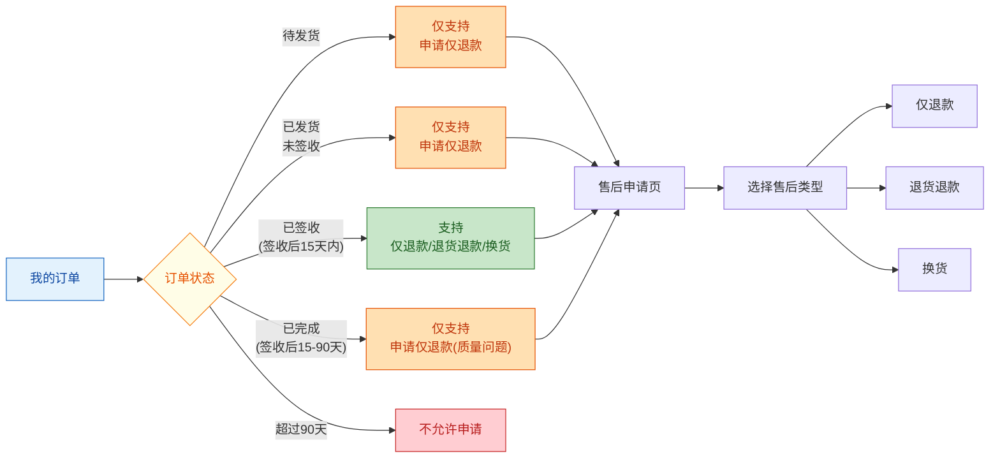

**规则要点**：
- **未发货/已发货未签收**：商家还没真正"出库"或还在路上，**仅支持仅退款**（让商家拦截发货）。
- **已签收 15 天内**：黄金期，几乎所有售后类型都支持。
- **已签收 15~90 天**：仅支持"质量问题仅退款"——这期间退实物快递成本太高，平台一般不鼓励退货退款。
- **超过 90 天**：不允许申请。

### 12.1.2 售后类型

| 售后类型 | 含义 | 是否需要退货 | 是否退款 | 典型场景 |
|---------|------|------------|---------|---------|
| **仅退款** | 钱退，货不退 | 否 | 是 | 质量问题、丢件、运费争议、商品不值运费 |
| **退货退款** | 钱退，货也要退回来 | 是 | 是 | 不喜欢、尺码错、商品与描述不符（7 天无理由） |
| **换货** | 货换货，不涉及钱 | 是 | 否 | 尺码错换尺码、颜色错换颜色、商品瑕疵换同款 |
| **补发** | 漏发补发 | 否 | 否 | 套装少一件、赠品漏发 |

**注意**：补发在严格意义上不算"售后"（因为没有"逆向资金"），一般归到订单系统的"补单"流程里。本章重点讲前三种。

### 12.1.3 售后原因与凭证

售后原因和凭证是审核的关键依据，平台一般预置一套标准原因：

| 一级原因 | 二级原因 | 适用类型 | 凭证要求 |
|---------|---------|---------|---------|
| **质量问题** | 做工瑕疵/破损/缺件/性能故障 | 仅退款/退货退款/换货 | 必须上传图片或视频 |
| **商品错发** | 颜色/尺码/型号错发 | 退货退款/换货 | 必须上传对比图 |
| **物流问题** | 丢件/破损/长时间未到 | 仅退款/补发 | 必须上传运单号、外包装图 |
| **与描述不符** | 详情页承诺未兑现 | 仅退款/退货退款 | 必须上传对比图 |
| **7 天无理由** | 不喜欢/多买/不想要 | 退货退款 | 无需凭证 |
| **卖家原因** | 商家主动联系 | 任意 | 无需凭证 |
| **其他** | 自由描述 | 任意 | 视情况 |

**小美的例子**：她在申请页选了「质量问题 → 做工瑕疵」，上传了 3 张图（左袖口开线近景、整件 T 恤、包装内的吊牌）、1 段 5 秒视频，并填写文字描述"刚收到货试穿就发现开线，明显质量问题，要求仅退款"。

---

## 12.2 售后领域模型

### 12.2.1 实体关系

售后涉及 4 个核心实体：

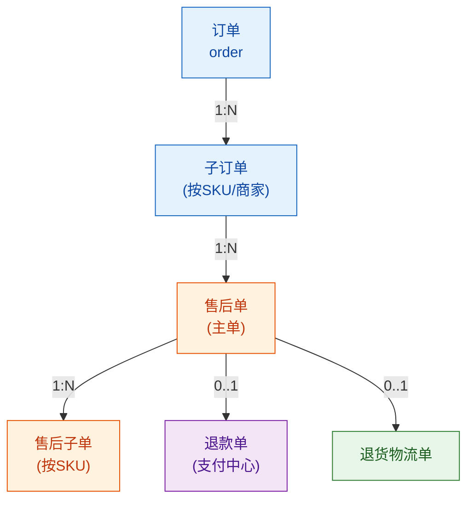

**核心关系**：
- 一笔订单（Order）有 N 个子订单（SubOrder），按"商家"或"仓库"拆分
- 一个子订单可以发起 1~N 个售后单（Aftersale），**按 SKU 维度**
- 一个售后单可以退多个 SKU（aftersale_item），每个 SKU 一行
- 售后单有 0~1 个退款单（Refund），由售后单触发支付中心创建
- 退货退款/换货有 0~1 个退货物流单

### 12.2.2 售后主单 SQL

```sql
-- 售后主单表 aftersale_order
CREATE TABLE `aftersale_order` (
    `aftersale_id`        BIGINT        NOT NULL                COMMENT '售后单号(全局唯一)',
    `order_id`            BIGINT        NOT NULL                COMMENT '原订单号',
    `sub_order_id`        BIGINT        NOT NULL                COMMENT '子订单号(按SKU/商家)',
    `user_id`             BIGINT        NOT NULL                COMMENT '用户ID(小美)',
    `merchant_id`         BIGINT        NOT NULL                COMMENT '商家ID(老王)',
    `type`                VARCHAR(16)   NOT NULL                COMMENT '售后类型:REFUND_ONLY/RETURN_REFUND/EXCHANGE',
    `reason_level1`       VARCHAR(32)   NOT NULL                COMMENT '一级原因:质量问题/物流问题/7天无理由...',
    `reason_level2`       VARCHAR(64)   DEFAULT NULL            COMMENT '二级原因',
    `description`         VARCHAR(512)  DEFAULT NULL            COMMENT '用户文字描述',
    `evidence_imgs`       TEXT          DEFAULT NULL            COMMENT '凭证图片URL,JSON数组',
    `evidence_videos`     TEXT          DEFAULT NULL            COMMENT '凭证视频URL,JSON数组',
    `refund_amount`       BIGINT        NOT NULL                COMMENT '申请退款金额(分)',
    `actual_refund`       BIGINT        DEFAULT NULL            COMMENT '实际退款金额(分)',
    `status`              VARCHAR(16)   NOT NULL                COMMENT '售后单状态',
    `apply_time`          DATETIME      NOT NULL                COMMENT '申请时间',
    `merchant_agree_time` DATETIME      DEFAULT NULL            COMMENT '商家同意时间',
    `merchant_reject_time` DATETIME      DEFAULT NULL            COMMENT '商家拒绝时间',
    `merchant_reject_reason` VARCHAR(256) DEFAULT NULL           COMMENT '商家拒绝原因',
    `return_logi_id`      BIGINT        DEFAULT NULL            COMMENT '退货物流单ID',
    `return_time`         DATETIME      DEFAULT NULL            COMMENT '用户寄出退货时间',
    `received_time`       DATETIME      DEFAULT NULL            COMMENT '商家确认收货时间',
    `refund_id`           BIGINT        DEFAULT NULL            COMMENT '关联的退款单号(支付中心)',
    `refund_time`         DATETIME      DEFAULT NULL            COMMENT '退款完成时间',
    `close_time`          DATETIME      DEFAULT NULL            COMMENT '关闭时间',
    `close_reason`        VARCHAR(64)   DEFAULT NULL            COMMENT '关闭原因',
    `platform_intervene`  TINYINT(1)    NOT NULL DEFAULT 0      COMMENT '是否平台介入:0否/1是',
    `customer_service_id` BIGINT        DEFAULT NULL            COMMENT '客服ID(介入时填)',
    `risk_tag`            VARCHAR(64)   DEFAULT NULL            COMMENT '风控标签(恶意退款嫌疑等)',
    `created_at`          DATETIME      NOT NULL DEFAULT CURRENT_TIMESTAMP,
    `updated_at`          DATETIME      NOT NULL DEFAULT CURRENT_TIMESTAMP ON UPDATE CURRENT_TIMESTAMP,
    PRIMARY KEY (`aftersale_id`),
    KEY `idx_order` (`order_id`),
    KEY `idx_user_status` (`user_id`, `status`),
    KEY `idx_merchant_status` (`merchant_id`, `status`, `created_at`),
    KEY `idx_apply_time` (`apply_time`)
) ENGINE=InnoDB DEFAULT CHARSET=utf8mb4 COMMENT='极购售后主单表';
```

**关键设计**：
- `aftersale_id`：全局唯一 ID，雪花算法生成（第 19 章会讲）
- `type`：枚举 `REFUND_ONLY/RETURN_REFUND/EXCHANGE`
- `status`：9 个状态（下节详述）
- `refund_amount` vs `actual_refund`：申请金额与实际退款可能不同（如商家协商打折退款）
- `platform_intervene`：平台介入标记，涉及仲裁

### 12.2.3 售后子单 SQL

```sql
-- 售后子单表 aftersale_item
CREATE TABLE `aftersale_item` (
    `item_id`          BIGINT        NOT NULL                COMMENT '子单ID',
    `aftersale_id`     BIGINT        NOT NULL                COMMENT '售后单号',
    `sku_id`           BIGINT        NOT NULL                COMMENT 'SKU ID',
    `spu_id`           BIGINT        NOT NULL                COMMENT 'SPU ID',
    `product_name`     VARCHAR(256)  NOT NULL                COMMENT '商品名(冗余存储)',
    `sku_attrs`        VARCHAR(256)  DEFAULT NULL            COMMENT 'SKU属性,JSON:颜色/尺码',
    `quantity`         INT           NOT NULL                COMMENT '售后数量',
    `unit_price`       BIGINT        NOT NULL                COMMENT '商品单价(分)',
    `apply_refund`     BIGINT        NOT NULL                COMMENT '该SKU申请退款(分)',
    `actual_refund`    BIGINT        DEFAULT NULL            COMMENT '该SKU实际退款(分)',
    PRIMARY KEY (`item_id`),
    KEY `idx_aftersale` (`aftersale_id`),
    KEY `idx_sku` (`sku_id`)
) ENGINE=InnoDB DEFAULT CHARSET=utf8mb4 COMMENT='极购售后子单表(按SKU)';
```

**一个售后单可以包含多个 SKU**——比如用户申请"T 恤 + 裤子"两件一起退。子单按 SKU 拆分，方便部分退款的金额计算。

### 12.2.4 退款单 SQL（与支付中心对接）

```sql
-- 退款单表 pay_refund(支付中心)
CREATE TABLE `pay_refund` (
    `refund_id`          BIGINT        NOT NULL                COMMENT '退款单号',
    `pay_id`             BIGINT        NOT NULL                COMMENT '原支付单号',
    `order_id`           BIGINT        NOT NULL                COMMENT '订单号',
    `aftersale_id`       BIGINT        NOT NULL                COMMENT '来源售后单号',
    `user_id`            BIGINT        NOT NULL                COMMENT '用户ID',
    `merchant_id`        BIGINT        NOT NULL                COMMENT '商家ID',
    `channel_code`       VARCHAR(32)   NOT NULL                COMMENT '退款渠道:ALIPAY/WECHAT/BALANCE',
    `amount`             BIGINT        NOT NULL                COMMENT '退款金额(分)',
    `coupon_refund`      BIGINT        NOT NULL DEFAULT 0      COMMENT '券退还金额(分)',
    `point_refund`       INT           NOT NULL DEFAULT 0      COMMENT '积分退还数',
    `status`             VARCHAR(16)   NOT NULL                COMMENT '退款单状态',
    `channel_refund_no`  VARCHAR(64)   DEFAULT NULL            COMMENT '第三方退款流水号',
    `refund_reason`      VARCHAR(256)  DEFAULT NULL            COMMENT '退款原因',
    `apply_time`         DATETIME      NOT NULL                COMMENT '申请时间',
    `submit_time`        DATETIME      DEFAULT NULL            COMMENT '提交第三方时间',
    `success_time`       DATETIME      DEFAULT NULL            COMMENT '退款成功时间',
    `fail_time`          DATETIME      DEFAULT NULL            COMMENT '退款失败时间',
    `fail_reason`        VARCHAR(256)  DEFAULT NULL            COMMENT '失败原因',
    `notify_count`       INT           NOT NULL DEFAULT 0      COMMENT '回调次数',
    `created_at`         DATETIME      NOT NULL DEFAULT CURRENT_TIMESTAMP,
    `updated_at`         DATETIME      NOT NULL DEFAULT CURRENT_TIMESTAMP ON UPDATE CURRENT_TIMESTAMP,
    PRIMARY KEY (`refund_id`),
    UNIQUE KEY `uk_aftersale` (`aftersale_id`)                 COMMENT '一单一退',
    KEY `idx_pay_id` (`pay_id`),
    KEY `idx_user_status` (`user_id`, `status`),
    KEY `idx_apply_time` (`apply_time`)
) ENGINE=InnoDB DEFAULT CHARSET=utf8mb4 COMMENT='极购退款单表';
```

**与第 10 章支付系统的关系**：退款单是支付中心的子表，由售后系统触发创建。状态机由支付中心管理，售后系统只关心"退款成功"事件。

---

## 12.3 售后状态机（核心）

### 12.3.1 9 个状态

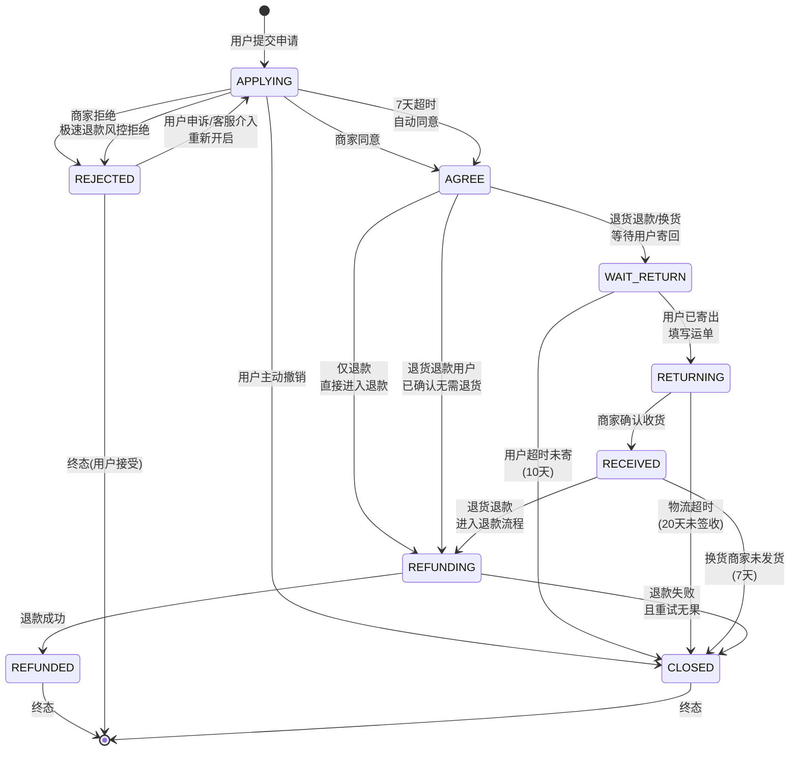

**状态枚举**：

| 状态 | 含义 | 是否终态 |
|------|------|---------|
| **APPLYING** | 申请中，待商家审核 | 否 |
| **AGREE** | 商家已同意 | 否 |
| **REJECTED** | 商家已拒绝 | 条件终态（可申诉） |
| **WAIT_RETURN** | 等待用户寄回 | 否 |
| **RETURNING** | 用户已寄出，物流中 | 否 |
| **RECEIVED** | 商家已确认收货 | 否 |
| **REFUNDING** | 退款中 | 否 |
| **REFUNDED** | 退款成功 | 是 |
| **CLOSED** | 已关闭（撤销/超时） | 是 |

### 12.3.2 状态转移规则

状态机的合法转移必须由代码严格校验，防止任意跳转：

```java
/**
 * 售后单状态机
 * 极购售后系统核心:任何状态变更必须先校验合法转移
 */
public enum AftersaleStatus {

    APPLYING, AGREE, REJECTED, WAIT_RETURN,
    RETURNING, RECEIVED, REFUNDING, REFUNDED, CLOSED;

    private static final Map<AftersaleStatus, Set<AftersaleStatus>> TRANSITIONS = new HashMap<>();

    static {
        TRANSITIONS.put(APPLYING,    Set.of(AGREE, REJECTED, CLOSED, REFUNDING));
        TRANSITIONS.put(AGREE,       Set.of(WAIT_RETURN, REFUNDING, CLOSED));
        TRANSITIONS.put(REJECTED,    Set.of(APPLYING, CLOSED));
        TRANSITIONS.put(WAIT_RETURN, Set.of(RETURNING, CLOSED));
        TRANSITIONS.put(RETURNING,   Set.of(RECEIVED, CLOSED));
        TRANSITIONS.put(RECEIVED,    Set.of(REFUNDING, CLOSED));
        TRANSITIONS.put(REFUNDING,   Set.of(REFUNDED, CLOSED));
        TRANSITIONS.put(REFUNDED,    Set.of());
        TRANSITIONS.put(CLOSED,      Set.of());
    }

    public boolean canTransitTo(AftersaleStatus target) {
        return TRANSITIONS.getOrDefault(this, Set.of()).contains(target);
    }
}
```

**CAS 状态更新**：所有状态变更都用 `compareAndSetStatus(aftersaleId, oldStatus, newStatus)`，防止并发更新。

### 12.3.3 三种售后类型的差异

售后类型决定了状态机的具体走向：

| 售后类型 | 状态轨迹 | 是否经过 WAIT_RETURN/RETURNING/RECEIVED |
|---------|---------|-----------------------------------|
| **仅退款（不退货）** | APPLYING → AGREE → REFUNDING → REFUNDED | **不经过** |
| **仅退款（质量问题）** | APPLYING → REFUNDING → REFUNDED（极速） | **不经过**（极速跳过商家） |
| **退货退款** | APPLYING → AGREE → WAIT_RETURN → RETURNING → RECEIVED → REFUNDING → REFUNDED | **经过** |
| **换货** | APPLYING → AGREE → WAIT_RETURN → RETURNING → RECEIVED → CLOSED（商家重新发货） | **经过**（不退款） |

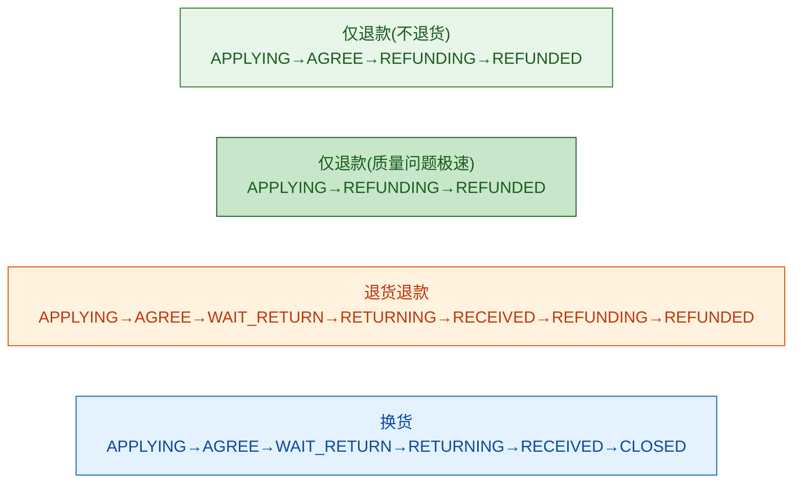

---

## 12.4 仅退款（不退货）

### 12.4.1 业务流程

仅退款是售后中最高频、链路最短的类型——**钱退、货不收回**。它常见于：
- 质量问题（小美的场景）
- 物流丢件、破损
- 运费争议
- 商品价值低于退货成本（如 9.9 元包邮的 T 恤，退货运费 8 元）

仅退款有三种走向：

```mermaid
flowchart TD
    Start["用户提交仅退款申请"]:::start --> Check{"金额 < 50元<br/>且为质量问题?"}:::decision
    Check -->|"是"| Fast["极速退款通道<br/>0等待"]:::fastest
    Check -->|"否"| Normal["普通通道<br/>商家审核"]:::normal

    Fast --> Refund["直接调支付中心<br/>创建退款单"]
    Normal --> Risk{"商家<br/>7天内响应?"}:::decision

    Risk -->|"同意"| Refund
    Risk -->|"拒绝"| Reject["状态:REJECTED"]
    Risk -->|"超时未响应"| Auto["系统自动同意<br/>(视为商家放弃)"]:::auto

    Reject --> UserChoice{"用户<br/>是否申诉?"}:::decision
    UserChoice -->|"是"| CS["客服介入<br/>状态回到APPLYING"]
    UserChoice -->|"否(接受)"| End["结束"]

    Refund --> Success["退款到账<br/>状态:REFUNDED"]:::end

    classDef start fill:#E3F2FD,stroke:#1565C0,color:#0D47A1
    classDef decision fill:#FFFDE7,stroke:#F57F17,color:#E65100
    classDef fastest fill:#C8E6C9,stroke:#1B5E20,color:#1B5E20
    classDef normal fill:#FFE0B2,stroke:#E65100,color:#BF360C
    classDef auto fill:#E8F5E9,stroke:#2E7D32,color:#1B5E20
    classDef end fill:#C8E6C9,stroke:#1B5E20,color:#1B5E20
```

### 12.4.2 极速退款机制

**极速退款（Instant Refund）**是平台为高信用用户提供的"0 等待"服务——用户提交后**不需要商家同意**，平台基于用户信用和售后历史先垫付退款。

**资格条件**（示例）：

| 维度 | 阈值 |
|------|------|
| 用户信用分 | ≥ 800 |
| 过去 90 天退款次数 | ≤ 3 次 |
| 过去 90 天退款率 | ≤ 10% |
| 单笔金额 | ≤ 200 元（部分平台 500 元） |
| 品类 | 非高风险品类（虚拟商品、3C 等） |
| 商家支持 | 商家开通了"极速退款"协议 |

**小美的场景**：她信用分 850，过去 90 天仅 1 次退款，符合极速退款。但因为金额是 99 元、且 T 恤属于"服饰"品类，老王没开通极速退款协议，所以走普通通道。

### 12.4.3 自动审核规则

系统内置的自动审核规则（命中后直接同意）：

| 规则 | 条件 | 动作 |
|------|------|------|
| 质量问题小额 | 金额<50 + 原因="质量问题" + 有凭证 | 直接同意 |
| 物流问题丢件 | 物流轨迹显示"已签收"但买家反映未收到 | 直接同意 |
| 商家承诺 | 商家在商品详情页承诺"7天无理由退" | 直接同意 |
| 二次申请 | 同一订单相同 SKU 第二次申请 | 直接同意 |

**老王那 50 笔售后**：38 笔仅退款里 31 笔是"质量问题 + 金额<50"自动通过；3 笔是极速退款；剩下 4 笔是 200 元以上需要商家审核。

### 12.4.4 售后单创建（含校验）

```java
/**
 * 售后单创建服务
 * 对应:小美在订单详情页提交"仅退款"申请
 */
@Service
public class AftersaleCreateService {

    @Autowired private OrderServiceClient orderClient;
    @Autowired private AftersaleDao aftersaleDao;
    @Autowired private AftersaleItemDao itemDao;
    @Autowired private RiskService riskService;
    @Autowired private UserCreditService creditService;
    @Autowired private InventoryServiceClient inventoryClient;

    /**
     * 创建售后单(含 8 大校验)
     */
    @Transactional(rollbackFor = Exception.class)
    public AftersaleResult createAftersale(AftersaleCreateRequest req) {

        // ─── 校验 1: 订单归属 ────────────────────────────────────────────
        OrderDTO order = orderClient.getOrder(req.getOrderId());
        if (!order.getUserId().equals(req.getUserId())) {
            throw new BizException("订单与用户不匹配");
        }

        // ─── 校验 2: 订单状态(已签收/已发货未签收)───────────────────────
        OrderStatus status = order.getStatus();
        if (status != OrderStatus.SIGNED && status != OrderStatus.SHIPPED
            && status != OrderStatus.FINISHED) {
            throw new BizException("当前订单状态不支持售后");
        }

        // ─── 校验 3: 售后时间窗口 ────────────────────────────────────────
        LocalDateTime signTime = order.getSignTime();
        LocalDateTime now = LocalDateTime.now();
        long daysAfterSign = ChronoUnit.DAYS.between(signTime, now);

        if (req.getType() == AftersaleType.REFUND_ONLY && status == OrderStatus.FINISHED) {
            if (daysAfterSign > 90) {
                throw new BizException("签收超过 90 天,仅退款不再支持");
            }
            if (daysAfterSign > 15 && !req.getReasonLevel1().equals("质量问题")) {
                throw new BizException("签收超过 15 天,仅质量问题支持仅退款");
            }
        }
        if (req.getType() == AftersaleType.RETURN_REFUND && daysAfterSign > 15) {
            throw new BizException("签收超过 15 天,不支持退货退款");
        }

        // ─── 校验 4: 金额上限(申请退款金额不能超过实际支付)─────────────
        BigDecimal maxRefund = order.getPayAmount()
            .subtract(order.getFreight());  // 商品款项 + 运费
        if (req.getRefundAmount().compareTo(maxRefund) > 0) {
            throw new BizException("申请退款金额超过最大可退金额");
        }

        // ─── 校验 5: SKU 校验(申请数量<=已购数量-已退数量)────────────────
        for (AftersaleItemReq itemReq : req.getItems()) {
            OrderItem orderItem = orderClient.getOrderItem(itemReq.getSkuId());
            int alreadyApplied = aftersaleDao.sumAppliedQuantity(
                req.getOrderId(), itemReq.getSkuId()
            );
            if (orderItem.getQuantity() - alreadyApplied < itemReq.getQuantity()) {
                throw new BizException("SKU " + itemReq.getSkuId() + " 申请数量超限");
            }
        }

        // ─── 校验 6: 重复申请(同一订单同一SKU只能有一笔进行中的售后)────
        List<AftersaleOrder> ongoing = aftersaleDao.findOngoing(
            req.getOrderId(), AftersaleStatus.inProgress()
        );
        for (AftersaleOrder af : ongoing) {
            if (af.getItems().stream().anyMatch(i ->
                i.getSkuId().equals(req.getItems().get(0).getSkuId()))) {
                throw new BizException("该 SKU 已有进行中的售后");
            }
        }

        // ─── 校验 7: 凭证校验(质量问题必须上传图)────────────────────────
        if (req.getReasonLevel1().equals("质量问题")) {
            if (CollectionUtils.isEmpty(req.getEvidenceImgs())
                && CollectionUtils.isEmpty(req.getEvidenceVideos())) {
                throw new BizException("质量问题请上传凭证");
            }
        }

        // ─── 校验 8: 风控校验(频次、金额、品类)─────────────────────────
        RiskDecision risk = riskService.preAftersaleCheck(
            req.getUserId(), order, req.getRefundAmount()
        );
        if (risk.isHardReject()) {
            throw new BizException("售后申请被风控拦截:" + risk.getReason());
        }

        // ─── 创建售后主单 ──────────────────────────────────────────────────
        AftersaleOrder aftersale = new AftersaleOrder();
        aftersale.setAftersaleId(generateAftersaleId());
        aftersale.setOrderId(req.getOrderId());
        aftersale.setSubOrderId(req.getSubOrderId());
        aftersale.setUserId(req.getUserId());
        aftersale.setMerchantId(order.getMerchantId());
        aftersale.setType(req.getType());
        aftersale.setReasonLevel1(req.getReasonLevel1());
        aftersale.setReasonLevel2(req.getReasonLevel2());
        aftersale.setDescription(req.getDescription());
        aftersale.setEvidenceImgs(JsonUtil.toJson(req.getEvidenceImgs()));
        aftersale.setEvidenceVideos(JsonUtil.toJson(req.getEvidenceVideos()));
        aftersale.setRefundAmount(req.getRefundAmount());
        aftersale.setStatus(AftersaleStatus.APPLYING);
        aftersale.setApplyTime(LocalDateTime.now());
        aftersale.setRiskTag(risk.getTag());
        aftersaleDao.insert(aftersale);

        // ─── 创建售后子单 ──────────────────────────────────────────────────
        for (AftersaleItemReq itemReq : req.getItems()) {
            AftersaleItem item = new AftersaleItem();
            item.setItemId(generateItemId());
            item.setAftersaleId(aftersale.getAftersaleId());
            item.setSkuId(itemReq.getSkuId());
            item.setSpuId(itemReq.getSpuId());
            item.setProductName(itemReq.getProductName());
            item.setSkuAttrs(itemReq.getSkuAttrs());
            item.setQuantity(itemReq.getQuantity());
            item.setUnitPrice(itemReq.getUnitPrice());
            item.setApplyRefund(itemReq.getApplyRefund());
            itemDao.insert(item);
        }

        // ─── 触发后续:自动审核/极速退款判定 ──────────────────────────────
        asyncHandleAftersale(aftersale, order, risk);

        return AftersaleResult.success(aftersale.getAftersaleId());
    }

    /**
     * 异步处理:极速退款/自动审核/进入商家审核队列
     */
    private void asyncHandleAftersale(AftersaleOrder aftersale, OrderDTO order, RiskDecision risk) {

        // 规则 1: 极速退款判定
        if (isInstantRefundEligible(aftersale, order, risk)) {
            log.info("命中极速退款 aftersaleId={}", aftersale.getAftersaleId());
            agreeAftersale(aftersale.getAftersaleId(), "SYSTEM_INSTANT");
            return;
        }

        // 规则 2: 自动审核通过(质量问题小额)
        if (isAutoApproveEligible(aftersale, order)) {
            log.info("命中自动审核 aftersaleId={}", aftersale.getAftersaleId());
            agreeAftersale(aftersale.getAftersaleId(), "SYSTEM_AUTO");
            return;
        }

        // 规则 3: 进入商家待审核队列(发 MQ 通知商家)
        mqProducer.send("aftersale.merchant.pending",
            new AftersalePendingEvent(aftersale.getAftersaleId(),
                                      aftersale.getMerchantId()));
        log.info("进入商家待审核 aftersaleId={}", aftersale.getAftersaleId());
    }

    private boolean isInstantRefundEligible(AftersaleOrder af, OrderDTO order, RiskDecision risk) {
        if (af.getType() != AftersaleType.REFUND_ONLY) return false;
        if (af.getRefundAmount() > 20000) return false;  // 200 元
        if (!order.getMerchant().isInstantRefundEnabled()) return false;

        UserCredit credit = creditService.getCredit(af.getUserId());
        return credit.getScore() >= 800
            && credit.getRefundCount90d() <= 3
            && risk.getScore() < 30;
    }

    private boolean isAutoApproveEligible(AftersaleOrder af, OrderDTO order) {
        if (af.getType() != AftersaleType.REFUND_ONLY) return false;
        if (af.getRefundAmount() > 5000) return false;  // 50 元
        if (!af.getReasonLevel1().equals("质量问题")) return false;
        return af.getEvidenceImgs() != null || af.getEvidenceVideos() != null;
    }
}
```

---

## 12.5 退货退款

### 12.5.1 业务流程

退货退款是售后中**链路最长**的类型——除了退款，还要处理退货物流。

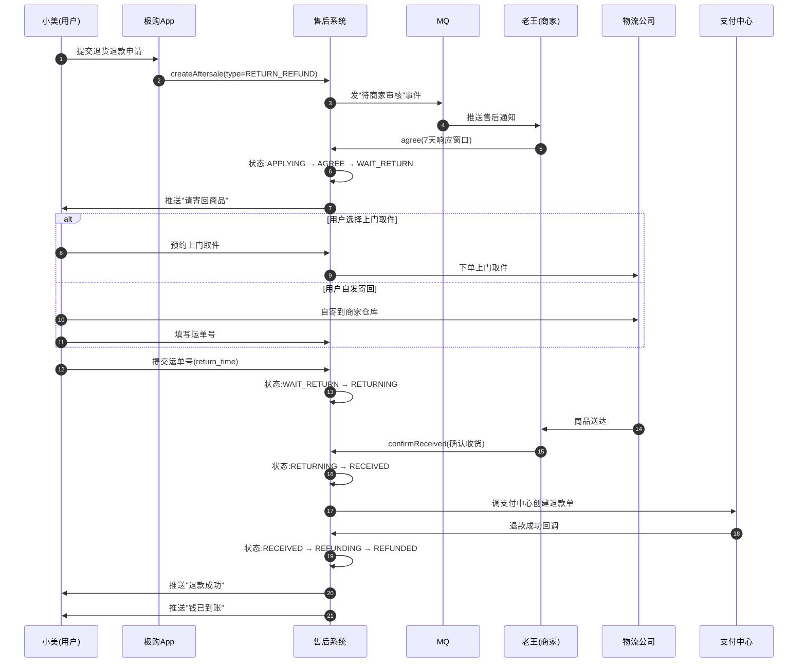

### 12.5.2 商家同意 / 拒绝

```java
/**
 * 商家处理售后
 * 对应:老王在商家后台点击"同意"或"拒绝"
 */
@Service
public class MerchantHandleService {

    @Autowired private AftersaleDao aftersaleDao;
    @Autowired private MqProducer mqProducer;
    @Autowired private PayRefundService payRefundService;
    @Autowired private InventoryServiceClient inventoryClient;

    /**
     * 商家同意售后(关键操作)
     */
    public void agree(String aftersaleId, Long merchantId, String reason) {
        AftersaleOrder af = aftersaleDao.findById(aftersaleId);
        if (af == null || !af.getMerchantId().equals(merchantId)) {
            throw new BizException("售后单不存在或无权操作");
        }

        // 状态机 CAS:APPLYING → AGREE
        boolean ok = aftersaleDao.compareAndSetStatus(
            aftersaleId, AftersaleStatus.APPLYING, AftersaleStatus.AGREE
        );
        if (!ok) {
            throw new BizException("状态非法,可能已被处理");
        }

        aftersaleDao.updateMerchantAgreeTime(aftersaleId, LocalDateTime.now(), reason);

        // 决定后续流程:仅退款 → 直接退款;退货退款/换货 → 等待寄回
        if (af.getType() == AftersaleType.REFUND_ONLY) {
            // 仅退款 → 立即触发退款
            triggerRefund(aftersaleId);
        } else {
            // 退货退款 / 换货 → 状态置为 WAIT_RETURN,启动 10 天超时定时器
            aftersaleDao.compareAndSetStatus(
                aftersaleId, AftersaleStatus.AGREE, AftersaleStatus.WAIT_RETURN
            );
            // 启动超时任务(10天未寄出则自动关闭)
            scheduleJob("aftersale.return.timeout",
                aftersaleId, Duration.ofDays(10));
        }

        // 通知用户
        mqProducer.send("aftersale.agreed.notify",
            new AftersaleAgreedEvent(af.getUserId(), aftersaleId, af.getType()));
    }

    /**
     * 商家拒绝售后
     */
    public void reject(String aftersaleId, Long merchantId, String reason) {
        AftersaleOrder af = aftersaleDao.findById(aftersaleId);
        if (af == null || !af.getMerchantId().equals(merchantId)) {
            throw new BizException("售后单不存在或无权操作");
        }

        // 状态机 CAS:APPLYING → REJECTED
        boolean ok = aftersaleDao.compareAndSetStatus(
            aftersaleId, AftersaleStatus.APPLYING, AftersaleStatus.REJECTED
        );
        if (!ok) throw new BizException("状态非法");

        aftersaleDao.updateMerchantReject(aftersaleId, LocalDateTime.now(), reason);

        // 通知用户(用户可申诉)
        mqProducer.send("aftersale.rejected.notify",
            new AftersaleRejectedEvent(af.getUserId(), aftersaleId, reason));
    }

    /**
     * 商家确认收到退货 → 触发退款
     */
    public void confirmReceived(String aftersaleId, Long merchantId) {
        AftersaleOrder af = aftersaleDao.findById(aftersaleId);
        if (!af.getMerchantId().equals(merchantId)) {
            throw new BizException("无权操作");
        }

        boolean ok = aftersaleDao.compareAndSetStatus(
            aftersaleId, AftersaleStatus.RETURNING, AftersaleStatus.RECEIVED
        );
        if (!ok) throw new BizException("状态非法");

        aftersaleDao.updateReceivedTime(aftersaleId, LocalDateTime.now());

        // ─── 关键:库存回流(退货退款场景)───────────────────────────
        restoreInventory(af);

        // 触发退款
        triggerRefund(aftersaleId);
    }

    /**
     * 库存回流(对应:第 7 章库存系统)
     */
    private void restoreInventory(AftersaleOrder af) {
        for (AftersaleItem item : af.getItems()) {
            InventoryRestoreRequest req = new InventoryRestoreRequest();
            req.setSkuId(item.getSkuId());
            req.setWarehouseId(af.getWarehouseId());
            req.setQuantity(item.getQuantity());
            req.setSourceType(InventorySourceType.AFTERSALE_RETURN);
            req.setBizId(af.getAftersaleId());
            req.setOperator(af.getMerchantId());

            try {
                inventoryClient.restoreStock(req);
                log.info("售后回流库存成功 aftersaleId={}, skuId={}, qty={}",
                    af.getAftersaleId(), item.getSkuId(), item.getQuantity());
            } catch (Exception e) {
                log.error("回流库存失败,需人工处理 aftersaleId={}", af.getAftersaleId(), e);
                // 不阻塞退款,库存失败由人工兜底(严重情况会报警)
                alarmService.sendAlarm("售后回流库存失败:" + af.getAftersaleId());
            }
        }
    }
}
```

### 12.5.3 退货物流模式

| 模式 | 含义 | 优势 | 劣势 |
|------|------|------|------|
| **极购上门取件** | 用户预约,极购合作的物流公司上门 | 便利,平台管控 | 平台需支付物流费 |
| **用户自发寄回** | 用户自己联系快递寄到商家 | 灵活,平台零成本 | 物流时效不可控,丢件风险 |

极购对两种模式做了不同处理：
- **上门取件**：用户在售后详情页选预约时间，系统自动派单给顺丰/京东，运费由商家或平台承担（质量问题商家承担，7 天无理由用户承担）
- **自发寄回**：用户填写运单号后状态变为 RETURNING

---

## 12.6 换货

换货的流程与退货退款高度类似，**唯一区别是不涉及退款**。状态轨迹是：

```
APPLYING → AGREE → WAIT_RETURN → RETURNING → RECEIVED → CLOSED
                                                    ↓
                                              (商家重新发货,走正常发货流程)
```

**特殊点**：
- `actual_refund` 为 0
- 商家收到货后不是发起退款，而是**创建新的发货单**（走订单系统的发货流程）
- 状态最终置为 CLOSED，而不是 REFUNDED

```java
/**
 * 换货场景的商家确认收货
 * 区别于退货退款:不退款,改为创建新发货单
 */
public void confirmReceivedForExchange(String aftersaleId, Long merchantId, String newLogiNo) {
    AftersaleOrder af = aftersaleDao.findById(aftersaleId);
    if (af.getType() != AftersaleType.EXCHANGE) {
        throw new BizException("非换货单");
    }

    boolean ok = aftersaleDao.compareAndSetStatus(
        aftersaleId, AftersaleStatus.RETURNING, AftersaleStatus.RECEIVED
    );
    if (!ok) throw new BizException("状态非法");

    // 回流库存(换货的退回商品仍可二次销售)
    restoreInventory(af);

    // 商家发货(走正常发货流程)
    OrderDTO originalOrder = orderClient.getOrder(af.getOrderId());
    deliveryService.createDeliveryForExchange(
        originalOrder, af.getItems(), newLogiNo
    );

    // 状态置为 CLOSED
    aftersaleDao.compareAndSetStatus(
        aftersaleId, AftersaleStatus.RECEIVED, AftersaleStatus.CLOSED
    );
}
```

---

## 12.7 资金流（核心）

### 12.7.1 退款金额计算

**退款金额 = 商品款项（按 SKU 比例分摊）+ 运费（按比例分摊）− 优惠分摊**

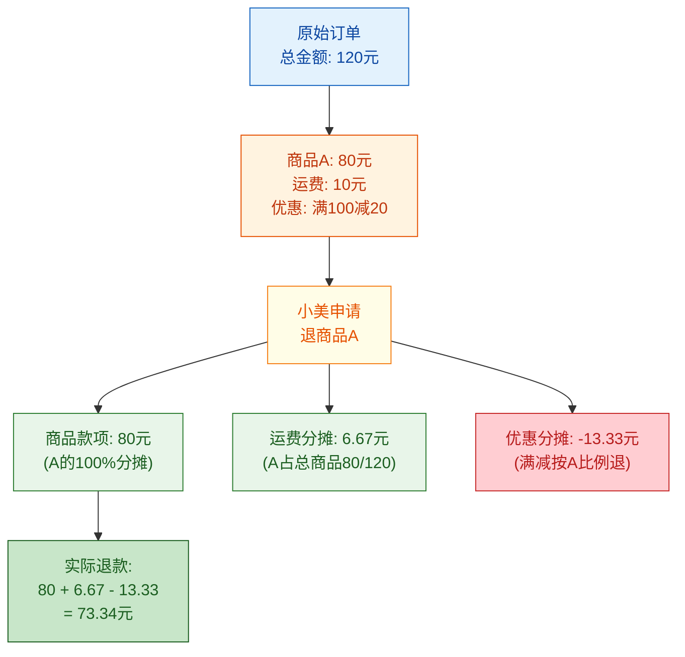

**关键原则**：
- **优惠分摊**：满减/优惠券是按"商品价格占比"分摊的；部分退款时，优惠要按比例退还（**否则用户会吃亏，商家也会亏**）
- **运费**：运费也按商品占比分摊，**仅退该商品的运费份额**
- **不退货时不退运费**：仅退款不退货，按行业惯例**运费不退**（因为没产生逆向物流成本）

### 12.7.2 优惠退回规则

这是最复杂的部分——优惠券、满减、积分、礼品卡都要分别处理：

| 优惠类型 | 部分退款时如何处理 | 全部退款时如何处理 | 实现 |
|---------|------------------|-------------------|------|
| **满减(平台)** | 按比例退还金额 | 全部解冻 | 减免费用按比例退回 |
| **优惠券** | **不退还**（已使用） | **退还**（恢复未使用） | 见下文代码 |
| **积分抵扣** | 按比例退积分 | 全部退积分 | `point_refund` 字段 |
| **礼品卡/余额** | **按比例退**到原账户 | 全部退 | 调余额服务 |
| **平台红包** | 按比例退 | 全部退 | 调红包服务 |
| **跨店满减** | 不退（属平台补贴） | 不退 | — |
| **会员折扣** | 按比例退 | 全部退 | 减免费用按比例退 |

### 12.7.3 优惠券退回逻辑

```java
/**
 * 优惠退返服务
 * 对应:小美退货退款时,优惠券、积分、余额的退还
 */
@Service
public class PromotionRefundService {

    @Autowired private CouponServiceClient couponClient;
    @Autowired private PointServiceClient pointClient;
    @Autowired private UserBalanceService balanceService;
    @Autowired private AftersaleItemDao itemDao;

    /**
     * 退返营销资产(优惠券/积分/余额)
     * 在触发退款前调用
     */
    public void refundPromotions(AftersaleOrder aftersale, OrderDTO order) {
        log.info("开始退返营销资产 aftersaleId={}, orderId={}",
            aftersale.getAftersaleId(), order.getOrderId());

        // ─── 1. 优惠券退返 ───────────────────────────────────────────────
        refundCoupons(aftersale, order);

        // ─── 2. 积分退返 ───────────────────────────────────────────────
        refundPoints(aftersale, order);

        // ─── 3. 余额退返(余额支付部分)────────────────────────────────
        refundBalance(aftersale, order);
    }

    /**
     * 优惠券退返(关键)
     * 规则:
     * 1) 全部退款 → 券恢复"未使用"状态,有效期顺延
     * 2) 部分退款 → 已使用的券不退(避免套利),但平台全额券可退
     */
    private void refundCoupons(AftersaleOrder aftersale, OrderDTO order) {
        if (CollectionUtils.isEmpty(order.getUsedCoupons())) return;

        boolean isFullRefund = isFullRefund(aftersale, order);

        for (OrderCoupon used : order.getUsedCoupons()) {
            if (isFullRefund) {
                // 全部退款:恢复未使用,有效期顺延7天
                couponClient.returnCoupon(used.getUserCouponId(),
                    used.getCouponId(), aftersale.getAftersaleId(),
                    /*extendDays*/ 7);
                log.info("全部退款,退还券 userCouponId={}", used.getUserCouponId());
            } else {
                // 部分退款:商家券不退还,平台券按规则退
                if (used.getCouponType() == CouponType.PLATFORM_FULL_DISCOUNT
                    || used.getCouponType() == CouponType.PLATFORM_SHIPPING) {
                    // 平台券:按商品占比退
                    BigDecimal ratio = computeRefundRatio(aftersale, order);
                    if (ratio.compareTo(BigDecimal.valueOf(0.5)) > 0) {
                        // 退商品款超过 50% 退券
                        couponClient.returnCoupon(used.getUserCouponId(),
                            used.getCouponId(), aftersale.getAftersaleId(), 0);
                    }
                } else {
                    // 商家券:已使用不退还
                    log.info("部分退款,商家券不退还 userCouponId={}", used.getUserCouponId());
                }
            }
        }
    }

    /**
     * 积分退返
     */
    private void refundPoints(AftersaleOrder aftersale, OrderDTO order) {
        if (order.getPointsUsed() == null || order.getPointsUsed() == 0) return;

        BigDecimal ratio = computeRefundRatio(aftersale, order);
        int pointsToRefund = order.getPointsUsed()
            .multiply(ratio).setScale(0, RoundingMode.HALF_UP).intValue();

        if (pointsToRefund > 0) {
            pointClient.refundPoints(
                aftersale.getUserId(),
                pointsToRefund,
                aftersale.getAftersaleId(),
                PointBizType.AFTERSALE_REFUND
            );
            // 记录到售后单的 coupon_refund 字段(积分)
            aftersaleDao.updatePointRefund(aftersale.getAftersaleId(), pointsToRefund);
        }
    }

    /**
     * 余额退返
     */
    private void refundBalance(AftersaleOrder aftersale, OrderDTO order) {
        if (order.getBalanceUsed() == null || order.getBalanceUsed() == 0) return;

        BigDecimal ratio = computeRefundRatio(aftersale, order);
        long balanceToRefund = order.getBalanceUsed()
            .multiply(ratio).setScale(0, RoundingMode.HALF_UP).longValue();

        if (balanceToRefund > 0) {
            balanceService.refund(aftersale.getUserId(), balanceToRefund,
                aftersale.getAftersaleId(), BalanceBizType.AFTERSALE);
        }
    }

    /**
     * 计算退款比例(商品金额占比)
     */
    private BigDecimal computeRefundRatio(AftersaleOrder aftersale, OrderDTO order) {
        long applyRefundGoods = aftersale.getItems().stream()
            .mapToLong(AftersaleItem::getApplyRefund)
            .sum();
        long totalGoods = order.getItems().stream()
            .mapToLong(i -> i.getUnitPrice() * i.getQuantity())
            .sum();
        return BigDecimal.valueOf(applyRefundGoods)
            .divide(BigDecimal.valueOf(totalGoods), 4, RoundingMode.HALF_UP);
    }

    private boolean isFullRefund(AftersaleOrder aftersale, OrderDTO order) {
        return aftersale.getRefundAmount().compareTo(order.getPayAmount()) == 0;
    }
}
```

### 12.7.4 原路退回

**资金原路返回**是退款的铁律：

| 原支付方式 | 退款去向 | 到账时间 |
|----------|---------|---------|
| 支付宝 | 退到支付宝余额 | 实时 |
| 微信支付 | 退到微信零钱 | 实时 |
| 银行卡 | 退到原支付银行卡 | 1~3 个工作日 |
| 极购余额 | 退到极购余额 | 实时 |
| 混合支付(余额+支付宝) | 按原比例退 | — |

**禁止**将支付宝支付的钱退到银行卡或余额（虽然技术上可以做，但这是**资金安全红线**）。在第 10 章支付系统里我们讲过 `pay_refund` 表就是为此设计的。

---

## 12.8 售后与库存

库存是售后中最容易出问题的环节——**仅退款不回流、退货退款要回流**，是铁律。

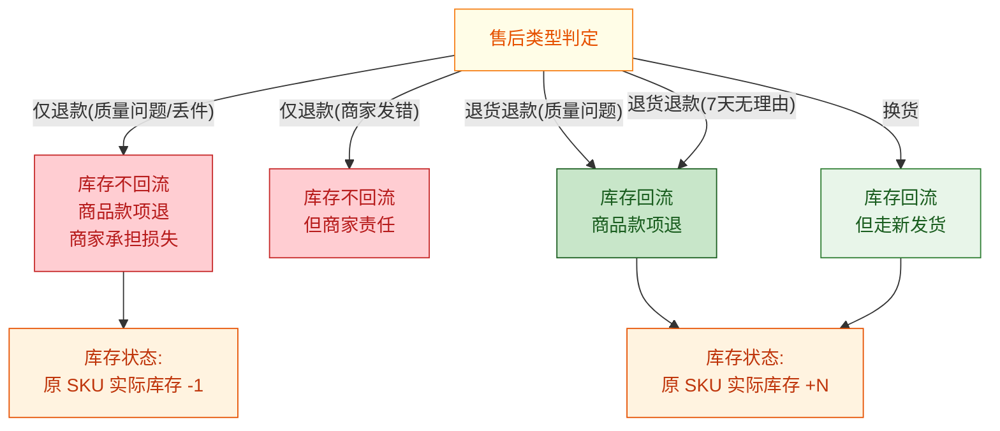

**原则**：

| 场景 | 库存处理 | 商家原因 |
|------|---------|---------|
| **仅退款不退货** | **不回流** | 商家承担这部分损失（质量问题），或买家承担（7 天无理由且不愿退货） |
| **退货退款** | **回流** | 收到退货后增加实际库存 |
| **换货** | **回流 + 新出库** | 收到退货后回流，重新发货再扣减 |

**与第 7 章库存系统对接**：调用 `inventoryClient.restoreStock(skuId, warehouseId, qty, sourceType=AFTERSALE_RETURN)`，由库存系统做最终一致性更新。

---

## 12.9 售后与营销

售后涉及大量"营销资产"的退还或解冻，是售后系统最容易踩坑的环节。

| 资产类型 | 售后处理 | 复杂度 |
|---------|---------|-------|
| **优惠券(未过期)** | 全部退款→恢复未使用,部分退款→已用不退 | 中 |
| **优惠券(已过期)** | 全部退款→不退还 | 低 |
| **满减(平台)** | 按比例退金额 | 低 |
| **满减(店铺)** | 按比例退金额 | 低 |
| **积分** | 按比例退 | 中 |
| **余额** | 按比例退 | 中 |
| **红包** | 按比例退 | 中 |
| **跨店满减** | 平台补贴,不退 | 低 |
| **会员折扣** | 按比例退 | 中 |
| **限时折扣价** | 按比例退 | 低 |
| **预售定金** | 全额退(订单关闭) | 中 |

**关键问题**：

1. **券已使用**：用户用券买了两件商品，退一件时，券不退给用户（用户已享受了优惠）。平台通过"比例分摊"承担一部分费用。
2. **券已过期**：全退时也不退（用户已享受过优惠，平台不追溯）。
3. **解冻满减**：订单状态从"已支付"到"已退款"时，营销系统的满减额度要解冻，**否则用户当月满减额度会虚高**。

---

## 12.10 超时与自动审核

### 12.10.1 超时规则总览

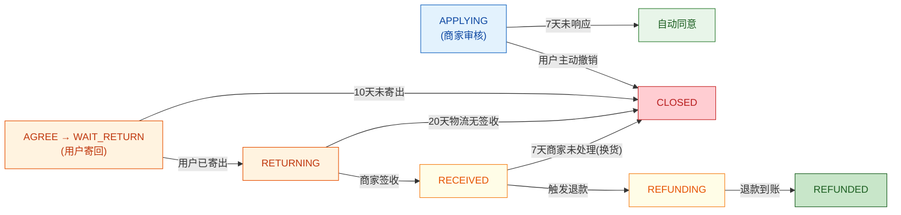

| 阶段 | 超时时间 | 超时动作 |
|------|---------|---------|
| 商家审核 | 7×24 小时 | 自动同意 |
| 用户寄回 | 10×24 小时 | 关闭售后 |
| 物流签收 | 20×24 小时 | 关闭售后(物流异常) |
| 商家收货后处理 | 7×24 小时 | 关闭(换货场景) |

### 12.10.2 自动审核引擎

```java
/**
 * 自动审核引擎
 * 命中规则后自动同意或拒绝
 * 对应:老王那 31 笔自动通过的售后
 */
@Component
public class AutoApproveEngine {

    @Autowired private RuleEngineService ruleEngine;

    /**
     * 判断是否自动同意
     */
    public AutoApproveResult judge(AftersaleOrder af, OrderDTO order) {
        // 规则 1:质量问题小额(<50元 + 有凭证)
        if (isQualityIssueSmallAmount(af)) {
            return AutoApproveResult.approve("质量问题小额,自动通过");
        }

        // 规则 2:物流问题(丢件)
        if (isLogisticsLost(af, order)) {
            return AutoApproveResult.approve("物流丢件,自动通过");
        }

        // 规则 3:商家承诺(7天无理由)
        if (merchantPromised7Days(order)) {
            return AutoApproveResult.approve("商家承诺7天无理由,自动通过");
        }

        // 规则 4:同订单第二次申请(说明第一次商家已同意过)
        if (isSecondApplication(af, order)) {
            return AutoApproveResult.approve("同订单二次申请,自动通过");
        }

        return AutoApproveResult.needManualReview();
    }
}
```

### 12.10.3 退款到账时间

| 渠道 | 退款到账 |
|------|---------|
| 支付宝 | 实时 |
| 微信支付(零钱) | 实时 |
| 微信支付(银行卡) | 1~3 工作日 |
| 银联 | 1~3 工作日 |
| 极购余额 | 实时 |
| 货到付款(现金) | 商家线下退 |

---

## 12.11 客服与仲裁

### 12.11.1 客服介入流程

当用户对商家处理结果不满时，可以申请客服介入：

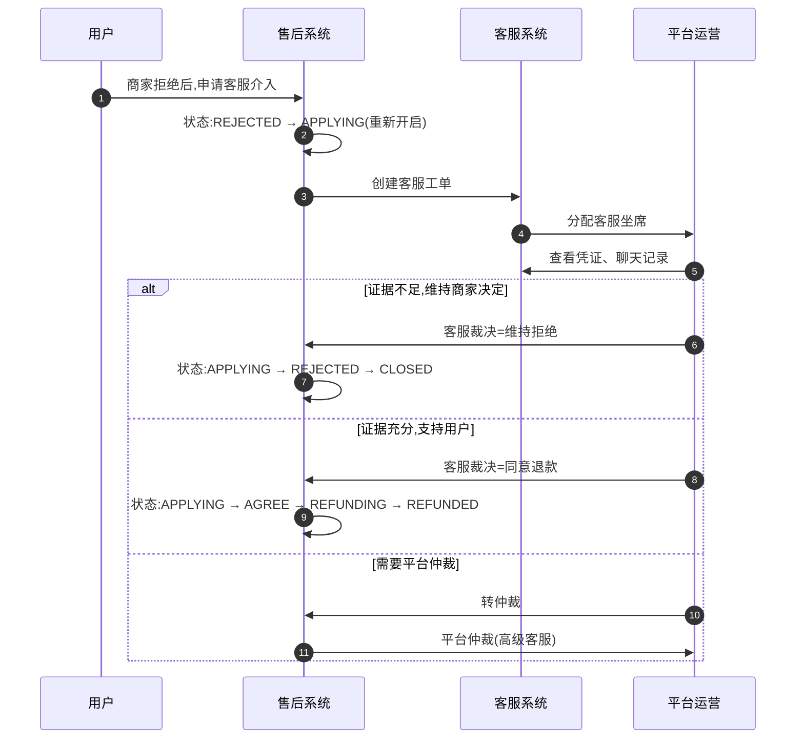

### 12.11.2 仲裁规则

| 场景 | 平台倾向 | 备注 |
|------|---------|------|
| 质量问题 + 有图有视频 | **支持用户** | 商家责任 |
| 物流问题 + 物流轨迹异常 | **支持用户** | 物流公司或商家责任 |
| 7 天无理由 + 商品完好 | **支持商家** | 用户应承担运费 |
| 商品与描述不符 + 对比图清晰 | **支持用户** | 商家责任 |
| 用户无法提供凭证 | **支持商家** | 证据不足 |
| 双方证据都不足 | **按平台规则默认** | 如默认商家责任或各担 50% |

**老王的 50 笔售后中**：如果他拒绝了 4 笔"信用一般"用户的申请，其中 2 笔用户申诉成功（凭证清晰），1 笔用户撤销申诉，1 笔客服维持商家决定。

---

## 12.12 退款单状态机（与第 10 章支付中心对接）

售后系统本身不直接处理退款——它只触发支付中心创建退款单，由支付中心调用支付宝/微信完成退款。

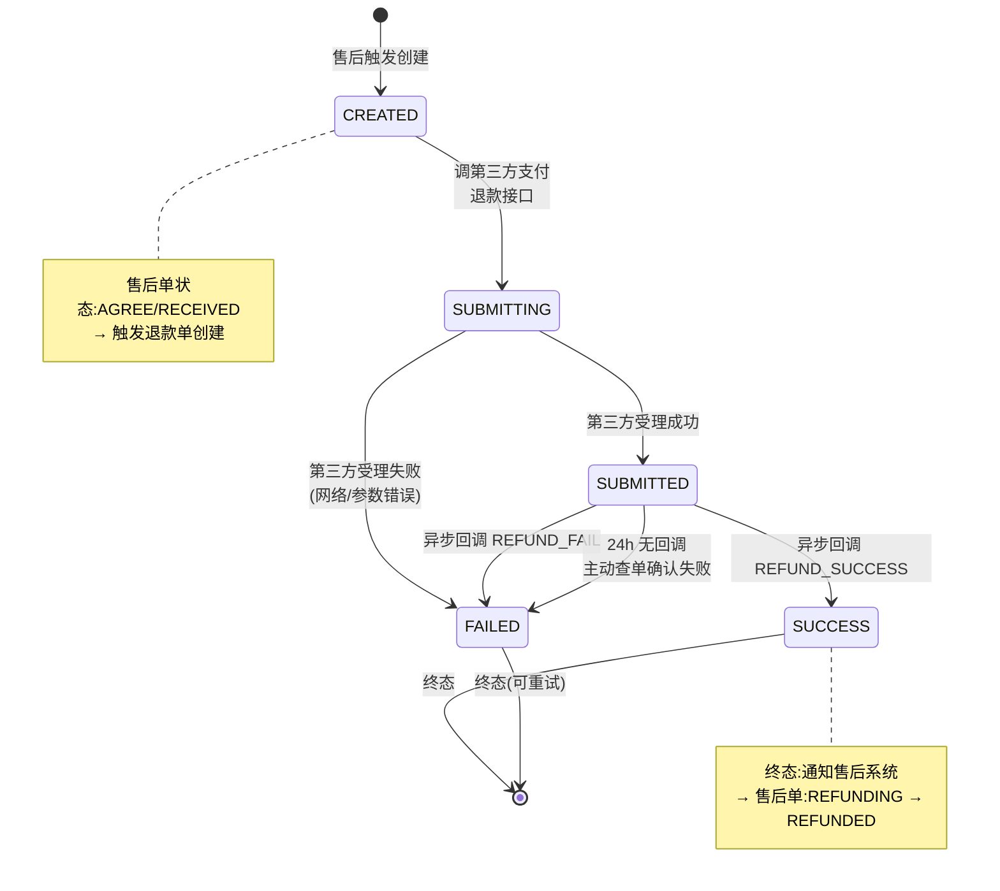

**与售后单状态机的衔接**：

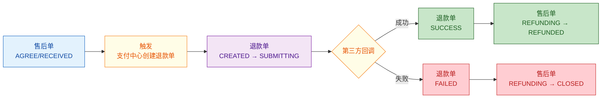

**关键代码（与第 10 章支付对接）**：

```java
/**
 * 触发退款(调支付中心)
 * 对应:小美的售后同意后,极购调支付宝退款 99 元
 */
@Service
public class PayRefundService {

    @Autowired private PayChannelRegistry channelRegistry;
    @Autowired private PayRefundDao refundDao;
    @Autowired private PayOrderDao payOrderDao;
    @Autowired private MqProducer mqProducer;
    @Autowired private PromotionRefundService promotionRefundService;

    /**
     * 创建退款单并调用第三方退款
     */
    @Transactional(rollbackFor = Exception.class)
    public RefundResultVO submitRefund(String aftersaleId) {

        // 1. 查询售后单
        AftersaleOrder af = aftersaleDao.findById(aftersaleId);
        if (af.getType() != AftersaleType.REFUND_ONLY
            && af.getType() != AftersaleType.RETURN_REFUND) {
            throw new BizException("非退款场景,无需调用支付中心");
        }

        // 2. 退返营销资产(券、积分、余额)
        OrderDTO order = orderClient.getOrder(af.getOrderId());
        promotionRefundService.refundPromotions(af, order);

        // 3. 查询原支付单
        PayOrder payOrder = payOrderDao.findByOrderId(order.getOrderId());
        if (payOrder == null || payOrder.getStatus() != PayOrderStatus.SUCCESS) {
            throw new BizException("原支付单未支付成功,无法退款");
        }

        // 4. 创建退款单
        PayRefund refund = new PayRefund();
        refund.setRefundId(generateRefundId());
        refund.setPayId(payOrder.getPayId());
        refund.setOrderId(order.getOrderId());
        refund.setAftersaleId(aftersaleId);
        refund.setUserId(af.getUserId());
        refund.setMerchantId(af.getMerchantId());
        refund.setChannelCode(payOrder.getChannelCode());
        refund.setAmount(af.getActualRefund() != null
            ? af.getActualRefund() : af.getRefundAmount());
        refund.setStatus(RefundStatus.CREATED);
        refund.setApplyTime(LocalDateTime.now());
        refundDao.insert(refund);

        // 5. 调第三方退款
        PayChannel channel = channelRegistry.getChannel(payOrder.getChannelCode());
        ChannelRefundRequest req = new ChannelRefundRequest();
        req.setOutTradeNo(payOrder.getPayId());
        req.setOutRefundNo(refund.getRefundId());
        req.setRefundAmount(BigDecimal.valueOf(refund.getAmount(), 2));
        req.setTotalAmount(BigDecimal.valueOf(payOrder.getAmount(), 2));
        req.setReason(af.getReasonLevel1() + "-" + af.getDescription());

        refundDao.updateStatus(refund.getRefundId(), RefundStatus.SUBMITTING);
        ChannelRefundResponse resp = channel.refund(req);

        if (resp.isSuccess()) {
            refundDao.updateStatus(refund.getRefundId(), RefundStatus.SUBMITTED,
                resp.getChannelRefundNo());
            return RefundResultVO.success(refund.getRefundId());
        } else {
            refundDao.updateStatus(refund.getRefundId(), RefundStatus.FAILED,
                resp.getErrorMsg());
            return RefundResultVO.failed(resp.getErrorMsg());
        }
    }

    /**
     * 退款异步回调处理(由支付中心统一处理后通过 MQ 通知)
     */
    public void handleRefundNotify(String refundId, boolean success) {
        PayRefund refund = refundDao.findById(refundId);
        if (refund == null) return;

        if (success) {
            boolean ok = refundDao.compareAndSetStatus(
                refundId, RefundStatus.SUBMITTED, RefundStatus.SUCCESS
            );
            if (ok) {
                refundDao.updateSuccessTime(refundId, LocalDateTime.now());

                // 通知售后系统更新状态
                aftersaleService.markRefunded(refund.getAftersaleId(), refundId);
            }
        } else {
            refundDao.compareAndSetStatus(
                refundId, RefundStatus.SUBMITTED, RefundStatus.FAILED
            );
            aftersaleService.markRefundFailed(refund.getAftersaleId(), refundId);
        }
    }
}
```

---

## 12.13 售后与上下游关系图

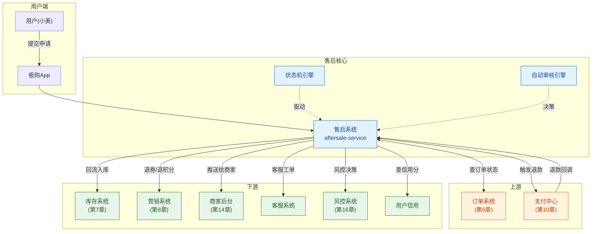

---

## 12.14 典型问题

### 12.14.1 仅退款不退货的恶意用户

**问题**：少数用户钻"仅退款不退货"的空子——收货后故意申请质量问题仅退款，拿到钱又留下商品。

**风控方案**：
1. **历史行为分析**：同一用户 30 天内仅退款 ≥ 3 次 → 拒绝极速退款
2. **品类限制**：高单价商品(>500元)不开放仅退款
3. **商家开启协议**：商家可关闭"极速退款"或设置"质量问题仅退款需商家同意"
4. **平台巡查**：风控团队抽样核查明显异常用户

### 12.14.2 商家拒绝无理

**问题**：商家以"已发货""已拆封"等理由拒绝合理售后。

**平台策略**：
1. 商家拒绝率 ≥ 30% → 商家警告
2. 商家拒绝率 ≥ 50% → 扣分、搜索降权
3. 用户申诉后客服仲裁 → 强制同意

### 12.14.3 钱已退但订单状态未更新

**问题**：支付中心退款成功，但订单系统未更新为"已退款"。

**原因**：MQ 消息丢失、回调处理失败。

**解决方案**：
1. 退款成功的 MQ 消息**至少发 3 次** + 退避重试
2. 定时任务扫描"支付已退但订单未更新"的数据,自动修复
3. T+1 对账时核对(第 10 章)

### 12.14.4 券未退

**问题**：用户全额退款后，优惠券没有恢复。

**解决方案**：
1. 营销系统退款失败时发 MQ 异步重试
2. 售后系统"全额退款必须退券"作为硬约束
3. 用户可在"我的优惠券"看到过期时间,如有问题客服补发

### 12.14.5 库存未回流

**问题**：商家确认收货后，库存没回流到可用库存。

**解决方案**：
1. 库存回流用可靠消息 + 补偿任务(第 11 章分布式事务)
2. 定时任务扫描"已收货但库存未回流"的售后单,自动补偿
3. 库存系统的"实际库存"和"在途库存"两个字段必须严格区分

---

## 12.15 风控与反欺诈（与第 16 章联动）

### 12.15.1 恶意退款识别

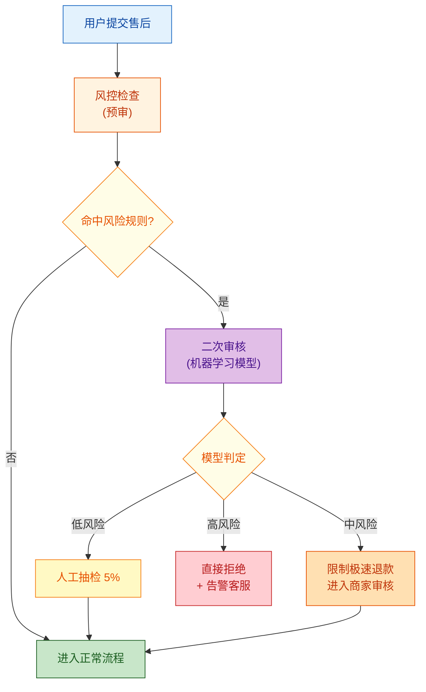

### 12.15.2 风险规则

| 规则 | 阈值 | 动作 |
|------|------|------|
| 30 天仅退款次数 | ≥ 5 | 拒绝极速退款 |
| 90 天退款率 | ≥ 30% | 拒绝极速退款 |
| 单笔金额异常 | > 30 天平均订单金额 10 倍 | 限频,人工审核 |
| 同收货地址不同账号 | ≥ 3 | 黑名单 |
| 退款后立即退货的商品被同地址签收 | ≥ 2 | 黑名单 |
| 高频小额退款(薅羊毛) | 30 天 ≥ 10 笔小额(<10元) | 限频 |

### 12.15.3 高危用户限频

```java
/**
 * 风控检查
 * 返回 4 种决策:通过/限频/拒绝/转人工
 */
public RiskDecision preAftersaleCheck(Long userId, OrderDTO order, Long amount) {
    // 规则 1:黑名单
    if (riskBlacklistDao.isBlacklisted(userId)) {
        return RiskDecision.reject("用户已被加入售后黑名单");
    }

    // 规则 2:频次
    UserRiskStats stats = riskStatsDao.getUserStats(userId, 30);
    if (stats.getRefundCount30d() >= 5 && amount < 10000) {
        return RiskDecision.limit("30天退款超过5次,限频");
    }
    if (stats.getRefundRate() > 0.3) {
        return RiskDecision.reject("30天退款率超过30%");
    }

    // 规则 3:机器学习模型(详见第 16 章)
    MlRiskScore mlScore = mlRiskModel.predict(userId, order, amount);
    if (mlScore.getScore() > 80) {
        return RiskDecision.reject("机器学习判定高风险");
    }
    if (mlScore.getScore() > 50) {
        return RiskDecision.limit("机器学习判定中风险,需商家审核");
    }

    return RiskDecision.pass();
}
```

---

## 12.16 完整案例：小美的 99 元 T 恤仅退款

**小美的订单**：
- 订单号:ORD20240605001
- 商品:老王潮牌 T 恤(白色 L 码)
- 数量:1 件
- 商品单价:99 元
- 总支付:99 元(支付宝)
- 签收时间:6 月 1 日 14:30
- 申请时间:6 月 4 日 19:30(签收后 3 天)

**流程**：

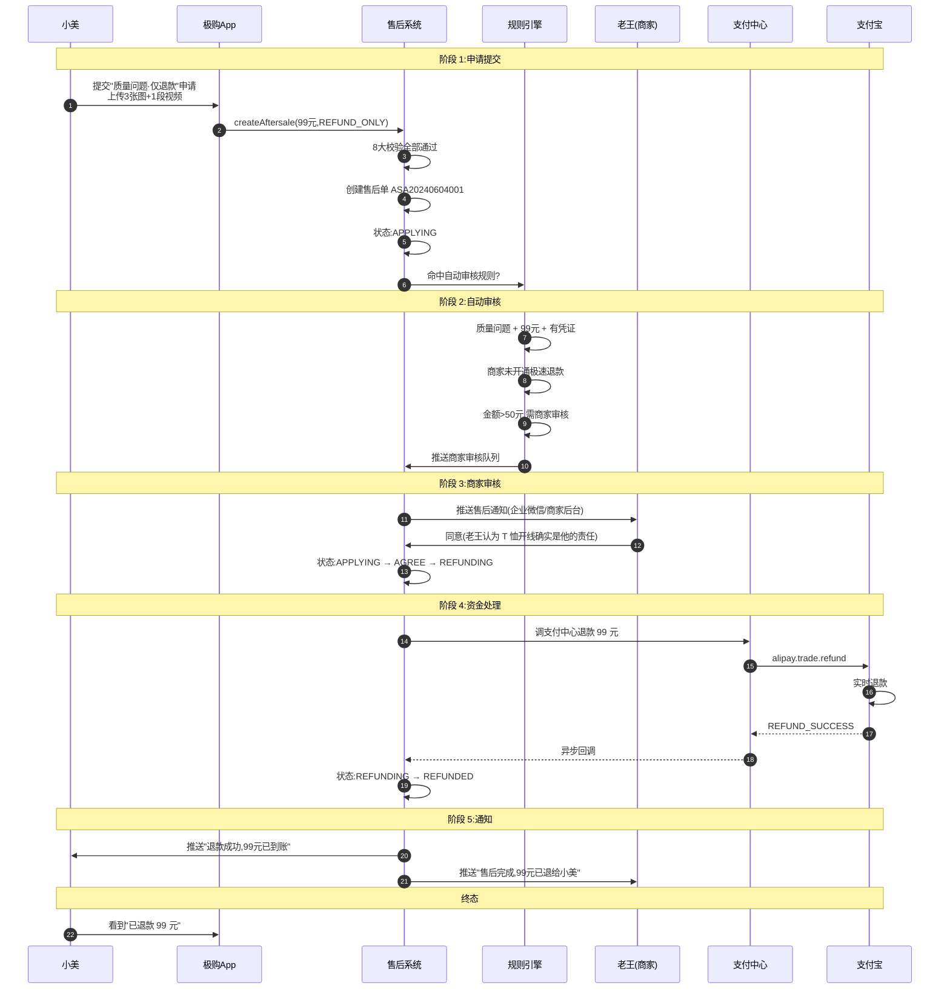

**结果**：
- 售后单状态:REFUNDED
- 退款单状态:SUCCESS
- 库存:不回流(仅退款不退货)
- 优惠券:无(小美没用券)
- 积分:无
- 商家责任:承担 99 元损失(质量问题)

---

## 12.17 容量与性能

### 12.17.1 极购日均售后量

| 维度 | 数值 | 说明 |
|------|------|------|
| 日均订单 | 800 万 | — |
| 退款率 | 5% | 行业平均 |
| 日均售后单 | 40 万 | 800 万 × 5% |
| 仅退款 | 32 万 | 80% |
| 退货退款 | 7 万 | 17.5% |
| 换货 | 1 万 | 2.5% |
| 峰值 QPS | 2000 | 大促售后高峰 |

### 12.17.2 关键性能指标

| 指标 | 目标 | 测量方式 |
|------|------|---------|
| 售后单创建 P99 | < 300ms | APM 监控 |
| 自动审核通过率 | 70% | 日报表 |
| 极速退款率 | 25% | 日报表 |
| 商家响应中位数 | 4 小时 | 商家 SLA |
| 退款到账时间 | 实时~3 天 | 渠道分布 |

---

## 本章小结

售后退款系统是商城**最复杂、最容易出错的子系统之一**。本章系统讲解了售后退款的全貌：

| 知识点 | 关键结论 |
|--------|---------|
| **售后类型** | 仅退款（不退货）、退货退款、换货、补发 |
| **售后状态机** | 9 个状态:APPLYING/AGREE/REJECTED/WAIT_RETURN/RETURNING/RECEIVED/REFUNDING/REFUNDED/CLOSED |
| **仅退款** | 极速退款（信用用户0等待）+ 自动审核（70% 命中） |
| **退货退款** | 商家同意 → 用户寄回 → 商家收货 → 退款 |
| **换货** | 类似退货退款但不退款,商家重新发货 |
| **资金流** | 商品款 + 运费分摊 - 优惠分摊,原路返回 |
| **库存** | 仅退款不回流,退货退款回流,换货回流+新出库 |
| **营销** | 券按规则退,积分按比例退,余额按比例退 |
| **超时** | 商家 7 天 / 寄回 10 天 / 物流 20 天 |
| **客服仲裁** | 证据规则,平台倾向商家责任 |
| **退款单** | 售后触发支付中心,状态机由支付中心管理 |
| **风控** | 频次、退款率、机器学习模型,识别恶意用户 |

**技能点自测**：

- [ ] 能否画出售后状态机的 9 个状态及转移关系?
- [ ] 能否区分"仅退款"和"退货退款"在库存、运费、退券上的差异?
- [ ] 能否说明退款金额 = 商品款 + 运费 - 优惠分摊的计算逻辑?
- [ ] 能否描述小美 99 元 T 恤仅退款的端到端流程?
- [ ] 能否说出至少 3 种售后超时规则?
- [ ] 能否列出至少 5 种风控识别恶意退款的规则?

下一章预告:用户中心是商城"知道你是谁、记住你买过什么、给你什么权益"的子系统。从账号体系到会员等级、从积分到地址、从实名到登录态——它串联了购物、支付、售后、营销的每一个环节,定义了"用户"的全部内涵。

---

下一章:[第 13 章 · 用户中心与会员体系](./13-用户中心与会员体系.md)

---

## 参考来源

1. **淘宝/天猫 售后服务规则**
   https://rule.taobao.com/
   淘宝平台售后规则、运费险、退款流程

2. **京东售后政策与流程**
   https://help.jd.com/user/issue/
   京东仅退款、退货退款、极速退款机制

3. **拼多多"仅退款"政策分析**
   https://www.pinduoduo.com/
   拼多多激进仅退款策略的争议与风控

4. **支付宝退款 API 文档**
   https://opendocs.alipay.com/
   支付宝退款接口、退款回调、原路返回规则

5. **微信支付退款文档**
   https://pay.weixin.qq.com/wiki/doc/api/
   微信支付退款接口、回调机制

6. **《电商售后系统设计与实现》—— 美团技术博客**
   https://tech.meituan.com/
   美团售后系统架构、自动审核引擎

7. **唯品会售后退款架构演进**
   https://tech.vip.com/
   唯品会售后系统的高可用与一致性实践

8. **eBay 退款纠纷处理机制(借鉴)**
   https://www.ebay.com/help/policies/return-policy
   eBay Money Back Guarantee 担保机制

9. **《分布式事务在售后退款中的应用》—— 阿里技术**
   https://developer.aliyun.com/
   售后退款场景的最终一致性、可靠消息、TCC

10. **《售后风控反欺诈实践》—— 京东安全**
    https://safety.jd.com/
    恶意退款识别、用户信用模型、限频策略

11. **《电商退款资金账务处理》—— 财务技术**
    https://www.cainiao.com/
    退款分摊计算、原路返回、优惠退还

12. **RocketMQ 事务消息在退款场景的应用**
    https://rocketmq.apache.org/docs/featureBehavior/04transactionmessage
    退款与订单状态更新的分布式事务
