# 第 13 章 · 用户中心与会员体系

> **所属系列**：《极购商城系统设计 · 全景教程》第五部分 · 履约与用户
> **上一章**：[第 12 章 · 售后退款系统](./12-售后退款系统.md)　|　**下一章**：[第 14 章 · 商家与商家后台](./14-商家与商家后台.md)　|　**总目录**：[教程大纲](./00-教程大纲.md)

---

## 本章导读

小美在「极购商城」下过 800 多单、累计消费 8 万多元、给过 200+ 条评价。她在会员中心能看到自己已是「黄金会员 V3」——距离下一个等级「铂金 V4」还差 1240 成长值。小美可以一键登录、指纹支付、用过的 5 个收货地址随手切换、实名信息已被公安二要素核验通过。

这一切背后，是极购的**用户中心**——一个支撑 3 亿注册用户、1500 万 DAU、月活登录 30 亿次的"超级系统"。

**用户中心**看似只是"账号+昵称+头像"，实际上它承担了商城 80% 的「用户感知」：注册登录、会员等级、成长值、积分、收货地址、实名认证、隐私合规、用户画像……所有业务域（订单、营销、支付、风控、客服）都依赖它提供的"用户是谁、能做什么"。

本章将沿用「极购商城 3 亿用户、1500 万 DAU」、「小美：黄金会员 V3」、「老王：商家账号」三个贯穿案例，从账号体系到会员体系、从登录态演进到隐私合规，把用户中心讲透。

本章主要内容：

1. **用户中心的职责边界**——账号、会员、地址、实名、隐私、消息六大域
2. **账号体系**——5 种注册方式 × 5 种登录方式 × 一键登录 × 多端登录
3. **用户 ID 生成**——Snowflake 64 bit 位分配与 Java 实现
4. **用户数据模型**——`user_base / user_auth / user_profile` 三表分离
5. **登录态演进**——Cookie+Session → JWT → Token+Refresh → OAuth 2.0 → OIDC
6. **会员体系**——成长值、8 级阈值、权益矩阵、会员日
7. **积分体系**——获取、消费、过期、防刷
8. **地址簿**——CRUD、智能识别一段话
9. **实名认证**——公安二要素核验、隐私合规
10. **用户标签与画像**——基础/行为/兴趣/消费四类标签
11. **隐私合规**——PIPL、GDPR、脱敏、注销
12. **用户中心与上下游**——与订单、营销、支付、风控的协作
13. **典型问题**——撞库、短信轰炸、账号盗用、实名泄露

读完本章你将能回答：**为什么用户 ID 要用 Snowflake 而不是自增？为什么 `user_auth` 必须和 `user_base` 分表？为什么登录态从 Session 演进到 OIDC？黄金会员 V3 背后到底是一张怎样的等级表？**

---

## 13.1 用户中心的职责

### 13.1.1 用户中心不是"用户表"

在很多新人眼里，"用户中心 = 一张 `user` 表 + 登录接口"。但对一个 3 亿用户的电商系统来说，用户中心是**整个系统的"用户域底座"**——它的稳定性直接决定整个商城能不能用：

- **登录宕机 1 分钟 = 全站不可下单 1 分钟 = 数十万订单损失**。
- **会员等级算错 1 万单 = 客服投诉爆仓**。
- **用户实名泄露 = 公安上门 + 上热搜 + 监管处罚**。

所以**用户中心必须做成"高可用、强一致、可扩展、可审计"的独立域**。

### 13.1.2 用户中心六大职责域

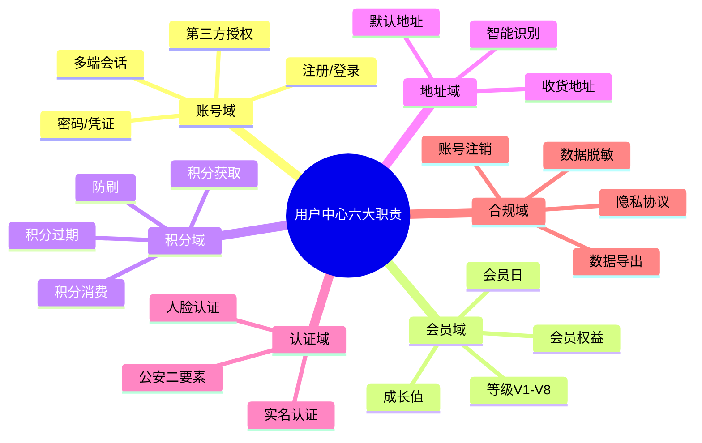

### 13.1.3 极购用户中心的规模

| 维度 | 数量级 | 备注 |
|------|--------|------|
| 注册用户 | 3 亿 | 累计，含僵尸账号 |
| DAU | 1500 万 | 日活登录 |
| 月活 | 8000 万 | 30 天内活跃 |
| 登录 QPS（峰值） | 30 万 | 大促开门红瞬间 |
| 实名用户 | 1.8 亿 | 已通过公安核验 |
| 会员（V1+） | 2.1 亿 | 黄金及以上 0.4 亿 |
| 收货地址 | 人均 3.2 条 | 总 9.6 亿条 |
| 隐私注销请求 | 日均 8000 | 满足 PIPL"被遗忘权" |

---

## 13.2 账号体系

### 13.2.1 注册方式

极购支持 **5 种注册方式**，每种对应一种登录方式（虽然「微信注册」用手机号登录也可以，但有体验差异）：

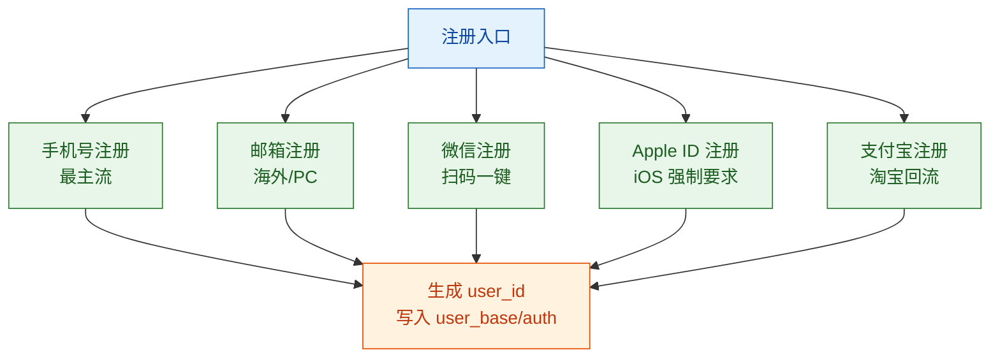

**各种注册方式对比**：

| 方式 | 覆盖率 | 优点 | 难点 | 极购处理 |
|------|--------|------|------|----------|
| 手机号 | 75% | 实名唯一标识 | 短信验证码成本 | 默认 + 风控 |
| 邮箱 | 5% | 海外、PC 友好 | 收信率 80% | 次选 |
| 微信 | 15% | 零输入 | 需微信开放平台 | 强推 |
| Apple | 3% | iOS 必须提供 | 匿名邮箱转发 | 必选 |
| 支付宝 | 2% | 淘宝回流 | 跨主体授权 | 灰度 |

### 13.2.2 登录方式

注册是"创建用户"，登录是"识别用户"。极购支持 5 种登录方式：

| 登录方式 | 凭证 | 安全等级 | 适用场景 | 是否需密码 |
|---------|------|---------|---------|-----------|
| **密码登录** | 手机号/邮箱 + 密码 | 中 | 传统 PC | 是 |
| **短信验证码** | 手机号 + 短信码 | 中 | APP 默认 | 否 |
| **微信授权** | OAuth code | 高 | 微信内 | 否 |
| **指纹/Face ID** | 本地生物特征 + Token | 极高 | 移动端 | 否 |
| **一键登录（本机号码）** | 运营商网关取号 | 高 | APP 拉新 | 否 |

### 13.2.3 一键登录：本机号码识别

一键登录是 APP 拉新转化率最高的方案——用户点击"本机号码一键登录"，APP 通过运营商网关（移动/联通/电信）直接拿到当前手机号，**2 秒内完成注册+登录**，比短信验证码快 5 倍。

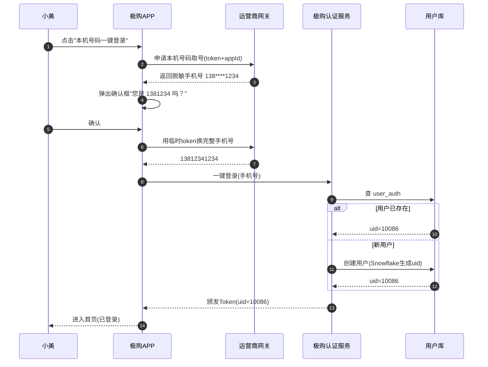

**一键登录 vs 短信验证码**：

| 维度 | 一键登录 | 短信验证码 |
|------|---------|-----------|
| 用户操作 | 1 次点击 | 输入码 + 等待 30s |
| 转化率 | 85% | 60% |
| 成本 | 0.3 元/次（运营商） | 0.04 元/条 |
| 安全 | 运营商网关认证 + 设备指纹 | 短信可能被嗅探 |
| 覆盖率 | 三大运营商 95% | 100% |

### 13.2.4 多端登录

小美可能同时在 APP、H5、小程序、PC 浏览器 4 个端登录。极购采用**"同账号最多 5 端同时在线"**策略：

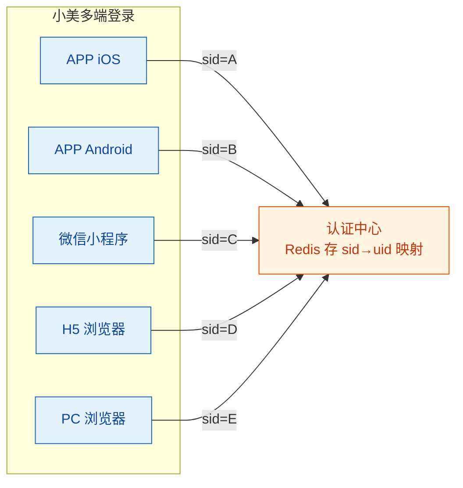

**踢人策略**：超过 5 端后，最早登录的 session 失效；用户主动「下线其他设备」可一键全端下线。

---

## 13.3 用户 ID 生成

### 13.3.1 为什么不用自增 ID

MySQL 自增主键在分库分表后会**重复**，而极购 3 亿用户必须分 64 库 × 64 表（共 4096 张表）。所以必须用**全局唯一**的 ID 生成方案。

候选方案对比：

| 方案 | 全局唯一 | 趋势递增 | 长度 | 性能 | 信息泄露 | 极购选择 |
|------|---------|---------|------|------|---------|---------|
| UUID | ✅ | ❌ | 32 字符 | 高 | 无 | ❌ 太长 |
| 数据库自增 | ❌ 分库分表后冲突 | ✅ | 8 字节 | 低 | 暴露总量 | ❌ |
| Redis INCR | ✅ | ✅ | 8 字节 | 高 | 暴露总量 | ❌ |
| **Snowflake** | ✅ | ✅ | 8 字节 | 极高（单机 400 万/s） | 部分暴露 | ✅ **采用** |
| 雪花变种（美团 Leaf） | ✅ | ✅ | 8 字节 | 极高 | 部分暴露 | 备选 |

### 13.3.2 Snowflake 64 bit 位分配

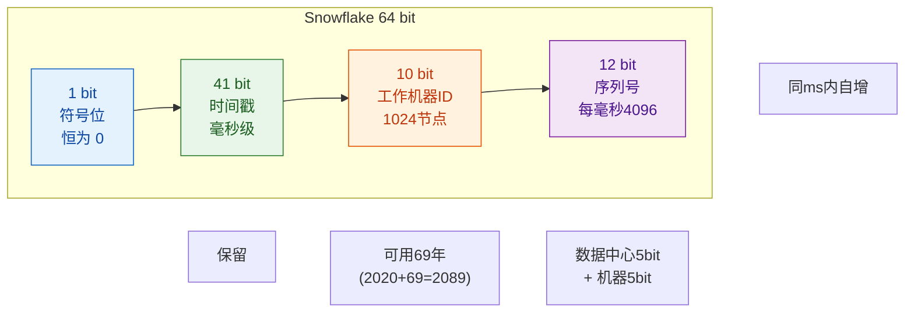

**位分配详解**：
- **1 bit 符号**：固定为 0，保证正数。
- **41 bit 时间戳**：当前时间 - 起始时间（极购用 2020-01-01）。41 bit 可用 2^41 = 2.2 万亿毫秒 ≈ **69 年**。
- **10 bit 工作机器**：前 5 bit 数据中心（32 个），后 5 bit 机器 ID（每 DC 32 台），共 1024 个节点。
- **12 bit 序列号**：同一毫秒内自增，每节点每毫秒最多 4096 个 ID。

理论 QPS：1024 节点 × 4096/ms = **420 万/秒**，远超极购峰值 30 万登录 QPS。

### 13.3.3 Java 实现

```java
/**
 * Twitter Snowflake 用户ID生成器
 * 极购商城:uid=9007199254740992 (2^53)以内安全传给前端
 */
public class SnowflakeIdWorker {

    // 起始时间戳:2020-01-01
    private final long twepoch = 1577836800000L;

    // 位分配
    private final long workerIdBits = 5L;       // 机器ID 5位
    private final long datacenterIdBits = 5L;   // 数据中心 5位
    private final long sequenceBits = 12L;      // 序列号 12位

    // 最大值
    private final long maxWorkerId = -1L ^ (-1L << workerIdBits);          // 31
    private final long maxDatacenterId = -1L ^ (-1L << datacenterIdBits);  // 31
    private final long sequenceMask = -1L ^ (-1L << sequenceBits);        // 4095

    // 位移
    private final long workerIdShift = sequenceBits;                       // 12
    private final long datacenterIdShift = sequenceBits + workerIdBits;   // 17
    private final long timestampLeftShift = sequenceBits + workerIdBits
                                          + datacenterIdBits;             // 22

    private final long workerId;
    private final long datacenterId;
    private long sequence = 0L;
    private long lastTimestamp = -1L;

    public SnowflakeIdWorker(long workerId, long datacenterId) {
        if (workerId > maxWorkerId || workerId < 0) {
            throw new IllegalArgumentException(
                "workerId 必须在 0~" + maxWorkerId + " 之间");
        }
        if (datacenterId > maxDatacenterId || datacenterId < 0) {
            throw new IllegalArgumentException(
                "datacenterId 必须在 0~" + maxDatacenterId + " 之间");
        }
        this.workerId = workerId;
        this.datacenterId = datacenterId;
    }

    /**
     * 生成下一个ID
     * synchronized保证线程安全
     */
    public synchronized long nextId() {
        long timestamp = timeGen();

        // 时钟回拨检测
        if (timestamp < lastTimestamp) {
            throw new RuntimeException(
                "时钟回拨,拒绝生成ID. 当前时间戳:" + timestamp
                + ", 上次时间戳:" + lastTimestamp);
        }

        // 同一毫秒内,序列号自增
        if (lastTimestamp == timestamp) {
            sequence = (sequence + 1) & sequenceMask;
            if (sequence == 0L) {
                // 当前毫秒序列号用完,等到下一毫秒
                timestamp = tilNextMillis(lastTimestamp);
            }
        } else {
            // 进入新毫秒,序列号重置
            sequence = 0L;
        }

        lastTimestamp = timestamp;

        // 拼接64位
        return ((timestamp - twepoch) << timestampLeftShift)
                | (datacenterId << datacenterIdShift)
                | (workerId << workerIdShift)
                | sequence;
    }

    private long tilNextMillis(long lastTimestamp) {
        long timestamp = timeGen();
        while (timestamp <= lastTimestamp) {
            timestamp = timeGen();
        }
        return timestamp;
    }

    private long timeGen() {
        return System.currentTimeMillis();
    }

    public static void main(String[] args) {
        // 数据中心1, 机器3
        SnowflakeIdWorker idWorker = new SnowflakeIdWorker(3L, 1L);
        for (int i = 0; i < 5; i++) {
            long uid = idWorker.nextId();
            System.out.println("生成用户ID:" + uid);
        }
    }
}
```

**小美和老王的 uid 示例**：
- 小美：uid = `8392100000123456`（时间戳段 2024-05，约对应 2024 年 5 月注册）
- 老王：uid = `7920100000086421`（时间戳段 2023-09，约对应 2023 年 9 月入驻）

> 注意：uid 是 Long（8 字节），前端 JS 接收会丢精度（JS Number 最大 2^53）。极购的做法是**uid 转 String 返回给前端**。

---

## 13.4 用户数据模型

### 13.4.1 三表分离原则

用户数据不能放在一张大表，否则：
- **热点行**：3 亿用户，单表 100 GB，UPDATE 一次要 10 秒。
- **冷热不分**：用户经常看的是昵称头像，登录看的是手机号密码，查询模式完全不一样。
- **合规风险**：身份证号、密码 hash 不能与昵称同表，泄露一个全泄露。

极购采用**三表分离**：

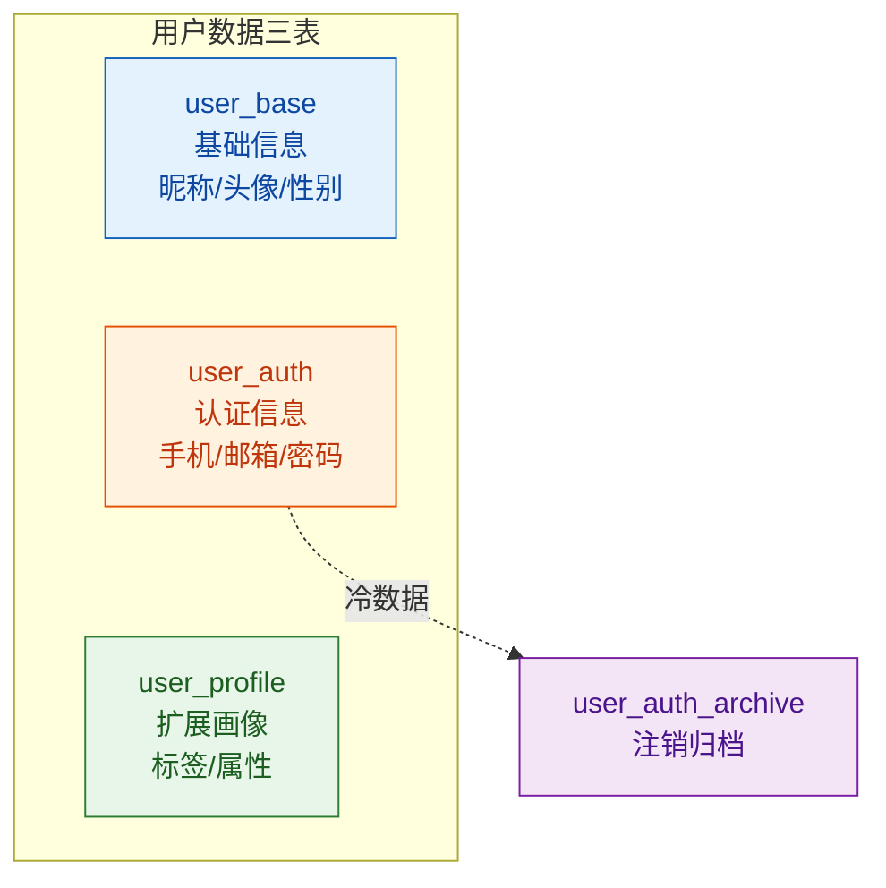

### 13.4.2 user_base 基础信息表

```sql
-- =============================================
-- 用户基础信息表(高频读,低频写)
-- 对应:小美的昵称、头像、性别、生日
-- 分片键:uid % 64 = db_index
-- =============================================
CREATE TABLE user_base (
    uid            BIGINT       NOT NULL               COMMENT '用户ID(Snowflake)',
    nickname       VARCHAR(64)  NOT NULL DEFAULT ''    COMMENT '昵称',
    avatar         VARCHAR(256) NOT NULL DEFAULT ''    COMMENT '头像URL',
    gender         TINYINT      NOT NULL DEFAULT 0     COMMENT '0未知 1男 2女',
    birthday       DATE         DEFAULT NULL           COMMENT '生日',
    status         TINYINT      NOT NULL DEFAULT 1     COMMENT '1正常 2封禁 3注销',
    register_time  DATETIME     NOT NULL               COMMENT '注册时间',
    register_src   VARCHAR(32)  NOT NULL DEFAULT ''    COMMENT '注册渠道:app/h5/wechat',
    last_login_time DATETIME    DEFAULT NULL           COMMENT '最后登录时间',
    level          TINYINT      NOT NULL DEFAULT 1     COMMENT '会员等级V1-V8',
    growth_value   INT          NOT NULL DEFAULT 0     COMMENT '成长值',
    version        INT          NOT NULL DEFAULT 0     COMMENT '乐观锁',
    created_at     DATETIME     NOT NULL DEFAULT CURRENT_TIMESTAMP,
    updated_at     DATETIME     NOT NULL DEFAULT CURRENT_TIMESTAMP
                                          ON UPDATE CURRENT_TIMESTAMP,
    PRIMARY KEY (uid),
    KEY idx_register_time (register_time),
    KEY idx_level (level)
) ENGINE=InnoDB DEFAULT CHARSET=utf8mb4 COMMENT='用户基础信息';
```

### 13.4.3 user_auth 认证信息表

```sql
-- =============================================
-- 用户认证表(高频读,严禁明文)
-- 对应:小美用手机号13812341234 + 密码登录
-- 单独分库,与user_base物理隔离
-- =============================================
CREATE TABLE user_auth (
    id             BIGINT       NOT NULL AUTO_INCREMENT,
    uid            BIGINT       NOT NULL               COMMENT '用户ID',
    auth_type      VARCHAR(16)  NOT NULL               COMMENT 'phone/email/wechat/apple/alipay',
    auth_id        VARCHAR(128) NOT NULL               COMMENT '手机号/邮箱/openid',
    password_hash  VARCHAR(128) DEFAULT NULL           COMMENT 'BCrypt hash,仅密码登录用',
    salt           VARCHAR(32)  DEFAULT NULL           COMMENT '密码盐',
    status         TINYINT      NOT NULL DEFAULT 1     COMMENT '1正常 2未验证 3锁定',
    verified_at    DATETIME     DEFAULT NULL           COMMENT '验证时间',
    created_at     DATETIME     NOT NULL DEFAULT CURRENT_TIMESTAMP,
    PRIMARY KEY (id),
    UNIQUE KEY uk_type_auth (auth_type, auth_id),
    KEY idx_uid (uid)
) ENGINE=InnoDB DEFAULT CHARSET=utf8mb4 COMMENT='用户认证表';

-- =============================================
-- 第三方授权 openid 映射表
-- 对应:小美用微信登录,unionid 是微信侧唯一
-- =============================================
CREATE TABLE user_oauth (
    id             BIGINT       NOT NULL AUTO_INCREMENT,
    uid            BIGINT       NOT NULL               COMMENT '极购uid',
    oauth_type     VARCHAR(16)  NOT NULL               COMMENT 'wechat/apple/alipay',
    openid         VARCHAR(128) NOT NULL               COMMENT '第三方用户openid',
    unionid        VARCHAR(128) DEFAULT NULL           COMMENT '跨应用唯一ID(微信)',
    access_token   VARCHAR(256) DEFAULT NULL           COMMENT '授权token(脱敏)',
    refresh_token  VARCHAR(256) DEFAULT NULL           COMMENT '刷新token',
    expires_at     DATETIME     DEFAULT NULL           COMMENT 'access_token过期',
    created_at     DATETIME     NOT NULL DEFAULT CURRENT_TIMESTAMP,
    PRIMARY KEY (id),
    UNIQUE KEY uk_type_openid (oauth_type, openid),
    KEY idx_uid (uid)
) ENGINE=InnoDB DEFAULT CHARSET=utf8mb4 COMMENT='第三方授权映射';
```

> 密码用 **BCrypt**（cost=10）hash 存储，绝不存明文。手机号、身份证号在数据库层做 **AES-256 加密**（详见 13.9 实名认证）。

### 13.4.4 user_profile 扩展画像表

```sql
-- =============================================
-- 用户画像扩展表(JSON存储,可灵活扩展)
-- 对应:小美最近浏览/购物偏好/职业/收入
-- =============================================
CREATE TABLE user_profile (
    uid            BIGINT       NOT NULL               COMMENT '用户ID',
    region         VARCHAR(64)  DEFAULT NULL           COMMENT '常驻地区:上海市/浦东新区',
    industry       VARCHAR(32)  DEFAULT NULL           COMMENT '行业',
    income_level   VARCHAR(16)  DEFAULT NULL           COMMENT '收入层级 L1-L5',
    marriage       TINYINT      DEFAULT 0              COMMENT '0未知 1未婚 2已婚 3离异',
    has_child      TINYINT      DEFAULT 0              COMMENT '是否有孩子 0否 1是',
    tags           JSON         DEFAULT NULL           COMMENT '用户标签:美妆控/比价党/学生',
    ext            JSON         DEFAULT NULL           COMMENT '扩展字段',
    updated_at     DATETIME     NOT NULL DEFAULT CURRENT_TIMESTAMP
                                          ON UPDATE CURRENT_TIMESTAMP,
    PRIMARY KEY (uid)
) ENGINE=InnoDB DEFAULT CHARSET=utf8mb4 COMMENT='用户画像';
```

---

## 13.5 登录态演进

### 13.5.1 登录态方案演进史

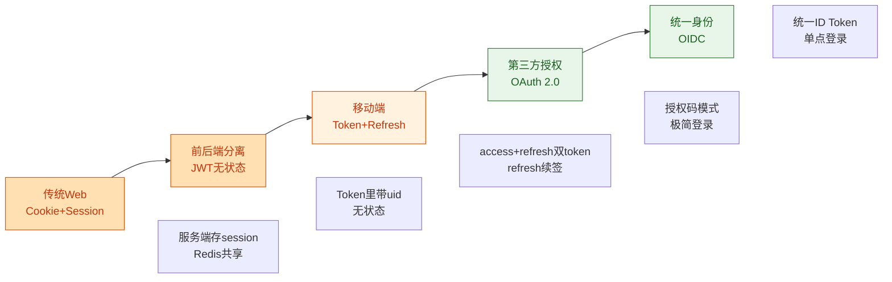

### 13.5.2 方案对比

| 方案 | 状态存储 | 适用场景 | 优点 | 缺点 |
|------|---------|---------|------|------|
| Cookie + Session | 服务端 Redis | 传统 Web | 简单、可控 | 跨域麻烦、CSRF |
| JWT | 客户端 | 短时 API 调用 | 无状态、跨域 | 难以主动失效 |
| **Token + Refresh** | 服务端 | 移动端/H5（**极购采用**） | 主动踢人、安全 | 需 Redis 存 refresh |
| OAuth 2.0 | 授权服务器 | 第三方授权 | 标准、生态成熟 | 流程复杂 |
| OIDC | IdP 服务 | 统一身份/SSO | 标准 SSO | 重型 |

### 13.5.3 极购的方案：Access Token + Refresh Token

极购用**双 Token 模式**：

- **Access Token**：JWT 格式，**2 小时**过期，存 localStorage/cookie，每次请求带 `Authorization: Bearer xxx`。
- **Refresh Token**：随机字符串，**30 天**过期，存服务端 Redis，移动端 secure storage。

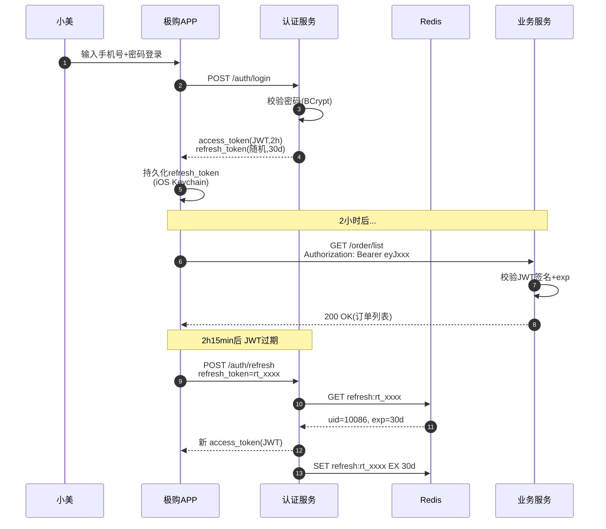

### 13.5.4 Java JWT 签发与校验

```java
/**
 * JWT 服务 - 极购用户中心
 * 用于签发 access_token
 */
@Service
public class JwtService {

    // 256位 HMAC 密钥(生产环境从KMS读取)
    private static final String SECRET = "jigo-mall-jwt-secret-key-2026-very-long-key-256bit";
    private static final long ACCESS_TOKEN_TTL_MS = 2 * 60 * 60 * 1000L;   // 2小时
    private static final String ISSUER = "jigo-auth";

    private final SecretKey secretKey;

    public JwtService() {
        this.secretKey = Keys.hmacShaKeyFor(SECRET.getBytes(StandardCharsets.UTF_8));
    }

    /**
     * 生成 Access Token (JWT)
     * 极购:小美登录后,生成 access_token, claims含 uid/level/device
     */
    public String generateAccessToken(long uid, int level, String deviceId) {
        Date now = new Date();
        Date expireAt = new Date(now.getTime() + ACCESS_TOKEN_TTL_MS);

        return Jwts.builder()
            .issuer(ISSUER)                            // 签发者
            .subject(String.valueOf(uid))              // 主题=uid
            .audience().add("jigo-app").and()         // 受众
            .claim("level", level)                     // 会员等级
            .claim("device", deviceId)                 // 设备ID
            .issuedAt(now)
            .expiration(expireAt)
            .signWith(secretKey, Jwts.SIG.HS256)
            .compact();
    }

    /**
     * 校验并解析 Token
     * 业务服务(订单/营销)每次请求都会调用
     */
    public Jws<Claims> parseAndValidate(String token) {
        try {
            return Jwts.parser()
                .verifyWith(secretKey)
                .requireIssuer(ISSUER)
                .build()
                .parseSignedClaims(token);
        } catch (ExpiredJwtException e) {
            throw new BizException("AUTH_002", "Token已过期,请刷新");
        } catch (SignatureException e) {
            throw new BizException("AUTH_003", "Token签名无效");
        } catch (JwtException e) {
            throw new BizException("AUTH_004", "Token无效");
        }
    }

    /**
     * 从 Token 提取 uid
     */
    public long getUid(String token) {
        return Long.parseLong(parseAndValidate(token).getPayload().getSubject());
    }
}
```

**为什么 access_token 不用 Blacklist？** JWT 一旦签发就**无法主动撤销**（除非查黑名单），极购的做法是：**access_token 短时效（2h）+ refresh_token 可控（可吊销）**。这样既享受 JWT 无状态的好处，又能在泄露时紧急吊销。

### 13.5.5 OAuth 2.0 第三方登录

小美在极购 APP 点击"微信登录"：

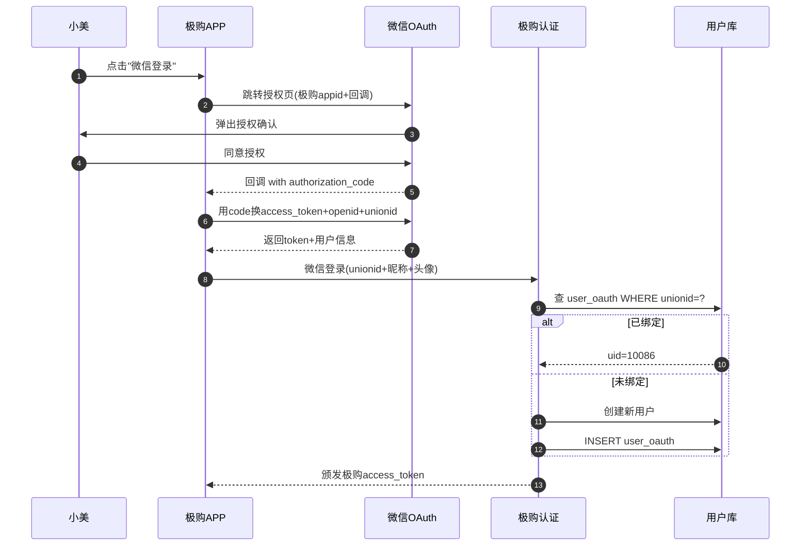

### 13.5.6 OIDC：统一身份

OIDC = OAuth 2.0 + **ID Token**（JWT 含用户身份）。极购未来会演进到 OIDC，让用户一次登录，所有子产品（极购、极购生鲜、极购国际）共享身份——这就是 **SSO 单点登录**。

| 维度 | OAuth 2.0 | OIDC |
|------|----------|------|
| 目的 | 授权 | 身份认证 + 授权 |
| Token | access_token | access_token + **id_token** |
| 用户信息 | 无 | /userinfo 端点 |
| 标准声明 | 无 | iss/sub/aud/exp/iat |
| 适用 | 第三方授权 | SSO |

---

## 13.6 会员体系

### 13.6.1 成长值与等级

极购会员体系是**"消费驱动型"**——消费越多，等级越高，权益越大。核心公式：

> **消费 1 元 = 1 成长值**（剔除退款部分）

**8 级会员**对应不同的成长值阈值：

| 等级 | 名称 | 成长值阈值 | 累计消费 | 折扣 | 图标色 |
|------|------|-----------|---------|------|--------|
| V1 | 注册会员 | 0 | 0 元 | 无 | 灰 |
| V2 | 青铜会员 | 1,000 | 1,000 元 | 9.8 折 | 棕 |
| V3 | **黄金会员** | 5,000 | 5,000 元 | 9.5 折 | 黄 |
| V4 | 铂金会员 | 20,000 | 20,000 元 | 9.3 折 | 银 |
| V5 | 钻石会员 | 80,000 | 80,000 元 | 9.0 折 | 蓝 |
| V6 | 星耀会员 | 200,000 | 200,000 元 | 8.8 折 | 紫 |
| V7 | 至尊会员 | 500,000 | 500,000 元 | 8.5 折 | 金 |
| V8 | 极购帝王 | 1,000,000 | 100 万元 | 8.0 折 | 红+金 |

> 小美累计消费 8 万元，成长值 80,000 → V4 铂金会员。再消费 12 万即可升级 V5 钻石。

### 13.6.2 会员权益矩阵

| 权益 | V1 | V2 | V3 | V4 | V5 | V6 | V7 | V8 |
|------|----|----|----|----|----|----|----|----|
| 会员价 |  | ✅ | ✅ | ✅ | ✅ | ✅ | ✅ | ✅ |
| 专享券 |  |  | 1 张/月 | 3 张/月 | 5 张/月 | 8 张/月 | 12 张/月 | 20 张/月 |
| 生日礼包 |  | ✅ | ✅ | ✅ | ✅ | ✅ | ✅ | ✅ |
| 专属客服 |  |  |  |  | ✅ | ✅ | ✅ | ✅ |
| 免运费 |  |  |  | 3 次/月 | 6 次/月 | 不限 | 不限 | 不限 |
| 优先发货 |  |  |  |  | ✅ | ✅ | ✅ | ✅ |
| 会员日折扣 | 9.5 | 9.5 | 9.0 | 9.0 | 8.5 | 8.5 | 8.0 | 7.5 |

**小美 V3 黄金会员每月能领 1 张专享券（满 100 减 20）、生日礼包、9.5 折会员价、会员日 9 折。**

### 13.6.3 成长值变更（带 MQ 异步）

成长值变更的核心挑战：**支付成功 → 增加成长值 → 触发升级判断 → 发放权益**，必须保证**不丢、不错、不重**。

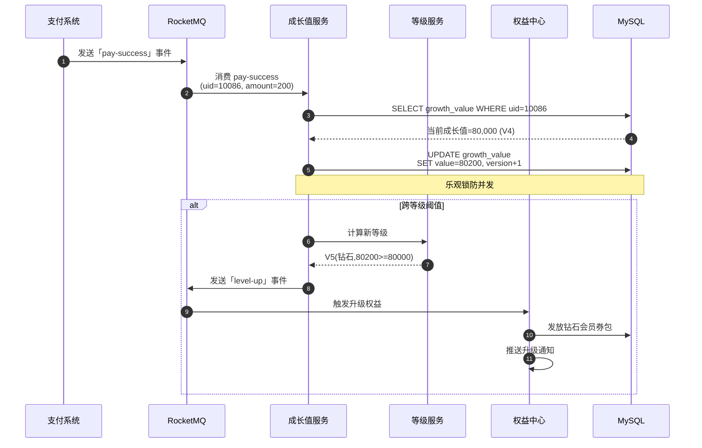

### 13.6.4 成长值服务 Java 实现

```java
/**
 * 成长值服务 - MQ 消费
 * 对应:小美完成支付后,异步增加成长值
 */
@Service
@RocketMQMessageListener(topic = "pay-success", consumerGroup = "growth-consumer")
public class GrowthValueConsumer implements RocketMQListener<PaySuccessEvent> {

    @Autowired private UserBaseDao userBaseDao;
    @Autowired private GrowthLogDao logDao;
    @Autowired private LevelService levelService;
    @Autowired private MqProducer mqProducer;

    @Override
    public void onMessage(PaySuccessEvent event) {
        long uid = event.getUid();
        long amount = event.getAmountFen();   // 单位:分

        // 成长值 = 消费金额(分) / 100
        int delta = (int) (amount / 100);

        // 幂等:查询流水
        GrowthLog exist = logDao.findByOrderId(event.getOrderId());
        if (exist != null) {
            log.info("成长值已发放,跳过. orderId={}", event.getOrderId());
            return;
        }

        // 1. 增加成长值(乐观锁)
        int rows = userBaseDao.incrementGrowth(uid, delta);
        if (rows == 0) {
            log.error("成长值更新失败(乐观锁冲突) uid={}", uid);
            // 抛出异常,让MQ重试
            throw new RuntimeException("更新失败");
        }

        // 2. 写流水
        logDao.insert(GrowthLog.builder()
            .uid(uid)
            .delta(delta)
            .orderId(event.getOrderId())
            .reason("消费赠送")
            .build());

        // 3. 判断是否升级
        UserBase user = userBaseDao.findById(uid);
        int newLevel = levelService.calculateLevel(user.getGrowthValue());
        if (newLevel > user.getLevel()) {
            // 升级
            userBaseDao.updateLevel(uid, newLevel);
            // 发升级消息(权益中心订阅)
            mqProducer.send("user-level-up",
                new LevelUpEvent(uid, user.getLevel(), newLevel));
        }
    }
}
```

```java
/**
 * 等级计算服务
 * 极购8级会员阈值
 */
@Service
public class LevelService {

    // 等级阈值(V1~V8, 索引0=V1)
    private static final int[] LEVEL_THRESHOLDS = {
        0,        // V1
        1000,     // V2
        5000,     // V3 黄金
        20000,    // V4 铂金
        80000,    // V5 钻石
        200000,   // V6 星耀
        500000,   // V7 至尊
        1000000   // V8 帝王
    };

    private static final String[] LEVEL_NAMES = {
        "注册", "青铜", "黄金", "铂金", "钻石", "星耀", "至尊", "帝王"
    };

    public int calculateLevel(int growthValue) {
        int level = 1;
        for (int i = 1; i < LEVEL_THRESHOLDS.length; i++) {
            if (growthValue >= LEVEL_THRESHOLDS[i]) {
                level = i + 1;
            }
        }
        return level;
    }

    public String getLevelName(int level) {
        if (level < 1 || level > 8) return "未知";
        return LEVEL_NAMES[level - 1] + "会员";
    }
}
```

### 13.6.5 会员日

极购**每月 18 日**是会员日，全场 V3+ 额外 9 折。这是拉活 + 拉升客单价的"核武器"——会员日 GMV 占比日常的 1.5 倍。

---

## 13.7 积分体系

### 13.7.1 积分获取

| 行为 | 积分 | 上限 |
|------|------|------|
| 下单成功（消费 1 元） | 1 积分 | 单日 500 |
| 商品评价（带图） | 20 积分 | 单日 100 |
| 每日签到 | 5 积分 | - |
| 邀请好友注册 | 100 积分 | 单日 200 |
| 完成问卷 | 10-50 积分 | - |
| 大促互动（盖楼/砍价） | 5-100 积分 | 单日 200 |

> 小美今天下单 200 元 + 写 2 条评价 + 签到 → +200 + 40 + 5 = **+245 积分**。

### 13.7.2 积分消费

| 用途 | 消耗 | 备注 |
|------|------|------|
| 抵现（订单页勾选） | 100 积分 = 1 元 | 上限单笔订单 20% |
| 抽奖（积分乐园） | 10-1000 积分 | 随机奖品 |
| 换券 | 500 积分 = 满 50 减 5 券 | 热门兑换 |
| 换实物 | 1000-50000 积分 | 小家电/数码 |

### 13.7.3 积分有效期

- **自然年 12 月 31 日过期**：当年获得的积分，次年 12 月 31 日 24:00 过期。**不清零滚动**——避免"账面积分 100 万，实际可用 30"的投诉。
- **到期前 30 天** APP 推送提醒。
- **到期前 7 天** 站内信 + 短信。

### 13.7.4 积分防刷

积分体系最大的风险是**被羊毛党薅**——比如注册 1000 个小号每天签到 5000 积分。

**4 道防线**：

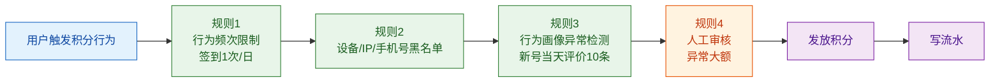

**关键防刷规则**（详见第 16 章风控）：

| 规则 | 阈值 | 处置 |
|------|------|------|
| 单设备每日签到 | 1 次 | 多次无效 |
| 单 IP 每日评价 | 5 条 | 第 6 条起拒 |
| 新注册用户 7 日内评价 | 3 条 | 第 4 条起拒 + 审核 |
| 同收货地址 30 日下单 | 50 单 | 触发风控 |
| 批量小号（设备/IP/手机号聚类） | 10+ | 永久封号 |

---

## 13.8 地址簿

### 13.8.1 数据模型

```sql
CREATE TABLE user_address (
    id             BIGINT       NOT NULL AUTO_INCREMENT,
    uid            BIGINT       NOT NULL               COMMENT '用户ID',
    receiver       VARCHAR(64)  NOT NULL               COMMENT '收件人',
    phone          VARCHAR(32)  NOT NULL               COMMENT '电话(AES加密)',
    province       VARCHAR(32)  NOT NULL               COMMENT '省',
    city           VARCHAR(32)  NOT NULL               COMMENT '市',
    district       VARCHAR(32)  NOT NULL               COMMENT '区',
    street         VARCHAR(128) NOT NULL               COMMENT '街道/详细地址',
    zip_code       VARCHAR(8)   DEFAULT NULL           COMMENT '邮编',
    tag            VARCHAR(16)  DEFAULT ''             COMMENT '家/公司/学校',
    is_default     TINYINT      NOT NULL DEFAULT 0     COMMENT '是否默认 0否 1是',
    longitude      DECIMAL(10,6) DEFAULT NULL          COMMENT '经度',
    latitude       DECIMAL(10,6) DEFAULT NULL          COMMENT '纬度',
    created_at     DATETIME     NOT NULL DEFAULT CURRENT_TIMESTAMP,
    updated_at     DATETIME     NOT NULL DEFAULT CURRENT_TIMESTAMP
                                          ON UPDATE CURRENT_TIMESTAMP,
    PRIMARY KEY (id),
    KEY idx_uid (uid)
) ENGINE=InnoDB DEFAULT CHARSET=utf8mb4 COMMENT='用户收货地址';
```

### 13.8.2 智能地址识别

小美复制了一段文字到地址输入框：

> "上海市浦东新区世纪大道 100 号 张三 13812341234"

极购的智能识别会**自动拆解**为：

```json
{
  "receiver": "张三",
  "phone": "13812341234",
  "province": "上海市",
  "city": "上海市",
  "district": "浦东新区",
  "street": "世纪大道 100 号"
}
```

实现上一般用 **NLP + 词典 + 正则** 三段式：

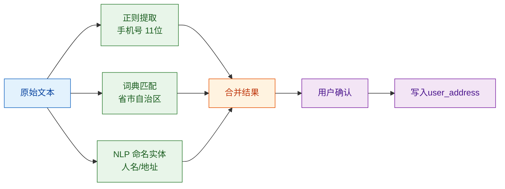

### 13.8.3 地址簿 CRUD Java 实现

```java
/**
 * 用户地址簿服务
 * 极购:小美管理 5 个收货地址
 */
@Service
public class AddressService {

    @Autowired private UserAddressDao addressDao;
    @Autowired private CryptoService cryptoService;  // AES 加密

    public Long addAddress(long uid, AddressDTO dto) {
        // 1. AES 加密手机号
        String phoneEnc = cryptoService.encrypt(dto.getPhone());

        // 2. 默认地址处理(如果当前没有默认,这条设为默认)
        int hasDefault = addressDao.countDefault(uid);
        boolean isDefault = (hasDefault == 0);

        // 3. 入库
        UserAddress addr = new UserAddress();
        addr.setUid(uid);
        addr.setReceiver(dto.getReceiver());
        addr.setPhone(phoneEnc);
        addr.setProvince(dto.getProvince());
        addr.setCity(dto.getCity());
        addr.setDistrict(dto.getDistrict());
        addr.setStreet(dto.getStreet());
        addr.setIsDefault(isDefault ? 1 : 0);
        addressDao.insert(addr);
        return addr.getId();
    }

    public void setDefault(long uid, long addressId) {
        // 先取消所有默认,再设置新默认(保证只有1个默认)
        addressDao.clearAllDefault(uid);
        addressDao.setDefault(addressId);
    }

    public void deleteAddress(long uid, long addressId) {
        // 删除前检查是否默认
        UserAddress addr = addressDao.findById(addressId);
        if (addr == null || addr.getUid() != uid) {
            throw new BizException("ADDR_001", "地址不存在");
        }
        addressDao.deleteById(addressId);
        // 如果删的是默认,自动把最早的一条设为默认
        if (addr.getIsDefault() == 1) {
            UserAddress first = addressDao.findEarliestByUid(uid);
            if (first != null) {
                addressDao.setDefault(first.getId());
            }
        }
    }

    public List<AddressVO> listByUid(long uid) {
        List<UserAddress> list = addressDao.listByUid(uid);
        return list.stream().map(a -> {
            AddressVO vo = new AddressVO();
            BeanUtils.copyProperties(a, vo);
            // 解密手机号
            vo.setPhone(cryptoService.decrypt(a.getPhone()));
            // 138****1234 脱敏
            vo.setPhoneMasked(maskPhone(vo.getPhone()));
            return vo;
        }).collect(Collectors.toList());
    }

    private String maskPhone(String phone) {
        if (phone == null || phone.length() < 11) return phone;
        return phone.substring(0, 3) + "****" + phone.substring(7);
    }
}
```

**关键设计**：
- **手机号 AES 加密存储**（即使数据库泄露，攻击者拿不到明文）。
- **API 返回脱敏**（138****1234）。
- **默认地址唯一约束**（取消旧的 + 设置新的）。
- **删除默认时自动选最早**（避免"没有默认地址"的尴尬）。

---

## 13.9 实名认证

### 13.9.1 为什么需要实名

- **法规要求**：跨境海淘、奢侈品、虚拟商品、处方药、金融类商品需要实名。
- **风控需要**：打击羊毛党（一人多号）、反洗钱、大额支付。
- **物流需要**：危险品、生鲜冷链。

### 13.9.2 公安二要素核验

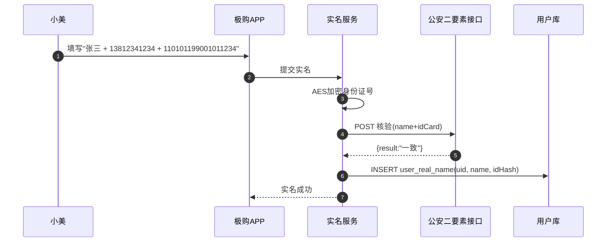

**数据模型**：

```sql
CREATE TABLE user_real_name (
    id             BIGINT       NOT NULL AUTO_INCREMENT,
    uid            BIGINT       NOT NULL               COMMENT '用户ID',
    real_name_enc  VARBINARY(256) NOT NULL            COMMENT '真实姓名(AES加密)',
    id_card_enc    VARBINARY(512) NOT NULL            COMMENT '身份证(AES加密)',
    id_card_hash   CHAR(64)     NOT NULL               COMMENT '身份证SHA-256(用于唯一索引)',
    verified_at    DATETIME     NOT NULL               COMMENT '核验通过时间',
    verify_channel VARCHAR(32)  NOT NULL               COMMENT '公安二要素/银行四要素',
    PRIMARY KEY (id),
    UNIQUE KEY uk_uid (uid),
    UNIQUE KEY uk_id_hash (id_card_hash)
) ENGINE=InnoDB DEFAULT CHARSET=utf8mb4 COMMENT='用户实名';
```

**隐私保护要点**：

| 设计 | 说明 |
|------|------|
| 身份证号 AES 加密 | 数据库泄露也拿不到明文 |
| SHA-256 哈希做唯一索引 | 防止"一人多号"，但不可逆推 |
| 真实姓名 + 身份证 不参与业务查询 | 业务方只查"是否已实名" |
| 公安接口走专线 + 双向证书 | 防窃听、防重放 |
| 访问实名表需独立审批 | DBA 单独授权 |

### 13.9.3 PIPL 合规

PIPL（《个人信息保护法》）要求：

- **最小必要**：实名信息仅用于法律法规要求的场景。
- **明示同意**：注册时勾选《实名协议》。
- **单独同意**：人脸、身份证号等敏感信息需要"单独"勾选同意。
- **可撤回**：用户可随时关闭实名，关闭后删除加密数据。

---

## 13.10 用户标签与画像

### 13.10.1 标签分类

| 维度 | 标签示例 | 数量 | 极购示例 |
|------|---------|------|---------|
| 基础属性 | 性别/年龄/地域/职业/婚育 | ~30 | 上海/24岁/未婚 |
| 行为属性 | 浏览/加车/收藏/搜索 | ~50 | 美妆控、零食控 |
| 兴趣属性 | 类目偏好/品牌偏好/价格敏感度 | ~80 | 兰蔻/欧莱雅/百元以下 |
| 消费能力 | 客单价/频次/GMV 等级 | ~10 | 月消费 1000-3000 |
| 生命周期 | 新客/老客/流失/唤回 | ~5 | 老客(>1年) |
| 营销属性 | 优惠券敏感度/活动参与度 | ~20 | 秒杀爱好者 |

### 13.10.2 标签生产链路

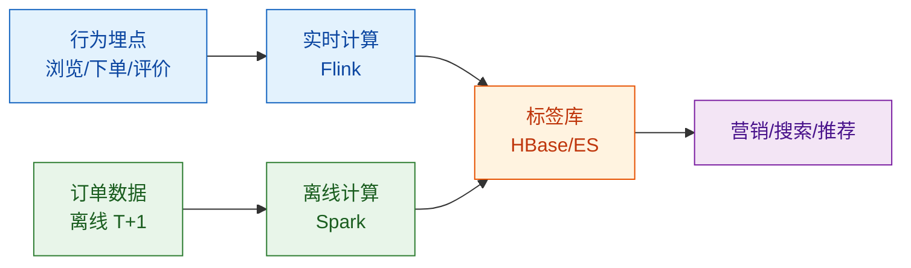

**小美的画像示例**：

```json
{
  "uid": 8392100000123456,
  "base": {"gender": "女", "age": 24, "city": "上海"},
  "behavior": {
    "favorite_cat": ["美妆", "零食", "家居"],
    "favorite_brand": ["兰蔻", "欧莱雅", "三只松鼠"],
    "price_sensitive": "中"
  },
  "consumption": {
    "monthly_avg": 1500,
    "monthly_orders": 8,
    "gmv_level": "L3"
  },
  "lifecycle": {"stage": "成熟期", "register_days": 800},
  "marketing": {
    "coupon_sensitive": 0.8,
    "seckill_participant": true,
    "vip_active": true
  }
}
```

> 标签体系详见第 17 章「数据中台与 BI」。

---

## 13.11 隐私合规

### 13.11.1 法律框架

| 法律 | 适用 | 关键要求 |
|------|------|---------|
| **PIPL（个人信息保护法）** | 中国大陆 | 最小必要、告知同意、单独同意、可删除 |
| **GDPR** | 欧盟用户 | 数据可携（Data Portability）、被遗忘权、72 小时通报 |
| **CCPA** | 加州用户 | 知情权、删除权、退出销售 |
| **网络安全法** | 中国大陆 | 等保 2.0、关键信息基础设施 |
| **数据安全法** | 中国大陆 | 数据分类分级、跨境安全评估 |

### 13.11.2 极购的合规体系

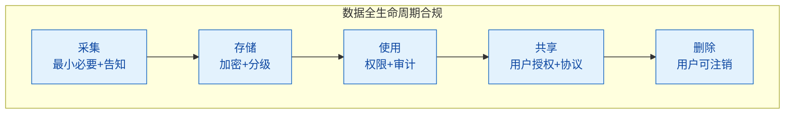

### 13.11.3 用户注销流程（PIPL「被遗忘权」）

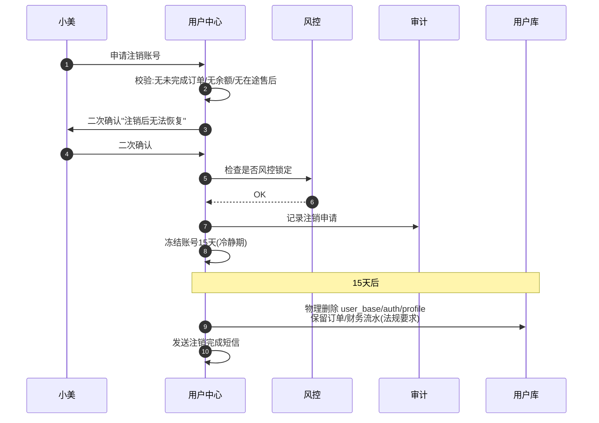

**关键点**：
- **冷静期 15 天**：避免用户冲动注销（参考 Instagram 30 天、微信 15 天）。
- **保留财务**：订单、发票、退款记录**不能删**（税务要求保留 10 年）。
- **数据脱敏**：个人可识别信息（PII）字段做不可逆处理。

### 13.11.4 隐私数据流图

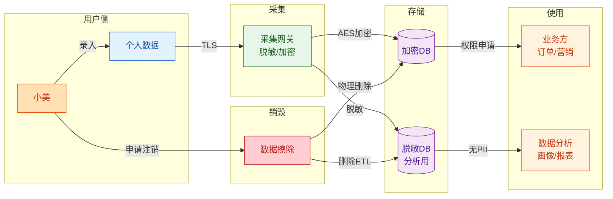

---

## 13.12 用户中心与上下游

用户中心是整个商城的"用户域"，与 6 大业务域都有协作：

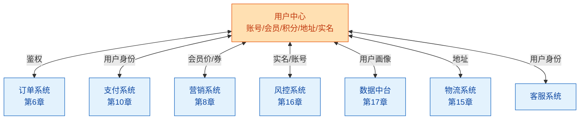

**典型调用场景**：

| 场景 | 上游 | 下游 | 调用 |
|------|------|------|------|
| 下单 | 订单系统 | 用户中心 | 校验 token + 读地址 + 读会员等级 |
| 支付 | 支付系统 | 用户中心 | 校验实名（大额） |
| 领券 | 营销系统 | 用户中心 | 校验会员等级 V3+ |
| 风控 | 风控系统 | 用户中心 | 查账号注册时间/历史黑名单 |
| 营销推送 | 营销系统 | 用户中心 | 查用户标签、画像 |
| 物流 | 物流系统 | 用户中心 | 查收货地址 |
| 客服 | 客服系统 | 用户中心 | 查用户订单/会员/地址/实名（脱敏） |

---

## 13.13 典型问题

### 13.13.1 撞库攻击

**场景**：黑客用网上泄露的「邮箱+密码」批量尝试登录极购。

**防御**：

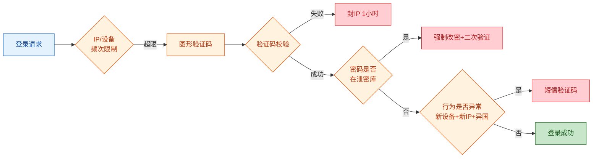

**关键措施**：
- **密码 hash 存 BCrypt**（不是 MD5，MD5 太容易被彩虹表反查）。
- **泄露密码库比对**：对接「Have I Been Pwned」等公开泄密库。
- **异地登录二次验证**：新设备 + 新地理位置 → 短信验证码。
- **账号风控**：同 IP 1 分钟 10 次失败 → 封 IP。

### 13.13.2 短信轰炸

**场景**：黑客调用极购的"发送短信验证码"接口狂发，1 小时发 10 万条，欠费数十万。

**防御**：
- **图形验证码**：发短信前必须通过图形验证码。
- **同号码 60 秒只能发 1 条**。
- **同号码每天最多 10 条**。
- **同 IP 每天最多 100 条**。
- **国际号码不发**（+00 开头拒发）。
- **风控接入**：行为异常（无来源页面、批量 IP）→ 直接拒绝。

### 13.13.3 账号盗用

**场景**：小美的密码被钓鱼网站泄露，黑客登录极购后修改密码、提现余额。

**防御**：
- **敏感操作二次验证**：改密码、换手机号、提现 → 短信验证码 + 人脸识别。
- **异地登录提醒**：登录短信通知。
- **登录设备管理**：用户可查看"已登录设备"，一键下线。
- **余额/积分变动通知**：提现、积分兑换 → 实时通知。
- **冻结机制**：5 分钟内多次失败 → 账号冻结 1 小时。

### 13.13.4 实名信息泄露

**场景**：内部员工或外包查询大量小美的实名信息贩卖。

**防御**：
- **最小可见原则**：业务方只查"是否已实名"，不返回姓名/身份证。
- **专项审批**：查实名明文需安全部门审批 + 全链路审计。
- **脱敏展示**：客服系统只能看到"张\*三 + 110101\*\*\*\*\*\*\*\*1234"。
- **水印 + 截屏追溯**：敏感页面带员工 ID 水印。
- **离职审计**：员工离职前清空所有访问权限。

---

## 13.14 概念速查

| 概念 | 解释 |
|------|------|
| **uid** | 极购用户唯一 ID，Snowflake 生成，Long 型 |
| **session** | 服务端会话，传统 Web 用 |
| **JWT** | JSON Web Token，无状态令牌 |
| **Access Token** | 短时效令牌，2 小时过期 |
| **Refresh Token** | 长时效令牌，30 天过期，用于换新 access |
| **OAuth 2.0** | 第三方授权协议 |
| **OIDC** | OpenID Connect，OAuth + 身份层 |
| **Snowflake** | Twitter 64 bit 分布式 ID 算法 |
| **V1-V8** | 极购 8 级会员体系 |
| **成长值** | 消费 1 元 = 1 成长值 |
| **公安二要素** | 姓名 + 身份证号，公安接口核验 |
| **PIPL** | 中国《个人信息保护法》 |
| **GDPR** | 欧盟《通用数据保护条例》 |
| **PII** | Personally Identifiable Information，个人可识别信息 |
| **被遗忘权** | PIPL/GDPR 要求，用户可申请删除数据 |

---

## 本章小结

本章详细介绍了电商用户中心与会员体系的设计与实现，主要内容包括：

1. **用户中心职责**
   - 账号域、会员域、积分域、地址域、认证域、合规域六大职责
   - 极购 3 亿用户 / 1500 万 DAU 的规模基准

2. **账号体系**
   - 5 种注册方式 + 5 种登录方式
   - 一键登录（本机号码）原理
   - 多端登录 + 踢人策略

3. **用户 ID 生成**
   - Snowflake 64 bit 位分配（1+41+10+12）
   - 完整 Java 实现含时钟回拨检测
   - uid 转 String 防止 JS 精度丢失

4. **用户数据模型**
   - `user_base`（基础）、`user_auth`（认证）、`user_profile`（画像）三表分离
   - 完整 SQL（DDL）

5. **登录态演进**
   - Cookie+Session → JWT → Token+Refresh → OAuth 2.0 → OIDC
   - 极购采用 Access Token + Refresh Token
   - 完整 JWT 签发校验 Java 代码

6. **会员体系**
   - 8 级会员、成长值阈值、权益矩阵
   - 成长值 MQ 异步变更 + 升级
   - 完整 Java 实现

7. **积分体系**
   - 积分获取 / 消费 / 过期
   - 4 道防刷防线

8. **地址簿**
   - 数据模型 + 智能识别
   - AES 加密 + 默认地址处理
   - 完整 Java CRUD 代码

9. **实名认证**
   - 公安二要素核验流程
   - 隐私保护设计（AES + SHA-256）

10. **用户标签与画像**
    - 5 大类标签、生产链路

11. **隐私合规**
    - PIPL、GDPR、CCPA
    - 注销流程 + 数据流图

12. **用户中心与上下游**
    - 与订单、支付、营销、风控的协作矩阵

13. **典型问题**
    - 撞库、短信轰炸、账号盗用、实名泄露

---

## 思考题

1. **设计题**：极购要支持 3 亿用户、30 万登录 QPS，请设计 Snowflake 部署方案：需要多少个数据中心？每个数据中心多少台机器？机器 ID 怎么分配？时钟回拨 50ms 时怎么处理？

2. **场景题**：小美在 iOS 登录后，又在 Android 登录。极购应不应该踢掉 iOS？为什么？踢人策略如何设计（最旧踢？最新踢？同设备类型优先）？

3. **安全题**：极购数据库泄露 1 亿条 `user_auth` 记录（含手机号 BCrypt hash + 密码 BCrypt hash），请评估：哪些字段会被破解？为什么？补救措施有哪些？

4. **架构题**：用户中心的高可用方案：登录服务 Redis 主挂了怎么办？用户认证数据库挂了怎么"降级登录"（比如只校验手机号 + 短信码）？

5. **合规题**：极购要在欧洲开展业务（GDPR 适用），请设计跨境数据传输方案：哪些数据可以出境？哪些不可以？需要什么合规手续（标准合同条款/SCC、约束性公司规则/BCR）？

6. **产品题**：如果你是极购会员产品经理，会员体系从 8 级简化到 5 级（保留 V2/V3/V5/V7/V8），用户会有什么反应？流失率会变化吗？请用数据估算。

7. **代码题**：请实现"地址簿导入历史订单"功能——小美在结算页选择收货地址时，希望看到"上次用过的 5 个地址"按频次倒序。请设计这个接口的 SQL + 缓存策略。

---

**下一章**：[第 14 章 · 商家与商家后台](./14-商家与商家后台.md)

---

## 参考来源

- 《个人信息保护法》（PIPL）全文：http://www.gov.cn/xinwen/2021-08/20/content_5632486.htm
- 《通用数据保护条例》（GDPR）官方文本：https://gdpr-info.eu/
- RFC 6749 - The OAuth 2.0 Authorization Framework：https://datatracker.ietf.org/doc/html/rfc6749
- RFC 7519 - JSON Web Token (JWT)：https://datatracker.ietf.org/doc/html/rfc7519
- OpenID Connect Core 1.0：https://openid.net/specs/openid-connect-core-1_0.html
- Twitter Snowflake 64 bit 分布式 ID：https://github.com/twitter-archive/snowflake
- 极客时间《从 0 开始学架构》— 用户体系
- 字节跳动技术沙龙 —《亿级用户系统的账号设计》
- 美团技术团队 —《用户画像实践》
- 阿里云《PIPL 合规白皮书》
- 微信开放平台 — 一键登录技术文档：https://developers.weixin.qq.com/miniprogram/dev/framework/open-ability/getPhoneNumber.html
- 中国移动认证 (本机号码一键登录)：https://dev.10086.cn/dev10086/home
- 阿里云实名认证（公安二要素）：https://market.aliyun.com/products/57002003/cmapi020020.html
- OWASP Authentication Cheat Sheet：https://cheatsheetseries.owasp.org/cheatsheets/Authentication_Cheat_Sheet.html
