# 第 14 章 · 商家与商家后台

> **所属系列**：商城平台系统设计 · 全景教程
>
> **上一章**：[第 13 章 · 用户中心与会员体系](./13-用户中心与会员体系.md)　|　**下一章**：[第 15 章 · 物流与配送系统](./15-物流与配送系统.md)　|　**总目录**：[教程大纲](./00-教程大纲.md)

---

## 本章导读

小美在「极购商城」下单了一件潮牌 T 恤 110 元后,后台有一连串系统开始工作:**商家工作台给老王推送"待发货"提醒**、**库存中心锁定 1 件**、**电子面单服务调用顺丰接口生成运单**、**结算中心累计老王 99 元的应收**。而这一切的起点,都来自一年前老王**入驻极购**的那一天。

老王原本在杭州武林路开了一家 30 平米的潮牌小店,3 年前决定入驻极购开线上旗舰店「王的潮品」。他经历了这样一段旅程:

- **提交资料**:营业执照、法人身份证、对公账户、商标注册证;
- **平台审核**:实名核验、人工复核、复用电商资质快速通过;
- **签署合同**:在线签订《极购平台服务协议》;
- **缴费**:缴纳保证金 5 万元 + 技术服务费 6000 元/年;
- **上线开店**:第 7 天,「王的潮品」正式营业,上架第一款 T 恤。

3 年后的今天,「王的潮品」已经有 2000+ SKU、3 个仓库、2 个客服小组(组长小王带领 8 个客服),日均订单 1500 单。老王的主账号下面挂着 8 个子账号,**客服小王**只有「查看订单、回复咨询、发起售后」的权限,看不到「结算账单」和「员工管理」;**运营阿明**能管商品、改价格、做营销活动,但不能提现。

这就是本章要讲的核心:商城平台**对商家的供给侧**——商家怎么进来、进来后用什么工具干活、活干完了钱怎么结、数据怎么打通、风险怎么管。

「极购商城」共有 **50 万商家、200 万商家员工**。商家后台每天承载 1.2 亿次操作,商家主账号和子账号的权限分离直接关系到**资金安全和数据安全**。

本章主要内容:

1. **商家体系全景**——商家类型、店铺形态、自营 vs POP
2. **商家入驻流程**——资质提交、审核、合同、缴费、上线
3. **商家后台核心功能**——工作台、商品/库存/订单/营销/数据/客服/财务
4. **商家后台架构图**——前后端、微服务、中台化
5. **ERP 集成**——库存/价格/商品同步、订单回流、API 列表
6. **批量操作**——Excel 导入、批量改价、批量发货
7. **子账号与权限**——角色矩阵、细粒度权限、审计
8. **结算与对账**——T+7 账期、平台扣点、商家账、提现
9. **发票管理**——商家发票、平台发票
10. **商家服务市场**——第三方 ERP/CRM、API 开放平台
11. **商家风控**——虚假发货、刷单、套现、拒开发票
12. **商家成长体系**——等级、服务分、流量倾斜
13. **易错点与反模式**

读完本章你将能回答:**为什么 50 万商家必须有独立的"商家中台"?为什么子账号权限必须做到"按钮级"?为什么结算系统既要对账内、又要对账外?**

---

## 14.1 商家体系全景

### 14.1.1 商家是平台的供给侧命脉

在 C2C、B2C 电商平台中,**商家是商品和服务的实际提供者**。消费者侧的繁荣(小美的 110 元订单),本质上是商家侧的繁荣(老王愿意开店、能赚到钱)的镜像。

如果商家侧工具低劣(后台卡顿、上架复杂、对账不清晰),商家会用脚投票去其他平台。**留住商家 = 留住商品 = 留住消费者**,这是平台商业模式的基本闭环。

「极购商城」50 万商家、200 万商家员工(每商家平均 4 个子账号)的规模,商家后台每天的活跃度甚至超过 To C 端——商家工作日 8 小时内几乎不间断操作,大促期间日均操作量是平日的 5 倍。

### 14.1.2 商家类型矩阵

「极购」按**主体资质**和**店铺形态**两个维度划分商家:

| 维度 | 类型 | 资质要求 | 典型案例 |
|------|------|---------|---------|
| **主体资质** | 个人店 | 身份证 + 银行卡 | 个体手工艺者 |
| | 个体工商户 | 营业执照(个体户)+ 法人身份证 | 小型潮牌店 |
| | 企业店 | 营业执照(公司)+ 对公账户 + 商标 | 「王的潮品」(老王) |
| **店铺形态** | 品牌旗舰店 | 自有品牌 R 商标 | Nike 旗舰店 |
| | 品牌专卖店 | 单一品牌授权 | 「王的潮品」潮牌授权店 |
| | 品牌专营店 | 多品牌经营 | 综合服装店 |
| **经营模式** | POP(Platform Open Plan) | 商家自主经营,平台抽佣 | 绝大多数第三方商家 |
| | 自营 | 平台自营,商家是供应商 | 极购自营仓发货商品 |
| | 混合 | 部分自营 + 部分 POP | 大型 KA 商家 |

老王的「王的潮品」是典型的**企业店 + 品牌专卖店 + POP 模式**:他获得了某潮牌的品牌方授权,作为授权专卖店在极购经营,自负盈亏,极购按销售额抽取佣金。

### 14.1.3 自营与 POP 的本质区别

| 对比维度 | 自营 | POP(第三方) |
|---------|------|-------------|
| 商品所有权 | 平台 | 商家 |
| 库存归属 | 平台仓库 | 商家自有仓 / 平台仓 |
| 价格制定 | 平台 | 商家 |
| 营销活动 | 平台统一 | 商家自主 + 平台活动 |
| 物流配送 | 平台统一履约 | 商家发货 / 平台仓代发 |
| 结算方式 | 平台内循环 | 平台 → 商家定期结算 |
| 收入模式 | 销售差价 | 佣金 + 广告费 + 服务费 |
| 商家议价权 | 弱(平台强势) | 强(头部商家) |
| 风险承担 | 平台 | 商家为主,平台为辅 |

老王作为 POP 商家,需要管理:商品上下架、库存、客服、发货、营销、税务、账期——**几乎是一个小型电商公司的全部职能**。商家后台就是把这一整套职能数字化,给商家一个"数字门店"。

---

## 14.2 商家入驻流程

### 14.2.1 入驻流程概览

老王 3 年前打开极购商家入驻页面 `seller.jigou.com/join`,经历了一个完整的 7 步流程:

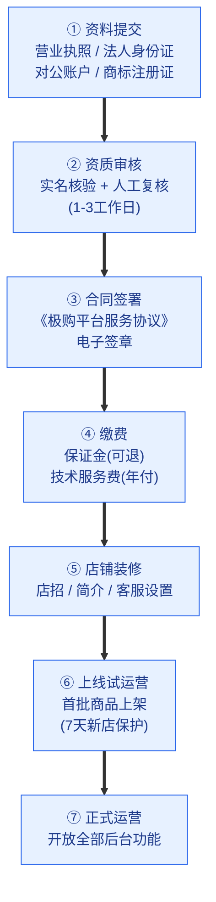

老王从提交资料到正式上线用了 **7 个工作日**,主要是人工审核占用了 3 天。

### 14.2.2 资料提交

商家通过 `seller.jigou.com/join` 提交四类核心资质:

| 资料类型 | 具体材料 | 校验方式 | 失败处理 |
|---------|---------|---------|---------|
| **主体资质** | 营业执照(企业/个体户) | OCR 识别 + 工商系统对接核验 | 提示重新上传 |
| **法人信息** | 法人身份证正反面、人脸活体 | 公安系统实名核验 | 提示非法人本人 |
| **银行账户** | 对公账户开户许可证 | 银行小额打款验证(0.01-0.99 元) | 提示打款金额错误 |
| **品牌资质** | 商标注册证 / 品牌授权书 | 商标局系统核验 | 提示授权链不完整 |

**OCR + 工商系统对接**是 2020 年后的标配,大幅降低了人工审核的工作量。原本需要 2 个工作日的人工核对,现在 5 分钟内自动完成,人工只处理系统判定存疑的"灰名单"。

### 14.2.3 平台审核

审核分为**机审**和**人审**两个阶段:

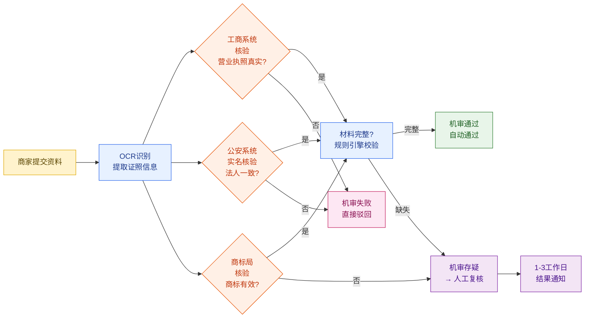

**复用电商资质快速通道**:极购和天猫、京东、拼多多等平台打通了**「一证通」**。老王如果在其他平台已开店且信用良好,可以一键授权复用其他平台的资质,免审核直接通过(这是 2022 年后的新机制)。这大幅降低了头部品牌商的跨平台开店成本。

### 14.2.4 合同签署与缴费

合同签署使用**电子签章**服务(对接 e签宝 / 法大大),具有法律效力。合同内容自动根据商家类型生成(企业店、个体店、个人店的合同模板不同)。

缴费项目:

| 收费项 | 金额 | 性质 | 退还规则 |
|--------|------|------|---------|
| **保证金** | 1 万 - 30 万(按类目) | 可退 | 关店且无未结事务时,30 天内原路退回 |
| **技术服务费** | 3000-12000 元/年(按类目) | 年付 | 不退 |
| **平台使用费** | 部分类目 600 元/月 | 月付 | 不退 |
| **广告费(可选)** | 充值,按消耗 | 自愿 | 余额可退 |

老王的「王的潮品」属于服饰类目,保证金 5 万元 + 技术服务费 6000 元/年。

### 14.2.5 商家表 SQL

```sql
-- 商家主表(完整可运行)
CREATE TABLE merchant (
    id BIGINT UNSIGNED PRIMARY KEY AUTO_INCREMENT COMMENT '商家ID',
    merchant_no VARCHAR(32) NOT NULL UNIQUE COMMENT '商家编号(业务唯一)',
    merchant_name VARCHAR(64) NOT NULL COMMENT '商家名称(如:王的潮品旗舰店)',
    shop_name VARCHAR(64) NOT NULL COMMENT '店铺名称(展示用)',
    shop_logo_url VARCHAR(256) COMMENT '店招URL',

    -- 主体资质
    merchant_type TINYINT NOT NULL COMMENT '商家类型:1个人 2个体工商户 3企业',
    shop_type TINYINT NOT NULL COMMENT '店铺类型:1品牌旗舰店 2专卖店 3专营店',
    business_mode TINYINT NOT NULL COMMENT '经营模式:1自营 2POP 3混合',

    -- 证照信息(脱敏存储)
    business_license_no VARCHAR(64) COMMENT '营业执照编号',
    business_license_url VARCHAR(256) COMMENT '营业执照图片URL',
    legal_person_name VARCHAR(32) COMMENT '法人姓名(脱敏)',
    legal_person_id_card VARCHAR(32) COMMENT '法人身份证号(AES加密)',
    legal_person_id_card_url VARCHAR(256) COMMENT '身份证图片URL',
    bank_account VARCHAR(32) COMMENT '对公账户(AES加密)',
    bank_name VARCHAR(64) COMMENT '开户行',
    trademark_no VARCHAR(64) COMMENT '商标注册号',
    trademark_url VARCHAR(256) COMMENT '商标注册证URL',
    brand_authorization_url VARCHAR(256) COMMENT '品牌授权书URL',

    -- 联系方式
    contact_name VARCHAR(32) NOT NULL COMMENT '联系人姓名',
    contact_phone VARCHAR(20) NOT NULL COMMENT '联系电话',
    contact_email VARCHAR(64) COMMENT '联系邮箱',
    contact_address VARCHAR(256) COMMENT '联系地址',

    -- 类目
    main_category_id BIGINT NOT NULL COMMENT '主营类目ID',
    sub_category_ids VARCHAR(512) COMMENT '副营类目ID列表,逗号分隔',

    -- 状态
    status TINYINT NOT NULL DEFAULT 0 COMMENT '状态:0待审核 1审核中 2已通过待缴费 3营业中 4已暂停 5已关闭 6审核拒绝',
    audit_status TINYINT NOT NULL DEFAULT 0 COMMENT '审核状态:0未提交 1机审通过 2人工通过 3机审拒绝 4人审拒绝',
    audit_reason VARCHAR(512) COMMENT '审核拒绝原因',
    audited_at DATETIME COMMENT '审核完成时间',
    audited_by VARCHAR(64) COMMENT '审核人(运营工号)',

    -- 缴费
    deposit_amount DECIMAL(12,2) DEFAULT 0.00 COMMENT '保证金金额',
    deposit_paid_at DATETIME COMMENT '保证金支付时间',
    deposit_refund_status TINYINT DEFAULT 0 COMMENT '保证金退款状态:0未退 1退款中 2已退',
    tech_service_fee DECIMAL(10,2) DEFAULT 0.00 COMMENT '年技术服务费',
    tech_service_expire_at DATETIME COMMENT '技术服务费到期时间',

    -- 等级
    merchant_level TINYINT DEFAULT 1 COMMENT '商家等级:1-5星',
    service_score DECIMAL(4,2) DEFAULT 5.00 COMMENT '服务分(DSR)0-5',
    total_score INT DEFAULT 0 COMMENT '综合评分',

    -- 时间
    created_at DATETIME NOT NULL DEFAULT CURRENT_TIMESTAMP,
    updated_at DATETIME NOT NULL DEFAULT CURRENT_TIMESTAMP ON UPDATE CURRENT_TIMESTAMP,
    opened_at DATETIME COMMENT '正式开业时间',
    closed_at DATETIME COMMENT '关店时间',

    INDEX idx_status (status),
    INDEX idx_merchant_type (merchant_type),
    INDEX idx_main_category (main_category_id),
    INDEX idx_merchant_level (merchant_level)
) ENGINE=InnoDB DEFAULT CHARSET=utf8mb4 COMMENT='商家主表';
```

### 14.2.6 商家员工表 SQL

```sql
-- 商家员工(子账号)表
CREATE TABLE merchant_employee (
    id BIGINT UNSIGNED PRIMARY KEY AUTO_INCREMENT,
    merchant_id BIGINT UNSIGNED NOT NULL COMMENT '所属商家ID',
    employee_no VARCHAR(32) NOT NULL UNIQUE COMMENT '员工编号',
    username VARCHAR(64) NOT NULL COMMENT '登录账号(手机号/邮箱)',
    password_hash VARCHAR(128) NOT NULL COMMENT '密码哈希(bcrypt)',
    real_name VARCHAR(32) NOT NULL COMMENT '真实姓名',

    -- 角色
    role_code VARCHAR(32) NOT NULL COMMENT '角色编码:OWNER店主 MANAGER店长 CUSTOMER_SERVICE客服 OPERATION运营 FINANCE财务',
    is_owner TINYINT(1) DEFAULT 0 COMMENT '是否店主:1是 0否',

    -- 联系方式
    phone VARCHAR(20) NOT NULL,
    email VARCHAR(64),
    avatar_url VARCHAR(256),

    -- 权限(细粒度,JSON存储)
    permissions JSON COMMENT '细粒度权限列表,详见14.7',

    -- 状态
    status TINYINT NOT NULL DEFAULT 1 COMMENT '状态:1正常 2停用 3离职',
    last_login_at DATETIME COMMENT '最后登录时间',
    last_login_ip VARCHAR(64) COMMENT '最后登录IP',
    password_updated_at DATETIME COMMENT '密码修改时间',
    must_change_password TINYINT(1) DEFAULT 0 COMMENT '是否需要强制改密',

    created_at DATETIME NOT NULL DEFAULT CURRENT_TIMESTAMP,
    updated_at DATETIME NOT NULL DEFAULT CURRENT_TIMESTAMP ON UPDATE CURRENT_TIMESTAMP,
    created_by BIGINT UNSIGNED COMMENT '创建人ID',

    INDEX idx_merchant_id (merchant_id),
    INDEX idx_username (username),
    INDEX idx_role_code (role_code),
    INDEX idx_status (status)
) ENGINE=InnoDB DEFAULT CHARSET=utf8mb4 COMMENT='商家员工表';
```

---

## 14.3 商家后台架构与核心功能

### 14.3.1 商家后台整体架构

商家后台(`seller.jigou.com`)是一个**B 端 Web + App 矩阵**,承载了 50 万商家、200 万员工的日常工作。它不是一个简单的"网页",而是一个**完整的中台系统**。

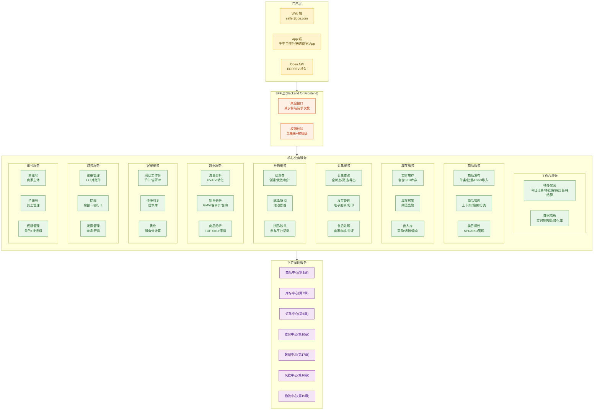

### 14.3.2 工作台(Workspace)——商家每天的入口

商家每天打开后台,第一个看到的就是**工作台**。它是商家全店运营状况的"驾驶舱"。

| 卡片 | 数据来源 | 业务含义 | 行动建议 |
|------|---------|---------|---------|
| **今日订单** | 订单中心 | 今日产生的订单数 | 点击进入订单列表 |
| **待发货** | 订单中心 | 已支付未发货,需 24h 内发货 | 一键批量发货 |
| **待回复** | 客服中心 | 消费者咨询未回复 | 进入客服工作台 |
| **待结算** | 财务中心 | 累计可结算金额 | 申请提现 |
| **店铺 DSR** | 评价中心 | 近 30 天服务分 | 改进短板 |
| **违规提醒** | 风控中心 | 待处理违规单 | 申诉或整改 |
| **库存预警** | 库存中心 | 库存低于阈值的 SKU | 立即补货 |
| **营销活动** | 营销中心 | 进行中的活动 | 查看效果 |

老王的工作台每天早上 9 点最忙——他会先看"待发货"卡片(昨天 1500 单还没发完),然后切到"待回复"卡片处理客服升级的复杂咨询,再去看"待结算"卡片申请提现。

### 14.3.3 商品管理

商品管理是商家后台的"重头戏"——80% 的商家每天操作都和商品相关。

| 功能 | 操作 | 典型场景 |
|------|------|---------|
| **发布商品** | 单条/批量发布 | 老王上架新款 T 恤 |
| **编辑商品** | 修改价格、库存、详情、图 | 调价、清库存 |
| **上下架** | 一键上下架 | 大促前下架老款 |
| **批量操作** | Excel 导入导出 | 季末批量下架 200 款 |
| **商品分组** | 自定义分组 | "春夏款"分到一组 |
| **商品复制** | 复制 SKU 快速发布 | 同款不同色 |
| **图片空间** | 上传/管理图片 | 一次上传多次使用 |
| **视频空间** | 短视频/详情视频 | 提升转化率 |

### 14.3.4 库存管理

库存管理是商家最容易"翻车"的地方——超卖 1 件就可能损失 1 个差评。

| 功能 | 说明 |
|------|------|
| **实时库存** | 各仓各 SKU 实时数量,同步 ERP |
| **库存预警** | 库存 < 阈值时告警(可短信/微信推送) |
| **库存锁定** | 活动期锁仓,防止商品被正常售卖 |
| **出入库** | 采购入库、销售出库、调拨、盘点、报损 |
| **库存调拨** | 多仓之间调拨,改库存归属地 |
| **批次管理** | 生鲜/食品类目需要管理生产批次、保质期 |
| **库存同步 ERP** | 极购库存 → ERP / ERP → 极购 |

老王有 3 个仓库(杭州、广州、济南),「王的潮品」通过 ERP(用 E店管家)统一管理库存,**每小时同步一次**到极购——这是 14.5 节要详细讨论的 ERP 集成场景。

### 14.3.5 订单管理

商家后台的订单管理需要支持**高频查询 + 批量操作**——1500 单/日的商家,客服每天要查询 100+ 次。

| 模块 | 核心功能 |
|------|---------|
| **订单列表** | 多条件筛选(状态/时间/支付方式/收货人),导出 Excel |
| **订单详情** | 商品明细、支付信息、物流信息、买家留言 |
| **发货** | 单条发货 / 批量发货 / 导入单号发货 |
| **修改订单** | 修改收货地址、备注、改快递 |
| **售后处理** | 商家审核(同意/拒绝)、举证(上传凭证)、协商 |
| **批量操作** | 批量发货、批量备注、批量改快递 |

### 14.3.6 营销中心

商家可使用 3 类营销工具:**平台官方工具**(平台开发,商家使用)、**商家自建工具**(商家在后台自助创建)、**第三方 ISV 工具**(服务商市场接入)。

| 营销类型 | 工具 | 商家使用 |
|---------|------|---------|
| **优惠券** | 店铺优惠券、商品优惠券、隐藏券 | 老王发满 200 减 30 拉客 |
| **满减/满折** | 满 100 减 20、满 200 打 8 折 | 大促主玩法 |
| **限时折扣** | 指定时间段打折 | 清库存 |
| **拼团** | 2-3 人成团价 | 社交裂变 |
| **秒杀** | 平台组织商家参与 | 引流款 |
| **搭配套餐** | A+B 组合优惠 | 提升客单价 |
| **赠品** | 满额赠 | 提升转化 |

### 14.3.7 数据中心

商家数据中心是商家"运营优化"的依据——比 To C 端的数据看板更专业,更接近商家 ERP 的分析模块。

| 数据维度 | 核心指标 | 商家使用场景 |
|---------|---------|-------------|
| **流量数据** | UV、PV、跳出率、来源渠道 | 优化直通车/搜索关键词 |
| **转化数据** | 加购率、下单率、支付率 | 优化详情页 |
| **销售数据** | GMV、客单价、笔单价、连带率 | 调整商品结构 |
| **商品分析** | TOP10 SKU、滞销 SKU、商品转化漏斗 | 选品决策 |
| **复购数据** | 复购率、回购周期、客户分层 | 私域运营 |
| **客服数据** | 响应时长、解决率、满意度 | 客服考核 |
| **财务数据** | 实收金额、退款金额、佣金、扣点 | 利润分析 |

### 14.3.8 客服中心

「极购」为商家提供**千牛工作台**——一个独立的 IM 工具,支持 PC 端、移动端,日均承载客服 200 万人在线。

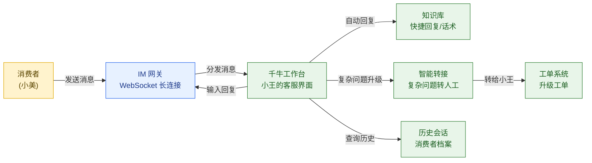

### 14.3.9 财务中心

财务中心是商家最关心的模块之一——老王每天要看的不是 GMV,而是"今天能提现多少"。

| 功能 | 说明 |
|------|------|
| **账期账单** | T+7 / T+15 周期账单(详见 14.8) |
| **实时余额** | 已确认未提现金额 |
| **提现** | 银行卡提现,1-3 工作日到账 |
| **发票** | 申请平台发票、向消费者开发票 |
| **对账单下载** | 按月/按笔下载明细 Excel |
| **保证金** | 保证金缴纳/退还状态 |

---

## 14.4 ERP 集成

### 14.4.1 为什么需要 ERP 集成

对于月销 10 万+ 的中大型商家,商品/库存/订单/物流完全靠人工在极购后台操作**效率极低**。他们使用专业 ERP 系统(如 E店管家、旺店通、店小秘)统一管理多平台、多店铺、多仓库。

**ERP 集成的本质**:把 ERP 作为"真实数据源",极购作为"销售渠道之一"——库存同步、商品同步、订单回流形成一个完整的数据流闭环。

### 14.4.2 ERP 集成数据流

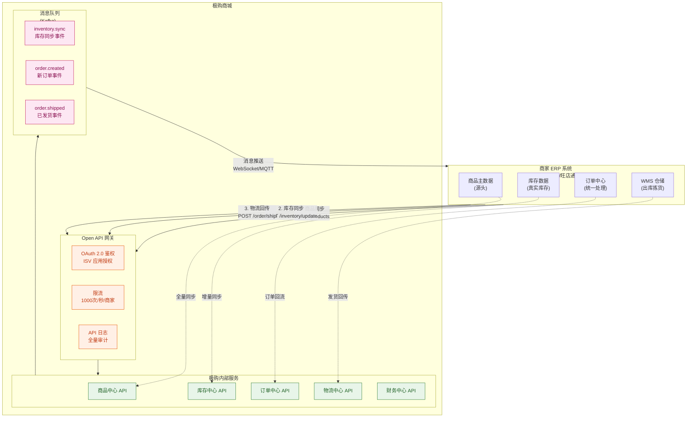

### 14.4.3 Open API 列表(老王 ERP 对接极购)

| API 名称 | HTTP 方法 | 端点 | 用途 | 频率限制 |
|---------|----------|------|------|---------|
| **商品上传** | POST | `/api/v2/products` | ERP 创建商品 | 100/分钟 |
| **商品更新** | PUT | `/api/v2/products/{id}` | 修改价格/库存 | 200/分钟 |
| **商品下架** | DELETE | `/api/v2/products/{id}` | 上下架 | 500/分钟 |
| **库存更新** | POST | `/api/v2/inventory/update` | 同步库存数量 | 1000/分钟 |
| **库存查询** | GET | `/api/v2/inventory?sku=xxx` | 拉取实时库存 | 500/分钟 |
| **订单拉取** | GET | `/api/v2/orders?status=PAID&page=1` | 拉取新订单 | 1000/分钟 |
| **订单发货** | POST | `/api/v2/orders/{id}/ship` | 上传运单号 | 500/分钟 |
| **物流追踪** | GET | `/api/v2/logistics/trace?no=xxx` | 查询物流轨迹 | 1000/分钟 |
| **账单查询** | GET | `/api/v2/finance/bills` | 拉取对账单 | 100/分钟 |
| **退款处理** | POST | `/api/v2/refunds/{id}/agree` | 同意/拒绝退款 | 200/分钟 |
| **消息推送** | Webhook | - | 接收订单/库存变更 | 长连接 |

老王通过这 11 个 API,完成了 ERP 和极购的**双向同步**:商品从 ERP 推到极购,订单从极购回拉到 ERP,库存双向同步保证两边数字一致。

### 14.4.4 库存同步推送 Java 代码

```java
/**
 * 库存同步服务
 * 接收 ERP 推送的库存变更,并更新极购库存中心
 * 关键:幂等性 + 高并发 + 数据一致性
 */
@Service
@Slf4j
public class InventorySyncService {

    @Autowired
    private InventoryRepository inventoryRepository;

    @Autowired
    private KafkaTemplate<String, InventoryChangeEvent> kafkaTemplate;

    @Autowired
    private RedisTemplate<String, String> redisTemplate;

    /**
     * 处理 ERP 推送的库存更新
     * 幂等键:merchant_id + sku_id + warehouse_id + update_time
     */
    @Transactional(rollbackFor = Exception.class)
    public SyncResult handleInventoryUpdate(InventoryUpdateRequest request) {
        // 1. 幂等性校验(防止 ERP 重试导致的重复扣减)
        String idempotentKey = String.format("inv_sync:%d:%d:%d:%d",
                request.getMerchantId(),
                request.getSkuId(),
                request.getWarehouseId(),
                request.getUpdateTimestamp()); // ERP 端的更新时间戳

        Boolean firstTime = redisTemplate.opsForValue()
                .setIfAbsent(idempotentKey, "1", 24, TimeUnit.HOURS);
        if (Boolean.FALSE.equals(firstTime)) {
            log.warn("重复的库存同步请求,幂等键:{}", idempotentKey);
            return SyncResult.duplicate(idempotentKey);
        }

        // 2. 查询当前库存
        Inventory inv = inventoryRepository
                .findByMerchantIdAndSkuIdAndWarehouseId(
                        request.getMerchantId(),
                        request.getSkuId(),
                        request.getWarehouseId())
                .orElseThrow(() -> new InventoryNotFoundException("库存不存在"));

        // 3. 计算新库存(用 ERP 端的库存直接覆盖,这是库存同步的标准做法)
        int oldQty = inv.getAvailableQty();
        int newQty = request.getAvailableQty();
        int delta = newQty - oldQty;

        // 4. 更新 DB
        inv.setAvailableQty(newQty);
        inv.setTotalQty(newQty + inv.getLockedQty()); // 总库存 = 可售 + 锁定
        inv.setUpdateSource(InventorySource.ERP);
        inv.setLastSyncAt(LocalDateTime.now());
        inventoryRepository.save(inv);

        // 5. 同步更新 Redis 缓存(供下单时快速查询)
        String cacheKey = String.format("inv:available:%d:%d:%d",
                request.getMerchantId(), request.getSkuId(), request.getWarehouseId());
        redisTemplate.opsForValue().set(cacheKey, String.valueOf(newQty));

        // 6. 发消息通知下游(订单系统刷新预扣池,推荐系统刷新库存状态)
        InventoryChangeEvent event = new InventoryChangeEvent();
        event.setMerchantId(request.getMerchantId());
        event.setSkuId(request.getSkuId());
        event.setWarehouseId(request.getWarehouseId());
        event.setOldQty(oldQty);
        event.setNewQty(newQty);
        event.setDelta(delta);
        event.setSource(InventorySource.ERP);
        event.setTimestamp(System.currentTimeMillis());
        kafkaTemplate.send("inventory.sync", event);

        log.info("库存同步成功 merchantId={} skuId={} {}→{} delta={}",
                request.getMerchantId(), request.getSkuId(), oldQty, newQty, delta);

        return SyncResult.success(oldQty, newQty);
    }
}
```

### 14.4.5 库存同步的常见坑

| 坑 | 后果 | 解法 |
|----|------|-----|
| **ERP 端库存是延迟数据** | 同步到极购的商品已超卖 | 极购端以下单预扣为准,ERP 同步仅作参考 |
| **多仓库存同步冲突** | 总库存对不上 | 总库存 = 各仓库存求和,不要在极购端再存总库存 |
| **同步频率过高** | API 调用超限 | 增量同步(只推变化量)+ 批量接口 |
| **库存为负** | 出现负库存 | ERP 端校验:可售库存 ≥ 0 |
| **同步链路丢失** | 库存长期不一致 | 对账任务每天巡检两端库存差异 |

---

## 14.5 批量操作

### 14.5.1 为什么需要批量操作

老王季末要**下架 200 款过季 T 恤**——一条一条点要花 2 小时,批量操作 5 分钟搞定。批量操作是商家后台**提升效率的核心**。

### 14.5.2 三大批量场景

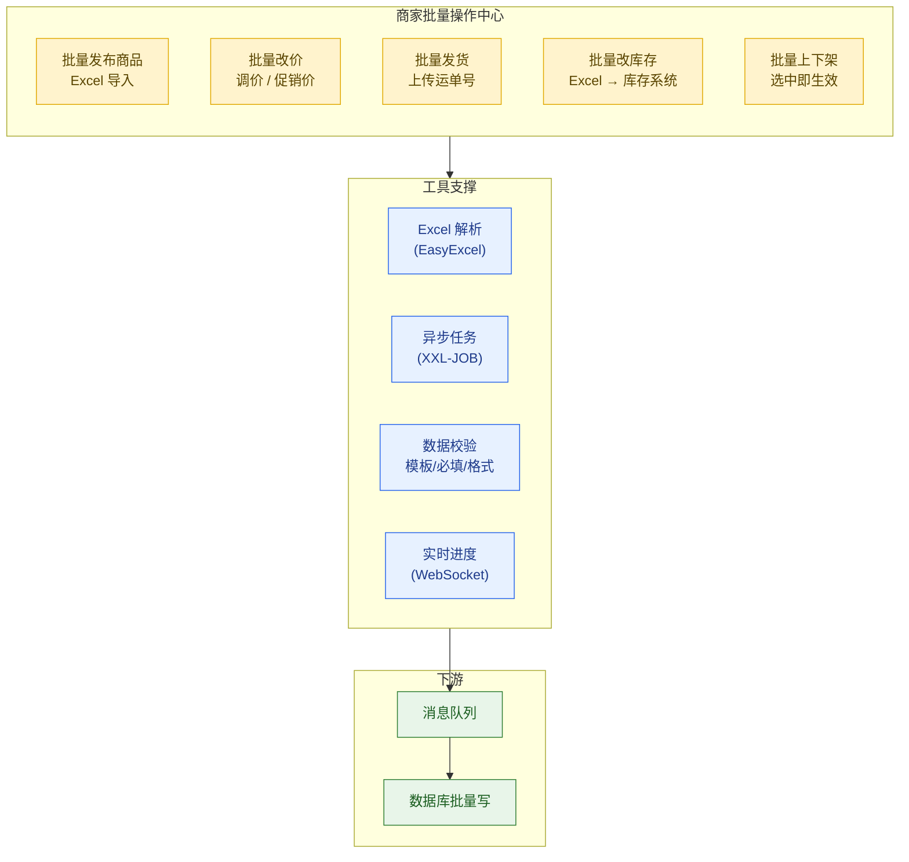

### 14.5.3 商品批量发布(Excel 导入)Java 代码

```java
/**
 * 商品批量发布服务
 * 商家上传 Excel → 解析 → 校验 → 批量入库
 * 单次支持 5000 条商品,异步处理
 */
@Service
@Slf4j
public class BatchProductPublishService {

    @Autowired
    private ProductRepository productRepository;

    @Autowired
    private CategoryService categoryService;

    @Autowired
    private ProductIndexService productIndexService;  // 搜索索引

    @Autowired
    private RedisTemplate<String, Object> redisTemplate;

    /**
     * 1. 商家上传 Excel,生成异步任务
     */
    public BatchTask submitBatchPublish(Long merchantId, MultipartFile excelFile) {
        // 1.1 校验文件
        if (excelFile.getSize() > 50 * 1024 * 1024) {
            throw new BusinessException("EXCEL_TOO_LARGE", "文件不能超过 50MB");
        }

        // 1.2 上传到 OSS
        String ossKey = "merchant/batch/" + merchantId + "/" + UUID.randomUUID() + ".xlsx";
        String fileUrl = ossService.upload(excelFile, ossKey);

        // 1.3 创建任务
        BatchTask task = new BatchTask();
        task.setTaskId(UUID.randomUUID().toString().replace("-", ""));
        task.setMerchantId(merchantId);
        task.setTaskType(BatchTaskType.PRODUCT_PUBLISH);
        task.setFileUrl(fileUrl);
        task.setStatus(BatchTaskStatus.PENDING);
        task.setTotalCount(0);  // 解析后回填
        task.setSuccessCount(0);
        task.setFailedCount(0);
        task.setCreateTime(LocalDateTime.now());
        batchTaskRepository.save(task);

        // 1.4 提交异步任务
        asyncBatchPublishExecutor.execute(() -> processBatchPublish(task.getTaskId()));

        return task;
    }

    /**
     * 2. 异步处理批量发布
     */
    private void processBatchPublish(String taskId) {
        BatchTask task = batchTaskRepository.findByTaskId(taskId);
        task.setStatus(BatchTaskStatus.PROCESSING);
        task.setStartTime(LocalDateTime.now());
        batchTaskRepository.save(task);

        try (InputStream is = ossService.download(task.getFileUrl())) {
            // 2.1 解析 Excel(使用 EasyExcel 流式读取,内存友好)
            List<ProductImportRow> rows = new ArrayList<>();
            EasyExcel.read(is, ProductImportRow.class, new AnalysisEventListener<ProductImportRow>() {
                @Override
                public void invoke(ProductImportRow row, AnalysisContext context) {
                    rows.add(row);
                }
            }).sheet().doRead();

            task.setTotalCount(rows.size());
            batchTaskRepository.save(task);

            // 2.2 批量校验 + 批量入库(每 500 条一批)
            List<String> failedReasons = new CopyOnWriteArrayList<>();
            int batchSize = 500;
            for (int i = 0; i < rows.size(); i += batchSize) {
                List<ProductImportRow> batch = rows.subList(i, Math.min(i + batchSize, rows.size()));

                List<Product> products = batch.parallelStream()
                    .map(row -> {
                        try {
                            return convertToProduct(task.getMerchantId(), row);
                        } catch (Exception e) {
                            failedReasons.add(String.format("第%d行:%s", row.getRowNum(), e.getMessage()));
                            return null;
                        }
                    })
                    .filter(Objects::nonNull)
                    .collect(Collectors.toList());

                // 批量入库
                productRepository.saveAll(products);

                // 批量推搜索索引
                productIndexService.batchIndex(products);

                // 推 Redis 缓存刷新消息
                redisTemplate.convertAndSend("product:cache:refresh",
                    products.stream().map(Product::getId).collect(Collectors.toList()));

                // 更新进度
                int processed = Math.min(i + batchSize, rows.size());
                task.setProcessedCount(processed);
                task.setSuccessCount(task.getSuccessCount() + products.size());
                task.setFailedCount(task.getFailedCount() + (batch.size() - products.size()));
                batchTaskRepository.save(task);

                // 推送实时进度(WebSocket)
                pushProgress(task);
            }

            // 2.3 完成
            task.setStatus(BatchTaskStatus.COMPLETED);
            task.setEndTime(LocalDateTime.now());
            task.setFailedReasons(failedReasons);
            batchTaskRepository.save(task);

        } catch (Exception e) {
            log.error("批量发布失败 taskId={}", taskId, e);
            task.setStatus(BatchTaskStatus.FAILED);
            task.setErrorMessage(e.getMessage());
            batchTaskRepository.save(task);
        }
    }

    /**
     * 3. Excel 行 → Product 转换(含校验)
     */
    private Product convertToProduct(Long merchantId, ProductImportRow row) {
        Product p = new Product();
        p.setMerchantId(merchantId);
        p.setTitle(row.getTitle());
        p.setSubTitle(row.getSubTitle());
        p.setMainImage(row.getMainImage());
        p.setPrice(new BigDecimal(row.getPrice()));
        p.setStock(row.getStock());
        p.setCategoryId(row.getCategoryId());

        // 校验类目
        Category category = categoryService.getById(row.getCategoryId());
        if (category == null) {
            throw new IllegalArgumentException("类目不存在:" + row.getCategoryId());
        }
        if (!category.getMerchantId().equals(merchantId)
                && !category.isGlobalAllowed()) {
            throw new IllegalArgumentException("无权使用该类目");
        }

        // 校验价格
        if (p.getPrice().compareTo(BigDecimal.ZERO) <= 0) {
            throw new IllegalArgumentException("价格必须大于 0");
        }
        if (p.getStock() < 0) {
            throw new IllegalArgumentException("库存不能为负");
        }

        // SKU 解析(简化为单 SKU)
        Sku sku = new Sku();
        sku.setSkuCode(row.getSkuCode());
        sku.setPrice(p.getPrice());
        sku.setStock(p.getStock());
        p.setSkuList(Collections.singletonList(sku));

        return p;
    }
}
```

老王用这个功能,一次上传 500 个 SKU 的 Excel,后台异步处理 10 分钟,进度实时推送到他的工作台——"已处理 200/500,失败 3 条(类目不存在)"。

---

## 14.6 子账号与权限

### 14.6.1 子账号的必要性

老王只有 1 个主账号(店主),但他需要 8 个员工协作:运营(管商品)、客服组长小王(管客服)、财务(管账)等。**不能让所有人都用店主账号**——一旦账号泄露或误操作,损失巨大。

**子账号的核心价值**:
1. **职责分离**:运营只能改商品,客服只能看订单,财务只能看账单
2. **审计追溯**:每个操作都绑定到具体子账号
3. **离职交接**:员工离职直接停用子账号,无需修改主账号密码

### 14.6.2 角色矩阵

「极购」预设 5 种标准角色,商家也可以自定义角色:

| 角色 | 编码 | 默认权限范围 | 典型使用者 |
|------|------|------------|----------|
| **店主** | OWNER | 全部权限 + 资金 + 员工管理 | 老王 |
| **店长** | MANAGER | 全部运营权限,无资金权限 | 副店长 |
| **客服** | CUSTOMER_SERVICE | 订单查看、回复咨询、售后处理 | 小王和 8 个客服 |
| **运营** | OPERATION | 商品上下架、改价、营销活动 | 运营阿明 |
| **财务** | FINANCE | 账单查看、提现、发票 | 财务小李 |

### 14.6.3 细粒度权限模型

权限不仅到"模块",还要到"按钮级"——这是商家后台安全的最后一道防线。

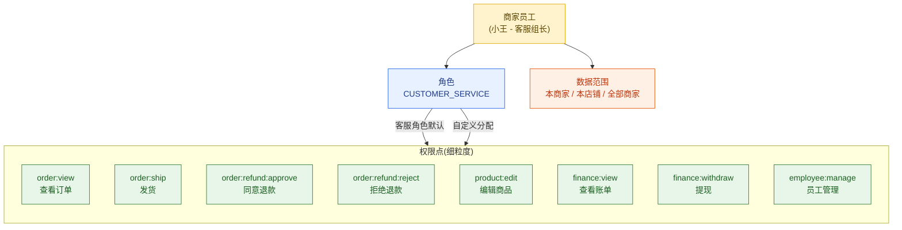

小王的客服角色默认有 `order:view` 和 `order:refund:approve`,但**没有** `finance:view` 和 `employee:manage`——她看不到店铺的账目,也管不了其他员工。

### 14.6.4 权限校验 Java 代码

```java
/**
 * 商家权限校验服务
 * 关键点:RBAC + 数据范围 + 操作审计
 */
@Service
@Slf4j
public class MerchantPermissionService {

    @Autowired
    private MerchantEmployeeRepository employeeRepository;

    @Autowired
    private PermissionRepository permissionRepository;

    @Autowired
    private AuditLogService auditLogService;

    /**
     * 核心校验方法:员工是否有某权限
     */
    public boolean hasPermission(Long employeeId, String permissionCode, Long merchantId) {
        // 1. 查询员工信息
        MerchantEmployee emp = employeeRepository.findById(employeeId)
                .orElseThrow(() -> new EmployeeNotFoundException("员工不存在"));

        // 2. 校验员工是否属于该商家(防越权)
        if (!emp.getMerchantId().equals(merchantId)) {
            log.warn("越权访问! employeeId={} 不属于 merchantId={}",
                    employeeId, merchantId);
            auditLogService.logSecurityViolation(employeeId, merchantId, permissionCode);
            return false;
        }

        // 3. 店主拥有所有权限
        if (Boolean.TRUE.equals(emp.getIsOwner())) {
            return true;
        }

        // 4. 校验员工状态
        if (emp.getStatus() != EmployeeStatus.ACTIVE) {
            return false;
        }

        // 5. 查询员工角色关联的权限
        List<String> permissionCodes = getPermissionsByRole(emp.getRoleCode());

        // 6. 查询员工自定义权限(可叠加或撤销)
        if (emp.getPermissions() != null && !emp.getPermissions().isEmpty()) {
            List<String> customPerms = parseCustomPermissions(emp.getPermissions());
            permissionCodes = mergePermissions(permissionCodes, customPerms);
        }

        return permissionCodes.contains(permissionCode);
    }

    /**
     * 入口过滤器:在 Controller 之前拦截
     */
    public void checkPermission(Long employeeId, String permissionCode,
                                Long merchantId, String operation) {
        if (!hasPermission(employeeId, permissionCode, merchantId)) {
            // 记录审计日志
            auditLogService.logPermissionDenied(employeeId, merchantId,
                    permissionCode, operation);
            throw new PermissionDeniedException(
                    String.format("无权限操作:%s,缺少权限:%s", operation, permissionCode));
        }
    }

    /**
     * 合并角色权限和自定义权限
     * 自定义权限优先级高于角色
     */
    private List<String> mergePermissions(List<String> rolePerms,
                                          List<String> customPerms) {
        Set<String> merged = new HashSet<>(rolePerms);
        for (String custom : customPerms) {
            if (custom.startsWith("-")) {
                // 以"-"开头表示撤销该权限
                merged.remove(custom.substring(1));
            } else {
                // 表示新增该权限
                merged.add(custom);
            }
        }
        return new ArrayList<>(merged);
    }
}
```

### 14.6.5 操作审计

**每个敏感操作都必须记录审计日志**,这是商家资金安全的最后一道防线:

```sql
-- 操作审计日志表
CREATE TABLE merchant_audit_log (
    id BIGINT UNSIGNED PRIMARY KEY AUTO_INCREMENT,
    merchant_id BIGINT NOT NULL COMMENT '商家ID',
    employee_id BIGINT NOT NULL COMMENT '员工ID',
    employee_name VARCHAR(64) COMMENT '员工姓名(冗余)',
    role_code VARCHAR(32) COMMENT '员工角色',

    -- 操作信息
    operation_type VARCHAR(32) NOT NULL COMMENT '操作类型:ORDER_SHIP REFUND_AGREE PRICE_UPDATE WITHDRAW EMPLOYEE_CREATE',
    operation_desc VARCHAR(256) COMMENT '操作描述',
    permission_code VARCHAR(64) COMMENT '涉及的权限点',

    -- 资源
    resource_type VARCHAR(32) COMMENT '资源类型:ORDER PRODUCT SKU EMPLOYEE',
    resource_id VARCHAR(64) COMMENT '资源ID',
    resource_snapshot JSON COMMENT '操作前资源快照(用于回滚)',

    -- 请求
    request_ip VARCHAR(64) COMMENT '操作IP',
    user_agent VARCHAR(512) COMMENT '浏览器UA',
    request_id VARCHAR(64) COMMENT '请求链路ID',

    -- 结果
    operation_result TINYINT COMMENT '操作结果:1成功 2失败 3部分成功',
    error_message VARCHAR(512) COMMENT '失败原因',

    created_at DATETIME NOT NULL DEFAULT CURRENT_TIMESTAMP,

    INDEX idx_merchant_id (merchant_id),
    INDEX idx_employee_id (employee_id),
    INDEX idx_operation_type (operation_type),
    INDEX idx_created_at (created_at)
) ENGINE=InnoDB DEFAULT CHARSET=utf8mb4 COMMENT='商家操作审计日志';
```

老王作为店主,定期会审计:谁在什么时候改了价格、谁在什么时候同意了退款、谁在什么时候申请了提现——任何异常都能追溯到人。

---

## 14.7 结算与对账

### 14.7.1 结算的基本概念

商家结算是商家和平台之间**资金流的核心环节**。老王每天 1500 单 × 110 元 = 16.5 万销售额,但他**不是立即能拿到 16.5 万的**——平台要扣佣金、技术服务费、运费等,还要等账期。

**结算核心概念**:

| 概念 | 含义 | 极购规则 |
|------|------|---------|
| **账期** | 订单完成后多少天可结算 | T+7(普通商家)/ T+15(新店) |
| **T+7 含义** | 订单确认收货后,第 7 天可结算 | 消费者签收后开始计时 |
| **佣金** | 平台按销售额抽成 | 服饰类 5%、美妆 8%、3C 3% |
| **技术服务费** | 平台固定服务费 | 已包含在年费中,不再每单扣 |
| **退款冲抵** | 发生退款的订单从账单中扣回 | T+7 之前的退款直接冲抵 |
| **提现** | 把可结算金额转入银行卡 | 1-3 工作日到账,免费 |

### 14.7.2 结算资金流

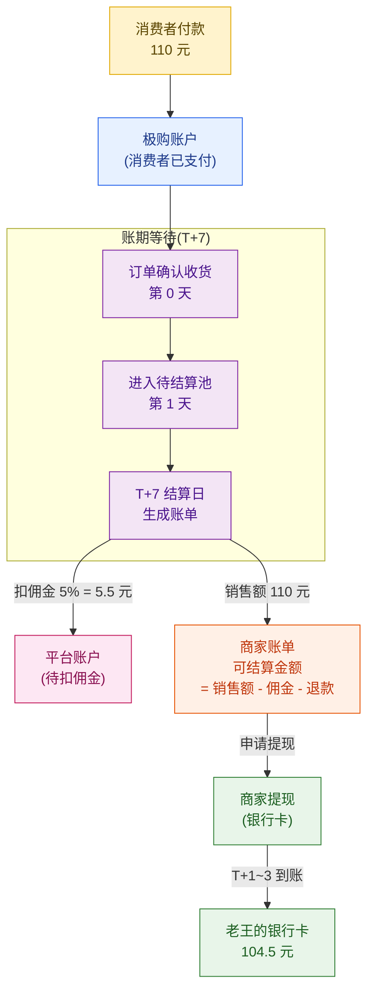

老王的 110 元 T 恤订单,7 天后结算时实际到手 **104.5 元**(扣 5% 服饰类佣金)。如果其中 1 件发生了退款,**该件直接冲抵账单**,不再结算。

### 14.7.3 账单生成 Java 代码

```java
/**
 * 商家账单生成服务
 * 每天凌晨 2 点跑批,生成 T+N 账期的可结算账单
 */
@Service
@Slf4j
public class MerchantBillService {

    @Autowired
    private OrderRepository orderRepository;

    @Autowired
    private BillRepository billRepository;

    @Autowired
    private MerchantRepository merchantRepository;

    @Autowired
    private CommissionConfigService commissionConfigService;

    /**
     * 每日凌晨跑批:生成所有商家的 T+7 账单
     * 定时任务:@Scheduled(cron = "0 0 2 * * ?")
     */
    public void generateDailyBills() {
        LocalDate today = LocalDate.now();
        LocalDate targetDate = today.minusDays(7); // T+7

        log.info("开始生成 {} 日的商家账单", targetDate);

        // 1. 查询所有商家(分批处理)
        List<Merchant> merchants = merchantRepository.findByStatus(MerchantStatus.ACTIVE);

        int totalBills = 0;
        for (Merchant merchant : merchants) {
            try {
                Bill bill = generateMerchantBill(merchant, targetDate);
                if (bill != null) {
                    totalBills++;
                }
            } catch (Exception e) {
                log.error("生成商家 {} 账单失败", merchant.getId(), e);
                // 失败重试,3 次后人工介入
                retryBill(merchant.getId(), targetDate);
            }
        }
        log.info("账单生成完成,共 {} 笔", totalBills);
    }

    /**
     * 为单个商家生成账单
     */
    private Bill generateMerchantBill(Merchant merchant, LocalDate billDate) {
        // 1. 查询该商家在 billDate 当天确认收货的订单
        List<Order> orders = orderRepository.findByMerchantIdAndConfirmDate(
                merchant.getId(), billDate);
        if (orders.isEmpty()) {
            return null;
        }

        // 2. 计算销售额、佣金、退款
        BigDecimal totalSales = BigDecimal.ZERO;
        BigDecimal totalCommission = BigDecimal.ZERO;
        BigDecimal totalRefund = BigDecimal.ZERO;

        Map<Long, BigDecimal> commissionRateMap = commissionConfigService
                .getRatesForMerchant(merchant.getId());

        for (Order order : orders) {
            // 销售额(已扣除消费者退款部分)
            BigDecimal orderAmount = order.getActualAmount()
                    .subtract(order.getRefundAmount());
            totalSales = totalSales.add(orderAmount);

            // 佣金(按类目分别计算)
            BigDecimal commission = BigDecimal.ZERO;
            for (OrderItem item : order.getItems()) {
                BigDecimal rate = commissionRateMap.getOrDefault(
                        item.getCategoryId(), new BigDecimal("0.05"));
                commission = commission.add(
                        item.getActualAmount().multiply(rate));
            }
            totalCommission = totalCommission.add(commission);
        }

        // 3. 查询 billDate 当天的退款(冲抵)
        List<Refund> refunds = refundRepository.findByMerchantIdAndRefundDate(
                merchant.getId(), billDate);
        for (Refund refund : refunds) {
            totalRefund = totalRefund.add(refund.getAmount());
        }

        // 4. 计算可结算金额
        BigDecimal payableAmount = totalSales
                .subtract(totalCommission)
                .subtract(totalRefund);

        // 5. 写入账单表
        Bill bill = new Bill();
        bill.setBillNo(generateBillNo(merchant.getId(), billDate));
        bill.setMerchantId(merchant.getId());
        bill.setBillDate(billDate);
        bill.setBillType(BillType.SETTLEMENT);
        bill.setTotalSales(totalSales);
        bill.setTotalCommission(totalCommission);
        bill.setTotalRefund(totalRefund);
        bill.setPayableAmount(payableAmount);
        bill.setOrderCount(orders.size());
        bill.setOrderIds(orders.stream().map(Order::getId).collect(Collectors.toList()));
        bill.setStatus(BillStatus.PENDING);  // 待商家确认
        bill.setCreatedAt(LocalDateTime.now());
        billRepository.save(bill);

        log.info("商家 {} 账单生成:销售额={} 佣金={} 退款={} 应付={}",
                merchant.getId(), totalSales, totalCommission, totalRefund, payableAmount);

        return bill;
    }

    private String generateBillNo(Long merchantId, LocalDate date) {
        return "B" + date.format(DateTimeFormatter.ofPattern("yyyyMMdd"))
                + String.format("%010d", merchantId);
    }
}
```

### 14.7.4 商家账 vs 平台账

「极购」的账务系统需要同时维护**两套账**:

| 维度 | 商家账 | 平台账 |
|------|--------|--------|
| **记账主体** | 商家(应收) | 平台(应付) |
| **数据来源** | 商家账单表 | 平台总账 |
| **核对方** | 商家自助查看 | 财务团队核对 |
| **差异处理** | 商家申诉 | 财务调整 |
| **系统位置** | 商家后台可见 | 财务系统内部 |

每天对账任务是:商家账 + 平台账 = 0(平衡)。如果不平,差额进入"待查"列表,由财务团队人工核查。

### 14.7.5 提现流程

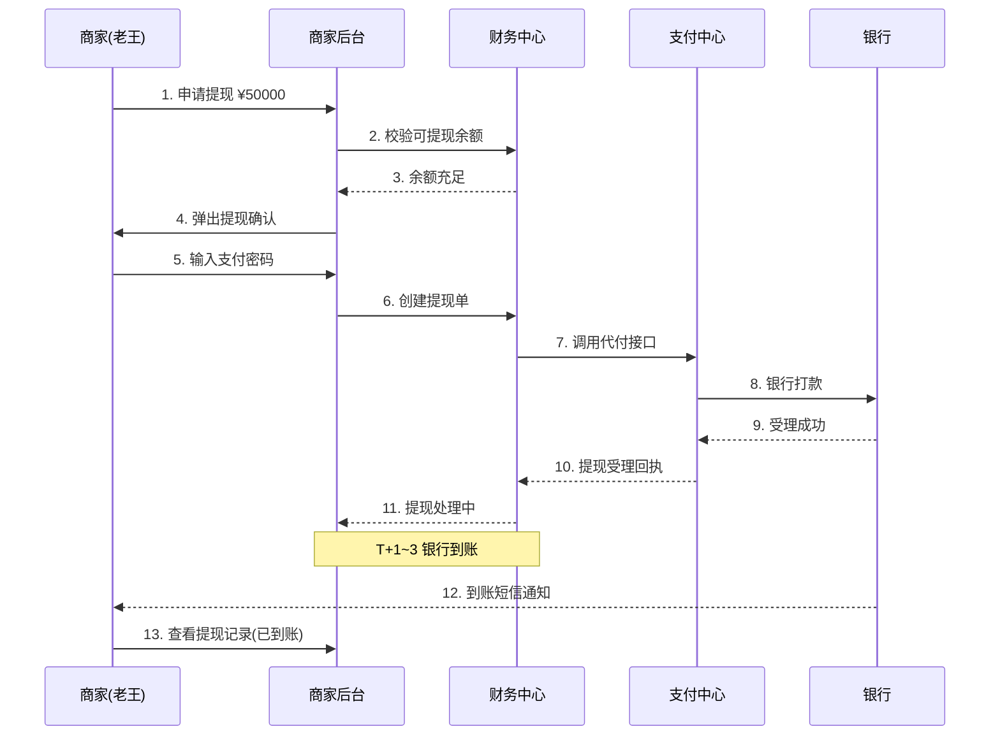

提现关键点:
1. **支付密码**:大额提现需要输入独立的支付密码(不是登录密码)
2. **限额**:单笔 5 万、单日 20 万、单月 100 万(可申请提高)
3. **到账时间**:T+1(工作日 9-17 点受理)/ T+3(其他时间)
4. **手续费**:免费(平台承担银行手续费)

---

## 14.8 发票管理

发票管理是商家财务的**合规重点**——商家需要向消费者开发票,平台需要向商家开发票。

### 14.8.1 商家发票(开给消费者)

| 类型 | 场景 | 税率 | 由谁开 |
|------|------|------|--------|
| **普通发票** | 个人消费者索取 | 1%/3% | 商家(老王) |
| **增值税专用发票** | 企业消费者 | 13% | 商家(老王) |
| **电子发票** | 线上自助开具 | 同上 | 商家(老王) |
| **纸质发票** | 邮寄给消费者 | 同上 | 商家(老王) |

**消费者申请发票流程**:
1. 订单完成后,消费者在"我的订单"点击"申请发票"
2. 选择发票类型(普通/专票)、抬头、邮箱
3. 商家后台收到工单,客服小王审核
4. 商家在 ERP / 商家后台开具发票
5. 电子发票发送到消费者邮箱,纸质发票邮寄

老王作为服饰类商家,每月大约要开 **8000 张电子发票**——他开通了百望/航天信息的电子发票服务,通过 Open API 集成到极购后台,消费者申请后自动开具。

### 14.8.2 平台发票(开给商家)

平台向商家开的发票是**佣金和技术服务费的发票**:

| 开票方 | 收票方 | 票种 | 频率 |
|--------|--------|------|------|
| 极购平台 | 老王(商家) | 增值税专用发票 | 月度/季度 |
| 极购平台 | 老王(商家) | 普通发票 | 申请时开 |

老王作为一般纳税人,需要平台的增值税专票用于进项抵扣。他每月在商家后台提交"申请开票",平台财务在 5 个工作日内开具,通过邮寄或电子发票发送。

---

## 14.9 商家服务市场(API 开放平台)

### 14.9.1 服务市场的价值

50 万商家、200 万员工的需求**千差万别**——大商家需要 ERP,小商家可能只需要一个打单工具。平台不可能自己开发所有工具,**开放生态**才是出路。

**商家服务市场 = 极购 + 第三方 ISV 生态**:
- 极购提供 Open API
- ISV(Independent Software Vendor)开发工具上架
- 商家按需订阅使用
- 平台和 ISV 分成订阅费

### 14.9.2 主流 ISV 工具分类

| 类别 | 工具示例 | 月费(商家侧) | 适用规模 |
|------|---------|------------|---------|
| **ERP** | E店管家、旺店通、店小秘 | ¥200-2000 | 中大型商家 |
| **CRM** | 客如云、小蜜蜂 CRM | ¥100-500 | 复购型商家 |
| **打单发货** | 快递助手、菜鸟打单 | ¥0-50 | 小商家 |
| **客服系统** | 容联七陌、智齿客服 | ¥300-1000 | 中型商家 |
| **进销存** | 管家婆、用友 | ¥200-1000 | 实体+电商混合 |
| **数据分析** | 生意参谋(官方)、京东商智 | 免费/付费 | 全规模 |

老王使用的是 **E店管家(ERP)+ 容联七陌(客服) + 菜鸟打单(发货)** 三件套,月费 1500 元,但效率提升远超成本。

### 14.9.3 开放平台架构

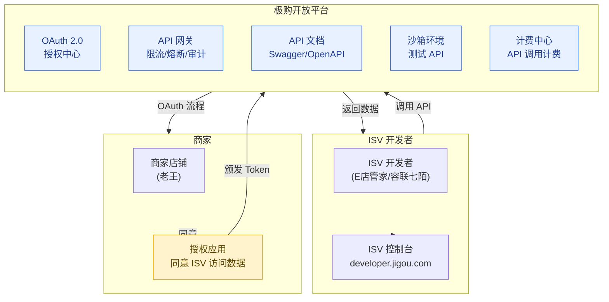

### 14.9.4 开放 API 设计原则

| 原则 | 含义 | 例子 |
|------|------|------|
| **RESTful** | 资源导向的 URL 设计 | `/api/v2/products/{id}` |
| **OAuth 2.0** | 商家授权 ISV 访问 | 授权码模式 |
| **幂等性** | 相同请求多次执行结果一致 | Idempotency-Key 头 |
| **限流** | 防止 ISV 滥用 | 1000 次/秒/商家 |
| **版本化** | URL 带版本号 | `/api/v2/...` |
| **监控告警** | ISV 异常调用告警 | 5xx 率 > 1% 告警 |
| **沙箱** | 测试环境与生产隔离 | sandbox.jigou.com |

---

## 14.10 商家风控

### 14.10.1 商家风控的特殊性

商家风控和消费者风控**本质不同**——商家是 B 端,其欺诈行为更复杂、影响更大、追溯更困难。

| 风控类型 | 消费者风控 | 商家风控 |
|---------|-----------|---------|
| **欺诈主体** | 个人账号 | 商家/员工账号 |
| **欺诈动机** | 薅羊毛、盗号 | 刷单、套现、偷税 |
| **单笔金额** | 小(几十元) | 大(几千-几万) |
| **影响范围** | 单个用户 | 平台 GMV、消费者信任 |
| **追溯难度** | 难(账号可弃) | 较易(商家有实体) |

### 14.10.2 四大商家风控场景

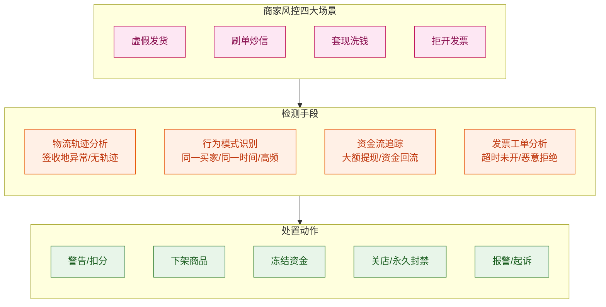

### 14.10.3 各场景详解

**虚假发货**:商家发了空包、假单号、签收地异常(发往新疆却显示北京签收)。**检测**:物流轨迹 + 签收地 + 重量。**典型案例**:某商家为完成平台 KPI,空包发货 1000 单,被识别后扣除保证金 10 万 + 关店。

**刷单炒信**:商家组织刷手虚假下单,提升店铺销量和评价。**检测**:同一买家高频下单、收货地址集中、支付方式集中(都用新账号)、物流信息异常。**典型案例**:某新店开业刷单 5000 单,被识别后店铺降权、屏蔽搜索 3 个月。

**套现洗钱**:商家通过虚假订单把平台资金"洗"到银行卡。**检测**:大额订单、消费者拒收、消费者和商家有关联关系。**典型案例**:某商家每月自买自卖 100 万,资金回流后提现,被识别后冻结账户 + 报警。

**拒开发票**:消费者申请发票后,商家以各种理由拒绝。**检测**:发票工单超时率、消费者投诉率。**典型案例**:某商家 30 天内 50% 发票工单超时,被扣服务分 0.5 分。

### 14.10.4 风控决策引擎

```java
/**
 * 商家风控决策引擎
 * 输入:商家行为事件
 * 输出:风险等级 + 处置动作
 */
@Service
public class MerchantRiskEngine {

    public RiskDecision evaluate(MerchantRiskEvent event) {
        // 1. 规则引擎(快速匹配已知规则)
        RuleMatchResult ruleResult = ruleEngine.match(event);
        if (ruleResult.isMatched()) {
            return new RiskDecision(
                ruleResult.getRiskLevel(),
                ruleResult.getAction(),
                "RULE_MATCH:" + ruleResult.getRuleId()
            );
        }

        // 2. 机器学习模型(识别未知模式)
        MLModelResult mlResult = mlModel.predict(event);
        if (mlResult.getScore() > 0.85) {
            return new RiskDecision(
                RiskLevel.HIGH,
                RiskAction.MANUAL_REVIEW,
                "ML_SCORE:" + mlResult.getScore()
            );
        }

        // 3. 默认通过
        return new RiskDecision(RiskLevel.LOW, RiskAction.ALLOW, "PASS");
    }
}
```

---

## 14.11 商家成长体系

### 14.11.1 商家等级

「极购」根据商家的销售额、服务质量、合规情况,将商家分为 5 个等级:

| 等级 | 销售额门槛 | 权益 | 商家占比 |
|------|----------|------|---------|
| **Lv1 青铜** | 入驻即可 | 基础功能 | 35% |
| **Lv2 白银** | 月销 5 万 | + 数据分析 | 30% |
| **Lv3 黄金** | 月销 50 万 | + 专属客服、活动优先 | 25% |
| **Lv4 铂金** | 月销 500 万 | + 平台资源位、广告返点 | 8% |
| **Lv5 钻石** | 月销 5000 万 | + 战略合作、定制服务 | 2% |

老王的「王的潮品」是 **Lv4 铂金商家**——月销 200 万,服务分 4.8,享受平台专属客服和大促主会场资源位。

### 14.11.2 服务分(DSR)

DSR(Detail Seller Rating)是消费者对商家的三维评分:

| 维度 | 含义 | 极购计算 | 提升方法 |
|------|------|---------|---------|
| **商品描述** | 商品与描述的符合度 | 1-5 星 | 商品详情页准确,图片真实 |
| **服务态度** | 客服的服务质量 | 1-5 星 | 客服响应快、专业、礼貌 |
| **物流服务** | 发货速度和物流质量 | 1-5 星 | 24h 内发货,选优质快递 |

DSR 计算公式:近 90 天有效评价(好评 +1 / 中评 0 / 差评 -1)的滚动平均分。老王如果 DSR 低于 4.5,平台会限制其参加大促活动。

### 14.11.3 流量倾斜

平台对优质商家的**流量倾斜**是商家成长体系的核心激励:

| 商家等级 | 搜索加权 | 推荐加权 | 资源位 | 活动资格 |
|---------|---------|---------|--------|---------|
| Lv1 青铜 | 1.0x | 1.0x | 无 | 普通活动 |
| Lv2 白银 | 1.1x | 1.0x | 类目页 | 平台活动 |
| Lv3 黄金 | 1.2x | 1.1x | 首页 | 大促参与 |
| Lv4 铂金 | 1.5x | 1.2x | 主会场 | 大促核心 |
| Lv5 钻石 | 定制 | 1.5x | 战略资源 | 全活动 |

Lv5 钻石商家的流量加权是 Lv1 的 1.5 倍,这在搜索/推荐算法中意味着**同一商品,钻石商家的排名会靠前**。

### 14.11.4 商家成长路径

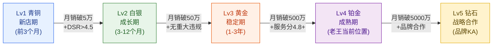

---

## 14.12 易错点与反模式

### 14.12.1 反模式一:子账号共享主账号

**错误做法**:8 个员工都用店主账号,理由是"省事"。

**后果**:无法审计谁做了什么操作;员工离职需要全员改密;一个员工的失误就是店主的责任(平台风控直接处罚店主)。

**正确做法**:必须每个员工独立子账号,店主账号只用于关键操作(申请提现、修改主账号信息)。

### 14.12.2 反模式二:结算规则不透明

**错误做法**:扣了 5.5 元佣金,但账单只显示"扣 5.5 元",不说明佣金率和计算明细。

**后果**:商家怀疑平台乱扣费,频繁客服咨询,长期形成不信任。

**正确做法**:账单必须展示明细——每笔订单的销售额、佣金率、佣金金额、可结算金额。商家点击每笔订单能下钻查看计算逻辑。

### 14.12.3 反模式三:商品发布流程过于复杂

**错误做法**:商品发布需要填写 50 个字段(品牌、产地、材质、洗涤方式、季节、风格……),商家上架 1 个商品要 30 分钟。

**后果**:商家放弃,转向竞品平台。极购在大促前发现商品发布量比竞品低 40%。

**正确做法**:分级表单——新店用 5 个必填字段即可发布,后续在"完善商品"中补全其他字段。同时支持"商品复制"快速发布同款不同色。

### 14.12.4 反模式四:批量操作失败无反馈

**错误做法**:商家上传 1000 行 Excel,处理后只显示"完成 800,失败 200",不告诉具体哪 200 行失败、为什么失败。

**后果**:商家不知道错在哪里,只能重传整个文件,效率极低。

**正确做法**:失败行必须下载一个错误报告 Excel,标明行号、字段、错误原因(如"第 5 行价格不能为 0"、"第 12 行类目 ID 不存在")。商家修改后**只重传失败行**,不用全部重传。

### 14.12.5 反模式五:ERP 同步被当成"次要功能"

**错误做法**:ERP 同步接口是"附属"功能,出问题没人修,商家投诉半年才修复。

**后果**:中大型商家(贡献 GMV 60%)因 ERP 同步问题流失,转向竞品。

**正确做法**:ERP 同步是商家后台**最关键的功能之一**(对中大型商家来说),SLA 必须 99.95%+,出问题 30 分钟响应。

### 14.12.6 对比总结

```
错误路径:
  ①子账号共享 → 审计失败 → 风控连带店主 → 商家受损
  ②账单不透明 → 商家不信任 → 流失
  ③商品发布繁琐 → 商家上架慢 → 平台 SKU 增长慢 → 消费者选择少
  ④批量无反馈 → 商家效率低 → 抱怨
  ⑤ERP 同步不可靠 → 大商家流失 → GMV 下降

正确路径:
  ①子账号 + 审计 + 权限分离 → 操作可追溯 → 风险可控
  ②账单透明 + 计算明细 → 商家信任 → 长期合作
  ③发布简化 + 分级表单 + 复制 → 上架快 → SKU 增长 → 消费者选择多
  ④批量反馈 + 失败行下载 → 商家效率高 → 满意度高
  ⑤ERP 高 SLA + 7×24 监控 → 大商家稳定 → GMV 增长
```

---

## 本章小结

商家与商家后台是商城平台的**供给侧基础设施**。本章覆盖了从商家入驻到日常运营、从 ERP 集成到结算对账、从子账号权限到风控管理的完整商家生态系统设计。

**商家入驻**是商家旅程的起点:从提交资质到正式上线,标准流程 7 天;复用电商资质可以做到 1 天入驻;机审 + 人审的混合审核模式在效率和质量之间取得平衡。

**商家后台九大功能模块**——工作台、商品、库存、订单、营销、数据、客服、财务、账号——构成商家日常运营的完整工具集。**工作台**作为"驾驶舱"聚合全店状态,是商家打开后台的第一站。

**ERP 集成**是 50 万商家、尤其是中大型商家的**关键能力**:Open API 双向打通(商品/库存/订单/物流),让 ERP 成为真实数据源、平台成为销售渠道之一。**11 个核心 API 覆盖了 80% 的 ERP 集成场景**。

**子账号 + 权限分离**是商家资金安全的**最后一道防线**。从店主、店长、客服、运营、财务五大角色,到按钮级细粒度权限,再到全量操作审计日志,缺一不可。

**结算与对账**是商家最关心的"钱"的问题:**T+7 账期**平衡了商家资金周转和平台风险;**商家账 + 平台账**的双账核对保证了资金准确;**透明账单 + 明细到单**是商家信任的基础。

**商家服务市场**让平台从"自己做所有功能"升级为"生态共建"——ISV 提供垂直工具、平台提供 Open API 和流量、商家按需订阅,三方共赢。

**商家风控**和消费者风控本质不同——商家欺诈单笔金额大、影响范围广、追溯更困难。**虚假发货、刷单、套现、拒开发票**是四大典型场景,需要规则引擎 + 机器学习双管齐下。

**商家成长体系**(等级、服务分、流量倾斜)把"做好服务的商家"和"获得更多流量"绑定起来,形成正向飞轮——商家越做越好 → 流量越多 → 销售额越大 → 商家继续投入服务,这是平台和商家的共同利益。

---

商家是平台商品和服务的供给者,商家后台是供给侧的"操作系统"。下一章([第 15 章 · 物流与配送系统](./15-物流与配送系统.md))将讨论订单产生后,**物流系统如何把商品从老王的仓库送到小美的手中**——电子面单、物流商对接、运费模板、物流轨迹、签收、异常处理,完成商城交易链路的"最后一公里"。

---

> 🚀 **下一章**：[第 15 章 · 物流与配送系统](./15-物流与配送系统.md)

---

## 参考来源

1. **淘宝商家中心 - 商家入驻流程**  
   [https://openshop.taobao.com/](https://openshop.taobao.com/)  
   淘宝商家入驻的资质要求、审核流程、缴费项目的官方说明,本章入驻流程的主要参考。

2. **京东商家入驻 - POP 商家说明**  
   [https://mercury.jd.com/](https://mercury.jd.com/)  
   京东 POP 商家入驻流程、保证金/技术服务费收取标准、店铺类型说明。

3. **拼多多商家入驻 - 资质要求**  
   [https://mms.pinduoduo.com/otheresult/detail?documentId=8](https://mms.pinduoduo.com/otheresult/detail?documentId=8)  
   拼多多个人店/企业店/品牌店资质要求详细说明。

4. **阿里巴巴 Open API 文档 - 商品/订单/库存**  
   [https://developer.alibaba.com/docs/api.htm](https://developer.alibaba.com/docs/api.htm)  
   阿里巴巴(1688/淘宝)Open API 完整列表,本章 ERP 集成 API 设计的主要参考。

5. **E店管家 - 电商 ERP 标杆产品**  
   [https://www.edgj.com/](https://www.edgj.com/)  
   国内头部电商 ERP 之一,支持淘宝/京东/拼多多/抖音/快手多平台对接,本章 ERP 同步场景的真实参照。

6. **旺店通 ERP - 商家中大型 ERP 方案**  
   [https://www.wangdian.cn/](https://www.wangdian.cn/)  
   面向中大型商家的 ERP 解决方案,涵盖订单/仓储/财务/CRM 一体化。

7. **OAuth 2.0 授权框架 - RFC 6749**  
   [https://datatracker.ietf.org/doc/html/rfc6749](https://datatracker.ietf.org/doc/html/rfc6749)  
   OAuth 2.0 协议标准,本章开放平台 ISV 授权流程的理论基础。

8. **千牛工作台 - 阿里巴巴官方商家 IM**  
   [https://qianniu.taobao.com/](https://qianniu.taobao.com/)  
   淘宝/天猫商家官方客服工作台,日均承载百万级客服在线,本章客服中心架构的真实参照。

9. **国家市场监督管理总局 - 电子营业执照**  
   [https://zzlz.gsxt.gov.cn/](https://zzlz.gsxt.gov.cn/)  
   营业执照在线验证的官方接口,商家入驻审核的工商核验来源。

10. **国家税务总局 - 电子发票(全电发票)政策**  
    [https://www.chinatax.gov.cn/](https://www.chinatax.gov.cn/)  
    全电发票(数字化电子发票)的政策文件,商家开票和平台开票的合规依据。

11. **阿里巴巴 RBAC 权限模型 - Spring Security 实践**  
    [https://spring.io/projects/spring-security](https://spring.io/projects/spring-security)  
    RBAC(Role-Based Access Control)权限模型的 Spring 实现参考,本章子账号权限校验代码的工程基础。

12. **商家服务市场(ISV)生态 - 阿里云电商解决方案**  
    [https://developer.aliyun.com/ecommerce](https://developer.aliyun.com/ecommerce)  
    阿里云电商行业的 ISV 生态、开放 API、商家工具市场架构。
