# 第 15 章 · 物流与配送系统

> **所属系列**：《商城平台系统设计 · 全景教程》第五部分 · 履约与用户
> **上一章**：[第 14 章 · 商家与商家后台](./14-商家与商家后台.md)
> **下一章**：[第 16 章 · 风控与反欺诈](./16-风控与反欺诈.md)

---

## 本章导读

前面 14 章把"下单"这条路打通了：商品、库存、营销、支付、订单、售后……一气呵成。但对消费者小美来说，这些系统都是"后台"，她真正能感知的，是 **3 天后到手的 T 恤**——这一段就是物流。

老王在杭州仓库打印出顺丰电子面单，贴在包裹上，交给快递员揽收；顺丰把包裹从杭州运到上海分拨中心，再派送到小美所在的小区门口；小美打开 App 看到的"已到达上海中转"就是物流商推送给极购的轨迹。这一条链路就是本章要解构的对象。

物流系统是商城的**履约最后一公里**——前面所有环节都没出错，但包裹丢了、破了、迟了，消费者就会说"这平台不行"。它的体验核心是三个字：

- **快**：多久能到？何时能精准预测？
- **准**：轨迹准不准？签收凭据可不可信？
- **稳**：丢件了找谁？破损了赔不赔？

「极购商城」日均发货 **800 万单**，接入 50+ 物流商，跨境、保税、即时配送多模式并存。本章从全景图开始，逐层深入到电子面单、运费模板、状态机、轨迹回传、异常处理、仓配一体、即时配送、跨境物流，最后给出体验优化和典型问题。

---

## 15.1 物流在商城的地位

履约是电商的**生命线**。如果说支付是"收钱"，那么物流就是"送货"——两者共同决定 GMV 的真正闭环。

### 15.1.1 为什么物流是体验核心

| 体验维度 | 物流占比 | 典型抱怨 |
|---------|---------|---------|
| 时效 | 70% 用户对"几天到"敏感 | "下单 5 天还没到，比淘宝慢" |
| 退换货 | 退换货链路 80% 时间在物流 | "退回去 10 天才到账" |
| 客服 | 物流问题占客服工单 50%+ | "我的件在哪里" / "包裹破损了" |
| 复购 | 一次差物流体验后复购率掉 30% | "下次去别的平台买" |

### 15.1.2 物流系统的三重角色

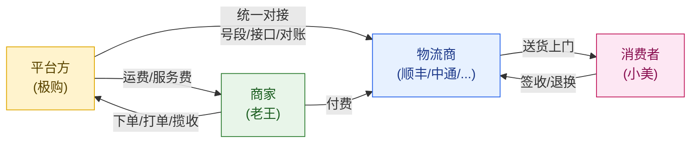

平台是**接入方**——把商家的发货需求、消费者的查件需求，统一转译为各家物流商的接口协议。

---

## 15.2 物流系统全景图

整个物流域涉及 7 个核心子系统，环环相扣：

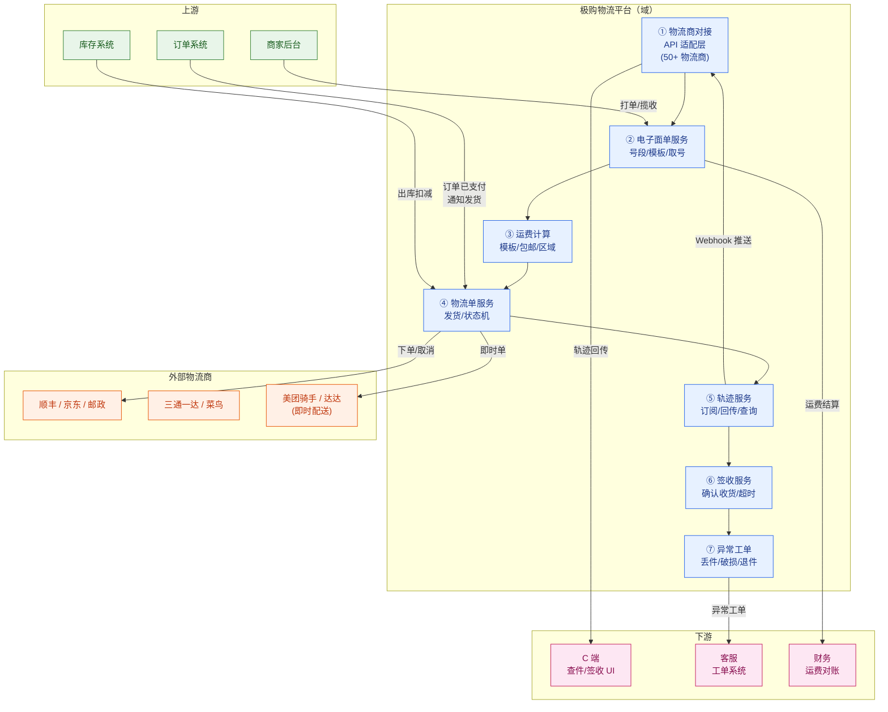

---

## 15.3 物流商对接

### 15.3.1 主流物流商与场景

| 物流商 | 优势 | 适合品类 | 极购使用场景 |
|--------|------|---------|-------------|
| **顺丰** | 时效最快、服务最好、贵 | 高客单、3C、生鲜 | 标品类发货 |
| **京东物流** | 自营仓配一体、211 限时达 | 京东自营、大件 | 极购自营商品 |
| **中通/圆通/申通/韵达** | 价格低、覆盖广 | 低客单、服饰 | 普通商家发货 |
| **EMS 邮政** | 偏远地区全覆盖 | 农村、乡镇 | 边远地区兜底 |
| **菜鸟** | 阿里系、整合通达系 | 多商家聚合发货 | 三方商家接入 |
| **德邦/安能** | 大件、零担 | 家电、家具 | 大件配送 |

### 15.3.2 三大核心接口

无论对接哪家物流商，平台与物流商之间的接口都围绕三件事：

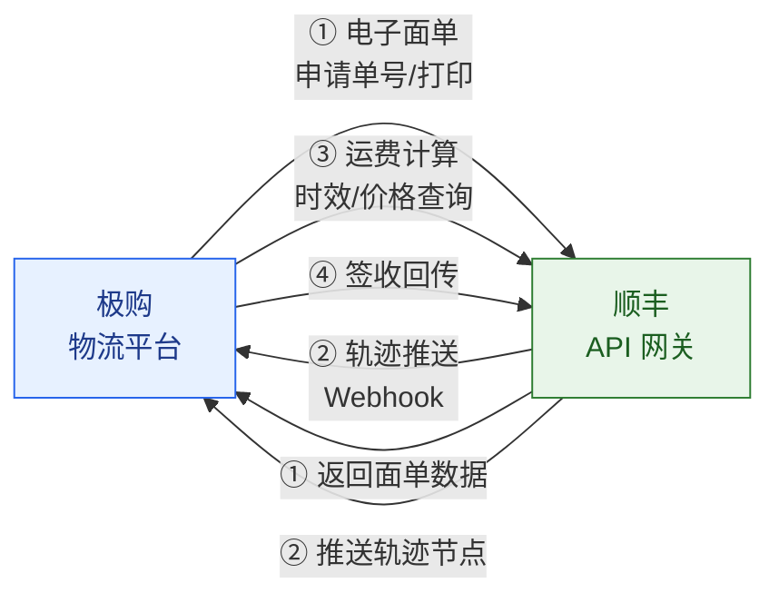

**接口标准**：

| 接口 | 作用 | 极购行为 | 物流商行为 |
|------|------|---------|-----------|
| **电子面单（E-waybill）** | 标准化面单 + 三段码 | 申请单号、获取打印数据 | 校验号段、生成二维码 |
| **轨迹推送（Trace Push）** | 物流商主动上报状态 | 订阅、接收、回写订单 | 揽收/中转/派送事件上报 |
| **运费计算（Freight）** | 时效与价格预估 | 调用预测 API | 按重量/区域返回报价 |

---

## 15.4 电子面单（核心模块）

### 15.4.1 什么是电子面单

**电子面单**是物流商提供的标准化面单格式，由物流商统一印码（三段码）、商家热敏打印、贴到包裹上。**三段码**包含：

- **第 1 段**（1 位）：物流商代码（顺丰=S、中通=Z、圆通=Y、申通=B、韵达=X、京东=J、邮政=P）
- **第 2 段**（N 位）：单号序列，由物流商预分配号段
- **第 3 段**（1 位）：校验码

示例：`SF1234567890`（顺丰）、`YT7890123456`（圆通）、`JD202406051234`（京东）。

### 15.4.2 三种号段管理方式

| 模式 | 描述 | 适用 |
|------|------|------|
| **平台统一号段** | 极购统一向物流商申请大号段，分给各商家 | 自营 + 大商家 |
| **商家独立号段** | 商家自己向物流商买号，极购不参与 | 头部品牌商家 |
| **菜鸟聚合号段** | 通过菜鸟聚合下单，使用菜鸟分配的通达系号 | 中小商家 |

### 15.4.3 电子面单生成流程

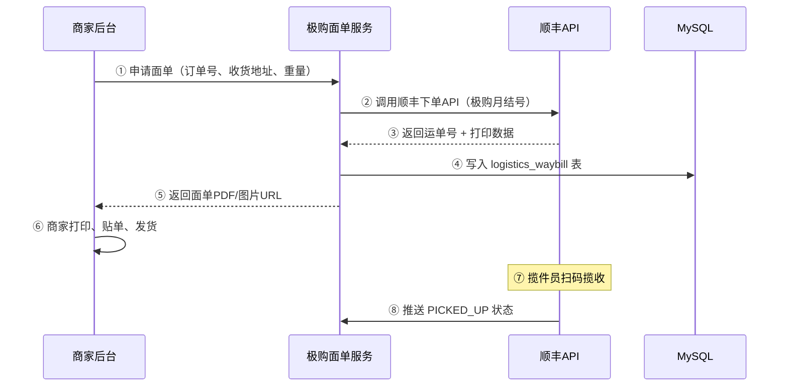

### 15.4.4 电子面单号段表 SQL

```sql
-- 电子面单号段表
CREATE TABLE logistics_waybill_segment (
    id                BIGINT       PRIMARY KEY AUTO_INCREMENT,
    carrier_code      VARCHAR(16)  NOT NULL COMMENT '物流商编码(SF/ZTO/YTO...)',
    merchant_id       BIGINT       NOT NULL COMMENT '商家ID',
    segment_start     BIGINT       NOT NULL COMMENT '起始号段',
    segment_end       BIGINT       NOT NULL COMMENT '结束号段',
    used_count        INT          NOT NULL DEFAULT 0 COMMENT '已用数量',
    status            TINYINT      NOT NULL DEFAULT 1 COMMENT '1=可用 2=耗尽 3=冻结',
    monthly_account   VARCHAR(64)  COMMENT '月结账号',
    expire_time       DATETIME     COMMENT '号段过期时间',
    created_at        DATETIME     NOT NULL DEFAULT CURRENT_TIMESTAMP,
    updated_at        DATETIME     NOT NULL DEFAULT CURRENT_TIMESTAMP ON UPDATE CURRENT_TIMESTAMP,
    UNIQUE KEY uk_carrier_merchant (carrier_code, merchant_id, segment_start)
) ENGINE=InnoDB DEFAULT CHARSET=utf8mb4 COMMENT='电子面单号段表';
```

### 15.4.5 物流主表 SQL

```sql
CREATE TABLE logistics_waybill (
    id                BIGINT       PRIMARY KEY AUTO_INCREMENT,
    waybill_no        VARCHAR(32)  NOT NULL COMMENT '运单号(SF1234567890)',
    order_id          BIGINT       NOT NULL COMMENT '订单ID',
    merchant_id       BIGINT       NOT NULL COMMENT '商家ID',
    carrier_code      VARCHAR(16)  NOT NULL COMMENT '物流商编码',
    shipper_name      VARCHAR(64)  COMMENT '发货人',
    shipper_phone     VARCHAR(32)  COMMENT '发货电话',
    shipper_addr      VARCHAR(256) COMMENT '发货地址',
    receiver_name     VARCHAR(64)  NOT NULL,
    receiver_phone    VARCHAR(32)  NOT NULL,
    receiver_addr     VARCHAR(256) NOT NULL,
    weight_gram       INT          NOT NULL DEFAULT 0 COMMENT '重量(克)',
    volume_ml         INT          COMMENT '体积(毫升)',
    item_name         VARCHAR(256) COMMENT '物品名',
    declared_value    DECIMAL(10,2) COMMENT '声明价值(保价用)',
    freight           DECIMAL(10,2) COMMENT '运费',
    status            VARCHAR(16)  NOT NULL DEFAULT 'CREATED' COMMENT '状态机',
    picked_at         DATETIME     COMMENT '揽收时间',
    delivered_at      DATETIME     COMMENT '签收时间',
    signed_by         VARCHAR(64)  COMMENT '签收人',
    exception_flag    TINYINT      NOT NULL DEFAULT 0 COMMENT '是否异常',
    created_at        DATETIME     NOT NULL DEFAULT CURRENT_TIMESTAMP,
    updated_at        DATETIME     NOT NULL DEFAULT CURRENT_TIMESTAMP ON UPDATE CURRENT_TIMESTAMP,
    UNIQUE KEY uk_waybill (waybill_no),
    KEY idx_order (order_id),
    KEY idx_merchant_status (merchant_id, status)
) ENGINE=InnoDB DEFAULT CHARSET=utf8mb4 COMMENT='物流主表';
```

### 15.4.6 Java 代码：申请电子面单

```java
@Service
public class WaybillApplyService {

    @Autowired private CarrierAdapterFactory factory;
    @Autowired private WaybillSegmentDao segmentDao;
    @Autowired private WaybillDao waybillDao;
    @Autowired private RedisTemplate<String,String> redis;

    /**
     * 申请电子面单（核心入口）
     */
    public WaybillApplyResult apply(OrderDTO order) {
        // 1. 选物流商（运费计算后已确定）
        String carrierCode = order.getCarrierCode();

        // 2. 号段预占（Redis 原子扣减，防并发超用）
        String segKey = "wb:seg:" + carrierCode + ":" + order.getMerchantId();
        Long waybillNo = redis.opsForList().leftPop(segKey);
        if (waybillNo == null) {
            // Redis 无可用号段 → DB 查号段，批量加载进 Redis
            reloadSegmentFromDB(carrierCode, order.getMerchantId());
            waybillNo = redis.opsForList().leftPop(segKey);
            if (waybillNo == null) {
                throw new BizException("号段已用尽，请向物流商续购");
            }
        }

        // 3. 调用物流商 API
        CarrierAdapter adapter = factory.get(carrierCode);
        WaybillApplyResult result = adapter.createWaybill(order, waybillNo);

        // 4. 回写 DB
        Waybill waybill = new Waybill();
        waybill.setWaybillNo(result.getWaybillNo());
        waybill.setOrderId(order.getId());
        waybill.setMerchantId(order.getMerchantId());
        waybill.setCarrierCode(carrierCode);
        waybill.setStatus("CREATED");
        waybillDao.insert(waybill);

        // 5. 扣减号段已用数
        segmentDao.incrUsedCount(carrierCode, order.getMerchantId());
        return result;
    }

    private void reloadSegmentFromDB(String carrierCode, Long merchantId) {
        // 查 DB 找可用号段，批量加载 1000 个号进 Redis
        List<WaybillSegment> segs = segmentDao.findAvailable(carrierCode, merchantId, 1);
        for (WaybillSegment seg : segs) {
            String segKey = "wb:seg:" + carrierCode + ":" + merchantId;
            List<Long> range = LongStream.rangeClosed(seg.getSegmentStart(), seg.getSegmentEnd())
                                          .boxed().collect(Collectors.toList());
            redis.opsForList().rightPushAll(segKey, range.stream().map(String::valueOf).collect(Collectors.toList()));
        }
    }
}
```

---

## 15.5 运费模板

### 15.5.1 计价三要素

| 要素 | 描述 | 适用 |
|------|------|------|
| **按件数** | 首件 N 元 + 续件 M 元 | 服饰、小件 |
| **按重量** | 首重 N 元/kg + 续重 M 元/kg | 日用品 |
| **按体积** | 长×宽×高 / 抛比系数 | 抛货（棉花、海绵） |

### 15.5.2 运费模板规则

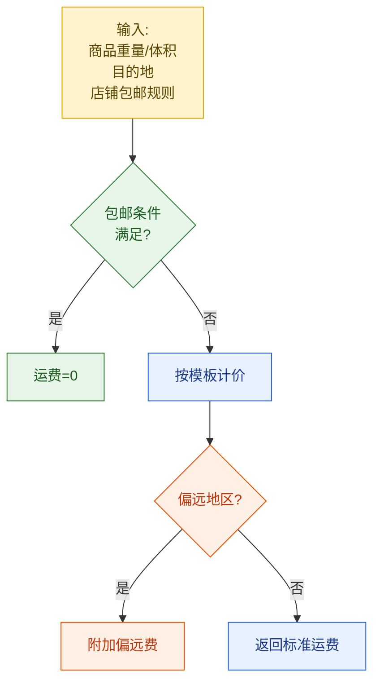

### 15.5.3 运费模板数据模型

```sql
CREATE TABLE freight_template (
    id              BIGINT       PRIMARY KEY AUTO_INCREMENT,
    merchant_id     BIGINT       NOT NULL,
    template_name   VARCHAR(64)  NOT NULL,
    charge_type     VARCHAR(16)  NOT NULL COMMENT 'BY_NUM/BY_WEIGHT/BY_VOLUME',
    default_first   DECIMAL(8,2) NOT NULL COMMENT '首件/首重/首体积',
    default_contin  DECIMAL(8,2) NOT NULL COMMENT '续件/续重/续体积',
    free_ship_money DECIMAL(10,2) COMMENT '满N元包邮',
    free_ship_num   INT          COMMENT '满N件包邮',
    free_ship_weight DECIMAL(8,2) COMMENT '满N千克包邮',
    status          TINYINT      DEFAULT 1
) ENGINE=InnoDB DEFAULT CHARSET=utf8mb4 COMMENT='运费模板';

CREATE TABLE freight_template_region (
    id              BIGINT       PRIMARY KEY AUTO_INCREMENT,
    template_id     BIGINT       NOT NULL,
    region_code     VARCHAR(16)  NOT NULL COMMENT '省/市编码',
    first_amount    DECIMAL(8,2) NOT NULL,
    contin_amount   DECIMAL(8,2) NOT NULL,
    remote_fee      DECIMAL(8,2) DEFAULT 0 COMMENT '偏远附加费',
    KEY idx_template (template_id)
) ENGINE=InnoDB DEFAULT CHARSET=utf8mb4 COMMENT='运费模板区域明细';
```

### 15.5.4 Java 代码：运费计算

```java
@Service
public class FreightCalculator {

    @Autowired private FreightTemplateDao templateDao;

    public BigDecimal calc(CalcFreightRequest req) {
        // 1. 取商品所属运费模板
        FreightTemplate tpl = templateDao.getBySku(req.getSkuId());

        // 2. 判断包邮
        if (isFreeShip(tpl, req)) {
            return BigDecimal.ZERO;
        }

        // 3. 按目的地查区域明细
        FreightTemplateRegion region = templateDao.getRegion(tpl.getId(), req.getDestRegionCode());
        if (region == null) region = templateDao.getDefaultRegion(tpl.getId());

        // 4. 按计价类型算运费
        BigDecimal freight;
        switch (tpl.getChargeType()) {
            case "BY_NUM":    freight = calcByNum(req.getQuantity(), region); break;
            case "BY_WEIGHT": freight = calcByWeight(req.getWeightGram(), region); break;
            case "BY_VOLUME": freight = calcByVolume(req.getVolumeMl(), region); break;
            default: throw new BizException("未知计价类型");
        }

        // 5. 加偏远费
        return freight.add(region.getRemoteFee() == null ? BigDecimal.ZERO : region.getRemoteFee());
    }

    private boolean isFreeShip(FreightTemplate tpl, CalcFreightRequest req) {
        if (tpl.getFreeShipMoney() != null && req.getGoodsAmount().compareTo(tpl.getFreeShipMoney()) >= 0) return true;
        if (tpl.getFreeShipNum() != null && req.getQuantity() >= tpl.getFreeShipNum()) return true;
        return false;
    }

    private BigDecimal calcByWeight(int weightGram, FreightTemplateRegion r) {
        // 顺丰：首重 1kg 23 元，续重 1kg 6 元
        int firstGram = 1000;
        if (weightGram <= firstGram) return r.getFirstAmount();
        int extra = (weightGram - firstGram + 999) / 1000; // 向上取整
        return r.getFirstAmount().add(r.getContinAmount().multiply(BigDecimal.valueOf(extra)));
    }
}
```

---

## 15.6 发货流程

### 15.6.1 状态机

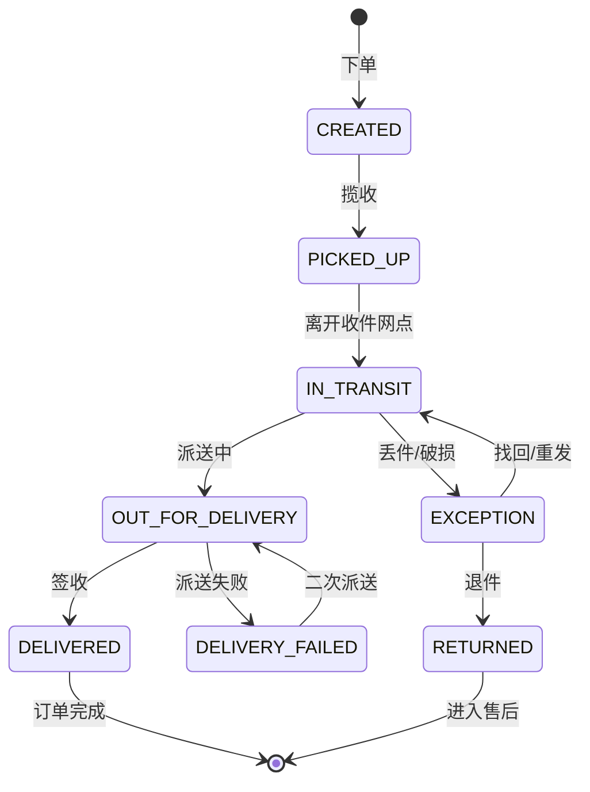

### 15.6.2 极购 → 物流商发货（Java）

```java
@Service
public class ShipService {

    @Autowired private OrderService orderService;
    @Autowired private InventoryService inventoryService;
    @Autowired private CarrierAdapterFactory factory;
    @Autowired private WaybillDao waybillDao;
    @Autowired private MqProducer mq;

    @Transactional
    public void ship(Long orderId) {
        // 1. 校验订单状态（只有 PAID 才能发货）
        Order order = orderService.get(orderId);
        if (!"PAID".equals(order.getStatus())) {
            throw new BizException("订单未支付，不可发货");
        }

        // 2. 通知库存系统出库（已预扣→已扣减）
        inventoryService.outbound(orderId);

        // 3. 调用物流商发货
        CarrierAdapter adapter = factory.get(order.getCarrierCode());
        ShipResult result = adapter.ship(order);

        // 4. 更新物流单状态 PICKED_UP（已揽收）或 IN_TRANSIT
        Waybill waybill = waybillDao.getByOrderId(orderId);
        waybill.setStatus("PICKED_UP");
        waybill.setPickedAt(new Date());
        waybillDao.update(waybill);

        // 5. 更新订单状态为 SHIPPED
        orderService.markShipped(orderId);

        // 6. 发 MQ 消息（通知消费者+触发发货通知）
        mq.send("order.shipped", new OrderShippedEvent(orderId, waybill.getWaybillNo()));
    }
}
```

### 15.6.3 实际物理路径

老王在杭州发货到上海，包裹经历 5 段物理路径：

```
杭州萧山仓库（老王）
  ↓ 揽收员
杭州萧山中转站
  ↓ 干线运输（陆运/航运）
上海浦东分拨中心
  ↓ 二次分拣
上海徐汇区营业部
  ↓ 派送员
小美家门口（签收）
```

---

## 15.7 轨迹回传与查询

### 15.7.1 推送方式

物流商通过 **Webhook** 主动推送轨迹到极购。极购订阅相关 topic，把消息入 MQ 异步处理。

### 15.7.2 轨迹回传时序图

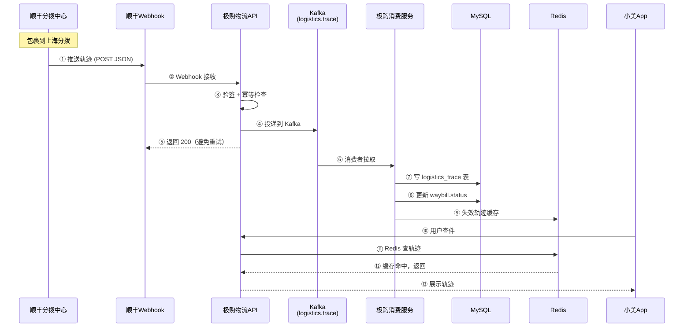

### 15.7.3 轨迹表 SQL

```sql
CREATE TABLE logistics_trace (
    id              BIGINT       PRIMARY KEY AUTO_INCREMENT,
    waybill_no      VARCHAR(32)  NOT NULL,
    trace_time      DATETIME     NOT NULL COMMENT '轨迹发生时间',
    location        VARCHAR(128) COMMENT '位置',
    action          VARCHAR(32)  NOT NULL COMMENT '揽收/中转/派送/签收',
    description     VARCHAR(256) COMMENT '描述',
    operator        VARCHAR(64)  COMMENT '操作员',
    next_stop       VARCHAR(128) COMMENT '下一站',
    raw_data        JSON         COMMENT '原始报文',
    created_at      DATETIME     DEFAULT CURRENT_TIMESTAMP,
    KEY idx_waybill_time (waybill_no, trace_time DESC)
) ENGINE=InnoDB DEFAULT CHARSET=utf8mb4 COMMENT='物流轨迹表';
```

### 15.7.4 缓存策略

| Key | TTL | 说明 |
|-----|-----|------|
| `trace:last:{waybill_no}` | 1 小时 | 最近 1 条轨迹（"在哪里了"） |
| `trace:list:{waybill_no}` | 1 小时 | 最近 10 条轨迹（轨迹页） |
| `wb:status:{waybill_no}` | 24 小时 | 当前物流状态 |

---

## 15.8 签收与自动确认

### 15.8.1 两种签收路径

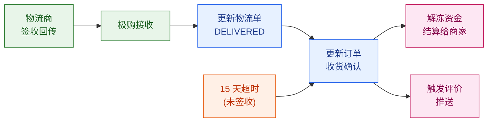

### 15.8.2 物流回调处理（Java）

```java
@Component
public class LogisticsCallbackConsumer {

    @Autowired private WaybillDao waybillDao;
    @Autowired private TraceDao traceDao;
    @Autowired private OrderService orderService;
    @Autowired private RedisTemplate redis;

    @KafkaListener(topics = "logistics.trace")
    public void onMessage(String msg) throws Exception {
        TracePushPayload payload = JSON.parseObject(msg, TracePushPayload.class);

        // 1. 幂等（trace_id 用 物流商 trace_id + waybill）
        String dedupKey = "trace:dedup:" + payload.getWaybillNo() + ":" + payload.getTraceId();
        if (!redis.opsForValue().setIfAbsent(dedupKey, "1", Duration.ofDays(7))) {
            return; // 已处理过
        }

        // 2. 写轨迹
        Trace trace = new Trace();
        trace.setWaybillNo(payload.getWaybillNo());
        trace.setAction(payload.getAction());
        trace.setLocation(payload.getLocation());
        trace.setTraceTime(payload.getOccurTime());
        traceDao.insert(trace);

        // 3. 更新物流单状态（状态机转移）
        Waybill waybill = waybillDao.getByNo(payload.getWaybillNo());
        String newStatus = mapActionToStatus(payload.getAction());
        if (isValidTransition(waybill.getStatus(), newStatus)) {
            waybillDao.updateStatus(waybill.getId(), newStatus);
        }

        // 4. 失效轨迹缓存
        redis.delete("trace:list:" + payload.getWaybillNo());
        redis.delete("trace:last:" + payload.getWaybillNo());

        // 5. 签收时触发订单自动确认
        if ("DELIVERED".equals(newStatus)) {
            waybill.setDeliveredAt(payload.getOccurTime());
            waybillDao.update(waybill);
            orderService.confirmReceipt(waybill.getOrderId(), "LOGISTICS");
        }
    }

    private boolean isValidTransition(String from, String to) {
        // 状态机校验：CREATED→PICKED_UP→IN_TRANSIT→OUT_FOR_DELIVERY→DELIVERED
        Map<String, Set<String>> allowed = Map.of(
            "CREATED",          Set.of("PICKED_UP"),
            "PICKED_UP",        Set.of("IN_TRANSIT"),
            "IN_TRANSIT",       Set.of("IN_TRANSIT","OUT_FOR_DELIVERY","EXCEPTION"),
            "OUT_FOR_DELIVERY", Set.of("DELIVERED","DELIVERY_FAILED"),
            "EXCEPTION",        Set.of("IN_TRANSIT","RETURNED")
        );
        return allowed.getOrDefault(from, Set.of()).contains(to);
    }
}
```

### 15.8.3 15 天自动确认

未签收时，定时任务每天扫描 `shipped_at < NOW - 15天 AND status != 'DELIVERED'` 的订单，自动确认收货。

---

## 15.9 异常处理

### 15.9.1 异常分类

| 异常 | 占比 | 处理方式 | 时长 |
|------|------|---------|------|
| **丢件** | 5% | 理赔（按申报价值） | 7-15 天 |
| **破损** | 3% | 部分退款/重发/退货 | 3-7 天 |
| **错送** | 1% | 物流商找回/重发 | 1-3 天 |
| **拒收** | 2% | 退件 + 原路退款 | 3-5 天 |
| **延误** | 10% | 补偿优惠券 | 即时 |

### 15.9.2 丢件理赔流程

```mermaid
flowchart TD
    A["用户反馈<br/>'我件丢了'"]:::yellow
    A --> B["客服核实<br/>(查轨迹)"]:::green
    B --> C["轨迹<br/>异常?"}:::green
    C -->|"是"| D["提交物流商<br/>理赔工单"]:::blue
    C -->|"否"| E["指引用户<br/>继续等待"]:::green
    D --> F["物流商<br/>7天内核实"]:::blue
    F --> G{"核实<br/>结果?"}:::blue
    G -->|"确认丢件"| H["按申报价值<br/>赔付给用户"]:::pink
    G -->|"找回"| I["继续派送"]:::blue
    H --> J["物流商承担<br/>月结扣款"]:::pink

    classDef yellow fill:#fff3cd,stroke:#e0a800,color:#5a4500
    classDef green fill:#e8f5e9,stroke:#2e7d32,color:#1b5e20
    classDef blue fill:#e7f1ff,stroke:#2563eb,color:#1e3a8a
    classDef pink fill:#fde7f3,stroke:#c2185b,color:#880e4f
```

---

## 15.10 仓储与配送

### 15.10.1 仓配一体架构

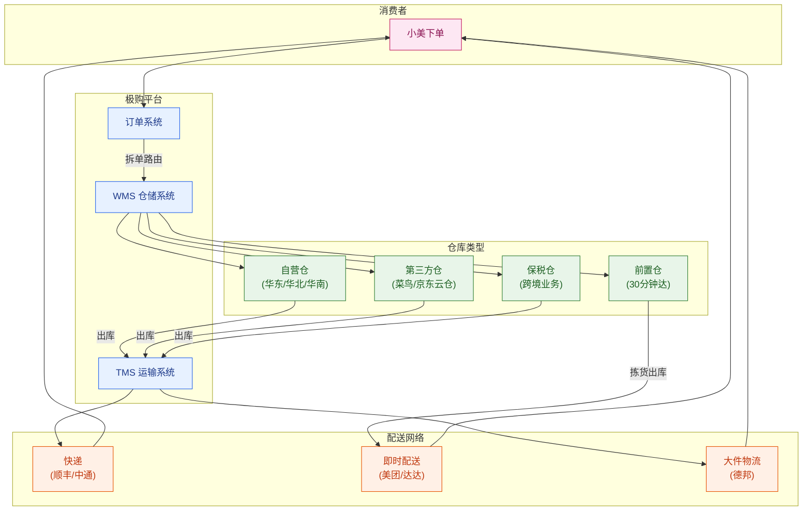

### 15.10.2 仓库类型对比

| 仓库 | 模式 | 优势 | 适合 |
|------|------|------|------|
| **自营仓** | 极购自建+自营 | 服务标准、库存可控 | 标品、3C |
| **第三方仓** | 菜鸟/京东云仓托管 | 商家按需租 | 中小商家 |
| **保税仓** | 跨境电商+海关监管 | 跨境商品合法入境 | 进口商品 |
| **前置仓** | 城市内小型仓（盒马/美团买菜） | 30 分钟达 | 生鲜、即时零售 |

---

## 15.11 O2O 与即时配送

### 15.11.1 即时配送链路

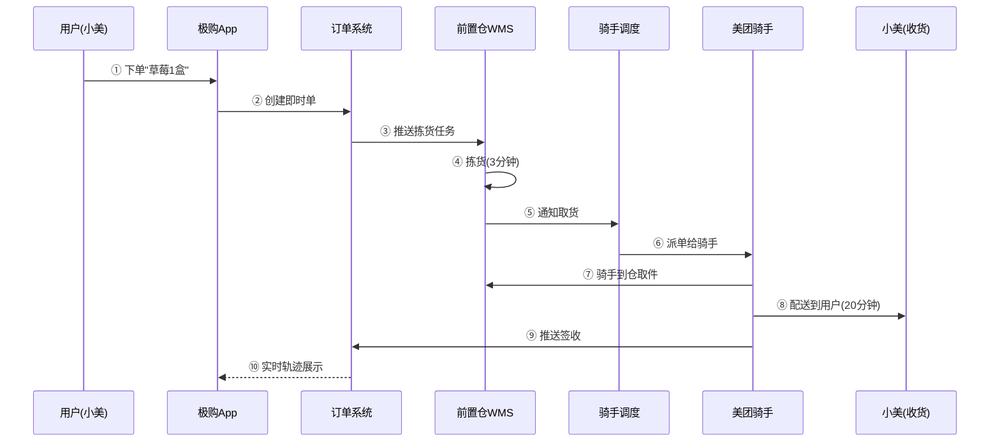

### 15.11.2 主流即时配送平台

| 平台 | 履约能力 | 适合 |
|------|---------|------|
| **美团骑手** | 30 分钟内、24h | 餐饮、生鲜 |
| **达达** | 同城 1 小时 | 商超、零售 |
| **顺丰同城** | 高端 1 小时 | 文件、3C |
| **闪送** | 1 对 1 直送 | 文件、鲜花 |

---

## 15.12 跨境物流

### 15.12.1 两种主要模式

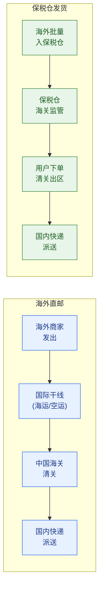

| 模式 | 时效 | 成本 | 适合 |
|------|------|------|------|
| **海外直邮** | 7-15 天 | 高 | 长尾 SKU、奢侈品 |
| **保税仓** | 3-7 天 | 低 | 爆款、标品 |

### 15.12.2 清关核心

- 真实身份信息：身份证号 + 姓名（海关 9610 通道）
- 申报价值：与实际支付价一致
- 商品 HS 编码：决定税率（化妆品 50%、食品 13%）

---

## 15.13 体验优化

### 15.13.1 物流时效预测

小美下单时最关心：**"我什么时候能收到？"**。极购根据历史数据和实时信息预估：

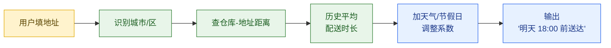

### 15.13.2 智能物流推荐

下单页给用户推荐：

| 场景 | 推荐策略 |
|------|---------|
| 急用 | 顺丰特快（次日达，加 12 元） |
| 不急 | 中通标快（3-4 天，包邮） |
| 偏远地区 | 邮政（兜底） |
| 退换货 | 上门取件（顺丰/德邦） |

### 15.13.3 在途改派

小美出差想换地址——物流商在派送前提供改派接口（顺丰 100% 支持、中通部分支持）。**关键节点**：`OUT_FOR_DELIVERY` 之前都可改。

### 15.13.4 上门取件（退换货）

退换货场景下，平台调度骑手到用户家里取件：

```
用户申请退货 → 极购调度顺丰/德邦 → 骑手上门（2小时窗口）
  → 取件成功 → 用户拿取件码
  → 包裹逆向回商家
  → 商家签收 → 极购退款给用户
```

---

## 15.14 典型问题

### 15.14.1 物流信息长时间不更新

**现象**：轨迹停在"已揽收"3 天没动。

**根因**：
- 物流商漏推轨迹（中转环节 SCAN 设备故障）
- 极购 Kafka 消费积压
- Webhook 域名被运营商 DNS 污染

**解决**：
- 兜底轮询：极购每 2 小时主动调一次轨迹查询 API（顺丰/tx）
- 多通道：Webhook + 主动轮询双保险
- 报警：单量>100/小时卡在中间状态 → 报警

### 15.14.2 签收失败

**现象**：物流商推 DELIVERED，但用户说没收到。

**根因**：
- 派送员放在驿站/快递柜，未通知用户
- 签收人不是本人（代签不规范）

**解决**：
- 区分"驿站签收"和"本人签收"
- 24h 内用户反馈"未收到" → 启动核查流程

### 15.14.3 错发漏发

**现象**：用户下单 A 商品，收到 B 商品。

**根因**：商家打包错误。

**解决**：商家责任 → 商家补发或退款；极购平台介入仲裁。

### 15.14.4 跨境清关失败

**现象**：包裹清关被海关扣留。

**根因**：
- 身份证号错误
- 商品超限（化妆品单次 1500 元/件）
- HS 编码错

**解决**：
- 清关前预校验
- 引导用户修改信息后重新清关
- 兜底：原路退回

---

## 本章小结

物流系统是商城的**履约最后一公里**——它直接决定消费者体验。本章从架构到代码，梳理了物流域的完整链路：

1. **物流系统全景**：极购作为平台方，统一对接 50+ 物流商、商家、消费者，7 大子系统（面单/运费/发货/轨迹/签收/异常）环环相扣。

2. **物流商对接**：电子面单 + 轨迹推送 + 运费计算，三大接口标准化适配。

3. **电子面单**：三段码标准化、号段管理、Redis 预占 + DB 兜底。极购统一申请号段，分给商家。

4. **运费模板**：按件数/重量/体积，包邮条件 + 偏远附加费，区域差异化定价。

5. **发货流程**：状态机驱动（CREATED→PICKED_UP→IN_TRANSIT→OUT_FOR_DELIVERY→DELIVERED），商家→揽收→中转→派送。

6. **轨迹回传**：Webhook + Kafka 异步消费 + Redis 缓存（1h TTL），状态机校验防回退。

7. **签收与异常**：物流商回传 + 15 天自动确认。丢件/破损/错送/退件四类异常各有标准化处理。

8. **仓配一体**：自营仓 + 第三方仓 + 保税仓 + 前置仓，按业务模式分发。

9. **即时配送**：美团/达达骑手，30 分钟达，前置仓拣货。

10. **跨境物流**：海外直邮 + 保税仓双模式，海关清关是核心环节。

11. **体验优化**：时效预测、智能推荐、在途改派、上门取件。

**关键工程能力**：状态机设计、消息幂等、多通道容灾（Webhook+轮询）、Redis 缓存削峰、商家/物流商责任界定。物流系统不是技术最难的部分，但是**业务复杂度最高、跨主体协调最多**的部分。

---

> **下一章预告**：极购日均 800 万订单、1500 万 DAU，必然吸引灰黑产。账号被盗刷、商家刷单、恶意退款、套现……第 16 章将深入**风控与反欺诈系统**，讲解规则引擎、机器学习、设备指纹、人机识别等核心机制。

---

> 🚀 **下一章**：[第 16 章 · 风控与反欺诈](./16-风控与反欺诈.md)

---

## 参考来源

1. **顺丰开放平台** — 顺丰科技，电子面单 API 与轨迹推送文档
   https://open.sf-express.com/

2. **菜鸟物流开放平台** — 阿里巴巴，物流商聚合与电子面单
   https://open.cainiao.com/

3. **京东物流开放平台** — 京东物流，物流轨迹与电子面单
   https://open.jdl.com/

4. **国家邮政局** — 快递业务经营许可证查询，物流商资质
   https://www.spb.gov.cn/

5. **海关 9610 跨境电商** — 跨境电商零售出口监管模式
   http://www.customs.gov.cn/

6. **美团配送开放平台** — 美团，即时配送 API
   https://developer.meituan.com/

7. **达达开放平台** — 京东到家，本地即时配送
   https://developer.imdada.cn/

8. **电商物流系统设计实战** — 极客时间，《从 0 开始学架构》电商篇
   https://time.geekbang.org/

9. **电子面单国家标准 GB/T 35744-2017** — 中检集团，标准化面单
   https://openstd.samr.gov.cn/

10. **物流状态机设计模式** — Martin Fowler，《Patterns of Enterprise Application Architecture》
    https://martinfowler.com/eaaCatalog/
