# 第 16 章 · 风控与反欺诈

> **所属系列**：商城平台系统设计 · 全景教程
>
> **上一章**：[第 15 章 · 物流与配送系统](./15-物流与配送系统.md)　|　**下一章**：[第 17 章 · 数据中台与 BI](./17-数据中台与BI.md)　|　**总目录**：[教程大纲](./00-教程大纲.md)

---

## 本章导读

小美今天心情很好——她又收到了极购商城到账的一笔退款。但这背后，是平台风控系统每秒钟在做 **5.8 万次**风险决策。

同一时刻，黑产小李正带着 300 台群控设备和 5,000 张从接码平台买来的手机号，准备在极购注册一批"羊毛号"，抢下午 3 点开抢的"满 199 减 100"大额优惠券。按他的经验，这批号能薅 **5 万元** 优惠券，再通过刷单把券套成现金——只要平台风控没盯上，1 小时就能干完。

小美在结账时被风控"无形中保护"着：小李在第 6 次尝试领券时被识别，群控设备被标记、号段被拉黑——风控系统在 **120 毫秒**内完成了这一连串动作。这就是极购风控系统的日常：**日风险调用 5 亿次、识别黑产账号 1 万个、每天拦截 200 万次异常请求、保护 800 万订单背后的真实用户**。

风控（Risk Control）不是某个独立模块，而是**贯穿账号、交易、营销、支付、售后、商家全链路的"免疫系统"**。它包含 6 大子域：账号风控、交易风控、营销风控、售后风控、内容风控、商家风控。本章将逐一拆解。

本章主要内容：

1. **风控全景架构**——6 大子域、四层防御、决策链路
2. **黑产攻击方式**——批量注册、群控、撞库、羊毛党、恶意退款
3. **风控数据基础**——设备指纹、行为序列、IP 画像、关系网络
4. **风控规则引擎**——决策表、规则定义与执行（含 Java 示例）
5. **风控机器学习**——XGBoost、异常检测、图神经网络（含 Python 示例）
6. **风控决策链路**——事前/事中/事后三层
7. **关键场景**——注册、登录、领券、下单、支付、退款、商家风控
8. **风控与上下游**——与订单/支付/营销/客服/用户中心的对接
9. **人机协同**——自动/复核/人工
10. **风控可观测**——指标体系、监控大盘
11. **典型问题**——误杀、漏判、规则僵化、黑产技术升级
12. **完整案例**——小李攻击与小美保护的端到端流程

读完本章你将能回答：**黑产是怎么攻击的？风控怎么识别？规则引擎怎么设计？机器学习怎么融入决策链？如何平衡误杀和漏判？**

---

## 16.1 为什么电商需要风控

### 16.1.1 损失规模：黑产一年薅走多少钱

| 风险类型 | 全行业年损失（估算） | 极购单日发生量 |
|---|---|---|
| 批量注册养号 | 100 亿元 | 黑产账号 1 万+ |
| 营销套利（薅羊毛） | 200 亿元 | 拦截 80 万次 |
| 刷单炒信 | 300 亿元 | 识别刷单 2 万笔 |
| 套现 | 150 亿元 | 拦截 5,000 笔 |
| 恶意退款 | 80 亿元 | 拦截 1.2 万笔 |
| 撞库盗号 | 50 亿元 | 拦截 30 万次 |
| 短信轰炸 | 20 亿元 | 拦截 100 万次 |

对「极购商城」而言：日 GMV 10 亿元，假设黑产攻击吃掉其中 **0.5%**，每天就是 500 万元、每年 18 亿元。这笔钱最终要么被黑产薅走，要么作为"退款损失"由商家和平台分摊。**风控不是"锦上添花"，而是平台的生死线**。

### 16.1.2 风险生态：三方博弈

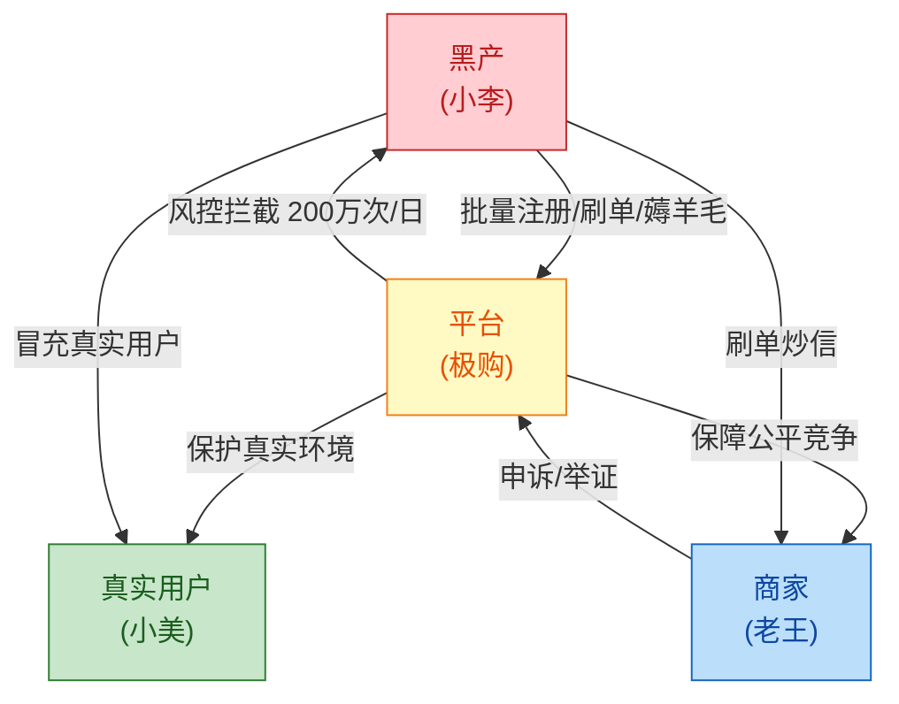

- **黑产**：以最小成本薅走最多资产，技术持续升级；
- **真实用户**：被黑产间接损害（券被抢光、库存被占、价格被刷高）；
- **商家**：被刷单污染店铺数据、被恶意退款、被套现；
- **平台**：资金损失、品牌信誉下降、合规风险。

### 16.1.3 监管压力

- **网络安全法**：要求平台对账号异常、批量注册有识别和拦截能力；
- **个人信息保护法**：风控采集数据需遵循"最小必要"原则；
- **反洗钱法**：套现、信用卡套现等行为需上报可疑交易；
- **电商法**：禁止"刷单炒信"，平台负主体责任。

---

## 16.2 风控全景架构

### 16.2.1 风控 6 大子域

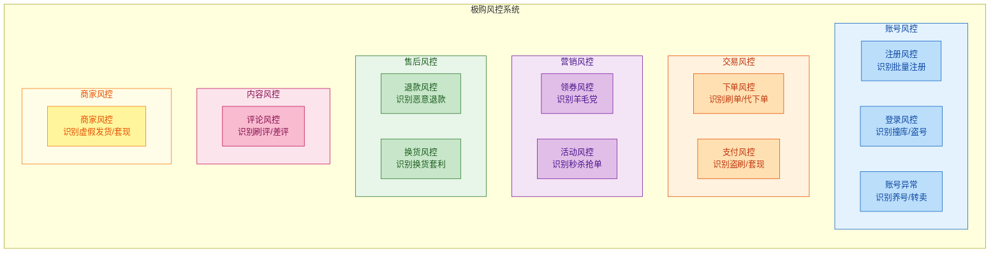

### 16.2.2 风控 4 层防御

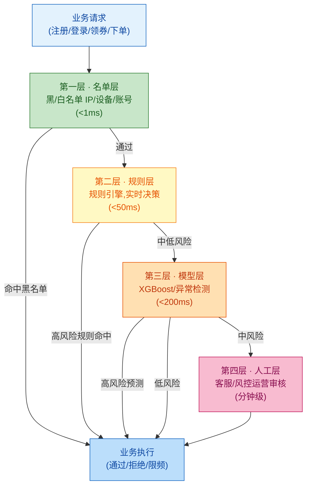

**层间原则**：

- **名单层是快刀**：O(1) 查询，处理已知黑产；
- **规则层是主力**：处理已知的、可描述的规则；
- **模型层是重武器**：处理复杂模式、未见过的攻击；
- **人工层是兜底**：处理模糊地带和数据标注回流。

---

## 16.3 黑产攻击方式详解

### 16.3.1 攻击方式全景

| 攻击方式 | 工具/资源 | 目的 | 规模 |
|---|---|---|---|
| **批量注册** | 接码平台、虚拟号、卡商 | 制造大量"账号" | 一次 1 万+ |
| **群控** | 云手机、群控系统、改机工具 | 一台电脑控制千台设备 | 单人控 1 万设备 |
| **猫池/卡商** | 短信猫池、虚拟 SIM | 接收短信验证码 | 1 猫池 = 128 张卡 |
| **撞库** | 脱库数据、撞库工具 | 用已有账号密码尝试登录 | 一次 100 万账号 |
| **短信轰炸** | 短信接口滥用 | 刷量、骚扰、敲诈 | 单日 100 万条 |
| **羊毛党** | 自动化脚本、群控 | 抢券、抢秒杀、刷首单 | 单日薅 5 万+ |
| **恶意退款** | 真实账号+自动化 | 收到货不花钱、仅退款不退货 | 一次退 200 单 |
| **刷单** | 真实账号、垫付资金 | 店铺刷销量、刷评价 | 一次 1000 单 |
| **套现** | 信用卡、虚假交易 | 把信用额度变现金 | 一次套 5 万 |
| **代下单** | 黄牛、自动化 | 抢热门商品转卖 | 单日 1000 单 |

### 16.3.2 黑产产业链

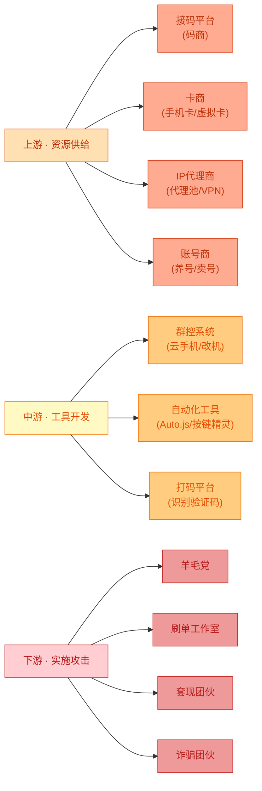

**小李的一天**：他清晨花 500 元从码商买 5,000 个手机号，从 IP 商买 200 个代理 IP，从工具商下载最新改机工具（每次大促前都会更新，绕过平台指纹检测）。上午在云手机群控上批量注册 5,000 个账号（自动化脚本，30 分钟搞定），下午抢 5,000 张券（每张价值 50 元），晚上通过刷单把券变现。**一个工作日净赚 20 万**。

---

## 16.4 风控数据基础

### 16.4.1 设备指纹（Device Fingerprint）

设备指纹是通过收集**多维设备属性**计算出的稳定唯一标识符。即使黑产重置 GAID/IDFA、改机改串号，设备指纹依然能识别"同一台物理设备"。

```java
/**
 * 设备指纹生成器
 * 对应:小美登录/小李注册时上报
 * 极购风控核心:信号越多,黑产绕过成本越高
 */
@Service
public class DeviceFingerprintGenerator {

    @Autowired private RedisTemplate<String, String> redis;

    /**
     * 生成设备指纹(主路径)
     */
    public String generateFingerprint(FingerprintRequest req) {
        // 1. 收集所有信号
        Map<String, String> signals = new LinkedHashMap<>();
        signals.put("device_id", safe(req.getDeviceId()));     // GAID/IDFA
        signals.put("android_id", safe(req.getAndroidId()));
        signals.put("imei", safe(req.getImei()));
        signals.put("mac", safe(req.getMac()));
        signals.put("serial", safe(req.getSerial()));
        signals.put("model", safe(req.getModel()));             // 设备型号
        signals.put("brand", safe(req.getBrand()));
        signals.put("os_version", safe(req.getOsVersion()));
        signals.put("screen_w", String.valueOf(req.getScreenW()));
        signals.put("screen_h", String.valueOf(req.getScreenH()));
        signals.put("cpu_abi", safe(req.getCpuAbi()));
        signals.put("ram_size", String.valueOf(req.getRamSize()));
        signals.put("rom_size", String.valueOf(req.getRomSize()));
        signals.put("imei_md5", md5(safe(req.getImei())));
        signals.put("mac_md5", md5(safe(req.getMac())));
        signals.put("serial_md5", md5(safe(req.getSerial())));
        // 浏览器/UA 类(主要 H5 场景)
        signals.put("ua", safe(req.getUserAgent()));
        signals.put("canvas_fp", safe(req.getCanvasFingerprint()));
        signals.put("webgl_fp", safe(req.getWebglFingerprint()));
        signals.put("audio_fp", safe(req.getAudioFingerprint()));
        // 网络类
        signals.put("ssid", safe(req.getSsid()));
        signals.put("bssid", safe(req.getBssid()));
        signals.put("carrier", safe(req.getCarrier()));

        // 2. 排序后拼接 + 哈希
        String sorted = signals.entrySet().stream()
            .filter(e -> e.getValue() != null && !e.getValue().isEmpty())
            .sorted(Map.Entry.comparingByKey())
            .map(e -> e.getKey() + "=" + e.getValue())
            .collect(Collectors.joining("|"));
        String fingerprint = DigestUtils.sha256Hex(sorted);

        // 3. 记录到指纹库(用于查询"指纹对应的账号/IP 历史")
        redis.opsForValue().set("fp:" + fingerprint,
            JsonUtil.toJson(signals), Duration.ofDays(90));

        return fingerprint;
    }

    /**
     * 判断两个指纹是否同一设备
     * 当黑产改了部分信号(改了 IMEI 但没改 MAC),用相似度匹配
     */
    public double similarity(String fp1Json, String fp2Json) {
        Map<String, String> a = JsonUtil.toMap(fp1Json);
        Map<String, String> b = JsonUtil.toMap(fp2Json);
        // 强信号(几乎不能同时改):MAC、Serial、IMEI
        // 弱信号(改机工具会改):device_id(GAID)、android_id
        int strongMatch = 0, strongTotal = 0;
        for (String k : List.of("imei_md5", "mac_md5", "serial_md5")) {
            if (a.containsKey(k) && b.containsKey(k)) {
                strongTotal++;
                if (a.get(k).equals(b.get(k))) strongMatch++;
            }
        }
        return strongTotal == 0 ? 0 : (double) strongMatch / strongTotal;
    }
}
```

**指纹信号分强弱**：

- **强信号**（几乎不能同时改）：MAC、Serial、IMEI、CPU ABI、屏幕分辨率（硬件相关）；
- **弱信号**（改机工具会改）：GAID/IDFA、Android ID、device_id；
- **行为信号**（难以伪装）：传感器噪声、触摸压力分布、滑动曲线。

### 16.4.2 行为序列

行为序列是用户在 App/H5 上的**操作流**，能区分真人和机器人。

```java
/**
 * 行为特征提取
 * 极购风控:小美滑动看详情 vs 小李脚本批量点击,特征差异巨大
 */
@Service
public class BehaviorFeatureExtractor {

    /**
     * 提取行为特征
     */
    public BehaviorFeature extract(String userId, List<BehaviorEvent> events) {
        BehaviorFeature f = new BehaviorFeature();
        f.setUserId(userId);

        // 时间间隔特征
        List<Long> intervals = new ArrayList<>();
        for (int i = 1; i < events.size(); i++) {
            intervals.add(events.get(i).getTimestamp()
                - events.get(i-1).getTimestamp());
        }
        f.setMeanInterval(mean(intervals));
        f.setStdInterval(std(intervals));
        f.setMinInterval(min(intervals));
        f.setMaxInterval(max(intervals));

        // 变异系数 CV = std/mean,真人大、机器人小
        f.setCv(f.getMeanInterval() > 0
            ? f.getStdInterval() / f.getMeanInterval() : 0);

        // 操作类型分布
        Map<String, Long> typeCount = events.stream()
            .collect(Collectors.groupingBy(BehaviorEvent::getType,
                Collectors.counting()));
        // 计算熵(操作多样性),真人多样、机器人单调
        f.setEntropy(entropy(typeCount));

        // 滑动特征(滑动看详情)
        List<BehaviorEvent> scrolls = events.stream()
            .filter(e -> "scroll".equals(e.getType()))
            .collect(Collectors.toList());
        f.setScrollCount(scrolls.size());
        f.setMeanScrollSpeed(scrolls.stream()
            .mapToLong(BehaviorEvent::getSpeed).average().orElse(0));

        // 触摸特征(点击坐标分布)
        List<BehaviorEvent> clicks = events.stream()
            .filter(e -> "click".equals(e.getType()))
            .collect(Collectors.toList());
        f.setClickCount(clicks.size());
        f.setClickPositionVariance(computePositionVariance(clicks));

        // 停留时间(在页面停留)
        Map<String, Long> pageDwell = events.stream()
            .filter(e -> "page_view".equals(e.getType()))
            .collect(Collectors.groupingBy(BehaviorEvent::getPage,
                Collectors.summingLong(BehaviorEvent::getDuration)));
        f.setMeanPageDwell(mean(new ArrayList<>(pageDwell.values())));

        return f;
    }
}

/**
 * 行为特征判定:真人 vs 机器人
 */
public class BehaviorJudge {

    public static boolean isLikelyBot(BehaviorFeature f) {
        // 规则 1:点击间隔极规律(CV < 0.1)
        if (f.getCv() < 0.1) return true;

        // 规则 2:无任何滑动(直接点)
        if (f.getScrollCount() == 0 && f.getClickCount() > 5) return true;

        // 规则 3:操作类型熵极低(只点不浏览)
        if (f.getEntropy() < 0.5) return true;

        // 规则 4:页面停留时间全 0(瞬间跳走)
        if (f.getMeanPageDwell() == 0 && f.getClickCount() > 3) return true;

        // 规则 5:点击位置高度聚集(都点同一个按钮)
        if (f.getClickPositionVariance() < 100) return true;

        return false;
    }
}
```

### 16.4.3 IP 画像

| IP 类型 | 识别方式 | 处理策略 |
|---|---|---|
| **IDC IP**（机房） | ASN 属于 AWS/阿里云/腾讯云 | 可疑，可加白仅限登录 |
| **代理 IP** | TCP 指纹异常、时延异常 | 标记可疑 |
| **VPN IP** | 公开代理库 + 主动探测 | 标记可疑 |
| **移动基站 IP** | 运营商 IP 段 | 通常正常 |
| **家用宽带 IP** | IP 归属地与发货地址匹配 | 正常 |
| **同 IP 多账号** | 1 个 IP 登录 100 个账号 | 强风险信号 |

### 16.4.4 关系网络

关系网络是风控的"核武器"——单个维度看不出的问题，群体维度一看就现形。

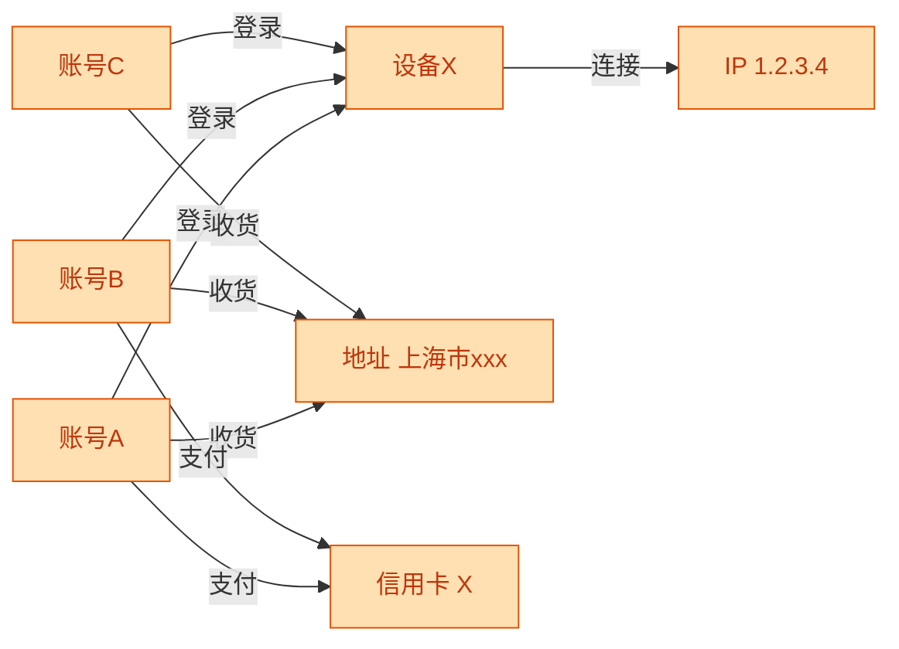

3 个账号共享 1 台设备、1 个 IP、1 个收货地址、1 张支付卡——**这不是巧合，是团伙**。极购关系图谱规模：**10 亿节点、100 亿边、1 万亿关系**，跑图算法找团伙。

---

## 16.5 风控规则引擎

### 16.5.1 规则引擎架构

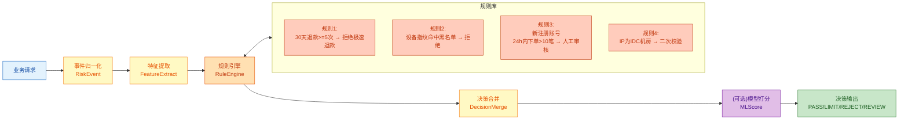

### 16.5.2 规则定义

```java
/**
 * 风控规则定义
 * 极购风控:规则是热加载的,运营可以后台配置
 */
@Data
public class RiskRule {
    private String ruleId;            // 规则 ID
    private String ruleName;          // 规则名
    private String scene;             // 适用场景:REGISTER/LOGIN/COUPON/ORDER/PAY/A_REFUND
    private String expression;        // 规则表达式(DSL)
    private int priority;             // 优先级 1-100
    private String action;            // 动作:PASS/LIMIT/REJECT/REVIEW
    private double confidence;        // 命中后的置信度权重
    private boolean enabled;          // 是否启用
    private String version;           // 版本号
}

/**
 * 规则表达式示例(DSL):
 * "refund_count_30d >= 5 && amount < 10000" -> 30 天退款 5 次以上且金额小于 100 元
 * "device_risk_tag in ('KNOWN_BOT', 'IDC_DEVICE')" -> 设备指纹命中已知黑产
 * "register_age_minute < 60 && order_count_24h > 10" -> 注册 1 小时内下单 10 笔
 * "ip_asn_type == 'IDC' && login_count_24h > 5" -> IDC IP 1 天登录 5 次
 */
```

### 16.5.3 规则引擎实现

```java
/**
 * 极购风控规则引擎(简化实现)
 * 真实生产会用 Drools/Aviator,本章用 Java 手写核心逻辑便于理解
 */
@Service
public class RiskRuleEngine {

    @Autowired private RiskRuleDao ruleDao;
    @Autowired private FeatureService featureService;
    @Autowired private RiskBlacklistDao blacklistDao;
    @Autowired private DeviceRiskDao deviceRiskDao;
    @Autowired private MlRiskService mlRiskService;

    // ─── 规则执行入口 ───────────────────────────────────────────────
    public RiskDecision evaluate(String scene, RiskContext ctx) {
        long start = System.currentTimeMillis();

        // 1. 查询所有启用规则
        List<RiskRule> rules = ruleDao.findEnabledByScene(scene);

        // 2. 提取特征(从上下文/实时计算/Redis 缓存)
        Map<String, Object> features = featureService.extract(ctx);

        // 3. 规则匹配
        List<RuleHit> hits = new ArrayList<>();
        for (RiskRule rule : rules) {
            if (match(rule.getExpression(), features)) {
                hits.add(new RuleHit(rule, rule.getAction(), rule.getConfidence()));
                // 拒绝类规则命中后立即返回
                if ("REJECT".equals(rule.getAction())) {
                    return RiskDecision.reject(rule.getRuleName(), rule.getRuleId());
                }
            }
        }

        // 4. ML 模型打分(中低风险才调用,降低 RT)
        if (hits.isEmpty() || allLimitAction(hits)) {
            MlScore ml = mlRiskService.predict(scene, features);
            if (ml.getScore() > 80) {
                return RiskDecision.reject("ML_HIGH_RISK", ml.getReason());
            }
            if (ml.getScore() > 50) {
                return RiskDecision.review("ML_MID_RISK", ml.getReason());
            }
        }

        // 5. 决策合并
        RiskDecision decision = mergeDecisions(hits);
        decision.setCostMs(System.currentTimeMillis() - start);
        return decision;
    }

    // ─── 规则表达式匹配(用 Aviator 引擎)──────────────────────────────
    private boolean match(String expression, Map<String, Object> features) {
        try {
            // 真实生产用 Aviator/Groovy,这里简化
            Expression e = AviatorEvaluator.compile(expression);
            Boolean result = (Boolean) e.execute(features);
            return Boolean.TRUE.equals(result);
        } catch (Exception ex) {
            log.error("规则表达式执行失败 expression={}", expression, ex);
            return false;  // 规则出错不命中,避免误杀
        }
    }

    // ─── 决策合并 ────────────────────────────────────────────────
    private RiskDecision mergeDecisions(List<RuleHit> hits) {
        if (hits.isEmpty()) return RiskDecision.pass();

        // 按优先级 + 置信度合并
        double totalConfidence = hits.stream()
            .mapToDouble(RuleHit::getConfidence).sum();
        Set<String> actions = hits.stream()
            .map(RuleHit::getAction).collect(Collectors.toSet());

        if (actions.contains("REJECT") || totalConfidence > 0.85) {
            return RiskDecision.reject(
                hits.stream().map(h -> h.getRule().getRuleName())
                    .collect(Collectors.joining(",")),
                String.valueOf(totalConfidence));
        }
        if (actions.contains("REVIEW") || totalConfidence > 0.5) {
            return RiskDecision.review(
                hits.stream().map(h -> h.getRule().getRuleName())
                    .collect(Collectors.joining(",")),
                String.valueOf(totalConfidence));
        }
        if (actions.contains("LIMIT")) {
            return RiskDecision.limit(
                hits.stream().map(h -> h.getRule().getRuleName())
                    .collect(Collectors.joining(",")),
                String.valueOf(totalConfidence));
        }
        return RiskDecision.pass();
    }
}

/**
 * 风控决策结果
 */
@Data
public class RiskDecision {
    public enum Action { PASS, LIMIT, REJECT, REVIEW }
    private Action action;            // 最终动作
    private String ruleId;            // 触发规则
    private String reason;            // 原因
    private double score;             // 风险分 0-100
    private long costMs;              // 决策耗时

    public static RiskDecision pass() {
        RiskDecision d = new RiskDecision();
        d.setAction(Action.PASS);
        d.setScore(0);
        return d;
    }
    public static RiskDecision reject(String ruleId, String reason) {
        RiskDecision d = new RiskDecision();
        d.setAction(Action.REJECT);
        d.setRuleId(ruleId);
        d.setReason(reason);
        d.setScore(95);
        return d;
    }
    public static RiskDecision review(String ruleId, String reason) {
        RiskDecision d = new RiskDecision();
        d.setAction(Action.REVIEW);
        d.setRuleId(ruleId);
        d.setReason(reason);
        d.setScore(60);
        return d;
    }
    public static RiskDecision limit(String ruleId, String reason) {
        RiskDecision d = new RiskDecision();
        d.setAction(Action.LIMIT);
        d.setRuleId(ruleId);
        d.setReason(reason);
        d.setScore(40);
        return d;
    }
}
```

### 16.5.4 规则执行流程

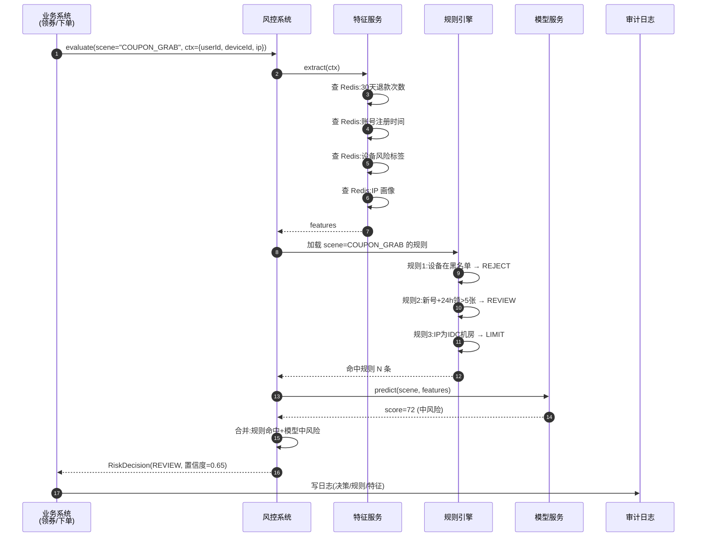

---

## 16.6 风控机器学习

### 16.6.1 三大类模型

| 模型类型 | 适用场景 | 算法 | 输入 | 输出 |
|---|---|---|---|---|
| **有监督学习** | 二分类（黑/白） | XGBoost/LightGBM/CatBoost | 200+ 维特征 | 风险分 0-100 |
| **无监督异常检测** | 0day 攻击检测 | Isolation Forest / DBSCAN / AutoEncoder | 行为特征 | 异常分数 |
| **图神经网络** | 团伙识别 | GCN/GraphSAGE | 关系子图 | 节点嵌入+团伙分数 |

### 16.6.2 有监督模型（XGBoost 推理伪代码）

```python
"""
极购风控 - XGBoost 风险模型推理
输入:特征字典(账号/设备/IP/行为/历史)
输出:风险分(0-100)
"""
import xgboost as xgb
import numpy as np
from typing import Dict

class RiskModel:
    def __init__(self, model_path: str):
        self.model = xgb.Booster()
        self.model.load_model(model_path)
        # 特征顺序必须与训练一致
        self.feature_names = [
            "account_age_days",        # 账号年龄
            "order_count_30d",         # 30 天下单数
            "refund_count_30d",        # 30 天退款数
            "refund_rate_90d",         # 90 天退款率
            "coupon_count_30d",        # 30 天领券数
            "avg_order_amount",        # 平均订单金额
            "register_ip_risk_score",  # 注册 IP 风险分
            "device_risk_score",       # 设备风险分
            "device_account_count",    # 该设备关联账号数
            "ip_account_count_24h",    # 24h 该 IP 关联账号数
            "behavior_cv",             # 行为变异系数
            "behavior_entropy",        # 行为熵
            "behavior_click_position_var",  # 点击位置方差
            "address_change_count_30d",    # 30 天地址变更次数
            "phone_marketing_risk",    # 手机号营销风险
            "card_count_90d",          # 90 天绑定卡数
            "login_geo_distance",      # 登录地与常用地距离
            "high_risk_action_count",  # 高危操作次数
            # ... 实际 200+ 维
        ]

    def predict(self, features: Dict[str, float]) -> Dict:
        """
        推理一次
        返回:{"score": 0-100, "reason": ["原因1", "原因2"]}
        """
        # 1. 特征向量化
        x = np.array([[features.get(name, 0.0)
                       for name in self.feature_names]])

        # 2. 模型推理
        dmatrix = xgb.DMatrix(x, feature_names=self.feature_names)
        prob = self.model.predict(dmatrix)[0]  # 0~1 之间

        # 3. 转 0-100 分
        score = float(prob * 100)

        # 4. SHAP 解释(可选,用于人工复核时展示"为什么打这个分")
        reasons = self._explain(features, x)

        return {
            "score": round(score, 2),
            "is_high_risk": score > 80,
            "is_mid_risk": 50 < score <= 80,
            "reasons": reasons,
        }

    def _explain(self, features: Dict, x: np.ndarray) -> list:
        """简化版 SHAP 解释"""
        reasons = []
        if features.get("device_account_count", 0) > 5:
            reasons.append("设备关联多账号(疑似群控)")
        if features.get("refund_rate_90d", 0) > 0.3:
            reasons.append("90天退款率超30%")
        if features.get("behavior_cv", 1) < 0.1:
            reasons.append("行为过于规律(疑似脚本)")
        if features.get("ip_account_count_24h", 0) > 10:
            reasons.append("IP 24h 关联账号过多(疑似代理池)")
        return reasons


# ─── 特征提取(在 Java 端做特征工程,Python 端只做模型推理)────────
class FeatureService:
    def build_features(self, user_id: str, device_id: str, ip: str) -> Dict:
        return {
            "account_age_days": self._redis.hget(f"u:{user_id}", "age_days"),
            "order_count_30d": self._redis.hget(f"u:{user_id}", "order_30d"),
            "refund_count_30d": self._redis.hget(f"u:{user_id}", "refund_30d"),
            "refund_rate_90d": self._redis.hget(f"u:{user_id}", "refund_rate_90d"),
            "coupon_count_30d": self._redis.hget(f"u:{user_id}", "coupon_30d"),
            "avg_order_amount": self._redis.hget(f"u:{user_id}", "avg_amount"),
            "register_ip_risk_score": self._ip_risk(self._redis.hget(f"u:{user_id}", "reg_ip")),
            "device_risk_score": self._device_risk(device_id),
            "device_account_count": self._redis.scard(f"d:{device_id}:accounts"),
            "ip_account_count_24h": self._redis.scard(f"ip:{ip}:accounts:24h"),
            "behavior_cv": self._redis.hget(f"u:{user_id}", "behavior_cv"),
            "behavior_entropy": self._redis.hget(f"u:{user_id}", "behavior_entropy"),
            "behavior_click_position_var": self._redis.hget(f"u:{user_id}", "click_var"),
            "address_change_count_30d": self._redis.hget(f"u:{user_id}", "addr_change_30d"),
            "phone_marketing_risk": self._phone_risk(self._redis.hget(f"u:{user_id}", "phone")),
            "card_count_90d": self._redis.hget(f"u:{user_id}", "card_90d"),
            "login_geo_distance": self._redis.hget(f"u:{user_id}", "geo_distance"),
            "high_risk_action_count": self._redis.hget(f"u:{user_id}", "high_risk_30d"),
        }


# ─── 使用示例 ──────────────────────────────────────────────────────
if __name__ == "__main__":
    model = RiskModel("/models/risk_v123.json")
    feat_service = FeatureService()

    # 小美(正常用户)
    normal = feat_service.build_features("user_xiaomei", "device_xyz", "120.55.66.77")
    result = model.predict(normal)
    print(f"小美风险分: {result['score']}, 是否高风险: {result['is_high_risk']}")
    # 输出: 小美风险分: 5.2, 是否高风险: False

    # 小李(黑产)
    fraud = feat_service.build_features("user_xiaoli", "device_qunhkong", "52.0.114.1")
    # 假设小李的设备关联 200 个账号、IP 是 IDC 机房、行为 CV 极低
    result2 = model.predict(fraud)
    print(f"小李风险分: {result2['score']}, 原因: {result2['reasons']}")
    # 输出: 小李风险分: 92.5, 原因: ['设备关联多账号(疑似群控)', 'IP 24h 关联账号过多...']
```

### 16.6.3 实时特征工程

实时特征要求**毫秒级查询**，极购的特征架构：

| 特征类型 | 存储 | 写入 | 查询延迟 |
|---|---|---|---|
| **账号特征** | Redis Hash | 实时更新 | < 5ms |
| **设备特征** | Redis Hash | 实时更新 | < 5ms |
| **IP 特征** | Redis Hash + Bloom Filter | 实时更新 | < 5ms |
| **行为特征** | Redis + Flink 实时计算 | 实时计算 | < 10ms |
| **关系特征** | JanusGraph/Neo4j + 缓存 | 异步构建 | < 50ms |
| **历史离线特征** | Hive + 缓存到 Redis | T+1 同步 | < 5ms |

---

## 16.7 风控决策链路（事前/事中/事后）

### 16.7.1 三层决策链路

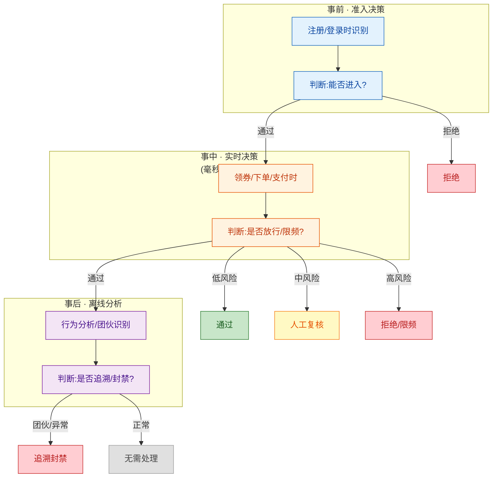

### 16.7.2 决策时间点

| 时间点 | 场景 | 决策目标 | 延迟要求 |
|---|---|---|---|
| **事前** | 注册、登录 | 阻断黑产进入 | < 100ms |
| **事中** | 领券、下单、支付、退款 | 拦截/限频/二次校验 | < 200ms |
| **事后** | 行为分析、团伙识别 | 追溯、封号、降权 | T+1（次日） |

---

## 16.8 关键场景详解

### 16.8.1 注册风控

**目标**：阻断批量注册（黑产养号源头）

**核心规则**：

| 规则 | 阈值 | 动作 |
|---|---|---|
| 手机号段命中接码平台 | 是 | 拒绝注册 |
| 设备指纹命中黑产设备库 | 是 | 拒绝注册 |
| 同设备 1 小时内注册数 | ≥ 3 | 触发图形验证码 |
| 同 IP 1 小时内注册数 | ≥ 10 | 拒绝注册 |
| 注册行为 CV（输入手机号→收验证码→提交） | < 0.1 | 触发图形验证码 |
| 设备关联账号数（30 天） | ≥ 5 | 拒绝注册 |
| ML 模型预测 | score > 80 | 拒绝注册 |

### 16.8.2 登录风控

**目标**：识别撞库攻击、盗号登录

**核心规则**：

| 规则 | 阈值 | 动作 |
|---|---|---|
| 1 小时内同账号失败登录 | ≥ 10 | 锁定账号 30 分钟 |
| 1 小时内同 IP 不同账号失败登录 | ≥ 50 | IP 加入临时黑名单 |
| 登录 IP 与常用 IP 地理距离 | > 1000km | 二次校验（短信/人脸） |
| 登录设备与历史设备不同 | 是 | 二次校验 |
| 密码错误模式（撞库特征） | 3 次不同账号同密码 | 触发验证码 |
| ML 模型预测 | score > 80 | 拒绝登录 |

### 16.8.3 领券风控（羊毛党识别）

**目标**：识别批量抢券、自动化脚本

**核心规则**：

| 规则 | 阈值 | 动作 |
|---|---|---|
| 新注册账号（<7 天） | 是 | 限制大额券领取 |
| 30 天领券数 | ≥ 20 | 限频（每天最多 3 张） |
| 30 天领券总额 | ≥ 1000 元 | 人工审核 |
| 设备关联账号领同一张券 | ≥ 3 | 设备加黑名单 |
| 行为 CV < 0.1 | 是 | 触发验证码 |
| ML 模型预测 | score > 80 | 拒绝领券 |

**小李的场景**：他下午 3 点抢"满 199 减 100"券时，第 6 个账号触发"设备关联账号领同一张券 ≥ 3"规则，整个设备被加黑名单，剩下 4,994 个账号全部无法继续领券。

### 16.8.4 下单风控（刷单/代下单识别）

**目标**：识别虚假交易、刷销量

**核心规则**：

| 规则 | 阈值 | 动作 |
|---|---|---|
| 新注册账号首次下单金额 | > 1 万元 | 二次校验 |
| 同收货地址 1 天下单 | ≥ 5 单 | 人工审核 |
| 24 小时内下单/退款循环 | ≥ 3 次 | 拒绝下单 |
| 代下单特征（账号 A 下单，账号 B 付款） | 是 | 限频 |
| 商家新店开业 24h 下单量 | > 商家历史 10 倍 | 限流到商家 |
| ML 模型预测 | score > 80 | 拒绝下单 |

### 16.8.5 支付风控（盗刷/套现识别）

**目标**：识别被盗用的银行卡、套现交易

**核心规则**：

| 规则 | 阈值 | 动作 |
|---|---|---|
| 首次使用此卡 + 金额异常 | > 5000 元 | 短信二次确认 |
| 同一卡 1 小时内多笔 | ≥ 5 笔 | 触发人工 |
| 信用卡套现特征（整数金额 + 立刻退款） | 是 | 拒绝 |
| 支付 IP 与登录 IP 不同省份 | 是 | 人脸识别 |
| ML 模型预测 | score > 90 | 拒绝支付 |

### 16.8.6 退款风控（恶意退款）

**目标**：识别"仅退款不退货"的恶意用户

**核心规则**：

| 规则 | 阈值 | 动作 |
|---|---|---|
| 30 天仅退款次数 | ≥ 5 | 拒绝极速退款 |
| 90 天退款率 | ≥ 30% | 拒绝极速退款 |
| 单笔金额异常 | > 平均订单 10 倍 | 限频 |
| 同收货地址不同账号 | ≥ 3 | 黑名单 |
| 退款后立即退货被同地址签收 | ≥ 2 | 黑名单 |
| 高频小额退款（薅羊毛） | 30 天 ≥ 10 笔 | 限频 |
| ML 模型预测 | score > 80 | 拒绝 |

### 16.8.7 商家风控

**目标**：识别虚假发货、商家套现、刷单炒信

**核心规则**：

| 规则 | 阈值 | 动作 |
|---|---|---|
| 商家 24h 发货率 | < 30%（远低于行业 80%） | 警告 |
| 商家 24h 退款率 | > 50% | 暂停结算 |
| 商家发货物流异常（无轨迹/单号重复） | ≥ 10 单 | 关闭店铺 |
| 商家同一买家多次下单 | 30 天 ≥ 20 单 | 商家+买家双查 |
| 商家套现（收到款后退款给平台外） | 是 | 永久封禁+报警 |

---

## 16.9 风控与上下游对接

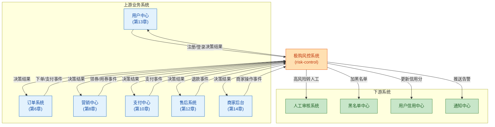

**对接原则**：
- **风控是横切关注点**：通过 SDK 嵌入到每个业务调用点；
- **同步调用 vs 异步调用**：核心链路（登录、领券、支付）走同步风控（<200ms），非关键链路（评论、消息）走异步风控（事后分析）；
- **决策结果回传**：业务系统根据 RiskDecision 决定放行/拒绝/限频。

---

## 16.10 人机协同

### 16.10.1 决策矩阵

| 风险等级 | 模型分 | 动作 | 后续 |
|---|---|---|---|
| **低风险** | 0-30 | 自动通过 | 写入日志，无人工介入 |
| **中低风险** | 30-50 | 通过 + 限频 | 加观察名单，记录行为 |
| **中风险** | 50-80 | 转人工复核 | 客服介入，5 分钟内处理 |
| **高风险** | 80-95 | 自动拒绝 + 告警 | 客服电话核实（必要时） |
| **极高风险** | 95-100 | 自动拒绝 + 封号 | 风控运营事后复盘 |

### 16.10.2 人工审核工作流

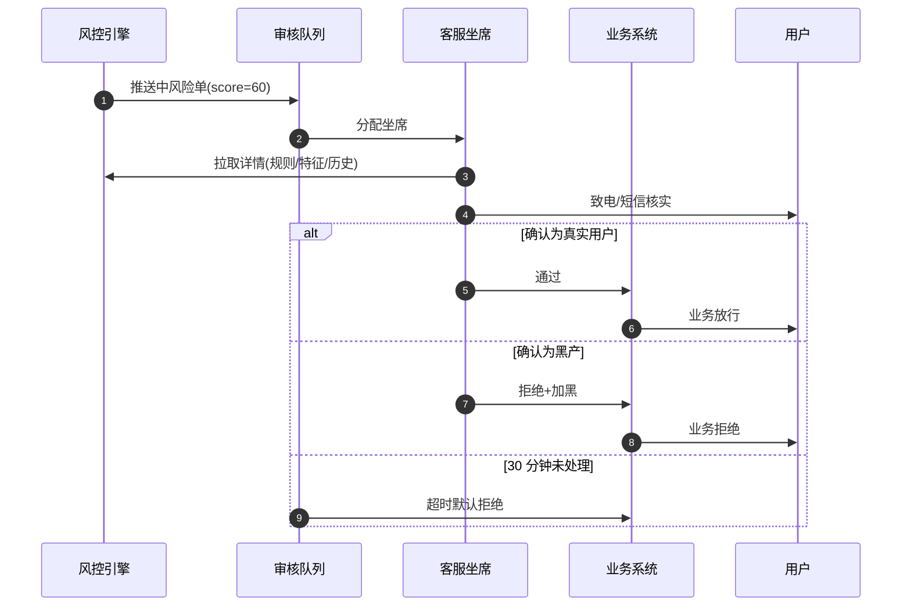

### 16.10.3 标注回流

人工审核的结果会回流到模型训练集：
- **确认黑产** → 标签=1，加入训练集；
- **确认正常** → 标签=0，加入训练集；
- **不确定** → 排除，运营定期复核。

这样模型能持续学习黑产新手法，形成**飞轮效应**。

---

## 16.11 风控可观测

### 16.11.1 指标体系

| 指标 | 定义 | 目标 | 测量 |
|---|---|---|---|
| **拦截量** | 每日触发风控的次数 | - | 实时 |
| **误杀率** | 真实用户被拦 / 总拦截 | < 0.5% | 抽样审核 |
| **漏判率** | 攻击未被识别 / 总攻击 | < 5% | 离线分析 |
| **规则命中率** | 单条规则触发次数 / 总调用 | - | 实时 |
| **模型 AUC** | 区分好坏用户能力 | > 0.95 | 周评估 |
| **P99 延迟** | 风控调用 99 分位耗时 | < 200ms | APM |
| **人工审核 SLA** | 客服 5 分钟内处理率 | > 95% | 工单系统 |
| **黑产账户数** | 累计识别黑产账号 | 累计 1 万/日 | 数据仓库 |
| **资金挽回** | 拦截避免的损失 | 日均 500 万 | 计算 |

### 16.11.2 监控大盘

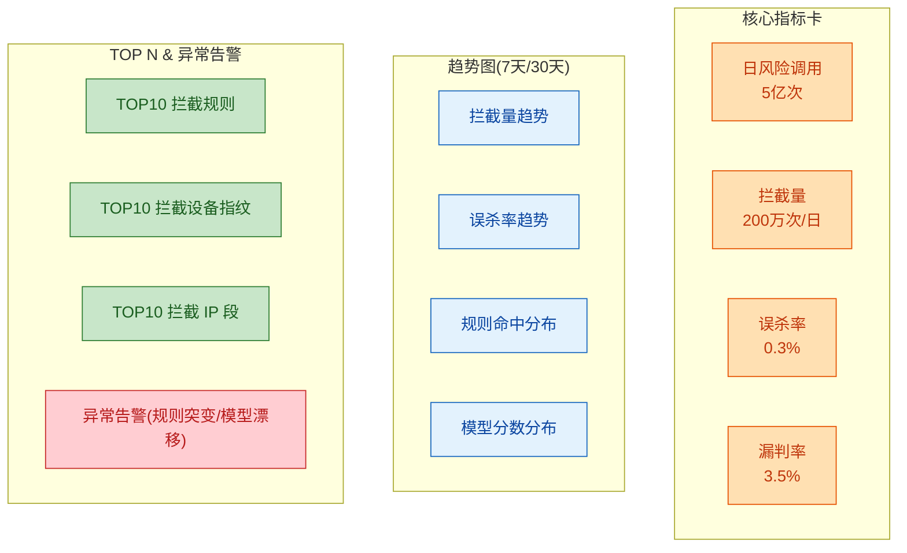

### 16.11.3 告警规则

| 告警 | 触发条件 | 严重程度 |
|---|---|---|
| 误杀率突增 | 5 分钟内误杀率 > 1% | P0（立即处理） |
| 模型分数漂移 | 模型预测分分布变化 > 20% | P1 |
| 规则命中突增 | 某规则 1 小时命中 > 1 万次 | P1 |
| 系统延迟 | P99 > 500ms | P1 |
| 黑产设备新增 | 1 小时内新设备黑产 > 1 千 | P2 |
| 名单库异常 | 黑名单量突减 | P0 |

---

## 16.12 典型问题与解决方案

### 16.12.1 误杀：好用户被拦

**现象**：小美领券时被风控拒绝，客诉。

**原因**：
- 新用户（刚注册）被误判为"批量注册"；
- 真人偶尔的"异常"行为被规则一票否决；
- 模型过拟合训练集中的负面样本。

**解决方案**：
1. **多级决策**：单一规则不能拒绝，必须经过模型复核；
2. **申诉通道**：所有拒绝都有"我有异议"按钮，转人工复核；
3. **白名单兜底**：VIP 用户 / 老用户 / 高信用用户降低规则严格度；
4. **规则 A/B 测试**：新规则先 1% 灰度，监控误杀率；
5. **回溯补偿**：确认误杀后，自动恢复权益 + 补偿券。

### 16.12.2 漏判：坏用户没拦

**现象**：小李的羊毛号抢到了 5,000 张券。

**原因**：
- 黑产用了全新设备、新 IP、新手机号，零历史；
- 模型对未知攻击手法没有见过；
- 规则更新滞后于黑产变化。

**解决方案**：
1. **新用户限频**：新注册账号 7 天内限制领券数量；
2. **关系图谱**：即使单点新,关联到团伙也会被识别;
3. **模型在线学习**：每日增量训练，纳入新样本；
4. **异常自学习**：Isolation Forest 识别 0day；
5. **红蓝对抗**：内部蓝军模拟黑产攻击，发现漏洞。

### 16.12.3 规则过于严格影响体验

**现象**：规则太严导致正常用户频繁触发验证码，影响转化率。

**解决方案**：
1. **规则优先级**：核心规则（黑名单）硬拦，普通规则（行为异常）软拦；
2. **行为画像**：为每个用户建立"行为基线"，只对偏离基线的行为告警；
3. **渐进式拦截**：第一次异常告警，第二次验证码，第三次拒绝；
4. **场景差异化**：登录可以严一点，浏览可以松一点。

### 16.12.4 黑产技术升级

**现象**：黑产用了 0day 改机工具，所有强信号被改。

**解决方案**：
1. **硬件级指纹**：CPU 渲染特征、传感器噪声、电池序列号（极难改）；
2. **行为序列分析**：即使设备被改，行为习惯难改（滑动曲线、点击力度）；
3. **图算法识别团伙**：单点难改，群体关系难改；
4. **对抗学习**：训练时加入对抗样本，提升鲁棒性；
5. **行业情报**：加入互联网协会、第三方情报共享。

---

## 16.13 完整案例：小李攻击与小美保护

**小李的剧本**（下午 1 点 - 5 点）：

| 时间 | 动作 | 风控结果 |
|---|---|---|
| 13:00 | 群控设备批量注册 5,000 个账号 | 1 小时内前 3 个通过；第 4 个触发验证码；20 个被风控拒绝，设备指纹加黑 |
| 14:00 | 切换云手机，重置设备指纹继续注册 | 新设备通过率 80%；被关联 IP 段加临时黑名单 |
| 15:00 | 抢"满 199 减 100"大额券 | 前 5 个号抢到；第 6 个触发"设备关联账号领同一张券 ≥ 3"规则，**整个设备被加黑，4,994 个号全部失败** |
| 15:30 | 换代理 IP，尝试小号刷单 | ML 模型分数 92，触发人工审核，5 笔订单被关 |
| 16:00 | 真实账号（养了 30 天的号）下单+退款套现 | ML 模型识别"下单-退款循环"特征，触发支付风控，账户冻结 |
| 17:00 | 投诉客服试图解封 | 客服看到风控历史，拒绝解封；小李损失 5,000 个号 + 1 台设备 + 0 收益 |

**小美的剧本**（同一时间）：

| 时间 | 动作 | 风控结果 |
|---|---|---|
| 14:30 | 登录 | 行为正常，通过（0.5ms） |
| 14:35 | 浏览"满 199 减 100"活动 | 0 触发 |
| 14:40 | 领 1 张满 100 减 20 券 | 规则通过 + 模型分 5，**自动通过** |
| 14:45 | 下单 1 单，支付 99 元 | 风控通过，正常交易 |
| 15:00 | 收到推送"您抢的券已用！" | 体验流畅 |
| 17:00 | 申请退款 | 风控：90 天仅 1 次退款、金额正常，**0 等待极速退款** |

**风控的实际作用**：
- 拦截了 5,000 个黑产号（潜在 5 万损失）；
- 保护了小美的 99 元订单和领券权益；
- 识别并冻结了 1 个养了 30 天的真实号（套现账户）；
- 全程 P99 决策延迟 120ms，**对正常用户无感**。

---

## 16.14 容量与性能

### 16.14.1 极购风控规模

| 维度 | 数值 | 说明 |
|---|---|---|
| 日风险调用 | 5 亿次 | 注册/登录/领券/下单/支付/退款 |
| 峰值 QPS | 30 万 | 大促领券高峰 |
| 决策 P99 延迟 | < 200ms | 用户可感知阈值 |
| 拦截量 | 200 万次/日 | 包含规则+模型 |
| 识别黑产账号 | 1 万个/日 | 累计标记 |
| 黑产设备指纹库 | 5 亿 | 持续增长 |
| 黑名单 IP 段 | 2000 万 | 含 IDC/代理/历史黑产 |
| 关系图谱 | 10 亿节点 / 100 亿边 | Neo4j + 缓存 |

### 16.14.2 关键性能指标

| 指标 | 目标 | 实际 |
|---|---|---|
| 规则引擎 P99 | < 50ms | 18ms |
| 模型推理 P99 | < 100ms | 65ms |
| 端到端 P99 | < 200ms | 120ms |
| 系统可用性 | 99.99% | 99.995% |
| 误杀率 | < 0.5% | 0.3% |
| 漏判率 | < 5% | 3.5% |
| 资金挽回 | 日均 500 万 | 620 万 |

---

## 本章小结

风控与反欺诈是商城的**免疫系统**，贯穿全链路。本章系统讲解了风控的全貌：

| 知识点 | 关键结论 |
|---|---|
| **风控全景** | 6 大子域（账号/交易/营销/售后/内容/商家）+ 4 层防御（名单/规则/模型/人工）|
| **黑产攻击** | 批量注册、群控、撞库、羊毛党、刷单、套现、恶意退款，产业链成熟 |
| **数据基础** | 设备指纹、行为序列、IP 画像、关系网络，信号越多越准 |
| **规则引擎** | 决策表/DSL 表达式、Aviator/Groovy 执行、热加载 |
| **机器学习** | XGBoost（有监督）+ Isolation Forest（无监督）+ GNN（图）|
| **决策链路** | 事前（注册/登录）+ 事中（领券/下单/支付/退款）+ 事后（追溯/封号）|
| **关键场景** | 注册/登录/领券/下单/支付/退款/商家，各有规则组合 |
| **上下游对接** | 横切所有业务系统，同步/异步两种方式 |
| **人机协同** | 低风险自动、中风险人工、高风险拒绝 |
| **可观测** | 误杀率/漏判率/拦截量/规则命中分布/模型分数分布 |
| **典型问题** | 误杀、漏判、规则僵化、黑产技术升级的应对 |

**技能点自测**：

- [ ] 能否画出风控 4 层防御架构图？
- [ ] 能否说出至少 5 种黑产攻击方式及对应风控规则？
- [ ] 能否解释设备指纹的工作原理？为什么 IMEI/MAC 是强信号？
- [ ] 能否写出至少 3 条具体规则（如"30 天退款 ≥ 5 次"）？
- [ ] 能否描述规则引擎的执行流程？
- [ ] 能否区分事前/事中/事后风控的时点和目标？
- [ ] 能否列出至少 3 个风控指标？
- [ ] 能否解释误杀和漏判的平衡方法？
- [ ] 能否复述小李攻击的完整流程及风控如何拦截？
- [ ] 能否描述人机协同的决策矩阵？

下一章预告：数据中台是商城的"大脑"——它把订单、用户、行为三大数据源汇聚成订单事实表、用户画像、转化漏斗，再通过实时大屏和 BI 报表呈现给运营、商家、决策层。从埋点到数仓，从画像到推荐，从离线 T+1 到实时 Flink，它定义了"数据驱动"的全部内涵。

---

下一章：[第 17 章 · 数据中台与 BI](./17-数据中台与BI.md)

---

## 参考来源

1. **《阿里巴巴风控实战》—— 阿里安全**
   https://security.alibaba.com/
   阿里风控系统架构、规则引擎、模型体系

2. **《京东安全风控实践》—— 京东安全**
   https://safety.jd.com/
   京东反欺诈、账号风控、支付风控

3. **《美团反欺诈系统》—— 美团技术博客**
   https://tech.meituan.com/
   美团风控架构、规则与模型协同

4. **《设备指纹原理与实践》—— 同盾科技**
   https://www.tongdun.cn/
   设备指纹技术、反欺诈应用

5. **Drools 规则引擎官方文档**
   https://www.drools.org/
   业务规则管理系统、规则语法、执行机制

6. **Aviator 表达式引擎**
   https://github.com/killme2008/aviator
   高性能 Java 表达式求值引擎，用于规则匹配

7. **XGBoost 官方文档**
   https://xgboost.readthedocs.io/
   梯度提升树算法，风控二分类模型

8. **Neo4j 图数据库**
   https://neo4j.com/
   关系网络存储与查询，团伙识别

9. **Apache Flink 实时计算**
   https://flink.apache.org/
   实时特征工程、行为序列计算

10. **《图神经网络在风控中的应用》—— 顶会论文综述**
    https://arxiv.org/
    GNN 在反欺诈、团伙识别的应用

11. **《基于 Isolation Forest 的异常检测》**
    https://cs.nju.edu.cn/zhouzh/zhouzh.files/publication/icdm08b.pdf
    周志华教授经典论文，无监督异常检测

12. **SHAP 模型可解释性**
    https://shap.readthedocs.io/
    风控模型解释，特征贡献度分析

13. **《互联网黑产研究报告》—— 知道创宇**
    https://www.yunaq.com/
    黑产产业链、攻击方式分析

14. **同盾/顶象/数美 风控白皮书**
    https://www.dingxiang-inc.com/
    第三方风控厂商解决方案

15. **RCNN 行为序列建模**
    https://arxiv.org/
    RNN/LSTM 在用户行为序列建模的应用

16. **《对抗黑产：互联网反欺诈指南》—— 机械工业出版社**
    行业风控实践、案例与架构
