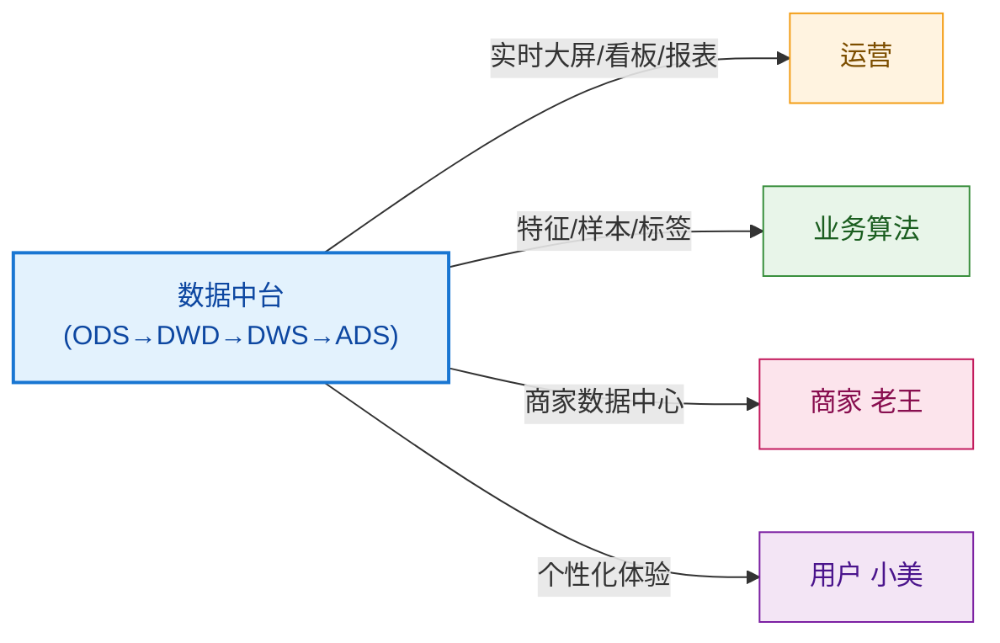
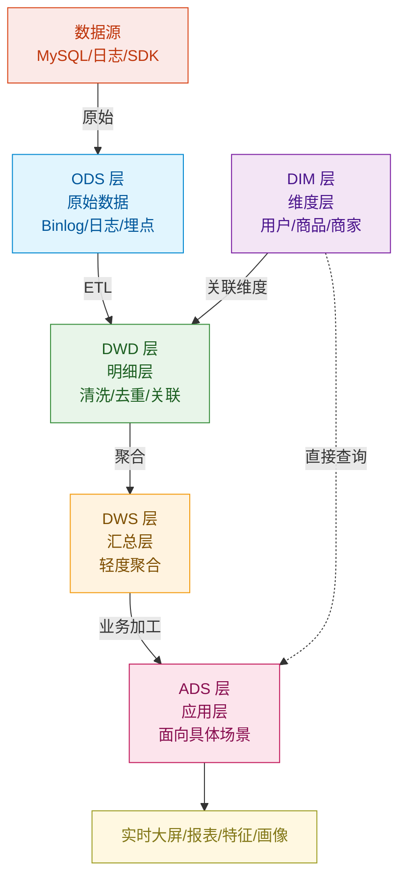
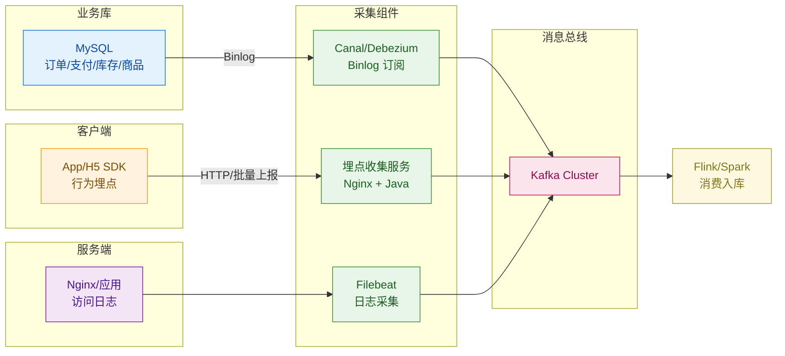
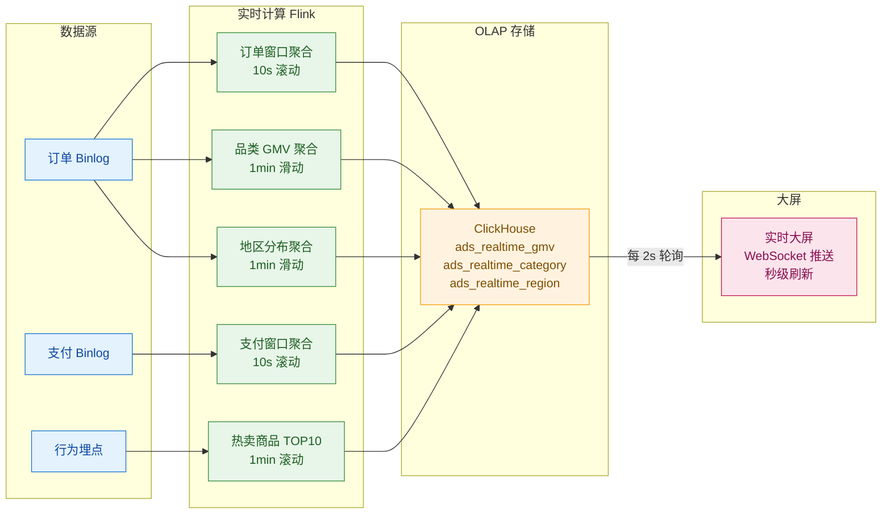
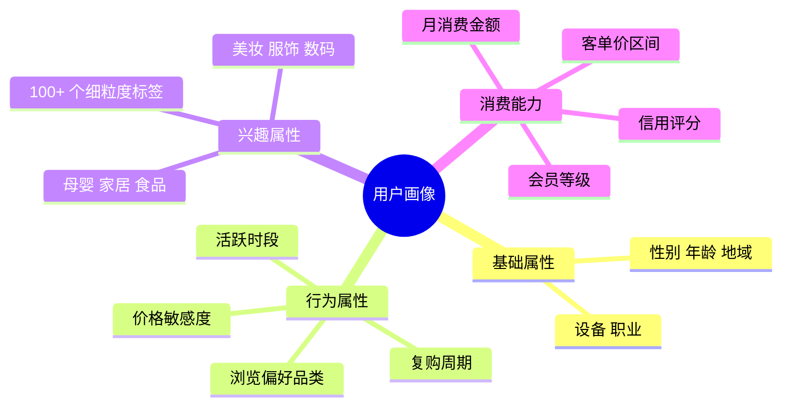
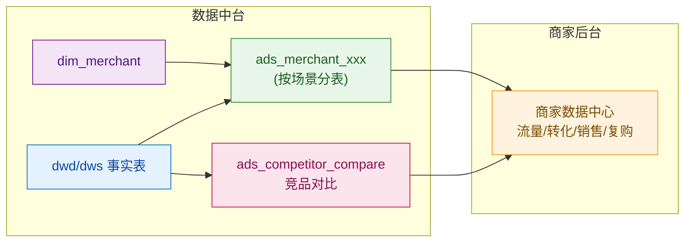
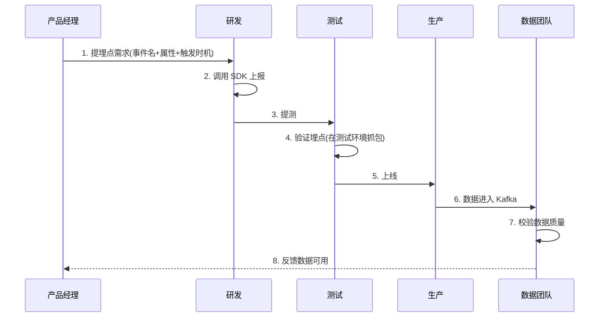

# 第 17 章 · 数据中台与商业智能

> **所属系列**：《商城平台系统设计 · 全景教程》第六部分 · 平台与工程
> **上一章**：[第 16 章 · 风控与反欺诈](./16-风控与反欺诈.md)
> **下一章**：[第 18 章 · API 网关与微服务架构](./18-API网关与微服务.md)

---

## 本章导读

前面 16 章,我们沿着"商品 → 详情 → 购物车 → 订单 → 库存 → 营销 → 支付 → 退款 → 用户 → 商家 → 物流 → 风控"这条交易链路,逐个拆解了商城的核心功能模块。每章都在讲"这个功能该怎么写、怎么优化",但始终有一个隐形的"操盘手"贯穿全篇——**数据中台**。

> 没有数据中台,运营不知道今天 GMV 多少,推荐系统不知道小美最近 7 天看过 3 支口红,商家老王看不到自己店铺的转化漏斗,风控系统也没法做异常检测。

这一章,我们把镜头从"功能实现"拉远到"数据底座",系统讲清楚:

- **数据中台在商城里的 4 类用户**:运营、业务算法、商家、终端用户
- **数据分层**:ODS / DWD / DWS / ADS / DIM 五层模型
- **数据采集**:Binlog 同步、行为埋点、日志采集三条主流路径
- **数据计算**:离线(Hive/Spark/Flink Batch)与实时(Flink Streaming)与 OLAP(ClickHouse/StarRocks)
- **核心数据模型**:订单事实表、行为事实表、用户/商品/商家维度表
- **实时大屏**:Flink + ClickHouse 实现秒级 GMV
- **转化漏斗分析**:从浏览到复购的全链路
- **用户画像**:基础属性、行为属性、兴趣属性、消费能力四维
- **商家数据中心**:老王每天打开看什么
- **埋点规范**:who/when/where/what/how 五元组
- **数据治理**:指标口径、数据质量、数据安全

> 注:本章与第 13 章(用户中心)联动,讲用户画像;与第 9 章(秒杀)联动,讲实时大屏;与第 14 章(商家后台)联动,讲商家数据中心。

---

## 17.1 数据中台在商城的角色

极购商城日订单 800 万,日 GMV 10 亿,日活 1500 万。每天产生的数据量是惊人的:

| 数据类型 | 日增量 | 来源 |
|---------|-------|------|
| 订单/支付/退款 | 800 万条 | 业务库 MySQL Binlog |
| 行为埋点 | 50 亿条 | App/H5/小程序 SDK |
| 服务端日志 | 200 亿条 | Nginx/应用日志 |
| 商家后台操作 | 5 亿条 | 后台审计日志 |

这些数据如果只是"存着"就是巨大的成本,只有**流通起来**才有价值。数据中台的核心使命,就是把"数据"加工成"信息",再把"信息"封装成"服务",让以下 4 类用户能直接消费:



### 17.1.1 给运营看

运营同学最关心**大盘指标**与**专项分析**:

- **实时大屏**:大促期间挂在作战室墙上,实时滚动 GMV、订单数、转化率(秒级刷新)
- **日常看板**:日/周/月 GMV、同比环比、品类结构、用户增长(小时级)
- **专题报表**:618/双 11 复盘、品类分析、流量来源分析(T+1)
- **异常预警**:GMV 同比下滑 20% 自动告警

### 17.1.2 给业务算法用

算法同学最关心**数据样本和特征**:

- **推荐系统**:小美最近 7 天看过 3 支口红 → 给她推相似口红(第 5 章详述)
- **营销系统**:发券响应率预测、用户分群、Push 推送时机
- **风控系统**:异常账号聚集、套现模式识别(第 16 章详述)
- **搜索系统**:商品热度分、CTR/CVR 实时特征(第 3 章详述)

### 17.1.3 给商家看

老王(商家)每天打开商家后台,看到的就是数据中台为他生成的**商家数据中心**:

- **流量分析**:今日 UV/PV、来源渠道、关键词
- **转化漏斗**:浏览 → 加购 → 结算 → 支付 → 复购,各环节转化率
- **销售分析**:GMV、客单价、退款率、复购率
- **竞品对比**:同品类 TOP10 商家的销售、转化、评价对比
- **运营建议**:系统自动给出"建议降价 5% 可提升转化 12%"的洞察

### 17.1.4 给用户感

用户小美虽然不直接"看"数据,但**被数据服务着**:

- 打开 App 看到"猜你喜欢"(推荐)
- 收到"您收藏的口红降价了"(营销)
- 搜索结果排序(搜索)
- 风控系统识别她不是羊毛党,正常下单(风控)

---

## 17.2 数据分层模型(ODS/DWD/DWS/ADS/DIM)

数据中台的标准做法是**分层**。每一层有明确职责,数据逐层向上加工:



| 分层 | 名称 | 职责 | 典型存储 | 保留时长 |
|-----|------|------|---------|---------|
| **ODS** | Operational Data Store | 原始数据,不做清洗 | Kafka / HDFS | 7~30 天 |
| **DWD** | Data Warehouse Detail | 清洗 + 维度关联,形成明细事实表 | Hive / Iceberg | 永久 |
| **DWS** | Data Warehouse Summary | 轻度汇总(用户/商品/商家粒度) | Hive / StarRocks | 永久 |
| **ADS** | Application Data Service | 应用层,面向具体业务场景 | ClickHouse / MySQL | 永久 |
| **DIM** | Dimension | 维度表(用户、商品、商家、类目) | Hive / HBase | 永久 |

**关键设计原则**:

1. **ODS 保持原貌**:不丢字段、不改格式,所有清洗逻辑在 DWD 之前完成
2. **DWD 一次清洗,多次复用**:避免下游重复清洗
3. **DWS 宽表化**:把多个 DWD 关联成宽表,提升 ADS 查询性能
4. **DIM 全量快照 + 拉链**:商品状态变化(上下架、价格调整)用拉链表保留历史
5. **ADS 按需而建**:一个业务场景一张 ADS 表,避免"超级大宽表"

---

## 17.3 数据采集

数据进入中台前,需要先采集上来。极购商城有**三条主流采集路径**:



### 17.3.1 业务库 Binlog 同步

业务库(MySQL)开启 Binlog Row 模式,Canal/Debezium 订阅 Binlog,投递到 Kafka:

- **订单表** `t_order` Binlog → Kafka topic `ods_order_binlog`
- **支付表** `t_payment` Binlog → Kafka topic `ods_payment_binlog`
- **退款表** `t_refund` Binlog → Kafka topic `ods_refund_binlog`

**为什么用 Binlog 而不是直接查业务库?**
- 业务库压力已经很大(主库扛交易,从库扛查询),不能再挂分析
- Binlog 是追加写,适合做实时管道
- 一份数据同时供离线(HDFS)、实时(Kafka)、搜索(ES)消费,解耦

### 17.3.2 行为埋点

客户端集成 SDK,用户操作时(点击、滑动、停留)上报到埋点收集服务。极购埋点日均 50 亿条,峰值 5 万 QPS,采用**批量压缩 + 本地缓存 + 失败重试**的策略(详见 17.10 节 SDK 简化实现)。

### 17.3.3 服务端日志

Nginx 访问日志、应用 Logback 日志,Filebeat 采集到 Kafka,供监控、安全审计、行为分析使用。

---

## 17.4 数据计算:离线 / 实时 / OLAP

数据采集到 Kafka 之后,就要进入计算环节。极购商城有**三类计算引擎**,各自解决不同问题:

| 计算类型 | 延迟 | 数据范围 | 引擎 | 典型场景 |
|---------|------|---------|------|---------|
| **离线计算** | T+1(凌晨跑) | 全量历史 | Hive / Spark / Flink Batch | 日报、周报、月报、训练样本 |
| **实时计算** | 秒级 | 近期(N 分钟/小时) | Flink Streaming | 实时大屏、实时风控、实时特征 |
| **OLAP 查询** | 亚秒级 | 近期 + 聚合 | ClickHouse / StarRocks / Doris | 多维分析、看板查询、商家数据中心 |

### 17.4.1 离线计算(Hive / Spark)

凌晨 2:00 启动,跑全量昨日数据,产出 ADS 表。例如:

- 用户日行为 DWS 表(`dws_user_action_dd`):每个用户当天的浏览、加购、下单、支付次数
- 商品日销售 DWS 表(`dws_product_sale_dd`):每个商品当天的销售件数、GMV、转化率
- 商家日销售 DWS 表(`dws_merchant_sale_dd`):每个商家当天的 GMV、订单数、退款率

### 17.4.2 实时计算(Flink)

大促期间,实时大屏要秒级刷新。Flink 消费 Kafka,做窗口聚合(滚动窗口、滑动窗口、会话窗口),结果写入 ClickHouse。例如:

- 实时 GMV:每 10 秒滚动窗口,统计全平台 GMV
- 实时订单数:每分钟滑动窗口
- 实时热卖商品 TOP10:1 小时滚动窗口,按销量排序

### 17.4.3 OLAP 查询(ClickHouse / StarRocks)

ClickHouse 和 StarRocks 都是**列式存储 + 向量化执行**,适合多维分析(任意维度组合的聚合查询)。例如:

- 商家数据中心"我的店铺"页:按"最近 30 天 + 品类 + 流量来源"维度的转化漏斗
- 运营 BI 看板:按"地区 + 时段 + 用户等级 + 品类"维度的 GMV 分布

**ClickHouse vs StarRocks 选型对比**:

| 特性 | ClickHouse | StarRocks |
|-----|-----------|-----------|
| 写入吞吐 | 极高(单节点 100 万行/秒) | 高(单节点 50 万行/秒) |
| 查询性能 | 极快(列式 + 压缩) | 快(向量化 + CBO) |
| 实时数据新鲜度 | 近实时(秒级) | 近实时(秒级) |
| 运维复杂度 | 中(单实例) | 中(集群管理更复杂) |
| 适用规模 | PB 级 | PB 级 |
| 极购选型 | ✅ 用于实时大屏、广告分析 | ✅ 用于商家数据中心、看板 |

---

## 17.5 核心数据模型

数据中台的"骨架"是数据模型。极购商城的事实表和维度表设计如下。

### 17.5.1 订单事实表 DDL(ODS + DWD)

```sql
-- ========================================
-- DWD 层订单事实表(交易域核心表)
-- ========================================
-- 表设计要点:
--   1. 主键 order_id(雪花 ID,全局唯一)
--   2. 外键 user_id/merchant_id/product_id 关联维度表
--   3. 度量 amount 实付金额(已扣优惠)
--   4. 时间分区 dt + 小时分区 hh,便于按天/小时裁剪
--   5. 拉链表 + 快照表双轨,主表存当前状态,dwd_order_his 存历史变更
-- ========================================

DROP TABLE IF EXISTS dwd_order_fact;
CREATE TABLE dwd_order_fact (
    -- === 主键与外键 ===
    order_id           BIGINT       COMMENT '订单 ID(雪花算法)',
    order_no           STRING       COMMENT '订单号(展示用)',
    user_id            BIGINT       COMMENT '用户 ID',
    merchant_id        BIGINT       COMMENT '商家 ID',
    store_id           BIGINT       COMMENT '店铺 ID',
    
    -- === 维度外键 ===
    product_id         BIGINT       COMMENT '商品 SKU ID',
    spu_id             BIGINT       COMMENT '商品 SPU ID',
    category_l1_id     INT          COMMENT '一级类目 ID',
    category_l2_id     INT          COMMENT '二级类目 ID',
    category_l3_id     INT          COMMENT '三级类目 ID',
    brand_id           INT          COMMENT '品牌 ID',
    
    -- === 度量 ===
    quantity           INT          COMMENT '商品数量',
    original_amount    DECIMAL(18,2) COMMENT '原价金额(分)',
    discount_amount    DECIMAL(18,2) COMMENT '优惠金额(分)',
    freight_amount     DECIMAL(18,2) COMMENT '运费(分)',
    payment_amount     DECIMAL(18,2) COMMENT '实付金额(分)',
    paid_amount        DECIMAL(18,2) COMMENT '已支付金额(分)',
    refund_amount      DECIMAL(18,2) COMMENT '退款金额(分)',
    
    -- === 状态字段 ===
    order_status       TINYINT      COMMENT '订单状态(10待付款 20待发货 30待收货 40已完成 50已取消 60已退款)',
    pay_status         TINYINT      COMMENT '支付状态(0未支付 1已支付 2已退款)',
    
    -- === 渠道与来源 ===
    order_source       STRING       COMMENT '订单来源(app/h5/pc/miniapp)',
    channel            STRING       COMMENT '渠道(自然流量/广告/分享)',
    campaign_id        BIGINT       COMMENT '活动 ID',
    
    -- === 时间戳 ===
    order_time         BIGINT       COMMENT '下单时间戳(秒)',
    pay_time           BIGINT       COMMENT '支付时间戳',
    finish_time        BIGINT       COMMENT '完成时间戳',
    refund_time        BIGINT       COMMENT '退款时间戳',
    
    -- === 数据治理字段 ===
    etl_time           BIGINT       COMMENT 'ETL 入库时间戳',
    source             STRING       COMMENT '数据来源(ods/dwd)'
)
COMMENT '订单事实表 DWD 层'
PARTITIONED BY (dt STRING COMMENT '日期分区 yyyy-MM-dd', hh STRING COMMENT '小时分区 HH')
STORED AS PARQUET
TBLPROPERTIES (
    'parquet.compression'='SNAPPY',
    'partitioning.key'='dt',
    'lifecycle.days'='365'  -- 保留 1 年
);

-- 同时创建订单子表(多商品订单)
CREATE TABLE dwd_order_item_fact (
    order_id           BIGINT,
    order_item_id      BIGINT       COMMENT '订单子项 ID',
    product_id         BIGINT,
    sku_id             BIGINT,
    quantity           INT,
    unit_price         DECIMAL(18,2),
    payment_amount     DECIMAL(18,2),
    -- ...
) PARTITIONED BY (dt STRING) STORED AS PARQUET;
```

### 17.5.2 行为事实表(DWD)

```sql
-- 用户行为事实表(浏览/加购/收藏/搜索/下单/支付)
DROP TABLE IF EXISTS dwd_user_action_fact;
CREATE TABLE dwd_user_action_fact (
    action_id        STRING        COMMENT '行为 ID(去重用)',
    user_id          BIGINT        COMMENT '用户 ID',
    session_id       STRING        COMMENT '会话 ID',
    
    action_type      STRING        COMMENT '行为类型(view/cart/fav/search/order/pay)',
    target_type      STRING        COMMENT '目标类型(product/shop/category/activity)',
    target_id        BIGINT        COMMENT '目标 ID',
    
    page_id          STRING        COMMENT '页面标识(home/search/detail/cart)',
    refer_page       STRING        COMMENT '来源页面',
    device_id        STRING        COMMENT '设备 ID',
    platform         STRING        COMMENT '平台(ios/android/h5/pc)',
    
    action_time      BIGINT        COMMENT '行为时间戳(毫秒)',
    stay_duration    INT           COMMENT '停留时长(毫秒)',
    
    -- 扩展属性(JSON)
    ext              MAP<STRING, STRING>  COMMENT '扩展属性'
)
COMMENT '用户行为事实表'
PARTITIONED BY (dt STRING)
STORED AS PARQUET;
```

### 17.5.3 维度表(DIM)

```sql
-- 用户维度表(脱敏)
CREATE TABLE dim_user (
    user_id        BIGINT,
    nickname       STRING,
    mobile_md5     STRING         COMMENT '手机号 MD5(脱敏)',
    age_group      STRING         COMMENT '年龄段(18-24/25-29/30-34/35-39/40+)',
    gender         TINYINT        COMMENT '0未知 1男 2女',
    city_id        INT            COMMENT '城市 ID',
    city_tier      TINYINT        COMMENT '城市分级(1-5)',
    register_time  BIGINT,
    member_level   TINYINT        COMMENT '会员等级(0-5)',
    vip_expire     BIGINT
) STORED AS PARQUET;

-- 商品维度表(SCD 2 拉链表,记录历史变更)
CREATE TABLE dim_product_scd (
    product_id     BIGINT,
    spu_id         BIGINT,
    category_l1_id INT,
    category_l2_id INT,
    category_l3_id INT,
    brand_id       INT,
    product_name   STRING,
    product_status TINYINT,       -- 状态:0下架 1在售 2预上架
    sale_price     DECIMAL(18,2),
    -- 拉链字段
    start_dt       STRING         COMMENT '生效日期',
    end_dt         STRING         COMMENT '失效日期(9999-12-31 表示当前)'
) STORED AS PARQUET;

-- 商家维度表
CREATE TABLE dim_merchant (
    merchant_id    BIGINT,
    merchant_name  STRING,
    store_id       BIGINT,
    shop_type      TINYINT,       -- 1自营 2旗舰店 3专营店 4普通店
    category_main  INT,           -- 主营类目
    register_time  BIGINT,
    level          TINYINT        -- 商家等级
) STORED AS PARQUET;
```

---

## 17.6 实时大屏:大促作战室的心脏

大促期间,运营团队盯着大屏指挥调度。极购商城的实时大屏需要支持**秒级刷新 + 多维下钻**:

- **核心数字**:实时 GMV、订单数、支付用户数、客单价
- **品类分布**:各品类实时 GMV 占比(柱状图)
- **地区分布**:各省 TOP10(中国地图)
- **热卖商品**:实时销量 TOP10(滚动列表)
- **转化漏斗**:实时浏览 → 加购 → 支付转化率
- **异常告警**:支付成功率 < 95% 红色告警

### 17.6.1 实时大屏数据流



### 17.6.2 Flink 实时 GMV 核心代码

```java
/**
 * Flink 实时 GMV 计算
 *
 * 核心逻辑:
 * 1. 消费 Kafka 订单 Binlog
 * 2. 过滤已支付订单(只算已付款的)
 * 3. 按 10 秒滚动窗口聚合
 * 4. 写入 ClickHouse
 *
 * 数据量级:
 *   峰值 800 万订单/天 → 1000 笔/秒
 *   窗口聚合后写入 ClickHouse → 10 万条/天
 */
public class RealtimeGmvJob {

    public static void main(String[] args) throws Exception {
        StreamExecutionEnvironment env =
            StreamExecutionEnvironment.getExecutionEnvironment();
        env.setParallelism(8);
        env.enableCheckpointing(30000); // 30 秒 Checkpoint

        // 1. 消费 Kafka 订单 Binlog
        KafkaSource<String> source = KafkaSource.<String>builder()
            .setBootstrapServers("kafka:9092")
            .setGroupId("realtime-gmv")
            .setTopics("ods_order_binlog")
            .setStartingOffsets(OffsetsInitializer.latest())
            .setValueOnlyDeserializer(new SimpleStringSchema())
            .build();

        DataStream<String> rawStream = env.fromSource(source,
            WatermarkStrategy.noWatermarks(), "Kafka Source");

        // 2. 解析 Binlog JSON,过滤已支付订单
        DataStream<OrderEvent> orderStream = rawStream
            .map(json -> {
                BinlogMessage msg = JSON.parseObject(json, BinlogMessage.class);
                // 解析 order_status=20(已支付)且 paid_amount>0
                OrderEvent event = new OrderEvent();
                event.setOrderId(msg.getData().getOrderId());
                event.setUserId(msg.getData().getUserId());
                event.setMerchantId(msg.getData().getMerchantId());
                event.setCategoryL1Id(msg.getData().getCategoryL1Id());
                event.setProvince(msg.getData().getProvince());
                event.setPaidAmount(msg.getData().getPaidAmount());
                event.setPayTime(msg.getData().getPayTime());
                return event;
            })
            .filter(e -> e.getPaidAmount() != null && e.getPaidAmount() > 0);

        // 3. 10 秒滚动窗口聚合(全平台 GMV)
        DataStream<GmvAggregate> gmvStream = orderStream
            .windowAll(TumblingEventTimeWindows.of(
                Time.seconds(10),
                Time.seconds(-5)  // 偏移,避免数据倾斜
            ))
            .aggregate(new GmvAggregateFunction());

        // 4. 写入 ClickHouse(JDBC 方式)
        gmvStream.addSink(JdbcSink.sink(
            "INSERT INTO ads_realtime_gmv " +
            "(window_start, gmv, order_count, user_count, avg_price) " +
            "VALUES (?, ?, ?, ?, ?)",
            (ps, g) -> {
                ps.setTimestamp(1, new Timestamp(g.getWindowStart()));
                ps.setBigDecimal(2, g.getGmv());
                ps.setLong(3, g.getOrderCount());
                ps.setLong(4, g.getUserCount());
                ps.setBigDecimal(5, g.getAvgPrice());
            },
            JdbcExecutionOptions.builder()
                .withBatchSize(100)
                .withBatchIntervalMs(1000)
                .build(),
            new ClickHouseConnectionOptions.JdbcConnectionOptionsBuilder()
                .withUrl("jdbc:clickhouse://ck:8123/default")
                .withDriverName("com.clickhouse.jdbc.ClickHouseDriver")
                .withUsername("default")
                .build()
        ));

        env.execute("Realtime GMV Job");
    }

    /**
     * GMV 聚合函数:累加 GMV,统计订单数、用户数
     */
    public static class GmvAggregateFunction
            implements AggregateFunction<OrderEvent, GmvAccumulator, GmvAggregate> {

        @Override
        public GmvAccumulator createAccumulator() {
            return new GmvAccumulator();
        }

        @Override
        public GmvAccumulator add(OrderEvent e, GmvAccumulator acc) {
            acc.gmv = acc.gmv.add(BigDecimal.valueOf(e.getPaidAmount() / 100.0));
            acc.orderCount++;
            acc.userSet.add(e.getUserId());
            return acc;
        }

        @Override
        public GmvAggregate getResult(GmvAccumulator acc) {
            GmvAggregate result = new GmvAggregate();
            result.setWindowStart(System.currentTimeMillis());
            result.setGmv(acc.gmv);
            result.setOrderCount(acc.orderCount);
            result.setUserCount(acc.userSet.size());
            result.setAvgPrice(acc.gmv.divide(
                BigDecimal.valueOf(acc.orderCount), 2, RoundingMode.HALF_UP));
            return result;
        }

        @Override
        public GmvAccumulator merge(GmvAccumulator a, GmvAccumulator b) {
            a.gmv = a.gmv.add(b.gmv);
            a.orderCount += b.orderCount;
            a.userSet.addAll(b.userSet);
            return a;
        }
    }
}
```

### 17.6.3 ClickHouse 多维分析查询(大屏)

```sql
-- 实时大屏查询:最近 1 小时每分钟 GMV
SELECT
    toStartOfMinute(window_start) AS minute,
    sum(gmv) AS minute_gmv,
    sum(order_count) AS minute_orders,
    sum(user_count) AS minute_users
FROM ads_realtime_gmv
WHERE window_start >= now() - INTERVAL 1 HOUR
GROUP BY minute
ORDER BY minute ASC;

-- 品类实时 GMV 排行(下钻)
SELECT
    category_l1_id,
    category_l1_name,
    sum(paid_amount) / 100.0 AS gmv,
    count(DISTINCT order_id) AS orders
FROM ads_realtime_category
WHERE window_start >= now() - INTERVAL 10 MINUTE
GROUP BY category_l1_id, category_l1_name
ORDER BY gmv DESC
LIMIT 20;

-- 地区分布(中国地图数据)
SELECT
    province_code,
    province_name,
    sum(paid_amount) / 100.0 AS gmv,
    count(DISTINCT user_id) AS buyers
FROM ads_realtime_region
WHERE window_start >= now() - INTERVAL 1 HOUR
GROUP BY province_code, province_name
ORDER BY gmv DESC;
```

---

## 17.7 转化漏斗分析

转化漏斗是电商的"生死指标"——**从浏览到最终复购,每一步的转化率都决定了平台的赚钱效率**。

### 17.7.1 漏斗模型

```mermaid
funnel-chart
    title 用户转化漏斗(2026-06-01 极购商城)
    "浏览 PV" : 1000000
    "商品详情 UV" : 600000
    "加购 UV" : 180000
    "提交订单 UV" : 90000
    "支付成功 UV" : 72000
    "7日复购 UV" : 12000
```

> 📌 Mermaid 11.13 暂未原生支持 funnel,实际生产中可使用 ECharts/D3 渲染。下面以 SQL 实现为准。

| 环节 | 含义 | 转化率参考 |
|-----|------|----------|
| 浏览 → 详情 | 进入商品详情页占比 | 50%~70% |
| 详情 → 加购 | 加入购物车占比 | 25%~35% |
| 加购 → 结算 | 进入结算页占比 | 45%~55% |
| 结算 → 支付 | 支付成功率 | 75%~85% |
| 支付 → 复购 | 7 日内复购占比 | 15%~25% |

### 17.7.2 漏斗 SQL 实现

```sql
-- 转化漏斗查询(以最近 7 日为例)
-- 输出:每个环节的 UV + 相对上一环节的转化率

WITH step1_view AS (
    SELECT user_id
    FROM dwd_user_action_fact
    WHERE dt BETWEEN '2026-05-26' AND '2026-06-01'
      AND action_type = 'view'
      AND target_type = 'product'
    GROUP BY user_id
),
step2_detail AS (
    SELECT user_id
    FROM dwd_user_action_fact
    WHERE dt BETWEEN '2026-05-26' AND '2026-06-01'
      AND action_type = 'detail'   -- 详情页停留 > 5s 算深度浏览
      AND stay_duration > 5000
    GROUP BY user_id
),
step3_cart AS (
    SELECT user_id
    FROM dwd_user_action_fact
    WHERE dt BETWEEN '2026-05-26' AND '2026-06-01'
      AND action_type = 'cart'
    GROUP BY user_id
),
step4_order AS (
    SELECT user_id
    FROM dwd_order_fact
    WHERE dt BETWEEN '2026-05-26' AND '2026-06-01'
      AND order_status >= 10
    GROUP BY user_id
),
step5_pay AS (
    SELECT user_id
    FROM dwd_order_fact
    WHERE dt BETWEEN '2026-05-26' AND '2026-06-01'
      AND pay_status = 1
    GROUP BY user_id
),
step6_repurchase AS (
    SELECT a.user_id
    FROM dwd_order_fact a
    JOIN dwd_order_fact b
      ON a.user_id = b.user_id
     AND b.dt BETWEEN date_add(a.dt, 1) AND date_add(a.dt, 7)
     AND b.pay_status = 1
    WHERE a.dt BETWEEN '2026-05-26' AND '2026-06-01'
      AND a.pay_status = 1
    GROUP BY a.user_id
)
SELECT
    (SELECT COUNT(*) FROM step1_view) AS view_uv,
    (SELECT COUNT(*) FROM step2_detail) AS detail_uv,
    (SELECT COUNT(*) FROM step3_cart) AS cart_uv,
    (SELECT COUNT(*) FROM step4_order) AS order_uv,
    (SELECT COUNT(*) FROM step5_pay) AS pay_uv,
    (SELECT COUNT(*) FROM step6_repurchase) AS repurchase_uv,
    -- 转化率
    ROUND((SELECT COUNT(*) FROM step2_detail) * 100.0 /
          NULLIF((SELECT COUNT(*) FROM step1_view), 0), 2)
        AS view_to_detail_rate,
    ROUND((SELECT COUNT(*) FROM step3_cart) * 100.0 /
          NULLIF((SELECT COUNT(*) FROM step2_detail), 0), 2)
        AS detail_to_cart_rate,
    ROUND((SELECT COUNT(*) FROM step4_order) * 100.0 /
          NULLIF((SELECT COUNT(*) FROM step3_cart), 0), 2)
        AS cart_to_order_rate,
    ROUND((SELECT COUNT(*) FROM step5_pay) * 100.0 /
          NULLIF((SELECT COUNT(*) FROM step4_order), 0), 2)
        AS order_to_pay_rate,
    ROUND((SELECT COUNT(*) FROM step6_repurchase) * 100.0 /
          NULLIF((SELECT COUNT(*) FROM step5_pay), 0), 2)
        AS pay_to_repurchase_rate;
```

### 17.7.3 漏斗洞察与运营动作

| 异常 | 根因 | 运营动作 |
|-----|------|---------|
| 详情 → 加购转化率突降 10% | 商品评价变差 / 价格上调 | 调价、检查差评 |
| 加购 → 结算转化率突降 5% | 运费过高 / 优惠感知弱 | 满减活动、免邮券 |
| 结算 → 支付转化率突降 3% | 支付链路异常 / 风控误杀 | 排查支付成功率 |
| 支付 → 复购转化率突降 8% | 物流慢 / 售后体验差 | 推动商家提升物流时效 |

---

## 17.8 用户画像(联动第 13 章)

用户画像是数据中台"最值钱"的产出之一。它是一份**关于用户的结构化档案**,分为 4 大类属性:



### 17.8.1 用户画像宽表(ADS 层)

```sql
-- 用户画像宽表(全量更新,推荐系统直接消费)
DROP TABLE IF EXISTS ads_user_profile;
CREATE TABLE ads_user_profile (
    user_id          BIGINT        COMMENT '用户 ID',
    
    -- === 基础属性 ===
    age_group        STRING        COMMENT '年龄段',
    gender           TINYINT       COMMENT '性别(0未知 1男 2女)',
    city_id          INT,
    city_tier        TINYINT       COMMENT '城市分级(1-5)',
    device_type      STRING        COMMENT '主要设备',
    
    -- === 行为属性 ===
    active_hour      STRING        COMMENT '最活跃时段(如 20-22)',
    avg_stay_min     DECIMAL(10,2) COMMENT '日均停留时长(分钟)',
    fav_category     STRING        COMMENT '最常浏览品类 TOP1',
    price_sensitive  TINYINT       COMMENT '价格敏感度(1-5)',
    repurchase_days  INT           COMMENT '平均复购周期(天)',
    
    -- === 兴趣属性(标签集合)===
    interest_tags    ARRAY<STRING> COMMENT '兴趣标签(美妆/数码/母婴...)',
    brand_prefer     ARRAY<STRING> COMMENT '偏好品牌 TOP10',
    
    -- === 消费能力 ===
    avg_order_amt    DECIMAL(18,2) COMMENT '近 30 天客单价',
    month_gmv        DECIMAL(18,2) COMMENT '近 30 天 GMV',
    credit_score     INT           COMMENT '信用评分(300-850)',
    member_level     TINYINT       COMMENT '会员等级',
    
    -- === 时间 ===
    last_active      BIGINT        COMMENT '最近活跃时间',
    update_time      BIGINT        COMMENT '画像更新时间'
)
COMMENT '用户画像宽表'
STORED AS PARQUET;

-- 标签计算示例:小美近 7 天看过 3 支口红
-- (在 DWS 层已经聚合好,这里直接 JOIN)
SELECT
    user_id,
    interest_tags,
    brand_prefer
FROM ads_user_profile
WHERE user_id = 10086;  -- 小美
-- 返回示例:interest_tags = ['美妆', '口红', '滋润', '显白', '平价彩妆']
--         brand_prefer = ['花西子', '完美日记', '3CE', 'YSL', 'MAC']
```

### 17.8.2 T+1 标签 vs 实时标签

| 类型 | 延迟 | 实现 | 典型标签 |
|-----|------|------|---------|
| **T+1 标签** | 次日 | Hive/Spark 离线批处理 | 客单价、月消费、品类偏好、信用评分 |
| **近线标签** | 5~30 分钟 | Flink 流式聚合 | 近 7 天浏览品类、近 1 小时加购 |
| **实时标签** | 秒级 | Flink + Redis | 当前会话浏览路径、实时点击流 |

---

## 17.9 商家数据中心(老王的数据)

老王每天打开商家后台,**第一件事就是看数据中心**。

### 17.9.1 商家数据中心架构



### 17.9.2 商家核心数据指标

| 模块 | 指标 | 含义 | 老王关心的点 |
|-----|------|------|------------|
| **流量分析** | UV / PV | 独立访客 / 浏览量 | 流量从哪来,质量如何 |
| | 跳出率 | 只看一页就离开 | 商品主图/价格是否吸引人 |
| | 来源渠道 | 自然/付费/分享 | 投放 ROI 评估 |
| **转化漏斗** | 浏览→加购 | 商品吸引力 | 主图、详情、评价优化 |
| | 加购→支付 | 支付链路 | 是否有价格、运费、优惠问题 |
| | 支付→复购 | 商品质量 | 商品本身、客服、物流 |
| **销售分析** | GMV / 订单数 | 总体业绩 | |
| | 客单价 | 单笔金额 | 是否推关联销售 |
| | 退款率 | 退款/订单 | 商品质量预警 |
| **竞品对比** | 同品类 TOP10 | 市场份额 | 自己位置、对手动态 |
| | 价格分布 | 价格带分布 | 是否要调价 |
| | 评价分 | 店铺评分 | 提升客户体验 |

### 17.9.3 商家转化漏斗查询

```sql
-- 商家"王的潮品"近 30 天转化漏斗
WITH merchant_id_filter AS (SELECT 20001 AS merchant_id),  -- 老王的店铺

flow AS (
    SELECT
        COUNT(DISTINCT CASE WHEN action_type = 'view' THEN user_id END) AS view_uv,
        COUNT(DISTINCT CASE WHEN action_type = 'cart' THEN user_id END) AS cart_uv,
        COUNT(DISTINCT CASE WHEN action_type = 'order' THEN user_id END) AS order_uv,
        COUNT(DISTINCT CASE WHEN action_type = 'pay' THEN user_id END) AS pay_uv
    FROM dwd_user_action_fact a
    JOIN dim_product b ON a.target_id = b.product_id
    WHERE a.dt BETWEEN date_sub(current_date, 30) AND current_date()
      AND b.merchant_id = (SELECT merchant_id FROM merchant_id_filter)
)
SELECT
    view_uv,
    cart_uv,
    order_uv,
    pay_uv,
    ROUND(cart_uv * 100.0 / NULLIF(view_uv, 0), 2)  AS view_to_cart,
    ROUND(order_uv * 100.0 / NULLIF(cart_uv, 0), 2) AS cart_to_order,
    ROUND(pay_uv * 100.0 / NULLIF(order_uv, 0), 2)  AS order_to_pay
FROM flow;
```

---

## 17.10 埋点规范(5W 模型)

数据中台的上游是**埋点**。埋点不规范,下游所有分析都是错的。

### 17.10.1 5W 埋点模型

每个埋点事件必须包含 5 个维度(5W):

| 维度 | 字段 | 示例 |
|-----|------|------|
| **Who** (谁) | `user_id`、`device_id` | u_10086、d_a3f8b1c2 |
| **When** (何时) | `action_time`(毫秒时间戳) | 1717392000123 |
| **Where** (在哪) | `page_id`、`platform` | home、ios |
| **What** (做了什么) | `action_type`、`target_id` | view、p_8888 |
| **How** (怎么做的) | `ext`(扩展属性 JSON) | {"stay_ms": 3000, "from": "search"} |

### 17.10.2 埋点流程



### 17.10.3 埋点 SDK 简化实现(Java)

```java
/**
 * 客户端埋点 SDK 简化版
 *
 * 设计要点:
 * 1. 批量上报(攒一批再发,减少网络请求)
 * 2. 本地持久化(应用退出或网络差时不丢)
 * 3. 失败重试(指数退避)
 * 4. 采样控制(大促可降采样率)
 */
public class Tracker {

    // 批量缓冲队列
    private final BlockingQueue<TrackEvent> buffer =
        new LinkedBlockingQueue<>(1000);

    // 批量上报线程
    private final ScheduledExecutorService flushExecutor =
        Executors.newSingleThreadScheduledExecutor();

    // 上报地址
    private final String endpoint = "https://track.jigou.com/collect";

    public Tracker() {
        // 每 5 秒或缓冲满 50 条触发上报
        flushExecutor.scheduleAtFixedRate(this::flush, 5, 5, TimeUnit.SECONDS);
    }

    /**
     * 上报一个埋点事件
     * @param eventType 事件类型(view/cart/pay...)
     * @param targetId 目标 ID(商品/店铺/活动)
     * @param ext 扩展属性
     */
    public void track(String eventType, long targetId, Map<String, Object> ext) {
        try {
            TrackEvent event = new TrackEvent();
            event.setEventId(UUID.randomUUID().toString());
            event.setUserId(UserContext.getUserId());
            event.setDeviceId(DeviceUtil.getDeviceId());
            event.setEventType(eventType);
            event.setTargetId(targetId);
            event.setPageId(PageContext.getCurrentPage());
            event.setPlatform(DeviceUtil.getPlatform());
            event.setEventTime(System.currentTimeMillis());
            event.setExt(JSON.toJSONString(ext));

            // 放入缓冲(队列满时丢弃,优先保证不阻塞主流程)
            if (!buffer.offer(event)) {
                Metrics.counter("track.drop").increment();
            }
        } catch (Exception e) {
            // 埋点失败绝不能影响主业务
            log.warn("Track failed", e);
        }
    }

    /**
     * 批量上报
     */
    private void flush() {
        if (buffer.isEmpty()) return;

        List<TrackEvent> batch = new ArrayList<>();
        buffer.drainTo(batch, 50);  // 一次最多取 50 条
        if (batch.isEmpty()) return;

        try {
            // 1. 压缩(GZIP)
            byte[] body = GzipUtil.compress(JSON.toJSONBytes(batch));

            // 2. HTTPS 上报
            HttpResponse resp = HttpUtil.post(endpoint, body)
                .header("Content-Type", "application/json")
                .header("Content-Encoding", "gzip")
                .timeout(3000)
                .execute();

            // 3. 失败重试(3 次,指数退避)
            if (!resp.isOk()) {
                retryWithBackoff(batch, 3);
            } else {
                Metrics.counter("track.success", batch.size()).increment();
            }
        } catch (Exception e) {
            // 上报失败,放回缓冲(下次再发)
            buffer.addAll(batch);
            log.warn("Track flush failed, will retry", e);
        }
    }

    private void retryWithBackoff(List<TrackEvent> batch, int retries) {
        for (int i = 0; i < retries; i++) {
            try {
                Thread.sleep(1000L * (1 << i));  // 1s, 2s, 4s
                // 再次尝试上报...
                return;
            } catch (InterruptedException e) {
                Thread.currentThread().interrupt();
                return;
            }
        }
        // 兜底:写入本地文件,下次启动重传
        LocalFileQueue.save(batch);
    }
}
```

---

## 17.11 数据治理

数据中台不是"数据一存了事",还需要**治理**。极购商城有三大治理方向:

### 17.11.1 指标口径统一

同一个 GMV,不同部门算出不一样的数——这是数据中台最常见的痛。

| 指标 | 业务定义 | 技术定义 | 易混点 |
|-----|---------|---------|-------|
| **GMV** | 平台总成交额 | 已支付订单金额(去退款) | 含/不含退款?含/不含运费? |
| **DAU** | 日活跃用户数 | 启动 App 或有埋点行为 | 主站/全站?新/老用户? |
| **转化率** | 转化占比 | 下单UV/浏览UV | 按"用户"还是按"次"算? |
| **客单价** | 单笔金额 | 订单金额/订单数 | 含/不含运费?含/不含退款? |

**治理方案**:
- 建立**指标库**(One Metric Definition),每个指标有唯一定义
- **口径变更要走审批**,变更后通知所有下游
- **报表下线旧指标**,避免新老数据混用

### 17.11.2 数据质量

数据质量的 5 个维度:

| 维度 | 含义 | 示例 |
|-----|------|------|
| **完整性** | 必填字段是否为空 | 订单的 user_id 不应为空 |
| **准确性** | 数据是否真实正确 | 订单金额 = 商品单价 × 数量 |
| **一致性** | 跨系统数据是否一致 | 订单系统的 GMV = 支付系统的支付总额 |
| **及时性** | 数据是否按时到达 | T+1 报表必须在凌晨 8 点前产出 |
| **唯一性** | 是否存在重复 | 同一订单 ID 只出现一次 |

**质量监控**:每天对核心指标做校验,异常自动告警。

### 17.11.3 数据安全(脱敏)

- **生产数据脱敏**:手机号、身份证、姓名等敏感字段在 DWD/ADS 层做 MD5/掩码
- **权限分级**:不同部门(运营、商家、算法)看到不同字段
- **审计日志**:所有数据查询留痕,可追溯

```sql
-- 脱敏示例:手机号只显示前 3 + 后 4
SELECT
    user_id,
    CONCAT(SUBSTR(mobile, 1, 3), '****', SUBSTR(mobile, -4)) AS mobile_mask,
    MD5(mobile) AS mobile_md5
FROM dim_user;
```

---

## 17.12 典型问题与解决方案

### 问题 1:实时数据延迟

**现象**:大屏显示 GMV 比实际少 5%~10%。

**根因**:Flink 消费 Kafka 滞后、窗口未触发、Kafka 消息堆积。

**解决方案**:
- 增大 Flink 并行度(从 8 扩到 32)
- Kafka 分区扩展(从 32 到 128)
- 调小窗口大小(从 10s 改 5s)
- 启用 Kafka 批量消费,提升吞吐

### 问题 2:离线 T+1 滞后

**现象**:运营早上 9 点想看昨天数据,系统说"还没跑完"。

**根因**:凌晨 Hive 任务跑不完(数据量太大、SQL 不优、依赖阻塞)。

**解决方案**:
- 引入 Spark 替代 Hive,提升 3~5 倍速度
- 拆任务:核心指标 6 点出,次要指标 9 点出
- 关键路径上 ClickHouse 直接出 ADS,绕过 Hive

### 问题 3:指标口径不一致

**现象**:财务报表说 GMV 8 亿,运营报表说 9 亿,差 1 亿。

**根因**:一个含运费不含退款,一个不含运费含退款。

**解决方案**:
- 指标字典化,强制使用统一定义
- 建立对账任务,每月 1 号自动核对

### 问题 4:数据孤岛

**现象**:订单数据在订单团队,行为数据在算法团队,商家数据在商家团队,互不打通。

**根因**:早期各团队自建数仓,标准不统一。

**解决方案**:
- 建设**统一数据中台**,所有数据汇总到中台
- 制定**数据标准**:表名规范、字段命名、命名空间
- 提供**统一查询入口**(DataWorks/数据地图)

---

## 本章小结

| 核心主题 | 关键结论 | 工程手段 |
|---------|---------|---------|
| **数据中台定位** | 服务 4 类用户(运营/算法/商家/用户) | ODS→DWD→DWS→ADS 分层 |
| **数据采集** | Binlog + 行为埋点 + 日志三条路径 | Canal + SDK + Filebeat → Kafka |
| **数据计算** | 离线(T+1)+ 实时(秒级)+ OLAP(亚秒) | Hive/Spark + Flink + ClickHouse |
| **核心数据模型** | 订单/支付/行为事实表 + 用户/商品/商家维度表 | DWD/DIM 拉链表 + SCD 2 |
| **实时大屏** | 秒级 GMV、订单、用户、转化 | Flink + ClickHouse + WebSocket |
| **转化漏斗** | 浏览→详情→加购→结算→支付→复购 | 行为事实表 + 用户维度表 JOIN |
| **用户画像** | 基础/行为/兴趣/消费 4 维 | T+1 Hive + 近线 Flink + 实时 Flink |
| **商家数据中心** | 流量、转化、销售、复购、竞品对比 | ADS 多场景分表 + 商家 ID 隔离 |
| **埋点规范** | 5W 模型:Who/When/Where/What/How | 统一 SDK + 埋点管理平台 |
| **数据治理** | 指标口径统一 + 数据质量 + 数据安全 | 指标库 + 质量监控 + 脱敏 |

**数据中台的核心修炼**:商城的数据中台不是"几个表的集合",而是**对业务本质的抽象**。订单表是交易的"真相",行为表是用户意图的"轨迹",用户画像是商业洞察的"结晶"。把这三块做到位,商城就有了"数据驱动的灵魂"。

下一章([第 18 章 · API 网关与微服务架构](./18-API网关与微服务.md)),我们将从数据中台走出来,看看商城的服务端"骨架"——微服务、网关、注册中心、配置中心。

---

> 🚀 **下一章**：[第 18 章 · API 网关与微服务架构](./18-API网关与微服务.md)

---

## 参考来源

1. **ClickHouse 官方文档**  
   https://clickhouse.com/docs

2. **Apache Flink 官方文档**  
   https://nightlies.apache.org/flink/flink-docs-stable/

3. **Apache Kafka 官方文档**  
   https://kafka.apache.org/documentation/

4. **阿里云 Canal(Binlog 订阅)**  
   https://github.com/alibaba/canal

5. **Debezium 官方文档**  
   https://debezium.io/documentation/

6. **Apache Hive 官方文档**  
   https://hive.apache.org/

7. **Apache Spark 官方文档**  
   https://spark.apache.org/docs/latest/

8. **StarRocks 官方文档**  
   https://docs.starrocks.io/

9. **Apache Doris 官方文档**  
   https://doris.apache.org/

10. **Google Dataflow Model(批流一体的理论基础)**  
    Akidau, T. et al. (2015). *The Dataflow Model: A Practical Approach to Balancing Correctness, Latency, and Cost in Massive-Scale, Unbounded, Out-of-Order Data Processing*. VLDB.  
    https://www.vldb.org/pvldb/vol8/p1792-Akidau.pdf

11. **Apache Iceberg(数据湖表格式)**  
    https://iceberg.apache.org/

12. **《阿里巴巴大数据之路》**  
    http://dblab.xmu.edu.cn/post/alibaba-bigdata/

13. **美团数据中台实践**  
    https://tech.meituan.com/2021/01/14/meituan-data-middle-platform.html

14. **Netflix Data Mesh(数据网格理念)**  
    https://netflixtechblog.com/introducing-netflixs-data-mesh-3153c8c0d0f8
