# 第 18 章 · API 网关与微服务架构

> **所属系列**：《商城平台系统设计 · 全景教程》第六部分 · 平台与工程
> **上一章**：[第 17 章 · 数据中台与 BI](./17-数据中台与BI.md)
> **下一章**：[第 19 章 · 高并发工程架构实战](./19-高并发工程架构实战.md)
> **总目录**：[教程大纲](./00-教程大纲.md)

---

## 本章导读

第 2 章我们从全景视角看到，极购商城被拆成了七大域。第 3~15 章我们深入到了商品、交易、营销、支付、履约、用户的内部。但当我们把视角重新拉远时，会发现一个事实：**这些域都是由几十个、上百个微服务组成的**——商品域背后有 6 个微服务，交易域背后有 10+ 个微服务。

在极购商城规模化到「服务 50+、QPS 50 万、机器 2 万」的体量后，传统的「几十个服务直接对外暴露」的玩法已经走不通了。小美在 APP 里点一次「立即购买」，请求要穿过 7 个服务（详情→库存→营销→订单→支付→履约→用户），老王在商家后台导入 5000 个 SKU，请求可能要穿过 4 个服务。**这些请求需要统一的入口、统一的治理、统一的监控**——这就是 API 网关与微服务架构要解决的问题。

本章共 7 节：先讲微服务拆分的动机与原则（18.1-18.2）；再讲服务间通信方式（18.3）；然后是核心：API 网关（18.4）、服务注册与配置（18.5）、服务治理与可观测性（18.6-18.7）；最后给出极购微服务全景（18.8）。

---

## 18.1 为什么需要微服务

### 18.1.1 单体的痛点

极购商城在 2014 年初版上线时是一个典型「单体应用」：所有功能打成一个 WAR 包，部署在一台 Tomcat 里，共享一个 MySQL 库。在 10 万 DAU 时跑得很顺，但到 2017 年 DAU 突破 500 万时踩到了一连串坑：

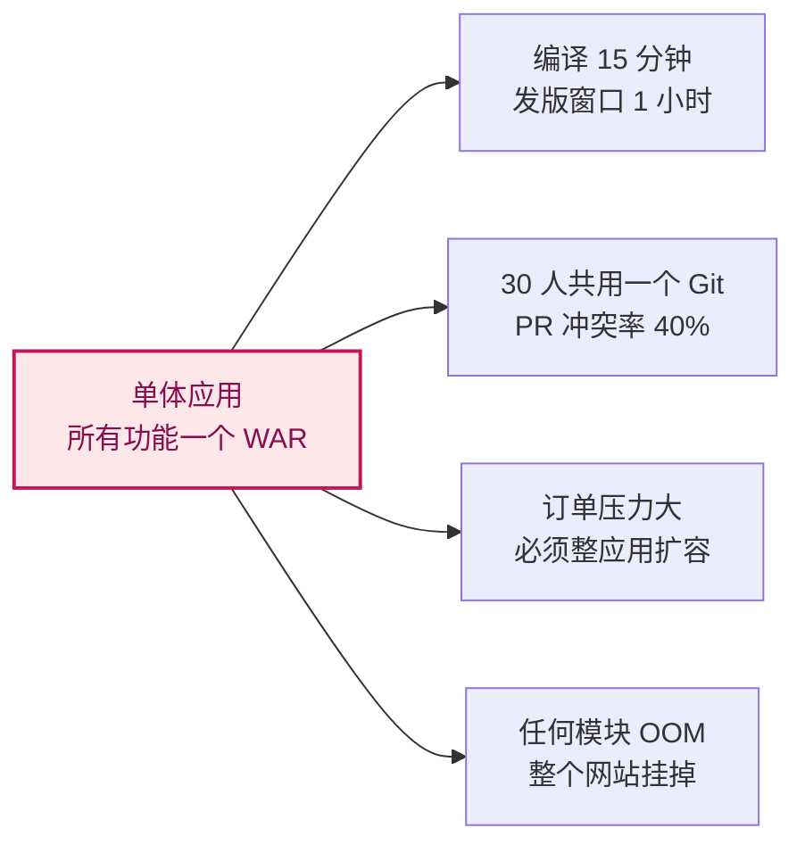

**单体的五大痛点**：编译/发布慢、协作冲突、扩展受限、可用性差、技术栈锁定。

### 18.1.2 微服务的好处

2017 年底极购启动微服务化，把单体按业务域拆成 50+ 微服务，五年后获得了：**独立部署**（发布频率从每周 1 次 → 每天 30+ 次）、**独立扩展**（大促机器成本降 60%）、**技术异构**（搜索 Go、推荐 Python、订单 Java）、**故障隔离**（商品 OOM 不影响支付）、**团队自治**（1 个 30 人 → 7 个 5~8 人小团队）。

### 18.1.3 极购微服务化演进

微服务化不是一次性切完，极购用了 **3 年 4 阶段**：


**阶段 1（数据库拆分）**：业务不动只拆库，6 个库。**阶段 2（应用拆分）**：按域拆 7 个服务，库仍部分共享。**阶段 3（数据库独立）**：每个服务独享库，禁止跨库 join。**阶段 4（服务网格）**：引入 Service Mesh，治理能力下沉到 Sidecar。

---

## 18.2 微服务拆分原则

### 18.2.1 按业务域拆分

微服务拆分的第一刀是 **按业务域**——极购七大域对应 50+ 微服务：用户域 4 个、商品域 6 个、交易域 5 个、营销域 4 个、支付域 3 个、履约域 3 个、平台支撑 25+。

### 18.2.2 单一职责 + 自治

每个微服务只做一件事，且必须 **自治**：独立部署（一服务一发布窗口）、独立存储（一服务一库）、独立技术栈（各服务可自由选语言）、独立团队（1 团队负责 1~3 个服务）。

### 18.2.3 演进式拆分（绞杀者模式）

微服务化不能"一步到位"，极购用 **绞杀者模式（Strangler Fig Pattern）**——让微服务像绞杀榕一样慢慢"绞死"单体：

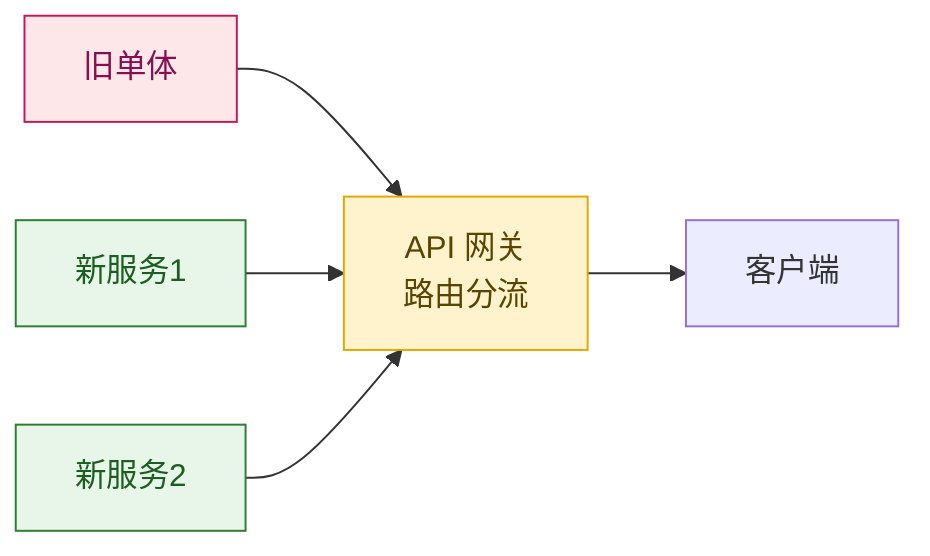

**做法**：API 网关同时接入旧单体和新服务，通过路由规则逐步切流——1% 观察 1 周 → 10% 观察 2 周 → 50% 观察 1 月 → 全量。

---

## 18.3 服务通信方式

极购用了三种通信方式：**同步 RPC、异步 MQ、网关路由**。

| 维度 | HTTP/JSON | gRPC | Dubbo | RocketMQ | Kafka |
|------|-----------|------|-------|----------|-------|
| **数据格式** | JSON 文本 | Protobuf 二进制 | Hessian/JSON | 消息 | 消息 |
| **性能** | 一般 | 高 | 高 | 10 万 TPS | 100 万 TPS |
| **事务消息** | - | - | - | 支持 | 不支持 |
| **语言支持** | 全语言 | 全语言 | 仅 Java | 主流 | 主流 |
| **极购使用场景** | 跨语言/对外 | 详情→价格 | 订单→库存 | 交易链路 | 日志埋点 |

**选型经验**：Java 服务间 80% 用 Dubbo（性能高、自带发现）；跨语言用 gRPC；对外用 HTTP/JSON。交易链路用 RocketMQ（强一致、事务消息）；日志/埋点用 Kafka（量大）。

---

## 18.4 API 网关：微服务的「门面」

### 18.4.1 极购的双网关架构

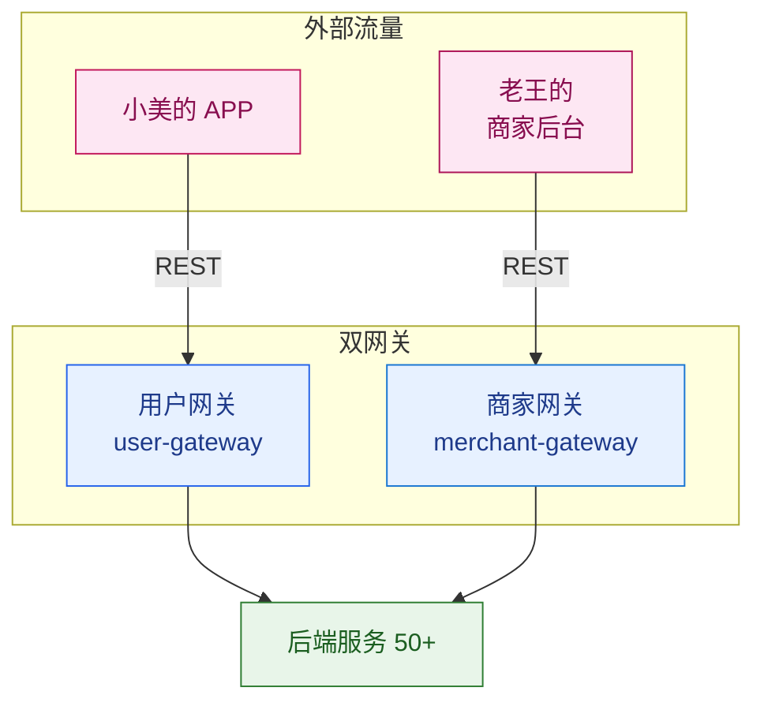

**为什么 C 端和 B 端要分两套网关**？用户网关 C 端 50 万 QPS、严格限流；商家网关 B 端 5 万 QPS、宽松限流。分开的好处：商家后台被刷不会拖垮 C 端；商家发版独立不影响 C 端用户。

### 18.4.2 网关请求处理流程

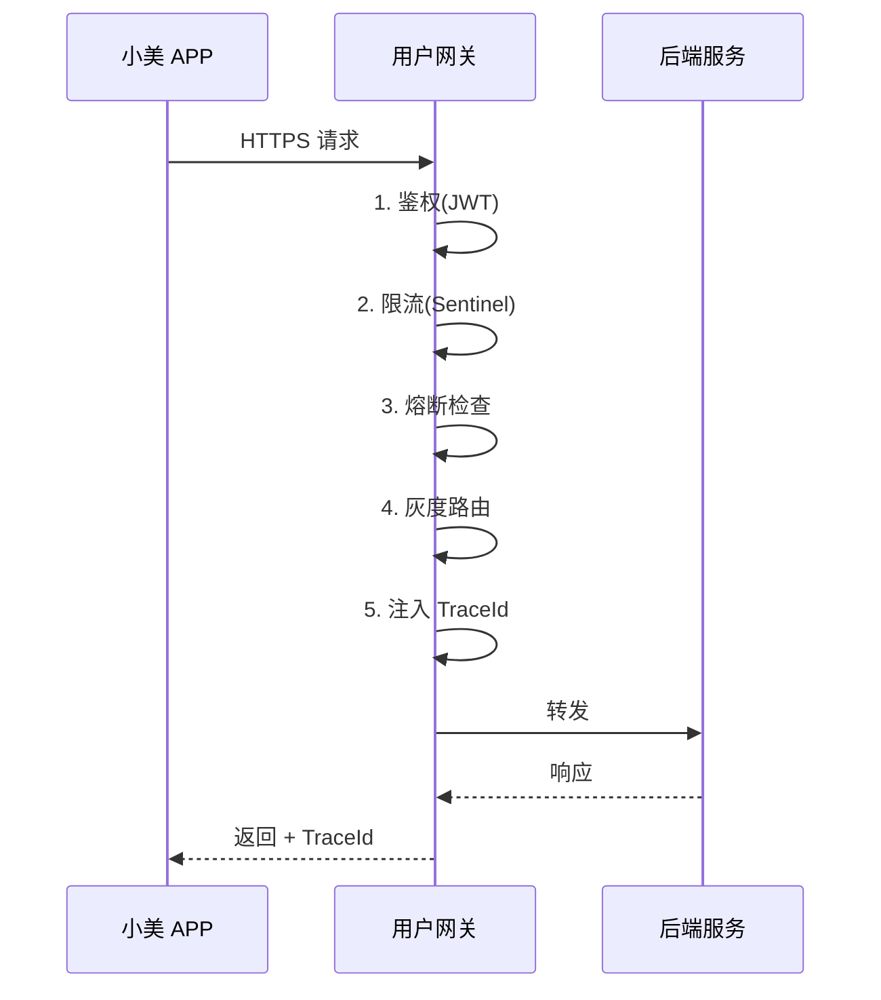

**Filter 顺序**：鉴权 → 限流 → 熔断 → 灰度 → 日志（先确认你是谁、允许多少流量、能不能调用、走哪个版本、记下日志）。

### 18.4.3 Spring Cloud Gateway 路由配置

```yaml
spring:
  cloud:
    gateway:
      routes:
        # 商品服务(含灰度)
        - id: product-service
          uri: lb://product-service
          predicates:
            - Path=/api/product/**
          filters:
            - StripPrefix=2
            - name: GrayRelease
              args:
                grayVersion: v2
                grayRatio: 0.1
                grayUserIds: 1001,1002,1003

        # 秒杀服务(强限流)
        - id: seckill-service
          uri: lb://seckill-service
          predicates:
            - Path=/api/seckill/**
          filters:
            - StripPrefix=2
            - name: RateLimit
              args:
                qps: 50000
                keyResolver: "#{@ipKeyResolver}"
            - name: Sentinel
              args:
                rules: seckillRules
```

### 18.4.4 自定义 GatewayFilter（TraceId 注入）

```java
@Component
public class TraceIdFilter implements GlobalFilter, Ordered {

    public static final String TRACE_ID_HEADER = "X-Trace-Id";

    @Override
    public Mono<Void> filter(ServerWebExchange exchange, GatewayFilterChain chain) {
        ServerHttpRequest request = exchange.getRequest();

        // 1. 获取或生成 TraceId
        String traceId = request.getHeaders().getFirst(TRACE_ID_HEADER);
        if (traceId == null || traceId.isEmpty()) {
            traceId = UUID.randomUUID().toString().replace("-", "");
        }

        // 2. 写入 MDC（日志自动带上）
        MDC.put("traceId", traceId);

        // 3. 注入到请求头（透传给下游）
        ServerHttpRequest mutatedRequest = request.mutate()
                .header(TRACE_ID_HEADER, traceId).build();

        // 4. 注入到响应头
        exchange.getResponse().getHeaders().add(TRACE_ID_HEADER, traceId);

        return chain.filter(exchange.mutate().request(mutatedRequest).build())
                .then(Mono.fromRunnable(MDC::clear));
    }

    @Override
    public int getOrder() {
        return Ordered.HIGHEST_PRECEDENCE;
    }
}
```

### 18.4.5 灰度发布

极购每次大促前都要做 **灰度发布**——先让 1% 的用户使用新版本，观察 24 小时无异常后逐步放量。

**三种灰度方式**：

| 灰度方式 | 规则 | 极购使用频率 |
|----------|------|--------------|
| **按用户 ID** | userId % 100 == 0 | 90% |
| **按区域** | region == "上海" | 5% |
| **按版本** | client_version >= 5.0 | 5% |

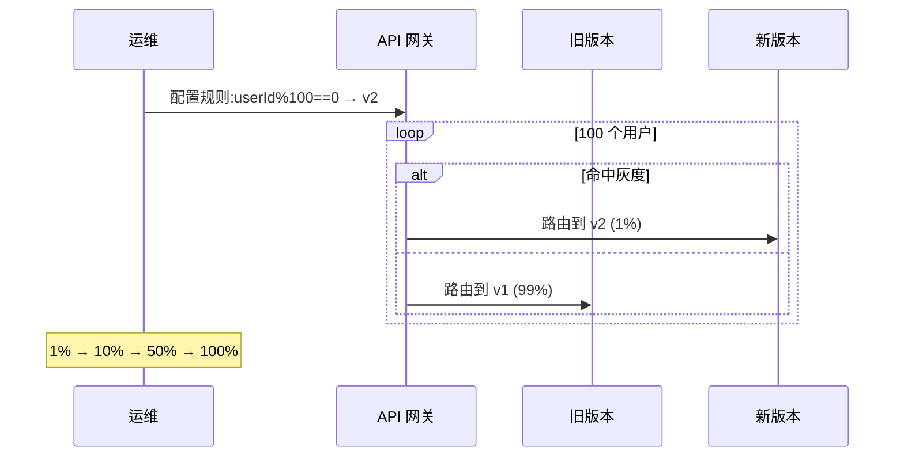

---

## 18.5 服务注册与发现

### 18.5.1 注册中心对比

| 注册中心 | 一致性 | 健康检查 | 极购使用 |
|----------|--------|----------|----------|
| Eureka | AP | 客户端心跳 | 早期用过,2020 下线 |
| **Nacos** | AP/CP 切换 | 心跳 + 探测 | 当前主用 |
| Consul | CP | 多协议 | 海外业务 |
| Zookeeper | CP | TCP | 仅 Kafka |

极购主用 Nacos，因为同时支持 **服务发现 + 配置中心**，AP/CP 可切换，多机房路由能力强。

### 18.5.2 服务发现流程

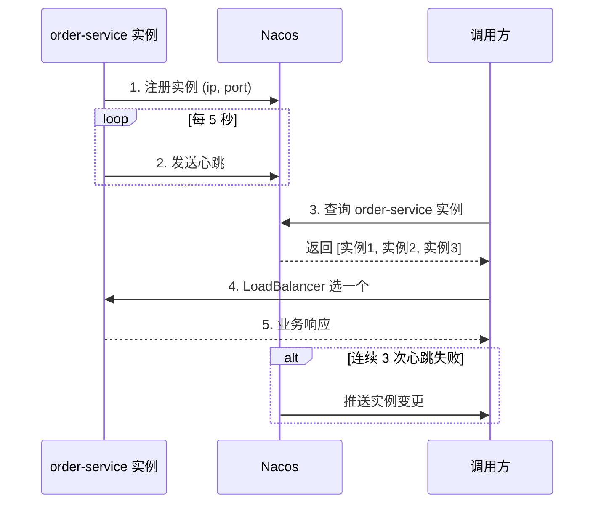

### 18.5.3 Nacos 配置示例

```yaml
spring:
  cloud:
    nacos:
      # 服务发现
      discovery:
        server-addr: nacos.jiguo.com:8848
        metadata:
          version: v1
          region: hangzhou
          gray: "false"

      # 配置中心
      config:
        server-addr: nacos.jiguo.com:8848
        extension-configs:
          - dataId: common-mysql.yaml
            refresh: true
          - dataId: order-service-dynamic.yaml
            refresh: true   # 动态刷新
```

**Nacos 上的动态配置**（修改后 5 秒内全集群生效）：

```yaml
order:
  timeout-minutes: 30
  max-orders-per-day: 50
  inventory:
    timeout-ms: 200
    retry-times: 2
sentinel:
  flow-rules:
    - resource: createOrder
      grade: QPS
      count: 5000
```

**业务代码**：

```java
@RestController
@RefreshScope  // 配置变更时自动刷新
public class OrderController {
    @Value("${order.timeout-minutes:30}")
    private int timeoutMinutes;
    // ...
}
```

---

## 18.6 服务治理：限流、熔断、降级

这三个概念经常被混用，但其实是三个不同机制：

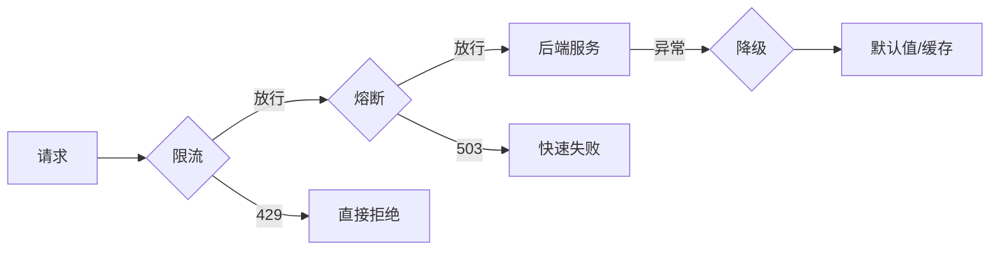

| 机制 | 触发时机 | 极购使用 |
|------|----------|----------|
| **限流** | 请求量超阈值 | 秒杀 5 万 QPS |
| **熔断** | 下游错误率超阈值 | 商品详情熔断保护下单 |
| **降级** | 熔断后/系统压力大 | 推荐返回空列表 |

### 18.6.1 Sentinel 限流配置

极购 2020 年后全面使用 **Sentinel**（阿里开源），对比 Hystrix 优势：控制台可视化、支持 QPS/线程数/系统负载/热点参数、集群限流。

```java
@Configuration
public class SentinelConfig {

    @PostConstruct
    public void initRules() {
        // 限流规则
        List<FlowRule> flowRules = new ArrayList<>();

        FlowRule createOrder = new FlowRule("createOrder");
        createOrder.setGrade(RuleConstant.FLOW_GRADE_QPS);
        createOrder.setCount(5000);  // 5000 QPS 限流
        createOrder.setControlBehavior(RuleConstant.CONTROL_BEHAVIOR_RATE_LIMITER);
        createOrder.setMaxQueueingTimeMs(500);
        flowRules.add(createOrder);

        FlowRuleManager.loadRules(flowRules);

        // 熔断规则
        List<DegradeRule> degradeRules = new ArrayList<>();

        DegradeRule inv = new DegradeRule("callInventoryService");
        inv.setGrade(RuleConstant.DEGRADE_GRADE_EXCEPTION_RATIO);
        inv.setCount(0.3);          // 异常比例 > 30% 熔断
        inv.setTimeWindow(10);      // 熔断 10 秒
        inv.setMinRequestAmount(20);
        degradeRules.add(inv);

        DegradeRuleManager.loadRules(degradeRules);
    }
}
```

**业务代码使用**：

```java
@Service
public class OrderServiceImpl {

    @SentinelResource(
        value = "createOrder",
        blockHandler = "createOrderBlockHandler",
        fallback = "createOrderFallback"
    )
    public Order createOrder(OrderRequest request) {
        inventoryService.deduct(request);
        // ...
        return order;
    }

    public Order createOrderBlockHandler(OrderRequest request, BlockException ex) {
        throw new BusinessException("SYSTEM_BUSY", "系统繁忙");
    }
}
```

### 18.6.2 限流熔断时序

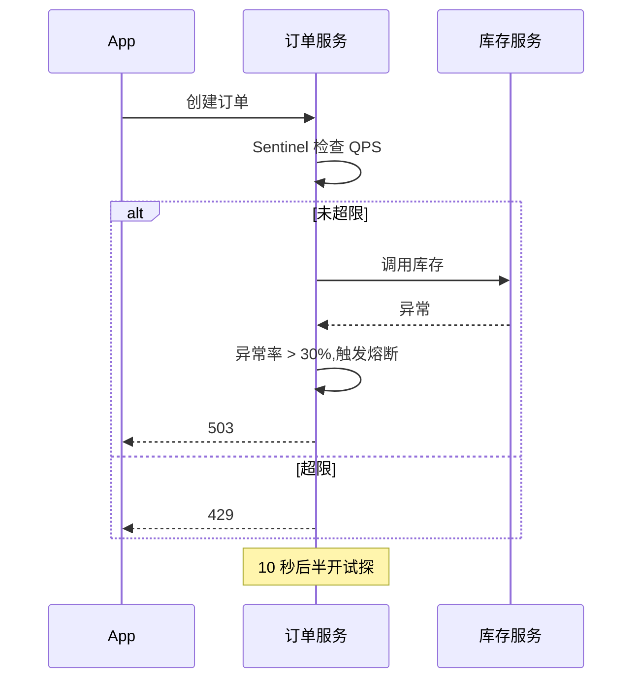

### 18.6.3 幂等设计（重试前提）

重试有三个坑：**非幂等重试**（重复扣款）、**无限重试**（拖垮下游）、**无退避**（重试风暴）。极购所有写接口都强制幂等：

```java
public Order createOrder(OrderRequest request) {
    String key = request.getIdempotencyKey();

    // 1. Redis 检查:这个 key 是否已处理
    Order existing = idempotencyService.checkAndGet(key);
    if (existing != null) return existing;

    // 2. 加分布式锁,防止并发
    if (!idempotencyService.tryLock(key, 5)) {
        throw new BusinessException("CONCURRENT_REQUEST", "请勿重复提交");
    }

    try {
        Order order = doCreateOrder(request);
        idempotencyService.saveResult(key, order);  // TTL 24h
        return order;
    } finally {
        idempotencyService.unlock(key);
    }
}
```

---

## 18.7 可观测性：链路追踪 + 统一日志

### 18.7.1 SkyWalking 链路追踪

50+ 微服务的调用链非常复杂——小美一次下单涉及 7 个服务、5 个数据库、3 个 MQ。**没有链路追踪，排查问题就像在黑暗里找针**。

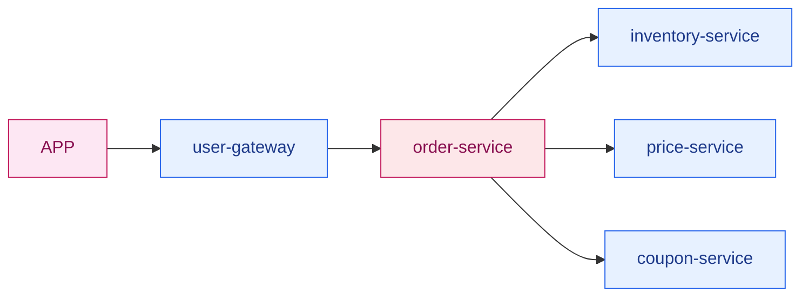

**D 调用 E、F、G 时总耗时 1.2s，怎么知道慢在哪？**

| 方法 | 能看到 | 不能看到 |
|------|--------|----------|
| 日志 | 单服务日志 | 跨服务调用关系 |
| 监控 | 整体 QPS/错误率 | 单次请求路径 |
| **链路追踪** | 完整调用链 | - |

**SkyWalking 部署**：

```bash
# Java 应用接入 SkyWalking Agent
java -javaagent:/opt/skywalking/agent/skywalking-agent.jar \
     -Dskywalking.agent.service_name=order-service \
     -Dskywalking.collector.backend_service=skywalking-oap.jiguo.com:11800 \
     -jar order-service.jar
```

```yaml
# application.yml
skywalking:
  agent:
    service_name: ${spring.application.name}
  collector:
    backend_service: skywalking-oap.jiguo.com:11800
  alarm:
    rules:
      service_resp_time_rule:
        indicator: service_resp_time
        threshold: 1000  # P99 > 1s 告警
        period: 10
        count: 3
```

**业务埋点**：

```java
@Trace
public Order createOrder(OrderRequest request) {
    ActiveSpan.tag("userId", "12345");
    ActiveSpan.tag("orderSource", "APP");
    return doCreateOrder(request);
}
```

### 18.7.2 ELK 统一日志

**ELK 架构**：


**TraceId 关联是 ELK 的真正威力**——在 Kibana 搜一个 TraceId 就能看到这次请求在所有服务里的所有日志：

| 时间 | 服务 | TraceId | 消息 |
|------|------|---------|------|
| 10:00:00.005 | order-service | abc123 | 开始创建订单 userId=12345 |
| 10:00:00.012 | inventory-service | abc123 | 预扣库存 skuId=8888 |
| 10:00:00.025 | inventory-service | abc123 | 预扣成功 |
| 10:00:00.045 | order-service | abc123 | 订单创建成功 |

### 18.7.3 黄金指标监控

**Google SRE 四大黄金指标**：

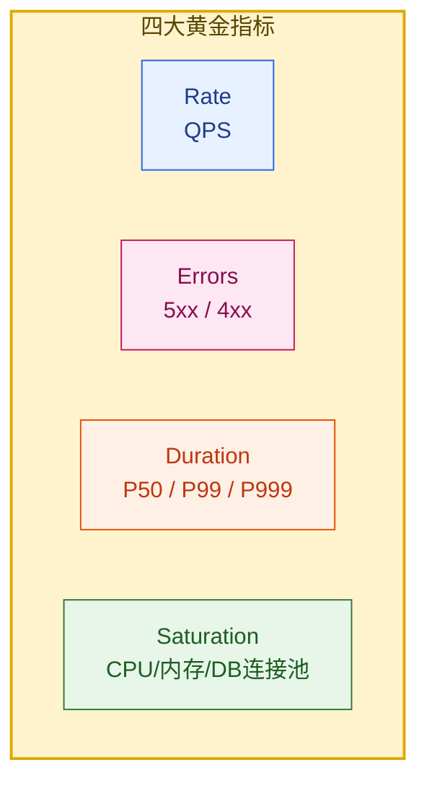

**健康检查端点**：

| 端点 | 用途 |
|------|------|
| `/health/live` | 存活探针(K8s livenessProbe) |
| `/health/ready` | 就绪探针(DB/Redis/MQ 是否就绪) |
| `/health/startup` | 启动探针 |

---

## 18.8 极购微服务全景

### 18.8.1 服务依赖全景

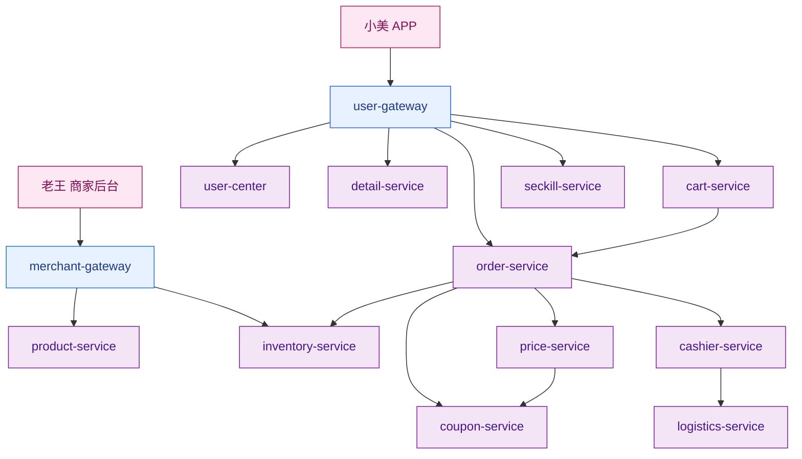

### 18.8.2 一次下单的微服务之旅

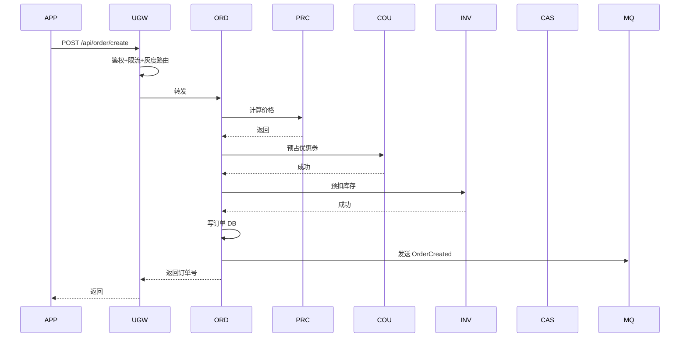

**关键路径耗时分布**：

| 阶段 | 服务 | 耗时 | 占比 |
|------|------|------|------|
| 网关鉴权限流 | user-gateway | 3ms | 1.5% |
| 价格计算 | price-service | 20ms | 10% |
| 券预占 | coupon-service | 15ms | 7.5% |
| 库存预扣 | inventory-service | 50ms | 25% |
| 订单入库 | order-service | 100ms | 50% |
| 异步消息 | RocketMQ | 10ms | 5% |
| **总耗时** | **7 个服务** | **~200ms** | **100%** |

**这条链路就是极购交易核心**——任何一环慢、任何一环挂，整个下单都会受影响。这就是为什么网关、限流、熔断、监控如此重要。

### 18.8.3 微服务安全

**三层防护**：


**Service Mesh（服务网格）**是进一步演进：把限流、熔断、灰度、mTLS 等通用能力从业务进程抽到 Sidecar 代理。极购当前是 Java（Spring Cloud）+ Go/Python（Istio）的混合架构，逐步全面 Service Mesh 化。

---

## 本章小结

本章系统介绍了极购商城微服务架构的核心组件：

1. **为什么需要微服务**：单体的 5 大痛点（编译慢/协作难/扩展受限/可用性差/技术栈锁定），微服务的 5 大收益。极购通过 3 年 4 阶段完成微服务化。

2. **微服务拆分原则**：按业务域（极购七大域）、单一职责、自治、演进式拆分（绞杀者模式）四原则。

3. **服务通信**：HTTP/gRPC/Dubbo 同步 + RocketMQ/Kafka 异步，80% 同步 + 20% 异步是经验比例。

4. **API 网关**：双网关架构（C 端 50 万 QPS + B 端 5 万 QPS）；核心功能（路由、限流、熔断、鉴权、灰度）；Spring Cloud Gateway 完整配置和自定义 Filter。

5. **服务注册与发现**：Nacos（AP/CP 可切换 + 配置中心合一）；服务发现 5 步流程（注册→心跳→查询→负载均衡→调用）。

6. **配置中心**：Nacos 三层配置（公共 + 业务 + 环境），5 秒全集群热更新。

7. **服务治理**：限流/熔断/降级的差异；Sentinel 完整配置（QPS 限流 + 异常熔断）；幂等设计是重试前提。

8. **可观测性**：SkyWalking 链路追踪 + ELK 统一日志 + TraceId 关联；4 大黄金指标（Rate/Errors/Duration/Saturation）。

9. **极购全景**：50+ 微服务按七大域分布；小美一次下单穿越 7 个服务，200ms 完成。

---

## 思考题

1. **拆分粒度**：极购早期按「一个表一个服务」拆，故障率反而上升 10 倍。请分析「过度拆分」的危害，并给出判断「拆得是否合理」的 3 条标准。

2. **网关选型**：如果极购要从 Spring Cloud Gateway 迁移到 Envoy + Istio，请列出迁移的 3 个最大风险点，以及如何分阶段灰度迁移。

3. **灰度策略**：极购要在双 11 前对订单服务做一次大重构上线，请设计灰度策略：灰度规则（按什么维度选用户）、灰度节奏（多长时间放量到多少）、熔断条件（什么情况下立即回滚）、监控指标（重点观察哪些指标）。

4. **幂等设计**：极购的「创建订单」接口要求严格幂等。请用 200 字内描述：客户端如何保证幂等键不重复、服务端如何保证同一幂等键只处理一次、分布式场景下如何防止并发请求重复创建。

5. **链路追踪优化**：极购的链路追踪发现一次下单平均耗时 200ms，库存预扣占 50ms。请设计一个方案，在不改变业务代码的前提下，把库存预扣的 P99 延迟从 200ms 降到 50ms。

---

**参考来源**

- [微服务架构 - martinfowler.com](https://martinfowler.com/articles/microservices.html)
- [Spring Cloud Gateway 官方文档](https://spring.io/projects/spring-cloud-gateway)
- [Nacos 官方文档](https://nacos.io/zh-cn/docs/quick-start.html)
- [Sentinel 官方文档](https://sentinelguard.io/zh-cn/docs/introduction.html)
- [Apache SkyWalking 官方文档](https://skywalking.apache.org/docs/)
- [Istio 官方文档](https://istio.io/latest/docs/)
- [Google SRE Book - Monitoring Distributed Systems](https://sre.google/sre-book/monitoring-distributed-systems/)
- [Envoy 官方文档](https://www.envoyproxy.io/docs/envoy/latest/)
- [阿里巴巴中台架构演进](https://developer.aliyun.com/article/780737)
- [Netflix Tech Blog - Hystrix](https://netflixtechblog.com/hystrix-dashboard-turbine-deprecated)

---

**下一章**：[第 19 章 · 高并发工程架构实战](./19-高并发工程架构实战.md)
