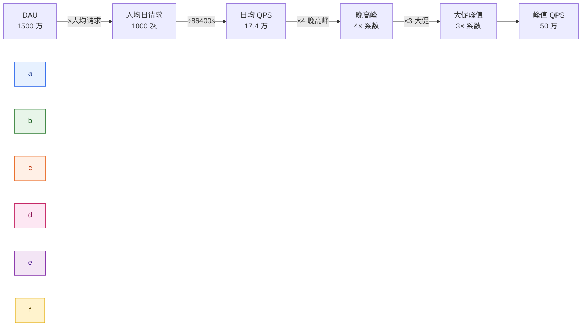
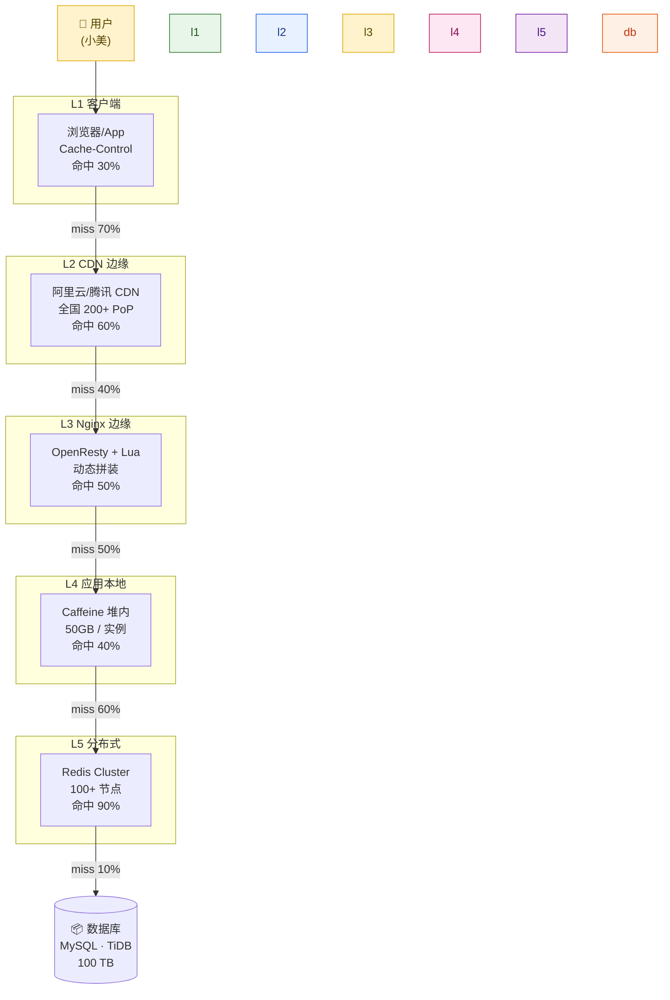
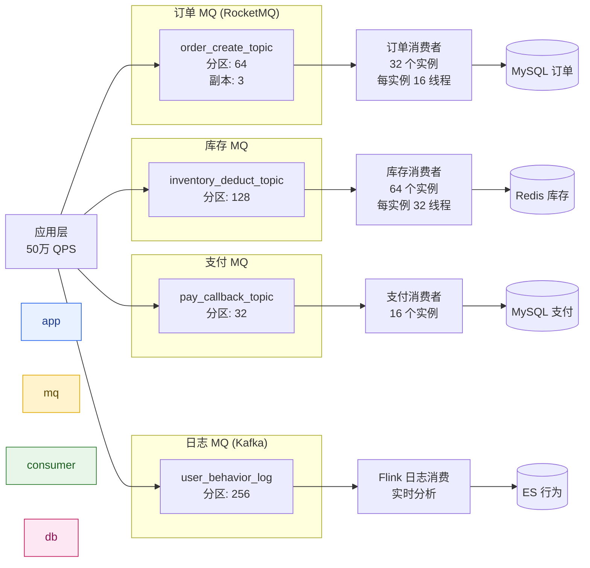
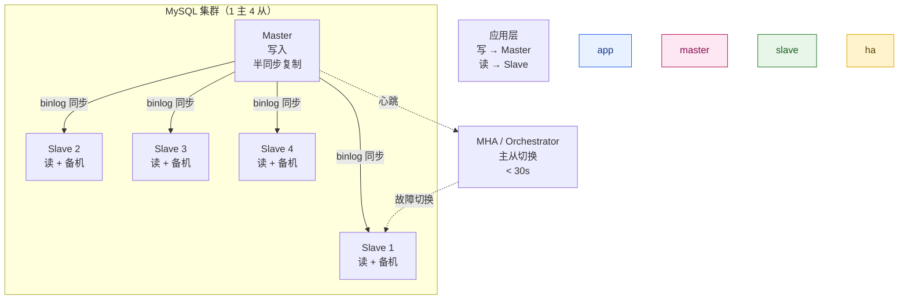
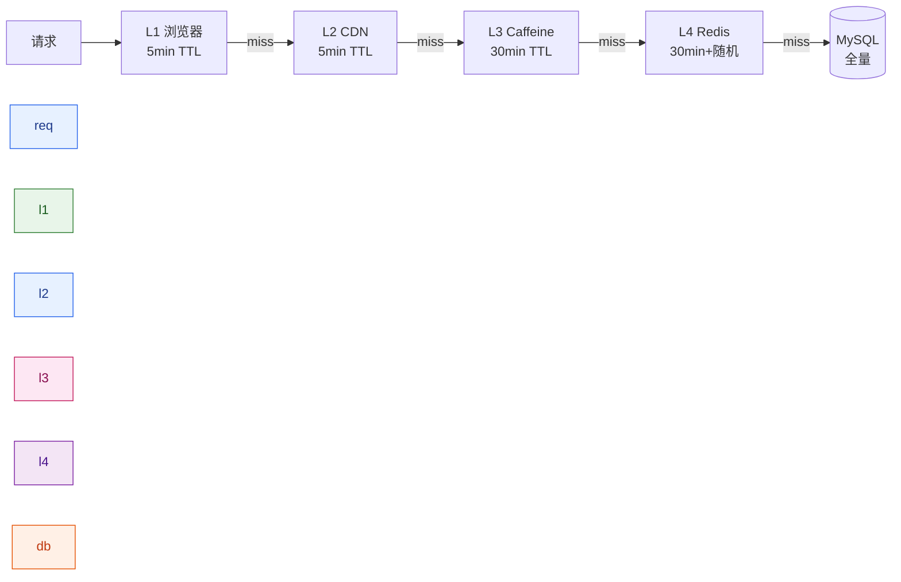
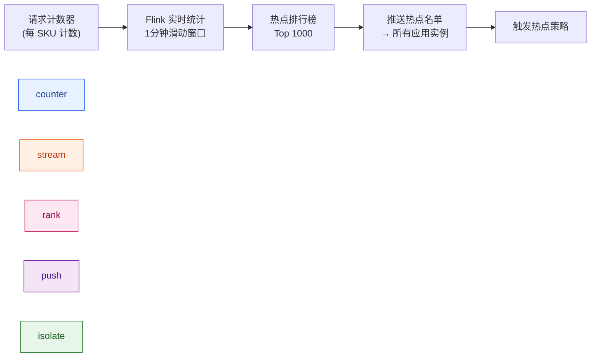
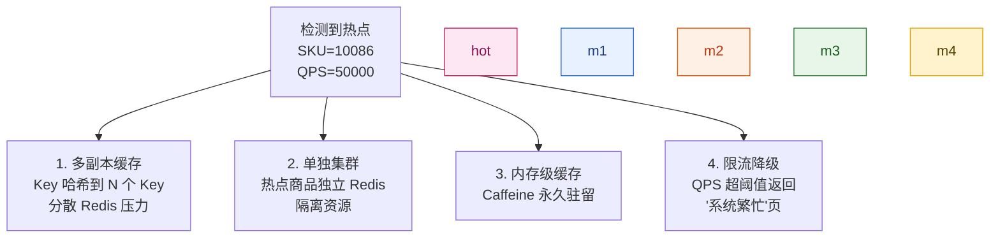
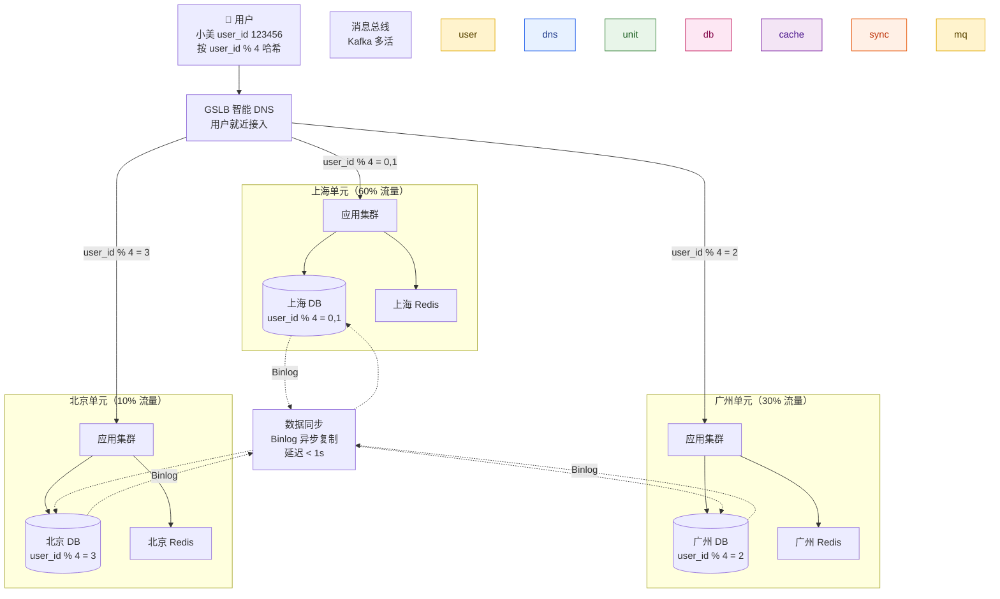
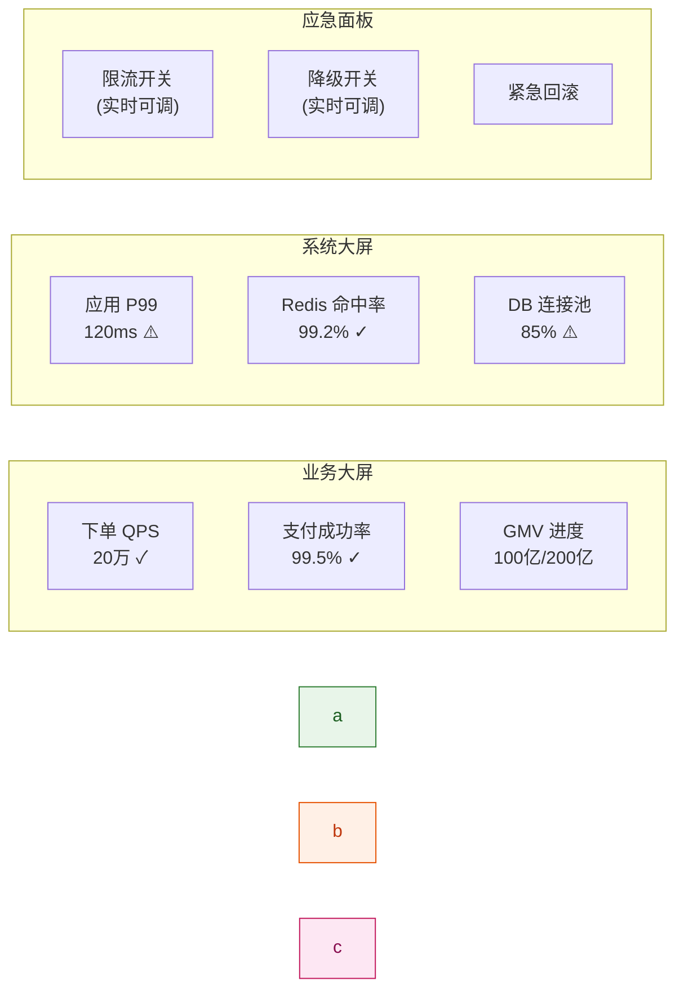
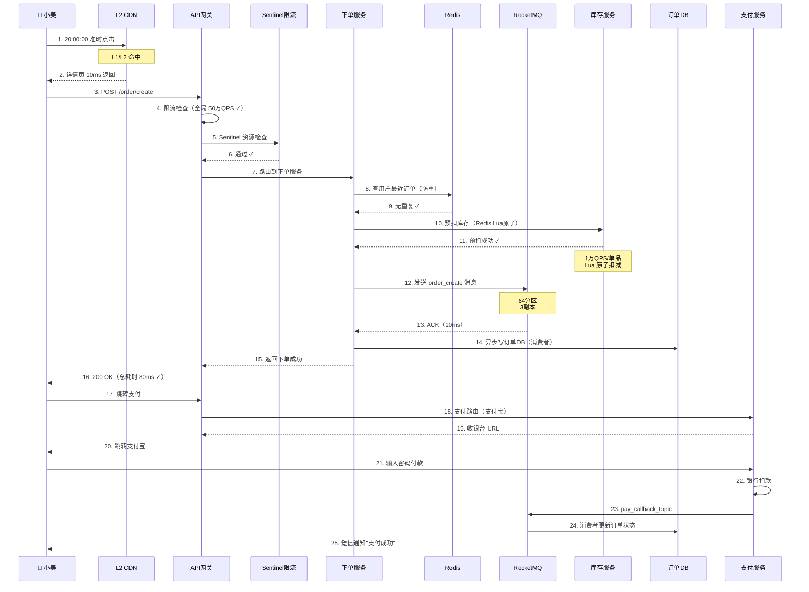

# 第 19 章 · 高并发工程架构实战

> **所属系列**：《极购商城系统设计 · 全景教程》第六部分 · 平台与工程
> **上一章**：[第 18 章 · API 网关与微服务架构](./18-API网关与微服务.md)
> **下一章**：[第 20 章 · 全链路串讲与学习路径](./20-全链路串讲与学习路径.md)
> **总目录**：[教程大纲](./00-教程大纲.md)

---

## 本章导读

前 18 章已经把商城系统拆成了七大域：商品（第 3-4 章）、交易（第 5-9 章）、支付与一致性（第 10-11 章）、履约与用户（第 12-15 章）、风控与数据（第 16-17 章）、平台基础（第 18 章）。每一章都在描述「这个功能应该怎么做」，但有一个核心问题始终悬在背后：

> **这些功能，如何在双 11 当晚 20:00 整点、小美准时下单那一刻的 50 万 QPS 压力下同时跑通，做到 0 宕机、0 超卖、0 资损？**

这就是本章的使命——**工程总收口**。

本章以「极购商城」（日活 1500 万、商品库 5 亿 SKU）双 11 大促为主线，贯穿「小美下单爆款 T 恤」「老王 T 恤订单暴增 100 倍」两条案例，从以下维度将前面各章的工程约束统一收口：

- **大促工程挑战**：平时 10× 流量、0 宕机 0 超卖 0 资损
- **容量估算**：QPS、存储、带宽的量化推导（极购详细数字）
- **多级缓存体系**：浏览器→CDN→Nginx→Caffeine→Redis（与第 4 章联动）
- **消息队列削峰**：订单/库存/支付 MQ、消费并发、幂等
- **数据库高可用**：主从、读写分离、分库分表（ShardingSphere）
- **缓存三大问题**：穿透（布隆过滤器）、击穿（SingleFlight）、雪崩（过期随机化）
- **热点应对**：探测、多副本、隔离、限流熔断降级
- **限流与熔断降级**：Sentinel 配置、令牌桶/漏桶
- **异地多活**：单元化、同城双活、跨城多活
- **大促全周期**：准备 → 进行 → 复盘
- **典型问题诊断**：线程池打满、连接池耗尽、慢 SQL、Full GC

> 注：本章涉及的缓存细节见第 4 章，分布式事务见第 11 章，秒杀极致优化见第 9 章，全链路串讲见第 20 章。

---

## 19.1 大促的工程挑战

### 19.1.1 极购面对的真实场景

电商大促是一年中工程压力最大的几天——双 11、双 12、618、年货节、黑五、春节红包。一个头部电商在双 11 当晚 20:00 整点（开抢时刻）面临的真实压力：


**极购大促目标**（参考阿里双 11 公开数据：58.3 万笔/秒）：

| 指标 | 平时 | 双 11 峰值 | 倍数 |
|------|------|-----------|------|
| 总 QPS | 5 万 | **50 万** | 10× |
| 下单 TPS | 5 千 | **20 万** | 40× |
| 支付 TPS | 1 千 | **10 万** | 100× |
| 详情页 QPS | 30 万 | **100 万+** | 3× |
| 库存扣减 QPS | 1 万 | **100 万** | 100× |
| 日订单 | 800 万 | **2000 万** | 2.5× |
| 日 GMV | 10 亿 | **200 亿** | 20× |

### 19.1.2 三大不能出错的指标

大促期间任何工程故障都会被放大成业务事故。**0 宕机、0 超卖、0 资损**是三条不可逾越的红线：

| 指标 | 含义 | 故障后果 | 防护手段 |
|------|------|---------|---------|
| **0 宕机** | 系统全程可用 | 用户无法下单，订单流失 | 多活容灾、限流熔断、降级 |
| **0 超卖** | 库存不能卖穿 | 老王发不出货，平台赔付 | 库存 Redis Lua、乐观锁、最终一致 |
| **0 资损** | 钱不能算错 | 用户/商家投诉，财务对账失败 | TCC、Saga、幂等、对账 |

### 19.1.3 大促节奏时间表

| 时间 | 阶段 | 关键工作 |
|------|------|---------|
| T-60d | 立项 | 目标拆解、容量初评、技术选型 |
| T-30d | 备战 | 压测、预案、监控大屏、灰度发布 |
| T-7d | 预热 | 流量预热（领券、加购）、数据预热 |
| T-1d | 封板 | 代码冻结、配置封板、值班安排 |
| T-0 | 大促 | 实时监控、紧急响应、限流降级 |
| T+1 | 收尾 | 退货退款、订单完结、数据修复 |
| T+7 | 复盘 | 故障回顾、性能数据、改进项 |

---

## 19.2 容量估算：极购详细数字推导

容量估算是高并发架构的起点。**所有的设计决策都从「要扛多少 QPS、用多少机器、存多少数据」开始**。下面我们针对极购的每个核心接口逐项推导。

### 19.2.1 基础假设

| 维度 | 数值 | 来源 |
|------|------|------|
| DAU | 1500 万 | 第 0 章规模基准 |
| 大促峰值倍数 | 10× | 行业经验 |
| 大促当天总请求 | 1500 亿次 | DAU × 人均请求数（1000） |
| 大促峰值 QPS | 50 万 | 阿里双 11 公开数据 |
| 单机房目标 | 5 万 QPS | 50 万 / 10 机房 |
| 大促机器数 | 2 万台 | 假设 250 QPS/台 |

### 19.2.2 公式推导



**核心公式**：

$$
\text{QPS}_{\text{peak}} = \frac{\text{DAU} \times \text{人均请求数}}{86400} \times \text{晚高峰系数} \times \text{大促系数}
$$

$$
= \frac{1.5 \times 10^7 \times 1000}{86400} \times 4 \times 3 \approx 208 \text{ 万}（理论上限）
$$

实际取 **50 万**（流量经过 CDN/缓存层过滤后到达应用层的真实 QPS）。

### 19.2.3 各核心接口 QPS 估算

| 接口 | 平时 QPS | 大促峰值 | 单机 QPS 上限 | 所需机器 |
|------|---------|---------|-------------|---------|
| 商品详情页 | 30 万 | **100 万+** | 5 万 | 20 台 × 10 机房 = 200 |
| 商品列表/搜索 | 5 万 | 20 万 | 1 万 | 200 |
| 购物车查询 | 2 万 | 10 万 | 5 千 | 200 |
| 下单创建 | 5 千 | **20 万** | 2 千 | 1000 |
| 库存扣减 | 1 万 | **100 万** | 1 万 | 1000 |
| 支付提交 | 1 千 | **10 万** | 1 千 | 1000 |
| 订单查询 | 2 万 | 30 万 | 1 万 | 300 |
| 退款申请 | 500 | 1 万 | 500 | 200 |
| 优惠计算 | 1 万 | 30 万 | 5 千 | 600 |
| 推荐接口 | 10 万 | 50 万 | 1 万 | 500 |

> **下单与库存扣减是峰值最高的两个接口**，分别需要约 1000 台机器支撑，**这是大促资源投入最大的两块**。

### 19.2.4 存储容量估算

按大促日订单 2000 万、3 年留存估算：

| 数据类型 | 单条大小 | 日增 | 3 年总量 | 存储方案 |
|---------|---------|------|---------|---------|
| **订单主表** | 2 KB | 2000 万 × 2KB = 40 GB | **43 TB** | MySQL 分 64 库 × 16 表 |
| **订单明细** | 1 KB | 20 GB | **22 TB** | MySQL 分库 |
| **订单流转日志** | 500 B | 10 GB | **11 TB** | HBase / ClickHouse |
| **库存快照** | 200 B | 4 GB | **4 TB** | Redis 持久化 + MySQL |
| **支付流水** | 500 B | 10 GB | **11 TB** | MySQL 分库 + ES 索引 |
| **用户购物车** | 1 KB | 1500 万 × 1KB = 15 GB | **16 GB**（实时滚动） | Redis Cluster |
| **商品主数据** | 5 KB | 5 亿 × 5KB = 2.5 TB（静态）| **3 TB** | MySQL + 缓存 |
| **评价数据** | 800 B | 100 万条 × 800B = 800 MB | **1 TB** | MySQL + ES |
| **行为埋点** | 300 B | 50 亿条 × 300B = 150 GB/天 | **165 TB** | Kafka → HDFS |

**总计**：约 **100 TB 热数据 + 200 TB 冷数据**。

### 19.2.5 带宽估算

$$
\text{带宽}_{\text{峰值}} = \text{QPS}_{\text{peak}} \times \text{平均响应大小}
$$

$$
= 5 \times 10^5 \times 5 \text{ KB} = 2.5 \times 10^9 \text{ B/s} = \textbf{20 Gbps（单机房）}
$$

- **商品详情页**：含图 HTML ≈ 50 KB，CDN 命中率 95%，应用层带宽极小
- **图片/视频**：走 CDN，独立计费
- **下单接口**：JSON 响应 ≈ 2 KB，纯文本
- **内网 RPC**：服务间调用，需 10 Gbps+ 内网交换

> **极购大促带宽预算**：单机房 20 Gbps 应用带宽 + 100 Gbps 内网 + 独立 CDN 出口。

---

## 19.3 多级缓存体系（与第 4 章联动）

第 4 章已经详细讲了详情页的 5 级缓存（浏览器→CDN→Nginx→Caffeine→Redis），本章从**整站架构**角度再讲一遍，强调全站视角下的缓存分工。

### 19.3.1 整站缓存分层



**综合命中率**（独立级联）：

$$
r_{\text{综合}} = 1 - 0.7 \times 0.4 \times 0.5 \times 0.6 \times 0.1 = 1 - 0.0084 = \textbf{99.16%}
$$

**1000 个请求中只有 8 个穿透到 DB**——这是 MySQL 还能存活的关键。

### 19.3.2 整站各类型数据的缓存策略

| 数据类型 | 缓存层 | TTL | 失效方式 | 一致性 |
|---------|--------|-----|---------|--------|
| 商品详情页（静态） | L1+L2+L3+L4+L5 | 5 min / 1h | Canal 监听 + 双删 | 最终 |
| 商品价格 | L4+L5 | 30s / 5min | 改价后立即失效 | 准实时 |
| 库存数量 | L5（Redis） | 1 min | 库存变化同步 | 准实时 |
| 用户会话 | L4+L5 | 30 min | 登出失效 | 强一致 |
| 购物车 | L5（Hash） | 30 天 | 操作即更新 | 强一致 |
| 订单快照 | L5 | 永久 | 不失效 | 强一致 |
| 推荐结果 | L4+L5 | 10 min | 用户行为触发失效 | 最终 |
| 风控规则 | L4 | 5 min | 配置中心推送 | 强一致 |

### 19.3.3 大促缓存特殊策略

**大促期间，缓存策略要做 3 个调整**：

1. **TTL 全部拉长**：把平时的 5min 拉长到 30min，降低穿透概率
2. **预热时间提前**：T-7d 开始把 Top 10 万 SKU 详情页全部推 CDN
3. **热点商品独立集群**：把"茅台""iPhone"等已知爆款分到独立 Redis 集群（详见 19.7）

---

## 19.4 消息队列削峰

消息队列是**大促架构的削峰利器**。瞬时 50 万 QPS 直接打 DB 会瞬间打挂，必须用 MQ 在中间"拦一道"。

### 19.4.1 MQ 选型对比

| 维度 | RocketMQ | Kafka | RabbitMQ |
|------|---------|-------|----------|
| 吞吐量 | 10 万+/s | 100 万+/s | 万级/s |
| 延迟 | 毫秒级 | 毫秒级 | 微秒级 |
| 事务消息 | ✅ 原生支持 | ❌ 需自己实现 | ❌ |
| 顺序消息 | ✅ | ✅ 分区有序 | ✅ 队列级 |
| 消息回溯 | ✅ | ✅ | ❌ |
| 适用场景 | **电商订单（推荐）** | 日志/大数据 | 任务调度 |
| 极购使用 | 订单/库存/支付 MQ | 行为日志/埋点 | 内部任务 |

### 19.4.2 极购 MQ 拓扑



### 19.4.3 消费者三大关键

**1. 消费并发**：

```java
/**
 * RocketMQ 消费者配置：32 实例 × 16 线程 = 512 并发
 * 单实例顺序消费 16 个队列
 */
DefaultMQPushConsumer consumer = new DefaultMQPushConsumer("order_consumer_group");
consumer.setNamesrvAddr("rocketmq-nameserver:9876");
consumer.subscribe("order_create_topic", "*");
// 关键参数：消费者线程数 = 队列数（避免资源浪费）
consumer.setConsumeThreadMin(16);
consumer.setConsumeThreadMax(16);
// 单队列并行度（顺序消息场景下必须为 1）
consumer.setConsumeMessageBatchMaxSize(1);
// 最大重试次数
consumer.setMaxReconsumeTimes(3);
```

**2. 消费限流**（防止消费者把 DB 打爆）：

```java
/**
 * 消费限流：每消费者实例每秒最多消费 1000 条
 * 通过信号量控制
 */
private final Semaphore rateLimiter = new Semaphore(1000);

@Override
public ConsumeConcurrentlyStatus consumeMessage(
        List<MessageExt> msgs, ConsumeConcurrentlyContext context) {
    for (MessageExt msg : msgs) {
        if (!rateLimiter.tryAcquire()) {
            // 限流：稍后重试
            return ConsumeConcurrentlyStatus.RECONSUME_LATER;
        }
        try {
            processOrderMessage(msg);
            rateLimiter.release();
        } catch (Exception e) {
            log.error("Process order message failed", e);
            return ConsumeConcurrentlyStatus.RECONSUME_LATER;
        }
    }
    return ConsumeConcurrentlyStatus.CONSUME_SUCCESS;
}
```

**3. 消费幂等**（防止重试导致重复处理）：

```java
/**
 * 消费幂等：基于订单号 + 业务类型的唯一键
 * 用 Redis SETNX 抢占，DB 唯一索引兜底
 */
public void processOrderMessage(MessageExt msg) {
    String orderId = parseOrderId(msg);
    String dedupKey = "mq:processed:order:" + orderId;

    // 第一道：Redis SETNX 抢占（毫秒级）
    Boolean firstProcess = redis.opsForValue()
        .setIfAbsent(dedupKey, "1", Duration.ofHours(24));
    if (Boolean.FALSE.equals(firstProcess)) {
        // 已处理过，直接跳过
        log.info("Duplicate order message, orderId={}", orderId);
        return;
    }

    try {
        // 第二道：DB 唯一索引兜底（即使 Redis 失败也不重复）
        orderRepository.insertOrder(buildOrder(msg));
    } catch (DuplicateKeyException e) {
        // 唯一键冲突，正常情况
        log.info("Order already exists, orderId={}", orderId);
    }
}
```

### 19.4.4 削峰效果量化

| 链路 | 不用 MQ 时的 QPS | 用 MQ 后 DB QPS | 削峰比例 |
|------|----------------|----------------|---------|
| 下单 | 20 万 | 5000（消费者） | **40×** |
| 库存扣减 | 100 万 | 1 万 | **100×** |
| 支付回调 | 10 万 | 2000 | **50×** |
| 行为日志 | 50 万 | 5000（Flink 批） | **100×** |

> **没有 MQ，所有大促系统都活不过 20:00 整点。**

---

## 19.5 数据库高可用（核心）

数据库是商城系统的"心脏"——一旦挂了或慢了，整个系统就瘫了。本节讲 MySQL 集群的高可用架构。

### 19.5.1 一主多从 + 读写分离



**关键配置**：

- **半同步复制（Semi-Sync）**：Master 写入 binlog 后，至少等待 1 个 Slave ACK 才返回客户端成功，**防止主从切换丢数据**
- **读写分离**：用 ShardingSphere-JDBC 配置，写走 Master，读走 Slave（负载均衡）
- **主从切换**：MHA / Orchestrator 监控心跳，Master 故障 30s 内自动提升 Slave 为新 Master

### 19.5.2 分库分表（核心）

当单库数据量超过 **5000 万行** 或单表超过 **500 万行** 时，查询性能急剧下降，必须分库分表。

**分片策略选择**：

| 策略 | 维度 | 优点 | 缺点 | 极购选择 |
|------|------|------|------|---------|
| **按用户 ID 哈希** | user_id % 64 | 数据均匀、查询无热点 | 跨用户查询需遍历 | ✅ 订单、购物车 |
| **按时间范围** | 月份 | 单表小、自然滚动 | 热点月压力大 | ⚠️ 日志表 |
| **按业务类型** | order_type | 业务隔离清晰 | 数据不均匀 | ❌ 单独使用 |
| **按地理位置** | region | 异地多活友好 | 跨地域查询难 | ⚠️ 单元化分片 |

**极购订单库分片设计**：

$$
\text{分片键} = \text{user\_id} \mod 64
$$

```
极购订单库（64 库 × 16 表 = 1024 张表）
├── db_order_00
│   ├── t_order_00   ← user_id % 64 = 0 的用户订单
│   ├── t_order_01
│   ├── ...
│   └── t_order_15
├── db_order_01
│   ├── t_order_00   ← user_id % 64 = 1
│   └── ...
└── db_order_63
    └── ...
```

**单表行数**：2000 万大促日订单 / 64 库 = 31 万行/库，再按 16 表分 = 2 万行/表 → **完全在 MySQL 舒适区（< 10 万行）**。

### 19.5.3 ShardingSphere 配置

```yaml
# application-sharding.yml —— 极购订单分库分表配置
dataSources:
  ds_0: { url: jdbc:mysql://mysql-order-00:3306/db_order, username: order, password: xxx }
  ds_1: { url: jdbc:mysql://mysql-order-01:3306/db_order, username: order, password: xxx }
  # ... ds_2 ~ ds_63 省略

rules:
  - !SHARDING
    tables:
      t_order:
        # 真实表分布：ds_${0..63}.t_order_${0..15}
        actualDataNodes: ds_${0..63}.t_order_${0..15}
        # 库分片策略：user_id % 64
        databaseStrategy:
          standard:
            shardingColumn: user_id
            shardingAlgorithmName: db_mod_64
        # 表分片策略：user_id % 16
        tableStrategy:
          standard:
            shardingColumn: user_id
            shardingAlgorithmName: tbl_mod_16
        # 主键生成：雪花算法（保证全局唯一、趋势递增）
        keyGenerateStrategy:
          column: order_id
          keyGeneratorName: snowflake

    shardingAlgorithms:
      db_mod_64:
        type: MOD
        props: { sharding-count: 64 }
      tbl_mod_16:
        type: MOD
        props: { sharding-count: 16 }

    keyGenerators:
      snowflake:
        type: SNOWFLAKE
        props:
          worker-id: 42   # 机器编号（0-1023）

# 读写分离（同一逻辑库下，Master 写，Slave 读）
  - !READWRITE_SPLITTING
    dataSources:
      ds_rw_0:
        writeDataSourceName: ds_master_0
        readDataSourceNames: [ds_slave_0, ds_slave_1, ds_slave_2, ds_slave_3]
        loadBalancerName: roundRobin
```

### 19.5.4 跨库事务（与第 11 章联动）

分库分表后，跨库事务成为难题。极购采用**最终一致 + 可靠消息**方案（详见第 11 章）：

| 场景 | 方案 | 一致性 |
|------|------|--------|
| 单库事务 | 本地事务 | 强一致 |
| 跨库事务 | **TCC**（Try-Confirm-Cancel） | 准实时一致 |
| 跨服务事务 | **Saga** + 可靠消息 | 最终一致（秒级） |
| 跨库查询 | ES 宽表 + 异步同步 | 最终一致 |

---

## 19.6 缓存三大问题（与第 4 章联动）

第 4 章已经从详情页视角讲过缓存三大问题，本节从**全站视角**做一次完整收口，并给出 Java 解决方案。

### 19.6.1 对比总览

| 问题 | 现象 | 根因 | 危害 | 核心解法 |
|------|------|------|------|---------|
| **穿透** | 查不存在的 Key，每次都打 DB | 业务绕过 + 恶意攻击 | DB 被打挂 | 布隆过滤器 + 空值缓存 |
| **击穿** | 热点 Key 过期瞬间并发打 DB | 高并发 + Key 集中 | 雪崩式连锁 | 分布式锁 / SingleFlight |
| **雪崩** | 大量 Key 同时过期 | TTL 一致 / Redis 宕机 | 整站雪崩 | 过期随机化 + 多级缓存 |

### 19.6.2 穿透：布隆过滤器

```java
/**
 * 布隆过滤器：判断商品 / 订单是否存在
 * 原理：位数组 + K 个哈希函数
 * 5 亿 SKU，1% 误判率只需约 700 MB 内存
 */
@Component
public class ShopBloomFilter {

    private final BloomFilter<Long> skuFilter = BloomFilter.create(
        Funnels.longFunnel(),
        500_000_000L,    // 预计 5 亿元素
        0.01             // 1% 误判率
    );

    @PostConstruct
    public void init() {
        // 启动时全量加载（异步，不阻塞启动）
        CompletableFuture.runAsync(() -> {
            skuRepository.scanAllIds().forEach(skuFilter::put);
            log.info("Bloom filter loaded, size={}", skuFilter.approximateElementCount());
        });
    }

    /**
     * 判断 SKU 是否存在
     * 误判：不存在 → 一定不存在；存在 → 可能不存在
     */
    public boolean mightExist(long skuId) {
        return skuFilter.mightContain(skuId);
    }
}

/**
 * 业务调用：先过布隆过滤器，再查缓存
 */
public Sku getSku(long skuId) {
    // 1. 布隆过滤器：不存在直接返回
    if (!bloomFilter.mightExist(skuId)) {
        return null;   // 一定不存在
    }

    // 2. 查 Redis
    Sku sku = redisTemplate.opsForValue().get("sku:" + skuId);
    if (sku != null) return sku;

    // 3. 查 DB（一定存在，因为布隆说"可能有"）
    sku = skuRepository.findById(skuId);
    if (sku != null) {
        redisTemplate.opsForValue().set("sku:" + skuId, sku, Duration.ofMinutes(30));
    } else {
        // DB 也没有（布隆误判），缓存空值短 TTL
        redisTemplate.opsForValue().set("sku:" + skuId, NULL_SKU, Duration.ofMinutes(1));
    }
    return sku;
}
```

### 19.6.3 击穿：SingleFlight 模式

第 4 章已经给出 SingleFlight 的完整 Java 实现，这里再补充**分布式锁版本**（适合多实例部署）：

```java
/**
 * 分布式锁版防击穿
 * 适用场景：多实例部署，希望同一时刻全局只有一个回源请求
 * 缺点：每次获取锁有 1-2ms 网络开销
 */
public class DistributedLockCacheLoader {

    private final RedisTemplate<String, byte[]> redis;
    private final RedissonClient redisson;        // Redisson 分布式锁
    private final SkuRepository skuRepository;

    public byte[] loadWithLock(long skuId) {
        String key = "detail:" + skuId;

        // 1. 先查缓存
        byte[] cached = redis.opsForValue().get(key);
        if (cached != null) return cached;

        // 2. 尝试获取分布式锁
        String lockKey = "lock:detail:" + skuId;
        RLock lock = redisson.getLock(lockKey);
        try {
            // 最多等 100ms，锁自动释放时间 10s
            if (lock.tryLock(100, 10_000, TimeUnit.MILLISECONDS)) {
                try {
                    // 双重检查：拿到锁后再查一次缓存（可能其他线程已回填）
                    cached = redis.opsForValue().get(key);
                    if (cached != null) return cached;

                    // 真正回源
                    byte[] result = skuRepository.findDetailBytes(skuId);
                    if (result != null) {
                        redis.opsForValue().set(key, result, Duration.ofMinutes(30));
                    } else {
                        redis.opsForValue().set(key, EMPTY_BYTES, Duration.ofMinutes(1));
                    }
                    return result;
                } finally {
                    lock.unlock();
                }
            } else {
                // 没抢到锁，等待 50ms 后重试读缓存
                Thread.sleep(50);
                return redis.opsForValue().get(key);
            }
        } catch (InterruptedException e) {
            Thread.currentThread().interrupt();
            throw new RuntimeException("Interrupted while loading detail", e);
        }
    }
}
```

### 19.6.4 雪崩：过期时间随机化

```java
/**
 * 雪崩防护：过期时间随机化
 * 原理：在基础 TTL 上加 0-300s 随机抖动
 * 效果：5 万个 Key 不会同时过期
 */
public class JitterTtlCache {

    private static final int BASE_TTL_SEC = 1800;          // 30 分钟
    private static final int JITTER_SEC = 300;             // 0-5 分钟随机
    private static final int NULL_TTL_SEC = 60;            // 空值短 TTL

    private final RedisTemplate<String, byte[]> redis;
    private final SecureRandom random = new SecureRandom();

    public void setWithJitter(String key, byte[] value) {
        int jitter = random.nextInt(JITTER_SEC);
        int ttl = BASE_TTL_SEC + jitter;
        redis.opsForValue().set(key, value, Duration.ofSeconds(ttl));
    }

    public void setNullWithJitter(String key) {
        int jitter = random.nextInt(30);
        int ttl = NULL_TTL_SEC + jitter;
        redis.opsForValue().set(key, EMPTY_BYTES, Duration.ofSeconds(ttl));
    }
}
```

**多级缓存兜底**：



即使 Redis 集群整体宕机，CDN + 浏览器还能撑 5 分钟，足够修复 Redis。

### 19.6.5 Redis 滑动窗口限流（Lua 脚本）

```lua
-- rate_limit_sliding_window.lua
-- 滑动窗口限流：精确控制每秒请求数
-- KEYS[1]: 限流 key（如 "rl:order:create:user_123"）
-- ARGV[1]: 窗口大小（毫秒）= 1000
-- ARGV[2]: 窗口内最大允许数 = 10
-- ARGV[3]: 当前时间戳（毫秒）
-- ARGV[4]: 唯一成员（时间戳+随机数）

local key = KEYS[1]
local window_ms = tonumber(ARGV[1])
local max_count = tonumber(ARGV[2])
local now = tonumber(ARGV[3])
local member = ARGV[4]

-- 1. 移除窗口外的旧记录（ZREMRANGEBYSCORE）
redis.call('ZREMRANGEBYSCORE', key, '-inf', now - window_ms)

-- 2. 获取当前窗口内计数
local current = redis.call('ZCARD', key)

if current < max_count then
    -- 3. 允许通过：记录本次请求
    redis.call('ZADD', key, now, member)
    -- 4. 设置过期时间（避免冷 key 永久占用）
    redis.call('PEXPIRE', key, window_ms)
    return {1, current + 1}  -- {允许, 当前数}
else
    -- 拒绝
    return {0, current}
end
```

```java
/**
 * Java 调用滑动窗口限流
 * 单用户每秒最多 10 次下单请求
 */
@Service
public class SlidingWindowRateLimiter {

    private final RedisTemplate<String, String> redis;
    private final DefaultRedisScript<List> script;

    public boolean tryAcquire(String userId, int maxPerSec) {
        String key = "rl:order:create:" + userId;
        long now = System.currentTimeMillis();
        String member = now + ":" + ThreadLocalRandom.current().nextInt(100000);

        List<Long> result = redis.execute(script,
            List.of(key),
            "1000",   // 窗口 1 秒
            String.valueOf(maxPerSec),
            String.valueOf(now),
            member
        );

        return result != null && result.get(0) == 1L;
    }
}
```

---

## 19.7 热点应对

### 19.7.1 热点分类

| 热点类型 | 例子 | 流量特征 | 持续时间 |
|---------|------|---------|---------|
| **秒杀爆款** | iPhone 15、茅台、SK-II | 瞬时 10 万+ QPS/单品 | 几秒~几分钟 |
| **头部商品** | 戴森吹风机、华为 Mate70 | 持续 5000+ QPS/单品 | 数小时~数天 |
| **热点事件商品** | 春晚嘉宾同款、明星带货 | 不可预测 | 几小时 |
| **运营推品** | 老王 T 恤首页推位 | 5 万 UV/5 分钟 | 30 分钟 |

### 19.7.2 热点探测



**探测算法**：

- 每秒滑动窗口（1 分钟窗口）
- 单 SKU QPS > 1000 → 标记为热点
- 持续 30 秒 → 推送到所有应用实例（通过 ZooKeeper / Nacos）

### 19.7.3 热点应对四件套



**多副本缓存代码**：

```java
/**
 * 热点商品多副本缓存
 * 核心思想：把单个 Key 的压力分散到 N 个副本
 * Redis 单分片 QPS 上限 8-10 万，N=8 可覆盖 64 万 QPS
 */
@Component
public class HotspotCacheService {

    private static final int REPLICA_COUNT = 8;
    private final RedisTemplate<String, byte[]> redis;
    private final Set<Long> hotspotSkuIds = ConcurrentHashMap.newKeySet();

    /**
     * 读：随机选一个副本
     */
    public byte[] readHotspot(long skuId) {
        if (!hotspotSkuIds.contains(skuId)) {
            return null;  // 非热点，走普通缓存路径
        }
        int replica = ThreadLocalRandom.current().nextInt(REPLICA_COUNT);
        String key = "hotspot:sku:" + skuId + ":r" + replica;
        return redis.opsForValue().get(key);
    }

    /**
     * 写：写入所有副本
     */
    public void writeHotspot(long skuId, byte[] data) {
        hotspotSkuIds.add(skuId);   // 标记为热点
        for (int i = 0; i < REPLICA_COUNT; i++) {
            String key = "hotspot:sku:" + skuId + ":r" + i;
            redis.opsForValue().set(key, data, Duration.ofMinutes(10));
        }
    }

    /**
     * 探测到热点后：自动晋升
     */
    public void promoteToHotspot(long skuId) {
        // 1. 把数据加载到多副本
        byte[] data = loadFromRegularCache(skuId);
        if (data != null) {
            writeHotspot(skuId, data);
        }
        // 2. 标记为热点
        hotspotSkuIds.add(skuId);
        log.info("Promoted sku={} to hotspot", skuId);
    }
}
```

---

## 19.8 限流

限流是**大促第一道防线**——它保护下游服务不被瞬时流量压垮。

### 19.8.1 限流算法对比

| 算法 | 原理 | 特点 | 适用场景 |
|------|------|------|---------|
| **计数器** | 固定窗口计数 | 简单但有突刺 | 弱限流 |
| **滑动窗口** | 滚动窗口计数 | 精确但开销大 | 精确限流 |
| **漏桶** | 固定速率出水 | 平滑但无法应对突发 | 流量整形 |
| **令牌桶** | 固定速率生成令牌 | 允许突发 | **API 限流（推荐）** |
| **Sentinel** | 自适应多维度 | 集大成 | 阿里全套方案（推荐） |

### 19.8.2 Sentinel 限流配置

**Sentinel** 是阿里开源的流量治理组件，集**限流、熔断、降级、热点**于一体，是极购大促的首选。

```java
/**
 * Sentinel 限流规则配置
 * 极购大促订单创建接口限流配置
 */
@Configuration
public class SentinelConfig {

    @PostConstruct
    public void initFlowRules() {
        // === 1. 全局限流：每秒 50 万 QPS（多机房合计）===
        initGlobalRules();

        // === 2. 接口级限流 ===
        initApiRules();

        // === 3. 用户级限流 ===
        initUserRules();
    }

    /**
     * 全局限流：QPS 模式
     */
    private void initGlobalRules() {
        List<FlowRule> rules = new ArrayList<>();

        // 订单创建：单机房 5 万 QPS（10 机房合计 50 万）
        FlowRule createOrder = new FlowRule("createOrder")
            .setGrade(RuleConstant.FLOW_GRADE_QPS)
            .setCount(50_000)                       // 阈值
            .setLimitApp("default")
            .setStrategy(RuleConstant.STRATEGY_DIRECT)
            .setControlBehavior(RuleConstant.CONTROL_BEHAVIOR_DEFAULT)
            .setMaxQueueingTimeMs(0);               // 不排队，超限直接拒绝
        rules.add(createOrder);

        // 库存扣减：单机房 10 万 QPS
        FlowRule deductStock = new FlowRule("deductStock")
            .setGrade(RuleConstant.FLOW_GRADE_QPS)
            .setCount(100_000)
            .setControlBehavior(RuleConstant.CONTROL_BEHAVIOR_DEFAULT);
        rules.add(deductStock);

        // 详情页：单机房 30 万 QPS
        FlowRule detailPage = new FlowRule("detailPage")
            .setGrade(RuleConstant.FLOW_GRADE_QPS)
            .setCount(300_000);
        rules.add(detailPage);

        FlowRuleManager.loadRules(rules);
    }

    /**
     * 热点参数限流：单 SKU 单用户 QPS 限制
     * 防止恶意用户刷单 SKU
     */
    private void initHotspotRules() {
        ParamFlowRule rule = new ParamFlowRule("createOrder")
            .setParamIdx(1)  // 第 1 个参数是 skuId
            .setGrade(RuleConstant.FLOW_GRADE_QPS)
            .setCount(5);    // 单 SKU 每秒 5 次（防刷）
        ParamFlowRuleManager.loadRules(List.of(rule));
    }

    /**
     * 用户级限流：单用户每秒最多 2 次下单
     */
    private void initUserRules() {
        // 通过 AuthorityRule 配合自定义 Slot 实现
        AuthorityRule rule = new AuthorityRule()
            .setResource("createOrder")
            .setLimitApp("user-" + userId)
            .setStrategy(RuleConstant.AUTHORITY_WHITE);
        AuthorityRuleManager.loadRules(List.of(rule));
    }
}

/**
 * 业务代码：Sentinel 资源包装
 */
@Service
public class OrderService {

    @SentinelResource(
        value = "createOrder",
        blockHandler = "createOrderBlockHandler",  // 限流降级
        fallback = "createOrderFallback"           // 异常降级
    )
    public Order createOrder(CreateOrderRequest request) {
        // 1. 参数校验
        validate(request);

        // 2. 限流检查（用户级）
        String userId = request.getUserId();
        if (!userRateLimiter.tryAcquire(userId, 2)) {
            throw new BusinessException("RATE_LIMIT", "操作过于频繁");
        }

        // 3. 库存预扣
        inventoryService.deduct(request.getSkuId(), request.getQuantity());

        // 4. 创建订单
        Order order = buildOrder(request);
        orderRepository.insert(order);

        return order;
    }

    /**
     * 限流降级：返回友好提示
     */
    public Order createOrderBlockHandler(CreateOrderRequest request, BlockException ex) {
        log.warn("Order creation rate limited, userId={}", request.getUserId());
        throw new BusinessException("RATE_LIMIT", "系统繁忙，请稍后再试");
    }

    /**
     * 异常降级：服务异常时返回
     */
    public Order createOrderFallback(CreateOrderRequest request, Throwable ex) {
        log.error("Order creation failed, userId={}", request.getUserId(), ex);
        throw new BusinessException("SYSTEM_ERROR", "系统开小差，请重试");
    }
}
```

### 19.8.3 限流层级

极购采用**漏斗式限流**，从外到内逐级收紧：

```
入口限流 50万 QPS（API 网关）
  → 商品域 20万 QPS
    → 下单接口 5万 QPS（单机房）
      → 用户级 2 QPS/人
        → SKU 热点 5 QPS/SKU/人
```

---

## 19.9 熔断与降级

### 19.9.1 熔断 vs 降级

| 概念 | 触发条件 | 作用 | 时机 |
|------|---------|------|------|
| **熔断（Circuit Breaker）** | 下游服务故障率 > 阈值 | 阻断请求到下游，防止雪崩 | **被动触发** |
| **降级（Degradation）** | 系统压力大 / 主动开关 | 关闭非核心功能，保核心 | 主动 / 被动 |

### 19.9.2 Sentinel 熔断配置

```java
/**
 * 熔断规则：对支付服务的熔断配置
 * 当支付服务失败率 > 50% 或慢调用率 > 50% 时熔断
 */
private void initDegradeRules() {
    List<DegradeRule> rules = new ArrayList<>();

    // 支付服务熔断：失败率 > 50% 持续 10s → 熔断 30s
    DegradeRule payRule = new DegradeRule("paymentService")
        .setGrade(RuleConstant.DEGRADE_GRADE_EXCEPTION_RATIO)
        .setCount(0.5)                              // 阈值 50%
        .setTimeWindow(30)                          // 熔断时长 30s
        .setMinRequestAmount(10)                    // 最小请求数 10（避免低流量误判）
        .setStatIntervalMs(10_000);                 // 统计窗口 10s
    rules.add(payRule);

    // 库存服务熔断：慢调用率 > 50% 持续 5s → 熔断 20s
    DegradeRule stockRule = new DegradeRule("inventoryService")
        .setGrade(RuleConstant.DEGRADE_GRADE_SLOW_REQUEST_RATIO)
        .setCount(0.5)
        .setSlowRatioThreshold(0.5)                 // 慢调用率
        .setMaxRt(100)                              // 慢调用阈值 100ms
        .setTimeWindow(20);
    rules.add(stockRule);

    DegradeRuleManager.loadRules(rules);
}
```

### 19.9.3 主动降级：大促开关

双 11 当晚，**主动关闭非核心功能**是惯用做法：

```yaml
# application-degrade.yml —— 大促降级开关
degrade:
  # 主开关
  master-switch: ON
  # 非核心功能关闭
  disable-features:
    - product-recommendation     # 关闭个性化推荐
    - user-behavior-tracking     # 关闭行为埋点（改批量）
    - order-evaluation-reminder  # 关闭评价提醒
    - coupon-distribution        # 关闭领券提醒
    - share-reward               # 关闭分享奖励
  # 简化功能
  simplified-features:
    - search-suggest: SIMPLE     # 搜索建议改为简版
    - product-detail: ESSENTIAL  # 详情页只返回基础字段
```

```java
/**
 * 降级开关服务
 * 通过配置中心（Nacos/Apollo）实时推送
 */
@Service
public class DegradeSwitchService {

    @NacosValue(value = "${degrade.master-switch}", defaultValue = "ON")
    private String masterSwitch;

    @NacosValue(value = "${degrade.disable-features}", defaultValue = "")
    private List<String> disabledFeatures;

    public boolean isFeatureEnabled(String feature) {
        if (!"ON".equals(masterSwitch)) return false;
        return !disabledFeatures.contains(feature);
    }

    /**
     * 业务使用：根据开关决定是否执行
     */
    public List<Product> recommendForUser(String userId) {
        if (!isFeatureEnabled("product-recommendation")) {
            // 降级：返回热门商品 Top 10（从静态缓存读）
            return popularProductsCache.getTop10();
        }
        return recommendEngine.recommend(userId);
    }
}
```

### 19.9.4 熔断降级流程

```mermaid
flowchart TD
    REQ["请求"]:::req
    CHECK["限流检查"]:::check
    OK["正常"]:::ok
    LIMITED["限流<br/>降级"]:::limited
    DEGRADED["降级"]:::degraded
    BROKEN["熔断器<br/>是否打开"]:::broken
    OPEN["熔断打开<br/>直接降级"]:::open
    HALF["半开状态<br/>放少量探测"]:::half
    CALL["调用下游"]:::call
    FAIL["失败<br/>计数 +1"]:::fail
    SUCCESS["成功"]:::success

    REQ --> CHECK
    CHECK -->|通过| OK
    CHECK -->|超限| LIMITED
    OK --> BROKEN
    BROKEN -->|是| OPEN
    BROKEN -->|否| CALL
    BROKEN -->|半开| HALF
    HALF -->|成功| SUCCESS
    HALF -->|失败| OPEN
    CALL -->|正常| DEGRADED
    CALL -->|超时/异常| FAIL
    FAIL -->|超阈值| OPEN
    FAIL -->|未超阈值| DEGRADED
    OPEN -->|等待超时| HALF
    LIMITED --> DEGRADED

    style req fill:#e7f1ff,stroke:#2563eb,color:#1e3a8a
    style check fill:#fff3cd,stroke:#e0a800,color:#5a4500
    style ok fill:#e8f5e9,stroke:#2e7d32,color:#1b5e20
    style limited fill:#fde7f3,stroke:#c2185b,color:#880e4f
    style degraded fill:#fff0e6,stroke:#e65100,color:#bf360c
    style broken fill:#f3e5f5,stroke:#7b1fa2,color:#4a148c
    style open fill:#fde7f3,stroke:#c2185b,color:#880e4f
    style half fill:#fff3cd,stroke:#e0a800,color:#5a4500
    style call fill:#e7f1ff,stroke:#2563eb,color:#1e3a8a
    style fail fill:#fde7f3,stroke:#c2185b,color:#880e4f
    style success fill:#e8f5e9,stroke:#2e7d32,color:#1b5e20
```

---

## 19.10 异地多活（核心）

异地多活是**抵御机房级灾难**的终极方案——一个机房地震/火灾/断电整体挂了，业务不受影响。

### 19.10.1 三种容灾模式

| 模式 | 描述 | RPO | RTO | 成本 | 适用 |
|------|------|-----|-----|------|------|
| **同城双活** | 同一城市 2 个机房 | 0 | 秒级 | 中 | **极购默认** |
| **两地三中心** | 同城双活 + 异地灾备 | 秒级 | 分钟级 | 高 | 金融级 |
| **异地多活** | 多个城市同时承载流量 | 秒级 | 秒级 | 极高 | **极购大促** |

### 19.10.2 单元化（核心思想）

异地多活的关键是**单元化**——按用户 ID 把流量和数据分片到不同单元，每个单元独立完整：



### 19.10.3 单元化的关键设计

**1. 数据按 user_id 分片**：

```java
/**
 * 单元化数据访问：根据 user_id 自动路由到对应单元的 DB
 * 关键：同一用户的读写必须在同一单元（保证一致性）
 */
public class UnitizedDataSourceRouter {

    private final DataSource shanghaiDs;    // user_id % 4 in [0, 1]
    private final DataSource guangzhouDs;   // user_id % 4 = 2
    private final DataSource beijingDs;     // user_id % 4 = 3

    public DataSource routeByUserId(long userId) {
        int unit = (int) (userId % 4);
        switch (unit) {
            case 0:
            case 1: return shanghaiDs;
            case 2: return guangzhouDs;
            case 3: return beijingDs;
            default: throw new IllegalStateException("Unknown unit: " + unit);
        }
    }
}
```

**2. 全局唯一 ID 生成**（避免 ID 冲突）：

```java
/**
 * 雪花算法（Snowflake）+ 单元 ID 前缀
 * 64 位 ID：1 位符号 + 41 位时间戳 + 5 位 datacenter + 5 位 worker + 12 位序列
 * datacenter = 单元编号（0-31）
 */
public class UnitizedSnowflakeIdGenerator {
    private final long datacenterId;     // 单元 ID（0-31）
    private final long workerId;          // 机器 ID（0-31）

    public long nextId() {
        long timestamp = System.currentTimeMillis() - EPOCH;
        long sequence = nextSequence();
        return (timestamp << 22) | (datacenterId << 17) | (workerId << 12) | sequence;
    }
}
```

**3. 数据同步**：通过 DTS（Data Transmission Service）做 binlog 异步复制，**延迟 < 1 秒**，足以应对机房级故障。

**4. 流量调度**：通过 GSLB（Global Server Load Balancer）按用户 IP / 城市解析到最近的单元，故障时 10s 内切换。

### 19.10.4 大促期间的多活演练

```java
/**
 * 单元故障注入测试（ChaosBlade）
 * 用于大促前的故障演练
 */
public class ChaosDrill {

    /**
     * 注入"上海机房 50% 机器宕机"故障
     */
    public void simulateShanghaiFailure() {
        // 1. 通知 GSLB：上海机房权重降到 0
        gslbClient.adjustWeight("shanghai", 0);

        // 2. 等待 30s，观察流量是否切换到广州/北京
        Thread.sleep(30_000);

        // 3. 检查切换后业务指标是否正常
        monitorService.checkBusinessMetrics();

        // 4. 恢复
        gslbClient.adjustWeight("shanghai", 60);
    }
}
```

---

## 19.11 大促全周期保障

### 19.11.1 大促前（T-30d ~ T-1d）

| 工作项 | 负责人 | 关键产出 |
|--------|--------|---------|
| **容量评估** | 架构师 | QPS、存储、带宽清单，机器采购清单 |
| **全链路压测** | 性能团队 | 压测报告、瓶颈点 list |
| **故障演练** | SRE | ChaosBlade 演练记录 |
| **预案编写** | 各域 Owner | 每个故障场景的 Runbook |
| **监控大屏** | 监控团队 | 业务大屏 + 系统大屏 |
| **代码封板** | 研发 Lead | T-1d 冻结代码 |
| **值班安排** | 主管 | 7×24 值班表 |

**全链路压测关键工具**：

```java
/**
 * 流量回放压测（影子库 + 影子表）
 * 极购大促：把双 11 当天实际流量回放 3 倍，看系统表现
 */
public class ShadowTrafficReplay {

    /**
     * 压测模式下的请求标记
     */
    public static final ThreadLocal<Boolean> IS_SHADOW = ThreadLocal.withInitial(() -> false);

    /**
     * 影子表路由：所有压测流量写入影子表，不影响线上数据
     */
    @Around("@annotation(ShadowTable)")
    public Object route(ProceedingJoinPoint pjp) throws Throwable {
        try {
            IS_SHADOW.set(true);
            return pjp.proceed();
        } finally {
            IS_SHADOW.set(false);
        }
    }

    /**
     * 影子表命名：原表 t_order → 影子表 t_order_shadow
     */
    public String shadowTableName(String original) {
        return IS_SHADOW.get() ? original + "_shadow" : original;
    }
}
```

### 19.11.2 大促中（T-0）

**实时监控大屏**：



**应急响应 Runbook（示例）**：

| 故障现象 | 一级响应 | 二级响应 | 三级响应 |
|---------|---------|---------|---------|
| 下单 P99 > 1s | 检查 Redis 命中率 | 扩容 Redis | 启动 Redis 兜底逻辑 |
| 支付成功率 < 95% | 切换支付通道 | 关闭非核心支付方式 | 联系银行 |
| MySQL 主库 CPU > 90% | 限流到主库 | 杀慢 SQL | 主从切换 |
| Redis 集群挂 | 启动兜底 DB 直读 | 启用独立热点集群 | 降级非核心功能 |

### 19.11.3 大促后（T+1 ~ T+7）

| 工作项 | 产出 |
|--------|------|
| **性能数据归档** | 大促性能报告（峰值 QPS、P99、错误率） |
| **故障记录** | 故障时间线、根因、影响范围、止血措施 |
| **改进项** | 下一阶段优化清单（容量、架构、流程） |
| **业务复盘** | GMV、订单量、客单价、转化率、热门商品 |
| **技术复盘** | 性能瓶颈、架构缺陷、应急响应评估 |
| **表彰与反思** | 优秀团队 / 失败教训总结 |

---

## 19.12 典型问题诊断

大促期间最高频的故障类型：

| 故障类型 | 现象 | 根因 | 快速止血 |
|---------|------|------|---------|
| **线程池打满** | 接口 P99 飙到 10s+ | 慢调用 / 死锁 / 线程泄漏 | 拒绝新请求，重启实例 |
| **连接池耗尽** | "Get connection timeout" | DB 慢查询 / 连接泄漏 | 杀慢 SQL，重启应用 |
| **慢 SQL** | 单 SQL 10s+ | 缺索引 / 全表扫 / 锁等待 | kill 慢 SQL，紧急加索引 |
| **频繁 Full GC** | 应用卡顿 1-2s | 大对象 / 内存泄漏 | 强制 GC，扩容堆 |
| **内存泄漏** | OOM / 持续增长 | ThreadLocal 未清理 / 缓存无界 | 紧急重启，定位代码 |
| **雪崩** | 全站响应慢 | 缓存集中过期 / Redis 挂 | 多级缓存兜底，紧急扩 Redis |

**故障注入示例**（用于日常演练）：

```java
/**
 * ChaosBlade 故障注入：模拟 Redis 延迟
 * 用于测试系统对 Redis 慢响应的容忍度
 */
@Component
public class ChaosBladeInjector {

    /**
     * 注入 Redis 100ms 延迟
     */
    public void injectRedisLatency(int latencyMs) {
        // 实际通过 ChaosBlade SDK 调用
        ChaosBladeClient.execute(
            "redis",         // 目标
            "delay",         // 动作
            "--time", String.valueOf(latencyMs),
            "--key", "order:*"
        );
    }

    /**
     * 注入 5% 错误率
     */
    public void injectRedisError(double errorRate) {
        ChaosBladeClient.execute(
            "redis",
            "exception",
            "--exception-class", "RedisConnectionException",
            "--percent", String.valueOf(errorRate)
        );
    }
}
```

---

## 19.13 端到端案例：小美 20:00 准时下单老王 T 恤

把本章所有机制串联，回到小美 20:00 准点下单老王爆款 T 恤的完整链路：



**关键时刻的防护**：

| 时刻 | 风险 | 防护 |
|------|------|------|
| 20:00:00 | 整点流量尖峰 10× | Sentinel 限流 + MQ 削峰 |
| 库存扣减 | 超卖 | Redis Lua 原子 + DB 乐观锁兜底 |
| 订单创建 | 重复下单 | Redis SETNX + DB 唯一索引 |
| 支付回调 | 重复回调 | 幂等表去重 |
| MySQL 写入 | 集中打 DB | MQ 削峰到 5000 QPS |
| Redis 宕机 | 全站雪崩 | 多级缓存兜底（CDN/Caffeine） |

---

## 本章小结

| 核心主题 | 关键结论 | 工程手段 |
|---------|---------|---------|
| **大促挑战** | 平时 10× 流量，0 宕机 0 超卖 0 资损 | 全栈兜底 |
| **容量估算** | 50 万 QPS、单机房 5 万、机器 2 万 | 公式推导 + 业务拆分 |
| **多级缓存** | 5 级缓存命中率 99.16% | L1→L2→L3→L4→L5 逐级穿透 |
| **MQ 削峰** | 100× 削峰比例 | RocketMQ 64 分区 + 消费幂等 |
| **数据库 HA** | 64 库 × 16 表 = 1024 分片 | ShardingSphere 按 user_id 哈希 |
| **缓存穿透** | 布隆过滤器 + 空值缓存 | 5 亿 SKU 只需 700MB 内存 |
| **缓存击穿** | SingleFlight + 分布式锁 | 5万并发回源降到 1 |
| **缓存雪崩** | TTL 随机化 + 多级缓存 | 雪崩防护 = 冗余 |
| **热点应对** | 多副本 + 单独集群 + 内存缓存 | 8 副本 = 64 万 QPS |
| **限流** | Sentinel 5 级漏斗 | 全局 → 域 → 接口 → 用户 → SKU |
| **熔断降级** | 失败率阈值 + 主动开关 | Sentinel + 配置中心 |
| **异地多活** | 单元化按 user_id 分片 | 3 单元，流量切分秒级 |
| **大促全周期** | T-30d → T-0 → T+7 | 准备/进行/复盘三段式 |

**工程师的核心修炼**：高并发架构不是"加机器就行"，而是**在延迟、容量、一致性、成本四个维度上持续博弈**。本章的所有机制——缓存、MQ、分库分表、限流、多活——本质上都是**用工程复杂度换业务可用性**。

---

下一章：[第 20 章 · 全链路串讲与学习路径](./20-全链路串讲与学习路径.md)

---

## 参考来源

1. **阿里 Sentinel 官方文档**  
   https://github.com/alibaba/Sentinel  
   流量治理、限流熔断降级的事实标准

2. **ShardingSphere 官方文档**  
   https://shardingsphere.apache.org/document/  
   分库分表 + 读写分离的标准方案

3. **Apache RocketMQ 设计**  
   https://rocketmq.apache.org/docs/  
   阿里开源消息队列，事务消息、顺序消息支持完善

4. **阿里双 11 极限挑战（电子书）**  
   https://developer.aliyun.com/ebook/36  
   阿里历年双 11 技术演进实录

5. **字节跳动异地多活实践**  
   https://www.infoq.cn/article/mtarticle-9JCeCfQHlqIu5i  
   单元化部署、流量调度的工业级实践

6. **Google SRE Book - Chapter 22: Addressing Cascading Failures**  
   https://sre.google/sre-book/addressing-cascading-failures/  
   雪崩、级联故障的权威理论

7. **ChaosBlade 故障演练工具**  
   https://chaosblade-io.gitbook.io/chaosblade-help-zh-cn/  
   阿里开源混沌工程工具

8. **Redis 官方文档 - 集群规范**  
   https://redis.io/docs/operate/oss_and_stack/reference/cluster-spec/  
   Redis Cluster 哈希槽、主从切换

9. **Caffeine 缓存**  
   https://github.com/ben-manes/caffeine  
   Java 高性能本地缓存（Spring 默认）

10. **Designing Data-Intensive Applications（数据密集型应用系统设计）**  
    Martin Kleppmann 著，2017  
    分库分表、一致性、分布式系统的权威参考

11. **大型网站技术架构：核心原理与案例分析**  
    李智慧 著，电子工业出版社，2013  
    缓存、分层、限流、降级的经典教材

12. **Netty Redis 客户端（Lettuce）**  
    https://github.com/lettuce-io/lettuce-core  
    极购高并发 Redis 客户端

13. **美团技术博客 - 配送系统高可用实践**  
    https://tech.meituan.com/  
    大促保障、异地多活的实战案例
