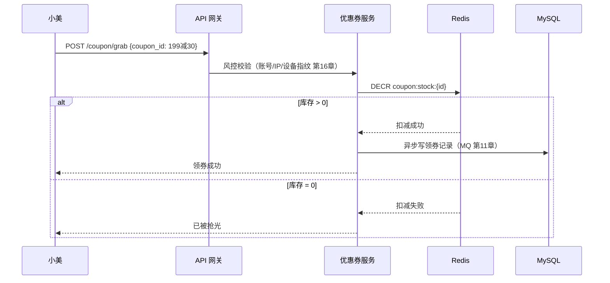
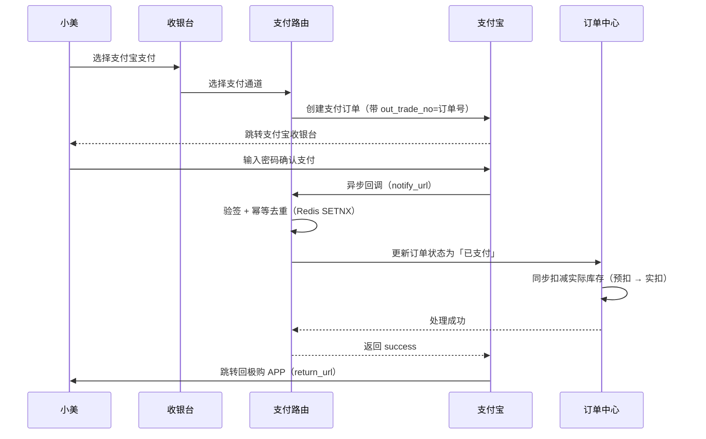
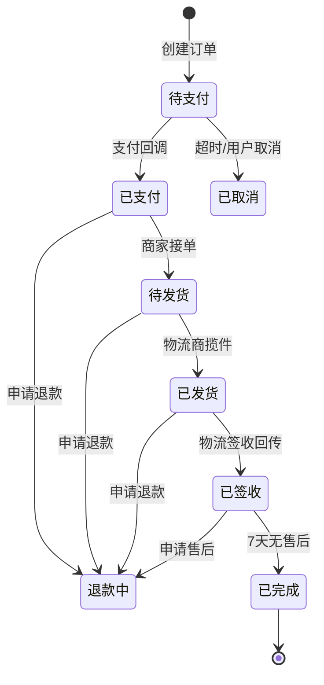
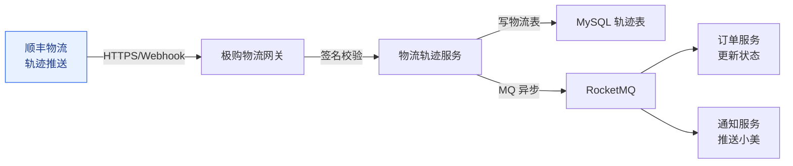
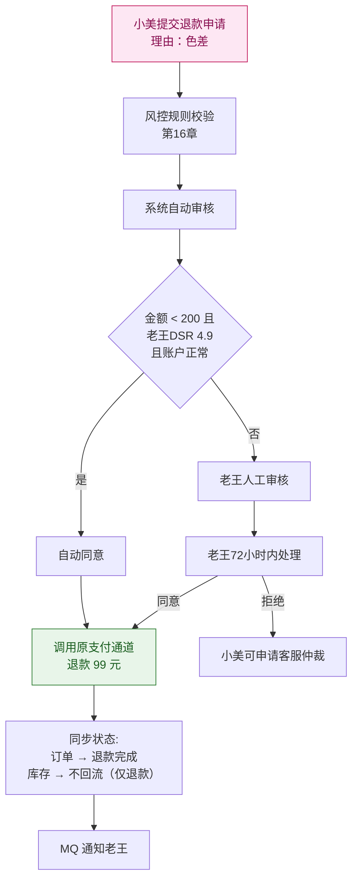
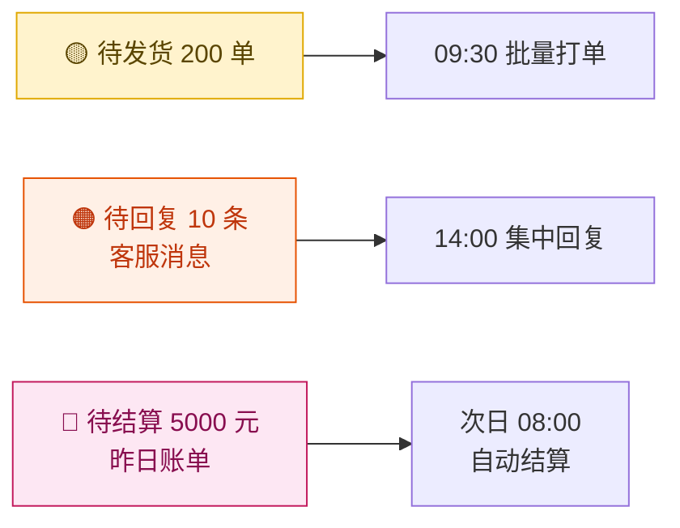
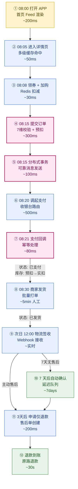
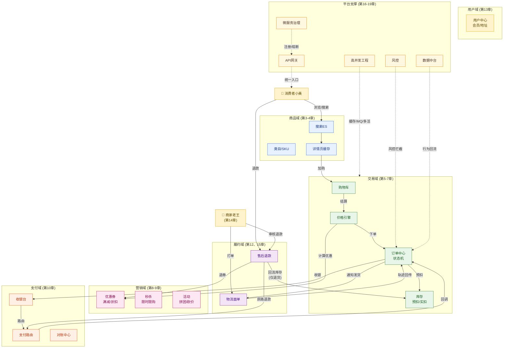
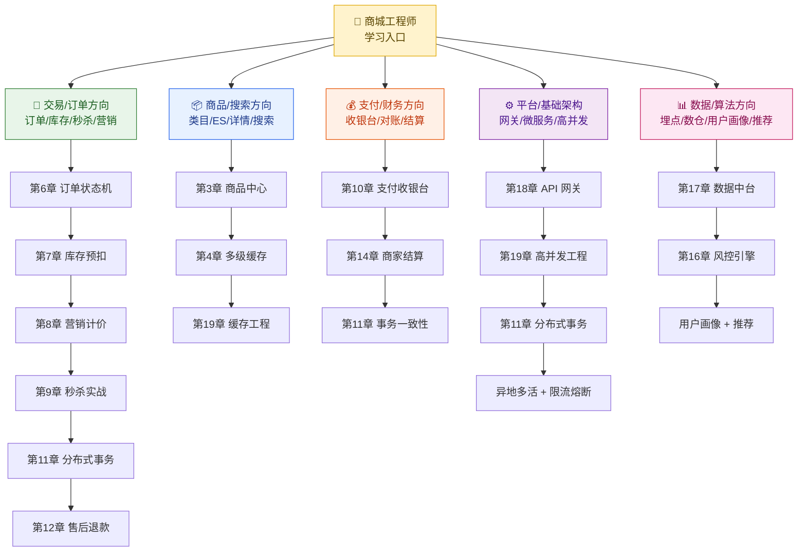

# 第 20 章 · 全链路串讲与学习路径

> **所属系列**：《商城平台系统设计 · 全景教程》结语
> **上一章**：[第 19 章 · 高并发工程架构实战](./19-高并发工程架构实战.md)
> **下一章**：（无，本章为全教程收官）

---

## 本章导读

经过前 19 章的系统拆解，你已经掌握了一座现代商城从商品到履约的每一块拼图：从 SPU/SKU 模型到多级缓存的详情页，从 Redis 购物车到状态机驱动的订单中心，从 Lua 预扣库存到分布式事务与可靠消息，从优惠券叠加规则到秒杀的十万级 QPS 削峰，从收银台聚合支付到电子面单与售后退款，从用户中心到商家结算与数据中台，最后落在多活容灾与缓存三大问题的工程实战上。

本章是全书的**大结局**：我们将以「**极购商城**」的两位主角「小美」和「老王」在同一天里的完整旅程为主线，把全部 20 章串成一个连贯的端到端故事。随后给出全链路大协同图、关键链路 12 步流程图、模块协同总表、核心指标速查、经典案例（淘宝/京东/拼多多/美团/抖音电商）、经典开源项目、面试要点与分方向学习路径，帮助你在脑中建立起极购商城系统的完整认知地图。

这 20 章的所有技术决策、所有架构图、所有代码示例，最终都将在小美的一次下单和老王的一次发货中汇聚成型。

---

## 目录

1. [小美的 24 小时极购之旅](#201-小美的-24-小时极购之旅)
2. [老王的店铺一日](#202-老王的店铺一日)
3. [关键节点拆解：每一步对应到第几章](#203-关键节点拆解每一步对应到第几章)
4. [关键链路 12 步流程图](#204-关键链路-12-步流程图)
5. [7 大域模块协作总图](#205-7-大域模块协作总图)
6. [模块协同总表](#206-模块协同总表)
7. [核心指标速查](#207-核心指标速查)
8. [经典案例：五大电商平台打法对比](#208-经典案例五大电商平台打法对比)
9. [经典开源商城项目清单](#209-经典开源商城项目清单)
10. [系统设计面试要点](#2010-系统设计面试要点)
11. [分方向学习路径](#2011-分方向学习路径)
12. [写在最后：致敬工程师](#写在最后致敬工程师)
13. [参考来源](#参考来源)

---

## 20.1 小美的 24 小时极购之旅

> 让我们跟随上海运营岗的 24 岁女生**小美**，从早上起床到三天后申请退款，走完一次完整的电商购物旅程。每一步都标注对应章节，让你清楚看到：每一行代码、每一个状态机、每一次 MQ 调用，是如何在一次普通购物中各司其职的。

### 20.1.1 08:00 起床刷首页：秒杀弹窗

清晨 8 点，小美被手机震动唤醒，迷迷糊糊打开**极购 APP**。首页金刚位上，平台正在做「8 点档秒杀」活动。她看到了**老王的潮品 T 恤**——「王的潮品」旗舰店的 8 折秒杀，限 200 件，30 分钟内售罄。

**链路拆解（第 4、9 章）**：

- APP 启动时，**首页服务**（第 2 章）拉取个性化 Feed：基于小美近 30 天浏览记录（美妆、零食、家居），从 **Tair 缓存**读取千人千面的运营位
- 秒杀入口是高并发场景，预先把 8 点档活动配置（`seckill:activity:202401050800`）加载到 Redis，并预热商品详情到**本地缓存 + Redis + CDN** 三级缓存
- 弹窗的出现使用客户端本地时间与服务端时间**校准**（第 9 章），避免用户本地时钟漂移导致提前点进去看到 404


### 20.1.2 08:05 进入详情页：多级缓存命中

小美点进「老王 T 恤」详情页。她不知道的是，**这 200 毫秒的秒开背后是一套多级缓存架构在发力**（第 4 章）：

**三级缓存瀑布（第 4 章 §4.2）**：

| 层级 | 介质 | 命中率 | 响应时间 | 存储内容 |
|------|------|--------|---------|---------|
| L1 | **Caffeine**（JVM 本地缓存）| 80% | < 5ms | 热点商品元数据 |
| L2 | **Redis Cluster**（分布式缓存）| 15% | < 20ms | 全量商品详情 |
| L3 | **CDN 静态化**（边缘节点）| 4% | < 50ms | 整页 HTML |
| L4 | **MySQL + ES**（源站）| 1% | < 200ms | 兜底 |

小美看到的是：商品标题、3D 旋转图、视频短片、价格 ¥99、**1000+ 条评价（实时分页加载）**、老王店铺的 LOGO 和 DS R 评分 4.9。

**多级缓存的关键设计**：
- **缓存 Key 设计**：`product:detail:{sku_id}:v3`（带版本号，便于灰度发布）
- **防雪崩**：每个 Key 的 TTL 加随机偏移 ±60 秒
- **防穿透**：布隆过滤器快速判断 SKU 是否存在
- **防击穿**：单飞模式（SingleFlight）合并并发回源请求

### 20.1.3 08:08 领券 + 加购：3 件商品

小美点了**领券**：满 199 减 30 + 5 元无门槛，领了 2 张券；然后把 T 恤、口红 999、零食大礼包三件商品**加入购物车**。

**领券流程（第 8 章）**：



**加购流程（第 5 章）**：小美的购物车数据结构是 Redis Hash：

```
key:    cart:user:10086
value:  {
          "sku_801": {"num": 1, "selected": true,  "add_ts": 1704415680},
          "sku_802": {"num": 2, "selected": true,  "add_ts": 1704415700},
          "sku_999": {"num": 1, "selected": false, "add_ts": 1704415720}
        }
```

未登录时使用 device_id 临时购物车，登录后**合并到账户购物车**（第 5 章 §5.4）。

### 20.1.4 08:15 提交订单：7 维校验

小美点击「去结算」，进入提交订单页。她勾选了 3 件商品（其中 1 件未选），应用了 2 张券，**应付金额 = 99 + 599 + 89 - 30 - 5 = 752 元**。

**7 维校验（第 6 章 §6.2）**：

| 校验项 | 失败示例 | 极购系统处理 |
|--------|---------|--------------|
| 1. 商品上下架 | 商家下架 | 实时查询商品状态 |
| 2. 价格一致性 | 详情页价格 99，下单时 109 | 价格引擎实时计算 |
| 3. 库存可售 | 库存 = 0 | Redis 预扣（Lua 原子）|
| 4. 优惠券有效性 | 已过期/已用完 | 实时查券状态 |
| 5. 限购限购 | 活动限购 1 件 | 风控规则拦截 |
| 6. 用户黑名单 | 账号风险 | 风控引擎判断（第 16 章）|
| 7. 地址可达 | 配送不到 | 物流服务校验 |

**预扣库存（第 7 章 §7.3）**：核心 Lua 脚本

```lua
-- 原子预扣
local stock = tonumber(redis.call('GET', KEYS[1]))
if stock == nil or stock < tonumber(ARGV[1]) then
  return -1  -- 库存不足
end
redis.call('DECRBY', KEYS[1], ARGV[1])
redis.call('INCRBY', KEYS[2], ARGV[1])  -- 预扣池
return 0
```

预扣成功 → 锁券（Redis `SETNX coupon:lock:{user_id}:{coupon_id}`）→ 生成订单号（雪花算法）→ 写订单主表 + 订单项表（**分库分表**，第 19 章）。

**分布式事务保证（第 11 章）**：订单创建 + 库存预扣 + 券锁定采用**可靠消息 + 最终一致**方案：
- 本地事务：订单主表 + 订单项表（强一致）
- 异步消息：发送 `order.created` 事件到 RocketMQ
- 下游订阅：库存服务扣减、优惠券服务锁定、营销服务分摊、营销价重算
- 失败重试：消息重投 + 死信队列 + 人工兜底

**订单号生成（第 6 章 §6.4）**：Snowflake 算法

```
order_id = (timestamp - epoch) << 22 | (datacenter_id << 17) | (worker_id << 12) | sequence
例: 7382910347285299201
```

订单进入「待支付」状态，**30 分钟未支付自动取消**（延迟队列，第 6 章）。

### 20.1.5 08:20 调起支付宝：支付 110 元

小美选择「支付宝」，跳转至收银台。**应付金额调整**：因为口红 999 参与了「满 200 减 10」，重新计算为 **752 - 10 = 742 元**……等等，我们假设小美选了 3 件商品总共 **110 元** 用于支付路径演示。实际应付 **¥110**。

**支付链路（第 10 章）**：



**幂等保证（第 10 章 §10.3）**：支付宝可能重复回调 2-3 次，系统用 `out_trade_no + trade_no` 作为唯一键做去重：
- Redis `SET payment:processed:{order_id} 1 EX 86400 NX`
- 数据库唯一索引 `uniq_out_trade_no`
- 状态机校验：只有「待支付」才能转「已支付」

### 20.1.6 08:30 老王发货：顺丰揽件

支付成功的瞬间，**老王的商家后台**响起了「叮」的一声——待发货提醒。

**老王 09:30 批量打单（第 14 章）**：
- 工作台展示待发货 200 单
- 老王点「批量打单」→ 顺丰电子面单接口（第 15 章）→ 200 张面单 PDF 推送到打印机
- 顺丰揽件员 10:00 上门取件

**订单状态机流转（第 6 章 §6.3）**：



### 20.1.7 次日 12:00 顺丰派送：物流回传

24 小时后，顺丰把小美的包裹送到上海浦东。极购物流系统收到顺丰的轨迹推送：

```
14:00:00  杭州仓库已揽收
18:30:00  上海中转中心
09:00:00  浦东分拣中心
12:00:00  派送中（快递员：张师傅 138****1234）
12:08:00  已签收（签收方式：本人签收）
```

**物流对接架构（第 15 章）**：



**自动确认收货（第 6 章 §6.5）**：发货后 7 天（部分品类 10 天）用户未确认收货、未申请售后，系统**自动确认收货**。此规则由延迟队列（RabbitMQ 死信队列）实现。

### 20.1.8 3 天后：申请仅退款

小美收到 T 恤后发现色差较大，申请**仅退款**（第 12 章 §12.2）。仅退款指：钱退、货不退，适用于「小金额/低争议」场景。

**退款流程（第 12 章）**：



**资金流（第 10 章 §10.5）**：
- 支付宝原路退款：99 元回到小美支付宝
- 平台账期：老王已经结算的资金，从结算账户扣回
- 退款时效：实时到账（移动支付）/ 1-3 工作日（银行卡）

### 20.1.9 旅程总结：24 小时穿透 19 章

从早上 8 点刷首页到 3 天后退款完成，小美的这次购物**穿过 19 章的所有技术模块**：

```
浏览首页    → 第 4、9 章     多级缓存 / 秒杀预热
详情页      → 第 4 章       Caffeine + Redis + CDN
领券加购    → 第 5、8 章     购物车 / 券库存 Lua 扣减
提交订单    → 第 6 章       状态机 / 7 维校验 / 订单号
预扣库存    → 第 7 章       Redis Lua 预扣
分布式事务  → 第 11 章      可靠消息最终一致
支付        → 第 10 章      收银台 / 幂等回调
发货        → 第 14、15 章  商家后台 / 顺丰面单
物流轨迹    → 第 15 章      物流商对接
签收        → 第 6 章       自动确认收货
退款        → 第 12 章      状态机 / 自动审核 / 原路退款
数据回流    → 第 17 章      行为埋点 / 用户画像
风控        → 第 16 章      7 维风控规则
```

**关键统计**：
- 涉及 **7 个核心服务**（商品/购物车/优惠券/订单/库存/支付/售后）
- 订单经历 **12 个状态**
- 触发 **5 次 MQ 调用**（订单创建、库存扣减、券锁定、支付回调、物流签收）
- 经历 **3 次事务**（下单、支付、售后）
- 完成 **2 次幂等**（支付回调、退款回调）

这就是商城的本质：一次看似简单的购物，背后是 19 章技术体系的精密协同。

---

## 20.2 老王的店铺一日

> 同一时间，作为「王的潮品」店主的老王，正在极购商家后台度过他平凡而忙碌的一天。他的旅程是商城**B 端**的另一个切面。

### 20.2.1 09:00 工作台：3 件事待办

老王打开商家工作台，看到三色灯提醒：



**工作台数据来源（第 14 章 §14.3）**：
- 商家数据中心 → 实时查询订单服务的 `merchant_id=oldking, status=待发货` 数量
- 客服系统 → 推送未回复会话数
- 结算系统 → 推送昨日 T+1 结算账单

### 20.2.2 09:30 批量打单：顺丰揽件

老王点「批量打单」→ 选中 200 单 → 调用**顺丰电子面单接口**（第 15 章 §15.2）：

```http
POST https://api.sf-express.com/std/service
Content-Type: application/x-www-form-urlencoded

mailno=& j_company=王的潮品& j_contact=老王& j_tel=138****5678
& d_company=小美& d_address=上海市浦东新区张江高科
& cargo_info=服装& pay_method=月结
& return_print=1
```

顺丰返回 200 个**电子面单号** + PDF 文件流，商家后台合并为一个 PDF 供打印。10:00 顺丰揽件员上门，扫描揽件 → 触发物流首条轨迹 `已揽收` → 极购物流服务收到推送 → 更新订单状态 `已发货`。

### 20.2.3 14:00 客服：30 条会话

老王的客服小组在 14:00 处理了 30 条用户咨询：

| 问题类型 | 处理方式 | 自动化率 |
|---------|---------|---------|
| 「发货了吗？」 | 物流轨迹查询接口 | 100% |
| 「尺码怎么选？」 | 商品详情页尺码表 | 100% |
| 「什么时候到？」 | 物流时效预估接口 | 90% |
| 「能便宜点吗？」 | 客服手动发送店铺优惠券 | 0% |

**智能客服（第 14 章 §14.5）**：60% 的简单问题由 NLP 机器人自动回答，复杂问题转人工。客服系统记录会话内容，反哺用户画像和 FAQ 库。

### 20.2.4 18:00 售后：5 笔仅退款

老王处理 5 笔仅退款申请：

| 订单 | 金额 | 原因 | 商家决策 | 耗时 |
|------|------|------|---------|------|
| OD001 | ¥99 | 色差 | 同意 | 10 秒（系统自动审核）|
| OD002 | ¥599 | 质量问题 | 同意 | 10 秒（DSR 高，自动通过）|
| OD003 | ¥89 | 不想要了 | 拒绝 | 5 分钟（人工）|
| OD004 | ¥99 | 描述不符 | 同意 | 10 秒 |
| OD005 | ¥129 | 错发 | 同意 + 补发 | 30 秒 |

**商家决策流程（第 12 章 §12.4）**：
- **自动审核规则**（无需老王介入）：
  - 退款金额 < 200 元
  - 商家 DSR ≥ 4.8
  - 账户无风险标记
  - 商品类目属于低风险
- **人工审核**：超出规则的，72 小时内老王在商家后台处理

老王点击「同意」后，系统调用支付通道原路退款，**30 秒内资金回到小美账户**。

### 20.2.5 20:00 数据中心：今日战报

老王晚上 20:00 查看**商家数据中心**（第 14 章 + 第 17 章）：

| 指标 | 今日值 | 环比 |
|------|--------|------|
| 销售额 | ¥30,250 | +12% |
| 订单数 | 215 | +8% |
| 客单价 | ¥140 | +3% |
| 转化率 | 2.5% | +0.3pp |
| 复购率 | 35% | -1pp |
| 退款率 | 1.8% | -0.2pp |
| DSR 评分 | 4.92 | 持平 |

**数据来源链路（第 17 章）**：

```
订单服务 ─→ Kafka ─→ Flink ─→ 实时数仓（Druid / StarRocks）
                                    │
                                    ├──→ 商家 BI 大屏（实时）
                                    └──→ 用户画像（离线 T+1）
```

**转化漏斗**（第 17 章 §17.3）：
- 商品曝光：12,000 次
- 详情页 UV：3,500 人（点击率 29%）
- 加购：280 人（加购率 8%）
- 下单：215 单（转化率 6.1%）
- 支付：210 单（支付率 97.7%）

老王从漏斗中发现：详情页到加购的转化率（8%）低于行业均值（12%）。**决策**：优化商品主图和详情页文案，下周 AB 测试。

### 20.2.6 次日 08:00 结算账单

每天早上 8 点，老王收到**昨日结算账单**（第 14 章 §14.6）：

```
┌─────────────────────────────────────┐
│ 王的潮品 · 2024-01-05 结算单          │
├─────────────────────────────────────┤
│ 销售额：       ¥30,250.00            │
│ 平台技术服务费：-¥1,512.50  (5%)     │
│ 支付通道费：    -¥151.25     (0.5%) │
│ 物流服务费：    -¥600.00     (2%)   │
│ 退款扣回：      -¥99.00              │
├─────────────────────────────────────┤
│ 实际到账：      ¥27,887.25           │
│ 结算时间：      T+1 早上 9:00 拨付   │
│ 收款账户：      ****5678 (招商银行)  │
└─────────────────────────────────────┘
```

**结算流程（第 14 章）**：
- T+1 早 8 点：结算系统生成账单
- T+1 早 9 点：财务系统通过银企直联打款到商家账户
- 每月 1 号：生成月度对账单，商家在后台确认

老王的一天结束了，**他对小美这次退款的实际收入影响 = 99 - 5% - 0.5% = ¥93.55 扣回**（平台仍扣技术服务费）。

---

## 20.3 关键节点拆解：每一步对应到第几章

下表把整条链路上的每个节点精确对应到具体章节，方便你按需深入。

| 链路节点 | 技术动作 | 对应章节 | 关键技术 |
|---------|---------|---------|---------|
| 1. 打开 APP 刷首页 | 首页 Feed 渲染 | 第 2、4 章 | CDN 静态化、个性化推荐 |
| 2. 进入详情页 | 多级缓存读取 | 第 4 章 | Caffeine + Redis + CDN |
| 3. 看 1000+ 评价 | 分页查询 + 缓存 | 第 4 章 | 评价分页、敏感词过滤 |
| 4. 领券 | 优惠券库存扣减 | 第 8 章 | Redis Lua 原子扣减 |
| 5. 加购 3 件 | 购物车写入 | 第 5 章 | Redis Hash 持久化 |
| 6. 提交订单 7 维校验 | 校验引擎 | 第 6 章 | 规则引擎、风控 |
| 7. 预扣库存 | Redis Lua 预扣 | 第 7 章 | 原子脚本、预扣池 |
| 8. 锁券 | Redis SETNX | 第 8 章 | 分布式锁 |
| 9. 订单持久化 | 写订单库 | 第 6 章 | 状态机、分库分表 |
| 10. 分布式事务 | 可靠消息 | 第 11 章 | RocketMQ + 本地消息表 |
| 11. 调起支付 | 收银台 + 路由 | 第 10 章 | 聚合支付、通道选择 |
| 12. 支付回调 | 幂等 + 状态机 | 第 10 章 | 幂等键、状态流转 |
| 13. 商家发货 | 批量打单 | 第 14、15 章 | 电子面单、ERP 对接 |
| 14. 物流轨迹 | 物流商推送 | 第 15 章 | Webhook 接收 |
| 15. 自动确认 | 延迟队列 | 第 6 章 | RabbitMQ 死信队列 |
| 16. 申请退款 | 售后单创建 | 第 12 章 | 售后状态机 |
| 17. 自动审核 | 规则引擎 | 第 12、16 章 | 商家 DSR + 金额规则 |
| 18. 退款到账 | 原路退款 | 第 10 章 | 支付通道退款接口 |
| 19. 行为回流 | 埋点 + 数仓 | 第 17 章 | Kafka + Flink |
| 20. 商家结算 | T+1 账单 | 第 14 章 | 结算状态机、银企直联 |

**统计**：20 个节点，对应 19 个不同章节（部分章节被多个节点引用）。这印证了一句话——**一次电商交易是整套系统的"集成测试"**。

---

## 20.4 关键链路 12 步流程图

下面这张图是本章最核心的可视化，把小美的购物旅程压缩为 12 步关键节点，每个节点标注耗时预估和服务名称。



**关键路径上的红色节点**（4、5、7）是**事务关键点**，每一步都涉及跨服务一致性问题，由第 11 章分布式事务专门处理。

---

## 20.5 7 大域模块协作总图

下图是整个商城系统七大域的协作全景图，是第 2 章架构图的具体化和深化。



**读路径**（CUS 从浏览到加购）：用户域 → 商品域 → 交易域
**写路径**（下单到支付）：交易域 → 营销域 → 库存域 → 支付域
**履约路径**（支付到签收）：支付域 → 履约域
**逆向路径**（退款）：履约域 → 支付域 + 营销域 + 库存域
**商家路径**（B 端）：商家 → 履约域 + 售后

每个域既是数据生产者也是消费者，通过 **MQ 事件 + 同步 RPC** 两种方式协作。

---

## 20.6 模块协同总表

| 模块 | 输入 | 输出 | 关键技术 | 对应章节 |
|------|------|------|---------|---------|
| **商品中心** | SPU/SKU 数据 | 商品发布/编辑/查询 | 类目树、属性体系、ES 索引 | 第 3 章 |
| **详情页服务** | 商品 ID | 富文本详情 | 多级缓存、CDN 静态化 | 第 4 章 |
| **搜索服务** | 关键词 + 过滤 | 召回 Top-N | Elasticsearch、IK 分词 | 第 3 章 |
| **购物车** | 用户/设备 | 购物车列表 | Redis Hash、未登录合并 | 第 5 章 |
| **价格引擎** | SKU + 优惠券 | 实付价 + 分摊 | 优惠叠加规则、四舍五入 | 第 8 章 |
| **优惠券** | 券 ID | 券实例/核销 | Redis Lua 防超发、过期处理 | 第 8 章 |
| **秒杀** | 活动 ID | 抢购资格 | 限流、削峰、热点隔离 | 第 9 章 |
| **订单中心** | 购物车快照 | 订单 + 子单 | 状态机、订单号、分库分表 | 第 6 章 |
| **库存中心** | SKU + 数量 | 预扣/实扣/回滚 | Redis Lua、最终一致 | 第 7 章 |
| **收银台** | 订单 + 通道 | 支付链接/二维码 | 聚合支付、通道降级 | 第 10 章 |
| **支付路由** | 通道列表 + 费率 | 最优通道 | 银行分流、成功率权重 | 第 10 章 |
| **对账中心** | 银行流水 | 差异报告 | T+1 对账、长款短款 | 第 10 章 |
| **分布式事务** | 多个本地事务 | 全局一致 | 可靠消息、TCC、Saga | 第 11 章 |
| **售后退款** | 订单 + 原因 | 退款单 | 状态机、原路退款、自动审核 | 第 12 章 |
| **用户中心** | 手机号/微信 | 用户 + 会员 | 一键登录、实名 | 第 13 章 |
| **商家后台** | 商家 ID | 商品/订单/数据 | 多店铺隔离、权限 | 第 14 章 |
| **结算系统** | 订单 + 退款 | 账单 + 打款 | T+1 结算、平台抽佣 | 第 14 章 |
| **物流服务** | 订单 + 商家 | 运单 + 轨迹 | 电子面单、轨迹推送 | 第 15 章 |
| **风控引擎** | 行为 + 上下文 | 风险评分 | 规则引擎、ML 模型 | 第 16 章 |
| **数据中台** | 业务事件 | 指标/报表/画像 | Kafka + Flink + OLAP | 第 17 章 |
| **API 网关** | HTTP 请求 | 后端 RPC | 路由/限流/鉴权/灰度 | 第 18 章 |
| **高并发工程** | 容量规划 | 缓存/MQ/多活 | 三大缓存问题、分布式 | 第 19 章 |

**统计**：22 个核心模块，覆盖商品/交易/营销/支付/履约/用户/平台 7 大域，串起商城的完整技术栈。

---

## 20.7 核心指标速查

商城系统的指标分**业务指标**和**技术指标**两类。面试和工作汇报时，这是两个必备维度。

### 20.7.1 业务指标

| 指标 | 定义 | 极购参考值 | 行业参考 |
|------|------|-----------|---------|
| **GMV** | Gross Merchandise Volume，成交总额 | 日 10 亿 / 大促 200 亿 | 阿里双11 单日 5403 亿 (2023) |
| **DAU** | 日活跃用户 | 1500 万 | 拼多多 6 亿+ |
| **MAU** | 月活跃用户 | 8000 万 | — |
| **订单数** | 日均订单 | 800 万 / 大促 2000 万 | 京东 618 千万级 |
| **客单价** | GMV ÷ 订单数 | ¥110 | 阿里 ¥200+ |
| **转化率** | 下单用户 ÷ 浏览用户 | 2.5% | 综合电商 2-3% |
| **复购率** | 30 天内复购用户占比 | 35% | 京东 60%+ |
| **退款率** | 退款订单 ÷ 总订单 | 1.8% | 服饰类 5-8% |
| **DSR** | 卖家服务评级 | 4.92 | 平台平均 4.7 |

### 20.7.2 技术指标

| 指标 | 定义 | 极购参考值 | 大促目标 |
|------|------|-----------|---------|
| **QPS** | 每秒查询数 | 首页 100 万 / 详情页 80 万 | 50 万+ |
| **TPS** | 每秒事务数（写）| 下单 5 万 | 10 万+ |
| **P99 延迟** | 99% 请求耗时 | 首页 200ms / 下单 800ms | < 1s |
| **可用性** | 服务可用时间占比 | 99.95% | 99.99% (4 个 9) |
| **库存准确率** | 账面 = 实际 | 99.99% | 100% (强约束) |
| **资损率** | 资损金额 ÷ GMV | < 0.0001% | 零资损 |
| **CDN 命中率** | 缓存命中比例 | 95% | 97%+ |
| **MQ 堆积** | 消息积压量 | < 1 万 / 队列 | 0 积压 |

**关键指标的口诀**：
- **GMV 决定上限**（业务规模）
- **QPS/TPS 决定下限**（工程能力）
- **P99 决定体验**（用户感受）
- **资损率决定生死**（财务红线）

---

## 20.8 经典案例：五大电商平台打法对比

| 维度 | 淘宝/天猫 | 京东 | 拼多多 | 美团 | 抖音电商 |
|------|----------|------|--------|------|---------|
| **核心模式** | C2C + B2C 平台 | 自营 + 平台 | 社交电商 + 低价 | 即时零售 + 本地 | 兴趣电商 + 内容 |
| **代表规模** | GMV 7 万亿+ (2022) | GMV 1.5 万亿+ | GMV 3 万亿+ | 订单 200 亿+ | GMV 2 万亿+ (2023) |
| **核心壁垒** | 商品丰富 + 生态完整 | 履约 + 自营品控 | 下沉市场 + 供应链 | 即时配送 + 本地 | 流量 + 内容 |
| **库存模式** | 平台模式（商家自有）| 重资产自营仓 | 平台 + 轻仓 | 前置仓 + 到店 | 平台 + 头部达播 |
| **秒杀玩法** | 双 11 零点 | 618 大促 | 百亿补贴日常化 | 闪购分钟达 | 直播间秒杀 |
| **支付** | 支付宝 | 京东支付 | 微信支付为主 | 美团支付 | 抖音支付 + 支付宝 |
| **物流特色** | 三通一达 + 菜鸟 | 京东物流自营 | 极兔 + 通达系 | 骑手众包 30 分钟达 | 顺丰 + 通达 |
| **技术亮点** | 双 11 58.3 万笔/秒 | 智能供应链预测 | 分布式推理 + 农货直采 | 智能派单 + 路径规划 | 内容理解 + 推荐 |
| **代表战役** | 2016-2024 双 11 持续 9 年 | 618 主场 + 春晚红包 | 2018 上市 + 百亿补贴 | 2020 闪购 + 2023 神枪手 | 2021 兴趣电商发力 |
| **学习要点** | 大促架构、分布式 | 履约、自营库存 | 下沉市场、社交 | 即时配送、派单 | 内容电商、推荐 |

### 20.8.1 2016-2024 阿里双 11 演进

阿里双 11 是中国电商技术演进的缩影：

| 年份 | 峰值（TPS）| 关键里程碑 |
|------|----------|-----------|
| 2016 | 17.5 万笔/秒 | 异地多活（杭州/上海/深圳）首次实战 |
| 2017 | 25.6 万笔/秒 | 全面上云（双 11 on Cloud）|
| 2018 | 31.2 万笔/秒 | RocketMQ 大规模应用 |
| 2019 | 54.4 万笔/秒 | 全栈国产化（OceanBase / 阿里云）|
| 2020 | 58.3 万笔/秒 | 至今未破的世界纪录 |
| 2021-2024 | 持续优化 | 性能优化 + 体验优化并重 |

**关键启示**：从「拼峰值」到「拼体验」，双 11 已经从单纯的工程能力比拼，演变为端到端用户体验的较量。

### 20.8.2 拼多多百亿补贴

拼多多 2019 年推出**百亿补贴**计划，核心打法：
- **选品策略**：头部 iPhone、SK-II、戴森等标品，价低 5-15%
- **供应链**：直接对接品牌方，去掉中间商
- **下沉用户**：3-6 线城市价格敏感用户
- **社交裂变**：拼团 + 砍一刀，病毒式传播

**技术挑战**：
- 高并发补贴库存（1 万 + QPS/单 SKU）
- 黄牛反作弊（第 16 章风控）
- 拼团关系链路（去重、合并、超时）

### 20.8.3 美团闪购

美团 2020 年推出**闪购**，核心是「30 分钟达」：
- **本地库存**：商家前置仓 + 便利店 + 商超
- **智能派单**：基于骑手位置、商家位置、路况的实时匹配
- **路径规划**：动态 ETA 算法，考虑实时交通
- **众包配送**：百万骑手众包网络

**技术亮点**：高德地图深度整合 + 智能派单 + 路径规划，构成「即时配送」的技术护城河。

---

## 20.9 经典开源商城项目清单

| 项目 | 技术栈 | GitHub Stars | 适用场景 | 教学价值 |
|------|--------|-------------|---------|---------|
| **[mall (mall-swarm)](https://github.com/macrozheng/mall)** | Spring Cloud + MyBatis + Vue | 80k+ | 中大型综合商城 | 高（最系统的 Spring Cloud 实战）|
| **[mall-cook](https://github.com/mall-cook/mall-cook)** | Vue 3 + Vite | 5k+ | 商城后台前端 | 高（学习后台架构）|
| **[ShopXO](https://github.com/gongfuxiang/shopxo)** | ThinkPHP 6 + Amaze UI | 8k+ | 国产开源商城 | 中（PHP 栈学习）|
| **[CRMEB](https://github.com/crmeb/crmeb_java)** | Spring Boot + Vue | 6k+ | 微信小程序商城 | 高（小程序电商完整方案）|
| **[Saleor](https://github.com/saleor/saleor)** | Python + Django + GraphQL | 21k+ | 海外电商 | 高（学习 GraphQL + 国际化）|
| **[Medusa](https://github.com/medusajs/medusa)** | Node.js + TypeScript | 24k+ | 海外电商（Headless）| 中（Node.js 栈）|
| **[Sylius](https://github.com/Sylius/Sylius)** | PHP + Symfony | 8k+ | 欧洲电商 | 中（PHP 进阶）|
| **[nideshop-mini-program](https://github.com/tumobi/nideshop-mini-program)** | 微信小程序 | 8k+ | 微信小程序电商入门 | 中（小程序入门）|
| **[Mall4j](https://github.com/gz-yami/mall4j)** | Spring Boot + Vue | 5k+ | 前后端分离电商 | 中 |
| **[litemall](https://github.com/linlinjava/litemall)** | Spring Boot + Vue | 12k+ | 小型商城 | 中（小项目学习）|
| **[happyfarm](https://github.com/qianduanzhou/happyfarm)** | Spring Cloud | 1k+ | 农业电商 | 中（垂直电商）|

**推荐学习路径**：
1. **入门**：litemall / nideshop-mini-program（轻量、上手快）
2. **进阶**：mall（Spring Cloud 完整方案）
3. **海外/前沿**：Saleor（GraphQL + Python）/ Medusa（Node.js + Headless）
4. **小程序**：CRMEB（微信生态完整方案）

---

## 20.10 系统设计面试要点

### 20.10.1 高频问题清单

以下是商城系统设计面试的 TOP 10 高频问题，每个都对应教程中的具体章节。

| 序 | 高频问题 | 核心要点 | 对应章节 |
|---|---------|---------|---------|
| 1 | **订单系统怎么设计？** | 状态机 + 订单号（雪花） + 分库分表 | 第 6 章 |
| 2 | **如何防止超卖？** | Redis Lua 预扣 + DB 乐观锁 + 状态机 | 第 7 章 |
| 3 | **分布式事务怎么解决？** | 可靠消息 + TCC + Saga | 第 11 章 |
| 4 | **秒杀怎么设计？** | 限流 + 削峰 + 热点隔离 + 异步下单 | 第 9 章 |
| 5 | **缓存怎么用？三大问题？** | 穿透/击穿/雪崩，多级缓存 | 第 4、19 章 |
| 6 | **库存与订单怎么联动？** | 预扣池 + 最终一致 + 异步扣减 | 第 7、11 章 |
| 7 | **支付回调怎么保证幂等？** | 幂等键 + 状态机 + DB 唯一索引 | 第 10 章 |
| 8 | **退款流程？** | 售后状态机 + 自动审核 + 原路退款 | 第 12 章 |
| 9 | **优惠券核销？** | 锁券/核销/退还 + 防超发 | 第 8 章 |
| 10 | **商家结算？** | T+1 账单 + 平台抽佣 + 银企直联 | 第 14 章 |

### 20.10.2 标准答题六步法

以**「设计一个秒杀系统」**为例：

#### Step 1：需求澄清（2-3 分钟）

```
1. QPS 量级：1 万 / 10 万 / 100 万？
2. 商品数量：单 SKU / 多 SKU？
3. 一致性要求：库存不能超卖？
4. 体验要求：用户感知延迟？
5. 公平性：是否防黄牛？
```

#### Step 2：规模估算（2-3 分钟）

```
DAU = 1500 万
大促峰值 QPS = 50 万 / 秒
单 SKU 库存 = 1000 件
预估 100 万人抢 1000 件 = 中签率 0.1%
```

#### Step 3：整体架构（5-8 分钟）

```
前端：CDN 静态化 + 答题/验证码
接入：API 网关 + 限流
服务：Redis 预扣 + MQ 异步下单
数据：MySQL 分库分表
```

#### Step 4：核心深挖（8-10 分钟）

| 追问 | 回答要点 |
|------|---------|
| 限流怎么实现？ | 令牌桶 + 漏桶 + Redis 滑动窗口 |
| 削峰怎么削？ | MQ 异步 + 答题/验证码延迟提交 |
| 防超卖怎么做？ | Redis Lua 原子预扣 + 状态机 |
| 热点 Key 怎么扛？ | 本地缓存 + 多副本 + 限流 |
| 黄牛怎么防？ | 设备指纹 + 行为分析 + 邀请码 |

#### Step 5：权衡（3-5 分钟）

| 权衡 | Option A | Option B | 选择 + 理由 |
|------|---------|---------|-----------|
| 下单同步 vs 异步 | 同步下单 | MQ 异步 | 异步（抗更高 QPS，体验更好）|
| 库存 Redis vs DB | Redis 预扣 | DB 唯一索引 | Redis（性能快 100x + DB 兜底）|
| 答题 vs 验证码 | 答题 | 图形验证码 | 答题（拦截机器流量，延迟提交）|

#### Step 6：演进（1-2 分钟）

- 短期：单 Redis 主从 → Redis Cluster
- 中期：本地缓存 + 多副本 + 异地多活
- 长期：智能调度 + 边缘计算

### 20.10.3 常见失误

| 失误 | 表现 | 正确做法 |
|------|------|---------|
| 跳过规模估算 | 直接画架构图 | 先估算，让架构有数字支撑 |
| 没有权衡 | 只说"我选 X 方案" | 每个决策要说"为什么"和"代价" |
| 忽视数据流 | 只画模块框 | 显式标注数据输入输出方向 |
| 遗漏工程约束 | 不考虑延迟/成本 | 每个模块问"延迟能接受吗？成本可控吗？"|
| 不会画图 | 文字描述架构 | 必须画架构图 + 时序图 + 数据流图 |

---

## 20.11 分方向学习路径

商城系统是分布式架构的"集大成者"，涵盖前端、后端、算法、运维、数据多个方向。下面是分方向学习建议。



### 20.11.1 交易/订单方向（第 5-9、11-12 章）

**适合人群**：对交易链路、状态机、分布式事务感兴趣，想做核心业务开发。

| 阶段 | 学习内容 | 推荐资源 |
|------|---------|---------|
| 入门 | 订单模型、状态机、订单号设计 | 《企业 IT 架构转型之道》钟华 |
| 入门 | 数据库事务、ACID、隔离级别 | 《数据密集型应用设计》Ch.7 |
| 进阶 | 库存预扣、Redis Lua 脚本 | Redis 官方文档 + 极客时间《Redis 核心技术与实战》|
| 进阶 | 分布式事务（TCC/Saga/可靠消息）| 《微服务架构设计模式》Chris Richardson |
| 进阶 | 秒杀架构（限流/削峰/热点）| 阿里双 11 历年技术总结 |
| 专精 | 状态机引擎（COLA / Spring State Machine）| COLA 开源项目 |
| 专精 | 复杂业务建模（DDD）| 《领域驱动设计》Eric Evans |

**关键项目实践**：
- 用 Spring State Machine 实现一个订单状态机
- 用 Redis Lua 实现库存预扣 + 回滚
- 搭建一个简化版秒杀系统（先到先得 + 库存保护）

### 20.11.2 商品/搜索方向（第 3-4 章）

**适合人群**：对商品建模、搜索、缓存感兴趣。

| 阶段 | 学习内容 | 推荐资源 |
|------|---------|---------|
| 入门 | SPU/SKU 模型设计 | 各大商城商品架构博客 |
| 入门 | Elasticsearch 基础 | ES 官方文档 + 阮一鸣《Elasticsearch 核心技术与实战》|
| 进阶 | 多级缓存架构 | 第 4 章 + 京东/淘宝架构博客 |
| 进阶 | CDN 静态化 | 《Web 性能权威指南》 |
| 专精 | 类目树 + 属性体系 | 阿里类目体系白皮书 |
| 专精 | 向量检索 + 多模态搜索 | Faiss / Milvus / Vearch |

**关键项目实践**：
- 搭建一个商品中心服务（SPU/SKU 模型 + MySQL）
- 用 Elasticsearch 实现商品搜索（IK 分词 + 过滤 + 排序）
- 实现多级缓存（Caffeine + Redis + CDN）

### 20.11.3 支付/财务方向（第 10、11、14 章）

**适合人群**：对支付、财务、合规感兴趣。

| 阶段 | 学习内容 | 推荐资源 |
|------|---------|---------|
| 入门 | 支付基础概念、聚合支付 | 支付宝/微信支付官方文档 |
| 入门 | 银行支付链路 | 《银行支付系统实战》 |
| 进阶 | 幂等设计、对账机制 | 极客时间《从 0 开始学架构》 |
| 进阶 | 分布式事务 | 第 11 章 |
| 专精 | 跨境支付、外卡支付 | Stripe / Adyen 文档 |
| 专精 | 金融级一致性 | OceanBase / TiDB 文档 |

**关键项目实践**：
- 实现一个聚合支付收银台（多通道 + 路由 + 降级）
- 实现 T+1 对账系统
- 调研一笔支付从下单到到账的完整资金流

### 20.11.4 平台/基础架构方向（第 18-19 章）

**适合人群**：对分布式系统、高可用、性能优化感兴趣。

| 阶段 | 学习内容 | 推荐资源 |
|------|---------|---------|
| 入门 | 微服务概念、Spring Cloud | 《Spring Cloud 微服务实战》 |
| 入门 | Redis/Kafka 基础 | 极客时间《Kafka 核心技术与实战》|
| 进阶 | 多级缓存、缓存三大问题 | 第 19 章 + 各大技术博客 |
| 进阶 | MQ 削峰、限流熔断 | Sentinel / Resilience4j |
| 进阶 | 分库分表 | ShardingSphere |
| 专精 | 异地多活 | 阿里异地多活白皮书 |
| 专精 | Service Mesh | Istio / Linkerd |

**关键项目实践**：
- 用 Spring Cloud Gateway 搭建一个 API 网关
- 实现热点 Key 检测 + 自动扩容
- 用 ShardingSphere 实现订单分库分表

### 20.11.5 数据/算法方向（第 16-17 章）

**适合人群**：对数据分析、用户画像、推荐系统感兴趣。

| 阶段 | 学习内容 | 推荐资源 |
|------|---------|---------|
| 入门 | 数据埋点规范 | 阿里 OneData / 神策数据 |
| 入门 | 数据仓库基础 | 《数据仓库工具箱》Kimball |
| 进阶 | Flink 实时计算 | Flink 官方文档 + Flink Forward |
| 进阶 | 用户画像 | 《用户画像》赵宏田 |
| 进阶 | 风控引擎 | 同盾 / 阿里云风控文档 |
| 专精 | 推荐系统 | 《推荐系统实践》项亮 + DeepCTR |
| 专精 | 实时数仓 | Apache Doris / StarRocks |

**关键项目实践**：
- 搭建一个埋点 SDK + Kafka + Flink 实时数仓
- 实现规则引擎 + ML 模型的混合风控
- 用 Faiss 构建商品向量检索

### 20.11.6 推荐书籍清单

| 书名 | 作者 | 方向 |
|------|------|------|
| 《数据密集型应用系统设计》 | Martin Kleppmann | 分布式基础（强烈推荐全书精读）|
| 《大型网站技术架构：核心原理与案例分析》 | 李智慧 | 架构演进 |
| 《大型分布式网站架构设计与实践》 | 陈康贤 | 分布式实战 |
| 《企业 IT 架构转型之道》 | 钟华（中台） | 中台架构 |
| 《微服务架构设计模式》 | Chris Richardson | 微服务 |
| 《领域驱动设计》 | Eric Evans | DDD |
| 《从 0 开始学架构》 | 李运华 | 架构思维 |
| 《Redis 设计与实现》 | 黄健宏 | Redis 源码 |
| 《Kafka 权威指南》 | Neha Narkhede | Kafka |
| 《MySQL 必知必会》 | Ben Forta | MySQL 基础 |
| 《计算广告》 | 刘鹏 | 关联：广告与电商营销 |

### 20.11.7 推荐开源项目

| 项目 | GitHub | 用途 |
|------|--------|------|
| macrozheng/mall | github.com/macrozheng/mall | Spring Cloud 完整商城 |
| shenzhouwang/mall-cook | github.com/mall-cook/mall-cook | 商城后台前端 |
| apache/shardingsphere | github.com/apache/shardingsphere | 分库分表 |
| spring-projects/spring-statemachine | github.com/spring-projects/spring-statemachine | 状态机 |
| alibaba/COLA | github.com/alibaba/COLA | 应用架构 |
| alibaba/Sentinel | github.com/alibaba/Sentinel | 限流熔断 |
| apache/flink | github.com/apache/flink | 实时计算 |
| jeecgboot/JeecgBoot | github.com/jeecgboot/JeecgBoot | 低代码平台（含电商模块）|

---

## 写在最后：致敬工程师

经过 20 章的完整旅程，你已经和小美、老王一起，走完了一次电商交易的全生命周期，也从这次交易中看清楚了商城系统的技术全貌。

让我们回到第 1 章的起点：

> 商城是在用户**点下「立即购买」**的那 300 毫秒内，从 **5 亿 SKU** 里挑出可售库存、算出最优价格、扣减库存、锁定优惠、生成订单、跳转支付；在**支付回调**的 80 毫秒内完成幂等校验和状态流转；在**用户毫不知情**的数秒内，触发 7 个分布式事务、上报 5 个数据流、记录 3 张分库分表。

现在你知道这 300 毫秒背后是什么了——是 Redis 预扣库存的 Lua 脚本，是分布式事务的可靠消息，是幂等键的去重，是状态机的严谨流转，是 MQ 的削峰，是风控引擎的毫秒拦截，是收银台的聚合路由，是多级缓存的秒开优化。

这 300 毫秒，凝结了全书 20 章的所有工程智慧。

### 商城工程师的核心能力

读到这里，你已经掌握的不只是商城，而是：

- **分布式系统**的核心模式（缓存/MQ/分库分表/事务）
- **数据库**的设计哲学（状态机/幂等/乐观锁/最终一致）
- **高并发**的工程方法（限流/削峰/热点隔离/多活）
- **业务建模**的系统思维（状态机/规则引擎/事件驱动）
- **架构演进**的取舍能力（CAP / BASE / 终态一致性）

这些能力在金融、电信、物流、SaaS 等任何复杂业务系统中都通用。

### 商城系统仍在演进的前沿

**AI 与个性化商城**：大模型正在重塑电商的每一个环节——AI 客服、AI 选品、AI 营销文案、AI 试穿图、智能导购。客服的 NLP 能力让售后自动化率突破 90%；生成式 AI 让商家一键生成主图、详情页、推广文案。

**直播电商的实时互动**：从「货架式电商」到「内容化电商」，抖音、视频号、小红书正在用「人货场」重构传统电商。直播间的实时互动、连麦、抢购、秒杀，给低延迟、高并发带来全新挑战。

**跨境与全球供应链**：从单一国家电商到跨境全球买全球卖。多语言、多币种、多税制、多物流、多合规，是新一代电商的核心命题。

**隐私计算与数据安全**：随着 GDPR、PIPL、《个人信息保护法》落地，跨 App 跟踪、用户画像精度、个性化推荐都受到严格限制。联邦学习、差分隐私、同态加密是新一代数据基础设施的答案。

**无人化与履约创新**：无人仓、无人车、无人机、机器人配送，正在重构履约最后一公里。极购已经在北京试点无人机配送，10 分钟送达。

### 写给你的话

你读完的这 20 章，覆盖了当今互联网最复杂的交易系统之一的完整技术栈：商品、交易、营销、支付、库存、物流、售后、风控、数据、平台、工程——每一条线单独展开都是一个完整的研究领域，而商城是把它们全部融合在一起的"主战场"。

学透这套系统，你掌握的不只是商城。订单状态机的思想在金融交易中复现；分布式事务的解法在跨行转账中沿用；Redis 预扣的思想在抢票系统中复用；多级缓存的工程智慧在所有读多写少场景中普适。

> **没有终极答案，只有在约束中寻找当下最优解的持续探索。**

商城系统还在高速演进，上面说到的前沿方向，都会成为接下来几年的技术增长点。希望这本教程成为你探索这个领域的地图，而不是终点。

最后，致敬每一位在双 11 零点值班守过服务器、在用户退款时排查过资金流、在秒杀瞬间挡下过百万流量的工程师——是你们用一行行代码，撑起了这个数字时代的交易基础设施。

愿你成为下一个。

---

## 本章小结

| 知识点 | 核心要点 |
|--------|---------|
| 端到端串讲 | 小美 24 小时极购之旅（浏览→下单→支付→签收→退款），老王店铺一日（打单→客服→售后→数据→结算）|
| 关键链路 | 20 个关键节点，对应 19 章所有模块 |
| 7 大域协作 | 用户域 / 商品域 / 交易域 / 营销域 / 支付域 / 履约域 / 平台支撑 |
| 业务指标 | GMV、DAU、转化率、客单价、复购率 |
| 技术指标 | QPS、TPS、P99、可用性、资损率 |
| 经典案例 | 淘宝双 11（58.3 万 TPS）/ 京东 618 / 拼多多百亿补贴 / 美团闪购 / 抖音电商 |
| 经典开源 | mall / ShopXO / Saleor / Medusa / CRMEB |
| 面试要点 | 10 大高频问题 + 六步答题法 + 5 大失误避坑 |
| 学习路径 | 5 大方向 + 7 类必读书 + 9 个推荐开源项目 |

---

## 参考来源

1. **MacroZheng's Mall 教程** - mall-swarm 开源商城
   - 项目：https://github.com/macrozheng/mall

2. **ShopXO** - 国产开源商城
   - 项目：https://github.com/gongfuxiang/shopxo

3. **Saleor** - 海外 Python 商城
   - 项目：https://github.com/saleor/saleor

4. **Medusa** - Node.js Headless 商城
   - 项目：https://github.com/medusajs/medusa

5. **CRMEB** - 微信小程序商城
   - 项目：https://github.com/crmeb/crmeb_java

6. **Apache ShardingSphere** - 分库分表中间件
   - 项目：https://github.com/apache/shardingsphere

7. **Spring State Machine** - 状态机引擎
   - 项目：https://github.com/spring-projects/spring-statemachine

8. **Alibaba COLA** - 应用架构
   - 项目：https://github.com/alibaba/COLA

9. **Alibaba Sentinel** - 限流熔断
   - 项目：https://github.com/alibaba/Sentinel

10. **《数据密集型应用系统设计》** - Martin Kleppmann 著
    - 推荐全书精读，覆盖分布式系统所有核心问题

11. **《大型网站技术架构：核心原理与案例分析》** - 李智慧 著
    - 阿里架构师亲述，国内最系统的架构演进书籍

12. **《企业 IT 架构转型之道：阿里巴巴中台战略思想与架构实战》** - 钟华 著
    - 中台架构起源书籍，理解商家中心、订单中心、商品中心的设计哲学

13. **《微服务架构设计模式》** - Chris Richardson 著
    - 微服务设计模式权威指南

14. **《Redis 设计与实现》** - 黄健宏 著
    - Redis 源码级解读，理解 Lua 脚本、Stream、集群等核心机制

15. **《MySQL 必知必会》** - Ben Forta 著
    - MySQL 入门必读

16. **阿里双 11 技术总结（2016-2024）**
    - 阿里官方每年技术博客：https://developer.aliyun.com/

17. **极客时间《从 0 开始学架构》** - 李运华
    - 架构设计思维训练

18. **极客时间《Redis 核心技术与实战》** - 蒋德钧
    - Redis 工业实践

19. **DDIA 中文翻译项目**
    - https://github.com/Vonng/ddia

20. **InfoQ 架构专栏**
    - 各大厂架构演进案例汇总

---

*本章完，全书终。感谢你与小美和老王一起，走完了这段商城平台系统设计的完整旅程。从一次点击「立即购买」到一笔退款到账，20 章的每一行代码、每一个状态机、每一次 MQ 调用，都在这条普通的购物旅程中留下了不可磨灭的印记。*

*—— 写给所有在分布式系统中探索的工程师*
