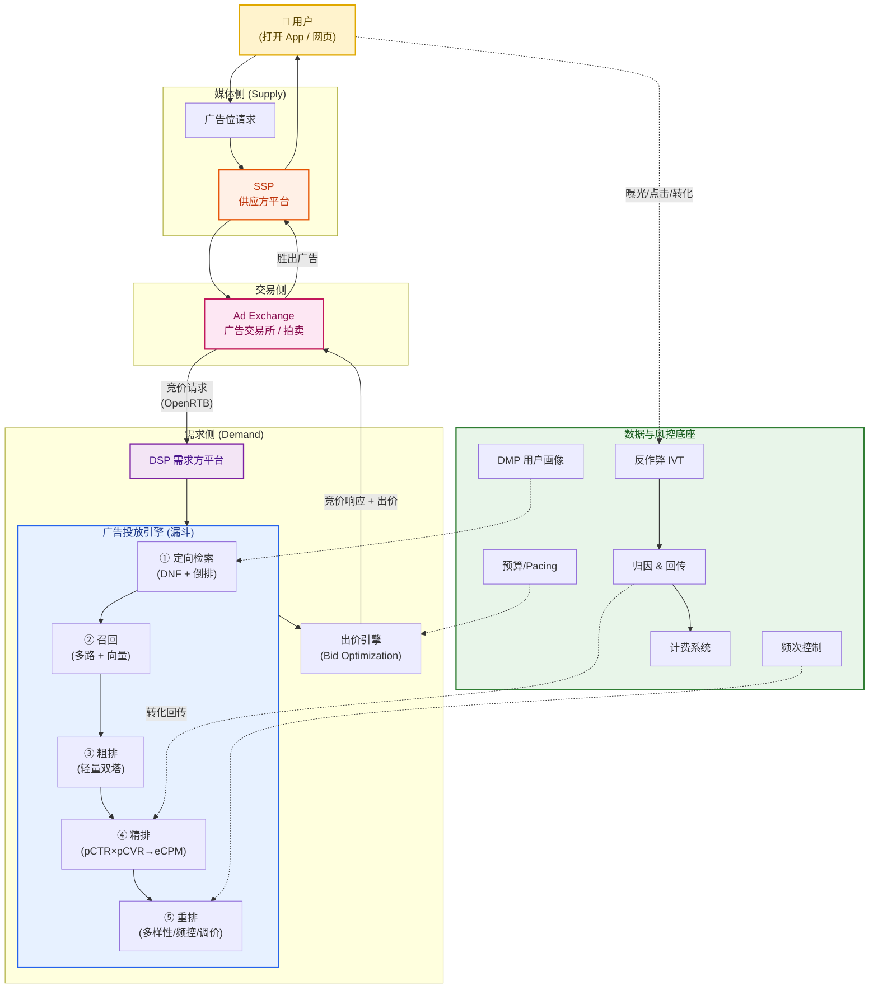
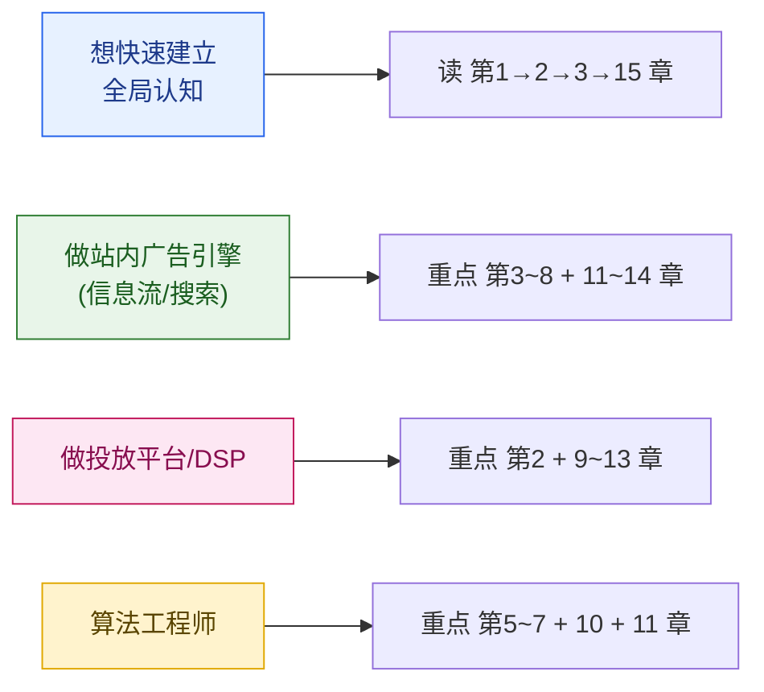

# 广告投放系统设计 · 全景教程

> 一份面向工程师的、端到端覆盖的广告投放系统教程。从计算广告的商业本质，到程序化交易生态（DSP/SSP/ADX/RTB），再到站内广告引擎的召回-粗排-精排-重排漏斗，直至计费、出价、预算、反作弊、归因与高并发工程实现。
>
> **风格定位**：深入原理 + 算法公式 + 代码示例 + 架构图解。
> **目标读者**：想体系化掌握广告系统的后端 / 算法 / 架构工程师。

---

## 一、为什么要学广告投放系统

广告是互联网最大的商业模式之一——Google、Meta、字节、阿里、腾讯的核心收入都来自广告。广告投放系统是这套商业模式的"发动机"：它要在**100 毫秒内**，从**上亿条广告**里，为**每一次曝光机会**挑出最合适的广告，并完成竞价、计费、风控的全过程，每秒钟要扛住**百万级 QPS**。

它是一个罕见的"算法 × 工程 × 经济学 × 数据"四位一体的系统：

- **算法**：CTR/CVR 预估、向量召回、智能出价
- **工程**：低延迟、高并发、海量存储、流式计算
- **经济学**：拍卖机制设计、博弈、定价
- **数据**：用户画像、特征工程、归因闭环

学透它，等于同时打通了推荐系统、机器学习工程、分布式系统和机制设计四条主线。

---

## 二、全景架构图

下面这张图是整篇教程的"地图"。后续每一章都会聚焦其中一块，建议读完全篇后回看这张图，把所有模块串起来。

---

## 三、章节目录

### 第一部分 · 基础与生态

| 章节 | 标题 | 核心内容 |
| --- | --- | --- |
| [第 1 章](./01-导论-什么是广告投放系统.md) | 导论：什么是广告投放系统 | 计算广告本质、三方博弈、术语与指标体系、两大范式 |
| [第 2 章](./02-程序化广告生态与RTB.md) | 程序化广告生态与 RTB | DSP/SSP/ADX/DMP、OpenRTB、竞价时序、公开/私有交易 |

### 第二部分 · 广告投放引擎全链路（站内漏斗）

| 章节 | 标题 | 核心内容 |
| --- | --- | --- |
| [第 3 章](./03-投放引擎总体架构.md) | 投放引擎总体架构 | 漏斗模型、请求生命周期、延迟预算、模块全景 |
| [第 4 章](./04-定向与广告检索.md) | 定向与广告检索 | 定向体系、DNF 布尔表达式、倒排索引、人群包 |
| [第 5 章](./05-召回.md) | 召回 | 多路召回、向量双塔、ANN/HNSW、生命周期分路 |
| [第 6 章](./06-粗排.md) | 粗排 | 效率精度权衡、轻量双塔、蒸馏、集合选择 |
| [第 7 章](./07-精排与CTR-CVR预估.md) | 精排与 CTR/CVR 预估 | 模型演进、特征工程、校准 COPC、eCPM |
| [第 8 章](./08-重排与拍卖机制.md) | 重排与拍卖机制 | 多样性/频控/调价、GSP/VCG、二价计费 |

### 第三部分 · 计费、出价与预算

| 章节 | 标题 | 核心内容 |
| --- | --- | --- |
| [第 9 章](./09-计费与出价模式.md) | 计费与出价模式 | CPM/CPC/CPA/oCPX、四点框架、次价计费、博弈 |
| [第 10 章](./10-智能出价与出价优化.md) | 智能出价与出价优化 | Bid Landscape、最优出价函数、对偶分解、PID |
| [第 11 章](./11-预算控制与频次控制.md) | 预算控制与频次控制 | Pacing(节流/PID/MPC)、Frequency Capping、计数存储 |

### 第四部分 · 数据闭环与工程

| 章节 | 标题 | 核心内容 |
| --- | --- | --- |
| [第 12 章](./12-反作弊与流量质量.md) | 反作弊与流量质量 | IVT/GIVT/SIVT、作弊手法、检测体系、多层防御 |
| [第 13 章](./13-归因与转化回传.md) | 归因与转化回传 | 归因模型、归因窗口、回传链路、oCPX 闭环、隐私 |
| [第 14 章](./14-工程架构与高并发实战.md) | 工程架构与高并发实战 | 低延迟、缓存、画像存储、特征平台、流式计费、A/B |

### 结语

| 章节 | 标题 | 核心内容 |
| --- | --- | --- |
| [第 15 章](./15-全链路串讲与学习路径.md) | 全链路串讲与学习路径 | 端到端串讲、模块协同回顾、经典论文、学习路径 |

---

## 四、阅读建议

- **建议顺序**：按章节顺序通读，每部分内部强耦合，跨部分弱耦合。
- **核心三章**：第 7 章（精排预估）、第 8 章（拍卖机制）、第 10 章（智能出价）是算法 + 经济学的浓缩，值得反复看。
- **工程落地**：第 14 章把前面所有模块的工程约束统一收口，做架构设计前必读。

---

## 五、贯穿全篇的一个例子

为了让 14 章不割裂，全篇用同一个虚构例子串联：

> **「悦读 App」** 是一个日活 5000 万的小说阅读 App（媒体方）。
> **「轻氧奶茶」** 是一个连锁奶茶品牌（广告主），想投信息流广告拉新会员，预算 10 万元/天，目标是「注册并下首单」的转化成本不超过 30 元。

我们将跟随轻氧奶茶的这笔预算，看它如何穿过定向、召回、排序、出价、计费、归因的每一个环节。

---

> 📌 本教程所有外部资料来源已在各章末尾「参考来源」中以链接标注。下面进入正文。
