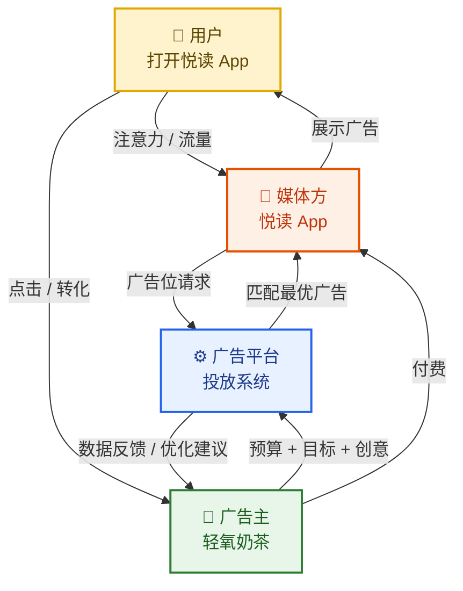
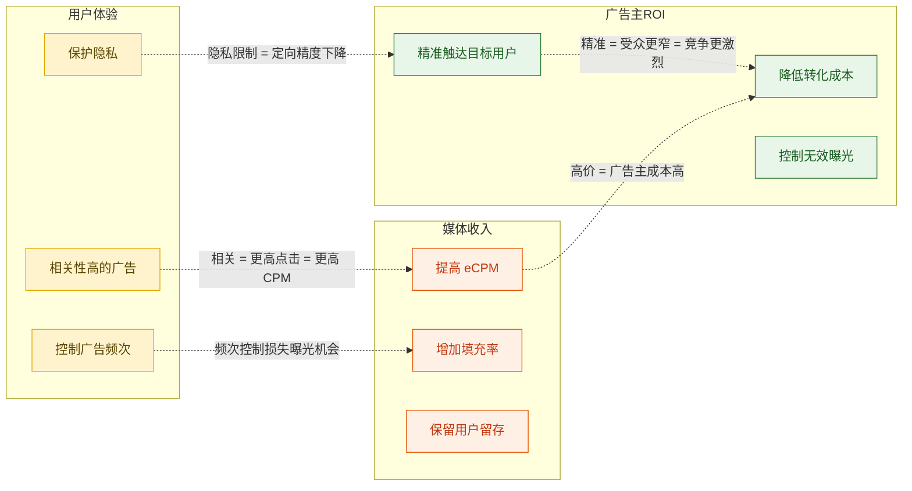
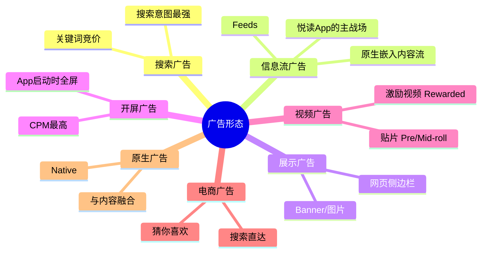
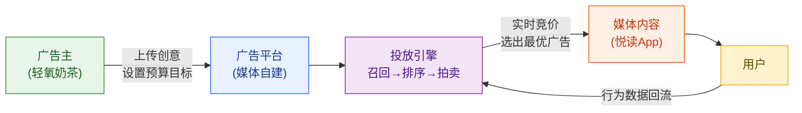
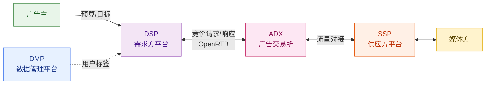
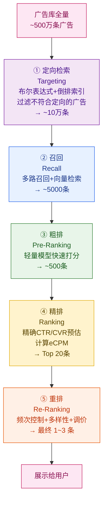
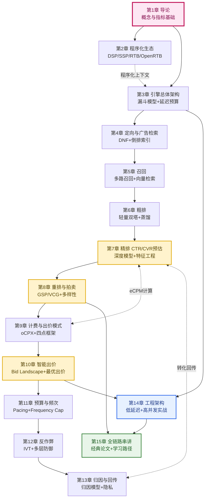

# 第 1 章 · 导论：什么是广告投放系统

---

## 本章导读

本章是整篇教程的起点。我们不急着写代码或推导公式，而是先建立一套"思维地图"：广告系统到底在做什么、为谁而做、如何衡量好坏。

读完本章，你将能回答：

- 计算广告（Computational Advertising）的本质是什么？为什么它是一个"匹配问题"？
- 广告生态里有哪些角色，他们之间的博弈关系是什么？
- 行业里的核心指标（CTR、CVR、CPM、CPC、CPA、eCPM……）背后的逻辑是什么？
- 系统设计的两大范式（站内闭环 vs 程序化生态）有何不同？
- 一笔广告预算从"签合同"到"曝光给用户"经历了哪些环节？

本章后续所有章节的基础概念均在此建立。如果你已有广告从业经验，可跳过 §1.1–§1.2，直接从 §1.3 的指标体系开始阅读。

---

## 1.1 计算广告的本质：一场"注意力交易"

### 1.1.1 广告的经济学定义

"广告"这个词在古代就有——城门口贴的告示、集市上小贩的吆喝，都是广告。但现代数字广告的本质，是一种**注意力交易（Attention Commerce）**：

> 用户的注意力是稀缺资源。媒体通过内容吸引用户停留，然后把这部分注意力"转卖"给广告主，广告主借此接触潜在用户，完成品牌曝光或效果转化。

这个交易链有三个角色：
- **用户**：注意力的真正"所有者"
- **媒体（Publisher）**：注意力的"汇集方"和"出售方"
- **广告主（Advertiser）**：注意力的"购买方"

互联网让这场交易的规模从"局部集市"变成了"全球实时市场"——每秒钟发生数百亿次注意力的交易，广告投放系统就是这个市场的"交易所"。

### 1.1.2 计算广告的学术定义

学术界对计算广告（Computational Advertising）的定义来自 Andrei Broder 2008 年的经典论文《A Semantic Approach to Contextual Advertising》：

> "The general problem of computational advertising is to find the best match between a given user in a given context and a suitable advertisement."

翻译为中文：

> **计算广告的核心任务是：在特定语境（Context）下，为给定用户（User）找到最合适的广告（Ad）。**

注意这里有三个维度：

1. **用户（User）**：谁在看？年龄、性别、地域、兴趣、历史行为……
2. **语境（Context）**：在哪里看？在什么内容页、什么时间、什么设备？
3. **广告（Ad）**：投什么？广告主的意图、出价、预算、创意……

"最合适"这个词是关键——它不是随机的，也不只是"广告主付钱最多的"，而是要综合权衡三方利益。我们后面会看到，这个"最合适"最终被量化为 **eCPM（期望每千次曝光收益）**，这是全书最重要的统一标尺（详见 §1.3.6）。

### 1.1.3 为什么是"计算"广告

传统广告靠人工谈判：甲方找乙方，签合同，约定在某时间段播放。计算广告的革命性在于：

- **实时**：每次请求都实时竞价（毫秒级决策）
- **个性化**：每个用户看到不同的广告
- **可度量**：点击、转化、ROI 都可以精确统计
- **自动化**：出价、预算分配、创意优化均可自动完成

这四点要同时做到，就需要机器学习、高并发工程、博弈论的联合支撑——这正是广告系统的魅力所在。

---

## 1.2 广告生态的核心角色与博弈

### 1.2.1 四大核心角色

现代数字广告生态中有四类核心角色：

| 角色 | 英文 | 典型代表 | 核心诉求 |
|------|------|----------|----------|
| 用户 | User / Consumer | 普通网民、App 用户 | 不被打扰、看到相关内容 |
| 媒体 / 流量方 | Publisher / Media | 悦读 App、微信、YouTube | 广告收入最大化，不损伤用户体验 |
| 广告主 | Advertiser | 轻氧奶茶、Nike、大众汽车 | ROI 最大化，品牌曝光或效果转化 |
| 广告平台 | Ad Platform / Exchange | Google Ads、字节巨量引擎 | 撮合交易、抽取佣金、维持生态健康 |

**我们的例子：**
- 媒体：**悦读 App**（日活 5000 万的小说阅读 App）
- 广告主：**轻氧奶茶**（连锁奶茶品牌，目标：转化成本 ≤ 30 元）

### 1.2.2 三方关系图

下面这张图展示了三方（用户、媒体、广告主）以及广告平台如何在一次广告展示中协同运转：



**信息流向：**
- 用户贡献注意力给媒体（通过消费内容）
- 媒体把注意力打包成"广告位"输送给平台
- 广告主把预算和目标输入平台
- 平台撮合：为每个广告位挑出最合适的广告，展示给用户
- 用户产生点击/转化行为，广告主付费，媒体分成

### 1.2.3 三方博弈：贯穿全系统的核心张力

广告系统设计最难的地方不是算法，而是**三方博弈**。三方的利益天然存在冲突：

**用户的诉求（体验）**：
- 不希望被广告打扰
- 希望广告与自己需求相关
- 隐私不被侵犯

**媒体的诉求（收入）**：
- 广告位 CPM 越高越好
- 广告展示数量越多越好
- 但不能因广告损失用户留存（用户流失 → 流量下降 → 收入长期下滑）

**广告主的诉求（ROI）**：
- 转化成本越低越好
- 流量越精准越好
- 预算不浪费在无效曝光上

这三方博弈构成了广告系统设计的**核心张力**，并在每个模块中都有具体体现：



**广告系统设计的最终目标**：在三方利益之间找到帕累托最优解——让用户体验、媒体收入、广告主ROI 同时尽量好，而不是牺牲任何一方去成全另一方。

这个目标贯穿本教程所有章节，每当你看到某个设计决策，都可以问自己：**"这个设计对三方分别意味着什么？"**

---

## 1.3 广告的分类体系

理解广告类型是理解后续系统设计（召回策略、排序目标、计费方式选择）的前提。

### 1.3.1 按营销目标分类：品牌广告 vs 效果广告

| 维度 | 品牌广告（Brand Advertising） | 效果广告（Performance Advertising） |
|------|------------------------------|--------------------------------------|
| 营销目标 | 提升品牌认知、美誉度 | 直接带来点击、注册、购买等可度量转化 |
| 计费方式 | 多为 CPM（按曝光计费） | 多为 CPC、CPA、oCPX |
| 考核指标 | 曝光量、品牌搜索指数、品牌偏好度 | CPA、ROI、ROAS |
| 典型客户 | 宝洁、可口可乐、奔驰（大品牌） | 电商、游戏、App 推广、金融 |
| 投放周期 | 通常按合同周期，有 GD（Guaranteed Delivery）保量 | 实时竞价，灵活 |
| 典型形态 | 开屏、视频贴片、大 Banner | 信息流、搜索广告、激励视频 |

**我们的例子**：轻氧奶茶投的是典型的**效果广告**——有明确转化目标（注册+下首单）、有成本约束（≤30元/转化）、按实际效果计费。

### 1.3.2 按广告形态分类



各形态的技术特点对比：

| 形态 | 用户意图强度 | 广告打扰感 | 技术难点 | 典型 CTR 区间 |
|------|------------|-----------|---------|--------------|
| 搜索广告 | ★★★★★ | 低 | 关键词匹配、出价策略 | 2%–8% |
| 信息流广告 | ★★★ | 中 | 内容理解、个性化召排 | 0.5%–3% |
| 开屏广告 | ★ | 高 | 频次控制、用户接受度 | 0.3%–1.5% |
| 贴片广告 | ★★ | 高 | 跳过行为建模、完播率 | 0.5%–2% |
| 激励视频 | ★★★★ | 低（主动选择） | 防刷、作弊识别 | 3%–10% |
| 电商搜索 | ★★★★★ | 低 | 商品理解、意图匹配 | 1%–5% |

> **注**：CTR 数值仅供参考，实际因行业、产品、受众差异极大。

---

## 1.4 核心指标体系：广告人必须背下来的公式

这是本章最重要的部分。广告行业有一套专属的"KPI语言"，不懂这套语言，后续的系统设计讨论就像读天书。

### 1.4.1 流量漏斗的基本事件

广告展示到最终产生商业价值，经历以下事件序列：


**曝光（Impression）**：广告被展示给用户一次，记为 1 次曝光。曝光是计费和统计的基本单位。

**点击（Click）**：用户点击广告，跳转到落地页。

**转化（Conversion）**：用户完成广告主期望的行为——可能是注册、下单、安装 App、填写表单等。**转化的定义由广告主决定**，不同广告主的转化目标完全不同。

### 1.4.2 比率指标

**点击率 CTR（Click-Through Rate）**：

$$\text{CTR} = \frac{\text{点击数（Clicks）}}{\text{曝光数（Impressions）}}$$

CTR 反映广告对用户的吸引力。影响 CTR 的因素：创意质量、标题文案、图片吸引力、用户与广告的相关性、广告位位置。

**转化率 CVR（Conversion Rate）**：

$$\text{CVR} = \frac{\text{转化数（Conversions）}}{\text{点击数（Clicks）}}$$

CVR 反映落地页和产品的承接能力。CTR 高但 CVR 低，往往说明广告"钓鱼"——标题夸张但落地页不兑现承诺。

**填充率 Fill Rate**：

$$\text{Fill Rate} = \frac{\text{成功展示广告的请求数}}{\text{总广告请求数}}$$

媒体最关心 Fill Rate——如果广告位有 20% 的请求没有广告来填充，就是白白浪费流量。

### 1.4.3 计费指标

广告主付费的方式有多种，对应不同的计费模式：

**CPM（Cost Per Mille）**：每千次曝光的费用。

$$\text{CPM} = \frac{\text{总花费（Cost）}}{\text{曝光数（Impressions）}} \times 1000$$

**CPC（Cost Per Click）**：每次点击的费用。

$$\text{CPC} = \frac{\text{总花费（Cost）}}{\text{点击数（Clicks）}}$$

**CPA（Cost Per Action / Cost Per Acquisition）**：每次转化的费用，也叫获客成本。

$$\text{CPA} = \frac{\text{总花费（Cost）}}{\text{转化数（Conversions）}}$$

这三者之间的关系：

$$\text{CPA} = \frac{\text{CPC}}{\text{CVR}} = \frac{\text{CPM}}{1000 \times \text{CTR} \times \text{CVR}}$$

**轻氧奶茶的目标**：CPA ≤ 30元（每带来一个"注册+下首单"的新用户，成本不超过30元）。

### 1.4.4 效果评估指标

**ROI（Return on Investment）**：广告投资回报率。

$$\text{ROI} = \frac{\text{广告带来的收入（Revenue）}}{\text{广告花费（Cost）}}$$

ROI > 1 表示广告盈利，ROI < 1 表示亏损。

**ROAS（Return on Ad Spend）**：广告花费回报，与ROI概念相似但更常用于电商。

$$\text{ROAS} = \frac{\text{广告带来的GMV（商品交易额）}}{\text{广告花费}}$$

**LTV（Lifetime Value，用户生命周期价值）**：一个用户从获取到流失，在整个生命周期内给广告主带来的总价值。

$$\text{LTV} = \text{ARPU（每用户平均收入）} \times \text{平均留存时长（月）}$$

LTV 是广告主决定"愿意花多少钱获取一个用户"的理论上限。如果轻氧奶茶估算一个新会员的 LTV 是 200 元，那么 CPA = 30 元意味着 ROI = 200/30 ≈ 6.7，是合理的。

**GMV（Gross Merchandise Volume）**：商品交易总额，电商广告常用考核指标。

### 1.4.5 媒体收益指标

**ARPU（Average Revenue Per User）**：每用户平均收入。

$$\text{ARPU} = \frac{\text{总广告收入}}{\text{DAU（日活用户数）}}$$

悦读 App 的核心财务指标就是 ARPU，它等于 DAU × ARPU = 总收入。

### 1.4.6 eCPM：最重要的统一标尺

终于到了最关键的指标。

**eCPM（Effective Cost Per Mille，有效千次展示收益）**：从媒体的角度看，每千次曝光的**实际收益**。

$$\boxed{\text{eCPM} = \frac{\text{总收益（Revenue）}}{\text{曝光数（Impressions）}} \times 1000}$$

**为什么 eCPM 是最重要的指标？**

问题来了：广告主 A 按 CPM 出价 5 元，广告主 B 按 CPC 出价 1 元，广告主 C 按 CPA 出价 30 元。媒体应该展示谁的广告？

不同计费方式无法直接比较——这就是 eCPM 存在的意义：**把所有计费方式折算到同一单位（每千次曝光的期望收益），实现统一竞价**。

折算公式：

| 计费方式 | eCPM 折算公式 | 说明 |
|----------|--------------|------|
| CPM 直接出价 | $\text{eCPM} = \text{bid}_{CPM}$ | 直接就是eCPM |
| CPC 出价 | $\text{eCPM} = \text{bid}_{CPC} \times \text{pCTR} \times 1000$ | 需要预估点击率 |
| CPA 出价 | $\text{eCPM} = \text{bid}_{CPA} \times \text{pCTR} \times \text{pCVR} \times 1000$ | 需要预估点击率和转化率 |

其中 $\text{pCTR}$（predicted CTR，预估点击率）和 $\text{pCVR}$（predicted CVR，预估转化率）是机器学习模型的输出。

**具体例子**（还是轻氧奶茶）：

假设某次拍卖中，轻氧奶茶按 CPA 出价 30 元（目标转化成本），模型预估：
- $\text{pCTR} = 2\%$（预计 100 次曝光有 2 次点击）
- $\text{pCVR} = 10\%$（预计 10 次点击有 1 次转化）

则：

$$\text{eCPM} = 30 \times 0.02 \times 0.10 \times 1000 = 60 \text{ 元}$$

这意味着：每展示 1000 次轻氧奶茶的广告，平均带来 60 元收益。如果竞争对手只有 50 元 eCPM，轻氧奶茶胜出，广告被展示。

**eCPM 的核心思想**：体现"广告主的出价意愿 × 用户对广告的响应概率"。既考虑了广告主愿意付多少钱，也考虑了这条广告在这个用户面前的实际转化可能性。

这也是为什么精排（第 7 章）的核心任务是**准确预估 pCTR 和 pCVR**——预估偏差 10%，eCPM 就偏差 10%，直接影响竞价结果和媒体收益。

### 1.4.7 完整指标速查表

| 指标 | 英文全称 | 公式 / 定义 | 谁最关心 |
|------|----------|------------|---------|
| 曝光 | Impression | 广告展示1次 | 全部三方 |
| 点击 | Click | 用户点击广告 | 广告主、媒体 |
| 转化 | Conversion | 完成目标行为 | 广告主 |
| CTR | Click-Through Rate | 点击/曝光 | 广告主、算法团队 |
| CVR | Conversion Rate | 转化/点击 | 广告主 |
| CPM | Cost Per Mille | 花费/曝光×1000 | 广告主、媒体 |
| CPC | Cost Per Click | 花费/点击 | 广告主 |
| CPA | Cost Per Action | 花费/转化 | 广告主 |
| eCPM | Effective CPM | 收益/曝光×1000 | 媒体、算法团队 |
| ROI | Return on Investment | 收入/花费 | 广告主 |
| ROAS | Return on Ad Spend | GMV/花费 | 电商广告主 |
| Fill Rate | 填充率 | 填充请求/总请求 | 媒体 |
| ARPU | Avg Revenue Per User | 总收入/DAU | 媒体 |
| LTV | Lifetime Value | 用户全生命周期价值 | 广告主（计算获客上限） |
| GMV | Gross Merchandise Volume | 商品交易总额 | 电商广告主 |

---

## 1.5 两大系统范式

广告投放系统在工程架构上有两种截然不同的范式，理解这两种范式是后续章节的基础。

### 1.5.1 范式一：站内闭环广告系统

**代表**：字节跳动（抖音信息流广告）、Meta（Facebook Feed Ads）、微信广告、淘宝直通车。

**特点**：媒体自建广告引擎，广告主直接在媒体平台投放，流量、广告、数据全部在同一公司内部流转。



**优势**：
- 数据闭环完整——用户行为、曝光、转化数据全在一个系统，模型训练效率高
- 延迟低——没有跨系统网络调用
- 定向精准——对自家用户数据掌控完整

**劣势**：
- 只服务自家流量，不能跨媒体投放
- 广告主需要在多个平台分别运营

**本教程的重心**：第 3–14 章深入讲解站内闭环系统的引擎设计。

### 1.5.2 范式二：程序化广告生态

**代表**：Google ADX、OpenX、The Trade Desk（DSP）、MoPub（SSP）。

**特点**：通过标准协议（OpenRTB）连接多方生态——DSP（需求方平台）、SSP（供应方平台）、ADX（广告交易所）、DMP（数据管理平台）形成独立的角色分工。



**OpenRTB（Open Real-Time Bidding，开放实时竞价）**：这是连接整个程序化生态的标准协议，规定了竞价请求/响应的数据格式。一次 RTB 竞价的时序在 100ms 内完成（详见第 2 章）。

**两种范式的对比**：

| 维度 | 站内闭环 | 程序化生态 |
|------|---------|-----------|
| 数据归属 | 媒体自有全部数据 | 各方拥有部分数据，DMP 聚合 |
| 系统延迟 | 更低（内部调用） | 更高（跨网络RTB，≤100ms） |
| 流量覆盖 | 仅限自家媒体 | 跨媒体、跨渠道 |
| 广告主操控度 | 较低（平台托管） | 较高（DSP可自主控制） |
| 技术复杂度 | 高（自研引擎） | 高（协议对接+实时竞价） |
| 典型代表 | 字节、Meta、腾讯 | Google ADX、The Trade Desk |

**第 2 章**将深入讲解程序化生态的各个角色、OpenRTB 协议设计和 RTB 竞价时序。

---

## 1.6 "漏斗"思想：从亿级广告到单次曝光

这是理解广告投放引擎设计的第一个核心概念。

假设悦读 App 的广告库里有 **500 万条广告**，每次用户打开 App，系统都要从中选出最合适的 1–3 条展示。

直觉的做法：对每条广告算一次 eCPM，取最高的。

**问题**：500 万条广告，每条都要算精排模型（一次复杂神经网络前向传播，耗时约 0.1ms），总耗时 500 秒——显然不可行。

广告系统的解决方案是**漏斗模型（Funnel Architecture）**：



每一层都在做两件事：
1. **大幅削减候选集**：从500万→10万→5000→500→20→3，计算资源越来越聚焦
2. **逐步提升精度**：每一层的模型比上一层更精确、也更耗时

这个设计是**精度与效率的权衡**：

- 定向检索用简单的布尔逻辑，O(1) 级别的倒排查找
- 召回用轻量的向量内积，不精确但快
- 粗排用简化模型，毫秒级完成数千条打分
- 精排用完整深度模型，只处理几百条候选
- 重排做最终的业务规则调整

这个漏斗思想将在第 3 章详细展开，第 4–8 章分别对应每一层的实现。

---

## 1.7 行业规模与主要玩家

### 1.7.1 全球广告市场规模

2023 年全球数字广告市场规模约 **6000 亿美元**，预计 2027 年超过 8000 亿美元。搜索广告和社交广告是最大的两个品类，合计占数字广告约 60%。

中国数字广告市场 2023 年约 **7000 亿人民币**，增速保持在 10–15% 区间。

### 1.7.2 主要玩家广告收入对比

| 公司 | 2023年广告收入（美元）| 广告收入占总收入比 | 主要广告产品 |
|------|---------------------|-------------------|------------|
| Google（Alphabet） | ~2380 亿 | ~77% | 搜索广告、YouTube 广告、GDN |
| Meta | ~1320 亿 | ~98% | Facebook/Instagram 信息流 |
| 字节跳动 | ~1100 亿（估）| ~80%（估）| 抖音/TikTok 信息流 |
| 阿里巴巴 | ~390 亿 | ~46% | 淘宝/天猫搜索与推荐 |
| 腾讯 | ~280 亿 | ~18% | 微信广告、腾讯广告 |
| Amazon | ~470 亿 | ~8% | 电商搜索广告 |

> 数据来源：各公司2023年财报，字节跳动为市场估算数据（未上市）。

**关键洞察**：
- 搜索广告（Google、Amazon、阿里）是效果广告的王者，因为用户有明确意图
- 社交/信息流广告（Meta、字节）增长最快，兴趣图谱是核心竞争力
- 广告收入的高占比（Meta 98%、Google 77%）意味着这些公司的一切产品决策都围绕广告系统展开

### 1.7.3 技术上的分水岭

2020 年以来，广告技术最重要的两个变革：

1. **Apple ATT（App Tracking Transparency）**：iOS 14.5 要求 App 明确征得用户同意才能追踪。Meta 在 2022 年因此损失约 100 亿美元广告收入。各平台纷纷转向站内数据闭环，减少对第三方追踪的依赖。

2. **Cookie 退场**：Google 宣布在 Chrome 逐步淘汰第三方 Cookie。影响所有依赖 Cookie 做跨站追踪的程序化广告生态，推动行业向 Privacy Sandbox、同态加密等隐私保护技术转型。

这两个变革深刻影响了归因系统（第 13 章）和程序化生态（第 2 章）的设计思路。

---

## 1.8 完整流程示例：轻氧奶茶的一次广告曝光

用具体例子把上面的概念串起来，感受一次广告从预算到曝光的完整旅程。

### 第一步：广告主配置广告

轻氧奶茶的投放运营在广告平台后台做了以下配置：

```python
# 这不是真实 API，仅示意配置结构
campaign = {
    "advertiser": "轻氧奶茶",
    "campaign_name": "2024夏季拉新计划",
    "budget": {
        "daily_budget": 100000,  # 10万元/天
        "total_budget": 3000000,  # 300万元总预算
    },
    "target": {
        "objective": "CONVERSION",  # 目标：转化
        "conversion_event": "register_and_first_order",  # 注册并下首单
        "bid_type": "OCPX",  # 按目标转化出价
        "target_cpa": 30,  # 目标CPA: 30元
    },
    "targeting": {
        "age_range": [18, 35],  # 18-35岁
        "gender": ["FEMALE"],   # 女性（奶茶目标用户）
        "interests": ["奶茶", "饮品", "下午茶", "轻食"],
        "geo": ["上海", "北京", "成都", "广州"],  # 一线城市
        "device": ["MOBILE"],
        "exclude": {
            "existing_customers": True  # 排除已有会员
        }
    },
    "creatives": [
        {"type": "IMAGE", "image_url": "...", "title": "首单立减20元", "cta": "立即领取"},
        {"type": "VIDEO", "video_url": "...", "duration": 15, "title": "轻氧奶茶，每天的小确幸"},
    ]
}
```

### 第二步：用户触发广告请求

小王，26岁女性，住在上海，正在用悦读 App 看小说。在第 3 章节的末尾，App 判断这是一个展示广告的合适时机，向广告系统发起请求：

```python
# 广告请求（Ad Request）的核心字段
ad_request = {
    "request_id": "req_202406151423_abc123",
    "media_id": "yuedu_app",
    "ad_slot": {
        "slot_id": "yuedu_feeds_001",
        "slot_type": "FEED",  # 信息流
        "position": 3,  # 第3条内容
    },
    "user_info": {
        "device_id": "did_xxx",
        "age": 26,
        "gender": "FEMALE",
        "city": "上海",
        "interests": ["言情小说", "甜品", "美妆"],
        "recent_behavior": {
            "has_searched": ["奶茶", "下午茶"],  # 最近7天搜索
            "has_viewed": ["美食类App", "饮品购物"],
        }
    },
    "context": {
        "timestamp": 1718424180,
        "content_id": "novel_romance_chapter3",  # 正在看的内容
        "device_type": "MOBILE",
        "os": "iOS",
        "network": "WIFI",
    }
}
```

### 第三步：广告引擎漏斗处理

广告引擎在 **50ms** 内完成以下工作：

```
[0ms]   收到请求，读取用户画像和上下文
[5ms]   定向检索：从 500 万广告中过滤出符合条件的约 8 万条
         → 轻氧奶茶广告通过（用户：26岁女性、上海、兴趣匹配）
[15ms]  召回：多路召回+向量检索，得到 3000 条候选
[25ms]  粗排：轻量模型对 3000 条打分，保留 Top 300
[40ms]  精排：深度模型预估：
         → 轻氧奶茶图片广告：pCTR=3.2%, pCVR=8.5%
         → eCPM = 30 × 0.032 × 0.085 × 1000 = 81.6 元
         → （其他广告 eCPM 在 30–70 元之间，轻氧奶茶排名靠前）
[48ms]  重排：频次检查（小王今天已看过2次轻氧奶茶广告，不超限），多样性检查通过
[50ms]  最终选出 2 条广告：轻氧奶茶（图片）+ 某健身App（视频）
```

### 第四步：广告展示与计费

广告展示给小王。

**三种可能的结局**：

1. **小王没有点击**：曝光发生，如果是 CPM 计费，轻氧奶茶付出约 0.082 元（eCPM/1000 × 1次）；如果是 CPC/CPA 计费，不扣费。

2. **小王点击但没转化**：如果是 CPC 计费，扣 CPC 费用；如果是 CPA/oCPX 计费，不扣费（但系统记录"有点击无转化"，作为后续 pCVR 模型的负样本）。

3. **小王点击并注册+下首单（转化）**：
   - 归因系统记录"此次曝光带来了1次转化"
   - 扣费：若设 CPA=30 元出价，则扣 30 元（或按次价计费，详见第 8、9 章）
   - 转化事件回传给精排模型，作为正样本更新 pCVR 预估
   - 预算系统记录消耗：10万元日预算消耗 30 元

### 第五步：数据闭环

这次曝光的数据进入数据流水线：

- **曝光日志** → 训练 pCTR 模型的样本
- **点击日志** → 训练 pCVR 模型的样本  
- **转化日志** → 校准 oCPX 出价策略，验证目标 CPA 是否达成
- **预算消耗** → Pacing 系统更新剩余预算，调整投放节奏

**一次广告曝光，就这样构成了整个系统的一个完整循环。** 每天这样的循环发生数百亿次。

---

## 1.9 本教程的学习地图

### 1.9.1 各章关系图



### 1.9.2 按角色的阅读建议

**想快速建立全局认知**（2天速读）：
→ 第1章 + 第2章 + 第3章 + 第15章

**做站内广告引擎**（信息流、搜索广告系统工程师）：
→ 重点：第3–8章（漏斗全链路）+ 第11章 + 第14章

**做投放平台或 DSP**：
→ 重点：第2章 + 第9章 + 第10章 + 第13章

**算法/ML 工程师**：
→ 重点：第5章（召回）+ 第6章（粗排）+ 第7章（精排）+ 第10章（智能出价）

**数据/风控工程师**：
→ 重点：第12章（反作弊）+ 第13章（归因）+ 第14章（工程实践）

### 1.9.3 核心三章

如果只能读三章：
1. **第7章**（精排CTR/CVR预估）：算法核心，模型的好坏决定整个系统的收益上限
2. **第8章**（重排与拍卖机制）：机制设计的核心，决定了博弈均衡和系统公平性
3. **第10章**（智能出价）：工程与经济学的交汇，是过去5年广告系统最重要的演进方向

---

## 本章小结

本章建立了广告投放系统的思维基础：

1. **本质**：计算广告是一个在"用户—语境—广告"三维空间中的最优匹配问题，商业本质是注意力交易。

2. **三方博弈**：用户体验 vs 媒体收入 vs 广告主 ROI 的张力贯穿所有系统设计决策，这是理解任何设计选择的第一个问题。

3. **指标体系**：CTR、CVR、CPM、CPC、CPA 是基础；**eCPM 是核心统一标尺**，把所有计费方式折算为同一单位，使竞价成为可能；LTV 是广告主决策的理论依据。

4. **两大范式**：站内闭环（数据完整、延迟低）和程序化生态（跨媒体、标准化协议），本教程重点在站内闭环引擎，程序化生态在第2章展开。

5. **漏斗思想**：从数百万广告到最终曝光，通过多层筛选逐步精化，在精度和效率之间取得平衡。这是第3–8章的核心架构逻辑。

6. **oCPX 的链条**：广告主按转化出价（CPA）→ 系统预估 pCTR × pCVR → 折算 eCPM → 竞价 → 曝光 → 转化回传 → 更新模型。这个闭环是整个系统最重要的价值链。

**下一章**：我们将深入程序化广告生态，理解 DSP、SSP、ADX、DMP 各角色的职责，以及一次 RTB 竞价如何在 100ms 内完成。

---

## 参考来源

1. Broder, A. et al. (2008). *A Semantic Approach to Contextual Advertising*. ACM SIGIR. https://dl.acm.org/doi/10.1145/1390334.1390377

2. Muthukrishnan, S. (2009). *Ad Exchanges: Research Issues*. WINE 2009. https://arxiv.org/abs/0907.2461

3. Jansen, B.J. & Mullen, T. (2008). *Sponsored search: An overview of the concept, history, and technology*. International Journal of Electronic Business. https://doi.org/10.1504/IJEB.2008.018068

4. 刘鹏、王超. (2015). 《计算广告：互联网商业变现的市场与技术》. 人民邮电出版社. （国内最权威的计算广告教材）

5. Google (2023). *Alphabet Q4 2023 Earnings Release*. https://abc.xyz/investor/

6. Meta (2023). *Meta Q4 2023 Earnings Release*. https://investor.fb.com/

7. IAB (2023). *OpenRTB API Specification Version 2.6*. https://iabtechlab.com/standards/openrtb/

8. Apple Developer (2021). *App Tracking Transparency*. https://developer.apple.com/documentation/apptrackingtransparency

9. Zhang, W. et al. (2014). *Real-Time Bidding Benchmarking with iPinYou Dataset*. https://arxiv.org/abs/1407.7073

10. Yuan, S. et al. (2013). *Real-Time Bidding for Online Advertising: Measurement and Analysis*. ADKDD 2013. https://arxiv.org/abs/1306.6542

11. eMarketer (2024). *Global Digital Ad Spending Forecast 2024*. https://www.emarketer.com/content/global-digital-ad-spending-forecast-2024

12. Statista (2024). *Digital Advertising - Worldwide*. https://www.statista.com/outlook/dmo/digital-advertising/worldwide
