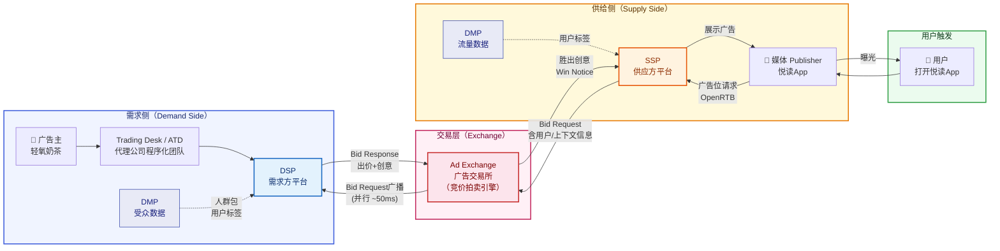
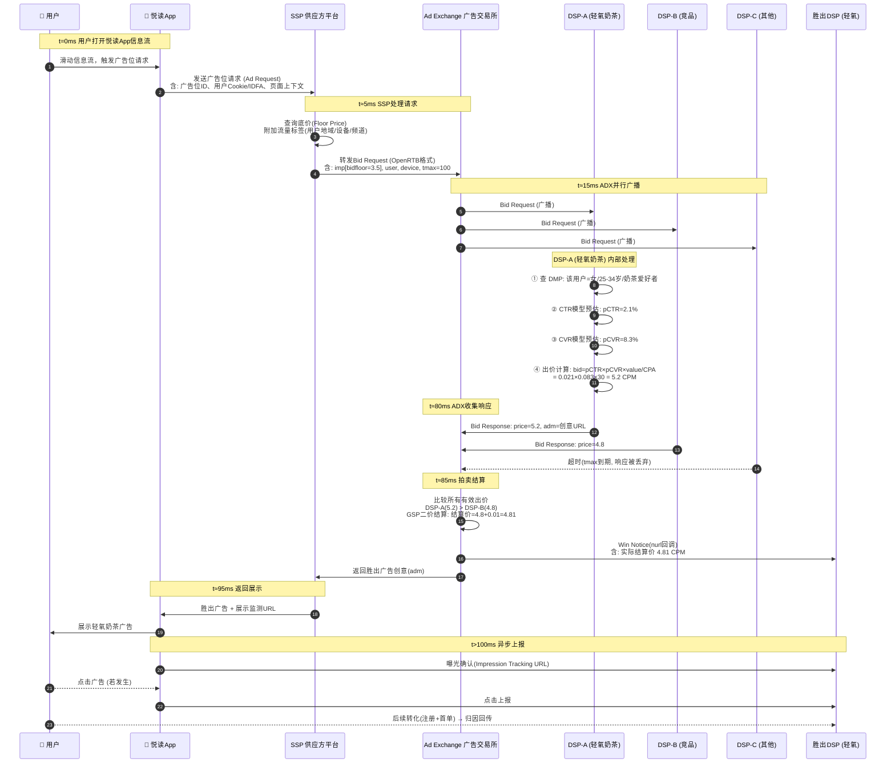
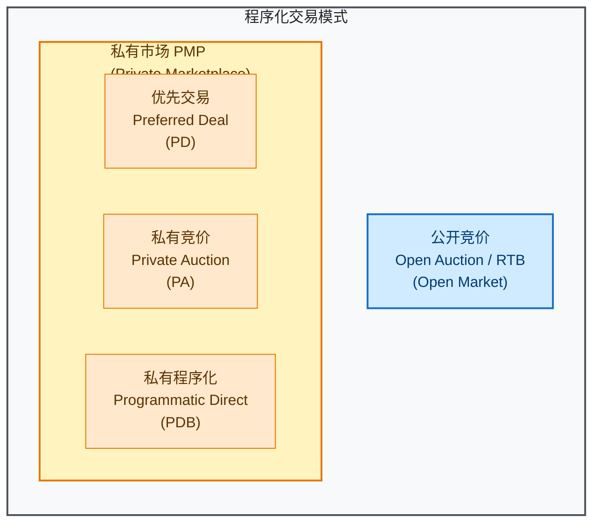

# 第 2 章 程序化广告生态与 RTB

---

## 本章导读

上一章（第 1 章）介绍了计算广告的商业本质与核心指标体系。本章聚焦**程序化购买（Programmatic Buying）生态**——这是理解所有外部流量交易的基础框架。

读完本章，你将能够回答：

- 程序化购买是怎么从人工买量一步步演化来的？
- 生态里有哪些角色（DSP / SSP / ADX / DMP），它们各自的利益和职责是什么？
- RTB 竞价在 100ms 内究竟发生了什么？
- OpenRTB 协议的关键字段是什么？DSP 如何在超时限制内完成出价？
- 公开竞价、私有市场（PMP）、Header Bidding 各有什么区别？
- 「轻氧奶茶」的一次曝光机会，是如何在程序化生态中被竞价的？

> **衔接提示**：本章重点是程序化（外部）交易模式。第 3 章起讲大媒体（如悦读 App）内部的投放引擎——大媒体的核心流量走**站内闭环**，程序化交易只是其补充或对外售卖渠道。

---

## 2.1 从人工买量到程序化：历史演化

### 2.1.1 人工直销时代

互联网广告最初的运作方式极为原始：广告主找到媒体（如门户网站），与销售人员面对面谈价格、拍摄期、版位，然后把 Banner 图片发给编辑，编辑手动嵌入页面。

**痛点一览**：

| 参与方 | 痛点 |
|--------|------|
| 广告主 | 只能按"包天/包周"粗粒度采购，无法精准锁定目标人群，大量预算浪费在无效曝光 |
| 媒体 | 销售团队成本高；大量长尾广告位（底部、边栏）卖不出去，空置浪费 |
| 双方 | 流程慢（签合同周期以天计），无法实时调整策略 |

### 2.1.2 广告网络（Ad Network）时代

广告网络（Ad Network，简称 Ad Net）出现在 2000 年代初期。它的商业模式是：**批量采购媒体剩余流量（Remnant Inventory），打包重售给广告主**。

```
广告主 → [Ad Network] → 批量采购多个媒体的剩余流量 → 统一投放
```

代表公司：DoubleClick（后被 Google 收购）、ValueClick、24/7 Real Media。

**改善了什么**：广告主只需对接一个 Ad Network，就能触达多个媒体的受众。媒体的长尾库存有了出路。

**新的痛点**：

- **不透明**：广告主不知道广告究竟投在了哪些媒体，怕品牌安全问题（广告出现在低质内容旁边）。
- **粗放定向**：Ad Network 的数据能力有限，人群划分很粗。
- **价格僵化**：仍然是"批量包价"，没有按每次曝光独立定价的机制。
- **效率损耗**：Ad Network 从差价中抽取大量利润，广告主和媒体双方实际收益被压缩。

### 2.1.3 程序化购买（Programmatic Buying）时代

2009 年前后，以 Google DoubleClick Ad Exchange 和 AppNexus 为代表的**广告交易所（Ad Exchange，ADX）**兴起，带来了真正的革命：

> **程序化购买（Programmatic Buying）**：通过算法和自动化技术，以**曝光为最小单位**（per-impression），在广告主与媒体之间进行实时撮合与交易的机制。

其核心创新是 **RTB（Real-Time Bidding，实时竞价）**：每一次页面加载、每一次 App 启动时产生的每一个广告位，都是一次独立的"微拍卖"，在用户等待页面加载的 100 毫秒内完成竞价、结算，并返回胜出的广告创意。

**演化时间线**：

```
1994  ── 第一个 Banner 广告（HotWired）
          ↓
2000  ── Ad Network 兴起（批量打包剩余流量）
          ↓
2007  ── DoubleClick 被 Google 收购（$31亿）
          ↓
2009  ── Google AdX 2.0 上线，RTB 机制正式成熟
          ↓
2010  ── DSP（需求方平台）、SSP（供应方平台）生态完善
          ↓
2012  ── 移动端程序化广告爆发（App流量）
          ↓
2015  ── Header Bidding 崛起（挑战瀑布流）
          ↓
2018  ── GDPR 实施，数据隐私合规成为核心议题
          ↓
2021  ── Apple ATT 框架（IDFA 限制），归因体系重构
```

---

## 2.2 程序化生态角色详解

程序化广告生态由多个角色共同构成，形成一个完整的供需撮合市场。下面逐一解析。

### 2.2.1 广告主（Advertiser）

**定义**：希望通过广告实现商业目标的品牌方或效果广告主。

**职责**：
- 设定广告投放目标（品牌曝光、App 下载、注册转化等）
- 制定出价策略（CPC、CPM、CPA、oCPM 等，详见第 9 章）
- 提供广告素材（Banner、视频、原生内容）
- 设置目标人群（地域、年龄、兴趣、行为）

**利益诉求**：
- **最大化 ROI**：以尽可能低的成本获得目标转化
- **人群精准**：广告触达真正有购买意愿的用户，减少浪费
- **透明可控**：知道广告投在哪里、花了多少、带来了什么效果
- **品牌安全**：广告不出现在低质或有争议的内容旁边

**本教程例子**：「轻氧奶茶」，连锁奶茶品牌，日预算 10 万元，目标转化成本（注册+首单）≤ 30 元。

### 2.2.2 媒体（Publisher）

**定义**：拥有用户流量、提供广告展示空间的内容平台。

**职责**：
- 管理广告位（Ad Slot / Ad Inventory）：位置、尺寸、频次
- 接入变现技术（广告 SDK、Header Bidding 代码）
- 维护用户体验：不过度商业化，保持内容质量
- 提供流量数据给 SSP，支持广告定向

**利益诉求**：
- **最大化 eCPM**（有效千次展示收益）：将每个广告位的价值最大化
- **填充率（Fill Rate）最大化**：避免广告位空置（填充率=有广告的请求数/总请求数）
- **用户体验**：广告不影响用户留存
- **数据主权**：控制用户数据，不让第三方过度采集

**本教程例子**：「悦读 App」，日活 5000 万用户的小说阅读 App，信息流广告位是核心变现资产。

### 2.2.3 DSP（Demand-Side Platform，需求方平台）

**定义**：为广告主服务的技术平台，帮助广告主跨多个 ADX / SSP 进行自动化的广告采购和投放管理。

**核心功能**：
- **受众定向**：接入 DMP 数据，精准圈定目标人群
- **实时出价**：在 RTB 竞价中，根据每次曝光的用户价值实时计算 bid price
- **投放管理**：预算控制、频次上限、创意轮播、A/B 测试
- **效果追踪**：统计曝光、点击、转化，计算 ROAS

**关键技术**：
- **CTR/CVR 预估模型**（详见第 7 章）：预测该用户点击该广告的概率
- **出价引擎**（详见第 10 章）：将预估的用户价值转化为合适的 bid price
- **用户 ID 同步**：与 DMP、ADX 进行 Cookie Sync / IDFA 映射

**利益诉求**：
- 帮助广告主以尽可能低的成本完成目标（出价不能太高），同时赢得足够的流量（出价不能太低）
- 平台自身收取管理费（一般是媒体消费额的 10%~20%）或按服务合同计费
- 建立差异化壁垒：更精准的人群模型、更智能的出价算法

**代表产品**：Google DV360、The Trade Desk（TTD）、Xandr（原 AppNexus）、MediaMath；国内有品友互动、巨量引擎 DMP 系等。

### 2.2.4 SSP（Supply-Side Platform，供应方平台）

**定义**：为媒体（Publisher）服务的技术平台，帮助媒体将广告位接入多个 ADX 进行变现，最大化广告收益。

**核心功能**：
- **流量接入**：将媒体广告位打包成统一格式（OpenRTB）对外售卖
- **底价管理（Floor Price）**：设置每个广告位的最低可接受价格，保护媒体利益
- **Yield Optimization（收益优化）**：智能选择最高出价的需求来源
- **广告质量审查**：过滤低质/违规广告，保护媒体品牌

**利益诉求**：
- 帮媒体把广告位卖出更高的价格（eCPM 最大化）
- 填充率最大化：确保广告位不空置
- 自身按媒体广告收入的 10%~20% 抽成

**代表产品**：Magnite（原 Rubicon Project）、PubMatic、Index Exchange、OpenX；国内有广点通 SSP、穿山甲（字节）等。

### 2.2.5 ADX（Ad Exchange，广告交易所）

**定义**：撮合 DSP（买方）和 SSP（卖方）的中立市场，负责运行实时竞价拍卖。

**核心功能**：
- **拍卖引擎**：并行广播 bid request 给多个 DSP，收集 bid response，按规则（一般是 GSP 二价）选出胜出者
- **协议标准化**：实现 OpenRTB 协议，统一多方通信格式
- **反作弊**：过滤机器流量（IVT，Invalid Traffic），保证流量真实性（详见第 12 章）
- **结算**：处理买卖双方的资金结算

**ADX 的竞争壁垒**：
- **流量规模**：接入的媒体越多，竞争越充分，价格越高
- **增值服务**：CTR 预估、反作弊、受众扩展等工具帮助 DSP 出更精准的价
- **数据资产**：跨站用户行为数据（即将受隐私法规限制）

**利益诉求**：
- 赚取买卖差价（一般 5%~15%）
- 最大化平台上的 GMV（成交总额）

**代表产品**：Google Ad Manager（原 DoubleClick AdX）、Xandr Marketplace；国内有百度 ADX、阿里汇川、腾讯广汇等。

> **注意**：现实中 DSP/SSP/ADX 边界常有模糊。Google 同时运营 DV360（DSP）+ Google Ad Manager（SSP+ADX），这种垂直整合引发了反垄断诉讼（2023年 DoJ 起诉 Google）。

### 2.2.6 DMP（Data Management Platform，数据管理平台）

**定义**：集中存储、处理和激活用户数据的平台，为程序化广告提供精准受众定向的数据基础设施。

**核心功能**：
- **数据采集**：汇聚 First-Party（广告主自有数据：CRM、购买记录）、Second-Party（合作伙伴数据）、Third-Party（第三方数据提供商）
- **用户画像（User Profile）构建**：将多源数据融合，生成用户标签（年龄、兴趣、消费能力、行为意图）
- **受众细分（Audience Segmentation）**：将用户划分为可复用的"人群包（Audience Segment）"
- **ID 同步（ID Sync）**：在不同平台间对齐用户标识（Cookie、IDFA、手机号哈希）
- **Lookalike（相似人群扩展）**：基于种子用户找到相似的潜在新用户

**利益诉求**：
- 作为独立 DMP 向 DSP / 广告主收取数据授权费
- 提高广告定向精准度，帮助广告主实现更好的 ROI
- 数据价值变现（受 GDPR、CCPA 等隐私法规严格约束）

**代表产品**：Salesforce DMP（原 Krux）、Oracle BlueKai、Adobe Audience Manager；国内有智慧推送（百度）、友盟等。

> **趋势**：随着 Cookie 消亡和 IDFA 限制，传统第三方 DMP 面临严峻挑战，**CDP（Customer Data Platform，客户数据平台）** 和 First-Party 数据策略兴起。

### 2.2.7 Ad Network（广告网络）

在程序化时代，Ad Network 并未消失，而是演化为：
- **专注细分垂类**：如视频广告网络、移动游戏广告网络、本地广告网络
- **自有流量打包**：部分 Ad Network 直接签约大量中小媒体，作为独立 SSP 出现
- **Performance Network**：专注效果广告，如联盟营销（CPA 结算）

与程序化 ADX 的区别：Ad Network 对流量来源**不一定完全透明**，而 ADX 理论上是公开市场。

### 2.2.8 Trading Desk / ATD（Agency Trading Desk，代理商程序化购买平台）

**定义**：4A 广告代理公司（如 WPP、Publicis、IPG）内部专门负责程序化购买的技术运营团队，使用 DSP 为旗下品牌客户服务。

**职责**：
- 使用 DSP 的技术能力，代替广告主做策略规划、执行、优化
- 汇聚多个客户的数据和采购量，获得更强的议价能力
- 提供数据分析、创意测试、多渠道归因等增值服务

**与独立 DSP 的区别**：ATD 是代理层（Agency），DSP 是技术工具层。ATD 使用 DSP 的系统来执行，但服务链路更长，费用层级也更多。

---

## 2.3 生态关系全景图

理解了各角色后，我们来看它们如何在一次 RTB 交易中协作：



**资金流向**（与数据流相反）：

```
广告主 → DSP（收管理费） → ADX（收差价） → SSP（收佣金） → 媒体（拿大头）
```

典型的费用分配（以 100 元广告主消费为例）：

| 层级 | 收费 | 到手金额 |
|------|------|---------|
| DSP 管理费 | 约 15% | 广告主付 100，DSP 净入 ~15 |
| ADX 佣金 | 约 10% | 流入 ADX 的约 85，ADX 留 ~8.5 |
| SSP 佣金 | 约 10% | 流入 SSP 的约 76.5，SSP 留 ~7.6 |
| **媒体实收** | — | **约 68.9 元**（剩余 ~69%） |

> 这也是为什么 Header Bidding 兴起后媒体热情高涨——它绕过了某些中间层，媒体实收更高。

---

## 2.4 RTB 实时竞价原理

### 2.4.1 核心思想：每次曝光是一次独立的微拍卖

RTB（Real-Time Bidding，实时竞价）的本质是：

> **将每一次广告曝光机会拆分为一个独立的「商品」，通过实时拍卖机制卖给出价最高（且满足条件）的买家。**

**与传统包价采购的对比**：

| 维度 | 传统包价/Ad Network | RTB 程序化竞价 |
|------|-------------------|----------------|
| 定价粒度 | 按天/周/月包版位 | 按每次曝光（per-impression）定价 |
| 决策时机 | 提前几天/周谈判 | 用户打开页面的瞬间，100ms内决策 |
| 买家数量 | 1对1谈判 | 多个 DSP 同时竞争同一个曝光机会 |
| 价格形成 | 协商定价（人为主观） | 市场化竞价（需求决定价格）|
| 用户定向 | 粗粒度（按版位/频道）| 细粒度（面向具体用户特征）|
| 数据利用 | 有限 | 实时融合多源数据（DMP + 行为数据）|

### 2.4.2 为什么能在 100ms 内完成？

人眼察觉到广告"加载"需要约 200ms，HTTP 请求往返（国内跨地区）约 20~80ms。因此广告系统实际可用时间约 **100~150ms**。

这 100ms 内需要完成：

1. **媒体 → SSP**：广告位触发，封装 bid request（~5ms）
2. **SSP → ADX**：打包路由（~5ms）
3. **ADX → DSP**（并行广播）：网络传输 ~10~30ms
4. **DSP 内部处理**：
   - 用户 ID 查询 DMP 标签（~5ms，内存/Redis）
   - CTR/CVR 预估（~5~15ms，在线推理）
   - 出价计算（~2ms）
5. **DSP → ADX**：返回 bid response（~10~30ms）
6. **ADX 选胜者 + 返回 SSP**：（~5ms）
7. **SSP → 媒体 + 下载创意**：（~10ms）

每一个环节都经过极致优化：
- DSP 用 Redis/内存缓存用户画像（不走数据库）
- CTR 模型用 GBDT 或轻量神经网络（不用大模型）
- ADX 用异步并发广播，不等所有 DSP 响应，超时直接用已收到的最高价

---

## 2.5 RTB 竞价全流程时序图

以「悦读 App」用户触发广告位为例，完整的 RTB 交互时序如下：



**关键节点解析**：

| 时间节点 | 发生了什么 | 技术要点 |
|---------|-----------|---------|
| t=0ms | 用户触发广告位 | App SDK 在后台静默发起广告请求 |
| t≈5ms | SSP 设置底价 | Floor Price 保护媒体最低收益 |
| t≈15ms | ADX 并行广播 | 同一个 bid request 发给 N 个 DSP |
| t≈15~80ms | DSP 并行决策 | 各 DSP 独立完成用户分析+出价 |
| t=tmax | 超时截断 | DSP-C 超时，响应被丢弃（不参与竞价）|
| t≈85ms | ADX 拍卖 | GSP 二价：第一名出价 5.2，按第二名 4.8+0.01=4.81 结算 |
| t≈95ms | 返回创意 | adm（ad markup）是 HTML/JS 片段或图片 URL |
| t>100ms | 异步上报 | 曝光/点击/转化上报不占关键路径 |

---

## 2.6 OpenRTB 协议详解

OpenRTB（Open Real-Time Bidding）是 IAB（互动广告局，Interactive Advertising Bureau）制定的竞价请求/响应标准协议，目前主流版本为 **OpenRTB 2.5 / 2.6**。

### 2.6.1 Bid Request（竞价请求）核心字段

```json
{
  "id": "7f3b8e2a-1234-5678-abcd-ef0123456789",
  "tmax": 100,
  "at": 2,
  "imp": [
    {
      "id": "1",
      "banner": {
        "w": 320,
        "h": 50,
        "format": [
          {"w": 320, "h": 50},
          {"w": 300, "h": 250}
        ]
      },
      "native": null,
      "video": null,
      "bidfloor": 3.5,
      "bidfloorcur": "CNY",
      "secure": 1,
      "ext": {
        "placement_id": "yuedu_feed_001",
        "slot_type": "infeed"
      }
    }
  ],
  "app": {
    "id": "yuedu_app_ios",
    "name": "悦读App",
    "bundle": "com.yuedu.reader",
    "storeurl": "https://apps.apple.com/app/yuedu/id123456",
    "cat": ["IAB1-7"],
    "ver": "5.2.1",
    "publisher": {
      "id": "pub_yuedu_001",
      "name": "悦读传媒"
    }
  },
  "device": {
    "ua": "Mozilla/5.0 (iPhone; CPU iPhone OS 16_5 like Mac OS X)...",
    "ip": "120.244.x.x",
    "devicetype": 4,
    "os": "iOS",
    "osv": "16.5",
    "make": "Apple",
    "model": "iPhone 14",
    "language": "zh",
    "carrier": "中国移动",
    "connectiontype": 2,
    "ifa": "A1B2C3D4-E5F6-7890-ABCD-EF1234567890",
    "geo": {
      "lat": 31.2304,
      "lon": 121.4737,
      "country": "CHN",
      "city": "上海",
      "region": "Shanghai"
    }
  },
  "user": {
    "id": "user_hash_abc123",
    "yob": 1995,
    "gender": "F",
    "customdata": "eyJzZWdfaWRzIjpbImZhc2hpb24iLCJmb29kIl19",
    "ext": {
      "consent": "1",
      "segment_ids": ["seg_female_25_34", "seg_tea_lover", "seg_shanghai"]
    }
  },
  "bcat": ["IAB25", "IAB26"],
  "badv": ["competitor-brand.com"],
  "cur": ["CNY"],
  "ext": {
    "ssp_id": "pubmatic_cn",
    "adx_id": "adx_alibaba"
  }
}
```

**核心字段解析**：

| 字段 | 类型 | 含义 | 关键细节 |
|------|------|------|---------|
| `id` | string | 竞价请求唯一 ID | 用于追踪和去重 |
| `tmax` | int | DSP 必须在 tmax 毫秒内响应，否则超时丢弃 | **通常 80~150ms**；超时就当 no bid |
| `at` | int | 拍卖类型：1=第一价格（First Price），2=第二价格（GSP）| 近年趋势是向 First Price 迁移 |
| `imp[].bidfloor` | float | 该广告位底价（CPM，Currency 单位）| 低于底价的出价直接无效 |
| `imp[].bidfloorcur` | string | 底价货币单位 | 跨国投放需注意汇率 |
| `imp[].secure` | int | 1=要求 HTTPS | 非 secure 环境下 HTTP 创意也可投 |
| `app.bundle` | string | App 包名 | 用于反作弊（验证 bundle 是否真实）|
| `device.ifa` | string | 广告标识符（IDFA/GAID）| 苹果 ATT 后可能为空 |
| `device.ip` | string | 用户 IP | 用于地理定向，通常做截断保护隐私 |
| `user.id` | string | SSP/ADX 的用户 ID | DSP 需通过 ID Sync 映射到自己的用户 ID |
| `bcat` | array | 禁投广告类别（IAB 分类）| 如 IAB25=非法内容，IAB26=暴力 |
| `badv` | array | 禁投广告主域名 | 竞争对手隔离 |

### 2.6.2 Bid Response（竞价响应）核心字段

```json
{
  "id": "7f3b8e2a-1234-5678-abcd-ef0123456789",
  "seatbid": [
    {
      "bid": [
        {
          "id": "bid_qingyang_001",
          "impid": "1",
          "price": 5.20,
          "adid": "ad_qingyang_banner_001",
          "nurl": "https://tracking.qingyang-dsp.com/win?price=${AUCTION_PRICE}&bid_id=bid_qingyang_001",
          "burl": "https://tracking.qingyang-dsp.com/loss?bid_id=bid_qingyang_001",
          "adm": "<a href='https://qingyang.com/landing?utm_source=rtb&creative=001' target='_blank'></a>",
          "adomain": ["qingyang.com"],
          "crid": "creative_qingyang_summer_v3",
          "cat": ["IAB8-18"],
          "w": 320,
          "h": 50,
          "lurl": "https://tracking.qingyang-dsp.com/loss?bid_id=bid_qingyang_001",
          "ext": {
            "dsp_id": "dsp_qingyang",
            "campaign_id": "camp_shanghai_q3",
            "adgroup_id": "adgrp_female_25_34"
          }
        }
      ],
      "seat": "qingyang_seat_001"
    }
  ],
  "cur": "CNY"
}
```

**核心字段解析**：

| 字段 | 类型 | 含义 | 关键细节 |
|------|------|------|---------|
| `seatbid[].bid[].price` | float | **DSP 出价（CPM）** | ADX 按此价格进行拍卖比较 |
| `seatbid[].bid[].nurl` | string | **Win Notice URL**（胜出通知 URL）| ADX 在胜出时回调此 URL，传入实际结算价 `${AUCTION_PRICE}` |
| `seatbid[].bid[].burl` | string | 竞价失败通知 URL | 用于 DSP 做出价策略分析 |
| `seatbid[].bid[].adm` | string | **Ad Markup（广告创意内容）** | 通常是 HTML/JS 片段，包含展示 URL 和监测像素 |
| `seatbid[].bid[].adomain` | array | 广告主域名 | 用于底价校验、品牌安全过滤 |
| `seatbid[].bid[].crid` | string | 创意 ID | 用于频控、审核、归因 |
| `seatbid[].bid[].nurl` 中的宏 | macro | `${AUCTION_PRICE}` | ADX 在回调 nurl 时替换为实际结算价（做 URL encode） |

### 2.6.3 超时控制（tmax）：DSP 的生死线

`tmax` 字段是整个 RTB 系统中**最关键的工程约束**之一。

```python
# 伪代码：DSP 竞价服务的超时控制逻辑

import asyncio
import time

async def handle_bid_request(bid_request: dict) -> dict | None:
    """
    处理 Bid Request，在 tmax 毫秒内必须返回响应。
    超过 tmax，ADX 会直接丢弃本次出价，当作 no-bid 处理。
    """
    tmax_ms = bid_request.get("tmax", 100)
    start_time = time.monotonic()
    
    # 给自己留 10ms 网络传输余量，实际可用时间更短
    safe_timeout = (tmax_ms - 15) / 1000.0  # 转换为秒
    
    try:
        result = await asyncio.wait_for(
            _process_bid(bid_request),
            timeout=safe_timeout
        )
        
        elapsed_ms = (time.monotonic() - start_time) * 1000
        if elapsed_ms > tmax_ms * 0.8:
            # 即使成功，也记录慢查询告警
            log_slow_bid(bid_request["id"], elapsed_ms)
        
        return result
        
    except asyncio.TimeoutError:
        # 超时：记录日志、更新统计，返回 no-bid（空响应）
        log_timeout(bid_request["id"], tmax_ms)
        return None  # ADX 会将空响应视为放弃本次竞价

async def _process_bid(bid_request: dict) -> dict:
    """
    DSP 内部竞价决策：并行执行各步骤以节省时间。
    """
    imp = bid_request["imp"][0]
    user = bid_request.get("user", {})
    device = bid_request.get("device", {})
    
    # 并行执行：用户画像查询 + 频次检查 + 预算检查
    user_profile, freq_count, budget_ok = await asyncio.gather(
        fetch_user_profile(user.get("id")),       # Redis 查询 ~5ms
        check_frequency_cap(user.get("id")),       # Redis 查询 ~3ms
        check_budget_available(),                   # 内存查询 ~1ms
    )
    
    # 快速过滤：不满足条件直接 no-bid
    if not budget_ok or freq_count >= MAX_FREQ:
        return None
    
    # CTR/CVR 预估（本地模型推理，~5~15ms）
    features = extract_features(user_profile, imp, device)
    pctr = ctr_model.predict(features)        # ~10ms
    pcvr = cvr_model.predict(features)        # ~5ms
    
    # 出价计算：eCPM = pCTR × pCVR × CPA目标 × 1000 / CTR修正
    # 详见第 10 章
    target_cpa = 30.0  # 轻氧奶茶目标转化成本 30元
    bid_price = pctr * pcvr * target_cpa * 1000  # 转换为 CPM
    
    # 检查底价
    floor_price = imp.get("bidfloor", 0)
    if bid_price < floor_price:
        return None  # 出价低于底价，放弃
    
    return {
        "id": bid_request["id"],
        "seatbid": [{
            "bid": [{
                "id": f"bid_{bid_request['id']}",
                "impid": imp["id"],
                "price": round(bid_price, 4),
                "adm": select_creative(features),
                "nurl": build_win_notice_url(bid_request["id"]),
                "adomain": ["qingyang.com"],
                "crid": "creative_qingyang_summer_v3",
            }],
            "seat": "qingyang_seat_001"
        }]
    }
```

**超时的影响**：
- DSP 超时率过高 → ADX 可能降低对该 DSP 的 QPS 分配，甚至将其从竞价池中移除
- 一般 DSP 要求 P99 响应延迟 < tmax × 80%（留 20% 网络余量）

---

## 2.7 交易模式分类

并非所有程序化交易都走公开 RTB。市场上存在多种交易模式，各有适用场景。

### 2.7.1 四种交易模式对比



| 维度 | 公开竞价(Open RTB) | 优先交易(PD) | 私有竞价(PA) | 私有程序化(PDB) |
|------|-------------------|-------------|-------------|----------------|
| **别称** | Open Market / Open Auction | Preferred Deal | Private Auction | Programmatic Guaranteed / Direct |
| **参与买家** | 所有接入 ADX 的 DSP | 特定 DSP（1对1） | 特定 DSP 白名单 | 特定 DSP（1对1） |
| **是否竞价** | 是 | 否（固定价）| 是 | 否（固定价）|
| **是否保量** | 否 | 否 | 否 | **是**（保证曝光量）|
| **价格类型** | 市场化竞价价格 | 双方协商固定 CPM | 竞价（底价更高）| 双方协商固定 CPM |
| **媒体优先级** | 最低（处理公开流量）| 中等 | 中等 | **最高**（优先于公开 RTB）|
| **典型场景** | 长尾流量、效果广告 | 品牌广告主想"优先看价"| 品牌广告主有选择权的竞价 | 重要节点（双11、超级碗）的核心位置锁量 |
| **eCPM 水平** | 市场均价 | 高于公开市场 | 高于公开市场 | 最高（溢价锁量）|

### 2.7.2 优先交易（PD，Preferred Deal）

媒体与特定广告主/DSP 提前谈好一个固定价格，DSP **有优先机会**以该价格购买流量，但不保证量——如果 DSP 不接受，流量进入下一个竞价层级。

**适用场景**：广告主想优先购买某媒体的高质量版位（如首屏），但不想承诺固定量。

### 2.7.3 私有竞价（PA，Private Auction）

媒体创建一个"邀请制"的竞价圈，只有白名单内的 DSP 才能参与。底价通常高于公开市场。

**适用场景**：媒体想卖出更高价，同时控制谁能买自己的流量（品牌安全）。

### 2.7.4 私有程序化购买（PDB，Programmatic Direct / Guaranteed）

这是**最接近传统直销**的程序化交易：媒体与广告主提前签约，承诺固定价格+固定曝光量，用程序化技术自动执行。

**特点**：
- 媒体**保留广告位**给该广告主（Guaranteed Inventory）
- 广告主可以实现精准定向（不像传统直销只能定版位）
- 价格最高（媒体最爱），广告主也接受（锁量确定性）

**适用场景**：品牌大客户在重要节点（节假日、产品上市）必须拿到核心版位。

### 2.7.5 优先级规则

当一个广告位同时接入多种交易模式时，填充顺序（优先级）通常为：

```
PDB（保量优先）> PA > PD > 公开 RTB（Open Auction）
```

---

## 2.8 Header Bidding：对瀑布流的颠覆

### 2.8.1 什么是瀑布流（Waterfall）

在 Header Bidding 出现之前，媒体通常使用**瀑布流（Waterfall）**来决定哪个需求方填充广告位：

```
媒体广告服务器
  └── 第1优先级：直销广告（Direct Sold）
        └── 若没填满 → 第2优先级：ADX-A（历史 eCPM 最高者）
                        └── 若没填满 → 第3优先级：ADX-B
                                        └── 若没填满 → 第4优先级：Ad Network
                                                        └── 若没填满 → 兜底广告/House Ad
```

**瀑布流的问题**：

1. **不是真正的价格竞争**：ADX 的优先级是按**历史平均 eCPM** 静态设置的，不是实时竞价。ADX-B 即使某次出价更高，也因优先级低而无法赢得该曝光。
2. **媒体收益受损**：高优先级的 ADX 可能用较低的价格"截走"流量，后面的 ADX 虽然愿意出更高价却没机会。
3. **延迟高**：各 ADX 串行尝试，如果前几个填充失败，总延迟叠加增大。

### 2.8.2 Header Bidding 的解法

**Header Bidding（头部竞价）**：让多个 DSP/ADX **并行**在客户端（浏览器或 App）提交出价，媒体服务器收集所有出价后，选最高价者，再统一进入广告服务器投放。

**工作原理（Web 端）**：

```html
<!-- 页面 <head> 中嵌入 Header Bidding 库（如 Prebid.js）-->
<script src="https://cdn.jsdelivr.net/npm/prebid.js/dist/prebid.js"></script>
<script>
  var adUnits = [{
    code: 'div-gpt-ad-yuedu-feed-001',
    mediaTypes: { banner: { sizes: [[320, 50], [300, 250]] } },
    bids: [
      { bidder: 'appnexus', params: { placementId: 12345 } },
      { bidder: 'rubicon', params: { accountId: 1001, siteId: 2002, zoneId: 3003 } },
      { bidder: 'pubmatic', params: { publisherId: '111122', adSlot: 'yuedu_feed_001' } }
    ]
  }];
  
  pbjs.que.push(function() {
    pbjs.addAdUnits(adUnits);
    pbjs.requestBids({
      timeout: 1500,  // 所有 bidder 并行出价，超时截断
      bidsBackHandler: function() {
        // 收集所有出价，找最高价
        var highestBid = pbjs.getHighestCpmBids('div-gpt-ad-yuedu-feed-001')[0];
        // 将胜出出价注入 Google Ad Manager 的 Key-Value
        googletag.pubads().setTargeting('hb_pb', highestBid.cpm.toFixed(2));
        googletag.pubads().setTargeting('hb_adid', highestBid.adId);
        googletag.display('div-gpt-ad-yuedu-feed-001');
      }
    });
  });
</script>
```

**Header Bidding vs 瀑布流对比**：

| 维度 | 瀑布流（Waterfall） | Header Bidding |
|------|-------------------|----------------|
| 竞价方式 | 串行，按优先级依次尝试 | **并行**，所有 DSP 同时出价 |
| 价格发现 | 历史静态 eCPM 决定优先级 | **真实市场价格**决定胜者 |
| 媒体收益 | 较低（高优先级低价截流）| **更高**（充分竞争）|
| 延迟 | 串行叠加，较高 | 并行，通常更低 |
| 实现复杂度 | 简单 | 复杂（需要客户端集成、服务端对接）|
| 数据透明度 | 低 | 高（媒体能看到每个 DSP 的出价）|

**Server-Side Header Bidding（服务端头部竞价）**：

在 App 中，由于 JavaScript 不适用，通常采用**服务端头部竞价**——媒体服务器（或 SSP 的头部竞价服务）代替客户端，并行向多个 DSP 发送竞价请求，再把最高价注入广告决策中。

---

## 2.9 结算机制简述：GSP 广义第二价格

RTB 竞价中，最常见的结算机制是 **GSP（Generalized Second Price，广义第二价格）**：

$$\text{结算价} = \max(\text{第二名出价}, \text{底价}) + \epsilon$$

其中 $\epsilon$ 通常为 $0.01$ 元（最小货币单位）。

**直觉解释**：
- 出价最高的广告主赢得曝光，但不用付自己出的价格，只需比第二名多付一点点。
- 这一机制鼓励**如实出价（Truthful Bidding）**：出价高于真实价值没有意义（赢了但亏钱），出价低于真实价值可能错失本应赢得的曝光。

**示例**：

| DSP | 出价（CPM） | 备注 |
|-----|-----------|------|
| 轻氧奶茶 DSP | 5.20 | 胜出 |
| 竞品 DSP | 4.80 | 第二名 |
| 底价 | 3.50 | 媒体保护价 |

结算价 = $4.80 + 0.01 = 4.81$ 元 CPM。

> **注意**：近年来广告市场向 **First Price Auction（第一价格拍卖）**迁移——Google AdX 在 2019 年切换到了统一价格拍卖（Unified First Price Auction）。第一价格拍卖中，胜者按自己的出价结算，因此 DSP 需要引入"价格缩减（Bid Shading）"策略以避免赢家诅咒（Winner's Curse）。GSP、VCG 机制与拍卖博弈详见**第 8 章**。

---

## 2.10 各方博弈：利益冲突与平衡

程序化生态不是和谐的"多赢"，各方都有自己的私利，形成复杂的博弈关系。

### 2.10.1 SSP 的博弈策略

**目标**：最大化媒体收益（eCPM × 填充率）。

**常见策略**：
- **动态底价（Dynamic Floor Price）**：根据 DSP 的历史出价行为动态调整底价。如果某 DSP 经常出高价，则对其提高底价，挤出更多收益。这被称为**底价套利**，引发了 DSP 的强烈反弹。
- **供给路径优化（Supply Path Optimization，SPO）**：DSP 意识到可以绕过某些高抽成 SSP，直接对接低抽成 SSP 或 ADX，来获得相同流量。SSP 不得不降价竞争。

### 2.10.2 DSP 的博弈策略

**目标**：以尽可能低的价格赢得目标曝光，为广告主最大化 ROI。

**常见策略**：
- **出价缩减（Bid Shading）**：在第一价格拍卖中，DSP 不出真实价值，而是预测清算价并贴近出价，避免出价过高浪费（详见第 10 章）。
- **需求路径优化（Demand Path Optimization，DPO）**：分析不同 SSP 的同一流量，选择抽成低的渠道接入。
- **反作弊（Anti-Fraud）**：SSP/ADX 可能掺入虚假流量。DSP 需要自建流量质量评分，对可疑流量出低价或拒绝出价（详见第 12 章）。

### 2.10.3 ADX 的竞争壁垒

ADX 要吸引 SSP（卖方）和 DSP（买方）双边接入，形成双边市场网络效应。其核心竞争力：

| 增值服务 | 说明 |
|---------|------|
| **流量规模** | 接入的媒体越多、DSP 越多，竞争越充分，价格越高 |
| **CTR 预估辅助** | 部分 ADX 帮没有强 ML 能力的 DSP 提供 CTR 预估 API |
| **反作弊体系** | 过滤 IVT（Invalid Traffic），为 DSP 提供流量质量背书 |
| **受众扩展** | 基于 ADX 的跨站数据，帮助 DSP 找到相似人群 |
| **协议统一** | 实现 OpenRTB 2.x / Native Ad 等标准，降低接入成本 |

### 2.10.4 数据不透明问题

程序化生态的一大痼疾是**数据不透明**：

- SSP 知道 DSP 的出价分布，但 DSP 不知道其他 DSP 出了多少
- 媒体不知道 DSP 对自己的流量估值多少（导致底价设定困难）
- 用户数据在多方之间流转，用户本身不知情

这是 GDPR、CCPA、Apple ATT 等隐私监管政策出台的背景，也是行业向**隐私计算（Privacy Preserving）**演进的驱动力。

---

## 2.11 「轻氧奶茶」竞价全程追踪

综合本章所有知识，我们来完整追踪「轻氧奶茶」的一次竞价。

### 2.11.1 前提设定

- **媒体**：悦读 App，接入了 ADX-A（阿里汇川）和 ADX-B（腾讯广汇），并启用了 Server-Side Header Bidding
- **轻氧奶茶**：在 DSP-X（某效果型 DSP）开设了投放计划，设置：
  - 定向：女性、25~34 岁、一线城市、有奶茶/饮品相关行为
  - 出价模式：oCPM（目标 CPA=30元）
  - 日预算：10万元
  - 频次上限：同一用户每天≤3次

### 2.11.2 竞价全程

**Step 1：用户触发**

```
用户：小张（女，28岁，上海，悦读App重度用户，近7天搜索过"奶茶"）
动作：上午10:15 打开悦读App，进入推荐页，滑动信息流
触发：App SDK 检测到信息流广告位（feed_slot_001），发起广告请求
```

**Step 2：SSP 处理**

```
SSP-A 收到请求：
- 查询该广告位历史 eCPM：约 4.2 CPM
- 设置底价：floor_price = 3.0 CNY CPM（动态底价）
- 封装 OpenRTB bid request：
  - user.id = "hash_xiaoz_001"
  - device.ifa = "A1B2-..." （IFA）
  - imp[0].bidfloor = 3.0
  - tmax = 100
```

**Step 3：Header Bidding 并行竞价**

```
SSP 同时向 ADX-A 和 ADX-B 发送 bid request（服务端并行）

ADX-A 收到后，广播给接入的所有 DSP（含 DSP-X 轻氧奶茶）
ADX-B 收到后，广播给接入的所有 DSP

DSP-X（轻氧奶茶）收到来自 ADX-A 的 bid request：
1. 查用户画像：
   - 性别：女 ✓
   - 年龄：28岁（25~34区间）✓
   - 城市：上海 ✓
   - 行为标签：[奶茶爱好者, 小说爱好者, 白领] ✓
   - 频次：今天已展示 1 次（< 上限3次）✓
   
2. CTR预估：
   features = [user_embedding, ad_embedding, context_features]
   pCTR = ctr_model.predict(features) = 2.1%
   
3. CVR预估：
   pCVR = cvr_model.predict(features) = 8.3%（预估注册+首单概率）
   
4. 出价计算：
   eCPM = pCTR × pCVR × CPA目标 × 1000
        = 0.021 × 0.083 × 30 × 1000
        = 52.29 元/千次（注：这是理论上限，实际会做折扣，详见第10章）
   
   经出价缩减后：bid_price = 5.2 CNY CPM
   
5. 检查：bid_price(5.2) > floor_price(3.0) ✓

DSP-X 返回 bid response：
{
  "price": 5.20,
  "adm": "...轻氧奶茶Banner创意...",
  "nurl": "https://dsp-x.com/win?price=${AUCTION_PRICE}"
}
```

**Step 4：ADX 拍卖**

```
ADX-A 收到的有效出价：
- DSP-X（轻氧奶茶）：5.20 CPM
- DSP-Y（某快消品）：4.80 CPM
- DSP-Z（某美妆品）：超时，出价被丢弃

拍卖结果：DSP-X 胜出
结算价（GSP 二价）= 4.80 + 0.01 = 4.81 CPM

ADX-A 胜出价：5.20
ADX-B 胜出价（假设）：4.50

Header Bidding 汇总：ADX-A(5.20) > ADX-B(4.50)
最终胜出：ADX-A + DSP-X（轻氧奶茶），结算价4.81 CPM
```

**Step 5：展示与上报**

```
t=97ms：悦读App信息流展示轻氧奶茶广告
t=97ms~：ADX 异步回调 DSP-X 的 nurl（传入结算价 4.81）
t=?：小张点击广告，跳转轻氧奶茶 H5 落地页
t=?：小张注册并下单，触发归因回传（Postback）
       → DSP-X 记录转化成本：4.81/1000（CPM→每次展示）+ 分摊... 
       → 归因与回传机制详见第13章
```

### 2.11.3 大媒体为什么走站内闭环

注意：上面的例子假设悦读 App 把流量卖到了外部 ADX。但现实中，**日活 5000 万的头部媒体**往往选择建立**站内广告投放引擎（闭环系统）**：

| 维度 | 接入外部 ADX（程序化） | 站内闭环系统 |
|------|----------------------|------------|
| **收益** | 扣除 SSP+ADX 佣金（~20~30%），媒体实收约 70% | 100% 收益归媒体 |
| **数据控制** | 用户数据暴露给第三方 | 用户数据完全自控 |
| **用户体验** | 广告质量不可控 | 可以精细化管理广告质量 |
| **延迟** | 引入外部网络 RTT | 本地决策，延迟更低 |
| **定向能力** | 依赖 DMP 的标签体系 | 利用自有一方数据（阅读行为、用户画像）|
| **适用场景** | 流量中长尾部分 | 核心优质版位 |

悦读 App 的典型策略：
- **核心版位**（首屏、精选推荐位）→ 站内投放引擎（自建广告系统）
- **长尾版位**（多级页面、低频触发）→ 接入外部 ADX 程序化变现（补量）

站内闭环系统的设计原理，从**第 3 章**起详细展开。

---

## 本章小结

本章系统介绍了程序化广告生态的全貌：

1. **历史演化**：人工买量 → Ad Network（打包剩余流量）→ RTB 程序化购买（每次曝光独立竞价）

2. **八大角色**：
   - 广告主（要 ROI）→ DSP（出价工具）→ ADX（拍卖市场）→ SSP（媒体代理）→ 媒体（要 eCPM）
   - DMP（数据燃料）、Ad Network（细分渠道）、Trading Desk（代理执行层）

3. **RTB 核心机制**：每个曝光是一次 100ms 内的独立微拍卖，超时的 DSP 出价被丢弃

4. **OpenRTB 协议**：
   - Bid Request 关键字段：`id`, `tmax`, `imp[bidfloor]`, `device`, `user`
   - Bid Response 关键字段：`seatbid.bid.price`, `nurl`（Win Notice）, `adm`（创意）

5. **交易模式**：公开 RTB（充分竞价）→ PMP（PA、PD、PDB，程度递增的私有化）→ 保量保价

6. **Header Bidding**：并行替代串行瀑布流，提升媒体收益，增加竞价透明度

7. **GSP 结算**：第一名出价赢，按第二名价格+$\epsilon$ 结算，鼓励真实出价

8. **各方博弈**：SSP 动态底价、DSP 出价缩减/反作弊、ADX 靠增值服务竞争

9. **轻氧奶茶案例**：通过完整的竞价追踪，将生态各角色串联起来

> **第 3 章预告**：了解了外部程序化生态后，接下来深入悦读 App 内部的广告投放引擎——这是一个从**定向检索 → 召回 → 粗排 → 精排 → 重排**的漏斗体系，每秒处理百万级广告请求，同时要将延迟控制在 50ms 以内。

---

## 参考来源

1. **IAB Tech Lab — OpenRTB Specification**  
   https://iabtechlab.com/standards/openrtb/  
   OpenRTB 2.5 / 2.6 / 3.0 协议官方规范文档

2. **IAB Tech Lab — Programmatic Supply Chain Transparency**  
   https://iabtechlab.com/standards/ads-txt/  
   ads.txt / sellers.json 供应链透明化标准

3. **Prebid.org — Header Bidding Documentation**  
   https://docs.prebid.org/  
   Header Bidding 开源实现（Prebid.js / Prebid Server）文档

4. **Google — Inside AdX: A Look at Real-Time Bidding**  
   https://support.google.com/admanager/answer/3423540  
   Google Ad Manager 关于实时竞价的官方说明

5. **AppNexus / Xandr — RTB Overview**  
   https://learn.microsoft.com/en-us/xandr/invest/rtb-overview  
   Xandr（Microsoft 旗下）RTB 机制说明

6. **《计算广告》，刘鹏、王超著，人民邮电出版社**  
   国内最系统的计算广告教材，第 4~6 章详述程序化生态

7. **DoJ v. Google (2023) — United States v. Google LLC Complaint**  
   https://www.justice.gov/opa/pr/justice-department-sues-google-monopolizing-digital-advertising-technologies  
   美国司法部起诉 Google 广告技术垄断的诉状，包含 DSP/SSP/ADX 生态的详细描述

8. **eMarketer — Programmatic Advertising 2024 Report**  
   https://www.emarketer.com/content/global-programmatic-advertising-2024  
   程序化广告市场规模与趋势数据

9. **Srinivasan, A. (2020) — The Antitrust Case Against Facebook, Google, Amazon, and Apple**  
   https://scholarship.law.columbia.edu/faculty_scholarship/2797  
   对平台广告生态垄断结构的学术分析

10. **Benjamin Edelman & Michael Schwarz (2010) — Optimal Auction Design and Equilibria with Discrete Bidding**  
    https://www.aeaweb.org/articles?id=10.1257/aer.100.2.597  
    GSP 拍卖机制设计的学术基础之一
