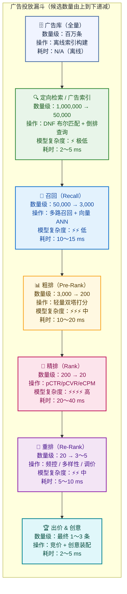
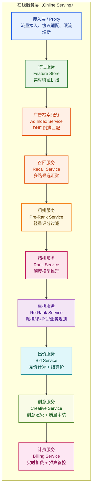
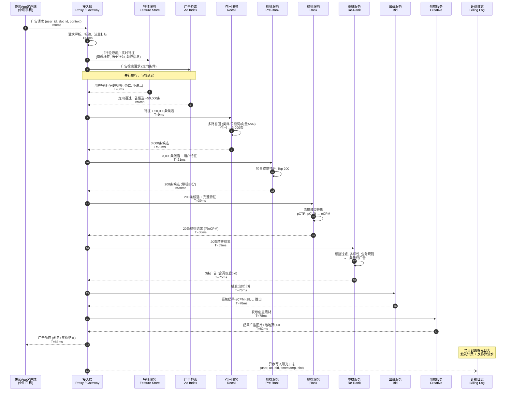
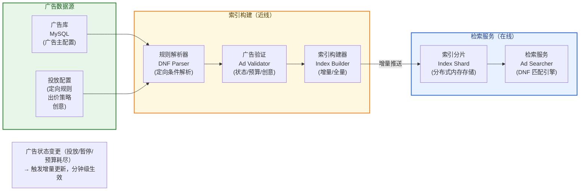
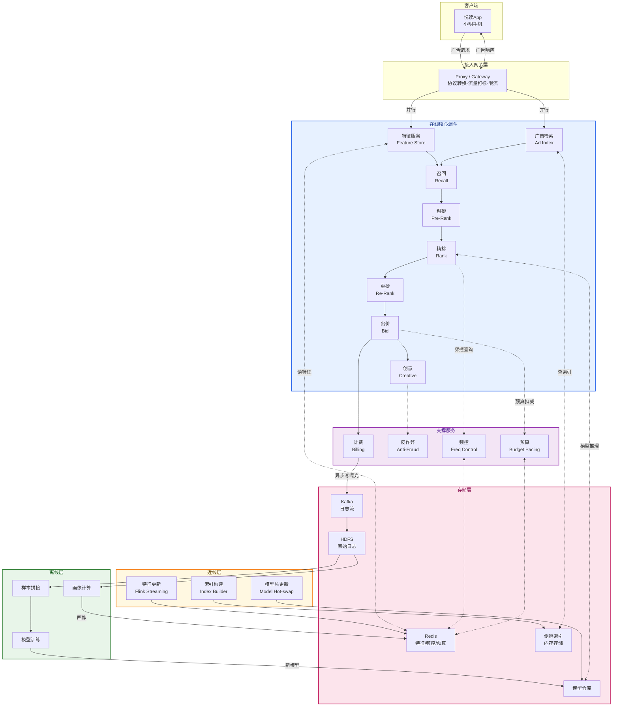

# 第 3 章 · 投放引擎总体架构

> **所属系列**：《广告投放系统设计 · 全景教程》第二部分 · 广告投放引擎全链路
> **上一章**：[第 2 章 · 程序化广告生态与 RTB](./02-程序化广告生态与RTB.md)
> **下一章**：[第 4 章 · 定向与广告检索](./04-定向与广告检索.md)

---

## 本章导读

前两章我们已经理解了广告的商业本质（第 1 章）和程序化交易生态（第 2 章）。第 2 章最后提到，DSP 收到一个 OpenRTB 竞价请求后，要在 **80–100 ms** 内决定：要不要出价、出多少钱、用哪条创意。这 100 ms 里究竟发生了什么？

本章回答这个问题——**站内投放引擎的总体架构**。

核心视角有三个：

1. **漏斗视角**：广告库里有数百万条广告，凭什么最终只展示一两条？为什么需要多层漏斗而不是一次搞定？
2. **时序视角**：一次广告请求在引擎内部的完整生命周期，谁先谁后、谁依赖谁。
3. **三层体系视角**：在线服务只是冰山一角，其背后的近线和离线体系是整个引擎的"基础设施"。

本章是第 4～8 章（定向/召回/粗排/精排/重排）的"导航图"——每一层的算法细节会在后续章节展开，本章只做架构级介绍，建立整体认知。

---

## 3.1 从一次广告请求说起

让我们从最具体的场景切入。

> 用户小明，男，28岁，在杭州，午休时打开「悦读 App」，下滑到信息流第 3 屏，触发了一次广告请求。

从小明下滑那一刻到他看见广告，大约 **80 毫秒**。这 80 毫秒里，悦读 App 的广告系统做了什么？

```
小明的手机 → 悦读App客户端 → 悦读广告服务器 → 投放引擎
                                              ↓
                               检索用户画像（兴趣标签：爱看玄幻、茶饮重度用户）
                                              ↓
                               从 300万条 广告里定向筛出 5万条
                                              ↓
                               召回：5万→ 3000条（多路召回）
                                              ↓
                               粗排：3000→ 200条（轻量评分）
                                              ↓
                               精排：200→ 20条（pCTR×pCVR→eCPM）
                                              ↓
                               重排：20→ 3条（频控+多样性+调价）
                                              ↓
                               竞价：轻氧奶茶以 eCPM=28元 胜出
                                              ↓
                               返回创意（图片+落地页链接）→ 小明看到奶茶广告
```

这就是一次广告请求的骨架。现在我们来拆解每一个环节背后的"为什么"。

---

## 3.2 为什么需要漏斗分层架构

### 3.2.1 规模与延迟的根本矛盾

广告系统面临一个本质矛盾：

- **候选集巨大**：一个中等规模广告平台的广告库有 **100 万～1000 万条**在投广告
- **延迟极限苛刻**：用户感知容忍的广告加载时长约 **50～100 ms**，留给引擎的计算时间更短
- **模型精度要求递增**：越精准的模型（如 Transformer 精排）计算量越大，无法对所有候选运行

这三者之间存在根本张力，无法靠单一组件同时满足。

**核心思路**：将"从海量候选中找最优广告"这个问题，拆解为"逐步缩小候选集、逐步提升评分精度"的**多级漏斗**问题。

### 3.2.2 模型复杂度与算力约束

不同评分模型的算力差异是数量级级别的：

| 模型类型 | 典型参数规模 | 单次推理耗时 | 适合候选量 |
|--------|------------|-----------|----------|
| 布尔匹配（定向） | 无参数 | < 1 ms | 全量（百万级） |
| 简单规则/线性模型（初筛） | 千级 | < 0.1 ms/条 | 万级 |
| 轻量双塔（粗排） | 百万参数 | 1～5 ms（批量） | 千级 |
| 深度交叉网络 DNN（精排） | 亿级参数 | 10～30 ms（批量） | 百级 |
| 大模型/Transformer（实验） | 十亿+参数 | 100 ms+/条 | 个位数 |

**结论**：重模型只能对少量候选运行；用轻量模型快速过滤，给重模型留出空间。

### 3.2.3 漏斗各层全景图



**漏斗设计的核心哲学**：

> 宁可粗筛时漏掉少量好广告，也不能把精排的算力浪费在显然不合适的候选上。

这背后是一个**精度-效率帕累托边界**的工程判断：每一层的截断阈值都是业务效果和系统开销的平衡点，需要通过离线分析和线上 A/B 实验持续校准（详见第 14 章）。

---

## 3.3 各层模块职责总览

下面给出整个投放引擎涉及的所有核心模块，以一句话定义职责，细节指向后续章节。



### 3.3.1 接入层 / Proxy（流量网关）

**职责**：作为广告引擎的统一入口，接收来自媒体（悦读 App）或 ADX 的广告请求；完成协议转换（HTTP/gRPC/OpenRTB）、请求合法性校验、流量限速、熔断降级；向后透传标准化的广告请求上下文（AdRequest）。

**关键能力**：
- 多协议适配（Adapter 模式，详见 §3.9）
- 全局超时管控（Deadline Propagation）
- 流量打标（Traffic Tagging）以支持 A/B 实验

### 3.3.2 广告检索（Ad Index Service）——定向层

**职责**：从百万量级的广告库中，通过**定向规则匹配**（如：目标人群、地域、设备、时段等），快速过滤掉不满足条件的广告，将候选集压缩到万级。

**核心技术**：DNF（析取范式，Disjunctive Normal Form）布尔匹配 + 倒排索引。例如，轻氧奶茶的广告设置了"年龄18-35 AND 地区=杭州"，用户小明满足条件才会进入候选。

> 详见第 4 章：定向与广告检索。

### 3.3.3 召回（Recall Service）

**职责**：在定向通过的候选广告中，通过**多路召回策略**进一步筛选出与当前用户/上下文最相关的广告，候选集从万级压缩到千级（通常 1000～5000 条）。

**核心技术**：多路并行召回（类目召回、关键词召回、向量双塔 ANN 召回）；各路结果合并去重；简单初始化排序。

> 详见第 5 章：召回。

### 3.3.4 粗排（Pre-Rank Service）

**职责**：对召回的千级候选快速打分，以**轻量级模型**筛选出 Top N（通常 100～500 条），精度要求不如精排，但要求极快（单批 10ms 内）。

**核心技术**：轻量双塔（user embedding + ad embedding 内积）、线性模型；知识蒸馏（从精排大模型蒸馏到粗排小模型）。

> 详见第 6 章：粗排。

### 3.3.5 精排（Rank Service）

**职责**：对粗排输出的百级候选，用**重量级深度模型**精准预估 pCTR（点击率）和 pCVR（转化率），计算 eCPM（千次曝光期望收入）并排序。

$$\text{eCPM} = \text{bid} \times \text{pCTR} \times \text{pCVR} \times 1000$$

**核心技术**：DNN/DCN/DeepFM 等深度交叉网络；特征工程；CVR 延迟回传标签处理；CTR 模型校准。

> 详见第 7 章：精排与 CTR/CVR 预估。

### 3.3.6 重排（Re-Rank Service）

**职责**：对精排的 Top 20～50 条候选做**业务层调整**，包括频次控制（用户同一广告不能展示太多次）、多样性保证（同一广告主不连续出现）、业务干预（品牌保护、类目互斥、合规过滤）、以及最终的调价（Price Adjustment）。

> 详见第 8 章：重排与拍卖机制。

### 3.3.7 出价服务（Bid Service）

**职责**：确定最终**赢得此次竞价所需出价**（针对站内可能是第二高价，针对 RTB 则是向 ADX 提交的 Bid Price）；触发计费、预算扣减。

**核心模型**：CPC/CPM/oCPX 出价模式；智能出价（ROI 优化、ECPC、tROAS）。

> 详见第 9 章（计费与出价模式）和第 10 章（智能出价）。

### 3.3.8 创意服务（Creative Service）

**职责**：根据广告主上传的素材（图片、视频、文案），结合当前展示位的尺寸、用户偏好，**装配最终的广告创意**；做实时质量检查（违禁词、尺寸合规）。

### 3.3.9 计费服务（Billing Service）

**职责**：广告被展示（曝光）或被点击时，根据计费模式（CPM/CPC/CPA）**实时扣减广告主预算**；做预算 Pacing（防止预算提前耗尽或浪费）；触发反作弊过滤无效流量。

> 详见第 11 章（预算控制与频次控制）。

---

## 3.4 一次广告请求的完整生命周期

下面用时序图（sequenceDiagram）展示一次完整的广告请求，以「悦读 App」→「轻氧奶茶」为例。



**几个关键设计点**：

1. **特征拉取与定向检索并行**（步骤 3-6）：这两步互不依赖，并行可以节省 4-8 ms。
2. **串行漏斗**（步骤 7-14）：后续每层依赖前一层输出，无法并行；每层截断降低后层算力。
3. **创意获取延迟前移**：实际系统中，创意素材通常已缓存（CDN + 本地缓存），82ms 处仅是 cache hit，不需要实时渲染。
4. **计费异步写入**：曝光日志和计费不在关键路径上，异步写入以保护主路径延迟。

---

## 3.5 延迟预算（Latency Budget）

### 3.5.1 什么是延迟预算

**延迟预算（Latency Budget）** 是将总延迟目标按模块分配的工程约束。总 SLA 通常是 P99 < 100 ms（即 99% 的广告请求要在 100ms 内返回），各模块要在自己的预算内完成。

> **为什么是 P99 而不是平均值？**
> 广告系统对长尾延迟敏感：1% 的超时请求可能导致 1% 的曝光空窗，按 DAU 5000 万计算，每天约 50 万次收入损失。因此用 P99 而不是 P50（中位值）作为 SLA 指标。

### 3.5.2 各阶段延迟分配表

以「悦读 App」典型场景为例（总 SLA：P99 ≤ 100 ms）：

| 阶段 | 负责模块 | 典型 P50 | 典型 P99 | 分配预算 | 备注 |
|------|---------|---------|---------|---------|------|
| **接入 & 解析** | Proxy | 0.5ms | 2ms | 3ms | 含 TLS 握手（首次）、协议解析 |
| **特征拉取** | Feature Store | 3ms | 8ms | 10ms | 并行拉取，Redis/RocksDB 本地缓存 |
| **定向检索** | Ad Index | 2ms | 5ms | 8ms | 并行执行，倒排索引内存查询 |
| **召回** | Recall Service | 8ms | 12ms | 15ms | 多路并行合并，含 ANN 向量检索 |
| **粗排** | Pre-Rank | 6ms | 15ms | 18ms | GPU batch 推理；CPU 备用 |
| **精排** | Rank Service | 15ms | 35ms | 40ms | 最大开销；GPU 推理，批处理 |
| **重排** | Re-Rank | 2ms | 6ms | 8ms | 频控查询（Redis）+ 规则引擎 |
| **出价计算** | Bid Service | 1ms | 3ms | 4ms | 查二价表；无复杂模型 |
| **创意拼装** | Creative | 1ms | 4ms | 5ms | 多级缓存命中率 > 99% |
| **响应序列化** | Proxy | 0.5ms | 2ms | 3ms | JSON/Protobuf 序列化 |
| **网络传输（内网）** | 基础设施 | 0.5ms | 2ms | 3ms | 同机房内网；跨机房+10ms |
| **安全缓冲** | — | — | — | ~3ms | 留给不可预测的抖动 |
| **总计** | — | ~40ms | ~95ms | **≤100ms** | 特征+检索并行后实际约75ms |

> **注**：特征拉取与定向检索并行执行，实际关键路径中只计较大者（8ms）。并行后总 P50 约 40ms，P99 约 95ms，满足 100ms SLA。

### 3.5.3 超时降级（Timeout Fallback）策略

当某个模块超时，系统不能让整个请求失败——这会导致广告空窗（没有广告展示）和收入损失。业界通用做法是**超时降级**：

```python
# 超时降级伪代码示例
class RankingPipeline:
    
    def run(self, candidates: List[Ad], user_features: Features) -> List[Ad]:
        try:
            # 尝试使用精排（深度模型）
            result = self.rank_service.rank(
                candidates, 
                user_features, 
                timeout_ms=40  # 精排时间预算 40ms
            )
            return result
        
        except TimeoutError:
            # 精排超时 → 降级到粗排分数
            logger.warning("rank_service timeout, fallback to pre_rank_score")
            # 用粗排阶段已经计算好的评分直接返回
            return sorted(candidates, key=lambda ad: ad.pre_rank_score, reverse=True)
        
        except Exception as e:
            # 精排异常 → 降级到随机/规则兜底
            logger.error(f"rank_service error: {e}, fallback to rule-based")
            return self.rule_based_fallback(candidates, user_features)

    def rule_based_fallback(self, candidates: List[Ad], user_features: Features) -> List[Ad]:
        """
        兜底策略：按出价×历史平均CTR（缓存值）排序
        不依赖实时模型，延迟 < 1ms
        """
        return sorted(
            candidates, 
            key=lambda ad: ad.bid * ad.historical_ctr_cache,
            reverse=True
        )
```

**降级层次设计**（从轻到重）：

```
精排（深度模型）超时 → 使用粗排分数（已计算）
粗排超时            → 使用历史 CTR 缓存分
召回超时            → 使用保底广告池（Pre-computed Top Ads）
定向超时            → 返回空（宁可空窗也不乱展示）
```

> **工程原则**：降级策略要在最坏情况下仍然"合法"（不展示违规广告），宁可效果差一点，也不能出错或超时。

### 3.5.4 动态超时传播（Deadline Propagation）

现代广告系统使用**截止时间传播**而非固定超时。代理在请求开始时设置截止时间戳，每个下游服务检查剩余时间：

```python
# 截止时间传播示例（gRPC Deadline Propagation 原理）
import grpc
import time

def handle_ad_request(request, total_deadline_ms=100):
    start_time = time.time()
    deadline = start_time + total_deadline_ms / 1000.0
    
    # 每次调用下游时检查剩余时间
    def remaining_ms():
        return max(0, (deadline - time.time()) * 1000)
    
    # 召回（预算 15ms）
    if remaining_ms() < 20:  # 剩余时间不够召回，直接用兜底
        return fallback_ads()
    
    recall_result = recall_service.call(
        request, 
        timeout_ms=min(15, remaining_ms() - 5)  # 留 5ms buffer
    )
    
    # 粗排（预算 18ms）
    prerank_result = prerank_service.call(
        recall_result,
        timeout_ms=min(18, remaining_ms() - 5)
    )
    
    # 以此类推...
```

---

## 3.6 在线 / 近线 / 离线三层体系

广告引擎不只是"在线服务"——在线服务只是冰山的一角，其背后依赖一套完整的**三层体系**。

### 3.6.1 三层体系全景图

```mermaid
flowchart TB
    subgraph ONLINE["🟦 在线层 Online（延迟 < 100ms）"]
        direction LR
        OProxy["Proxy<br/>接入层"]
        OFeature["Feature Store<br/>实时特征"]
        OIndex["Ad Index<br/>广告检索"]
        ORecall["Recall<br/>召回"]
        OPreRank["Pre-Rank<br/>粗排"]
        ORank["Rank<br/>精排"]
        OReRank["Re-Rank<br/>重排"]
        OBid["Bid<br/>出价"]
    end

    subgraph NEARLINE["🟨 近线层 Near-line（延迟 分钟级～小时级）"]
        direction LR
        NFeature["特征更新服务<br/>Feature Update<br/>(Flink/Spark Streaming)"]
        NIndex["索引更新服务<br/>Index Builder<br/>(增量构建+热加载)"]
        NModel["模型热更新<br/>Model Hot-swap<br/>(定期推送新版本)"]
        NBudget["预算 Pacing<br/>实时扣减<br/>(Redis + Kafka)"]
        NFreq["频控更新<br/>Frequency Counter<br/>(用户级实时计数)"]
    end

    subgraph OFFLINE["🟩 离线层 Offline（延迟 小时～天级）"]
        direction LR
        OLSample["样本拼接<br/>Sample Join<br/>(曝光+点击+转化)"]
        OLTrain["模型训练<br/>Model Training<br/>(TF/PyTorch)"]
        OLReport["效果报表<br/>Reporting<br/>(Hive/SparkSQL)"]
        OLAudit["广告审核<br/>Ad Audit<br/>(内容安全)"]
        OLUserProfile["用户画像<br/>User Profile<br/>(DMP 批量计算)"]
    end

    subgraph STORE["💾 数据存储层"]
        SKV["KV Store<br/>(Redis/Tair)<br/>实时特征"]
        SSearch["Search Index<br/>(自研/ES)<br/>广告索引"]
        SModel["Model Registry<br/>模型仓库"]
        SOlap["OLAP<br/>(ClickHouse/Doris)<br/>报表"]
        SHdfs["HDFS/OSS<br/>原始日志"]
    end

    %% 在线层访问存储
    OFeature <-.-> SKV
    OIndex <-.-> SSearch
    ORank <-.-> SModel

    %% 近线层更新存储
    NFeature -->|"实时写入"| SKV
    NIndex -->|"增量更新"| SSearch
    NModel -->|"推送新版"| SModel
    NBudget <-->|"读写"| SKV
    NFreq -->|"增量计数"| SKV

    %% 离线层产出物
    OLUserProfile -->|"批量写入"| SKV
    OLTrain -->|"注册模型"| SModel
    OLSample -->|"写入训练数据"| SHdfs
    OLReport -->|"写入报表"| SOlap

    %% 数据流向离线
    ONLINE -->|"曝光/点击日志"| SHdfs
    SHdfs --> OLSample
    SHdfs --> OLTrain

    style ONLINE fill:#e7f1ff,stroke:#2563eb,stroke-width:3px,color:#1e3a8a
    style NEARLINE fill:#fff8e1,stroke:#f57f17,stroke-width:3px,color:#5a3e00
    style OFFLINE fill:#e8f5e9,stroke:#2e7d32,stroke-width:3px,color:#1b5e20
    style STORE fill:#fce4ec,stroke:#c2185b,stroke-width:2px,color:#880e4f
```



### 3.6.2 三层详解

#### 在线层（Online，延迟 < 100ms）

这是广告请求实时经过的服务集群。特点：
- 完全内存化操作（无磁盘 I/O 在关键路径上）
- 无状态服务（Stateless），水平扩展
- 依赖存储层预热好的数据（索引、特征、模型参数）

#### 近线层（Near-line，分钟级～小时级）

连接在线层和离线层的"管道"。负责：

| 近线任务 | 更新频率 | 技术栈 | 说明 |
|---------|---------|-------|------|
| **实时特征更新** | 秒级 | Flink + Redis | 用户实时行为（刚点了什么）写入 Feature Store |
| **广告索引增量更新** | 分钟级 | 自研 Builder + ZooKeeper | 新广告/广告状态变更需要快速上线 |
| **模型热更新** | 小时级 | 模型服务 + 灰度发布 | 新版 CTR 模型发布，不中断服务 |
| **预算实时 Pacing** | 秒级 | Kafka + Redis | 扣减曝光预算，防超投 |
| **频控计数更新** | 秒级 | Redis 计数器 | 用户对某广告的展示次数实时计数 |

近线层的核心挑战是**数据一致性**与**延迟权衡**：实时特征更新越快，模型效果越好，但系统复杂度也越高。

#### 离线层（Offline，小时级～天级）

广告引擎的"大脑"依赖离线层产出：

| 离线任务 | 更新频率 | 产出物 |
|---------|---------|-------|
| **样本拼接** | 每小时/天 | 曝光日志 JOIN 点击/转化事件 → 训练样本 |
| **模型训练** | 每天/每周 | 新版 pCTR/pCVR/CTR 校准模型 |
| **用户画像批量计算** | 每天 | DMP 兴趣标签、受众包、LTV 分层 |
| **效果报表** | 每天/实时 | 广告主看到的 CPM/CPC/ROI 数据 |
| **广告审核** | 近实时 | 内容安全（涉黄涉政）、资质审核 |

**关键数据链路**：在线曝光日志 → 离线样本拼接 → 模型训练 → 近线模型热更新 → 在线精排效果提升。这是广告系统中最重要的**数据闭环**（Data Flywheel）。

---

## 3.7 索引构建链路

广告检索依赖一张**倒排索引**（Inverted Index）：以定向条件（人群标签、地域、设备类型等）为 Key，以满足该条件的广告 ID 列表为 Value。



**索引构建的关键设计**：

1. **增量更新优先**：广告状态变更（暂停/恢复）必须分钟内在索引中生效，否则会继续扣广告主预算或错失投放机会。增量更新比全量重建快 10-100 倍。

2. **双 Buffer 热切换**：新索引在后台构建完成后，以原子操作替换旧索引（类似蓝绿部署），检索服务不中断。

3. **分片设计**：广告索引按广告 ID 哈希分片，分布在多台机器上；检索时并行查询各分片，合并结果。

> 索引的数据结构细节（DNF 布尔匹配算法、倒排链合并）详见第 4 章：定向与广告检索。

---

## 3.8 特征服务与模型推理服务

### 3.8.1 特征服务（Feature Store）

广告系统中，**特征质量决定模型效果上限**。特征服务是整个在线层的关键基础设施，负责在广告请求期间（< 10ms）拼接好模型所需的所有特征。

```python
# 特征拼接示例（伪代码）
class FeatureStore:
    
    def get_features(self, user_id: str, ad_id: str, context: Context) -> Features:
        """
        在 10ms 内并行拉取所有特征，拼接成模型输入向量
        """
        # 并行发起多个特征查询
        futures = {
            "user_profile": self.redis.get_async(f"user:{user_id}:profile"),
            "user_realtime": self.redis.get_async(f"user:{user_id}:realtime"),  # 实时行为
            "ad_static": self.redis.get_async(f"ad:{ad_id}:static"),           # 广告基础属性
            "context": self._build_context_features(context),                   # 时段/设备/场景
        }
        
        results = await asyncio.gather(*futures.values())
        
        # 特征拼接
        features = {
            # 用户特征
            "user_age": results["user_profile"].age,
            "user_interest_tags": results["user_profile"].interest_tags,
            "user_click_history_24h": results["user_realtime"].recent_clicks,
            
            # 广告特征  
            "ad_category": results["ad_static"].category,
            "ad_historical_ctr": results["ad_static"].historical_ctr,
            "ad_bid": results["ad_static"].bid,
            
            # 交叉特征
            "user_ad_category_affinity": self._compute_affinity(
                results["user_profile"].interest_tags,
                results["ad_static"].category
            ),
            
            # 上下文特征
            "hour_of_day": context.timestamp.hour,
            "device_type": context.device.type,
            "slot_position": context.slot.position,
        }
        
        return Features(features)
```

**特征的三类来源**：

| 特征类型 | 更新频率 | 存储位置 | 示例 |
|---------|---------|---------|------|
| **离线特征** | 每天批量 | Redis（从 HDFS 导入） | 用户兴趣标签、LTV 分层 |
| **近线特征** | 分钟/秒级 | Redis（Flink 实时写入） | 最近 1 小时点击序列 |
| **实时特征** | 请求级 | 当前请求上下文计算 | 当前时段、当前设备 |

> 特征工程的完整设计（特征平台架构、特征版本管理、训练-服务一致性）详见第 14 章：工程架构与高并发实战。

### 3.8.2 模型推理服务

精排、粗排模型都需要一个**模型推理服务（Model Serving）**，负责：
- 加载模型参数（通常从模型仓库拉取）
- 接收特征向量，运行推理（GPU/CPU）
- 返回预测分数（pCTR, pCVR 等）
- 支持模型热更新（不中断服务切换新版本）

> 模型推理的工程实现（TensorFlow Serving、TorchServe、Triton Inference Server，以及低延迟优化技巧）详见第 14 章。

---

## 3.9 工程要点

### 3.9.1 Adapter 适配层（多 SSP/ADX 对接）

悦读 App 是自有媒体（站内），但许多 DSP 同时对接多个外部 ADX（字节、腾讯、百度等交易所）。不同 ADX 的 OpenRTB 字段定义有差异（参见第 2 章）。

解决方案是在接入层实现 **Adapter 模式**：

```python
# Adapter 模式示例
class BidRequestAdapter:
    
    def to_internal(self, raw_request: bytes, source: str) -> InternalAdRequest:
        """将外部 OpenRTB 格式统一转换为内部格式"""
        if source == "yuedi_app":           # 悦读自有流量
            return self._from_yuedi(raw_request)
        elif source == "exchange_bytedance":  # 字节ADX
            return self._from_bytedance(raw_request)
        elif source == "exchange_tencent":    # 腾讯ADX
            return self._from_tencent(raw_request)
        else:
            raise UnsupportedSourceError(source)
    
    def _from_yuedi(self, req: bytes) -> InternalAdRequest:
        # 悦读自有格式，字段丰富（有完整用户 ID 和行为数据）
        parsed = YuediProto.parse(req)
        return InternalAdRequest(
            user_id=parsed.uid,
            slot_id=parsed.slot_id,
            context=parsed.context,
            has_user_consent=True  # 自有 App，有完整授权
        )
    
    def _from_bytedance(self, req: bytes) -> InternalAdRequest:
        # OpenRTB 2.6 标准格式，需要做字段映射
        parsed = OpenRTBBidRequest.parse(req)
        return InternalAdRequest(
            user_id=self._resolve_uid(parsed.user.buyeruid),  # 需要 ID Mapping
            slot_id=parsed.imp[0].id,
            context=self._build_context(parsed),
            has_user_consent=parsed.user.consent == "1"
        )
```

Adapter 层让引擎内部始终处理统一的 `InternalAdRequest`，各层模块不需要感知来源差异。

### 3.9.2 模块化与热插拔

广告引擎是一个高频迭代的系统——每周可能有多个模型版本更新、召回策略调整、重排规则变更。工程设计上需要支持**模块热插拔**：

```python
# 模块化召回策略示例
class RecallOrchestrator:
    
    def __init__(self, config: RecallConfig):
        self.strategies = []
        
        # 根据配置动态加载召回策略
        if config.enable_category_recall:
            self.strategies.append(CategoryRecall(weight=config.category_weight))
        
        if config.enable_keyword_recall:
            self.strategies.append(KeywordRecall(weight=config.keyword_weight))
        
        if config.enable_vector_recall:
            self.strategies.append(VectorANNRecall(
                model_version=config.vector_model_version,
                weight=config.vector_weight
            ))
    
    def recall(self, user_features: Features, context: Context) -> List[Ad]:
        # 并行执行各路召回
        results = parallel_execute([
            strategy.recall(user_features, context)
            for strategy in self.strategies
        ])
        
        # 合并去重，按综合权重排序
        return self.merge_and_dedup(results)
```

**配置中心**（如 Apollo/Nacos）驱动策略开关，支持**不发版更新策略权重**；模型热更新通过模型版本号切换，对在线流量无感知。

### 3.9.3 A/B 实验流量打标（Traffic Tagging）

广告系统是典型的**实验驱动**系统：每个新模型、新策略上线都需要通过 A/B 实验验证效果。流量打标在接入层完成：

```python
# 流量打标示例
class TrafficTagger:
    
    def tag(self, request: InternalAdRequest) -> TaggedRequest:
        """
        根据用户 ID 的 hash，将请求分配到不同实验组
        确保同一用户始终在同一组（避免跨组行为影响）
        """
        user_bucket = hash(request.user_id) % 1000  # 0-999
        
        tags = {}
        
        # 实验 1：精排模型版本（新旧模型对比）
        if user_bucket < 100:          # 10% 流量
            tags["rank_model"] = "v2.1_new"
        else:                           # 90% 流量
            tags["rank_model"] = "v2.0_base"
        
        # 实验 2：召回策略（有无向量召回）
        if 200 <= user_bucket < 300:   # 10% 流量
            tags["recall_strategy"] = "with_vector"
        elif user_bucket >= 300:
            tags["recall_strategy"] = "standard"
        
        # 实验层正交分层（不同实验互不干扰）
        tags["exp_layer_rank"] = f"rank_{user_bucket // 100}"
        tags["exp_layer_recall"] = f"recall_{user_bucket // 100}"
        
        return TaggedRequest(request=request, experiment_tags=tags)
```

**实验标签的完整生命周期**：

```
接入层打标 → 标签随请求传播到所有模块 → 
各模块按标签选择对应策略 → 
曝光/点击日志记录实验标签 → 
离线分析对比各组指标（CTR/CVR/RPM）→ 
确认效果后全量上线
```

这是广告系统实现**持续迭代**的基础设施——没有可靠的 A/B 框架，再好的算法优化也无法安全上线。

---

## 3.10 用「轻氧奶茶」+「悦读 App」全程演示

现在用贯穿全篇的例子，把本章内容串联起来，走一遍完整的漏斗流程（高层视角，细节见后续章节）。

### 场景设定

- **用户**：小明，28岁，杭州，悦读App重度用户，历史行为显示：看都市言情、最近1周点击过2次奶茶相关内容
- **媒体**：悦读App，日活5000万，信息流广告位（图片+文案），第3屏位置
- **广告主**：轻氧奶茶，预算状态：今日已消耗 3.2万/10万元，OCPC 出价（目标转化成本≤30元），有效期内

### 漏斗穿越过程

```
T=0ms：小明下滑到第3屏
  ↓
悦读App发起广告请求（user_id=xm123, slot=yuedi_feed_3, context=杭州/Android/午休）

T=1ms：接入层（Proxy）
  ✓ 用户合法性验证通过（非黑名单、非机器人）
  ✓ 流量打标：rank_model=v2.0_base，recall_strategy=standard（控制组）
  ✓ 并行发起特征拉取 + 广告检索

T=8ms：特征服务返回
  • 用户标签：[奶茶爱好者, 都市职场, 25-30岁, 杭州, Android]
  • 实时行为：最近24h点击 [奶茶X, 外卖Y]
  • 频控信息：轻氧奶茶过去24h展示0次（无频控限制）

T=6ms：广告检索（定向过滤）
  • 悦读广告库：约 200万条在投广告
  • 轻氧奶茶设置定向：年龄18-35 AND 地区=浙江 AND 兴趣包含[饮品/食品]
  • 小明满足条件 → 轻氧奶茶进入候选
  • 定向后候选集：~5万条（其他还有服装、游戏、电商等品类广告）

T=20ms：召回
  • 类目召回：食品饮料类 → 轻氧奶茶、瑞幸、喜茶等 800条
  • 行为召回：基于小明最近点击的奶茶内容 → 奶茶相关 300条（含重叠）
  • 向量召回：用户兴趣向量 ANN → 500条
  • 去重合并：~1500条候选（轻氧奶茶在列）

T=38ms：粗排
  • 轻量双塔模型打分（1500条）
  • 轻氧奶茶粗排分：0.82（高于同类均值0.65）
    原因：轻氧奶茶近期投放CTR良好（历史0.035）、出价较高（oCPX出价基于目标CPA）
  • 截断：Top 200条进入精排（轻氧奶茶入选）

T=68ms：精排
  • 深度模型计算：pCTR=0.038, pCVR=0.012（注册并首单概率）
  • 出价（oCPX）：广告主设定目标CPA=30元
    推算出价：bid = target_CPA × pCVR = 30 × 0.012 × 1000 = 0.36元/次曝光
    折算eCPM = bid × pCTR × 1000 = 0.36 × 0.038 × 1000 ≈ 13.68元
  • 竞争：精排后 Top20 中，轻氧奶茶 eCPM=13.68，排名第4
    （第1名是某游戏广告 eCPM=18.2，第2/3是服装电商）

T=75ms：重排
  • 频控：游戏广告过去1h已展示2次（超限），被过滤 → 轻氧奶茶升为第1
  • 多样性：前2屏已展示电商广告，奶茶类别加分
  • 业务规则：无类目互斥（小说App不限餐饮类）
  • 最终选出3条广告，轻氧奶茶排第1

T=78ms：出价
  • 采用二价机制：结算价 = 第2名出价 + 0.01元
  • 第2名 eCPM=11.20，折算CPM结算价 = 11.20元/千次
  • 轻氧奶茶此次曝光扣费 = 11.20/1000 ≈ 0.0112元

T=83ms：返回广告
  • 小明看到：轻氧奶茶满50减20·新人专属广告（图片+落地页链接）
  • 异步：曝光日志写入 Kafka → 扣减今日预算 → 更新频控计数

T=?：用户行为（后续归因）
  • 如果小明点击：CPC 计费扣款（但本例是 oCPX，实际按 CPM 结算）
  • 如果小明下单：转化事件回传 → 归因给这次曝光 → 优化 pCVR 模型
```

**整个漏斗筛选过程**：

```
200万条 → 5万条（定向）→ 1500条（召回）→ 200条（粗排）→ 20条（精排）→ 3条（重排）→ 1条胜出
```

压缩比约 **2,000,000 : 1**，从百万候选中精准找到最合适的一条，用时不到 **83 毫秒**。

---

## 3.11 模块协同关系图

最后，用一张全景图把本章所有模块和数据流汇总：



---

## 本章小结

本章从"一次广告请求"切入，建立了对投放引擎总体架构的全景认知。核心结论：

1. **漏斗分层是工程必然**，不是过度设计。算力约束 × 模型复杂度 × 候选规模 × 延迟目标，四者共同决定了多级漏斗是唯一可行的架构范式。

2. **100ms 是一个紧绷的预算**。各层严格的延迟分配（延迟预算表）、超时降级策略、截止时间传播，是保障 SLA 的工程基础。

3. **在线层只是冰山一角**。真正支撑广告系统运转的是三层体系（在线/近线/离线）：离线训练模型、近线热更新和特征推送、在线毫秒级推理。

4. **数据闭环是增长飞轮**。曝光日志 → 样本拼接 → 模型训练 → 推理效果提升 → 更好的广告 → 更多点击 → 更多数据，形成正向循环。

5. **轻氧奶茶案例**展示了 200万候选压缩到 1条、历时 83ms 的完整过程，也暴露了每一层的关键决策点：定向规则、召回策略、粗排/精排模型、重排业务规则、出价机制。

**本章是导航图**。接下来的第 4～8 章将依次深入每一层：第 4 章讲定向布尔匹配和倒排索引，第 5 章讲多路召回与向量 ANN，第 6 章讲粗排效率-精度权衡，第 7 章讲深度精排与 CTR/CVR 预估，第 8 章讲重排多样性与拍卖机制。

---

## 参考来源

1. **Google Ads System Design** — Google 工程博客：[https://research.google/pubs/pub45530/](https://research.google/pubs/pub45530/)（《Wide & Deep Learning for Recommender Systems》，2016，奠定精排双塔+DNN范式）

2. **Meta Ads Ranking** — Meta AI：[https://engineering.fb.com/2021/07/09/data-infrastructure/ads-ranking-production-scale/](https://engineering.fb.com/2021/07/09/data-infrastructure/ads-ranking-production-scale/)（Meta 广告精排工业级实践）

3. **Twitter Ad Serving** — Twitter Engineering Blog：[https://blog.twitter.com/engineering/en_us/topics/infrastructure/2021/processing-billions-of-events-in-real-time-at-twitter](https://blog.twitter.com/engineering/en_us/topics/infrastructure/2021/processing-billions-of-events-in-real-time-at-twitter)（实时流处理支撑广告系统）

4. **Alibaba Display Advertising System** — 阿里巴巴 SIGKDD 2017：[https://arxiv.org/abs/1706.03949](https://arxiv.org/abs/1706.03949)（阿里展示广告系统全链路设计）

5. **Real-Time Bidding and Auction Design** — OpenRTB 2.6 规范：[https://iabtechlab.com/standards/openrtb/](https://iabtechlab.com/standards/openrtb/)（IAB 标准，程序化广告基础协议）

6. **Latency-Aware Serving at Scale** — Netflix Tech Blog（Hystrix 超时降级设计）：[https://netflixtechblog.com/making-the-netflix-api-more-resilient-a8ec62159c2d](https://netflixtechblog.com/making-the-netflix-api-more-resilient-a8ec62159c2d)

7. **Feature Store for ML** — Feast 开源特征平台：[https://docs.feast.dev/](https://docs.feast.dev/)（特征服务工程实现参考）

8. **Bytedance Recommendation System** — 字节跳动技术博客：[https://mp.weixin.qq.com/s/9-VgNK6UMGSCNVLdl0DMQQ](https://mp.weixin.qq.com/s/9-VgNK6UMGSCNVLdl0DMQQ)（字节推荐/广告系统工程实践）

---

> **下一章**：[第 4 章 · 定向与广告检索](./04-定向与广告检索.md) — 深入 DNF 布尔匹配、倒排索引构建、人群包定向的算法与工程细节。
