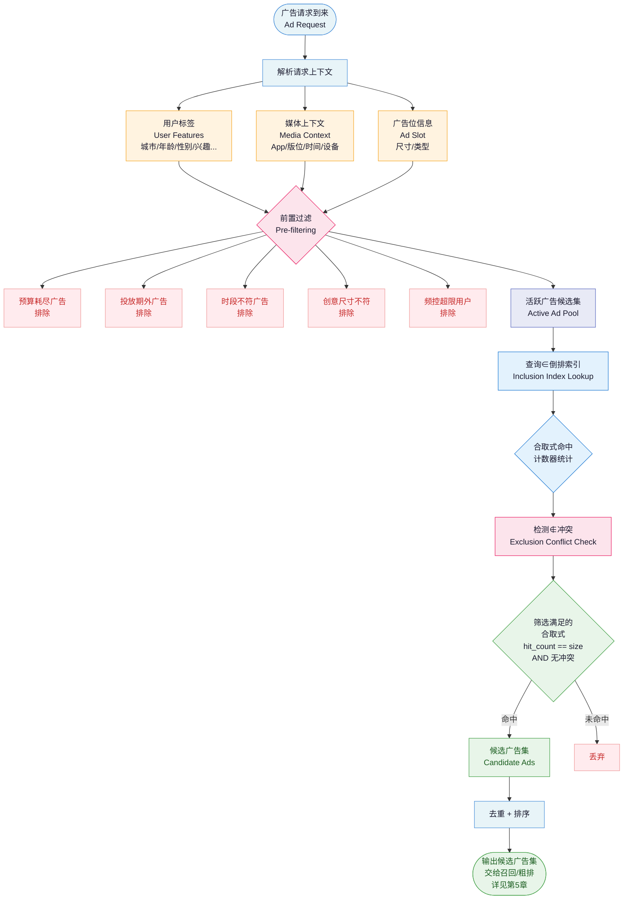
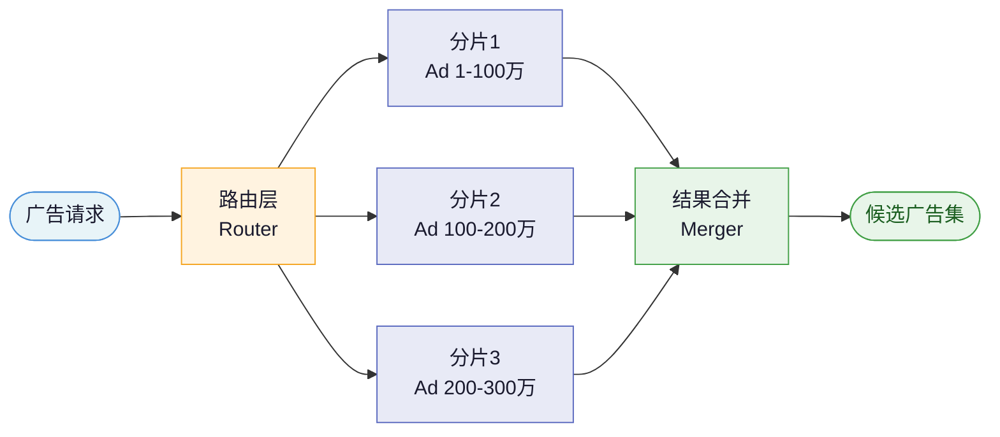
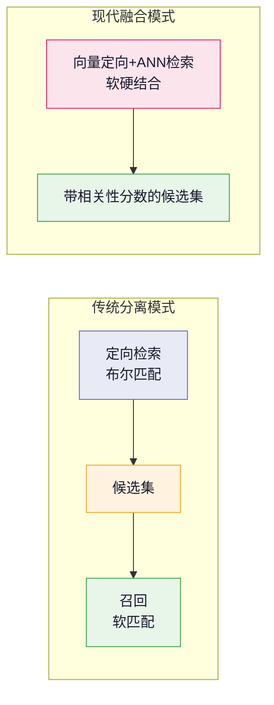
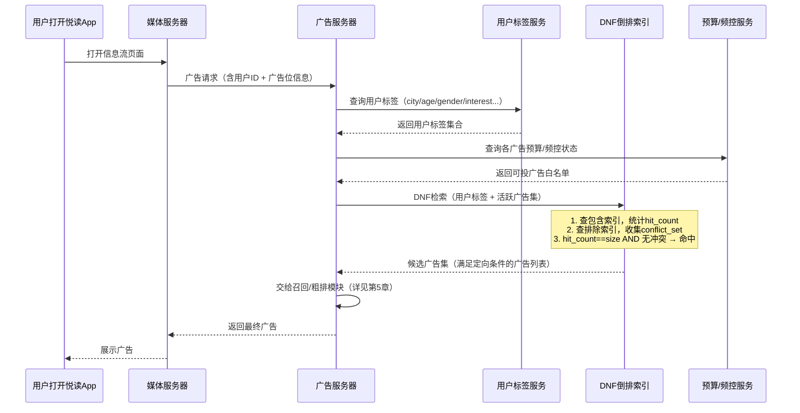

# 第4章 定向与广告检索

> **全景教程导航**：第3章介绍了投放引擎的漏斗总体架构（详见第3章）。本章聚焦漏斗最上层的第一道关卡——**定向与广告检索**，即"哪些广告有资格参与本次竞价"。第5章将在此基础上讲解召回（软匹配与相关性排序）。

---

## 本章导读

每次广告请求到来，系统面对的是**数百万量级**的广告库，但用户的耐心只有几十毫秒。定向与广告检索要回答的核心问题是：

> 在 10～30 ms 内，从全量广告中找出**所有满足当前用户上下文条件**的广告候选集。

这不是普通的推荐问题——广告主对"谁能看到我的广告"有**硬性约束**（合规、预算、品牌安全），而不是"越相关越好"的软偏好。本章将系统讲透：

1. 定向（Targeting）的本质与分类体系
2. 定向条件如何用布尔表达式（Boolean Expression）和析取范式（DNF, Disjunctive Normal Form）形式化
3. 倒排索引（Inverted Index）在广告检索中的经典工程实现
4. 完整 Python 代码演示 DNF 倒排的建索引与检索匹配
5. 贯穿例子：「轻氧奶茶」在「悦读App」上的定向条件如何被系统处理

---

## 4.1 定向是什么——广告区别于普通推荐的关键一环

### 4.1.1 从推荐到广告的本质跨越

在普通内容推荐（如抖音视频、淘宝商品）中，系统的目标是最大化用户满意度：把用户**可能喜欢**的内容推给他。这是一个"软"目标——推错了，用户划走，影响有限。

广告推荐则截然不同，存在两层强约束：

**约束层一：广告主的投放意图（硬性限制）**

轻氧奶茶的市场部不希望把广告打给 55 岁大爷——不是算法预测他不喜欢奶茶，而是**广告主明确指定**只投 20-35 岁女性。这是合同层面的承诺，系统必须严格执行。

**约束层二：合规与品牌安全（Brand Safety）**

金融广告不能投给未成年人（监管要求）；高端白酒不能出现在儿童教育类App（品牌安全）；竞争对手的App不在投放白名单内（商业策略）。

**因此，广告检索 ≠ 推荐检索**，它的第一步必须是**硬过滤（Hard Filtering）**：只有通过所有定向条件的广告，才有资格进入后续的召回、粗排、精排。

```
普通推荐：相关性排序 → 截断 → 展示
广告投放：定向硬过滤 → 候选集 → 相关性排序 → 出价竞争 → 展示
```

### 4.1.2 定向的正式定义

**定向（Targeting）**：广告主在创建广告时，通过一组条件约束，指定广告只投放给满足这些条件的用户群体与媒体环境。

从系统视角，每次广告请求（Ad Request）携带：
- **用户上下文**：用户标签（年龄、性别、地域、兴趣标签等）
- **媒体上下文**：当前App、页面内容、请求时间、设备信息
- **流量上下文**：广告位（Ad Slot）类型与尺寸

定向检索的任务是：给定一次请求的完整上下文，从广告库中检索出**所有定向条件被该上下文满足**的广告。

---

## 4.2 定向类型全景

广告定向类型繁多，以下表格从多维度系统梳理：

### 4.2.1 用户维度定向

| 定向类型 | 英文名 | 数据来源 | 说明 | 精准度 | 覆盖度 |
|---------|--------|---------|------|--------|--------|
| 人口属性 | Demographics | 注册信息/行为推断 | 年龄、性别、学历、婚育状态 | 中 | 高 |
| 地域定向 | Geo Targeting | GPS/IP/注册地 | 国家→省→市→区→商圈 | 高（GPS）/中（IP） | 高 |
| 兴趣定向 | Interest Targeting | 行为数据+DMP标签 | 用户长期兴趣标签（美妆、健身等） | 中 | 高 |
| 行为定向 | Behavioral Targeting | 浏览/搜索/购买记录 | 近期行为信号（7/30天窗口） | 高 | 中 |
| 重定向 | Retargeting | 广告主像素/SDK事件 | 访问过官网/加购未买/已安装App | 极高 | 低 |
| 相似人群 | Lookalike | 种子人群+模型扩展 | 与种子用户行为相似的新用户 | 中-高 | 中 |
| 自定义人群包 | Custom Audience | 广告主上传手机号/IDFA | 广告主私域人群的精准触达 | 极高 | 低 |
| DMP人群标签 | DMP Audience | 第三方数据平台 | 采购的行业数据标签 | 中 | 高 |

### 4.2.2 媒体与上下文维度定向

| 定向类型 | 英文名 | 说明 | 典型场景 |
|---------|--------|------|---------|
| LBS地理位置 | LBS (Location-Based Service) | 实时GPS位置，商圈/门店周边定向 | 线下餐饮、零售门店引流 |
| 时段定向 | Dayparting | 按小时或星期粒度投放 | 午餐外卖11-13点；夜宵0-2点 |
| 设备定向 | Device Targeting | 手机/平板/PC；品牌型号 | 苹果用户定向高端产品 |
| 操作系统 | OS Targeting | iOS / Android 版本 | App推广按系统区分落地页 |
| 媒体环境 | Contextual Targeting | 当前页面/频道/关键词语义 | 美食内容页投餐饮广告 |
| 网络环境 | Network Targeting | WiFi/4G/5G | 视频广告偏好WiFi环境 |
| 运营商 | Carrier Targeting | 移动/联通/电信 | 运营商定制套餐广告 |

### 4.2.3 广告主侧限制（投放控制条件）

除了用户匹配条件，广告主还会设置一系列**投放控制参数**，这些本质上也是定向硬约束：

| 控制类型 | 英文名 | 说明 |
|---------|--------|------|
| 总预算限制 | Total Budget Cap | 整个广告活动的最高花费 |
| 日预算限制 | Daily Budget Cap | 每日最高花费（如10万/天） |
| 投放期 | Flight / Schedule | 广告的起止日期（如6月1日-30日） |
| 投放时段 | Daypart Schedule | 只在特定时段展示 |
| 地域白名单 | Geo Whitelist | 只投放特定城市/省份 |
| 频次控制 | Frequency Cap | 同一用户每天/每周最多看N次 |
| 媒体黑名单 | Publisher Blacklist | 禁止在特定媒体/页面出现 |
| 媒体白名单 | Publisher Whitelist | 只在特定媒体出现 |
| 创意尺寸适配 | Creative Size Matching | 广告素材尺寸必须匹配广告位 |
| 竞争对手排除 | Competitive Exclusion | 同一页面不与竞品同时出现 |

> **例：轻氧奶茶的投放控制**
> - 日预算：10万元
> - 投放期：2024年6月1日 - 8月31日（夏季旺季）
> - 投放时段：每天9:00-23:00
> - 地域：一线城市（北京/上海/广州/深圳）
> - 频次上限：同一用户每天最多看3次
> - 媒体黑名单：竞品奶茶品牌的官方App

这些控制条件由**预算控制模块**（详见第11章）和**频次控制模块**（详见第11章）在定向检索阶段前置过滤。

---

## 4.3 定向条件的形式化表达

### 4.3.1 为什么需要形式化

广告主在投放平台上配置定向时，通常通过图形界面操作，但系统内部必须将其转化为**可计算的逻辑表达式**。

以轻氧奶茶为例，其定向意图可以描述为：

> "一线城市的，20-35岁的，女性，对奶茶或甜品感兴趣，且**不是**已注册会员的用户"

这是一个典型的**布尔表达式（Boolean Expression）**：

$$
\text{Targeting} = (city \in \{北京, 上海, 广州, 深圳\}) \land (age \in [20, 35]) \land (gender = female) \land (interest \in \{奶茶, 甜品\}) \land \lnot (tag = registered\_member)$$

其中：
- $\land$ 表示逻辑与（AND）
- $\lnot$ 表示逻辑非（NOT）
- $\in$ 表示"属于某集合"

### 4.3.2 为什么选择DNF（析取范式）

**析取范式（DNF, Disjunctive Normal Form）**：一个布尔表达式可以表示为若干**合取式（Conjunction，即AND子句）**的析取（OR）：

$$
\text{DNF} = C_1 \lor C_2 \lor \cdots \lor C_n$$

其中每个合取式 $C_i$ 是若干**字面量（Literal）**的合取：

$$
C_i = l_{i,1} \land l_{i,2} \land \cdots \land l_{i,k}$$

每个字面量要么是正字面量 $attr \in Values$（属于），要么是负字面量 $attr \notin Values$（不属于）。

**为什么选择DNF？** 三个关键原因：

1. **普适性**：任意布尔表达式都可以通过分配律化为DNF形式（这是逻辑学基本定理）。
2. **检索友好**：DNF的OR结构天然对应"命中任意一个合取式即匹配"，合取式内部是AND关系，可以用**倒排索引统计命中数**来高效实现。
3. **工程简洁**：DNF的结构固定（两层嵌套：AND in OR），比任意嵌套的布尔树更容易建索引和维护。

### 4.3.3 轻氧奶茶定向的DNF分解

原始定向条件：

$$
(city \in \{北, 上, 广, 深\}) \land (age \in [20,35]) \land (gender = female) \land (interest \in \{奶茶, 甜品\}) \land (tag \notin \{registered\})$$

这个条件**本身已经是一个合取式**，因此其DNF只有一个合取式：

$$
C_1 = (city \in \{北京, 上海, 广州, 深圳\}) \land (age \in [20,35]) \land (gender = female) \land (interest \in \{奶茶, 甜品\}) \land (tag \notin \{registered\})$$

如果广告主希望额外加一个宽松条件——"对健康食品感兴趣的男性（无城市限制）也可以投"，则DNF变为两个合取式：

$$
C_1 \lor C_2$$

$$
C_2 = (interest \in \{健康食品\}) \land (gender = male) \land (tag \notin \{registered\})$$

每个 $C_i$ 中的条件个数称为该合取式的**尺寸（Size）**，尺寸是后续建索引的重要参数。

---

## 4.4 倒排索引基础

### 4.4.1 正排 vs 倒排对比

| 维度 | 正排索引（Forward Index） | 倒排索引（Inverted Index） |
|------|--------------------------|--------------------------|
| 结构 | `广告ID → 定向条件列表` | `(属性,值) → 广告/合取式ID列表` |
| 适合查询 | "查询某广告的定向条件" | "查询哪些广告满足某个条件" |
| 广告检索效率 | O(广告总数) - 需全量扫描 | O(命中广告数) - 精确跳转 |
| 内存布局 | 较稀疏 | 紧凑，可压缩 |
| 更新成本 | 低 | 中（需更新多个posting list） |

**广告检索场景必须用倒排**：给定一个用户有 $k$ 个标签，系统需要找出所有满足条件的广告。正排需要扫描数百万广告，倒排只需查 $k$ 个标签对应的posting list（帖子列表）并取交集/并集。

### 4.4.2 倒排索引结构

```
(attribute, value) → posting_list

例：
city=上海 → [conjID_1, conjID_3, conjID_7, ...]
age_group=20-25 → [conjID_1, conjID_5, ...]
gender=female → [conjID_1, conjID_2, conjID_9, ...]
interest=奶茶 → [conjID_1, conjID_4, ...]
tag∉registered → [conjID_1, conjID_2, ...]  ← NOT条件特殊处理
```

每个 posting list 中存储的是**合取式ID（Conjunction ID）**，而不直接是广告ID——因为一个广告可能有多个合取式（DNF中的多个OR分支），只要任意一个合取式满足，广告即命中。

---

## 4.5 DNF倒排索引的完整工程实现

### 4.5.1 核心数据结构设计

业界经典实现（参考 Yahoo! Research 2009年论文 "Indexing Boolean Expressions"）使用以下核心结构：

```
广告（Ad）
  └── 多个合取式（Conjunction）（OR关系）
        └── 多个赋值条件（Assignment）（AND关系）
              ├── ∈ 条件：attr ∈ {v1, v2, ...}（Inclusion）
              └── ∉ 条件：attr ∉ {v1, v2, ...}（Exclusion，NOT条件）
```

**关键设计决策：NOT条件的处理**

NOT条件（$attr \notin Values$）不能像IN条件一样直接建正向posting list，原因是：

- IN条件：用户有标签 `city=上海`，去查 `city=上海` 的posting list，命中即+1。
- NOT条件：用户有标签 `tag=registered`，应该去查 `tag∉registered` 的posting list，**命中即该合取式失效（冲突）**。

因此，NOT条件单独维护一个**冲突列表（Conflict List）**，检索时用于过滤。

### 4.5.2 完整 Python 实现

```python
"""
DNF倒排索引 - 广告定向检索核心实现
参考：Yahoo! Research "Indexing Boolean Expressions" (2009)

术语对照：
- Ad (广告): 一条广告，包含多个Conjunction
- Conjunction (合取式): DNF中的一个AND子句
- Assignment (赋值条件): 合取式中的一个属性条件
- Inclusion (包含条件): attr ∈ {v1, v2, ...}
- Exclusion (排除条件): attr ∉ {v1, v2, ...}
- PostingList (帖子列表): 倒排索引中某个(属性,值)对应的合取式列表
"""

from collections import defaultdict
from dataclasses import dataclass, field
from typing import Dict, List, Set, Tuple, Optional
import json


# ============================================================
# 1. 数据结构定义
# ============================================================

@dataclass
class Assignment:
    """
    单个属性条件
    例：city ∈ {北京, 上海} 或 tag ∉ {registered}
    """
    attribute: str          # 属性名，如 "city", "age_group", "interest"
    values: Set[str]        # 值集合
    is_inclusion: bool      # True=∈（包含），False=∉（排除/NOT）
    
    def __repr__(self):
        op = "∈" if self.is_inclusion else "∉"
        return f"{self.attribute} {op} {self.values}"


@dataclass
class Conjunction:
    """
    一个合取式（AND子句）
    包含若干个 Assignment，所有条件必须同时满足（AND关系）
    """
    conjunction_id: str          # 全局唯一ID，格式："{ad_id}_conj_{index}"
    ad_id: str                   # 所属广告ID
    inclusions: List[Assignment] = field(default_factory=list)  # ∈ 条件列表
    exclusions: List[Assignment] = field(default_factory=list)  # ∉ 条件列表
    
    @property
    def inclusion_size(self) -> int:
        """
        合取式的尺寸 = 包含条件（∈）的数量。
        检索时：用户标签命中该合取式的∈条件数必须等于inclusion_size才算满足。
        """
        return len(self.inclusions)
    
    def __repr__(self):
        parts = [str(a) for a in self.inclusions + self.exclusions]
        return f"Conj({self.conjunction_id}): " + " ∧ ".join(parts)


@dataclass  
class Ad:
    """
    广告实体，包含一个或多个合取式（OR关系）
    """
    ad_id: str
    name: str
    conjunctions: List[Conjunction] = field(default_factory=list)
    
    def __repr__(self):
        return f"Ad({self.ad_id}, {self.name})"


# ============================================================
# 2. DNF倒排索引核心类
# ============================================================

class DNFInvertedIndex:
    """
    DNF倒排索引
    
    索引结构：
    - inclusion_index: (attr, value) → [(conj_id, inclusion_size), ...]
      用于统计命中的∈条件数
      
    - exclusion_index: (attr, value) → [conj_id, ...]  
      用于记录∉冲突，命中则该合取式失效
      
    - conjunction_map: conj_id → Conjunction 对象
    - ad_map: ad_id → Ad 对象
    """
    
    def __init__(self):
        # 正包含倒排：(attr, value) → list of (conj_id, conj_inclusion_size)
        # conj_inclusion_size 用于判断命中数是否达到合取式要求的总数
        self.inclusion_index: Dict[Tuple[str, str], List[Tuple[str, int]]] = defaultdict(list)
        
        # 排除倒排：(attr, value) → list of conj_id
        # 命中意味着该合取式有冲突，应被过滤
        self.exclusion_index: Dict[Tuple[str, str], List[str]] = defaultdict(list)
        
        # 合取式映射
        self.conjunction_map: Dict[str, Conjunction] = {}
        
        # 广告映射  
        self.ad_map: Dict[str, Ad] = {}
        
        # 统计信息
        self._total_ads = 0
        self._total_conjunctions = 0
    
    def add_ad(self, ad: Ad) -> None:
        """
        将一个广告及其所有合取式添加到索引中
        
        建索引流程：
        1. 遍历广告的每个合取式
        2. 对每个∈条件，在inclusion_index中添加 (attr, value) → (conj_id, size)
        3. 对每个∉条件，在exclusion_index中添加 (attr, value) → conj_id
        """
        self.ad_map[ad.ad_id] = ad
        self._total_ads += 1
        
        for conjunction in ad.conjunctions:
            self.conjunction_map[conjunction.conjunction_id] = conjunction
            self._total_conjunctions += 1
            
            size = conjunction.inclusion_size  # 该合取式需要命中的∈条件总数
            
            # 建立包含条件的倒排
            for assignment in conjunction.inclusions:
                for value in assignment.values:
                    key = (assignment.attribute, value)
                    self.inclusion_index[key].append(
                        (conjunction.conjunction_id, size)
                    )
            
            # 建立排除条件的倒排
            for assignment in conjunction.exclusions:
                for value in assignment.values:
                    key = (assignment.attribute, value)
                    self.exclusion_index[key].append(conjunction.conjunction_id)
        
        print(f"[索引] 已添加广告 {ad.ad_id}({ad.name})，"
              f"包含 {len(ad.conjunctions)} 个合取式")
    
    def retrieve(self, user_features: Dict[str, str]) -> List[Ad]:
        """
        给定用户特征，检索所有满足定向条件的广告
        
        检索算法（核心）：
        
        Step 1: 初始化命中计数器
            hit_count[conj_id] = 该合取式被用户特征命中的∈条件数量
        
        Step 2: 扫描用户每个特征 (attr, value)
            查inclusion_index → 对应的所有(conj_id, size)的hit_count[conj_id] += 1
        
        Step 3: 收集冲突合取式
            扫描用户每个特征 (attr, value)
            查exclusion_index → 这些conj_id加入conflict_set（有∉冲突）
        
        Step 4: 筛选满足的合取式
            满足条件：hit_count[conj_id] == conj.inclusion_size AND conj_id NOT IN conflict_set
            注意：inclusion_size == 0 的合取式（无∈条件，只有∉条件）特殊处理，
            只要没有∉冲突就满足（相当于全量投放）
        
        Step 5: 去重收集广告
            将满足合取式对应的ad_id收集并去重，返回广告列表
        
        Args:
            user_features: 用户特征字典，如 {"city": "上海", "gender": "female", ...}
        
        Returns:
            满足定向条件的广告列表
        """
        
        # Step 1: 初始化命中计数器
        hit_count: Dict[str, int] = defaultdict(int)
        
        # Step 2: 统计每个合取式的∈条件命中数
        for attr, value in user_features.items():
            key = (attr, value)
            if key in self.inclusion_index:
                for conj_id, _ in self.inclusion_index[key]:
                    hit_count[conj_id] += 1
        
        # Step 3: 收集有∉冲突的合取式
        conflict_set: Set[str] = set()
        for attr, value in user_features.items():
            key = (attr, value)
            if key in self.exclusion_index:
                for conj_id in self.exclusion_index[key]:
                    conflict_set.add(conj_id)
        
        # Step 4: 筛选满足的合取式
        matched_ad_ids: Set[str] = set()
        
        # 处理有∈条件的合取式：命中数必须等于inclusion_size且无冲突
        for conj_id, count in hit_count.items():
            if conj_id in conflict_set:
                continue  # 有∉冲突，直接跳过
            
            conjunction = self.conjunction_map[conj_id]
            if count == conjunction.inclusion_size:
                # 命中数恰好等于∈条件总数，该合取式满足！
                matched_ad_ids.add(conjunction.ad_id)
        
        # 处理无∈条件的合取式（inclusion_size == 0，只有∉条件或无任何条件）
        # 这类合取式只要没有∉冲突就满足（等价于"全量投放但排除某些人"）
        for conj_id, conjunction in self.conjunction_map.items():
            if conjunction.inclusion_size == 0 and conj_id not in conflict_set:
                matched_ad_ids.add(conjunction.ad_id)
        
        # Step 5: 收集广告对象
        matched_ads = [self.ad_map[ad_id] for ad_id in matched_ad_ids]
        
        return matched_ads
    
    def retrieve_with_debug(self, user_features: Dict[str, str]) -> List[Ad]:
        """
        带调试信息的检索，展示每个合取式的匹配详情
        """
        print(f"\n{'='*60}")
        print(f"[检索] 用户特征: {json.dumps(user_features, ensure_ascii=False)}")
        print(f"{'='*60}")
        
        hit_count: Dict[str, int] = defaultdict(int)
        conflict_set: Set[str] = set()
        
        # 统计命中
        print("\n[Step 2] 统计∈条件命中数:")
        for attr, value in user_features.items():
            key = (attr, value)
            if key in self.inclusion_index:
                for conj_id, size in self.inclusion_index[key]:
                    hit_count[conj_id] += 1
                    print(f"  ({attr}={value}) 命中合取式 {conj_id}，当前命中数={hit_count[conj_id]}/{size}")
        
        # 收集冲突
        print("\n[Step 3] 检测∉条件冲突:")
        for attr, value in user_features.items():
            key = (attr, value)
            if key in self.exclusion_index:
                for conj_id in self.exclusion_index[key]:
                    conflict_set.add(conj_id)
                    print(f"  ({attr}={value}) 与合取式 {conj_id} 产生∉冲突 → 该合取式失效")
        
        if not conflict_set:
            print("  无冲突")
        
        # 筛选
        print("\n[Step 4] 筛选满足的合取式:")
        matched_ad_ids: Set[str] = set()
        
        for conj_id, count in hit_count.items():
            conjunction = self.conjunction_map[conj_id]
            required = conjunction.inclusion_size
            has_conflict = conj_id in conflict_set
            
            if has_conflict:
                print(f"  {conj_id}: 命中{count}/{required} ✗ (有∉冲突)")
            elif count == required:
                print(f"  {conj_id}: 命中{count}/{required} ✓ → 广告 {conjunction.ad_id} 命中！")
                matched_ad_ids.add(conjunction.ad_id)
            else:
                print(f"  {conj_id}: 命中{count}/{required} ✗ (∈条件未全满足)")
        
        matched_ads = [self.ad_map[ad_id] for ad_id in matched_ad_ids]
        print(f"\n[结果] 命中广告 {len(matched_ads)} 条: {[ad.name for ad in matched_ads]}")
        return matched_ads
    
    def print_index_stats(self) -> None:
        """打印索引统计信息"""
        print(f"\n[索引统计]")
        print(f"  广告总数: {self._total_ads}")
        print(f"  合取式总数: {self._total_conjunctions}")
        print(f"  包含索引词条数: {len(self.inclusion_index)}")
        print(f"  排除索引词条数: {len(self.exclusion_index)}")
        print(f"\n  包含索引详情:")
        for key, entries in sorted(self.inclusion_index.items()):
            conj_ids = [e[0] for e in entries]
            print(f"    ({key[0]}={key[1]}) → {conj_ids}")
        print(f"\n  排除索引详情:")
        for key, conj_ids in sorted(self.exclusion_index.items()):
            print(f"    ({key[0]}={key[1]}) → {conj_ids} [∉冲突]")


# ============================================================
# 3. 工具函数：构建轻氧奶茶广告案例
# ============================================================

def build_qingyang_ad() -> Ad:
    """
    构建「轻氧奶茶」广告的DNF表示
    
    定向条件：
    C1: (city ∈ {北京, 上海, 广州, 深圳})  ← 一线城市
        AND (age_group ∈ {20-25, 25-30, 30-35})  ← 20-35岁
        AND (gender ∈ {female})  ← 女性
        AND (interest ∈ {奶茶, 甜品})  ← 兴趣标签
        AND (membership ∉ {registered})  ← 排除已注册会员（NOT条件）
    
    C2: (interest ∈ {健康食品, 轻食})  ← 健康食品兴趣扩展
        AND (age_group ∈ {20-25, 25-30})  ← 20-30岁
        AND (membership ∉ {registered})  ← 同样排除已注册会员
    """
    
    # 合取式 C1：精准核心人群
    c1 = Conjunction(
        conjunction_id="ad_qy_conj_0",
        ad_id="ad_qingyang",
        inclusions=[
            Assignment(
                attribute="city",
                values={"北京", "上海", "广州", "深圳"},
                is_inclusion=True
            ),
            Assignment(
                attribute="age_group",
                values={"20-25", "25-30", "30-35"},
                is_inclusion=True
            ),
            Assignment(
                attribute="gender",
                values={"female"},
                is_inclusion=True
            ),
            Assignment(
                attribute="interest",
                values={"奶茶", "甜品"},
                is_inclusion=True
            ),
        ],
        exclusions=[
            Assignment(
                attribute="membership",
                values={"registered"},
                is_inclusion=False  # ∉：排除已注册会员
            ),
        ]
    )
    
    # 合取式 C2：健康食品扩展人群
    c2 = Conjunction(
        conjunction_id="ad_qy_conj_1",
        ad_id="ad_qingyang",
        inclusions=[
            Assignment(
                attribute="interest",
                values={"健康食品", "轻食"},
                is_inclusion=True
            ),
            Assignment(
                attribute="age_group",
                values={"20-25", "25-30"},
                is_inclusion=True
            ),
        ],
        exclusions=[
            Assignment(
                attribute="membership",
                values={"registered"},
                is_inclusion=False
            ),
        ]
    )
    
    ad = Ad(
        ad_id="ad_qingyang",
        name="轻氧奶茶_拉新广告",
        conjunctions=[c1, c2]
    )
    
    return ad


def build_competitor_ad() -> Ad:
    """构建竞品广告用于对比测试"""
    c1 = Conjunction(
        conjunction_id="ad_comp_conj_0",
        ad_id="ad_competitor",
        inclusions=[
            Assignment(attribute="city", values={"上海", "杭州"}, is_inclusion=True),
            Assignment(attribute="interest", values={"咖啡", "茶饮"}, is_inclusion=True),
        ],
        exclusions=[]
    )
    
    return Ad(
        ad_id="ad_competitor",
        name="竞品茶饮_广告",
        conjunctions=[c1]
    )


# ============================================================
# 4. 主演示流程
# ============================================================

def main():
    print("=" * 70)
    print("DNF倒排索引广告定向检索 - 完整演示")
    print("案例：「悦读App」 × 「轻氧奶茶」定向投放")
    print("=" * 70)
    
    # 构建索引
    print("\n【第一步：构建广告定向索引】")
    index = DNFInvertedIndex()
    
    ad_qingyang = build_qingyang_ad()
    ad_competitor = build_competitor_ad()
    
    index.add_ad(ad_qingyang)
    index.add_ad(ad_competitor)
    
    # 打印索引结构
    index.print_index_stats()
    
    print("\n" + "=" * 70)
    print("【第二步：模拟用户请求检索】")
    
    # 用户A：完美匹配轻氧奶茶C1
    user_a = {
        "city": "上海",
        "age_group": "25-30",
        "gender": "female",
        "interest": "奶茶",
        # 注意：无 membership 标签 → 不会触发∉冲突
    }
    
    print("\n--- 用户A（预期命中：轻氧奶茶C1）---")
    result_a = index.retrieve_with_debug(user_a)
    
    # 用户B：已注册会员，被∉条件排除
    user_b = {
        "city": "北京",
        "age_group": "20-25",
        "gender": "female",
        "interest": "奶茶",
        "membership": "registered",  # ← 已注册，触发∉冲突
    }
    
    print("\n--- 用户B（预期：被∉条件排除，不命中）---")
    result_b = index.retrieve_with_debug(user_b)
    
    # 用户C：二线城市，不满足C1的城市条件，但对健康食品感兴趣
    user_c = {
        "city": "成都",           # ← 非一线城市，C1城市条件不满足
        "age_group": "25-30",
        "gender": "male",
        "interest": "健康食品",   # ← 满足C2的兴趣条件
    }
    
    print("\n--- 用户C（预期命中：轻氧奶茶C2扩展人群）---")
    result_c = index.retrieve_with_debug(user_c)
    
    # 用户D：什么都不满足
    user_d = {
        "city": "纽约",
        "age_group": "40-50",
        "gender": "male",
        "interest": "汽车",
    }
    
    print("\n--- 用户D（预期：无命中）---")
    result_d = index.retrieve_with_debug(user_d)
    
    # 用户E：满足竞品广告条件
    user_e = {
        "city": "上海",
        "interest": "咖啡",
    }
    
    print("\n--- 用户E（预期命中：竞品茶饮广告）---")
    result_e = index.retrieve_with_debug(user_e)
    
    print("\n" + "=" * 70)
    print("【检索结果汇总】")
    print(f"  用户A → {[ad.name for ad in result_a]}")
    print(f"  用户B → {[ad.name for ad in result_b]} (∉条件排除)")
    print(f"  用户C → {[ad.name for ad in result_c]}")
    print(f"  用户D → {[ad.name for ad in result_d]} (无匹配)")
    print(f"  用户E → {[ad.name for ad in result_e]}")


if __name__ == "__main__":
    main()
```

### 4.5.3 代码运行示例输出

```
======================================================================
DNF倒排索引广告定向检索 - 完整演示
案例：「悦读App」 × 「轻氧奶茶」定向投放
======================================================================

【第一步：构建广告定向索引】
[索引] 已添加广告 ad_qingyang(轻氧奶茶_拉新广告)，包含 2 个合取式
[索引] 已添加广告 ad_competitor(竞品茶饮_广告)，包含 1 个合取式

[索引统计]
  广告总数: 2
  合取式总数: 3
  包含索引词条数: 14
  排除索引词条数: 1

  包含索引详情:
    (age_group=20-25) → [ad_qy_conj_0, ad_qy_conj_1]
    (age_group=25-30) → [ad_qy_conj_0, ad_qy_conj_1]
    (age_group=30-35) → [ad_qy_conj_0]
    (city=上海) → [ad_qy_conj_0]
    ...
    (interest=奶茶) → [ad_qy_conj_0]
    (interest=健康食品) → [ad_qy_conj_1]
    ...

  排除索引详情:
    (membership=registered) → [ad_qy_conj_0, ad_qy_conj_1] [∉冲突]

--- 用户A（预期命中：轻氧奶茶C1）---
[Step 2] 统计∈条件命中数:
  (city=上海) 命中合取式 ad_qy_conj_0，当前命中数=1/4
  (age_group=25-30) 命中合取式 ad_qy_conj_0，当前命中数=2/4
  (gender=female) 命中合取式 ad_qy_conj_0，当前命中数=3/4
  (interest=奶茶) 命中合取式 ad_qy_conj_0，当前命中数=4/4

[Step 3] 检测∉条件冲突:
  无冲突

[Step 4] 筛选满足的合取式:
  ad_qy_conj_0: 命中4/4 ✓ → 广告 ad_qingyang 命中！

[结果] 命中广告 1 条: ['轻氧奶茶_拉新广告']
```

---

## 4.6 完整检索流程图



---

## 4.7 完整案例：轻氧奶茶的匹配链路

### 4.7.1 广告配置阶段

广告主在轻氧奶茶的投放后台配置定向条件。系统将其转化为DNF内部表示：

```
广告：轻氧奶茶_拉新广告 (ad_id: ad_qingyang)
├── 合取式 C1 [size=4, 精准核心人群]
│   ├── ∈ city ∈ {北京, 上海, 广州, 深圳}
│   ├── ∈ age_group ∈ {20-25, 25-30, 30-35}
│   ├── ∈ gender ∈ {female}
│   ├── ∈ interest ∈ {奶茶, 甜品}
│   └── ∉ membership ∈ {registered}   ← NOT条件
│
└── 合取式 C2 [size=2, 健康食品扩展人群]
    ├── ∈ interest ∈ {健康食品, 轻食}
    ├── ∈ age_group ∈ {20-25, 25-30}
    └── ∉ membership ∈ {registered}   ← NOT条件
```

**建索引时生成的 Posting List**：

| 索引类型 | Key (attr, value) | Posting List |
|---------|-------------------|--------------|
| 包含索引 | (city, 北京) | [C1] |
| 包含索引 | (city, 上海) | [C1] |
| 包含索引 | (city, 广州) | [C1] |
| 包含索引 | (city, 深圳) | [C1] |
| 包含索引 | (age_group, 20-25) | [C1, C2] |
| 包含索引 | (age_group, 25-30) | [C1, C2] |
| 包含索引 | (age_group, 30-35) | [C1] |
| 包含索引 | (gender, female) | [C1] |
| 包含索引 | (interest, 奶茶) | [C1] |
| 包含索引 | (interest, 甜品) | [C1] |
| 包含索引 | (interest, 健康食品) | [C2] |
| 包含索引 | (interest, 轻食) | [C2] |
| **排除索引** | **(membership, registered)** | **[C1, C2]** ← NOT |

### 4.7.2 实时请求匹配阶段

**场景：某用户张小姐打开悦读App**

用户标签（来自DMP/用户中心）：

```json
{
  "user_id": "user_zhang",
  "city": "上海",
  "age_group": "25-30",
  "gender": "female",
  "interest": "奶茶",
  "device": "iPhone 15",
  "os": "iOS 17"
}
```

**匹配计算过程**：

```
Step 1: 查包含索引
  (city, 上海)     → C1: hit_count[C1] = 1
  (age_group, 25-30) → C1: hit_count[C1] = 2
                      C2: hit_count[C2] = 1
  (gender, female) → C1: hit_count[C1] = 3
  (interest, 奶茶) → C1: hit_count[C1] = 4

Step 2: 查排除索引
  membership 标签不存在 → 不触发任何冲突
  conflict_set = {}（空）

Step 3: 筛选
  C1: hit_count=4, required=4, 无冲突 → ✓ 满足！
  C2: hit_count=1, required=2, 无冲突 → ✗ 不满足（interest未命中健康食品/轻食）

结果：广告 ad_qingyang（轻氧奶茶）进入候选集
```

**反例：已注册会员李女士**

```json
{
  "user_id": "user_li",
  "city": "北京",
  "age_group": "20-25",
  "gender": "female",
  "interest": "甜品",
  "membership": "registered"   ← 关键：已注册会员
}
```

```
Step 1: 查包含索引
  C1: hit_count=4（city+age+gender+interest全命中）
  C2: hit_count=1（age命中）

Step 2: 查排除索引
  (membership, registered) → conflict_set = {C1, C2}

Step 3: 筛选
  C1: hit_count=4=required ✓，但 C1 ∈ conflict_set → ✗ 被∉条件过滤！
  C2: hit_count=1 ✗，且 C2 ∈ conflict_set → ✗

结果：李女士是已注册会员，被∉条件精准排除，不看到拉新广告
（这正是广告主期望的：已有会员不需要再"拉新"）
```

---

## 4.8 工程性能与优化

### 4.8.1 索引内存化

线上检索要求延迟在**10-30 ms**内完成，倒排索引必须**全量常驻内存**：

```
典型规模估算（中型广告平台）：
  活跃广告数：100万
  平均合取式数/广告：3
  合取式总数：300万
  平均每合取式∈条件数：5
  倒排索引总词条数：1500万
  平均每词条 posting list 大小：10 个 conj_id（int32）

内存占用估算：
  Posting List 数据：1500万 × 10 × 4 bytes = 600 MB
  辅助数据结构（hash map等）：约200 MB
  总计：约 800 MB ~ 1.2 GB
```

对于大型平台（千万级广告），通常使用以下策略：

- **压缩编码**：对 posting list 使用 delta encoding（差值编码）+ VarInt 压缩，可减少 60-70% 内存。
- **分层索引**：高频词条（city=上海，命中百万广告）单独处理，避免超长 posting list 拖慢检索。

### 4.8.2 分片（Sharding）策略

当广告量超出单机内存容量时，需要对索引进行分片：



**分片方式**：
- **按广告ID范围分片**：实现简单，但热点广告可能集中在某个分片。
- **按广告主分片**：同一广告主的广告在同一分片，便于频控统计，但大广告主会成为热点。
- **随机Hash分片**：负载均衡，但需要所有分片并行检索后合并。

### 4.8.3 增量更新策略

广告的定向条件可能随时被广告主修改（如扩大地域范围、调整年龄段），索引需要支持**实时增量更新**：

| 操作 | 处理方式 | 延迟要求 |
|------|---------|---------|
| 新建广告 | 全量建索引并插入 | ≤ 1分钟生效 |
| 修改定向 | 删除旧合取式 + 插入新合取式 | ≤ 1分钟生效 |
| 暂停广告 | 将广告标记为非活跃（不从索引删除，检索时过滤） | 秒级 |
| 预算耗尽 | 同暂停逻辑 | 秒级（频繁变化） |

**实践中常用的更新架构**：

```
广告配置变更 → MQ（Kafka）→ 索引更新服务 → 内存索引（热更新）
                                          ↓（同时）
                                       持久化存储（用于重启恢复）
```

### 4.8.4 检索延迟分析

| 影响因素 | 延迟影响 | 优化手段 |
|---------|---------|---------|
| 用户标签数量 | 标签越多，查倒排次数越多 | 标签数量上限控制（通常≤100个） |
| Posting List 长度 | 热门标签的posting list过长 | SkipList跳表加速合并 |
| 合取式总数 | 命中计数器初始化成本 | 只对命中的conj_id初始化 |
| NOT条件数量 | 冲突检测集合操作 | HashSet O(1) 查询 |
| 并发请求数 | CPU和内存带宽竞争 | 读写分离，多副本并行 |

**典型性能基准**（工业界参考值）：
- 百万级广告库，用户标签50个：**5-15 ms**
- 千万级广告库，用户标签100个：**20-50 ms**（通常需要分片）

---

## 4.9 定向与召回的边界

本章讲的定向检索是**硬匹配（Hard Matching）**，下一章（第5章）讲的召回是**软匹配（Soft Matching）**。二者的核心区别：

| 维度 | 定向检索（本章） | 召回（第5章） |
|------|----------------|--------------|
| 匹配逻辑 | 布尔精确匹配（通过/不通过） | 相关性分数（连续值） |
| 结果语义 | "该广告有资格参与竞价" | "该广告与当前用户有多相关" |
| 约束来源 | 广告主明确指定 | 算法学习的用户-广告相关性 |
| 错误代价 | 高（违反广告主合同） | 低（相关性差只是效果差） |
| 技术基础 | 倒排索引 + 布尔逻辑 | 向量检索 + 相关性模型 |
| 输出 | 候选广告集（有/无） | 排序候选列表（分数） |

**两者的融合趋势**：

现代广告系统中，定向与召回的边界日益模糊：
1. **向量定向**：将用户和广告表示为向量，用 ANN（Approximate Nearest Neighbor）搜索做定向，既是硬过滤也是相关性排序。
2. **定向放宽**：智能出价系统（详见第10章）可以在效果好时自动突破部分定向限制（如年龄放宽），但需广告主明确授权。
3. **联合建索引**：部分系统将定向标签和相关性特征混合建索引，在检索阶段同时完成粗过滤和粗排。



---

## 4.10 关键数据流：从广告请求到候选集

以一次完整的悦读App广告请求为例，整合本章所有内容：



---

## 本章小结

本章系统讲解了广告投放漏斗的第一道关卡——**定向与广告检索**。核心要点回顾：

1. **定向的本质**：广告主对"谁能看到我的广告"的硬性约束，包括用户匹配条件和投放控制参数，这是广告区别于普通推荐的根本所在。

2. **定向类型体系**：从人口属性、兴趣行为、地理位置，到重定向、相似人群、自定义人群包，形成多层次的精准投放体系；媒体环境、时段、设备等上下文定向则从供给侧约束广告的出现场景。

3. **DNF形式化**：任意布尔定向条件可化为析取范式（AND-of-ORs变为OR-of-ANDs），两层嵌套结构便于建立倒排索引。

4. **DNF倒排索引工程实现**：
   - 建索引：`(属性, 值) → [(合取式ID, 该合取式的∈条件总数)]`
   - 检索：统计每个合取式的命中数，命中数等于∈条件总数且无∉冲突即满足
   - NOT条件用单独的排除索引处理，命中则将合取式加入冲突集

5. **性能工程**：索引常驻内存（约1-2GB/百万广告），分片应对大规模，增量更新保证实时性，典型延迟5-30ms。

6. **定向与召回的边界**：定向是硬布尔匹配（有/无资格），召回是软相关性排序（高/低分值）；现代系统正在走向融合，用向量检索同时实现粗过滤和相关性估计。

**承上启下**：通过本章的定向检索，我们从百万量级广告中得到了满足硬性约束的候选集（通常数千到数万个广告）。第5章将介绍如何在这个候选集上进一步做**召回（Recall）**——用相关性模型从中选出最相关的Top-K广告，送入后续粗排精排流程。

---

## 参考来源

1. **Indexing Boolean Expressions** - Nikiel et al., Yahoo! Research, VLDB 2009  
   [https://dl.acm.org/doi/10.14778/1687627.1687633](https://dl.acm.org/doi/10.14778/1687627.1687633)  
   *DNF倒排索引的奠基性论文，本章工程实现的理论基础*

2. **Advertising on the Web** - AdWords系统技术分析  
   [https://research.google/pubs/large-scale-machine-learning-for-display-advertising/](https://research.google/pubs/large-scale-machine-learning-for-display-advertising/)  
   *Google展示广告大规模机器学习，涵盖定向与检索架构*

3. **Real-Time Bidding with Multi-Agent Reinforcement Learning in Display Advertising**  
   [https://arxiv.org/abs/1802.09756](https://arxiv.org/abs/1802.09756)  
   *RTB场景下的定向与出价联合优化*

4. **Ad Click Prediction: a View from the Trenches** - H. Brendan McMahan et al., Google, KDD 2013  
   [https://dl.acm.org/doi/10.1145/2487575.2488200](https://dl.acm.org/doi/10.1145/2487575.2200)  
   *工业级广告系统的定向特征工程实践*

5. **Facebook广告定向系统技术博客**  
   [https://engineering.fb.com/2021/09/09/data-infrastructure/data-warehouse/](https://engineering.fb.com/2021/09/09/data-infrastructure/data-warehouse/)  
   *大规模用户标签体系与广告定向的工程实践*

6. **腾讯广告定向技术揭秘** - 腾讯技术工程  
   [https://cloud.tencent.com/developer/article/1005819](https://cloud.tencent.com/developer/article/1005819)  
   *国内广告平台定向系统实战经验*

7. **Introduction to Algorithmic Marketing** - Ilya Katsov, 2017  
   [https://algorithmicweb.wordpress.com/](https://algorithmicweb.wordpress.com/)  
   *广告算法营销系统性教材，定向章节深入浅出*

8. **Applied Machine Learning for Advertising** - LinkedIn Engineering  
   [https://engineering.linkedin.com/blog/2019/04/ai-behind-linkedin-recruiter-search-and-recommendation-systems](https://engineering.linkedin.com/blog/2019/04/ai-behind-linkedin-recruiter-search-and-recommendation-systems)  
   *B端广告定向的机器学习实践*
