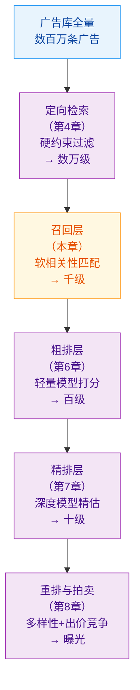
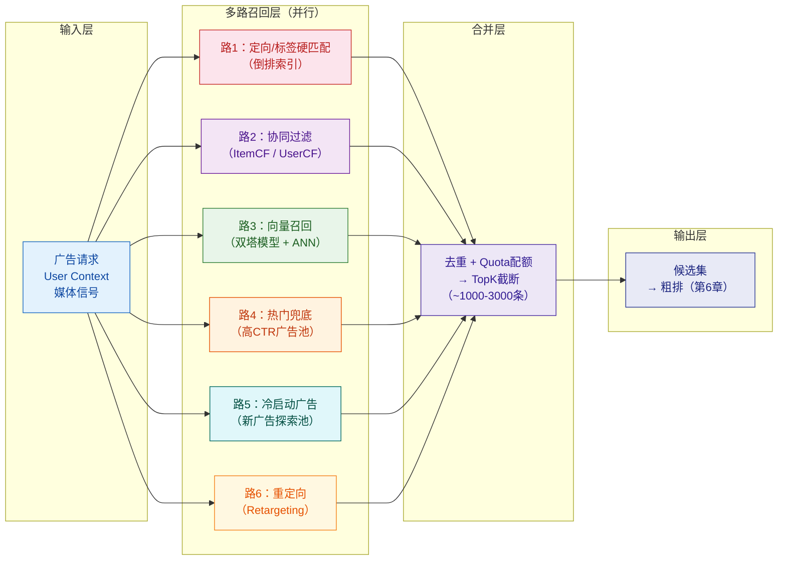
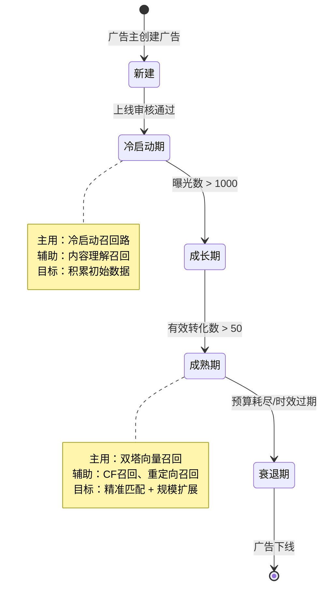
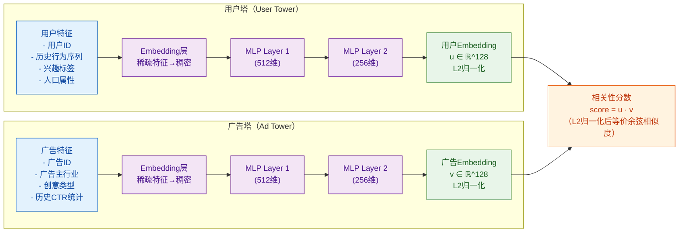
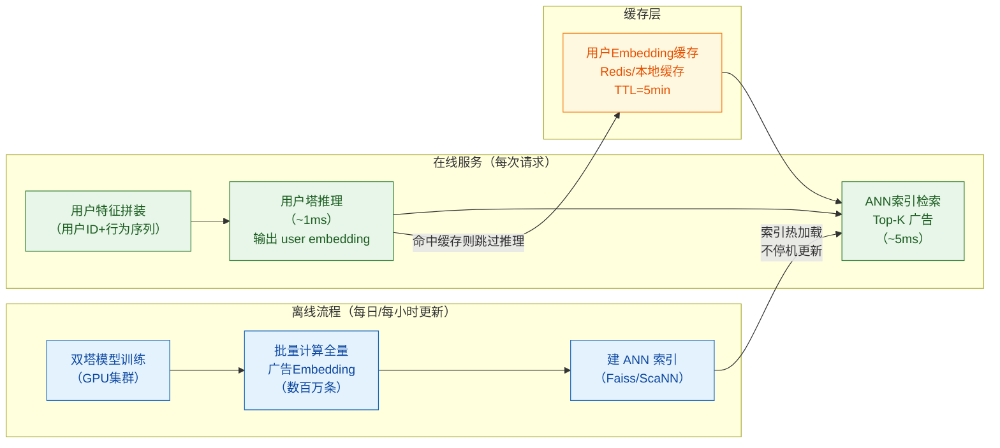
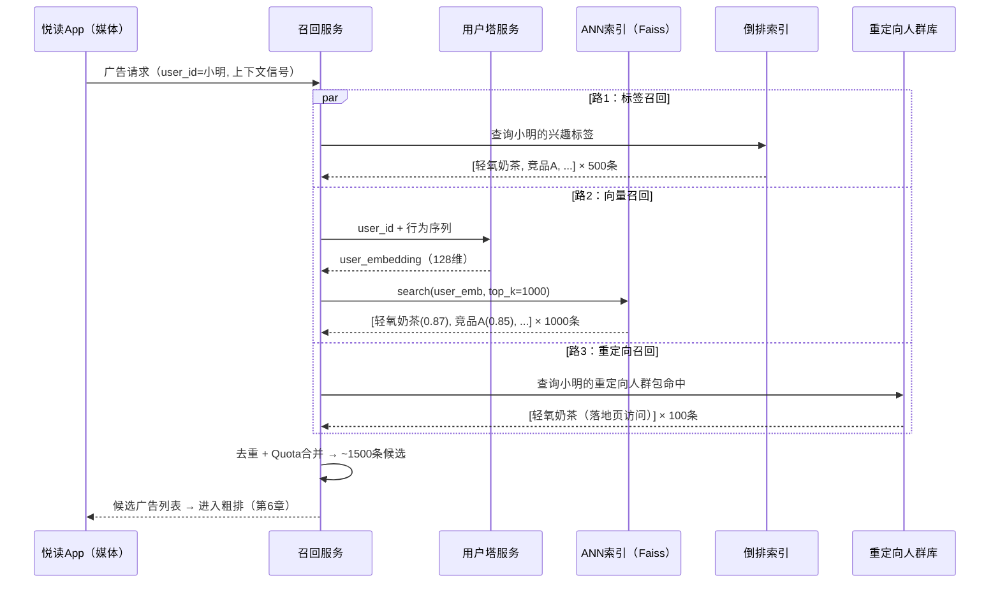

# 第5章 召回（Recall / Matching）

> **全景教程导航**：第4章讲透了定向与广告检索——通过硬条件过滤把全量广告库收窄到满足约束的候选集（详见第4章）。本章接棒，聚焦漏斗的第二层——**召回**：在满足硬约束的基础上，用相关性软匹配进一步把候选池压缩到千级，为后续粗排（第6章）和精排（第7章）做好输入准备。

---

## 本章导读

一次广告请求，经过第4章的定向检索后，候选广告可能还有数万甚至十万量级。粗排和精排模型固然精准，但其计算成本太高，不可能对十万广告逐一打分。召回层要做的事情，用一句话概括：

> **在 30 ms 内，从数万候选中找出与"当前用户 × 当前场景"最相关的 1000～3000 条广告，作为后续精细排序的输入。**

召回决定了推荐的天花板——精排再好，也无法找回被召回层错过的广告。本章系统讲解：

1. 召回的定位、约束与"为什么算法相对简单"
2. 多路召回（Multi-channel Recall）架构：为什么不用单一模型而用多路
3. 各路召回策略的原理与适用场景
4. 广告生命周期与分路召回策略
5. **双塔模型（Two-Tower Model）**深度讲解——业界主流向量召回方案
6. 向量近邻检索（ANN）：HNSW、IVF、PQ 原理与 Faiss 实战代码
7. 召回的样本选择偏差与负采样
8. 召回评估指标体系
9. 贯穿例子：「轻氧奶茶」如何通过三路召回进入候选池

---

## 5.1 召回的定位与约束

### 5.1.1 漏斗视角：召回处于哪一层

广告投放系统是一条多层漏斗（Funnel），每层都在用不同的计算资源与模型复杂度对候选集做筛选：



召回层的核心约束：
- **延迟约束**：整条链路总预算 80～150 ms，召回通常分配 20～40 ms
- **规模约束**：输入可能是数万候选，输出需控制在 1000～3000 以内
- **资源约束**：不能用太重的模型，特征工程也必须简单

这三重约束决定了召回算法的"风格"——**大方向宁可多召回，不可错过相关广告（高覆盖率优先于高精度）**。

### 5.1.2 召回决定推荐天花板

这是一句业界共识，值得深入理解：

精排模型可以从100条候选中选出最好的1条，但它无法从1条候选中"创造"出好广告。如果召回层漏掉了某个高质量广告（例如漏掉了与用户高度相关的"轻氧奶茶"），精排再精确也无能为力。

这个道理在数学上也成立：设全量相关广告集合为 $\mathcal{R}$，召回层召回的集合为 $\mathcal{C}$，则：

$$\text{系统最终质量上界} \propto \frac{|\mathcal{C} \cap \mathcal{R}|}{|\mathcal{R}|}$$

即召回率（Recall Rate）越高，系统天花板越高。因此，**召回层的核心目标是覆盖度（Coverage），而非精度（Precision）**。

### 5.1.3 为什么召回算法相对简单、特征少

从直觉上，精排可以使用数百个特征，深度网络达到数十层；但召回层通常只用几十个特征，模型也相对简单。原因有三：

**原因1：延迟不允许复杂特征工程**

精排在排序百条候选时，可以实时计算"用户历史行为与广告的交叉特征"；但召回要在毫秒内从数万候选中检索，根本来不及为每个候选计算实时特征。

**原因2：向量化检索需要"可分离性"**

主流向量召回（双塔模型）的核心约束是：**用户侧特征和广告侧特征必须完全分离**（解耦）。这样 ad embedding 可以离线预计算，user embedding 在线实时算，然后做快速向量检索。一旦引入"用户×广告"交叉特征，就破坏了这种可分离性，无法高效检索。

**原因3：简单模型的鲁棒性**

过于复杂的召回模型容易过拟合、泛化差，而召回需要"宁可多召回"的鲁棒性。工业界普遍发现，召回用简单特征的双塔效果已经足够好，再复杂的召回模型带来的收益不如把资源留给精排。

---

## 5.2 多路召回（Multi-channel Recall）架构

### 5.2.1 为什么要多路召回

单一召回路（比如只用向量召回）存在明显的风险：

| 问题 | 具体表现 |
|------|---------|
| **单点故障** | 双塔模型服务挂了，整个召回失效，系统无广告可投 |
| **覆盖不全** | 向量召回对冷启动广告效果差（没有足够数据训练 embedding） |
| **无法解释** | 纯向量召回黑盒，广告主投诉"我的广告为什么没出现"时难以排查 |
| **优化目标单一** | 同一个模型难以同时优化覆盖度、新颖性、冷启动等多个目标 |

多路召回用"分工"解决这些问题：每路召回专注一个子目标，多路并行，结果合并。

**三大优势：**
- **鲁棒性**：一路挂掉，其他路正常工作，系统降级而非崩溃
- **灵活性**：新路可以独立上线、ABTest、下线，不影响其他路
- **可解释性**：每路有明确语义（"用户最近30天看过奶茶类广告"路 vs "Lookalike相似用户"路），便于调试和运营

### 5.2.2 多路召回系统架构图



### 5.2.3 多路合并与 Quota 配额

多路召回并行执行后，结果需要合并。关键问题是：各路应该分配多少"名额"？

**去重（Deduplication）**：同一条广告可能同时被多路召回到（比如"轻氧奶茶"既命中了兴趣标签路，又命中了向量召回路），按广告 ID 去重，保留该广告在所有路中的最高分（或用路的优先级决定保留哪路的分数）。

**Quota 配额分配**：设总候选数量上限为 $N$（如2000），各路分配比例如下：

| 召回路 | 典型 Quota 比例 | 说明 |
|--------|--------------|------|
| 定向/标签路 | 20%-30% | 保证广告主意图精确执行 |
| 向量召回路 | 40%-50% | 主力路，相关性最强 |
| 协同过滤路 | 10%-15% | 补充兴趣多样性 |
| 热门兜底路 | 5%-10% | 保底填充，避免候选池过小 |
| 冷启动路 | 5%-10% | 保证新广告探索机会 |
| 重定向路 | 5%-15% | 根据业务重要性动态调整 |

Quota 分配不是固定的，通常通过线上实验（ABTest）动态调优。如果某路质量提升，可以增加其 Quota；如果某路效果变差，减少 Quota 甚至下线。

---

## 5.3 各召回路详解

### 5.3.1 各路召回对比总览

| 召回路 | 核心原理 | 特征复杂度 | 更新频率 | 优点 | 缺点 | 典型场景 |
|--------|---------|-----------|---------|------|------|---------|
| 定向/标签硬匹配 | 倒排索引布尔匹配 | 低（离散标签） | 实时 | 精确、可解释 | 覆盖率有限 | 广告主明确定向 |
| 协同过滤 (CF) | 用户/物品相似度 | 中（行为序列） | 小时级 | 兴趣发现能力强 | 冷启动弱 | 兴趣相关广告 |
| 向量召回 (双塔) | 深度学习 Embedding | 中（稠密特征） | 天级/小时级 | 语义理解深 | 依赖训练数据 | 主力相关性召回 |
| 热门兜底 | 高曝光/高CTR广告 | 无 | 小时级 | 简单稳定 | 无个性化 | 填充兜底 |
| 冷启动广告 | 随机/规则探索 | 低 | 实时 | 解决新广告曝光 | 精度低 | 新上线广告 |
| 重定向 (Retargeting) | 用户行为历史 | 低（行为标记） | 实时 | 转化率极高 | 覆盖人群窄 | 已兴趣用户再触达 |

### 5.3.2 路1：定向/标签硬匹配召回

这一路与第4章的定向检索直接衔接（详见第4章）。核心思路是：

广告主在创建广告时，指定了兴趣标签（如：`兴趣=奶茶&饮品`、`年龄=18-30`、`城市=一线城市`）。系统用**倒排索引**将这些标签映射到对应广告，在线检索时根据用户画像中的标签命中对应广告。

```
用户标签集合：{奶茶爱好者, 女性, 26岁, 上海, iOS用户}
倒排检索：
  "奶茶爱好者" → [广告A, 广告B, 广告C, 轻氧奶茶广告...]
  "女性" → [广告B, 广告D, 轻氧奶茶广告...]
  交集/并集 → 命中广告集合
```

**为什么这一路必不可少**：广告主购买的是精准人群，如果只用相关性模型而不严格执行定向，广告主的投放意图就无法保证。

### 5.3.3 路2：协同过滤（Collaborative Filtering, CF）召回

协同过滤分两类：

**ItemCF（物品协同过滤）**：
- 思路：用户过去交互过的广告 A（点击/转化），找到与 A 最相似的广告 B，则 B 也可能适合这个用户
- 相似度计算：通常用 Jaccard 相似度或余弦相似度，基于"共同交互的用户"计算广告-广告相似矩阵
- 优点：可解释性强（"因为你点击了X，所以推荐Y"）

**UserCF（用户协同过滤）**：
- 思路：找到与当前用户行为相似的用户群体（协同用户），把他们喜欢的广告推荐给当前用户
- 缺点：用户量大时相似用户计算代价高，实际工业场景用得较少

在广告场景下，CF 通常用的是**广告主维度的 ItemCF**：如果用户历史上点击了竞品奶茶的广告，那么"轻氧奶茶"广告与竞品广告的相似度高，CF 路就会召回轻氧奶茶。

### 5.3.4 路3：向量召回（双塔模型 + ANN）

这是本章最重要的召回路，将在 5.4 节和 5.5 节深入展开。

核心思想：
1. 离线训练双塔（Two-Tower）模型，分别学出用户 Embedding $\mathbf{u}$ 和广告 Embedding $\mathbf{v}$
2. 离线将所有广告的 $\mathbf{v}$ 建好 ANN（近似最近邻）索引
3. 在线实时算出当前用户的 $\mathbf{u}$，在 ANN 索引中检索与 $\mathbf{u}$ 最近的 TopK 个广告

这一路兼顾了语义理解深度与检索速度。

### 5.3.5 路4：热门兜底召回

最简单的一路：维护一个热门广告池（按曝光量、CTR、消耗量等指标排序的 Top-N 广告），当其他路召回数量不足时，从热门池补齐。

**热门池的维护**：每小时根据最近 6 小时的曝光、点击数据重新计算热门广告；同时按广告类别分桶（美食热门池、服饰热门池等），避免全是同一类广告。

**重要性**：在极端情况下（用户完全是新用户，所有其他路召回为空），热门兜底路保证系统不会返回空候选集。

### 5.3.6 路5：冷启动广告召回

新广告（刚创建上线，没有任何曝光数据）面临"先有鸡还是先有蛋"的困境：
- 没有曝光 → 没有点击数据 → 双塔模型无法学出准确 Embedding → 召回不到 → 永远没有曝光

冷启动召回路专门解决这个问题：

**策略1：基于广告主的历史数据迁移**
- 同一广告主的历史高效广告的 Embedding，作为新广告 Embedding 的初始化

**策略2：内容理解召回**
- 用多模态模型（文本、图片）理解广告创意的语义，不依赖行为数据
- 例如：轻氧奶茶新创意图片，识别出"饮品、奶茶、年轻女性"等元素，按内容相似度召回

**策略3：随机探索+规则约束**
- 在满足定向条件的广告中，随机或按广告主出价优先抽取新广告曝光机会
- 给新广告保证最低 Quota（如 5%），作为"探索预算"

冷启动召回与成熟期广告召回的策略差异，详见 5.3.8 节。

### 5.3.7 路6：重定向（Retargeting）召回

重定向是效果广告中转化率最高的策略之一。核心思路：

> 用户曾经发生了某种行为（访问了轻氧奶茶落地页、加入购物车但未购买、安装了App但未注册），这说明他对品牌有一定认知，"二次触达"的转化率远高于陌生用户。

**典型重定向信号**：
- `APP_INSTALLED`：安装了广告主的App
- `PAGE_VISIT`：访问了广告主落地页（需要广告主在页面埋监测代码）
- `CART_ADD`：加了购物车/收藏夹
- `PURCHASE`：已购买（这类用户可能做老客回购，也可能做排除避免浪费）

**技术实现**：广告主通过 SDK/API 上传这些用户 ID（或设备 ID），系统建立"重定向人群包"；召回时检查当前用户是否在某个广告主的重定向人群包中。

重定向召回通常分配较高的 Quota，因为这部分广告的 ROI 极高。

### 5.3.8 广告生命周期与分路策略

不同生命周期的广告，适合不同的召回路：



| 生命周期 | 主要召回路 | 优化目标 | 典型 Quota 占比 |
|---------|-----------|---------|----------------|
| 冷启动期（0-1000曝光）| 冷启动探索路、内容理解路 | 积累曝光、验证创意质量 | 5-10%（探索预算）|
| 成长期（1K-10K曝光）| 定向路 + 轻量CF路 | CTR提升、定向优化 | 15-25% |
| 成熟期（>10K曝光）| 双塔向量路（主）+ CF路 + 重定向路 | ROI最大化、规模扩展 | 50-70% |
| 衰退期 | 热门兜底路（剩余预算消耗）| 余量清投 | 视剩余预算 |

---

## 5.4 双塔模型（Two-Tower Model）深度讲解

### 5.4.1 双塔模型的核心直觉

**问题**：如何定义"用户 $u$ 和广告 $v$ 的相关性"？

传统做法是把用户特征和广告特征拼接后输入一个大模型。但这带来问题：每次召回需要对每个候选广告都执行一次完整的神经网络前向传播，延迟不可接受。

双塔模型（Two-Tower Model，又称 DSSM, Deep Structured Semantic Model）的核心创新：

```
用户塔（User Tower）：f(用户特征) → 用户 Embedding u ∈ ℝ^d
广告塔（Ad Tower）：g(广告特征) → 广告 Embedding v ∈ ℝ^d
相关性分数：score(u, v) = u · v  （内积）
```

**解耦的威力**：
- 广告 Embedding $\mathbf{v}$ 与具体用户无关，可以**离线批量预计算**，建好 ANN 索引
- 在线服务只需要实时计算**当前用户的 Embedding** $\mathbf{u}$（一次前向传播）
- 然后在 ANN 索引中检索与 $\mathbf{u}$ 最近的 TopK 个 $\mathbf{v}$

这就是为什么双塔能做到毫秒级召回——**把 N×M 的计算转化成 1（用户侧）+ N（广告侧离线）+ O(log N)（ANN检索）**。

### 5.4.2 模型结构详解



### 5.4.3 相似度函数的选择

双塔的相似度函数有三种常见选择：

**内积（Inner Product / Dot Product）**：

$$\text{score}(u, v) = \mathbf{u}^{\top} \mathbf{v} = \sum_{i=1}^{d} u_i v_i$$

- 不要求向量归一化，允许模型通过向量模长表达置信度/热度
- 缺点：向量模长差异大时，热门广告可能因模长大而被过度召回

**余弦相似度（Cosine Similarity）**：

$$\text{score}(u, v) = \frac{\mathbf{u}^{\top} \mathbf{v}}{\|\mathbf{u}\| \cdot \|\mathbf{v}\|}$$

- 只关注方向，不关注模长
- 等价于先对 $\mathbf{u}$ 和 $\mathbf{v}$ 做 L2 归一化，再做内积：$\hat{\mathbf{u}}^{\top} \hat{\mathbf{v}}$
- 业界通常选择这种方式：输出层接 L2 归一化层

**欧氏距离（Euclidean Distance）**：

$$\text{score}(u, v) = -\|\mathbf{u} - \mathbf{v}\|_2$$

- 负号使得"距离越小，分数越高"
- 不如内积友好，ANN 检索通常也以内积或L2距离为基础

**工业界推荐**：先 L2 归一化，再用内积。这样既有余弦相似度的稳定性，又能直接用 ANN 内积检索。

### 5.4.4 训练方式：In-Batch Negative Sampling（批内负采样）

**问题**：双塔是一个"用户是否对广告感兴趣"的二分类问题。正样本（点击/转化）容易获取，但负样本怎么选？

**朴素方法**：随机负采样（Random Negative Sampling）
- 从全量广告中随机抽取未点击广告作为负样本
- 问题：大量"easy negative"（明显不相关），模型学不到有区分度的 Embedding

**In-Batch Negative Sampling（批内负采样）**：

设一个 mini-batch 有 $B$ 个正样本对 $(u_i, v_i)$，$i = 1, \ldots, B$。

对于第 $i$ 个用户 $u_i$，将同一 batch 中其他用户对应的广告 $v_j$（$j \neq i$）视为其负样本。这样每个 batch 的负样本数量从 $1$ 膨胀到 $B-1$，且这些负样本来自真实的广告分布（其他用户真实点击的广告），是"hard negative"。

训练目标：使正样本对的相似度高于所有负样本对：

$$\mathcal{L} = -\frac{1}{B} \sum_{i=1}^{B} \log \frac{\exp(\text{score}(u_i, v_i) / \tau)}{\sum_{j=1}^{B} \exp(\text{score}(u_i, v_j) / \tau)}$$

其中 $\tau$（tau）是**温度系数（Temperature）**，通常取 0.05～0.2。

**温度系数 $\tau$ 的作用**：

$$\text{softmax 输出} = \frac{\exp(s_{ii}/\tau)}{\sum_j \exp(s_{ij}/\tau)}$$

- $\tau$ 越小：softmax 越"尖锐"，模型对最高分项的区分更激进，难训练但效果可能更好
- $\tau$ 越大：softmax 越"平滑"，梯度更稳定，但 Embedding 区分度下降
- 典型值：0.05～0.1

这个损失函数本质上是 **Sampled Softmax Loss**（采样 Softmax 损失），也叫 InfoNCE（Noise Contrastive Estimation）。

**In-Batch 的一个注意点**：如果 batch 中恰好有两个正样本广告相同（广告 B 同时被用户 $i$ 和用户 $j$ 点击），那么对用户 $i$ 来说，广告 B 既是正样本又是"负样本"，会引入噪声。工业界通常加一个**去重mask**，把 batch 内同一广告的重复项从负样本中排除。

**矫正偏差（Correction for Sampling Bias）**：

In-Batch 采样不是均匀的——热门广告（被点击次数多）在 batch 中出现的概率更高，容易成为他人的"负样本"，导致热门广告的 Embedding 被拖拽偏移。矫正方法（Google 2019论文）：

$$\text{corrected\_score}(u_i, v_j) = \text{score}(u_i, v_j) - \log p(v_j)$$

其中 $p(v_j)$ 是广告 $j$ 在训练数据中的出现概率（热门广告 $p$ 大，分数被减小，相当于降低其"被错误排到前面"的概率）。

### 5.4.5 PyTorch 简化代码实现

```python
import torch
import torch.nn as nn
import torch.nn.functional as F

class UserTower(nn.Module):
    """
    用户塔：接收用户特征，输出 L2 归一化后的用户 Embedding
    """
    def __init__(self, user_vocab_size: int, item_vocab_size: int, embed_dim: int = 64, output_dim: int = 128):
        super().__init__()
        # 用户 ID 嵌入：稀疏 ID → 稠密向量
        self.user_embed = nn.Embedding(user_vocab_size, embed_dim, padding_idx=0)
        # 历史行为序列中的广告 ID 嵌入（复用 Ad Tower 的嵌入也是一种做法）
        self.item_embed = nn.Embedding(item_vocab_size, embed_dim, padding_idx=0)
        
        # MLP：输入维度 = user_embed + 行为序列平均池化
        self.mlp = nn.Sequential(
            nn.Linear(embed_dim * 2, 256),
            nn.ReLU(),
            nn.Linear(256, output_dim),
        )
    
    def forward(self, user_id: torch.Tensor, hist_item_ids: torch.Tensor) -> torch.Tensor:
        """
        Args:
            user_id: (batch_size,) 用户 ID
            hist_item_ids: (batch_size, seq_len) 历史行为序列中的广告 ID
        Returns:
            user_emb: (batch_size, output_dim) L2 归一化的用户 Embedding
        """
        # 用户 ID → 嵌入
        uid_emb = self.user_embed(user_id)  # (B, embed_dim)
        
        # 历史行为序列 → 平均池化
        # padding_idx=0，需要 mask 掉 padding 位置
        mask = (hist_item_ids != 0).float().unsqueeze(-1)  # (B, seq_len, 1)
        item_embs = self.item_embed(hist_item_ids)          # (B, seq_len, embed_dim)
        # 对非 padding 位置求平均
        seq_emb = (item_embs * mask).sum(dim=1) / (mask.sum(dim=1) + 1e-8)  # (B, embed_dim)
        
        # 拼接用户 ID 嵌入和行为序列嵌入
        combined = torch.cat([uid_emb, seq_emb], dim=-1)  # (B, embed_dim * 2)
        
        # MLP 映射到输出空间
        output = self.mlp(combined)  # (B, output_dim)
        
        # L2 归一化：使得内积等价于余弦相似度
        return F.normalize(output, p=2, dim=-1)


class AdTower(nn.Module):
    """
    广告塔：接收广告特征，输出 L2 归一化后的广告 Embedding
    可离线批量预计算，建好 ANN 索引
    """
    def __init__(self, ad_vocab_size: int, industry_vocab_size: int, embed_dim: int = 64, output_dim: int = 128):
        super().__init__()
        # 广告 ID 嵌入
        self.ad_embed = nn.Embedding(ad_vocab_size, embed_dim, padding_idx=0)
        # 行业类别嵌入
        self.industry_embed = nn.Embedding(industry_vocab_size, embed_dim, padding_idx=0)
        
        self.mlp = nn.Sequential(
            nn.Linear(embed_dim * 2, 256),
            nn.ReLU(),
            nn.Linear(256, output_dim),
        )
    
    def forward(self, ad_id: torch.Tensor, industry_id: torch.Tensor) -> torch.Tensor:
        """
        Args:
            ad_id: (batch_size,) 广告 ID
            industry_id: (batch_size,) 广告行业类别 ID
        Returns:
            ad_emb: (batch_size, output_dim) L2 归一化的广告 Embedding
        """
        ad_emb = self.ad_embed(ad_id)               # (B, embed_dim)
        ind_emb = self.industry_embed(industry_id)   # (B, embed_dim)
        combined = torch.cat([ad_emb, ind_emb], dim=-1)
        output = self.mlp(combined)
        return F.normalize(output, p=2, dim=-1)


class TwoTowerModel(nn.Module):
    """
    双塔模型：user tower + ad tower
    训练时用 In-Batch Negative Sampling + 温度缩放的 Softmax Loss
    """
    def __init__(self, user_vocab_size: int, item_vocab_size: int,
                 ad_vocab_size: int, industry_vocab_size: int,
                 embed_dim: int = 64, output_dim: int = 128, temperature: float = 0.07):
        super().__init__()
        self.user_tower = UserTower(user_vocab_size, item_vocab_size, embed_dim, output_dim)
        self.ad_tower = AdTower(ad_vocab_size, industry_vocab_size, embed_dim, output_dim)
        # 温度系数 τ：控制 softmax 的锐利程度
        self.temperature = temperature
    
    def forward(self, user_id, hist_item_ids, ad_id, industry_id):
        """
        前向传播：计算 user embedding 和 ad embedding
        训练时 batch 内的广告互为对方的负样本
        """
        # 用户塔前向
        user_emb = self.user_tower(user_id, hist_item_ids)  # (B, D)
        # 广告塔前向
        ad_emb = self.ad_tower(ad_id, industry_id)          # (B, D)
        return user_emb, ad_emb
    
    def compute_loss(self, user_emb: torch.Tensor, ad_emb: torch.Tensor) -> torch.Tensor:
        """
        In-Batch Negative Sampling 损失
        对角线是正样本对，非对角线是负样本对（同 batch 其他广告）
        
        Args:
            user_emb: (B, D) 用户 Embedding
            ad_emb: (B, D) 广告 Embedding
        Returns:
            loss: 标量，In-Batch Softmax 损失
        """
        batch_size = user_emb.size(0)
        
        # 计算相似度矩阵 S[i,j] = user_emb[i] · ad_emb[j]
        # 形状：(B, B)，S[i,i] 是正样本对，S[i,j] (j≠i) 是负样本对
        sim_matrix = torch.matmul(user_emb, ad_emb.T) / self.temperature  # (B, B)
        
        # 标签：每行的正样本是对角线位置（第 i 个用户的正样本是第 i 个广告）
        labels = torch.arange(batch_size, device=user_emb.device)
        
        # Cross-Entropy Loss 等价于 Sampled Softmax Loss
        # 第 i 行：softmax([S[i,0], S[i,1], ..., S[i,B-1]])，标签为 i（第 i 项最大）
        loss = F.cross_entropy(sim_matrix, labels)
        return loss


# ===== 训练示例 =====
def train_step_example():
    """演示一个训练步骤（简化版）"""
    # 模型超参数
    model = TwoTowerModel(
        user_vocab_size=10_000_000,    # 用户数
        item_vocab_size=5_000_000,     # 历史行为中的广告/物品数
        ad_vocab_size=2_000_000,       # 广告数
        industry_vocab_size=500,       # 行业类别数
        embed_dim=64,
        output_dim=128,
        temperature=0.07               # 温度系数 τ
    )
    optimizer = torch.optim.Adam(model.parameters(), lr=1e-4)
    
    # 模拟一个 batch（B=256 个正样本对）
    batch_size = 256
    user_id = torch.randint(0, 10_000_000, (batch_size,))
    hist_item_ids = torch.randint(0, 5_000_000, (batch_size, 50))  # 50条历史行为
    hist_item_ids[:, 30:] = 0  # padding：后20位置零
    ad_id = torch.randint(0, 2_000_000, (batch_size,))
    industry_id = torch.randint(0, 500, (batch_size,))
    
    # 前向传播
    user_emb, ad_emb = model(user_id, hist_item_ids, ad_id, industry_id)
    
    # 计算 In-Batch Softmax Loss
    loss = model.compute_loss(user_emb, ad_emb)
    
    # 反向传播
    optimizer.zero_grad()
    loss.backward()
    optimizer.step()
    
    print(f"Loss: {loss.item():.4f}")
    print(f"User Embedding shape: {user_emb.shape}")  # (256, 128)
    print(f"Ad Embedding shape: {ad_emb.shape}")      # (256, 128)
    
    return model


if __name__ == "__main__":
    trained_model = train_step_example()
```

### 5.4.6 双塔模型的工程部署



**用户 Embedding 缓存**：用户 Embedding 计算需要 MLP 推理，约 1ms。对于高活跃用户，其行为序列变化不频繁，可以缓存 Embedding（TTL 5分钟）。当用户有新的点击行为时，触发 Embedding 更新。

---

## 5.5 向量近邻检索（ANN）工程实践

### 5.5.1 为什么不能暴力检索

假设广告库有 100 万条广告（实际可能更多），每条广告的 Embedding 是 128 维 float32 向量，一次精确最近邻检索需要：

$$\text{计算量} = 1,000,000 \times 128 \text{ 次乘法/加法} \approx 1.28 \times 10^8 \text{ 次浮点操作}$$

在单 CPU 上约需 10-50ms，无法满足召回层 5-10ms 的延迟要求。更关键的是，向量检索需要扩展到多副本并发，暴力检索的内存和 CPU 压力都无法支撑。

**ANN（Approximate Nearest Neighbor，近似最近邻）**牺牲少量精度换取数量级的性能提升，是工业界的标准解法。

### 5.5.2 三种主流 ANN 算法原理

#### IVF（倒排文件索引，Inverted File Index）

**原理**：
1. 离线用 K-Means 对全量广告向量聚类，得到 $k$ 个聚类中心（Centroids）
2. 建索引：每个广告向量分配到最近的聚类中心，建立"倒排列表"（每个中心 → 该中心附近的向量列表）
3. 在线检索：计算 query 向量与所有聚类中心的距离，选出最近的 $n_{probe}$ 个中心，只在这 $n_{probe}$ 个倒排列表中搜索

**参数**：
- $k$（聚类数）：通常 $k \sim \sqrt{N}$（N 为向量总数）
- $n_{probe}$（探针数）：越大越精确但越慢；通常 $n_{probe} = 8 \sim 64$

**适用**：百万级以上向量，对召回率要求 90%+ 可接受时

#### HNSW（分层可导航小世界图，Hierarchical Navigable Small World）

**原理**：受"六度分隔理论"启发，构建一个多层图结构：
- 最顶层：稀疏图，少量节点，跨度大（"高速公路"）
- 底层：稠密图，所有节点都在，跨度小（"城市道路"）
- 查询时从顶层入口开始，贪心地沿着"最近邻方向"逐层下降，直到底层

**优点**：
- 检索精度高（召回率 95%+）
- 支持动态增删向量（IVF 需要重新聚类）
- 延迟极低（几毫秒）

**缺点**：
- 内存占用大（需要存储图结构）
- 建索引时间较长

**参数**：
- $M$（每个节点的最大邻居数）：通常 16-64，越大越精确但内存越大
- $efConstruction$（建索引时的探索宽度）
- $efSearch$（查询时的探索宽度）

**适用**：千万级以内向量，对精度要求极高，内存充裕

#### PQ（乘积量化，Product Quantization）

**原理**：向量压缩技术，可与 IVF/HNSW 组合使用：
1. 将 128 维向量切分为 $m$ 个子向量（如 $m=8$，每段 16 维）
2. 对每段子向量分别做 K-Means 量化（每段 256 个中心），用 1 字节（8 bits）的中心 ID 表示
3. 原始 128 维 × 4 bytes = 512 bytes → 压缩后 8 bytes（64倍压缩）

**优点**：极大降低内存占用，支持十亿级向量索引

**缺点**：有量化误差，精度低于 HNSW；需要先 IVF 粗筛

**适用**：超大规模（十亿+）向量，内存受限场景

#### 各算法对比

| 算法 | 检索精度 | 检索速度 | 内存占用 | 支持增量更新 | 典型场景 |
|------|---------|---------|---------|------------|---------|
| 暴力检索 (Flat) | 100% | 慢（O(N)）| 高 | 是 | 小规模基准测试 |
| IVF | 90-95% | 快 | 中 | 需重建 | 百万-千万级 |
| HNSW | 95-99% | 极快 | 高 | 是 | 精度要求高 |
| IVF + PQ | 85-90% | 极快 | 极低 | 否 | 十亿级，内存受限 |

### 5.5.3 Faiss 工具介绍与代码示例

**Faiss**（Facebook AI Similarity Search）是 Meta 开源的向量检索库，是工业界最常用的 ANN 工具。

```python
import faiss
import numpy as np
import torch

# ===== 离线：建 ANN 索引 =====

def build_faiss_index(ad_embeddings: np.ndarray, index_type: str = "IVF") -> faiss.Index:
    """
    建 Faiss ANN 索引
    
    Args:
        ad_embeddings: (num_ads, embedding_dim) 广告向量矩阵，float32，已 L2 归一化
        index_type: "IVF" 或 "HNSW"
    Returns:
        index: 建好的 Faiss 索引
    """
    num_ads, embedding_dim = ad_embeddings.shape
    print(f"Building index: {num_ads} ads, {embedding_dim}d embeddings")
    
    if index_type == "IVF":
        # IVF + 内积（IndexFlatIP 作为量化器）
        # nlist：聚类中心数，通常 = sqrt(num_ads)
        nlist = int(np.sqrt(num_ads))
        
        # 量化器：暴力计算聚类中心距离
        quantizer = faiss.IndexFlatIP(embedding_dim)
        
        # IVF 索引：用内积相似度（METRIC_INNER_PRODUCT）
        # L2 归一化后，内积等价于余弦相似度
        index = faiss.IndexIVFFlat(quantizer, embedding_dim, nlist, faiss.METRIC_INNER_PRODUCT)
        
        # 训练：对数据做 K-Means 聚类，必须在 add 之前调用
        assert not index.is_trained
        index.train(ad_embeddings)
        assert index.is_trained
        
        # 设置查询时搜索的聚类中心数（探针数），越大越精确但越慢
        index.nprobe = 32
        
    elif index_type == "HNSW":
        # HNSW 索引：M=32（每个节点最多32个邻居）
        M = 32
        index = faiss.IndexHNSWFlat(embedding_dim, M, faiss.METRIC_INNER_PRODUCT)
        # efConstruction：建索引时的探索宽度，越大越精确但建索引越慢
        index.hnsw.efConstruction = 200
        # efSearch：查询时的探索宽度
        index.hnsw.efSearch = 128
    
    else:
        raise ValueError(f"Unknown index type: {index_type}")
    
    # 添加广告向量（注意要 float32 且 C 连续内存）
    ad_embeddings = np.ascontiguousarray(ad_embeddings, dtype=np.float32)
    index.add(ad_embeddings)
    
    print(f"Index built: {index.ntotal} vectors indexed")
    return index


def save_and_load_index(index: faiss.Index, path: str):
    """保存和加载索引（用于离线→在线热加载）"""
    # 保存
    faiss.write_index(index, path)
    print(f"Index saved to {path}")
    
    # 加载
    loaded_index = faiss.read_index(path)
    print(f"Index loaded from {path}, {loaded_index.ntotal} vectors")
    return loaded_index


# ===== 在线：用户 Embedding 检索 TopK 广告 =====

def recall_top_k_ads(
    user_embedding: np.ndarray,
    faiss_index: faiss.Index,
    ad_id_mapping: np.ndarray,
    top_k: int = 1000
) -> list:
    """
    用用户 Embedding 在 Faiss 索引中检索 TopK 广告
    
    Args:
        user_embedding: (1, embedding_dim) 用户向量，L2 归一化，float32
        faiss_index: 已建好的 Faiss 索引
        ad_id_mapping: 索引位置 → 广告 ID 的映射数组（长度 = num_ads）
        top_k: 召回数量
    Returns:
        [(ad_id, score), ...] 按相关性分数降序排列
    """
    # 确保输入格式正确
    user_embedding = np.ascontiguousarray(
        user_embedding.reshape(1, -1), dtype=np.float32
    )
    
    # Faiss 检索：返回 distances（内积分数）和 indices（索引位置）
    scores, indices = faiss_index.search(user_embedding, top_k)
    
    # 将索引位置转为广告 ID
    results = []
    for score, idx in zip(scores[0], indices[0]):
        if idx == -1:
            # Faiss 返回 -1 表示该位置没有足够的候选（一般不会发生）
            continue
        ad_id = int(ad_id_mapping[idx])
        results.append((ad_id, float(score)))
    
    return results  # [(ad_id, similarity_score), ...]


# ===== 完整示例 =====

def full_pipeline_example():
    """端到端示例：建索引 + 检索"""
    np.random.seed(42)
    
    # 模拟参数
    num_ads = 1_000_000      # 100万广告
    embedding_dim = 128      # Embedding 维度
    
    # 模拟广告 Embedding（实际由 Ad Tower 离线批量计算）
    print("Generating mock ad embeddings...")
    ad_embeddings = np.random.randn(num_ads, embedding_dim).astype(np.float32)
    # L2 归一化（双塔输出层已做归一化，这里重复一次）
    norms = np.linalg.norm(ad_embeddings, axis=1, keepdims=True)
    ad_embeddings /= norms
    
    # 广告 ID 映射（索引位置 i → 真实广告 ID）
    # 实际中从数据库或文件加载
    ad_id_mapping = np.arange(1000001, 1000001 + num_ads)  # 模拟广告 ID
    
    # 1. 建 IVF 索引
    print("\n--- Building IVF Index ---")
    ivf_index = build_faiss_index(ad_embeddings, index_type="IVF")
    
    # 2. 模拟一次在线召回：用户发起请求
    print("\n--- Online Recall ---")
    # 模拟用户 Embedding（实际由 User Tower 在线推理得到）
    user_emb = np.random.randn(embedding_dim).astype(np.float32)
    user_emb /= np.linalg.norm(user_emb)  # L2 归一化
    
    # 3. ANN 检索 TopK 广告
    import time
    start = time.time()
    top_ads = recall_top_k_ads(user_emb, ivf_index, ad_id_mapping, top_k=1000)
    elapsed_ms = (time.time() - start) * 1000
    
    print(f"Recalled {len(top_ads)} ads in {elapsed_ms:.2f}ms")
    print(f"Top 5 ads by similarity:")
    for i, (ad_id, score) in enumerate(top_ads[:5]):
        print(f"  #{i+1}: ad_id={ad_id}, similarity={score:.4f}")
    
    # 4. 验证精度：对比暴力检索
    flat_index = faiss.IndexFlatIP(embedding_dim)
    flat_index.add(ad_embeddings)
    _, flat_indices = flat_index.search(user_emb.reshape(1, -1), 1000)
    
    ivf_set = set(indices for _, indices in [(s, ad_id_mapping[i]) for s, i in 
                   zip(ivf_index.search(user_emb.reshape(1,-1), 1000)[0][0],
                       ivf_index.search(user_emb.reshape(1,-1), 1000)[1][0])])
    flat_set = set(int(ad_id_mapping[i]) for i in flat_indices[0])
    
    recall_at_1000 = len(ivf_set & flat_set) / len(flat_set)
    print(f"\nIVF Recall@1000 vs BruteForce: {recall_at_1000:.1%}")


if __name__ == "__main__":
    full_pipeline_example()
```

**典型性能参数（1000万广告，128维，8核CPU）**：

| 索引类型 | 建索引时间 | 查询延迟（P50）| 召回率（@1000）| 内存占用 |
|---------|-----------|--------------|----------------|---------|
| 暴力 (Flat) | ~1min | ~80ms | 100% | ~5GB |
| IVF (nprobe=32) | ~10min | ~5ms | ~93% | ~5GB |
| HNSW (M=32) | ~30min | ~2ms | ~98% | ~8GB |
| IVF+PQ (m=32) | ~15min | ~3ms | ~87% | ~80MB |

---

## 5.6 召回的样本选择偏差与负采样

### 5.6.1 样本选择偏差（Sample Selection Bias）

双塔模型的训练数据来自历史日志——哪些广告曾经被曝光（所以才有点击/不点击的记录）。问题来了：

**只有被召回 → 曝光的广告才有训练数据，没被召回的广告永远没有数据。**

这造成了一个恶性循环：
```
历史模型召回了广告A（没有B）
→ 只有A被曝光，有了A的正负样本
→ 新模型用这批数据训练，更偏向A
→ B永远学不到，召回不到
```

这在推荐系统文献中称为**曝光偏差（Exposure Bias）**或**位置偏差（Position Bias）**，广告召回同样面临这个问题。

**缓解策略**：
- **探索预算**：保留 5-10% 的流量给随机探索，给非主流广告曝光机会
- **反事实修正**（Counterfactual）：用 IPS（Inverse Propensity Score）加权修正偏差
- **无偏负采样**：使用全量广告集随机负采样，而非仅从曝光未点击中取

### 5.6.2 负采样策略

双塔训练的负样本质量对模型效果至关重要：

**Easy Negative（简单负样本）**：与正样本完全不相关的广告（如奶茶广告的负样本是汽车广告）。模型容易学会区分，但训练价值低，学不到细粒度判别能力。

**Hard Negative（难负样本）**：与正样本相似但用户最终未点击的广告（如用户看了轻氧奶茶但没点击，而点击了竞品奶茶）。这类样本让模型学会"为什么选A不选B"，训练价值高。

**In-Batch Negative**：如前所述，利用同 batch 其他用户的正样本广告作为当前用户的负样本，是效率与效果的平衡。

**混合策略**（工业界常用）：

$$\text{负样本} = \alpha \times \text{In-Batch Negative} + \beta \times \text{Hard Negative} + \gamma \times \text{Random Negative}$$

其中 $\alpha + \beta + \gamma = 1$，典型值 $\alpha=0.7, \beta=0.2, \gamma=0.1$。

Hard Negative 的获取通常是：对每个正样本用户 $u$，从向量索引中找到 $u$ 的 Top-100 相关广告（但排除已点击的），从中随机抽取几个作为 Hard Negative。

负采样的详细分析将在精排章节（第7章）进一步展开，包括曝光未点击样本的使用策略。

---

## 5.7 召回评估指标体系

### 5.7.1 离线评估指标

**召回率 Recall@K**：

$$\text{Recall@K} = \frac{|\text{实际点击广告} \cap \text{召回TopK广告}|}{|\text{实际点击广告}|}$$

含义：用户实际点击的广告中，有多少比例被召回到了 TopK 候选集里。

计算方式：在验证集上，对每个（用户，时间段）对，用该时间段之前的数据计算 user embedding，检索 TopK，统计 Recall@K。

**典型标准**：工业界通常要求 Recall@1000 ≥ 85%（即用户实际点击的广告，至少 85% 能被召回进候选）。

**命中率 Hit Rate（HR@K）**：

$$\text{HR@K} = \frac{\text{召回TopK中包含至少1个点击广告的样本数}}{\text{总样本数}}$$

与 Recall@K 的区别：HR@K 是"有没有命中"的二值衡量，Recall@K 是"命中了多少比例"。

**覆盖度（Coverage）**：

$$\text{Coverage} = \frac{|\text{在验证集上至少被召回一次的广告集合}|}{|\text{全量广告}|}$$

衡量召回系统对广告库的探索能力。如果 Coverage 过低，说明系统只反复召回少数热门广告，忽略了长尾广告（有损广告主公平性）。

### 5.7.2 在线评估与离线-在线 Gap

召回层的离线评估有一个天然的局限——用历史数据评估时，我们的"ground truth"（用户点击）本身就来自于历史召回系统的结果，存在前述的曝光偏差。

**离线-在线 Gap 的来源**：
1. 偏差：离线 ground truth 只包含历史曝光的广告
2. 分布漂移：用户兴趣随时间变化，历史数据不能反映当前状态
3. 系统交互：召回→粗排→精排的全链路效果不等于召回单独的效果

**在线指标（需要 ABTest 衡量）**：
- 全链路 CTR 提升（召回路增减对最终点击的影响）
- 全链路 CVR 和 ROI 变化
- 广告主投放达标率（广告主的预算消耗率）

**标准做法**：离线 Recall@K 用于快速筛选方案，最终上线效果以 ABTest 在线指标为准。

---

## 5.8 贯穿例子：轻氧奶茶的三路召回

让我们用「轻氧奶茶」和「悦读App」的具体场景，串联本章所有知识点。

### 5.8.1 场景描述

- **用户**：小明，28岁，悦读App高活用户，最近读了3本都市言情小说，历史上点击过3个奶茶/饮品广告
- **当前时刻**：悦读App章节间隙，触发广告请求
- **轻氧奶茶广告**：已上线2周，成熟期广告，定向条件：`城市=上海 AND 年龄=18-35 AND 兴趣∋{奶茶,饮品,生活方式}`

### 5.8.2 定向检索阶段（第4章）→ 过滤

系统先执行硬过滤（详见第4章）：
```
小明画像：{城市=上海, 年龄=28, 兴趣=[都市言情, 奶茶, 美食], iOS用户}

定向检索结果：
  满足"城市=上海 AND 年龄=18-35 AND 兴趣∋奶茶"的广告集合：
  [轻氧奶茶广告, 竞品A奶茶广告, 竞品B奶茶广告, ...]（假设共5万条广告通过硬过滤）
```

### 5.8.3 三路召回并行执行

**路1：兴趣标签召回**

```
小明的兴趣标签：{奶茶爱好者, 都市言情读者, 美食爱好者}
倒排检索"奶茶爱好者"标签 → 命中：[轻氧奶茶广告, 竞品A, 竞品B, ...]
轻氧奶茶广告被召回（兴趣标签路）✓
```

**路2：Lookalike 向量召回（双塔）**

```
在线流程：
1. 实时拼装小明的用户特征：
   - user_id = 12345678
   - hist_item_ids = [奶茶广告X, 饮品广告Y, 奶茶广告Z, ...]（最近50次行为）
   
2. 用户塔推理（~1ms）：
   user_emb = UserTower(user_id=12345678, hist_item_ids=[...])
   → user_emb ∈ ℝ^128，L2归一化后 ‖user_emb‖=1
   
3. ANN 检索（IVF索引，nprobe=32，~5ms）：
   faiss_index.search(user_emb, top_k=1000)
   → 返回与小明 Embedding 最相近的1000个广告
   → 其中包含：轻氧奶茶广告（相似度=0.87）、竞品A（0.85）、...
   
轻氧奶茶广告被召回（向量召回路）✓
```

**路3：重定向召回**

```
系统查询：小明(user_id=12345678)是否在任何广告主的重定向人群包中？
  → 检查：轻氧奶茶维护了"7日内曾浏览落地页"人群包
  → 小明5天前曾点击过轻氧奶茶的广告但未下单，进入了该人群包
  → 命中！

轻氧奶茶广告被召回（重定向路）✓
```

### 5.8.4 合并与去重

```
路1（标签路）召回：500条广告，轻氧奶茶 ∈ 其中
路2（向量路）召回：1000条广告，轻氧奶茶 ∈ 其中（相似度 0.87）
路3（重定向路）召回：100条广告，轻氧奶茶 ∈ 其中

去重：轻氧奶茶出现在路1、路2、路3，取最高分（路2给出0.87）
Quota 合并：
  路1配额500条，路2配额1000条，路3配额100条，热门兜底200条
  → 去重后总候选约1500条（含轻氧奶茶）

轻氧奶茶广告进入候选池，进入粗排（第6章）→ 精排（第7章） → 竞价 → 曝光
```

### 5.8.5 小结流程图



---

## 本章小结

本章系统讲解了广告投放漏斗的**召回层**，核心要点如下：

| 知识点 | 关键结论 |
|--------|---------|
| **召回定位** | 把定向过滤后的候选（数万级）压缩到千级；追求覆盖度优于精度；召回决定系统天花板 |
| **算法简单的原因** | 延迟约束不允许复杂特征；双塔可分离性要求用户/广告特征解耦 |
| **多路召回** | 并行多路 = 鲁棒性 + 灵活性 + 可解释性；各路设置 Quota 配额 |
| **双塔模型** | 用户塔+广告塔分别学 Embedding；内积/余弦度量相似度；广告 Embedding 离线建 ANN 索引 |
| **In-Batch Negative** | 同 batch 其他广告互为负样本；温度系数 τ 控制 softmax 锐利度 |
| **ANN 检索** | IVF 适合百万级，HNSW 精度高，IVF+PQ 适合十亿级；Faiss 是工业标准库 |
| **样本偏差** | 曝光偏差导致循环；Hard Negative 提升训练质量 |
| **评估指标** | Recall@K（主要离线指标）；线上用 ABTest 全链路 CTR/CVR |

**技能点检查**（读者可自测）：

- [ ] 能否说出"为什么召回特征要简单"的三个原因？
- [ ] 能否画出双塔的训练与推理流程（离线建索引 vs 在线检索）？
- [ ] 能否解释 In-Batch Negative Sampling 的损失函数中温度系数 τ 的作用？
- [ ] 能否区分 IVF 和 HNSW 的适用场景？
- [ ] 能否描述轻氧奶茶广告通过三路召回进入候选池的完整流程？

**下一章预告**：候选集经过召回层后，进入**粗排（第6章）**。粗排要用比召回复杂、比精排简单的模型，在百级时间内把千级候选压缩到百级，同时兼顾计算效率与预测精度。敬请期待。

---

## 参考来源

1. **Yi, X., et al. (2019). Sampling-Bias-Corrected Neural Modeling for Large Corpus Item Recommendations.** RecSys 2019. https://dl.acm.org/doi/10.1145/3298689.3346996
   - Google 双塔召回的奠基论文，提出 in-batch negative sampling 与 sampling bias correction

2. **Huang, P. S., et al. (2013). Learning Deep Structured Semantic Models for Web Search using Clickthrough Data.** CIKM 2013. https://dl.acm.org/doi/10.1145/2505515.2505665
   - DSSM（深度语义结构模型）原论文，双塔模型的早期工作

3. **Johnson, J., Douze, M., & Jégou, H. (2019). Billion-scale similarity search with GPUs.** IEEE Transactions on Big Data. https://arxiv.org/abs/1702.08734
   - Faiss 论文，详细描述 IVF、PQ 及 GPU 加速

4. **Malkov, Y. A., & Yashunin, D. A. (2018). Efficient and robust approximate nearest neighbor search using hierarchical navigable small world graphs.** IEEE TPAMI. https://arxiv.org/abs/1603.09320
   - HNSW 算法原论文

5. **Faiss 官方文档与 GitHub.** Meta AI Research. https://github.com/facebookresearch/faiss
   - Faiss 索引类型选择指南：https://github.com/facebookresearch/faiss/wiki/Guidelines-to-choose-an-index

6. **Zhu, H., et al. (2018). Learning Tree-based Deep Model for Recommender Systems.** KDD 2018. https://arxiv.org/abs/1801.02294
   - TDM（树状深度模型），阿里在召回层的大规模探索

7. **Chen, T., et al. (2020). Simple and Effective Graph-based Recommendation.** https://arxiv.org/abs/2007.12243
   - 推荐系统负采样策略综述，包含 Easy/Hard Negative 的比较实验

8. **Covington, P., Adams, J., & Sargin, E. (2016). Deep Neural Networks for YouTube Recommendations.** RecSys 2016. https://dl.acm.org/doi/10.1145/2959100.2959190
   - YouTube 召回+精排双塔架构的工业实践，经典参考

9. **Wang, J., et al. (2021). Que2Search: Fast and Accurate Query and Document Understanding for Search at Facebook.** KDD 2021. https://dl.acm.org/doi/10.1145/3447548.3467127
   - Meta 大规模双塔检索的工程实践
