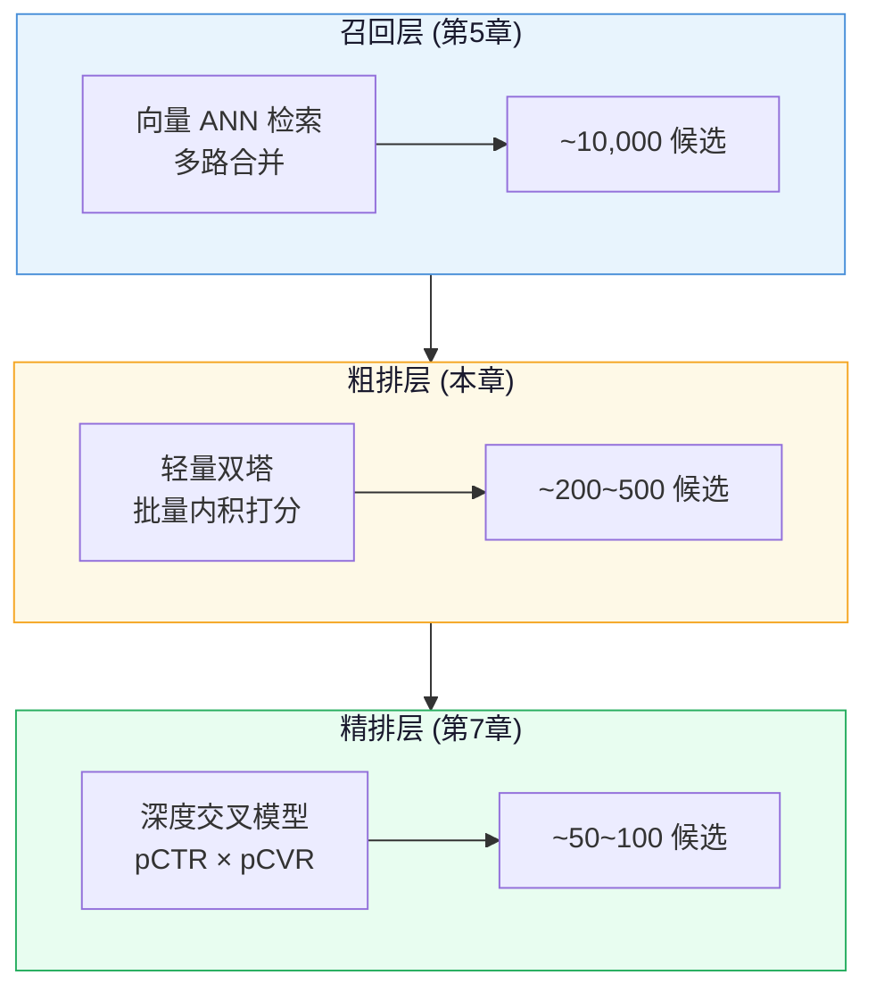
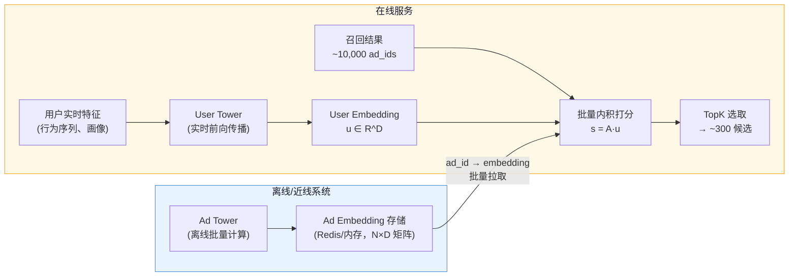
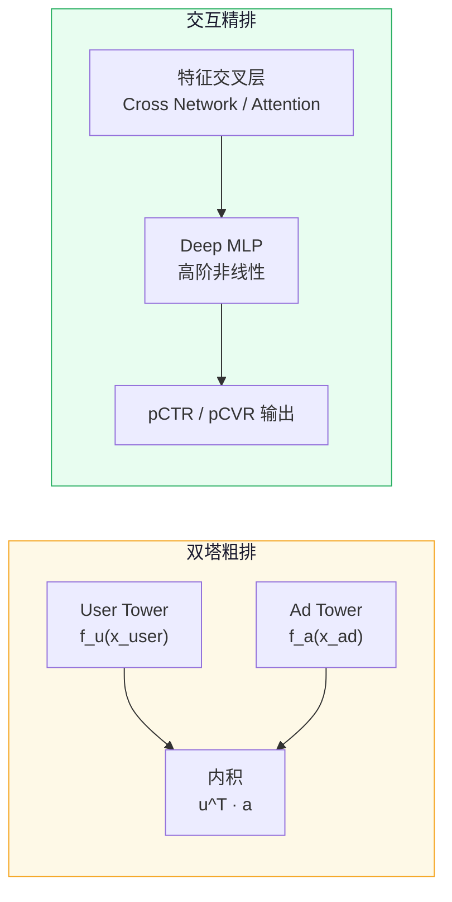
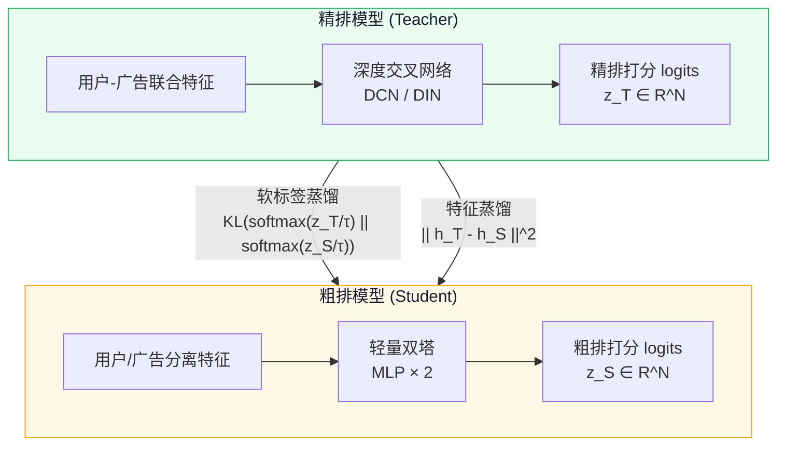
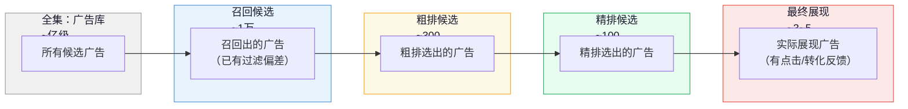
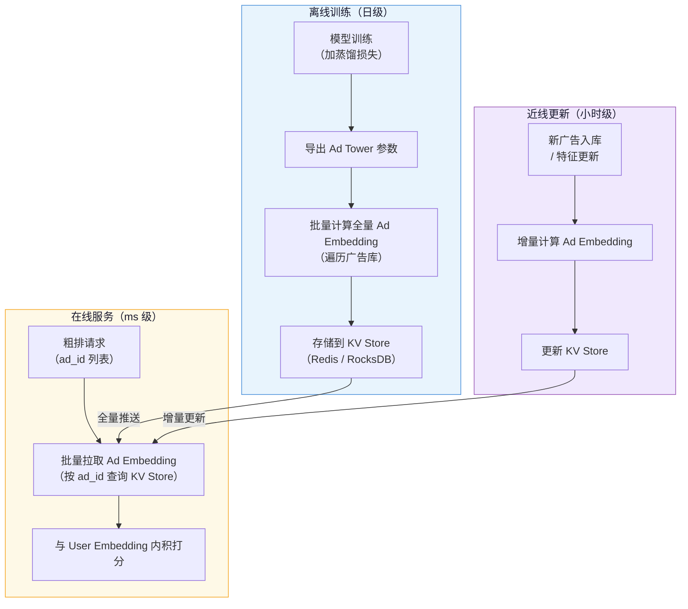

# 第 6 章 粗排（Pre-Rank / Coarse Ranking）

> **系列导航**：← [第 5 章 召回](./05-召回.md) | [第 7 章 精排与 CTR-CVR 预估](./07-精排与CTR-CVR预估.md) →

---

## 本章导读

上一章（第 5 章）讲了召回（Recall）——通过多路向量检索，从亿级广告库里筛出上万条粗略相关的候选。但这上万条候选不能直接交给精排：精排模型（交叉特征 + 深层神经网络）的单条推理延迟在毫秒量级，对上万条逐一打分意味着数百毫秒的耗时，远超广告系统 100ms 总预算。

**粗排（Pre-Rank / Coarse Ranking）**就是为了解决这个矛盾而生的：它站在召回与精排之间，用"比精排轻、比召回重"的模型，把万级候选压缩到百级，再交给精排做精细打分。

本章围绕以下问题展开：

1. **为什么需要粗排？** 三层漏斗的量级、复杂度与延迟权衡
2. **粗排的核心技术路线**：集合选择 vs 逐点值预估
3. **轻量双塔粗排**：结构设计、LiteECPM 公式、工程实现
4. **知识蒸馏**：用精排 teacher 对齐粗排 student
5. **粗精排一致性**：本章的核心难点与业界应对
6. **COLD 等业界方案**：算力-效果联合设计

读完本章，你将能回答："粗排和精排到底有什么本质区别？为什么不能直接用简化版精排？蒸馏是如何帮助粗排向精排对齐的？"

---

## 6.1 为什么需要粗排

### 6.1.1 三层漏斗：量级、复杂度与延迟

广告投放引擎的核心是一个**渐进式漏斗（Progressive Funnel）**。每一层在上一层的基础上进一步缩减候选、提升质量，同时约束自身的延迟开销。



| 维度 | 召回 | 粗排 | 精排 |
|------|------|------|------|
| **输入候选量** | 亿级广告库 | 万级（多路合并后） | 百级 |
| **输出候选量** | ~10,000 | ~200~500 | ~50~100 |
| **模型结构** | 双塔向量检索（近似最近邻） | 轻量双塔（精确内积/浅层 MLP） | 深度交叉网络（DCN、DIN、DIEN 等） |
| **特征交叉** | 无（User/Ad 侧独立编码） | 少量或无 | 丰富的用户-广告交叉特征 |
| **延迟预算** | 20~50ms（含 ANN 检索） | **10~20ms（对万级打分）** | 30~50ms（对百级打分） |
| **单条推理耗时** | 不适用（向量距离计算） | 极低（向量内积或浅层 MLP） | 较高（深层前向传播） |
| **模型参数量** | 中（双塔各几层 MLP） | 小（压缩/蒸馏版双塔） | 大（百万至千万参数） |

### 6.1.2 如果没有粗排会怎样？

**场景 A：精排直接对 10,000 候选打分**

假设精排单条推理 1ms，10,000 条就需要 10 秒——显然不可能。即便通过 GPU 并行化，10,000 条的 batch 也意味着巨大的显存压力和排队延迟，工程成本极高。

**场景 B：召回直接压到几百**

召回阶段模型极轻（ANN 向量检索），其排序精度远低于精排。如果把召回目标定在 200 条，意味着很多"召回出来但精排会高分"的广告被过早丢弃，精排层可选择的好广告变少，最终影响 CTR/CVR 和 eCPM（每千次展示期望收益，Effective Cost Per Mille）。

**结论**：粗排是**效率与精度的折中层**——它让精排专注于少量高质量候选，同时不把好广告过早丢弃。这个权衡（Trade-off）的存在，正是粗排存在的核心理由。

---

## 6.2 粗排的严格延迟要求

粗排的延迟预算通常在 **10~20ms** 以内，对象是 **1 万至数万**条候选广告。这比精排的要求更苛刻：

- 精排面对的是 200~500 条候选，哪怕模型较重，总耗时还能控制
- 粗排面对的是 10,000+ 条候选，必须极致轻量化才能按时完成

这驱动了粗排的两大工程设计选择：
1. **模型轻量化**：参数量远小于精排，避免复杂特征交叉
2. **向量化批量打分**：将 user embedding 与所有 ad embedding 做矩阵乘法，充分利用 BLAS/GPU 加速

```
延迟分解示意（粗排 10ms 预算内）：
┌─────────────────────────────────────────────────────┐
│ User Embedding 计算    ~2ms  (实时前向传播，用户侧塔) │
│ Ad Embedding 读取     ~1ms  (从缓存/内存取预计算值)  │
│ 批量内积打分          ~3ms  (矩阵乘法，万级候选)     │
│ 排序 + TopK 选取      ~1ms  (部分排序)              │
│ 网络/调度开销         ~3ms                          │
└─────────────────────────────────────────────────────┘
```

---

## 6.3 两种技术路线

业界粗排大致分为两条路线，各有适用场景。

### 6.3.1 集合选择（Set Selection）

**核心思想**：不对每条广告估计点估值（point-wise score），而是把"选出哪个广告子集送入精排"本身作为建模目标。

- 以整个下游漏斗（精排、拍卖、展现）的期望收益作为优化目标
- 典型做法：学习一个策略，直接判断"这批候选中哪几百条送精排能最大化整体收益"
- 优点：目标更直接，理论上更符合全局最优
- 缺点：
  - 建模复杂，训练信号来自后链路，延迟反馈
  - 候选集合大时组合空间爆炸，难以直接优化
  - 工程落地相对困难，可解释性弱

### 6.3.2 逐点值预估（Point-wise Estimation）

**核心思想**：对每条候选广告独立估计一个点估分（通常是 LiteCTR、LiteCVR 或 LiteECPM），按分数排序取 TopK 送精排。

- 优点：
  - 工程简单，可直接向量化批量打分
  - 可解释性好，每条广告都有明确分值
  - 模型迭代方便，可独立于精排训练
- 缺点：
  - 独立估分忽略了候选间的相互依赖（例如多样性）
  - 点估分与展现环境有分布差距（样本选择偏差，见 6.6 节）

**目前业界主流是 Point-wise 路线**，配合知识蒸馏（Knowledge Distillation）来弥补与精排的精度差距。本章后续以此为主线展开。

---

## 6.4 轻量双塔粗排（Lightweight Two-Tower Pre-Rank）

> 双塔模型（Two-Tower Model）的基础结构已在第 5 章详细介绍。本节聚焦粗排场景的特殊设计与工程权衡，建议配合第 5 章阅读。

### 6.4.1 为什么双塔天然适合粗排

双塔模型的核心特征是：用户侧和广告侧**完全解耦**，最终通过内积（Inner Product）或余弦相似度（Cosine Similarity）融合。

```
score(user, ad) = f_user(x_user)^T · f_ad(x_ad)
```

这一解耦带来了关键的工程优势：

1. **Ad Embedding 可离线预计算**：广告侧特征（广告创意、行业、历史统计等）更新频率低，可以离线计算好 ad embedding 并推送到 Prerank 服务的内存/缓存
2. **User Embedding 实时计算**：用户实时行为（当前浏览序列、触发 session）需要在线计算，但只算一次，与所有候选共享
3. **批量内积 = 矩阵乘法**：一个 user embedding（维度 D）与 N 条 ad embedding（矩阵 N×D）做矩阵乘法，得到 N 个打分，可充分利用 BLAS/GPU 加速

```
打分过程：
User Embedding: u ∈ R^D          (实时计算，1次)
Ad Embeddings:  A ∈ R^{N×D}      (离线预计算，N=10000+)
Scores:         s = A · u ∈ R^N  (矩阵乘法，极快)
```

### 6.4.2 LiteECPM 公式

粗排阶段的打分目标称为 **LiteECPM（轻量版 ECPM）**，用于近似估计每千次展示的期望收益：

$$
\text{LiteECPM} = \text{LiteCTR} \times \text{LiteCVR} \times \text{Bid} \times 1000
$$

其中：

| 符号 | 含义 |
|------|------|
| $\text{LiteCTR}$ | 粗排模型估计的点击率（Click-Through Rate），用轻量双塔近似 |
| $\text{LiteCVR}$ | 粗排模型估计的转化率（Conversion Rate），可以独立小塔或共享表示 |
| $\text{Bid}$ | 广告主出价（本例"轻氧奶茶"按 CPC 或 tCPA 出价） |
| $1000$ | ECPM 规范化因子（每千次展示） |

> **简化说明**：在工程实践中，LiteCTR 和 LiteCVR 可以合并为一个双塔打分（LiteCXR = LiteCTR × LiteCVR），也可以分开用两个轻量模型各自估计，取决于转化信号的稀疏程度。

**为什么要乘以 Bid（出价）？**

召回阶段通常只按相关性排序，不考虑出价。粗排开始引入 eCPM 视角，这样筛选出的候选不仅"与用户相关"，还"广告主愿意付费"，是从召回纯相关性到精排 eCPM 优化的过渡。

### 6.4.3 粗排双塔结构设计

粗排双塔与第 5 章召回双塔的结构相似，但在以下维度有明显差异：

| 设计维度 | 召回双塔（第5章） | 粗排轻量双塔（本章） |
|---------|------------|------------|
| **优化目标** | 用户-广告语义相关性（对比学习） | LiteCTR/LiteCVR 预估（回归/分类） |
| **网络深度** | 较深（多层 MLP） | 更浅（1~2 层 MLP，知识蒸馏压缩） |
| **特征数量** | 较少（用于索引） | 可稍多但仍轻量 |
| **Embedding 维度** | 中等（64~256） | 较小（32~128，节省内存） |
| **训练信号** | 点击/转化正样本 vs 随机负样本 | 精排 teacher 软标签 + 真实标签 |
| **Ad Embedding 更新** | 离线全量重建（日级或周级） | 离线预计算 + 增量更新（小时级） |

### 6.4.4 工程架构：User 侧实时 + Ad 侧缓存



**Ad Embedding 的更新策略**：

- **离线全量重建**（日级）：每天全量重新训练 Ad Tower，更新所有 ad embedding，推送到 Redis 或分布式内存（如 Faiss 索引或自定义 KV 存储）
- **增量更新**（小时级）：对新上线广告或特征变化明显的广告，触发增量更新，无需等待全量重建
- **版本管理**：为防止 User Tower 和 Ad Tower 版本不一致（训练时对齐、服务时错配），需要做 Embedding 版本的严格管理

### 6.4.5 PyTorch 代码示例：轻量双塔粗排打分

```python
import torch
import torch.nn as nn
import torch.nn.functional as F

class UserTowerLite(nn.Module):
    """
    粗排用户侧轻量塔。
    输入：用户特征向量（稠密特征 + 稀疏 Embedding 拼接后）
    输出：User Embedding（维度 D）
    """
    def __init__(self, input_dim: int, hidden_dim: int, output_dim: int):
        super().__init__()
        # 粗排侧塔尽量浅，以控制实时推理延迟
        self.mlp = nn.Sequential(
            nn.Linear(input_dim, hidden_dim),
            nn.ReLU(),
            nn.Linear(hidden_dim, output_dim),  # 输出 embedding
        )

    def forward(self, user_features: torch.Tensor) -> torch.Tensor:
        """
        Args:
            user_features: [batch_size, input_dim]
        Returns:
            user_emb: [batch_size, output_dim]，L2 归一化
        """
        emb = self.mlp(user_features)
        # L2 归一化，使内积等价于余弦相似度
        return F.normalize(emb, p=2, dim=-1)


class AdTowerLite(nn.Module):
    """
    粗排广告侧轻量塔。
    离线批量计算所有广告的 Embedding，缓存到 Redis/内存。
    """
    def __init__(self, input_dim: int, hidden_dim: int, output_dim: int):
        super().__init__()
        self.mlp = nn.Sequential(
            nn.Linear(input_dim, hidden_dim),
            nn.ReLU(),
            nn.Linear(hidden_dim, output_dim),
        )

    def forward(self, ad_features: torch.Tensor) -> torch.Tensor:
        """
        Args:
            ad_features: [num_ads, input_dim]
        Returns:
            ad_emb: [num_ads, output_dim]，L2 归一化
        """
        emb = self.mlp(ad_features)
        return F.normalize(emb, p=2, dim=-1)


class LightweightTwoTowerPreRank(nn.Module):
    """
    完整的轻量双塔粗排模型。
    在线推理时：
      - 用 user_tower 实时计算 user embedding（每次请求计算1次）
      - ad embeddings 从缓存中批量拉取（离线预计算）
      - 批量内积得到 LiteCXR 分数（近似 LiteCTR×LiteCVR）
    """
    def __init__(
        self,
        user_input_dim: int,
        ad_input_dim: int,
        hidden_dim: int = 128,
        emb_dim: int = 64,  # 粗排 embedding 维度较小
    ):
        super().__init__()
        self.user_tower = UserTowerLite(user_input_dim, hidden_dim, emb_dim)
        self.ad_tower = AdTowerLite(ad_input_dim, hidden_dim, emb_dim)

        # 温度参数（Temperature）：控制 softmax 分布的"软硬"程度
        # 蒸馏时会用到，训练时可学习
        self.temperature = nn.Parameter(torch.tensor(1.0))

    def forward(
        self,
        user_features: torch.Tensor,   # [B, user_input_dim]
        ad_features: torch.Tensor,     # [N, ad_input_dim]
    ) -> torch.Tensor:
        """
        Returns:
            scores: [B, N] — 每个用户对每条广告的粗排分数
        """
        user_emb = self.user_tower(user_features)   # [B, D]
        ad_emb = self.ad_tower(ad_features)          # [N, D]

        # 批量内积：矩阵乘法，充分利用 BLAS/GPU 加速
        # [B, D] x [D, N] = [B, N]
        scores = torch.matmul(user_emb, ad_emb.T)

        return scores  # 输出粗排打分，后续乘以 Bid 得到 LiteECPM

    def compute_lite_ecpm(
        self,
        scores: torch.Tensor,      # [B, N]，来自 forward 的打分
        bids: torch.Tensor,        # [N]，各广告的出价
    ) -> torch.Tensor:
        """
        计算 LiteECPM = LiteCXR × Bid × 1000
        用于粗排阶段的候选筛选。
        """
        # scores 已近似 LiteCXR（内积空间中的相似度）
        # 通过 sigmoid 映射到 (0,1)
        lite_cxr = torch.sigmoid(scores)            # [B, N]
        lite_ecpm = lite_cxr * bids.unsqueeze(0) * 1000  # [B, N]
        return lite_ecpm

    def select_topk_for_ranking(
        self,
        lite_ecpm: torch.Tensor,   # [B, N]
        k: int = 300,              # 送精排的候选数量
    ) -> tuple:
        """
        按 LiteECPM 选 TopK 候选，送入精排。
        返回 (topk_values, topk_indices)。
        """
        topk_values, topk_indices = torch.topk(lite_ecpm, k=k, dim=-1)
        return topk_values, topk_indices


# ─── 使用示例 ──────────────────────────────────────────────
if __name__ == "__main__":
    # 假设参数
    USER_INPUT_DIM = 256   # 用户特征维度
    AD_INPUT_DIM = 128     # 广告特征维度
    NUM_ADS = 10000        # 粗排候选数（万级）
    BATCH_SIZE = 1         # 广告系统通常单用户请求

    model = LightweightTwoTowerPreRank(
        user_input_dim=USER_INPUT_DIM,
        ad_input_dim=AD_INPUT_DIM,
        hidden_dim=128,
        emb_dim=64,
    )
    model.eval()

    # 模拟输入
    user_feat = torch.randn(BATCH_SIZE, USER_INPUT_DIM)
    ad_feat = torch.randn(NUM_ADS, AD_INPUT_DIM)
    bids = torch.rand(NUM_ADS) * 10 + 1   # 出价 1~11 元

    with torch.no_grad():
        scores = model(user_feat, ad_feat)             # [1, 10000]
        lite_ecpm = model.compute_lite_ecpm(scores, bids)  # [1, 10000]
        topk_vals, topk_idx = model.select_topk_for_ranking(lite_ecpm, k=300)

    print(f"粗排完成：从 {NUM_ADS} 条候选中选出 {topk_idx.shape[-1]} 条送精排")
    print(f"LiteECPM 范围: [{lite_ecpm.min():.2f}, {lite_ecpm.max():.2f}]")
```

---

## 6.5 双塔（粗排）vs 交互模型（精排）的本质差异

理解粗排与精排的根本区别，对理解为什么需要"粗精排一致性"（见 6.6 节）至关重要。



| 对比维度 | 双塔粗排 | 交互模型精排 |
|---------|---------|------------|
| **用户-广告特征交叉** | 无（User/Ad 侧完全独立编码） | 丰富（Cross Network、Attention、各类交叉特征） |
| **表达能力** | 受限（仅能表达线性可分的用户-广告关系） | 强（可捕捉高阶非线性的用户-广告依赖） |
| **推理速度** | 极快（内积 = O(D)，可批量矩阵乘法） | 较慢（每对用户-广告都需单独前向传播） |
| **Ad Embedding 预计算** | 可以（侧独立，离线缓存） | 不可以（需用户特征参与计算） |
| **典型延迟（万级候选）** | 3~5ms | 不适用（无法在限定时间内完成） |
| **预估精度** | 低（仅内积近似） | 高（专门针对 CTR/CVR 的深度模型） |

**本质**：双塔通过"用户和广告各自独立编码"换取了"可预计算 + 批量内积"的效率；精排通过"用户和广告联合建模"换取了"精确的个性化预估"。这不是哪个更好的问题，而是在不同候选量级下各自是最优选择。

---

## 6.6 知识蒸馏（Knowledge Distillation）

### 6.6.1 为什么需要蒸馏

双塔粗排模型结构轻量，表达能力有限，**打分精度天然低于精排**。这导致两个问题：

1. **粗排会漏掉精排认为高分的广告**：粗排 TopK 选出来的候选，未必包含精排最终想要的广告，造成"优质广告被粗排过滤"的情况
2. **粗排打分分布与精排不对齐**：粗排的分数含义（内积相似度）与精排的 pCTR 含义不同，直接比较没有意义

知识蒸馏（Knowledge Distillation, KD）是弥补这一差距的主流方法：把精排模型作为**教师（Teacher）**，用其软标签（Soft Label）指导粗排**学生（Student）**模型的训练，使粗排的打分分布向精排靠拢。

### 6.6.2 蒸馏的两个层次



**① Logits 蒸馏（Soft Label Distillation）**

让粗排模型的输出分布对齐精排模型的输出分布：

$$
\mathcal{L}_{\text{KD}} = \text{KL}\left( \text{softmax}\!\left(\frac{z_T}{\tau}\right) \,\Big\|\, \text{softmax}\!\left(\frac{z_S}{\tau}\right) \right) = \sum_{i} p_i^T \log \frac{p_i^T}{p_i^S}
$$

其中：

| 符号 | 含义 |
|------|------|
| $z_T \in \mathbb{R}^N$ | 精排 Teacher 对 N 条候选的 logits |
| $z_S \in \mathbb{R}^N$ | 粗排 Student 对 N 条候选的 logits |
| $\tau$ | 温度（Temperature），$\tau > 1$ 使分布更平滑，保留更多相对排序信息；$\tau < 1$ 使分布更尖锐 |
| $p_i^T, p_i^S$ | 分别为 Teacher 和 Student 的第 $i$ 条候选的归一化概率 |

温度 $\tau$ 是蒸馏的关键超参：

- $\tau = 1$：标准 softmax，Hard Label 方向
- $\tau > 1$（如 $\tau = 4$）：更平滑的分布，Teacher 的"暗知识（Dark Knowledge）"被保留——即使是低分广告，Teacher 给出的相对排序也蕴含有用信息

**② 特征蒸馏（Feature/Intermediate Distillation）**

让粗排模型的中间层表示对齐精排模型的对应层：

$$
\mathcal{L}_{\text{feat}} = \left\| h_T - \phi(h_S) \right\|_2^2
$$

其中：
| 符号 | 含义 |
|------|------|
| $h_T \in \mathbb{R}^d$ | 精排 Teacher 的中间层隐层表示（如最后一个隐层） |
| $h_S \in \mathbb{R}^{d'}$ | 粗排 Student 的对应表示 |
| $\phi(\cdot)$ | 投影层（Linear），用于对齐 Student 和 Teacher 的维度差异（$d' \to d$） |

**③ 总损失**

$$
\mathcal{L}_{\text{total}} = (1 - \alpha) \cdot \mathcal{L}_{\text{task}} + \alpha \cdot \mathcal{L}_{\text{KD}} + \beta \cdot \mathcal{L}_{\text{feat}}
$$

其中：
- $\mathcal{L}_{\text{task}}$：粗排自身的监督信号（点击/转化的真实 label，BCE loss）
- $\alpha, \beta$：蒸馏损失的权重超参
- 实践中通常先调 $\alpha$（Logits 蒸馏权重），再决定是否加 $\beta$（特征蒸馏）

### 6.6.3 蒸馏训练代码示例

```python
import torch
import torch.nn as nn
import torch.nn.functional as F


class DistillationLoss(nn.Module):
    """
    粗排知识蒸馏损失。
    综合三部分：
      1. task_loss   — 对真实点击/转化 label 的监督
      2. kd_loss     — logits 蒸馏（Student 对齐 Teacher 的软标签分布）
      3. feat_loss   — 特征蒸馏（Student 中间层对齐 Teacher 中间层）
    """

    def __init__(
        self,
        temperature: float = 4.0,   # 蒸馏温度 τ，>1 保留更多暗知识
        alpha: float = 0.7,          # logits 蒸馏权重
        beta: float = 0.1,           # 特征蒸馏权重
        student_feat_dim: int = 64,  # Student 中间层维度
        teacher_feat_dim: int = 256, # Teacher 中间层维度
    ):
        super().__init__()
        self.temperature = temperature
        self.alpha = alpha
        self.beta = beta

        # 投影层：对齐 Student 和 Teacher 的维度
        self.projection = nn.Linear(student_feat_dim, teacher_feat_dim)

        # 任务损失：BCE（点击率/转化率的二分类）
        self.bce_loss = nn.BCEWithLogitsLoss()

    def forward(
        self,
        student_logits: torch.Tensor,       # [B, N]，粗排 Student 对 N 条候选的打分
        teacher_logits: torch.Tensor,       # [B, N]，精排 Teacher 对 N 条候选的打分
        true_labels: torch.Tensor,          # [B, N]，真实点击/转化标签（0/1）
        student_hidden: torch.Tensor = None, # [B, N, D_s]，Student 中间层（可选）
        teacher_hidden: torch.Tensor = None, # [B, N, D_t]，Teacher 中间层（可选）
    ) -> dict:
        """
        Returns:
            dict 包含 total_loss 及各分量，便于 tensorboard 监控
        """
        # ① 任务损失：对真实标签的 BCE
        task_loss = self.bce_loss(student_logits, true_labels.float())

        # ② Logits 蒸馏损失（KL 散度）
        # 除以温度使分布更平滑，再用 KL 散度对齐
        T = self.temperature
        # softmax with temperature on last dim (N 条候选)
        teacher_soft = F.softmax(teacher_logits / T, dim=-1)   # [B, N]
        student_log_soft = F.log_softmax(student_logits / T, dim=-1)  # [B, N]

        # KL Divergence: sum_i p_T_i * log(p_T_i / p_S_i)
        # F.kl_div 接受 log_prob 作为 input，prob 作为 target
        kd_loss = F.kl_div(
            student_log_soft,
            teacher_soft,
            reduction='batchmean'
        ) * (T ** 2)  # 乘以 T^2 补偿梯度缩放，使权重和温度解耦（Hinton 2015）

        # ③ 特征蒸馏损失（可选，需要中间层输出）
        feat_loss = torch.tensor(0.0)
        if student_hidden is not None and teacher_hidden is not None:
            # 投影 Student 维度到 Teacher 维度
            student_proj = self.projection(student_hidden)   # [B, N, D_t]
            # L2 距离，stop gradient on teacher（teacher 不反传）
            feat_loss = F.mse_loss(student_proj, teacher_hidden.detach())

        # ④ 综合损失
        total_loss = (
            (1 - self.alpha) * task_loss
            + self.alpha * kd_loss
            + self.beta * feat_loss
        )

        return {
            'total_loss': total_loss,
            'task_loss': task_loss.item(),
            'kd_loss': kd_loss.item(),
            'feat_loss': feat_loss.item(),
        }


# ─── 训练循环示意 ───────────────────────────────────────────
def train_step(
    student_model: LightweightTwoTowerPreRank,
    teacher_model: nn.Module,     # 精排模型（已冻结参数）
    user_features: torch.Tensor,  # [B, D_u]
    ad_features: torch.Tensor,    # [N, D_a]
    true_labels: torch.Tensor,    # [B, N]
    bids: torch.Tensor,           # [N]
    distill_loss_fn: DistillationLoss,
    optimizer: torch.optim.Optimizer,
):
    """
    单步蒸馏训练。
    Teacher 精排模型参数冻结（eval 模式），Student 粗排模型更新。
    """
    student_model.train()
    teacher_model.eval()   # Teacher 固定不更新

    # Teacher 前向（无梯度）
    with torch.no_grad():
        teacher_scores = teacher_model(user_features, ad_features)  # [B, N]

    # Student 前向
    student_scores = student_model(user_features, ad_features)      # [B, N]

    # 计算蒸馏损失
    losses = distill_loss_fn(
        student_logits=student_scores,
        teacher_logits=teacher_scores,
        true_labels=true_labels,
    )

    # 反向传播
    optimizer.zero_grad()
    losses['total_loss'].backward()
    optimizer.step()

    return losses
```

---

## 6.7 粗精排一致性（Pre-Rank / Rank Consistency）

### 6.7.1 为什么粗精排一致性是核心难题

**一致性（Consistency）**指的是：粗排打分的排序尽量接近精排打分的排序，使精排最终选出的好广告能被粗排保留下来（不被过滤掉）。

但粗排面临的样本偏差（Sample Selection Bias）比精排更严重，原因如下：



粗排的训练数据来自**最终展现集合**，但其打分的对象是**召回候选集合**。展现集合是召回集合的一个极小子集（万分之几），且受到召回、粗排、精排、拍卖的层层过滤，导致：

**问题一：分布差距（Distribution Gap）**

- 训练集（展现样本）的分布 ≠ 粗排打分集（召回候选）的分布
- 展现样本中高分广告偏多，低分广告罕见，但粗排需要对所有召回候选公平打分

**问题二：解空间问题（Solution Space Problem）**

- 粗排面对的候选集合远大于精排（上万 vs 几百），其中大量候选在历史上从未被展现，缺乏有效的训练信号
- 对于这些"从未出现在训练集中"的候选，粗排模型的打分质量难以保证

**问题三：样本选择偏差（Sample Selection Bias, SSB）**

- 粗排如果只用点击样本训练，负样本必须从未展现的曝光中采样，而曝光本身已被精排筛选过
- 粗排候选中的"坏广告"（低 CTR/CVR）在训练集里几乎不出现，模型无法区分它们

### 6.7.2 业界应对策略

**策略一：蒸馏对齐（Distillation Alignment）**

用精排 Teacher 的打分作为 Student 的训练目标，让粗排直接学精排的排序行为，而非学真实 CTR/CVR（见 6.6 节）。

优点：绕开了样本稀疏问题（精排对所有粗排候选都可以打分，不需要真实展现标签）

**策略二：引入精排排序作为标签**

在历史日志中，将精排的输出分数（或相对排序）直接作为粗排模型的训练 label：

$$
\mathcal{L}_{\text{rank}} = \text{ListNet}(z_S, z_T) = -\sum_{i} p_i^T \log p_i^S
$$

这是 ListNet 损失的形式，本质上和 Logits 蒸馏（KL 散度）等价，只是来源不同——蒸馏用在线 Teacher 实时打分，ListNet 用历史离线精排分数。

**策略三：全量负样本（Full Negative Sampling）**

对粗排训练时，不从展现中采样负样本，而是从全部召回候选中随机采样负样本，使训练分布更接近粗排的打分分布（即召回候选集的分布）。

**策略四：Dropout + 正则化**

粗排模型在训练时加 Dropout，防止对展现样本过拟合，提升对未展现候选的泛化能力。

**策略五：位置偏差（Position Bias）修正**

精排之后还有拍卖和位置排列，展现位置影响点击率。粗排训练时应修正位置偏差，避免将"因位置好而高点击"误当作"因广告好而高点击"。

### 6.7.3 指标对齐监控

线上需要持续监控粗精排的**排序一致性指标**，常用：

- **KTau（Kendall's τ）**：衡量粗排和精排排序的秩相关，范围 [-1, 1]，越接近 1 越好
- **Top50 Overlap Rate**：粗排 Top300 候选中，精排 Top50 的覆盖率（粗排有没有过滤掉精排最想要的广告）
- **NDCG（Normalized Discounted Cumulative Gain）**：以精排分数为 Ground Truth，评估粗排排序质量

---

## 6.8 贯穿例子：轻氧奶茶在粗排层

**场景**：悦读 App 的用户「小雨」打开 App，触发广告请求。第 5 章的召回层（多路 ANN 检索）输出了 8,000 条候选广告，其中包含轻氧奶茶和其他奶茶品牌、餐饮品牌、本地生活广告等。

**粗排处理过程**：

```
Step 1：User Tower 实时计算
  - 小雨的特征：近期搜索"珍珠奶茶配方"、关注本地美食账号、地理位置在商圈
  - 输出 User Embedding u ∈ R^64

Step 2：Ad Embedding 批量拉取
  - 从 Redis 缓存拉取 8,000 条候选广告的预计算 Ad Embedding（N×64 矩阵）

Step 3：批量内积打分（矩阵乘法）
  - scores = A · u ∈ R^8000
  - 耗时 ~3ms

Step 4：计算 LiteECPM
  - 轻氧奶茶：
      LiteCXR（双塔内积分数，sigmoid 后）= 0.08
      Bid = 20 元/次点击（CPC 出价）
      LiteECPM = 0.08 × 20 × 1000 = 1600（元/千次）
  - 竞争对手某连锁奶茶品牌：LiteECPM = 900（元/千次）
  - 某餐饮品牌（弱相关）：LiteECPM = 200（元/千次）

Step 5：TopK 选取（K=300）
  - 轻氧奶茶以 LiteECPM 1600 排在前列，成功进入送精排的 300 条候选
  - 约 7,700 条低分候选被粗排过滤

Step 6：输出 300 条候选 → 送精排（第7章）
```

**粗排做到了什么**：

- 在 15ms 内完成了 8,000 条广告的 LiteECPM 估算和 TopK 筛选
- 保留了精排最可能高分的候选（轻氧奶茶与小雨的相关性在粗排层已初步识别）
- 过滤掉了大量低相关性广告，让精排可以在 300 条候选上精耕细作

---

## 6.9 业界方案：COLD 等算力-效果联合设计

### 6.9.1 COLD（Computing Power Cost-aware Online and Lightweight Design）

COLD 是阿里巴巴广告团队提出的粗排框架（2020年），核心思想是**将算力消耗（Computing Power Cost）纳入粗排模型的设计目标**，在效果和算力之间做联合优化。

**COLD 的关键洞察**：

传统粗排把"模型轻量化"视为硬约束（先定好双塔结构，再训练）。COLD 把算力消耗作为可微分的**损失项**，使模型在训练过程中自动学会在哪些特征/计算路径上花费算力：

$$
\mathcal{L}_{\text{COLD}} = \mathcal{L}_{\text{task}} + \lambda \cdot \text{Cost}(\text{model})
$$

其中 $\text{Cost}(\text{model})$ 是模型的算力消耗的可微近似（如参数量、FLOPs 的可微代理），$\lambda$ 控制效果与算力的权衡。

**COLD 的工程设计**：

1. **SE（Squeeze-Excitation）Block 特征选择**：用轻量注意力机制自动选择对粗排有价值的特征，抛弃低贡献特征
2. **可部分交叉特征**：不是完全无交叉（双塔），也不是完全交叉（精排），而是选择性地引入少量用户-广告交叉特征，在表达能力和速度间找甜点
3. **在线-离线联动**：COLD 模型可以用在线 A/B 实验的延迟数据作为反馈，持续调整 $\lambda$

### 6.9.2 其他业界思路

**字节跳动的粗排设计**：引入 DSSM（Deep Structured Semantic Model）变体，在双塔框架内加入少量交叉注意力，并用 In-Batch Negative Sampling 解决样本偏差。

**腾讯广告的 FLEN 等方案**：探索在粗排阶段引入 Field-wise 特征交叉，在不显著增加算力的前提下提升 CTR 预估精度。

**工业界的共识**：粗排不是孤立的，它的设计必须考虑与召回和精排的联动：
- 召回质量越高，粗排压力越小
- 粗排与精排的蒸馏对齐越好，端到端 eCPM 损失越小
- 粗排的候选量（TopK 的 K 值）是需要线上 A/B 实验持续调整的超参

---

## 6.10 粗排系统的工程细节

### 6.10.1 Ad Embedding 的存储与更新



**关键工程注意点**：

1. **版本一致性**：User Tower 和 Ad Tower 必须来自同一版本的模型（相同训练 epoch），否则内积的语义空间不对齐，打分失真
2. **Embedding 压缩**：fp16（半精度）存储 Ad Embedding，节省约 50% 内存，对打分精度影响极小
3. **读取延迟**：万级候选的 Embedding 批量读取需要优化，常见做法：
   - 本机内存（In-process Cache）：最低延迟，但内存占用大
   - Redis 集群 + Pipeline：平衡容量和延迟
   - mmap 文件（内存映射）：冷数据场景适用

### 6.10.2 粗排与召回的接口协议

召回层（第 5 章）输出的是 `List<AdId>`，粗排层需要：
- 按 ad_id 批量拉取 Ad Embedding（KV 查询）
- 获取广告的出价信息（Bid，来自实时竞价系统）
- 计算 LiteECPM 并排序

这要求粗排服务对以下几类数据的访问延迟极低：
- Ad Embedding KV Store：P99 < 1ms
- 广告出价数据（通常随广告索引一起缓存）：P99 < 0.5ms

### 6.10.3 粗排 TopK 阈值的选取

粗排送精排的候选数量（K 值）是一个重要超参，影响两个核心指标：
- **精排召回率（Recall@精排 TopK）**：K 越大，精排想要的广告被粗排保留的概率越高
- **系统总延迟**：K 越大，精排的候选量越大，精排耗时增加

线上通常通过 A/B 实验，在控制精排延迟不超标的前提下，最大化精排 Top50 的 Overlap Rate，来确定最优 K 值（通常在 200~500 之间）。

---

## 6.11 本章与前后章节的衔接

### 与第 5 章（召回）的衔接

第 5 章讲了双塔模型的基础结构、向量 ANN 检索（如 FAISS、ScaNN）以及多路召回的合并策略。本章的双塔粗排在结构上与召回双塔相似，但：

- **优化目标不同**：召回双塔优化语义相关性（对比学习），粗排双塔优化 LiteCTR/CVR 预估（分类回归）
- **用途不同**：召回双塔的 ad embedding 用于 ANN 近似最近邻检索，粗排双塔的 ad embedding 用于精确内积打分
- **打分对象不同**：召回在全广告库上做 ANN，粗排在万级召回候选上做精确打分

### 与第 7 章（精排）的衔接

第 7 章将介绍深度交叉网络（DCN）、DIN（Deep Interest Network）等精排模型，以及 pCTR × pCVR 的精确估计。本章的粗精排一致性（6.6 节、6.7 节）正是为精排铺路——粗排选出的百级候选，是精排的全部输入，粗排的质量直接决定了精排能发挥的上限。

---

## 本章小结

本章系统讲解了粗排（Pre-Rank / Coarse Ranking）的定位、原理、技术方案与工程实现。

**核心要点回顾**：

1. **粗排的存在价值**：在召回（万级）和精排（百级）之间的效率-精度折中层，10~20ms 内完成万级候选的初步筛选

2. **两条技术路线**：集合选择（Set Selection，优化整体收益）和逐点值预估（Point-wise，独立估分后 TopK 筛选）。主流方案是后者配合知识蒸馏

3. **轻量双塔粗排**：
   - User Tower 实时计算，Ad Tower 离线预计算并缓存
   - LiteECPM = LiteCTR × LiteCVR × Bid × 1000
   - 批量内积（矩阵乘法）实现万级候选快速打分

4. **双塔 vs 交互模型**：双塔用独立编码换推理速度，精排用联合交叉换预估精度，本质是表达能力与计算效率的权衡

5. **知识蒸馏**：
   - 精排 Teacher 软标签 → 粗排 Student 对齐
   - 蒸馏 Loss = KL(softmax(z_T/τ) || softmax(z_S/τ))，温度 τ 保留"暗知识"
   - 解决了粗排候选集中大量未展现样本缺乏训练信号的问题

6. **粗精排一致性**：粗排面临比精排更严重的样本选择偏差和解空间问题；业界通过蒸馏对齐、全量负样本、精排排序作为 Label 等策略应对

7. **COLD 等业界方案**：把算力消耗纳入优化目标，做效果-算力联合设计

**设计心法**：粗排是漏斗中最"受气"的一层——既要够快（延迟严苛），又要够准（不能过滤掉精排想要的广告），还要处理最大的候选集合（样本偏差最严重）。蒸馏是目前最成熟的解法，但粗精排一致性仍是业界持续研究的开放问题。

---

## 参考来源

1. **COLD: Towards the Next Generation of Pre-Ranking System** (Liu et al., 2020)
   - 阿里巴巴提出的算力-效果联合粗排设计
   - https://arxiv.org/abs/2007.16122

2. **Distilling the Knowledge in a Neural Network** (Hinton et al., 2015)
   - 知识蒸馏的奠基性工作，提出温度 τ 的概念
   - https://arxiv.org/abs/1503.02531

3. **Sampling-Bias-Corrected Neural Modeling for Large Corpus Item Recommendations** (Yi et al., 2019, Google)
   - 双塔召回中的样本偏差修正，对粗排蒸馏训练同样适用
   - https://dl.acm.org/doi/10.1145/3298689.3346996

4. **Deep Interest Network for Click-Through Rate Prediction** (Zhou et al., 2018, Alibaba)
   - DIN 精排模型，是粗排蒸馏 Teacher 的典型结构
   - https://arxiv.org/abs/1706.06978

5. **A Two-Tower Architecture for Efficient Retrieval** (Karpukhin et al., DPR, 2020)
   - 双塔检索架构的系统性论述
   - https://arxiv.org/abs/2004.04906

6. **Sample Selection Bias in Recommendation Systems** (overview)
   - 推荐/广告系统中样本选择偏差的综述性讨论
   - https://dl.acm.org/doi/10.1145/3219819.3220007

7. **Entire Space Multi-Task Model (ESMM)** (Ma et al., 2018, Alibaba)
   - CVR 预估中处理样本偏差的经典工作，粗排 CVR 建模可借鉴
   - https://arxiv.org/abs/1804.07931

8. **Practical Lessons from Predicting Clicks on Ads at Facebook** (He et al., 2014)
   - 工业级 CTR 预估的经典论文，涉及特征工程与模型训练的工程细节
   - https://dl.acm.org/doi/10.1145/2648584.2648589

---

> **下一章预告**：第 7 章《精排与 CTR-CVR 预估》将在本章粗排输出的 200~300 条候选基础上，介绍 DIN、DCN、ESMM 等精排模型的原理，讲透 pCTR × pCVR → eCPM 的精确估计过程，以及工业级精排的特征工程与训练技巧。→ [第 7 章](./07-精排与CTR-CVR预估.md)
