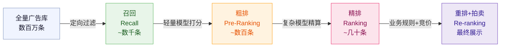
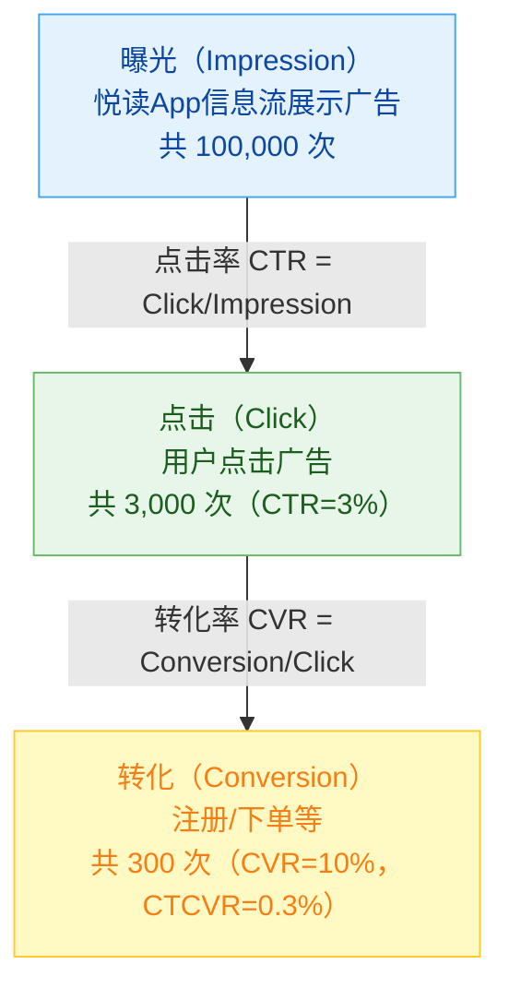
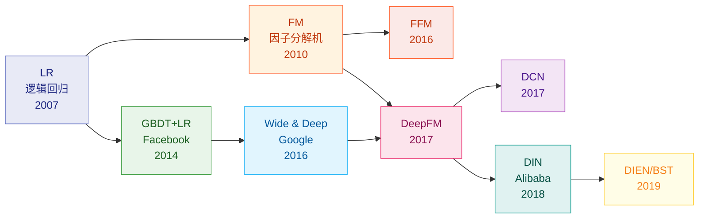
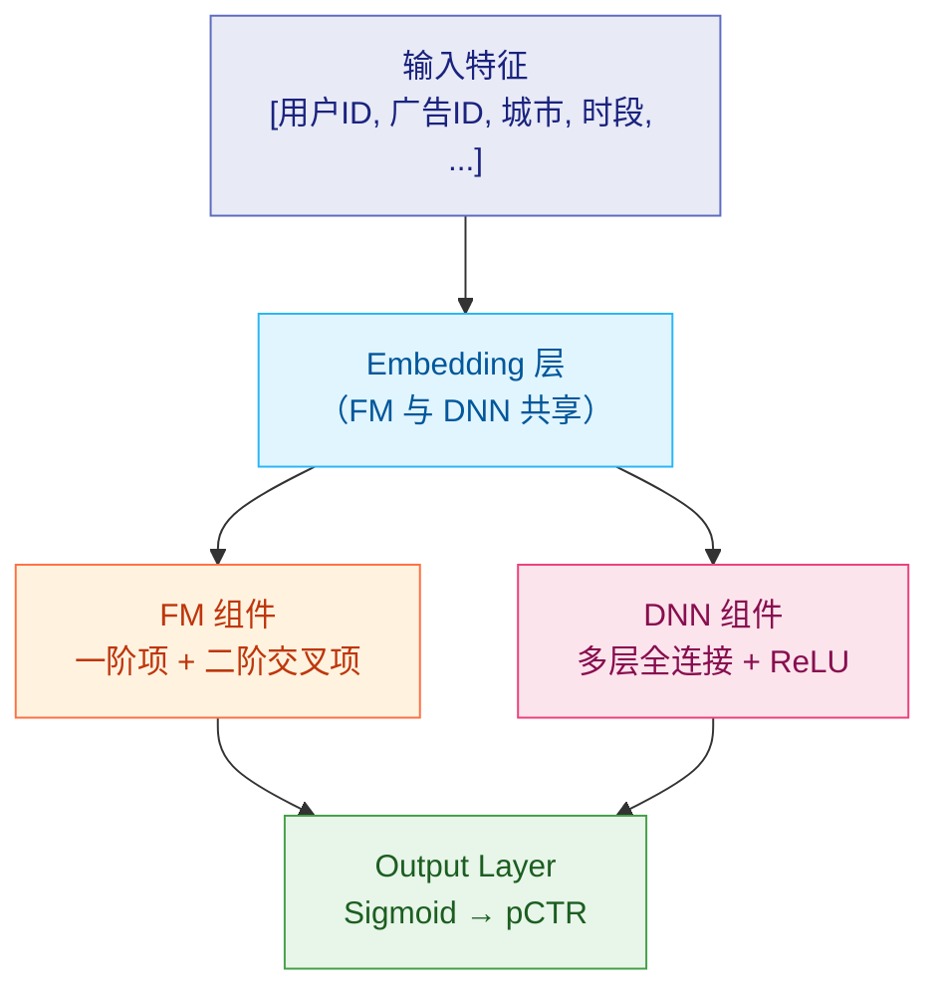
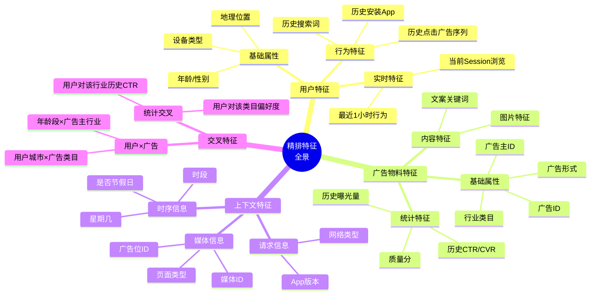
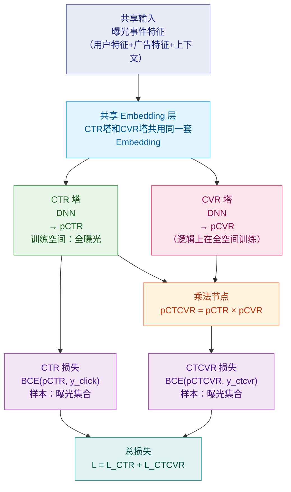
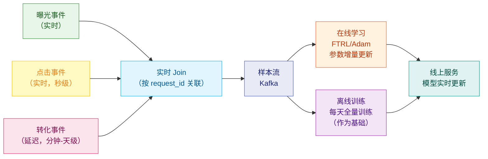
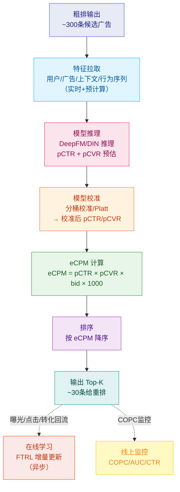

# 第7章 精排与CTR/CVR预估

> **系列定位**：本章是《广告投放系统设计·全景教程》第7章。上一章（第6章）介绍了粗排如何将数千条候选广告压缩到几百条；本章深入精排阶段——用最复杂的模型对这几百条广告打分、排序，输出最终候选集（几十条）交给第8章重排与拍卖。计费细节、出价策略归第8、9章，本章聚焦**预估模型**与**eCPM计算**。

---

## 本章导读

精排（Fine Ranking / Ranking）是整条广告投放链路中**模型最复杂、最关键**的环节。它要解决的问题不是"哪些广告大概相关"，而是"每一条广告精确的点击概率（pCTR）和转化概率（pCVR）是多少"。

这两个数字的重要性体现在两个维度：

1. **排序维度**：pCTR × pCVR × 出价 = eCPM（Effective Cost Per Mille，千次展示有效收益），用于广告之间的竞争排名；
2. **定价维度**：pCTR 直接用于广告计费（CPC 模式下，点击单价 = 竞拍价 / pCTR），因此预测值必须在数值上"校准"到接近真实值，否则广告主和媒体都会遭受损失。

这是广告精排与普通推荐系统排序的**根本区别**：推荐只需要序对，广告需要序对且值准。

本章覆盖以下核心内容：

- 精排的系统定位与特殊性（COPC 约束）
- CTR/CVR 样本的漏斗定义
- CTR 预估模型演进史（LR → DIN，逐个剖析）
- 特征工程全景
- CVR 预估难题与 ESMM 解法
- 多任务学习（MMoE/PLE）
- 模型校准（Calibration）
- eCPM 计算与最终打分
- 在线学习与实时训练

**贯穿示例**：媒体方「悦读App」；广告主「轻氧奶茶」（连锁奶茶，投信息流拉新，日预算10万元，目标转化成本≤30元）。

---

## 7.1 精排的系统定位

### 7.1.1 在漏斗中的位置



精排的输入是粗排输出的 **几百条** 广告，输出是 **几十条** 精确排序的候选集。它是整条链路中计算代价最大、模型最复杂的阶段，也是决定广告收益的核心环节。

### 7.1.2 精排的特殊性：不仅要"序"对，还要"值"准

普通推荐系统的精排只关心相对顺序（用 NDCG、AUC 衡量），但广告精排有额外约束：**预测值必须在数值上准确**。

原因在于广告计费机制（详见第9章）：

- **CPC（Cost Per Click，按点击计费）模式**：广告主实际支付的点击单价 $= \text{广告位底价} / \text{pCTR}$，如果 pCTR 偏低，广告主被多收费；
- **oCPC（Optimized CPC，按转化优化）模式**：系统用 pCTR × pCVR 估算转化期望，用于智能出价（详见第10章）。

这就引出了精排中最重要的质量指标：

$$\text{COPC} = \frac{\text{实际CTR（观测值）}}{\text{预测CTR（pCTR）}}$$

COPC（Calibration of Predicted CTR，预测CTR校准率）应当趋近于 1。若 COPC 持续大于 1，说明模型低估了点击率，广告主被多扣费；若持续小于 1，说明模型高估，媒体收入受损。

**这是广告精排与普通推荐的根本区别**。

### 7.1.3 轻氧奶茶的精排场景

轻氧奶茶某次竞价：

| 指标 | 数值 | 说明 |
|------|------|------|
| 精排输入候选数 | 350条 | 粗排输出 |
| 精排输出候选数 | 30条 | 进入重排 |
| 模型推理耗时预算 | ≤20ms | 精排可用时间窗口 |
| 精排用模型 | DeepFM + DIN | 主模型 |
| pCTR 预估 | 3.0% | 某次具体曝光 |
| pCVR 预估 | 10.0% | 点击后注册转化 |
| 广告主出价 | 30元/转化 | oCPC 出价 |
| eCPM | 9.0元/千次 | = 3% × 10% × 30 × 1000 |

---

## 7.2 CTR/CVR 样本定义：广告漏斗

### 7.2.1 曝光→点击→转化漏斗



### 7.2.2 CTR 样本定义

- **正样本**：广告被曝光且被用户点击（标签 $y = 1$）
- **负样本**：广告被曝光但用户未点击（标签 $y = 0$）
- **样本空间**：所有曝光事件（Impression Space）

$$\text{CTR} = \frac{\text{点击数}}{\text{曝光数}}$$

### 7.2.3 CVR 样本定义

- **正样本**：用户点击广告后完成转化（注册、下单、支付等）（标签 $y = 1$）
- **负样本**：用户点击广告但未完成转化（标签 $y = 0$）
- **样本空间**：所有点击事件（Click Space）

$$\text{CVR} = \frac{\text{转化数}}{\text{点击数}}$$

### 7.2.4 CTCVR（全链路转化率）

$$\text{CTCVR} = \text{CTR} \times \text{CVR} = \frac{\text{转化数}}{\text{曝光数}}$$

这个定义在 7.5 节 ESMM 中至关重要。

### 7.2.5 样本构建注意事项

| 问题 | 说明 | 解决方案 |
|------|------|----------|
| **延迟转化（Delayed Feedback）** | 用户点击后可能几天后才转化，实时样本中转化标签不完整 | 设置归因窗口（如24h），窗口外转化归为负样本；或用延迟反馈模型 |
| **展示次数去重** | 同一广告对同一用户多次曝光，需去重或加权 | 按 request_id 粒度构建样本 |
| **正负样本不均衡** | 点击率通常只有1%-5%，正负比例悬殊 | 负采样（Negative Sampling），训练后校准预测值 |
| **曝光归因** | 未展示出的广告（竞价失败）不产生样本 | 只用赢得曝光的广告产生样本，不引入竞价失败数据 |

---

## 7.3 CTR 预估模型演进史

这是本章的核心内容。我们按时间顺序，逐个剖析每种模型的动机、结构、优缺点与关键公式。



### 7.3.1 LR（Logistic Regression，逻辑回归）

**时代背景**：广告系统最早期（2000s）的主力模型，Google/Yahoo 等公司大规模使用。

**模型结构**：

$$p(y=1 | \mathbf{x}) = \sigma\left(\mathbf{w}^T \mathbf{x} + b\right) = \frac{1}{1 + e^{-(\mathbf{w}^T \mathbf{x} + b)}}$$

其中：
- $\mathbf{x} \in \mathbb{R}^n$：输入特征向量（通常是 One-Hot 编码后的高维稀疏向量）
- $\mathbf{w} \in \mathbb{R}^n$：权重向量
- $b$：偏置项
- $\sigma(\cdot)$：Sigmoid 函数

**损失函数**（Log Loss / Binary Cross-Entropy）：

$$\mathcal{L} = -\frac{1}{N}\sum_{i=1}^{N}\left[y_i \log \hat{p}_i + (1 - y_i) \log(1 - \hat{p}_i)\right]$$

**优点**：
- 线性复杂度，可处理数亿特征；
- 输出直接是概率，天然满足校准需求；
- 训练简单，工程可控。

**缺点**：
- 只能建模**一阶特征**，无法自动捕获特征交叉；
- 高阶交叉需要人工构造（如：`用户城市=北京` × `广告类目=餐饮`），特征工程代价极大；
- 对新特征组合泛化能力弱。

### 7.3.2 GBDT + LR（Facebook, 2014）

**论文**：[Practical Lessons from Predicting Clicks on Ads at Facebook](https://dl.acm.org/doi/10.1145/2648584.2648589)

**核心思想**：用 GBDT（Gradient Boosted Decision Trees，梯度提升决策树）自动做**特征组合与变换**，将叶子节点作为新特征输入 LR。

**流程**：

```
原始特征 x
    ↓ GBDT 树集合（每棵树有K个叶子）
叶子节点路径 → One-Hot 编码（每棵树各自编码）
    ↓ 拼接所有树的编码
    → LR 线性分类器
    → pCTR
```

**数学描述**：

设 GBDT 共有 $T$ 棵树，每棵树有 $K$ 个叶子。样本 $\mathbf{x}$ 落到第 $t$ 棵树的第 $k_t$ 个叶子：

$$\mathbf{x}_{GBDT} = \text{concat}\left[\text{OneHot}(k_1), \text{OneHot}(k_2), \ldots, \text{OneHot}(k_T)\right]$$

$$p(y=1|\mathbf{x}) = \sigma(\mathbf{w}^T \mathbf{x}_{GBDT} + b)$$

**优点**：
- GBDT 自动发现非线性特征组合，减少人工特征工程；
- 实测（Facebook）相比纯 LR 有显著 AUC 提升。

**缺点**：
- GBDT 需要 dense 特征（对类别特征不友好），广告中 ID 类稀疏特征需额外处理；
- 两阶段训练，GBDT 和 LR 无法端到端优化；
- 在线更新困难（GBDT 增量学习复杂）。

### 7.3.3 FM（Factorization Machine，因子分解机，2010）

**论文**：[Factorization Machines](https://www.cs.cmu.edu/~wcohen/10-605/2015-guest-lecture/FM.pdf)（Rendle, 2010）

**动机**：解决稀疏高维特征下的**二阶特征交叉**问题。传统方法中，$x_i x_j$ 的权重 $w_{ij}$ 需要有足够的同时出现样本才能学好，在稀疏场景下几乎无法训练。

**FM 模型**：

$$\hat{y}(\mathbf{x}) = w_0 + \sum_{i=1}^{n} w_i x_i + \sum_{i=1}^{n}\sum_{j=i+1}^{n} \langle \mathbf{v}_i, \mathbf{v}_j \rangle x_i x_j$$

其中：
- $w_0 \in \mathbb{R}$：全局偏置
- $w_i \in \mathbb{R}$：第 $i$ 个特征的一阶权重
- $\mathbf{v}_i \in \mathbb{R}^k$：第 $i$ 个特征的隐向量（embedding），$k$ 是隐向量维度
- $\langle \mathbf{v}_i, \mathbf{v}_j \rangle = \sum_{f=1}^{k} v_{if} v_{jf}$：内积，代替独立的交叉权重 $w_{ij}$

**关键洞察**：将交叉权重分解为两个向量的内积后：

$$\sum_{i=1}^{n}\sum_{j=i+1}^{n} \langle \mathbf{v}_i, \mathbf{v}_j \rangle x_i x_j = \frac{1}{2}\left[\left\|\sum_{i=1}^{n} \mathbf{v}_i x_i\right\|^2 - \sum_{i=1}^{n}\|\mathbf{v}_i\|^2 x_i^2\right]$$

计算复杂度从 $O(n^2 k)$ 降至 $O(nk)$，对稀疏输入效率极高。

**优点**：
- 参数从 $O(n^2)$ 降至 $O(nk)$，大幅减少参数数量；
- 即使两个特征从未共同出现，也能通过隐向量建模交叉；
- 适合 ID 类稀疏特征。

**缺点**：
- 只能建模**二阶交叉**，高阶交叉需要 HOFM（计算量大）；
- 线性模型，缺乏深层非线性表达能力。

### 7.3.4 FFM（Field-aware Factorization Machine，2016）

**动机**：FM 中每个特征只有一个隐向量，但不同类型的特征交叉时，应该有不同的表示。

**FFM 模型**：每个特征 $i$ 对每个 Field $f$ 有独立的隐向量 $\mathbf{v}_{i,f}$：

$$\hat{y}(\mathbf{x}) = w_0 + \sum_{i=1}^{n} w_i x_i + \sum_{i=1}^{n}\sum_{j=i+1}^{n} \langle \mathbf{v}_{i, f_j}, \mathbf{v}_{j, f_i} \rangle x_i x_j$$

其中 $f_j$ 表示特征 $j$ 所属的 Field（字段组，如"用户年龄段"、"广告类目"等）。

**优点**：比 FM 更细粒度的交叉建模。

**缺点**：参数量从 $O(nk)$ 增至 $O(nFk)$（$F$ 是 Field 数），内存和计算开销显著增大；工业界更多用 FM 或直接上 DeepFM。

### 7.3.5 Wide & Deep（Google, 2016）

**论文**：[Wide & Deep Learning for Recommender Systems](https://arxiv.org/abs/1606.07792)

**核心思想**：结合两种能力：
- **Wide 部分**（宽线性模型）：记忆能力（Memorization），直接学习特征及其组合的历史共现；
- **Deep 部分**（深度神经网络）：泛化能力（Generalization），通过 embedding 和多层 MLP 学习低维稠密表示。

**模型结构**：

```
输入特征
    ├── 原始特征 + 人工交叉特征 → Wide部分（LR）
    └── 类别特征Embedding → 拼接 → DNN → Deep部分
                ↓
       Wide输出 + Deep输出 → Sigmoid → pCTR
```

**数学表达**：

$$\hat{y} = \sigma\left(\mathbf{w}_{wide}^T [\mathbf{x}, \phi(\mathbf{x})] + \mathbf{w}_{deep}^T \mathbf{a}^{(L)} + b\right)$$

其中：
- $\phi(\mathbf{x})$：人工构造的交叉特征（Wide 侧）
- $\mathbf{a}^{(L)}$：DNN 最后一层的输出（Deep 侧）
- 两部分联合训练，梯度同时更新

**优点**：兼顾记忆与泛化，在 Google Play 商店推荐中取得显著效果。

**缺点**：Wide 部分仍需人工特征工程（交叉特征），这是繁琐的；能否用 FM 替代 Wide 部分？这正是 DeepFM 的出发点。

### 7.3.6 DeepFM（2017）

**论文**：[DeepFM: A Factorization-Machine based Neural Network for CTR Prediction](https://arxiv.org/abs/1703.04247)

**核心思想**：用 FM 替换 Wide & Deep 中的 Wide（LR）部分，FM 和 DNN **共享同一套 Embedding**，无需人工特征工程。

**模型结构**：



**数学表达**：

$$\hat{y} = \sigma\left(y_{FM} + y_{DNN}\right)$$

$$y_{FM} = \langle \mathbf{w}, \mathbf{x} \rangle + \sum_{i=1}^{n}\sum_{j=i+1}^{n} \langle \mathbf{v}_i, \mathbf{v}_j \rangle x_i x_j$$

$$y_{DNN} = \mathbf{W}^{(L)} \cdot \text{ReLU}\left(\ldots \text{ReLU}\left(\mathbf{W}^{(1)} \cdot \mathbf{e} + \mathbf{b}^{(1)}\right) \ldots\right) + \mathbf{b}^{(L)}$$

其中 $\mathbf{e}$ 是所有 Field 的 Embedding 拼接。

**PyTorch 代码示例**（DeepFM 核心结构）：

```python
import torch
import torch.nn as nn
import torch.nn.functional as F


class DeepFM(nn.Module):
    """
    DeepFM: FM 与 DNN 共享 Embedding 的 CTR 预估模型
    
    Args:
        field_dims: list，每个 Field 的特征维度（类别数量）
        embedding_dim: int，Embedding 向量维度（通常 8/16/32）
        hidden_dims: list，DNN 各隐层维度
        dropout: float，DNN dropout 比率
    """
    
    def __init__(self, field_dims, embedding_dim=16, hidden_dims=None, dropout=0.2):
        super(DeepFM, self).__init__()
        
        if hidden_dims is None:
            hidden_dims = [256, 128, 64]
        
        self.num_fields = len(field_dims)
        self.embedding_dim = embedding_dim
        
        # ===== 共享 Embedding 层 =====
        # 每个 Field 有独立的 Embedding 表
        # EmbeddingBag 对变长输入更高效，这里用 ModuleList 演示清晰性
        self.embeddings = nn.ModuleList([
            nn.Embedding(field_dim, embedding_dim) for field_dim in field_dims
        ])
        
        # ===== FM 一阶项权重 =====
        # 每个 Field 的每个取值有一个标量权重
        self.fm_linear = nn.ModuleList([
            nn.Embedding(field_dim, 1) for field_dim in field_dims
        ])
        
        # ===== DNN 部分 =====
        dnn_input_dim = self.num_fields * embedding_dim
        layers = []
        for hidden_dim in hidden_dims:
            layers.extend([
                nn.Linear(dnn_input_dim, hidden_dim),
                nn.BatchNorm1d(hidden_dim),
                nn.ReLU(),
                nn.Dropout(dropout)
            ])
            dnn_input_dim = hidden_dim
        layers.append(nn.Linear(dnn_input_dim, 1))  # DNN 输出层
        self.dnn = nn.Sequential(*layers)
        
        # 全局偏置
        self.bias = nn.Parameter(torch.zeros(1))
        
        self._init_weights()
    
    def _init_weights(self):
        """Xavier 初始化，加速收敛"""
        for emb in self.embeddings:
            nn.init.xavier_uniform_(emb.weight)
        for linear in self.fm_linear:
            nn.init.zeros_(linear.weight)
    
    def fm_forward(self, x_embeddings):
        """
        FM 二阶交叉项计算
        利用公式: 0.5 * (||sum(vi)||^2 - sum(||vi||^2))
        
        Args:
            x_embeddings: [batch_size, num_fields, embedding_dim]
        Returns:
            fm_second_order: [batch_size, 1]
        """
        # sum then square
        sum_of_squares = x_embeddings.sum(dim=1).pow(2)           # [B, emb_dim]
        # square then sum
        square_of_sums = x_embeddings.pow(2).sum(dim=1)           # [B, emb_dim]
        # FM 二阶项
        fm_second = 0.5 * (sum_of_squares - square_of_sums).sum(dim=1, keepdim=True)  # [B, 1]
        return fm_second
    
    def forward(self, x):
        """
        Args:
            x: [batch_size, num_fields] - 每列是对应 Field 的类别 ID
        Returns:
            pCTR: [batch_size, 1] - 点击率预估
        """
        # 1. 获取所有 Field 的 Embedding
        # x_embeddings: [batch_size, num_fields, embedding_dim]
        x_embeddings = torch.stack(
            [self.embeddings[i](x[:, i]) for i in range(self.num_fields)], dim=1
        )
        
        # 2. FM 一阶项: sum of linear weights
        # x_linear: [batch_size, num_fields, 1]
        x_linear = torch.stack(
            [self.fm_linear[i](x[:, i]) for i in range(self.num_fields)], dim=1
        )
        fm_first_order = x_linear.sum(dim=1)  # [batch_size, 1]
        
        # 3. FM 二阶项
        fm_second_order = self.fm_forward(x_embeddings)  # [batch_size, 1]
        
        # 4. DNN 前向
        dnn_input = x_embeddings.view(x.size(0), -1)  # [batch_size, num_fields * emb_dim]
        dnn_output = self.dnn(dnn_input)               # [batch_size, 1]
        
        # 5. 合并输出
        # FM 一阶 + FM 二阶 + DNN + 偏置
        output = fm_first_order + fm_second_order + dnn_output + self.bias
        
        # 6. Sigmoid 输出概率
        pCTR = torch.sigmoid(output)
        return pCTR


# ============ 使用示例 ============
if __name__ == "__main__":
    # 轻氧奶茶场景：5个 Field（用户ID、广告ID、城市、时段、设备类型）
    field_dims = [1000000, 50000, 400, 24, 5]  # 各 Field 的取值数量
    
    model = DeepFM(
        field_dims=field_dims,
        embedding_dim=16,
        hidden_dims=[256, 128, 64],
        dropout=0.2
    )
    
    # 模拟一个 batch，x 是各 Field 的类别 ID
    batch_size = 32
    x = torch.randint(0, 100, (batch_size, len(field_dims)))
    
    pCTR = model(x)  # [32, 1]
    print(f"pCTR shape: {pCTR.shape}")     # [32, 1]
    print(f"pCTR range: [{pCTR.min():.4f}, {pCTR.max():.4f}]")
```

**优点**：无需人工特征工程；FM 和 DNN 共享 Embedding，参数高效；工业界最常用的 baseline 之一。

**缺点**：FM 二阶交叉是所有 Field 对的无差别交叉，没有区分哪些交叉更重要（这点被 DIN 解决）。

### 7.3.7 DCN（Deep & Cross Network，2017）

**论文**：[Deep & Cross Network for Ad Click Predictions](https://arxiv.org/abs/1708.05123)

**核心思想**：用 Cross Network 替代 Wide 部分，显式建模高阶特征交叉，且每一阶都包含所有更低阶的信息。

**Cross Network 的第 $l$ 层**：

$$\mathbf{x}_{l+1} = \mathbf{x}_0 \mathbf{x}_l^T \mathbf{w}_l + \mathbf{b}_l + \mathbf{x}_l$$

其中 $\mathbf{x}_0$ 是初始输入，经过 $L$ 层 Cross Network 后，特征中包含最高 $L+1$ 阶的交叉信息。

**优点**：自动学习多阶特征交叉，无需人工设计；参数量与交叉阶数成线性关系。

### 7.3.8 DIN（Deep Interest Network，Alibaba, 2018）

**论文**：[Deep Interest Network for Click-Through Rate Prediction](https://arxiv.org/abs/1706.06978)

**背景**：用户历史行为序列是 CTR 预估的最强信号之一。DeepFM 等模型对历史行为用 mean pooling 求和，丢失了"当前广告与哪些历史行为最相关"的信息。

**核心思想**：对用户历史行为序列引入**Attention 机制**，让模型根据**目标广告**（target ad）动态为历史行为打分。

**Attention 计算**：

$$a(\mathbf{e}_i, \mathbf{e}_t) = \text{softmax}\left(\text{MLP}\left([\mathbf{e}_i, \mathbf{e}_t, \mathbf{e}_i - \mathbf{e}_t, \mathbf{e}_i \odot \mathbf{e}_t]\right)\right)$$

其中：
- $\mathbf{e}_i$：用户历史行为 $i$（点击过的商品/广告）的 Embedding
- $\mathbf{e}_t$：目标广告的 Embedding
- $\mathbf{e}_i \odot \mathbf{e}_t$：逐元素乘积（element-wise product）

**用户行为表示**：

$$\mathbf{u} = \sum_{i=1}^{H} a(\mathbf{e}_i, \mathbf{e}_t) \cdot \mathbf{e}_i$$

其中 $H$ 是历史行为序列长度，$a(\cdot)$ 是注意力权重。

**PyTorch 代码示例**（DIN 核心的注意力模块）：

```python
import torch
import torch.nn as nn
import torch.nn.functional as F


class DINAttention(nn.Module):
    """
    DIN 的注意力机制：根据目标广告对用户历史行为序列打分
    
    核心：Activation Unit（激活单元）
    输入：历史行为 embedding + 目标广告 embedding
    输出：加权后的用户兴趣表示
    """
    
    def __init__(self, embedding_dim, attention_hidden_dims=None):
        super(DINAttention, self).__init__()
        
        if attention_hidden_dims is None:
            attention_hidden_dims = [64, 16]
        
        # 注意力得分 MLP
        # 输入维度：4 * embedding_dim (e_i, e_t, e_i - e_t, e_i * e_t)
        attention_input_dim = 4 * embedding_dim
        layers = []
        for hidden_dim in attention_hidden_dims:
            layers.extend([
                nn.Linear(attention_input_dim, hidden_dim),
                nn.ReLU()
            ])
            attention_input_dim = hidden_dim
        layers.append(nn.Linear(attention_input_dim, 1))  # 输出标量得分
        self.attention_mlp = nn.Sequential(*layers)
    
    def forward(self, history_emb, target_emb, mask=None):
        """
        Args:
            history_emb: [batch_size, seq_len, embedding_dim] - 用户历史行为序列
            target_emb:  [batch_size, embedding_dim] - 目标广告
            mask:        [batch_size, seq_len] - True 表示有效位置（Padding 位 False）
        Returns:
            user_interest: [batch_size, embedding_dim] - 注意力加权后的用户兴趣
        """
        batch_size, seq_len, emb_dim = history_emb.size()
        
        # 扩展 target_emb 到序列维度
        # target_expand: [batch_size, seq_len, embedding_dim]
        target_expand = target_emb.unsqueeze(1).expand(-1, seq_len, -1)
        
        # 构造注意力 MLP 的输入：4种特征拼接
        # [e_i, e_t, e_i - e_t, e_i ⊙ e_t] 对应论文中的 Activation Unit
        att_input = torch.cat([
            history_emb,                          # e_i
            target_expand,                        # e_t
            history_emb - target_expand,          # e_i - e_t（差异特征）
            history_emb * target_expand           # e_i ⊙ e_t（交叉特征）
        ], dim=-1)                                # [B, seq_len, 4 * emb_dim]
        
        # 计算注意力得分
        att_scores = self.attention_mlp(att_input).squeeze(-1)  # [B, seq_len]
        
        # 处理 Padding（mask 为 False 的位置设为极大负数，softmax 后趋近 0）
        if mask is not None:
            att_scores = att_scores.masked_fill(~mask, -1e9)
        
        # Softmax 归一化（DIN 论文中实际用 softmax，也有用 sigmoid 的变体）
        att_weights = F.softmax(att_scores, dim=-1)  # [B, seq_len]
        
        # 加权求和得到用户兴趣表示
        # att_weights: [B, seq_len] → unsqueeze → [B, 1, seq_len]
        # history_emb: [B, seq_len, emb_dim]
        user_interest = torch.bmm(
            att_weights.unsqueeze(1), history_emb
        ).squeeze(1)  # [B, emb_dim]
        
        return user_interest, att_weights


class DIN(nn.Module):
    """
    DIN 主模型（简化版，突出核心结构）
    """
    
    def __init__(self, user_feature_dim, ad_feature_dim, embedding_dim=16, 
                 hidden_dims=None):
        super(DIN, self).__init__()
        
        if hidden_dims is None:
            hidden_dims = [256, 128, 64]
        
        self.embedding_dim = embedding_dim
        
        # 用户基础特征 Embedding
        self.user_emb = nn.Embedding(user_feature_dim, embedding_dim)
        # 广告特征 Embedding（历史行为和目标广告共用）
        self.ad_emb = nn.Embedding(ad_feature_dim, embedding_dim)
        
        # DIN 注意力模块
        self.attention = DINAttention(embedding_dim)
        
        # 主 MLP：输入 = 用户基础特征 + 注意力用户兴趣 + 目标广告
        mlp_input_dim = embedding_dim * 3  # 简化，实际会拼接更多特征
        layers = []
        for hidden_dim in hidden_dims:
            layers.extend([
                nn.Linear(mlp_input_dim, hidden_dim),
                nn.BatchNorm1d(hidden_dim),
                nn.ReLU(),
                nn.Dropout(0.2)
            ])
            mlp_input_dim = hidden_dim
        layers.append(nn.Linear(mlp_input_dim, 1))
        self.mlp = nn.Sequential(*layers)
    
    def forward(self, user_id, target_ad_id, history_ad_ids, mask=None):
        """
        Args:
            user_id: [batch_size] - 用户 ID
            target_ad_id: [batch_size] - 目标广告 ID（当前待预测广告）
            history_ad_ids: [batch_size, seq_len] - 用户历史点击广告 ID 序列
            mask: [batch_size, seq_len] - Padding mask
        Returns:
            pCTR: [batch_size, 1]
        """
        # 获取 Embedding
        user_feature = self.user_emb(user_id)                  # [B, emb_dim]
        target_emb = self.ad_emb(target_ad_id)                # [B, emb_dim]
        history_emb = self.ad_emb(history_ad_ids)             # [B, seq_len, emb_dim]
        
        # DIN Attention：得到与当前广告相关的用户兴趣表示
        user_interest, _ = self.attention(history_emb, target_emb, mask)
        # user_interest: [B, emb_dim]
        
        # 拼接特征输入 MLP
        mlp_input = torch.cat([
            user_feature,   # 用户基础特征
            user_interest,  # 注意力加权的用户历史兴趣
            target_emb      # 目标广告特征
        ], dim=-1)           # [B, 3 * emb_dim]
        
        output = self.mlp(mlp_input)          # [B, 1]
        pCTR = torch.sigmoid(output)          # [B, 1]
        return pCTR
```

**优点**：
- 注意力机制让模型聚焦于历史行为中与当前广告相关的部分（轻氧奶茶广告 → 历史中点击过奶茶/饮品广告的权重高）；
- 显著提升了兴趣序列的利用效率；
- 阿里巴巴生产环境验证，CTR 提升明显。

**缺点**：
- 注意力计算与序列长度成线性关系，超长序列需要截断或改用近似方法；
- 没有建模兴趣的时序演化（由 DIEN 改进）。

### 7.3.9 DIEN 与 BST（兴趣演化/Transformer，2019）

**DIEN（Deep Interest Evolution Network，Alibaba）**：在 DIN 的基础上，用 GRU（Gated Recurrent Unit）建模用户兴趣随时间的演化，用 Attention-based GRU（AUGRU）提取与目标广告相关的兴趣演化轨迹。

**BST（Behavior Sequence Transformer）**：将 Transformer 的自注意力机制应用于用户行为序列，捕获行为之间的相互关系（不仅是"历史行为与目标广告"的关系，还有"历史行为之间"的关系）。

这两个模型在工业界选用取决于序列长度、延迟预算、工程成本等因素。

### 7.3.10 模型演进对比表

| 模型 | 发布年份 | 特征交叉方式 | 序列建模 | 参数量 | 工程难度 | 适用阶段 |
|------|---------|------------|---------|--------|---------|---------|
| LR | 2007- | 手工交叉 | 无 | 低 | 低 | 粗排/精排 |
| GBDT+LR | 2014 | GBDT 自动 | 无 | 中 | 中 | 精排 |
| FM | 2010 | 二阶自动 | 无 | 低 | 低 | 精排 |
| FFM | 2016 | 二阶Field感知 | 无 | 高 | 中 | 精排 |
| Wide&Deep | 2016 | Wide手工+Deep隐式 | 无 | 中 | 中 | 精排 |
| DeepFM | 2017 | FM二阶+DNN高阶 | 无 | 中 | 中 | 精排★ |
| DCN | 2017 | Cross多阶+DNN | 无 | 中 | 中 | 精排 |
| DIN | 2018 | DNN+Target Attention | Attention | 中高 | 高 | 精排★ |
| DIEN | 2019 | DNN+Target Attention | GRU+Attention | 高 | 高 | 精排 |
| BST | 2019 | DNN+Transformer | Transformer | 高 | 高 | 精排 |

★ = 工业界最常见选择

---

## 7.4 特征工程

### 7.4.1 广告精排特征全景



### 7.4.2 类别特征 Embedding

高维稀疏 ID 类特征（用户ID、广告ID、商品ID）通过 Embedding 层映射到低维稠密向量：

$$\mathbf{e}_{id} = \mathbf{E}[id] \in \mathbb{R}^d$$

其中 $\mathbf{E} \in \mathbb{R}^{|\text{vocab}| \times d}$ 是 Embedding 矩阵，$d$ 通常取 16/32/64。

**Embedding 维度选择经验**：$d \approx \min(50, \lceil \text{vocab\_size}^{1/4} \rceil \times 4)$（Google 的经验公式）。

### 7.4.3 用户行为序列特征

序列特征是 DIN/DIEN/BST 等模型的核心输入：

| 序列类型 | 说明 | 典型长度 |
|---------|------|---------|
| 长期历史（Long-term）| 过去30天点击过的广告/商品 | 200-500条 |
| 短期历史（Short-term）| 当前Session行为 | 5-20条 |
| 实时行为（Real-time）| 最近1小时 | 10-50条 |

工程上通常对序列进行截断（取最近N条），超出部分用 Padding 填充，通过 mask 避免 Padding 影响计算。

### 7.4.4 统计类特征（Statistical Features）

预计算的统计特征在广告系统中至关重要，因为它们以低成本编码了大量历史信息：

| 特征名 | 计算方式 | 更新频率 |
|--------|---------|---------|
| 广告历史CTR | 过去7天点击数/曝光数 | 每小时 |
| 用户对该行业的CTR | 用户过去30天在该行业的CTR | 每天 |
| 广告创意质量分 | 综合多维度的质量评分 | 每天 |
| 广告主账户消耗率 | 今日已消耗/今日预算 | 实时 |
| 广告位历史填充率 | 该广告位过去填充广告的比例 | 每小时 |

### 7.4.5 特征哈希（Feature Hashing）

对于取值数量极多或动态变化的特征（如长尾广告主ID），用哈希函数将其映射到固定大小的哈希桶：

$$\text{bucket\_id} = \text{hash}(\text{feature\_value}) \mod B$$

哈希冲突（collision）不可避免，但在稀疏特征场景下影响有限。哈希桶大小 $B$ 通常设为特征取值数量的 2-5 倍。

### 7.4.6 特征重要性分析

精排特征重要性通常通过以下方式评估：

- **基于树模型的重要性**（Feature Importance）：用 GBDT 的 Gain/Split 衡量；
- **Permutation Importance**：随机打乱某特征值，观察 AUC 下降程度；
- **SHAP 值**：精确分解每个特征对预测值的贡献。

工业实践中，用户行为序列特征、广告历史CTR、用户-广告类目交叉特征通常是最重要的特征。

---

## 7.5 CVR 预估：难题与 ESMM 解法

CVR 预估比 CTR 预估面临更严峻的挑战。

### 7.5.1 两大核心难题

**难题1：样本选择偏差（Sample Selection Bias, SSB）**

CVR 模型在**点击空间**（Click Space）上训练（只有点击过的广告才能观测到转化），但线上预测时需要在**曝光空间**（Impression Space）进行（对所有曝光广告预测转化概率）。

```
训练空间 = 点击样本（Click Space）
线上预测空间 = 曝光空间（Impression Space）
→ 训练和预测分布不一致！
```

这种分布不一致导致模型在线上会产生系统性偏差——那些从未被点击的广告，CVR 无从估计。

**难题2：数据稀疏（Data Sparsity）**

转化数据极为稀疏：
- CTR 正样本（点击）：1%-5% 的曝光
- CVR 正样本（转化）：1%-10% 的点击 = 0.01%-0.5% 的曝光

对于新广告或小众类目，转化数据可能只有几十条，CVR 模型几乎无法可靠训练。

### 7.5.2 ESMM（Entire Space Multi-task Model，2018）

**论文**：[Entire Space Multi-Task Model: An Effective Approach for Estimating Post-Click Conversion Rate at Industrial Scale](https://arxiv.org/abs/1804.07931)（Alibaba，2018）

**核心思想**：利用公式 $\text{pCTCVR} = \text{pCTR} \times \text{pCVR}$，在**全曝光空间**对 pCTR 和 pCTCVR 进行联合建模，从而**隐式地**在全空间训练 pCVR，解决 SSB 问题。

**关键洞察**：

$$p(\text{转化} | \text{曝光}) = p(\text{点击} | \text{曝光}) \times p(\text{转化} | \text{点击}, \text{曝光})$$

$$\text{pCTCVR} = \text{pCTR} \times \text{pCVR}$$

- pCTCVR = CTCVR 的预测值，定义在**曝光空间**（有大量样本）；
- pCTR 也在**曝光空间**训练；
- pCVR 通过相除隐式得到，但其参数通过 pCTCVR 损失在全空间进行了训练。

**ESMM 结构图**：



**损失函数**：

$$\mathcal{L} = \mathcal{L}_{CTR} + \mathcal{L}_{CTCVR}$$

$$\mathcal{L}_{CTR} = -\frac{1}{|\mathcal{S}|}\sum_{i \in \mathcal{S}}\left[y_i^{ctr} \log(\hat{p}_i^{ctr}) + (1 - y_i^{ctr})\log(1 - \hat{p}_i^{ctr})\right]$$

$$\mathcal{L}_{CTCVR} = -\frac{1}{|\mathcal{S}|}\sum_{i \in \mathcal{S}}\left[y_i^{ctcvr} \log(\hat{p}_i^{ctcvr}) + (1 - y_i^{ctcvr})\log(1 - \hat{p}_i^{ctcvr})\right]$$

其中 $\mathcal{S}$ 是所有曝光样本，$y_i^{ctcvr} = y_i^{ctr} \times y_i^{cvr}$（只有既点击又转化才是 CTCVR 正样本）。

**PyTorch 代码示例**（ESMM 核心结构）：

```python
import torch
import torch.nn as nn
import torch.nn.functional as F


class ESMMTower(nn.Module):
    """ESMM 中的单个任务塔（CTR塔或CVR塔）"""
    
    def __init__(self, input_dim, hidden_dims, dropout=0.2):
        super(ESMMTower, self).__init__()
        
        layers = []
        for hidden_dim in hidden_dims:
            layers.extend([
                nn.Linear(input_dim, hidden_dim),
                nn.BatchNorm1d(hidden_dim),
                nn.ReLU(),
                nn.Dropout(dropout)
            ])
            input_dim = hidden_dim
        layers.append(nn.Linear(input_dim, 1))
        self.network = nn.Sequential(*layers)
    
    def forward(self, x):
        return torch.sigmoid(self.network(x))


class ESMM(nn.Module):
    """
    ESMM: Entire Space Multi-task Model
    
    解决 CVR 预估的样本选择偏差（SSB）问题：
    - CTR 塔和 CVR 塔共享 Embedding（迁移用户兴趣表示）
    - 在全曝光空间对 pCTCVR = pCTR × pCVR 进行监督
    - CVR 塔无需在点击空间训练，间接在全空间学习
    
    Args:
        field_dims: list，各 Field 的类别数量
        embedding_dim: int，Embedding 维度
        ctr_hidden_dims: list，CTR 塔隐层维度
        cvr_hidden_dims: list，CVR 塔隐层维度
    """
    
    def __init__(self, field_dims, embedding_dim=16, 
                 ctr_hidden_dims=None, cvr_hidden_dims=None):
        super(ESMM, self).__init__()
        
        if ctr_hidden_dims is None:
            ctr_hidden_dims = [256, 128]
        if cvr_hidden_dims is None:
            cvr_hidden_dims = [256, 128]
        
        self.num_fields = len(field_dims)
        self.embedding_dim = embedding_dim
        
        # ===== 共享 Embedding 层 =====
        # CTR 塔和 CVR 塔共享同一套 Embedding，这是 ESMM 的关键设计
        # 原因：CVR 数据稀疏，无法从点击数据学好 Embedding
        # 通过 CTR 的大量曝光数据辅助 CVR 学习良好的特征表示
        self.shared_embeddings = nn.ModuleList([
            nn.Embedding(field_dim, embedding_dim) for field_dim in field_dims
        ])
        
        tower_input_dim = self.num_fields * embedding_dim
        
        # ===== CTR 塔 =====
        self.ctr_tower = ESMMTower(tower_input_dim, ctr_hidden_dims)
        
        # ===== CVR 塔 =====
        # CVR 塔结构与 CTR 塔相同，但参数独立（只共享 Embedding）
        self.cvr_tower = ESMMTower(tower_input_dim, cvr_hidden_dims)
    
    def get_embeddings(self, x):
        """获取共享 Embedding 并拼接"""
        embeddings = [self.shared_embeddings[i](x[:, i]) 
                     for i in range(self.num_fields)]
        return torch.cat(embeddings, dim=-1)  # [B, num_fields * emb_dim]
    
    def forward(self, x):
        """
        Args:
            x: [batch_size, num_fields] - 各 Field 的类别 ID
        Returns:
            pCTR: [batch_size, 1] - 点击率预估
            pCVR: [batch_size, 1] - 转化率预估（逻辑上在全空间）
            pCTCVR: [batch_size, 1] = pCTR × pCVR，用于 CTCVR 监督
        """
        # 共享 Embedding
        shared_feat = self.get_embeddings(x)  # [B, num_fields * emb_dim]
        
        # CTR 塔前向
        pCTR = self.ctr_tower(shared_feat)     # [B, 1]
        
        # CVR 塔前向（共享同样的 Embedding 输入）
        pCVR = self.cvr_tower(shared_feat)     # [B, 1]
        
        # 全链路转化率：pCTCVR = pCTR × pCVR
        # 注意：这是约束，不是后处理。乘积在全曝光空间接受监督
        pCTCVR = pCTR * pCVR                   # [B, 1]
        
        return pCTR, pCVR, pCTCVR
    
    def compute_loss(self, pCTR, pCVR, pCTCVR, y_click, y_convert):
        """
        ESMM 联合损失
        
        Args:
            pCTR:    [B, 1] - 预测点击率
            pCVR:    [B, 1] - 预测转化率
            pCTCVR:  [B, 1] - 预测全链路转化率
            y_click:   [B] - 是否点击（0/1）
            y_convert: [B] - 是否转化（0/1，未点击则为0）
        Returns:
            total_loss, ctr_loss, ctcvr_loss
        """
        # y_ctcvr = 既点击又转化
        y_ctcvr = (y_click * y_convert).float().unsqueeze(1)  # [B, 1]
        y_click = y_click.float().unsqueeze(1)                 # [B, 1]
        
        # CTR 损失：全曝光空间监督
        ctr_loss = F.binary_cross_entropy(pCTR, y_click, reduction='mean')
        
        # CTCVR 损失：全曝光空间监督（注意：正样本极少，需考虑类权重）
        ctcvr_loss = F.binary_cross_entropy(pCTCVR, y_ctcvr, reduction='mean')
        
        # 联合损失（可加权，实践中 CVR 可能需要更大权重）
        total_loss = ctr_loss + ctcvr_loss
        
        return total_loss, ctr_loss, ctcvr_loss


# ============ 使用示例 ============
if __name__ == "__main__":
    field_dims = [1000000, 50000, 400, 24, 5]  # 各 Field 类别数
    
    model = ESMM(
        field_dims=field_dims,
        embedding_dim=16,
        ctr_hidden_dims=[256, 128],
        cvr_hidden_dims=[256, 128]
    )
    
    batch_size = 64
    x = torch.randint(0, 100, (batch_size, len(field_dims)))
    
    # 正向传播
    pCTR, pCVR, pCTCVR = model(x)
    
    # 模拟标签（全曝光空间）
    y_click = torch.randint(0, 2, (batch_size,))  # 随机点击标签
    # 只有点击过才可能有转化
    y_convert = y_click * torch.randint(0, 2, (batch_size,))  
    
    # 计算损失
    loss, ctr_loss, ctcvr_loss = model.compute_loss(
        pCTR, pCVR, pCTCVR, y_click, y_convert
    )
    
    print(f"pCTR: {pCTR.mean():.4f}")
    print(f"pCVR: {pCVR.mean():.4f}")
    print(f"pCTCVR: {pCTCVR.mean():.4f}")
    print(f"Total Loss: {loss.item():.4f}")
```

**ESMM 解决 SSB 的机制**：

1. CVR 塔与 CTR 塔共享 Embedding，通过 CTR 任务的大量曝光数据"借力"学习特征表示；
2. CVR 塔的监督信号来自 pCTCVR（= pCTR × pCVR）与 CTCVR 真实标签的对比，而 CTCVR 定义在**全曝光空间**，不受 SSB 影响；
3. 推理时直接输出 pCVR 用于 eCPM 计算，无需额外处理。

---

## 7.6 多任务学习（Multi-Task Learning, MTL）

现实中广告系统往往需要同时优化多个目标：

| 目标 | 说明 | 对广告主的价值 |
|------|------|-------------|
| pCTR | 点击率 | CPC 计费基础 |
| pCVR | 转化率 | oCPC/oCPA 优化目标 |
| 时长/深度浏览 | 用户在落地页的停留时长 | 衡量广告质量 |
| 关注/收藏 | 品牌曝光效果 | 品效合一广告 |

### 7.6.1 共享底层（Shared Bottom）

最简单的多任务结构：底层共享特征表示，各任务有独立的"塔"（Tower）。

```
输入特征 → 共享 DNN → 各任务独立 Tower → 各任务输出
```

**缺点**：当任务相关性低时，共享底层反而互相干扰（负迁移，Negative Transfer）。

### 7.6.2 MMoE（Multi-gate Mixture-of-Experts，Google, 2018）

**论文**：[Modeling Task Relationships in Multi-task Learning with Multi-gate Mixture-of-Experts](https://dl.acm.org/doi/10.1145/3219819.3220007)

**核心思想**：用 $K$ 个 Expert（专家网络）和每个任务独立的 Gate（门控网络）来动态选择 Expert 的组合。

$$\mathbf{f}^{(k)}(\mathbf{x}) = \text{Expert}_k(\mathbf{x}), \quad k = 1, \ldots, K$$

$$g^{(t)}(\mathbf{x}) = \text{Softmax}(W_g^{(t)} \mathbf{x}), \quad t = 1, \ldots, T \text{（任务数）}$$

$$\mathbf{h}^{(t)}(\mathbf{x}) = \sum_{k=1}^{K} g_k^{(t)}(\mathbf{x}) \cdot \mathbf{f}^{(k)}(\mathbf{x})$$

任务 $t$ 的 Tower 接受 $\mathbf{h}^{(t)}(\mathbf{x})$ 作为输入。不同任务的 Gate 权重不同，使得每个任务可以"选择"最有利的 Expert 组合。

### 7.6.3 PLE（Progressive Layered Extraction，腾讯, 2020）

**论文**：[Progressive Layered Extraction (PLE): A Novel Multi-Task Learning (MTL) Model for Personalized Recommendations](https://dl.acm.org/doi/10.1145/3383313.3412236)

**动机**：MMoE 中 Expert 是共享的，导致梯度冲突。PLE 在 MMoE 基础上增加**任务专属 Expert**，与**共享 Expert**并存，逐层抽取：

```
输入
└─ Layer 1:
   ├─ Task 1 专属 Expert (×2)
   ├─ Task 2 专属 Expert (×2)
   └─ 共享 Expert (×4)
   → 每个任务的 Gate 选择性组合
└─ Layer 2:
   （同样结构，进一步提取）
└─ 各任务 Tower → 各任务预测
```

PLE 在腾讯视频推荐和广告系统中实验表明，相比 MMoE 有进一步的提升。

---

## 7.7 模型校准（Calibration）

### 7.7.1 为什么必须校准

**核心原因**：广告精排的预测值直接用于计费，值不准 = 钱不准。

**场景举例**（轻氧奶茶）：

- 若模型预测 pCTR = 1.5%，但真实 CTR = 3%（COPC = 2.0）
- 在 CPC 模式下：广告主实际点击成本 = 拍卖价 / pCTR = 拍卖价 / 1.5%
- 结果：广告主被多扣了 2 倍费用，严重损害信任

**训练与上线之间常见的校准漂移原因**：

| 原因 | 说明 |
|------|------|
| 负采样 | 训练时对负样本降采样，导致预测值系统性偏高 |
| 特征分布漂移 | 用户行为随时间变化，训练分布与线上分布不一致 |
| 模型容量过大/过小 | 过拟合导致训练集校准好但线上差 |
| 延迟反馈 | 训练时转化标签不完整，正样本被低估 |

### 7.7.2 校准方法

**方法一：Platt Scaling（温度缩放）**

在模型输出的 logit（sigmoid 之前的值）$s$ 上，学习线性变换参数 $a, b$：

$$\hat{p} = \sigma(a \cdot s + b)$$

其中 $a, b$ 通过在验证集上最大化对数似然估计得到。只需训练两个参数，快速高效。

**方法二：保序回归（Isotonic Regression）**

将预测值分桶，在各桶内学习单调映射函数（保序约束），使得较高预测值对应较高实际 CTR：

$$\hat{p}_{calibrated} = f(\hat{p}_{raw}), \quad \text{s.t. } f \text{ 是单调非减函数}$$

非参数方法，灵活性更高，但需要足够多的数据。

**方法三：分桶校准（Histogram Calibration / Binning）**

将预测值划分为若干区间（桶），每个桶内用实际正样本比例替换预测值：

$$\hat{p}_{calibrated} = \frac{\text{桶内点击数}}{\text{桶内曝光数}}$$

实现最简单，效果稳定，工业界广泛使用。

**Python 代码示例**（校准实现）：

```python
import numpy as np
from sklearn.calibration import CalibratedClassifierCV
from sklearn.isotonic import IsotonicRegression
from sklearn.linear_model import LogisticRegression
import matplotlib.pyplot as plt


class AdCTRCalibrator:
    """
    广告CTR预测值校准器
    
    支持三种校准方法：
    1. Platt Scaling（参数化，快速）
    2. Isotonic Regression（非参数，灵活）
    3. 分桶校准（最简单，工业界常用）
    """
    
    def __init__(self, method='isotonic', n_bins=50):
        """
        Args:
            method: str，校准方法 ('platt', 'isotonic', 'binning')
            n_bins: int，分桶数量（仅 binning 方法使用）
        """
        self.method = method
        self.n_bins = n_bins
        self.calibrator = None
    
    def fit(self, raw_preds, y_true):
        """
        在验证集上拟合校准器
        
        Args:
            raw_preds: np.array，模型原始预测概率
            y_true: np.array，真实标签（0/1）
        """
        if self.method == 'platt':
            # Platt Scaling：在 logit 空间学习线性变换
            # 将 pCTR 转为 logit，再拟合 LR
            logits = np.log(raw_preds / (1 - raw_preds + 1e-7))
            self.calibrator = LogisticRegression(C=1e10)  # 几乎无正则化
            self.calibrator.fit(logits.reshape(-1, 1), y_true)
            
        elif self.method == 'isotonic':
            # 保序回归：单调映射，不假设任何参数形式
            self.calibrator = IsotonicRegression(out_of_bounds='clip')
            self.calibrator.fit(raw_preds, y_true)
            
        elif self.method == 'binning':
            # 分桶校准：每桶的校准值 = 桶内实际 CTR
            bins = np.linspace(0, 1, self.n_bins + 1)
            bin_ids = np.digitize(raw_preds, bins[1:], right=True)
            
            self.bin_calibrated = {}
            for bin_id in range(self.n_bins):
                mask = (bin_ids == bin_id)
                if mask.sum() > 0:
                    # 桶内实际点击率
                    self.bin_calibrated[bin_id] = y_true[mask].mean()
                else:
                    # 空桶：用 bin 中点估计
                    self.bin_calibrated[bin_id] = (bins[bin_id] + bins[bin_id + 1]) / 2
            self.bins = bins
    
    def predict(self, raw_preds):
        """
        对原始预测值进行校准
        
        Args:
            raw_preds: np.array，模型原始预测概率
        Returns:
            calibrated_preds: np.array，校准后的概率
        """
        if self.method == 'platt':
            logits = np.log(raw_preds / (1 - raw_preds + 1e-7))
            return self.calibrator.predict_proba(logits.reshape(-1, 1))[:, 1]
            
        elif self.method == 'isotonic':
            return self.calibrator.predict(raw_preds)
            
        elif self.method == 'binning':
            bin_ids = np.digitize(raw_preds, self.bins[1:], right=True)
            return np.array([self.bin_calibrated.get(b, raw_preds[i]) 
                           for i, b in enumerate(bin_ids)])
    
    def compute_copc(self, calibrated_preds, y_true, n_groups=10):
        """
        计算 COPC（Calibration of Predicted CTR）
        理想值 = 1.0，工业界监控阈值通常设在 [0.95, 1.05]
        
        Args:
            calibrated_preds: np.array，校准后的预测概率
            y_true: np.array，真实标签
            n_groups: int，按预测值分组计算 COPC
        Returns:
            copc_global: float，全局 COPC
            copc_by_group: dict，分组 COPC（用于监控是否有系统性偏差）
        """
        # 全局 COPC
        actual_ctr = y_true.mean()
        predicted_ctr = calibrated_preds.mean()
        copc_global = actual_ctr / (predicted_ctr + 1e-9)
        
        # 分组 COPC（检测是否在某个预测值区间有偏）
        bins = np.percentile(calibrated_preds, 
                            np.linspace(0, 100, n_groups + 1))
        copc_by_group = {}
        for i in range(n_groups):
            mask = (calibrated_preds >= bins[i]) & (calibrated_preds < bins[i+1])
            if mask.sum() > 10:  # 样本量足够才计算
                group_actual = y_true[mask].mean()
                group_pred = calibrated_preds[mask].mean()
                copc_by_group[f'group_{i}'] = group_actual / (group_pred + 1e-9)
        
        return copc_global, copc_by_group


# ============ 使用示例 ============
if __name__ == "__main__":
    np.random.seed(42)
    n_samples = 100000
    
    # 模拟：原始模型预测值（因负采样导致系统性偏高）
    true_ctr = 0.03  # 真实CTR = 3%
    # 模型预测值偏高（COPC ≈ 0.5，即模型高估了约2倍）
    raw_preds = np.random.beta(6, 94, n_samples)  # 均值约6%，高于真实3%
    y_true = np.random.binomial(1, true_ctr, n_samples)
    
    print(f"校准前 COPC = {y_true.mean() / raw_preds.mean():.3f}")
    
    # 使用分桶校准
    calibrator = AdCTRCalibrator(method='binning', n_bins=100)
    calibrator.fit(raw_preds, y_true)
    calibrated = calibrator.predict(raw_preds)
    
    copc_global, copc_groups = calibrator.compute_copc(calibrated, y_true)
    print(f"校准后 COPC = {copc_global:.3f}")  # 应接近 1.0
    print(f"校准后平均预测值 = {calibrated.mean():.4f}")  # 应接近 0.03
```

### 7.7.3 线上 COPC 监控

COPC 是广告系统的核心线上指标之一，需要实时监控：

```
每小时/每天计算：
COPC = Σ(实际点击数) / Σ(预测点击数)
     = 实际CTR / 平均pCTR

告警阈值：
- |COPC - 1.0| > 0.05 → 触发告警
- |COPC - 1.0| > 0.10 → 紧急处理（校准模型失效或数据问题）
```

COPC 监控维度：
- **全局 COPC**：整体校准情况
- **按广告类目分组**：某些类目是否有系统性偏差
- **按出价档位分组**：高出价广告的校准是否更差
- **按时段分组**：特定时段（如晚高峰）是否出现漂移

---

## 7.8 最终打分：eCPM 计算

### 7.8.1 eCPM 定义

**eCPM（Effective Cost Per Mille）**：千次展示的有效收益，是广告在竞价中的综合评分。

$$\text{eCPM} = \text{pCTR} \times \text{pCVR} \times \text{bid} \times 1000$$

其中：
- $\text{pCTR}$：精排预估的点击率
- $\text{pCVR}$：精排预估的转化率（oCPC/oCPA模式下）
- $\text{bid}$：广告主的出价（单位：元/转化，oCPA模式）
- $\times 1000$：换算为千次展示

**不同计费模式下的 eCPM**（详见第9章）：

| 计费模式 | eCPM 计算 | 说明 |
|---------|-----------|------|
| CPM | $\text{bid}_{CPM}$ | 直接出价，无需预估 |
| CPC | $\text{pCTR} \times \text{bid}_{CPC} \times 1000$ | 点击出价 |
| oCPC | $\text{pCTR} \times \text{pCVR} \times \text{bid}_{target\_CPA} \times 1000$ | 转化出价 |
| CPA | $\text{pCTCVR} \times \text{bid}_{CPA} \times 1000$ | 同oCPC |

### 7.8.2 轻氧奶茶精排打分示例

某次悦读App信息流竞价，精排阶段：

**精排输入**：轻氧奶茶广告 + 某用户请求（女，26岁，上海，周末下午）

**精排预估**：
- pCTR = 3.0%（DeepFM + DIN 模型输出，经过校准）
- pCVR = 10.0%（ESMM CVR 塔输出）
- pCTCVR = 3.0% × 10.0% = 0.3%

**轻氧奶茶的出价（oCPA 模式）**：
- 目标转化成本（tCPA）= 30元/注册
- 系统智能出价（详见第10章）

**eCPM 计算**：

$$\text{eCPM} = 0.03 \times 0.10 \times 30 \times 1000 = 9.0 \text{元/千次}$$

**与其他竞争广告的排序**：

| 广告 | pCTR | pCVR | 出价（元/转化） | eCPM | 排名 |
|------|------|------|------------|------|------|
| 轻氧奶茶 | 3.0% | 10.0% | 30 | 9.0 | **1** |
| 竞品A奶茶 | 2.5% | 8.0% | 40 | 8.0 | 2 |
| 某外卖平台 | 4.0% | 5.0% | 35 | 7.0 | 3 |
| 某健身App | 1.5% | 12.0% | 30 | 5.4 | 4 |

轻氧奶茶以 eCPM = 9.0 赢得第一名，进入重排（详见第8章）。

**实际计费**（第二价格拍卖，GSP，详见第8章）：

$$\text{实际CPA成本} \approx \frac{\text{第二名 eCPM}}{\text{pCTR} \times \text{pCVR}} = \frac{8.0/1000}{0.03 \times 0.10} \approx 26.7 \text{元/转化}$$

轻氧奶茶的实际转化成本约 26.7 元，低于预算上限 30 元，目标达成。

---

## 7.9 在线学习与实时训练

### 7.9.1 为什么广告需要在线学习

广告系统对实时性要求极高：

- **新广告冷启动**：新上线的轻氧奶茶广告，没有历史数据，模型对其预测极不准确；
- **热点事件响应**：用户兴趣随突发事件快速变化（如暑假来临，奶茶广告 CTR 飙升）；
- **反欺诈对抗**：作弊者会实时调整策略，模型需要快速更新应对；
- **时效性广告**：限时折扣、今日活动，过时的模型无法捕捉实时效果。

批量训练（Batch Training）每天或每周更新一次模型，时效性严重不足。

### 7.9.2 FTRL（Follow The Regularized Leader）

FTRL 是工业界在线学习的经典算法（Google 大规模部署），专为**稀疏高维**场景优化：

$$\mathbf{w}_{t+1} = \arg\min_{\mathbf{w}} \left(\sum_{s=1}^{t} \mathbf{g}_s^T \mathbf{w} + \frac{1}{2}\sum_{s=1}^{t}\sigma_s \|\mathbf{w} - \mathbf{w}_s\|^2 + \lambda_1 \|\mathbf{w}\|_1 + \frac{\lambda_2}{2}\|\mathbf{w}\|^2\right)$$

其中：
- $\mathbf{g}_s$：第 $s$ 步的梯度
- $\sigma_s = \frac{1}{\eta_s} - \frac{1}{\eta_{s-1}}$：自适应学习率参数
- $\lambda_1, \lambda_2$：L1 和 L2 正则化系数

**FTRL 的关键特性**：
- L1 正则化产生稀疏解，大量参数归零，节省内存；
- 每个特征维度有独立的自适应学习率；
- 每收到一个样本即可更新参数（Online SGD）。

### 7.9.3 实时样本流（Real-time Sample Stream）



**实时样本构建的挑战**：

1. **延迟转化**：用户点击后可能数小时/数天后才完成转化，实时流中的样本标签是不完整的；
2. **Join 失败**：曝光和点击事件可能因网络延迟而乱序到达，需要设置等待窗口；
3. **样本去重**：同一次曝光可能产生多次曝光事件（重放/去重）。

**工程实现**（详见第14章）：实时样本流通常基于 Flink 或 Kafka Streams 实现，结合状态存储（Redis/RocksDB）完成事件关联。

### 7.9.4 "天级离线 + 小时级微调"双流策略

工业界常见的实践不是纯在线学习（参数抖动大，不稳定），而是：

- **基础模型（Offline）**：每天全量数据重新训练，保证模型质量和稳定性；
- **增量更新（Online）**：在基础模型基础上，用最近几小时的数据进行增量微调，捕获实时信号。

两者结合，既有全量数据训练的稳定性，又有实时数据的新鲜度。

---

## 7.10 精排系统全流程回顾



**精排阶段的时序约束**：

| 步骤 | 典型耗时 | 主要瓶颈 |
|------|---------|---------|
| 特征拉取 | 3-8ms | Redis/Feature Store 延迟 |
| 模型推理（300条） | 5-15ms | GPU/CPU 推理 |
| 校准+排序 | <1ms | 纯计算，无IO |
| 总精排耗时 | ≤20ms | 整体SLA |

---

## 本章小结

本章系统讲解了广告精排与CTR/CVR预估的全貌。核心要点：

1. **精排的特殊性**：广告精排不仅要"序"对（AUC），还要"值"准（COPC≈1），因为预测值直接用于计费定价，这是广告区别于普通推荐的根本。

2. **漏斗样本定义**：曝光→点击→转化三级漏斗，CTR 在曝光空间训练，CVR 在点击空间训练（但 ESMM 将 CVR 泛化到全空间）。

3. **CTR 模型演进**：
   - LR → 解决不了特征交叉
   - FM → 解决了稀疏二阶交叉，但缺乏高阶
   - Wide&Deep → 记忆+泛化，但需人工特征工程
   - DeepFM → FM+DNN共享Embedding，工业主流
   - DIN → Attention建模用户行为序列，进一步提升

4. **CVR 的 ESMM 解法**：在全曝光空间联合建模 pCTCVR = pCTR × pCVR，根本解决了样本选择偏差（SSB）问题，同时通过共享 Embedding 缓解数据稀疏。

5. **校准是生命线**：模型输出必须经过校准（分桶/Platt/保序回归），COPC 是线上核心监控指标，持续偏离1.0意味着计费系统故障。

6. **eCPM 是精排的最终输出**：$\text{eCPM} = \text{pCTR} \times \text{pCVR} \times \text{bid} \times 1000$，按此降序排列决定广告进入重排的顺序。

7. **在线学习**：广告系统通过 FTRL 在线学习或"天级离线+小时级微调"双流策略保持模型新鲜度。

---

**下一章预告**：第8章将介绍重排（Re-ranking）与拍卖机制——精排输出的候选集如何经过多样性控制、频控规则、业务干预后，进入竞价拍卖（GSP/VCG），以及广告主实际支付价格的计算逻辑。

---

## 参考来源

1. **DeepFM**: Guo, H., et al. (2017). *DeepFM: A Factorization-Machine based Neural Network for CTR Prediction*. IJCAI 2017. [https://arxiv.org/abs/1703.04247](https://arxiv.org/abs/1703.04247)

2. **DIN**: Zhou, G., et al. (2018). *Deep Interest Network for Click-Through Rate Prediction*. KDD 2018. [https://arxiv.org/abs/1706.06978](https://arxiv.org/abs/1706.06978)

3. **DIEN**: Zhou, G., et al. (2019). *Deep Interest Evolution Network for Click-Through Rate Prediction*. AAAI 2019. [https://arxiv.org/abs/1809.03672](https://arxiv.org/abs/1809.03672)

4. **ESMM**: Ma, X., et al. (2018). *Entire Space Multi-Task Model: An Effective Approach for Estimating Post-Click Conversion Rate at Industrial Scale*. SIGIR 2018. [https://arxiv.org/abs/1804.07931](https://arxiv.org/abs/1804.07931)

5. **Wide & Deep**: Cheng, H. T., et al. (2016). *Wide & Deep Learning for Recommender Systems*. DLRS 2016. [https://arxiv.org/abs/1606.07792](https://arxiv.org/abs/1606.07792)

6. **FM**: Rendle, S. (2010). *Factorization Machines*. ICDM 2010. [https://www.csie.ntu.edu.tw/~b97053/paper/Rendle2010FM.pdf](https://www.csie.ntu.edu.tw/~b97053/paper/Rendle2010FM.pdf)

7. **DCN**: Wang, R., et al. (2017). *Deep & Cross Network for Ad Click Predictions*. AdKDD 2017. [https://arxiv.org/abs/1708.05123](https://arxiv.org/abs/1708.05123)

8. **MMoE**: Ma, J., et al. (2018). *Modeling Task Relationships in Multi-task Learning with Multi-gate Mixture-of-Experts*. KDD 2018. [https://dl.acm.org/doi/10.1145/3219819.3220007](https://dl.acm.org/doi/10.1145/3219819.3220007)

9. **PLE**: Tang, H., et al. (2020). *Progressive Layered Extraction (PLE)*. RecSys 2020. [https://dl.acm.org/doi/10.1145/3383313.3412236](https://dl.acm.org/doi/10.1145/3383313.3412236)

10. **GBDT+LR**: He, X., et al. (2014). *Practical Lessons from Predicting Clicks on Ads at Facebook*. ADKDD 2014. [https://dl.acm.org/doi/10.1145/2648584.2648589](https://dl.acm.org/doi/10.1145/2648584.2648589)

11. **FTRL**: McMahan, H. B., et al. (2013). *Ad Click Prediction: a View from the Trenches*. KDD 2013. [https://dl.acm.org/doi/10.1145/2487575.2488200](https://dl.acm.org/doi/10.1145/2487575.2488200)

12. **BST**: Chen, Q., et al. (2019). *Behavior Sequence Transformer for E-commerce Recommendation in Alibaba*. DLP-KDD 2019. [https://arxiv.org/abs/1905.06874](https://arxiv.org/abs/1905.06874)

13. **Platt Scaling**: Platt, J. (1999). *Probabilistic Outputs for Support Vector Machines*. [https://www.cs.colorado.edu/~mozer/Teaching/syllabi/6622/papers/Platt1999.pdf](https://www.cs.colorado.edu/~mozer/Teaching/syllabi/6622/papers/Platt1999.pdf)

14. **工业界实践综述**: Covington, P., et al. (2016). *Deep Neural Networks for YouTube Recommendations*. RecSys 2016. [https://dl.acm.org/doi/10.1145/2959100.2959190](https://dl.acm.org/doi/10.1145/2959100.2959190)
