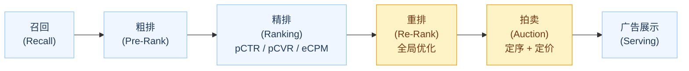
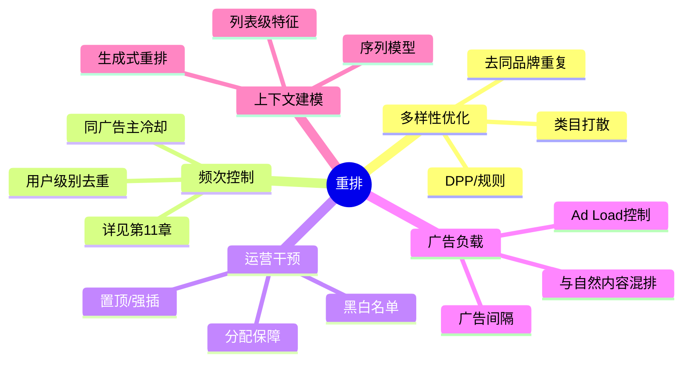
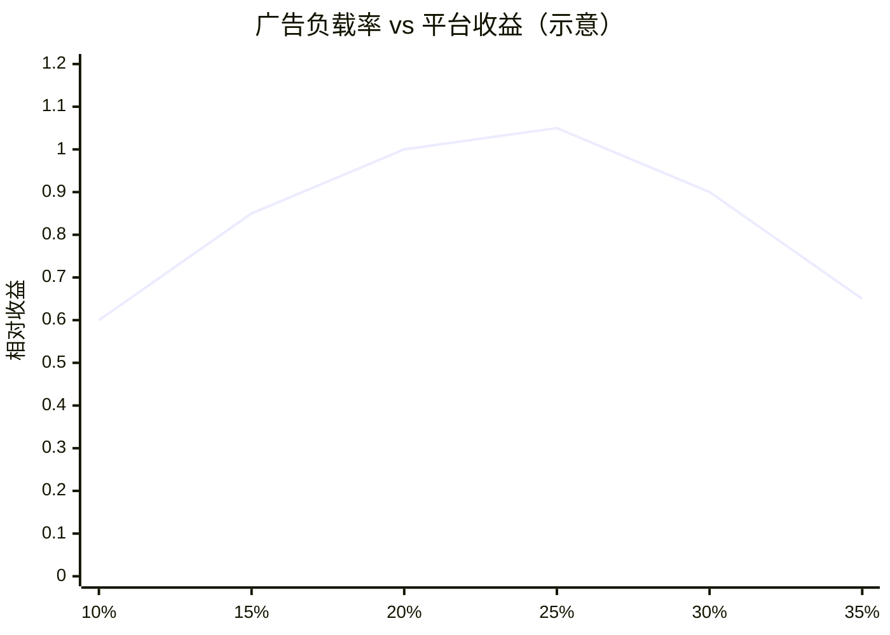
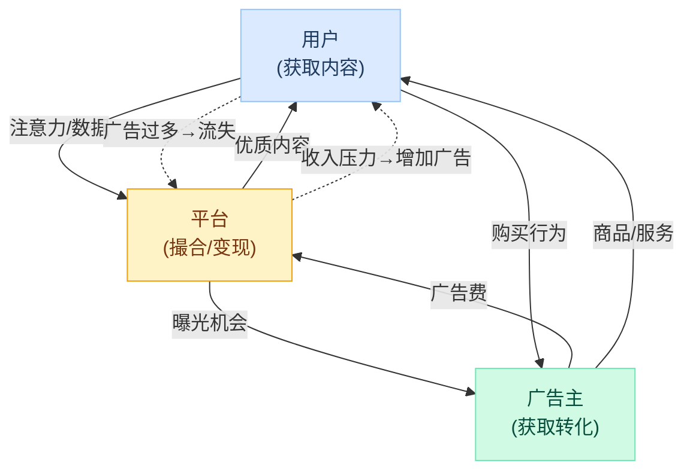
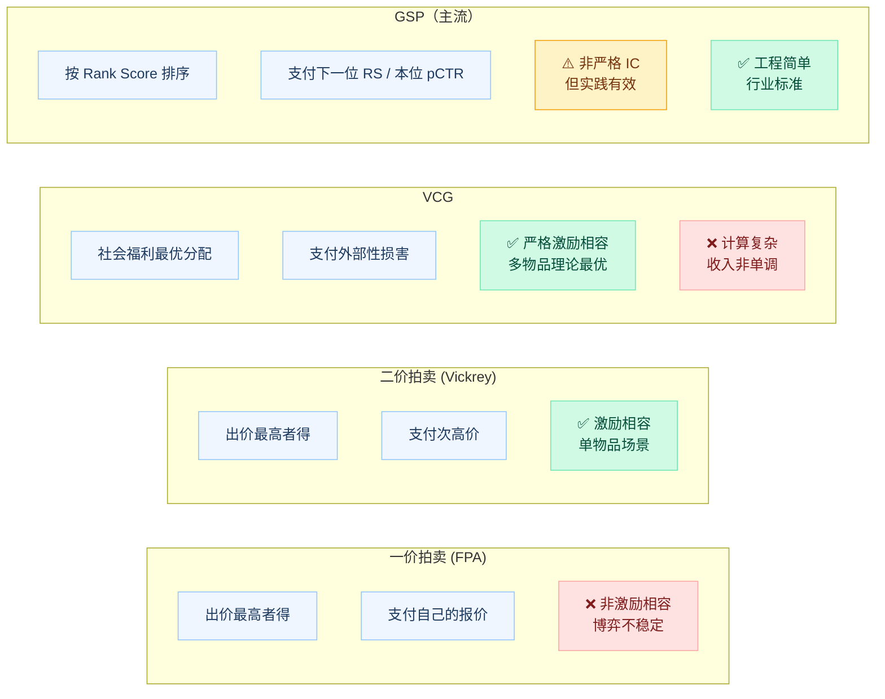
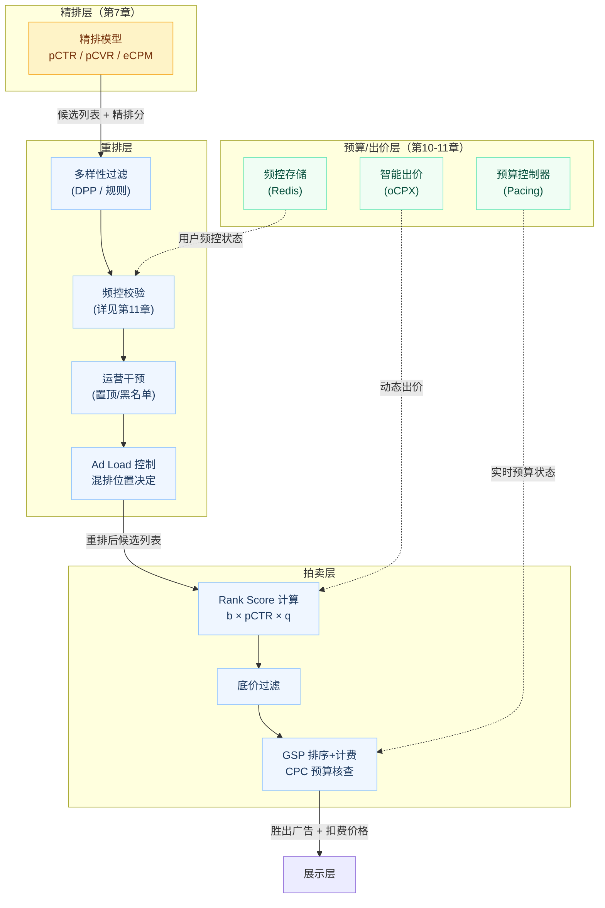

# 第8章 重排与拍卖机制

> **系列定位**：本章承接第7章（精排与CTR-CVR预估）的 pCTR/pCVR/eCPM 输出，完成广告上屏前的最后两道关键环节——**重排（Re-Rank）** 与 **拍卖（Auction）**。重排负责从列表视角做全局优化，拍卖机制负责定序与定价。计费模式（CPM/CPC/oCPX）的细节在第9章展开，预算控制与频次管理在第10、11章详述。本章聚焦机制设计本身的数学原理与工程落地。

---

## 本章导读

广告链路走到精排阶段，每个广告候选已经拿到了各自的 pCTR、pCVR 和 eCPM 分数——但"逐个打分"并不等于"最优展示列表"。想象一下：精排 Top-5 全是同品牌奶茶广告，用户刚刚看了两条轻氧奶茶的广告……这样的展示序显然有问题。

本章的核心命题是：**如何在精排分数的基础上，通过重排与拍卖，得到一个对平台、广告主、用户三方都尽量合理的展示序列，并确定每次展示/点击应向广告主收取多少费用？**

本章主要内容：

1. **重排的定位与必要性** —— 为什么精排后还需要额外的列表级优化
2. **重排做的事** —— 多样性、频控、运营干预、广告负载与混排
3. **列表级重排技术** —— DPP 行列式点过程（含代码）、生成式重排简介
4. **机制设计与拍卖理论** —— 本章核心，从单物品到多物品，从 FPA 到 VCG 再到 GSP
5. **Rank Score 与底价** —— 为什么排序分要乘 pCTR
6. **GSP 计费公式推导** —— 从原理到公式，带完整例子
7. **广告负载与长期价值** —— 广告太多的代价
8. **完整案例** —— 轻氧奶茶在悦读 App 信息流的一次竞拍过程

---

## 8.1 重排的定位



精排（第7章）是 **point-wise** 的：对每个候选广告独立打分，输出 eCPM 序列。这种打分方式有一个根本性限制——**它看不到列表整体**。

举例说明问题所在：

| 排名 | 广告 | eCPM |
|------|------|------|
| 1 | 轻氧奶茶 A款 | 92 |
| 2 | 轻氧奶茶 B款 | 88 |
| 3 | 轻氧奶茶 C款 | 85 |
| 4 | 蜜雪冰城 | 80 |
| 5 | 书心咖啡 | 75 |

精排输出的 Top-3 全是轻氧奶茶，从 eCPM 角度完全合理，但对用户而言三条同品牌广告会造成严重审美疲劳，并且对蜜雪冰城等广告主不公平（竞争同一用户注意力但被同品牌独占）。

**重排（Re-Rank）** 的定位正是在精排之后、拍卖之前，对候选列表做 **列表级（list-wise）** 的全局优化，综合考虑多样性、用户体验、业务规则等维度，最终输出一个更合理的候选序，再交给拍卖机制定价。

---

## 8.2 为什么精排后还需要重排

### 8.2.1 Point-wise 的根本局限

精排模型（无论 LR、GBDT 还是深度模型）本质上在解一个问题：

$$\hat{y}_i = f(\mathbf{x}_i)$$

即对第 $i$ 个候选广告，基于其特征 $\mathbf{x}_i$ 独立预测点击/转化概率。**每个广告的分数与其他广告无关**。

这意味着精排天然无法处理以下场景：

1. **列表内相关性**：广告 A 和广告 B 同时出现时，用户对 A 的点击概率会受 B 的影响（例如用户注意力有限）
2. **类目/品牌重复**：无法在分数维度感知"这两条广告在说同一件事"
3. **广告间隔规则**：相邻位置不能放同一广告主的广告
4. **全局平滑约束**：预算分配、曝光节奏在精排层不可见

### 8.2.2 重排需要解决的五类问题



---

## 8.3 重排做的事

### 8.3.1 多样性优化（De-duplication & Diversity）

**目标**：避免同品牌/同类目广告扎堆，给用户更丰富的信息。

最简单的实现是**硬规则**：
- 同一广告主（Advertiser）在展示窗口中最多出现 N 次
- 相邻两条广告不能来自同一广告主
- 同一类目（如"奶茶饮品"）在 Top-5 中最多出现 2 条

硬规则简单可控，但缺乏灵活性，无法处理微妙的相似性（两个不同品牌但同质化极高的产品）。更高级的方法是用数学模型建模多样性，如 **DPP（Determinantal Point Process，行列式点过程）**，详见 8.4 节。

### 8.3.2 频次控制（Frequency Capping）

频次控制（Frequency Capping，简称频控）关注的是：同一用户在一段时间内，同一广告最多曝光几次？

这是个典型的用户体验保护机制，工程实现依赖 Redis 等快速存储记录用户-广告的曝光计数。频控的详细设计见**第11章**，重排层的职责是在最终决策前做最后一道频控校验并过滤/降权超频广告。

### 8.3.3 运营干预（Business Override）

平台往往需要在纯算法结果之上叠加运营层的人工干预：

- **置顶（Pinning）**：品牌合作方付费保障特定位置，不参与竞价
- **强插（Insertion）**：节日/大促期间某广告必须出现在某些位置
- **黑白名单（Blocklist/Allowlist）**：某广告主的广告不能出现在特定内容旁边（品牌安全）
- **保量合约（Guaranteed Delivery）**：合同广告需要保障曝光量，可能需要在竞价结果中强制插入

这类干预通常在重排层以规则引擎的形式实现，优先级高于算法结果。

### 8.3.4 广告负载与混排（Ad Load & Native Blending）

**广告负载（Ad Load）** 指的是广告条数占信息流总条数的比例。如悦读 App 每刷 10 条内容，其中 2 条是广告，Ad Load = 20%。

混排需要决定：
1. **广告间隔**：每隔几条自然内容放一条广告（如每 5 条插 1 条）
2. **位置分配**：哪几个坑位放广告（通常有固定的广告坑位模板，也有动态调整方案）
3. **总量控制**：每次请求最多展示几条广告

**广告太多的代价**不是线性的——用户对广告的容忍度有阈值效应：少量广告几乎无感，超过阈值后体验急剧下滑，导致用户留存率下降，长期损害平台收入（三方博弈详见第1章）。

**广告间隔规则示例**：

```
位置 1：自然内容
位置 2：自然内容
位置 3：广告 ← 第1个广告坑位
位置 4：自然内容
位置 5：自然内容
位置 6：自然内容
位置 7：广告 ← 第2个广告坑位
...
```

### 8.3.5 上下文/列表级建模

最前沿的重排方法将整个候选列表作为输入，用序列模型建模列表内的相互影响。例如：

- **DLCM（Deep Listwise Context Model）**：用 RNN 对列表建模，捕获位置偏差和列表内交互
- **PRS（Personalized Re-ranking System）**：基于 Transformer 建模用户-列表交互
- **生成式重排**：用 Seq2Seq 或强化学习直接生成最优展示序列

这类模型训练复杂，线上延迟较高，通常只在精排候选集较小（如 Top-50）时使用。

---

## 8.4 列表级重排技术

### 8.4.1 DPP（行列式点过程）

**DPP（Determinantal Point Process，行列式点过程）** 是一种优雅的概率模型，天然建模了集合的"多样性"。

#### 核心思想

给定候选集 $\mathcal{Y} = \{1, 2, \ldots, M\}$，DPP 定义了集合 $S \subseteq \mathcal{Y}$ 被选中的概率：

$$P(S \propto \det(\mathbf{L}_S))$$

其中 $\mathbf{L}_S$ 是 **核矩阵（Kernel Matrix）** $\mathbf{L}$ 的子矩阵，行列式 $\det(\mathbf{L}_S)$ 越大，集合 $S$ 被选中的概率越高。

核矩阵 $\mathbf{L}$ 的元素定义为：

$$L_{ij} = q_i \cdot \phi_i^\top \phi_j \cdot q_j$$

其中：
- $q_i \geq 0$：第 $i$ 个广告的**质量分**（可以是精排的 eCPM）
- $\phi_i \in \mathbb{R}^d$：第 $i$ 个广告的**类目/内容特征向量**（归一化）
- $\phi_i^\top \phi_j$：两个广告的内容相似度（越相似越接近1）

**直觉理解**：$\det(\mathbf{L}_S)$ 等于矩阵 $\mathbf{L}_S$ 行向量围成的平行多面体体积。向量越正交（广告越多样），体积越大，被选中的概率越高。行列式同时平衡了质量（对角项）和多样性（非对角项的负面影响）。

#### 贪心 DPP 算法

精确求解 DPP 是 NP-hard 问题，实践中使用贪心近似：

$$i^* = \arg\max_{i \in \mathcal{Y} \setminus S} \log \det(\mathbf{L}_{S \cup \{i\}}) - \log \det(\mathbf{L}_S)$$

利用 Cholesky 分解可以将每步迭代的复杂度降至 $O(|S| \cdot d)$。

#### 简化实现代码（Python）

```python
import numpy as np
from typing import List, Tuple

def dpp_greedy_rerank(
    candidates: List[dict],
    top_k: int,
    diversity_weight: float = 0.5
) -> List[dict]:
    """
    基于贪心 DPP 的多样性重排。
    
    Args:
        candidates: 候选广告列表，每个元素包含:
                    - 'id': 广告ID
                    - 'ecpm': 精排分数（质量分 q_i）
                    - 'embedding': 类目/内容特征向量（numpy array）
        top_k: 需要选出的广告数量
        diversity_weight: 多样性权重（0=纯质量排序, 1=纯多样性）
    
    Returns:
        重排后的 top_k 个广告
    """
    n = len(candidates)
    if n == 0 or top_k == 0:
        return []
    
    # 提取质量分和归一化特征向量
    quality = np.array([c['ecpm'] for c in candidates], dtype=float)
    quality = quality / (quality.max() + 1e-9)  # 归一化到 [0, 1]
    
    embeddings = np.stack([c['embedding'] for c in candidates])  # shape: (n, d)
    # 归一化特征向量（每行单位长度）
    norms = np.linalg.norm(embeddings, axis=1, keepdims=True) + 1e-9
    embeddings = embeddings / norms
    
    # 构建核矩阵 L: L_ij = q_i * (phi_i · phi_j) * q_j
    # 对角项 L_ii = q_i^2（纯质量）
    # 非对角项 L_ij = q_i * sim(i,j) * q_j（相似度越高惩罚越大）
    sim_matrix = embeddings @ embeddings.T  # shape: (n, n), 取值 [-1, 1]
    
    # 融合质量与多样性: L_ij = q_i * [(1-alpha)*I + alpha*sim] * q_j
    # alpha = diversity_weight
    alpha = diversity_weight
    identity = np.eye(n)
    blended_sim = (1 - alpha) * identity + alpha * sim_matrix
    
    # L = diag(q) @ blended_sim @ diag(q)
    Q = np.diag(quality)
    L = Q @ blended_sim @ Q
    
    # 贪心迭代选取 top_k 个元素
    selected_indices = []
    remaining = list(range(n))
    
    # 维护 Cholesky 分解的中间量（简化版，直接用子矩阵行列式对数）
    for step in range(min(top_k, n)):
        best_idx = None
        best_score = -np.inf
        
        for i in remaining:
            candidate_set = selected_indices + [i]
            # 提取子矩阵
            sub_L = L[np.ix_(candidate_set, candidate_set)]
            
            # 计算行列式对数（数值稳定）
            sign, log_det = np.linalg.slogdet(sub_L)
            if sign <= 0:
                score = -np.inf  # 行列式非正，跳过
            else:
                # 边际增益 = log det(L_{S∪{i}}) - log det(L_S)
                if len(selected_indices) == 0:
                    prev_log_det = 0.0  # det([]) = 1, log(1) = 0
                else:
                    sub_L_prev = L[np.ix_(selected_indices, selected_indices)]
                    _, prev_log_det = np.linalg.slogdet(sub_L_prev)
                score = log_det - prev_log_det
            
            if score > best_score:
                best_score = score
                best_idx = i
        
        if best_idx is None:
            break
        
        selected_indices.append(best_idx)
        remaining.remove(best_idx)
    
    return [candidates[i] for i in selected_indices]


# ============ 示例使用 ============
if __name__ == "__main__":
    np.random.seed(42)
    
    # 模拟3个广告候选（悦读App信息流场景）
    candidates = [
        {
            'id': 'ad_qingyang_A',
            'name': '轻氧奶茶-买一送一',
            'ecpm': 92.0,
            # 奶茶类目特征（向量相似度高）
            'embedding': np.array([0.9, 0.8, 0.1, 0.1, 0.0])
        },
        {
            'id': 'ad_qingyang_B',
            'name': '轻氧奶茶-新品上市',
            'ecpm': 88.0,
            # 同品牌，特征极其相似
            'embedding': np.array([0.88, 0.82, 0.09, 0.12, 0.01])
        },
        {
            'id': 'ad_mixue',
            'name': '蜜雪冰城-1元冰淇淋',
            'ecpm': 80.0,
            # 同类目但不同品牌
            'embedding': np.array([0.7, 0.6, 0.3, 0.2, 0.1])
        },
        {
            'id': 'ad_book',
            'name': '书心咖啡-阅读套餐',
            'ecpm': 75.0,
            # 不同类目（咖啡+阅读），特征差异较大
            'embedding': np.array([0.1, 0.2, 0.8, 0.7, 0.9])
        },
    ]
    
    print("=== 纯精排排序（按 eCPM 降序）===")
    sorted_by_ecpm = sorted(candidates, key=lambda x: x['ecpm'], reverse=True)
    for i, ad in enumerate(sorted_by_ecpm):
        print(f"  位置{i+1}: {ad['name']} (eCPM={ad['ecpm']})")
    
    print("\n=== DPP 重排结果（diversity_weight=0.5）===")
    reranked = dpp_greedy_rerank(candidates, top_k=3, diversity_weight=0.5)
    for i, ad in enumerate(reranked):
        print(f"  位置{i+1}: {ad['name']} (eCPM={ad['ecpm']})")
    
    print("\n说明：DPP在保留高质量广告的同时，避免了两条轻氧奶茶同时出现")
```

**预期输出**：
```
=== 纯精排排序（按 eCPM 降序）===
  位置1: 轻氧奶茶-买一送一 (eCPM=92.0)
  位置2: 轻氧奶茶-新品上市 (eCPM=88.0)  ← 同品牌重复
  位置3: 蜜雪冰城-1元冰淇淋 (eCPM=80.0)

=== DPP 重排结果（diversity_weight=0.5）===
  位置1: 轻氧奶茶-买一送一 (eCPM=92.0)   ← 最高质量保留
  位置2: 书心咖啡-阅读套餐 (eCPM=75.0)   ← 特征差异最大，多样性最高
  位置3: 蜜雪冰城-1元冰淇淋 (eCPM=80.0)  ← 平衡质量与多样性
```

DPP 将第二位从同品牌广告替换为特征差异最大的书心咖啡，虽然 eCPM 从 88 降至 75，但列表整体多样性显著提升。

### 8.4.2 生成式重排简介

生成式重排将重排建模为一个**序列生成问题**：给定候选集，输出最优排列序列。

核心思路：
- 用 Transformer 或 Pointer Network 对候选广告集合建模
- 自回归地生成展示序列：每步根据已生成的序列选择下一个广告
- 训练目标：最大化列表级用户收益（如列表 CVR 或 NDCG）

优点：理论上能捕获任意复杂的列表内交互。  
缺点：自回归生成的线上延迟较高（通常 10ms 以上），工程挑战大。目前主要在精排候选集较小（Top-20 至 Top-50）时使用。

---

## 8.5 机制设计与拍卖理论

### 8.5.1 为什么广告需要拍卖？

广告平台面临一个核心问题：同一时刻，同一广告位，可能有数百个广告主竞争。平台需要一套机制来决定：
1. **展示谁**（分配规则 Allocation Rule）
2. **收多少钱**（计费规则 Payment Rule）

最朴素的想法是"价高者得，收他报的价"——这就是一价拍卖。但这个方案有严重问题，我们先从理论基础讲起。

### 8.5.2 机制设计三要素

**机制设计（Mechanism Design）** 是博弈论的一个分支，研究如何设计规则，使理性参与者在追求自身利益的同时，达到设计者期望的结果。

广告拍卖的机制设计有三个核心要素：

| 要素 | 定义 | 广告场景含义 |
|------|------|------------|
| **分配规则（Allocation Rule）** | 谁能获得广告位 | 根据出价/质量分排序决定展示顺序 |
| **计费规则（Payment Rule）** | 赢家支付多少 | 收取点击费用/曝光费用的计算方式 |
| **激励相容（Incentive Compatible / IC）** | 诚实出价是最优策略 | 广告主按真实价值出价时利益最大 |

**激励相容（Truthfulness）** 是最关键的性质。如果机制不满足激励相容，广告主就会花大量精力猜测对手出价、不断调整策略——这对平台（收入不稳定）、广告主（运营成本高）都是损耗。

### 8.5.3 一价拍卖（First-Price Auction, FPA）

#### 机制描述

- 所有广告主提交出价 $b_i$
- 出价最高者获得广告位
- 赢家支付自己的报价 $b_i$（一价，pay-as-bid）

#### 问题：非真实出价的博弈

假设广告主 A 知道自己的真实价值是 $v_A = 10$ 元/点击，如果他报 $b_A = 10$，赢了但利润为 0。理性选择是**压低出价**（shading），报 $b_A = 7$，赢了有 3 元利润。

但如果所有人都压低出价，就会陷入博弈循环：没人知道最优的"压低幅度"，最终 Nash 均衡下的出价是对手价值的函数，计算复杂且不稳定。

**一价拍卖的核心问题**：
1. 广告主需要研究对手策略，运营成本高
2. 均衡出价依赖对手分布的先验知识，实践中难以估计
3. 可能导致平台收入次优（低出价均衡）

> **注**：尽管有上述问题，一价拍卖（FPA）在近年重新受到关注。Google 和 The Trade Desk 2019 年前后将部分拍卖切换为 FPA，主要原因是程序化广告生态中的多次出价现象使 GSP 的均衡出价预测变得更不准确，FPA 反而有更好的收入保证。本章仍以 GSP 为主线，FPA 与 GSP 的现代对比在第9章讨论。

### 8.5.4 二价拍卖（Vickrey Auction / Second-Price Auction, SPA）

#### 机制描述（单物品）

- 所有广告主提交出价 $b_i$
- 出价最高者获得广告位（同 FPA）
- **赢家支付次高价**（Second Highest Bid），而非自己的报价

这个机制由 William Vickrey 在 1961 年提出，他因此获得了 1996 年诺贝尔经济学奖。

#### 关键性质：真实出价是占优策略

**定理**：在 Vickrey 拍卖中，无论其他人如何出价，按真实价值 $v_i$ 出价都是每个广告主的**占优策略（Dominant Strategy）**。

**直觉证明**（反证法思路）：

设广告主 A 的真实价值为 $v_A$，次高价为 $p$（由其他人的出价决定，A 无法控制）。

**情形1：$v_A > p$（A 应该赢）**

| A 的出价策略 | 结果 |
|------------|------|
| $b_A = v_A$（真实）| A 赢，支付 $p$，利润 $= v_A - p > 0$ ✓ |
| $b_A > v_A$（虚高）| A 赢，支付 $p$，利润不变（$p$ 取决于他人，不变）✓ |
| $b_A < p$（虚低）| A 输，利润 $= 0$，损失机会 ✗ |
| $p < b_A < v_A$（适当降低）| A 赢，支付 $p$，利润不变 ✓ |

结论：当 $v_A > p$ 时，任何 $b_A \geq p$ 都能赢，且利润相同；$b_A < p$ 会错过正利润机会。

**情形2：$v_A < p$（A 不应该赢）**

| A 的出价策略 | 结果 |
|------------|------|
| $b_A = v_A$（真实）| A 输，利润 $= 0$ ✓ |
| $b_A > p$（虚高）| A 赢，支付 $p > v_A$，利润 $= v_A - p < 0$ ✗ |

结论：当 $v_A < p$ 时，赢了反而亏损。

**综合两种情形**：按真实价值出价不会更差，某些情况下（情形1中 $b_A < p$）偏离会更差。因此，**真实出价是弱占优策略（Weakly Dominant Strategy）**。

### 8.5.5 VCG 机制（Vickrey-Clarke-Groves）

#### 从单物品到多物品

现实中，信息流广告往往有**多个广告位**，需要同时分配给多个广告主。VCG 机制将 Vickrey 拍卖推广到多物品场景。

#### VCG 的分配规则

VCG 的分配目标是**最大化社会福利（Social Welfare）**：

$$\text{maximize} \sum_{i \in S} v_i \cdot x_i$$

其中 $x_i \in \{0, 1\}$ 表示广告主 $i$ 是否获得广告位，$v_i$ 是其真实价值。

在多广告位场景中，假设有 $K$ 个广告位，位置 $k$ 的点击率（位置系数）为 $\alpha_k$（$\alpha_1 \geq \alpha_2 \geq \ldots \geq \alpha_K$），广告主 $i$ 排在位置 $k$ 的社会福利贡献为 $v_i \cdot \alpha_k$。最优分配是按 $v_i$ 降序排列广告主。

#### VCG 的计费规则：外部性（Externality）

VCG 的核心思想：**每个广告主支付的费用 = 他的存在给其他人造成的损害（外部性）**。

设广告主集合为 $N$，广告主 $i$ 在 VCG 下支付：

$$p_i = \underbrace{W_{-i}(\hat{\mathbf{b}}_{-i})}_{\text{无}i\text{时的最优社会福利}} - \underbrace{\sum_{j \neq i} v_j(\mathbf{a}(\hat{\mathbf{b}}))}_{\text{有}i\text{时其他人的实得福利}}$$

其中：
- $W_{-i}(\hat{\mathbf{b}}_{-i})$：在没有广告主 $i$ 参与时，其他广告主获得的最大社会福利
- $\sum_{j \neq i} v_j(\mathbf{a}(\hat{\mathbf{b}}))$：有 $i$ 参与时，其他广告主实际获得的社会福利
- 两者之差即为广告主 $i$ "挤占"其他广告主所造成的损害

**VCG 性质**：
1. **激励相容（Truthful）**：按真实价值出价是占优策略（可严格证明）
2. **社会效率最优**：分配结果最大化社会总福利
3. **个人理性（Individual Rationality）**：赢家利润 $\geq 0$

#### VCG 计费例子

**场景**：悦读 App 有 2 个广告位，位置点击率分别为 $\alpha_1 = 0.05, \alpha_2 = 0.03$。有 3 个广告主：

| 广告主 | 真实出价（元/点击）$v_i$ | 
|-------|----------------------|
| A（轻氧奶茶） | 10 |
| B（蜜雪冰城） | 7 |
| C（书心咖啡） | 4 |

**分配结果**（按 $v_i$ 降序）：
- 位置1：A，期望点击数 = $0.05$，社会福利贡献 = $10 \times 0.05 = 0.5$
- 位置2：B，期望点击数 = $0.03$，社会福利贡献 = $7 \times 0.03 = 0.21$
- C 落选

**社会总福利** = $0.5 + 0.21 = 0.71$

**VCG 计费计算**：

**广告主 A（位置1）的费用**：

没有 A 时：B 排位1，C 排位2
- B 的福利 = $7 \times 0.05 = 0.35$
- C 的福利 = $4 \times 0.03 = 0.12$
- $W_{-A} = 0.35 + 0.12 = 0.47$

有 A 时，其他人实得：
- B 的福利 = $7 \times 0.03 = 0.21$
- C 的福利 = $0$（落选）
- 其他人实得 = $0.21$

$$p_A = W_{-A} - \text{其他人实得} = 0.47 - 0.21 = 0.26 \text{ 元（每次展示）}$$

换算为每次**点击**费用：$p_A^{\text{CPC}} = 0.26 / 0.05 = 5.2$ 元/点击

**广告主 B（位置2）的费用**：

没有 B 时：A 排位1，C 排位2
- A 的福利 = $10 \times 0.05 = 0.5$
- C 的福利 = $4 \times 0.03 = 0.12$
- $W_{-B} = 0.5 + 0.12 = 0.62$

有 B 时，其他人实得：
- A 的福利 = $10 \times 0.05 = 0.5$（A 位置不变）
- C 的福利 = $0$（落选）
- 其他人实得 = $0.5$

$$p_B = W_{-B} - \text{其他人实得} = 0.62 - 0.5 = 0.12 \text{ 元（每次展示）}$$

换算为每次**点击**费用：$p_B^{\text{CPC}} = 0.12 / 0.03 = 4$ 元/点击（等于 C 的出价，符合直觉）

#### VCG 的局限性

VCG 理论上优美，但工程实践中存在问题：
1. **计算复杂度高**：需要对每个广告主都重新计算"没有他时"的最优分配，$O(n \cdot K!)$ 复杂度
2. **非单调性**：在某些设置下，增加竞争者反而可能让平台收入下降（"VCG 收入非单调"）
3. **串谋脆弱**：多个广告主可以通过合谋减少总支付
4. **实际使用有限**：实践中搜索/信息流广告主流使用 GSP 而非 VCG

### 8.5.6 GSP（广义第二价格拍卖）

**GSP（Generalized Second Price，广义第二价格拍卖）** 是搜索广告和信息流广告的实际主流机制。它由 Google 在 2002 年前后大规模应用，是对 Vickrey 拍卖在多广告位场景的一种（非 VCG）推广。

#### GSP 与 VCG 的核心区别

| 维度 | VCG | GSP |
|------|-----|-----|
| 排序依据 | 真实价值 $v_i$ | Rank Score = $b_i \times$ pCTR |
| 计费依据 | 外部性（社会福利损失）| 下一位的 Rank Score / 本位 pCTR |
| 激励相容 | 严格真实出价 | **非严格**（但实践有效） |
| 计算复杂度 | $O(n^2)$ | $O(n \log n)$（排序即可）|
| 工程友好度 | 较复杂 | 简单直接 |

**为什么 GSP 不严格激励相容？**  
在 GSP 下，广告主可能通过调整出价获益（例如略微压低出价以节省成本，同时仍保持排名），但实践中偏离真实出价的收益有限，且算法平台（如 Google、Meta）的频繁价格更新使得猜测对手出价变得很难，市场趋向于一种"局部均衡"状态。

---

## 8.6 Rank Score 与底价

### 8.6.1 为什么排序分要乘 pCTR

最直觉的想法是直接按出价排序（$b_i$ 降序），但这有个严重问题：

**例子**：
- 广告主 A 出价 10 元/点击，pCTR = 0.01（质量差，预计 100 次展示才1次点击）
- 广告主 B 出价 6 元/点击，pCTR = 0.05（质量好，预计 20 次展示就1次点击）

如果按出价排序，A 排前面。但每次展示的期望收益：
- A：$10 \times 0.01 = 0.10$ 元/展示
- B：$6 \times 0.05 = 0.30$ 元/展示

B 展示一次为平台带来的**期望收益是 A 的 3 倍**，但 A 排在前面。这显然不合理。

**正确做法**：用 **eCPM（Effective Cost Per Mille，有效千次展示费用）** 或等价的 **Rank Score** 排序：

$$\text{Rank Score}_i = b_i \times \text{pCTR}_i$$

这等价于按"每次展示的期望收入"排序，使平台总期望收入最大化。

**带质量分的 Rank Score**：

实践中，平台还会叠加广告质量分 $q_i$（综合用户体验、相关性、历史表现等）：

$$\text{Rank Score}_i = b_i \times \text{pCTR}_i \times q_i$$

其中 $q_i \in (0, 2]$ 是质量乘数（$q_i < 1$ 降权，$q_i > 1$ 加权）。质量分可以防止低质量广告通过高出价霸占黄金位置，保护用户体验。

### 8.6.2 底价（Reserve Price）

**保留价/底价（Reserve Price）** $r$ 是平台设置的最低成交价：Rank Score 低于底价的广告不会展示。

$$\text{展示条件}: b_i \times \text{pCTR}_i \times q_i \geq r$$

底价的作用：
1. **提升平台收入**：在广告主出价较低时，底价迫使赢家支付更高费用（若次高价低于底价，赢家按底价付款）
2. **保证广告质量**：质量分过低的广告即使出高价也无法展示
3. **防止恶意竞争**：防止广告主用极低出价"占位"

---

## 8.7 GSP 计费公式推导

### 8.7.1 GSP 的排序与计费规则

**第一步：按 Rank Score 排序**

$$\text{Rank Score}_i = b_i \times \text{pCTR}_i$$

广告位从高到低分别分配给 Rank Score 最高的广告主。

**第二步：计费（CPC 模式）**

排在第 $k$ 位的广告主，每次**点击**支付的费用为：

$$\text{CPC}_k = \frac{\text{Rank Score}_{k+1}}{\text{pCTR}_k} + \delta$$

其中：
- $\text{Rank Score}_{k+1}$：第 $k+1$ 位广告的 Rank Score
- $\text{pCTR}_k$：第 $k$ 位广告的 pCTR
- $\delta$：一个极小的加价（通常为 $0.01$ 元），确保赢家的 Rank Score 严格大于下一位

**理解这个公式**：

$$\text{CPC}_k = \frac{b_{k+1} \times \text{pCTR}_{k+1}}{\text{pCTR}_k} + \delta$$

这个公式背后的逻辑是：要"刚好超过"第 $k+1$ 位所需的最低出价。

设 $c_k$ 是第 $k$ 位广告主需要支付的 CPC，他的 Rank Score 必须超过第 $k+1$ 位：

$$c_k \times \text{pCTR}_k \geq b_{k+1} \times \text{pCTR}_{k+1}$$

解得：

$$c_k \geq \frac{b_{k+1} \times \text{pCTR}_{k+1}}{\text{pCTR}_k}$$

GSP 取等号（加上 $\delta$ 确保严格大于），即按"保持当前排名所需的最低 CPC"计费。

### 8.7.2 CPM 模式下的计费

在 CPM（Cost Per Mille，千次展示计费）模式下，按展示计费：

$$\text{CPM}_k = \frac{\text{Rank Score}_{k+1}}{\text{pCTR}_k} \times \text{pCTR}_k \times 1000 + \delta$$

$$= \text{Rank Score}_{k+1} \times 1000 + \delta$$

即第 $k$ 位的千次展示费用 = 第 $k+1$ 位的 Rank Score × 1000（加上极小的加价）。注意这个公式与 pCTR 无关——CPM 模式下计费只看下一位的 Rank Score。

CPC 与 CPM 计费模式的详细讨论见**第9章**。

### 8.7.3 底价对计费的影响

当第 $k$ 位是最后一名广告（没有第 $k+1$ 位），或第 $k+1$ 位的 Rank Score 低于底价 $r$ 时：

$$\text{CPC}_k = \frac{r}{\text{pCTR}_k} + \delta$$

即最后一名按底价结算，这保证了平台的最低收益。

---

## 8.8 广告负载与长期价值

### 8.8.1 广告数量与用户体验的矛盾



广告负载与平台收益的关系是**倒 U 型曲线**：
- 负载率过低：大量广告库存未变现，收入损失
- 负载率过高：用户体验下降 → 次日留存率下降 → 长期 DAU 下滑 → 广告库存萎缩 → 长期收入下滑

这是平台运营的核心权衡，通常需要通过 A/B 实验在不同时间尺度上观测用户留存与收入的联动效应。

### 8.8.2 三方博弈

广告生态中存在用户、广告主、平台三方的博弈（详见第1章）：



**平台的最优策略**不是短期收益最大化（无限增加广告），而是在用户体验约束下，找到使长期收入净现值（NPV）最大的广告负载率。这通常是一个动态规划问题，需要结合留存率模型估算。

---

## 8.9 完整案例：轻氧奶茶在悦读 App 的竞拍

### 场景设定

悦读 App 信息流中，某用户请求时有 **1 个广告位**（为简化，只考虑单广告位）待竞争。精排完成后，共有 **4 个广告主**入选候选池，其基本信息如下：

| 广告主 | 出价（元/点击）$b_i$ | 精排预测 pCTR | 质量分 $q_i$ |
|-------|-------------------|-------------|------------|
| 轻氧奶茶 | 15.00 | 0.025 | 1.0（正常）|
| 蜜雪冰城 | 20.00 | 0.015 | 0.9（略低）|
| 书心咖啡 | 12.00 | 0.040 | 1.1（略高）|
| 美宝莲 | 8.00 | 0.020 | 1.0（正常）|

**保留价（底价）**：$r = 0.25$（Rank Score 低于此值不展示）

### Step 1：计算 Rank Score

$$\text{Rank Score}_i = b_i \times \text{pCTR}_i \times q_i$$

| 广告主 | 计算过程 | Rank Score |
|-------|---------|-----------|
| 轻氧奶茶 | $15.00 \times 0.025 \times 1.0$ | **0.375** |
| 蜜雪冰城 | $20.00 \times 0.015 \times 0.9$ | **0.270** |
| 书心咖啡 | $12.00 \times 0.040 \times 1.1$ | **0.528** |
| 美宝莲 | $8.00 \times 0.020 \times 1.0$ | **0.160**（< 底价 0.25，不展示）|

### Step 2：过滤底价，按 Rank Score 排序

美宝莲的 Rank Score（0.160）< 底价（0.25），直接过滤。

剩余广告主按 Rank Score 降序排列（仅1个广告位，取排名第1）：

| 排名 | 广告主 | Rank Score |
|-----|-------|-----------|
| **1** | **书心咖啡** | **0.528** |
| 2 | 轻氧奶茶 | 0.375 |
| 3 | 蜜雪冰城 | 0.270 |
| — | 美宝莲 | 0.160（底价过滤）|

**结论**：书心咖啡赢得广告位（尽管出价最低，但 pCTR 最高且质量分最好）。

### Step 3：GSP 计费

广告位只有1个，书心咖啡是第1位，第2位是轻氧奶茶（Rank Score = 0.375）。

$$\text{CPC}_{\text{书心咖啡}} = \frac{\text{Rank Score}_{\text{轻氧奶茶}}}{\text{pCTR}_{\text{书心咖啡}}} + 0.01$$

$$= \frac{0.375}{0.040} + 0.01 = 9.375 + 0.01 = \mathbf{9.385 \text{ 元/点击}}$$

**验证**：书心咖啡出价 12 元/点击，实际扣费 9.385 元/点击，利润 = $12 - 9.385 = 2.615$ 元/点击 > 0，个人理性满足。

### Step 4：轻氧奶茶的情况

轻氧奶茶此次竞拍**落选**（排名第2，只有1个广告位）。

**轻氧奶茶的广告主视角分析**：

- 轻氧奶茶出价 15 元/点击，Rank Score 0.375
- 要超过书心咖啡（Rank Score 0.528），需要：

$$b_{\text{轻氧}} \times 0.025 \times 1.0 \geq 0.528$$
$$b_{\text{轻氧}} \geq \frac{0.528}{0.025} = 21.12 \text{ 元/点击}$$

但如果以 21.12 元中标，GSP 下的计费为：

$$\text{CPC} = \frac{0.375}{0.025} + 0.01 = 15.01 \text{ 元/点击}$$

这远超轻氧奶茶设定的转化成本目标（≤ 30 元/转化）吗？需要结合 CVR 计算：若点击到下单转化率 CVR = 0.2，则每次转化成本 = $15.01 / 0.2 = 75.05$ 元，远超 30 元目标。

实际的智能出价系统（详见**第10章**）会根据 CVR 预估动态调整出价，而非简单使用固定出价。轻氧奶茶的目标转化成本 30 元、CVR = 0.2，则最大可承受 CPC = $30 \times 0.2 = 6$ 元/点击——这意味着合理的出价上限约为：

$$b_{\text{轻氧，最大}} = \frac{6 \times \text{pCTR} \times q}{\text{pCTR} \times q} \times \frac{\text{Rank Score}_{k+1} + \delta}{\text{pCTR}_k}$$

简化来说，轻氧奶茶每点击最多能出到约 6 元，对应 Rank Score 上限为 $6 \times 0.025 = 0.15$，在本次竞拍中不具竞争力——这是系统自动决策的结果，属于智能出价的范畴（**第10章**详述）。

### 完整竞拍汇总表

| 广告主 | 出价 $b_i$ | pCTR | 质量分 $q_i$ | Rank Score | 排名 | 实际 CPC |
|-------|----------|------|------------|-----------|-----|---------|
| 书心咖啡 | 12.00 | 0.040 | 1.1 | **0.528** | **1（展示）** | **9.385 元** |
| 轻氧奶茶 | 15.00 | 0.025 | 1.0 | 0.375 | 2（落选）| — |
| 蜜雪冰城 | 20.00 | 0.015 | 0.9 | 0.270 | 3（落选）| — |
| 美宝莲 | 8.00 | 0.020 | 1.0 | 0.160 | 底价过滤 | — |

**关键洞察**：
1. 书心咖啡出价最低，但凭借最高的 pCTR 和质量分赢得竞拍，体现了 Rank Score 机制的合理性
2. 蜜雪冰城出价最高（20元），但因质量分折扣和低 pCTR，Rank Score 排名第3
3. 书心咖啡的实际扣费（9.385元）远低于出价（12元），留有利润空间，符合 GSP 的"次高价"精神

### GSP 拍卖代码实现

```python
from dataclasses import dataclass
from typing import List, Optional

@dataclass
class AdCandidate:
    """广告候选"""
    ad_id: str
    advertiser: str
    bid: float          # 出价（元/点击）
    pctr: float         # 精排预测点击率
    quality_score: float = 1.0  # 质量分
    
    @property
    def rank_score(self) -> float:
        """Rank Score = bid × pCTR × quality_score"""
        return self.bid * self.pctr * self.quality_score


def gsp_auction(
    candidates: List[AdCandidate],
    num_slots: int,
    reserve_price: float = 0.0,
    delta: float = 0.01
) -> List[dict]:
    """
    GSP（广义第二价格）拍卖实现。
    
    Args:
        candidates: 广告候选列表（精排后）
        num_slots: 广告位数量
        reserve_price: 底价（Rank Score 低于此值不展示）
        delta: 最小加价（确保赢家 rank_score 严格大于下一位）
    
    Returns:
        获胜广告列表，每个包含排名、广告信息、实际CPC
    """
    # Step 1: 过滤底价
    eligible = [c for c in candidates if c.rank_score >= reserve_price]
    
    # Step 2: 按 Rank Score 降序排序
    eligible.sort(key=lambda x: x.rank_score, reverse=True)
    
    # Step 3: 取 Top num_slots
    winners = eligible[:num_slots]
    
    # Step 4: GSP 计费
    results = []
    for k, ad in enumerate(winners):
        # 计算第 k 位的 CPC
        if k + 1 < len(eligible):
            # 正常情况：存在第 k+1 位，按其 Rank Score 计费
            next_rank_score = eligible[k + 1].rank_score
        else:
            # 最后一位（或唯一竞选者）：按底价计费
            next_rank_score = reserve_price
        
        # GSP 计费公式：CPC_k = rank_score_{k+1} / pCTR_k + delta
        cpc = next_rank_score / ad.pctr + delta
        
        # 确保 CPC 不超过出价（理论保证，防止数值异常）
        cpc = min(cpc, ad.bid)
        
        results.append({
            'rank': k + 1,
            'ad_id': ad.ad_id,
            'advertiser': ad.advertiser,
            'bid': ad.bid,
            'pctr': ad.pctr,
            'quality_score': ad.quality_score,
            'rank_score': ad.rank_score,
            'actual_cpc': round(cpc, 4),
            'profit_per_click': round(ad.bid - cpc, 4),  # 广告主每次点击的净收益
        })
    
    return results


# ============ 悦读 App 竞拍演示 ============
if __name__ == "__main__":
    candidates = [
        AdCandidate("ad_001", "轻氧奶茶", bid=15.00, pctr=0.025, quality_score=1.0),
        AdCandidate("ad_002", "蜜雪冰城", bid=20.00, pctr=0.015, quality_score=0.9),
        AdCandidate("ad_003", "书心咖啡", bid=12.00, pctr=0.040, quality_score=1.1),
        AdCandidate("ad_004", "美宝莲",   bid=8.00,  pctr=0.020, quality_score=1.0),
    ]
    
    print("=" * 65)
    print("悦读 App 信息流广告竞拍（GSP 机制）")
    print("=" * 65)
    
    print("\n【所有候选广告的 Rank Score】")
    print(f"{'广告主':<12}{'出价':>8}{'pCTR':>8}{'质量分':>8}{'Rank Score':>12}")
    print("-" * 48)
    for c in sorted(candidates, key=lambda x: x.rank_score, reverse=True):
        flag = " ← 底价过滤" if c.rank_score < 0.25 else ""
        print(f"{c.advertiser:<12}{c.bid:>8.2f}{c.pctr:>8.3f}{c.quality_score:>8.1f}{c.rank_score:>12.3f}{flag}")
    
    # 单广告位竞拍
    results = gsp_auction(candidates, num_slots=1, reserve_price=0.25, delta=0.01)
    
    print("\n【竞拍结果（1个广告位）】")
    for r in results:
        print(f"\n  排名: {r['rank']}")
        print(f"  广告主: {r['advertiser']}")
        print(f"  出价: {r['bid']:.2f} 元/点击")
        print(f"  Rank Score: {r['rank_score']:.3f}")
        print(f"  实际 CPC: {r['actual_cpc']:.4f} 元/点击")
        print(f"  广告主每点击利润: {r['profit_per_click']:.4f} 元")
    
    # 验证计费公式
    print("\n【计费公式验证（书心咖啡）】")
    print(f"  轻氧奶茶 Rank Score（次位）: 0.375")
    print(f"  书心咖啡 pCTR: 0.040")
    print(f"  CPC = 0.375 / 0.040 + 0.01 = {0.375/0.040 + 0.01:.4f} 元/点击")
```

---

## 8.10 各拍卖机制对比



**四种机制系统对比**：

| 维度 | FPA | Vickrey (SPA) | VCG | GSP |
|------|-----|--------------|-----|-----|
| **适用场景** | 单/多物品 | 单物品 | 多物品 | 多广告位 |
| **排序依据** | 出价 $b_i$ | 出价 $b_i$ | 价值 $v_i$ | Rank Score |
| **计费规则** | 自身出价 | 次高价 | 外部性 | 下位 RS / 本位 pCTR |
| **激励相容** | ❌ 非 IC | ✅ 弱占优 | ✅ 严格占优 | ⚠️ 非严格 |
| **社会效率** | 次优 | 最优（单物品）| 最优（多物品）| 次优 |
| **计算复杂度** | $O(n \log n)$ | $O(n \log n)$ | $O(n^2)$ 以上 | $O(n \log n)$ |
| **工程实现** | 简单 | 简单 | 复杂 | 简单 |
| **行业使用** | 程序化 RTB | 部分场景 | 理论研究 | 搜索/信息流主流 |

---

## 8.11 工程实现：重排与拍卖在引擎中的位置

### 8.11.1 系统架构



### 8.11.2 各模块延迟预算

广告请求总体延迟预算通常为 **100ms 以内**（详见**第14章**），重排与拍卖层的典型延迟分配：

| 模块 | 典型延迟 | 说明 |
|------|---------|------|
| 多样性过滤（规则） | < 1ms | 简单规则，CPU 密集但耗时极短 |
| 多样性过滤（DPP）| 2-5ms | 矩阵运算，取决于候选集大小 |
| 频控校验（Redis） | 1-3ms | 网络 I/O，批量查询 |
| 运营干预（规则引擎）| < 1ms | 内存规则，极快 |
| Rank Score 计算 | < 1ms | 简单乘法 |
| GSP 排序+计费 | < 1ms | $O(n \log n)$，候选集通常 < 100 |

**总计**：重排+拍卖全链路通常在 **10ms 以内**，为前序的精排/召回留出主要延迟预算。

### 8.11.3 与出价/预算模块的交互

- **预算控制（Pacing）**：拍卖层在执行前会查询广告主的实时预算剩余，若预算耗尽则从候选池移除（详见**第10、11章**）
- **智能出价（oCPX）**：智能出价系统根据实时目标转化成本动态修改 $b_i$，修改后的出价进入 GSP 计费（**第10章**）
- **频控（Frequency Capping）**：重排层通过 Redis 查询用户-广告的历史曝光次数，超频广告在 Rank Score 计算前降权或直接移除（**第11章**）

---

## 本章小结

本章从列表级优化（重排）和定价机制（拍卖）两个维度，完成了广告上屏前的最后核心环节：

**重排**解决了精排 point-wise 打分无法处理的全局优化问题：
- **多样性**：DPP 通过行列式建模集合多样性，在质量与差异性间优雅平衡
- **频控、运营干预、广告负载**：确保用户体验与业务规则的满足
- **列表级建模**：生成式重排代表更高阶的技术方向

**拍卖机制**是广告系统的经济学核心：
- **激励相容**是机制设计的关键性质，决定广告主是否愿意"诚实出价"
- **Vickrey 拍卖**通过次高价计费，将真实出价变为占优策略
- **VCG 机制**推广到多物品场景，理论最优但工程复杂
- **GSP**是行业标准：按 Rank Score（$b \times \text{pCTR} \times q$）排序，按"刚好超过下一位所需的 CPC"计费，工程简单、实践有效
- **Rank Score 乘以 pCTR** 的核心逻辑是最大化平台期望收入，同时激励广告主提高广告质量

**完整案例**展示了书心咖啡凭借高 pCTR 和质量分，在出价最低的情况下赢得竞拍，实际 CPC 9.385 元（出价 12 元），验证了 GSP 机制的运作逻辑。

计费模式的细节（CPM/CPC/oCPX 的业务含义和风险承担）在**第9章**展开，智能出价（如何动态调整 $b_i$ 达到目标 CPA）在**第10章**详述。

---

## 参考来源

1. **Vickrey, W. (1961).** Counterspeculation, Auctions, and Competitive Sealed Tenders. *Journal of Finance*, 16(1), 8-37.  
   经典论文，Vickrey 拍卖的原始出处。https://www.jstor.org/stable/2977633

2. **Clarke, E. H. (1971).** Multipart Pricing of Public Goods. *Public Choice*, 11(1), 17-33.  
   VCG 机制的 Clarke 部分。

3. **Groves, T. (1973).** Incentives in Teams. *Econometrica*, 41(4), 617-631.  
   VCG 机制的 Groves 部分。

4. **Edelman, B., Ostrovsky, M., & Schwarz, M. (2007).** Internet Advertising and the Generalized Second-Price Auction: Selling Billions of Dollars Worth of Keywords. *American Economic Review*, 97(1), 242-259.  
   GSP 拍卖的标志性学术分析。https://www.aeaweb.org/articles?id=10.1257/aer.97.1.242

5. **Varian, H. R. (2007).** Position Auctions. *International Journal of Industrial Organization*, 25(6), 1163-1178.  
   GSP 拍卖的另一经典分析，来自 Google 首席经济学家。https://people.ischool.berkeley.edu/~hal/Papers/2006/position.pdf

6. **Chen, J., et al. (2019).** Practice on Long Short-Term Memory (LSTM) for e-Commerce Recommendation. *ACM RecSys Workshop*.  
   序列建模在重排中的工业实践。

7. **Wilhelm, M., et al. (2018).** Practical Diversified Recommendations on YouTube with Determinantal Point Processes. *CIKM 2018*, 2165-2173.  
   YouTube DPP 重排实践。https://dl.acm.org/doi/10.1145/3269206.3272018

8. **Peng, X., et al. (2021).** A Unified Framework for Marketing Budget Allocation. *KDD 2021*.  
   广告预算与广告负载的统一框架。https://arxiv.org/abs/2101.00143

9. **Feng, Y., et al. (2021).** Revisiting the Performance of iALS on Item Recommendation Benchmarks. *ACM SIGIR 2021*.  
   列表级重排模型对比研究。

10. **Google Ads Help - How Google Ads auctions work.**  
    Google 官方对 GSP 机制的产品层解释。https://support.google.com/google-ads/answer/142918

11. **Meta Business Help Center - How Meta ads auctions work.**  
    Meta 信息流广告拍卖机制说明。https://www.facebook.com/business/help/430291176997542

12. **Roughgarden, T. (2016).** *Twenty Lectures on Algorithmic Game Theory.* Cambridge University Press.  
    算法博弈论权威教材，包含 VCG 和 GSP 的严格推导。http://timroughgarden.org/f13/f13.html
