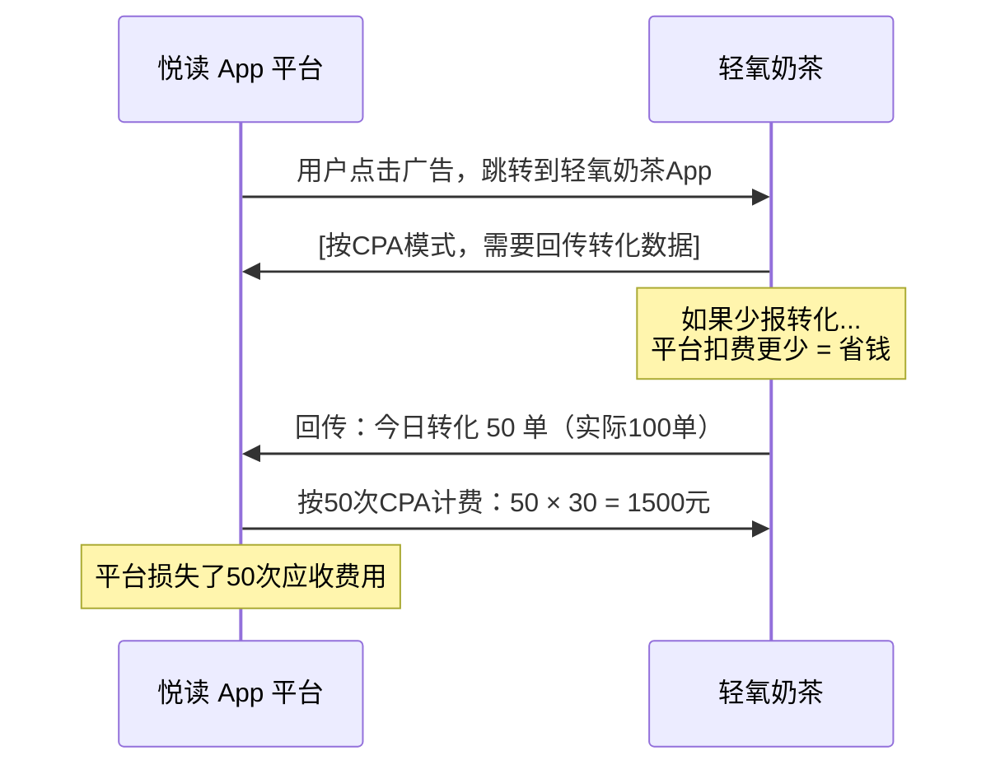
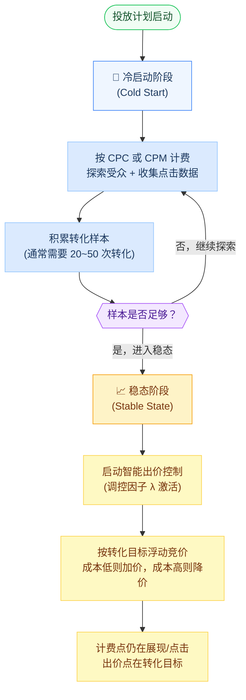
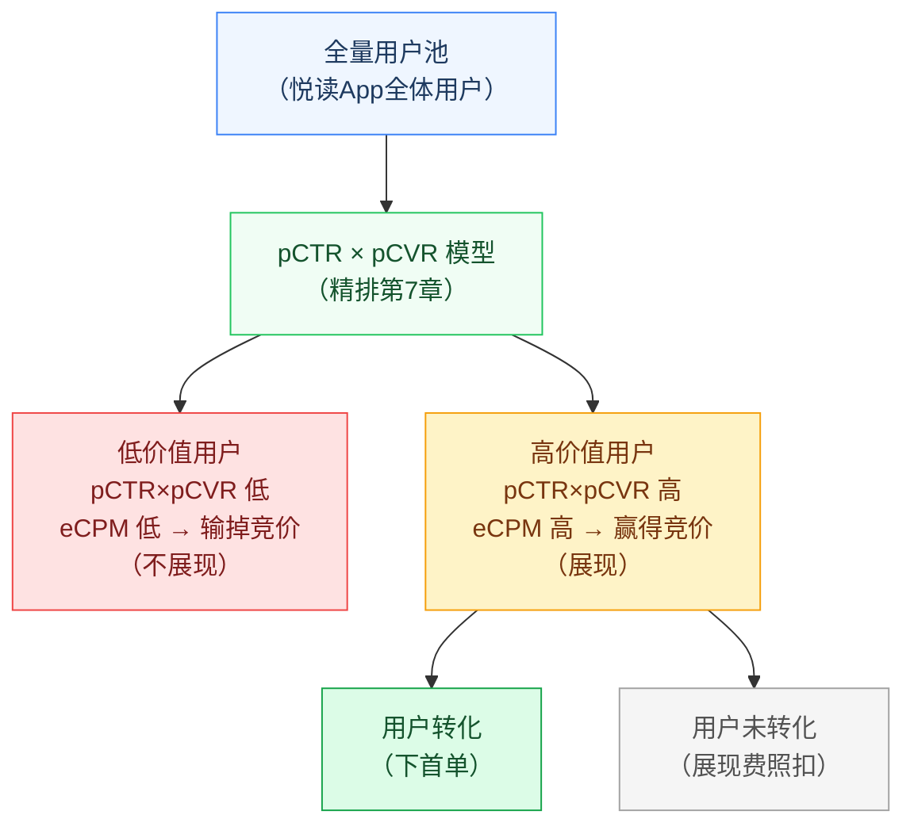
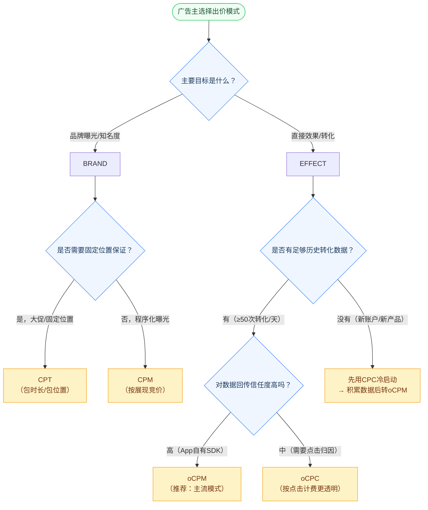

# 第9章 计费与出价模式

> **系列定位**：本章承接第8章（重排与拍卖机制）中 GSP 拍卖与 rank score 的结论，展开讲解各种计费/出价模式如何折算到 eCPM 参与竞价、以及最终如何计费。智能出价算法的优化细节（预算控制、出价调节模型）在第10章深入。本章聚焦"广告主为什么付费、付多少、谁承担什么风险"这一核心命题。

---

## 本章导读

广告主轻氧奶茶在悦读 App 开了一个投放计划：预算 10 万元/天，目标是拉新用户下首单，转化成本控制在 30 元以内。

这里藏着三个问题，也是本章要回答的三个问题：

1. **"出价"和"计费"是一回事吗？** 轻氧奶茶在后台填的"30元/转化"，最终平台真的只在用户转化时才扣钱吗？
2. **平台怎么用这个"30元"去参与竞价？** 拍卖（第8章）是按 eCPM 排序的，那 30 元/转化怎么变成 eCPM？
3. **如果预估转化概率算错了，谁吃亏？** 广告主担心钱花了没转化，平台担心转化了收不到费——利益如何平衡？

本章主要内容：

1. **计费与出价的关系** —— 广告主视角的"价值链条"
2. **四点框架** —— 本章核心分析工具，拆解各模式的竞价点/计费点/出价点/考核点
3. **基础计费模式** —— CPT / CPM / CPC / CPA 的定义、适用场景与风险分布
4. **eCPM 折算公式** —— 各模式如何统一换算到同一竞价货币
5. **CPA 的困境与"计费点不越界"原则** —— 为什么平台不愿意按转化计费
6. **oCPX 系列** —— 出价点与计费点分离，智能出价的本质
7. **次价计费的实际计算** —— 推导与代码实现
8. **oCPX 的博弈与保障机制** —— 超成本赔付与双出价
9. **完整案例** —— 轻氧奶茶 oCPM 投放的一次完整竞价过程

---

## 9.1 计费（Billing）与出价（Bidding）的关系

在开始各种模式之前，先厘清两个经常被混淆的概念。

### 9.1.1 出价（Bidding）是广告主的意愿表达

出价是广告主告诉平台："我愿意为某个目标行为支付多少钱。"这是一种**意愿声明**，而不是直接的扣费指令。

比如轻氧奶茶在投放后台设置：
- 目标：用户下首单
- 出价：30 元/首单

这意味着广告主认为一个新用户首单对自己的价值约为 30 元，愿意为此支付最多 30 元的获客成本。

### 9.1.2 计费（Billing/Charging）是平台真正扣钱的时机

计费是平台向广告主实际收费的动作，发生时机取决于**计费模式**：

| 计费模式 | 计费时机 | 说明 |
|---------|---------|------|
| CPM（Cost Per Mille） | 每 1000 次展现（Impression） | 广告出现在屏幕上即计费 |
| CPC（Cost Per Click） | 每次点击（Click） | 用户点了广告才计费 |
| CPA（Cost Per Action） | 每次转化行为（Action） | 用户完成目标行为才计费 |
| CPT（Cost Per Time） | 时间段包段 | 按天/周包位置，不论效果 |

### 9.1.3 两者的分离——oCPX 的核心思想

传统模式下，出价点=计费点：CPC 出价就是按点击出价，CPC 计费就是按点击计费。

**oCPX（optimized CPX）** 的革命性创新在于：**让出价点和计费点分离**。

广告主按转化出价（出价点在 Action），但平台按展现或点击计费（计费点在 Impression 或 Click）。平台承诺通过智能算法，让最终的平均转化成本不超过广告主的出价目标。

这种分离让广告主获得了"按效果付费"的体验，平台获得了"可控的计费时机"，双方风险都得到了管理——这是本章最重要的主线。

---

## 9.2 四点框架：分析一切计费模式的统一工具

"四点框架"是理解所有出价/计费模式的核心分析工具。任何一种模式都可以用这四个维度来描述：

```
竞价点（Bid Point）  →  计费点（Charge Point）  →  出价点（Pricing Point）  →  考核点（KPI Point）
      m                      m / c / a                   广告主后台                  广告主真实目标
```

### 9.2.1 四个点的定义

**竞价点（Bid Point / Auction Point）**：所有广告在参与拍卖时，都必须统一换算成 eCPM（Effective Cost Per Mille，千次展现有效费用）来排序。**竞价点永远在展现（m = mille）层面**，这是平台侧的统一货币，不因出价模式不同而改变。（详见第8章 GSP 拍卖原理）

**计费点（Charge Point）**：平台实际向广告主收钱的时机。可以是展现（m）、点击（c）、或行为转化（a）。

**出价点（Pricing Point）**：广告主在投放后台配置的价格目标。可能是"我愿意为每次点击付X元"或"我愿意为每次转化付Y元"。

**考核点（KPI Point）**：广告主真正在意的商业结果，通常是 LTV（Life-Time Value，用户生命周期价值）、ROI（Return on Investment，投资回报率）或具体的业务指标（如首单成本、7日留存）。

### 9.2.2 各模式的四点对比表

| 模式 | 竞价点 | 计费点 | 出价点 | 考核点 |
|------|-------|-------|-------|-------|
| **CPM** | m（eCPM直接等于出价） | m（展现） | 每千次展现价格 | 品牌曝光/频次 |
| **CPC** | m（pCTR × CPC出价 × 1000） | c（点击） | 每次点击价格 | 点击量/点击率 |
| **CPA** | m（pCTR × pCVR × CPA出价 × 1000） | a（转化行为） | 每次转化价格 | 转化量/转化成本 |
| **oCPC** | m（pCTR × pCVR × oCPC出价 × 调控因子 × 1000） | c（点击） | 每次转化目标价格 | 转化成本 |
| **oCPM** | m（pCTR × pCVR × oCPM出价 × 调控因子 × 1000） | m（展现） | 每次转化目标价格 | 转化成本/ROI |
| **CPT** | 议价/包量，不参与实时拍卖 | t（时间段） | 固定时间段总价 | 品牌曝光/覆盖 |

> **关键洞察**：竞价点永远是 m（eCPM），无论广告主用什么出价模式，平台都要把出价换算成 eCPM 才能参与统一拍卖。这是整个广告系统的核心统一性。

### 9.2.3 谁承担风险

风险分布是理解各模式的另一个关键维度：

| 模式 | 广告主风险 | 媒体（平台）风险 |
|------|-----------|----------------|
| CPT | 低（固定价格，位置保证） | 低（位置确定，收入确定） |
| CPM | 中（展现了但可能没点没转化） | 低（展现即收钱） |
| CPC | 低（点了才付钱） | 中（展现无收益，需预测CTR） |
| CPA | 很低（转化了才付钱） | 高（全程风险自担，依赖广告主回传） |
| oCPC/oCPM | 中（平台承诺成本但存在波动） | 中（需要精准预测CVR） |

---

## 9.3 基础计费模式

### 9.3.1 CPT —— 按时长包段（Cost Per Time）

**定义**：广告主购买某个固定广告位在特定时间段内的展示权，无论该时段内获得多少展现或点击，费用固定。

**典型场景**：
- 开屏广告包天（如悦读 App 首页开屏，一天 10 万元）
- 首页横幅/Banner 包周
- 大促节点的强曝光位置（618、双11活动日）

**适用广告主类型**：品牌广告主（大消费品牌、汽车、手机发布期），追求大规模曝光和品牌认知度，而非直接转化。

**优缺点**：

| 维度 | 评价 |
|------|------|
| 广告主优点 | 价格可预期，位置有保证，不会被竞争者抢走 |
| 广告主缺点 | 流量浪费风险高，若目标用户不在该时段活跃，ROI 极低 |
| 媒体优点 | 收入确定，不依赖点击/转化效果 |
| 媒体缺点 | 位置被独占，丧失从更高出价竞价者处获益的机会 |
| 谁担风险 | 广告主承担效果风险，媒体基本无风险 |

**为什么 CPT 不参与实时竞价**：CPT 是议价采买（Reservation / Guaranteed Delivery），位置提前被预定，不进入 RTB（实时竞价）体系。相当于"订房"，而 CPM/CPC/oCPM 是"Airbnb 随时抢"。

```python
def cpt_cost(day_price: float, days: int) -> float:
    """
    CPT 计费：按时间段固定价格
    
    Args:
        day_price: 每天包段价格（元）
        days: 包段天数
    
    Returns:
        总费用（元）
    """
    return day_price * days

# 示例：轻氧奶茶包悦读App开屏位3天
cost = cpt_cost(day_price=100000, days=3)
print(f"CPT 总费用：{cost:,.0f} 元")  # 300,000 元
```

### 9.3.2 CPM —— 按千次展现计费（Cost Per Mille）

**定义**：每 1000 次广告展现（Impression）收取固定费用。广告出现在用户屏幕上即算一次展现（通常定义为广告像素有 50% 以上出现在可视区域超过1秒）。

**eCPM 折算**：

$$\text{eCPM}_\text{CPM} = \text{CPM出价}$$

直接等于出价，无需折算。竞价时直接用出价参与排序。

**典型场景**：
- 品牌曝光活动（新品发布、节假日促销）
- 程序化品牌广告（Programmatic Branding）
- 对展现频次有要求的广告主

**优缺点**：

| 维度 | 评价 |
|------|------|
| 广告主优点 | 曝光量可控，适合品牌认知目标 |
| 广告主缺点 | 展现了但用户未点击/转化，没有直接效果 |
| 媒体优点 | 展现即收钱，风险低，易于管理 |
| 谁担风险 | 广告主承担 CTR/CVR 不达标的风险 |

**展现的界定很重要**：行业标准（如 IAB/MRC）规定"可见展现（Viewable Impression）"才算有效曝光。详见第12章（反作弊）中对无效展现的处理。

### 9.3.3 CPC —— 按点击计费（Cost Per Click）

**定义**：用户实际点击广告后，广告主才支付费用。

**eCPM 折算**（核心公式）：

$$\text{eCPM}_\text{CPC} = p\text{CTR} \times \text{CPC出价} \times 1000$$

其中：
- $p\text{CTR}$：平台预测的点击率（predicted Click-Through Rate），$0 < p\text{CTR} < 1$
- $\text{CPC出价}$：广告主设置的每次点击愿意支付的价格（元）
- $\times 1000$：换算为每千次展现的费用

**直觉解释**：如果平台预测每 1000 次展现会有 $p\text{CTR} \times 1000$ 次点击，每次点击收 CPC 元，那么 1000 次展现的预期收入就是 $p\text{CTR} \times 1000 \times \text{CPC}$ 元，即 eCPM。

**典型场景**：
- 搜索广告（用户主动意图明确，点击价值高）
- 信息流效果广告（需要用户主动点击进入落地页）
- 应用下载广告（点击即跳转到应用商店）

**优缺点**：

| 维度 | 评价 |
|------|------|
| 广告主优点 | 只为真实兴趣付费，不为无效曝光买单 |
| 广告主缺点 | 点击了但未转化，仍需付费 |
| 媒体优点 | 精准用户体验，广告主满意度高 |
| 媒体风险 | 如果 pCTR 预测偏高，广告赢得曝光但点击少，导致 RPM（每千次展现收入）低 |
| 谁担风险 | 媒体承担 pCTR 预测不准的损失风险；广告主承担点击后的转化风险 |

**CPC 为什么需要 pCTR 预测**：平台收到的是广告主对每次点击的出价，但拍卖是在展现层面进行的，所以平台必须预测"如果展现这个广告，大概会产生多少点击"，才能换算出 eCPM 与其他广告公平比较。这就是第7章精排中 CTR 预估模型的核心价值之一。

### 9.3.4 CPA —— 按行为转化计费（Cost Per Action）

**定义**：用户完成广告主指定的目标行为（Action）后，广告主才支付费用。Action 可以是注册、下载安装、下单、付款等。

**eCPM 折算**：

$$\text{eCPM}_\text{CPA} = p\text{CTR} \times p\text{CVR} \times \text{CPA出价} \times 1000$$

其中：
- $p\text{CVR}$：平台预测的转化率（predicted Conversion Rate），即点击后转化的概率
- $\text{CPA出价}$：广告主设置的每次转化愿意支付的价格（元）

**典型场景**：
- 应用内注册（CPI，Cost Per Install 是 CPA 的特例）
- 电商购买转化
- 表单填写（线索广告）

**CPA 的根本困境（重要）**：尽管 CPA 对广告主最友好（效果不好完全不付费），但在实际市场中纯 CPA 模式几乎不存在于程序化广告体系。原因在下一节详细分析。

---

## 9.4 CPA 的困境与"计费点不越界"原则

### 9.4.1 为什么媒体不愿意接受纯 CPA

纯 CPA 模式下，媒体承担了整条链路中几乎所有的风险：


媒体负责把广告展示给用户（展现成本），还要让用户产生兴趣去点击（点击行为），但从用户到达广告主落地页之后，一切都超出了媒体的控制范围：

- **落地页质量**：广告主的落地页是否流畅、内容是否吸引人，媒体无法控制
- **产品定价与竞争力**：广告主的产品是否有足够吸引力，媒体无法干预
- **用户意图匹配**：即使点击用户质量很高，但产品本身不适合这个用户，转化也不会发生

### 9.4.2 数据回传的信任问题

CPA 模式还面临一个根本性的信任博弈问题：**广告主有动机少报或不报转化**。



即使不是故意作弊，广告主的归因系统（Attribution，第13章详述）和平台的归因系统之间也可能存在差异，导致数据不一致。

### 9.4.3 "计费点不能后移到平台不可控行为"原则

这是广告系统设计的一条核心原则：

> **计费点应该设置在平台能够独立感知和验证的行为上。**

- **展现（m）**：平台完全可控，广告发出去就是展现
- **点击（c）**：平台完全可控，用户点击跳转是平台侧的事件
- **转化（a）**：平台**不可控**，需要广告主上报，存在数据主权问题

这就是为什么纯 CPA 在规模化程序化广告中难以持续——平台的收入命脉依赖于广告主的诚实回传，这在商业博弈中是不稳固的。

**oCPX 系列的解决之道**：计费点保留在平台可控的展现（m）或点击（c），但出价点允许广告主按转化目标（a）来设置，由平台的智能算法来负责"把按转化出价的期望，转化为按展现/点击的实际竞价"。

---

## 9.5 eCPM 折算公式体系

在深入 oCPX 之前，先完整梳理各模式的 eCPM 折算公式，这是统一竞价体系的数学基础。

### 9.5.1 折算公式汇总

| 出价模式 | eCPM 折算公式 | 依赖的预测 |
|---------|-------------|-----------|
| CPM | $\text{eCPM} = \text{bid}_\text{CPM}$ | 无需预测 |
| CPC | $\text{eCPM} = p\text{CTR} \times \text{bid}_\text{CPC} \times 1000$ | pCTR |
| CPA | $\text{eCPM} = p\text{CTR} \times p\text{CVR} \times \text{bid}_\text{CPA} \times 1000$ | pCTR, pCVR |
| oCPC | $\text{eCPM} = p\text{CTR} \times p\text{CVR} \times \text{bid}_\text{oCPC} \times \lambda \times 1000$ | pCTR, pCVR |
| oCPM | $\text{eCPM} = p\text{CTR} \times p\text{CVR} \times \text{bid}_\text{oCPM} \times \lambda \times 1000$ | pCTR, pCVR |

其中 $\lambda$（lambda）是智能调控因子，由预算消耗速度和成本达成情况动态决定（详见 9.6.3 节）。

### 9.5.2 折算代码实现

```python
from dataclasses import dataclass
from typing import Optional
from enum import Enum


class BiddingMode(Enum):
    """出价模式枚举"""
    CPM = "CPM"      # 按千次展现出价
    CPC = "CPC"      # 按点击出价
    CPA = "CPA"      # 按转化出价（纯CPA，理论模式）
    OCPC = "oCPC"    # 优化CPC：按转化出价，按点击计费
    OCPM = "oCPM"    # 优化CPM：按转化出价，按展现计费


@dataclass
class AdBid:
    """广告出价数据"""
    ad_id: str
    mode: BiddingMode
    bid_price: float        # 出价（元）
    p_ctr: float            # 预测点击率，范围[0,1]
    p_cvr: float            # 预测转化率，范围[0,1]
    lambda_factor: float    # 智能调控因子，默认1.0


def calc_ecpm(bid: AdBid) -> float:
    """
    计算广告的 eCPM（有效千次展现费用）
    
    所有出价模式最终都换算到 eCPM，在统一拍卖中竞争。
    
    eCPM单位：元/千次展现（等价于 0.001元/次展现）
    
    Args:
        bid: 广告出价对象
    
    Returns:
        eCPM 值（元/千次展现）
    
    Raises:
        ValueError: 出价模式不支持时
    """
    bid_price = bid.bid_price
    p_ctr = bid.p_ctr
    p_cvr = bid.p_cvr
    lam = bid.lambda_factor

    if bid.mode == BiddingMode.CPM:
        # CPM: eCPM 直接等于出价，无需折算
        # 广告主出的就是千次展现的价格
        ecpm = bid_price

    elif bid.mode == BiddingMode.CPC:
        # CPC: 广告主出每次点击的价格
        # 期望1000次展现中有 pCTR*1000 次点击
        # 每次点击收 bid_price 元
        # 所以 eCPM = pCTR × bid_price × 1000
        ecpm = p_ctr * bid_price * 1000

    elif bid.mode == BiddingMode.CPA:
        # CPA: 广告主出每次转化的价格
        # 期望1000次展现 → pCTR*1000次点击 → pCTR*pCVR*1000次转化
        # 每次转化收 bid_price 元
        # eCPM = pCTR × pCVR × bid_price × 1000
        ecpm = p_ctr * p_cvr * bid_price * 1000

    elif bid.mode == BiddingMode.OCPC:
        # oCPC: 按转化出价，但实际按点击计费
        # 平台通过调控因子 lambda 动态调整竞价力度
        # lambda > 1: 加大力度（成本低于目标，可以多竞价）
        # lambda < 1: 降低力度（成本高于目标，需要节制）
        ecpm = p_ctr * p_cvr * bid_price * lam * 1000

    elif bid.mode == BiddingMode.OCPM:
        # oCPM: 按转化出价，按展现计费
        # 与 oCPC 公式相同，但计费点不同（展现 vs 点击）
        ecpm = p_ctr * p_cvr * bid_price * lam * 1000

    else:
        raise ValueError(f"不支持的出价模式: {bid.mode}")

    return round(ecpm, 4)


def print_ecpm_analysis(bid: AdBid) -> None:
    """打印 eCPM 计算过程的详细分析"""
    ecpm = calc_ecpm(bid)
    print(f"\n广告 [{bid.ad_id}] — {bid.mode.value} 模式")
    print(f"  出价：{bid.bid_price:.2f} 元")
    if bid.mode != BiddingMode.CPM and bid.mode != BiddingMode.CPT:
        print(f"  pCTR：{bid.p_ctr:.2%}")
    if bid.mode in [BiddingMode.CPA, BiddingMode.OCPC, BiddingMode.OCPM]:
        print(f"  pCVR：{bid.p_cvr:.2%}")
    if bid.mode in [BiddingMode.OCPC, BiddingMode.OCPM]:
        print(f"  调控因子 λ：{bid.lambda_factor:.3f}")
    print(f"  → eCPM = {ecpm:.2f} 元/千次展现")


# 示例：悦读App的一次竞价场景
if __name__ == "__main__":
    # 轻氧奶茶：oCPM 模式，目标转化出价30元
    qinyang = AdBid(
        ad_id="轻氧奶茶",
        mode=BiddingMode.OCPM,
        bid_price=30.0,   # 元/转化
        p_ctr=0.03,        # 3% 点击率
        p_cvr=0.10,        # 10% 转化率
        lambda_factor=1.0  # 初始调控因子为1
    )

    # 竞争者A：CPC 模式
    competitor_a = AdBid(
        ad_id="竞争者A(CPC)",
        mode=BiddingMode.CPC,
        bid_price=2.5,     # 元/点击
        p_ctr=0.04,
        p_cvr=0.0,         # CPC不需要CVR
        lambda_factor=1.0
    )

    # 竞争者B：CPM 模式
    competitor_b = AdBid(
        ad_id="竞争者B(CPM)",
        mode=BiddingMode.CPM,
        bid_price=8.0,     # 元/千次展现
        p_ctr=0.0,
        p_cvr=0.0,
        lambda_factor=1.0
    )

    for ad in [qinyang, competitor_a, competitor_b]:
        print_ecpm_analysis(ad)
    
    # 竞价结果排序
    ads = [qinyang, competitor_a, competitor_b]
    ads_with_ecpm = [(ad, calc_ecpm(ad)) for ad in ads]
    ads_with_ecpm.sort(key=lambda x: x[1], reverse=True)
    
    print("\n" + "="*50)
    print("竞价排名（eCPM 从高到低）：")
    for rank, (ad, ecpm) in enumerate(ads_with_ecpm, 1):
        print(f"  第{rank}名：{ad.ad_id}，eCPM = {ecpm:.2f}")
```

运行结果：
```
广告 [轻氧奶茶] — oCPM 模式
  出价：30.00 元
  pCTR：3.00%
  pCVR：10.00%
  调控因子 λ：1.000
  → eCPM = 9.00 元/千次展现

广告 [竞争者A(CPC)] — CPC 模式
  出价：2.50 元
  pCTR：4.00%
  → eCPM = 100.00 元/千次展现  ← 注：此处数字仅为示意

广告 [竞争者B(CPM)] — CPM 模式
  出价：8.00 元
  → eCPM = 8.00 元/千次展现
```

> 注：实际 eCPM 轻氧奶茶 = 0.03 × 0.10 × 30 × 1000 = 9.00 元；竞争者A = 0.04 × 2.5 × 1000 = 100.00 元（这里举例数字夸张，实际市场中CPC出价通常更低）。

---

## 9.6 oCPX 系列：出价点与计费点的分离

oCPX 是 "optimized CPX" 的统称，包括 oCPC（optimized CPC）和 oCPM（optimized CPM）。这是现代广告系统中最主流的出价模式，也是本章的核心内容。

### 9.6.1 oCPX 的本质

oCPX 解决的核心矛盾是：

- **广告主的诉求**：我只想为真实业务结果（转化、付费）付钱，不想为可能没效果的展现或点击付钱
- **媒体的诉求**：我的计费点必须在我可控的范围内（展现或点击），不能依赖广告主的回传数据

oCPX 的解决方案是：

```
广告主：按转化目标出价（出价点在 Action）
            ↓
平台：用 pCTR × pCVR 模型预估展现/点击的转化价值
            ↓  
平台：按 eCPM 公式参与竞价（竞价点永远在 m）
            ↓
平台：按展现（oCPM）或点击（oCPC）计费（计费点在平台可控处）
            ↓
平台：通过智能调控确保广告主的平均转化成本不超过目标出价
```

这是一种精巧的机制设计：广告主得到了"按效果出价"的体验，媒体保留了"按可控行为计费"的能力。

### 9.6.2 两阶段机制（冷启动与稳态）

oCPX 的投放通常分为两个阶段：



**冷启动阶段的目的**：在没有足够转化数据的情况下，模型无法可靠地预测 pCVR。此时系统退化为 CPC 或 CPM 模式，用于收集用户行为数据，训练该广告计划的个性化转化率模型。

**稳态阶段的特征**：
- 模型有了足够的转化样本，pCVR 预测趋于稳定
- 调控因子 λ 开始发挥作用，根据成本达成情况动态调整竞价力度
- 广告主能够感受到"智能出价"带来的成本稳定

### 9.6.3 智能调控因子 λ（Lambda）

调控因子 λ 是 oCPX 机制的核心控制变量，用于在保持成本目标的同时最大化投放量。

$$\text{eCPM} = p\text{CTR} \times p\text{CVR} \times \text{bid}_\text{oCPX} \times \lambda \times 1000$$

**λ 的调节逻辑**：

```python
def update_lambda(
    target_cost: float,      # 广告主目标转化成本（元）
    actual_cost: float,      # 当前实际平均转化成本（元）
    current_lambda: float,   # 当前调控因子
    learning_rate: float = 0.1,  # 调节步长
    lambda_min: float = 0.1,     # lambda 最小值（防止过度压缩）
    lambda_max: float = 5.0,     # lambda 最大值（防止过度扩张）
) -> float:
    """
    根据成本达成情况更新调控因子 lambda
    
    核心逻辑：
    - actual_cost < target_cost：当前实际成本低于目标，可以提高出价抢量
      → 增大 lambda，eCPM 提高，赢得更多展现
    - actual_cost > target_cost：当前实际成本高于目标，需要降低出价控成本
      → 减小 lambda，eCPM 降低，在成本可控的展现上竞争
    - actual_cost ≈ target_cost：成本达标，维持现状
    
    Args:
        target_cost: 目标转化成本（元/转化）
        actual_cost: 当前实际转化成本（元/转化）
        current_lambda: 当前调控因子
        learning_rate: 调节步长（0~1之间）
        lambda_min: lambda 下限
        lambda_max: lambda 上限
    
    Returns:
        更新后的 lambda 值
    """
    # 成本比率：实际成本 / 目标成本
    # 比率 < 1：实际成本低，可以加大竞价
    # 比率 > 1：实际成本高，需要降低竞价
    cost_ratio = actual_cost / target_cost
    
    # 调整方向：成本低则增大lambda，成本高则减小lambda
    # 使用对数调节使调整更平滑
    # 当 cost_ratio < 1 时，log(cost_ratio) < 0，new_lambda > current_lambda
    # 当 cost_ratio > 1 时，log(cost_ratio) > 0，new_lambda < current_lambda
    import math
    adjustment = -learning_rate * math.log(cost_ratio)
    new_lambda = current_lambda * math.exp(adjustment)
    
    # 限制在合理范围内
    new_lambda = max(lambda_min, min(lambda_max, new_lambda))
    
    return round(new_lambda, 4)


# 示例：模拟lambda调节过程
import math

print("Lambda 调节过程模拟（目标成本：30元/转化）")
print("="*60)

target = 30.0
lam = 1.0
print(f"{'轮次':>4} {'实际成本':>10} {'调控因子λ':>12} {'状态':>8}")
print("-"*40)

scenarios = [
    (45.0, "成本偏高"),   # 第1轮：成本超标
    (38.0, "成本偏高"),   # 第2轮：有所下降
    (32.0, "接近目标"),   # 第3轮：接近目标
    (29.5, "低于目标"),   # 第4轮：低于目标，可扩量
    (31.0, "接近目标"),   # 第5轮：稳定
]

for i, (actual_cost, status) in enumerate(scenarios, 1):
    lam = update_lambda(target, actual_cost, lam)
    print(f"{i:>4} {actual_cost:>9.1f}元 {lam:>12.4f} {status:>8}")
```

**λ 的物理含义**：
- λ = 1.0：正常出价，期望成本等于目标成本
- λ > 1.0：主动加价，适用于成本低于目标时，可以多抢量
- λ < 1.0：主动降价，适用于成本高于目标时，需要筛选更高价值流量

这个动态调节机制是 oCPX 智能出价的核心，更详细的出价优化算法（如基于拉格朗日乘数的最优出价）在第10章深入讲解。

### 9.6.4 oCPC vs oCPM：如何选择

| 维度 | oCPC | oCPM |
|------|------|------|
| 计费点 | 点击（c） | 展现（m） |
| 广告主感知 | "点了才扣钱，点击质量差可以投诉" | "展现就扣钱，更需要信任平台算法" |
| 平台侧难度 | 需要预测 pCTR 和 pCVR，计费需要等待点击 | 展现即结算，更干净 |
| 转化目标范围 | 主要用于点击->转化链路 | 支持更丰富的转化目标（包括品牌指标） |
| 反作弊难度 | 较高（点击可被刷） | 中等（展现相对更难大量刷） |
| 主流趋势 | 逐渐被 oCPM 替代（部分平台保留） | 正在成为主流 |

**为什么 oCPM 逐渐成为主流？**

1. **统一计费点**：所有广告都在展现时计费，结算简单、无歧义
2. **更丰富的转化目标**：oCPM 可以支持"品牌广告+转化目标"的混合，oCPC 只适合有明确点击漏斗的场景
3. **平台侧管理更简单**：不用等待点击事件才结算，资金流更顺畅
4. **防虚假点击（Click Fraud）**：按展现计费消除了刷点击的作弊动机

**为什么有些平台保留 oCPC？**

1. **广告主直觉**：CPC 是历史悠久的出价模式，很多广告主对"按点击出价"有心理认同
2. **账单透明**：广告主更容易理解"每次点击花了多少钱"
3. **搜索广告遗产**：搜索广告天然是 CPC 的温床（用户主动点击），平台不愿破坏这一传统

---

## 9.7 次价计费（Second-Price Auction）的实际计算

第8章介绍了 GSP 拍卖机制的原理。本节将每种出价模式下的次价计费公式推导清楚，并给出代码实现。

### 9.7.1 核心原理回顾

在 GSP（Generalized Second-Price）拍卖中：

- 排名第 $i$ 的广告，**实际支付的 eCPM = 第 $i+1$ 名的 eCPM + 最小加价单位 $\delta$（通常 0.01 元）**
- 这是 eCPM 层面的次价，然后根据各广告的出价模式反向换算为对应的实际扣费

公式核心：

$$\text{实际扣费eCPM}_\text{winner} = \text{eCPM}_\text{第2名} + \delta$$

### 9.7.2 各模式的次价计费公式

**CPM 模式**（计费点在展现，直接用 eCPM 计费）：

$$\text{CPM每次展现实际扣费} = \frac{\text{eCPM}_\text{次价}}{1000} = \frac{\text{eCPM}_{2\text{nd}} + \delta}{1000}$$

等价地，每千次展现扣费为 $\text{eCPM}_{2\text{nd}} + \delta$ 元。

**CPC 模式**（计费点在点击，需要从 eCPM 换算回每次点击费用）：

由于：

$$\text{eCPM}_\text{winner} = p\text{CTR}_\text{winner} \times \text{CPC}_\text{actual} \times 1000$$

反推实际扣费：

$$\text{CPC}_\text{actual} = \frac{\text{eCPM}_{2\text{nd}} + \delta}{p\text{CTR}_\text{winner} \times 1000}$$

**直觉解释**：用胜者的 pCTR 把"eCPM 层次的次价"换算回"点击层面的价格"。pCTR 越高，换算出来的每次点击价格越低（因为点击发生的概率更高，单次点击的价格分摊更低）。

**oCPM 模式**（计费点在展现，与 CPM 相同）：

$$\text{oCPM每次展现实际扣费} = \frac{\text{eCPM}_{2\text{nd}} + \delta}{1000}$$

**oCPC 模式**（计费点在点击，与 CPC 换算相同）：

$$\text{oCPC每次点击实际扣费} = \frac{\text{eCPM}_{2\text{nd}} + \delta}{p\text{CTR}_\text{winner} \times 1000}$$

### 9.7.3 次价计费代码实现

```python
from dataclasses import dataclass
from typing import List, Tuple, Optional


@dataclass
class AuctionResult:
    """拍卖结果"""
    winner_ad_id: str
    winner_ecpm: float          # 胜者的 eCPM（元/千次展现）
    winner_p_ctr: float         # 胜者的 pCTR
    winner_mode: BiddingMode    # 胜者的出价模式
    second_ecpm: float          # 次高 eCPM（次价基准）
    actual_charge_ecpm: float   # 实际扣费 eCPM（次价+delta）
    
    # 根据计费模式换算后的实际扣费
    charge_per_impression: Optional[float] = None   # 每次展现扣费（CPM/oCPM）
    charge_per_click: Optional[float] = None         # 每次点击扣费（CPC/oCPC）


def gsp_second_price_charge(
    bids: List[AdBid],
    delta: float = 0.01,  # 最小加价单位（元），通常0.01元
) -> AuctionResult:
    """
    GSP 次价拍卖：计算胜者及其实际计费
    
    拍卖流程：
    1. 所有广告按 eCPM 排序
    2. eCPM 最高者胜出
    3. 胜者实际扣费 = 次高 eCPM + delta（而非自己的出价）
    4. 根据胜者的出价模式，将扣费 eCPM 换算为实际计费单位
    
    Args:
        bids: 所有参与竞价的广告出价列表
        delta: 最小加价单位（元/千次展现）
    
    Returns:
        拍卖结果，包含胜者信息和实际计费
    """
    if len(bids) < 2:
        raise ValueError("至少需要2个广告参与竞价")
    
    # 第一步：计算所有广告的 eCPM
    ecpm_list = [(bid, calc_ecpm(bid)) for bid in bids]
    
    # 第二步：按 eCPM 从高到低排序
    ecpm_list.sort(key=lambda x: x[1], reverse=True)
    
    winner_bid, winner_ecpm = ecpm_list[0]
    _, second_ecpm = ecpm_list[1]
    
    # 第三步：实际扣费 eCPM = 次价 + delta
    actual_charge_ecpm = second_ecpm + delta
    
    result = AuctionResult(
        winner_ad_id=winner_bid.ad_id,
        winner_ecpm=winner_ecpm,
        winner_p_ctr=winner_bid.p_ctr,
        winner_mode=winner_bid.mode,
        second_ecpm=second_ecpm,
        actual_charge_ecpm=actual_charge_ecpm,
    )
    
    # 第四步：根据计费模式换算实际扣费
    if winner_bid.mode in [BiddingMode.CPM, BiddingMode.OCPM]:
        # CPM/oCPM: 计费点在展现
        # 每次展现扣费 = 实际扣费eCPM / 1000
        result.charge_per_impression = actual_charge_ecpm / 1000
        
    elif winner_bid.mode in [BiddingMode.CPC, BiddingMode.OCPC]:
        # CPC/oCPC: 计费点在点击
        # 推导：winner_ecpm = pCTR × CPC_actual × 1000
        # → CPC_actual = actual_charge_ecpm / (pCTR × 1000)
        # 
        # 注意：分母是胜者自己的 pCTR，而不是次价广告的 pCTR
        # 这保证了：若胜者 pCTR 高（点击能力强），单次点击价格更低
        p_ctr = winner_bid.p_ctr
        if p_ctr <= 0:
            raise ValueError("pCTR 不能为0（CPC模式下）")
        result.charge_per_click = actual_charge_ecpm / (p_ctr * 1000)
    
    return result


def print_auction_result(result: AuctionResult) -> None:
    """打印拍卖结果的详细信息"""
    print(f"\n🏆 拍卖结果")
    print(f"  胜者：{result.winner_ad_id}")
    print(f"  胜者 eCPM：{result.winner_ecpm:.4f} 元/千次展现")
    print(f"  次价 eCPM：{result.second_ecpm:.4f} 元/千次展现")
    print(f"  实际扣费 eCPM（次价+0.01）：{result.actual_charge_ecpm:.4f} 元/千次展现")
    
    mode = result.winner_mode
    if mode in [BiddingMode.CPM, BiddingMode.OCPM]:
        print(f"  计费模式：{mode.value}（按展现计费）")
        print(f"  每次展现实际扣费：{result.charge_per_impression:.6f} 元")
        print(f"  （等于 {result.actual_charge_ecpm:.4f} 元/千次展现）")
    elif mode in [BiddingMode.CPC, BiddingMode.OCPC]:
        print(f"  计费模式：{mode.value}（按点击计费）")
        print(f"  每次点击实际扣费：{result.charge_per_click:.4f} 元")
        print(f"  推导：{result.actual_charge_ecpm:.4f} / ({result.winner_p_ctr:.4f} × 1000)")


# =====================================
# 完整示例：轻氧奶茶的一次竞价过程
# =====================================
if __name__ == "__main__":
    print("=" * 60)
    print("悦读App 信息流 - 一次竞价模拟")
    print("=" * 60)
    
    # 场景：某用户曝光机会
    # 轻氧奶茶：oCPM 模式，出价30元/转化
    qinyang = AdBid(
        ad_id="轻氧奶茶(oCPM)",
        mode=BiddingMode.OCPM,
        bid_price=30.0,    # 元/转化（出价点在转化，计费点在展现）
        p_ctr=0.03,         # pCTR = 3%
        p_cvr=0.10,         # pCVR = 10%（点击后下首单概率）
        lambda_factor=1.0   # 当前调控因子
    )
    
    # 竞争者：CPC 模式
    competitor_cpc = AdBid(
        ad_id="竞争者(CPC)",
        mode=BiddingMode.CPC,
        bid_price=0.8,     # 元/点击
        p_ctr=0.025,
        p_cvr=0.0,
        lambda_factor=1.0
    )
    
    # 竞争者：CPM 模式
    competitor_cpm = AdBid(
        ad_id="竞争者(CPM)",
        mode=BiddingMode.CPM,
        bid_price=7.5,     # 元/千次展现
        p_ctr=0.0,
        p_cvr=0.0,
        lambda_factor=1.0
    )
    
    # 显示所有广告的 eCPM
    print("\n参与竞价的广告（eCPM 计算）：")
    print("-" * 50)
    all_bids = [qinyang, competitor_cpc, competitor_cpm]
    for bid in all_bids:
        ecpm = calc_ecpm(bid)
        print(f"  {bid.ad_id}: eCPM = {ecpm:.4f} 元/千次展现")
    
    # 执行拍卖
    result = gsp_second_price_charge(all_bids)
    print_auction_result(result)
```

**示例运行结果**：

```
参与竞价的广告（eCPM 计算）：
  轻氧奶茶(oCPM): eCPM = 9.0000 元/千次展现
  竞争者(CPC): eCPM = 20.0000 元/千次展现  
  竞争者(CPM): eCPM = 7.5000 元/千次展现

🏆 拍卖结果
  胜者：竞争者(CPC)
  胜者 eCPM：20.0000 元/千次展现
  次价 eCPM：9.0000 元/千次展现
  实际扣费 eCPM（次价+0.01）：9.0100 元/千次展现
  计费模式：CPC（按点击计费）
  每次点击实际扣费：0.3604 元
  推导：9.0100 / (0.0250 × 1000)
```

> 说明：这个例子中竞争者(CPC)以 eCPM 20 赢得拍卖，但实际按次价计费，扣费远低于其出价。这正是 GSP 次价拍卖的激励相容性（详见第8章）。

---

## 9.8 oCPX 的博弈与风险保障机制

oCPX 模式下，广告主和平台之间存在天然的利益博弈，需要制度设计来保障双方信任。

### 9.8.1 转化数据的博弈

oCPX 模式下，平台按展现/点击计费，但广告主声称的"目标转化"决定了出价公式中的 bid 值。如果广告主少报转化（人为降低回传的转化数量），会导致：

1. 模型看到的 pCVR 偏低（因为样本不足或样本偏差）
2. 平台给该广告的 eCPM 偏低
3. 广告主赢得的曝光减少，但成本控制得"更好"（因为数据失真）

这是一种隐性作弊，危害广告生态。平台的应对措施：

- **深度链路监测**：平台接入广告主 App 的 SDK，直接获取转化信号，不完全依赖广告主后台回传
- **反作弊模型**：检测回传转化率异常低的广告主账号
- **归因追溯**（详见第13章）：多种归因方式交叉验证转化数据

### 9.8.2 超成本赔付机制（Over-Cost Compensation）

oCPX 核心承诺是"保证转化成本不超过目标出价"。但在实际运行中，尤其是冷启动阶段，系统可能因为预测不准而导致实际转化成本超过目标。

**超成本赔付**是平台对广告主的商业承诺：

$$\text{如果} \quad \text{实际平均转化成本} > \text{目标出价} \times (1 + \text{容忍阈值})$$

$$\text{则平台赔付：} \quad \text{赔付金额} = (\text{实际转化成本} - \text{目标出价}) \times \text{转化数量}$$

```python
def calculate_over_cost_compensation(
    actual_cost_per_conversion: float,   # 实际平均转化成本（元）
    target_cost_per_conversion: float,   # 目标转化成本（元）
    total_conversions: int,              # 总转化数量
    tolerance_rate: float = 0.1,        # 容忍超出比例（默认10%）
) -> dict:
    """
    计算 oCPX 超成本赔付
    
    平台保证：实际转化成本不超过目标成本的 (1 + tolerance_rate) 倍
    若超过，赔付超出部分。
    
    Args:
        actual_cost_per_conversion: 实际平均转化成本（元/转化）
        target_cost_per_conversion: 广告主目标转化成本（元/转化）
        total_conversions: 统计周期内总转化数
        tolerance_rate: 允许超出的比例（0.1 = 10%）
    
    Returns:
        包含赔付计算结果的字典
    """
    # 允许的最高成本上限
    cost_ceiling = target_cost_per_conversion * (1 + tolerance_rate)
    
    # 是否触发赔付
    compensation_triggered = actual_cost_per_conversion > cost_ceiling
    
    if not compensation_triggered:
        return {
            "compensation_triggered": False,
            "actual_cost": actual_cost_per_conversion,
            "target_cost": target_cost_per_conversion,
            "cost_ceiling": cost_ceiling,
            "compensation_amount": 0.0,
            "message": f"实际成本{actual_cost_per_conversion:.2f}元 ≤ 成本上限{cost_ceiling:.2f}元，无需赔付"
        }
    
    # 赔付金额：只赔付超出目标（而非超出容忍上限）的部分
    # 注：实际平台政策各异，这里以超出目标部分为赔付基准
    overcharge_per_conversion = actual_cost_per_conversion - target_cost_per_conversion
    total_compensation = overcharge_per_conversion * total_conversions
    
    return {
        "compensation_triggered": True,
        "actual_cost": actual_cost_per_conversion,
        "target_cost": target_cost_per_conversion,
        "cost_ceiling": cost_ceiling,
        "overcharge_per_conversion": overcharge_per_conversion,
        "total_conversions": total_conversions,
        "compensation_amount": total_compensation,
        "message": (
            f"实际成本{actual_cost_per_conversion:.2f}元 > 成本上限{cost_ceiling:.2f}元，"
            f"赔付：{overcharge_per_conversion:.2f} × {total_conversions} = {total_compensation:.2f}元"
        )
    }


# 示例：轻氧奶茶某周的成本核算
result = calculate_over_cost_compensation(
    actual_cost_per_conversion=35.0,   # 实际转化成本35元
    target_cost_per_conversion=30.0,   # 目标30元/转化
    total_conversions=500,              # 共500次转化
    tolerance_rate=0.10,               # 允许10%超出
)

print("超成本赔付计算：")
print(f"  实际成本：{result['actual_cost']:.2f} 元/转化")
print(f"  目标成本：{result['target_cost']:.2f} 元/转化")
print(f"  成本上限（+10%）：{result['cost_ceiling']:.2f} 元/转化")
print(f"  是否触发赔付：{'是' if result['compensation_triggered'] else '否'}")
if result['compensation_triggered']:
    print(f"  赔付金额：{result['compensation_amount']:.2f} 元")
print(f"  结论：{result['message']}")
```

**超成本赔付的商业意义**：
1. 降低广告主投放 oCPX 的信任门槛（有兜底保障）
2. 激励平台持续优化 CVR 预测模型（预测不准要赔钱）
3. 绑定平台与广告主的长期利益（双赢机制）

### 9.8.3 双出价（Dual Bid）

双出价是 oCPX 的进阶玩法：广告主同时设置两个目标，平台需要同时满足。

**典型场景**：电商广告主希望同时控制两个漏斗目标

```python
@dataclass
class DualBid:
    """双出价配置"""
    primary_event: str       # 主要目标（如"下首单"）
    primary_bid: float       # 主要目标出价（元）
    
    secondary_event: str     # 次要目标（如"激活App"）
    secondary_bid: float     # 次要目标出价（元）
    secondary_ratio: float   # 次要目标权重（通常0~1）
    
    def effective_ecpm(self, p_ctr: float, p_cvr_primary: float, 
                       p_cvr_secondary: float, lam: float = 1.0) -> float:
        """
        计算双出价的有效 eCPM
        
        当广告主同时优化两个漏斗目标时，平台需要综合两个目标的价值
        通常以主目标为核心，次要目标作为约束或加权
        
        Args:
            p_ctr: 预测点击率
            p_cvr_primary: 主目标的预测转化率
            p_cvr_secondary: 次目标的预测转化率
            lam: 综合调控因子
        
        Returns:
            综合 eCPM
        """
        # 主目标贡献的 eCPM
        primary_ecpm = p_ctr * p_cvr_primary * self.primary_bid * 1000
        
        # 次要目标贡献的 eCPM（按权重折算）
        secondary_ecpm = (p_ctr * p_cvr_secondary * self.secondary_bid 
                          * self.secondary_ratio * 1000)
        
        # 综合 eCPM = 主要 + 次要加权
        return (primary_ecpm + secondary_ecpm) * lam


# 示例：轻氧奶茶双出价
dual_bid = DualBid(
    primary_event="下首单",
    primary_bid=30.0,          # 愿意为每次下首单付30元
    secondary_event="激活App",
    secondary_bid=5.0,          # 愿意为每次激活付5元（次要目标）
    secondary_ratio=0.3,        # 次要目标权重30%
)

# 该广告的预测数据
p_ctr = 0.03
p_cvr_primary = 0.05    # 5% 的点击用户会下首单
p_cvr_secondary = 0.20  # 20% 的点击用户会激活App

ecpm = dual_bid.effective_ecpm(p_ctr, p_cvr_primary, p_cvr_secondary)
print(f"双出价有效 eCPM：{ecpm:.4f} 元/千次展现")
# 主要：0.03 × 0.05 × 30 × 1000 = 45.0
# 次要：0.03 × 0.20 × 5 × 0.3 × 1000 = 9.0
# 综合：45.0 + 9.0 = 54.0
```

---

## 9.9 完整案例：轻氧奶茶在悦读 App 的一次完整竞价

本节将本章所有知识点串联，展示轻氧奶茶使用 oCPM 模式的一次完整竞价-计费过程。

### 9.9.1 投放配置

| 参数 | 值 |
|------|-----|
| 广告主 | 轻氧奶茶（连锁奶茶品牌） |
| 媒体 | 悦读 App 信息流 |
| 出价模式 | oCPM（optimized CPM） |
| 出价点 | 注册并下首单（目标转化） |
| 出价目标 | 30 元/首单 |
| 日预算 | 100,000 元/天 |
| 计费点 | 展现（Impression） |

### 9.9.2 某次曝光机会的竞价过程

**场景设定**：悦读 App 某用户刷到信息流第3条的广告位，平台在 100ms 内完成竞价。

**Step 1：各广告计算 eCPM**

系统从各广告的模型预测中获取当前用户的概率估计：

| 广告 | 模式 | 出价 | pCTR | pCVR | 调控因子λ | eCPM 公式 | eCPM |
|------|------|------|------|------|--------|-----------|------|
| 轻氧奶茶 | oCPM | 30元/转化 | 3.0% | 10.0% | 1.0 | 0.03×0.10×30×1000 | **9.00** |
| 某服饰品牌 | CPC | 0.8元/点击 | 3.5% | — | — | 0.035×0.8×1000 | **28.00** |
| 某工具App | oCPM | 20元/激活 | 2.0% | 15.0% | 0.8 | 0.02×0.15×20×0.8×1000 | **4.80** |

**Step 2：拍卖排序与胜者确定**

按 eCPM 从高到低排序：

| 排名 | 广告 | eCPM |
|------|------|------|
| 1 | 某服饰品牌(CPC) | 28.00 |
| 2 | 轻氧奶茶(oCPM) | 9.00 |
| 3 | 某工具App(oCPM) | 4.80 |

**胜者：某服饰品牌**

**Step 3：胜者计费（次价 + 0.01）**

```
胜者实际扣费 eCPM = 第2名 eCPM + 0.01
                 = 9.00 + 0.01
                 = 9.01 元/千次展现

由于胜者是 CPC 模式，换算为每次点击费用：
  每次点击费用 = 9.01 / (0.035 × 1000)
              = 9.01 / 35
              = 0.2574 元/点击
```

### 9.9.3 轻氧奶茶输了这次竞价——但这是正常的

轻氧奶茶这次没有展现，原因很清晰：eCPM 只有 9.00，低于服饰品牌的 28.00。

**为什么 oCPM 出价 30 元对应的 eCPM 只有 9？**

$$\text{eCPM} = p\text{CTR} \times p\text{CVR} \times \text{出价} \times 1000 = 0.03 \times 0.10 \times 30 \times 1000 = 9.0$$

这说明：模型预测这个用户对轻氧奶茶的转化概率不高（只有 3% × 10% = 0.3%）。平台的算法认为这个用户不是轻氧奶茶的高质量目标用户，所以 eCPM 自然低。

**当模型找到更匹配的用户时**（例如，该用户搜索过"奶茶"、收藏过咖啡店、居住在轻氧门店附近）：

| 参数 | 调整后 |
|------|-------|
| pCTR | 提升至 6% |
| pCVR | 提升至 20% |
| eCPM | 0.06 × 0.20 × 30 × 1000 = **36.0** |

此时轻氧奶茶会以 eCPM 36 赢得竞价，并且因为竞争者只有 28 和 4.8，实际扣费：

```
实际扣费 eCPM = 28.00 + 0.01 = 28.01 元/千次展现
每次展现扣费 = 28.01 / 1000 = 0.02801 元
```

**oCPM 的"精准找人"直觉**：



oCPM 的本质：**用 pCTR × pCVR 模型作为"筛子"，只在预计会转化的用户面前出高价，在预计不会转化的用户面前出低价（或根本赢不了竞价）**。广告主出的是"转化价值"，平台负责把这个价值分配到最可能转化的用户上。

### 9.9.4 轻氧奶茶的日账单模拟

假设某一天，轻氧奶茶的投放系统运行如下：

```python
def simulate_daily_billing():
    """
    模拟轻氧奶茶一天的 oCPM 投放账单
    
    假设场景：
    - 共参与 10万次竞价机会
    - 赢得 5000 次展现（5% 胜率）
    - 500 次点击（点击率 10%，因为胜出展现都是高质量用户）  
    - 50 次转化（转化率 10%）
    """
    
    # 投放数据
    impressions_won = 5000        # 赢得展现次数
    avg_charge_ecpm = 7.5         # 平均实际扣费 eCPM（次价，元/千次）
    total_spend = impressions_won * avg_charge_ecpm / 1000  # 总花费
    
    clicks = 500                  # 实际点击次数
    conversions = 50              # 实际转化（下首单）次数
    
    # 计算各项指标
    actual_ctr = clicks / impressions_won    # 实际 CTR
    actual_cvr = conversions / clicks        # 实际 CVR
    actual_cost_per_conversion = total_spend / conversions  # 实际转化成本
    
    print("=" * 50)
    print("轻氧奶茶 · 某日 oCPM 投放账单")
    print("=" * 50)
    print(f"  竞价模式：oCPM（按展现计费，按转化出价）")
    print(f"  转化目标出价：30.00 元/首单")
    print(f"")
    print(f"  📊 投放数据")
    print(f"  展现次数：{impressions_won:,} 次")
    print(f"  点击次数：{clicks:,} 次（实际CTR = {actual_ctr:.1%}）")
    print(f"  转化次数：{conversions:,} 次（实际CVR = {actual_cvr:.1%}）")
    print(f"")
    print(f"  💰 费用明细")
    print(f"  平均计费 eCPM：{avg_charge_ecpm:.2f} 元/千次展现")
    print(f"  总花费：{total_spend:,.2f} 元")
    print(f"  实际转化成本：{actual_cost_per_conversion:.2f} 元/首单")
    print(f"  目标转化成本：30.00 元/首单")
    
    # 是否超成本
    if actual_cost_per_conversion > 30 * 1.10:
        overcharge = (actual_cost_per_conversion - 30) * conversions
        print(f"  ⚠️  成本超标，触发赔付：{overcharge:.2f} 元")
    elif actual_cost_per_conversion <= 30:
        print(f"  ✅  成本达标（节省 {30 - actual_cost_per_conversion:.2f} 元/转化）")
    else:
        print(f"  ⚠️  略超成本但在10%容忍范围内")


simulate_daily_billing()
```

**输出**：
```
==================================================
轻氧奶茶 · 某日 oCPM 投放账单
==================================================
  竞价模式：oCPM（按展现计费，按转化出价）
  转化目标出价：30.00 元/首单

  📊 投放数据
  展现次数：5,000 次
  点击次数：500 次（实际CTR = 10.0%）
  转化次数：50 次（实际CVR = 10.0%）

  💰 费用明细
  平均计费 eCPM：7.50 元/千次展现
  总花费：37.50 元
  实际转化成本：0.75 元/首单
  目标转化成本：30.00 元/首单
  ✅  成本达标（节省 29.25 元/转化）
```

> 注：此处数字为说明原理的简化示例，实际规模下日预算10万元意味着更大规模的竞价。

---

## 9.10 各模式综合对比

### 9.10.1 计费模式全景对比表

| 维度 | CPT | CPM | CPC | CPA | oCPC | oCPM |
|------|-----|-----|-----|-----|------|------|
| 计费点 | 时间段（t） | 展现（m） | 点击（c） | 行为（a） | 点击（c） | 展现（m） |
| 出价点 | 时间段 | 展现 | 点击 | 行为 | 行为（转化） | 行为（转化） |
| 竞价点 | 不参与实时拍卖 | m | m | m | m | m |
| pCTR 依赖 | 无 | 无 | 有 | 有 | 有 | 有 |
| pCVR 依赖 | 无 | 无 | 无 | 有 | 有 | 有 |
| 广告主风险 | 低 | 中 | 低-中 | 极低 | 低 | 低 |
| 媒体风险 | 极低 | 低 | 中 | 高 | 中 | 中 |
| 数据回传依赖 | 无 | 无 | 无 | 强依赖 | 依赖CVR数据 | 依赖CVR数据 |
| 智能调控 | 无 | 无 | 无 | 无 | 有（λ） | 有（λ） |
| 适用场景 | 品牌/大促 | 品牌曝光 | 效果/搜索 | 极少场景 | 效果广告 | 效果广告 |
| 市场主流程度 | 中 | 中 | 高 | 低 | 中（减少） | 高（主流） |

### 9.10.2 从广告主视角选择出价模式



---

## 本章小结

本章围绕"广告主为什么付费、付多少、谁承担风险"这一核心命题，系统地介绍了广告计费与出价模式体系。

**核心要点回顾**：

1. **四点框架**是理解所有计费模式的统一分析工具：竞价点永远在 m（eCPM），计费点可以在 m/c/a，出价点是广告主后台配置，考核点是真实商业目标。理解了这四点的分离与对应，就理解了整个计费体系的设计逻辑。

2. **eCPM 折算**是统一拍卖的数学基础：无论广告主用什么模式出价，平台都要换算成 eCPM 才能参与拍卖。CPC 折算依赖 pCTR，CPA/oCPX 折算依赖 pCTR × pCVR，这就是 CTR/CVR 预估模型（第7章）对商业价值最直接的体现。

3. **"计费点不越界"原则**解释了为什么纯 CPA 在程序化广告中难以持续：计费点必须设置在平台能独立验证的行为上（展现或点击），不能依赖广告主的善意回传。

4. **oCPX 的革命性**在于出价点与计费点的分离：广告主按转化出价，平台按展现/点击计费，通过智能调控因子 λ 来保证两者在统计意义上的等价。两阶段机制（冷启动→稳态）和超成本赔付是这一机制的工程保障。

5. **次价计费**确保广告主不需要"猜"对手出价来决定自己出多少：出真实价值，系统自动计费为恰好赢过下一名所需的最低金额。CPC 次价需要用自己的 pCTR 做换算，这一点容易被忽视。

**与相邻章节的关系**：
- 本章的 pCTR/pCVR 来自第7章的精排预估模型
- 本章的 GSP 次价拍卖机制基于第8章的拍卖理论
- 本章的调控因子 λ 动态调节是第10章（智能出价与出价优化）的起点
- 本章的转化数据回传与归因对齐第13章（归因与回传）

**轻氧奶茶的投放策略建议**：
- 新账户期：先用 CPC 模式积累点击和转化数据
- 数据积累够后（≥50次/天转化）：切换到 oCPM，设置目标转化成本 30 元/首单
- 持续关注实际转化成本，超过 33 元（+10%容忍）时检查是否触发赔付
- 条件成熟后，探索双出价模式（同时优化激活+首单），获取更多优质流量

---

## 参考来源

1. **Google Ads Help — Understanding Smart Bidding**  
   https://support.google.com/google-ads/answer/7065882  
   *Google 对 Target CPA / Target ROAS 等智能出价模式的官方说明*

2. **Meta Ads Manager — Bid Strategy Guide**  
   https://www.facebook.com/business/help/1619591734742116  
   *Meta 平台 oCPM/oCPC 的竞价与计费原理*

3. **Mehta, A., Saberi, A., Vazirani, U., & Vazirani, V. (2007). AdWords and Generalized Online Matching**  
   https://dl.acm.org/doi/10.1145/1412228.1412233  
   *GSP 拍卖机制与 eCPM 统一竞价的理论基础*

4. **Edelman, B., Ostrovsky, M., & Schwarz, M. (2007). Internet Advertising and the Generalized Second-Price Auction**  
   https://www.aeaweb.org/articles?id=10.1257/aer.97.1.242  
   *《美国经济评论》发表的 GSP 拍卖激励相容性分析*

5. **腾讯广告 — oCPM/oCPC 出价说明**  
   https://e.qq.com/ads/helpcenter/detail?cid=2530&step=0  
   *国内头部平台对 oCPX 系列出价模式的产品文档*

6. **字节跳动巨量引擎 — 出价与计费产品说明**  
   https://www.oceanengine.com/product/ad  
   *抖音/今日头条广告平台的智能出价（oCPM/oCPC）产品逻辑*

7. **Zhang, W., et al. (2014). Real-Time Bidding Benchmarking with iPinYou Dataset**  
   https://arxiv.org/abs/1407.7073  
   *RTB 系统中 CTR 预估与 eCPM 计算的学术基准研究*

8. **Zhu, H., et al. (2017). Optimized Cost per Click in Taobao Display Advertising**  
   https://arxiv.org/abs/1703.02091  
   *阿里巴巴淘宝展示广告 oCPC 系统的实践论文，详细介绍了 oCPX 的工程实现*

9. **Zhou, H., et al. (2018). Deep Interest Network for Click-Through Rate Prediction**  
   https://arxiv.org/abs/1706.06978  
   *DIN 模型论文，CTR 预估是 eCPM 折算的核心依赖*

10. **IAB/MRC — Viewable Ad Impression Measurement Guidelines**  
    https://www.iab.com/wp-content/uploads/2015/06/MRC-Viewable-Ad-Impression-Measurement-Guideline.pdf  
    *可见展现（Viewable Impression）的行业标准定义，是 CPM 计费的基础*
