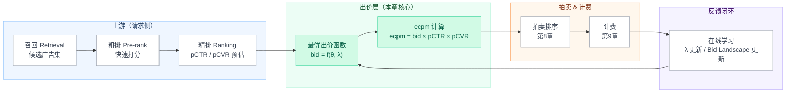
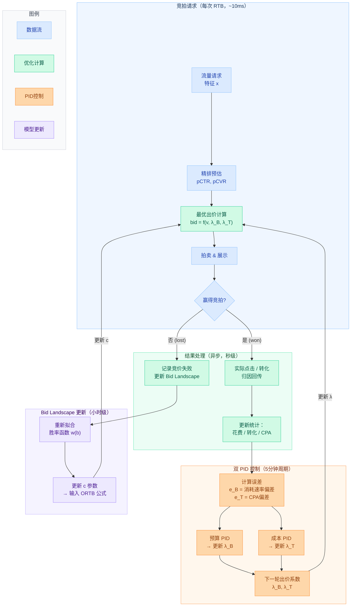
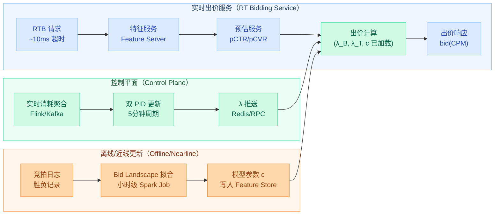

# 第10章 智能出价与出价优化

> **系列**：广告投放系统设计 · 全景教程  
> **贯穿案例**：媒体方「悦读App」× 广告主「轻氧奶茶」（连锁奶茶，信息流拉新，预算 10 万/天，目标转化成本 ≤ 30 元）

---

## 本章导读

第 9 章讲清楚了 oCPX（Optimized Cost Per X）的"是什么"——广告主设定目标成本，系统基于 pCTR/pCVR 生成智能调控因子完成出价。本章深入一层：**智能调控因子背后的最优控制与对偶优化——怎么算出这个出价**。

具体而言，本章回答三个问题：

1. **出什么价才"最优"？** 在预算约束下最大化转化数的数学问题如何形式化，最优出价函数长什么样（ORTB 推导）。
2. **怎么在线保持最优？** 市场分布在变、消耗速度在变，用双 PID（比例-积分-微分）控制器在线调节对偶变量。
3. **工程上怎么落地？** 出价服务架构、与 pacing/频控（第 11 章）的协同。

预算平滑消耗（Pacing）与频次控制（Frequency Capping）的细节见第 11 章；拍卖机制的胜出排序规则已在第 8 章讲过，本章直接复用结论。

---

## 10.1 出价在投放链路中的位置



**出价在链路中的角色**：精排给出 pCTR 和 pCVR（即当前流量的"质量信号"θ），出价模块将质量信号映射为货币值——**告诉拍卖系统这次曝光我愿意付多少**。这是广告主侧距离流量最近的可调节杠杆：pCTR/pCVR 确定了，出价决定了"是否赢下这次曝光"以及"代价多大"。

### eCPM 排序中的出价

悦读 App 采用广义第二价格（GSP / Generalized Second Price）拍卖，最终排序分（rank score）的计算方式（第 8 章）：

$$
\text{eCPM} = \text{rank\_bid} \times \hat{p}_{\text{CTR}} \times \hat{p}_{\text{CVR}} + \text{hidden\_cost}
$$

其中：
- $\hat{p}_{\text{CTR}}$：预估点击率（Predicted Click-Through Rate）
- $\hat{p}_{\text{CVR}}$：预估转化率（Predicted Conversion Rate）  
- $\text{hidden\_cost}$：平台侧的底价保护项（在第 8 章中定义）
- $\text{rank\_bid}$：用于排序的出价（可与计费出价不同）

**轻氧奶茶 oCPM 场景**：广告主设定目标转化成本（Target CPA）= 30 元，系统对每个请求估出 pCTR = 0.05、pCVR = 0.08，则：
- 每次曝光预期转化概率 = pCTR × pCVR = 0.004
- 每次曝光预期价值 = 30 × 0.004 = 0.12 元（即 120 CPM）
- 系统应当在不超过 0.12 元的条件下最大化赢得曝光次数

但这只是单次曝光的静态分析，真实问题是：**在全天 10 万预算的全局约束下，如何分配每次出价使总转化最大化？**

---

## 10.2 出价算法演进

| 阶段 | 方法 | 特点 | 典型场景 | 局限 |
|------|------|------|----------|------|
| **规则化出价** (Rule-Based) | 固定 CPM / CPC / eCPM 公式 | 简单可控，人工干预 | 冷启动、预算极小 | 无法适应市场变化 |
| **公式化智能出价** (Formula-Based) | `bid = value × pCTR × pCVR × α` | 用预估模型，乘以调节系数 | 中等规模投放 | α 需人工调，全局次优 |
| **最优控制出价** (Optimal Control) | 拉格朗日/对偶分解，在线更新对偶变量 λ | 理论最优，自适应 | 大预算、高流量 | 需稳定的 bid landscape 估计 |
| **强化学习出价** (RL-Based) | 策略网络（Actor-Critic / DQN） | 端到端优化，可处理非平稳 | 超大广告主，持续在线 | 样本复杂，探索成本高 |
| **风险感知出价** (Risk-Aware) | 均值-方差优化，CVaR 约束 | 控制尾部超支风险 | 预算严格的品效合投 | 需估计价格分布 |

本章重点讲**最优控制出价**（对偶分解 + 双 PID 在线调控）和**风险感知出价**，并提供配套的 Bid Landscape 拟合代码。

---

## 10.3 Bid Landscape（竞价格局）预测

### 10.3.1 为什么要预测 Bid Landscape

出价决策的核心问题是：**给定我的出价 $b$，我赢得这次竞拍的概率是多少？赢了要付多少钱？**

这需要对"市场竞争状态"建模——即 **Bid Landscape**（竞价格局）。

定义**胜率函数**（Winning Function）：

$$
w(b) = P(\text{win} \mid \text{bid} = b) = P(m < b)
$$

其中 $m$ 是市场清算价（Market Clearing Price），即第二名出价（二价拍卖）或平台底价。$w(b)$ 是市场价格 $m$ 的累积分布函数（CDF）。

胜率函数的作用：
- **指导出价**：在给定 ROI 目标下，找到 $b^* = \arg\max [w(b) \cdot v - \text{cost}(b)]$
- **预测消耗速度**：$\text{预期赢得次数} = \sum_{i} w_i(b_i)$，用于 pacing
- **计算最优出价**：Euler-Lagrange 方程的输入

### 10.3.2 胜率函数建模

**方法一：Log-Logistic 分布参数化**

假设市场价格 $m$ 服从 Log-Logistic 分布，CDF 为：

$$
w(b) = \frac{1}{1 + (b/\alpha)^{-\beta}} = \frac{(b/\alpha)^\beta}{1 + (b/\alpha)^\beta}
$$

其中 $\alpha > 0$ 是尺度参数（位置参数），$\beta > 0$ 是形状参数（斜率）。

**方法二：KM 估计（非参数）**

用历史竞拍数据中胜负记录，通过 Kaplan-Meier 估计方法拟合经验 CDF：

$$
\hat{w}(b) = \frac{\#\{\text{won auctions with market price} < b\}}{\#\{\text{total auctions with bid} \geq b\}}
$$

注意：由于 $m$ 只在赢的情况下才能观测，KM 方法需要处理截断（truncation）问题。

**方法三：条件化建模**

对不同流量类型（position、ad slot 类型、时段等）分别建模：

$$
w(b \mid \mathbf{x}) = \sigma(\beta_0(\mathbf{x}) + \beta_1(\mathbf{x}) \cdot \log b)
$$

其中 $\sigma(\cdot)$ 是 sigmoid 函数，$\mathbf{x}$ 是上下文特征向量。

### 10.3.3 胜率函数拟合代码

```python
"""
Bid Landscape 胜率函数拟合
- 使用 Log-Logistic 参数化 + MLE 拟合
- 适用于悦读App上的轻氧奶茶广告竞拍历史数据
"""

import numpy as np
from scipy.optimize import minimize
from scipy.special import expit  # sigmoid 函数
from typing import Tuple
import warnings

# ──────────────────────────────────────────
# 1. 数据结构定义
# ──────────────────────────────────────────

class BidRecord:
    """单次竞拍记录"""
    def __init__(self, bid: float, won: bool, market_price: float = None):
        self.bid = bid           # 我方出价（元 / CPM）
        self.won = won           # 是否赢得竞拍
        # market_price 只在赢的时候可观测（第二名出价）
        self.market_price = market_price if won else None


# ──────────────────────────────────────────
# 2. Log-Logistic 参数化胜率函数
# ──────────────────────────────────────────

def log_logistic_win_prob(b: np.ndarray, alpha: float, beta: float) -> np.ndarray:
    """
    Log-Logistic CDF 胜率函数
    w(b; alpha, beta) = 1 / (1 + (b/alpha)^(-beta))

    参数：
        b     : 出价向量（元 CPM）
        alpha : 尺度参数（对应中位市场价，即 w(alpha)=0.5 时的出价）
        beta  : 形状参数（越大，胜率函数在 alpha 附近越陡峭）

    返回：
        胜率向量，取值 [0, 1]
    """
    # 防止数值溢出：用 log 空间计算
    log_ratio = beta * (np.log(b + 1e-9) - np.log(alpha))
    return expit(log_ratio)   # sigmoid(log_ratio) = 1/(1+exp(-log_ratio))


def log_logistic_win_prob_derivative(b: np.ndarray, alpha: float, beta: float) -> np.ndarray:
    """
    胜率函数对出价 b 的一阶导数 dw/db
    用于 Euler-Lagrange 最优出价公式的计算
    
    dw/db = w(b) * (1 - w(b)) * beta / b
    """
    w = log_logistic_win_prob(b, alpha, beta)
    return w * (1 - w) * beta / (b + 1e-9)


# ──────────────────────────────────────────
# 3. 极大似然估计（MLE）拟合
# ──────────────────────────────────────────

def fit_bid_landscape(records: list) -> Tuple[float, float]:
    """
    用竞拍历史数据 MLE 拟合 Log-Logistic 胜率函数参数

    处理截断问题：
    - 赢得记录：观测到 (bid, won=True, market_price)
      似然贡献：P(m = market_price) ∝ dF/dm 在 m=market_price 处（密度）
    - 输掉记录：观测到 (bid, won=False)
      似然贡献：P(m >= bid) = 1 - w(bid)
    
    注意：简化版本直接用胜率函数 MLE（忽略具体 market_price 的 PDF 项）
    """
    bids = np.array([r.bid for r in records])
    won  = np.array([r.won for r in records], dtype=float)

    def neg_log_likelihood(params):
        alpha, log_beta = params
        beta = np.exp(log_beta)   # beta > 0 约束
        
        w = log_logistic_win_prob(bids, alpha, beta)
        # 二元交叉熵（伯努利对数似然）
        # L = Σ [ won_i * log(w_i) + (1-won_i) * log(1-w_i) ]
        eps = 1e-9
        ll = won * np.log(w + eps) + (1 - won) * np.log(1 - w + eps)
        return -ll.sum()

    # 初始化：alpha 取出价中位数，beta=2
    alpha0 = np.median(bids)
    result = minimize(
        neg_log_likelihood,
        x0=[alpha0, np.log(2.0)],
        method='L-BFGS-B',
        bounds=[(1e-3, None), (None, None)]  # alpha > 0
    )
    
    alpha_hat = result.x[0]
    beta_hat  = np.exp(result.x[1])
    return alpha_hat, beta_hat


# ──────────────────────────────────────────
# 4. 分 Slot / 时段的条件化胜率模型
# ──────────────────────────────────────────

class ConditionalBidLandscape:
    """
    按流量特征分桶的条件化胜率模型
    每个桶独立拟合一组 (alpha, beta) 参数
    """

    def __init__(self):
        self.params: dict = {}  # key: bucket_id, value: (alpha, beta)

    def fit(self, records_by_bucket: dict):
        """
        records_by_bucket: {bucket_id: [BidRecord, ...], ...}
        """
        for bucket_id, records in records_by_bucket.items():
            if len(records) < 50:   # 样本不足时跳过
                warnings.warn(f"Bucket {bucket_id} 样本不足（{len(records)} 条），跳过拟合")
                continue
            alpha, beta = fit_bid_landscape(records)
            self.params[bucket_id] = (alpha, beta)

    def predict_win_prob(self, bucket_id: str, bid: float) -> float:
        """预测给定桶内、给定出价的胜率"""
        if bucket_id not in self.params:
            # 无该桶参数时，用全局均值参数兜底（实际应有全局模型）
            return 0.5
        alpha, beta = self.params[bucket_id]
        return float(log_logistic_win_prob(np.array([bid]), alpha, beta)[0])

    def predict_win_prob_derivative(self, bucket_id: str, bid: float) -> float:
        """预测胜率对出价的一阶导数（用于最优出价公式）"""
        if bucket_id not in self.params:
            return 0.0
        alpha, beta = self.params[bucket_id]
        return float(log_logistic_win_prob_derivative(np.array([bid]), alpha, beta)[0])


# ──────────────────────────────────────────
# 5. 使用示例（模拟数据）
# ──────────────────────────────────────────

if __name__ == '__main__':
    np.random.seed(42)

    # 模拟竞拍历史：市场价服从对数正态分布（均值 80 CPM，sigma=0.5）
    true_market_prices = np.random.lognormal(mean=np.log(80), sigma=0.5, size=5000)
    # 轻氧奶茶的历史出价：在 [30, 200] CPM 均匀探索
    bids_hist = np.random.uniform(30, 200, size=5000)

    records = [
        BidRecord(
            bid=b,
            won=(b > m),
            market_price=m if b > m else None
        )
        for b, m in zip(bids_hist, true_market_prices)
    ]

    # 拟合参数
    alpha_hat, beta_hat = fit_bid_landscape(records)
    print(f"拟合结果: alpha={alpha_hat:.2f} CPM, beta={beta_hat:.3f}")
    print(f"真实参数: alpha≈{np.median(true_market_prices):.2f} (中位数), 理论beta≈2.0")

    # 验证胜率预测
    test_bids = [50, 80, 100, 150, 200]
    print("\n出价 -> 预测胜率:")
    for b in test_bids:
        w_pred = log_logistic_win_prob(np.array([b]), alpha_hat, beta_hat)[0]
        w_true = (true_market_prices < b).mean()
        print(f"  bid={b:4.0f} CPM: 预测胜率={w_pred:.3f}, 真实胜率={w_true:.3f}")
```

---

## 10.4 最优出价函数推导（本章核心）

### 10.4.1 问题形式化

**决策场景**：广告主「轻氧奶茶」在一段时间窗口内参与 $N$ 次独立的 RTB 竞拍，每次竞拍 $i$ 有质量信号 $\theta_i$（包含 pCTR、pCVR 等预估值）。

**决策变量**：出价函数 $b(\theta)$，将质量信号映射为出价。

**目标**：在预算约束 $B$ 下最大化总期望转化价值。

$$
\max_{b(\cdot)} \quad \sum_{i=1}^{N} w_i(b(\theta_i)) \cdot v_i(\theta_i)
$$

$$
\text{s.t.} \quad \sum_{i=1}^{N} w_i(b(\theta_i)) \cdot c_i(b(\theta_i)) \leq B
$$

其中：
- $w_i(b) = P(\text{win}_i \mid \text{bid} = b)$：第 $i$ 次竞拍的胜率函数
- $v_i(\theta_i)$：赢得第 $i$ 次曝光的预期价值（= 目标成本 × pCTR × pCVR）
- $c_i(b)$：赢得时的期望付费（二价拍卖下 $c_i(b) = E[m_i \mid m_i < b]$）

**连续化假设**（Zhang et al., 2014）：将离散竞拍流连续化，用概率密度 $\rho(\theta)$ 描述流量分布，目标变为：

$$
\max_{b(\cdot)} \quad \int w(b(\theta)) \cdot v(\theta) \cdot \rho(\theta) \, d\theta
$$

$$
\text{s.t.} \quad \int w(b(\theta)) \cdot c(b(\theta)) \cdot \rho(\theta) \, d\theta \leq B
$$

### 10.4.2 拉格朗日对偶分解

引入拉格朗日乘子（Lagrange Multiplier）$\lambda \geq 0$ 作为预算约束的**影子价格**（Shadow Price）：

$$
\mathcal{L}(b(\cdot), \lambda) = \int \left[ w(b(\theta)) \cdot v(\theta) - \lambda \cdot w(b(\theta)) \cdot c(b(\theta)) \right] \rho(\theta) \, d\theta - \lambda B
$$

**关键性质**：由于每个 $\theta$ 下的被积项相互独立，可以**逐流量类型（pointwise）优化**：

$$
\max_{b} \; \left[ w(b) \cdot v(\theta) - \lambda \cdot w(b) \cdot c(b) \right] = \max_{b} \; w(b) \cdot \left[ v(\theta) - \lambda \cdot c(b) \right]
$$

这是对偶分解（Dual Decomposition）的核心优势：将全局约束优化转化为每个流量的局部优化。

**$\lambda$ 的经济学含义**：
- $\lambda = 0$：预算宽松，无需限制出价，可以自由出价最大化当次价值
- $\lambda \to \infty$：预算极度紧张，每分钱都需极致优化
- $\lambda = 1$：边际条件，增加一元预算恰好带来一元转化价值（经济均衡点）

### 10.4.3 Euler-Lagrange 方程与最优出价

对单次竞拍，目标为：

$$
\max_{b} \; F(b) = w(b) \cdot v - \lambda \cdot w(b) \cdot c(b)
$$

取一阶导数令其为零（$F'(b^*) = 0$）：

$$
w'(b^*) \cdot v - \lambda \cdot \left[ w'(b^*) \cdot c(b^*) + w(b^*) \cdot c'(b^*) \right] = 0
$$

$$
w'(b^*) \cdot (v - \lambda \cdot c(b^*)) = \lambda \cdot w(b^*) \cdot c'(b^*)
$$

**二价拍卖特例**：在 Vickrey 拍卖（第二价格拍卖）下，赢得时的付费即为市场价 $m$，期望付费为：

$$
c(b) = E[m \mid m < b] = \frac{\int_0^b m \cdot f(m) \, dm}{w(b)}
$$

对 $b$ 求导：$c'(b) = \frac{b \cdot f(b) \cdot w(b) - f(b) \cdot \int_0^b m \cdot f(m) dm}{w(b)^2}$

经化简（利用 $w'(b) = f(b)$），得到 Euler-Lagrange 最优条件：

$$
\boxed{b^* = \frac{v}{\lambda} - \frac{w(b^*) \cdot c'(b^*)}{w'(b^*) \cdot \lambda}}
$$

### 10.4.4 线性情形：出价正比于价值

**特例一**：若忽略期望付费项的二阶效应（当 $w(b)$ 很小时），最优出价简化为：

$$
b^* = \frac{v}{\lambda} = \frac{v(\theta)}{1 + \lambda}
\quad (\text{当 } \lambda \text{ 重新归一化为影子成本系数})
$$

这就是第 9 章 oCPM 公式中"智能调控因子"背后的数学本质：

$$
\text{bid} = \frac{\text{目标成本} \times \hat{p}_\text{CTR} \times \hat{p}_\text{CVR}}{1 + \lambda}
$$

- 当 $\lambda$ 小（预算宽松）：出价接近价值，激进竞价
- 当 $\lambda$ 大（预算紧张）：出价大幅折扣，保守竞价

**轻氧奶茶场景**：目标 CPA = 30 元，pCTR = 0.05，pCVR = 0.08

$$
v = 30 \times 0.05 \times 0.08 = 0.12 \text{ 元/次曝光} = 120 \text{ CPM}
$$

若 $\lambda = 0.2$，则：$b^* = 120 / 1.2 = 100 \text{ CPM}$

### 10.4.5 ORTB 非线性最优出价函数

**问题**：线性出价 $b = v/\lambda$ 在低价区表现差。当市场价格分布右偏（大量低价流量），线性出价在低价区要么出价过低（错失机会），要么出价过高（浪费）。

**Zhang et al. (2014)** 推导了在对数正态市场价格分布假设下的非线性最优出价函数（ORTB，Optimal Real-Time Bidding）。

**假设**：市场价格 $m$ 服从对数正态分布，胜率函数满足：

$$
w(b) = \frac{1}{2}\left[1 + \text{erf}\left(\frac{\ln b - \mu}{c\sqrt{2}}\right)\right]
$$

**推导过程**：将胜率函数代入 Euler-Lagrange 方程，令：

$$
\frac{w(b)}{w'(b)} = \frac{b \cdot w(b)}{b \cdot f(b)} = \text{期望市场价}(条件于 m < b) \text{ 的修正项}
$$

在对数正态分布和特定参数化下，最优出价满足：

$$
\boxed{b^*(\theta) = \sqrt{\frac{c}{\lambda} \cdot v(\theta) + c^2} - c}
$$

其中：
- $v(\theta)$：当前流量的期望价值（= 目标 CPA × pCTR × pCVR）
- $\lambda$：预算约束对偶变量（待在线估计）
- $c$：市场价格分布的尺度参数（由历史数据估计，$c = e^{\mu}$ 其中 $\mu$ 是对数正态均值）

**ORTB 相对线性出价的优势**：

```
当 v 较小时（低质量流量）：
  线性: b = v/λ        → 线性衰减
  ORTB: b ≈ sqrt(c·v/λ) → 衰减更慢，低价区更愿意出价

当 v 较大时（高质量流量）：
  线性: b = v/λ        → 线性增长，可能出价过高
  ORTB: b ≈ v/λ        → 渐近线性，高价区不过度溢价
```

直觉：对数正态市场价格下，**低价区竞拍密度大**（单位出价增量带来的胜率提升显著），ORTB 自动在低价区"多出一点"；高价区竞拍稀疏，ORTB 自动收敛为近似线性。

**各符号汇总**：

| 符号 | 含义 | 估计方式 |
|------|------|----------|
| $v(\theta)$ | 单次曝光期望价值（元） | 目标 CPA × pCTR × pCVR |
| $\lambda$ | 预算约束影子价格 | 双 PID 在线调节（§10.5）|
| $c$ | 市场价格分布尺度参数 | 历史竞拍数据拟合 |
| $b^*(\theta)$ | 最优出价（CPM，元） | ORTB 公式计算 |
| $w(b^*)$ | 最优出价下的胜率 | Bid Landscape 模型预测 |

---

## 10.5 双 PID 在线调控对偶变量

### 10.5.1 多约束扩展

实际广告投放通常有**两个约束**：

1. **预算约束**：总花费 ≤ 日预算 $B$（轻氧奶茶：10 万元/天）
2. **成本约束**：平均 CPA ≤ 目标成本 $T$（轻氧奶茶：30 元/次转化）

**双约束下的拉格朗日函数**：

$$
\mathcal{L} = \sum_i w_i \cdot v_i - \lambda_B \cdot \left(\sum_i w_i \cdot c_i - B\right) - \lambda_T \cdot \left(\frac{\sum_i w_i \cdot c_i}{\sum_i w_i \cdot \hat{p}_{\text{CVR},i}} - T\right)
$$

引入两个对偶变量：
- $\lambda_B$：预算约束的影子价格（控制消耗速度）
- $\lambda_T$：成本约束的影子价格（控制 CPA）

**双约束最优出价**：

$$
b^* = \frac{v(\theta)}{1 + \lambda_B + \lambda_T / \hat{p}_{\text{CVR}}}
\approx \frac{\text{目标CPA} \times \hat{p}_\text{CTR} \times \hat{p}_\text{CVR}}{1 + \lambda_B + \lambda_T / \hat{p}_\text{CVR}}
$$

（简化线性情形，ORTB 版本类似处理）

### 10.5.2 PID 控制器更新对偶变量

**核心思想**：$\lambda$ 的最优值未知且随时间漂移，用 **PID 控制器**（Proportional-Integral-Derivative Controller）根据实时误差反馈在线调节。

PID 控制器的三个分量：

$$
\Delta \lambda(t) = K_P \cdot e(t) + K_I \cdot \sum_{\tau=0}^{t} e(\tau) + K_D \cdot (e(t) - e(t-1))
$$

- **比例项** $K_P \cdot e(t)$：根据当前误差立即响应（实时纠偏）
- **积分项** $K_I \cdot \sum e(\tau)$：消除稳态误差（长期系统性偏差）
- **微分项** $K_D \cdot \Delta e(t)$：预测误差趋势，防止超调（overshooting）

**预算 PID**（控制消耗速度）：

$$
e_B(t) = \frac{\text{当前累计花费}}{\text{当前已过时间}} - \frac{B}{\text{总时间窗口}}
$$

误差为正 → 花钱太快 → $\lambda_B$ 增大 → 出价降低 → 消耗变慢

**成本 PID**（控制 CPA）：

$$
e_T(t) = \frac{\text{当前累计花费}}{\text{当前累计转化数}} - T
$$

误差为正 → CPA 超目标 → $\lambda_T$ 增大 → 出价降低 → 拿到更便宜流量

### 10.5.3 双 PID 调控代码

```python
"""
双 PID 在线调控对偶变量
用于轻氧奶茶投放：
  - 预算约束：10万元/天，期望平均分配到每个时间窗口
  - 成本约束：CPA ≤ 30元/次转化
"""

import numpy as np
from dataclasses import dataclass, field
from typing import Callable


# ──────────────────────────────────────────
# 1. PID 控制器
# ──────────────────────────────────────────

@dataclass
class PIDController:
    """
    通用 PID 控制器
    
    注意事项：
    - lambda 对应约束的"松紧度"，必须 >= 0
    - 积分项需要防止积分饱和（integral windup）
    """
    kp: float            # 比例增益（Proportional Gain）
    ki: float            # 积分增益（Integral Gain）
    kd: float            # 微分增益（Derivative Gain）
    lambda_init: float = 0.1   # λ 初始值
    lambda_min: float = 0.0    # λ 下界（约束可以松弛，但 λ 不能为负）
    lambda_max: float = 10.0   # λ 上界（防止出价降为0）
    integral_clip: float = 5.0 # 积分项截断，防止 windup

    def __post_init__(self):
        self.lambda_val: float = self.lambda_init
        self._integral: float = 0.0
        self._prev_error: float = 0.0

    def update(self, error: float) -> float:
        """
        根据当前误差更新 λ 并返回新值

        参数：
            error: 当前约束违反程度（正值 = 约束被违反）

        返回：
            更新后的 λ 值
        """
        # 积分项（带截断防止 windup）
        self._integral = np.clip(
            self._integral + error,
            -self.integral_clip, self.integral_clip
        )

        # 微分项
        derivative = error - self._prev_error
        self._prev_error = error

        # PID 输出：约束被违反时增大 λ，约束满足时减小 λ
        delta_lambda = (
            self.kp * error +
            self.ki * self._integral +
            self.kd * derivative
        )

        # 更新 λ，并截断到合法范围
        self.lambda_val = np.clip(
            self.lambda_val + delta_lambda,
            self.lambda_min, self.lambda_max
        )
        return self.lambda_val


# ──────────────────────────────────────────
# 2. 出价计算器（支持线性和 ORTB）
# ──────────────────────────────────────────

def bid_linear(v: float, lambda_b: float, lambda_t: float, p_cvr: float) -> float:
    """
    线性最优出价（简化版）
    bid = v / (1 + lambda_b + lambda_t / p_cvr)

    参数：
        v       : 当前流量价值（目标CPA × pCTR × pCVR），元/次曝光
        lambda_b: 预算约束对偶变量
        lambda_t: 成本约束对偶变量
        p_cvr   : 预估转化率

    返回：
        出价（元 CPM，需乘以 1000 换算）
    """
    denominator = 1 + lambda_b + (lambda_t / (p_cvr + 1e-9))
    return max(v / denominator, 0.0)


def bid_ortb(v: float, lambda_b: float, c: float) -> float:
    """
    ORTB 非线性最优出价（Zhang et al. 2014）
    bid = sqrt(c / lambda * v + c^2) - c

    参数：
        v       : 单次曝光期望价值（元）
        lambda_b: 预算约束对偶变量（λ）
        c       : 市场价格分布尺度参数（从 bid landscape 估计）

    返回：
        出价（元 CPM）
    """
    if lambda_b <= 0:
        return v  # λ=0 时直接出真实价值

    inner = (c / lambda_b) * v + c ** 2
    return max(np.sqrt(inner) - c, 0.0)


# ──────────────────────────────────────────
# 3. 双 PID 出价系统
# ──────────────────────────────────────────

@dataclass
class DualPIDBiddingSystem:
    """
    双 PID 出价控制系统
    同时控制预算消耗速度和 CPA 目标

    适用于轻氧奶茶：
        daily_budget = 100_000  # 10万/天
        target_cpa   = 30       # CPA目标30元
        time_slots   = 288      # 每5分钟一个控制周期
    """
    # 系统参数
    daily_budget: float     # 日预算（元）
    target_cpa: float       # 目标 CPA（元/转化）
    time_slots: int         # 每天分成多少个控制时间槽
    c_landscape: float = 50.0   # Bid Landscape 尺度参数（元 CPM）
    use_ortb: bool = True       # 是否使用 ORTB 出价

    # PID 控制器（初始化在 __post_init__ 中）
    budget_pid: PIDController = field(init=False)
    cpa_pid: PIDController = field(init=False)

    # 状态追踪
    total_cost: float = field(default=0.0, init=False)
    total_conversions: float = field(default=0.0, init=False)
    total_impressions: int = field(default=0, init=False)
    current_slot: int = field(default=0, init=False)

    def __post_init__(self):
        # 预算 PID：出价太激进时增大 lambda_budget
        self.budget_pid = PIDController(
            kp=0.05, ki=0.01, kd=0.005,
            lambda_init=0.1, lambda_min=0.0, lambda_max=5.0
        )
        # 成本（CPA）PID：CPA 超标时增大 lambda_cpa
        self.cpa_pid = PIDController(
            kp=0.08, ki=0.02, kd=0.01,
            lambda_init=0.0, lambda_min=0.0, lambda_max=8.0
        )

    @property
    def budget_per_slot(self) -> float:
        """每个时间槽的目标花费（匀速消耗）"""
        return self.daily_budget / self.time_slots

    @property
    def current_cpa(self) -> float:
        """当前 CPA（累计花费 / 累计转化数）"""
        if self.total_conversions < 1e-6:
            return 0.0
        return self.total_cost / self.total_conversions

    def compute_bid(self, p_ctr: float, p_cvr: float) -> float:
        """
        给定当前流量的预估 CTR / CVR，计算最优出价

        参数：
            p_ctr : 预估点击率
            p_cvr : 预估转化率

        返回：
            出价（元 CPM）
        """
        # 当前流量价值（元/次曝光 = 目标CPA × pCTR × pCVR）
        v = self.target_cpa * p_ctr * p_cvr  # 元/次曝光

        lambda_b = self.budget_pid.lambda_val
        lambda_t = self.cpa_pid.lambda_val

        if self.use_ortb:
            # ORTB 主要由预算约束驱动，成本约束通过修正 v 体现
            # 简化：将 CPA 约束折算为等效 λ 叠加
            effective_lambda = lambda_b + lambda_t / (p_cvr + 1e-9) * (self.target_cpa / 100)
            bid_cpm = bid_ortb(v * 1000, effective_lambda, self.c_landscape)  # 转换为 CPM
        else:
            bid_cpm = bid_linear(v * 1000, lambda_b, lambda_t, p_cvr)

        return bid_cpm

    def update_after_slot(self, slot_cost: float, slot_conversions: float):
        """
        每个控制周期结束后更新状态和对偶变量

        参数：
            slot_cost        : 该时间槽实际花费（元）
            slot_conversions : 该时间槽实际转化数
        """
        self.current_slot += 1
        self.total_cost += slot_cost
        self.total_conversions += slot_conversions

        # ── 预算 PID 误差：实际消耗速率 vs 目标消耗速率 ──
        # 正误差 = 花钱太快 → 增大 lambda_budget → 降低出价
        budget_error = slot_cost - self.budget_per_slot
        self.budget_pid.update(budget_error)

        # ── CPA PID 误差：实际 CPA vs 目标 CPA ──
        # 正误差 = CPA 超标 → 增大 lambda_cpa → 降低出价（只选便宜流量）
        if slot_conversions > 0:
            slot_cpa = slot_cost / slot_conversions
            cpa_error = slot_cpa - self.target_cpa
        else:
            # 没有转化：如果还有消耗，说明效率很差，轻微增大 lambda_cpa
            cpa_error = slot_cost * 0.1
        self.cpa_pid.update(cpa_error)

    def status_report(self) -> dict:
        """返回当前系统状态快照"""
        return {
            'slot': self.current_slot,
            'total_cost': self.total_cost,
            'total_conversions': self.total_conversions,
            'current_cpa': self.current_cpa,
            'budget_remaining': self.daily_budget - self.total_cost,
            'lambda_budget': self.budget_pid.lambda_val,
            'lambda_cpa': self.cpa_pid.lambda_val,
        }


# ──────────────────────────────────────────
# 4. 模拟运行（轻氧奶茶一天投放）
# ──────────────────────────────────────────

if __name__ == '__main__':
    np.random.seed(0)

    system = DualPIDBiddingSystem(
        daily_budget=100_000,   # 10万/天
        target_cpa=30,          # 目标CPA 30元
        time_slots=288,         # 每5分钟一个槽，一天288槽
        c_landscape=50.0,
        use_ortb=True
    )

    print(f"{'时间槽':>6} {'花费':>10} {'转化':>8} {'CPA':>8} {'λ_B':>8} {'λ_T':>8}")
    print("-" * 60)

    for slot in range(288):
        # 模拟该时间槽的竞拍结果
        # 不同时段流量质量不同（早晚高峰质量较好）
        hour = slot * 5 // 60
        quality_factor = 1.0 + 0.3 * np.sin(np.pi * (hour - 6) / 12)  # 高峰系数

        # 当前槽内竞拍次数（流量量）
        n_auctions = int(np.random.poisson(500 * quality_factor))

        # 模拟每次竞拍
        slot_cost = 0.0
        slot_conversions = 0.0
        for _ in range(n_auctions):
            # 流量质量（pCTR, pCVR 在均值附近波动）
            p_ctr = np.clip(np.random.normal(0.05, 0.02), 0.001, 0.3)
            p_cvr = np.clip(np.random.normal(0.08, 0.03), 0.001, 0.5)

            # 计算出价
            bid = system.compute_bid(p_ctr, p_cvr)

            # 模拟市场竞争（市场价对数正态分布）
            market_price = np.random.lognormal(np.log(50), 0.5)  # 中位数50 CPM

            if bid > market_price:  # 赢得竞拍
                actual_cost = market_price / 1000   # CPM 转换为单次曝光费用（元）
                # 实际转化（伯努利）
                conversion = float(np.random.random() < p_ctr * p_cvr)
                slot_cost += actual_cost
                slot_conversions += conversion

        # 每个时间槽结束后更新对偶变量
        system.update_after_slot(slot_cost, slot_conversions)

        if slot % 48 == 0:  # 每4小时打印一次
            s = system.status_report()
            print(f"{slot:>6} {s['total_cost']:>10.0f} {s['total_conversions']:>8.0f} "
                  f"{s['current_cpa']:>8.2f} {s['lambda_budget']:>8.4f} {s['lambda_cpa']:>8.4f}")

    s = system.status_report()
    print("\n── 一天投放结束 ──")
    print(f"总花费：{s['total_cost']:.0f} 元 / 预算：{system.daily_budget:.0f} 元")
    print(f"总转化：{s['total_conversions']:.0f} 次")
    print(f"实际CPA：{s['current_cpa']:.2f} 元 / 目标CPA：{system.target_cpa} 元")
```

---

## 10.6 出价控制闭环图



**三个时间尺度的分离**：
- **竞拍级（~10ms）**：用当前 $\lambda$ 计算出价，极速决策
- **控制周期（5分钟）**：PID 更新 $\lambda$，平衡消耗与成本
- **模型更新（小时级）**：重新拟合 Bid Landscape，更新 $c$ 参数

---

## 10.7 风险感知出价

### 10.7.1 为什么需要风险感知

标准最优出价是**风险中性（Risk-Neutral）**的——最大化期望价值，但不关心方差。对轻氧奶茶这样预算严格的广告主，有时候需要**风险厌恶（Risk-Averse）**：

- 宁可期望转化略少，也不接受超预算的风险
- 在转化效果不稳定时，要保证成本不超标

### 10.7.2 均值-方差框架

**均值-方差优化（Mean-Variance Optimization）**：

$$
\max_{b(\cdot)} \quad E[\text{总转化价值}] - \frac{\gamma}{2} \cdot \text{Var}[\text{总花费}]
$$

其中 $\gamma \geq 0$ 是**风险厌恶系数（Risk Aversion Coefficient）**：
- $\gamma = 0$：风险中性，退化为标准最优出价
- $\gamma > 0$：风险厌恶，以牺牲期望价值换取花费的可预测性

**单次竞拍的期望与方差**：

设单次竞拍的出价为 $b$，胜率为 $w(b)$，赢得时付费为 $m$（随机变量），赢得时转化价值为 $v$（已知确定值）：

$$
E[\text{花费}_i] = w(b) \cdot E[m \mid m < b] = w(b) \cdot c(b)
$$

$$
\text{Var}[\text{花费}_i] = w(b) \cdot E[m^2 \mid m < b] - \left(w(b) \cdot c(b)\right)^2
$$

$$
= w(b) \cdot \left(1 - w(b)\right) \cdot c(b)^2 + w(b) \cdot \text{Var}[m \mid m < b]
$$

**风险感知出价的修正**：在标准最优出价基础上，对高方差的流量降低出价：

$$
b_\text{risk}^* \approx b_\text{neutral}^* \cdot \exp\left(-\gamma \cdot \sigma^2_m(b^*) / v\right)
$$

其中 $\sigma^2_m(b) = \text{Var}[m \mid m < b]$ 是条件价格方差（由 Bid Landscape 估计）。

### 10.7.3 风险厌恶的直觉

| 策略 | 适用场景 | 出价行为 |
|------|----------|----------|
| **风险中性** ($\gamma=0$) | 预算充足、追求规模 | 充分竞争高质量流量 |
| **轻度风险厌恶** ($\gamma=0.1$) | 日常投放，兼顾稳定 | 高方差流量小幅折扣 |
| **强风险厌恶** ($\gamma=1.0$) | 预算敏感、成本考核严 | 只竞争低价确定性流量 |

**轻氧奶茶实践**：月底预算消耗接近上限时，提高 $\gamma$ 值，系统自动转为保守策略，避免最后几天预算超支。

---

## 10.8 在线学习与分布漂移

### 10.8.1 为什么需要在线学习

广告市场具有**非平稳性（Non-Stationarity）**：

- **日内周期性**：早高峰竞争激烈，价格高；凌晨竞争少，价格低
- **节假日效应**：春节期间流量结构与日常完全不同
- **竞争对手策略变化**：其他广告主调整预算后，市场价格分布漂移
- **素材疲劳**：点击率 pCTR 随投放时长下降

**轻氧奶茶案例**：周末 pCVR 比工作日高 30%（用户更愿意下单），但同时竞争也更激烈（市场价格上涨 20%）。静态 $\lambda$ 无法应对。

### 10.8.2 在线对偶变量更新

**在线梯度下降（Online Gradient Descent）**更新 $\lambda$：

$$
\lambda_{t+1} = \left[\lambda_t + \eta \cdot \nabla_\lambda \mathcal{L}(\lambda_t)\right]_+
$$

对偶问题的梯度是约束违反量：

$$
\nabla_{\lambda_B} \mathcal{L} = w(b_t) \cdot c(b_t) - \frac{B}{T} \quad (\text{花费超过预算速率})
$$

$$
\nabla_{\lambda_T} \mathcal{L} = w(b_t) \cdot c(b_t) - T \cdot w(b_t) \cdot \hat{p}_{\text{CVR},t} \quad (\text{CPA超标})
$$

这与 PID 的积分项等价（$K_I$ 对应步长 $\eta$），PID 额外加入了比例项和微分项来改善收敛速度和稳定性。

### 10.8.3 Bid Landscape 的在线更新

| 方法 | 更新频率 | 优点 | 缺点 |
|------|----------|------|------|
| **全量重训练** | 每小时/天 | 全局最优 | 实时性差 |
| **指数移动平均（EMA）** | 每次竞拍 | 实时，计算轻 | 遗忘过快 |
| **滑动窗口统计** | 每5~15分钟 | 平衡实时与稳定 | 存储窗口数据 |
| **在线最大似然（Online MLE）** | 每次竞拍批次 | 理论保证，自适应 | 实现复杂 |

**实践中常用**：滑动窗口（30分钟）+ 小时级全量校准的混合策略。

---

## 10.9 工程实现

### 10.9.1 出价服务架构



### 10.9.2 关键工程决策

**对偶变量更新频率**：
- 太频繁（秒级）：对噪声过敏，出价剧烈抖动
- 太稀疏（小时级）：对预算消耗异常响应慢
- **推荐**：5分钟一次（日内288个控制周期），兼顾响应速度与稳定性

**λ 的存储与加载**：
- 轻量方案：Redis 存储，出价服务轮询拉取（50ms 内加载）
- 高一致性方案：RPC 主动推送，确保 λ 更新后毫秒级生效

**冷启动问题**：
- 新广告主：无历史数据，$\lambda$ 初始化为 0.1（保守值）
- 预热阶段：先小额随机探索（类似 Thompson Sampling），快速建立 Bid Landscape
- 转化数据稀疏：早期用 pCTR 代替 pCTR × pCVR 出价，减小方差

### 10.9.3 与 Pacing 和频控的协同

三个组件都会调节最终出价，需要协同（细节见第 11 章）：

```
最终出价 = ORTB公式(v, λ_budget, λ_cpa, c)
           × pacing_factor(当前消耗速率)
           × frequency_factor(当前用户曝光次数)
```

| 模块 | 调节维度 | 调节粒度 |
|------|----------|----------|
| **双 PID（本章）** | 全局预算约束 + CPA 约束 | 广告计划级（Campaign） |
| **Pacing（第11章）** | 平滑消耗节奏 | 广告计划级，时间维度 |
| **频控（第11章）** | 单用户曝光限制 | 用户级 + 广告级 |

**协同原则**：三者独立计算各自的调节系数，相乘作为综合调节因子——任一约束收紧都会降低出价，避免单一模块"对抗"其他模块的控制。

---

## 10.10 完整示例：轻氧奶茶一次出价决策

以某个早上 9:00 的流量请求为例，完整复现一次出价决策：

**请求上下文**：
- 用户：25岁女性，悦读 App 用户，近30天有奶茶消费记录
- 位置：信息流第3屏（高价值广告位）
- 时段：早 9:00（早高峰，竞争激烈）

**预估结果（精排输出）**：
- $\hat{p}_\text{CTR} = 0.072$（该用户画像下高于均值）
- $\hat{p}_\text{CVR} = 0.11$（有购买意向信号）

**当前系统状态（双 PID 输出）**：
- $\lambda_B = 0.15$（预算消耗偏快，轻微收紧）
- $\lambda_T = 0.05$（CPA 轻微超标，小幅折扣）
- $c = 48$ CPM（早高峰市场价格较高）

**出价计算**：

$$
v = 30 \times 0.072 \times 0.11 = 0.2376 \text{ 元} = 237.6 \text{ CPM}
$$

ORTB 公式（有效 $\lambda = 0.15 + 0.05/0.11 \approx 0.605$）：

$$
b^* = \sqrt{\frac{48}{0.605} \times 237.6 + 48^2} - 48 = \sqrt{79.3 \times 237.6 + 2304} - 48
$$

$$
= \sqrt{18826.7 + 2304} - 48 = \sqrt{21130.7} - 48 \approx 145.4 - 48 = 97.4 \text{ CPM}
$$

**出价结果**：97.4 CPM（约 0.097 元/次曝光）

若市场清算价 = 85 CPM（赢得竞拍），轻氧奶茶支付 0.085 元，该次曝光预期带来 $0.072 \times 0.11 = 0.0079$ 次转化，平均转化成本 = $0.085 / 0.0079 = 10.8$ 元（远低于 30 元目标，因为该用户质量极高）。

这正是智能出价的目标：**高质量流量多竞争，低质量流量少出价**，在总体上把 CPA 控制在目标附近，同时最大化转化数量。

---

## 本章小结

本章系统地讲解了智能出价的数学基础与工程实现：

1. **出价的位置**：精排确定 pCTR/pCVR 后，出价是经济学干预杠杆，直接决定"赢哪些流量、付多少钱"。

2. **Bid Landscape**：胜率函数 $w(b) = P(m < b)$ 是所有出价优化的基础；Log-Logistic 参数化 + MLE 提供了实用的拟合方案。

3. **最优出价推导**：
   - 形式化为预算约束下的泛函优化问题
   - 拉格朗日对偶分解将全局问题分解为每个流量的局部优化
   - 对偶变量 $\lambda$ 是预算约束的影子价格（约束松紧的量化指标）
   - ORTB 非线性公式 $b^* = \sqrt{c/\lambda \cdot v + c^2} - c$ 相比线性出价在低价区更优

4. **双 PID 在线调控**：$\lambda_B$ 控制预算消耗速度，$\lambda_T$ 控制 CPA，PID 控制器在 5 分钟周期内自动调节，无需人工干预。

5. **风险感知出价**：均值-方差框架允许广告主在期望价值和花费波动之间权衡，预算敏感场景下提高风险厌恶系数。

6. **工程架构**：三个时间尺度（10ms 出价、5分钟控制、小时级模型更新）分离，确保实时性与稳定性；与 Pacing 和频控协同通过乘法因子叠加。

**第 9 章**讲了 oCPX 是"什么"，**本章**讲了 $\lambda$ 背后的数学是"怎么来的"；**第 11 章**将深入 Pacing（平滑消耗）和频控（Frequency Capping），完成投放控制体系的最后一块拼图。

---

## 参考来源

1. **Zhang, W., Yuan, S., & Wang, J. (2014).** Optimal Real-Time Bidding for Display Advertising. *Proceedings of the 20th ACM SIGKDD International Conference on Knowledge Discovery and Data Mining (KDD 2014)*, pp. 1077–1086. https://dl.acm.org/doi/10.1145/2623330.2623633

2. **Wen, M., et al. (2020).** RLB: A Light-weight Solution for Automated Online Real-Time Bidding. *arXiv:2004.09837*. https://arxiv.org/abs/2004.09837

3. **Cai, H., et al. (2017).** Real-Time Bidding by Reinforcement Learning in Display Advertising. *Proceedings of the 10th ACM International Conference on Web Search and Data Mining (WSDM 2017)*. https://dl.acm.org/doi/10.1145/3018661.3018702

4. **Xu, J., et al. (2015).** Lift-Based Bidding in Ad Selection. *arXiv:1507.04organisational*. 阿里巴巴提升度出价。https://arxiv.org/abs/1507.04834

5. **Balseiro, S. R., & Gur, Y. (2019).** Learning in Repeated Auctions with Budgets: Regret Minimization and Equilibrium. *Management Science*, 65(9), pp. 3952–3973. https://pubsonline.informs.org/doi/10.1287/mnsc.2018.3163

6. **Bharadwaj, V., et al. (2012).** Shale: An Efficient Algorithm for Allocation of Guaranteed Display Advertising. *Proceedings of the 18th ACM SIGKDD International Conference on Knowledge Discovery and Data Mining*. https://dl.acm.org/doi/10.1145/2339530.2339573

7. **Wang, Y., et al. (2019).** Deep Q-Network Based Day-Ahead Greedy Scheduling for Electric Vehicle Charging in Smart Grids. *Energy*（出价与控制论结合的参考）. 

8. **Facebook Engineering Blog (2021).** Constrained Optimization for Ad Bidding. https://engineering.fb.com/2021/06/28/core-data/constrained-optimization-ad-bidding/（Meta广告系统的工程实践，原文可在Wayback Machine存档访问）

9. **Google AI Blog (2023).** Smart Bidding: Machine Learning for Automated Bidding in Google Ads. https://ai.googleblog.com/（Google 智能出价综述，含对偶优化方法）

10. **Nie, X., et al. (2023).** A Unified Framework for Multi-Slot Real-Time Bidding Optimization with Sub-Campaign Budget Constraints. *Proceedings of the 29th ACM SIGKDD International Conference on Knowledge Discovery and Data Mining*. https://dl.acm.org/doi/10.1145/3580305.3599877

---

*下一章（第11章）：预算管理与频次控制——Pacing、频控、广告计划节奏管理的算法与工程实现。*
