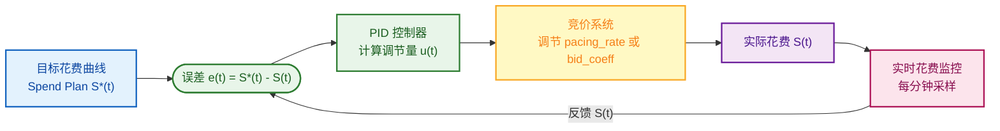
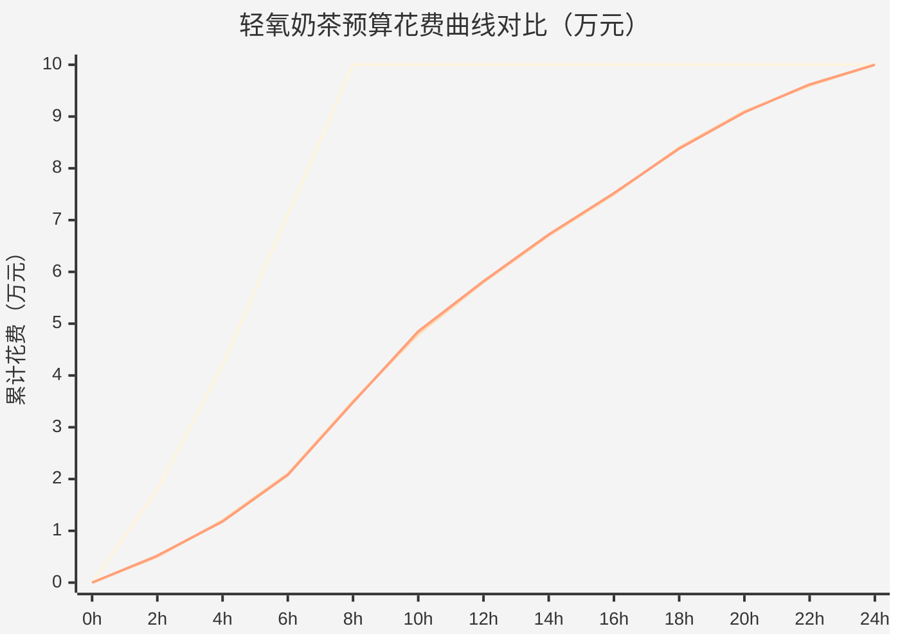
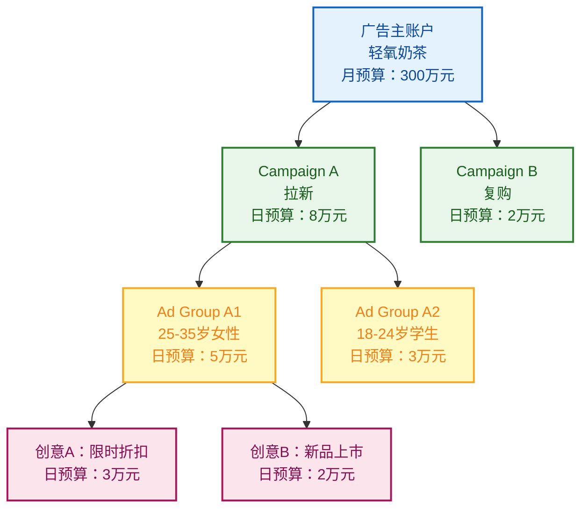
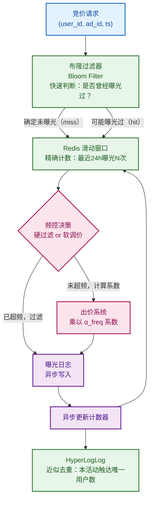
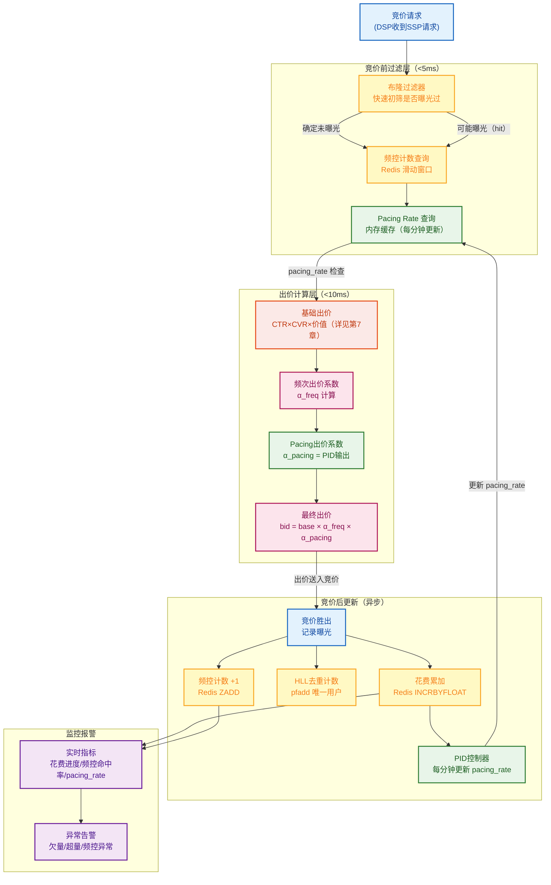

# 第11章 预算控制与频次控制

> **系列定位**：本章是《广告投放系统设计·全景教程》第11章，承接第10章的智能出价与对偶变量 λ（详见第10章），向工程师展示预算如何在时间轴上平滑地花出去（Pacing），以及如何限制单用户的广告曝光次数（Frequency Capping）。二者都通过调节出价或丢量来影响最终结果，是广告系统控制论的核心模块。

---

## 本章导读

广告主「轻氧奶茶」给悦读App设置了**日预算 10 万元、转化成本 ≤ 30 元**的投放任务。如果什么控制都不做，会发生两件事：

1. **早晨 9 点预算就花光了**——下午和晚上的优质流量全部错过，整体 ROI 极差。
2. **同一个用户一天之内看了 20 次轻氧奶茶广告**——产生厌烦，点击率和转化率双双暴跌，还白白浪费了竞价成本。

**预算平滑（Budget Pacing）** 解决问题①，**频次控制（Frequency Capping）** 解决问题②。二者都是广告系统的"调速阀"，核心思路殊途同归：通过实时反馈，在每一次竞价决策前插入一个系数，要么降低参与竞价的概率（丢量），要么压低出价（降价），从而把花费和曝光控制在期望的节奏上。

本章结构如下：

- **A 部分（§11.1–§11.6）**：预算控制的理论基础、四种 Pacing 算法、PID 控制器完整实现、预算分配层次、与第10章对偶变量的关系。
- **B 部分（§11.7–§11.12）**：频次控制的动机、算法理论、工程实现（Redis 滑动窗口 + HyperLogLog + 布隆过滤器）、与出价的融合。
- **§11.13**：贯穿全章的轻氧奶茶完整案例。
- **§11.14**：Pacing/频控对训练样本分布的影响。

---

## A 部分：预算控制与预算平滑

### §11.1 为什么需要 Pacing（预算平滑）

#### 11.1.1 没有 Pacing 会发生什么

设想轻氧奶茶以固定出价 5 元/千次曝光（CPM）参与竞价，悦读App早高峰（7:00–9:00）流量巨大，系统会在没有任何限速机制的情况下迅速消耗全部预算。

```
时间    | 累计花费(无Pacing) | 期望花费(均匀)
07:00  |    0 元            |    0 元
08:00  |  18,000 元         |  4,167 元
09:00  |  100,000 元        |  8,333 元  ← 预算耗尽
12:00  |  100,000 元        | 50,000 元  ← 错过午间流量
18:00  |  100,000 元        | 75,000 元  ← 错过晚间黄金流量
```

**问题汇总：**

1. **Early Exit（提前退出）**：预算在早高峰耗尽，后续优质流量（午间购物、晚间娱乐）完全错过，整体 CVR 和 ROI 下降。
2. **成本不稳定**：早高峰竞争激烈，eCPM 偏高；错过下午低竞争时段的廉价流量，均摊成本升高。
3. **ROAS 波动**：投放效果难以预测，广告主难以评估和优化。

#### 11.1.2 Pacing 的目标

Pacing 的本质目标是：**让广告在整个投放周期内按照某种期望节奏花费预算，同时尽量不降低竞价质量**。

常见的期望节奏有两种：

| 节奏类型 | 含义 | 适用场景 |
|----------|------|----------|
| **均匀投放（Uniform Pacing）** | 每小时花费预算的 1/24 | 预算充足、全天流量较均匀 |
| **流量跟随（Traffic-based Pacing）** | 花费速度正比于当前时段流量密度 | 流量有明显峰谷、想最大化竞价机会 |

> 直觉上，流量跟随更合理：流量多时多花一点，流量少时少花一点，保证每一次竞价机会的"抢到率"大致相同。

---

### §11.2 最优花费策略的理论结论

#### 11.2.1 核心定理

**定理（最优 Pacing 策略）**：在竞价市场中，若广告主的目标是最大化某个线性效用（如最大化曝光量），则最优的预算花费策略是**花费速度正比于有效竞价请求数**，即在以"有效请求数"为时间轴的重标度坐标下，花费曲线是线性的。

更形式化地，设：

$$
B = \text{总预算}, \quad T = \text{投放时长（秒）}
$$

$$
\lambda(t) = \text{t 时刻的有效竞价请求到达率（次/秒）}
$$

$$
\Lambda(t) = \int_0^t \lambda(s)\,ds \quad \text{（累计有效请求数）}
$$

$$
\Lambda_T = \Lambda(T) \quad \text{（总有效请求数）}
$$

则最优花费计划（Spend Plan）为：

$$
\boxed{S^*(t) = B \cdot \frac{\Lambda(t)}{\Lambda_T}}
$$

**符号解释：**
- $S^*(t)$：到 $t$ 时刻应累计花费的金额（元）
- $B$：总预算（元），轻氧奶茶案例中为 100,000 元/天
- $\Lambda(t)$：到 $t$ 时刻累计的有效竞价请求数
- $\Lambda_T$：全天总有效竞价请求数

**关键洞察**：当流量均匀时（$\lambda(t) = \text{const}$），$\Lambda(t) = \lambda t$，公式退化为均匀花费 $S^*(t) = B \cdot t/T$。流量不均匀时，花费速度随流量密度自适应缩放。

#### 11.2.2 实际近似

由于 $\Lambda_T$（全天总请求数）在当天结束前无法精确知道，工程上通常用以下近似：

1. **历史预测**：用昨天或过去7天同时段的平均流量密度预测今天的 $\lambda(t)$，预算分配到各小时。
2. **实时滚动**：每隔 $\Delta t$（如1分钟）重新评估当前花费进度与目标进度的差距，动态调整 Pacing Rate。

---

### §11.3 四种 Pacing 算法

业界主流的 Pacing 算法可以分为两大思路：

- **丢量（Throttling）**：以概率决定是否参与竞价，不改变出价。
- **降价（Bid Modification）**：参与竞价，但调低出价系数。

#### 算法对比表

| 算法 | 核心机制 | 控制变量 | 优点 | 缺点 | 适用场景 |
|------|----------|----------|------|------|----------|
| **概率节流**（Probabilistic Throttling） | 以概率 $p$ 参与竞价 | Pacing Rate $p \in [0,1]$ | 实现简单，出价不变保证胜率 | 丢量可能错过高价值请求 | 量大、流量均匀 |
| **出价压制**（Bid Modification） | 乘以系数 $\alpha$ 降低出价 | 出价系数 $\alpha \in [0,1]$ | 不丢请求机会，智能降价 | 出价过低可能赢不了 | 品牌广告、保量场景 |
| **PID 控制器** | 比例+积分+微分反馈 | Pacing Rate 或出价系数 | 响应快、稳定性好、可调参 | 参数调优需经验 | 大多数效果广告 |
| **MPC（模型预测控制）** | 预测未来流量，滚动优化 | 多步出价计划 | 全局最优、考虑未来 | 计算复杂度高，依赖预测精度 | 预算精细化管理 |

#### 11.3.1 概率节流（Probabilistic Throttling）

最简单直接的方法：每次收到竞价请求时，以概率 $p$（Pacing Rate）决定是否参与竞价。

```python
import random

def should_participate(pacing_rate: float) -> bool:
    """
    概率节流：以 pacing_rate 的概率决定是否参与竞价。
    
    Args:
        pacing_rate: 节流率，范围 [0, 1]。
                     1.0 = 全量参与；0.5 = 50%概率参与；0.0 = 完全不参与
    Returns:
        True 表示参与本次竞价，False 表示放弃
    """
    return random.random() < pacing_rate
```

**Pacing Rate 的动态计算：**

设 $t$ 时刻的目标花费为 $S^*(t)$，实际花费为 $S(t)$，当前 Pacing Rate 为：

$$
p(t) = \min\left(1, \frac{S^*(t) - S(t)}{S^*(t)} \cdot p_{\text{base}} + p_{\text{offset}}\right)
$$

更常见的工程做法是直接用"剩余预算/剩余时间预期花费"的比值：

$$
p(t) = \min\left(1,\ \frac{B - S(t)}{S^*(T) - S^*(t) + \epsilon}\right)
$$

**优缺点分析：**
- 优点：出价不变，每次参与竞价的胜率由真实出价决定，不存在因降价导致的质量下降。
- 缺点：随机丢弃请求，可能错过高价值曝光（例如转化率很高的用户在丢弃的那次请求中出现）。

#### 11.3.2 出价压制（Bid Modification）

以系数 $\alpha \in [0,1]$ 调低出价，参与所有竞价但赢得更少：

$$
\text{bid}_{\text{actual}}(t) = \alpha(t) \cdot \text{bid}_{\text{base}}
$$

$\alpha(t)$ 的计算与 Pacing Rate 类似，根据当前花费进度调整：

$$
\alpha(t) = \text{clip}\left(\frac{S^*(t) - S(t) + B_{\text{remain}}/(T - t) \cdot \delta t}{B_{\text{remain}}/(T - t) \cdot \delta t},\ \alpha_{\min},\ 1\right)
$$

**优缺点：**
- 优点：不丢请求机会，系统仍然评估每个请求的价值，在低竞争时段（出价较低也能赢）能"捡漏"。
- 缺点：出价过低可能完全赢不了高价值媒体，导致花费速度过慢甚至跑不完预算（Under-delivery）。

#### 11.3.3 两种思路的本质区别

| | 丢量（Throttling） | 降价（Bid Modification） |
|--|---|---|
| **参与竞价** | 概率性参与 | 全量参与 |
| **每次参与的胜率** | 不变（出价真实） | 降低（出价压低） |
| **风险** | 错过高价值请求 | 赢不了高竞争请求 |
| **对拍卖公平性的影响** | 较小 | 可能扭曲竞价结果 |
| **与频控结合** | 先频控过滤再节流 | 先频控调系数再竞价 |

> 业界实践中，两种方式往往**结合使用**：先用出价调节保证参与质量，再用节流控制花费上限，用 PID 统一协调两个控制变量。

---

### §11.4 PID 控制器：工程重点

PID（Proportional-Integral-Derivative，比例-积分-微分）控制器是工业自动控制的经典算法，被广泛应用于广告 Pacing。

#### 11.4.1 控制论视角

将预算 Pacing 建模为一个**闭环控制系统**：



**关键变量：**

$$
e(t) = S^*(t) - S(t) \quad \text{（误差：目标花费 - 实际花费）}
$$

$$
u(t) = K_p \cdot e(t) + K_i \cdot \int_0^t e(\tau)\,d\tau + K_d \cdot \frac{de(t)}{dt}
$$

$$
\text{pacing\_rate}(t+1) = \text{clip}\bigl(\text{pacing\_rate}(t) + u(t),\ 0,\ 1\bigr)
$$

**三项含义：**

| 项 | 公式 | 物理含义 | 效果 |
|----|------|----------|------|
| **P（比例）** | $K_p \cdot e(t)$ | 当前误差越大，调节越猛 | 快速响应，但可能过冲 |
| **I（积分）** | $K_i \cdot \int e\,dt$ | 历史误差累积，消除稳态误差 | 确保长期精确，但响应慢 |
| **D（微分）** | $K_d \cdot \frac{de}{dt}$ | 误差变化速度，预测趋势 | 抑制振荡，提升稳定性 |

#### 11.4.2 完整 Python 实现

```python
"""
广告预算 Pacing PID 控制器
用于轻氧奶茶 10万/天 预算的平滑控制

设计思路：
- 每分钟采样一次实际花费
- 计算与目标花费曲线的偏差
- PID 输出调节 pacing_rate（概率节流系数）
"""

import time
import math
from dataclasses import dataclass, field
from typing import List, Optional
import redis


@dataclass
class SpendPlan:
    """
    目标花费计划（Spend Plan）
    支持均匀投放和流量跟随两种模式
    """
    total_budget: float          # 总预算（元），如 100000
    start_ts: float              # 投放开始时间戳（秒）
    end_ts: float                # 投放结束时间戳（秒）
    # 可选：各时段流量权重（用于流量跟随模式）
    # 长度为24，表示每小时的流量权重（相对值）
    hourly_weights: Optional[List[float]] = None

    def __post_init__(self):
        if self.hourly_weights is None:
            # 默认均匀投放
            self.hourly_weights = [1.0] * 24
        # 归一化权重，使总和为 24
        total = sum(self.hourly_weights)
        self.hourly_weights = [w / total * 24 for w in self.hourly_weights]

    def target_spend_at(self, ts: float) -> float:
        """
        计算 ts 时刻应累计花费的目标金额。
        
        Args:
            ts: 当前时间戳（秒）
        Returns:
            目标累计花费（元）
        """
        if ts <= self.start_ts:
            return 0.0
        if ts >= self.end_ts:
            return self.total_budget

        total_duration = self.end_ts - self.start_ts
        elapsed = ts - self.start_ts

        # 均匀模式：线性计算
        if all(w == 1.0 for w in self.hourly_weights):
            return self.total_budget * (elapsed / total_duration)

        # 流量跟随模式：按小时权重积分
        elapsed_hours = elapsed / 3600.0
        total_hours = total_duration / 3600.0

        # 计算已过去的完整小时内的累计权重
        full_hours = int(elapsed_hours)
        partial = elapsed_hours - full_hours

        # 归一化：总权重对应总预算
        total_weight = sum(
            self.hourly_weights[int((self.start_ts / 3600 + h) % 24)]
            for h in range(int(total_hours))
        )

        accumulated_weight = sum(
            self.hourly_weights[int((self.start_ts / 3600 + h) % 24)]
            for h in range(full_hours)
        )
        # 加上当前小时的部分
        current_hour_idx = int((self.start_ts / 3600 + full_hours) % 24)
        accumulated_weight += self.hourly_weights[current_hour_idx] * partial

        if total_weight == 0:
            return 0.0
        return self.total_budget * (accumulated_weight / total_weight)


@dataclass
class PIDState:
    """PID 控制器状态（支持序列化到 Redis 持久化）"""
    pacing_rate: float = 1.0      # 当前 Pacing Rate，范围 [0, 1]
    integral: float = 0.0          # 积分项累计值
    prev_error: float = 0.0        # 上一次误差（用于微分项）
    last_update_ts: float = 0.0    # 上次更新时间戳
    total_spend: float = 0.0       # 累计实际花费


class BudgetPacingPIDController:
    """
    广告预算 Pacing PID 控制器
    
    控制逻辑：
    - 输入：当前累计花费 S(t)，目标花费 S*(t)
    - 误差：e(t) = S*(t) - S(t)（正值=花慢了，负值=花快了）
    - 输出：新的 pacing_rate = clip(pacing_rate + PID(e), 0, 1)
    
    调参直觉：
    - Kp 越大：响应越快，但容易振荡（pacing_rate 剧烈波动）
    - Ki 越大：稳态精度越高，但响应越慢，可能积分饱和
    - Kd 越大：越能抑制振荡，但对噪声更敏感
    
    建议初始值（需根据实际流量规模调整）：
    - Kp = 1e-5（误差单位：元，pacing_rate 单位：无量纲）
    - Ki = 1e-7
    - Kd = 1e-4
    """

    def __init__(
        self,
        spend_plan: SpendPlan,
        kp: float = 1e-5,
        ki: float = 1e-7,
        kd: float = 1e-4,
        update_interval: float = 60.0,   # 控制周期（秒），默认1分钟
        pacing_rate_min: float = 0.0,
        pacing_rate_max: float = 1.0,
        integral_clamp: float = 1e6,     # 积分饱和限制，防止 wind-up
        campaign_id: str = "default",
    ):
        self.spend_plan = spend_plan
        self.kp = kp
        self.ki = ki
        self.kd = kd
        self.update_interval = update_interval
        self.pacing_rate_min = pacing_rate_min
        self.pacing_rate_max = pacing_rate_max
        self.integral_clamp = integral_clamp
        self.campaign_id = campaign_id
        self.state = PIDState(last_update_ts=spend_plan.start_ts)

    def update(self, current_spend: float, current_ts: Optional[float] = None) -> float:
        """
        输入当前累计花费，输出新的 pacing_rate。
        
        Args:
            current_spend: 当前累计实际花费（元）
            current_ts: 当前时间戳（秒），None 则取系统时间
        Returns:
            新的 pacing_rate，范围 [0, 1]
        """
        if current_ts is None:
            current_ts = time.time()

        # 1. 计算目标花费
        target_spend = self.spend_plan.target_spend_at(current_ts)

        # 2. 计算误差
        # e > 0：花慢了（需要提高 pacing_rate）
        # e < 0：花快了（需要降低 pacing_rate）
        error = target_spend - current_spend

        # 3. 计算时间步长 Δt
        dt = current_ts - self.state.last_update_ts
        if dt <= 0:
            return self.state.pacing_rate

        # 4. 积分项（带饱和限制 anti-windup）
        self.state.integral += error * dt
        self.state.integral = max(
            -self.integral_clamp,
            min(self.integral_clamp, self.state.integral)
        )

        # 5. 微分项
        derivative = (error - self.state.prev_error) / dt if dt > 0 else 0.0

        # 6. PID 输出
        pid_output = (
            self.kp * error
            + self.ki * self.state.integral
            + self.kd * derivative
        )

        # 7. 更新 pacing_rate（clip 到合法范围）
        new_rate = self.state.pacing_rate + pid_output
        new_rate = max(self.pacing_rate_min, min(self.pacing_rate_max, new_rate))

        # 8. 更新状态
        self.state.pacing_rate = new_rate
        self.state.prev_error = error
        self.state.last_update_ts = current_ts
        self.state.total_spend = current_spend

        return new_rate

    def should_participate(self) -> bool:
        """
        竞价时调用：以当前 pacing_rate 的概率决定是否参与本次竞价。
        
        Returns:
            True = 参与竞价；False = 跳过本次请求
        """
        import random
        return random.random() < self.state.pacing_rate

    def get_bid_modifier(self) -> float:
        """
        出价系数模式：返回 [0, 1] 的出价系数。
        当 pacing_rate 较低时，同时也降低出价（结合丢量和降价）。
        """
        # 简单映射：pacing_rate -> bid_modifier
        # 可以设计为非线性映射，例如 pacing_rate > 0.8 时不降价
        if self.state.pacing_rate >= 0.8:
            return 1.0
        elif self.state.pacing_rate >= 0.5:
            # 线性降价，最多降至 0.8
            return 0.8 + 0.2 * (self.state.pacing_rate - 0.5) / 0.3
        else:
            # 深度降价
            return max(0.3, self.state.pacing_rate * 0.6 + 0.0)

    def log_status(self, current_spend: float, current_ts: float) -> dict:
        """生成状态日志，便于监控告警"""
        target = self.spend_plan.target_spend_at(current_ts)
        remaining_budget = self.spend_plan.total_budget - current_spend
        remaining_time = self.spend_plan.end_ts - current_ts

        return {
            "campaign_id": self.campaign_id,
            "ts": current_ts,
            "pacing_rate": round(self.state.pacing_rate, 4),
            "current_spend": current_spend,
            "target_spend": round(target, 2),
            "error": round(target - current_spend, 2),
            "integral": round(self.state.integral, 2),
            "remaining_budget": round(remaining_budget, 2),
            "remaining_time_hours": round(remaining_time / 3600, 2),
            "projected_total": round(
                current_spend + remaining_budget * self.state.pacing_rate, 2
            ) if remaining_time > 0 else current_spend,
        }
```

#### 11.4.3 调参直觉与实践建议

| 参数 | 典型值 | 调大效果 | 调小效果 | 注意 |
|------|--------|----------|----------|------|
| $K_p$ | $10^{-5}$ | 响应快，误差大时调节猛 | 响应慢，可能长期偏离目标 | 过大导致振荡 |
| $K_i$ | $10^{-7}$ | 稳态精度高，消除长期偏差 | 稳态误差大 | 过大导致积分饱和（wind-up） |
| $K_d$ | $10^{-4}$ | 抑制振荡，提前预判趋势 | 对快速变化反应慢 | 过大对噪声敏感 |

**实战调参步骤（Ziegler-Nichols 简化版）：**

1. 先置 $K_i = K_d = 0$，逐渐增大 $K_p$ 直到出现等幅振荡，记录此时 $K_p = K_u$，振荡周期 $T_u$。
2. 设 $K_p = 0.6 K_u$，$K_i = 2 K_p / T_u$，$K_d = K_p T_u / 8$。
3. 在仿真环境中用历史流量数据验证，观察花费曲线平滑度和 pacing_rate 波动。

**Anti-Windup（抗积分饱和）**：当 pacing_rate 已经 clip 到边界（0或1）时，积分项继续累积会导致"wind-up"——系统需要很长时间才能从饱和中恢复。代码中通过 `integral_clamp` 限制积分范围。

#### 11.4.4 花费曲线示意



---

### §11.5 MPC 模型预测控制

**MPC（Model Predictive Control，模型预测控制）** 是比 PID 更先进的控制策略，通过预测未来一段时间的流量和竞价结果，在每个控制周期求解一个有限时域最优化问题。

#### 11.5.1 核心思路

在 $t$ 时刻，已知：
- 剩余预算：$B_{\text{remain}} = B - S(t)$
- 剩余时间：$[t, T]$，共 $H$ 个控制步骤（时域窗口）
- 对未来各步流量的预测：$\hat{\lambda}(t+1), \hat{\lambda}(t+2), \ldots, \hat{\lambda}(t+H)$

求解优化问题：

$$
\max_{\{p_k\}_{k=1}^{H}} \sum_{k=1}^{H} p_k \cdot \hat{\lambda}(t+k) \cdot \hat{\text{win\_rate}}(p_k)
$$

$$
\text{s.t.} \quad \sum_{k=1}^H p_k \cdot \hat{\text{cost}}(t+k) \leq B_{\text{remain}}
$$

$$
0 \leq p_k \leq 1 \quad \forall k
$$

其中 $p_k$ 是第 $k$ 步的 Pacing Rate，$\hat{\text{win\_rate}}(p_k)$ 是给定参与率时的预期胜率。

**MPC vs PID 的权衡：**

| 维度 | PID | MPC |
|------|-----|-----|
| 计算复杂度 | $O(1)$，每次更新极快 | $O(H^2)$ 或更高，需要求解 QP |
| 预测依赖 | 不需要流量预测 | 需要准确的流量预测模型 |
| 全局最优性 | 局部最优（反应式） | 有限时域内接近全局最优 |
| 实现难度 | 简单，易于调参 | 复杂，需要优化器 |
| 适用场景 | 常规效果广告 | 保量广告、预算极精细化管理 |

> 业界大多数广告系统以 PID 为基础，在超大预算或保量场景引入 MPC 优化。

---

### §11.6 预算分配层次与 Pacing 的关系

#### 11.6.1 预算层级结构



**每一层都可以独立设置预算和 Pacing 策略**，形成层次化的预算控制。

#### 11.6.2 多 Campaign 预算竞争

当一个广告主有多个 Campaign 时，存在**内部预算竞争**问题：哪个 Campaign 优先花？

**常见策略：**

1. **各自独立 Pacing**：每个 Campaign 独立控制，互不干扰。简单但可能导致总账户预算花不完（各 Campaign 都保守）。
2. **账户级统一 Pacing**：在账户层面设置总 Pacing Rate，各 Campaign 共享。灵活但需要跨 Campaign 协调。
3. **优先级 + 预算保护**：高优先级 Campaign 优先花费，低优先级 Campaign 保底预算。

#### 11.6.3 Pacing 与对偶变量 λ 的关系

> **与第10章的衔接**：第10章介绍了在预算约束下，最优出价等价于在原始出价上乘以一个折扣系数 $\frac{1}{1+\lambda}$，其中 $\lambda$ 是预算约束的对偶变量（影子价格）。

**Pacing 本质上就是在动态调节 λ！**

- 花费过快（$S(t) > S^*(t)$）→ 需要降低竞争力 → PID 输出负值 → 降低 pacing_rate 或出价系数 → 等价于增大 $\lambda$（提高每元预算的"稀缺性"）。
- 花费过慢（$S(t) < S^*(t)$）→ 需要加速花费 → PID 输出正值 → 提高 pacing_rate 或出价系数 → 等价于减小 $\lambda$（降低预算稀缺性）。

$$
\text{bid\_modifier}(t) = \frac{1}{1 + \lambda(t)}, \quad \lambda(t) \text{ 由 PID 动态更新}
$$

第10章中 $\lambda$ 是在全局最优化框架下求解的静态值；本章中 $\lambda$ 通过 PID 实时反馈动态调整——二者描述的是同一个机制的不同视角。

---

## B 部分：频次控制

### §11.7 为什么需要频次控制

**频次控制（Frequency Capping）** 限制单个用户在给定时间窗口内看到某个广告的次数。

#### 11.7.1 广告疲劳（Ad Fatigue）

用户反复看到同一广告会产生心理厌烦，导致：

- **CTR（点击率）** 随曝光次数增加而下降
- **CVR（转化率）** 在高曝光次数后显著降低
- **用户体验**下降，可能导致用户对品牌产生负面印象

**典型的频次-效果曲线（Diminishing Returns，收益递减）：**

```
曝光次数 | 相对CTR | 边际收益
   1    |  100%   |  100%
   2    |   95%   |   90%
   3    |   85%   |   65%
   4    |   72%   |   41%
   5    |   58%   |   16%
   6    |   45%   |  -13%  ← 边际收益为负，继续投放是亏损
```

**最优频次（Optimal Frequency）** 因广告类型和用户群体而异：
- 品牌广告（Brand Awareness）：通常 3-5 次/周
- 效果广告（Performance）：通常 1-3 次/天
- 重定向广告（Retargeting）：需要更精细控制，因为用户已有意向

#### 11.7.2 浪费预算

已经转化的用户（例如已经下单的轻氧奶茶顾客）继续看到广告，不仅无效，还消耗竞价成本。合理的频控能将预算重新分配给未曝光用户。

---

### §11.8 频控规则设计

#### 11.8.1 基本规则结构

$$
\text{FrequencyCap}(\text{user}, \text{ad}, \text{window}) = N
$$

含义：在时间窗口 $\text{window}$ 内，用户 $\text{user}$ 看到广告 $\text{ad}$ 的次数不超过 $N$ 次。

**多层次频控：**

| 层次 | 典型配置 | 说明 |
|------|----------|------|
| Ad 级 | 3次/天 | 最细粒度，单个创意的曝光限制 |
| Ad Group 级 | 6次/天 | 同一受众组内所有创意合计 |
| Campaign 级 | 10次/天 | 同一广告系列合计 |
| 账户级 | 15次/天 | 防止单一广告主霸屏 |

**窗口类型：**

| 窗口类型 | 说明 | 优缺点 |
|----------|------|--------|
| 固定窗口（Fixed Window） | 自然天/周/月，00:00重置 | 简单，但跨边界有突刺（23:59到00:01可触发2次） |
| 滑动窗口（Sliding Window） | 过去24小时内不超过N次 | 精确，无突刺，计算稍复杂 |
| 会话级（Session） | 同一会话内不超过N次 | 适合短视频/直播场景 |

**曝光频控 vs 点击频控：**

- **曝光频控**（Impression Cap）：计曝光次数，是最常见的形式。
- **点击频控**（Click Cap）：计点击次数，用于防止刷点击行为。
- **转化频控**（Conversion Cap）：已转化用户不再投放，节省预算。

---

### §11.9 频控的算法理论

#### 11.9.1 频控问题的理论建模

Buchbinder 等人（2007）将在线广告频控问题建模为**在线匹配（Online Matching）**问题：

**问题描述**：在线广告系统需要为每个到来的广告请求（用户）分配广告（商品），目标是最大化总价值，同时满足：
1. 每个广告主的预算约束（最多花 $B_i$ 元）
2. 每个用户的频次约束（最多看 $N$ 次某广告）

**竞争比（Competitive Ratio）**：在线算法的最优解与离线最优解的比值。

#### 11.9.2 两个经典结论

**结论 1：贪心算法的 3/4-competitive**

Buchbinder 等证明，对于带频次约束的在线广告分配问题，存在一个简单的**随机贪心算法**，其竞争比为 $3/4$。

直觉：每次请求来临时，以概率 $\min(1, v/(c \cdot \lambda_i))$ 接受分配，其中 $v$ 是价值，$c$ 是成本，$\lambda_i$ 是对偶变量。

**结论 2：Primal-Dual 方法的 $1 - 1/e$ 竞争比**

更精细的 Primal-Dual 算法（类似 AdWords 中著名的 MSVV 算法）对于一般化的频次约束问题能达到 $1 - 1/e \approx 0.632$ 的竞争比，在理论上证明是最优的（在不知道未来信息的情况下）。

**工程意义**：
- $1 - 1/e$ 是在线场景的理论上界，说明频控无法避免一定的次优性。
- 实际系统通过预测（流量预测、用户行为预测）补充未来信息，可以超越理论下界。
- 频控与 Pacing 共用 Primal-Dual 框架（详见第10章），本质上都是对偶变量的动态更新。

#### 11.9.3 保量场景的加权分配

在**保量广告（Guaranteed Delivery，GD）** 场景中，广告主购买了"至少向 X 个用户各展示 N 次"的合约。此时频控从约束变成了**目标**：

- 需要保证每个目标用户被展示恰好 $N$ 次（不多不少）。
- 通过**加权二分图匹配**（Weighted Bipartite Matching）求解全局最优分配方案。
- 实时投放时，用 Dual Decomposition 将全局问题分解为每次请求的局部决策。

---

### §11.10 频控与出价的融合

#### 11.10.1 硬过滤 vs 软融合

**硬过滤（Hard Filter）**：当用户的曝光次数 $n \geq N_{\max}$ 时，直接过滤该用户，不参与本次竞价。
- 优点：简单，绝对保证频控上限。
- 缺点：即使用户接近但未达到上限，也没有提前降低出价，导致资源浪费。

**软融合（Soft Integration）**：将频次信息融入出价信号，根据用户已曝光次数动态调整出价系数。

#### 11.10.2 频次感知出价（Frequency-Aware Bidding）

设用户 $u$ 在当前时间窗口内已被展示 $n$ 次，时间窗口允许的最大频次为 $N$，已过去的时间比例为 $\tau = (t - t_0) / W$（其中 $W$ 为窗口长度），则**期望曝光比例** 为 $\tau \cdot N$。

定义**曝光偏差**：

$$
\delta = n - \tau \cdot N
$$

- $\delta < 0$：当前曝光次数低于期望 → 应提高出价，争取更多曝光
- $\delta > 0$：当前曝光次数高于期望 → 应降低出价，抑制曝光

**出价调节系数（Frequency Bid Modifier）**：

$$
\alpha_{\text{freq}}(n, \tau) = \begin{cases}
1 + \gamma \cdot \max\left(0, \frac{\tau N - n}{\tau N}\right) & \text{if } n < \tau N \quad \text{（线性提价）} \\
\exp\left(-\beta \cdot \max\left(0, \frac{n - \tau N}{N - \tau N}\right)\right) & \text{if } n \geq \tau N \quad \text{（非线性降价）}
\end{cases}
$$

**符号解释：**
- $n$：用户已曝光次数
- $N$：频次上限（如3次/天）
- $\tau$：当前时间在窗口中的进度比例（$\tau \in [0,1]$）
- $\gamma$：提价幅度系数（通常 $\gamma \leq 0.3$，防止过度竞价）
- $\beta$：降价速度系数（通常 $\beta \in [1, 3]$）

**例子（轻氧奶茶，频次上限 $N=3$，当前 $\tau=0.5$，即中午12点）：**

| 已曝光次数 $n$ | 期望曝光 $\tau N$ | 出价系数 $\alpha_{\text{freq}}$ | 解读 |
|:---:|:---:|:---:|------|
| 0 | 1.5 | $1 + 0.3 \times 1.0 = 1.3$ | 大幅提价，抢夺机会 |
| 1 | 1.5 | $1 + 0.3 \times 0.33 = 1.1$ | 小幅提价 |
| 1.5（期望值）| 1.5 | $1.0$ | 恰好达标，不调整 |
| 2 | 1.5 | $e^{-1 \times 0.33} \approx 0.72$ | 降价，抑制超额曝光 |
| 3（上限）| 1.5 | $e^{-1 \times 1.0} \approx 0.37$ | 大幅降价 |
| ≥3（严格上限）| 1.5 | 硬过滤，不参与竞价 | 频控生效 |

> 这种软融合方式将频控信息无缝接入出价逻辑，避免了硬过滤的突变，也保留了对极端情况的硬约束。

---

### §11.11 频次控制的工程实现

#### 11.11.1 整体架构



#### 11.11.2 Redis 计数器 + TTL（固定窗口）

最简单的实现，使用 Redis 的 `INCR` 命令和 TTL 过期：

```python
import redis
import time

class SimpleFrequencyCap:
    """
    基于 Redis 固定窗口的频次控制
    
    Key 格式：fc:{ad_id}:{user_id}:{window_start}
    Value: 曝光次数（整数）
    TTL: 窗口长度（秒）
    """

    def __init__(self, redis_client: redis.Redis, max_freq: int = 3, window_hours: int = 24):
        self.redis = redis_client
        self.max_freq = max_freq          # 最大频次（如3次/天）
        self.window_seconds = window_hours * 3600

    def _make_key(self, user_id: str, ad_id: str) -> str:
        # 固定窗口：按自然天划分
        window_start = int(time.time() // self.window_seconds)
        return f"fc:{ad_id}:{user_id}:{window_start}"

    def check_and_increment(self, user_id: str, ad_id: str) -> tuple[bool, int]:
        """
        检查频次并在允许时递增。
        
        Returns:
            (allowed: bool, current_count: int)
            allowed=True 表示允许曝光，False 表示超频
        """
        key = self._make_key(user_id, ad_id)

        # 使用 Pipeline 保证原子性
        pipe = self.redis.pipeline(transaction=True)
        pipe.incr(key)
        pipe.expire(key, self.window_seconds + 3600)  # 多一小时buffer
        results = pipe.execute()

        current_count = results[0]
        allowed = current_count <= self.max_freq

        if not allowed:
            # 超频：撤销 INCR（可选，取决于业务语义）
            # 如果希望精确控制，需要 DECR；
            # 如果不介意超频一次，可以不撤销（节省一次网络请求）
            pass

        return allowed, current_count

    def get_current_count(self, user_id: str, ad_id: str) -> int:
        """查询当前窗口的曝光次数（不递增）"""
        key = self._make_key(user_id, ad_id)
        val = self.redis.get(key)
        return int(val) if val else 0
```

**固定窗口的问题**：在窗口边界（如23:59–00:01）会出现"双倍曝光"——用户在23:59看了3次，0:01又可以看3次，实际上1小时内看了6次。

#### 11.11.3 Redis 滑动窗口计数（精确频控）

```python
import redis
import time
from typing import Tuple


class SlidingWindowFrequencyCap:
    """
    基于 Redis Sorted Set 的滑动窗口频次控制
    
    原理：
    - Key: fc:sliding:{ad_id}:{user_id}
    - Value: 以时间戳为 score 的有序集合，每个成员是一次曝光记录
    - 查询时：只统计 [now - window_size, now] 范围内的成员数量
    - 过期：成员按时间自然滑出窗口，通过 ZREMRANGEBYSCORE 清理
    
    优缺点：
    - 优点：精确的滑动窗口，无边界突刺问题
    - 缺点：每个用户存储所有曝光记录，内存占用较大
             对于高频用户，Key 的 member 数量可能很大
    
    适用场景：高价值用户、需要精确频控的场景
    """

    def __init__(
        self,
        redis_client: redis.Redis,
        max_freq: int = 3,
        window_seconds: int = 86400,    # 默认24小时
    ):
        self.redis = redis_client
        self.max_freq = max_freq
        self.window_seconds = window_seconds

    def _make_key(self, user_id: str, ad_id: str) -> str:
        return f"fc:sliding:{ad_id}:{user_id}"

    def check_and_increment(
        self, user_id: str, ad_id: str, now: float = None
    ) -> Tuple[bool, int]:
        """
        滑动窗口频次检查 + 记录。
        
        Args:
            user_id: 用户ID
            ad_id: 广告ID
            now: 当前时间戳（秒），默认使用 time.time()
        Returns:
            (allowed, current_count_in_window)
        """
        if now is None:
            now = time.time()

        key = self._make_key(user_id, ad_id)
        window_start = now - self.window_seconds

        # Lua 脚本保证原子性：清理过期 + 计数 + 添加（如允许）
        lua_script = """
        local key = KEYS[1]
        local now = tonumber(ARGV[1])
        local window_start = tonumber(ARGV[2])
        local max_freq = tonumber(ARGV[3])
        local ttl = tonumber(ARGV[4])

        -- 1. 清理窗口外的旧记录
        redis.call('ZREMRANGEBYSCORE', key, '-inf', window_start)

        -- 2. 统计窗口内的曝光次数
        local count = redis.call('ZCARD', key)

        -- 3. 如果未超频，添加本次曝光记录
        if count < max_freq then
            -- 使用 now 作为 score，UUID 作为 member（防止重复score问题）
            redis.call('ZADD', key, now, now)
            redis.call('EXPIRE', key, ttl)
            return {1, count + 1}   -- 1=允许，新计数
        else
            return {0, count}        -- 0=拒绝，当前计数
        end
        """

        result = self.redis.eval(
            lua_script,
            1,                          # KEYS 数量
            key,                        # KEYS[1]
            now,                        # ARGV[1]: 当前时间戳
            window_start,               # ARGV[2]: 窗口起始时间
            self.max_freq,              # ARGV[3]: 最大频次
            int(self.window_seconds * 1.1),  # ARGV[4]: TTL（稍大于窗口）
        )

        allowed = bool(result[0])
        current_count = int(result[1])
        return allowed, current_count

    def get_current_frequency(self, user_id: str, ad_id: str) -> int:
        """查询当前窗口内的曝光次数（不修改计数）"""
        key = self._make_key(user_id, ad_id)
        now = time.time()
        window_start = now - self.window_seconds
        # 先清理过期，再计数
        pipe = self.redis.pipeline()
        pipe.zremrangebyscore(key, '-inf', window_start)
        pipe.zcard(key)
        results = pipe.execute()
        return results[1]

    def get_frequency_modifier(
        self, user_id: str, ad_id: str, now: float = None
    ) -> float:
        """
        计算频次感知出价系数 α_freq。
        
        当曝光次数低于时间线性期望时提价，超过时降价。
        """
        if now is None:
            now = time.time()

        # 获取当前曝光次数（不递增）
        n = self.get_current_frequency(user_id, ad_id)

        # 计算时间进度 τ（当前时刻在窗口中的位置）
        # 简化：以自然天为窗口，τ = 当前时间/窗口长度
        day_start = now - (now % 86400)  # 今天00:00的时间戳（UTC）
        tau = (now - day_start) / self.window_seconds
        tau = min(1.0, max(0.0, tau))

        # 期望曝光次数
        expected = tau * self.max_freq

        if n < expected:
            # 曝光不足，线性提价（最多提30%）
            gamma = 0.3
            deficit_ratio = (expected - n) / max(expected, 0.01)
            return 1.0 + gamma * deficit_ratio
        else:
            # 曝光超额，非线性降价
            beta = 1.5
            if self.max_freq - expected <= 0:
                return 0.1  # 接近上限，大幅降价
            excess_ratio = (n - expected) / max(self.max_freq - expected, 0.01)
            import math
            return math.exp(-beta * min(excess_ratio, 2.0))
```

#### 11.11.4 HyperLogLog：海量去重计数（省内存）

**问题背景**：轻氧奶茶的活动想知道"今天总共触达了多少不同用户"。若直接用 `SET` 存储所有用户 ID，每个 ID 10 字节，100 万用户就需要 10MB Redis 内存，而且随活动规模线性增长。

**HyperLogLog（HLL）** 是一种近似基数估算算法，用固定的极小内存（Redis 中每个 HLL 仅约 **12KB**）估算集合的基数，误差率约 **0.81%**。

**算法核心思路**（直觉）：
- 将元素哈希为均匀随机的二进制串。
- 观察哈希值中最长前缀 0 的长度 $\rho$。
- 如果最大前缀 0 长度是 $\rho_{\max}$，则基数估计为 $2^{\rho_{\max}}$。
- 通过 $m$ 个独立子桶（HLL++ 使用 16384 个）取谐波平均，大幅降低方差。

```python
import redis
import time


class HyperLogLogUniqueReach:
    """
    使用 Redis HyperLogLog 统计广告活动的唯一触达用户数（去重）
    
    特点：
    - 固定内存：每个 HLL Key 约 12KB，无论基数大小
    - 近似估计：误差率约 0.81%
    - 不支持删除单个元素（HLL是单调增的估计器）
    
    适用场景：
    - 活动级/广告主级的唯一用户数统计
    - 预算报表中的"触达人数"指标
    - 不需要精确到个位数的场景
    """

    def __init__(self, redis_client: redis.Redis):
        self.redis = redis_client

    def _daily_key(self, campaign_id: str) -> str:
        """按天分 Key，便于单天统计和过期清理"""
        date_str = time.strftime("%Y%m%d")
        return f"hll:reach:{campaign_id}:{date_str}"

    def record_impression(self, campaign_id: str, user_id: str) -> None:
        """
        记录一次曝光，将 user_id 加入 HLL。
        
        Args:
            campaign_id: 广告活动ID
            user_id: 用户ID（可以是设备ID、cookie ID等）
        """
        key = self._daily_key(campaign_id)
        self.redis.pfadd(key, user_id)
        # 设置7天过期，防止历史数据堆积
        self.redis.expire(key, 7 * 86400)

    def get_unique_reach(self, campaign_id: str, date_str: str = None) -> int:
        """
        查询某天的唯一触达用户数估计值。
        
        Args:
            campaign_id: 广告活动ID
            date_str: 日期字符串（格式 YYYYMMDD），默认今天
        Returns:
            唯一用户数的近似值（误差 ±0.81%）
        """
        if date_str is None:
            date_str = time.strftime("%Y%m%d")
        key = f"hll:reach:{campaign_id}:{date_str}"
        return self.redis.pfcount(key)

    def merge_and_count(self, campaign_id: str, date_list: list) -> int:
        """
        统计多天内的唯一触达用户数（跨天去重）。
        HLL 支持高效合并（PFMERGE），跨天去重只需合并多个 HLL。
        
        Args:
            date_list: 日期字符串列表，如 ['20240601', '20240602', '20240603']
        Returns:
            跨期唯一用户数近似值
        """
        source_keys = [f"hll:reach:{campaign_id}:{d}" for d in date_list]
        dest_key = f"hll:reach:{campaign_id}:merged"

        # PFMERGE 在 Redis 中原子完成 HLL 合并
        self.redis.pfmerge(dest_key, *source_keys)
        self.redis.expire(dest_key, 3600)  # 临时key，1小时过期

        return self.redis.pfcount(dest_key)


class BloomFilterFrequencyCap:
    """
    布隆过滤器（Bloom Filter）：快速判断用户是否曾经看过某广告
    
    用途：作为滑动窗口频控的前置过滤层，快速排除"确定没看过"的用户，
         避免每次都去查询 Redis 滑动窗口（节省 IO）。
    
    特性：
    - 无误判（False Negative）：没看过的一定判为"没看过"
    - 有误判（False Positive）：看过的可能判为"没看过"
      → 误判率约 0.1%（可配置），误判导致多展示一次广告，可接受
    
    注意：布隆过滤器不支持删除，适合"曾经曝光"的判断，
          不适合精确频次计数。
    """

    def __init__(self, redis_client: redis.Redis):
        self.redis = redis_client
        # 使用 RedisBloom 模块的 BF.ADD / BF.EXISTS 命令
        # 若无 RedisBloom，可用多个 Hash 位域模拟

    def _key(self, ad_id: str, date_str: str) -> str:
        return f"bf:impression:{ad_id}:{date_str}"

    def has_seen(self, user_id: str, ad_id: str) -> bool:
        """
        判断用户是否曾经看过该广告（今天）。
        
        Returns:
            True = 可能看过（有约0.1%误判率）
            False = 确定没看过
        """
        date_str = time.strftime("%Y%m%d")
        key = self._key(ad_id, date_str)
        # RedisBloom 命令
        try:
            return bool(self.redis.execute_command('BF.EXISTS', key, user_id))
        except redis.exceptions.ResponseError:
            # RedisBloom 未安装，降级为空返回（不过滤）
            return False

    def mark_seen(self, user_id: str, ad_id: str) -> None:
        """记录用户已看过该广告"""
        date_str = time.strftime("%Y%m%d")
        key = self._key(ad_id, date_str)
        try:
            self.redis.execute_command('BF.ADD', key, user_id)
            self.redis.expire(key, 2 * 86400)  # 2天过期
        except redis.exceptions.ResponseError:
            pass  # 降级：不记录
```

#### 11.11.5 时间衰减计数

除了固定窗口和滑动窗口，还可以使用**指数衰减计数**，模拟"越久远的曝光影响越小"：

$$
n_{\text{effective}}(t) = \sum_{k=1}^{K} e^{-\alpha (t - t_k)}
$$

其中 $t_k$ 是第 $k$ 次曝光的时间戳，$\alpha$ 是衰减率（$\alpha$ 越大，遗忘越快）。

**实现要点**：不需要存储所有历史曝光时间，只需维护一个衰减后的累计计数 $n_{\text{eff}}$ 和上次更新时间 $t_{\text{last}}$：

$$
n_{\text{eff}}(t) = n_{\text{eff}}(t_{\text{last}}) \cdot e^{-\alpha (t - t_{\text{last}})} + \mathbb{1}[\text{本次曝光}]
$$

每次更新只需一次乘法和加法，非常高效。

#### 11.11.6 分布式频控的一致性权衡

| 方案 | 一致性 | 性能 | 适用场景 |
|------|--------|------|----------|
| **集中式 Redis**（单实例/集群） | 强一致 | 单点压力，延迟 1-2ms | 小规模，精确频控 |
| **Redis Cluster 分片** | 强一致（分片内）| 高吞吐，延迟 1-5ms | 中大规模，分片按 user_id |
| **本地缓存 + 周期同步** | 最终一致 | 极低延迟（<0.1ms） | 超大规模，允许短时超频 |
| **概率估算（HLL + BF）** | 近似 | 极低延迟，固定内存 | 海量用户，近似精度可接受 |

**工程实践建议**：
- **精确频控（3次/天硬限制）**：Redis Cluster 分片，`user_id` 作为 Sharding Key，保证同一用户的所有频控查询落到同一 Shard。
- **软频控（出价调节）**：本地缓存（每台投放服务器缓存最近活跃用户），每5-10秒同步一次 Redis，允许短时多展示1-2次。
- **全局唯一用户数统计**：HyperLogLog，合并后查询，精度 ±0.81%。

---

### §11.12 Pacing 与频控对训练样本分布的影响

#### 11.12.1 策略引入的样本偏差

Pacing 和频控本质上都是**有偏采样**：

- **Pacing 节流**：在低花费时段，只有 $p$ 比例的请求参与竞价。这意味着训练数据中，这些时段的负样本（未曝光）比例被人为降低，样本分布偏离真实竞价分布。
- **频控过滤**：高频用户被过滤，导致训练集中高价值（高意向）用户的曝光记录减少，模型可能低估这类用户的转化率。

#### 11.12.2 灾难性遗忘（Catastrophic Forgetting）

当 Pacing 或频控策略发生**突变**（如日预算从5万突然调高到10万），导致参与竞价的请求分布发生剧变：

- 以前只看到10-18点流量的模型，突然要处理全天流量
- 以前高频被过滤的用户，现在大量进入训练集

若采用**增量训练（Continual Learning）**，模型在新分布上的数据上微调后，可能**遗忘**旧分布的模式，导致旧流量（例如早高峰用户）的预测精度大幅下降，这就是**灾难性遗忘**。

> **与第7章的衔接**：第7章介绍了 CTR/CVR 预估模型的训练方法。策略变化导致的分布漂移是模型在线服务中的主要挑战之一，详见第7章的 §7.x 训练数据偏差处理部分。

#### 11.12.3 工程应对策略

| 问题 | 工程对策 |
|------|----------|
| Pacing 节流导致负样本不足 | 对节流请求做**反事实采样**（记录未参与竞价的请求作为负样本） |
| 频控导致高频用户缺失 | 在训练集中对高意向用户做**上采样（Over-sampling）** |
| 策略突变导致分布漂移 | 使用**回放缓冲（Replay Buffer）**：保留历史样本，混合新旧数据训练 |
| 灾难性遗忘 | 采用 **EWC（Elastic Weight Consolidation）** 或 **Progressive Neural Networks** 等持续学习技术 |
| 分布漂移检测 | 监控 PSI（Population Stability Index）指标，漂移超过阈值时触发全量重训 |

**PSI（Population Stability Index，种群稳定性指数）**：

$$
\text{PSI} = \sum_{i} \left(P_{\text{actual},i} - P_{\text{expected},i}\right) \cdot \ln\frac{P_{\text{actual},i}}{P_{\text{expected},i}}
$$

- $\text{PSI} < 0.1$：分布稳定，增量训练安全
- $0.1 \leq \text{PSI} < 0.25$：中度漂移，需要关注
- $\text{PSI} \geq 0.25$：严重漂移，建议触发全量重训

---

### §11.13 完整案例：轻氧奶茶的预算与频控全流程

#### 11.13.1 案例设定

| 配置项 | 值 |
|--------|-----|
| 广告主 | 轻氧奶茶 |
| 媒体 | 悦读App |
| 日预算 | 100,000 元 |
| 投放时段 | 06:00 – 23:59 |
| 目标成本 | ≤ 30 元/转化 |
| 频控规则 | 每用户每天最多看3次「轻氧奶茶」广告 |
| Pacing 策略 | PID 流量跟随模式 |

#### 11.13.2 预算平滑：从 10 万元到全天花费

**Step 1：制定花费计划**

根据过去7天同时段的历史流量权重，生成今日花费计划（单位：万元）：

```
时段   | 流量权重 | 目标花费（万元）| 说明
06-07  |   0.03  |     0.18       | 早晨流量少
07-09  |   0.12  |     0.72       | 早高峰
09-12  |   0.15  |     0.90       | 上午活跃
12-14  |   0.10  |     0.60       | 午休
14-18  |   0.18  |     1.08       | 下午
18-21  |   0.28  |     1.68       | 晚高峰（黄金时段）
21-23  |   0.14  |     0.84       | 晚间
合计   |   1.00  |    10.00       |
```

**Step 2：PID 控制器实时调节**

以12:30为例（花费进度检查点）：

```python
# 初始化花费计划
spend_plan = SpendPlan(
    total_budget=100000,
    start_ts=1700000000,   # 06:00
    end_ts=1700075940,     # 23:59
    hourly_weights=[
        0, 0, 0, 0, 0, 0,   # 00-05: 不投放
        0.03, 0.06, 0.06,   # 06-08
        0.05, 0.05, 0.05,   # 09-11
        0.05, 0.05, 0.04,   # 12-14
        0.04, 0.04, 0.05,   # 15-17
        0.10, 0.10, 0.08,   # 18-20（晚高峰）
        0.08, 0.06, 0,      # 21-23
    ]
)

# 12:30，实际花费 3.8万，目标花费应为约 4.0万
pid = BudgetPacingPIDController(
    spend_plan=spend_plan,
    kp=1e-5, ki=1e-7, kd=1e-4,
    campaign_id="qingyang_milktea_laxin"
)

current_spend = 38000  # 实际花了3.8万
now_ts = ...           # 12:30对应的时间戳

new_rate = pid.update(current_spend, now_ts)
# 误差 = 40000 - 38000 = 2000元（花慢了）
# PID 输出正值，pacing_rate 从 0.85 提升到约 0.91
# 接下来更积极地参与竞价
```

**Step 3：竞价决策集成**

```python
def bid_decision(request, pid_controller, freq_cap):
    user_id = request.user_id
    ad_id = "qingyang_milktea_ad_001"

    # 1. Pacing 检查（概率节流）
    if not pid_controller.should_participate():
        return None  # 跳过本次竞价

    # 2. 频控检查
    freq_modifier = freq_cap.get_frequency_modifier(user_id, ad_id)
    if freq_modifier < 0.05:
        return None  # 频次接近上限，放弃本次竞价

    # 3. 计算最终出价
    base_bid = calculate_base_bid(request)   # 来自第10章的智能出价
    pacing_modifier = pid_controller.get_bid_modifier()  # Pacing出价系数
    final_bid = base_bid * pacing_modifier * freq_modifier

    return final_bid
```

#### 11.13.3 频次控制：某用户一天内的完整流程

以用户 `user_A`（悦读App重度用户，一天打开App 6次）为例：

```
时间    | 事件         | Redis 计数 | 频控决策       | 实际结果
09:15  | 打开App首页  |     1      | 允许（1/3次）  | 展示轻氧奶茶广告
12:30  | 午休刷信息流 |     2      | 允许（2/3次）  | 展示（系数0.8x）
15:00  | 下午刷购物   |     3      | 允许（3/3次）  | 展示（系数0.4x，小幅降价）
17:00  | 下班前查评论 |     3      | 拒绝（≥3次）  | 不展示轻氧奶茶
19:30  | 晚饭后刷推荐 |     3      | 拒绝（≥3次）  | 不展示（改展示其他广告）
21:00  | 睡前看文章   |     3      | 拒绝（≥3次）  | 不展示
24:00  | 自然天结束   |     0      | 重置计数器    | 明天重新开始
```

**Redis 中的记录（滑动窗口）：**

```
Key: fc:sliding:qingyang_milktea_ad_001:user_A
Value（Sorted Set，score=时间戳）:
  09:15:00 → 1700021700
  12:30:00 → 1700034600
  15:00:00 → 1700042400
```

到17:00时：
```python
check = freq_cap.check_and_increment("user_A", "qingyang_milktea_ad_001")
# → (False, 3)：不允许，当前已3次
```

**节省的竞价成本（假设）**：
- 后3次请求轻氧奶茶放弃竞价，每次节省约 2 元（CPM×流量单价）
- 全天10万活跃用户中，约30%在晚间触发频控，节省约6万元竞价成本
- 这些预算通过 Pacing 重新分配给未达频次的用户，提升总体 ROI

---

### §11.14 系统架构总结



---

## 本章小结

本章系统讲解了广告系统的两大控制机制：**预算平滑（Budget Pacing）** 和 **频次控制（Frequency Capping）**，总结如下：

**预算平滑方面：**

1. **理论基础**：最优花费策略是花费速度正比于有效竞价请求数（以请求量为时间轴重标度后线性花费）。
2. **四种算法**：概率节流（简单，丢量）、出价压制（不丢量，降价）、PID 控制器（工程主流，兼顾响应和稳定性）、MPC（精细化，依赖预测）。
3. **PID 控制器**：用误差（目标花费–实际花费）的比例、积分、微分三项之和调节 pacing_rate，需注意 Anti-Windup 防积分饱和。
4. **与第10章的关系**：Pacing 本质是动态调节预算约束的对偶变量 λ；λ 越大，出价折扣越多，花费减速。

**频次控制方面：**

5. **为何频控**：避免广告疲劳，边际效益递减，超过最优频次后每次曝光的边际价值为负。
6. **算法理论**：Buchbinder 等证明了随机贪心 3/4-competitive、Primal-Dual 1−1/e 竞争比，说明在线频控有理论下界。
7. **软融合出价**：频控不必是硬过滤，可以用曝光进度（实际 vs 期望）设计 α_freq 系数融入出价，实现平滑调节。
8. **工程实现**：
   - Redis 固定窗口（简单，有边界突刺）
   - Redis 滑动窗口 + Lua 脚本原子操作（精确，内存较大）
   - HyperLogLog（约 12KB 固定内存估算百万级去重基数，误差 0.81%）
   - 布隆过滤器（前置快速判断是否曾曝光）

**训练影响：**

9. **分布漂移**：Pacing 节流和频控过滤都会造成训练样本有偏，策略突变会引发灾难性遗忘，工程上需结合反事实采样、回放缓冲、PSI 监控等手段。

**贯穿案例**：轻氧奶茶 10 万/天预算通过 PID 控制器平滑分配到全天各流量时段，每用户每天最多看 3 次广告由 Redis 滑动窗口精确计数。下一章（第12章）将介绍另一个守护系统健康的关键模块：**反作弊**——当有恶意流量（虚假点击、刷量）混入时，Pacing 和频控依赖的花费/曝光计数会被污染，如何识别和过滤是反作弊的核心命题。

---

## 参考来源

1. **Buchbinder, N., Jain, K., & Naor, J.** (2007). Online Primal-Dual Algorithms for Maximizing Ad-Auctions Revenue. *ESA 2007*. https://link.springer.com/chapter/10.1007/978-3-540-75520-3_11

2. **Mehta, A., Saberi, A., Vazirani, U., & Vazirani, V.** (2007). AdWords and Generalized Online Matching. *Journal of the ACM (JACM)*. https://dl.acm.org/doi/10.1145/1284320.1284321

3. **Zhang, W., Yuan, S., & Wang, J.** (2014). Optimal Real-Time Bidding for Display Advertising. *KDD 2014*. https://dl.acm.org/doi/10.1145/2623330.2623633

4. **Xu, J., Lee, K. C., Li, W., Qi, H., & Lu, Q.** (2015). Smart Pacing for Effective Online Ad Campaign Optimization. *KDD 2015*. https://dl.acm.org/doi/10.1145/2783258.2788578

5. **Lee, K. C., Jalali, A., & Dasdan, A.** (2013). Real Time Bid Optimization with Smooth Budget Delivery in Online Advertising. *ADKDD 2013*. https://dl.acm.org/doi/10.1145/2501040.2501043

6. **Agarwal, D., Ghosh, S., Wei, K., & You, S.** (2014). Budget Pacing for Targeted Online Advertisements at LinkedIn. *KDD 2014*. https://dl.acm.org/doi/10.1145/2623330.2623366

7. **Flajolet, P., Fusy, É., Gandouet, O., & Meunier, F.** (2007). HyperLogLog: the Analysis of a Near-Optimal Cardinality Estimation Algorithm. *AOFA 2007*. https://hal.science/hal-00406166

8. **Chen, X., et al.** (2021). A Practical Guide to Real-Time Bidding with Budget Pacing. *大众点评/阿里妈妈技术博客*. https://tech.meituan.com/2022/09/15/real-time-bidding-pacing.html

9. **Redis Documentation: HyperLogLog** https://redis.io/docs/data-types/probabilistic/hyperloglogs/

10. **Redis Documentation: Sorted Sets (用于滑动窗口)** https://redis.io/docs/data-types/sorted-sets/

11. **Fain, D. C., & Pedersen, J. O.** (2006). Sponsored Search: A Brief History. *Bulletin of the American Society for Information Science and Technology*. https://asistdl.onlinelibrary.wiley.com/doi/10.1002/bult.2006.1720320206

12. **Goodfellow, I., Mirza, M., et al.** (2013). An Empirical Investigation of Catastrophic Forgetting in Gradient-Based Neural Networks. *arXiv preprint*. https://arxiv.org/abs/1312.6211

---

*本章完 → 下一章：第12章 反作弊*
