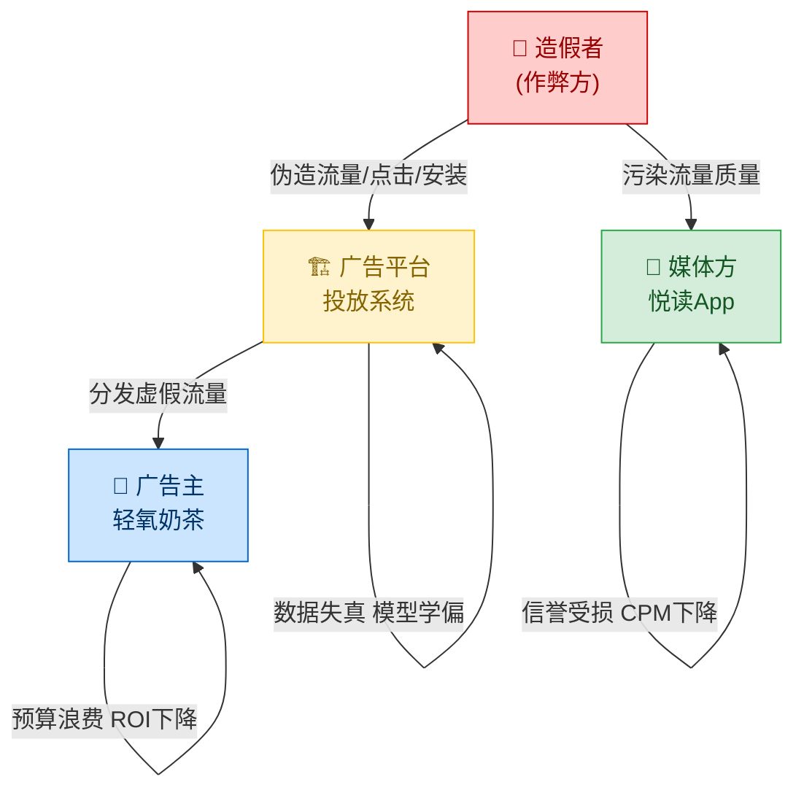
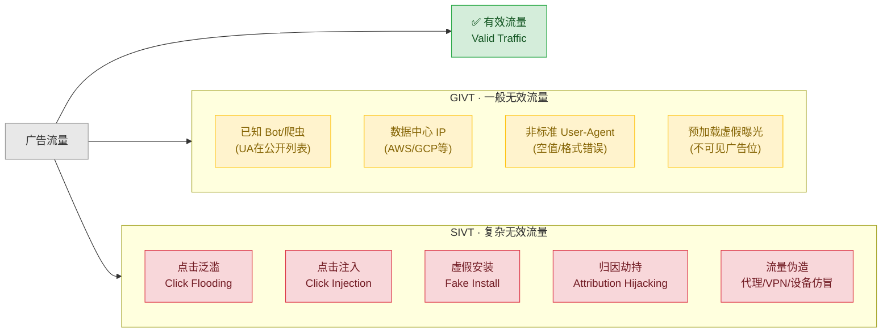
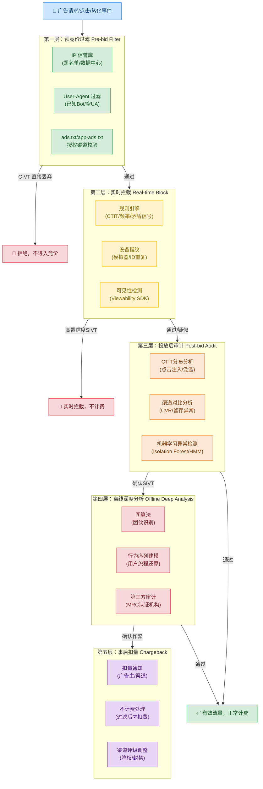
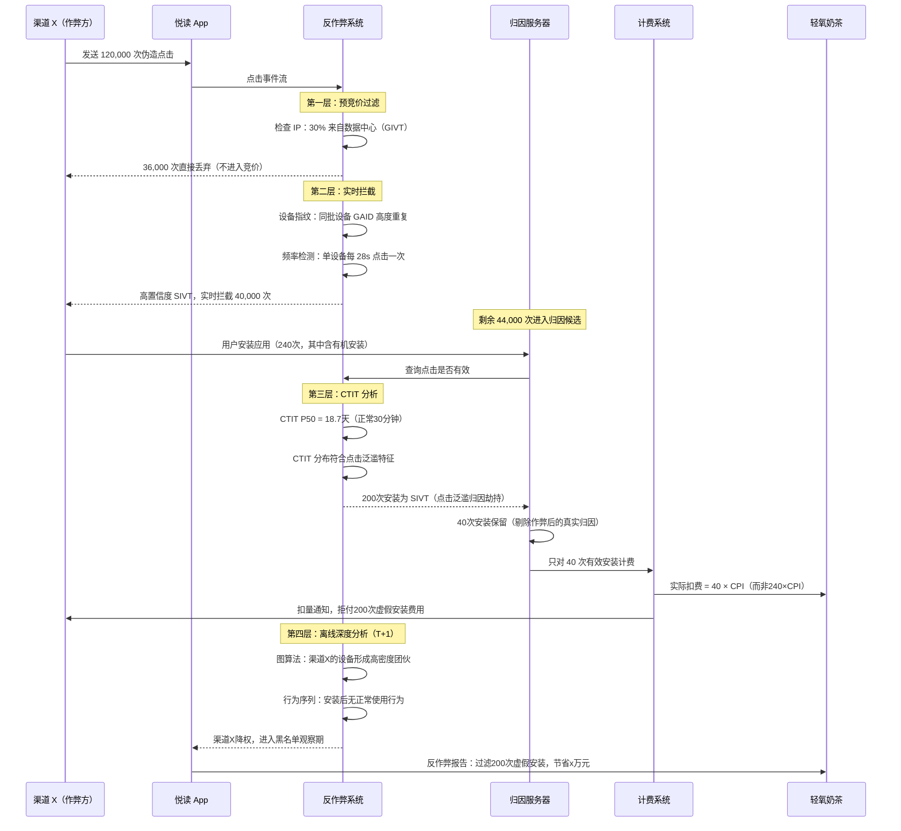

# 第12章 反作弊与流量质量

---

## 本章导读

广告欺诈（Ad Fraud）是数字广告生态中最黑暗的角落之一。行业研究机构 Juniper Research 估算，2023 年全球广告欺诈损失超过 **840 亿美元**，到 2028 年预计突破 **1720 亿美元**。这意味着每一个广告主——包括我们贯穿全书的「轻氧奶茶」——在每一次投放中，都有相当比例的预算悄悄流入了造假者的口袋，而没有触达真实的消费者。

反作弊（Anti-Fraud）不是可选的"锦上添花"功能，而是广告系统工程的**地基之一**。它贯穿整条投放链路：

- **曝光层**：识别非人类流量，过滤无效展示；
- **点击层**：识别点击伪造与点击注入，阻断虚假意图信号；
- **转化层**：识别虚假安装与归因劫持，保护广告主的 ROI；
- **计费层**：只对有效流量计费，过滤后才扣费（详见第 9 章）；
- **归因层**：归因前先做反作弊，防止归因被窃取（详见第 13 章）。

本章从**无效流量（IVT）**的定义与分类出发，逐一拆解主流作弊手法的原理，深入讲解检测技术体系，并构建**多层防御架构**。最后以「悦读 App」上的「轻氧奶茶」广告遭遇刷量为例，走完完整的识别-过滤-不计费流程。

---

## 12.1 为什么反作弊如此重要

### 12.1.1 损失规模：数字不会说谎

| 统计维度 | 数据 | 来源 |
|---|---|---|
| 全球广告欺诈年损失（2023） | ~840 亿美元 | Juniper Research |
| 移动端广告欺诈占移动广告支出比 | ~20-25% | AppsFlyer 报告 |
| 中国移动广告欺诈率（高风险媒体） | 最高可达 40%+ | IAS 区域报告 |
| 虚假安装占比（部分渠道） | 30-60% | MMP 行业统计 |

对「轻氧奶茶」而言：日预算 10 万元，若欺诈率达 20%，则每天有 **2 万元**流向了机器人而非真实用户。一个月即 60 万元打水漂，且这些"用户"永远不会进店消费。

### 12.1.2 伤害三方生态



- **广告主**：预算被浪费，ROI 虚高（大量假转化拉低转化成本假象）或虚低（真实转化被稀释），优化决策失真。
- **媒体方**：刷量虽短期增加收入，但一旦被检出，广告主撤量，平台降权，长期损失巨大；优质媒体若无法与劣质媒体区分，将陷入"柠檬市场"困境。
- **广告平台**：训练数据被污染，CTR/CVR 模型学偏（详见第 7 章），出价策略失准（详见第 10 章），生态信誉崩溃。

### 12.1.3 监管压力与合规要求

- IAB（Interactive Advertising Bureau，互动广告局）与 MRC（Media Rating Council，媒体评级委员会）制定了 IVT 标准（ads.txt、app-ads.txt、sellers.json）；
- GDPR/CCPA 等隐私法规限制了某些传统反作弊手段（如三方 Cookie 追踪）；
- 大型广告主（宝洁、联合利华等）已将第三方反作弊认证列为采购前置条件。

---

## 12.2 无效流量（IVT）的定义

**无效流量（IVT, Invalid Traffic）**：指不符合质量或完整性标准、不代表合法人类流量的任何流量，包括展示、点击、互动事件或转化。

> IAB/MRC 定义：IVT is all traffic sources that have not passed a set of quality filters applied with the intent of ensuring only valid human traffic is presented to marketers.

IVT 的对立面是**有效流量（VT, Valid Traffic）**，即来自真实人类用户、在真实设备上、真实浏览或点击的行为。

IVT 分为两大类，理解这两类的区别是构建检测体系的基础。

---

## 12.3 IVT 两大分类：GIVT vs SIVT

### 12.3.1 GIVT：一般无效流量

**GIVT（General Invalid Traffic，一般无效流量）**：可以通过常规过滤手段（规则/列表）进行识别的无效流量，无需人工干预即可处理。

特征：
- 来自**已知 Bot 和爬虫**（搜索引擎爬虫、监控机器人等），User-Agent 在公开列表中可查；
- 来自**数据中心 IP**（AWS/GCP/Azure 等云服务 IP 段），真实用户几乎不从数据中心发起广告请求；
- **非标准 User-Agent**：格式错误、空值、已知测试字符串；
- 预过滤（Pre-bid）阶段即可识别，不进入竞价。

### 12.3.2 SIVT：复杂无效流量

**SIVT（Sophisticated Invalid Traffic，复杂无效流量）**：需要高级分析、多维度数据交叉印证、甚至人工干预才能识别的无效流量。

特征：
- 故意伪装成正常流量，规避规则过滤；
- 需要**多点确证（Multi-Point Corroboration）**——单一维度判定不足；
- 可能混杂在有效流量中（同一设备有真实流量也有伪造流量）；
- 包括点击泛滥、点击注入、虚假安装、归因劫持等复杂手法。

### 12.3.3 GIVT vs SIVT 对比表

| 维度 | GIVT（一般无效流量） | SIVT（复杂无效流量） |
|---|---|---|
| **识别难度** | 低，规则/列表即可 | 高，需高级分析+多维印证 |
| **检测时机** | 预过滤（Pre-bid）/ 实时 | 实时+事后离线 |
| **典型来源** | 已知 Bot、数据中心 IP、爬虫 | 点击农场、SDK 伪造、点击注入 |
| **伪装程度** | 不伪装（UA 在公开列表） | 高度伪装，模拟真实设备行为 |
| **混合真实流量** | 否（来源明确） | 是（难以区分） |
| **处理方式** | 自动规则过滤 | 统计模型+人工审核+第三方 |
| **IAB 示例** | Spider/Bot、数据中心 IP | 点击泛滥、归因劫持、设备仿冒 |
| **计费处理** | 不计费（直接过滤） | 事后审计扣量（Chargeback） |
| **MRC 要求** | 必须过滤 | 尽力过滤+披露 |



---

## 12.4 IVT 检测的判断维度

有效流量判定不依赖单一维度，而是**多维度综合评分**。以下逐项分析：

### 12.4.1 维度一：用户行为异常

真实用户的行为具有随机性、个体差异性和疲劳性；机器行为则暴露出以下特征：

**重复单调操作（Repetitive Monotonous Actions）**

- 正常用户：浏览内容有选择性，点击率因内容而异，行为多样。
- 作弊机器：固定脚本驱动，每次操作高度相似——相同的点击位置、相同的停留时长、相同的操作序列。
- 检测：会话内操作序列的熵值（Entropy）过低；事件间隔方差（Variance）趋近于零。

**异常快速点击（Abnormally Fast Clicks）**

- 正常用户：看到广告 → 决策 → 点击，人类反应时间通常 200ms~2s。
- 作弊机器：脚本触发，延迟可低至 0~50ms，完全超出人类反应极限。

**精确固定间隔点击（Precisely Fixed-Interval Clicks）**

- 正常用户：点击间隔服从非均匀分布，受内容、情绪、注意力影响。
- 作弊机器：定时器触发，间隔高度规律（如每 30 秒精确一次），统计上可用 Kolmogorov-Smirnov 检验与均匀分布的相似度。

**指标示例（悦读 App 场景）**：

```
设备 A：每 28.3秒 精确点击一次「轻氧奶茶」广告
连续 4 小时，共 512 次点击
点击间隔标准差：0.02秒（人类正常：5~30秒，标准差数秒量级）
判定：SIVT（固定间隔点击机器人）
```

### 12.4.2 维度二：基础信息缺失或矛盾

**User-Agent 异常**：

- 空 UA、格式错误 UA → GIVT，直接过滤；
- 伪造 UA（设备型号与 OS 版本组合市场上不存在）→ 疑似 SIVT；
- UA 声称的设备型号与上报的屏幕分辨率不匹配 → 矛盾信号。

**IP 地址异常**：

- IP 属于已知数据中心段（AWS/GCP/Azure/阿里云 ECS）→ GIVT；
- IP 在短时间内频繁切换（代理/VPN 切换）→ SIVT 嫌疑；
- IP 地域与声称的语言/时区不符 → 矛盾信号。

**设备信息矛盾**：

- 操作系统版本与设备型号不兼容（如 iPhone 6 运行 iOS 17）；
- 设备 ID（IDFA/GAID）与其他设备属性不稳定匹配；
- 时区信息与 IP 归属地不一致。

### 12.4.3 维度三：不符合可见性标准

**广告可见性（Ad Viewability）**：MRC 标准要求展示广告至少 50% 像素在屏幕内持续 1 秒（视频广告 2 秒），才算一次有效曝光。

**预加载触发虚假曝光（Pre-fetch Ad Fraud）**：

- 作弊媒体在页面不可见区域加载广告，触发展示计数但用户从未真正看到；
- 广告位叠层（Ad Stacking）：多个广告叠放在同一位置，只有最上层可见，但所有层都触发展示；
- 1x1 像素广告：广告以极小像素展示，用户不可能真实看到。

**检测**：依赖在广告创意中嵌入可见性检测脚本（如 MRC 认证的第三方 SDK），上报真实渲染位置和时长。

### 12.4.4 维度四：混合来源的甄别难点

最棘手的 SIVT 场景：**同一设备同时产生真实流量和伪造流量**。

- 例：被感染的真实用户手机，在用户使用时产生真实行为，在用户不使用时（夜间）由后台恶意 SDK 批量发送伪造事件；
- 此时设备指纹（Device Fingerprint）显示的是真实设备信息，IP 也是真实用户 IP；
- 区分方法：**时间切片分析**——夜间2-5点该设备的高频行为vs白天正常行为，结合会话完整性（是否有正常的浏览上下文）。

---

## 12.5 主要作弊手法原理详解

### 12.5.1 点击泛滥（Click Flooding）

**别名**：大点击（Mass Click）、点击垃圾邮件（Click Spam）

**原理**：

造假者控制大量设备（或代理IP池），对目标广告发送海量伪造点击请求。核心逻辑：

$$P(\text{归因}) = P(\text{用户真实安装}) \times P(\text{作弊点击在归因窗口内})$$

在 Last-Click 归因模型下（详见第 13 章），只要作弊点击恰好出现在用户**有机安装**（Organic Install）之前的归因窗口内（通常 7-30 天），该安装就会被错误归因给作弊渠道。

**数学模型**：

设一天内某应用的有机安装量为 $N_{organic}$，归因窗口为 $T$ 天，作弊方每天发送 $C_{fake}$ 次点击，则：

$$P(\text{劫持一次安装}) \approx \frac{C_{fake} \times T}{DAU \times T} = \frac{C_{fake}}{DAU}$$

当 $C_{fake}$ 足够大时（点击泛滥），劫持概率显著提升，成本却极低（一次伪造点击的成本接近零）。

**特征（便于检测）**：

- **CTIT（Click-To-Install-Time，点击到安装时间）异常长**：真实用户点击后通常在数分钟到数小时内安装（中位数 20-60 分钟）；点击泛滥的"命中"多数是有机安装被撞上，CTIT 可能长达数天甚至接近归因窗口上限；
- 点击量与安装量比值（CVR，Click-to-Install Rate）异常低，远低于正常水平（正常 1%-5%，作弊可低至 0.001%）；
- 点击 IP 分布高度集中，或来自数据中心段。

**场景示例**：

「轻氧奶茶」在悦读 App 上投放，某渠道 A 单日上报 50 万次点击，带来 200 次激活，CVR 0.04%，远低于同类渠道 2%。且 80% 的激活 CTIT 超过 5 天。典型的点击泛滥特征。

### 12.5.2 点击注入（Click Injection）

**别名**：小点击（Hijacking Click）、安装广播劫持

**原理（仅限 Android）**：

Android 系统在应用安装完成后会广播一条 `PACKAGE_ADDED` 或 `INSTALL_REFERRER` 事件。恶意 SDK 若预先被安装在用户设备上，可以**监听此广播**，在收到广播的瞬间（应用刚安装、用户尚未打开）立即向归因服务器上报一次点击，从而在 Last-Click 归因中抢走该安装的归因权。

```
用户流程：
  浏览「轻氧奶茶」真实广告 → 前往应用商店 → 下载安装「悦读App」
                                                           ↓
恶意 SDK 流程：                             监听 PACKAGE_ADDED 广播
                                            ↓
                                 立即上报伪造点击（时间戳篡改至1分钟前）
                                            ↓
                                 归因服务器：最后一次点击 = 作弊渠道
                                            ↓
                                 「轻氧奶茶」付费给作弊方
```

**特征**：

- **CTIT 异常短**：合法点击发生在安装完成之前，需要用户完成下载过程（数十秒到数分钟）；注入点击的 CTIT 极短，可短至 0-5 秒（广播延迟）；
- 点击时间与安装时间戳几乎同时（毫秒级差异）；
- iOS 系统无此类广播机制，因此点击注入几乎只发生在 Android。

**与点击泛滥的 CTIT 分布对比**：

$$\text{正常用户 CTIT}: \mu \approx 30\text{min}, \sigma \approx 60\text{min}$$

$$\text{点击注入 CTIT}: \text{集中在} 0 \sim 10\text{s}$$

$$\text{点击泛滥 CTIT}: \text{均匀分布在} 1 \sim 30\text{days}$$

### 12.5.3 虚假安装（Fake Install）与 SDK 伪造

**原理**：

造假者不依赖真实用户，而是用机器人（Bot）**模拟完整链路**：

```
伪造点击 → 伪造安装 → 伪造 SDK 初始化 → 伪造应用内事件（注册/加购/支付）
```

这类作弊最难识别，因为整个链路在数据上看起来完整——有点击、有安装、有打开事件、甚至有应用内行为。

**技术实现**：

- 使用真实设备（点击农场，Click Farm，真人用低薪操作手机）；
- 使用模拟器农场（Emulator Farm）批量运行虚拟设备；
- 使用设备农场 + Root 权限修改设备 ID（GAID 重置），循环使用；
- 劫持真实 SDK 的 HTTPS 请求，重放或批量修改参数发送。

**特征**：

- 设备 ID 在短时间内重复出现（同一 GAID 多次"安装"同一应用）；
- 应用内行为序列异常（如注册到支付间隔仅 10 秒）；
- 设备硬件信息（传感器数据、GPU 渲染特征）与声称的型号不匹配；
- 地理位置与目标用户群体不符（如声称北京用户但时区是东南亚）。

### 12.5.4 归因劫持（Attribution Hijacking）

**原理**：

区别于点击注入（伪造点击），归因劫持更广义地指**窃取真实用户的归因权**。包括：

- **Domain Spoofing（域名欺诈）**：低质媒体在广告请求中伪造高质量媒体的域名，骗取高 CPM；
- **Ad Injection（广告注入）**：恶意软件将广告注入到其他网站/App 的页面中，显示在合法广告位上；
- **Cookie Stuffing（Cookie 填充）**：在用户不知情的情况下，将多个广告主的 Cookie 写入用户浏览器，使后续有机转化被归因给伪造的点击渠道。

### 12.5.5 流量伪造（Traffic Spoofing）

**原理**：

通过技术手段篡改流量的来源信息，使其看起来符合广告主的定向条件：

- **IP 欺诈**：使用代理/VPN/Tor 隐藏真实 IP，伪装为目标地域用户（如「轻氧奶茶」定向上海，作弊方用上海代理 IP 发请求）；
- **设备 ID 伪造**：Root 设备后重置 IDFA/GAID，或使用模拟器生成大量假设备 ID；
- **地理围栏绕过**：通过 GPS 欺诈（GPS Spoofing）伪造设备地理位置。

---

## 12.6 检测技术体系

### 12.6.1 规则引擎（Rule Engine）

**定位**：第一道防线，处理 GIVT 和已知 SIVT 模式，延迟要求极低（<1ms）。

**核心规则类型**：

| 规则类型 | 示例规则 | 处理结果 |
|---|---|---|
| IP 黑名单 | IP 在数据中心 ASN 列表中 | 直接过滤（GIVT） |
| UA 黑名单 | UA 匹配已知爬虫库（如 user-agents.net）| 直接过滤（GIVT） |
| 速率限制 | 单 IP 每秒点击数 > 10 | 标记可疑 |
| CTIT 阈值 | CTIT < 2s 或 > 25 天 | 标记 SIVT |
| CVR 阈值 | 渠道 CVR < 0.01% | 触发人工审核 |
| 设备 ID 重复 | 同 GAID 24h 内出现 > 5 次安装 | 标记 SIVT |
| 时间段异常 | 单设备 02:00-04:00 高频点击 | 触发行为分析 |

```python
# 规则引擎示例：广告点击反作弊规则
import re
from datetime import datetime
from dataclasses import dataclass, field
from typing import Dict, List, Optional
from enum import Enum

class IVTType(Enum):
    VALID = "valid"
    GIVT = "givt"           # 一般无效流量
    SIVT_SUSPECTED = "sivt_suspected"  # 疑似复杂无效流量
    SIVT_CONFIRMED = "sivt_confirmed"  # 确认复杂无效流量

@dataclass
class ClickEvent:
    """一次点击事件的数据结构"""
    click_id: str
    device_id: str          # GAID/IDFA
    ip: str
    user_agent: str
    timestamp: float        # Unix 时间戳（秒）
    campaign_id: str
    creative_id: str
    lat: Optional[float]    # 纬度
    lon: Optional[float]    # 经度
    timezone_offset: int    # 设备时区偏移（分钟）

@dataclass
class RuleResult:
    """单条规则的执行结果"""
    rule_name: str
    hit: bool
    ivt_type: IVTType
    reason: str
    confidence: float       # 置信度 0~1

# ============================================================
# GIVT 规则：可直接过滤的已知无效流量
# ============================================================

# 已知数据中心 ASN 前缀（真实场景通过 MaxMind 或 IPinfo 查询）
DATACENTER_IP_PREFIXES = [
    "52.0.",    # AWS us-east-1 示例前缀
    "35.186.",  # GCP 示例前缀
    "40.76.",   # Azure 示例前缀
    "47.95.",   # 阿里云 ECS 示例前缀
]

# 已知爬虫/机器人 User-Agent 关键词
KNOWN_BOT_UA_PATTERNS = [
    r"Googlebot",
    r"Bingbot",
    r"Slurp",          # Yahoo Spider
    r"DuckDuckBot",
    r"Baiduspider",
    r"YandexBot",
    r"facebookexternalhit",
    r"Twitterbot",
    r"AhrefsBot",
    r"SemrushBot",
    r"python-requests",
    r"Java/\d+\.\d+",  # Java HTTP 客户端
    r"curl/\d+",
    r"wget/\d+",
    r"libwww-perl",
]

BOT_UA_REGEX = re.compile("|".join(KNOWN_BOT_UA_PATTERNS), re.IGNORECASE)


def check_givt_datacenter_ip(event: ClickEvent) -> RuleResult:
    """
    GIVT 规则1：检查 IP 是否属于已知数据中心
    真实场景应使用 IP 信誉数据库（MaxMind GeoIP2, IPinfo等）
    """
    for prefix in DATACENTER_IP_PREFIXES:
        if event.ip.startswith(prefix):
            return RuleResult(
                rule_name="GIVT_DATACENTER_IP",
                hit=True,
                ivt_type=IVTType.GIVT,
                reason=f"IP {event.ip} belongs to known datacenter prefix {prefix}",
                confidence=0.95
            )
    return RuleResult("GIVT_DATACENTER_IP", False, IVTType.VALID, "", 0.0)


def check_givt_bot_ua(event: ClickEvent) -> RuleResult:
    """
    GIVT 规则2：检查 User-Agent 是否为已知机器人
    空 UA 或格式不合法的 UA 也按 GIVT 处理
    """
    # 空 UA 直接判定 GIVT
    if not event.user_agent or len(event.user_agent.strip()) == 0:
        return RuleResult(
            rule_name="GIVT_EMPTY_UA",
            hit=True,
            ivt_type=IVTType.GIVT,
            reason="Empty or blank User-Agent",
            confidence=0.99
        )

    # 匹配已知爬虫模式
    if BOT_UA_REGEX.search(event.user_agent):
        return RuleResult(
            rule_name="GIVT_KNOWN_BOT_UA",
            hit=True,
            ivt_type=IVTType.GIVT,
            reason=f"UA matches known bot pattern: {event.user_agent[:80]}",
            confidence=0.98
        )

    return RuleResult("GIVT_BOT_UA", False, IVTType.VALID, "", 0.0)


# ============================================================
# SIVT 规则：需要综合判断的复杂无效流量
# ============================================================

def check_sivt_click_rate(
    event: ClickEvent,
    device_click_history: List[float]  # 该设备过去 24h 的点击时间戳列表
) -> RuleResult:
    """
    SIVT 规则1：单设备点击频率异常
    正常用户点击广告的频率极低（一天最多数次）
    机器人可能每分钟点击数十次
    """
    # 统计过去1小时内的点击次数
    now = event.timestamp
    one_hour_ago = now - 3600
    clicks_last_hour = [t for t in device_click_history if t >= one_hour_ago]

    CLICK_THRESHOLD_PER_HOUR = 20  # 超过此阈值视为异常

    if len(clicks_last_hour) > CLICK_THRESHOLD_PER_HOUR:
        return RuleResult(
            rule_name="SIVT_HIGH_CLICK_RATE",
            hit=True,
            ivt_type=IVTType.SIVT_SUSPECTED,
            reason=(
                f"Device {event.device_id} clicked {len(clicks_last_hour)} times "
                f"in last hour, threshold={CLICK_THRESHOLD_PER_HOUR}"
            ),
            confidence=0.85
        )
    return RuleResult("SIVT_HIGH_CLICK_RATE", False, IVTType.VALID, "", 0.0)


def check_sivt_timezone_ip_mismatch(event: ClickEvent) -> RuleResult:
    """
    SIVT 规则2：设备时区与 IP 归属地时区不匹配
    使用 VPN/代理时常见此矛盾
    真实场景需要 IP->时区 数据库（如 MaxMind）
    """
    # 简化示例：用 IP 前缀推断时区（真实场景用 GeoIP）
    ip_timezone_map = {
        "120.": 480,    # 中国时区 UTC+8 → 480分钟
        "203.": 480,    # 亚太
        "52.0.": -300,  # 美东 UTC-5 → -300分钟
    }

    expected_tz = None
    for prefix, tz in ip_timezone_map.items():
        if event.ip.startswith(prefix):
            expected_tz = tz
            break

    if expected_tz is not None:
        # 允许±60分钟误差（夏令时等因素）
        if abs(event.timezone_offset - expected_tz) > 60:
            return RuleResult(
                rule_name="SIVT_TZ_IP_MISMATCH",
                hit=True,
                ivt_type=IVTType.SIVT_SUSPECTED,
                reason=(
                    f"Device timezone {event.timezone_offset}min "
                    f"doesn't match IP-inferred timezone {expected_tz}min"
                ),
                confidence=0.70
            )
    return RuleResult("SIVT_TZ_IP_MISMATCH", False, IVTType.VALID, "", 0.0)


# ============================================================
# 规则引擎主逻辑：聚合多条规则结果
# ============================================================

class AntifraudRuleEngine:
    """
    广告点击反作弊规则引擎
    采用加权投票：多条规则命中，置信度累加，超阈值则判定
    """

    def __init__(self, sivt_confidence_threshold: float = 0.8):
        self.sivt_threshold = sivt_confidence_threshold

    def evaluate(
        self,
        event: ClickEvent,
        device_click_history: List[float]
    ) -> Dict:
        """
        对一次点击事件运行所有规则，返回最终判定
        """
        results = []

        # === GIVT 规则（命中即直接返回，无需加权）===
        givt_rules = [
            check_givt_datacenter_ip(event),
            check_givt_bot_ua(event),
        ]
        for r in givt_rules:
            if r.hit:
                return {
                    "click_id": event.click_id,
                    "ivt_type": IVTType.GIVT.value,
                    "triggered_rule": r.rule_name,
                    "reason": r.reason,
                    "action": "BLOCK",        # GIVT 直接拦截，不计费
                    "confidence": r.confidence,
                }

        # === SIVT 规则（加权累积）===
        sivt_rules = [
            check_sivt_click_rate(event, device_click_history),
            check_sivt_timezone_ip_mismatch(event),
        ]

        triggered_sivt = [r for r in sivt_rules if r.hit]
        total_sivt_confidence = sum(r.confidence for r in triggered_sivt)

        if triggered_sivt:
            if total_sivt_confidence >= self.sivt_threshold:
                final_type = IVTType.SIVT_CONFIRMED
                action = "BLOCK"   # 高置信度：直接拦截
            else:
                final_type = IVTType.SIVT_SUSPECTED
                action = "FLAG"    # 低置信度：标记，送离线审计

            return {
                "click_id": event.click_id,
                "ivt_type": final_type.value,
                "triggered_rules": [r.rule_name for r in triggered_sivt],
                "reasons": [r.reason for r in triggered_sivt],
                "action": action,
                "confidence": min(total_sivt_confidence, 1.0),
            }

        # 所有规则均未命中，判定为有效流量
        return {
            "click_id": event.click_id,
            "ivt_type": IVTType.VALID.value,
            "action": "ALLOW",
            "confidence": 1.0,
        }


# ============================================================
# 使用示例
# ============================================================
if __name__ == "__main__":
    engine = AntifraudRuleEngine(sivt_confidence_threshold=0.8)

    # 测试案例1：数据中心 IP（GIVT）
    event1 = ClickEvent(
        click_id="clk_001", device_id="gaid_abc123",
        ip="52.0.114.1",          # AWS IP
        user_agent="Mozilla/5.0 (iPhone; CPU iPhone OS 16_0)",
        timestamp=1700000000.0,
        campaign_id="camp_qingyang", creative_id="crt_001",
        lat=31.23, lon=121.47, timezone_offset=480
    )

    # 测试案例2：高频点击（SIVT）
    event2 = ClickEvent(
        click_id="clk_002", device_id="gaid_bot456",
        ip="120.55.66.77",
        user_agent="Mozilla/5.0 (Linux; Android 12; Pixel 6)",
        timestamp=1700003600.0,
        campaign_id="camp_qingyang", creative_id="crt_001",
        lat=31.23, lon=121.47, timezone_offset=480
    )
    # 模拟该设备过去1小时点击了50次
    history2 = [1700003600.0 - i * 72 for i in range(50)]  # 每72秒一次

    result1 = engine.evaluate(event1, [])
    result2 = engine.evaluate(event2, history2)

    print("=== 案例1（数据中心IP）===")
    print(result1)
    print("\n=== 案例2（高频点击）===")
    print(result2)
```

### 12.6.2 设备指纹（Device Fingerprint）

设备指纹是通过收集**多个设备属性**计算出的唯一标识符，即使设备 ID 被重置也能保持稳定。

**指纹维度**（信号越多，准确率越高）：

| 维度 | 信号示例 | 作用 |
|---|---|---|
| 硬件特征 | CPU核数、RAM大小、GPU型号 | 区分真实设备与模拟器 |
| 软件特征 | OS版本、语言设置、字体列表 | 检测异常配置 |
| 传感器特征 | 陀螺仪噪声模式、加速度计特征 | 模拟器无真实传感器 |
| 网络特征 | IP、运营商、MCC/MNC | 检测代理/VPN |
| 行为特征 | 触摸压力分布、滑动速度曲线 | 区分人机操作 |
| 时间特征 | 时区、NTP误差、设备开机时长 | 检测时间篡改 |

**指纹稳定性**：计算指纹向量 $\mathbf{v} = [f_1, f_2, ..., f_n]$，设备相似度：

$$\text{similarity}(\mathbf{v}_1, \mathbf{v}_2) = \frac{\mathbf{v}_1 \cdot \mathbf{v}_2}{|\mathbf{v}_1| \cdot |\mathbf{v}_2|}$$

余弦相似度超过阈值（如 0.9）视为同一设备，即使 GAID 已重置。

**模拟器检测**：

- 真实设备传感器数据有随机噪声；模拟器传感器返回固定值或全零；
- GPU 渲染特征（WebGL 指纹）因硬件不同而唯一；模拟器 GPU 渲染结果可能相同；
- 真实设备有可信执行环境（TEE）签名；模拟器无法伪造。

### 12.6.3 IP 信誉库（IP Reputation Database）

维度：

- **ASN 类型**：ISP（Internet Service Provider，互联网服务提供商）=正常 vs 数据中心=可疑；
- **历史行为**：该 IP 过去是否产生过大量无效流量（黑名单评分）；
- **代理/VPN 检测**：通过 TCP/IP 指纹、DNS 泄露、BGP 路由特征识别；
- **IP 轮换频率**：短时间内同一设备 ID 来自多个不同 IP，说明在切换代理。

主流供应商：MaxMind GeoIP2、IPinfo、IPQS（IP Quality Score）、DigitalEnvoy。

### 12.6.4 CTIT 分布分析

CTIT（Click-To-Install-Time，点击到安装时间）是移动端反作弊的**核心指标**。

**正常分布**：

真实用户点击广告后的安装时间遵循**对数正态分布（Log-Normal Distribution）**：

$$\ln(\text{CTIT}) \sim \mathcal{N}(\mu, \sigma^2)$$

其中 $\mu \approx \ln(1800)$（约 30 分钟），$\sigma \approx 1.5$（对应 P5=3min, P95=12h）。

**异常分布**：

- **点击注入**：CTIT 集中在 0~10 秒（超短），因为点击在安装广播时注入；
- **点击泛滥**：CTIT 均匀分布在归因窗口全程（超长尾），因为是海量随机点击撞上有机安装。

```python
# CTIT 异常检测：识别点击注入和点击泛滥
import numpy as np
from scipy import stats
from typing import List, Tuple
import math

def detect_ctit_anomaly(
    ctit_seconds_list: List[float],
    sample_size_threshold: int = 30,
) -> dict:
    """
    检测一批点击的 CTIT（点击到安装时间）分布是否异常。

    判断逻辑：
    1. CTIT < 10s 的比例 > 20% → 疑似点击注入（Click Injection）
    2. CTIT > 7天(604800s) 的比例 > 30% → 疑似点击泛滥（Click Flooding）
    3. 对 log(CTIT) 做 KS 检验，与正常对数正态分布做对比

    参数：
        ctit_seconds_list: 一批点击的 CTIT 值列表（秒）
        sample_size_threshold: 最小样本量，低于此值不做检验

    返回：
        包含异常类型、置信度、统计信息的字典
    """
    if len(ctit_seconds_list) < sample_size_threshold:
        return {
            "status": "insufficient_data",
            "sample_size": len(ctit_seconds_list),
            "anomaly_type": None,
        }

    ctit_arr = np.array(ctit_seconds_list, dtype=float)

    # 过滤非法值（<=0 的 CTIT 在现实中表示时钟不同步或注入）
    invalid_mask = ctit_arr <= 0
    if invalid_mask.sum() > 0:
        # 小于等于0的CTIT本身就是强异常信号
        pass

    total = len(ctit_arr)

    # ---- 阈值检测 ----
    # 超短 CTIT（点击注入特征）
    injection_threshold_s = 10     # 10秒
    injection_ratio = (ctit_arr < injection_threshold_s).sum() / total

    # 超长 CTIT（点击泛滥特征）
    flooding_threshold_s = 7 * 24 * 3600   # 7天
    flooding_ratio = (ctit_arr > flooding_threshold_s).sum() / total

    # ---- KS 检验：对 log(CTIT) 与正常对数正态分布进行比较 ----
    # 正常 CTIT 的 log 均值约为 ln(1800)≈7.5（30分钟），标准差约1.5
    NORMAL_LOG_MU = math.log(1800)   # 约 7.496
    NORMAL_LOG_SIGMA = 1.5

    # 只对正常范围内的样本做 KS 检验（排除极端异常值影响统计检验）
    valid_mask = (ctit_arr > 0) & (ctit_arr < 30 * 24 * 3600)
    valid_ctit = ctit_arr[valid_mask]

    ks_stat, ks_pvalue = None, None
    if len(valid_ctit) >= 10:
        log_ctit = np.log(valid_ctit)
        # KS 检验：H0 = log(CTIT) 符合正态分布 N(mu, sigma^2)
        # 注意：stats.kstest 需要将数据标准化
        log_ctit_normalized = (log_ctit - NORMAL_LOG_MU) / NORMAL_LOG_SIGMA
        ks_stat, ks_pvalue = stats.kstest(log_ctit_normalized, 'norm')

    # ---- 综合判定 ----
    anomaly_type = None
    confidence = 0.0
    details = []

    INJECTION_RATIO_THRESHOLD = 0.20   # 超短 CTIT 占比 > 20%
    FLOODING_RATIO_THRESHOLD = 0.30    # 超长 CTIT 占比 > 30%
    KS_PVALUE_THRESHOLD = 0.05         # KS 检验 p-value < 0.05 → 拒绝正态假设

    if injection_ratio > INJECTION_RATIO_THRESHOLD:
        anomaly_type = "click_injection"
        confidence = min(injection_ratio / INJECTION_RATIO_THRESHOLD, 1.0) * 0.9
        details.append(
            f"Short CTIT ratio={injection_ratio:.1%} "
            f"(>{INJECTION_RATIO_THRESHOLD:.0%} threshold)"
        )

    if flooding_ratio > FLOODING_RATIO_THRESHOLD:
        # 如果同时出现两种异常，取置信度较高的
        flood_confidence = min(flooding_ratio / FLOODING_RATIO_THRESHOLD, 1.0) * 0.85
        if flood_confidence > confidence:
            anomaly_type = "click_flooding"
            confidence = flood_confidence
        details.append(
            f"Long CTIT ratio={flooding_ratio:.1%} "
            f"(>{FLOODING_RATIO_THRESHOLD:.0%} threshold)"
        )

    if ks_pvalue is not None and ks_pvalue < KS_PVALUE_THRESHOLD:
        ks_confidence = (1 - ks_pvalue) * 0.6   # KS检验作为辅助信号，权重较低
        if anomaly_type is None:
            anomaly_type = "distribution_anomaly"
            confidence = ks_confidence
        else:
            confidence = min(confidence + ks_confidence * 0.3, 1.0)  # 增强既有信号
        details.append(
            f"KS-test rejects normal distribution: "
            f"stat={ks_stat:.4f}, p={ks_pvalue:.4f}"
        )

    return {
        "status": "analyzed",
        "sample_size": total,
        "anomaly_type": anomaly_type,
        "confidence": round(confidence, 3),
        "metrics": {
            "injection_ratio": round(injection_ratio, 4),
            "flooding_ratio": round(flooding_ratio, 4),
            "ks_stat": round(ks_stat, 4) if ks_stat else None,
            "ks_pvalue": round(ks_pvalue, 4) if ks_pvalue else None,
            "ctit_p5_seconds": round(float(np.percentile(ctit_arr, 5)), 1),
            "ctit_p50_seconds": round(float(np.percentile(ctit_arr, 50)), 1),
            "ctit_p95_seconds": round(float(np.percentile(ctit_arr, 95)), 1),
        },
        "details": details,
        "recommendation": "BLOCK" if confidence > 0.8 else (
            "FLAG_FOR_REVIEW" if anomaly_type else "ALLOW"
        ),
    }


# ============================================================
# 频率异常检测：检测固定间隔点击（机器人特征）
# ============================================================

def detect_interval_anomaly(
    click_timestamps: List[float],
    min_samples: int = 20,
) -> dict:
    """
    检测点击时间间隔是否呈现机器人特征（固定间隔）。

    机器人特征：间隔高度规律，标准差极小，接近均匀分布。
    真实用户特征：间隔随机，服从重尾分布，标准差大。

    方法：
    1. 计算相邻点击间隔的统计特征（均值、标准差、变异系数 CV）
    2. CV（Coefficient of Variation，变异系数）= std/mean
       - 真实用户 CV 通常 > 0.5（高度随机）
       - 机器人 CV < 0.05（极度规律）
    3. 对间隔序列做均匀分布检验

    参数：
        click_timestamps: 有序的点击时间戳列表（秒）
        min_samples: 最少样本数

    返回：
        包含检测结果的字典
    """
    if len(click_timestamps) < min_samples:
        return {"status": "insufficient_data", "anomaly_detected": False}

    ts = np.array(sorted(click_timestamps))
    intervals = np.diff(ts)   # 相邻时间戳的差值（间隔）

    if len(intervals) == 0:
        return {"status": "insufficient_data", "anomaly_detected": False}

    mean_interval = np.mean(intervals)
    std_interval = np.std(intervals)

    # 变异系数（Coefficient of Variation）
    # CV 极小 → 间隔高度规律 → 机器人特征
    cv = std_interval / mean_interval if mean_interval > 0 else 0

    # 对间隔做 KS 均匀分布检验
    # H0：间隔服从均匀分布（机器人定时器行为）
    # 若 p > 0.05，不能拒绝 H0，说明间隔可能是均匀的（机器人特征）
    # 注：机器人更可能是精确固定间隔而非均匀随机，这里用均匀分布近似检验规律性
    interval_min, interval_max = intervals.min(), intervals.max()
    if interval_max > interval_min:
        intervals_normalized = (intervals - interval_min) / (interval_max - interval_min)
        ks_stat_unif, ks_pvalue_unif = stats.kstest(intervals_normalized, 'uniform')
    else:
        # 所有间隔完全相同（完美机器人）
        ks_stat_unif, ks_pvalue_unif = 1.0, 0.0

    # 综合判定
    # CV < 0.1 且（KS 不拒绝均匀分布 或 所有间隔极度相似）
    CV_THRESHOLD = 0.1   # 变异系数阈值
    is_fixed_interval = cv < CV_THRESHOLD

    # 检测完美固定间隔（std 极小）
    is_perfect_robot = std_interval < 1.0  # 标准差 < 1秒

    anomaly_detected = is_fixed_interval or is_perfect_robot
    confidence = 0.0

    if is_perfect_robot:
        confidence = 0.95
        anomaly_subtype = "perfect_fixed_interval"
    elif is_fixed_interval:
        # CV 越小，置信度越高
        confidence = min((CV_THRESHOLD - cv) / CV_THRESHOLD, 1.0) * 0.9
        anomaly_subtype = "near_fixed_interval"
    else:
        anomaly_subtype = None

    return {
        "status": "analyzed",
        "sample_size": len(click_timestamps),
        "anomaly_detected": anomaly_detected,
        "anomaly_subtype": anomaly_subtype,
        "confidence": round(confidence, 3),
        "metrics": {
            "mean_interval_seconds": round(float(mean_interval), 2),
            "std_interval_seconds": round(float(std_interval), 2),
            "cv": round(float(cv), 4),
            "ks_stat_uniform": round(float(ks_stat_unif), 4),
            "ks_pvalue_uniform": round(float(ks_pvalue_unif), 4),
            "min_interval_seconds": round(float(interval_min), 2),
            "max_interval_seconds": round(float(interval_max), 2),
        },
        "recommendation": "BLOCK" if confidence > 0.8 else (
            "FLAG_FOR_REVIEW" if anomaly_detected else "ALLOW"
        ),
    }


# ============================================================
# 使用示例
# ============================================================
if __name__ == "__main__":
    # 场景：悦读App上轻氧奶茶广告遭遇刷量
    # 某批设备固定间隔点击，且存在CTIT异常

    print("=" * 60)
    print("=== 场景1：点击注入检测（CTIT 异常短）===")
    # 正常CTIT混入大量超短CTIT（模拟点击注入）
    ctit_injection = (
        [3.2, 1.8, 5.1, 0.5, 2.3, 4.0, 8.7, 1.2] +   # 注入点击（<10s）
        [1800, 3600, 7200, 3000, 900, 1500, 4500]      # 正常点击
    ) * 5  # 放大样本量
    result = detect_ctit_anomaly(ctit_injection)
    print(f"异常类型: {result['anomaly_type']}")
    print(f"置信度: {result['confidence']}")
    print(f"超短CTIT比例: {result['metrics']['injection_ratio']:.1%}")
    print(f"建议: {result['recommendation']}")

    print("\n=== 场景2：点击泛滥检测（CTIT 异常长）===")
    # 大量CTIT接近归因窗口上限
    import random
    random.seed(42)
    ctit_flooding = (
        [random.uniform(5 * 86400, 30 * 86400) for _ in range(40)] +  # 泛滥点击
        [1800, 3600, 7200, 3000, 900]                                   # 正常点击
    )
    result2 = detect_ctit_anomaly(ctit_flooding)
    print(f"异常类型: {result2['anomaly_type']}")
    print(f"置信度: {result2['confidence']}")
    print(f"超长CTIT比例: {result2['metrics']['flooding_ratio']:.1%}")
    print(f"建议: {result2['recommendation']}")

    print("\n=== 场景3：固定间隔点击检测（机器人行为）===")
    # 模拟悦读App上的刷量：某设备每28.3秒精确点击一次
    base_ts = 1700000000.0
    robot_clicks = [base_ts + i * 28.3 + random.gauss(0, 0.02)
                    for i in range(50)]   # 50次点击，间隔28.3s，噪声0.02s
    result3 = detect_interval_anomaly(robot_clicks)
    print(f"检测到异常: {result3['anomaly_detected']}")
    print(f"异常子类型: {result3['anomaly_subtype']}")
    print(f"变异系数CV: {result3['metrics']['cv']:.4f}（正常用户>0.5）")
    print(f"平均间隔: {result3['metrics']['mean_interval_seconds']:.1f}秒")
    print(f"间隔标准差: {result3['metrics']['std_interval_seconds']:.2f}秒")
    print(f"建议: {result3['recommendation']}")
```

### 12.6.5 行为序列异常检测

用户的行为序列（点击 → 落地页浏览 → 应用商店 → 安装 → 打开 → 注册 → 使用）具有固有的时间结构。机器人行为往往缺少中间步骤或时间比例异常。

**隐马尔可夫模型（HMM）应用**：

定义状态序列 $S = (s_1, s_2, ..., s_T)$，其中 $s_t \in \{\text{展示}, \text{点击}, \text{落地}, \text{安装}, \text{激活}, ...\}$

正常用户的状态转移矩阵 $A$ 和发射矩阵 $B$ 通过历史有效流量学习。对新观测序列，计算其对数似然：

$$\log P(\mathbf{o} | \lambda) = \log \sum_{\mathbf{s}} P(\mathbf{o}, \mathbf{s} | \lambda)$$

若似然值显著低于正常用户分布的下界，标记为异常行为序列。

### 12.6.6 机器学习：无监督异常检测

**Isolation Forest（孤立森林）**：

核心思想：异常点在特征空间中是孤立的，需要更少的随机分割就能被孤立；正常点则需要更多分割。

$$\text{anomaly score}(x) = 2^{-\frac{E[h(x)]}{c(n)}}$$

其中 $E[h(x)]$ 是点 $x$ 在所有树中的平均路径长度，$c(n)$ 是 $n$ 个样本的期望路径长度。分数越接近 1，越可能是异常。

特征维度：

- 点击频率（每小时/每天）
- CTIT 中位数
- 点击-安装转化率
- IP 多样性（单设备使用的 IP 数量）
- 会话深度（每次会话的页面浏览数）
- 时间分布熵值

### 12.6.7 图算法：识别作弊团伙

**挑战**：单个维度判断时，某台设备可能"仅仅稍微可疑"；但当一批设备行为高度相似、来源相同时，即可判定为**作弊团伙（Fraud Gang）**。

**图结构构建**：

- 节点：设备 ID、IP 地址、媒体账号
- 边：设备在同一 IP 下出现（共现关系）、设备 CTIT 分布高度相似（行为相似关系）

**算法**：

- **社区发现（Community Detection）**：Louvain 算法识别高度互联的节点簇；
- **连通分量分析**：查找通过共享 IP 连接的设备群；
- **标签传播（Label Propagation）**：已知作弊设备向相邻节点传播"可疑"标签。

---

## 12.7 多层防御体系

### 12.7.1 防御层次总览



### 12.7.2 各层详细说明

**第一层：预竞价过滤（Pre-bid Filter）**

- 时机：收到广告请求时，竞价前即过滤，节省竞价资源；
- 延迟要求：< 1ms（规则查询，HashSet/Bloom Filter）；
- 过滤 IAB/MRC 定义的 GIVT；
- **ads.txt/app-ads.txt 校验**：广告主可以声明授权销售其广告位的卖家列表，过滤未授权的域名/App（防止域名欺诈）。

**第二层：实时拦截（Real-time Block）**

- 时机：竞价后、展示前或点击时；
- 延迟要求：< 50ms；
- 基于规则引擎+设备指纹实时打分；
- 高置信度 SIVT 直接拦截，中置信度标记送第三层审计；
- 可见性检测 SDK 实时上报渲染位置，对不可见展示不计费。

**第三层：投放后审计（Post-bid Audit）**

- 时机：事件发生后数分钟到数小时；
- 离线批处理或准实时流处理（Flink）；
- CTIT 分布分析、CVR 异常、留存率对比；
- 该层确认的作弊流量触发**回溯扣量（Retroactive Chargeback）**。

**第四层：离线深度分析（Offline Deep Analysis）**

- 时机：T+1（次日凌晨批处理）；
- 图算法识别作弊团伙（单点看没问题，群体看异常）；
- 第三方 MRC 认证机构（DoubleVerify、IAS、Moat）独立审计；
- 结果反哺第一/二层黑名单。

**第五层：事后扣量（Chargeback）**

- 确认作弊后，不向广告主收取该批次费用（详见第 9 章）；
- 通知媒体方/渠道，并更新其质量评分；
- 严重违规渠道降权或封禁。

### 12.7.3 第三方监测集成

头部广告主（轻氧奶茶所在的消费品行业通常如此配置）会同时集成：

| 第三方服务 | 职责 | MRC 认证 |
|---|---|---|
| **DoubleVerify（DV）** | 展示层可见性+品牌安全+IVT检测 | 是 |
| **Integral Ad Science（IAS）** | 同 DV，竞品 | 是 |
| **Moat（Oracle）** | 注意力度量+可见性 | 是 |
| **AppsFlyer** | 移动端归因+反作弊（Protect360）| 部分 |
| **Adjust** | 移动端归因+防欺诈 | 部分 |
| **Branch** | 移动端深度链接+归因 | 部分 |

**为什么需要第三方**：

平台自检有利益冲突（媒体方不会主动报告自己的欺诈流量）；MRC 认证的第三方提供独立标准，是广告主信任的来源；同时，第三方数据也是广告平台校准自身模型的参考。

---

## 12.8 反作弊与计费、归因的关系

### 12.8.1 与计费的关系（呼应第9章）

第 9 章详述了各种出价模式（CPM/CPC/CPA/CPI）。**反作弊是计费的前置条件**：

```
曝光事件 → [反作弊过滤] → 有效曝光 → CPM计费
点击事件 → [反作弊过滤] → 有效点击 → CPC计费
安装事件 → [反作弊过滤] → 有效安装 → CPI计费
转化事件 → [反作弊过滤] → 有效转化 → CPA计费
```

> **原则**：过滤在前，计费在后。任何被判定为无效流量的事件，不进入计费系统。

对于 GIVT（实时过滤），拦截点在事件入口，完全不产生费用记录；

对于 SIVT（事后审计），若已进入计费但后续被确认为作弊，则触发**扣量（Chargeback）**——退还广告主已支付的费用，并从媒体方结算中扣除。

### 12.8.2 与归因的关系（呼应第13章）

第 13 章将详细讲解归因模型（Last-Click、MTA、数据驱动归因等）。归因的前提是**点击/展示数据是可信的**。

归因前必须做反作弊的核心场景：

1. **过滤点击注入**：若点击注入的伪造点击进入归因系统，将错误地将有机安装归因给作弊渠道（详见第13章），导致广告主的渠道评估失真，优质渠道被低估，作弊渠道被高估；
2. **过滤点击泛滥**：海量伪造点击污染 Last-Click 归因，使归因信号几乎无法反映真实用户的决策路径；
3. **保护归因窗口的纯洁性**：只有有效点击才能进入归因窗口，才能参与归因计算。

> **原则**：反作弊结果作为归因的前置输入，无效点击从归因候选集中移除后，归因才能在干净数据上运行。

---

## 12.9 实战案例：悦读 App 刷量识别全流程

### 12.9.1 场景描述

「轻氧奶茶」在「悦读 App」投放信息流广告，日预算 10 万元，目标转化成本 ≤ 30 元/次安装。

某日，运营人员发现某渠道（渠道 X）的数据异常：

| 指标 | 渠道 X 数据 | 正常渠道基准 |
|---|---|---|
| 点击量 | 120,000 次 | 8,000 次 |
| 安装量 | 240 次 | 200 次 |
| CVR（点击→安装） | 0.2% | 2.5% |
| CTIT P50 | 18.7 天 | 32 分钟 |
| 日活跃（DAU，次日） | 12 | 160 |
| 次日留存率 | 5% | 41% |

渠道 X 带来的用户几乎没有真实使用行为。

### 12.9.2 反作弊系统识别流程



### 12.9.3 关键检测信号复盘

**信号 1：CTIT 分布异常（最强信号）**

```
渠道X CTIT 分布：
  P5   = 14.2天（正常: 5分钟）
  P50  = 18.7天（正常: 32分钟）
  P95  = 28.9天（接近30天归因窗口上限）

判定：典型点击泛滥（Click Flooding）
—— 海量伪造点击随机撞上有机安装，被归因给渠道X
```

**信号 2：固定间隔点击（机器人特征）**

```
抽样 100 台设备的点击间隔分析：
  均值间隔：28.3秒
  标准差：  0.021秒（人类正常：数秒量级）
  变异系数：0.00074（人类正常：>0.5）

判定：定时器机器人，每28秒精确触发一次点击
```

**信号 3：CVR 和留存双低（辅助信号）**

```
CVR    0.2% vs 正常 2.5%（差10倍）—— 点击泛滥导致大量点击无对应安装
次日留存 5%  vs 正常 41%（差8倍）—— 虚假安装后无真实使用
→ 即使有安装，也是无价值用户（机器或点击农场）
```

### 12.9.4 反作弊效果量化

| 阶段 | 过滤量 | 过滤率 | 过滤方法 |
|---|---|---|---|
| 第一层（GIVT） | 36,000 次点击 | 30% | 数据中心IP黑名单 |
| 第二层（实时SIVT）| 40,000 次点击 | 33% | 设备指纹+频率检测 |
| 第三层（CTIT审计）| 200次安装 | 83% | CTIT分布异常检测 |
| 保留有效安装 | 40次 | - | 剔除作弊后真实归因 |
| **节省费用** | **200次CPI费用** | - | 约6,000元（假设CPI=30元） |

---

## 12.10 行业标准与最佳实践

### 12.10.1 IAB 与 MRC 标准体系

- **IAB OpenRTB 协议**：定义了广告请求中必须传递的流量质量字段（`at`、`wseat` 等）；
- **IAB ads.txt/app-ads.txt**：明确授权销售方，防止域名欺诈（2017年推出）；
- **IAB sellers.json**：供应链透明度，揭示中间商层级；
- **IAB OpenRTB SupplyChain Object**：追溯广告请求经过的每一跳中间商；
- **MRC IVT Detection & Filtration Guidelines**：GIVT/SIVT 的定义标准和审计流程；
- **TAG（Trustworthy Accountability Group）认证**：提供 Certified Against Fraud 认证体系。

### 12.10.2 广告主最佳实践

| 实践 | 说明 |
|---|---|
| 集成 MMP + 防作弊模块 | AppsFlyer Protect360 / Adjust 防欺诈 / Singular |
| 监控 CTIT 分布 | 设置自动告警（CTIT P50 > 4h 触发）|
| 多渠道对比基准 | 建立 CVR/留存率基线，发现偏差渠道 |
| 集成第三方审计 | DoubleVerify 或 IAS 进行独立验证 |
| 定期渠道审计 | 每月核查各渠道数据，异常渠道降预算或暂停 |
| 白名单媒体策略 | 只投放经 MRC 认证或白名单内的媒体 |
| 合同条款保障 | 合同中明确作弊流量的扣量条款和退款机制 |

---

## 本章小结

本章系统讲解了广告反作弊与流量质量管理的完整体系：

1. **欺诈规模**：全球广告欺诈年损失超 840 亿美元，伤害广告主 ROI、媒体信誉与平台生态。

2. **IVT 分类**：
   - **GIVT**（一般无效流量）：已知 Bot、数据中心 IP、空 UA，规则可直接过滤；
   - **SIVT**（复杂无效流量）：需多维交叉印证，处理难度高。

3. **主要作弊手法**：
   - **点击泛滥**：海量伪造点击撞 Last-Click 归因，CTIT 异常长；
   - **点击注入**：监听 Android 安装广播抢归因，CTIT 异常短（0~10s）；
   - **虚假安装**：SDK 伪造完整链路，留存率极低；
   - **归因劫持**：域名欺诈、广告注入、Cookie 填充。

4. **检测技术**：规则引擎 → 设备指纹 → IP 信誉库 → CTIT 分布分析 → 行为序列检测 → ML 异常检测 → 图算法团伙识别，层层递进。

5. **多层防御**：预竞价过滤（GIVT）→ 实时拦截（高置信 SIVT）→ 投后审计 → 离线深度分析 → 事后扣量，形成闭环。

6. **与全链路的关系**：
   - 反作弊是**计费前置**（第 9 章）：过滤后才计费，无效流量不扣费；
   - 反作弊是**归因前置**（第 13 章）：只有有效点击才进入归因候选集，防止归因被劫持。

7. **实战案例**：「轻氧奶茶」在「悦读 App」遭遇点击泛滥，通过 CTIT 分布异常（P50 = 18.7 天）+ 固定间隔检测（CV = 0.00074）+ 多层过滤，识别并过滤 200 次虚假安装，节省约 6,000 元计费，并对渠道 X 触发降权处理。

---

## 参考来源

1. **IAB Tech Lab - Invalid Traffic Classification** — https://iabtechlab.com/standards/invalid-traffic-ivt/
2. **MRC Invalid Traffic Detection and Filtration Guidelines** — https://www.mediaratingcouncil.org/MRC%20IVT%20Standards.pdf
3. **AppsFlyer The State of App Marketing 2024** — https://www.appsflyer.com/resources/reports/state-of-app-marketing/
4. **Juniper Research - Online Payment Fraud 2023-2028 Report** — https://www.juniperresearch.com/reports/online-payment-fraud/
5. **IAB - ads.txt Standard** — https://iabtechlab.com/ads-txt/
6. **IAB - app-ads.txt Specification** — https://iabtechlab.com/app-ads-txt/
7. **IAB - Sellers.json Standard** — https://iabtechlab.com/sellers-json/
8. **DoubleVerify - Understanding Sophisticated Invalid Traffic** — https://doubleverify.com/brand-safety/invalid-traffic/
9. **Adjust - Mobile Fraud Prevention** — https://www.adjust.com/product/fraud-prevention/
10. **AppsFlyer Protect360 Product Overview** — https://www.appsflyer.com/product/fraud-protection/
11. **TAG Certified Against Fraud Program** — https://www.tagtoday.net/fraud
12. **Liu et al., "Click Fraud in Online Advertising: A Comprehensive Study", 2014** — 经典学术综述
13. **Amin et al., "Detection of Click Fraud in Online Advertising", IEEE 2020** — https://ieeexplore.ieee.org/
14. **Wilbur & Zhu, "Click Fraud", Marketing Science, 2009** — 最早的经济学分析文献
15. **Oentaryo et al., "Detecting Click Fraud in Online Advertising: A Data Mining Approach", JMLR 2014** — https://jmlr.org/
