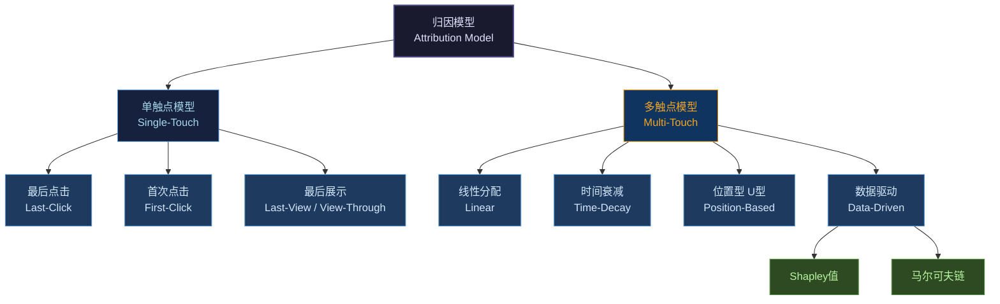
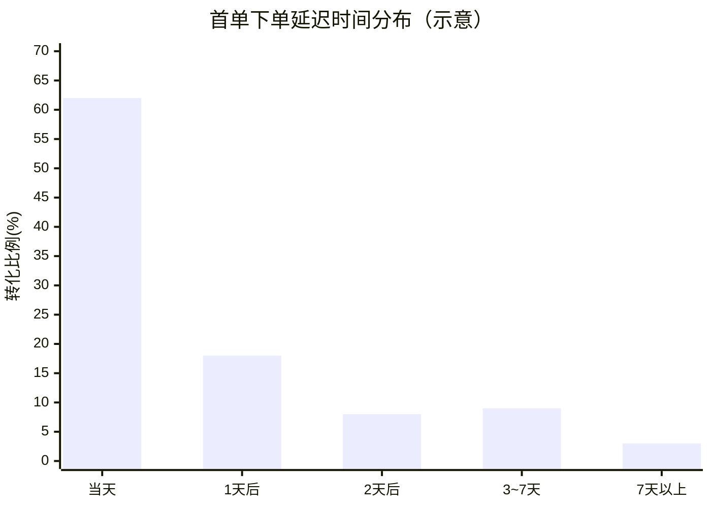
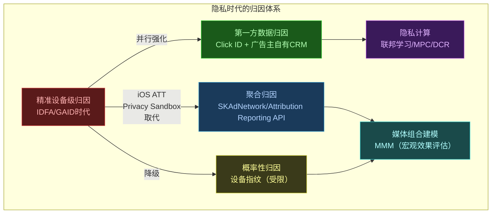

# 第13章 归因与转化回传

> **系列定位**：本章承接第12章（反作弊）的数据质量保障，深入讲解归因（Attribution）与转化回传（Conversion Postback）机制——这是 oCPX 智能出价（第9、10章）的数据闭环基础，也是 CVR 模型训练（第7章 ESMM / delayed feedback）的标签来源。没有可靠的归因，智能出价就成了无源之水。

---

## 本章导读

轻氧奶茶的投放经理每天早上打开后台，看到一条数据：昨日转化 3,200 单，平均转化成本 28.6 元，达标。

这 3,200 个转化是怎么来的？哪一次广告曝光或点击"应该"对这个转化负责？平台是怎么知道用户下单了？这些转化数据又是如何反哺出价模型、让系统越投越准的？

这些问题的答案，就是本章的核心命题——**归因与转化回传**。

本章主要内容：

1. **归因（Attribution）是什么** —— 定义、价值、与 oCPX 闭环的关系
2. **归因模型全景** —— 单触点、多触点模型对比；Shapley 值与时间衰减公式
3. **归因窗口** —— 点击窗口 / 展示窗口；窗口大小的博弈
4. **设备标识与匹配** —— IDFA/GAID/OAID；确定性归因 vs 概率性归因
5. **归因链路工程** —— 时序图 + 代码实现（last-click 匹配 + 窗口判定）
6. **转化回传（Postback / S2S）** —— 广告主如何把转化事件喂给平台；回传处理代码
7. **延迟反馈（Delayed Feedback）** —— 标签延迟对 CVR 训练的影响与建模
8. **隐私与新趋势** —— iOS ATT / SKAdNetwork / Privacy Sandbox / 联邦学习 / 数据清洁室
9. **归因相关作弊** —— 归因劫持、大点击撞库

---

## 13.1 归因（Attribution）是什么

### 13.1.1 基本定义

**归因（Attribution）**，字面意义是"把功劳归给某人"。在广告系统中，归因回答一个核心问题：

> **用户发生了一个转化（Conversion）——注册、下单、付款——这个转化"应该"记在哪一次广告曝光或点击的账上？**

举一个具体例子：

> 某用户周一看到了轻氧奶茶在抖音的广告（曝光）；周二在悦读 App 又看到了同一品牌的广告并点击了（点击）；周三在微信朋友圈刷到了再一次（曝光）；周四直接搜索"轻氧奶茶"进入小程序并完成了首单下单（转化）。
>
> 问：这笔转化，应该归功于哪次广告接触？

这就是归因要解决的问题。

在程序化广告（Programmatic Advertising）中，不同媒体、不同广告主都在争夺对同一次转化的"归因资格"，因为**谁拿到归因，谁就能向广告主报告转化、计费（如果是 oCPA 模式），并获得模型训练数据**。

### 13.1.2 归因为什么是 oCPX 的基石

在第9章，我们介绍了 oCPX 系列出价模式——广告主按转化目标出价（如 30 元/首单），平台按点击或展示计费，并通过预估转化率（pCVR）将 oCPA 出价折算为竞价 eCPM：

$$\text{eCPM} = \text{CPA出价} \times \text{pCVR} \times 1000$$

这里的 pCVR 来自 CVR 预估模型（第7章 ESMM）。模型训练需要标签（Label）——"这次点击最终转化了吗？"这个标签，正是通过**归因**产生的：

```
用户点击广告 → 归因服务匹配转化事件 → 产出 {click_id → conversion} 标签
                                        ↓
                              CVR模型训练数据（第7章）
                                        ↓
                              pCVR更新 → oCPX出价调整（第10章）
```

没有可靠的归因，CVR 模型的正样本就无从来，oCPX 的出价优化就成了空谈。**归因是整个广告效果闭环的神经节点**。

### 13.1.3 两类基础转化事件

| 事件类型 | 定义 | 轻氧奶茶的例子 |
|---------|------|--------------|
| **应用内事件（In-App Event）** | 用户在 App 内完成的行为 | 注册、首单下单、加购、支付 |
| **网页转化事件（Web Conversion）** | 用户在 H5/Web 完成的行为 | 落地页提交表单、页面访问 |

轻氧奶茶的核心转化目标是"首单下单"，属于应用内事件（用户在轻氧小程序或 App 内完成支付）。

---

## 13.2 归因模型全景

归因模型（Attribution Model）定义了"功劳如何分配给各次广告接触"的规则。行业中有多种模型，各有适用场景和局限。

### 13.2.1 归因模型分类总览



### 13.2.2 单触点模型

#### 最后点击归因（Last-Click Attribution）—— 行业主流

**规则**：转化功劳 100% 归给转化前最后一次**点击**。

**为什么是主流**：
- 实现简单，工程成本低
- 意图信号最强：用户点击通常代表主动兴趣，与转化的因果关系相对直接
- 数据量充足，系统可以获得大量点击→转化对

**缺点**：
- 严重低估"辅助接触"的价值：前期曝光和品牌建设投入得不到归功
- 容易被归因劫持（详见 13.9 节）

**适用场景**：效果类广告（下载、电商）、oCPA 计费场景。

#### 首次点击归因（First-Click Attribution）

**规则**：转化功劳 100% 归给**第一次**点击。

**逻辑**：第一次点击"拉开了消费旅程的帷幕"，应该受到认可。

**缺点**：忽视转化路径上的后续关键接触，对品效协同场景失真。

**适用场景**：品牌认知目标（知名度提升），关注的是"谁让用户第一次认识了品牌"。

#### 最后展示归因（Last-View / View-Through Attribution）

**规则**：如果没有点击，退而求其次，归功于转化前最后一次**曝光（展示）**。

这种方式在程序化广告中叫做 **VTA（View-Through Attribution）**，与 **CTA（Click-Through Attribution，点击归因）** 相对。

**争议**：用户只是"看了一眼"广告就被归为功劳来源，证明因果性很难，容易高估展示的作用。

**典型应用**：品牌广告（Banner、OTV/在线视频广告），曝光窗口通常设为 24 小时或 7 天。

### 13.2.3 多触点模型（Multi-Touch Attribution, MTA）

多触点模型（Multi-Touch Attribution，简称 MTA）试图将转化功劳合理分配给路径上的所有广告接触点。

#### 线性归因（Linear Attribution）

**规则**：路径上 N 次接触，每次平均分配 $\frac{1}{N}$ 的功劳。

$$w_i = \frac{1}{N}, \quad i = 1, 2, \ldots, N$$

**优点**：简单公平，不偏向路径上的任何位置。

**缺点**：忽视了不同接触点的实际贡献差异——最后一次点击和一次不经意的曝光被同等对待。

#### 时间衰减归因（Time-Decay Attribution）

**规则**：越靠近转化时刻的接触点，权重越高；使用指数衰减函数建模。

设接触点 $i$ 距转化时间为 $\Delta t_i$（单位：天），半衰期参数为 $\lambda$，则：

$$\tilde{w}_i = 2^{-\lambda \cdot \Delta t_i}$$

归一化后得到各接触点的权重：

$$w_i = \frac{\tilde{w}_i}{\sum_{j=1}^{N} \tilde{w}_j}$$

**例**：设 $\lambda = 0.5$（半衰期约2天），三次接触分别发生在转化前 5天、2天、0.5天：

| 接触点 | $\Delta t_i$ | $\tilde{w}_i = 2^{-0.5 \cdot \Delta t_i}$ | $w_i$（归一化） |
|--------|-------------|------------------------------------------|--------------:|
| 第1次（5天前）| 5 | $2^{-2.5} \approx 0.177$ | 12.3% |
| 第2次（2天前）| 2 | $2^{-1.0} = 0.500$ | 34.7% |
| 第3次（0.5天前）| 0.5 | $2^{-0.25} \approx 0.841$ | 58.4% |
| 合计 | — | 1.518 | **100%** |

**直觉**：最后一次接触贡献最大，符合"临门一脚"的商业直觉，但比 last-click 更温和地考虑了前期接触。

#### 位置型归因（Position-Based / U型 Attribution）

**规则**：首次接触和最后一次接触各占 40% 功劳，中间所有接触点平分剩余 20%。

$$w_1 = 0.4, \quad w_N = 0.4, \quad w_i = \frac{0.2}{N-2}, \quad i = 2, \ldots, N-1$$

**逻辑**："开门的"（拉新接触）和"关门的"（促转化接触）最重要，中间的"培育接触"有价值但次之。

**适用**：重视品牌认知和转化双目标的场景（如汽车、高价值消费品）。

#### 数据驱动归因——Shapley 值（Data-Driven Attribution with Shapley Value）

Shapley 值来自博弈论（Game Theory），是唯一满足**效率性、对称性、哑参与者性、可加性**四条公理的分配方案，被认为是多触点归因的理论最优解。

**核心思想**：某个接触点 $i$ 的贡献，等于它在所有可能的"加入顺序"中产生的边际贡献（Marginal Contribution）的期望值。

设所有接触点集合为 $N$，$v(S)$ 为子集 $S$ 的转化价值（如转化率），则 Shapley 值为：

$$\phi_i = \sum_{S \subseteq N \setminus \{i\}} \frac{|S|! \cdot (|N| - |S| - 1)!}{|N|!} \cdot [v(S \cup \{i\}) - v(S)]$$

其中：
- $S$：不包含接触点 $i$ 的子集
- $v(S \cup \{i\}) - v(S)$：加入 $i$ 后，转化率的提升量（边际贡献）
- $\frac{|S|! \cdot (|N| - |S| - 1)!}{|N|!}$：这种排列的概率权重

**直觉解释**：想象所有接触点以随机顺序"入场"，每次一个入场时计算"它让转化率提高了多少"，对所有排列求平均，就是 Shapley 值。

**优点**：理论最优、无偏；**缺点**：计算复杂度为 $O(2^N)$，接触点多时需要采样近似；需要大量历史数据训练 $v(S)$。

#### 数据驱动归因——马尔可夫链（Markov Chain Attribution）

另一类数据驱动方法。将用户的广告接触路径建模为**马尔可夫链（Markov Chain）**，每个渠道是一个状态，通过历史数据计算各渠道之间的转移概率矩阵。

"删除某个渠道"后，整体转化率的下降幅度，就是该渠道的贡献——称为**移除效应（Removal Effect）**：

$$\text{贡献}_i = 1 - \frac{P(\text{转化} \mid \text{移除渠道} i)}{P(\text{转化} \mid \text{全路径})}$$

### 13.2.4 归因模型对比总表

| 模型 | 功劳分配 | 工程复杂度 | 数据需求 | 适用场景 | 主要缺点 |
|------|---------|----------|---------|---------|---------|
| Last-Click | 100% → 最后点击 | ★☆☆ | 少 | 效果广告、oCPA | 忽视前期贡献 |
| First-Click | 100% → 首次点击 | ★☆☆ | 少 | 品牌认知目标 | 忽视临门一脚 |
| Last-View (VTA) | 100% → 最后展示 | ★☆☆ | 少 | 品牌展示广告 | 因果性弱 |
| Linear | 均分 $1/N$ | ★☆☆ | 少 | 多渠道均衡分析 | 忽视贡献差异 |
| Time-Decay | 指数衰减权重 | ★★☆ | 中 | 短决策周期 | 参数需调优 |
| Position-Based | 首尾各40%，中间20% | ★★☆ | 中 | 品效协同 | 固定权重不够灵活 |
| Shapley 值 | 边际贡献期望 | ★★★ | 多 | 多渠道理论最优 | $O(2^N)$ 复杂度高 |
| 马尔可夫链 | 移除效应 | ★★★ | 多 | 多渠道路径分析 | 需大量训练数据 |

### 13.2.5 点击归因 vs 展示归因

| 维度 | 点击归因（CTA / Click-Through） | 展示归因（VTA / View-Through） |
|------|-------------------------------|-------------------------------|
| 触发条件 | 用户发生了点击行为 | 用户只需看到广告（曝光） |
| 因果强度 | 较强（主动行为） | 较弱（被动接触） |
| 优先级 | **高于 VTA**（有点击优先用点击归因） | 仅在无点击时作为 fallback |
| 典型窗口 | 7天、30天 | 1天、7天 |
| 主要风险 | 归因劫持（见 13.9 节） | 夸大品牌广告贡献 |

**实践规则**：当同一次转化既有点击归因候选又有展示归因候选时，**点击归因优先**。

---

## 13.3 归因窗口（Attribution Window / Lookback Window）

### 13.3.1 定义

**归因窗口（Attribution Window）**，也叫回溯窗口（Lookback Window），定义了在转化发生前，往回追溯多长时间内的广告接触点才算有效候选。

- **点击归因窗口（Click Lookback Window）**：转化前 N 天内的点击才能被归因
- **展示归因窗口（View Lookback Window）**：转化前 M 小时/天内的展示才能被归因

### 13.3.2 常见窗口配置

| 转化类型 | 典型点击窗口 | 典型展示窗口 | 原因 |
|---------|------------|------------|------|
| App 安装 | 7天 | 1天 | 安装决策周期短 |
| 电商下单（首单） | 7~30天 | 1~7天 | 决策周期中等 |
| 游戏内购 | 30天 | 7天 | 用户熟悉期长 |
| 金融产品开户 | 30~60天 | 7~14天 | 决策周期长 |
| 品牌搜索 | 不适用 | 14~30天 | 纯品牌效果 |

轻氧奶茶案例中，首单下单的点击归因窗口设为 **7天**，展示归因窗口设为 **1天**。

### 13.3.3 窗口大小的影响与博弈

归因窗口的设置，实质上是**媒体方与广告主之间的利益博弈**：

**媒体方偏好更长窗口**：
- 窗口越长，能归入"有效点击"的广告接触越多
- 转化数量看起来越多，oCPA 计费机会越多，CVR 训练样本越充足

**广告主偏好更短窗口**：
- 窗口越短，归因越精准，不把"自然转化"错误地算给广告
- 防止某次随手一点广告、7天后自然下单，被算成一次广告转化

**实践中的问题**：

1. **自然转化污染（Organic Cannibalization）**：用户本来就会下单，点击广告只是顺手，但被归到广告名下，虚增了 oCPA 成本。

2. **跨媒体重复归因（Duplicate Attribution）**：用户接触了多个媒体的广告，每个媒体都声称自己的归因贡献，广告主可能为同一次转化支付多次费用（这在没有第三方归因平台时尤为突出）。

3. **窗口截断导致漏归因**：转化窗口设得太短，一些真实由广告驱动的延迟转化（Delayed Conversion）被漏掉，低估广告贡献。

### 13.3.4 第三方归因平台（MMP）的价值

**移动应用归因（Mobile Measurement Partner，MMP）**平台（如 AppsFlyer、Adjust、Kochava）在行业中扮演中立仲裁者角色：

- 广告主授权 MMP SDK 埋入 App，由 MMP 统一做跨媒体归因
- 媒体方无法自己"裁判自己"，归因结果更可信
- MMP 按"最后点击（last-click）、窗口内"规则，在所有声称有点击的媒体中给出唯一归因

---

## 13.4 设备标识与归因匹配

归因的技术本质是**用户身份匹配**：能否把"看到了广告"和"完成了转化"这两个事件，确认是同一个用户。这依赖设备标识（Device Identifier）技术。

### 13.4.1 主流设备标识

| 标识符 | 全称 | 平台 | 特点 |
|--------|------|------|------|
| **IDFA** | Identifier for Advertisers | iOS | 苹果广告标识符，iOS 14.5+ 需用户授权（ATT） |
| **GAID** | Google Advertising ID | Android | 谷歌广告标识符，用户可重置 |
| **OAID** | Open Anonymous Device Identifier | 国内 Android | 华为/小米等厂商联合推出，替代 IMEI |
| **IMEI** | International Mobile Equipment Identity | Android（旧） | 设备硬件标识，国内已限制获取 |
| **Click ID** | 点击标识符 | 跨平台 | 广告平台生成的唯一点击标记，精度最高 |

### 13.4.2 确定性归因（Deterministic Attribution）

**定义**：通过精确的、唯一的设备 ID（如 IDFA、GAID、Click ID）进行匹配。

**工作原理**：
1. 广告点击时，平台生成唯一的 `click_id`，附加在落地页 URL 的参数中（如 `?click_id=abc123`）
2. 用户安装 App / 完成转化时，SDK 上报 `click_id` 和设备 ID
3. 归因服务用 `click_id` 或设备 ID 进行精确匹配

**优点**：精确度高（理论上无误匹配）；**缺点**：依赖设备 ID 的可获得性，iOS 14.5+ 之后 IDFA 大幅受限。

### 13.4.3 概率性归因（Probabilistic Attribution）

**定义**：当无法获取精确设备 ID 时，通过设备**指纹（Device Fingerprint）**进行概率匹配。

**设备指纹组成**：

```
设备指纹 = Hash(IP地址 + User-Agent + 屏幕分辨率 + 语言设置 + 时区 + ...)
```

**工作原理**：
1. 广告点击时，记录设备指纹（哈希值）
2. 转化事件上报时，计算当前设备指纹
3. 在时间窗口内，查找指纹相似度最高的点击记录
4. 相似度超过阈值则判定为同一用户，完成归因

**优点**：不依赖设备 ID，在隐私限制下仍可工作；**缺点**：有误归因风险（不同设备指纹相同），且正在受到越来越多隐私法规限制（如 GDPR 认为指纹也是个人数据）。

### 13.4.4 Click ID 方案：精度最高的确定性归因

Click ID 是目前**精度最高**的归因方案，实现无需依赖设备 ID：

```
广告点击链路：
用户点击 → 媒体平台生成 click_id → 附加在跳转URL中
→ 落地页接收并存储 click_id（Cookie / LocalStorage）
→ 用户完成转化时，SDK读取 click_id → 上报给归因服务
→ 归因服务按 click_id 精确查找对应点击记录 → 归因完成
```

**Meta（Facebook）的 fbclid、Google Ads 的 gclid、字节跳动的 callback_url** 都是这类方案的实现。

---

## 13.5 归因链路工程

### 13.5.1 完整归因时序图

```mermaid
sequenceDiagram
    participant User as 用户
    participant Media as 悦读App（媒体方）
    participant AdEngine as 投放引擎
    participant LP as 落地页/轻氧App
    participant SDK as MMP SDK（归因SDK）
    participant AttrSvc as 归因服务
    participant Adv as 广告主服务器

    Note over User,Adv: 阶段一：广告曝光与点击

    User->>Media: 打开悦读App刷信息流
    Media->>AdEngine: 发起竞价请求（含曝光机会）
    AdEngine->>Media: 返回轻氧奶茶广告（含click_url）
    Media->>User: 展示广告（记录impression日志）

    User->>Media: 点击广告
    Media->>AdEngine: 点击事件通知
    AdEngine->>AttrSvc: 写入点击日志<br/>{click_id, device_id, ad_id, timestamp}
    Media->>LP: 302跳转 click_url?click_id=abc123

    Note over User,Adv: 阶段二：用户转化

    User->>LP: 打开落地页/安装轻氧App
    LP->>SDK: SDK初始化，读取click_id参数
    User->>LP: 注册账号 + 完成首单下单
    LP->>SDK: 触发转化事件（event=first_order）

    Note over User,Adv: 阶段三：归因匹配

    SDK->>AttrSvc: 上报转化事件<br/>{device_id, click_id, event, timestamp}
    AttrSvc->>AttrSvc: 查询点击日志<br/>按click_id精确匹配（优先）<br/>或按device_id+时间窗口匹配
    AttrSvc->>AttrSvc: 判断是否在归因窗口内<br/>（7天点击窗口）

    Note over User,Adv: 阶段四：归因结果与回传

    AttrSvc->>AdEngine: 归因结果<br/>{click_id → conversion, ad_id, revenue}
    AdEngine->>AdEngine: 更新转化统计<br/>更新pCVR训练样本
    AttrSvc->>Adv: Postback回传（S2S）<br/>{click_id, event, timestamp}
    Adv->>Adv: 记录转化，验证回传数据

    style AdEngine fill:#1e3a5f,color:#d4e8ff,stroke:#5b9bd5
    style AttrSvc fill:#2d4a22,color:#b8f5a0,stroke:#5a9947
    style SDK fill:#3d2a50,color:#e0c8ff,stroke:#9b6fd4
```

### 13.5.2 归因服务核心代码

以下代码实现了 last-click 归因的核心逻辑：点击日志查询、归因窗口判定和归因结果产出。

```python
"""
归因服务核心逻辑
实现 last-click 归因 + 归因窗口判定
对应：悦读App × 轻氧奶茶 转化归因
"""

from dataclasses import dataclass
from datetime import datetime, timedelta
from typing import Optional, List
import logging

logger = logging.getLogger(__name__)


@dataclass
class ClickRecord:
    """点击日志记录"""
    click_id: str          # 全局唯一点击ID
    device_id: str         # 设备标识（IDFA/GAID/OAID）
    ad_id: str             # 广告单元ID
    campaign_id: str       # 广告计划ID
    advertiser_id: str     # 广告主ID
    media_id: str          # 媒体ID（如：悦读App）
    click_time: datetime   # 点击发生时间（UTC）
    bid_price: float       # 竞价成功价格（CPM）


@dataclass
class ConversionEvent:
    """转化事件"""
    event_id: str                   # 事件唯一ID
    device_id: str                  # 设备标识
    click_id: Optional[str]         # 携带的click_id（如果有）
    event_type: str                 # 事件类型，如 "first_order" / "register"
    event_time: datetime            # 事件发生时间（UTC）
    revenue: float                  # 转化价值（订单金额，单位元）


@dataclass
class AttributionResult:
    """归因结果"""
    conversion_event_id: str        # 对应的转化事件ID
    matched_click_id: str           # 归因到的点击ID
    ad_id: str                      # 广告单元ID
    campaign_id: str                # 广告计划ID
    advertiser_id: str              # 广告主ID
    media_id: str                   # 媒体ID
    attribution_model: str          # 使用的归因模型（如 "last_click"）
    click_time: datetime            # 点击发生时间
    conversion_time: datetime       # 转化发生时间
    time_lag_seconds: float         # 点击到转化的时间差（秒）
    revenue: float                  # 转化价值


# ─────────────────────────────────────────────────────────────────────────────
# 归因窗口配置
# ─────────────────────────────────────────────────────────────────────────────

ATTRIBUTION_WINDOW_CONFIG = {
    # event_type -> {"click_days": N, "view_hours": M}
    "first_order": {
        "click_days": 7,     # 点击归因窗口：7天
        "view_hours": 24,    # 展示归因窗口：24小时
    },
    "register": {
        "click_days": 7,
        "view_hours": 24,
    },
    "add_to_cart": {
        "click_days": 30,
        "view_hours": 24,
    },
    "app_install": {
        "click_days": 7,
        "view_hours": 24,
    },
}

DEFAULT_WINDOW = {"click_days": 7, "view_hours": 24}


def is_within_attribution_window(
    click_time: datetime,
    conversion_time: datetime,
    event_type: str,
    attribution_type: str = "click",  # "click" 或 "view"
) -> bool:
    """
    判断点击（或展示）是否在归因窗口内。

    Args:
        click_time: 点击/展示发生时间
        conversion_time: 转化发生时间
        event_type: 转化事件类型
        attribution_type: "click"（点击归因）或 "view"（展示归因）

    Returns:
        True 表示在窗口内，可参与归因
    """
    # 转化必须晚于点击（物理因果约束）
    if conversion_time <= click_time:
        logger.debug(
            "归因窗口判定失败：转化时间早于点击时间 "
            f"click={click_time}, conversion={conversion_time}"
        )
        return False

    # 获取窗口配置
    window_cfg = ATTRIBUTION_WINDOW_CONFIG.get(event_type, DEFAULT_WINDOW)
    time_diff = conversion_time - click_time

    if attribution_type == "click":
        window = timedelta(days=window_cfg["click_days"])
        result = time_diff <= window
        logger.debug(
            f"点击归因窗口判定: 时间差={time_diff}, "
            f"窗口={window_cfg['click_days']}天, 结果={'通过' if result else '超窗'}"
        )
        return result

    elif attribution_type == "view":
        window = timedelta(hours=window_cfg["view_hours"])
        result = time_diff <= window
        logger.debug(
            f"展示归因窗口判定: 时间差={time_diff}, "
            f"窗口={window_cfg['view_hours']}小时, 结果={'通过' if result else '超窗'}"
        )
        return result

    return False


class AttributionService:
    """
    归因服务
    实现 Last-Click Attribution（最后点击归因）

    说明：
    - 优先用 click_id 精确匹配（确定性归因）
    - 若无 click_id，则用 device_id + 时间窗口匹配（模糊匹配，last-click）
    """

    def __init__(self, click_store, impression_store):
        """
        Args:
            click_store: 点击日志存储（支持按 click_id / device_id 查询）
            impression_store: 展示日志存储（支持按 device_id 查询）
        """
        self.click_store = click_store
        self.impression_store = impression_store

    def attribute(self, conversion: ConversionEvent) -> Optional[AttributionResult]:
        """
        对一条转化事件执行归因，返回归因结果。

        归因优先级：
        1. click_id 精确匹配（最高优先级）
        2. device_id + 点击窗口内 last-click（次优先）
        3. device_id + 展示窗口内 last-view（最低优先，fallback）
        4. 无匹配 → 返回 None（自然转化，无法归因到广告）

        Args:
            conversion: 转化事件对象

        Returns:
            归因结果，或 None（无法归因）
        """
        logger.info(
            f"开始归因: event_id={conversion.event_id}, "
            f"event_type={conversion.event_type}, "
            f"device_id={conversion.device_id}"
        )

        # ─── 策略1：click_id 精确匹配（确定性归因）─────────────────────────
        if conversion.click_id:
            result = self._attribute_by_click_id(conversion)
            if result:
                logger.info(
                    f"归因成功（click_id精确匹配）: "
                    f"event_id={conversion.event_id} → click_id={result.matched_click_id}"
                )
                return result
            else:
                # click_id 存在但超窗 or 找不到记录，不降级，防止归因劫持
                logger.warning(
                    f"click_id 匹配失败，不再降级: "
                    f"event_id={conversion.event_id}, click_id={conversion.click_id}"
                )
                return None

        # ─── 策略2：device_id + 点击窗口 last-click（概率性）───────────────
        result = self._attribute_last_click_by_device(conversion)
        if result:
            logger.info(
                f"归因成功（device_id last-click）: "
                f"event_id={conversion.event_id} → click_id={result.matched_click_id}"
            )
            return result

        # ─── 策略3：device_id + 展示窗口 last-view（fallback）──────────────
        result = self._attribute_last_view_by_device(conversion)
        if result:
            logger.info(
                f"归因成功（last-view fallback）: "
                f"event_id={conversion.event_id} → click_id={result.matched_click_id}"
            )
            return result

        # ─── 无法归因：自然转化 ─────────────────────────────────────────────
        logger.info(
            f"归因失败（自然转化）: event_id={conversion.event_id}"
        )
        return None

    def _attribute_by_click_id(
        self, conversion: ConversionEvent
    ) -> Optional[AttributionResult]:
        """
        通过 click_id 精确匹配归因（确定性归因）。
        """
        click: Optional[ClickRecord] = self.click_store.get_by_click_id(
            conversion.click_id
        )
        if not click:
            logger.debug(f"click_id={conversion.click_id} 未找到对应点击记录")
            return None

        # 验证归因窗口
        if not is_within_attribution_window(
            click.click_time,
            conversion.event_time,
            conversion.event_type,
            attribution_type="click",
        ):
            logger.debug(
                f"click_id={conversion.click_id} 超出归因窗口，放弃归因"
            )
            return None

        return self._build_result(conversion, click, "last_click_deterministic")

    def _attribute_last_click_by_device(
        self, conversion: ConversionEvent
    ) -> Optional[AttributionResult]:
        """
        在归因窗口内，按 device_id 查找最后一次点击（last-click）。
        """
        # 获取窗口配置
        window_cfg = ATTRIBUTION_WINDOW_CONFIG.get(
            conversion.event_type, DEFAULT_WINDOW
        )
        window_start = conversion.event_time - timedelta(
            days=window_cfg["click_days"]
        )

        # 查询该设备在窗口内的所有点击记录（倒序）
        clicks: List[ClickRecord] = self.click_store.query_by_device(
            device_id=conversion.device_id,
            start_time=window_start,
            end_time=conversion.event_time,
            order="desc",  # 最新的在前
        )

        if not clicks:
            return None

        # Last-Click：取窗口内时间最近的那条点击记录
        last_click = clicks[0]

        # 再次校验窗口（防止存储层时间索引精度不够）
        if not is_within_attribution_window(
            last_click.click_time,
            conversion.event_time,
            conversion.event_type,
            attribution_type="click",
        ):
            return None

        return self._build_result(conversion, last_click, "last_click_probabilistic")

    def _attribute_last_view_by_device(
        self, conversion: ConversionEvent
    ) -> Optional[AttributionResult]:
        """
        Fallback：在展示归因窗口内，按 device_id 找最后一次展示（last-view）。
        注：展示归因优先级最低，仅在无点击时使用。
        """
        window_cfg = ATTRIBUTION_WINDOW_CONFIG.get(
            conversion.event_type, DEFAULT_WINDOW
        )
        window_start = conversion.event_time - timedelta(
            hours=window_cfg["view_hours"]
        )

        impressions: List[ClickRecord] = self.impression_store.query_by_device(
            device_id=conversion.device_id,
            start_time=window_start,
            end_time=conversion.event_time,
            order="desc",
        )

        if not impressions:
            return None

        last_view = impressions[0]
        if not is_within_attribution_window(
            last_view.click_time,
            conversion.event_time,
            conversion.event_type,
            attribution_type="view",
        ):
            return None

        return self._build_result(conversion, last_view, "last_view")

    def _build_result(
        self,
        conversion: ConversionEvent,
        click: ClickRecord,
        model: str,
    ) -> AttributionResult:
        """构建归因结果对象"""
        time_lag = (
            conversion.event_time - click.click_time
        ).total_seconds()

        return AttributionResult(
            conversion_event_id=conversion.event_id,
            matched_click_id=click.click_id,
            ad_id=click.ad_id,
            campaign_id=click.campaign_id,
            advertiser_id=click.advertiser_id,
            media_id=click.media_id,
            attribution_model=model,
            click_time=click.click_time,
            conversion_time=conversion.event_time,
            time_lag_seconds=time_lag,
            revenue=conversion.revenue,
        )


# ─────────────────────────────────────────────────────────────────────────────
# 使用示例：轻氧奶茶场景
# ─────────────────────────────────────────────────────────────────────────────

def demo_attribution():
    """
    轻氧奶茶案例演示：
    用户在悦读App点击广告 → 7天内完成首单 → 归因匹配
    """
    # 模拟点击日志（通常存储在 HBase / Redis 等高速存储中）
    click_time = datetime(2024, 1, 15, 14, 30, 0)   # 点击时间：1月15日14:30

    click = ClickRecord(
        click_id="clk_abc123def456",
        device_id="GAID_user_78901",
        ad_id="ad_qinyang_001",
        campaign_id="camp_qinyang_tixin",     # 轻氧奶茶拉新计划
        advertiser_id="adv_qinyang",
        media_id="media_yueduyuedu",           # 悦读App
        click_time=click_time,
        bid_price=12.5,                        # 该次曝光的竞价价格
    )

    # 模拟转化事件（由MMP SDK上报，或广告主S2S回传）
    conversion_time = datetime(2024, 1, 18, 20, 15, 0)  # 转化时间：1月18日20:15
    conversion = ConversionEvent(
        event_id="evt_conv_xyz789",
        device_id="GAID_user_78901",
        click_id="clk_abc123def456",           # SDK携带了click_id
        event_type="first_order",
        event_time=conversion_time,
        revenue=45.8,                          # 首单金额：45.8元
    )

    # 判断是否在归因窗口内
    time_lag = conversion_time - click_time
    print(f"点击时间：{click_time}")
    print(f"转化时间：{conversion_time}")
    print(f"时间差：{time_lag.days}天 {time_lag.seconds//3600}小时")

    in_window = is_within_attribution_window(
        click_time=click_time,
        conversion_time=conversion_time,
        event_type="first_order",
        attribution_type="click",
    )
    print(f"是否在7天点击归因窗口内：{'✓ 是' if in_window else '✗ 否'}")
    # 输出：是否在7天点击归因窗口内：✓ 是（时间差约3.24天）


if __name__ == "__main__":
    demo_attribution()
```

---

## 13.6 转化回传（Conversion Postback / S2S / CAPI）

### 13.6.1 什么是转化回传

**转化回传（Conversion Postback）**，又称 **S2S（Server-to-Server）回传** 或 **CAPI（Conversions API）**，是指广告主的服务器在检测到用户转化后，**主动将转化事件通过服务器接口推送给广告平台**的机制。

区别于 MMP SDK 方案（SDK 在客户端收集数据），S2S 回传完全在服务端完成，不依赖客户端 SDK，数据质量更可控。

### 13.6.2 回传的用途

```
广告主服务器 → S2S回传 → 广告平台
                          ├── ① oCPA计费：确认转化发生，触发扣费
                          ├── ② CVR模型训练：产出正样本标签（第7章）
                          ├── ③ oCPX出价优化：更新pCVR，调整出价（第10章）
                          └── ④ 报表统计：填充转化数据到广告主报表
```

**回传是 oCPX 闭环的"数据入口"**：没有回传，平台无法知道广告是否带来了真实转化，oCPX 的出价优化就无从进行。

### 13.6.3 回传协议规范

常见的 postback URL 格式（以参数说明为主）：

```
https://track.platform.com/conversion?
    click_id={click_id}          # 点击ID（最关键字段，用于归因匹配）
    &event_type={event_type}     # 事件类型（如 first_order）
    &event_time={timestamp}      # 事件发生时间（Unix时间戳，精确到秒）
    &revenue={amount}            # 转化价值（订单金额，单位：元）
    &currency={currency}         # 货币单位（CNY）
    &device_id={device_id}       # 设备ID（GAID/OAID，用于归因辅助）
    &sign={signature}            # 请求签名（防篡改）
```

### 13.6.4 回传处理代码

以下是广告平台侧的 postback 接收与处理逻辑：

```python
"""
转化回传（Postback）处理服务
广告平台侧：接收广告主S2S回传，验证 → 归因 → 计费 → 训练样本产出

对应：轻氧奶茶 S2S 回传给悦读App平台
"""

import hashlib
import hmac
import time
from dataclasses import dataclass, field
from datetime import datetime, timezone
from typing import Optional, Dict, Any
import logging
import json

logger = logging.getLogger(__name__)


@dataclass
class PostbackRequest:
    """广告主S2S回传请求参数"""
    click_id: str               # 点击ID（必填，用于归因）
    event_type: str             # 事件类型（如 first_order）
    event_time: int             # 事件时间（Unix时间戳秒）
    revenue: float              # 转化价值（元）
    currency: str               # 货币单位，默认 CNY
    device_id: Optional[str]   # 设备ID（GAID/OAID，可选，辅助归因）
    advertiser_id: str          # 广告主ID
    sign: str                   # 请求签名（HMAC-SHA256）


@dataclass
class PostbackResult:
    """回传处理结果"""
    success: bool
    error_code: Optional[str] = None
    error_msg: Optional[str] = None
    attribution_result: Optional[Dict[str, Any]] = None
    training_sample_emitted: bool = False


class PostbackProcessor:
    """
    转化回传处理器

    处理流程：
    1. 签名验证（防篡改、防重放）
    2. 幂等性检查（去重）
    3. 时效性验证（防止回传过于延迟的事件）
    4. 归因匹配（调用归因服务）
    5. 计费触发（oCPA场景）
    6. 训练样本产出（CVR模型训练数据）
    7. 指标更新（报表统计）
    """

    def __init__(
        self,
        secret_store,          # 广告主密钥存储（按advertiser_id查询HMAC密钥）
        dedup_store,           # 幂等去重存储（Redis）
        attribution_service,   # 归因服务
        billing_service,       # 计费服务
        training_pipeline,     # 训练样本产出管道（Kafka等）
        metrics_store,         # 报表指标存储
    ):
        self.secret_store = secret_store
        self.dedup_store = dedup_store
        self.attribution_svc = attribution_service
        self.billing_svc = billing_service
        self.training_pipeline = training_pipeline
        self.metrics_store = metrics_store

        # 时效性检查：回传事件不超过30天（防止历史数据被刷入）
        self.MAX_EVENT_AGE_SECONDS = 30 * 24 * 3600

        # 请求时效性：postback请求本身不超过5分钟（防重放攻击）
        self.MAX_REQUEST_AGE_SECONDS = 300

    def process(self, req: PostbackRequest) -> PostbackResult:
        """处理一条S2S回传请求"""

        logger.info(
            f"收到Postback: advertiser_id={req.advertiser_id}, "
            f"click_id={req.click_id}, event_type={req.event_type}"
        )

        # ─── Step 1: 签名验证 ───────────────────────────────────────────────
        if not self._verify_signature(req):
            logger.warning(
                f"签名验证失败: click_id={req.click_id}, "
                f"advertiser_id={req.advertiser_id}"
            )
            return PostbackResult(
                success=False,
                error_code="INVALID_SIGN",
                error_msg="签名验证失败，请检查HMAC密钥配置",
            )

        # ─── Step 2: 幂等去重（防止重复回传同一转化）─────────────────────
        dedup_key = f"postback_dedup:{req.click_id}:{req.event_type}"
        if self.dedup_store.exists(dedup_key):
            logger.info(
                f"重复回传，幂等忽略: click_id={req.click_id}, "
                f"event_type={req.event_type}"
            )
            return PostbackResult(success=True, error_code="DUPLICATE")

        # ─── Step 3: 时效性验证 ─────────────────────────────────────────────
        now_ts = int(time.time())
        event_age = now_ts - req.event_time

        if event_age > self.MAX_EVENT_AGE_SECONDS:
            logger.warning(
                f"事件过期: click_id={req.click_id}, "
                f"event_age={event_age}秒 (>{self.MAX_EVENT_AGE_SECONDS}秒)"
            )
            return PostbackResult(
                success=False,
                error_code="EVENT_EXPIRED",
                error_msg=f"事件超过{self.MAX_EVENT_AGE_SECONDS//86400}天，已过期",
            )

        if event_age < -60:  # 允许60秒时钟偏差
            logger.warning(f"事件时间超前: click_id={req.click_id}")
            return PostbackResult(
                success=False,
                error_code="EVENT_IN_FUTURE",
                error_msg="事件时间不能早于当前时间",
            )

        # ─── Step 4: 归因匹配 ───────────────────────────────────────────────
        conversion = ConversionEvent(
            event_id=f"postback_{req.click_id}_{req.event_type}",
            device_id=req.device_id or "",
            click_id=req.click_id,
            event_type=req.event_type,
            event_time=datetime.fromtimestamp(req.event_time, tz=timezone.utc),
            revenue=req.revenue,
        )

        attribution = self.attribution_svc.attribute(conversion)
        if not attribution:
            # 归因失败：可能是伪造的click_id，或真实的自然转化
            logger.warning(
                f"归因失败: click_id={req.click_id}, "
                f"可能是伪造回传或超窗自然转化"
            )
            # 注意：归因失败不报错，但不触发计费
            return PostbackResult(
                success=True,
                error_code="ATTRIBUTION_FAILED",
                error_msg="未找到对应点击记录或超出归因窗口",
            )

        # ─── Step 5: oCPA计费触发 ────────────────────────────────────────────
        # oCPA模式下：有真实回传转化才扣费
        try:
            self.billing_svc.charge_opa_conversion(
                click_id=attribution.matched_click_id,
                ad_id=attribution.ad_id,
                campaign_id=attribution.campaign_id,
                advertiser_id=attribution.advertiser_id,
                event_type=req.event_type,
                revenue=req.revenue,
            )
            logger.info(
                f"oCPA计费触发成功: click_id={attribution.matched_click_id}, "
                f"ad_id={attribution.ad_id}"
            )
        except Exception as e:
            logger.error(f"计费失败: {e}", exc_info=True)
            # 计费失败不影响回传记录，但需告警

        # ─── Step 6: 产出CVR训练样本（正样本）────────────────────────────────
        training_sample = {
            "click_id": attribution.matched_click_id,
            "ad_id": attribution.ad_id,
            "campaign_id": attribution.campaign_id,
            "event_type": req.event_type,
            "click_time": attribution.click_time.isoformat(),
            "conversion_time": attribution.conversion_time.isoformat(),
            "time_lag_seconds": attribution.time_lag_seconds,
            "label": 1,        # 正样本标签：发生了转化
            "revenue": req.revenue,
            "sample_type": "postback_s2s",
        }

        try:
            self.training_pipeline.emit(
                topic="cvr_training_samples",
                message=training_sample,
            )
            logger.info(
                f"CVR训练正样本已产出: click_id={attribution.matched_click_id}"
            )
        except Exception as e:
            logger.error(f"训练样本产出失败: {e}", exc_info=True)

        # ─── Step 7: 幂等标记（设置去重TTL=60天）────────────────────────────
        self.dedup_store.set(dedup_key, "1", ex=60 * 24 * 3600)

        # ─── Step 8: 更新报表指标 ────────────────────────────────────────────
        self.metrics_store.increment(
            advertiser_id=req.advertiser_id,
            ad_id=attribution.ad_id,
            date=datetime.fromtimestamp(req.event_time).strftime("%Y-%m-%d"),
            metrics={
                "conversions": 1,
                "revenue": req.revenue,
            },
        )

        logger.info(
            f"Postback处理完成: click_id={req.click_id}, "
            f"归因到ad_id={attribution.ad_id}, "
            f"time_lag={attribution.time_lag_seconds:.0f}秒"
        )

        return PostbackResult(
            success=True,
            attribution_result={
                "click_id": attribution.matched_click_id,
                "ad_id": attribution.ad_id,
                "campaign_id": attribution.campaign_id,
                "time_lag_seconds": attribution.time_lag_seconds,
            },
            training_sample_emitted=True,
        )

    def _verify_signature(self, req: PostbackRequest) -> bool:
        """
        验证请求签名（HMAC-SHA256）
        签名算法：HMAC-SHA256(secret_key, click_id + event_type + event_time)

        广告主使用平台分配的 secret_key 签名，平台用相同密钥验证。
        防止第三方伪造回传（归因作弊的主要手段之一）。
        """
        secret_key = self.secret_store.get_secret(req.advertiser_id)
        if not secret_key:
            logger.error(f"未找到广告主密钥: advertiser_id={req.advertiser_id}")
            return False

        # 构造待签名字符串（字段顺序需双方约定一致）
        sign_string = f"{req.click_id}{req.event_type}{req.event_time}"
        expected_sign = hmac.new(
            secret_key.encode("utf-8"),
            sign_string.encode("utf-8"),
            hashlib.sha256,
        ).hexdigest()

        return hmac.compare_digest(expected_sign, req.sign)


# ─────────────────────────────────────────────────────────────────────────────
# 示例：轻氧奶茶的S2S回传请求
# ─────────────────────────────────────────────────────────────────────────────

def demo_postback():
    """
    演示轻氧奶茶服务器向悦读App平台发送S2S回传
    """
    import hashlib
    import hmac

    SECRET_KEY = "qinyang_secret_abc123"    # 平台分配给轻氧奶茶的密钥

    click_id = "clk_abc123def456"
    event_type = "first_order"
    event_time = int(datetime(2024, 1, 18, 20, 15, 0).timestamp())

    # 生成签名
    sign_string = f"{click_id}{event_type}{event_time}"
    sign = hmac.new(
        SECRET_KEY.encode("utf-8"),
        sign_string.encode("utf-8"),
        hashlib.sha256,
    ).hexdigest()

    # 构造回传请求
    postback_url = (
        f"https://track.yueduyuedu.com/conversion?"
        f"click_id={click_id}"
        f"&event_type={event_type}"
        f"&event_time={event_time}"
        f"&revenue=45.80"
        f"&currency=CNY"
        f"&device_id=GAID_user_78901"
        f"&advertiser_id=adv_qinyang"
        f"&sign={sign}"
    )

    print("轻氧奶茶S2S回传URL示例：")
    print(postback_url)


if __name__ == "__main__":
    demo_postback()
```

### 13.6.5 为什么广告主会伪造回传

在 oCPA 计费模式下，广告主按转化付费。但有一类**反向作弊动机**：

**广告主少回传**：
- 广告主实际成交 100 单，只回传 80 单给平台
- 平台只看到 80 次转化，计费也只有 80 次 oCPA 费用
- 广告主"白嫖"了 20 次广告带来的转化

**为此，平台设计了"超成本赔付"机制（详见第9章 9.8 节）**：
- 广告主出价 30 元/转化，但平台按 eCPM 计费
- 如果平台消耗了 30 元预算但转化未发生，广告主不亏
- 如果广告主报告转化成本超过承诺出价，平台赔付差额
- 这要求广告主**如实回传**，否则赔付计算失准，且平台有流量日志作为交叉验证手段

---

## 13.7 延迟反馈（Delayed Feedback）问题

### 13.7.1 问题定义

**延迟反馈（Delayed Feedback）**是指：用户在看到广告并点击之后，转化事件（如下单、注册）并不是立刻发生的，而是在数小时乃至数天后才发生。

这导致 CVR 模型训练时出现一个棘手问题：

```
时刻T：用户点击广告广告，生成训练样本
  → 此时该样本是"负样本"（尚未转化）

时刻T + 3天：用户才完成下单，回传到平台
  → 此时该样本"变成了正样本"

问题：在 T 到 T+3天 这段时间内，如果用这个样本训练CVR模型：
  → 模型会以为这次点击没有转化（负样本）
  → pCVR 被低估
  → oCPX 出价被压低
  → 好广告曝光减少，产生恶性循环
```

### 13.7.2 延迟分布特征



**关键数据**（实际数据因品类差异较大）：
- 约60%的首单转化发生在点击当天
- 约80%发生在点击后72小时内
- 仍有约10~20%的转化延迟超过72小时（长尾延迟）

对于决策周期长的品类（如汽车、大额消费品、金融开户），延迟可长达数周。

### 13.7.3 延迟反馈建模方案

**方案一：Waiting Window（等待窗口）**
- 每个训练样本等待 N 天（如7天）再标注标签
- 优点：简单，标签准确；缺点：样本更新延迟，模型不够实时

**方案二：延迟修正（Delayed Feedback Correction）**
- 实时用"当前已知"状态训练模型
- 对"尚未确认"的负样本赋予一个先验权重 $\lambda$，表示"它有 $\lambda$ 的概率将来会变成正样本"
- 转化回传到达时，对该样本补录修正梯度

**方案三：生存模型（Survival Model）**
- 对每个点击，建模"在时刻 $T+\Delta t$ 发生转化的概率密度"
- 考虑延迟分布，直接预测 $P(\text{转化} | \Delta t, \text{用户特征})$

**方案四：ESMM 联合训练**
- 在第7章介绍的 ESMM（Entire Space Multi-task Model）中
- CVR 使用 CTR × pCVR 的联合空间训练，部分缓解延迟反馈偏差
- 同时利用"已点击但未回传"的样本，减少稀疏性

在工程实践中，往往组合使用等待窗口 + 延迟修正：
- 用实时样本维持模型新鲜度
- 用延迟修正样本（以降权方式）补偿偏差

**这与第7章 ESMM / delayed feedback 建模直接相关**，本章不再展开，请参考第7章。

---

## 13.8 隐私新趋势对归因的冲击

### 13.8.1 iOS ATT（App Tracking Transparency）

2021 年，苹果在 iOS 14.5 中推出 **ATT（App Tracking Transparency）**框架。

**核心变化**：
- App 必须通过弹窗主动向用户申请"跨 App 跟踪"权限
- 用户拒绝授权 → App 无法获取 IDFA
- **实际授权率**：大约只有 25~35% 的用户会同意（因地区、App 类型差异较大）

**对传统归因的冲击**：
- 约 65~75% 的 iOS 用户广告点击，无法用 IDFA 做确定性归因
- 只能降级到概率性归因（设备指纹），但设备指纹精度大幅下降
- **oCPX 的 CVR 训练正样本锐减**，影响模型质量

### 13.8.2 SKAdNetwork（SKAN）—— 苹果的聚合归因方案

苹果同时推出了 **SKAdNetwork（SKAN）**，提供一套设备无关的**聚合归因**机制：

**运作原理**：
1. 广告主/媒体注册到苹果 SKAN
2. 用户安装 App 后，SKAN 在设备本地完成归因匹配（不上传到媒体服务器）
3. 满足一定隐私阈值后（延迟24~48小时），苹果向媒体发送聚合的转化信号

**限制**：
- **Campaign ID 只有 64 个槽位**（SKAN 3.0），信息极度压缩（SKAN 4.0 有所改善）
- **转化价值（Conversion Value）**只有 6 bit（64个值），粒度粗
- **延迟发送**：苹果强制加入随机延迟（24~72小时），实时性差
- **无跨 App 用户级数据**：只有聚合统计，无法做用户级归因

**对广告行业的影响**：
- 行业普遍转向"多数据源对齐"：SKAN + MMP 概率归因 + 媒体侧归因 三者综合
- 广告主依赖 MMM（媒体组合模型）等宏观方法评估效果
- Facebook/Meta 等平台开发了自己的 SKAdNetwork 解决方案（AEM、AEM优化）

### 13.8.3 Android Privacy Sandbox

谷歌类似地推进了 **Android Privacy Sandbox**（替代第三方 Cookie 和 GAID）：

| 核心 API | 功能 |
|---------|------|
| **Protected Audiences API（FLEDGE）** | 在设备本地进行广告竞价，保护用户兴趣组隐私 |
| **Attribution Reporting API** | 聚合归因报告，取代 GAID-based 归因，加入噪声保护 |
| **Topics API** | 兴趣标签分组，替代第三方 Cookie 行为追踪 |
| **Private Aggregation API** | 差分隐私聚合计算 |

### 13.8.4 隐私计算技术

当设备 ID 不可用时，行业开始探索**隐私保护计算（Privacy-Preserving Computation）**技术：

#### 联邦学习（Federated Learning）

- 广告主和媒体方各自保存数据，不交换原始数据
- 只交换**模型梯度**（经过加噪或加密）
- 双方联合训练 CVR 模型，广告主数据不离开广告主服务器

**挑战**：通信开销大；梯度反推攻击（Gradient Inversion Attack）可能泄露数据；工程实现复杂。

#### 安全多方计算（Multi-Party Computation, MPC）

- 多方共同完成计算，各方只知道自己的输入和最终结果，不知道其他方的中间数据
- 可用于：跨平台的转化匹配、受众重叠分析

#### 同态加密（Homomorphic Encryption, HE）

- 在密文上直接进行计算，解密后得到正确结果
- 目前性能开销大，但在硬件加速和算法优化下逐渐可用

### 13.8.5 数据清洁室（Data Clean Room, DCR）

**数据清洁室**是一种企业级的隐私保护协作框架：

- 广告主将其 CRM 数据（如注册用户列表）上传到受控的"清洁室"环境
- 媒体方将用户行为数据（如曝光、点击）上传到同一环境
- 在清洁室内执行规定的计算任务（如计算广告触达重叠人群、归因分析）
- **原始数据不离开清洁室，只输出聚合结果（需满足最小数量阈值）**

典型产品：Amazon Marketing Cloud (AMC)、Google Ads Data Hub、Meta Advanced Analytics。

### 13.8.6 隐私变化下的归因体系架构



---

## 13.9 归因相关作弊

归因机制本身也是广告欺诈（Ad Fraud）的攻击目标。本节简述主要的归因作弊手段（第12章有完整反作弊体系）。

### 13.9.1 归因劫持（Attribution Hijacking）

**原理**：恶意 SDK（藏于某些非法 App 中）在后台监听其他 App 的安装事件，并抢先发送虚假点击，"抢走"归因。

**Last-Click 的脆弱性**：
- last-click 规则下，谁的点击最晚（但仍在窗口内），谁拿到归因
- 恶意 SDK 可以在用户真正点击广告的几秒内，发出一条虚假点击
- 如果虚假点击的时间戳晚于真实点击，虚假点击劫持了归因
- 媒体方损失了归因和 oCPA 计费机会

**防御**：
- 检测异常点击行为（点击时间到安装时间极短，如 < 10秒）
- CTIT（Click-to-Install-Time）分布异常检测：正常用户从点击到安装需要一定时间，异常 CTIT 分布（双峰、极短尾）可识别归因劫持
- Click ID 方案（广告主 App 自带 SDK 直接处理 click_id）比设备 ID 匹配更难劫持

### 13.9.2 大点击撞库（Click Flooding / Click Spam）

**原理**：恶意方大量发送虚假点击（几乎不需要真实用户），希望凑巧匹配到自然转化用户，"混进"last-click 归因。

**典型特征**：
- 极高的点击量，但安装/转化率极低（CTR-to-Install 转化率接近 0）
- 点击来自大量设备，但 IP/地区/设备特征高度集中

**危害**：
- 自然转化（用户本来就会下单）被错误归到恶意点击名下
- 广告主为"撞上"的自然转化支付了 oCPA 费用
- 真正带来价值的媒体反而没有获得归因

**防御**（详见第12章）：
- 点击质量评分（Click Quality Score）：高频、低 CVR 的点击来源降权
- Lookback 窗口收紧：缩短归因窗口减少"撞库"概率
- 与第12章反作弊系统联动：已被标记为欺诈流量的点击，直接排除归因候选

---

## 13.10 完整案例：轻氧奶茶 oCPX 归因闭环

本节用一个完整例子串联本章所有知识点，对应第9章的 oCPX 出价模式和第10章的智能出价优化。

### 13.10.1 场景设定

- **广告主**：轻氧奶茶，连锁奶茶品牌
- **投放目标**：拉新用户完成首单，转化成本目标 ≤ 30元/单
- **出价模式**：oCPA（按首单转化出价，点击计费）
- **媒体**：悦读 App 信息流
- **归因模型**：Last-Click，7天点击窗口

### 13.10.2 完整事件链

```mermaid
sequenceDiagram
    autonumber
    participant User as 用户（李明）
    participant Feed as 悦读App信息流
    participant Eng as 投放引擎
    participant AttrSvc as 归因服务
    participant CVR as CVR模型服务
    participant Adv as 轻氧奶茶服务器

    Note over User,Adv: Day 1 15:30 — 广告曝光

    User->>Feed: 刷信息流
    Feed->>Eng: 广告请求 {user_id: liming, device: GAID_abc}
    Eng->>Eng: 计算pCVR=0.12（李明匹配奶茶偏好特征）
    Eng->>Eng: eCPM = 30元 × 0.12 × 1000 = 3600
    Eng->>Feed: 返回轻氧奶茶广告（附click_url?click_id=CLK001）
    Feed->>User: 展示广告（记录impression: CLK001, 15:30）

    Note over User,Adv: Day 1 15:31 — 广告点击

    User->>Feed: 点击广告
    Feed->>Eng: 点击事件 {click_id: CLK001}
    Eng->>AttrSvc: 写入点击日志 {CLK001, GAID_abc, ad001, 15:31}
    Feed->>Adv: 302跳转落地页（?click_id=CLK001）
    User->>Adv: 访问落地页，MMP SDK接收click_id=CLK001

    Note over User,Adv: Day 1 19:45 — 用户下单（3小时18分后）

    User->>Adv: 注册账号 + 下首单（订单金额52元）
    Adv->>Adv: 触发首单事件，读取click_id=CLK001
    Adv->>AttrSvc: S2S回传 {click_id: CLK001, event: first_order,<br/>event_time: 19:45, revenue: 52}

    Note over User,Adv: 归因处理

    AttrSvc->>AttrSvc: 查询CLK001 → 找到点击记录(15:31)
    AttrSvc->>AttrSvc: 窗口判定：19:45-15:31=4h14min < 7天 ✓
    AttrSvc->>AttrSvc: 归因结果：CLK001 → first_order

    AttrSvc->>Eng: 归因完成 {CLK001 → conversion, ad001}
    AttrSvc->>CVR: 输出正样本 {CLK001, label=1, time_lag=15240秒}

    Note over User,Adv: oCPX闭环

    CVR->>CVR: 更新训练：该用户该广告pCVR上调
    Eng->>Eng: 下次对相似用户，出价上调（oCPX优化）

    style AttrSvc fill:#2d4a22,color:#b8f5a0,stroke:#5a9947
    style CVR fill:#3d2a50,color:#e0c8ff,stroke:#9b6fd4
    style Eng fill:#1e3a5f,color:#d4e8ff,stroke:#5b9bd5
```

### 13.10.3 数字拆解

| 环节 | 数值 | 备注 |
|------|------|------|
| oCPA出价 | 30元/首单 | 广告主设定 |
| pCVR（预估） | 0.12 = 12% | CVR模型输出（对李明这类用户） |
| 竞价eCPM | 3600 | = 30 × 0.12 × 1000 |
| 实际计费 | 按竞价结果（CPM） | 非oCPA直接扣费 |
| 转化时间差 | 4小时14分 | 点击到下单 |
| 是否在归因窗口 | 是 | 7天窗口 |
| 归因模型 | last-click | CLK001（点击）→首单 |
| 回传类型 | S2S（轻氧服务器主动回传） | |
| CVR训练标签 | 正样本（label=1） | 喂给CVR模型 |
| 实际转化成本 | 本次若只算此转化，约等于当次计费价 | 整体成本需看整个计划的汇总 |

### 13.10.4 闭环意义

这次转化带来的最大价值不是这 52 元订单本身，而是：

1. **CVR 模型获得了一个正样本**：系统知道"像李明这样的用户（信息流内容偏好 × 奶茶消费习惯），看到这类广告创意后，12% 概率会下单"——这个认知将影响后续成千上万个类似用户的出价决策。

2. **pCVR 上调 → eCPM 上调 → 这类用户的竞价胜率提升**：oCPX 智能出价系统会在下次遇到相似用户时提高出价，争夺更多优质曝光机会。

3. **预算效率提升**：同样 10 万元/天的预算，经过归因-训练-出价的持续循环，会越来越精准地"找到"目标用户，而不是浪费在低转化率流量上。

这就是第9、10章反复强调的 **oCPX 闭环**，其数据入口就是本章的归因与转化回传。

---

## 13.11 归因体系工程挑战

### 13.11.1 大规模并发处理

- 一个头部广告平台每日处理数十亿次广告点击，数亿次转化事件
- 归因服务需要在毫秒级完成"查询点击记录 + 窗口判定 + 产出结果"
- 典型架构：Redis 存储点击日志（TTL 7~30天），Flink/Kafka Streams 处理实时回传流

### 13.11.2 跨设备归因（Cross-Device Attribution）

用户在手机上看广告，在 PC 上购买，或换了手机后购买——这需要**跨设备身份统一（Identity Graph）**：

- **确定性跨设备**：用户登录了同一账号（如微信、抖音账号）——平台可以确定性地关联设备
- **概率性跨设备**：基于 IP + 时间模式推断同一家庭 / 同一用户的不同设备

### 13.11.3 渠道归因冲突（Channel Conflict）

当用户接触了多个平台的广告（如既点了悦读 App 的广告，也点了微博的广告），两个平台都声称自己的归因：

- **解决方案**：广告主使用 MMP（第三方归因平台，如 AppsFlyer）统一仲裁
- MMP 按 last-click 规则，在所有声称有点击的平台中给出唯一归因
- 没有 MMP 时，广告主可能为同一转化向多个平台付费（重复计费）

### 13.11.4 归因与反作弊的协同

归因前必须过反作弊过滤（详见第12章）：
- 被标记为机器人流量的点击 → 从归因候选中排除
- 被标记为归因劫持的点击 → 优先选择更可信的点击记录
- 异常 CTIT（极短/极长）的点击 → 降权或排除

这是为什么**第12章（反作弊）在第13章（归因）之前**——数据质量是归因可信度的前提。

---

## 本章小结

本章系统讲解了广告系统中**归因与转化回传**的全貌：

1. **归因是 oCPX 的数据基石**：没有可靠的归因，CVR 模型训练标签无来源，智能出价优化无从进行。

2. **归因模型多样但 last-click 占主流**：单触点模型（last-click/first-click/last-view）工程简单，是行业默认；多触点模型（时间衰减、Shapley 值）理论更优但实施成本高。

3. **归因窗口是利益博弈的结果**：窗口越长媒体方越有利（更多转化可归入），窗口越短广告主越有利（减少自然转化污染）；第三方 MMP 是中立仲裁者。

4. **设备标识层次**：IDFA/GAID/OAID 做确定性归因；设备指纹做概率性归因；Click ID 方案精度最高。

5. **转化回传（S2S）是 oCPX 的数据入口**：广告主服务器主动回传转化事件，平台据此计费、训练 CVR 模型、优化出价；需要签名验证和幂等去重。

6. **延迟反馈是 CVR 训练的核心难题**：转化的时间滞后导致训练时标签缺失，需要等待窗口、延迟修正或生存模型等技术手段（对应第7章 ESMM）。

7. **隐私趋势正在重构归因体系**：iOS ATT/SKAN、Android Privacy Sandbox 冲击了传统设备级精准归因，行业向聚合归因、第一方数据、隐私计算（联邦学习/MPC）和数据清洁室演进。

8. **归因与反作弊紧密协同**：归因劫持和大点击撞库是重要的欺诈手段（对应第12章），归因前必须完成流量质量过滤。

**核心链路一句话**：广告点击（带 click_id）→ 用户转化 → 归因服务在窗口内匹配 → 产出归因结果 → S2S 回传 → CVR 模型训练正样本 → pCVR 更新 → oCPX 出价优化 → 闭环。

---

## 参考来源

1. **Apple ATT & SKAdNetwork 官方文档**
   - [SKAdNetwork Documentation](https://developer.apple.com/documentation/storekit/skadnetwork)
   - [App Tracking Transparency](https://developer.apple.com/documentation/apptrackingtransparency)

2. **Google Android Privacy Sandbox**
   - [Privacy Sandbox for Android](https://developer.android.com/design-for-safety/privacy-sandbox)
   - [Attribution Reporting API](https://developer.android.com/design-for-safety/privacy-sandbox/attribution)

3. **Meta Conversions API（CAPI）**
   - [Conversions API Documentation](https://developers.facebook.com/docs/marketing-api/conversions-api)

4. **AppsFlyer 归因原理文档**
   - [AppsFlyer Attribution Overview](https://support.appsflyer.com/hc/en-us/articles/207447163-AppsFlyer-Attribution-Overview)

5. **Shapley Values in Attribution**
   - Shapley, L. S. (1953). A value for n-person games. *Contributions to the Theory of Games*, 2, 307-317.
   - [Google Analytics Data-Driven Attribution](https://support.google.com/analytics/answer/10596866)

6. **Delayed Feedback in Online Advertising**
   - Chapelle, O. (2014). *Modeling delayed feedback in display advertising*. Proceedings of KDD 2014.
   - [Meta Delay Conversion](https://www.facebook.com/business/help/1545766492436044)

7. **MMP 归因原理**
   - [Adjust Attribution Methodology](https://help.adjust.com/en/article/attribution-methods)
   - [Kochava Attribution](https://support.kochava.com/campaign-management/attribution-overview/)

8. **Data Clean Room**
   - [Amazon Marketing Cloud Documentation](https://advertising.amazon.com/API/docs/en-us/amc/overview)
   - [Google Ads Data Hub](https://developers.google.com/ads-data-hub)

9. **联邦学习在广告中的应用**
   - McMahan, B., et al. (2017). *Communication-Efficient Learning of Deep Networks from Decentralized Data*. AISTATS 2017.

10. **归因作弊（归因劫持）技术分析**
    - [AppsFlyer Mobile Attribution Fraud Trends](https://www.appsflyer.com/resources/reports/mobile-fraud-report/)
    - [IAS Click Fraud Detection](https://integraladsscience.com/solutions/fraud/)

---

> **下一章预告**：第14章《工程架构》将从系统工程视角，审视整个广告投放系统的高可用架构、数据流水线、实时/离线计算分工——把本书前13章涉及的所有组件（竞价引擎、归因服务、CVR 训练管道等）在工程层面串联起来。
