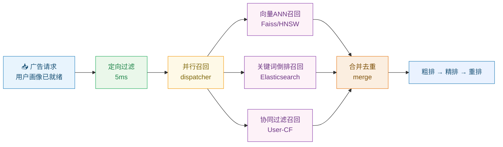
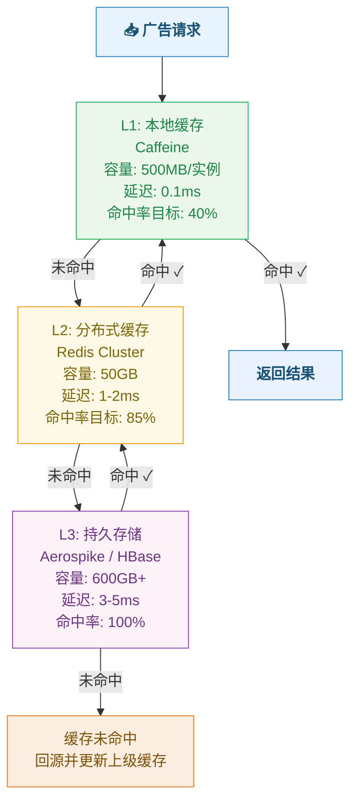
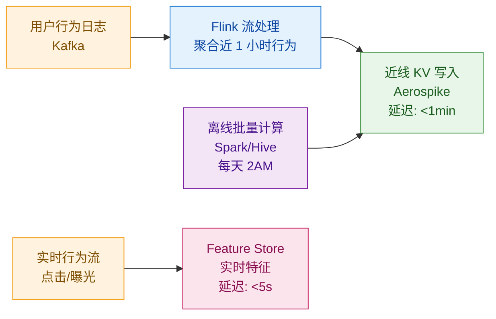
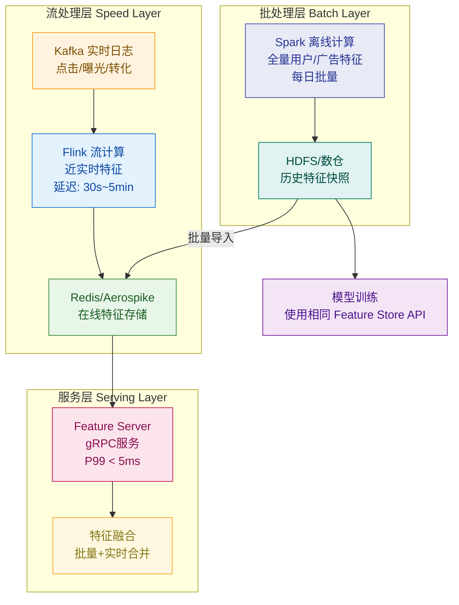
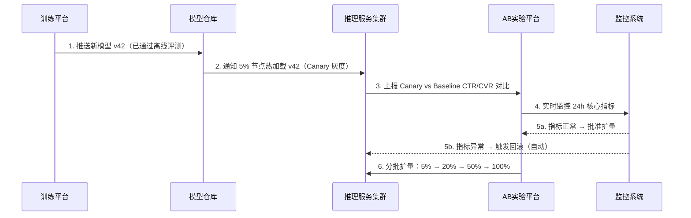
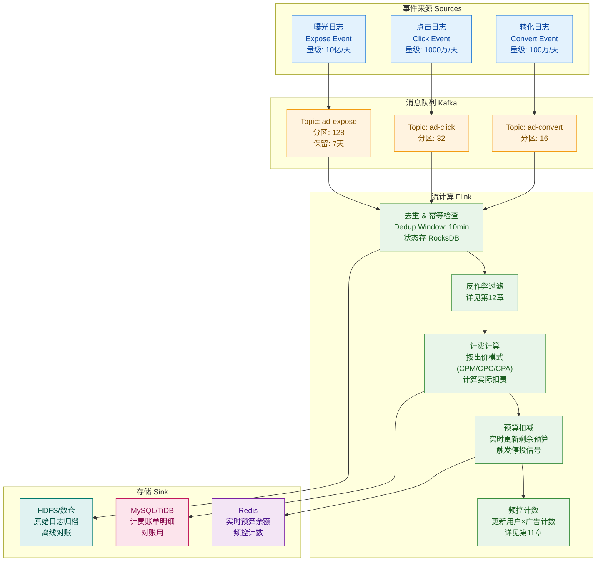
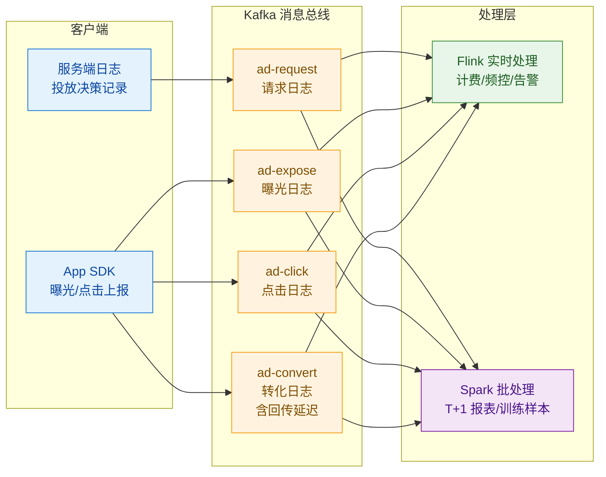
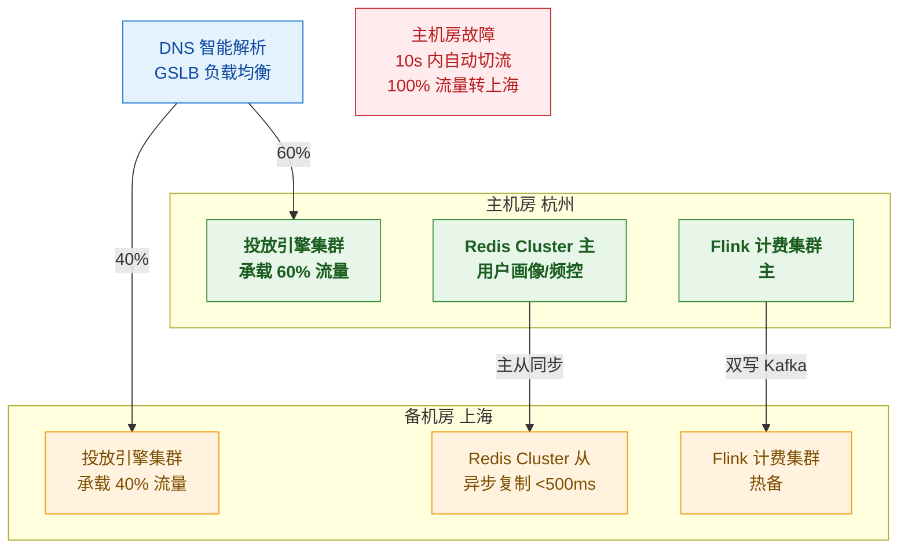

# 第 14 章 · 工程架构与高并发实战

> **所属系列**：《广告投放系统设计 · 全景教程》第四部分 · 工程收口
> **上一章**：[第 13 章 · 归因与回传](./13-归因与回传.md)
> **下一章**：[第 15 章 · 全链路串讲](./15-全链路串讲.md)

---

## 本章导读

前 13 章分别深入了广告系统的各个功能模块：召回（第 5 章）、排序（第 6–7 章）、出价（第 8–10 章）、预算频控（第 11 章）、反作弊（第 12 章）、归因回传（第 13 章）。每一章都在描述"这个功能应该做什么"，但很少集中回答：

> **这些功能，如何在 100 毫秒的延迟预算、百万级 QPS 的流量压力下同时跑通？**

这就是本章的使命——**工程总收口**。

本章以「悦读 App」（日活 5000 万）晚高峰场景为主线，「轻氧奶茶」投放链路为实例，从以下维度将前面各章的工程约束统一收口：

- **容量估算**：QPS、存储、带宽的量化推导
- **低延迟优化**：并行、缓存、异步、降级
- **用户画像存储**：亿级用户毫秒级 lookup
- **特征平台**：训练-服务一致性、Lambda/Kappa 架构
- **模型服务**：在线推理、热更新、AB 分流
- **流式计费 Pipeline**：幂等去重、exactly-once、防超投
- **A/B 实验平台**：分层分流、统计显著性
- **监控可观测性**：全链路追踪、异常报警
- **高可用**：限流、熔断、降级、多机房容灾

> 注：本章涉及的算法细节（如 pCTR 预估）见第 7 章，预算控制见第 11 章，归因逻辑见第 13 章，全链路串讲见第 15 章。

---

## 14.1 高并发挑战与容量估算

### 14.1.1 流量特征

广告投放系统面临的并发压力，在互联网后端服务中属于最极端的一类。以「悦读 App」为例：

| 指标 | 数值 | 说明 |
|------|------|------|
| 日活用户 (DAU) | 5000 万 | |
| 每日广告请求量 | 约 15 亿次 | 平均每用户 30 次/天（信息流刷屏） |
| 平日均峰值 QPS | 约 17,000 | 15亿 / 86400s |
| 晚高峰倍数 | 约 6× | 20:00–22:00 集中 |
| **晚高峰 QPS** | **~100,000** | 约 10 万 QPS |
| **极端促销峰值** | **~1,000,000** | 双11/春节，需弹性扩容 10× |

> 百万 QPS（Queries Per Second）并非持续基线，而是"设计上限"。核心服务需按此设计容量，边界服务可按 10 万 QPS + 弹性伸缩设计。

### 14.1.2 延迟预算拆解

单次广告请求总延迟预算约 **100 ms**（详见第 3 章），其中投放引擎内部大约有 **80 ms**。每个子模块的延迟分配如下：

```
总请求链路 100ms
├── 网络往返 (用户→CDN→机房)          10ms
└── 投放引擎内部                       90ms
    ├── 请求解析 & 用户画像 lookup      5ms   ← 需要毫秒级 KV
    ├── 定向过滤 (多路并行)             5ms
    ├── 召回 (多路并行)                15ms  ← 详见第5章
    ├── 粗排                          10ms  ← 详见第6章
    ├── 特征拉取 (并行)                 5ms
    ├── 精排 (CTR/CVR预估)            20ms  ← 详见第7章
    ├── 重排 & 拍卖                    10ms  ← 详见第8章
    ├── 计费 & 频控写入 (异步)          5ms   ← 本章重点
    └── 响应序列化 & 返回               5ms
```

**关键约束**：频控、画像查询等依赖外部存储的步骤，**必须在 5–10 ms 内完成单次查询**，因此对存储系统的 P99 延迟有严苛要求。

### 14.1.3 容量估算示例

#### QPS 估算

$$
\text{QPS}_{\text{peak}} = \text{DAU} \times \frac{\text{人均日请求数}}{\text{日秒数}} \times \text{峰值系数}
$$

$$
= 5 \times 10^7 \times \frac{30}{86400} \times 6 \approx 10^5 \text{ QPS}
$$

考虑 3 倍安全冗余，**单机房目标规格：30 万 QPS**，双机房主备部署。

#### 存储估算

| 数据类型 | 单条大小 | 总量 | 存储规模 | 说明 |
|---------|---------|------|---------|------|
| 用户画像 | 2 KB | 3 亿用户 | **600 GB** | 兴趣标签、行为序列等 |
| 广告索引 | 1 KB/条 | 1000 万广告 | **10 GB** | 定向条件倒排 |
| 广告创意 | 200 KB | 500 万创意 | **1 TB** | 图片/视频存 CDN，元数据 5 MB |
| 特征缓存 | 500 B | 1亿特征 | **50 GB** | Redis 热数据层 |
| 频控计数 | 32 B | 3亿用户×100广告 | **960 GB** | Redis Cluster |
| 曝光日志 | 500 B/条 | 15亿/天 | **750 GB/天** | Kafka + HDFS |

#### 带宽估算

$$
\text{带宽} = \text{QPS}_{\text{peak}} \times \text{响应大小平均值}
$$

$$
= 10^5 \times 10 \text{ KB} = 10^9 \text{ B/s} = \textbf{8 Gbps}
$$

> 单次响应包含 3 条广告创意的元数据（图片 URL、标题、描述），约 10 KB，图片本体走 CDN 不占投放服务带宽。

---

## 14.2 低延迟优化策略

在 80 ms 的引擎内部延迟预算下，每一毫秒都要精打细算。以下逐项展开工程实践。

### 14.2.1 服务拆分与并行化

**多路召回并行**（详见第 5 章）：定向过滤后，向量召回、关键词召回、协同过滤召回三路同步发起，取合集：



**特征并行拉取**：精排前，用户实时特征、广告静态特征、上下文特征三路并行从 Feature Store 拉取，目标 P99 < 5 ms。

```python
# 特征并行拉取示例（Python async）
async def fetch_features(user_id: str, ad_ids: List[str], context: Context) -> Features:
    user_feat, ad_feats, ctx_feat = await asyncio.gather(
        feature_store.get_user_features(user_id),   # 用户实时特征
        feature_store.get_ad_features(ad_ids),       # 广告静态特征
        feature_store.get_context_features(context), # 上下文特征（时段、地域）
    )
    return merge_features(user_feat, ad_feats, ctx_feat)
```

### 14.2.2 计算优化：模型量化与向量化

**模型量化（Model Quantization）**：将 FP32 参数压缩为 INT8，推理速度提升 2–4×，精度损失 < 0.5% AUC（详见第 7 章）。

**知识蒸馏（Knowledge Distillation）**：用大模型（Teacher）训练小模型（Student），学生模型参数量压缩 10×，精度损失 < 1%。

**SIMD 向量化**：对特征 embedding 的点积运算，编译器开 AVX2/AVX-512 指令集，吞吐提升 4–8×。

**GPU 批推理**：将 100 ms 内积累的多个用户请求打包成 batch（批大小 32–128），GPU 并行推理，单 GPU 每秒可处理约 2 万次精排请求。

### 14.2.3 异步化与批处理

对于**非关键路径**的操作（计费写入、日志采集、频控更新），采用异步化处理，避免阻塞主请求链路：

```
关键路径（同步）：召回 → 排序 → 拍卖 → 返回创意
非关键路径（异步）：
  ├── 发送曝光日志到 Kafka（fire-and-forget，< 1ms）
  ├── 更新频控计数（Redis pipeline，< 1ms，允许最终一致）
  └── 计费扣减（Kafka → Flink，允许秒级延迟）
```

### 14.2.4 超时降级（Timeout Fallback）

每个子模块设置严格超时阈值，超时则降级（Degradation）而非失败：

```java
/**
 * 超时降级示例：精排服务超时时降级为粗排分数
 * 核心思路：超时不等于请求失败，而是用低精度结果兜底
 */
public List<ScoredAd> rankWithFallback(
        List<Ad> candidates,
        FeatureContext ctx,
        long timeoutMs) {

    CompletableFuture<List<ScoredAd>> precisionRankFuture =
        CompletableFuture.supplyAsync(
            () -> precisionRanker.rank(candidates, ctx),  // 精排：DNN模型
            rankingExecutor  // 专用线程池，隔离防止故障扩散
        );

    try {
        // 等待精排结果，最多 timeoutMs（通常 20ms）
        return precisionRankFuture.get(timeoutMs, TimeUnit.MILLISECONDS);

    } catch (TimeoutException e) {
        // 超时降级：取消精排，用粗排分数（线性模型，已提前计算）
        precisionRankFuture.cancel(true);
        log.warn("PrecisionRank timeout after {}ms, fallback to coarse rank", timeoutMs);
        metrics.increment("ranking.fallback.timeout");
        return coarseRanker.rankFromCache(candidates, ctx); // 粗排缓存结果

    } catch (ExecutionException e) {
        // 精排服务异常降级
        log.error("PrecisionRank failed, fallback", e.getCause());
        metrics.increment("ranking.fallback.error");
        return coarseRanker.rankFromCache(candidates, ctx);
    }
}
```

| 子模块 | 超时阈值 | 降级策略 |
|-------|---------|---------|
| 用户画像 lookup | 5 ms | 使用上次请求缓存或默认画像 |
| 召回（向量 ANN） | 15 ms | 只用关键词召回兜底 |
| 精排（DNN 推理） | 20 ms | 降级为粗排线性模型分数 |
| 频控查询 | 3 ms | 降级为不限频（允许短暂超投） |
| 反作弊检测 | 5 ms | 降级为放行（后置异步审核） |

### 14.2.5 边缘计算与就近访问

- **边缘节点（Edge Node）**：在用户接入层（POP 点）缓存高频广告创意，减少跨机房延迟。
- **地域亲和调度（Geo-Affinity）**：用户请求优先路由到同城机房，跨城路由仅在本城容量不足时触发。
- **CDN 预取**：根据计划排期，提前将轻氧奶茶的创意图片推送到 CDN 边缘节点，曝光时直接命中 CDN，P99 < 50 ms。

---

## 14.3 缓存体系

缓存是低延迟的核心武器。广告系统采用**三级缓存**体系，从近到远依次为：本地内存缓存 → 分布式缓存 → 持久存储。

### 14.3.1 三级缓存架构



### 14.3.2 各层缓存的缓存对象与策略

| 缓存层 | 实现 | 典型缓存对象 | TTL | 淘汰策略 |
|-------|------|------------|-----|---------|
| L1 本地 | Caffeine (JVM堆外) | 热门广告创意元数据、频控计数本地副本 | 30s | LRU + Size-Based |
| L2 分布式 | Redis Cluster | 用户画像标签、广告索引片段、特征向量 | 5min | LFU |
| L3 持久 | Aerospike | 全量用户画像、广告全量索引 | 永久（主动失效） | 空间触发 LRU |

**总体命中率**：

$$
\text{命中率}_{\text{综合}} = 1 - (1 - r_{L1}) \times (1 - r_{L2}) \times (1 - r_{L3})
$$

$$
= 1 - (1 - 0.40) \times (1 - 0.85) \times (1 - 1.0) = 100\%
$$

实际因缓存失效窗口，综合命中率约 **97%**，平均访问延迟约：

$$
\bar{t} = r_{L1} \times 0.1 + (1-r_{L1}) \times r_{L2} \times 1.5 + (1-r_{L1})(1-r_{L2}) \times r_{L3} \times 4
$$

$$
= 0.4 \times 0.1 + 0.6 \times 0.85 \times 1.5 + 0.6 \times 0.15 \times 4 \approx \textbf{1.2 ms}
$$

### 14.3.3 多级缓存读取代码

```java
/**
 * 多级缓存读取器：L1(本地Caffeine) → L2(Redis) → L3(Aerospike持久存储)
 * 设计原则：
 *   1. 每次 miss 都回填上级缓存（防止缓存穿透积累）
 *   2. L1 用 Caffeine，零序列化开销
 *   3. 回源时带超时，超时返回空（调用方走降级逻辑）
 */
public class MultiLevelCache<K, V> {

    private final Cache<K, V> l1Cache;           // Caffeine，本地堆内/堆外
    private final RedisTemplate<K, V> l2Cache;   // Redis Cluster
    private final AerospikeClient l3Storage;     // Aerospike，持久化 KV

    private final String namespace;              // Aerospike 命名空间
    private final Duration l2Ttl;                // Redis TTL
    private final Duration l1Ttl;                // 本地缓存 TTL

    /**
     * 读取用户画像（三级降级读）
     * @param key 用户ID或广告ID
     * @return Optional.empty() 表示全部未命中（调用方应降级）
     */
    public Optional<V> get(K key) {

        // --- L1: 本地缓存（命中率约40%，延迟 ~0.1ms）---
        V l1Result = l1Cache.getIfPresent(key);
        if (l1Result != null) {
            metrics.increment("cache.l1.hit");
            return Optional.of(l1Result);
        }
        metrics.increment("cache.l1.miss");

        // --- L2: Redis Cluster（命中率约85%，延迟 ~1-2ms）---
        V l2Result = null;
        try {
            l2Result = l2Cache.opsForValue().get(key);
        } catch (RedisException e) {
            // Redis 故障不阻断请求，直接穿透到 L3
            log.warn("Redis get failed for key={}, falling through to L3", key, e);
            metrics.increment("cache.l2.error");
        }

        if (l2Result != null) {
            metrics.increment("cache.l2.hit");
            // 回填 L1（异步，不阻塞当前请求）
            l1Cache.put(key, l2Result);
            return Optional.of(l2Result);
        }
        metrics.increment("cache.l2.miss");

        // --- L3: Aerospike（持久存储，延迟 ~3-5ms）---
        V l3Result = null;
        try {
            Record record = l3Storage.get(
                new Policy(),
                new Key(namespace, "user_profile", key.toString())
            );
            if (record != null) {
                l3Result = deserialize(record.getMap("data"));
            }
        } catch (AerospikeException e) {
            log.error("Aerospike get failed for key={}", key, e);
            metrics.increment("cache.l3.error");
            return Optional.empty(); // 全链路故障，调用方降级
        }

        if (l3Result != null) {
            metrics.increment("cache.l3.hit");
            // 回填 L2 和 L1（异步回填，避免阻塞）
            final V finalResult = l3Result;
            CompletableFuture.runAsync(() -> {
                l2Cache.opsForValue().set(key, finalResult, l2Ttl);
                l1Cache.put(key, finalResult);
            }, backfillExecutor);
            return Optional.of(l3Result);
        }

        metrics.increment("cache.l3.miss");
        return Optional.empty(); // 真实未命中（新用户或数据尚未同步）
    }

    /**
     * 缓存失效：广告审核通过、画像更新时调用
     * 采用 Lazy Invalidation：先删 L2，L1 等待 TTL 自然过期
     * （L1 TTL=30s，可接受短暂的不一致窗口）
     */
    public void invalidate(K key) {
        l2Cache.delete(key);
        l1Cache.invalidate(key);  // 同时清本地，确保本实例立即刷新
    }
}
```

### 14.3.4 热点广告缓存与缓存一致性

**热点广告（Hot Ad）**：轻氧奶茶等预算充足的广告主，其广告在晚高峰期间可能出现在数十万次请求中。对这类广告，在 L1 中额外维护一个**热点名单（Hot List）**，采用永久驻留（Pin）策略，不参与 LRU 淘汰。

**缓存一致性问题**：

| 场景 | 问题 | 解决方案 |
|-----|------|---------|
| 广告状态变更（暂停/下线） | L1 缓存有效期内投放了被暂停的广告 | 广告状态变更发送 Pub/Sub 消息，所有实例订阅后立即 invalidate |
| 预算耗尽 | 缓存中的广告预算已耗尽但未及时更新 | 预算耗尽信号走高优先级通道（< 100ms 通知），详见第 11 章 |
| 用户画像更新 | 用户兴趣标签改变但缓存未刷新 | 接受最终一致性，TTL=5min；实时行为（最近 5 分钟）走实时特征 |

---

## 14.4 用户画像存储（User Profile Store）

### 14.4.1 核心需求

用户画像存储（User Profile Store，UPS）是广告系统中**访问最频繁、延迟要求最严苛**的存储组件：

- **规模**：3 亿全量用户（含长期不活跃）
- **访问模式**：单次 lookup 必须返回该用户**所有标签**，不能分批查询（多次 RPC 延迟不可接受）
- **延迟**：P99 < 5 ms（含网络）
- **QPS**：峰值 30 万，平均 3 万
- **数据内容**：兴趣标签（200–500 个）、行为序列（近 30 天）、人口属性、设备信息

### 14.4.2 存储选型对比

| 存储系统 | 延迟 P99 | 吞吐（单节点） | 存储容量 | 运维复杂度 | 是否推荐 |
|---------|---------|--------------|---------|----------|---------|
| **Redis（内存）** | 1–2 ms | 10万 QPS | 受内存限制，<256GB | 低 | ⚠️ 容量不足，3亿用户×2KB=600GB，超过单集群上限 |
| **Aerospike（混合）** | 1–3 ms | 50万 QPS | TB级（Flash+内存索引） | 中 | ✅ **推荐：索引在内存，数据在SSD，TCO最优** |
| **HBase** | 5–20 ms | 5万 QPS | PB级 | 高（Hadoop生态） | ❌ 延迟偏高，不满足 <5ms 要求 |
| **TiKV / TiDB** | 5–15 ms | 5万 QPS | TB级 | 中高 | ❌ P99 偏高 |
| **自研 KV（字节/阿里方案）** | 0.5–2 ms | 100万+ | 可扩展 | 极高 | ⚠️ 大厂自研，中小规模不划算 |
| **Cassandra** | 3–10 ms | 10万 QPS | PB级 | 中 | ⚠️ 可选，但 P99 有时抖动 |

**推荐选型**：**Aerospike**（中等规模）或 **Redis Cluster + 压缩**（预算充足时）。

Aerospike 的核心优势：
- **混合存储模型**：索引（主键哈希）常驻内存，数据存 SSD，充分发挥 SSD 的高 IOPS
- **单行全字段读取**：一次 namespace get 返回用户所有 bin（列），无需多次 scan
- **TCO 优化**：相比全内存 Redis，成本降低 5–10 倍

### 14.4.3 数据建模：一用户一记录宽行模型

```
// Aerospike Schema 设计
// Namespace: "user_profile"
// Set: "main"
// Key: user_id (String, e.g., "u_123456789")

// Record（一个用户一行，所有信息一次 get 返回）
{
  // === 人口属性 (Demographics) ===
  "age_group":     "25-34",           // 年龄段
  "gender":        "M",               // 性别
  "city":          "hangzhou",        // 城市（拼音，节省空间）
  "city_tier":     2,                 // 城市等级（1-5）
  "device_type":   "ios",             // 设备类型

  // === 兴趣标签 (Interest Tags) ===
  // 压缩编码：用 int16 ID 列表替代字符串标签，节省 10× 空间
  // 解码表存 Redis，TTL=1天（标签体系变化慢）
  "interest_tags": [1024, 2048, 3072, 512, 4096, ...],  // ~200个，约 400B

  // === 行为序列 (Behavior Sequence) ===
  // 近 30 天点击广告 ID 列表（按时间倒序），用于协同过滤召回
  // 每条 8B（int64），200条 = 1.6KB
  "click_seq":     [ad_id_1, ad_id_2, ...],    // 点击序列
  "expose_seq":    [ad_id_x, ad_id_y, ...],    // 曝光序列（去重后）
  "convert_seq":   [ad_id_a, ...],             // 转化序列

  // === 实时特征引用 (Realtime Feature Keys) ===
  // 不直接存实时特征值（变化太快），而是存 Feature Store 的 key
  // 在线服务拿到 key 后异步从 Feature Store 拉取
  "realtime_feat_key": "uf:u_123456789:v3",   // 用户实时特征版本引用

  // === 广告主定向标签 (Advertiser Segments) ===
  // DMP 导入的第三方标签，如"奶茶消费人群"
  "dmp_segments":  [80001, 80002, 80015],      // DMP segment ID 列表

  // === 元数据 ===
  "last_active_ts":  1717300000,    // 最近活跃时间戳（UNIX秒）
  "profile_version": 42,           // 画像版本号（用于特征一致性校验）
  "update_ts":       1717300100    // 最近更新时间戳
}

// 单用户记录大小估算：
//   人口属性: ~50B
//   兴趣标签(200个int16): ~400B
//   行为序列(200个int64): ~1600B
//   DMP标签(50个int32): ~200B
//   元数据: ~50B
//   总计: ~2.3KB（压缩后约 1.5KB）
//
// 3亿用户 × 1.5KB = 450GB（Aerospike SSD），索引约 30GB（内存）
// TCO vs 纯内存Redis(600GB): 节省约 85%
```

### 14.4.4 画像更新 Pipeline

用户画像由离线批量更新（每天）+ 近线流式更新（每 15 分钟）+ 实时特征（Feature Store 提供）三层组成：



---

## 14.5 特征平台（Feature Store）

### 14.5.1 训练-服务一致性问题（Train-Serving Skew）

训练-服务偏差（Train-Serving Skew）是工程实践中最难排查的问题之一：

> **现象**：离线 AUC 很高，但上线后 CTR 提升不显著，甚至下降。

**根本原因**：训练时用的特征（基于历史日志拼出的训练样本）和在线服务时实时拉取的特征，在**数值、时效、计算逻辑**上存在差异。

常见偏差类型：

| 偏差类型 | 训练时 | 服务时 | 解决方案 |
|---------|-------|-------|---------|
| 特征值不一致 | 昨天的点击率 | 实时点击率 | 用同一套计算逻辑的 Feature Store |
| 时区差异 | UTC 时间特征 | 本地时区 | 统一用 UTC，上层换算 |
| 缺失值处理 | 填充 -1 | 未填充（0） | 统一缺失值规范 |
| 特征版本漂移 | v1 特征 | v2 特征（新增列） | 特征版本管理 + 回溯重跑 |

### 14.5.2 Lambda 架构特征平台



**Kappa 架构替代方案**：如果历史数据可以重放（Kafka 保留足够长时间），可以用单一 Flink 流同时处理实时和历史回溯，简化架构。但需要 Kafka 保留 30 天数据（成本高），适合数据规模较小的场景。

### 14.5.3 特征版本管理与回溯

```python
# 特征版本化访问示例
class FeatureStore:
    def get_user_features(self, user_id: str, version: str = "latest") -> dict:
        """
        version: 特征版本号（如 "v3"），训练时锁定版本，确保一致性
        latest: 在线服务使用最新版
        """
        feature_key = f"uf:{user_id}:{version}"
        features = self.redis.hgetall(feature_key)

        if not features and version == "latest":
            # 最新版本不存在，降级到上一稳定版
            features = self.redis.hgetall(f"uf:{user_id}:v{self.stable_version}")
            self.metrics.increment("feature.version.fallback")

        return self._decode_features(features)

    def get_features_for_training(self, user_id: str, timestamp: int) -> dict:
        """
        训练样本拼接：根据样本发生时间戳，获取当时时刻的历史特征快照
        避免使用"未来特征"（数据穿越问题）
        """
        # 从 HDFS 历史快照读取（按天分区）
        date_partition = datetime.fromtimestamp(timestamp).strftime("%Y%m%d")
        return self.hdfs_reader.read(
            f"/features/user/{date_partition}/{user_id}"
        )
```

---

## 14.6 模型服务（Model Serving）

### 14.6.1 推理服务架构

广告系统的在线推理（Inference）需要同时满足：高吞吐、低延迟、支持模型热更新。

主流推理框架对比：

| 框架 | 适用模型 | 延迟 | 热更新 | 硬件支持 |
|-----|---------|------|-------|---------|
| **TF Serving** | TensorFlow | 5–20ms | ✅ 版本管理 | CPU/GPU |
| **Triton Inference Server** | TF/PyTorch/ONNX | 3–15ms | ✅ 模型仓库 | CPU/GPU/TensorRT |
| **TorchServe** | PyTorch | 5–20ms | ✅ | CPU/GPU |
| **自研轻量推理（C++/Go）** | 简单DNN/线性模型 | 0.5–5ms | 手动热加载 | CPU |
| **ONNX Runtime** | 通用 | 2–10ms | ✅ | CPU/GPU |

**推荐架构**：精排复杂模型用 **Triton + TensorRT**（INT8量化，GPU批推理）；粗排轻量模型用**自研 C++ 推理引擎**（直接嵌入进程，零 RPC 开销）。

### 14.6.2 模型热更新与灰度发布



**Shadow 流量（影子流量）**：在正式灰度前，将线上 1% 流量的请求同时发给新旧两个模型，比较输出分布，**不影响线上结果**，仅用于模型行为验证。

```python
class ModelRouter:
    def score(self, features: Features, request_id: str) -> float:
        """
        模型路由：根据实验配置决定用哪个模型版本
        支持 Canary、Shadow、AB 分流
        """
        experiment = ab_platform.get_experiment(request_id, "ranking_model")

        if experiment.type == "shadow":
            # Shadow 流量：两个模型都跑，只返回主模型结果
            main_score = self.model_v41.predict(features)
            shadow_score = self.model_v42.predict(features)
            # 异步记录 shadow 结果用于对比分析
            async_logger.log({"shadow_diff": shadow_score - main_score})
            return main_score

        elif experiment.type == "canary":
            # Canary：5% 用 v42，95% 用 v41
            model = self.model_v42 if experiment.in_treatment else self.model_v41
            return model.predict(features)

        else:
            return self.model_v41.predict(features)
```

---

## 14.7 流式计费 Pipeline（重点）

### 14.7.1 整体架构

计费系统是广告系统中**可靠性要求最高**的模块。每一次曝光、点击、转化都关系到广告主的真实花费，必须做到：
- **不重计**：同一次曝光绝不计费两次
- **不漏计**：每次真实消耗都必须被计到
- **不超投**：预算耗尽时必须立即停投



### 14.7.2 幂等去重（Idempotent Deduplication）

**问题根源**：网络重传、客户端重试、日志服务重放等场景都可能导致同一事件被重复发送。

**解决方案**：为每个事件分配全局唯一 `event_id`（`{设备ID}_{时间戳}_{随机}_{序号}`），在 Flink 中用滑动窗口+状态去重：

```java
/**
 * Flink 计费幂等去重 + 计费处理（伪代码）
 *
 * 核心思路：
 * 1. 每个事件有全局唯一 event_id
 * 2. 在 Flink 状态中记录已处理的 event_id（RocksDB，持久化）
 * 3. 去重窗口 10 分钟（超过 10 分钟的重复视为无效延迟事件）
 * 4. 幂等写入 MySQL（用 event_id 做唯一索引，INSERT IGNORE）
 * 5. 预算扣减使用 Redis Lua 脚本保证原子性
 */
public class BillingDeduplicateFunction
        extends KeyedProcessFunction<String, AdEvent, BillingRecord> {

    // Flink 状态：已处理的 event_id 集合（RocksDB 后端，支持故障恢复）
    private MapState<String, Long> processedEventIds;  // eventId -> processTimestamp

    // 去重时间窗口：10 分钟（毫秒）
    private static final long DEDUP_WINDOW_MS = 10 * 60 * 1000L;

    @Override
    public void open(Configuration config) {
        // 状态 TTL：超过去重窗口的 event_id 自动清理，防止状态无限膨胀
        StateTtlConfig ttlConfig = StateTtlConfig
            .newBuilder(Time.minutes(10))
            .setUpdateType(StateTtlConfig.UpdateType.OnCreateAndWrite)
            .cleanupInRocksdbCompactFilter(1000)
            .build();

        MapStateDescriptor<String, Long> descriptor = new MapStateDescriptor<>(
            "processed-event-ids", Types.STRING, Types.LONG);
        descriptor.enableTimeToLive(ttlConfig);
        processedEventIds = getRuntimeContext().getMapState(descriptor);
    }

    @Override
    public void processElement(
            AdEvent event,
            Context ctx,
            Collector<BillingRecord> out) throws Exception {

        String eventId = event.getEventId();
        long now = System.currentTimeMillis();

        // === 步骤1：幂等检查 ===
        if (processedEventIds.contains(eventId)) {
            // 重复事件，直接丢弃（幂等性保证）
            metrics.increment("billing.dedup.duplicate");
            return;
        }

        // === 步骤2：延迟事件检查 ===
        long eventTs = event.getTimestamp();
        if (now - eventTs > DEDUP_WINDOW_MS) {
            // 超过去重窗口的极端延迟事件，走离线对账流程
            metrics.increment("billing.dedup.late_event");
            lateEventSink.send(event); // 发到 late_events topic，离线处理
            return;
        }

        // === 步骤3：反作弊过滤（详见第12章）===
        if (fraudDetector.isFraud(event)) {
            metrics.increment("billing.dedup.fraud");
            return;
        }

        // === 步骤4：标记为已处理 ===
        processedEventIds.put(eventId, now);

        // === 步骤5：计费金额计算 ===
        BillingRecord billing = calculateBilling(event);

        // === 步骤6：预算扣减（原子操作，防超投）===
        boolean budgetOk = deductBudget(
            event.getAdPlanId(),
            billing.getCost(),
            event.getDailyBudget()
        );

        if (!budgetOk) {
            // 预算耗尽：触发停投信号，当前计费记录仍然记录（已真实消耗）
            metrics.increment("billing.budget.exhausted");
            stopDelivery(event.getAdPlanId()); // 发停投信号到投放引擎
        }

        // === 步骤7：输出计费记录 ===
        out.collect(billing);
    }

    /**
     * 计费金额计算：根据出价模式（CPM/CPC/CPA）计算实际扣费
     * 详见第9章出价模式说明
     */
    private BillingRecord calculateBilling(AdEvent event) {
        BillingRecord.Builder builder = BillingRecord.newBuilder()
            .setEventId(event.getEventId())
            .setAdPlanId(event.getAdPlanId())
            .setAdId(event.getAdId())
            .setUserId(event.getUserId())
            .setEventType(event.getEventType())
            .setEventTs(event.getTimestamp());

        switch (event.getBidMode()) {
            case CPM:  // 千次曝光计费
                // 实际 CPM 按竞价结算价（second-price），而非出价
                double cpmCost = event.getClearingPrice() / 1000.0; // 每次曝光费用
                builder.setCost(cpmCost);
                break;

            case CPC:  // 点击计费：仅 click 事件计费，expose 事件不计费
                if (event.getEventType() == EventType.CLICK) {
                    builder.setCost(event.getClearingPrice());
                } else {
                    builder.setCost(0.0); // 曝光不扣费
                }
                break;

            case CPA:  // 转化计费：仅转化事件计费
                if (event.getEventType() == EventType.CONVERT) {
                    builder.setCost(event.getTargetCpa());
                } else {
                    builder.setCost(0.0);
                }
                break;
        }

        return builder.build();
    }

    /**
     * 预算原子扣减：使用 Redis Lua 脚本，保证 CAS（Compare-And-Subtract）原子性
     * 防止超投（Over-delivery）核心逻辑
     *
     * Lua 脚本逻辑：
     *   if remaining_budget >= cost then
     *       remaining_budget -= cost
     *       return 1  (扣减成功)
     *   else
     *       return 0  (预算不足)
     *   end
     */
    private boolean deductBudget(String adPlanId, double cost, double dailyBudget) {
        String budgetKey = "budget:daily:" + adPlanId;
        // 初始化（如果不存在）并扣减
        Long result = redisClient.eval(
            DEDUCT_BUDGET_LUA_SCRIPT,
            List.of(budgetKey),
            List.of(
                String.valueOf((long)(cost * 1000)), // 转为整数分，避免浮点误差
                String.valueOf((long)(dailyBudget * 1000)),
                String.valueOf(86400)  // TTL: 1天
            )
        );
        return result != null && result == 1L;
    }
}
```

### 14.7.3 Exactly-Once 语义保障

Flink 的 **Checkpoint + 两阶段提交（2PC）** 机制保证 Exactly-Once：

1. **Flink Checkpoint**：每 30 秒对全部算子状态（包括去重 MapState）做快照，持久化到 HDFS/S3
2. **Kafka Source**：Checkpoint 时提交 offset，故障恢复时从上次 offset 继续消费（不丢消息）
3. **MySQL Sink**：通过幂等写入（`INSERT IGNORE INTO billing ... WHERE event_id = ?`）保证重放时不重复写入
4. **Redis Sink**：Lua 脚本 CAS 操作，天然幂等

### 14.7.4 对账（Reconciliation）与防超投

**实时对账**（近线，5 分钟级）：
- Flink 聚合每 5 分钟的计费总额，与广告主账户余额对比
- 误差超过 0.1% 触发告警

**离线对账**（T+1）：
- 将 Flink 计费结果与原始 Kafka 日志（HDFS 归档）重新聚合对比
- 发现不一致的批次触发人工核查

**防超投机制**（详见第 11 章）：

```
预算控制三道防线：
1. 投放引擎内预算检查（< 1ms）：从 Redis 读取实时余额，余额 < 0 时不出价
2. Flink 实时计费（< 5s）：消耗到达时实际扣减，发停投信号
3. 离线兜底（T+1）：发现超投，从广告主账户追扣，系统侧赔付差额
```

---

## 14.8 数据流水线与训练样本拼接

### 14.8.1 日志采集与分层

广告系统产生多类日志，各自有不同的延迟和处理需求：



### 14.8.2 曝光-点击-转化 Join（样本拼接）

训练 CTR/CVR 模型需要将三类日志拼接成样本（详见第 7 章）：

```
样本结构: (曝光记录) LEFT JOIN (点击记录) LEFT JOIN (转化记录)

关键挑战：
1. 时间窗口不对齐：曝光→点击 可能延迟 30min，曝光→转化 可能延迟 1-3天
2. 延迟反馈（Delayed Feedback）：转化归因窗口 7-30 天（详见第13章）
3. 负样本采样：曝光未点击的负样本量巨大（CTR~5%），需按比例下采样
```

**Flink 窗口 Join 方案**（近线，用于快速训练迭代）：

```java
// 曝光流 Join 点击流（允许 1 小时窗口内的延迟）
exposeStream
    .keyBy(e -> e.getAdRequestId())
    .intervalJoin(clickStream.keyBy(c -> c.getAdRequestId()))
    .between(Time.minutes(-5), Time.hours(1)) // 允许点击在曝光后 1 小时内到达
    .process(new SampleJoinFunction())
    .addSink(new TrainingSampleSink());
```

**Spark 批量 Join 方案**（T+1，用于转化样本）：
- 等待 48 小时后（覆盖 90% 的延迟转化），批量 Join 全量曝光、点击、转化日志
- 用于训练转化率（CVR）模型和归因报告

---

## 14.9 A/B 实验平台

### 14.9.1 分层正交实验设计

广告系统中同时进行的实验可能有数十个（召回策略实验、排序模型实验、出价策略实验等），需要保证实验间互不干扰：

**分层正交（Orthogonal Layering）**：每一层处理不同的决策维度，同一用户在不同层中的分流相互独立：

```
实验层（Layer）设计：
┌────────────────────────────────────────────────────────┐
│ Layer 1: 召回策略层（召回算法实验）                       │
│   桶 1-50: 控制组(向量召回v1)  桶51-100: 实验组(v2+CF)  │
├────────────────────────────────────────────────────────┤
│ Layer 2: 排序模型层（精排模型实验）                       │
│   桶 1-80: 控制组(模型v41)     桶81-100: 实验组(v42)    │
├────────────────────────────────────────────────────────┤
│ Layer 3: 出价策略层（出价算法实验）                       │
│   桶 1-90: 控制组(CPA自动出价) 桶91-100: 实验组(新策略)  │
└────────────────────────────────────────────────────────┘

同一用户 u_123456：
  Layer1 桶号 = hash(u_123456 + "layer1") % 100 = 73 → 实验组
  Layer2 桶号 = hash(u_123456 + "layer2") % 100 = 45 → 控制组
  Layer3 桶号 = hash(u_123456 + "layer3") % 100 = 92 → 实验组
```

**关键约束**：同一层内每个桶对应唯一实验组，不同层的实验不互相影响（正交性）。

### 14.9.2 实验指标与统计显著性

广告实验的核心指标：

| 指标 | 含义 | 计算方式 | 显著性阈值 |
|-----|------|---------|----------|
| CTR | 点击率 | 点击数 / 曝光数 | p < 0.05 |
| CVR | 转化率 | 转化数 / 点击数 | p < 0.05 |
| eCPM | 有效千次曝光收益 | 总收入 / 曝光数 × 1000 | — |
| CPAc | 实际获客成本 | 总花费 / 转化数 | p < 0.05 |
| 填充率 | 有广告填充的请求比例 | 有广告请求数 / 总请求数 | — |

**统计显著性**：

$$
z = \frac{\bar{X}_{\text{treatment}} - \bar{X}_{\text{control}}}{\sqrt{\frac{s_1^2}{n_1} + \frac{s_2^2}{n_2}}}
$$

当 $|z| > 1.96$（双侧检验，$\alpha = 0.05$）时，认为实验效果显著。

**实验周期**：通常需要 **7 天以上**（覆盖完整的周期性效应，如工作日/周末差异）。

### 14.9.3 流量打标与追踪

每次广告请求在分流时打上实验标签（详见第 3 章），随日志流传播：

```json
{
  "request_id": "req_abcd1234",
  "user_id": "u_123456789",
  "experiments": {
    "layer1_recall": {"exp_id": "exp_recall_v2", "bucket": 73, "group": "treatment"},
    "layer2_ranking": {"exp_id": "exp_rank_v42", "bucket": 45, "group": "control"},
    "layer3_bidding": {"exp_id": "exp_bid_new", "bucket": 92, "group": "treatment"}
  }
}
```

---

## 14.10 监控、告警与可观测性

### 14.10.1 核心指标 Dashboard

广告系统监控分为**业务指标**和**系统指标**两层：

**业务指标（Business Metrics）**：

| 指标 | 正常范围 | 告警阈值 | 说明 |
|-----|---------|---------|------|
| 广告填充率 | 85%–95% | < 80% | 有广告的请求比例 |
| 系统 CTR | 5%–8% | 突变 > 30% | 整体点击率 |
| 系统 CPAc | 20–35元 | > 50元 | 轻氧奶茶目标 ≤ 30元 |
| 消耗进度（预算利用率） | 按 pacing 曲线 | 偏差 > 20% | 详见第11章 |
| 竞赢率（Win Rate） | 30%–60% | < 20% | 竞价成功比例 |

**系统指标（System Metrics）**：

| 指标 | 正常范围 | 告警阈值 |
|-----|---------|---------|
| 投放引擎 P99 延迟 | < 80ms | > 100ms |
| 用户画像 lookup P99 | < 5ms | > 10ms |
| 精排推理 P99 | < 20ms | > 30ms |
| Kafka 消费延迟 | < 1s | > 30s |
| Redis 内存使用率 | < 80% | > 90% |
| 计费 Pipeline 处理延迟 | < 10s | > 60s |

### 14.10.2 全链路追踪（Distributed Tracing）

每个请求携带唯一 `trace_id`，在所有服务间传递，用于端到端的延迟分析：

```
trace_id: t_req_abcd1234
├── [0ms]   ADServer.receive          2ms
├── [2ms]   UserProfileService.get    4ms  ← 用户画像 lookup
├── [6ms]   RecallService.recall      15ms (并行)
│   ├── [6ms]  VectorRecall.search    12ms
│   ├── [6ms]  KeywordRecall.search   8ms
│   └── [6ms]  CFRecall.retrieve      10ms
├── [21ms]  CoarseRanker.rank         8ms
├── [29ms]  FeatureService.fetch      5ms  (并行拉取)
├── [34ms]  PrecisionRanker.rank      18ms ← 精排，DNN推理
├── [52ms]  ReRanker.rerank           8ms  ← 重排+拍卖
├── [60ms]  BillingLogger.log         1ms  (异步)
└── [61ms]  Response.serialize        3ms
总计: 64ms P50（远低于100ms预算）
```

**工具选型**：Jaeger / Zipkin（开源）或云厂商 APM（阿里云 ARMS、腾讯云 APM）。

### 14.10.3 异常告警机制

**指标突变检测**：使用 3-sigma 规则检测异常：

$$
\text{异常} = |x_t - \bar{x}| > 3\sigma
$$

其中 $\bar{x}$ 和 $\sigma$ 基于过去 7 天同时段的历史数据计算（消除周期性波动）。

**告警分级**：

| 级别 | 触发条件 | 响应方式 | 响应时限 |
|-----|---------|---------|---------|
| P0 (紧急) | 计费系统停止/大规模超投 | 电话+短信+自动熔断 | 5 分钟内 |
| P1 (严重) | 投放引擎 P99 > 200ms | 短信+钉钉 | 15 分钟内 |
| P2 (警告) | CTR 异常突变 > 30% | 钉钉 | 30 分钟内 |
| P3 (提醒) | 缓存命中率下降 | 工单系统 | 次日处理 |

---

## 14.11 高可用架构

### 14.11.1 限流（Rate Limiting）

```java
/**
 * 投放引擎入口限流：令牌桶算法（Token Bucket）
 * 保护下游服务不被突发流量压垮
 */
public class AdServerRateLimiter {

    // 令牌桶：最大 QPS = 150,000（预留 50% 余量）
    private final RateLimiter rateLimiter = RateLimiter.create(150_000);

    public AdResponse handle(AdRequest request) {
        // 尝试获取令牌，最多等待 1ms（超时直接降级）
        if (!rateLimiter.tryAcquire(1, 1, TimeUnit.MILLISECONDS)) {
            metrics.increment("ratelimit.rejected");
            // 限流降级：返回缓存中的兜底广告（保填充率）
            return fallbackResponse(request);
        }
        return processRequest(request);
    }
}
```

**漏斗式限流**：在各子服务也设置独立限流，防止单个服务成为瓶颈：

```
入口限流 150k QPS → 召回服务 100k QPS → 特征服务 100k QPS → 推理服务 50k QPS
```

### 14.11.2 熔断（Circuit Breaker）

使用 Resilience4j 或 Sentinel 对关键依赖服务实施熔断：

```java
// 对精排推理服务的熔断配置
CircuitBreakerConfig config = CircuitBreakerConfig.custom()
    .failureRateThreshold(50)           // 失败率 > 50% 时熔断
    .slowCallDurationThreshold(Duration.ofMillis(20)) // 超过 20ms 算慢调用
    .slowCallRateThreshold(50)          // 慢调用率 > 50% 时熔断
    .waitDurationInOpenState(Duration.ofSeconds(10))  // 熔断 10s 后半开
    .permittedNumberOfCallsInHalfOpenState(5)         // 半开时放行 5 个探测
    .build();
```

熔断后降级策略：
- 精排服务熔断 → 降级为粗排分数
- 特征服务熔断 → 降级为历史均值特征
- 用户画像服务熔断 → 降级为通用人群画像（不定向）

### 14.11.3 多机房容灾



**关键设计**：
- **双活（Active-Active）**：两个机房同时承载流量（60/40 分流），而非冷备
- **数据一致性**：Redis 主从复制，允许 < 500ms 的最终一致性（频控计数轻微误差可接受）
- **自动切流**：通过 GSLB（全局负载均衡）+ 健康检查，10 秒内完成故障切流
- **计费双写**：Kafka 事件由两个机房各自的 Flink 集群处理，通过 event_id 去重防止双计

---

## 14.12 实战：晚高峰百万 QPS 保障轻氧奶茶投放

将本章所有机制串联，回到「悦读 App」晚高峰（20:00–22:00）场景：

### 场景描述

- **时间**：晚 20:30，悦读 App 晚高峰
- **流量**：实时 QPS 达到 85,000（接近百万 QPS 阈值）
- **广告主**：轻氧奶茶，今日预算 10 万元，已消耗 7.8 万，剩余 2.2 万
- **用户**：小明，打开信息流第 3 屏

### 完整链路追踪

```
[T=0ms]   悦读 App 收到小明的广告请求
           ↓ 流量达到限流阈值 80% → 限流器允许通行（令牌充足）

[T=1ms]   用户画像 Lookup
           → L1 缓存未命中（小明刚活跃，本实例未缓存）
           → L2 Redis 命中 ✓（小明1小时内活跃过）
           → 返回画像：[茶饮重度用户, 25-34岁, 杭州, 女性]
           → 回填 L1（异步）

[T=3ms]   A/B实验分流
           → Layer1(召回): 实验组(向量+CF联合召回)
           → Layer2(精排): 控制组(模型v41)

[T=4ms]   并行召回（3路同时发起，等最慢的完成）
           ├── 向量 ANN 召回（Faiss）: 12ms → 返回 800 条（含轻氧奶茶）
           ├── 关键词召回（ES）: 8ms → 返回 600 条
           └── CF 召回（协同过滤）: 10ms → 返回 400 条
           → 合并去重: 1500 条候选

[T=16ms]  粗排（线性模型，CPU推理）: 8ms → 筛选 150 条

[T=24ms]  特征并行拉取（3路并行，5ms）
           ├── 用户实时特征（Feature Store, Redis）: 4ms
           ├── 广告静态特征（L2 缓存命中）: 2ms
           └── 上下文特征（本地计算）: 1ms

[T=29ms]  精排（模型v41, TensorRT推理）
           → 150条 → GPU批推理 → 18ms
           → 轻氧奶茶 pCTR=0.085, pCVR=0.032
           → eCPM = 0.085 × 0.032 × 目标CPA(30) × 1000 = 81.6元

[T=47ms]  频控检查（Redis, 2ms）
           → 小明今日已曝光轻氧奶茶 2次（限 5次）✓ 通过

[T=49ms]  反作弊检查（5ms）
           → 小明设备指纹正常 ✓ 通过

[T=54ms]  重排 & 拍卖（8ms）
           → 轻氧奶茶 eCPM=81.6元 竞胜，结算价=次高价+0.01元=72.3元

[T=62ms]  预算检查
           → 轻氧奶茶剩余预算 22,000元 ÷ 已过时段
           → 当前每次曝光费用=72.3/1000=0.0723元（CPM模式）
           → 余额充足 ✓

[T=63ms]  组装响应（3ms）
           → 创意图片已预热到 CDN（轻氧奶茶活跃计划，CDN命中率99%）

[T=66ms]  返回创意给悦读 App
           ↓ 异步（不阻塞响应）

[T=67ms]  异步计费日志写入 Kafka（1ms）

[T=67ms]  异步频控计数 +1（Redis pipeline，1ms）

[约T+3s]  Flink 消费 Kafka
           → 幂等检查（未重复）
           → 计费金额：0.0723元
           → Redis原子扣减：22000 - 0.0723 ≈ 21999.93 元
           → 写入计费账单 MySQL
```

### 防止超投的关键时刻

假设轻氧奶茶剩余预算仅剩 **100 元**时：

```
[Flink 检测到预算余额 < 100元]
  → 发送停投信号到 Kafka Topic: ad-pause-signals
  → 投放引擎订阅此 Topic，延迟 < 5s 生效
  → 生效后：轻氧奶茶在投放引擎预算检查时直接拦截，不再出价

最坏情况下的超投量（5秒窗口内）：
  并发曝光量 = 85,000 QPS × 5s × 轻氧奶茶竞胜率(5%) = 21,250次
  超投金额 = 21,250 × 0.0723元 ≈ 1,536元（超出100元目标约15倍）

解决方案：
  当预算余额 < 预测5秒消耗量时（动态阈值），提前发停投信号
  预测5秒消耗 = 当前每秒消耗速率 × 5
  → 提前停投时机：余额 < 1,600元 时发出停投信号
  → 最终超投 < 100元（< 0.1%）
```

---

## 本章小结

本章是工程层面的总收口，将前 13 章各模块的技术约束统一在高并发架构框架下：

| 核心主题 | 关键结论 | 工程手段 |
|---------|---------|---------|
| **容量估算** | 悦读 App 晚高峰 10 万 QPS，按百万 QPS 设计 | 3倍冗余、弹性伸缩 |
| **延迟预算** | 单请求 80ms 分解为 10+ 子步骤 | 并行化、超时降级 |
| **缓存体系** | 三级缓存综合延迟 ~1.2ms，命中率 97% | L1 Caffeine + L2 Redis + L3 Aerospike |
| **用户画像** | 3 亿用户，P99 < 5ms，一行取全部标签 | Aerospike 混合存储，TCO 最优 |
| **特征平台** | 训练-服务偏差（Skew）是最隐蔽的性能杀手 | 统一 Feature Store API，版本管理 |
| **模型服务** | 热更新 + 灰度 + Shadow 流量验证 | Triton + TensorRT + Canary 发布 |
| **流式计费** | 幂等去重 + Exactly-Once + 防超投 | Flink + RocksDB 状态 + Redis Lua |
| **A/B 实验** | 分层正交，互不干扰 | 桶 hash + 流量打标 |
| **可观测性** | 业务指标 + 系统指标 + 全链路追踪 | Jaeger + Prometheus + Grafana |
| **高可用** | 限流→熔断→降级→多机房三级保障 | Resilience4j + GSLB 双活 |

**工程师的核心修炼**：广告系统的工程复杂度在于**精度与性能的持续博弈**。更复杂的模型、更多的特征、更精确的出价——每一个精度提升都以延迟和资源为代价。本章的所有优化手段，本质都是在**延迟预算的约束下最大化系统表达能力**。

下一章（第 15 章），我们将从用户小明第一次打开悦读 App 开始，全链路串讲整个广告系统的完整闭环。

---

## 参考来源

1. **Flink Exactly-Once Semantics**  
   https://flink.apache.org/2018/02/28/an-overview-of-end-to-end-exactly-once-processing-in-apache-flink/

2. **Aerospike Architecture Overview**  
   https://aerospike.com/docs/architecture/index.html

3. **Meta's Feature Store (FBLearner)**  
   Dueben, A. et al. (2017). *Introducing FBLearner Flow: Facebook's AI backbone*. Meta Engineering Blog.  
   https://engineering.fb.com/2016/05/09/core-infra/introducing-fblearner-flow-facebook-s-ai-backbone/

4. **Google's Feature Store (Vertex AI Feature Store)**  
   https://cloud.google.com/vertex-ai/docs/featurestore/overview

5. **NVIDIA Triton Inference Server**  
   https://docs.nvidia.com/deeplearning/triton-inference-server/user-guide/docs/index.html

6. **LinkedIn's Experiment System (Epsilon)**  
   Tang, D., et al. (2010). *Overlapping Experiment Infrastructure: More, Better, Faster Experimentation*. KDD 2010.  
   https://dl.acm.org/doi/10.1145/1835804.1835810

7. **Resilience4j Circuit Breaker**  
   https://resilience4j.readme.io/docs/circuitbreaker

8. **Apache Kafka Design**  
   https://kafka.apache.org/documentation/#design

9. **Caffeine Cache (Ben Manes)**  
   https://github.com/ben-manes/caffeine

10. **Twitter's Twissandra / Cassandra @ Twitter**  
    https://blog.twitter.com/engineering/en_us/topics/infrastructure/2022/how-twitter-migrated-its-monolith-to-the-cloud

11. **字节跳动广告系统技术博客**  
    https://www.volcengine.com/docs/6348/79584

12. **Alibaba Display Advertising System (Paper)**  
    Zhou, G. et al. (2018). *Deep Interest Network for Click-Through Rate Prediction*. KDD 2018.  
    https://dl.acm.org/doi/10.1145/3219819.3219823

13. **Rate Limiting Algorithms - Token Bucket vs Leaky Bucket**  
    https://www.cloudflare.com/learning/bots/what-is-rate-limiting/

14. **Google SRE Book - Chapter 20: Load Balancing at the Frontend**  
    https://sre.google/sre-book/load-balancing-frontend/
